# Elasticsearch-06-存储引擎

## 模块概览

本文档提供存储引擎模块的全面概览，包括模块职责、架构设计、与 Lucene 的集成、事务日志、段合并等内容。

---

## 1. 模块职责

存储引擎（Engine）是 Elasticsearch 与 Apache Lucene 集成的关键层，负责所有持久化存储操作。

### 1.1 核心职责

1. **文档索引**
   - 将文档写入 Lucene 索引
   - 管理文档版本和序列号
   - 处理文档更新和删除

2. **事务日志（Translog）**
   - 记录所有写操作到事务日志
   - 保证数据持久性
   - 支持故障恢复

3. **段管理**
   - Refresh：生成新的可搜索段
   - Flush：提交段到磁盘
   - Merge：合并小段为大段

4. **版本控制**
   - 管理 LiveVersionMap
   - 实现乐观并发控制
   - 处理版本冲突

5. **软删除（Soft Deletes）**
   - 标记文档为已删除而不立即物理删除
   - 支持跨集群复制（CCR）
   - 优化恢复性能

6. **搜索支持**
   - 提供 Searcher 供查询使用
   - 管理 DirectoryReader
   - 控制搜索可见性

### 1.2 输入与输出

**输入**:

- Index/Delete/Update 操作（来自 IndexShard）
- Refresh/Flush/Merge 请求

**输出**:

- IndexWriter（Lucene 写入）
- DirectoryReader（Lucene 读取）
- Translog（事务日志）

### 1.3 依赖关系

**上游依赖**:

- Apache Lucene: 底层存储引擎
- Store: 文件系统抽象
- TranslogConfig: 事务日志配置

**下游依赖者**:

- IndexShard: 分片管理
- SearchService: 搜索服务

---

## 2. 模块架构

### 2.1 整体架构图

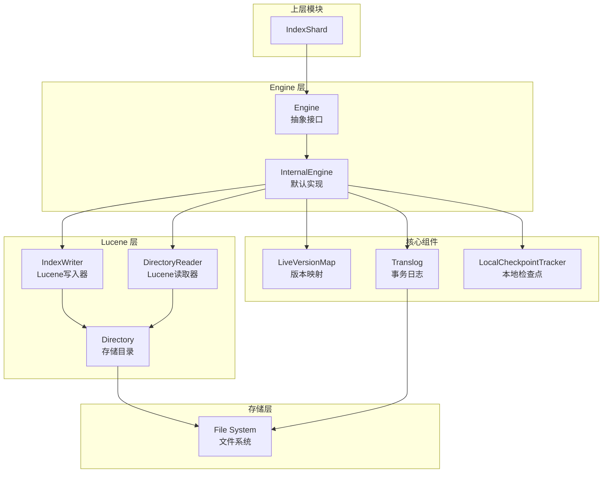

### 2.2 架构说明

#### 核心组件

**1. InternalEngine**

- 默认的 Engine 实现
- 封装 Lucene IndexWriter 和 DirectoryReader
- 管理所有写入和读取操作

**2. LiveVersionMap**

- 内存中的文档版本映射
- key: 文档 UID, value: 版本信息
- 用于实时 GET 和版本冲突检测

**3. Translog (事务日志)**

- 顺序写入的操作日志
- 保证数据持久性
- 用于故障恢复

**4. IndexWriter (Lucene)**

- Lucene 的写入器
- 管理段（Segments）
- 执行段合并（Merge）

**5. DirectoryReader (Lucene)**

- Lucene 的读取器
- 提供搜索能力
- 通过 Refresh 更新

---

## 3. 核心流程

### 3.1 文档索引流程

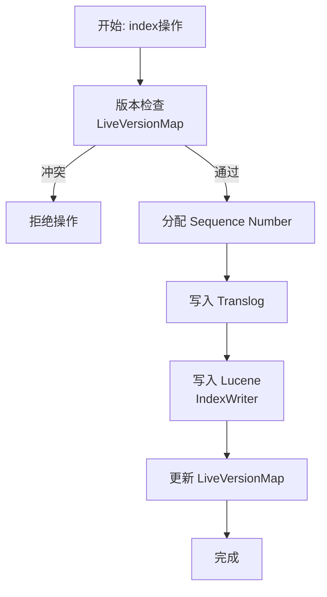

#### 关键步骤

1. **版本检查**: 检查 LiveVersionMap 中的当前版本
2. **分配序列号**: Primary 分配唯一的 seqNo
3. **写入 Translog**: 保证持久性
4. **写入 Lucene**: 通过 IndexWriter 写入
5. **更新 VersionMap**: 记录最新版本

### 3.2 Refresh 流程


**Refresh 作用**:

- 使写入的文档可被搜索
- 创建新的 Lucene 段
- 默认每 1 秒执行一次

### 3.3 Flush 流程

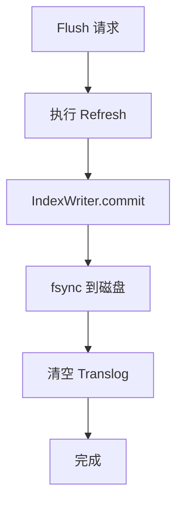

**Flush 作用**:

- 提交 Lucene 段到磁盘
- 清空事务日志
- 创建恢复点

### 3.4 Merge 流程


**Merge 作用**:

- 减少段数量
- 提升搜索性能
- 物理删除已标记删除的文档

---

## 4. 关键数据结构

### 4.1 LiveVersionMap

```java
public class LiveVersionMap {
    // UID → VersionValue 映射
    private final ConcurrentHashMap<BytesRef, VersionValue> current;

    // 旧版本归档
    private final ConcurrentHashMap<BytesRef, VersionValue> old;

    // 锁管理
    private final KeyedLock<BytesRef> keyedLock;
}
```

**VersionValue 类型**:

- `IndexVersionValue`: 索引版本
- `DeleteVersionValue`: 删除版本

### 4.2 Translog

```java
public class Translog implements Closeable {
    // 当前写入的 generation
    private TranslogWriter current;

    // 历史 generations (用于恢复)
    private final List<TranslogReader> readers;

    // 删除策略
    private final TranslogDeletionPolicy deletionPolicy;
}
```

**Operation 类型**:

- `Index`: 索引操作
- `Delete`: 删除操作
- `NoOp`: 空操作（用于 seqNo 对齐）

---

## 5. 性能优化

### 5.1 写入性能

1. **批量写入**: 使用 Bulk API
2. **Refresh 间隔**: 调整 `index.refresh_interval`
3. **Translog 刷盘**: 调整 `index.translog.durability`
4. **索引缓冲**: 调整 `indices.memory.index_buffer_size`

### 5.2 搜索性能

1. **Refresh**: 更频繁的 refresh 提升实时性
2. **Merge**: 减少段数量
3. **缓存**: 利用 QueryCache 和 FieldDataCache

### 5.3 存储优化

1. **Soft Deletes**: 减少段合并开销
2. **Force Merge**: 强制合并为单段
3. **压缩**: 使用 `best_compression` codec

---

## 6. 配置与可观测

### 6.1 关键配置

| 配置项 | 默认值 | 说明 |
|---|---|---|
| index.refresh_interval | 1s | Refresh 间隔 |
| index.translog.durability | REQUEST | 事务日志刷盘策略 |
| index.translog.sync_interval | 5s | Translog fsync 间隔 |
| index.translog.flush_threshold_size | 512mb | Flush 触发阈值 |
| index.merge.scheduler.max_thread_count | max(1, processors/2) | 合并线程数 |

### 6.2 监控指标

```bash
GET /_nodes/stats/indices

{
  "indices": {
    "indexing": {
      "index_total": 1000,
      "index_time_in_millis": 5000,
      "index_current": 2
    },
    "refresh": {
      "total": 100,
      "total_time_in_millis": 2000
    },
    "flush": {
      "total": 10,
      "total_time_in_millis": 1000
    },
    "merges": {
      "current": 1,
      "total": 50,
      "total_time_in_millis": 10000
    }
  }
}
```

---

## 相关文档

- [Elasticsearch-06-存储引擎-API](./Elasticsearch-06-存储引擎-API.md)
- [Elasticsearch-06-存储引擎-数据结构](./Elasticsearch-06-存储引擎-数据结构.md)
- [Elasticsearch-06-存储引擎-时序图](./Elasticsearch-06-存储引擎-时序图.md)

---

## API接口

本文档描述存储引擎的核心 API，主要是内部编程接口。

---

## 1. Engine 核心 API

### 1.1 index - 索引文档

#### 方法签名

```java
public IndexResult index(Index index) throws IOException
```

#### 参数说明

```java
public static class Index extends Operation {
    private final ParsedDocument doc;          // 解析后的文档
    private final long version;                // 版本号
    private final VersionType versionType;     // 版本类型
    private final long ifSeqNo;                // 条件序列号
    private final long ifPrimaryTerm;          // 条件主分片任期
    private final long autoGeneratedIdTimestamp; // 自动生成ID的时间戳
}
```

#### 返回值

```java
public static class IndexResult extends Result {
    private final boolean created;  // 是否是新建（false表示更新）
}
```

#### 核心逻辑

```java
@Override
public IndexResult index(Index index) throws IOException {
    // 1. 版本检查（LiveVersionMap）
    final IndexingStrategy plan = planIndexingAsNonPrimary(index);

    // 2. 分配序列号
    if (index.origin() == Operation.Origin.PRIMARY) {
        index = new Index(..., generateSeqNoForOperationOnPrimary(index), ...);
    }

    // 3. 写入 Translog
    Translog.Location location = translog.add(new Translog.Index(index));

    // 4. 写入 Lucene
    if (plan.useLuceneUpdateDocument) {
        indexWriter.updateDocument(new Term(IdFieldMapper.NAME, index.uid()), index.docs());
    } else {
        indexWriter.addDocument(index.docs());
    }

    // 5. 更新 LiveVersionMap
    versionMap.putIndexUnderLock(
        index.uid(),
        new IndexVersionValue(null, plan.versionForIndexing, index.seqNo(), index.primaryTerm())
    );

    return new IndexResult(plan.versionForIndexing, index.primaryTerm(), index.seqNo(), created);
}
```

---

### 1.2 delete - 删除文档

#### 方法签名

```java
public DeleteResult delete(Delete delete) throws IOException
```

#### 参数说明

```java
public static class Delete extends Operation {
    private final String id;                   // 文档ID
    private final BytesRef uid;                // 文档UID
    private final long version;                // 版本号
    private final VersionType versionType;     // 版本类型
}
```

#### 核心逻辑

```java
@Override
public DeleteResult delete(Delete delete) throws IOException {
    // 1. 版本检查
    final DeletionStrategy plan = deletionStrategyForOperation(delete);

    // 2. 分配序列号
    delete = new Delete(..., generateSeqNoForOperationOnPrimary(delete), ...);

    // 3. 写入 Translog
    translog.add(new Translog.Delete(delete));

    // 4. 写入 Lucene (软删除 Tombstone)
    ParsedDocument tombstone = ParsedDocument.deleteTombstone(delete.id());
    tombstone.updateSeqID(delete.seqNo(), delete.primaryTerm());
    indexWriter.softUpdateDocument(new Term(IdFieldMapper.NAME, delete.uid()), tombstone.docs().get(0));

    // 5. 更新 LiveVersionMap
    versionMap.putDeleteUnderLock(
        delete.uid(),
        new DeleteVersionValue(plan.versionOfDeletion, delete.seqNo(), delete.primaryTerm())
    );

    return new DeleteResult(plan.versionOfDeletion, delete.seqNo(), found);
}
```

---

### 1.3 get - 获取文档（实时GET）

#### 方法签名

```java
public GetResult get(
    Get get,
    BiFunction<String, SearcherScope, Engine.Searcher> searcherFactory
) throws EngineException
```

#### 核心逻辑

```java
public GetResult get(Get get, ...) {
    // 1. 检查 LiveVersionMap
    try (Releasable ignored = versionMap.acquireLock(get.uid())) {
        VersionValue versionValue = versionMap.getUnderLock(get.uid());

        if (versionValue != null) {
            if (versionValue.isDelete()) {
                return GetResult.NOT_EXISTS;  // 已删除
            }
            if (versionValue instanceof IndexVersionValue) {
                IndexVersionValue iv = (IndexVersionValue) versionValue;
                if (iv.getLocation() != null) {
                    // 2. 从 Translog 读取（还未刷到 Lucene）
                    return getFromTranslog(get, iv.getLocation());
                }
            }
        }
    }

    // 3. 从 Lucene 读取
    return getFromSearcher(get, searcherFactory);
}
```

---

### 1.4 refresh - 刷新搜索器

#### 方法签名

```java
public void refresh(String source) throws EngineException
```

#### 核心逻辑

```java
public void refresh(String source) throws EngineException {
    // 1. 获取最新的 Lucene Searcher
    ReferenceManager.RefreshListener refreshListener = ...;

    // 2. Refresh IndexWriter
    indexWriter.getReader();  // 或 indexWriter.commit()

    // 3. 更新 ReaderManager
    externalReaderManager.maybeRefresh();

    // 4. 清理 LiveVersionMap 中已持久化的条目
    pruneVersionMap();
}
```

**触发条件**:

- 定时触发（默认 1 秒）
- 手动调用 `POST /_refresh`
- 索引缓冲满

---

### 1.5 flush - 提交到磁盘

#### 方法签名

```java
public CommitId flush(boolean force, boolean waitIfOngoing) throws EngineException
```

#### 核心逻辑

```java
public CommitId flush(boolean force, boolean waitIfOngoing) {
    // 1. 执行 Refresh
    refresh("flush");

    // 2. 提交 Lucene
    indexWriter.commit();

    // 3. Fsync 到磁盘
    store.directory().sync();

    // 4. 创建新的 Translog Generation
    translog.rollGeneration();
    translog.trimUnreferencedReaders();

    return new CommitId(lastCommittedSegmentInfos.getId());
}
```

**触发条件**:

- Translog 大小超过阈值（默认 512MB）
- 定时触发（默认 30 分钟）
- 手动调用 `POST /_flush`

---

### 1.6 forceMerge - 强制合并

#### 方法签名

```java
public void forceMerge(
    boolean flush,
    int maxNumSegments,
    boolean onlyExpungeDeletes,
    String forceMergeUUID
) throws EngineException
```

#### 核心逻辑

```java
public void forceMerge(...) {
    // 1. 设置 MergePolicy
    if (onlyExpungeDeletes) {
        indexWriter.forceMergeDeletes();  // 仅清理删除
    } else {
        indexWriter.forceMerge(maxNumSegments);  // 合并到指定段数
    }

    // 2. 可选 Flush
    if (flush) {
        flush(true, true);
    }
}
```

**使用场景**:

- 只读索引优化（合并为1段）
- 清理已删除文档
- 减少段数量提升搜索性能

---

### 1.7 acquireSearcher - 获取搜索器

#### 方法签名

```java
public Engine.Searcher acquireSearcher(String source, SearcherScope scope)
```

#### 核心逻辑

```java
public Searcher acquireSearcher(String source, SearcherScope scope) {
    // 1. 获取 DirectoryReader
    IndexReader reader = scope == SearcherScope.EXTERNAL
        ? externalReaderManager.acquire()
        : internalReaderManager.acquire();

    // 2. 包装为 IndexSearcher
    IndexSearcher searcher = new IndexSearcher(reader);
    searcher.setQueryCache(queryCache);

    // 3. 返回 Searcher（包含 release 方法）
    return new Searcher(source, searcher, () -> releaseReader(reader));
}
```

**SearcherScope**:

- `EXTERNAL`: 用于用户查询（仅可见已 refresh 的文档）
- `INTERNAL`: 用于内部操作（可见所有文档）

---

## 2. Translog API

### 2.1 add - 添加操作

```java
public Translog.Location add(Translog.Operation operation) throws IOException
```

### 2.2 rollGeneration - 滚动 Generation

```java
public void rollGeneration() throws IOException
```

### 2.3 newSnapshot - 创建快照

```java
public Translog.Snapshot newSnapshot() throws IOException
```

---

## 3. 配置参数

### 3.1 Refresh 相关

| 参数 | 默认值 | 说明 |
|---|---|---|
| index.refresh_interval | 1s | Refresh 间隔 |
| index.max_refresh_listeners | 1000 | 最大 Refresh 监听器数量 |

### 3.2 Flush 相关

| 参数 | 默认值 | 说明 |
|---|---|---|
| index.translog.flush_threshold_size | 512mb | Translog 大小触发 Flush |
| index.translog.generation_threshold_size | 64mb | Translog generation 滚动阈值 |

### 3.3 Merge 相关

| 参数 | 默认值 | 说明 |
|---|---|---|
| index.merge.scheduler.max_thread_count | max(1, processors/2) | 合并线程数 |
| index.merge.policy.max_merged_segment | 5gb | 最大合并段大小 |

---

## 相关文档

- [Elasticsearch-06-存储引擎-概览](./Elasticsearch-06-存储引擎-概览.md)
- [Elasticsearch-06-存储引擎-数据结构](./Elasticsearch-06-存储引擎-数据结构.md)
- [Elasticsearch-06-存储引擎-时序图](./Elasticsearch-06-存储引擎-时序图.md)

---

## 数据结构

本文档详细说明存储引擎的核心数据结构。

---

## 1. Engine & InternalEngine

### 1.1 类图

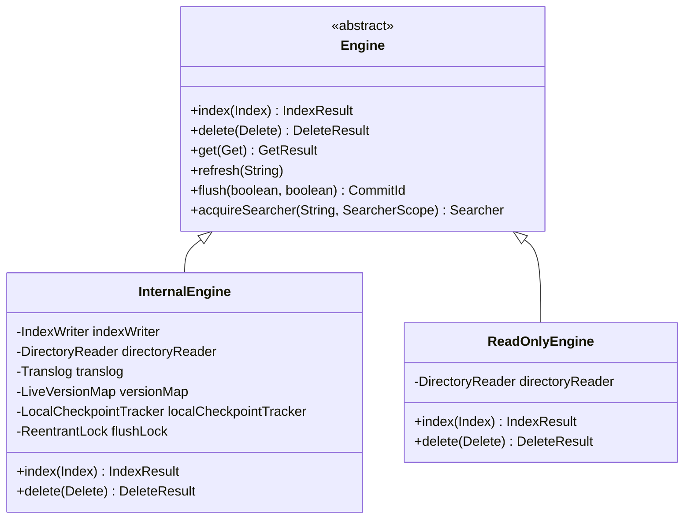

### 类说明

**Engine**: 存储引擎抽象接口
**InternalEngine**: 默认实现，支持读写
**ReadOnlyEngine**: 只读实现，用于冻结索引

---

## 2. LiveVersionMap

### 2.1 类图

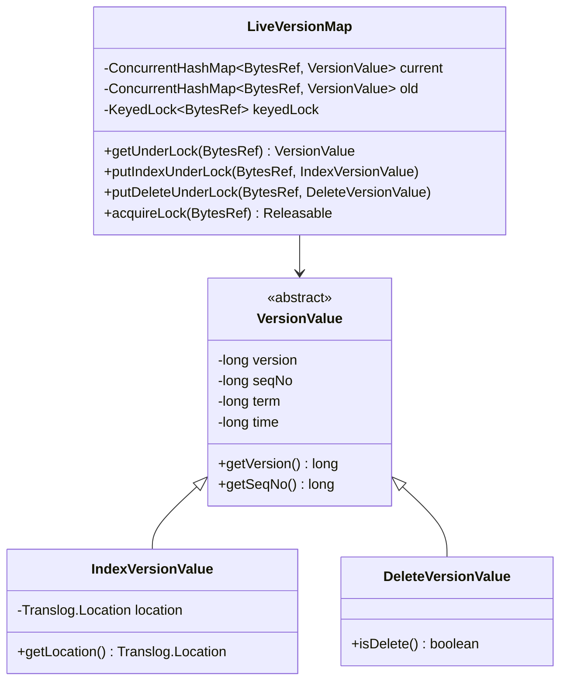

### 类说明

#### LiveVersionMap

**职责**: 内存中的文档版本映射，用于实时GET和版本冲突检测

**关键字段**:

| 字段 | 类型 | 说明 |
|---|---|---|
| current | ConcurrentHashMap | 当前活跃的版本映射 |
| old | ConcurrentHashMap | 旧的版本映射（归档）|
| keyedLock | KeyedLock | UID 级别的锁 |

**核心方法**:

```java
// 获取版本（必须持有锁）
VersionValue getUnderLock(BytesRef uid);

// 更新索引版本
void putIndexUnderLock(BytesRef uid, IndexVersionValue versionValue);

// 更新删除版本
void putDeleteUnderLock(BytesRef uid, DeleteVersionValue versionValue);

// 获取锁
Releasable acquireLock(BytesRef uid);
```

#### VersionValue

**职责**: 文档版本信息基类

**关键字段**:

- `version`: 版本号
- `seqNo`: 序列号
- `term`: 主分片任期
- `time`: 时间戳

#### IndexVersionValue

**职责**: 索引操作的版本信息

**关键字段**:

- `location`: Translog 位置（如果还未刷到 Lucene）

#### DeleteVersionValue

**职责**: 删除操作的版本信息

---

## 3. Translog

### 3.1 类图

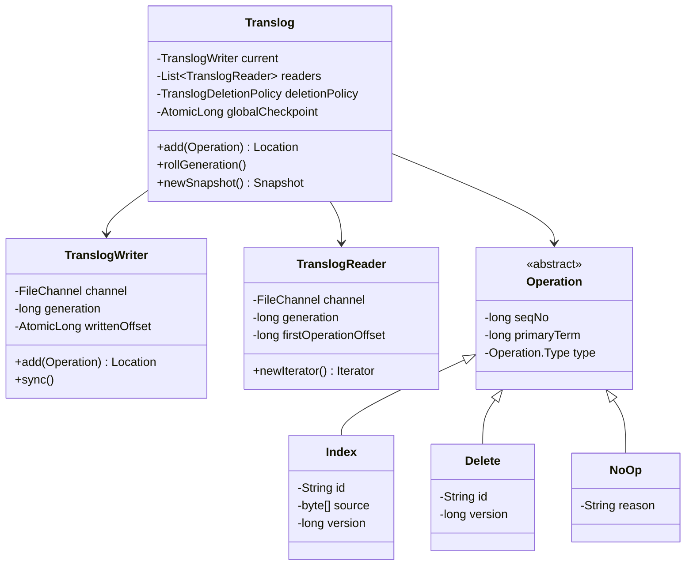

### 类说明

#### Translog

**职责**: 事务日志，保证数据持久性

**关键字段**:

| 字段 | 类型 | 说明 |
|---|---|---|
| current | TranslogWriter | 当前写入的 generation |
| readers | List<TranslogReader> | 历史 generations（用于恢复）|
| deletionPolicy | TranslogDeletionPolicy | 删除策略 |
| globalCheckpoint | AtomicLong | 全局检查点 |

**Generation 机制**:

```
Generation 0 → Generation 1 → Generation 2
     ↓              ↓              ↓
translog-1.tlog  translog-2.tlog  translog-3.tlog (current)
```

#### Operation

**操作类型**:

- `Index`: 索引操作
- `Delete`: 删除操作
- `NoOp`: 空操作（用于序列号对齐）

**字段结构**:

```java
public abstract class Operation {
    private long seqNo;         // 序列号
    private long primaryTerm;   // 主分片任期
    private Type type;          // 操作类型
}
```

---

## 4. LocalCheckpointTracker

### 4.1 类图

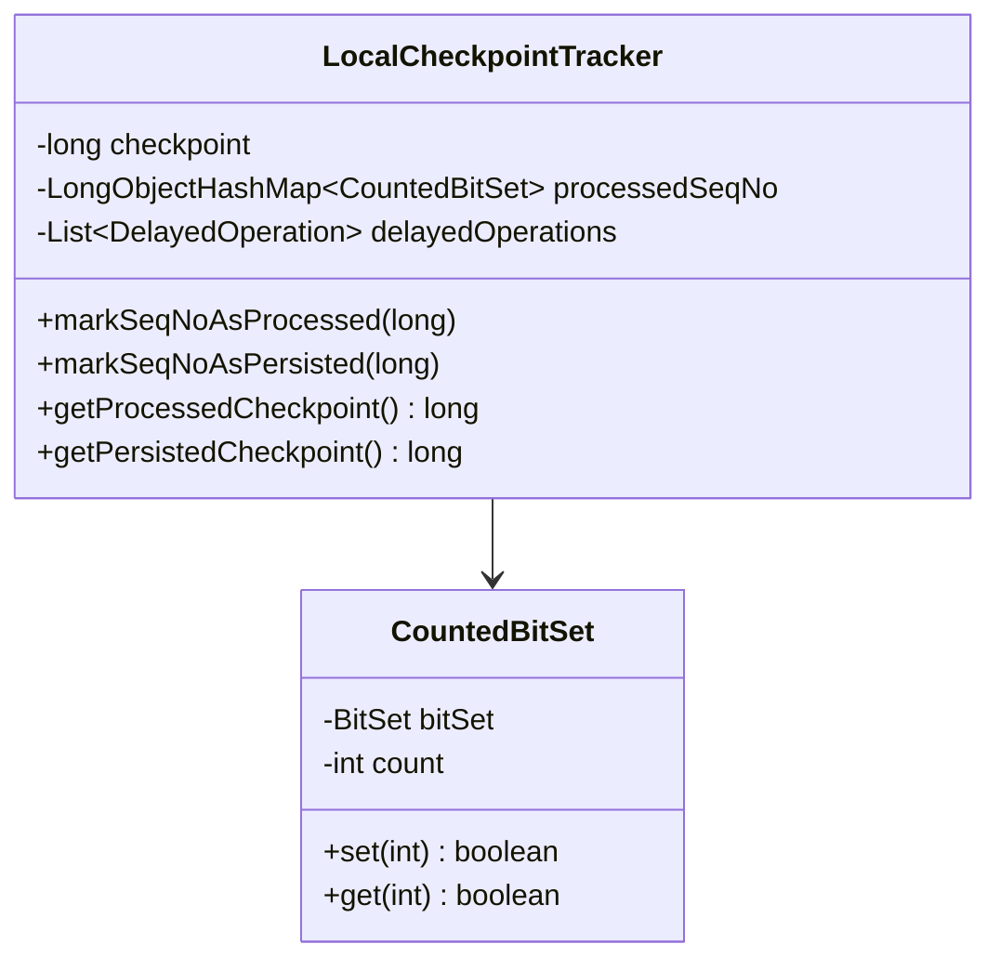

### 类说明

#### LocalCheckpointTracker

**职责**: 跟踪本地检查点，确保序列号连续

**关键概念**:

```
Processed Checkpoint: 所有 <= checkpoint 的 seqNo 都已处理
Persisted Checkpoint: 所有 <= checkpoint 的 seqNo 都已持久化
```

**核心方法**:

```java
// 标记序列号为已处理
void markSeqNoAsProcessed(long seqNo);

// 标记序列号为已持久化
void markSeqNoAsPersisted(long seqNo);

// 获取处理检查点
long getProcessedCheckpoint();

// 获取持久化检查点
long getPersistedCheckpoint();
```

**示例**:

```
已处理的 seqNo: [0, 1, 2, 3, 5, 6, 7]
                          ↑ 缺少 4
Processed Checkpoint = 3  (因为4还未处理)

当 4 被处理后:
Processed Checkpoint = 7
```

---

## 5. Lucene 相关数据结构

### 5.1 IndexWriter

```java
public class IndexWriter implements Closeable {
    // 添加文档
    long addDocument(Iterable<? extends IndexableField> doc);

    // 更新文档
    long updateDocument(Term term, Iterable<? extends IndexableField> doc);

    // 删除文档
    long deleteDocuments(Term... terms);

    // 软删除（标记而非物理删除）
    long softUpdateDocument(Term term, Iterable<? extends IndexableField> doc, Field softDeletesField);

    // 提交
    long commit();

    // 强制合并
    void forceMerge(int maxNumSegments);
}
```

### 5.2 DirectoryReader

```java
public abstract class DirectoryReader extends IndexReader {
    // 打开 Reader
    static DirectoryReader open(Directory directory);

    // 获取段信息
    SegmentInfos getSegmentInfos();

    // 刷新（获取最新 Reader）
    DirectoryReader openIfChanged(DirectoryReader oldReader);
}
```

### 5.3 SegmentInfos

```java
public final class SegmentInfos implements Cloneable {
    // 所有段的列表
    private List<SegmentCommitInfo> segments;

    // 版本号
    private long version;

    // Generation
    private long generation;
}
```

---

## 6. 数据结构关系总览

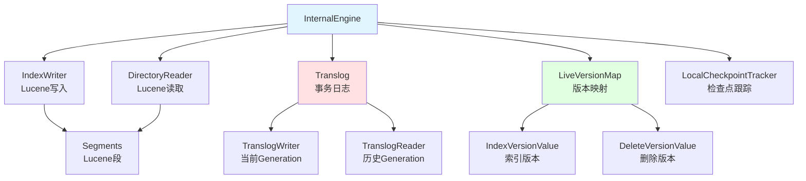

---

## 相关文档

- [Elasticsearch-06-存储引擎-概览](./Elasticsearch-06-存储引擎-概览.md)
- [Elasticsearch-06-存储引擎-API](./Elasticsearch-06-存储引擎-API.md)
- [Elasticsearch-06-存储引擎-时序图](./Elasticsearch-06-存储引擎-时序图.md)

---

## 时序图

本文档展示存储引擎核心流程的详细时序图。

---

## 1. 文档索引流程

### 1.1 完整索引时序图

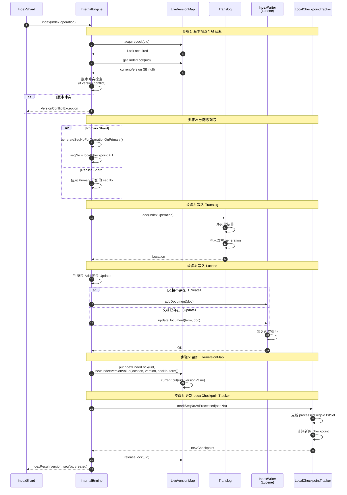

### 时序图说明

#### 关键步骤详解

**1. 版本检查（步骤1-5）**

- 获取文档级别的锁
- 从 LiveVersionMap 获取当前版本
- 根据 VersionType 检查版本冲突
- 可能的 VersionType：
  - `INTERNAL`: 内部版本（自动递增）
  - `EXTERNAL`: 外部版本（用户指定）
  - `EXTERNAL_GTE`: 外部版本（大于等于）

**2. 序列号分配（步骤6-8）**

- Primary: 生成新的 seqNo = localCheckpoint + 1
- Replica: 使用 Primary 分配的 seqNo
- seqNo 用于保证操作顺序和一致性

**3. Translog 写入（步骤9-12）**

- 序列化操作到字节数组
- 追加写入当前 generation
- 返回 Location (generation, position, size)
- 可配置同步策略：
  - `REQUEST`: 每次请求后 fsync（默认）
  - `ASYNC`: 异步 fsync（5秒间隔）

**4. Lucene 写入（步骤13-18）**

- 判断是新增还是更新
- 新增：`addDocument(doc)`
- 更新：`updateDocument(term, doc)` (先删除后添加)
- 写入 IndexWriter 的内存缓冲
- 此时文档还不可搜索（需要 Refresh）

**5. LiveVersionMap 更新（步骤19-21）**

- 记录最新的版本信息
- 包含 Translog Location（用于实时 GET）
- 后续 Refresh 后会清理已持久化的条目

**6. LocalCheckpointTracker 更新（步骤22-25）**

- 标记 seqNo 为已处理
- 更新本地检查点
- 用于跟踪复制进度

---

## 2. Refresh 流程

### 2.1 Refresh 时序图

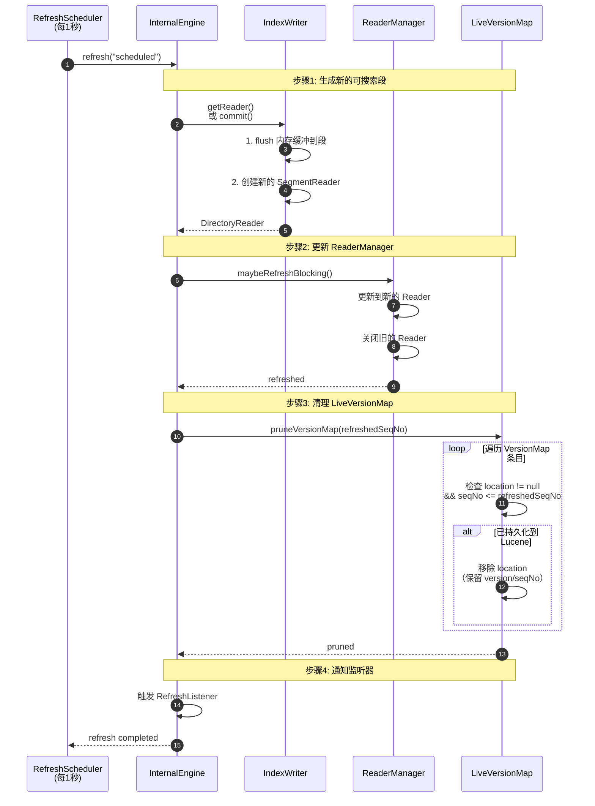

### 时序图说明

#### Refresh 的作用

**使文档可被搜索**:

- 将 IndexWriter 内存缓冲中的文档刷到新段
- 创建新的 DirectoryReader
- 新文档变为可搜索状态

**清理 LiveVersionMap**:

- 移除已持久化到 Lucene 的 Location
- 减少内存占用
- 保留版本和序列号（用于版本检查）

#### 触发条件

1. **定时触发**: `index.refresh_interval` (默认 1s)
2. **手动触发**: `POST /_refresh`
3. **索引缓冲满**: `indices.memory.index_buffer_size` 超限
4. **Flush 操作**: Flush 会先执行 Refresh

---

## 3. Flush 流程

### 3.1 Flush 时序图

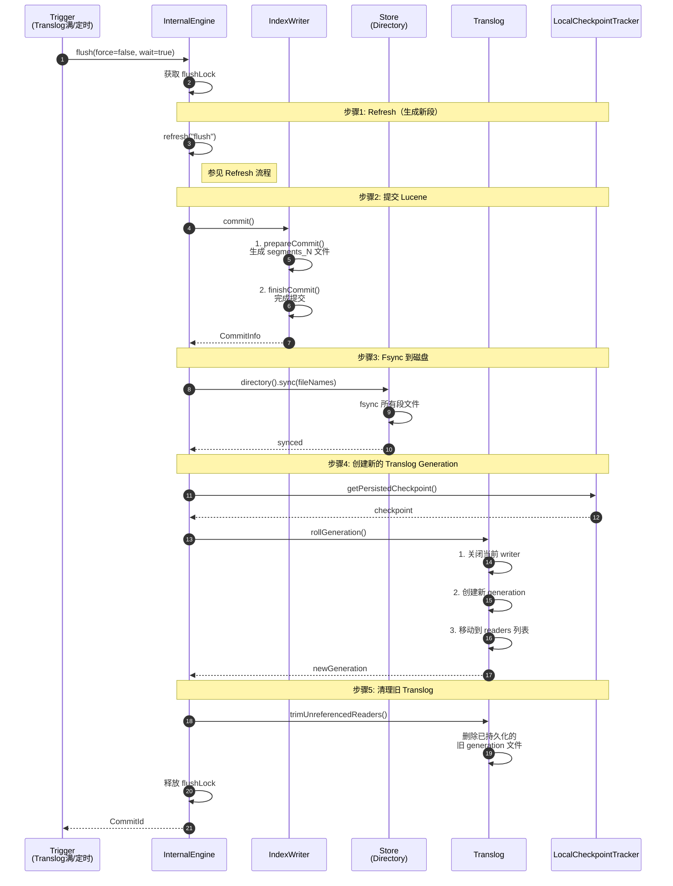

### 时序图说明

#### Flush 的作用

**持久化数据**:

- 将所有内存中的段提交到磁盘
- Fsync 确保数据真正写入物理存储
- 创建恢复点（Lucene commit point）

**清理 Translog**:

- 滚动到新的 generation
- 删除已持久化的旧 generation
- 减少恢复时间

#### 触发条件

1. **Translog 大小**: `index.translog.flush_threshold_size` (默认 512MB)
2. **定时触发**: 默认每 30 分钟
3. **手动触发**: `POST /_flush`
4. **关闭索引**: Close index 时

---

## 4. 实时 GET 流程

### 4.1 GET 时序图

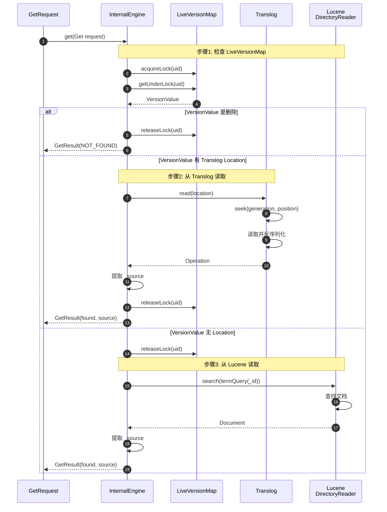

### 时序图说明

#### 实时 GET 原理

**三级查找**:

1. **LiveVersionMap**: 检查文档状态和位置
2. **Translog**: 读取还未刷到 Lucene 的文档
3. **Lucene**: 读取已持久化的文档

**实时性保证**:

- 即使文档还未 Refresh，也能通过 Translog 读取
- 避免等待 Refresh（1秒延迟）
- 保证写入后立即可读

---

## 5. Merge 流程

### 5.1 Merge 时序图

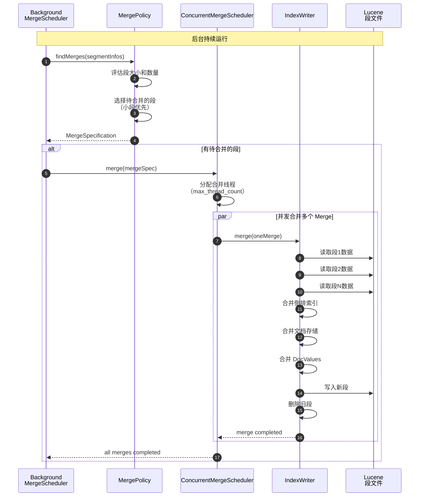

### 时序图说明

#### Merge 策略

**TieredMergePolicy (默认)**:

- 将相似大小的段合并
- 目标：减少段数量，同时避免合并过大的段
- 参数：
  - `max_merged_segment`: 最大段大小（5GB）
  - `segments_per_tier`: 每层段数量（10）

**Force Merge**:

- 手动触发：`POST /_forcemerge?max_num_segments=1`
- 用于只读索引优化
- 合并为指定数量的段

---

## 相关文档

- [Elasticsearch-06-存储引擎-概览](./Elasticsearch-06-存储引擎-概览.md)
- [Elasticsearch-06-存储引擎-API](./Elasticsearch-06-存储引擎-API.md)
- [Elasticsearch-06-存储引擎-数据结构](./Elasticsearch-06-存储引擎-数据结构.md)

---
