# Elasticsearch-07-Client模块

## 模块概览

本文档提供 Client 模块的全面概览，包括 REST 客户端、连接管理、请求构建和重试机制。

---

## 1. 模块职责

Client 模块提供与 Elasticsearch 集群通信的客户端实现，主要包括 REST 低级客户端。

### 1.1 核心职责

1. **连接管理**
   - 节点连接池
   - 连接健康检查
   - 自动重连
   - 失败节点标记

2. **请求发送**
   - HTTP 请求构建
   - 请求序列化
   - 响应反序列化
   - 同步/异步执行

3. **负载均衡**
   - 轮询选择节点
   - 节点选择器（NodeSelector）
   - 跳过失败节点
   - 重试机制

4. **错误处理**
   - 自动重试
   - 失败节点管理
   - 超时控制
   - 异常转换

### 1.2 客户端类型

**REST 低级客户端 (RestClient)**:

- 基于 Apache HttpClient
- 处理 HTTP 连接
- 不关心请求/响应格式
- 适用于所有 Elasticsearch REST API

**Java High Level REST Client (已废弃)**:

- 基于低级客户端
- 提供类型安全的 API
- 已在 8.x 废弃，推荐使用新的 Java Client

---

## 2. 模块架构

### 2.1 整体架构图

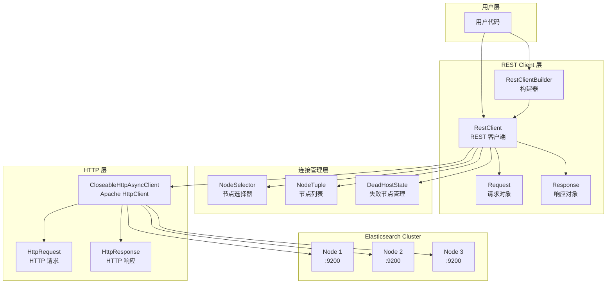

### 2.2 架构说明

#### REST Client 层

**RestClient**:

- 核心客户端类
- 管理请求生命周期
- 协调所有组件

**RestClientBuilder**:

- 建造者模式
- 配置客户端参数
- 创建 RestClient 实例

**Request/Response**:

- 封装请求和响应
- 简化 API 使用

#### 连接管理层

**NodeSelector**:

- 节点选择策略
- 支持自定义选择器
- 默认轮询策略

**NodeTuple**:

- 不可变节点列表
- 线程安全
- 支持动态更新

**DeadHostState**:

- 管理失败节点
- 失败时间记录
- 重试时间计算

---

## 3. 核心流程

### 3.1 请求发送流程

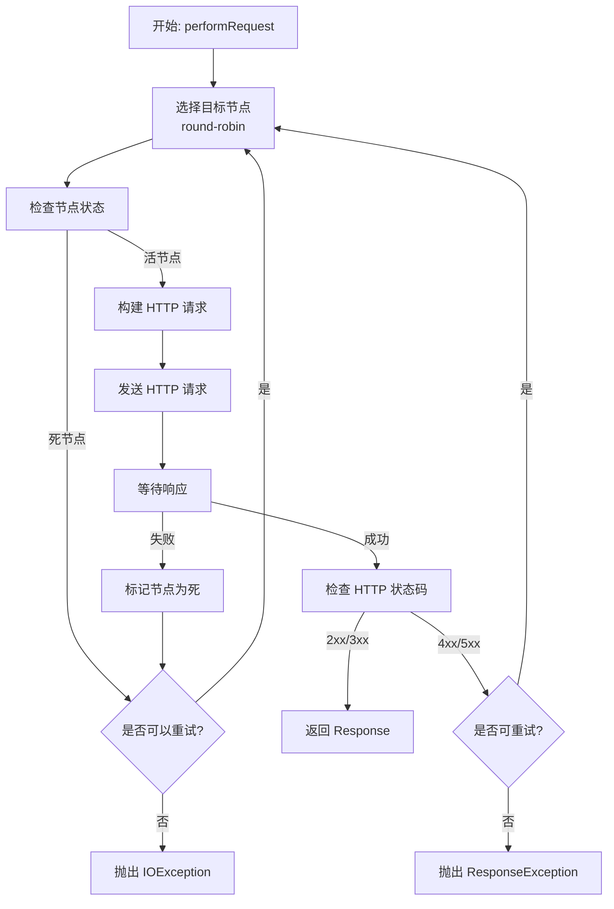

### 3.2 节点选择流程

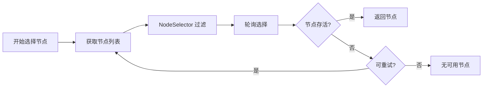

### 3.3 失败节点管理

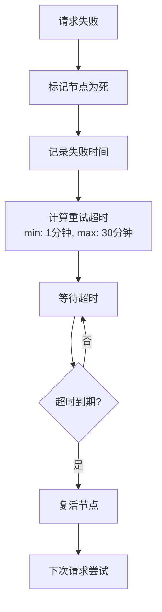

---

## 4. 关键配置

### 4.1 客户端配置

| 配置项 | 默认值 | 说明 |
|---|---|---|
| maxRetryTimeoutMillis | 30000 | 最大重试超时 |
| requestConfigCallback | - | 请求配置回调 |
| httpClientConfigCallback | - | HTTP 客户端配置回调 |
| defaultHeaders | [] | 默认请求头 |
| failureListener | - | 失败监听器 |
| nodeSelector | NodeSelector.ANY | 节点选择器 |
| strictDeprecationMode | false | 严格废弃模式 |
| compressionEnabled | false | 启用压缩 |

### 4.2 连接池配置

```java
RestClientBuilder builder = RestClient.builder(new HttpHost("localhost", 9200));

builder.setHttpClientConfigCallback(httpClientBuilder -> {
    return httpClientBuilder
        .setMaxConnTotal(100)              // 最大连接数
        .setMaxConnPerRoute(10)            // 每个路由最大连接数
        .setConnectionTimeToLive(5, TimeUnit.MINUTES);  // 连接存活时间
});
```

### 4.3 请求配置

```java
builder.setRequestConfigCallback(requestConfigBuilder -> {
    return requestConfigBuilder
        .setConnectTimeout(5000)           // 连接超时
        .setSocketTimeout(60000);          // 读取超时
});
```

---

## 5. 使用示例

### 5.1 创建客户端

```java
// 基本创建
RestClient restClient = RestClient.builder(
    new HttpHost("localhost", 9200, "http")
).build();

// 多节点
RestClient restClient = RestClient.builder(
    new HttpHost("localhost", 9200, "http"),
    new HttpHost("localhost", 9201, "http")
).build();

// 自定义配置
RestClient restClient = RestClient.builder(
    new HttpHost("localhost", 9200, "http"))
    .setDefaultHeaders(new Header[]{
        new BasicHeader("Authorization", "Bearer token")
    })
    .setMaxRetryTimeoutMillis(60000)
    .setNodeSelector(NodeSelector.SKIP_DEDICATED_MASTERS)
    .build();
```

### 5.2 同步请求

```java
// 创建请求
Request request = new Request("GET", "/_cluster/health");
request.addParameter("wait_for_status", "yellow");

// 执行请求
Response response = restClient.performRequest(request);

// 处理响应
int statusCode = response.getStatusLine().getStatusCode();
String responseBody = EntityUtils.toString(response.getEntity());
```

### 5.3 异步请求

```java
Request request = new Request("GET", "/_cluster/health");

Cancellable cancellable = restClient.performRequestAsync(
    request,
    new ResponseListener() {
        @Override
        public void onSuccess(Response response) {
            // 处理成功响应
        }

        @Override
        public void onFailure(Exception exception) {
            // 处理异常
        }
    }
);

// 可选：取消请求
// cancellable.cancel();
```

### 5.4 请求参数和请求体

```java
Request request = new Request("POST", "/my-index/_doc");

// 添加参数
request.addParameter("refresh", "true");

// 设置 JSON 请求体
request.setJsonEntity(
    "{\"field\":\"value\"}"
);

// 或使用实体
request.setEntity(new NStringEntity(
    "{\"field\":\"value\"}",
    ContentType.APPLICATION_JSON
));

Response response = restClient.performRequest(request);
```

---

## 6. 节点选择器

### 6.1 内置选择器

```java
// 选择所有节点（默认）
NodeSelector.ANY

// 跳过专用主节点
NodeSelector.SKIP_DEDICATED_MASTERS

// 跳过 Ingest 节点
NodeSelector.NOT_INGEST_ONLY_NODES
```

### 6.2 自定义选择器

```java
NodeSelector customSelector = new NodeSelector() {
    @Override
    public void select(Iterable<Node> nodes) {
        // 自定义节点选择逻辑
        // 例如：只选择本地区域的节点
        for (Node node : nodes) {
            if (node.getAttributes().get("zone").equals("local")) {
                // 保留此节点
            }
        }
    }
};

RestClient restClient = RestClient.builder(...)
    .setNodeSelector(customSelector)
    .build();
```

---

## 7. 错误处理

### 7.1 异常类型

| 异常 | 说明 | 重试 |
|---|---|---|
| IOException | 网络错误 | 是 |
| ConnectTimeoutException | 连接超时 | 是 |
| SocketTimeoutException | 读取超时 | 是 |
| ResponseException | HTTP 错误响应 | 部分 |

### 7.2 重试策略

**自动重试条件**:

- 网络错误（IOException）
- 连接超时
- 节点不可达
- HTTP 429 (Too Many Requests)
- HTTP 502/503/504 (网关错误)

**不重试条件**:

- HTTP 400 (Bad Request)
- HTTP 401/403 (认证/授权错误)
- HTTP 404 (Not Found)
- 超过最大重试时间

---

## 8. 性能优化

### 8.1 连接池优化

```java
builder.setHttpClientConfigCallback(httpClientBuilder -> {
    return httpClientBuilder
        .setMaxConnTotal(100)              // 增加连接数
        .setMaxConnPerRoute(20)            // 增加每路由连接数
        .setKeepAliveStrategy((response, context) -> 60000);  // 保持连接
});
```

### 8.2 压缩

```java
RestClient restClient = RestClient.builder(...)
    .setCompressionEnabled(true)  // 启用 gzip 压缩
    .build();
```

### 8.3 批量请求

```java
// 使用 Bulk API
Request request = new Request("POST", "/_bulk");
request.setJsonEntity(bulkBody);
```

---

## 相关文档

- [Elasticsearch-07-Client模块-API](./Elasticsearch-07-Client模块-API.md)
- [Elasticsearch-07-Client模块-数据结构](./Elasticsearch-07-Client模块-数据结构.md)
- [Elasticsearch-07-Client模块-时序图](./Elasticsearch-07-Client模块-时序图.md)

---

## API接口

本文档描述 Client 模块的核心 API。

---

## 1. RestClient API

### 1.1 performRequest - 同步请求

#### 方法签名

```java
public Response performRequest(Request request) throws IOException
```

#### 参数说明

| 参数 | 类型 | 说明 |
|---|---|---|
| request | Request | 请求对象 |

#### 返回值

```java
public class Response {
    public StatusLine getStatusLine();     // HTTP 状态行
    public HttpEntity getEntity();         // 响应体
    public Header[] getHeaders();          // 响应头
    public HttpHost getHost();             // 处理请求的节点
}
```

#### 使用示例

```java
Request request = new Request("GET", "/_cat/indices");
request.addParameter("format", "json");

try {
    Response response = restClient.performRequest(request);

    int status = response.getStatusLine().getStatusCode();
    String body = EntityUtils.toString(response.getEntity());

    System.out.println("Status: " + status);
    System.out.println("Response: " + body);
} catch (ResponseException e) {
    // HTTP 错误响应
    Response response = e.getResponse();
    int statusCode = response.getStatusLine().getStatusCode();
} catch (IOException e) {
    // 网络错误
}
```

---

### 1.2 performRequestAsync - 异步请求

#### 方法签名

```java
public Cancellable performRequestAsync(
    Request request,
    ResponseListener responseListener
)
```

#### 参数说明

| 参数 | 类型 | 说明 |
|---|---|---|
| request | Request | 请求对象 |
| responseListener | ResponseListener | 响应监听器 |

#### ResponseListener 接口

```java
public interface ResponseListener {
    void onSuccess(Response response);
    void onFailure(Exception exception);
}
```

#### 使用示例

```java
Request request = new Request("GET", "/_cluster/health");

Cancellable cancellable = restClient.performRequestAsync(
    request,
    new ResponseListener() {
        @Override
        public void onSuccess(Response response) {
            try {
                String body = EntityUtils.toString(response.getEntity());
                System.out.println("Response: " + body);
            } catch (IOException e) {
                e.printStackTrace();
            }
        }

        @Override
        public void onFailure(Exception exception) {
            System.err.println("Request failed: " + exception.getMessage());
        }
    }
);

// 可选：取消请求
// cancellable.cancel();
```

---

### 1.3 setNodes - 更新节点列表

#### 方法签名

```java
public synchronized void setNodes(Collection<Node> nodes)
```

#### 参数说明

| 参数 | 类型 | 说明 |
|---|---|---|
| nodes | Collection<Node> | 新的节点列表 |

#### 使用示例

```java
// 动态更新节点列表
List<Node> newNodes = Arrays.asList(
    new Node(new HttpHost("localhost", 9200)),
    new Node(new HttpHost("localhost", 9201)),
    new Node(new HttpHost("localhost", 9202))
);

restClient.setNodes(newNodes);
```

---

### 1.4 close - 关闭客户端

#### 方法签名

```java
@Override
public void close() throws IOException
```

#### 使用示例

```java
try (RestClient restClient = RestClient.builder(...).build()) {
    // 使用客户端
    restClient.performRequest(request);
} // 自动关闭
```

---

## 2. Request API

### 2.1 Request 构造

#### 方法签名

```java
public Request(String method, String endpoint)
```

#### 参数说明

| 参数 | 类型 | 说明 |
|---|---|---|
| method | String | HTTP 方法 (GET, POST, PUT, DELETE, HEAD) |
| endpoint | String | API 端点 (如 "/_search") |

---

### 2.2 addParameter - 添加查询参数

#### 方法签名

```java
public void addParameter(String name, String value)
```

#### 使用示例

```java
Request request = new Request("GET", "/_search");
request.addParameter("size", "10");
request.addParameter("from", "0");
request.addParameter("timeout", "5s");
```

---

### 2.3 setEntity - 设置请求体

#### 方法签名

```java
public void setEntity(HttpEntity entity)
```

#### 使用示例

```java
// 方式1：使用 NStringEntity
Request request = new Request("POST", "/my-index/_doc");
request.setEntity(new NStringEntity(
    "{\"field\":\"value\"}",
    ContentType.APPLICATION_JSON
));

// 方式2：使用 setJsonEntity (更简洁)
request.setJsonEntity("{\"field\":\"value\"}");

// 方式3：使用 ByteArrayEntity (二进制数据)
byte[] data = ...;
request.setEntity(new ByteArrayEntity(data));
```

---

### 2.4 setOptions - 设置请求选项

#### 方法签名

```java
public void setOptions(RequestOptions options)
```

#### 使用示例

```java
// 创建通用选项
RequestOptions.Builder builder = RequestOptions.DEFAULT.toBuilder();
builder.addHeader("Authorization", "Bearer token");
builder.setWarningsHandler(WarningsHandler.PERMISSIVE);
RequestOptions commonOptions = builder.build();

// 应用到请求
Request request = new Request("GET", "/_search");
request.setOptions(commonOptions);

// 自定义单个请求的选项
RequestOptions.Builder customBuilder = commonOptions.toBuilder();
customBuilder.addHeader("X-Custom-Header", "value");
request.setOptions(customBuilder);
```

---

## 3. RestClientBuilder API

### 3.1 setDefaultHeaders - 设置默认请求头

```java
public RestClientBuilder setDefaultHeaders(Header[] defaultHeaders)
```

#### 使用示例

```java
Header[] headers = new Header[]{
    new BasicHeader("Authorization", "Bearer token"),
    new BasicHeader("X-Application", "my-app")
};

RestClient restClient = RestClient.builder(...)
    .setDefaultHeaders(headers)
    .build();
```

---

### 3.2 setNodeSelector - 设置节点选择器

```java
public RestClientBuilder setNodeSelector(NodeSelector nodeSelector)
```

#### 使用示例

```java
RestClient restClient = RestClient.builder(...)
    .setNodeSelector(NodeSelector.SKIP_DEDICATED_MASTERS)
    .build();
```

---

### 3.3 setFailureListener - 设置失败监听器

```java
public RestClientBuilder setFailureListener(FailureListener failureListener)
```

#### 使用示例

```java
RestClient restClient = RestClient.builder(...)
    .setFailureListener(new FailureListener() {
        @Override
        public void onFailure(Node node) {
            System.err.println("Node failed: " + node.getHost());
        }
    })
    .build();
```

---

### 3.4 setRequestConfigCallback - 配置请求

```java
public RestClientBuilder setRequestConfigCallback(
    RequestConfigCallback requestConfigCallback
)
```

#### 使用示例

```java
RestClient restClient = RestClient.builder(...)
    .setRequestConfigCallback(requestConfigBuilder -> {
        return requestConfigBuilder
            .setConnectTimeout(5000)           // 连接超时
            .setSocketTimeout(60000)           // Socket 超时
            .setConnectionRequestTimeout(1000); // 从连接池获取连接超时
    })
    .build();
```

---

### 3.5 setHttpClientConfigCallback - 配置 HTTP 客户端

```java
public RestClientBuilder setHttpClientConfigCallback(
    HttpClientConfigCallback httpClientConfigCallback
)
```

#### 使用示例

```java
RestClient restClient = RestClient.builder(...)
    .setHttpClientConfigCallback(httpClientBuilder -> {
        return httpClientBuilder
            .setMaxConnTotal(100)                      // 最大连接数
            .setMaxConnPerRoute(20)                    // 每路由最大连接数
            .setKeepAliveStrategy((response, context) -> 60000)  // Keep-Alive
            .setDefaultIOReactorConfig(
                IOReactorConfig.custom()
                    .setIoThreadCount(Runtime.getRuntime().availableProcessors())
                    .build()
            );
    })
    .build();
```

---

## 4. Node API

### 4.1 Node 构造

```java
public Node(HttpHost host)
public Node(HttpHost host, Set<HttpHost> boundHosts, String name, String version, Roles roles)
```

#### 使用示例

```java
// 基本构造
Node node = new Node(new HttpHost("localhost", 9200, "http"));

// 完整构造
Node node = new Node(
    new HttpHost("localhost", 9200, "http"),
    Collections.singleton(new HttpHost("127.0.0.1", 9200, "http")),
    "node-1",
    "8.10.0",
    new Roles(true, true, true)  // master, data, ingest
);
```

---

## 5. RequestOptions API

### 5.1 RequestOptions.Builder

```java
public static class Builder {
    public Builder addHeader(String name, String value);
    public Builder setWarningsHandler(WarningsHandler warningsHandler);
    public Builder setHttpAsyncResponseConsumerFactory(
        HttpAsyncResponseConsumerFactory httpAsyncResponseConsumerFactory
    );
    public RequestOptions build();
}
```

#### 使用示例

```java
// 创建自定义选项
RequestOptions options = RequestOptions.DEFAULT.toBuilder()
    .addHeader("X-Elastic-Product", "Elasticsearch")
    .setWarningsHandler(WarningsHandler.PERMISSIVE)
    .setHttpAsyncResponseConsumerFactory(
        new HttpAsyncResponseConsumerFactory.HeapBufferedResponseConsumerFactory(
            100 * 1024 * 1024  // 100 MB 缓冲
        )
    )
    .build();
```

---

## 6. 完整示例

### 6.1 创建索引

```java
Request request = new Request("PUT", "/my-index");
request.setJsonEntity(
    "{"
    + "\"settings\": {"
    + "  \"number_of_shards\": 1,"
    + "  \"number_of_replicas\": 1"
    + "},"
    + "\"mappings\": {"
    + "  \"properties\": {"
    + "    \"field\": {\"type\": \"text\"}"
    + "  }"
    + "}"
    + "}"
);

Response response = restClient.performRequest(request);
```

### 6.2 索引文档

```java
Request request = new Request("POST", "/my-index/_doc");
request.addParameter("refresh", "true");
request.setJsonEntity("{\"field\":\"value\"}");

Response response = restClient.performRequest(request);
```

### 6.3 搜索

```java
Request request = new Request("GET", "/my-index/_search");
request.setJsonEntity(
    "{"
    + "\"query\": {"
    + "  \"match\": {\"field\": \"value\"}"
    + "},"
    + "\"size\": 10"
    + "}"
);

Response response = restClient.performRequest(request);
String body = EntityUtils.toString(response.getEntity());
```

### 6.4 批量操作

```java
Request request = new Request("POST", "/_bulk");
request.addParameter("refresh", "true");

StringBuilder bulkBody = new StringBuilder();
bulkBody.append("{\"index\":{\"_index\":\"my-index\"}}\n");
bulkBody.append("{\"field\":\"value1\"}\n");
bulkBody.append("{\"index\":{\"_index\":\"my-index\"}}\n");
bulkBody.append("{\"field\":\"value2\"}\n");

request.setJsonEntity(bulkBody.toString());

Response response = restClient.performRequest(request);
```

---

## 相关文档

- [Elasticsearch-07-Client模块-概览](./Elasticsearch-07-Client模块-概览.md)
- [Elasticsearch-07-Client模块-数据结构](./Elasticsearch-07-Client模块-数据结构.md)
- [Elasticsearch-07-Client模块-时序图](./Elasticsearch-07-Client模块-时序图.md)

---

## 数据结构

本文档详细说明 Client 模块的核心数据结构。

---

## 1. RestClient

### 1.1 类图

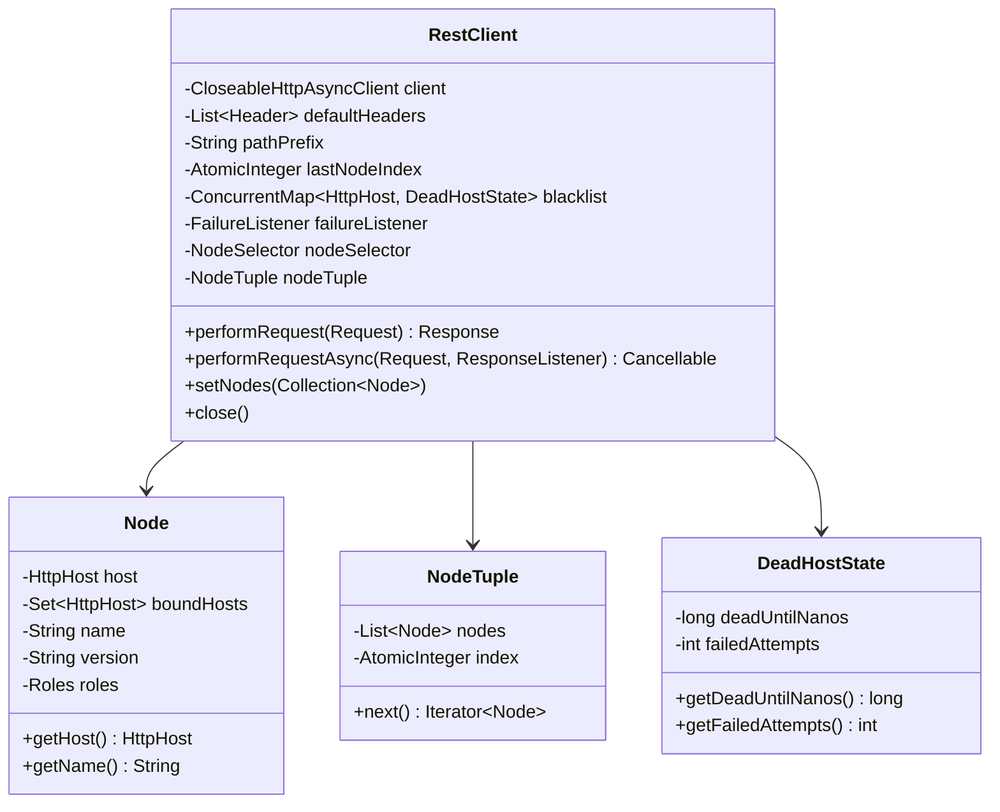

### 类说明

**RestClient**:

- 核心客户端类
- 管理连接和请求
- 实现负载均衡和重试

**Key Fields**:

| 字段 | 类型 | 说明 |
|---|---|---|
| client | CloseableHttpAsyncClient | Apache HttpClient 异步客户端 |
| defaultHeaders | List<Header> | 默认请求头 |
| lastNodeIndex | AtomicInteger | 上次选择的节点索引（轮询） |
| blacklist | ConcurrentMap | 失败节点黑名单 |
| nodeTuple | NodeTuple | 不可变节点列表 |

---

## 2. Request & Response

### 2.1 类图

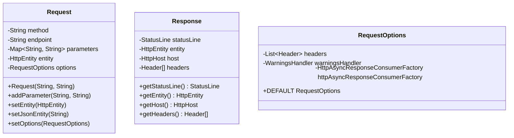

### 类说明

**Request**:

- 封装 HTTP 请求
- 支持链式调用
- 不可变（设置后）

**Response**:

- 封装 HTTP 响应
- 提供访问器方法
- 包含处理请求的节点信息

**RequestOptions**:

- 请求级别的配置
- 可继承默认配置
- 支持自定义

---

## 3. Node & NodeSelector

### 3.1 类图

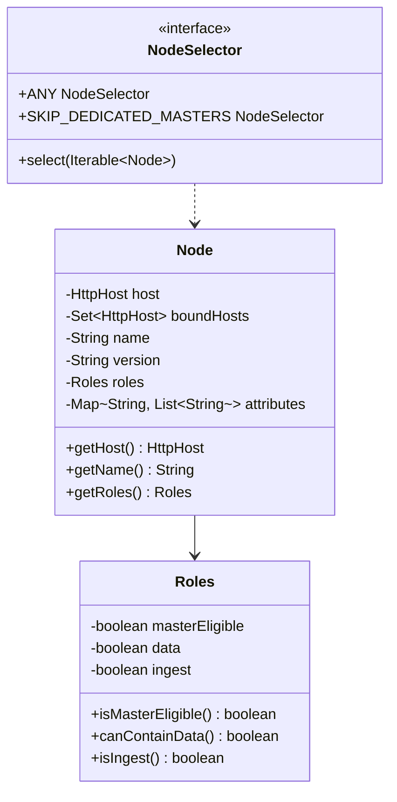

### 类说明

**Node**:

- 表示集群中的一个节点
- 包含节点元信息
- 用于节点选择

**Roles**:

- 节点角色信息
- 主节点、数据节点、Ingest 节点等

**NodeSelector**:

- 节点选择策略接口
- 过滤可用节点
- 支持自定义选择器

---

## 4. DeadHostState

### 4.1 类图

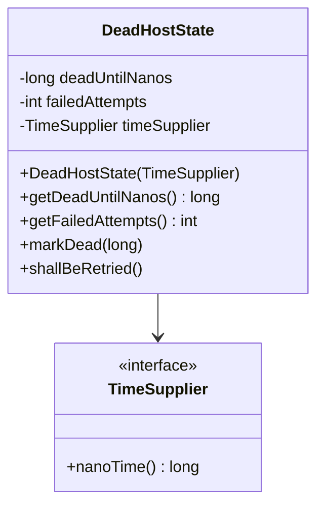

### 类说明

**DeadHostState**:

- 管理失败节点状态
- 计算重试时间
- 实现指数退避

**重试超时计算**:

```java
// 重试超时 = min(60秒 * 2^(失败次数-1), 30分钟)
long timeoutMinutes = Math.min(30, (long) Math.pow(2, failedAttempts - 1));
long deadUntil = currentTime + timeoutMinutes * 60 * 1_000_000_000L;
```

**示例**:
| 失败次数 | 重试超时 |
|---|---|
| 1 | 1 分钟 |
| 2 | 2 分钟 |
| 3 | 4 分钟 |
| 4 | 8 分钟 |
| 5 | 16 分钟 |
| 6+ | 30 分钟 (最大值) |

---

## 5. NodeTuple

### 5.1 类图

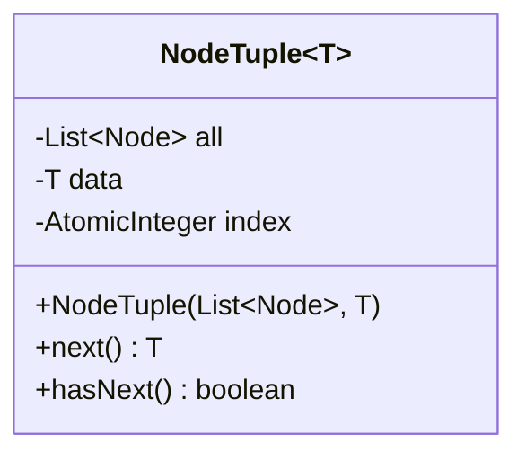

### 类说明

**NodeTuple**:

- 不可变节点列表封装
- 支持轮询迭代
- 线程安全

**使用场景**:

- 存储当前可用节点
- 支持动态更新节点列表
- 实现轮询负载均衡

---

## 6. ResponseListener

### 6.1 类图

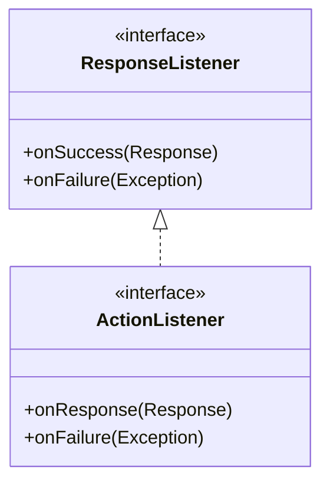

### 类说明

**ResponseListener**:

- 异步请求回调接口
- 处理成功和失败情况

**典型实现**:

```java
ResponseListener listener = new ResponseListener() {
    @Override
    public void onSuccess(Response response) {
        // 处理响应
        try {
            String body = EntityUtils.toString(response.getEntity());
            // 业务逻辑
        } catch (IOException e) {
            // 错误处理
        }
    }

    @Override
    public void onFailure(Exception exception) {
        // 处理异常
        if (exception instanceof ResponseException) {
            Response response = ((ResponseException) exception).getResponse();
            int statusCode = response.getStatusLine().getStatusCode();
        }
    }
};
```

---

## 7. FailureListener

### 7.1 类图

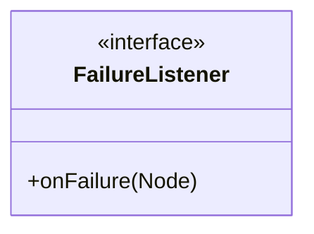

### 类说明

**FailureListener**:

- 节点失败监听器
- 用于监控和告警

**典型实现**:

```java
FailureListener listener = new FailureListener() {
    @Override
    public void onFailure(Node node) {
        System.err.println("Node failed: " + node.getHost());
        // 发送告警
        // 记录日志
        // 更新监控指标
    }
};
```

---

## 8. RequestConfigCallback & HttpClientConfigCallback

### 8.1 类图

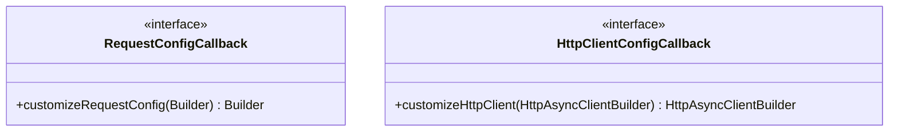

### 类说明

**RequestConfigCallback**:

- 自定义请求配置
- 设置超时、重试等

**HttpClientConfigCallback**:

- 自定义 HTTP 客户端
- 配置连接池、SSL 等

**示例**:

```java
// RequestConfigCallback
RequestConfigCallback requestConfig = requestConfigBuilder -> {
    return requestConfigBuilder
        .setConnectTimeout(5000)
        .setSocketTimeout(60000);
};

// HttpClientConfigCallback
HttpClientConfigCallback httpClientConfig = httpClientBuilder -> {
    return httpClientBuilder
        .setMaxConnTotal(100)
        .setMaxConnPerRoute(20)
        .setSSLContext(sslContext)
        .setSSLHostnameVerifier(NoopHostnameVerifier.INSTANCE);
};
```

---

## 9. 数据结构关系总览

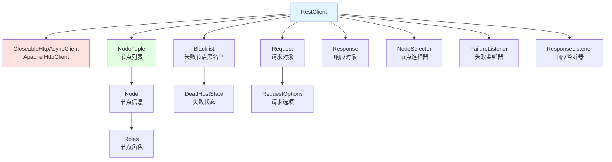

---

## 相关文档

- [Elasticsearch-07-Client模块-概览](./Elasticsearch-07-Client模块-概览.md)
- [Elasticsearch-07-Client模块-API](./Elasticsearch-07-Client模块-API.md)
- [Elasticsearch-07-Client模块-时序图](./Elasticsearch-07-Client模块-时序图.md)

---

## 时序图

本文档展示 Client 模块的核心流程时序图。

---

## 1. 同步请求完整流程

### 1.1 同步请求时序图

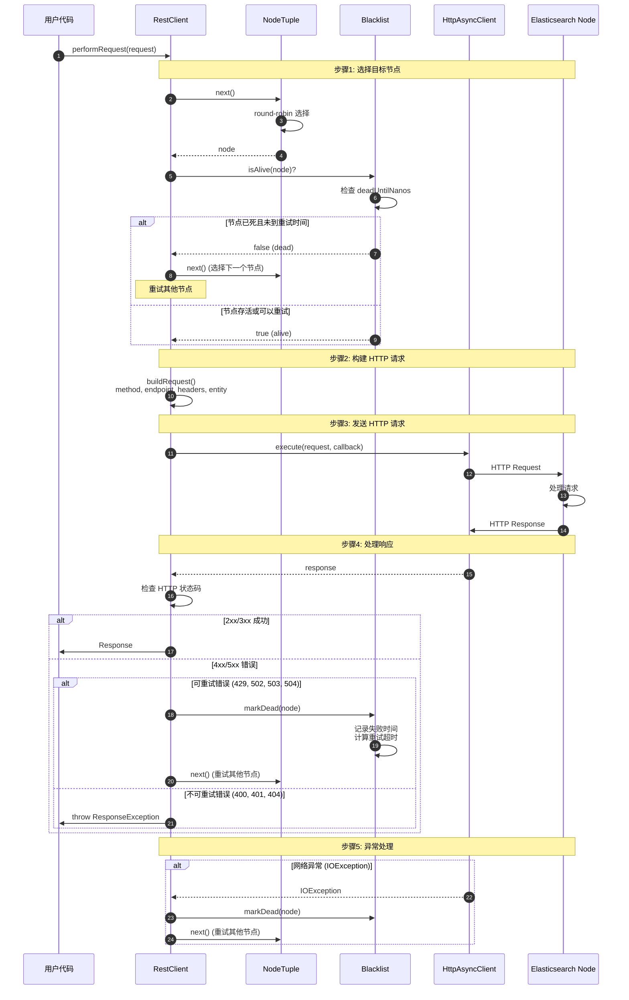

### 时序图说明

#### 关键步骤详解

**1. 节点选择 (步骤 1-9)**:

- 从 NodeTuple 轮询选择节点
- 检查黑名单状态
- 跳过失败节点（未到重试时间）
- 选择可用节点

**2. 构建请求 (步骤 10-11)**:

- 构造 HTTP 方法和端点
- 添加默认和自定义请求头
- 设置请求体
- 应用请求选项

**3. 发送请求 (步骤 12-16)**:

- 通过 Apache HttpClient 发送
- 异步执行（performRequest 内部等待）
- 网络传输

**4. 处理响应 (步骤 17-26)**:

- 检查 HTTP 状态码
- 成功：返回响应
- 可重试错误：标记节点，重试
- 不可重试错误：抛出异常

**5. 异常处理 (步骤 27-30)**:

- 网络异常：标记节点，重试
- 超时异常：标记节点，重试
- 重试直到成功或所有节点失败

---

## 2. 异步请求流程

### 2.1 异步请求时序图

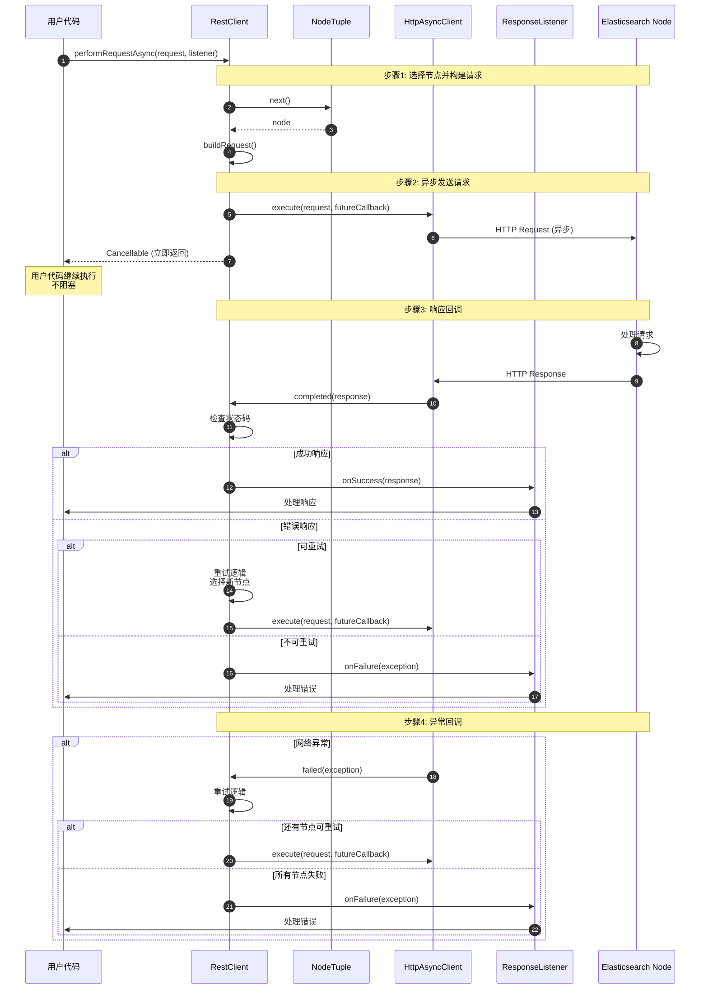

### 时序图说明

#### 异步vs同步差异

**异步特点**:

- 立即返回 Cancellable
- 不阻塞调用线程
- 回调在 HTTP 线程执行
- 支持取消请求

**回调时机**:

- 成功：onSuccess(response)
- 错误：onFailure(exception)
- 可能在任意线程执行

---

## 3. 节点失败与重试流程

### 3.1 失败节点管理时序图

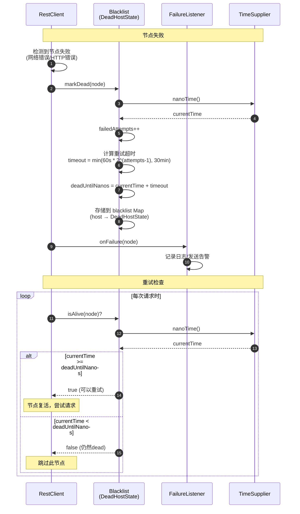

### 时序图说明

#### 失败节点重试超时

**计算公式**:

```
timeout = min(60秒 * 2^(failedAttempts - 1), 30分钟)
```

**重试时间表**:

| 失败次数 | 重试超时 |
|---|---|
| 1 | 1 分钟 |
| 2 | 2 分钟 |
| 3 | 4 分钟 |
| 4 | 8 分钟 |
| 5 | 16 分钟 |
| 6+ | 30 分钟 (最大值) |

#### 指数退避策略

**目的**:

- 避免持续请求失败节点
- 给节点恢复时间
- 减少无效请求

**实现**:

- 失败次数越多，重试间隔越长
- 最长等待 30 分钟
- 超时后自动复活，再次尝试

---

## 4. 轮询负载均衡流程

### 4.1 轮询选择节点时序图

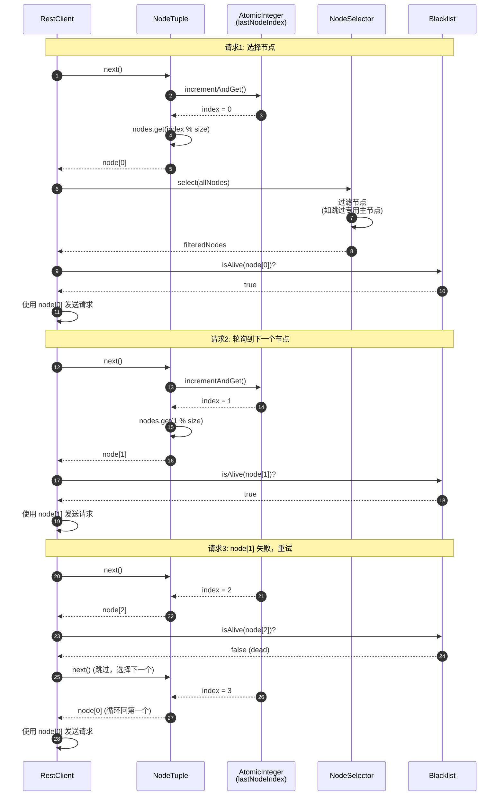

### 时序图说明

#### 轮询算法

**实现**:

```java
int index = lastNodeIndex.incrementAndGet();
Node node = nodes.get(Math.abs(index) % nodes.size());
```

**特点**:

- 均匀分布请求到所有节点
- 线程安全（AtomicInteger）
- 自动循环
- 跳过失败节点

#### 节点选择器

**作用**:

- 过滤不符合条件的节点
- 自定义选择逻辑

**内置选择器**:

- `NodeSelector.ANY`: 所有节点
- `NodeSelector.SKIP_DEDICATED_MASTERS`: 跳过专用主节点

---

## 5. 客户端创建与关闭流程

### 5.1 客户端生命周期时序图

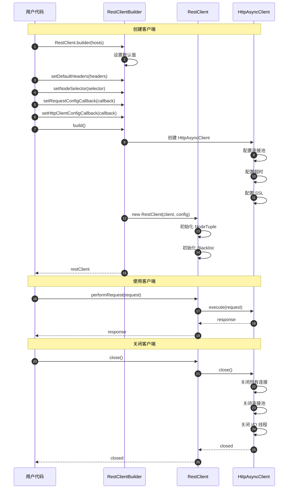

### 时序图说明

#### 创建步骤

**1. 构建器配置 (步骤 1-7)**:

- 设置节点列表
- 配置默认请求头
- 配置节点选择器
- 配置超时和重试

**2. HTTP 客户端创建 (步骤 8-12)**:

- 创建 Apache HttpAsyncClient
- 配置连接池参数
- 配置 SSL/TLS
- 启动 I/O 线程

**3. RestClient 创建 (步骤 13-16)**:

- 初始化节点列表
- 初始化黑名单
- 设置所有配置

#### 关闭步骤

**1. 关闭 RestClient (步骤 21)**:

- 触发关闭流程

**2. 关闭 HttpAsyncClient (步骤 22-26)**:

- 关闭所有活动连接
- 关闭连接池
- 停止 I/O 线程
- 释放资源

---

## 6. 动态更新节点列表

### 6.1 节点列表更新时序图

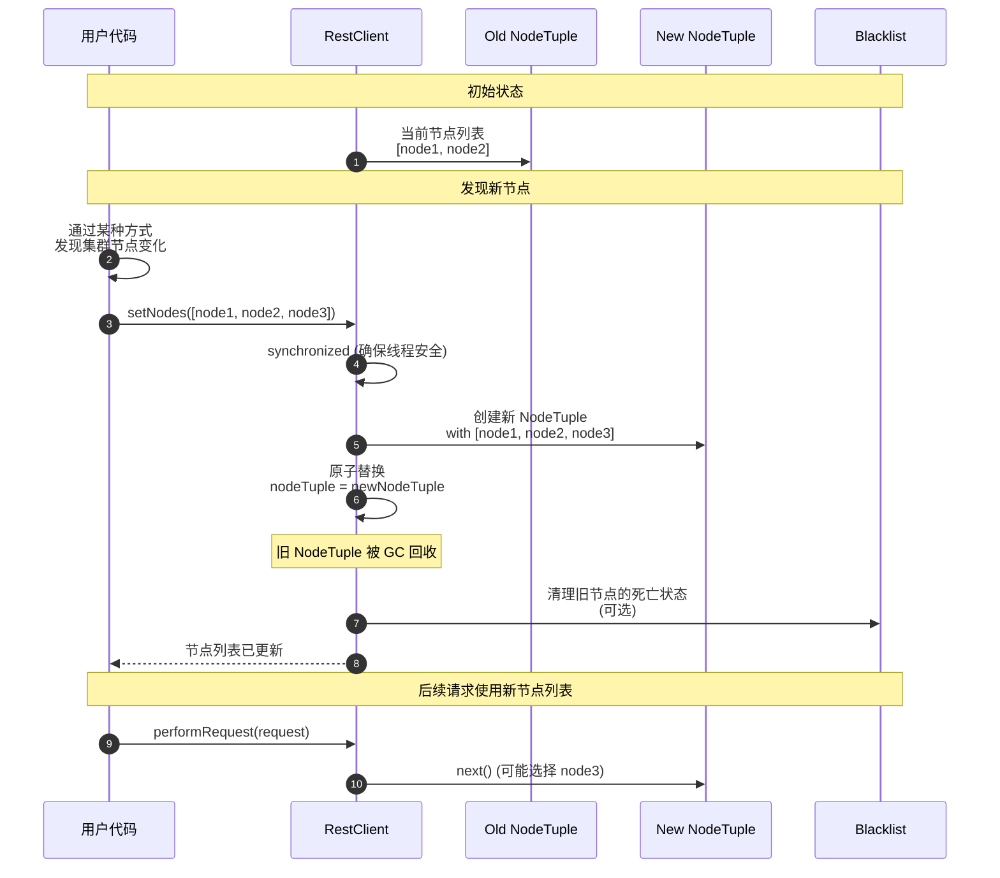

### 时序图说明

#### 节点发现方式

**方式1: 定期查询集群状态**:

```java
// 定期从一个节点获取集群状态
Request request = new Request("GET", "/_nodes/http");
Response response = restClient.performRequest(request);

// 解析响应，提取所有节点
List<Node> nodes = parseNodes(response);

// 更新客户端节点列表
restClient.setNodes(nodes);
```

**方式2: 嗅探器（Sniffer）**:

```java
Sniffer sniffer = Sniffer.builder(restClient)
    .setSniffIntervalMillis(60000)  // 每分钟嗅探一次
    .build();

// 自动更新节点列表
// 使用完后关闭
sniffer.close();
```

#### 线程安全

- `setNodes()` 方法是同步的
- NodeTuple 是不可变的
- 原子替换保证一致性

---

## 相关文档

- [Elasticsearch-07-Client模块-概览](./Elasticsearch-07-Client模块-概览.md)
- [Elasticsearch-07-Client模块-API](./Elasticsearch-07-Client模块-API.md)
- [Elasticsearch-07-Client模块-数据结构](./Elasticsearch-07-Client模块-数据结构.md)

---
