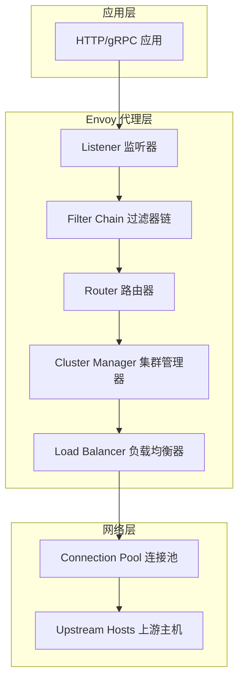
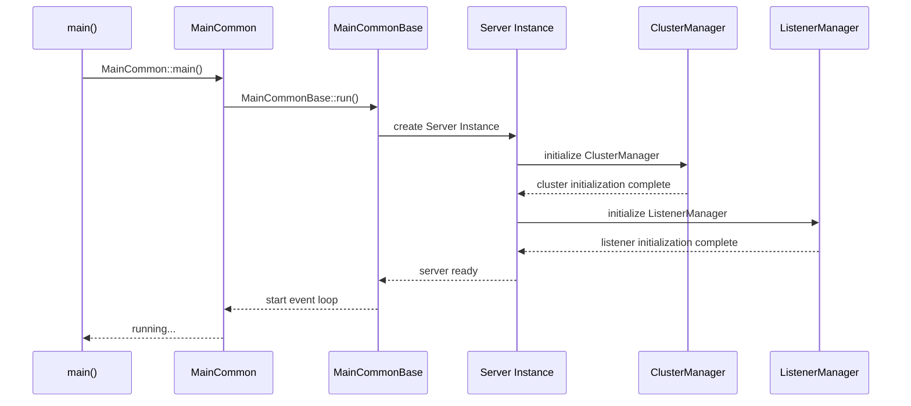

# Envoy 源码剖析主文档

## 目录结构

1. [整体架构概览](#整体架构概览)
2. [核心模块介绍](#核心模块介绍)
3. [启动流程分析](#启动流程分析)
4. [关键数据结构](#关键数据结构)
5. [模块间交互](#模块间交互)
6. [扩展机制](#扩展机制)
7. [最佳实践](#最佳实践)

## 项目简介

Envoy是一个开源的边缘和服务代理，由Lyft开发并贡献给云原生计算基金会(CNCF)。它是一个高性能的C++分布式代理，专为单个服务和应用以及大型微服务"服务网格"架构而设计。

### 核心特性

- **高性能**：基于C++开发，采用事件驱动架构
- **可扩展性**：丰富的过滤器系统，支持插件化扩展
- **可观测性**：内置丰富的统计指标、日志和链路追踪
- **动态配置**：支持热重启和动态配置更新
- **服务发现**：支持多种服务发现机制
- **负载均衡**：多种负载均衡算法和健康检查

## 整体架构概览

Envoy采用多线程事件驱动架构，主要包含以下几个层次：



### 架构层次说明

1. **监听器层(Listener Layer)**：
   - 负责接收客户端连接
   - 管理网络过滤器链
   - 处理连接的生命周期

2. **过滤器层(Filter Layer)**：
   - HTTP 过滤器链处理请求和响应
   - 网络过滤器处理原始字节
   - 支持可插拔的过滤器架构

3. **路由层(Routing Layer)**：
   - 基于配置将请求路由到上游集群
   - 支持复杂的路由规则和匹配条件

4. **集群管理层(Cluster Management Layer)**：
   - 管理上游服务集群
   - 服务发现和健康检查
   - 负载均衡策略

5. **连接池层(Connection Pool Layer)**：
   - 管理到上游服务的连接
   - 连接复用和生命周期管理

## 核心模块介绍

### 1. Server 模块
- **位置**: `source/server/`
- **功能**: Envoy 服务器的核心启动和运行时管理
- **关键类**: `InstanceBase`, `MainCommon`

### 2. Common 模块  
- **位置**: `source/common/`
- **功能**: 通用功能组件和工具类
- **子模块**: 
  - `network/`: 网络抽象和实现
  - `http/`: HTTP 协议处理
  - `upstream/`: 上游集群管理
  - `router/`: 路由功能
  - `stats/`: 统计指标

### 3. Extensions 模块
- **位置**: `source/extensions/`
- **功能**: 可扩展的插件系统
- **子模块**:
  - `filters/`: 各种过滤器实现
  - `clusters/`: 集群类型扩展
  - `transport_sockets/`: 传输层扩展

### 4. API 模块
- **位置**: `api/`
- **功能**: API 定义和配置结构
- **格式**: Protocol Buffers 定义

## 启动流程分析

### 主要入口点

```cpp
// source/exe/main.cc
int main(int argc, char** argv) {
#ifdef WIN32
  Envoy::ServiceBase service;
  if (!Envoy::ServiceBase::TryRunAsService(service)) {
    return Envoy::MainCommon::main(argc, argv);
  }
  return EXIT_SUCCESS;
#endif
  return Envoy::MainCommon::main(argc, argv);
}
```

**功能说明**：
- `main()` 函数是Envoy的入口点
- 在Windows平台上，支持作为系统服务运行
- 主要调用 `MainCommon::main()` 进行实际的初始化和启动

**参数含义**：
- `argc`: 命令行参数个数
- `argv`: 命令行参数数组
- **返回值**: 程序退出状态码

### 启动时序图



## 关键数据结构

### 1. Network::Connection
连接抽象的核心接口

```cpp
/**
 * 网络连接的基础抽象接口
 */
class Connection : public Event::DeferredDeletable,
                   public FilterManager {
public:
  virtual ~Connection() = default;
  
  /**
   * 添加连接回调处理器
   * @param cb 连接回调处理器
   */
  virtual void addConnectionCallbacks(ConnectionCallbacks& cb) PURE;
  
  /**
   * 关闭连接
   * @param type 连接关闭类型
   */  
  virtual void close(ConnectionCloseType type) PURE;
  
  /**
   * 获取连接的事件分发器
   * @return 事件分发器引用
   */
  virtual Event::Dispatcher& dispatcher() PURE;
  
  /**
   * 获取连接状态
   * @return 当前连接状态
   */
  virtual State state() const PURE;
  
  /**
   * 写入数据到连接
   * @param data 要写入的数据缓冲区
   * @param end_stream 是否结束流
   */
  virtual void write(Buffer::Instance& data, bool end_stream) PURE;
};
```

### 2. Http::StreamDecoder
HTTP流解码器接口

```cpp  
/**
 * HTTP流解码器，用于处理接收到的HTTP消息
 */
class StreamDecoder {
public:
  virtual ~StreamDecoder() = default;

  /**
   * 处理接收到的HTTP头部
   * @param headers HTTP请求或响应头部映射
   * @param end_stream 是否为流的结束
   */
  virtual void decodeHeaders(RequestOrResponseHeaderMapPtr&& headers,
                           bool end_stream) PURE;

  /**
   * 处理接收到的HTTP数据
   * @param data HTTP消息体数据
   * @param end_stream 是否为流的结束  
   */
  virtual void decodeData(Buffer::Instance& data, bool end_stream) PURE;

  /**
   * 处理接收到的HTTP尾部
   * @param trailers HTTP尾部头映射
   */
  virtual void decodeTrailers(RequestOrResponseTrailerMapPtr&& trailers) PURE;
};
```

### 3. Upstream::ClusterManager
集群管理器，管理所有上游服务集群

```cpp
/**
 * 集群管理器接口，负责管理所有上游服务集群
 */
class ClusterManager {
public:
  virtual ~ClusterManager() = default;

  /**
   * 添加或更新集群配置
   * @param cluster 集群配置  
   * @param version_info 版本信息
   * @return 是否成功添加或更新集群
   */
  virtual absl::StatusOr<bool> addOrUpdateCluster(
      const envoy::config::cluster::v3::Cluster& cluster,
      const std::string& version_info) PURE;

  /**
   * 获取指定名称的活跃集群
   * @param cluster 集群名称
   * @return 集群对象的可选引用
   */
  virtual OptRef<const Cluster> getActiveCluster(const std::string& cluster) const PURE;

  /**
   * 获取线程本地集群对象
   * @param cluster 集群名称  
   * @return 线程本地集群指针
   */
  virtual ThreadLocalCluster* getThreadLocalCluster(absl::string_view cluster) PURE;

  /**
   * 移除指定的集群
   * @param cluster 要移除的集群名称
   * @return 是否成功移除
   */
  virtual bool removeCluster(const std::string& cluster) PURE;
};
```

## 详细文档索引

以下是各模块的详细分析文档：

- [01-Server模块详细分析.md](./01-Server模块详细分析.md) - 服务器核心启动和管理
- [02-Network模块详细分析.md](./02-Network模块详细分析.md) - 网络层抽象和实现  
- [03-HTTP模块详细分析.md](./03-HTTP模块详细分析.md) - HTTP协议处理
- [04-Upstream模块详细分析.md](./04-Upstream模块详细分析.md) - 上游集群管理
- [05-Router模块详细分析.md](./05-Router模块详细分析.md) - 路由和转发
- [06-Filter系统详细分析.md](./06-Filter系统详细分析.md) - 过滤器架构
- [07-配置管理详细分析.md](./07-配置管理详细分析.md) - 配置加载和热更新
- [08-统计和监控详细分析.md](./08-统计和监控详细分析.md) - 指标收集和观测性
- [09-扩展机制详细分析.md](./09-扩展机制详细分析.md) - 插件和扩展开发
- [10-最佳实践和案例.md](./10-最佳实践和案例.md) - 实战经验和优化建议

## 开发环境设置

### 构建要求
- **操作系统**: Linux, macOS, Windows
- **编译器**: GCC 9+, Clang 10+, MSVC 2019+  
- **构建工具**: Bazel 4.0+
- **依赖**: Protocol Buffers, gRPC, Abseil

### 快速开始

```bash
# 克隆代码库
git clone https://github.com/envoyproxy/envoy.git
cd envoy

# 使用Docker构建（推荐）
./ci/run_envoy_docker.sh './ci/do_ci.sh bazel.compile_time_options'

# 本地构建
bazel build -c opt //source/exe:envoy-static
```

### IDE配置
推荐使用VS Code配合C++插件进行开发，项目根目录包含了`.vscode`配置文件。

## 贡献指南

如果您想为Envoy项目贡献代码，请参考：

1. [CONTRIBUTING.md](../CONTRIBUTING.md) - 贡献指南
2. [DEVELOPER.md](../DEVELOPER.md) - 开发者文档  
3. [STYLE.md](../STYLE.md) - 代码风格指南

本文档将持续更新，欢迎提出改进建议！
