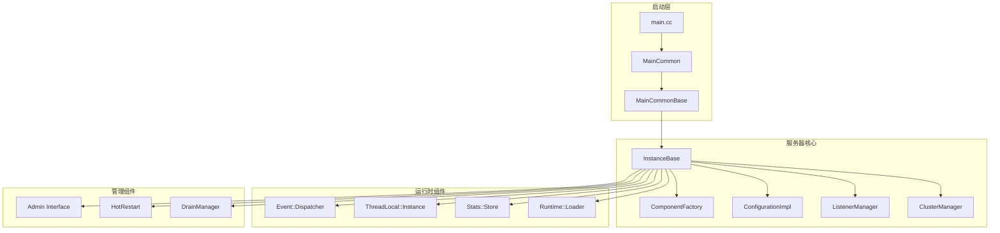
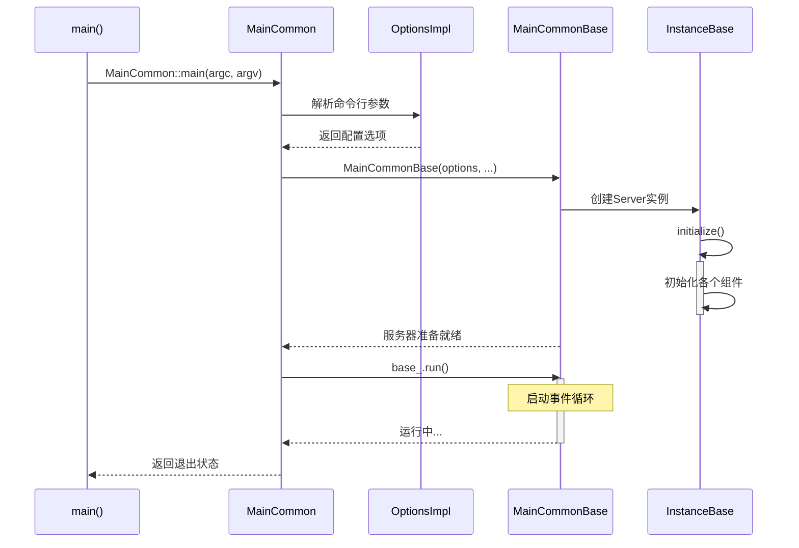
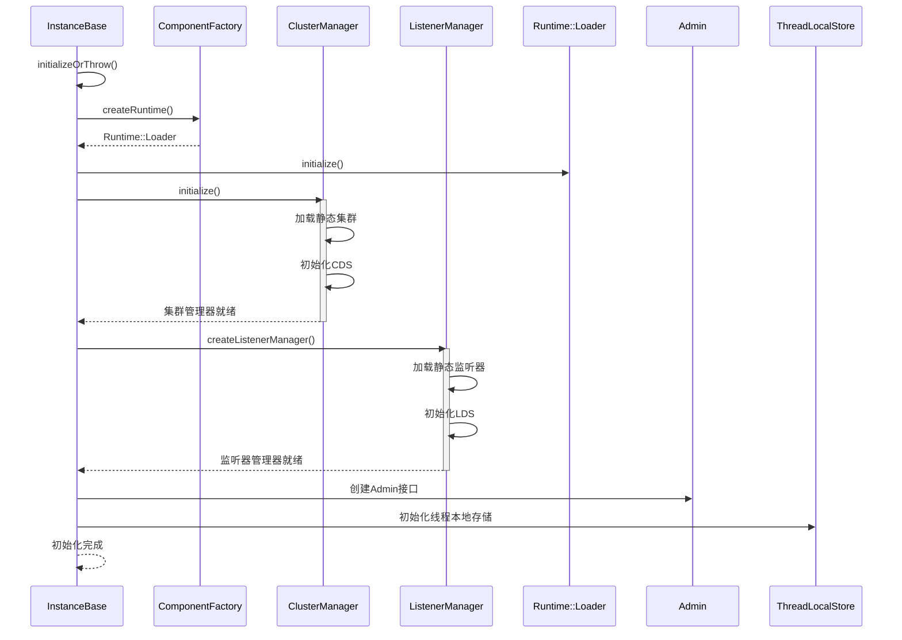
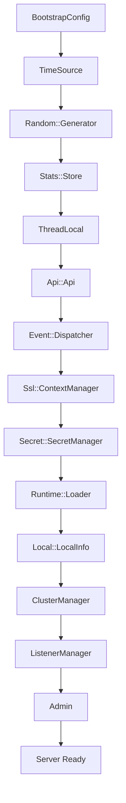
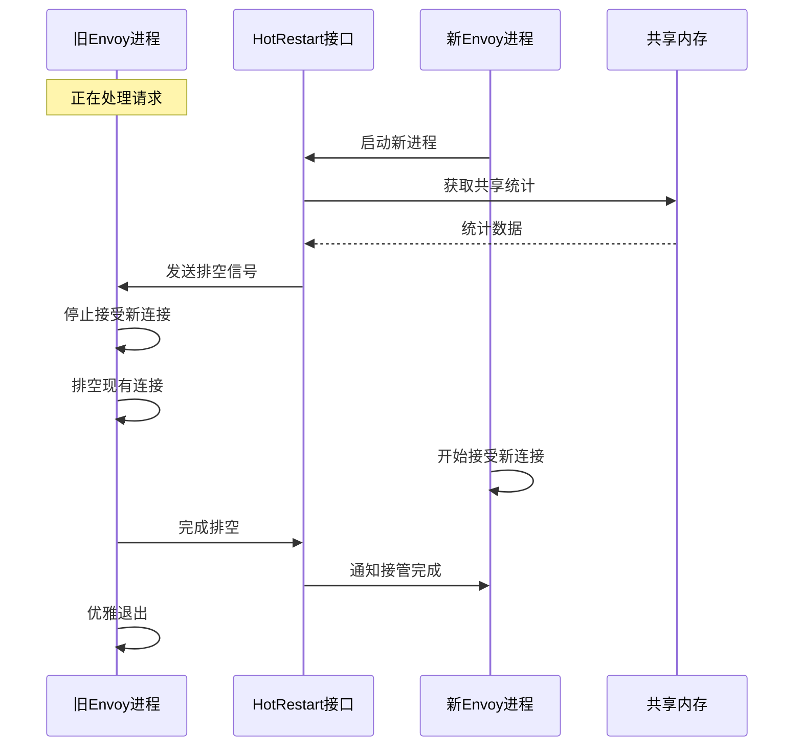
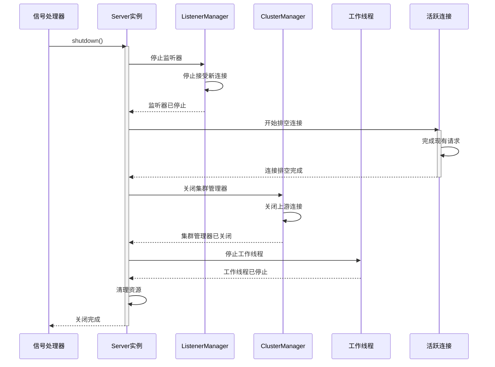

## 模块概览

Server模块是Envoy的核心模块，负责整个代理服务器的启动、初始化、运行时管理和优雅关闭。它是整个系统的指挥中心，协调各个子系统的运行。

### 模块位置
- **源码位置**: `source/server/`
- **头文件位置**: `source/server/*.h`
- **主要入口**: `source/exe/main.cc`

### 核心职责

1. **启动管理**: 处理程序启动、参数解析、配置加载
2. **生命周期管理**: 管理服务器的完整生命周期
3. **组件协调**: 协调各个子系统的初始化和运行
4. **热重启**: 支持无缝的配置更新和热重启
5. **优雅关闭**: 处理信号和优雅关闭逻辑

## 架构图



## 关键类分析

### 1. MainCommon 类

#### 类定义

```cpp
/**

 * MainCommon 类负责Envoy的主要启动逻辑
 * 这个类处理命令行参数解析、配置加载和服务器实例创建

 */
class MainCommon {
public:
  // 启动钩子函数类型定义
  using PostServerHook = std::function<void(Server::Instance& server)>;

  /**

   * 构造函数，解析命令行参数
   * @param argc 命令行参数数量
   * @param argv 命令行参数数组
   */
  MainCommon(int argc, const char* const* argv);
  
  /**
   * 构造函数，使用字符串向量作为参数
   * @param args 参数字符串向量
   */
  MainCommon(const std::vector<std::string>& args);

  /**
   * 启动服务器主循环
   * @return 服务器是否成功启动并运行
   */
  bool run() { return base_.run(); }

  /**
   * 获取事件分发器（仅用于测试）
   * @return 事件分发器引用
   */
  Event::Dispatcher& dispatcherForTest() { return base_.server()->dispatcher(); }

#ifdef ENVOY_ADMIN_FUNCTIONALITY
  /**

   * 发起管理控制台请求
   * @param path_and_query 请求路径和查询参数
   * @param method HTTP方法（GET或POST）
   * @param handler 异步回调处理器
   */
  void adminRequest(absl::string_view path_and_query, absl::string_view method,
                    const MainCommonBase::AdminRequestFn& handler);
                    
  /**
   * 发起流式管理控制台请求
   * @param path_and_query 请求路径和查询参数  
   * @param method HTTP方法
   * @return 管理响应对象的共享指针
   */
  AdminResponseSharedPtr adminRequest(absl::string_view path_and_query, absl::string_view method);
#endif

  /**

   * 获取热重启版本信息
   * @param hot_restart_enabled 是否启用热重启
   * @return 版本信息字符串
   */
  static std::string hotRestartVersion(bool hot_restart_enabled);

  /**
   * 获取服务器实例指针
   * @return 服务器实例指针，如果处于验证模式则返回nullptr
   */
  Server::Instance* server() { return base_.server(); }

  /**
   * 主入口函数，创建MainCommon实例并运行
   * @param argc 命令行参数数量
   * @param argv 命令行参数数组
   * @param hook 服务器创建后的可选钩子函数
   * @return 程序退出状态码
   */
  static int main(int argc, char** argv, PostServerHook hook = nullptr);

private:
  Thread::MainThread main_thread_;          // 主线程对象

#ifdef ENVOY_HANDLE_SIGNALS
  Envoy::SignalAction handle_sigs_;         // 信号处理器
  Envoy::TerminateHandler log_on_terminate_; // 终止处理器
#endif

  Envoy::OptionsImpl options_;              // 命令行选项解析器
  Event::RealTimeSystem real_time_system_;  // 实时时间系统
  DefaultListenerHooks default_listener_hooks_; // 默认监听器钩子
  ProdComponentFactory prod_component_factory_; // 生产环境组件工厂
  MainCommonBase base_;                     // 基础实现类
};
```

#### 启动时序图



### 2. InstanceBase 类

#### 类定义与核心功能

```cpp
/**

 * InstanceBase 是服务器实例的基础实现类
 * 它管理所有核心组件的生命周期，包括网络、HTTP、上游服务等

 */
class InstanceBase : Logger::Loggable<Logger::Id::main>,
                     public Instance,
                     public ServerLifecycleNotifier {
public:
  /**

   * 构造函数
   * @param init_manager 初始化管理器
   * @param options 服务器选项
   * @param time_system 时间系统
   * @param hooks 监听器钩子
   * @param restarter 热重启器
   * @param store 统计存储
   * @param access_log_lock 访问日志锁
   * @param random_generator 随机数生成器
   * @param tls 线程本地存储
   * @param thread_factory 线程工厂
   * @param file_system 文件系统
   * @param process_context 进程上下文
   * @param watermark_factory 水位工厂（可选）
   * @throws EnvoyException 如果初始化失败
   */
  InstanceBase(Init::Manager& init_manager,
               const Options& options,
               Event::TimeSystem& time_system,
               ListenerHooks& hooks,
               HotRestart& restarter,
               Stats::StoreRoot& store,
               Thread::BasicLockable& access_log_lock,
               Random::RandomGeneratorPtr&& random_generator,
               ThreadLocal::Instance& tls,
               Thread::ThreadFactory& thread_factory,
               Filesystem::Instance& file_system,
               std::unique_ptr<ProcessContext> process_context,
               Buffer::WatermarkFactorySharedPtr watermark_factory = nullptr);

  /**
   * 初始化服务器，必须在run()之前调用
   * @param local_address 本地地址
   * @param component_factory 组件工厂
   */
  void initialize(Network::Address::InstanceConstSharedPtr local_address,
                  ComponentFactory& component_factory);
                  
  /**
   * 析构函数
   */
  ~InstanceBase() override;

  /**
   * 启动服务器主循环
   */
  void run() override;

  // Server::Instance 接口实现
  
  /**
   * 获取管理接口（如果启用）
   * @return 管理接口的可选引用
   */
  OptRef<Admin> admin() override {
    return makeOptRefFromPtr(admin_.get());
  }
  
  /**
   * 获取API接口
   * @return API接口引用
   */
  Api::Api& api() override {
    return *api_;
  }
  
  /**
   * 获取集群管理器
   * @return 集群管理器引用
   */
  Upstream::ClusterManager& clusterManager() override;
  const Upstream::ClusterManager& clusterManager() const override;
  
  /**
   * 获取SSL上下文管理器
   * @return SSL上下文管理器引用  
   */
  Ssl::ContextManager& sslContextManager() override {
    return *ssl_context_manager_;
  }
  
  /**
   * 获取事件分发器
   * @return 事件分发器引用
   */
  Event::Dispatcher& dispatcher() override {
    return *dispatcher_;
  }
  
  /**
   * 获取DNS解析器
   * @return DNS解析器共享指针
   */
  Network::DnsResolverSharedPtr dnsResolver() override {
    return dns_resolver_;
  }
  
  /**
   * 排空监听器连接
   * @param options 额外的关闭选项
   */
  void drainListeners(OptRef<const Network::ExtraShutdownListenerOptions> options) override;
  
  /**
   * 获取排空管理器
   * @return 排空管理器引用
   */
  DrainManager& drainManager() override {
    return *drain_manager_;
  }
  
  /**
   * 获取访问日志管理器
   * @return 访问日志管理器引用
   */
  AccessLog::AccessLogManager& accessLogManager() override {
    return access_log_manager_;
  }

  /**
   * 设置健康检查失败状态
   * @param fail 是否失败
   */
  void failHealthcheck(bool fail) override;

  /**
   * 获取热重启器
   * @return 热重启器引用  
   */
  HotRestart& hotRestart() override {
    return restarter_;
  }
  
  /**
   * 获取初始化管理器
   * @return 初始化管理器引用
   */
  Init::Manager& initManager() override {
    return init_manager_;
  }
  
  /**
   * 获取生命周期通知器
   * @return 生命周期通知器引用
   */
  ServerLifecycleNotifier& lifecycleNotifier() override {
    return *this;
  }
  
  /**
   * 获取监听器管理器
   * @return 监听器管理器引用  
   */
  ListenerManager& listenerManager() override {
    return *listener_manager_;
  }
  
  /**
   * 获取秘钥管理器
   * @return 秘钥管理器引用
   */
  Secret::SecretManager& secretManager() override {
    return *secret_manager_;
  }

  /**
   * 获取互斥锁跟踪器
   * @return 互斥锁跟踪器指针
   */
  Envoy::MutexTracer* mutexTracer() override {
    return mutex_tracer_;
  }
  
  /**
   * 获取过载管理器
   * @return 过载管理器引用
   */
  OverloadManager& overloadManager() override {
    return *overload_manager_;
  }
  
  /**
   * 获取空过载管理器
   * @return 空过载管理器引用
   */
  OverloadManager& nullOverloadManager() override {
    return *null_overload_manager_;
  }
  
  /**
   * 获取运行时加载器
   * @return 运行时加载器引用
   */
  Runtime::Loader& runtime() override;
  
  /**
   * 关闭服务器
   */
  void shutdown() override;
  
  /**
   * 检查服务器是否已关闭
   * @return 是否已关闭
   */
  bool isShutdown() final {
    return shutdown_;
  }
  
  /**
   * 关闭管理接口
   */
  void shutdownAdmin() override;

  /**
   * 获取单例管理器
   * @return 单例管理器引用
   */
  Singleton::Manager& singletonManager() override {
    return singleton_manager_;
  }
  
  /**
   * 检查健康检查是否失败
   * @return 健康检查是否失败
   */
  bool healthCheckFailed() override;

  /**
   * 获取服务器选项
   * @return 服务器选项引用
   */
  const Options& options() override {
    return options_;
  }
  
  /**
   * 获取当前纪元的启动时间
   * @return 启动时间戳
   */
  time_t startTimeCurrentEpoch() override {
    return start_time_;
  }
  
  /**
   * 获取第一个纪元的启动时间
   * @return 启动时间戳
   */
  time_t startTimeFirstEpoch() override {
    return original_start_time_;
  }

  /**
   * 获取统计存储
   * @return 统计存储引用
   */
  Stats::Store& stats() override {
    return stats_store_;
  }
  
  /**
   * 获取gRPC上下文
   * @return gRPC上下文引用
   */
  Grpc::Context& grpcContext() override {
    return grpc_context_;
  }
  
  /**
   * 获取HTTP上下文
   * @return HTTP上下文引用
   */
  Http::Context& httpContext() override {
    return http_context_;
  }
  
  /**
   * 获取路由器上下文
   * @return 路由器上下文引用
   */
  Router::Context& routerContext() override {
    return router_context_;
  }

  /**
   * 获取进程上下文
   * @return 进程上下文的可选引用
   */
  ProcessContextOptRef processContext() override;
  
  /**
   * 获取线程本地存储
   * @return 线程本地存储引用
   */
  ThreadLocal::Instance& threadLocal() override {
    return thread_local_;
  }
  
  /**
   * 获取本地信息
   * @return 本地信息引用
   */
  LocalInfo::LocalInfo& localInfo() const override {
    return *local_info_;
  }
  
  /**
   * 获取时间源
   * @return 时间源引用
   */
  TimeSource& timeSource() override {
    return time_source_;
  }

  /**
   * 刷新统计数据到接收器
   */
  void flushStats() override;

  /**
   * 获取统计配置
   * @return 统计配置引用
   */
  Configuration::StatsConfig& statsConfig() override {
    return config_.statsConfig();
  }
  
  /**
   * 获取正则表达式引擎
   * @return 正则表达式引擎引用
   */
  Regex::Engine& regexEngine() override {
    return *regex_engine_;
  }
  
  /**
   * 获取启动配置
   * @return 启动配置引用
   */
  envoy::config::bootstrap::v3::Bootstrap& bootstrap() override {
    return bootstrap_;
  }

  /**
   * 获取服务器工厂上下文
   * @return 服务器工厂上下文引用
   */
  Configuration::ServerFactoryContext& serverFactoryContext() override {
    return server_contexts_;
  }
  
  /**
   * 获取传输套接字工厂上下文
   * @return 传输套接字工厂上下文引用
   */
  Configuration::TransportSocketFactoryContext& transportSocketFactoryContext() override {
    return server_contexts_;
  }

  /**
   * 获取消息验证上下文
   * @return 消息验证上下文引用
   */
  ProtobufMessage::ValidationContext& messageValidationContext() override {
    return validation_context_;
  }

  /**
   * 获取消息验证访问器
   * @return 消息验证访问器引用
   */
  ProtobufMessage::ValidationVisitor& messageValidationVisitor() override {
    // 服务器有两个消息验证访问器，一个用于静态配置，另一个用于动态配置
    // 如果主分发循环已启动，选择动态验证访问器，因为主分发循环启动后的所有配置都应该是动态的
    return main_dispatch_loop_started_.load() ? validation_context_.dynamicValidationVisitor()
                                              : validation_context_.staticValidationVisitor();
  }

  /**
   * 设置默认跟踪配置
   * @param tracing_config 跟踪配置
   */
  void setDefaultTracingConfig(const envoy::config::trace::v3::Tracing& tracing_config) override {
    http_context_.setDefaultTracingConfig(tracing_config);
  }

  /**
   * 是否默认启用端口重用
   * @return 是否启用端口重用
   */
  bool enableReusePortDefault() override;

  /**
   * 获取QUIC统计名称
   * @return QUIC统计名称引用
   */
  Quic::QuicStatNames& quicStatNames() {
    return quic_stat_names_;
  }

  /**
   * 设置统计接收器谓词
   * @param sink_predicates 统计接收器谓词的唯一指针
   */
  void setSinkPredicates(std::unique_ptr<Envoy::Stats::SinkPredicates>&& sink_predicates) override {
    stats_store_.setSinkPredicates(std::move(sink_predicates));
  }

  /**
   * 获取XDS管理器
   * @return XDS管理器引用
   */
  Config::XdsManager& xdsManager() override {
    return *xds_manager_;
  }

  // ServerLifecycleNotifier 接口实现
  
  /**
   * 注册生命周期回调
   * @param stage 生命周期阶段
   * @param callback 回调函数
   * @return 回调句柄
   */
  ServerLifecycleNotifier::HandlePtr registerCallback(Stage stage, StageCallback callback) override;
  
  /**
   * 注册带完成通知的生命周期回调
   * @param stage 生命周期阶段
   * @param callback 带完成通知的回调函数
   * @return 回调句柄
   */
  ServerLifecycleNotifier::HandlePtr
  registerCallback(Stage stage, StageCallbackWithCompletion callback) override;

protected:
  /**

   * 获取配置
   * @return 主配置的常量引用
   */
  const Configuration::MainImpl& config() {
    return config_;
  }

private:
  // 私有成员变量和方法
  Network::DnsResolverSharedPtr getOrCreateDnsResolver();
  ProtobufTypes::MessagePtr dumpBootstrapConfig();
  void flushStatsInternal();
  void updateServerStats();
  absl::Status initializeOrThrow(Network::Address::InstanceConstSharedPtr local_address,
                                 ComponentFactory& component_factory);
  void loadServerFlags(const absl::optional<std::string>& flags_path);
  void startWorkers();
  void terminate();
  void notifyCallbacksForStage(Stage stage, std::function<void()> completion_cb = [] {});
  void onRuntimeReady();
  void onClusterManagerPrimaryInitializationComplete();

  // 成员变量（按初始化依赖顺序排列）
  Init::Manager& init_manager_;                    // 初始化管理器
  std::unique_ptr<Secret::SecretManager> secret_manager_; // 秘钥管理器
  bool workers_started_{false};                    // 工作线程是否已启动
  std::atomic<bool> live_;                        // 服务器是否活跃
  bool shutdown_{false};                          // 是否已关闭
  const Options& options_;                        // 服务器选项
  ProtobufMessage::ProdValidationContextImpl validation_context_; // 验证上下文
  std::atomic<bool> main_dispatch_loop_started_{false}; // 主分发循环是否已启动
  TimeSource& time_source_;                       // 时间源
  LocalInfo::LocalInfoPtr local_info_;            // 本地信息
  HotRestart& restarter_;                         // 热重启器
  const time_t start_time_;                       // 启动时间
  time_t original_start_time_;                    // 原始启动时间
  Stats::StoreRoot& stats_store_;                 // 统计存储
  std::unique_ptr<ServerStats> server_stats_;     // 服务器统计
  ThreadLocal::Instance& thread_local_;           // 线程本地存储
  Random::RandomGeneratorPtr random_generator_;   // 随机数生成器
  envoy::config::bootstrap::v3::Bootstrap bootstrap_; // 启动配置
  Api::ApiPtr api_;                              // API接口
  std::unique_ptr<Ssl::ContextManager> ssl_context_manager_; // SSL上下文管理器
  Event::DispatcherPtr dispatcher_;              // 事件分发器
  AccessLog::AccessLogManagerImpl access_log_manager_; // 访问日志管理器
  std::shared_ptr<Admin> admin_;                 // 管理接口
  Singleton::ManagerImpl singleton_manager_;      // 单例管理器
  std::unique_ptr<Runtime::Loader> runtime_;     // 运行时加载器
  std::unique_ptr<ListenerManager> listener_manager_; // 监听器管理器
  Configuration::MainImpl config_;               // 主配置
  Event::TimerPtr stat_flush_timer_;             // 统计刷新定时器
  DrainManagerPtr drain_manager_;                // 排空管理器
  std::unique_ptr<Upstream::ClusterManagerFactory> cluster_manager_factory_; // 集群管理器工厂
  std::unique_ptr<Server::GuardDog> main_thread_guard_dog_; // 主线程看门狗
  std::unique_ptr<Server::GuardDog> worker_guard_dog_; // 工作线程看门狗
  std::unique_ptr<OverloadManager> overload_manager_; // 过载管理器
  std::unique_ptr<OverloadManager> null_overload_manager_; // 空过载管理器
  Grpc::ContextImpl grpc_context_;              // gRPC上下文
  Http::ContextImpl http_context_;              // HTTP上下文
  Router::ContextImpl router_context_;          // 路由器上下文
  std::unique_ptr<ProcessContext> process_context_; // 进程上下文
  Stats::TimespanPtr initialization_timer_;      // 初始化计时器
  ListenerHooks& hooks_;                        // 监听器钩子
  Quic::QuicStatNames quic_stat_names_;         // QUIC统计名称
  ServerFactoryContextImpl server_contexts_;    // 服务器工厂上下文
  bool enable_reuse_port_default_{false};       // 默认端口重用设置
  Regex::EnginePtr regex_engine_;               // 正则表达式引擎
  bool stats_flush_in_progress_ : 1;            // 统计刷新进行中标志
};
```

### 3. ComponentFactory 接口

#### 组件工厂模式

```cpp
/**

 * ComponentFactory 接口用于创建服务运行时需要的各种组件
 * 采用工厂模式，支持依赖注入和测试替换

 */
class ComponentFactory {
public:
  virtual ~ComponentFactory() = default;

  /**

   * 创建排空管理器
   * @param server 服务器实例引用
   * @return 排空管理器的唯一指针
   */
  virtual DrainManagerPtr createDrainManager(Instance& server) PURE;

  /**
   * 创建运行时加载器
   * @param server 服务器实例引用
   * @param config 初始配置引用
   * @return 运行时加载器的唯一指针
   */
  virtual Runtime::LoaderPtr createRuntime(Instance& server, Configuration::Initial& config) PURE;

};
```

#### 生产环境组件工厂实现

```cpp
/**

 * ProdComponentFactory 是生产环境使用的组件工厂实现

 */
class ProdComponentFactory : public ComponentFactory {
public:
  // ComponentFactory 接口实现
  DrainManagerPtr createDrainManager(Instance& server) override {
    return std::make_unique<DrainManagerImpl>(server, server.api().timeSource());
  }

  Runtime::LoaderPtr createRuntime(Instance& server, Configuration::Initial& config) override {
    return InstanceUtil::createRuntime(server, config);
  }
};
```

## 初始化流程详解

### 服务器初始化时序图



### 核心初始化步骤

#### 1. 配置解析和验证

```cpp
/**

 * 加载和验证启动配置
 * @param bootstrap 启动配置对象引用
 * @param options 服务器选项
 * @param validation_visitor 消息验证访问器
 * @param api API接口引用
 * @return 配置加载状态

 */
absl::Status InstanceUtil::loadBootstrapConfig(
    envoy::config::bootstrap::v3::Bootstrap& bootstrap,
    const Options& options,
    ProtobufMessage::ValidationVisitor& validation_visitor,
    Api::Api& api) {
  
  const std::string& config_path = options.configPath();
  const std::string& config_yaml = options.configYaml();
  const envoy::config::bootstrap::v3::Bootstrap& config_proto = options.configProto();

  // 优先级：命令行proto > YAML字符串 > 配置文件
  if (!MessageUtil::isEmptyMessage(config_proto)) {
    bootstrap.CopyFrom(config_proto);
    MessageUtil::validate(bootstrap, validation_visitor);
    return absl::OkStatus();
  } else if (!config_yaml.empty()) {
    return loadConfigFromYamlString(config_yaml, bootstrap, validation_visitor, api);
  } else if (!config_path.empty()) {
    return loadConfigFromFile(config_path, bootstrap, validation_visitor, api);
  } else {
    return absl::InvalidArgumentError("未提供配置");
  }
}
```

#### 2. 统计系统初始化

```cpp
/**

 * 初始化统计系统和相关组件

 */
void InstanceBase::updateServerStats() {
  // 更新服务器基础统计
  server_stats_->live_.set(live_ ? 1 : 0);
  server_stats_->state_.set(enumToInt(initManager().state()));
  
  // 更新内存使用统计
  server_stats_->memory_allocated_.set(Memory::Stats::totalCurrentlyAllocated());
  server_stats_->memory_heap_size_.set(Memory::Stats::totalCurrentlyReserved());
  server_stats_->memory_physical_size_.set(Memory::Stats::totalPhysicalBytes());
  
  // 更新并发度统计
  server_stats_->concurrency_.set(options_.concurrency());
  
  // 更新版本信息统计
  server_stats_->version_.set(VersionInfo::revision());
  
  // 更新运行时间统计  
  const auto now = time_source_.systemTime();
  const auto uptime = std::chrono::duration_cast<std::chrono::seconds>(
    now - std::chrono::system_clock::from_time_t(start_time_));
  server_stats_->uptime_.set(uptime.count());
}
```

#### 3. 组件依赖图



## 运行时管理

### 事件循环

```cpp
/**

 * 服务器主运行循环

 */
void InstanceBase::run() {
  // 启动运行时帮助器，处理初始化完成和信号
  RunHelper helper(*this, options_, *dispatcher_, *xds_manager_,
                   clusterManager(), access_log_manager_,
                   init_manager_, *overload_manager_,
                   *null_overload_manager_,
                   [this]() -> void {
                     // 工作线程启动完成回调
                     startWorkers();
                   });

  // 标记主分发循环已启动
  main_dispatch_loop_started_ = true;
  
  // 启动事件分发循环（阻塞调用）
  dispatcher_->run(Event::Dispatcher::RunType::Block);
  
  ENVOY_LOG(info, "主分发循环退出");
}
```

### 信号处理

```cpp
/**

 * RunHelper 处理各种系统信号

 */
class RunHelper : Logger::Loggable<Logger::Id::main> {
public:
  RunHelper(Instance& instance, const Options& options, Event::Dispatcher& dispatcher,
            Config::XdsManager& xds_manager, Upstream::ClusterManager& cm,
            AccessLog::AccessLogManager& access_log_manager, Init::Manager& init_manager,
            OverloadManager& overload_manager, OverloadManager& null_overload_manager,
            std::function<void()> workers_start_cb) {
    
    // 注册SIGTERM信号处理器 - 优雅关闭
    sigterm_ = dispatcher.listenForSignal(SIGTERM, [&instance]() {
      ENVOY_LOG(warn, "捕获SIGTERM信号");
      instance.shutdown();
    });
    
    // 注册SIGINT信号处理器 - 立即关闭  
    sigint_ = dispatcher.listenForSignal(SIGINT, [&instance]() {
      ENVOY_LOG(warn, "捕获SIGINT信号");
      instance.shutdown();
    });

    // 注册SIGUSR1信号处理器 - 重新打开访问日志
    sig_usr_1_ = dispatcher.listenForSignal(SIGUSR1, [&access_log_manager]() {
      ENVOY_LOG(info, "捕获SIGUSR1信号，重新打开访问日志");
      access_log_manager.reopen();
    });
    
    // 注册SIGHUP信号处理器 - 统计刷新
    sig_hup_ = dispatcher.listenForSignal(SIGHUP, [&instance]() {
      ENVOY_LOG(info, "捕获SIGHUP信号，刷新统计");
      instance.flushStats();
    });
  }

private:
  Event::SignalEventPtr sigterm_;   // SIGTERM信号处理器
  Event::SignalEventPtr sigint_;    // SIGINT信号处理器  
  Event::SignalEventPtr sig_usr_1_; // SIGUSR1信号处理器
  Event::SignalEventPtr sig_hup_;   // SIGHUP信号处理器
};
```

## 热重启机制

### 热重启架构



### HotRestart接口

```cpp
/**

 * HotRestart 接口提供热重启功能
 * 允许新旧进程之间进行协调的交接

 */
class HotRestart {
public:
  virtual ~HotRestart() = default;

  /**

   * 获取共享内存中的统计数据
   * @return 统计数据的共享指针
   */
  virtual Stats::StoreRoot& statsStore() PURE;

  /**
   * 初始化热重启逻辑
   * @param dispatcher 事件分发器
   * @param server 服务器实例  
   */
  virtual void initialize(Event::Dispatcher& dispatcher, Server::Instance& server) PURE;

  /**
   * 发送热重启消息到父进程
   * @param message 要发送的消息
   */
  virtual void sendParentAdminShutdownRequest() PURE;
  
  /**
   * 发送统计更新到父进程
   */
  virtual void sendParentTerminateRequest() PURE;

  /**
   * 获取热重启版本
   * @return 版本字符串
   */
  virtual std::string version() PURE;
  
  /**
   * 获取当前热重启纪元
   * @return 纪元编号
   */
  virtual uint64_t epoch() PURE;

};
```

## 优雅关闭流程

### 关闭时序图



### 关闭实现

```cpp
/**

 * 执行服务器优雅关闭

 */
void InstanceBase::shutdown() {
  ENVOY_LOG(info, "开始服务器关闭");
  
  // 标记关闭状态
  shutdown_ = true;
  
  // 通知生命周期监听器
  notifyCallbacksForStage(Stage::ShutdownExit, [this]() {
    // 停止统计刷新定时器
    if (stat_flush_timer_) {
      stat_flush_timer_->disableTimer();
    }
    
    // 关闭监听器管理器
    if (listener_manager_) {
      listener_manager_->stopListeners(true, true);
    }
    
    // 停止工作线程
    if (workers_started_) {
      listener_manager_->stopWorkers();
      workers_started_ = false;
    }
    
    // 关闭管理接口
    shutdownAdmin();
    
    // 更新服务器统计
    updateServerStats();
    
    // 最后一次刷新统计
    flushStatsInternal();
    
    ENVOY_LOG(info, "服务器关闭完成");
  });
}
```

## 监控和观测

### 服务器统计指标

```cpp
/**

 * 所有服务器级别的统计指标定义

 */
#define ALL_SERVER_STATS(COUNTER, GAUGE, HISTOGRAM)                                                \
  COUNTER(debug_assertion_failures)      /* 调试断言失败次数 */                                       \
  COUNTER(envoy_bug_failures)           /* Envoy bug失败次数 */                                    \
  COUNTER(envoy_notifications)          /* Envoy通知次数 */                                        \
  COUNTER(dynamic_unknown_fields)       /* 动态未知字段次数 */                                        \
  COUNTER(static_unknown_fields)        /* 静态未知字段次数 */                                         \
  COUNTER(wip_protos)                   /* WIP协议次数 */                                           \
  COUNTER(dropped_stat_flushes)         /* 丢弃的统计刷新次数 */                                        \
  GAUGE(concurrency, NeverImport)       /* 并发度 */                                               \
  GAUGE(days_until_first_cert_expiring, NeverImport) /* 第一个证书到期天数 */                         \
  GAUGE(seconds_until_first_ocsp_response_expiring, NeverImport) /* 第一个OCSP响应到期秒数 */        \
  GAUGE(hot_restart_epoch, NeverImport) /* 热重启纪元 */                                           \
  GAUGE(live, NeverImport)              /* 服务器存活状态 */                                          \
  GAUGE(memory_allocated, Accumulate)   /* 已分配内存 */                                            \
  GAUGE(memory_heap_size, Accumulate)   /* 堆内存大小 */                                            \
  GAUGE(memory_physical_size, Accumulate) /* 物理内存大小 */                                         \
  GAUGE(parent_connections, Accumulate) /* 父连接数 */                                              \
  GAUGE(state, NeverImport)             /* 服务器状态 */                                             \
  GAUGE(stats_recent_lookups, NeverImport) /* 最近统计查找次数 */                                     \
  GAUGE(total_connections, Accumulate)  /* 总连接数 */                                              \
  GAUGE(uptime, Accumulate)             /* 运行时间 */                                              \
  GAUGE(version, NeverImport)           /* 版本号 */                                                \
  HISTOGRAM(initialization_time_ms, Milliseconds) /* 初始化时间直方图 */

/**

 * 服务器统计结构

 */
struct ServerStats {
  ALL_SERVER_STATS(GENERATE_COUNTER_STRUCT, GENERATE_GAUGE_STRUCT, GENERATE_HISTOGRAM_STRUCT)
};
```

### Admin接口端点

Server模块通过Admin接口暴露丰富的运行时信息：

| 端点 | 功能 | 返回格式 |
|------|------|----------|
| `/stats` | 获取所有统计指标 | 文本/JSON |
| `/server_info` | 获取服务器信息 | JSON |
| `/ready` | 健康检查端点 | HTTP状态码 |
| `/config_dump` | 获取当前配置 | JSON |
| `/clusters` | 获取集群信息 | HTML/JSON |
| `/listeners` | 获取监听器信息 | HTML/JSON |
| `/runtime` | 获取运行时配置 | JSON |
| `/memory` | 获取内存使用情况 | JSON |
| `/cpuprofiler` | CPU性能分析 | 二进制 |
| `/heapprofiler` | 堆内存分析 | 二进制 |

## 性能优化要点

### 1. 内存管理
- 使用对象池减少内存分配开销
- 智能指针管理资源生命周期
- Buffer管理避免不必要的内存拷贝

### 2. 多线程设计
- 主线程负责配置和管理
- 工作线程处理I/O和请求
- 线程本地存储减少锁竞争

### 3. 事件驱动
- 基于libevent的异步I/O
- 减少线程上下文切换开销
- 高效的定时器管理

### 4. 统计优化
- 延迟统计计算
- 批量统计刷新
- 内存映射统计共享

## 调试和问题排查

### 常用调试技巧

1. **日志级别调整**：

```bash
# 运行时调整日志级别
curl -X POST "http://localhost:9901/logging?level=debug"
```

1. **统计监控**：

```bash  
# 查看服务器统计
curl "http://localhost:9901/stats"

# 过滤特定统计
curl "http://localhost:9901/stats?filter=server"
```

1. **配置验证**：

```bash
# 验证配置而不启动服务
envoy --mode validate -c envoy.yaml
```

1. **内存分析**：

```bash
# 启用堆分析
curl -X POST "http://localhost:9901/heapprofiler?enable=y"
```

### 常见问题和解决方案

1. **启动失败**：
   - 检查配置文件语法
   - 验证权限和端口占用
   - 查看启动日志详细错误信息

2. **内存泄漏**：
   - 使用heapprofiler分析内存使用
   - 检查对象生命周期管理
   - 验证智能指针使用正确性

3. **性能问题**：
   - 调整工作线程数量
   - 优化统计配置
   - 检查资源限制设置

## 总结

Server模块是Envoy的核心控制中心，它：

1. **统一管理**：协调所有子系统的启动、运行和关闭
2. **配置驱动**：基于配置文件驱动整个系统行为  
3. **生命周期**：完整的生命周期管理和钩子机制
4. **可观测性**：丰富的统计指标和管理接口
5. **高性能**：事件驱动、多线程、零拷贝设计
6. **可扩展**：插件化的组件工厂模式

理解Server模块的设计和实现，是深入掌握Envoy架构的关键基础。
