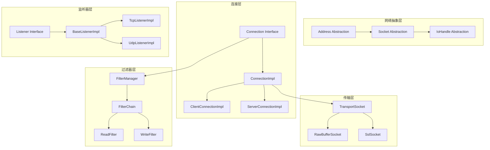
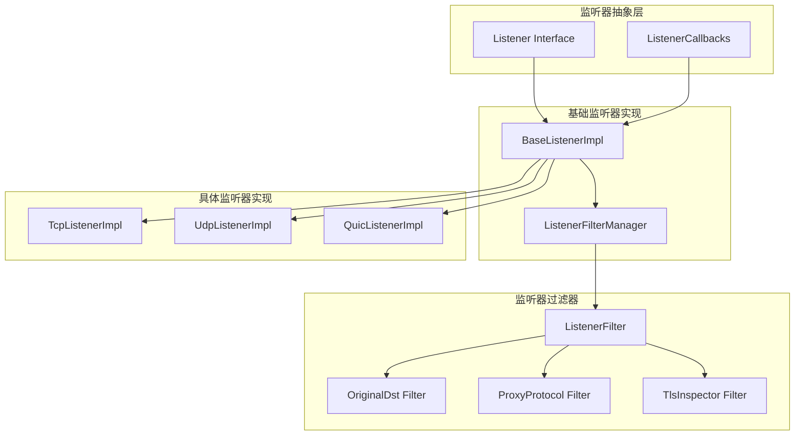
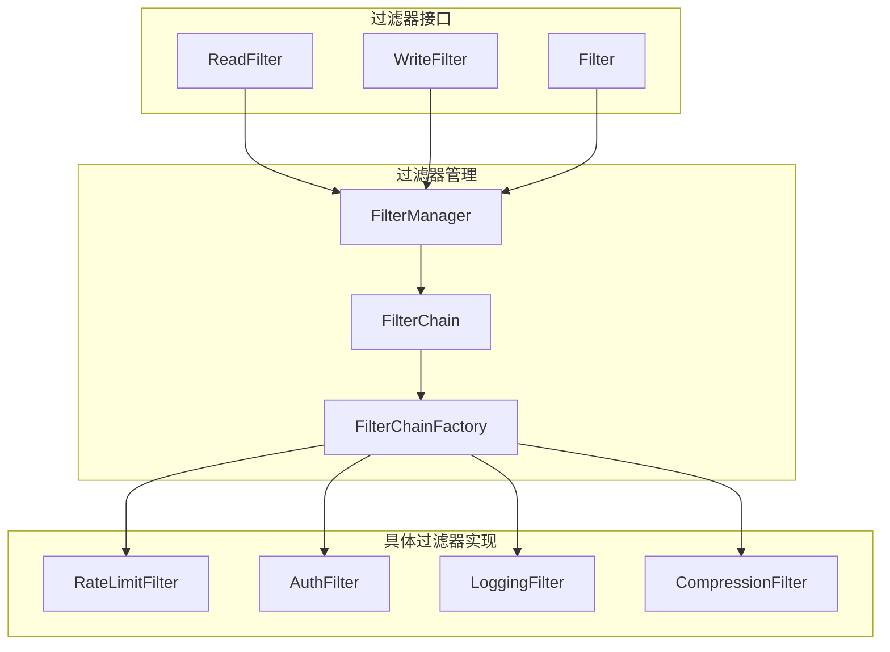
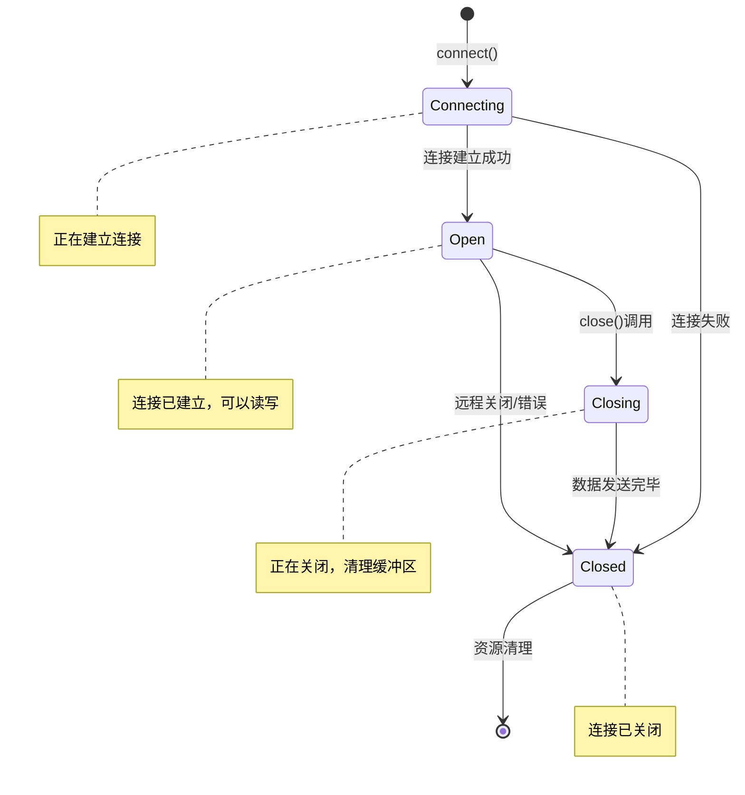
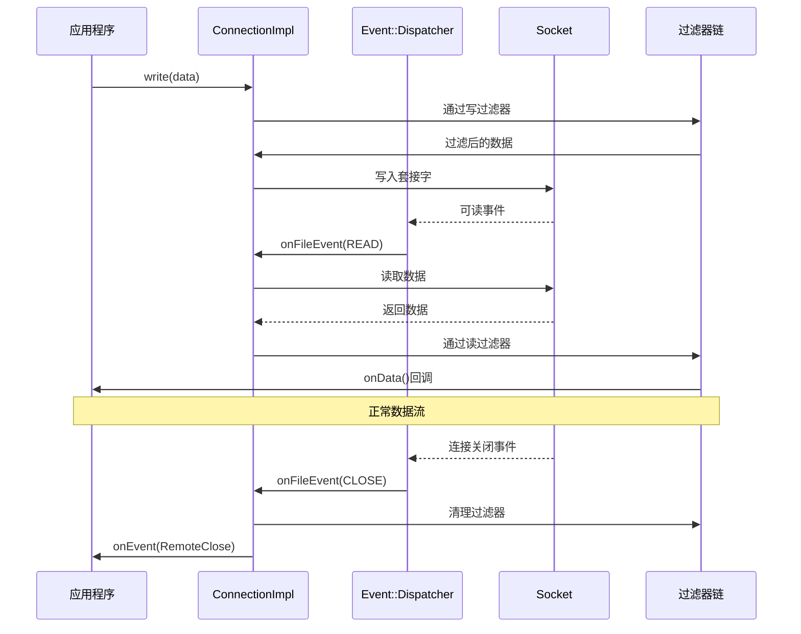
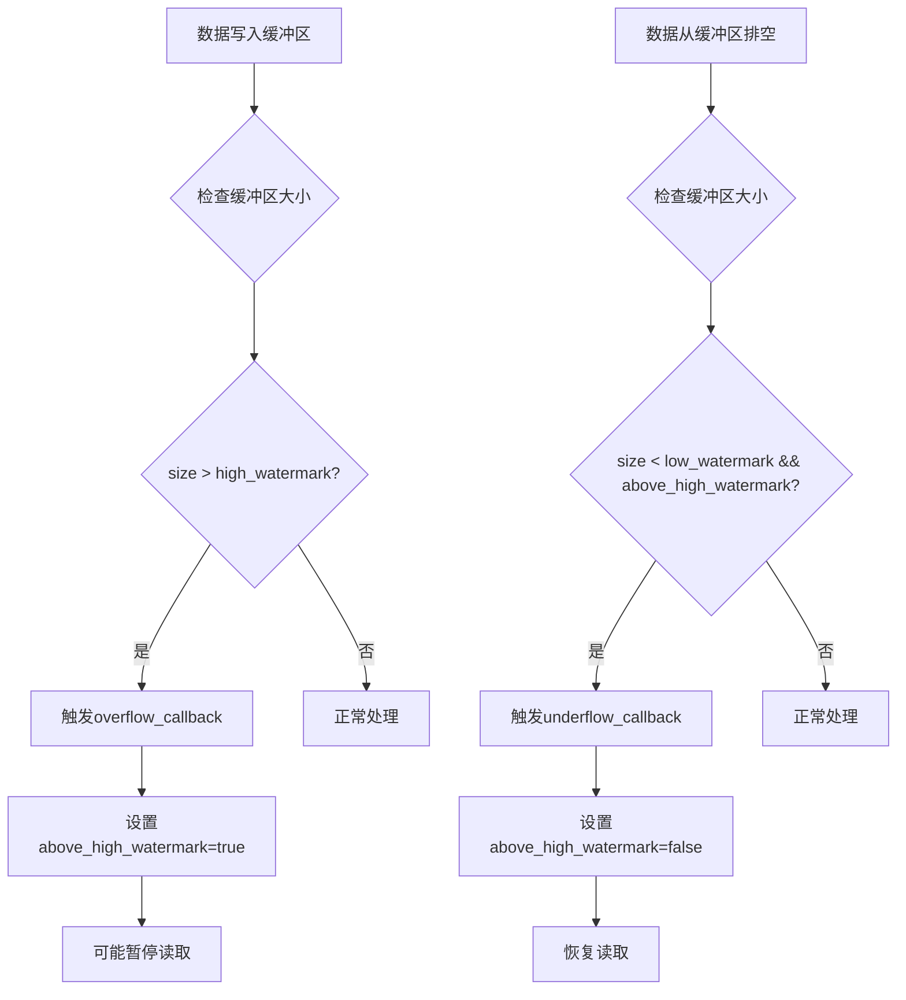
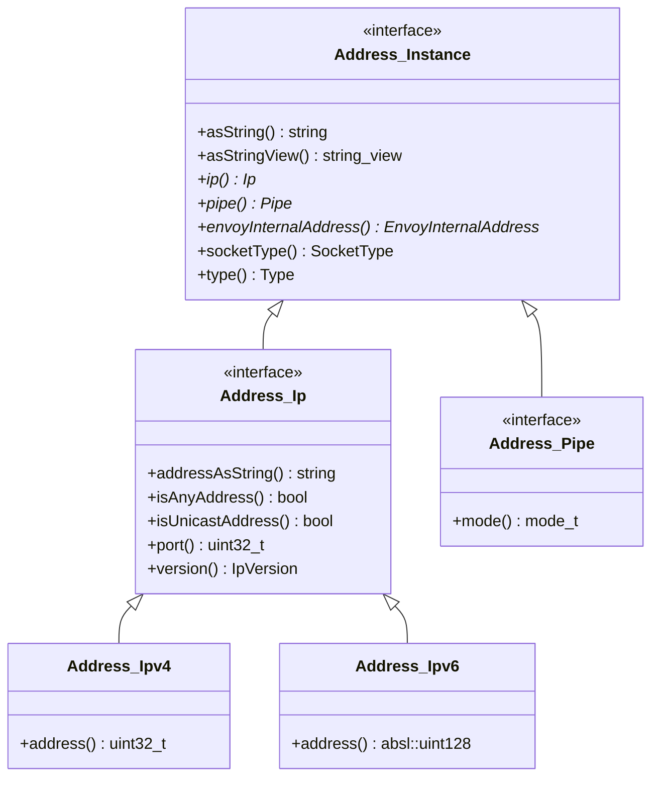
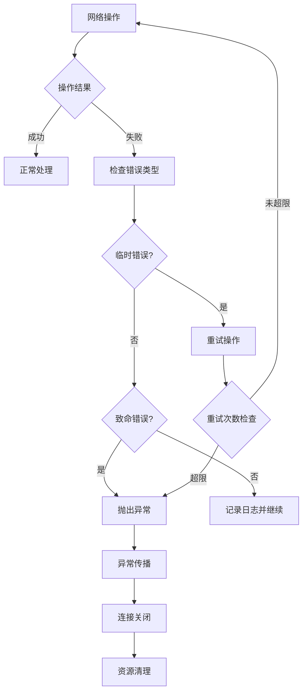
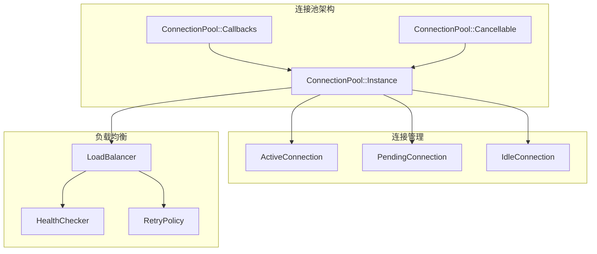

# Network模块详细分析

## 模块概览

Network模块是Envoy的网络抽象层，提供了跨平台的网络I/O能力，封装了底层的socket操作，并提供了连接管理、监听器管理、过滤器链等核心网络功能。

### 模块位置
- **源码位置**: `source/common/network/`
- **头文件位置**: `envoy/network/`
- **主要组件**: Connection、Listener、Filter、Address等

### 核心职责

1. **连接管理**: 管理客户端和服务端连接的生命周期
2. **监听器管理**: 处理端口监听和新连接接受
3. **过滤器链**: 提供网络级别的过滤器框架
4. **地址抽象**: 统一的网络地址表示和操作
5. **传输层抽象**: 支持TCP、UDP、Unix Domain Socket等
6. **SSL/TLS支持**: 传输层安全连接管理

## 架构图



## 核心接口和类分析

### 1. Network::Connection 接口

#### 连接抽象的核心接口

```cpp
/**
 * Network::Connection 是所有网络连接的基础抽象接口
 * 它提供了连接的通用操作，包括读写数据、状态管理、回调注册等
 */
class Connection : public Event::DeferredDeletable,
                   public FilterManager {
public:
  /**
   * 连接状态枚举
   */
  enum class State {
    Open,     // 连接打开状态
    Closing,  // 连接正在关闭  
    Closed    // 连接已关闭
  };

  /**
   * 连接关闭类型枚举
   */  
  enum class ConnectionCloseType {
    FlushWrite,           // 刷新写缓冲后关闭
    NoFlush,             // 立即关闭，不刷新缓冲
    FlushWriteAndDelay   // 刷新写缓冲并延迟关闭
  };

  virtual ~Connection() = default;

  /**
   * 添加连接回调处理器
   * @param cb 连接回调处理器引用
   */
  virtual void addConnectionCallbacks(ConnectionCallbacks& cb) PURE;

  /**
   * 添加字节发送回调
   * @param cb 字节发送回调函数
   */
  virtual void addBytesSentCallback(BytesSentCb cb) PURE;

  /**
   * 启用半关闭模式
   * @param enabled 是否启用
   */
  virtual void enableHalfClose(bool enabled) PURE;

  /**
   * 检查是否启用了半关闭
   * @return 是否启用半关闭
   */
  virtual bool isHalfCloseEnabled() const PURE;

  /**
   * 关闭连接
   * @param type 关闭类型
   */
  virtual void close(ConnectionCloseType type) PURE;

  /**
   * 关闭连接（带详情）
   * @param type 关闭类型
   * @param details 关闭详情描述
   */
  virtual void close(ConnectionCloseType type, absl::string_view details) PURE;

  /**
   * 获取事件分发器
   * @return 事件分发器引用
   */
  virtual Event::Dispatcher& dispatcher() PURE;

  /**
   * 获取下一个协议（用于协议协商）
   * @return 协议名称字符串
   */
  virtual std::string nextProtocol() const PURE;

  /**
   * 设置TCP_NODELAY选项
   * @param enable 是否启用
   */
  virtual void noDelay(bool enable) PURE;

  /**
   * 禁用/启用读取
   * @param disable 是否禁用读取
   * @return 读禁用状态
   */
  virtual ReadDisableStatus readDisable(bool disable) PURE;

  /**
   * 当读取被禁用时检测早期关闭
   * @param value 是否检测
   */
  virtual void detectEarlyCloseWhenReadDisabled(bool value) PURE;

  /**
   * 检查读取是否启用
   * @return 是否启用读取
   */
  virtual bool readEnabled() const PURE;

  /**
   * 获取连接信息设置器
   * @return 连接信息设置器引用
   */
  virtual ConnectionInfoSetter& connectionInfoSetter() PURE;

  /**
   * 获取连接信息提供者
   * @return 连接信息提供者常量引用
   */
  virtual const ConnectionInfoProvider& connectionInfoProvider() const PURE;

  /**
   * 获取连接信息提供者的共享指针
   * @return 连接信息提供者共享指针
   */
  virtual ConnectionInfoProviderSharedPtr connectionInfoProviderSharedPtr() const PURE;

  /**
   * 获取Unix域套接字对等凭据
   * @return 可选的对等凭据
   */
  virtual absl::optional<UnixDomainSocketPeerCredentials> 
          unixSocketPeerCredentials() const PURE;

  /**
   * 获取SSL连接信息
   * @return SSL连接信息的常量共享指针
   */
  virtual Ssl::ConnectionInfoConstSharedPtr ssl() const PURE;

  /**
   * 获取连接状态
   * @return 当前连接状态
   */
  virtual State state() const PURE;

  /**
   * 检查是否正在连接中
   * @return 是否正在连接
   */
  virtual bool connecting() const PURE;

  /**
   * 写入数据到连接
   * @param data 要写入的数据缓冲区
   * @param end_stream 是否结束流
   */
  virtual void write(Buffer::Instance& data, bool end_stream) PURE;

  /**
   * 设置缓冲区限制
   * @param limit 缓冲区大小限制（字节）
   */
  virtual void setBufferLimits(uint32_t limit) PURE;

  /**
   * 获取缓冲区限制
   * @return 缓冲区大小限制
   */
  virtual uint32_t bufferLimit() const PURE;

  /**
   * 检查是否超过高水位线
   * @return 是否超过高水位线
   */
  virtual bool aboveHighWatermark() const PURE;

  /**
   * 获取套接字选项
   * @return 套接字选项的共享指针
   */
  virtual const ConnectionSocket::OptionsSharedPtr& socketOptions() const PURE;

  /**
   * 设置套接字选项
   * @param name 选项名称
   * @param value 选项值
   * @return 是否设置成功
   */
  virtual bool setSocketOption(Network::SocketOptionName name, 
                              absl::Span<uint8_t> value) PURE;

  /**
   * 获取请求的服务器名称（SNI）
   * @return 服务器名称
   */
  virtual absl::string_view requestedServerName() const PURE;

  /**
   * 获取流信息
   * @return 流信息引用
   */
  virtual StreamInfo::StreamInfo& streamInfo() PURE;
  virtual const StreamInfo::StreamInfo& streamInfo() const PURE;

  /**
   * 获取传输失败原因
   * @return 失败原因描述
   */
  virtual absl::string_view transportFailureReason() const PURE;

  /**
   * 启动安全传输
   * @return 是否成功启动
   */
  virtual bool startSecureTransport() PURE;

  /**
   * 获取最后一次往返时间
   * @return 可选的往返时间
   */
  virtual absl::optional<std::chrono::milliseconds> lastRoundTripTime() const PURE;

  /**
   * 配置初始拥塞窗口
   * @param bandwidth_bits_per_sec 带宽（比特每秒）
   * @param rtt 往返时间
   */
  virtual void configureInitialCongestionWindow(uint64_t bandwidth_bits_per_sec,
                                               std::chrono::microseconds rtt) PURE;

  /**
   * 获取拥塞窗口大小
   * @return 可选的拥塞窗口大小（字节）
   */
  virtual absl::optional<uint64_t> congestionWindowInBytes() const PURE;

  /**
   * 获取检测到的关闭类型
   * @return 检测到的关闭类型
   */
  virtual DetectedCloseType detectedCloseType() const PURE;
};
```

### 2. ConnectionImpl 实现类

#### 连接实现的核心逻辑

```cpp
/**
 * ConnectionImpl 是 Network::Connection 接口的具体实现
 * 负责管理连接的完整生命周期、I/O操作和事件处理
 */
class ConnectionImpl : public ConnectionImplBase, 
                       public TransportSocketCallbacks {
public:
  /**
   * 构造函数
   * @param dispatcher 事件分发器
   * @param socket 连接套接字
   * @param transport_socket 传输套接字
   * @param stream_info 流信息
   * @param connected 是否已连接
   */
  ConnectionImpl(Event::Dispatcher& dispatcher, 
                 ConnectionSocketPtr&& socket,
                 TransportSocketPtr&& transport_socket, 
                 StreamInfo::StreamInfo& stream_info,
                 bool connected);

  ~ConnectionImpl() override;

  // Network::FilterManager 接口实现
  
  /**
   * 添加写过滤器
   * @param filter 写过滤器共享指针
   */
  void addWriteFilter(WriteFilterSharedPtr filter) override;
  
  /**
   * 添加读写过滤器
   * @param filter 读写过滤器共享指针
   */
  void addFilter(FilterSharedPtr filter) override;
  
  /**
   * 添加读过滤器
   * @param filter 读过滤器共享指针
   */
  void addReadFilter(ReadFilterSharedPtr filter) override;
  
  /**
   * 移除读过滤器
   * @param filter 要移除的读过滤器
   */
  void removeReadFilter(ReadFilterSharedPtr filter) override;
  
  /**
   * 初始化读过滤器链
   * @return 是否成功初始化
   */
  bool initializeReadFilters() override;

  // Network::Connection 接口实现
  
  /**
   * 添加字节发送回调
   * @param cb 字节发送回调函数
   */
  void addBytesSentCallback(BytesSentCb cb) override;
  
  /**
   * 启用/禁用半关闭
   * @param enabled 是否启用
   */
  void enableHalfClose(bool enabled) override;
  
  /**
   * 检查是否启用半关闭
   * @return 是否启用半关闭
   */
  bool isHalfCloseEnabled() const override { 
    return enable_half_close_; 
  }
  
  /**
   * 关闭连接
   * @param type 关闭类型
   */
  void close(ConnectionCloseType type) final;
  
  /**
   * 关闭连接（带详情）
   * @param type 关闭类型  
   * @param details 关闭详情
   */
  void close(ConnectionCloseType type, absl::string_view details) override {
    if (!details.empty()) {
      setLocalCloseReason(details);
    }
    close(type);
  }

  /**
   * 获取下一个协议
   * @return 协议名称
   */
  std::string nextProtocol() const override { 
    return transport_socket_->protocol(); 
  }
  
  /**
   * 设置TCP_NODELAY
   * @param enable 是否启用
   */
  void noDelay(bool enable) override;
  
  /**
   * 禁用/启用读取
   * @param disable 是否禁用
   * @return 读禁用状态
   */
  ReadDisableStatus readDisable(bool disable) override;
  
  /**
   * 当读取禁用时检测早期关闭
   * @param value 是否检测
   */
  void detectEarlyCloseWhenReadDisabled(bool value) override { 
    detect_early_close_ = value; 
  }
  
  /**
   * 检查读取是否启用
   * @return 是否启用读取
   */
  bool readEnabled() const override;

  /**
   * 获取连接状态
   * @return 当前连接状态
   */
  State state() const override;
  
  /**
   * 检查是否正在连接
   * @return 是否正在连接
   */
  bool connecting() const override {
    ENVOY_CONN_LOG_EVENT(debug, "connection_connecting_state", 
                         "current connecting state: {}", *this, connecting_);
    return connecting_;
  }
  
  /**
   * 写入数据
   * @param data 数据缓冲区
   * @param end_stream 是否结束流
   */
  void write(Buffer::Instance& data, bool end_stream) override;
  
  /**
   * 设置缓冲区限制
   * @param limit 限制大小
   */
  void setBufferLimits(uint32_t limit) override;
  
  /**
   * 获取缓冲区限制
   * @return 限制大小
   */
  uint32_t bufferLimit() const override { 
    return read_buffer_limit_; 
  }
  
  /**
   * 检查是否超过高水位线
   * @return 是否超过高水位线
   */
  bool aboveHighWatermark() const override { 
    return write_buffer_above_high_watermark_; 
  }

  /**
   * 获取流信息
   * @return 流信息引用
   */
  StreamInfo::StreamInfo& streamInfo() override { 
    return stream_info_; 
  }
  const StreamInfo::StreamInfo& streamInfo() const override { 
    return stream_info_; 
  }

  // Network::TransportSocketCallbacks 接口实现
  
  /**
   * 获取I/O句柄
   * @return I/O句柄引用
   */
  IoHandle& ioHandle() final { 
    return socket_->ioHandle(); 
  }
  const IoHandle& ioHandle() const override { 
    return socket_->ioHandle(); 
  }
  
  /**
   * 获取连接引用
   * @return 连接引用
   */
  Connection& connection() override { 
    return *this; 
  }
  
  /**
   * 触发连接事件
   * @param event 连接事件
   */
  void raiseEvent(ConnectionEvent event) override;
  
  /**
   * 检查是否应该排空读缓冲区
   * @return 是否应该排空
   */
  bool shouldDrainReadBuffer() override {
    return read_buffer_limit_ > 0 && 
           read_buffer_->length() >= read_buffer_limit_;
  }
  
  /**
   * 标记传输套接字可读
   */
  void setTransportSocketIsReadable() override;
  
  /**
   * 刷新写缓冲区
   */
  void flushWriteBuffer() override;

protected:
  /**
   * 检查过滤器链是否需要数据
   * @return 是否需要数据
   */
  bool filterChainWantsData();
  
  /**
   * 立即关闭连接
   */
  void closeConnectionImmediately() final;
  
  /**
   * 通过过滤器管理器关闭连接
   * @param close_action 关闭动作
   */
  void closeThroughFilterManager(ConnectionCloseAction close_action);
  
  /**
   * 关闭套接字
   * @param close_type 关闭事件类型
   */
  void closeSocket(ConnectionEvent close_type);
  
  /**
   * 读缓冲区低水位线回调
   */
  void onReadBufferLowWatermark();
  
  /**
   * 读缓冲区高水位线回调
   */
  void onReadBufferHighWatermark();
  
  /**
   * 写缓冲区低水位线回调
   */
  void onWriteBufferLowWatermark();
  
  /**
   * 写缓冲区高水位线回调
   */
  void onWriteBufferHighWatermark();
  
  /**
   * 连接建立时的回调（虚函数，子类可重写）
   */
  virtual void onConnected();

private:
  // 事件处理相关方法
  void onFileEvent(uint32_t events);
  void onRead(uint64_t read_buffer_size);
  void onReadReady();
  void onWriteReady();
  void updateReadBufferStats(uint64_t num_read, uint64_t new_size);
  void updateWriteBufferStats(uint64_t num_written, uint64_t new_size);
  void write(Buffer::Instance& data, bool end_stream, bool through_filter_chain);
  bool bothSidesHalfClosed();
  void setDetectedCloseType(DetectedCloseType close_type);
  void closeInternal(ConnectionCloseType type);

  // 核心组件
  TransportSocketPtr transport_socket_;     // 传输套接字
  ConnectionSocketPtr socket_;              // 连接套接字  
  StreamInfo::StreamInfo& stream_info_;     // 流信息
  FilterManagerImpl filter_manager_;        // 过滤器管理器
  
  // 缓冲区管理
  Buffer::InstancePtr write_buffer_;        // 写缓冲区（总是分配，永不为nullptr）
  Buffer::InstancePtr read_buffer_;         // 读缓冲区（总是分配，永不为nullptr）
  uint32_t read_buffer_limit_ = 0;         // 读缓冲区限制
  
  // 连接状态
  bool connecting_{false};                  // 是否正在连接
  ConnectionEvent immediate_error_event_{ConnectionEvent::Connected}; // 立即错误事件
  bool bind_error_{false};                 // 绑定错误标志
  
  // 私有成员变量
  static std::atomic<uint64_t> next_global_id_;  // 下一个全局ID
  std::list<BytesSentCb> bytes_sent_callbacks_;  // 字节发送回调列表
  std::string failure_reason_;             // 失败原因
  uint64_t last_read_buffer_size_{};       // 上次读缓冲区大小
  uint64_t last_write_buffer_size_{};      // 上次写缓冲区大小
  Buffer::Instance* current_write_buffer_{}; // 当前写缓冲区
  uint32_t read_disable_count_{0};         // 读禁用计数
  DetectedCloseType detected_close_type_{DetectedCloseType::Normal}; // 检测到的关闭类型
  
  // 位域标志（节省内存）
  bool write_buffer_above_high_watermark_ : 1;  // 写缓冲区是否超过高水位线
  bool detect_early_close_ : 1;                 // 是否检测早期关闭
  bool enable_half_close_ : 1;                  // 是否启用半关闭
  bool read_end_stream_raised_ : 1;             // 是否已触发读结束流事件
  bool read_end_stream_ : 1;                    // 读是否结束流
  bool write_end_stream_ : 1;                   // 写是否结束流
  bool current_write_end_stream_ : 1;           // 当前写是否结束流
  bool dispatch_buffered_data_ : 1;             // 是否分发缓冲数据
  bool transport_wants_read_ : 1;               // 传输层是否需要读取
  bool enable_close_through_filter_manager_ : 1; // 是否通过过滤器管理器关闭
};
```

### 3. 客户端和服务端连接实现

#### ServerConnectionImpl - 服务端连接

```cpp
/**
 * ServerConnectionImpl 服务端连接实现
 * 继承自ConnectionImpl，添加了服务端特有的功能
 */
class ServerConnectionImpl : public ConnectionImpl, 
                             virtual public ServerConnection {
public:
  /**
   * 构造函数
   * @param dispatcher 事件分发器
   * @param socket 连接套接字
   * @param transport_socket 传输套接字  
   * @param stream_info 流信息
   */
  ServerConnectionImpl(Event::Dispatcher& dispatcher, 
                       ConnectionSocketPtr&& socket,
                       TransportSocketPtr&& transport_socket, 
                       StreamInfo::StreamInfo& stream_info);

  // ServerConnection 接口实现
  
  /**
   * 设置传输套接字连接超时
   * @param timeout 超时时间
   * @param timeout_stat 超时统计计数器
   */
  void setTransportSocketConnectTimeout(std::chrono::milliseconds timeout,
                                       Stats::Counter& timeout_stat) override;
  
  /**
   * 触发连接事件（重写父类方法）
   * @param event 连接事件
   */
  void raiseEvent(ConnectionEvent event) override;
  
  /**
   * 初始化读过滤器（重写父类方法）
   * @return 是否成功初始化
   */
  bool initializeReadFilters() override;

private:
  /**
   * 传输套接字连接超时回调
   */
  void onTransportSocketConnectTimeout();

  bool transport_connect_pending_{true};           // 传输连接是否等待中
  Event::TimerPtr transport_socket_connect_timer_; // 传输套接字连接定时器
  Stats::Counter* transport_socket_timeout_stat_;  // 超时统计计数器
};
```

#### ClientConnectionImpl - 客户端连接

```cpp
/**
 * ClientConnectionImpl 客户端连接实现
 * 继承自ConnectionImpl，添加了客户端特有的功能
 */
class ClientConnectionImpl : public ConnectionImpl, 
                             virtual public ClientConnection {
public:
  /**
   * 构造函数（使用地址创建）
   * @param dispatcher 事件分发器
   * @param remote_address 远程地址
   * @param source_address 源地址  
   * @param transport_socket 传输套接字
   * @param options 套接字选项
   * @param transport_options 传输选项
   */
  ClientConnectionImpl(Event::Dispatcher& dispatcher,
                       const Address::InstanceConstSharedPtr& remote_address,
                       const Address::InstanceConstSharedPtr& source_address,
                       Network::TransportSocketPtr&& transport_socket,
                       const Network::ConnectionSocket::OptionsSharedPtr& options,
                       const Network::TransportSocketOptionsConstSharedPtr& transport_options);

  /**
   * 构造函数（使用现有套接字）
   * @param dispatcher 事件分发器
   * @param socket 连接套接字
   * @param source_address 源地址
   * @param transport_socket 传输套接字
   * @param options 套接字选项  
   * @param transport_options 传输选项
   */
  ClientConnectionImpl(Event::Dispatcher& dispatcher, 
                       std::unique_ptr<ConnectionSocket> socket,
                       const Address::InstanceConstSharedPtr& source_address,
                       Network::TransportSocketPtr&& transport_socket,
                       const Network::ConnectionSocket::OptionsSharedPtr& options,
                       const Network::TransportSocketOptionsConstSharedPtr& transport_options);

  // Network::ClientConnection 接口实现
  
  /**
   * 发起连接
   */
  void connect() override;

private:
  /**
   * 连接建立时的回调（重写父类方法）
   */
  void onConnected() override;

  StreamInfo::StreamInfoImpl stream_info_;  // 流信息实现
};
```

## 监听器系统

### 监听器架构



### BaseListenerImpl 基础监听器

```cpp
/**
 * BaseListenerImpl 基础监听器实现
 * 提供了监听器的通用功能，包括套接字管理、连接接受等
 */
class BaseListenerImpl : public Listener, 
                         protected Logger::Loggable<Logger::Id::connection> {
public:
  /**
   * 构造函数
   * @param socket 监听套接字
   * @param cb 监听器回调
   * @param bind_to_port 是否绑定端口
   * @param backlog_size 监听队列大小
   */
  BaseListenerImpl(SocketSharedPtr socket, 
                   ListenerCallbacks& cb,
                   bool bind_to_port, 
                   uint32_t backlog_size);

  ~BaseListenerImpl() override = default;

  // Listener 接口实现
  
  /**
   * 禁用监听器
   */
  void disable() final;
  
  /**
   * 启用监听器  
   */
  void enable() final;
  
  /**
   * 绑定套接字到地址
   * @return 绑定的实际地址
   */
  Address::InstanceConstSharedPtr bindSocket();

protected:
  /**
   * 获取监听器回调
   * @return 监听器回调引用
   */
  ListenerCallbacks& cb() { 
    return cb_; 
  }
  
  /**
   * 获取监听套接字
   * @return 套接字引用
   */
  Socket& socket() { 
    return *socket_; 
  }

  /**
   * 纯虚函数：处理接受新连接
   * 由子类实现具体的连接接受逻辑
   * @param fd 新连接的文件描述符
   * @param remote_address 远程地址
   * @param local_address 本地地址  
   */
  virtual void onAccept(ConnectionSocketPtr&& socket) PURE;

  /**
   * 纯虚函数：处理监听器错误
   * @param error_code 错误代码
   * @param error_message 错误消息
   */
  virtual void onError(const std::string& error_code, 
                      const std::string& error_message) PURE;

private:
  /**
   * 文件事件处理
   * @param events 事件类型
   */
  void onFileEvent(uint32_t events);
  
  /**
   * 监听器接受连接处理
   */  
  void onListenerAccept();

  ListenerCallbacks& cb_;           // 监听器回调
  SocketSharedPtr socket_;          // 监听套接字
  Event::FileEventPtr file_event_;  // 文件事件
  bool bind_to_port_;              // 是否绑定端口
  uint32_t backlog_size_;          // 监听队列大小
};
```

### TcpListenerImpl TCP监听器

```cpp
/**
 * TcpListenerImpl TCP监听器实现
 * 专门处理TCP连接的监听和接受
 */
class TcpListenerImpl : public BaseListenerImpl {
public:
  /**
   * 构造函数
   * @param dispatcher 事件分发器
   * @param api API接口
   * @param socket 监听套接字
   * @param cb 监听器回调
   * @param bind_to_port 是否绑定端口
   * @param backlog_size 监听队列大小
   * @param prefer_exact_match_on_universal_listener 是否在通用监听器上首选精确匹配
   */
  TcpListenerImpl(Event::Dispatcher& dispatcher,
                  Api::Api& api,
                  SocketSharedPtr socket,
                  TcpListenerCallbacks& cb, 
                  bool bind_to_port,
                  uint32_t backlog_size,
                  bool prefer_exact_match_on_universal_listener = false);

  // Listener 接口实现
  void disable() override;
  void enable() override;

protected:
  // BaseListenerImpl 虚函数实现
  
  /**
   * 处理新TCP连接
   * @param socket 新连接套接字
   */
  void onAccept(ConnectionSocketPtr&& socket) override;
  
  /**
   * 处理监听器错误
   * @param error_code 错误代码
   * @param error_message 错误消息  
   */
  void onError(const std::string& error_code, 
              const std::string& error_message) override;

private:
  /**
   * 重新启用监听器
   */
  void doReject();
  
  /**
   * 拒绝连接并记录信息
   * @param socket 要拒绝的套接字
   */  
  void rejectConnection(ConnectionSocketPtr&& socket);

  Event::Dispatcher& dispatcher_;      // 事件分发器
  Api::Api& api_;                     // API接口
  TcpListenerCallbacks& tcp_cb_;      // TCP监听器回调
  Event::TimerPtr reject_timer_;      // 拒绝连接定时器
  uint64_t connections_rejected_{};   // 拒绝连接计数
  bool prefer_exact_match_on_universal_listener_; // 是否首选精确匹配
};
```

## 过滤器系统

### 过滤器架构



### 过滤器接口定义

#### ReadFilter 读过滤器

```cpp
/**
 * ReadFilter 读过滤器接口
 * 用于处理从网络读取的数据
 */
class ReadFilter {
public:
  virtual ~ReadFilter() = default;

  /**
   * 过滤器状态枚举
   */
  enum class FilterStatus {
    Continue,        // 继续处理
    StopIteration   // 停止迭代
  };

  /**
   * 当新连接建立时调用
   * @return 过滤器状态
   */
  virtual FilterStatus onNewConnection() PURE;

  /**
   * 当有数据可读时调用
   * @param data 读取的数据缓冲区
   * @param end_stream 是否为流的结束
   * @return 过滤器状态
   */
  virtual FilterStatus onData(Buffer::Instance& data, bool end_stream) PURE;

  /**
   * 初始化读过滤器回调
   * @param callbacks 读过滤器回调接口
   */
  virtual void initializeReadFilterCallbacks(ReadFilterCallbacks& callbacks) PURE;
};
```

#### WriteFilter 写过滤器

```cpp
/**
 * WriteFilter 写过滤器接口
 * 用于处理向网络写入的数据
 */
class WriteFilter {
public:
  virtual ~WriteFilter() = default;

  /**
   * 过滤器状态枚举
   */
  enum class FilterStatus {
    Continue,        // 继续处理
    StopIteration   // 停止迭代  
  };

  /**
   * 当有数据要写入时调用
   * @param data 要写入的数据缓冲区
   * @param end_stream 是否为流的结束
   * @return 过滤器状态
   */
  virtual FilterStatus onWrite(Buffer::Instance& data, bool end_stream) PURE;

  /**
   * 初始化写过滤器回调
   * @param callbacks 写过滤器回调接口
   */
  virtual void initializeWriteFilterCallbacks(WriteFilterCallbacks& callbacks) PURE;
};
```

#### FilterManager 过滤器管理器

```cpp
/**
 * FilterManager 过滤器管理器接口
 * 管理连接上的过滤器链
 */
class FilterManager {
public:
  virtual ~FilterManager() = default;

  /**
   * 添加读过滤器到过滤器链
   * @param filter 读过滤器共享指针
   */
  virtual void addReadFilter(ReadFilterSharedPtr filter) PURE;

  /**
   * 添加写过滤器到过滤器链
   * @param filter 写过滤器共享指针
   */
  virtual void addWriteFilter(WriteFilterSharedPtr filter) PURE;

  /**
   * 添加读写过滤器到过滤器链
   * @param filter 读写过滤器共享指针
   */
  virtual void addFilter(FilterSharedPtr filter) PURE;

  /**
   * 移除读过滤器
   * @param filter 要移除的读过滤器
   */
  virtual void removeReadFilter(ReadFilterSharedPtr filter) PURE;

  /**
   * 初始化读过滤器链
   * @return 是否成功初始化
   */
  virtual bool initializeReadFilters() PURE;
};
```

## 连接生命周期管理

### 连接状态转换图



### 连接事件处理时序图



## 缓冲区管理

### 水位线机制

Network模块使用水位线机制来管理内存使用和流控：

```cpp
/**
 * 水位线缓冲区实现
 * 当缓冲区大小超过高水位线时，触发回压机制
 * 当缓冲区大小低于低水位线时，恢复正常流量
 */
class WatermarkBuffer : public Buffer::Instance {
public:
  /**
   * 水位线回调函数类型
   */
  using OverflowCallback = std::function<void()>;
  using UnderflowCallback = std::function<void()>;

  /**
   * 构造函数
   * @param high_watermark 高水位线（字节）
   * @param low_watermark 低水位线（字节）
   * @param overflow_callback 溢出回调
   * @param underflow_callback 下溢回调
   */
  WatermarkBuffer(uint32_t high_watermark,
                  uint32_t low_watermark,
                  OverflowCallback overflow_callback,
                  UnderflowCallback underflow_callback);

  // Buffer::Instance 接口实现
  void add(const void* data, uint64_t size) override;
  void add(absl::string_view data) override;
  void add(const Buffer::Instance& data) override;
  void prepend(absl::string_view data) override;
  void prepend(Buffer::Instance& data) override;
  void commit(Buffer::RawSlice* iovecs, uint64_t num_iovecs) override;
  void drain(uint64_t size) override;
  uint64_t getRawSlices(Buffer::RawSlice* out, uint64_t out_size) const override;
  Buffer::Slice getSlice() const override;
  uint64_t length() const override;
  void* linearize(uint32_t size) override;
  void move(Buffer::Instance& rhs) override;
  void move(Buffer::Instance& rhs, uint64_t length) override;
  Api::SysCallIntResult read(Network::IoHandle& io_handle, uint64_t max_length) override;
  uint64_t reserve(uint64_t length, Buffer::RawSlice* iovecs, uint64_t num_iovecs) override;
  ssize_t search(const void* data, uint64_t size, size_t start) const override;
  bool startsWith(absl::string_view data) const override;
  std::string toString() const override;
  Api::SysCallIntResult write(Network::IoHandle& io_handle) override;

private:
  /**
   * 检查水位线
   */
  void checkLowWatermark();
  void checkHighWatermark();

  Buffer::OwnedImpl buffer_;           // 底层缓冲区
  const uint32_t high_watermark_;      // 高水位线
  const uint32_t low_watermark_;       // 低水位线
  OverflowCallback overflow_callback_; // 溢出回调
  UnderflowCallback underflow_callback_; // 下溢回调
  bool above_high_watermark_{false};   // 是否超过高水位线
};
```

### 缓冲区水位线流程图



## 地址抽象

### Address 接口层次



### InstanceConstSharedPtr 地址实现

```cpp
/**
 * Address::Instance 网络地址抽象接口
 * 提供统一的地址表示，支持IPv4、IPv6、Unix域套接字等
 */
class Instance {
public:
  /**
   * 地址类型枚举
   */
  enum class Type { 
    Ip,                    // IP地址（IPv4或IPv6）
    Pipe,                  // Unix域套接字
    EnvoyInternal         // Envoy内部地址
  };

  /**
   * 套接字类型枚举
   */
  enum class SocketType { 
    Stream,               // 流套接字（TCP）
    Datagram             // 数据报套接字（UDP）
  };

  virtual ~Instance() = default;

  /**
   * 运算符重载，比较两个地址是否相等
   * @param rhs 右侧地址
   * @return 是否相等
   */
  virtual bool operator==(const Instance& rhs) const PURE;

  /**
   * 获取地址的字符串表示
   * @return 地址字符串
   */
  virtual const std::string& asString() const PURE;

  /**
   * 获取地址的字符串视图
   * @return 地址字符串视图
   */
  virtual absl::string_view asStringView() const PURE;

  /**
   * 如果是IP地址，返回IP接口指针
   * @return IP接口指针，如果不是IP地址则返回nullptr
   */
  virtual const Ip* ip() const PURE;

  /**
   * 如果是管道地址，返回Pipe接口指针
   * @return Pipe接口指针，如果不是管道地址则返回nullptr
   */
  virtual const Pipe* pipe() const PURE;

  /**
   * 如果是Envoy内部地址，返回EnvoyInternalAddress接口指针
   * @return EnvoyInternalAddress接口指针，如果不是内部地址则返回nullptr
   */
  virtual const EnvoyInternalAddress* envoyInternalAddress() const PURE;

  /**
   * 获取套接字类型
   * @return 套接字类型
   */
  virtual SocketType socketType() const PURE;

  /**
   * 获取地址类型
   * @return 地址类型
   */
  virtual Type type() const PURE;
};
```

## 传输层抽象

### TransportSocket 接口

```cpp
/**
 * TransportSocket 传输套接字接口
 * 提供传输层的抽象，支持原始套接字、TLS套接字等
 */
class TransportSocket {
public:
  /**
   * I/O结果结构
   */
  struct IoResult {
    PostIoAction action_;          // 后续动作
    uint64_t bytes_processed_;     // 处理的字节数
    bool end_stream_read_;         // 是否读到流结束
  };

  virtual ~TransportSocket() = default;

  /**
   * 设置传输套接字回调
   * @param callbacks 回调接口
   */
  virtual void setTransportSocketCallbacks(TransportSocketCallbacks& callbacks) PURE;

  /**
   * 获取协议名称（用于协议协商）
   * @return 协议名称
   */
  virtual std::string protocol() const PURE;

  /**
   * 检查传输套接字是否可以刷新关闭
   * @return 是否可以刷新关闭
   */
  virtual bool canFlushClose() PURE;

  /**
   * 关闭套接字，可选择是否刷新
   * @param type 关闭类型
   */
  virtual void closeSocket(Network::ConnectionEvent type) PURE;

  /**
   * 从传输套接字读取数据
   * @param buffer 读取数据的缓冲区
   * @return I/O操作结果
   */
  virtual IoResult doRead(Buffer::Instance& buffer) PURE;

  /**
   * 向传输套接字写入数据  
   * @param buffer 要写入的数据缓冲区
   * @param end_stream 是否为流结束
   * @return I/O操作结果
   */
  virtual IoResult doWrite(Buffer::Instance& buffer, bool end_stream) PURE;

  /**
   * 当底层连接建立时调用
   */
  virtual void onConnected() PURE;

  /**
   * 获取SSL连接信息（如果是SSL连接）
   * @return SSL连接信息，如果不是SSL连接则返回nullptr
   */
  virtual Ssl::ConnectionInfoConstSharedPtr ssl() const PURE;

  /**
   * 启动安全传输（对于需要握手的传输如TLS）
   * @return 是否成功启动
   */
  virtual bool startSecureTransport() PURE;

  /**
   * 配置初始拥塞窗口
   * @param bandwidth_bits_per_sec 带宽
   * @param rtt 往返时间
   */
  virtual void configureInitialCongestionWindow(uint64_t bandwidth_bits_per_sec,
                                               std::chrono::microseconds rtt) PURE;
};
```

### RawBufferSocket 原始套接字实现

```cpp
/**
 * RawBufferSocket 原始缓冲区套接字实现
 * 不进行加密或特殊处理的基础传输套接字
 */
class RawBufferSocket : public TransportSocket {
public:
  // TransportSocket 接口实现
  
  /**
   * 设置传输套接字回调
   * @param callbacks 回调接口
   */
  void setTransportSocketCallbacks(TransportSocketCallbacks& callbacks) override {
    callbacks_ = &callbacks;
  }

  /**
   * 获取协议名称
   * @return 空字符串（原始套接字无特定协议）
   */
  std::string protocol() const override { 
    return EMPTY_STRING; 
  }

  /**
   * 检查是否可以刷新关闭
   * @return 总是返回true
   */
  bool canFlushClose() override { 
    return true; 
  }

  /**
   * 关闭套接字
   * @param type 关闭事件类型
   */
  void closeSocket(Network::ConnectionEvent type) override {
    if (callbacks_) {
      callbacks_->raiseEvent(type);
    }
  }

  /**
   * 从底层I/O句柄读取数据
   * @param buffer 接收数据的缓冲区
   * @return I/O操作结果
   */
  IoResult doRead(Buffer::Instance& buffer) override {
    PostIoAction action = PostIoAction::KeepOpen;
    uint64_t bytes_to_read = 16384;  // 默认读取16KB
    
    if (callbacks_->shouldDrainReadBuffer()) {
      bytes_to_read = buffer.length();
      action = PostIoAction::KeepOpen;
    }

    Api::SysCallIntResult result = buffer.read(callbacks_->ioHandle(), bytes_to_read);
    
    if (result.return_value_ > 0) {
      // 成功读取数据
      return {action, static_cast<uint64_t>(result.return_value_), false};
    } else if (result.return_value_ == 0) {
      // 连接关闭
      return {PostIoAction::Close, 0, true};
    } else {
      // 读取错误
      ENVOY_CONN_LOG(debug, "read error: {}", callbacks_->connection(), result.errno_);
      return {PostIoAction::Close, 0, false};
    }
  }

  /**
   * 向底层I/O句柄写入数据
   * @param buffer 要写入的数据缓冲区
   * @param end_stream 是否为流结束
   * @return I/O操作结果
   */
  IoResult doWrite(Buffer::Instance& buffer, bool end_stream) override {
    UNREFERENCED_PARAMETER(end_stream);
    
    if (buffer.length() == 0) {
      return {PostIoAction::KeepOpen, 0, false};
    }

    Api::SysCallIntResult result = buffer.write(callbacks_->ioHandle());
    
    if (result.return_value_ > 0) {
      // 成功写入数据
      return {PostIoAction::KeepOpen, static_cast<uint64_t>(result.return_value_), false};
    } else {
      // 写入错误
      ENVOY_CONN_LOG(debug, "write error: {}", callbacks_->connection(), result.errno_);
      return {PostIoAction::Close, 0, false};
    }
  }

  /**
   * 连接建立时回调（原始套接字无需特殊处理）
   */
  void onConnected() override {
    // 原始套接字连接建立时无需特殊处理
  }

  /**
   * 获取SSL连接信息（原始套接字返回nullptr）
   * @return nullptr
   */
  Ssl::ConnectionInfoConstSharedPtr ssl() const override { 
    return nullptr; 
  }

  /**
   * 启动安全传输（原始套接字直接返回false）
   * @return false
   */
  bool startSecureTransport() override { 
    return false; 
  }

  /**
   * 配置初始拥塞窗口（原始套接字无需特殊处理）
   * @param bandwidth_bits_per_sec 带宽
   * @param rtt 往返时间
   */
  void configureInitialCongestionWindow(uint64_t bandwidth_bits_per_sec,
                                       std::chrono::microseconds rtt) override {
    // 原始套接字的拥塞窗口由底层TCP栈管理，无需特殊配置
    UNREFERENCED_PARAMETER(bandwidth_bits_per_sec);
    UNREFERENCED_PARAMETER(rtt);
  }

private:
  TransportSocketCallbacks* callbacks_{nullptr};  // 传输套接字回调
};
```

## 错误处理和异常机制

### 网络错误分类

Network模块定义了详细的错误分类体系：

```cpp
/**
 * NetworkException 网络异常基类
 * 所有网络相关的异常都继承自此类
 */
class NetworkException : public EnvoyException {
public:
  NetworkException(const std::string& message) : EnvoyException(message) {}
};

/**
 * CreateListenerException 监听器创建异常
 * 当监听器创建失败时抛出
 */
class CreateListenerException : public NetworkException {
public:
  CreateListenerException(const std::string& message) : NetworkException(message) {}
};

/**
 * SocketBindException 套接字绑定异常
 * 当套接字绑定失败时抛出
 */
class SocketBindException : public NetworkException {
public:
  SocketBindException(const std::string& message, int errno_value)
      : NetworkException(message), errno_(errno_value) {}
  
  int errno() const { return errno_; }

private:
  const int errno_;  // 系统错误代码
};

/**
 * ConnectionTimeoutException 连接超时异常
 * 当连接建立超时时抛出
 */
class ConnectionTimeoutException : public NetworkException {
public:
  ConnectionTimeoutException(const std::string& message) : NetworkException(message) {}
};
```

### 错误处理流程



## 性能优化特性

### 1. 零拷贝I/O

Network模块实现了零拷贝I/O机制，减少数据拷贝开销：

```cpp
/**
 * Buffer::OwnedImpl 中的零拷贝实现示例
 */
class OwnedImpl : public Instance {
public:
  /**
   * 移动语义实现，避免数据拷贝
   * @param rhs 源缓冲区
   */
  void move(Instance& rhs) override {
    // 直接移动缓冲区片段，无需拷贝数据
    move(rhs, rhs.length());
  }

  /**
   * 从I/O句柄直接读取到缓冲区，避免中间拷贝
   * @param io_handle I/O句柄
   * @param max_length 最大读取长度
   * @return 系统调用结果
   */
  Api::SysCallIntResult read(Network::IoHandle& io_handle, 
                            uint64_t max_length) override {
    // 直接从socket读取到内部缓冲区，零拷贝
    constexpr uint64_t MaxSlices = 2;
    RawSlice slices[MaxSlices];
    const uint64_t num_slices = reserve(max_length, slices, MaxSlices);
    
    Api::SysCallIntResult result = io_handle.readv(slices, num_slices);
    
    if (result.return_value_ > 0) {
      commit(slices, num_slices);
    }
    
    return result;
  }

  /**
   * 直接写入到I/O句柄，避免中间拷贝
   * @param io_handle I/O句柄
   * @return 系统调用结果
   */
  Api::SysCallIntResult write(Network::IoHandle& io_handle) override {
    constexpr uint64_t MaxSlices = 16;
    RawSlice slices[MaxSlices];
    const uint64_t num_slices = getRawSlices(slices, MaxSlices);
    
    Api::SysCallIntResult result = io_handle.writev(slices, num_slices);
    
    if (result.return_value_ > 0) {
      drain(result.return_value_);
    }
    
    return result;
  }
};
```

### 2. 连接池管理

为了提升性能和资源利用率，Network模块提供连接池功能：



### 3. 事件驱动架构

Network模块基于libevent实现高效的事件驱动I/O：

```cpp
/**
 * Event::FileEventImpl libevent文件事件实现
 */
class FileEventImpl : public FileEvent {
public:
  /**
   * 构造函数
   * @param dispatcher 事件分发器
   * @param fd 文件描述符
   * @param cb 事件回调
   * @param trigger 触发类型
   * @param events 监听的事件
   */
  FileEventImpl(DispatcherImpl& dispatcher,
                os_fd_t fd,
                FileReadyCb cb,
                FileTriggerType trigger,
                uint32_t events);

  ~FileEventImpl() override;

  // FileEvent 接口实现
  
  /**
   * 激活事件（用于Edge Triggered模式）
   * @param events 要激活的事件
   */
  void activate(uint32_t events) override;
  
  /**
   * 设置启用状态
   * @param events 事件类型
   */
  void setEnabled(uint32_t events) override;

private:
  /**
   * libevent事件回调
   * @param fd 文件描述符
   * @param events 事件类型
   * @param arg 用户参数
   */
  static void onFileEvent(evutil_socket_t fd, short events, void* arg);
  
  /**
   * 更新事件注册
   * @param events 新的事件类型
   */
  void updateEvents(uint32_t events);

  DispatcherImpl& dispatcher_;      // 事件分发器
  FileReadyCb cb_;                 // 文件事件回调
  os_fd_t fd_;                     // 文件描述符
  FileTriggerType trigger_;        // 触发类型
  struct event raw_event_;         // libevent原始事件结构
  uint32_t enabled_events_;        // 已启用的事件
};
```

## 调试和监控

### 连接统计指标

Network模块提供了丰富的统计指标用于监控和调试：

```cpp
/**
 * 连接级别统计指标
 */
#define ALL_CONNECTION_STATS(COUNTER, GAUGE, HISTOGRAM)                                           \
  COUNTER(bytes_received)          /* 接收字节数 */                                               \
  COUNTER(bytes_sent)             /* 发送字节数 */                                               \
  COUNTER(packets_received)       /* 接收包数 */                                                \
  COUNTER(packets_sent)           /* 发送包数 */                                                \
  COUNTER(read_total)             /* 读取总次数 */                                               \
  COUNTER(read_current)           /* 当前读取次数 */                                              \
  COUNTER(write_total)            /* 写入总次数 */                                               \
  COUNTER(write_current)          /* 当前写入次数 */                                              \
  COUNTER(close_total)            /* 关闭总次数 */                                               \
  COUNTER(close_with_error)       /* 错误关闭次数 */                                              \
  COUNTER(connection_timeouts)    /* 连接超时次数 */                                              \
  GAUGE(connections_active, Accumulate)      /* 活跃连接数 */                                     \
  GAUGE(connections_total, Accumulate)       /* 总连接数 */                                      \
  HISTOGRAM(connection_length_ms, Milliseconds) /* 连接持续时间直方图 */

/**
 * 监听器级别统计指标  
 */
#define ALL_LISTENER_STATS(COUNTER, GAUGE, HISTOGRAM)                                             \
  COUNTER(connections_accepted)   /* 接受连接数 */                                               \
  COUNTER(connections_rejected)   /* 拒绝连接数 */                                               \
  COUNTER(connections_error)      /* 连接错误数 */                                               \
  COUNTER(listen_socket_created)  /* 监听套接字创建次数 */                                         \
  COUNTER(bind_errors)           /* 绑定错误次数 */                                              \
  GAUGE(connections_handler, NeverImport)    /* 连接处理器数量 */

/**
 * 传输套接字级别统计指标
 */
#define ALL_TRANSPORT_SOCKET_STATS(COUNTER, GAUGE, HISTOGRAM)                                     \
  COUNTER(ssl_handshakes)         /* SSL握手次数 */                                              \
  COUNTER(ssl_handshake_failures) /* SSL握手失败次数 */                                           \
  COUNTER(ssl_session_reused)     /* SSL会话重用次数 */                                           \
  COUNTER(ssl_no_certificate)     /* 无SSL证书次数 */                                            \
  COUNTER(ssl_fail_verify_no_cert) /* 证书验证失败次数 */                                         \
  COUNTER(ssl_fail_verify_error)  /* 证书验证错误次数 */                                          \
  COUNTER(ssl_fail_verify_san)    /* SAN验证失败次数 */                                          \
  HISTOGRAM(ssl_handshake_time_ms, Milliseconds) /* SSL握手时间直方图 */
```

### 调试日志

Network模块提供了详细的调试日志：

```cpp
// 连接生命周期日志
ENVOY_CONN_LOG(debug, "new connection", *this);
ENVOY_CONN_LOG(trace, "connection connecting to {}", *this, 
               socket_->connectionInfoProvider().remoteAddress()->asString());
ENVOY_CONN_LOG(debug, "connected", *this);
ENVOY_CONN_LOG(debug, "closing connection: {}", *this, details);
ENVOY_CONN_LOG(debug, "connection closed", *this);

// I/O操作日志  
ENVOY_CONN_LOG(trace, "read {} bytes", *this, bytes_read);
ENVOY_CONN_LOG(trace, "write {} bytes", *this, bytes_written);
ENVOY_CONN_LOG(trace, "read buffer overflow: {} bytes", *this, buffer_size);
ENVOY_CONN_LOG(trace, "write buffer overflow: {} bytes", *this, buffer_size);

// 错误处理日志
ENVOY_CONN_LOG(debug, "read error: {}", *this, error_message);
ENVOY_CONN_LOG(debug, "write error: {}", *this, error_message);
ENVOY_CONN_LOG(warn, "connection timeout", *this);
ENVOY_CONN_LOG(error, "fatal connection error: {}", *this, error_message);
```

## 常见问题和解决方案

### 1. 连接泄漏

**问题症状**：
- 活跃连接数持续增长不下降
- 文件描述符耗尽
- 内存使用持续增长

**排查方法**：
```bash
# 查看连接统计
curl "http://localhost:9901/stats" | grep connection

# 查看文件描述符使用
lsof -p <envoy_pid> | wc -l

# 启用调试日志
curl -X POST "http://localhost:9901/logging?connection=debug"
```

**解决方案**：
- 检查连接超时配置
- 验证过滤器是否正确处理连接关闭
- 确保没有循环引用导致连接对象无法释放

### 2. 内存泄漏

**问题症状**：
- 缓冲区内存持续增长
- RSS内存不断上升
- 出现OOM错误

**排查方法**：
```bash
# 启用内存分析
curl -X POST "http://localhost:9901/heapprofiler?enable=y"

# 查看缓冲区统计
curl "http://localhost:9901/stats" | grep buffer

# 检查水位线配置
curl "http://localhost:9901/config_dump" | jq '.configs[].dynamic_listeners'
```

**解决方案**：
- 调整缓冲区大小和水位线设置
- 检查过滤器是否及时处理数据
- 验证流控机制是否正常工作

### 3. 性能问题

**问题症状**：
- 连接建立延迟高
- 吞吐量达不到预期
- CPU使用率过高

**排查方法**：
```bash
# 查看连接和I/O统计
curl "http://localhost:9901/stats" | grep -E "(connection|read|write)"

# 分析延迟分布
curl "http://localhost:9901/stats" | grep histogram

# 检查事件循环性能
curl "http://localhost:9901/stats" | grep dispatcher
```

**解决方案**：
- 调整工作线程数量
- 优化过滤器链配置  
- 调整缓冲区大小
- 启用SO_REUSEPORT选项

## 最佳实践

### 1. 连接管理

```yaml
# 连接超时配置建议
listener:
  connection_balance_config:
    # 在多个工作线程间平衡连接
    exact_balance: {}
  per_connection_buffer_limit_bytes: 1048576  # 1MB缓冲区限制
  tcp_keep_alive:
    # TCP保活设置
    keep_alive_probes: 3
    keep_alive_time: 7200
    keep_alive_interval: 75
```

### 2. 缓冲区配置

```yaml
# 缓冲区水位线设置
listener:
  per_connection_buffer_limit_bytes: 1048576
  # 建议设置为连接缓冲区限制的一半
  tcp_backlog_size: 1024
```

### 3. 监控配置

```yaml
# 启用详细的网络统计
stats_config:
  stats_tags:
  - tag_name: "connection_id" 
    regex: "^connection\\.([0-9]+)\\."
    fixed_value: "connection"
```

### 4. 调试配置

```yaml
# 调试模式配置
admin:
  address:
    socket_address:
      address: 127.0.0.1
      port_value: 9901
  # 启用调试端点
  profile_path: "/tmp/envoy.prof"
```

## 总结

Network模块是Envoy的基础设施层，提供了：

1. **统一的网络抽象**：跨平台的套接字、地址、I/O操作抽象
2. **高性能I/O**：基于事件驱动的异步I/O，支持零拷贝
3. **灵活的过滤器系统**：可插拔的网络层过滤器架构  
4. **完善的连接管理**：生命周期管理、资源控制、错误处理
5. **丰富的传输层支持**：TCP、UDP、Unix域套接字、TLS等
6. **强大的监控能力**：详细的统计指标和调试接口

理解Network模块的设计和实现，对于掌握Envoy的网络处理能力和进行性能调优至关重要。
