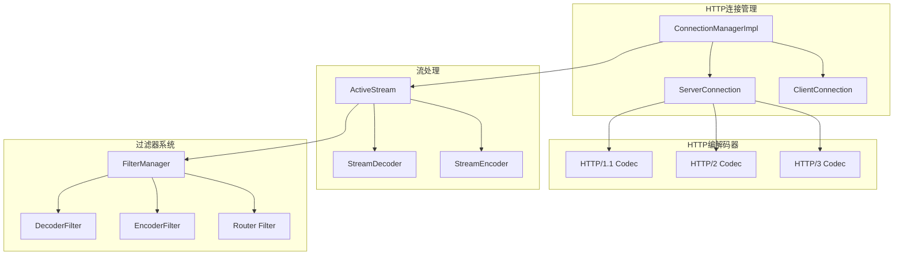
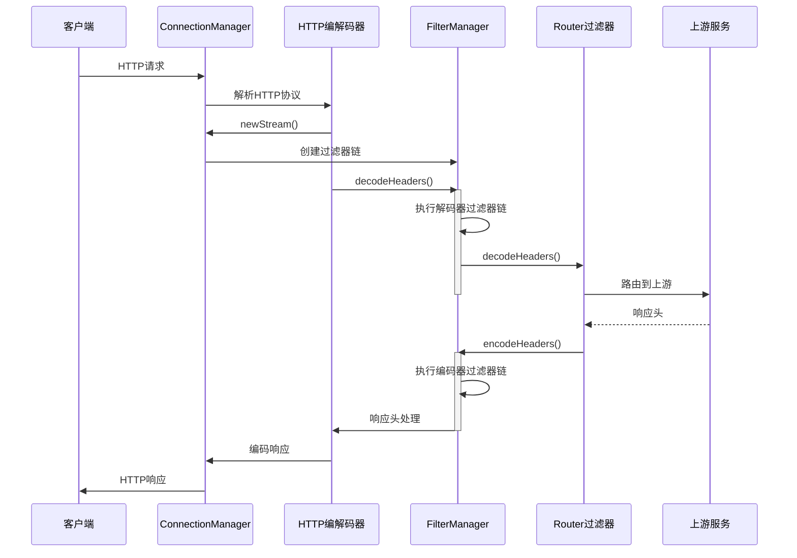

## 模块概览

HTTP模块是Envoy处理HTTP协议的核心组件，支持HTTP/1.1、HTTP/2和HTTP/3协议。该模块负责HTTP协议的编解码、连接管理、路由处理和过滤器链执行。

### 模块位置
- **源码位置**: `source/common/http/`
- **头文件位置**: `envoy/http/`
- **主要组件**: ConnectionManager、Codec、Filter、Router等

### 核心职责

1. **协议处理**: 支持HTTP/1.1、HTTP/2、HTTP/3协议的编解码
2. **连接管理**: 管理HTTP连接的生命周期和状态
3. **请求路由**: 将请求路由到正确的上游服务
4. **过滤器链**: 执行HTTP级别的过滤器链
5. **流管理**: 管理HTTP请求/响应流的处理

## 架构图



## 核心类分析

### 1. ConnectionManagerImpl - HTTP连接管理器

```cpp
/**
 * ConnectionManagerImpl 是HTTP连接管理器的核心实现
 * 负责管理HTTP连接、流和过滤器链的执行
 */
class ConnectionManagerImpl : Logger::Loggable<Logger::Id::http>,
                              public Network::ReadFilter,
                              public ServerConnectionCallbacks,
                              public Network::ConnectionCallbacks,
                              public Http::ApiListener {
public:
  /**
   * 构造函数
   * @param config 连接管理器配置
   * @param drain_close 排空关闭决策器
   * @param random_generator 随机数生成器
   * @param http_context HTTP上下文
   * @param runtime 运行时配置
   * @param local_info 本地信息
   * @param cluster_manager 集群管理器
   * @param overload_manager 过载管理器
   * @param time_system 时间系统
   * @param direction 流量方向
   */
  ConnectionManagerImpl(ConnectionManagerConfigSharedPtr config,
                        const Network::DrainDecision& drain_close,
                        Random::RandomGenerator& random_generator, 
                        Http::Context& http_context,
                        Runtime::Loader& runtime, 
                        const LocalInfo::LocalInfo& local_info,
                        Upstream::ClusterManager& cluster_manager,
                        Server::OverloadManager& overload_manager, 
                        TimeSource& time_system,
                        envoy::config::core::v3::TrafficDirection direction);

  // Network::ReadFilter 接口实现
  
  /**
   * 处理网络数据
   * @param data 接收到的数据缓冲区
   * @param end_stream 是否为流结束
   * @return 过滤器状态
   */
  Network::FilterStatus onData(Buffer::Instance& data, bool end_stream) override;
  
  /**
   * 处理新连接
   * @return 过滤器状态  
   */
  Network::FilterStatus onNewConnection() override;

  // ServerConnectionCallbacks 接口实现
  
  /**
   * 创建新的HTTP流
   * @param response_encoder 响应编码器
   * @param is_internally_created 是否内部创建
   * @return 请求解码器引用
   */
  RequestDecoder& newStream(ResponseEncoder& response_encoder,
                            bool is_internally_created = false) override;

  /**
   * 创建新的HTTP流句柄
   * @param response_encoder 响应编码器
   * @param is_internally_created 是否内部创建
   * @return 请求解码器句柄
   */
  RequestDecoderHandlePtr newStreamHandle(ResponseEncoder& response_encoder,
                                          bool is_internally_created = false) override;

  // Network::ConnectionCallbacks 接口实现
  
  /**
   * 处理连接事件
   * @param event 连接事件类型
   */
  void onEvent(Network::ConnectionEvent event) override;

private:
  /**
   * ActiveStream 活跃流结构
   * 封装单个HTTP请求/响应对的所有状态和处理逻辑
   */
  struct ActiveStream : LinkedObject<ActiveStream>,
                        public Event::DeferredDeletable,
                        public StreamCallbacks,
                        public RequestDecoder,
                        public FilterManagerCallbacks {
                        
    /**
     * 构造函数
     * @param connection_manager 连接管理器引用
     * @param buffer_limit 缓冲区限制
     * @param account 缓冲区内存账户
     */
    ActiveStream(ConnectionManagerImpl& connection_manager, 
                 uint32_t buffer_limit,
                 Buffer::BufferMemoryAccountSharedPtr account);

    // RequestDecoder 接口实现
    
    /**
     * 解码请求头
     * @param headers 请求头映射
     * @param end_stream 是否流结束
     */
    void decodeHeaders(RequestHeaderMapSharedPtr&& headers, bool end_stream) override;
    
    /**
     * 解码请求数据
     * @param data 请求数据缓冲区
     * @param end_stream 是否流结束
     */
    void decodeData(Buffer::Instance& data, bool end_stream) override;
    
    /**
     * 解码请求尾部
     * @param trailers 请求尾部映射
     */
    void decodeTrailers(RequestTrailerMapPtr&& trailers) override;

    // FilterManagerCallbacks 接口实现
    
    /**
     * 编码响应头
     * @param response_headers 响应头映射
     * @param end_stream 是否流结束
     */
    void encodeHeaders(ResponseHeaderMap& response_headers, bool end_stream) override;
    
    /**
     * 编码响应数据
     * @param data 响应数据缓冲区
     * @param end_stream 是否流结束
     */
    void encodeData(Buffer::Instance& data, bool end_stream) override;

    // 流状态管理
    struct State {
      bool codec_saw_local_complete_ : 1;  // 编解码器是否看到本地完成
      bool codec_encode_complete_ : 1;     // 编解码是否完成
      bool on_reset_stream_called_ : 1;    // 是否调用了流重置
      bool is_zombie_stream_ : 1;          // 是否为僵尸流
      bool successful_upgrade_ : 1;        // 是否成功升级协议
      bool is_internally_destroyed_ : 1;   // 是否内部销毁
      bool is_internally_created_ : 1;     // 是否内部创建
      bool is_tunneling_ : 1;              // 是否隧道模式
      bool decorated_propagate_ : 1;       // 是否装饰传播
    };

    ConnectionManagerImpl& connection_manager_;  // 连接管理器引用
    const uint64_t stream_id_;                   // 流ID
    RequestHeaderMapSharedPtr request_headers_;  // 请求头
    ResponseHeaderMapSharedPtr response_headers_; // 响应头
    DownstreamFilterManager filter_manager_;     // 过滤器管理器
    ResponseEncoder* response_encoder_{};        // 响应编码器
    State state_;                               // 流状态
  };

  // 私有成员变量
  ConnectionManagerConfigSharedPtr config_;    // 配置
  ServerConnectionPtr codec_;                  // HTTP编解码器
  std::list<ActiveStreamPtr> streams_;         // 活跃流列表
  DrainState drain_state_{DrainState::NotDraining}; // 排空状态
  Random::RandomGenerator& random_generator_;  // 随机数生成器
  Runtime::Loader& runtime_;                  // 运行时配置
  Upstream::ClusterManager& cluster_manager_; // 集群管理器
};
```

### 2. HTTP编解码器

#### HTTP/1.1编解码器

```cpp
/**
 * HTTP/1.1连接实现
 * 处理HTTP/1.1协议的编解码和连接管理
 */
namespace Http1 {
class ConnectionImpl : public virtual Connection,
                       public ParserCallbacks {
public:
  /**
   * 构造函数
   * @param connection 网络连接
   * @param stats 编解码器统计
   * @param settings HTTP/1设置
   * @param type 消息类型
   * @param max_headers_kb 最大头部KB数
   * @param max_headers_count 最大头部数量
   */
  ConnectionImpl(Network::Connection& connection, 
                 CodecStats& stats,
                 const Http1Settings& settings,
                 MessageType type, 
                 uint32_t max_headers_kb,
                 const uint32_t max_headers_count);

  // Connection 接口实现
  Http::Status dispatch(Buffer::Instance& data) override;
  Protocol protocol() override { return protocol_; }

  // ParserCallbacks 接口实现
  CallbackResult onHeaderField(const char* data, size_t length) override;
  CallbackResult onHeaderValue(const char* data, size_t length) override;
  CallbackResult onHeadersComplete() override;
  void bufferBody(const char* data, size_t length) override;
  CallbackResult onMessageComplete() override;

private:
  Network::Connection& connection_;     // 底层网络连接
  std::unique_ptr<Parser> parser_;     // HTTP解析器
  Buffer::Instance* output_buffer_;    // 输出缓冲区
  HeaderString current_header_field_;  // 当前头部字段
  HeaderString current_header_value_;  // 当前头部值
  bool processing_trailers_ : 1;       // 是否处理尾部
  bool handling_upgrade_ : 1;          // 是否处理协议升级
  Protocol protocol_{Protocol::Http11}; // 协议版本
};
} // namespace Http1
```

#### HTTP/2编解码器

```cpp
/**
 * HTTP/2连接实现
 * 基于nghttp2库实现HTTP/2协议处理
 */
namespace Http2 {
class ConnectionImpl : public virtual Connection,
                       public ConnectionCallbacks {
public:
  /**
   * 构造函数
   * @param connection 网络连接
   * @param callbacks 连接回调
   * @param stats 编解码器统计
   * @param options HTTP/2选项
   * @param max_request_headers_kb 最大请求头KB数
   * @param max_response_headers_kb 最大响应头KB数
   */
  ConnectionImpl(Network::Connection& connection,
                 ConnectionCallbacks& callbacks,
                 CodecStats& stats,
                 const envoy::config::core::v3::Http2ProtocolOptions& options,
                 const uint32_t max_request_headers_kb,
                 const uint32_t max_response_headers_kb);

  // Connection 接口实现
  Http::Status dispatch(Buffer::Instance& data) override;
  void goAway() override;
  Protocol protocol() override { return Protocol::Http2; }
  void shutdownNotice() override;
  bool wantsToWrite() override;

  // HTTP/2特有方法
  void sendPendingFrames();
  void sendSettings(const envoy::config::core::v3::Http2ProtocolOptions& options,
                   bool disable_push);

private:
  /**
   * 流实现基类
   */
  struct StreamImpl : public virtual Stream {
    StreamImpl(ConnectionImpl& connection, uint32_t stream_id);
    
    void resetStream(StreamResetReason reason) override;
    void readDisable(bool disable) override;
    uint32_t bufferLimit() const override;

    ConnectionImpl& connection_;  // 连接引用
    const uint32_t stream_id_;   // 流ID
    StreamCallbacks* callbacks_{nullptr}; // 流回调
  };

  Network::Connection& connection_;     // 底层网络连接
  ConnectionCallbacks& callbacks_;      // 连接回调
  nghttp2_session* session_{};         // nghttp2会话
  Buffer::OwnedImpl outbound_buffer_;  // 出站缓冲区
  std::unordered_map<int32_t, StreamImplPtr> streams_; // 流映射
  CodecStats& stats_;                  // 统计信息
  bool dispatching_ : 1;              // 是否正在分发
  bool raised_goaway_ : 1;            // 是否发送了GOAWAY
};
} // namespace Http2
```

### 3. HTTP过滤器系统

#### 过滤器管理器

```cpp
/**
 * FilterManager HTTP过滤器管理器
 * 管理HTTP过滤器链的执行
 */
class FilterManager : Logger::Loggable<Logger::Id::http> {
public:
  /**
   * 构造函数
   * @param callbacks 过滤器管理器回调
   * @param dispatcher 事件分发器
   * @param connection 网络连接
   * @param stream_id 流ID
   * @param account 缓冲区内存账户
   * @param defer_headers 是否延迟头部处理
   */
  FilterManager(FilterManagerCallbacks& callbacks,
                Event::Dispatcher& dispatcher,
                const Network::Connection& connection,
                uint64_t stream_id,
                Buffer::BufferMemoryAccountSharedPtr account,
                bool defer_headers);

  /**
   * 添加解码器过滤器
   * @param filter 解码器过滤器
   */  
  void addDecoderFilter(StreamDecoderFilterSharedPtr filter);
  
  /**
   * 添加编码器过滤器
   * @param filter 编码器过滤器
   */
  void addEncoderFilter(StreamEncoderFilterSharedPtr filter);
  
  /**
   * 添加双向过滤器
   * @param filter 双向过滤器
   */
  void addFilter(StreamFilterSharedPtr filter);

  /**
   * 解码请求头
   * @param headers 请求头
   * @param end_stream 是否流结束
   */
  void decodeHeaders(RequestHeaderMapSharedPtr&& headers, bool end_stream);
  
  /**
   * 解码请求数据
   * @param data 请求数据
   * @param end_stream 是否流结束
   */
  void decodeData(Buffer::Instance& data, bool end_stream);
  
  /**
   * 解码请求尾部
   * @param trailers 请求尾部
   */
  void decodeTrailers(RequestTrailerMapPtr&& trailers);

  /**
   * 编码响应头
   * @param headers 响应头
   * @param end_stream 是否流结束
   */
  void encodeHeaders(ResponseHeaderMap& headers, bool end_stream);
  
  /**
   * 编码响应数据
   * @param data 响应数据
   * @param end_stream 是否流结束
   */
  void encodeData(Buffer::Instance& data, bool end_stream);
  
  /**
   * 编码响应尾部
   * @param trailers 响应尾部
   */
  void encodeTrailers(ResponseTrailerMap& trailers);

  /**
   * 获取流信息
   * @return 流信息引用
   */
  StreamInfo::StreamInfo& streamInfo() { return stream_info_; }

private:
  /**
   * 活跃解码器过滤器迭代器
   */
  struct ActiveStreamDecoderFilter : public StreamDecoderFilterCallbacks {
    ActiveStreamDecoderFilter(FilterManager& parent, 
                             StreamDecoderFilterSharedPtr filter);

    FilterManager& parent_;                     // 过滤器管理器引用
    StreamDecoderFilterSharedPtr filter_;      // 过滤器实例
    std::list<ActiveStreamDecoderFilter>::iterator entry_; // 列表迭代器
  };

  FilterManagerCallbacks& callbacks_;                    // 回调接口
  Event::Dispatcher& dispatcher_;                       // 事件分发器
  StreamInfo::StreamInfoImpl stream_info_;              // 流信息
  std::list<ActiveStreamDecoderFilter> decoder_filters_; // 解码器过滤器列表
  std::list<ActiveStreamEncoderFilter> encoder_filters_; // 编码器过滤器列表
  std::list<ActiveStreamDecoderFilter>::iterator decoder_filter_; // 当前解码器过滤器
  std::list<ActiveStreamEncoderFilter>::iterator encoder_filter_; // 当前编码器过滤器
  State state_;                                         // 状态标志
};
```

## HTTP请求处理流程

### 请求处理时序图



## 性能优化特性

### 1. 流复用

HTTP/2和HTTP/3支持在单个连接上多路复用多个流：

```cpp
/**
 * HTTP/2流管理
 * 支持并发处理多个请求流
 */
class Http2StreamManager {
public:
  /**
   * 创建新流
   * @param stream_id 流ID
   * @return 流对象指针
   */
  StreamPtr createStream(uint32_t stream_id);
  
  /**
   * 关闭流
   * @param stream_id 流ID
   */
  void closeStream(uint32_t stream_id);
  
  /**
   * 获取活跃流数量
   * @return 活跃流数量
   */
  uint32_t activeStreamCount() const { return active_streams_.size(); }

private:
  std::unordered_map<uint32_t, StreamPtr> active_streams_; // 活跃流映射
  uint32_t next_stream_id_{1};                            // 下一个流ID
  uint32_t max_concurrent_streams_{100};                   // 最大并发流数
};
```

### 2. 头部压缩

HTTP/2使用HPACK算法进行头部压缩：

```cpp
/**
 * HPACK头部压缩实现
 */
class HpackCompressor {
public:
  /**
   * 压缩头部
   * @param headers 头部映射
   * @param output 输出缓冲区
   * @return 压缩后大小
   */
  size_t compressHeaders(const HeaderMap& headers, Buffer::Instance& output);
  
  /**
   * 解压头部
   * @param input 输入缓冲区
   * @param headers 输出头部映射
   * @return 是否成功
   */
  bool decompressHeaders(Buffer::Instance& input, HeaderMap& headers);

private:
  HpackDynamicTable dynamic_table_;  // 动态表
  HpackStaticTable static_table_;    // 静态表
};
```

## 路由和负载均衡

### Router过滤器

Router过滤器是HTTP模块的核心组件，负责请求路由：

```cpp
/**
 * Router过滤器实现
 * 负责将HTTP请求路由到上游集群
 */
class Filter : public StreamDecoderFilter,
               public StreamEncoderFilter,
               public UpstreamRequest::Callbacks {
public:
  /**
   * 构造函数
   * @param config 路由器配置
   */
  Filter(ConfigSharedPtr config);

  // StreamDecoderFilter 接口实现
  FilterHeadersStatus decodeHeaders(RequestHeaderMap& headers, bool end_stream) override;
  FilterDataStatus decodeData(Buffer::Instance& data, bool end_stream) override;
  FilterTrailersStatus decodeTrailers(RequestTrailerMap& trailers) override;

  // StreamEncoderFilter 接口实现  
  FilterHeadersStatus encode1xxHeaders(ResponseHeaderMap& headers) override;
  FilterHeadersStatus encodeHeaders(ResponseHeaderMap& headers, bool end_stream) override;
  FilterDataStatus encodeData(Buffer::Instance& data, bool end_stream) override;

private:
  /**
   * 上游请求实现
   */
  struct UpstreamRequest : public Http::StreamDecoder,
                           public Http::StreamCallbacks,
                           public UpstreamToDownstream {
    UpstreamRequest(Filter& parent, Http::ConnectionPool::Instance& pool);

    // StreamDecoder 接口实现
    void decodeHeaders(ResponseHeaderMapSharedPtr&& headers, bool end_stream) override;
    void decodeData(Buffer::Instance& data, bool end_stream) override;
    void decodeTrailers(ResponseTrailerMapPtr&& trailers) override;

    Filter& parent_;                          // 父过滤器引用
    Http::StreamEncoder* upstream_encoder_{}; // 上游编码器
    Upstream::HostDescriptionConstSharedPtr upstream_host_; // 上游主机
  };

  ConfigSharedPtr config_;                    // 配置
  Router::RouteConstSharedPtr route_;         // 路由信息
  Upstream::ClusterInfoConstSharedPtr cluster_; // 集群信息
  std::unique_ptr<UpstreamRequest> upstream_request_; // 上游请求
  TimeSource& time_source_;                   // 时间源
  std::unique_ptr<GenericConnectionPoolCallbacks> conn_pool_callbacks_; // 连接池回调
};
```

## 统计指标

HTTP模块提供了丰富的统计指标：

```cpp
/**
 * HTTP连接管理器统计指标
 */
#define ALL_HTTP_CONN_MAN_STATS(COUNTER, GAUGE, HISTOGRAM)                                        \
  COUNTER(downstream_cx_destroy)           /* 下游连接销毁数 */                                    \
  COUNTER(downstream_cx_destroy_remote)    /* 远程关闭的下游连接数 */                               \
  COUNTER(downstream_cx_http1_active)      /* HTTP/1活跃连接数 */                                 \
  COUNTER(downstream_cx_http2_active)      /* HTTP/2活跃连接数 */                                 \
  COUNTER(downstream_cx_http3_active)      /* HTTP/3活跃连接数 */                                 \
  COUNTER(downstream_cx_protocol_error)    /* 协议错误数 */                                       \
  COUNTER(downstream_cx_rx_bytes_buffered) /* 下游接收缓冲字节数 */                                \
  COUNTER(downstream_cx_tx_bytes_buffered) /* 下游发送缓冲字节数 */                                \
  COUNTER(downstream_rq_1xx)               /* 1xx响应数 */                                       \
  COUNTER(downstream_rq_2xx)               /* 2xx响应数 */                                       \
  COUNTER(downstream_rq_3xx)               /* 3xx响应数 */                                       \
  COUNTER(downstream_rq_4xx)               /* 4xx响应数 */                                       \
  COUNTER(downstream_rq_5xx)               /* 5xx响应数 */                                       \
  COUNTER(downstream_rq_completed)         /* 完成的请求数 */                                      \
  COUNTER(downstream_rq_http1_total)       /* HTTP/1总请求数 */                                   \
  COUNTER(downstream_rq_http2_total)       /* HTTP/2总请求数 */                                   \
  COUNTER(downstream_rq_http3_total)       /* HTTP/3总请求数 */                                   \
  GAUGE(downstream_cx_active, Accumulate)  /* 活跃下游连接数 */                                   \
  GAUGE(downstream_rq_active, Accumulate)  /* 活跃请求数 */                                      \
  HISTOGRAM(downstream_cx_length_ms, Milliseconds) /* 连接持续时间直方图 */                        \
  HISTOGRAM(downstream_rq_time, Milliseconds)      /* 请求时间直方图 */
```

## 常见问题和解决方案

### 1. HTTP/2流量问题

**问题**: HTTP/2连接无法正常建立或性能不佳

**解决方案**:
```yaml
# HTTP/2协议配置优化
http2_protocol_options:
  max_concurrent_streams: 100
  initial_stream_window_size: 65536
  initial_connection_window_size: 1048576
  allow_connect: true
  allow_metadata: true
```

### 2. 请求超时问题

**问题**: 请求经常超时

**解决方案**:
```yaml  
# 超时配置调优
route_config:
  timeout: 30s
  idle_timeout: 15s
stream_idle_timeout: 300s
request_timeout: 60s
```

### 3. 内存使用过高

**问题**: HTTP处理导致内存使用过高

**解决方案**:
```yaml
# 缓冲区限制配置
per_connection_buffer_limit_bytes: 1048576  # 1MB
max_request_headers_kb: 60
max_response_headers_kb: 60
```

## 最佳实践

### 1. 协议选择

- **HTTP/1.1**: 适用于简单的请求-响应模式
- **HTTP/2**: 推荐用于高并发场景，支持多路复用
- **HTTP/3**: 适用于需要低延迟的场景

### 2. 过滤器配置

```yaml
http_filters:
- name: envoy.filters.http.router
  typed_config:
    "@type": type.googleapis.com/envoy.extensions.filters.http.router.v3.Router
    dynamic_stats: true
    start_child_span: true
```

### 3. 监控配置

```yaml
stats_config:
  histogram_bucket_settings:
  - match:
      name: "http.downstream_rq_time"
    buckets: [0.5, 1, 5, 10, 25, 50, 100, 250, 500, 1000, 2500, 5000, 10000]
```

## 总结

HTTP模块是Envoy的核心功能模块，提供了：

1. **多协议支持**: HTTP/1.1、HTTP/2、HTTP/3
2. **高性能处理**: 流复用、头部压缩、零拷贝
3. **灵活的过滤器系统**: 可扩展的HTTP处理管道
4. **智能路由**: 基于规则的请求路由
5. **丰富的监控**: 详细的统计指标和可观测性

理解HTTP模块的架构和实现，对于掌握Envoy的HTTP处理能力至关重要。
