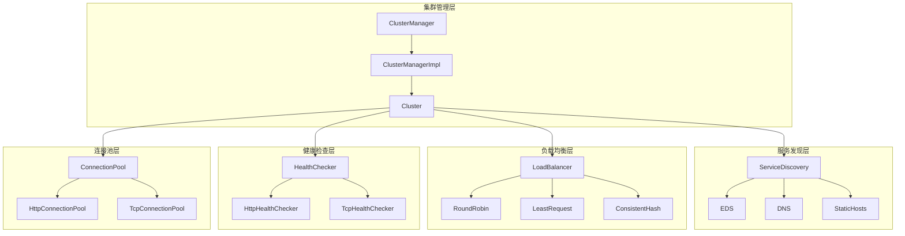
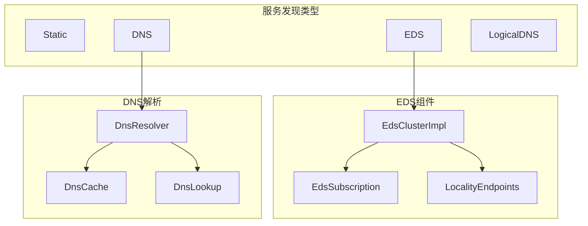

## 模块概览

Upstream模块负责管理Envoy与上游服务的连接，包括集群管理、服务发现、负载均衡、健康检查和连接池管理等功能。

### 模块位置
- **源码位置**: `source/common/upstream/`
- **头文件位置**: `envoy/upstream/`
- **主要组件**: ClusterManager、LoadBalancer、HealthChecker、ConnectionPool等

### 核心职责

1. **集群管理**: 管理上游服务集群的生命周期
2. **服务发现**: 发现和监控上游服务实例
3. **负载均衡**: 在多个上游实例间分发请求
4. **健康检查**: 监控上游服务的健康状态
5. **连接池**: 管理到上游服务的连接

## 架构图



## 核心类分析

### 1. ClusterManagerImpl - 集群管理器实现

```cpp
/**

 * ClusterManagerImpl 集群管理器的核心实现
 * 负责管理所有上游服务集群的生命周期和状态

 */
class ClusterManagerImpl : public ClusterManager,
                           public MissingClusterNotifier {
public:
  /**

   * 构造函数
   * @param bootstrap 启动配置
   * @param factory 集群管理器工厂
   * @param context 服务器工厂上下文
   * @param creation_status 创建状态
   */
  ClusterManagerImpl(const envoy::config::bootstrap::v3::Bootstrap& bootstrap,
                     ClusterManagerFactory& factory,
                     Server::Configuration::ServerFactoryContext& context,
                     absl::Status& creation_status);

  // ClusterManager 接口实现
  
  /**
   * 添加或更新集群
   * @param cluster 集群配置
   * @param version_info 版本信息
   * @param avoid_cds_removal 是否避免CDS移除
   * @return 操作结果状态
   */
  absl::StatusOr<bool> addOrUpdateCluster(
      const envoy::config::cluster::v3::Cluster& cluster,
      const std::string& version_info,
      const bool avoid_cds_removal = false) override;

  /**
   * 获取指定名称的活跃集群
   * @param cluster_name 集群名称
   * @return 集群的可选引用
   */
  OptRef<const Cluster> getActiveCluster(const std::string& cluster_name) const override;

  /**
   * 获取线程本地集群
   * @param cluster 集群名称
   * @return 线程本地集群指针
   */
  ThreadLocalCluster* getThreadLocalCluster(absl::string_view cluster) override;

  /**
   * 移除集群
   * @param cluster 集群名称
   * @param remove_ignored 是否移除被忽略的集群
   * @return 是否成功移除
   */
  bool removeCluster(const std::string& cluster,
                     const bool remove_ignored = false) override;

  /**
   * 初始化
   * @param bootstrap 启动配置
   * @return 初始化状态
   */
  absl::Status initialize(const envoy::config::bootstrap::v3::Bootstrap& bootstrap) override;

  /**
   * 关闭集群管理器
   */
  void shutdown() override;

private:
  /**

   * 集群数据结构
   * 包含集群的配置、实例和相关状态信息
   */
  struct ClusterData : public ClusterManagerCluster {
    ClusterData(const envoy::config::cluster::v3::Cluster& cluster_config,
                const uint64_t cluster_config_hash,
                const std::string& version_info,
                bool added_via_api,
                bool required_for_ads,
                ClusterSharedPtr&& cluster,
                TimeSource& time_source,
                const bool avoid_cds_removal = false);

    // ClusterManagerCluster 接口实现
    Cluster& cluster() override { return *cluster_; }
    LoadBalancerFactorySharedPtr loadBalancerFactory() override;
    bool addedOrUpdated() override { return added_or_updated_; }
    void setAddedOrUpdated() override { added_or_updated_ = true; }
    bool requiredForAds() const override { return required_for_ads_; }

    const envoy::config::cluster::v3::Cluster cluster_config_;  // 集群配置
    const uint64_t config_hash_;                               // 配置哈希
    const std::string version_info_;                          // 版本信息
    ClusterSharedPtr cluster_;                                // 集群实例
    ThreadAwareLoadBalancerPtr thread_aware_lb_;              // 线程感知负载均衡器
    SystemTime last_updated_;                                 // 最后更新时间
    const bool added_via_api_ : 1;                           // 是否通过API添加
    const bool avoid_cds_removal_ : 1;                       // 是否避免CDS移除
    bool added_or_updated_ : 1;                              // 是否已添加或更新
    const bool required_for_ads_ : 1;                        // ADS是否需要此集群
  };

  using ClusterDataPtr = std::unique_ptr<ClusterData>;
  using ClusterMap = std::map<std::string, ClusterDataPtr>;  // 有序映射确保转储一致性

  /**
   * 线程本地集群管理器实现
   */
  struct ThreadLocalClusterManagerImpl : public ThreadLocal::ThreadLocalObject,
                                         public ClusterLifecycleCallbackHandler {
    /**
     * 集群条目
     * 封装线程本地的集群信息和负载均衡器
     */
    class ClusterEntry : public ThreadLocalCluster {
    public:
      ClusterEntry(ThreadLocalClusterManagerImpl& parent,
                   ClusterInfoConstSharedPtr cluster,
                   const LoadBalancerFactorySharedPtr& lb_factory);

      // ThreadLocalCluster 接口实现
      const PrioritySet& prioritySet() override { return priority_set_; }
      ClusterInfoConstSharedPtr info() override { return cluster_info_; }
      LoadBalancer& loadBalancer() override { return *lb_; }
      
      /**
       * 选择上游主机
       * @param context 负载均衡上下文
       * @return 主机选择结果
       */
      HostSelectionResponse chooseHost(LoadBalancerContext* context) override;

      /**
       * 获取HTTP连接池
       * @param host 目标主机
       * @param priority 优先级
       * @param downstream_protocol 下游协议
       * @param context 负载均衡上下文
       * @return HTTP连接池数据
       */
      absl::optional<HttpPoolData>
      httpConnPool(HostConstSharedPtr host,
                   ResourcePriority priority,
                   absl::optional<Http::Protocol> downstream_protocol,
                   LoadBalancerContext* context) override;

      /**
       * 获取TCP连接池
       * @param host 目标主机
       * @param priority 优先级
       * @param context 负载均衡上下文
       * @return TCP连接池数据
       */
      absl::optional<TcpPoolData>
      tcpConnPool(HostConstSharedPtr host,
                  ResourcePriority priority,
                  LoadBalancerContext* context) override;

      /**
       * 创建TCP连接
       * @param context 负载均衡上下文
       * @return 主机连接创建数据
       */
      Host::CreateConnectionData tcpConn(LoadBalancerContext* context) override;

      /**
       * 获取HTTP异步客户端
       * @return HTTP异步客户端引用
       */
      Http::AsyncClient& httpAsyncClient() override;

    private:
      ThreadLocalClusterManagerImpl& parent_;      // 父管理器引用
      PrioritySetImpl priority_set_;              // 优先级集合
      ClusterInfoConstSharedPtr cluster_info_;    // 集群信息
      LoadBalancerFactorySharedPtr lb_factory_;   // 负载均衡器工厂
      LoadBalancerPtr lb_;                        // 负载均衡器
      Http::AsyncClientPtr lazy_http_async_client_; // 延迟HTTP异步客户端
      Http::PersistentQuicInfoPtr quic_info_;     // QUIC持久信息
    };

    ThreadLocalClusterManagerImpl(ClusterManagerImpl& parent,
                                  Event::Dispatcher& dispatcher);

    ClusterManagerImpl& parent_;                            // 父集群管理器
    Event::Dispatcher& thread_local_dispatcher_;           // 线程本地分发器
    absl::flat_hash_map<std::string, ClusterEntryPtr> thread_local_clusters_; // 线程本地集群
    ClusterConnectivityState cluster_manager_state_;       // 集群管理器状态
  };

  Server::Configuration::ServerFactoryContext& context_;  // 服务器工厂上下文
  ClusterManagerFactory& factory_;                       // 集群管理器工厂
  Runtime::Loader& runtime_;                            // 运行时加载器
  Stats::Store& stats_;                                 // 统计存储
  ThreadLocal::TypedSlot<ThreadLocalClusterManagerImpl> tls_; // 线程本地插槽
  Random::RandomGenerator& random_;                     // 随机数生成器
  Config::XdsManager& xds_manager_;                     // XDS管理器
  
  ClusterMap active_clusters_;                          // 活跃集群映射
  ClusterMap warming_clusters_;                         // 预热集群映射
  ClusterManagerStats cm_stats_;                       // 集群管理器统计
  ClusterManagerInitHelper init_helper_;               // 初始化帮助器
  CdsApiPtr cds_api_;                                  // CDS API
  
  bool initialized_{};                                 // 是否已初始化
  std::atomic<bool> shutdown_;                         // 是否关闭

};
```

### 2. 负载均衡器系统

#### LoadBalancer基类

```cpp
/**

 * LoadBalancer 负载均衡器基类
 * 定义了负载均衡器的基本接口

 */
class LoadBalancer {
public:
  virtual ~LoadBalancer() = default;

  /**

   * 选择主机
   * @param context 负载均衡上下文
   * @return 主机选择结果
   */
  virtual HostSelectionResponse chooseHost(LoadBalancerContext* context) PURE;
  
  /**
   * 选择另一个主机（用于重试）
   * @param context 负载均衡上下文
   * @return 另一个主机的常量共享指针
   */
  virtual HostConstSharedPtr peekAnotherHost(LoadBalancerContext* context) PURE;

};

/**

 * LoadBalancerFactory 负载均衡器工厂
 * 创建和管理负载均衡器实例

 */
class LoadBalancerFactory {
public:
  virtual ~LoadBalancerFactory() = default;
  
  /**

   * 创建负载均衡器
   * @return 负载均衡器智能指针
   */
  virtual LoadBalancerPtr create() PURE;
  
  /**
   * 重建负载均衡器
   * @param priority 优先级
   * @param old_lb 旧的负载均衡器
   * @return 新的负载均衡器
   */
  virtual LoadBalancerPtr recreateLoadBalancer(uint32_t priority,
                                               LoadBalancerPtr&& old_lb) PURE;

};
```

#### RoundRobin负载均衡器

```cpp
/**

 * RoundRobinLoadBalancer 轮询负载均衡器实现
 * 按轮询方式分发请求到不同的主机

 */
class RoundRobinLoadBalancer : public LoadBalancerBase {
public:
  RoundRobinLoadBalancer(const PrioritySet& priority_set,
                        const PrioritySet* local_priority_set,
                        ClusterStats& stats,
                        Runtime::Loader& runtime,
                        Random::RandomGenerator& random,
                        const envoy::config::cluster::v3::Cluster::CommonLbConfig& common_config,
                        TimeSource& time_source);

  // LoadBalancer 接口实现
  HostSelectionResponse chooseHost(LoadBalancerContext* context) override;
  HostConstSharedPtr peekAnotherHost(LoadBalancerContext* context) override;

private:
  /**

   * 轮询选择器
   * 维护每个优先级的轮询状态
   */
  struct RoundRobinSelector {
    RoundRobinSelector(std::atomic<uint64_t>& rr_index) : rr_index_(rr_index) {}
    
    HostConstSharedPtr select(const HostVector& hosts, uint64_t hash);

    std::atomic<uint64_t>& rr_index_;  // 轮询索引
  };

  // 每个优先级维护一个轮询索引
  std::vector<std::atomic<uint64_t>> rr_indexes_;

};
```

#### 一致性哈希负载均衡器

```cpp
/**

 * ConsistentHashLoadBalancer 一致性哈希负载均衡器
 * 基于一致性哈希算法选择主机，确保相同键值总是路由到相同主机

 */
class ConsistentHashLoadBalancer : public LoadBalancerBase {
public:
  ConsistentHashLoadBalancer(const PrioritySet& priority_set,
                           const PrioritySet* local_priority_set,
                           ClusterStats& stats,
                           Runtime::Loader& runtime,
                           Random::RandomGenerator& random,
                           const envoy::config::cluster::v3::Cluster::CommonLbConfig& common_config,
                           TimeSource& time_source);

  // LoadBalancer 接口实现
  HostSelectionResponse chooseHost(LoadBalancerContext* context) override;

private:
  /**

   * 哈希环实现
   * 使用一致性哈希环进行主机选择
   */
  class HashRing {
  public:
    HashRing(const HostVector& hosts, uint32_t min_ring_size);
    
    /**
     * 选择主机
     * @param hash 哈希值
     * @return 选中的主机
     */
    HostConstSharedPtr chooseHost(uint64_t hash) const;

  private:
    struct RingEntry {
      uint64_t hash_;          // 哈希值
      HostConstSharedPtr host_; // 主机指针
    };
    
    std::vector<RingEntry> ring_;  // 哈希环
  };

  // 每个优先级维护一个哈希环
  std::vector<std::shared_ptr<HashRing>> hash_rings_;

};
```

### 3. 健康检查系统

#### HealthChecker基类

```cpp
/**

 * HealthChecker 健康检查器基类
 * 定义健康检查的通用接口

 */  
class HealthChecker : Logger::Loggable<Logger::Id::hc> {
public:
  virtual ~HealthChecker() = default;

  /**

   * 健康检查回调接口
   */
  class HostStatusCb {
  public:
    virtual ~HostStatusCb() = default;
    virtual void onHostStatus(HostSharedPtr host, HealthTransition changed_state) PURE;
  };

  /**
   * 启动健康检查
   */
  virtual void start() PURE;
  
  /**
   * 添加主机回调
   * @param callback 主机状态回调
   * @return 回调句柄
   */
  virtual Common::CallbackHandlePtr addHostCheckCompleteCb(HostStatusCb& callback) PURE;

protected:
  HealthChecker(Upstream::Cluster& cluster,
                const envoy::config::core::v3::HealthCheck& config,
                Event::Dispatcher& dispatcher,
                Runtime::Loader& runtime,
                Random::RandomGenerator& random,
                HealthCheckEventLoggerPtr&& event_logger);

  /**

   * 活跃健康检查会话
   */
  class ActiveHealthCheckSession {
  public:
    ActiveHealthCheckSession(HealthChecker& parent, HostSharedPtr host);
    virtual ~ActiveHealthCheckSession() = default;

    /**
     * 开始健康检查
     */
    void start() { onInterval(); }
    
    /**
     * 处理成功回调
     */
    void onSuccess();
    
    /**
     * 处理失败回调
     */
    void onFailure(FailureType type);

  private:
    /**
     * 间隔定时器回调
     */
    void onInterval();
    
    /**
     * 超时定时器回调
     */  
    void onTimeout();

    HealthChecker& parent_;            // 父健康检查器
    HostSharedPtr host_;              // 目标主机
    Event::TimerPtr interval_timer_;  // 间隔定时器
    Event::TimerPtr timeout_timer_;   // 超时定时器
    uint32_t num_unhealthy_{};        // 不健康计数
    uint32_t num_healthy_{};          // 健康计数
  };

  Upstream::Cluster& cluster_;              // 集群引用
  const envoy::config::core::v3::HealthCheck config_; // 配置
  Event::Dispatcher& dispatcher_;          // 事件分发器
  Runtime::Loader& runtime_;              // 运行时配置
  Random::RandomGenerator& random_;       // 随机数生成器
  
  std::vector<ActiveHealthCheckSessionPtr> active_sessions_; // 活跃会话
  Common::CallbackManager<HostStatusCb> callbacks_;         // 回调管理器

};
```

#### HttpHealthChecker实现

```cpp
/**

 * HttpHealthChecker HTTP健康检查器实现
 * 通过HTTP请求检查上游服务的健康状态

 */
class HttpHealthChecker : public HealthChecker {
public:
  HttpHealthChecker(Upstream::Cluster& cluster,
                   const envoy::config::core::v3::HealthCheck& config,
                   const envoy::config::core::v3::HealthCheck::HttpHealthCheck& http_config,
                   Event::Dispatcher& dispatcher,
                   Runtime::Loader& runtime,
                   Random::RandomGenerator& random,
                   HealthCheckEventLoggerPtr&& event_logger);

  // HealthChecker 接口实现
  void start() override;

private:
  /**

   * HTTP健康检查会话
   */
  class HttpActiveHealthCheckSession : public ActiveHealthCheckSession,
                                      public Http::StreamDecoder,
                                      public Http::StreamCallbacks {
  public:
    HttpActiveHealthCheckSession(HttpHealthChecker& parent, HostSharedPtr host);

    // StreamDecoder 接口实现
    void decodeHeaders(Http::ResponseHeaderMapPtr&& headers, bool end_stream) override;
    void decodeData(Buffer::Instance& data, bool end_stream) override;
    void decodeTrailers(Http::ResponseTrailerMapPtr&& trailers) override;

    // StreamCallbacks 接口实现
    void onResetStream(Http::StreamResetReason reason,
                      absl::string_view transport_failure_reason) override;
    void onAboveWriteBufferHighWatermark() override {}
    void onBelowWriteBufferLowWatermark() override {}

  private:
    /**
     * 开始健康检查请求
     */
    void onInterval() override;
    
    /**
     * 处理响应完成
     */
    void onResponseComplete();

    HttpHealthChecker& parent_;             // 父HTTP健康检查器
    Http::RequestEncoder* request_encoder_{}; // 请求编码器
    absl::optional<Http::Code> response_status_; // 响应状态码
    bool expect_reset_{};                   // 是否期望重置
  };

  const envoy::config::core::v3::HealthCheck::HttpHealthCheck http_config_; // HTTP配置
  Http::ConnectionPool::InstancePtr conn_pool_;                             // 连接池
  const std::string path_;                                                  // 健康检查路径
  const Http::LowerCaseString host_header_;                                // Host头部

};
```

### 4. 连接池管理

#### ConnectionPool接口

```cpp
/**

 * ConnectionPool HTTP连接池接口
 * 管理到上游主机的连接复用

 */
namespace Http {
namespace ConnectionPool {
class Instance {
public:
  virtual ~Instance() = default;

  /**

   * 连接池回调接口
   */
  class Callbacks {
  public:
    virtual ~Callbacks() = default;
    
    /**
     * 连接池准备就绪回调
     * @param encoder 流编码器
     * @param host 上游主机
     * @param info 流信息
     * @param protocol 协议
     */
    virtual void onPoolReady(RequestEncoder& encoder,
                           Upstream::HostDescriptionConstSharedPtr host,
                           StreamInfo::StreamInfo& info,
                           absl::optional<Http::Protocol> protocol) PURE;
                           
    /**
     * 连接池失败回调
     * @param reason 失败原因
     * @param host 上游主机
     */
    virtual void onPoolFailure(ConnectionPool::PoolFailureReason reason,
                              absl::string_view transport_failure_reason,
                              Upstream::HostDescriptionConstSharedPtr host) PURE;
  };

  /**
   * 取消接口
   */
  class Cancellable {
  public:
    virtual ~Cancellable() = default;
    virtual void cancel(Envoy::ConnectionPool::CancelPolicy cancel_policy) PURE;
  };

  /**
   * 创建新流
   * @param decoder 响应解码器
   * @param callbacks 连接池回调
   * @param options 连接池选项
   * @return 可取消句柄
   */
  virtual Cancellable* newStream(ResponseDecoder& decoder,
                                Callbacks& callbacks,
                                const Instance::StreamOptions& options = {}) PURE;

  /**
   * 检查是否有准备好的连接
   * @return 是否有可用连接
   */
  virtual bool hasActiveConnections() const PURE;
  
  /**
   * 关闭空闲连接
   */
  virtual void closeIdleConnections() PURE;
  
  /**
   * 排空连接池
   */
  virtual void drainConnections(Envoy::ConnectionPool::DrainBehavior drain_behavior) PURE;

  /**
   * 获取协议
   * @return 使用的HTTP协议
   */
  virtual absl::optional<Http::Protocol> protocol() const PURE;

};
} // namespace ConnectionPool
} // namespace Http
```

#### Http1连接池实现

```cpp
/**

 * Http1ConnectionPoolImpl HTTP/1.1连接池实现
 * 管理HTTP/1.1连接的复用和生命周期

 */
class Http1ConnectionPoolImpl : public ConnectionPool::InstanceBase,
                               public Http::ConnectionCallbacks {
public:
  Http1ConnectionPoolImpl(Event::Dispatcher& dispatcher,
                         Random::RandomGenerator& random_generator,
                         Upstream::HostConstSharedPtr host,
                         Upstream::ResourcePriority priority,
                         const Network::ConnectionSocket::OptionsSharedPtr& options,
                         const Network::TransportSocketOptionsConstSharedPtr& transport_options,
                         Http::Context& http_context);

  // ConnectionPool::Instance 接口实现
  Http::ConnectionPool::Cancellable*
  newStream(Http::ResponseDecoder& response_decoder,
           Http::ConnectionPool::Callbacks& callbacks,
           const Http::ConnectionPool::Instance::StreamOptions& options) override;

  bool hasActiveConnections() const override;
  void closeIdleConnections() override;
  void drainConnections(Envoy::ConnectionPool::DrainBehavior drain_behavior) override;
  absl::optional<Http::Protocol> protocol() const override { return Http::Protocol::Http11; }

  // Http::ConnectionCallbacks 接口实现
  void onGoAway(Http::GoAwayErrorCode error_code) override;

private:
  /**

   * 活跃客户端连接
   */
  struct ActiveClient : LinkedObject<ActiveClient>,
                       public Event::DeferredDeletable,
                       public Http::ConnectionCallbacks,
                       public Network::ConnectionCallbacks {
    ActiveClient(Http1ConnectionPoolImpl& parent);
    ~ActiveClient() override;

    /**
     * 流包装器
     */
    struct StreamWrapper : public RequestEncoder,
                          public StreamDecoder,
                          public StreamCallbacks {
      StreamWrapper(ResponseDecoder& response_decoder, ActiveClient& parent);

      // RequestEncoder 接口实现
      Status encodeHeaders(const RequestHeaderMap& headers, bool end_stream) override;
      void encodeData(Buffer::Instance& data, bool end_stream) override;
      void encodeTrailers(const RequestTrailerMap& trailers) override;
      void enableTcpTunneling() override;

      // StreamDecoder 接口实现  
      void decodeHeaders(ResponseHeaderMapSharedPtr&& headers, bool end_stream) override;
      void decodeData(Buffer::Instance& data, bool end_stream) override;
      void decodeTrailers(ResponseTrailerMapPtr&& trailers) override;

      ResponseDecoder& response_decoder_;  // 响应解码器
      ActiveClient& parent_;              // 父活跃客户端
      RequestEncoder* request_encoder_{};  // 请求编码器
    };

    Http1ConnectionPoolImpl& parent_;      // 父连接池
    Network::ClientConnectionPtr real_connection_; // 真实连接
    Http::ClientConnectionPtr client_;     // HTTP客户端连接
    std::unique_ptr<StreamWrapper> stream_wrapper_; // 流包装器
    bool closed_with_active_rq_{};         // 是否在活跃请求时关闭
  };

  std::list<ActiveClientPtr> ready_clients_;      // 就绪客户端列表
  std::list<ActiveClientPtr> busy_clients_;       // 忙碌客户端列表
  std::list<PendingRequestPtr> pending_requests_; // 待处理请求队列

};
```

## 服务发现系统

### 服务发现架构



### EDS实现

```cpp
/**

 * EdsClusterImpl EDS集群实现
 * 通过EDS（Endpoint Discovery Service）动态发现服务端点

 */
class EdsClusterImpl : public ClusterImplBase {
public:
  EdsClusterImpl(const envoy::config::cluster::v3::Cluster& cluster,
                ClusterManagerImpl& cluster_manager,
                Runtime::Loader& runtime,
                Random::RandomGenerator& random,
                bool added_via_api,
                Server::Configuration::ServerFactoryContext& server_context);

  // ClusterImplBase 接口实现
  InitializePhase initializePhase() const override { return InitializePhase::Secondary; }

private:
  /**

   * EDS订阅回调
   */
  class EdsSubscriptionCallback : public Config::SubscriptionCallbacks {
  public:
    EdsSubscriptionCallback(EdsClusterImpl& parent) : parent_(parent) {}

    // SubscriptionCallbacks 接口实现
    absl::Status onConfigUpdate(const std::vector<Config::DecodedResourceRef>& resources,
                               const std::string& version_info) override;
    absl::Status onConfigUpdate(const std::vector<Config::DecodedResourceRef>& added_resources,
                               const Protobuf::RepeatedPtrField<std::string>& removed_resources,
                               const std::string& version_info) override;
    void onConfigUpdateFailed(Envoy::Config::ConfigUpdateFailureReason reason,
                             const EnvoyException* e) override;

  private:
    EdsClusterImpl& parent_;  // 父EDS集群
  };

  /**
   * 本地性端点管理
   */
  class LocalityEndpoints {
  public:
    LocalityEndpoints(const envoy::config::endpoint::v3::LocalityLbEndpoints& locality_lb_endpoints);
    
    const envoy::config::core::v3::Locality& locality() const { return locality_; }
    const std::vector<HostSharedPtr>& hosts() const { return hosts_; }
    uint32_t priority() const { return priority_; }

  private:
    envoy::config::core::v3::Locality locality_;  // 本地性信息
    std::vector<HostSharedPtr> hosts_;           // 主机列表
    uint32_t priority_;                         // 优先级
  };

  std::unique_ptr<EdsSubscriptionCallback> subscription_callback_; // 订阅回调
  Config::SubscriptionPtr subscription_;                         // EDS订阅
  std::vector<LocalityEndpoints> locality_endpoints_;           // 本地性端点列表

};
```

## 统计指标

Upstream模块提供了详细的统计指标：

```cpp
/**

 * 集群统计指标

 */
#define ALL_CLUSTER_STATS(COUNTER, GAUGE, HISTOGRAM)                                              \
  COUNTER(upstream_cx_close_notify)         /* 上游连接关闭通知数 */                               \
  COUNTER(upstream_cx_connect_fail)         /* 上游连接失败数 */                                  \
  COUNTER(upstream_cx_connect_timeout)      /* 上游连接超时数 */                                  \
  COUNTER(upstream_cx_destroy)              /* 上游连接销毁数 */                                  \
  COUNTER(upstream_cx_destroy_local)        /* 本地销毁的上游连接数 */                             \
  COUNTER(upstream_cx_destroy_remote)       /* 远程销毁的上游连接数 */                             \
  COUNTER(upstream_cx_http1_total)          /* HTTP/1总连接数 */                                 \
  COUNTER(upstream_cx_http2_total)          /* HTTP/2总连接数 */                                 \
  COUNTER(upstream_cx_max_requests)         /* 达到最大请求数的连接数 */                            \
  COUNTER(upstream_cx_overflow)             /* 上游连接溢出数 */                                  \
  COUNTER(upstream_cx_pool_overflow)        /* 连接池溢出数 */                                    \
  COUNTER(upstream_rq_cancelled)            /* 取消的上游请求数 */                                \
  COUNTER(upstream_rq_completed)            /* 完成的上游请求数 */                                \
  COUNTER(upstream_rq_pending_failure_eject) /* 待处理失败驱逐数 */                              \
  COUNTER(upstream_rq_pending_overflow)     /* 待处理请求溢出数 */                                \
  COUNTER(upstream_rq_per_try_timeout)      /* 每次尝试超时的请求数 */                             \
  COUNTER(upstream_rq_retry)                /* 重试的上游请求数 */                                \
  COUNTER(upstream_rq_retry_overflow)       /* 重试溢出的请求数 */                                \
  COUNTER(upstream_rq_timeout)              /* 超时的上游请求数 */                                \
  GAUGE(upstream_cx_active, Accumulate)     /* 活跃上游连接数 */                                 \
  GAUGE(upstream_cx_rx_bytes_buffered, Accumulate) /* 上游接收缓冲字节数 */                      \
  GAUGE(upstream_cx_tx_bytes_buffered, Accumulate) /* 上游发送缓冲字节数 */                      \
  GAUGE(upstream_rq_active, Accumulate)     /* 活跃上游请求数 */                                 \
  GAUGE(upstream_rq_pending_active, Accumulate) /* 活跃待处理请求数 */                           \
  HISTOGRAM(upstream_cx_connect_ms, Milliseconds) /* 上游连接时间直方图 */                        \
  HISTOGRAM(upstream_rq_time, Milliseconds)       /* 上游请求时间直方图 */

/**

 * 负载均衡器统计指标

 */  
#define ALL_LOAD_BALANCER_STATS(COUNTER, GAUGE)                                                   \
  COUNTER(lb_healthy_panic)                 /* 健康恐慌次数 */                                    \
  COUNTER(lb_local_cluster_not_ok)          /* 本地集群不可用次数 */                               \
  COUNTER(lb_recalculate_zone_structures)   /* 重新计算区域结构次数 */                             \
  COUNTER(lb_zone_cluster_too_small)        /* 区域集群过小次数 */                                \
  COUNTER(lb_zone_no_capacity_left)         /* 区域无剩余容量次数 */                               \
  COUNTER(lb_zone_number_differs)           /* 区域数量不同次数 */                                \
  COUNTER(lb_zone_routing_all_directly)     /* 直接路由到所有区域次数 */                            \
  COUNTER(lb_zone_routing_sampled)          /* 采样路由到区域次数 */                               \
  COUNTER(lb_zone_routing_cross_zone)       /* 跨区域路由次数 */

/**

 * 健康检查统计指标

 */
#define ALL_HEALTH_CHECKER_STATS(COUNTER, GAUGE, HISTOGRAM)                                       \
  COUNTER(attempt)                          /* 健康检查尝试次数 */                                \
  COUNTER(success)                          /* 健康检查成功次数 */                                \
  COUNTER(failure)                          /* 健康检查失败次数 */                                \
  COUNTER(passive_failure)                  /* 被动健康检查失败次数 */                             \
  COUNTER(network_failure)                  /* 网络故障次数 */                                    \
  COUNTER(verify_cluster)                   /* 验证集群次数 */                                    \
  GAUGE(healthy, NeverImport)               /* 健康主机数 */                                      \
  HISTOGRAM(latency, Milliseconds)          /* 健康检查延迟直方图 */
```

## 配置示例

### 集群配置示例

```yaml
# 静态集群配置
clusters:

- name: service_backend
  connect_timeout: 0.25s
  type: STATIC
  lb_policy: ROUND_ROBIN
  load_assignment:
    cluster_name: service_backend
    endpoints:
    - lb_endpoints:
      - endpoint:
          address:
            socket_address:
              address: 127.0.0.1
              port_value: 1234

# EDS集群配置  
- name: service_eds
  connect_timeout: 0.25s
  type: EDS
  lb_policy: LEAST_REQUEST
  eds_cluster_config:
    eds_config:
      ads: {}
      resource_api_version: V3

# DNS集群配置
- name: service_dns
  connect_timeout: 0.25s
  type: LOGICAL_DNS
  lb_policy: CONSISTENT_HASH
  dns_lookup_family: V4_ONLY
  load_assignment:
    cluster_name: service_dns
    endpoints:
    - lb_endpoints:
      - endpoint:
          address:
            socket_address:
              address: foo.bar.com
              port_value: 443

```

### 健康检查配置

```yaml
health_checks:

- timeout: 1s
  interval: 5s
  unhealthy_threshold: 3
  healthy_threshold: 3
  http_health_check:
    path: "/health"
    request_headers_to_add:
    - header:
        key: "x-envoy-force-trace"
        value: "true"
    expected_statuses:
    - start: 200
      end: 300

```

### 连接池配置

```yaml
circuit_breakers:
  thresholds:

  - priority: DEFAULT
    max_connections: 1024
    max_pending_requests: 1024  
    max_requests: 1024
    max_retries: 3
  - priority: HIGH
    max_connections: 2048
    max_pending_requests: 2048
    max_requests: 2048
    max_retries: 5

```

## 最佳实践

### 1. 负载均衡策略选择

- **ROUND_ROBIN**: 适用于服务能力相似的场景
- **LEAST_REQUEST**: 适用于请求处理时间差异较大的场景  
- **CONSISTENT_HASH**: 适用于需要会话保持的场景

### 2. 健康检查配置

```yaml
health_checks:

- timeout: 3s          # 适中的超时时间
  interval: 10s        # 不要过于频繁
  unhealthy_threshold: 3 # 避免误判
  healthy_threshold: 2   # 快速恢复

```

### 3. 连接池调优

```yaml
# 根据业务特点调整连接池参数
max_connections: 100      # 控制连接数
max_pending_requests: 200 # 控制排队数
max_requests: 10000      # 连接最大请求数
```

## 总结

Upstream模块是Envoy负载均衡和服务发现的核心，提供了：

1. **完整的集群管理**: 支持静态、DNS、EDS等多种发现方式
2. **多种负载均衡算法**: 轮询、最少请求、一致性哈希等
3. **全面的健康检查**: HTTP、TCP等多种检查方式
4. **高效的连接池**: HTTP/1.1、HTTP/2连接复用
5. **详细的监控指标**: 丰富的统计和可观测性

理解Upstream模块对于掌握Envoy的负载均衡和服务治理能力至关重要。
