## 架构概览

Envoy采用模块化设计，各个模块相互协作，形成了一个完整的L7代理系统。本文档深入分析Envoy的整体架构、模块间交互关系以及数据流转过程。

## 总体架构图

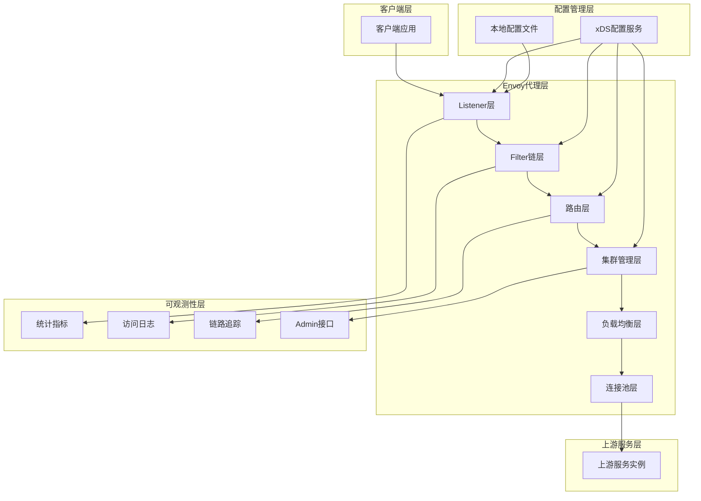

## 核心模块架构

### 1. 系统分层架构

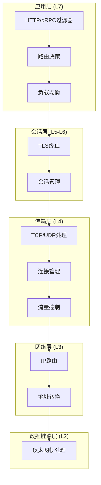

### 2. 事件驱动架构

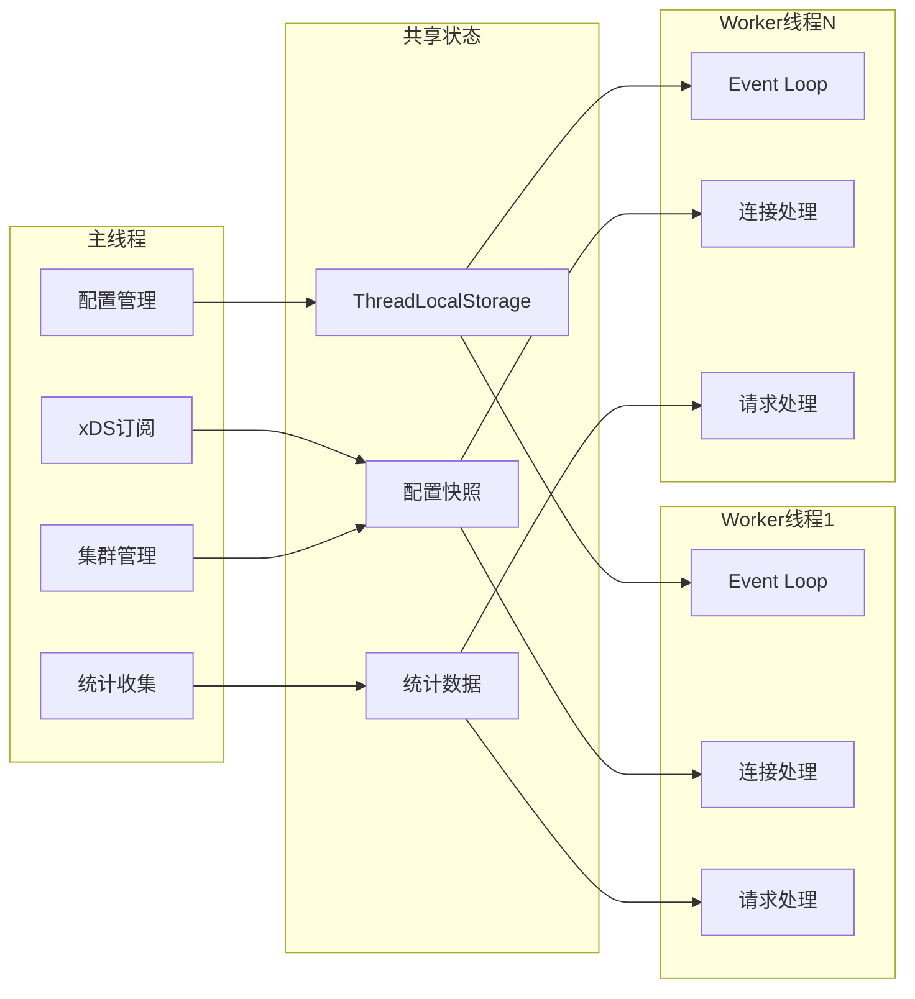

## 请求处理完整流程

### 请求处理时序图

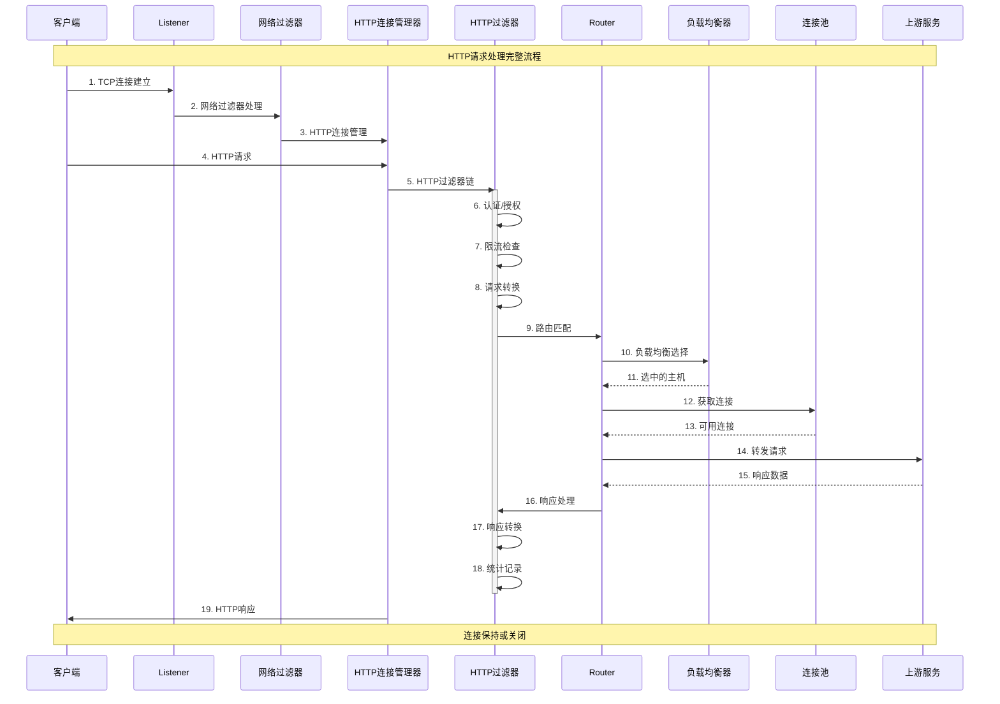

### 数据流转图

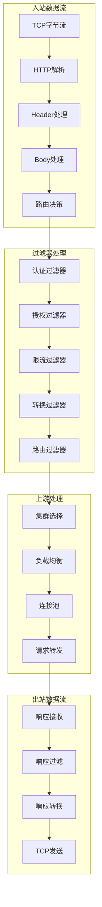

## 核心组件交互关系

### 1. Server层与其他模块的交互

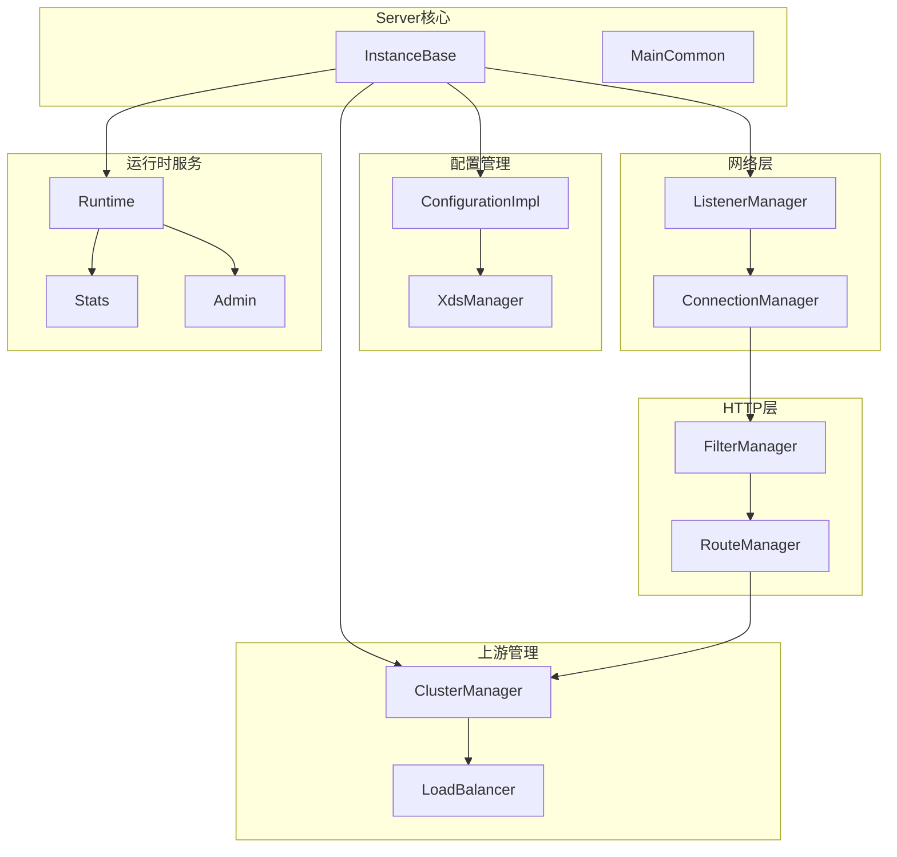

### 2. HTTP连接管理器内部结构

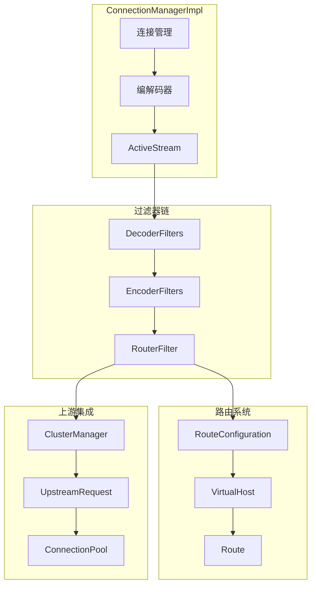

### 3. 上游服务交互模型

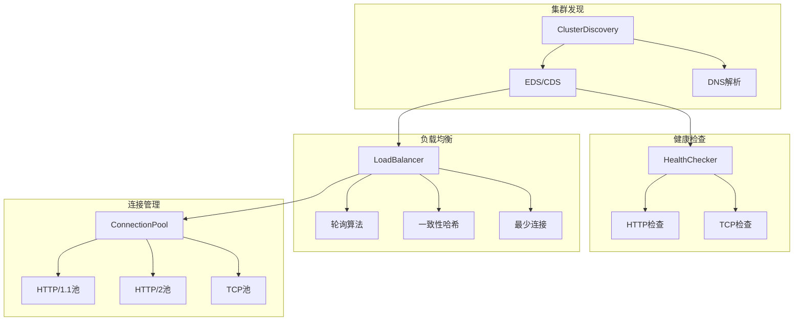

## 配置系统架构

### xDS配置分发机制

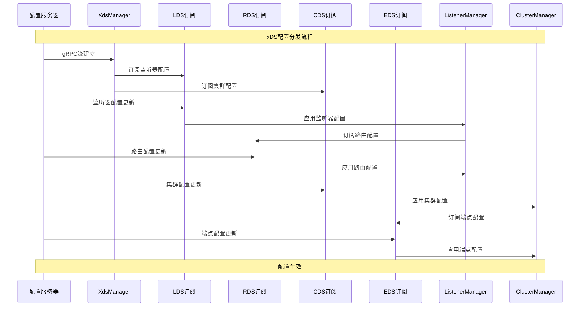

### 配置层次结构

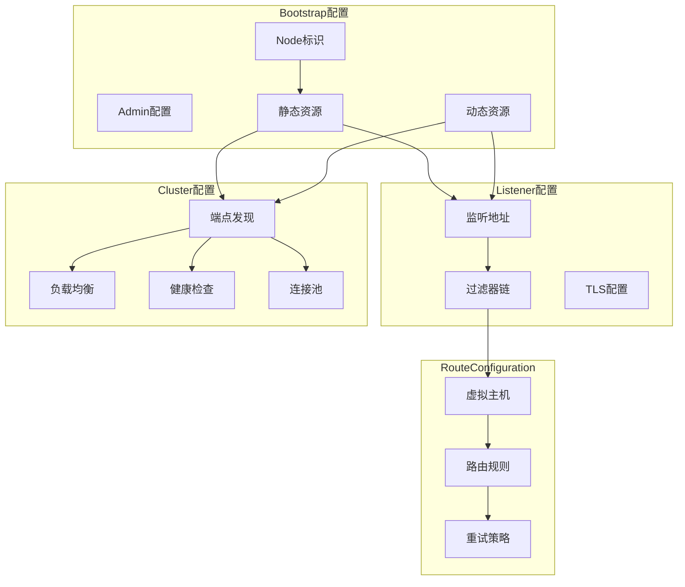

## 线程模型深入分析

### 主线程职责

```cpp
/**
 * 主线程主要职责
 * - 配置管理和热更新
 * - xDS订阅和处理
 * - 集群状态管理
 * - 统计数据收集
 * - Admin接口处理
 */
class MainThread {
public:
  void run() {
    // 1. 初始化配置系统
    initializeConfiguration();
    
    // 2. 启动xDS订阅
    startXdsSubscriptions();
    
    // 3. 初始化集群管理器
    initializeClusterManager();
    
    // 4. 启动工作线程
    startWorkerThreads();
    
    // 5. 运行主事件循环
    dispatcher_->run(Event::Dispatcher::RunType::Block);
  }

private:
  void handleConfigUpdate();
  void updateWorkerThreads();
  void collectStats();
};
```

### Worker线程架构

```cpp
/**
 * Worker线程架构
 * - 处理客户端连接
 * - 执行请求/响应处理
 * - 管理连接池
 * - 本地统计收集
 */
class WorkerThread {
public:
  WorkerThread(ThreadLocalStore& tls) : tls_(tls) {
    // 从TLS获取配置快照
    auto config_snapshot = tls_.getTyped<ConfigSnapshot>();
    
    // 初始化线程本地组件
    initializeLocalComponents(config_snapshot);
  }

  void processConnection(Network::ConnectionPtr connection) {
    // 1. 创建连接处理器
    auto handler = createConnectionHandler(connection);
    
    // 2. 设置事件回调
    connection->addConnectionCallbacks(*handler);
    
    // 3. 注册到事件循环
    dispatcher_->addConnection(std::move(connection));
  }

private:
  Event::DispatcherImpl dispatcher_;
  ThreadLocalStore& tls_;
  std::unique_ptr<ConnectionHandler> connection_handler_;
};
```

### 线程间通信机制

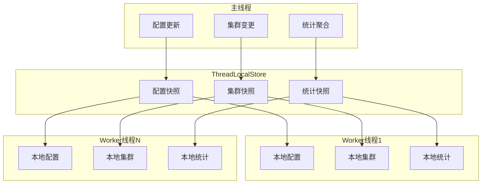

## 内存管理策略

### 对象生命周期管理

```cpp
/**
 * 智能指针使用策略
 * - shared_ptr: 需要在多个地方共享的对象
 * - unique_ptr: 独占所有权的对象
 * - weak_ptr: 避免循环引用
 */
class ObjectLifecycleManager {
public:
  // 配置对象通常使用shared_ptr，因为需要在多线程间共享
  using ConfigPtr = std::shared_ptr<const Configuration>;
  
  // 连接对象使用unique_ptr，生命周期明确
  using ConnectionPtr = std::unique_ptr<Network::Connection>;
  
  // 避免循环引用的回调使用weak_ptr
  using CallbackWeakPtr = std::weak_ptr<CallbackInterface>;

  void updateConfiguration(ConfigPtr new_config) {
    // 原子更新配置指针
    std::atomic_store(&current_config_, new_config);
    
    // 通知所有worker线程
    tls_.runOnAllThreads([new_config](ThreadLocalObject& obj) {
      static_cast<WorkerState&>(obj).updateConfig(new_config);
    });
  }

private:
  std::shared_ptr<const Configuration> current_config_;
  ThreadLocalStore tls_;
};
```

### 缓冲区管理

```cpp
/**
 * 零拷贝缓冲区管理
 * 使用Buffer::Instance接口实现高效的数据传输
 */
class BufferManager {
public:
  /**
   * 移动语义避免数据拷贝
   */
  void transferData(Buffer::Instance& source, Buffer::Instance& destination) {
    // 直接移动数据，不进行拷贝
    destination.move(source);
  }
  
  /**
   * 链式缓冲区避免大块内存分配
   */
  void appendData(Buffer::Instance& buffer, const void* data, size_t length) {
    buffer.add(data, length);
  }
  
  /**
   * 水位线控制内存使用
   */
  void checkWatermarks(Buffer::Instance& buffer) {
    if (buffer.length() > high_watermark_) {
      triggerBackpressure();
    } else if (buffer.length() < low_watermark_) {
      releaseBackpressure();
    }
  }

private:
  size_t high_watermark_ = 1024 * 1024;  // 1MB
  size_t low_watermark_ = 512 * 1024;    // 512KB
};
```

## 性能优化机制

### 1. 热路径优化

```cpp
/**
 * 关键路径性能优化
 * - 内联函数减少调用开销
 * - 分支预测优化
 * - 缓存友好的数据结构
 */
class HotPathOptimization {
public:
  // 使用FORCE_INLINE确保关键函数内联
  FORCE_INLINE bool fastPathCheck(const RequestHeaders& headers) {
    // 使用likely/unlikely提示分支预测
    if (ENVOY_LIKELY(headers.Path() != nullptr)) {
      return processNormalPath(headers);
    } else {
      return ENVOY_UNLIKELY(processSpecialPath(headers));
    }
  }
  
  // 使用数组而非map提升缓存性能
  struct alignas(64) CacheLineAlignedData {
    uint64_t counter;
    uint64_t timestamp;
  };

private:
  // 按缓存行大小对齐
  alignas(64) std::array<CacheLineAlignedData, 16> hot_counters_;
};
```

### 2. 并发控制优化

```cpp
/**
 * 无锁数据结构
 * 使用原子操作和无锁算法提升并发性能
 */
class LockFreeOptimization {
public:
  // 原子计数器避免锁竞争
  void incrementCounter() {
    counter_.fetch_add(1, std::memory_order_relaxed);
  }
  
  // 无锁环形缓冲区
  bool tryPush(const Item& item) {
    uint64_t head = head_.load(std::memory_order_relaxed);
    uint64_t next_head = (head + 1) % capacity_;
    
    if (next_head == tail_.load(std::memory_order_acquire)) {
      return false;  // 队列满
    }
    
    buffer_[head] = item;
    head_.store(next_head, std::memory_order_release);
    return true;
  }

private:
  std::atomic<uint64_t> counter_{0};
  std::atomic<uint64_t> head_{0};
  std::atomic<uint64_t> tail_{0};
  std::vector<Item> buffer_;
  size_t capacity_;
};
```

## 错误处理和容错机制

### 错误传播机制

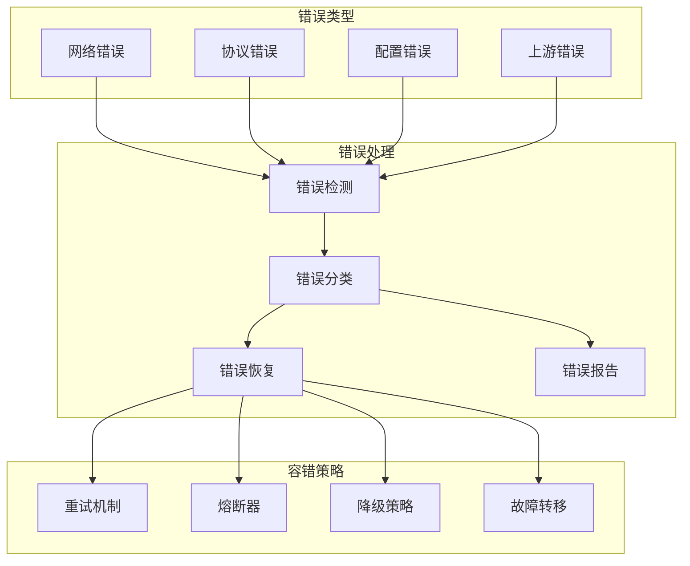

### 容错实现示例

```cpp
/**
 * 熔断器实现
 * 当错误率超过阈值时，快速失败以保护系统
 */
class CircuitBreaker {
public:
  enum class State { Closed, Open, HalfOpen };
  
  bool allowRequest() {
    std::lock_guard<std::mutex> lock(mutex_);
    
    switch (state_) {
    case State::Closed:
      return true;
      
    case State::Open:
      if (shouldAttemptReset()) {
        state_ = State::HalfOpen;
        return true;
      }
      return false;
      
    case State::HalfOpen:
      return requests_in_half_open_ < max_requests_in_half_open_;
    }
  }
  
  void recordSuccess() {
    std::lock_guard<std::mutex> lock(mutex_);
    
    if (state_ == State::HalfOpen) {
      if (++successful_requests_in_half_open_ >= min_requests_in_half_open_) {
        state_ = State::Closed;
        reset();
      }
    }
  }
  
  void recordFailure() {
    std::lock_guard<std::mutex> lock(mutex_);
    
    failure_count_++;
    
    if (state_ == State::Closed) {
      if (failure_count_ >= failure_threshold_) {
        state_ = State::Open;
        last_failure_time_ = std::chrono::steady_clock::now();
      }
    } else if (state_ == State::HalfOpen) {
      state_ = State::Open;
      last_failure_time_ = std::chrono::steady_clock::now();
    }
  }

private:
  mutable std::mutex mutex_;
  State state_ = State::Closed;
  uint32_t failure_count_ = 0;
  uint32_t failure_threshold_ = 5;
  std::chrono::steady_clock::time_point last_failure_time_;
  
  bool shouldAttemptReset() const {
    auto now = std::chrono::steady_clock::now();
    return now - last_failure_time_ > std::chrono::seconds(30);
  }
};
```

## 可观测性架构

### 统计指标收集

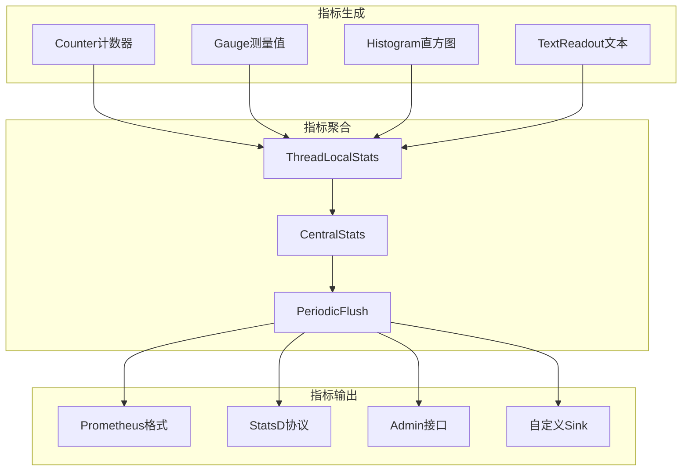

## 总结

Envoy的架构设计体现了以下核心原则：

1. **模块化设计**: 清晰的模块边界和职责分离
2. **事件驱动**: 高效的异步I/O和事件处理
3. **线程安全**: 合理的线程模型和并发控制
4. **性能优化**: 零拷贝、无锁数据结构等优化技术
5. **容错能力**: 完善的错误处理和恢复机制
6. **可观测性**: 丰富的统计指标和调试接口

理解这些架构设计原则，对于深入掌握Envoy的工作机制和进行性能优化具有重要意义。
