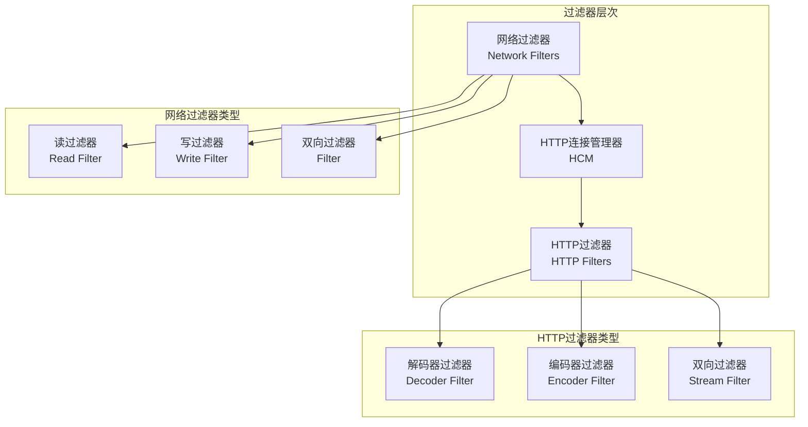
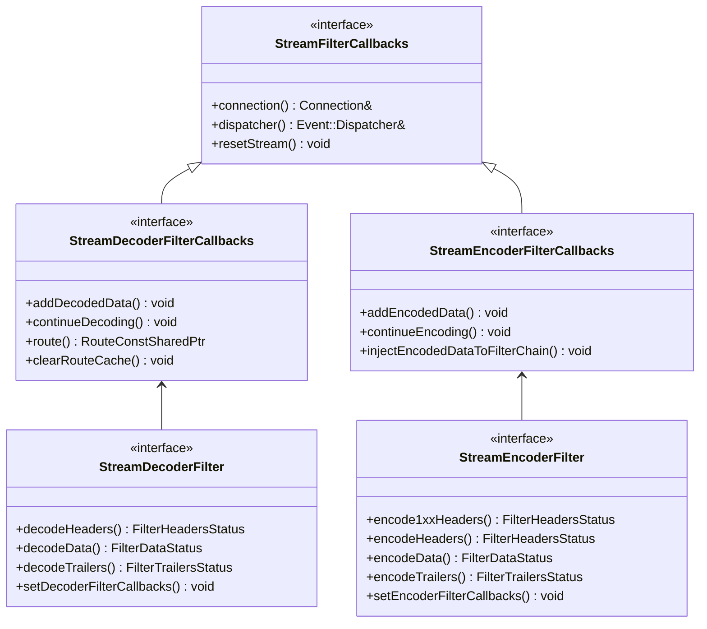
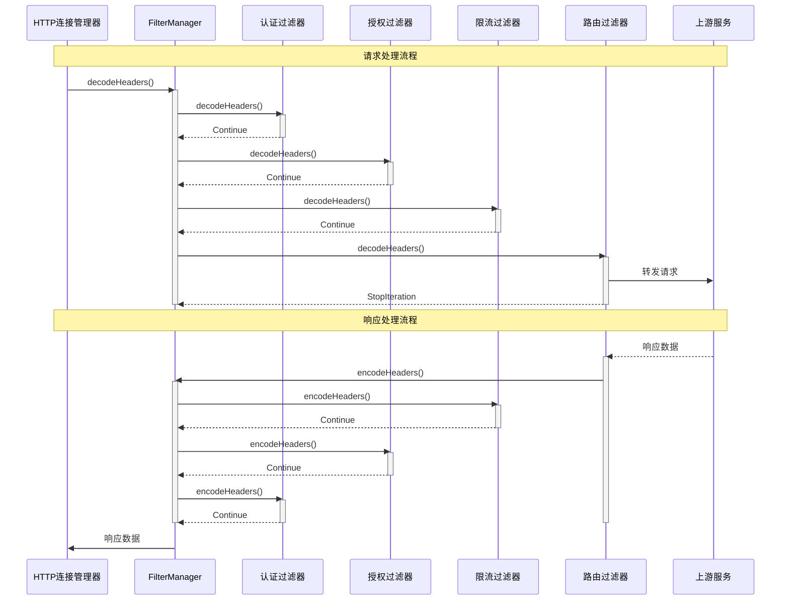

## 过滤器系统概览

Envoy的过滤器系统是其核心可扩展性机制，允许用户在数据流的不同阶段插入自定义逻辑。过滤器系统分为网络级过滤器和HTTP级过滤器两大类。

### 过滤器分类



## 网络过滤器系统

### 网络过滤器接口

```cpp
/**

 * ReadFilter 网络读过滤器接口
 * 处理从网络读取的原始字节流

 */
class ReadFilter {
public:
  virtual ~ReadFilter() = default;

  /**

   * 过滤器状态枚举
   */
  enum class FilterStatus {
    Continue,        // 继续传递给下一个过滤器
    StopIteration   // 停止过滤器链处理
  };

  /**
   * 当有新连接建立时调用
   * @return 过滤器状态
   */
  virtual FilterStatus onNewConnection() PURE;

  /**
   * 当有数据可读时调用
   * @param data 读取的数据缓冲区
   * @param end_stream 是否为流的结束
   * @return 过滤器状态
   */
  virtual FilterStatus onData(Buffer::Instance& data, bool end_stream) PURE;

  /**
   * 初始化读过滤器回调
   * @param callbacks 过滤器回调接口
   */
  virtual void initializeReadFilterCallbacks(ReadFilterCallbacks& callbacks) PURE;

};

/**

 * WriteFilter 网络写过滤器接口  
 * 处理向网络写入的原始字节流

 */
class WriteFilter {
public:
  virtual ~WriteFilter() = default;

  /**

   * 过滤器状态枚举
   */
  enum class FilterStatus {
    Continue,        // 继续传递给下一个过滤器
    StopIteration   // 停止过滤器链处理
  };

  /**
   * 当有数据要写入时调用
   * @param data 要写入的数据缓冲区
   * @param end_stream 是否为流的结束
   * @return 过滤器状态
   */
  virtual FilterStatus onWrite(Buffer::Instance& data, bool end_stream) PURE;

  /**
   * 初始化写过滤器回调
   * @param callbacks 过滤器回调接口
   */
  virtual void initializeWriteFilterCallbacks(WriteFilterCallbacks& callbacks) PURE;

};
```

### 网络过滤器管理器

```cpp
/**

 * FilterManagerImpl 网络过滤器管理器实现
 * 管理网络级过滤器链的执行

 */
class FilterManagerImpl : public FilterManager {
public:
  FilterManagerImpl(Network::Connection& connection,
                   Network::ConnectionSocket& socket)
      : connection_(connection), socket_(socket) {}

  // FilterManager 接口实现
  void addReadFilter(ReadFilterSharedPtr filter) override;
  void addWriteFilter(WriteFilterSharedPtr filter) override;
  void addFilter(FilterSharedPtr filter) override;
  void removeReadFilter(ReadFilterSharedPtr filter) override;
  bool initializeReadFilters() override;

  /**

   * 处理读取数据的过滤器链
   * @param data 数据缓冲区
   * @param end_stream 是否流结束
   */
  void onRead(Buffer::Instance& data, bool end_stream);

  /**
   * 处理写入数据的过滤器链
   * @param data 数据缓冲区
   * @param end_stream 是否流结束
   */
  void onWrite(Buffer::Instance& data, bool end_stream);

private:
  /**

   * 活跃读过滤器结构
   */
  struct ActiveReadFilter : public ReadFilterCallbacks {
    ActiveReadFilter(FilterManagerImpl& parent, ReadFilterSharedPtr filter)
        : parent_(parent), filter_(filter) {
      filter_->initializeReadFilterCallbacks(*this);
    }

    // ReadFilterCallbacks 接口实现
    Connection& connection() override { return parent_.connection_; }
    void continueReading() override { parent_.continueReadFilters(); }
    void injectReadDataToFilterChain(Buffer::Instance& data, bool end_stream) override;

    FilterManagerImpl& parent_;
    ReadFilterSharedPtr filter_;
    std::list<ActiveReadFilter>::iterator entry_{};
    bool stopped_{false};
  };

  Network::Connection& connection_;        // 网络连接引用
  Network::ConnectionSocket& socket_;      // 连接套接字引用
  std::list<ActiveReadFilter> read_filters_; // 读过滤器链
  std::list<ActiveWriteFilter> write_filters_; // 写过滤器链
  std::list<ActiveReadFilter>::iterator current_read_filter_; // 当前读过滤器
  std::list<ActiveWriteFilter>::iterator current_write_filter_; // 当前写过滤器

};
```

## HTTP过滤器系统

### HTTP过滤器接口层次



### HTTP过滤器基类实现

```cpp
/**

 * StreamDecoderFilter HTTP解码器过滤器接口
 * 处理HTTP请求（下游到上游）

 */
class StreamDecoderFilter {
public:
  virtual ~StreamDecoderFilter() = default;

  /**

   * 过滤器状态枚举
   */
  enum class FilterHeadersStatus {
    Continue,              // 继续处理
    StopIteration,        // 停止迭代但不停止过滤器链
    ContinueAndEndStream, // 继续并结束流
    StopAllIterationAndBuffer, // 停止所有迭代并缓冲
    StopAllIterationAndWatermark // 停止所有迭代并设置水位线
  };

  enum class FilterDataStatus {
    Continue,              // 继续处理
    StopIterationAndBuffer, // 停止迭代并缓冲数据
    StopIterationAndWatermark, // 停止迭代并设置水位线
    StopIterationNoBuffer  // 停止迭代但不缓冲
  };

  enum class FilterTrailersStatus {
    Continue,              // 继续处理
    StopIteration         // 停止迭代
  };

  /**
   * 处理请求头
   * @param headers 请求头映射
   * @param end_stream 是否流结束
   * @return 过滤器状态
   */
  virtual FilterHeadersStatus decodeHeaders(RequestHeaderMap& headers,
                                           bool end_stream) PURE;

  /**
   * 处理请求数据  
   * @param data 请求数据缓冲区
   * @param end_stream 是否流结束
   * @return 过滤器状态
   */
  virtual FilterDataStatus decodeData(Buffer::Instance& data, bool end_stream) PURE;

  /**
   * 处理请求尾部
   * @param trailers 请求尾部映射
   * @return 过滤器状态
   */
  virtual FilterTrailersStatus decodeTrailers(RequestTrailerMap& trailers) PURE;

  /**
   * 设置解码器过滤器回调
   * @param callbacks 回调接口
   */
  virtual void setDecoderFilterCallbacks(StreamDecoderFilterCallbacks& callbacks) PURE;

};

/**

 * StreamEncoderFilter HTTP编码器过滤器接口
 * 处理HTTP响应（上游到下游）

 */
class StreamEncoderFilter {
public:
  virtual ~StreamEncoderFilter() = default;

  /**

   * 处理1xx响应头
   * @param headers 响应头映射
   * @return 过滤器状态
   */
  virtual FilterHeadersStatus encode1xxHeaders(ResponseHeaderMap& headers) PURE;

  /**
   * 处理响应头
   * @param headers 响应头映射
   * @param end_stream 是否流结束
   * @return 过滤器状态
   */
  virtual FilterHeadersStatus encodeHeaders(ResponseHeaderMap& headers,
                                           bool end_stream) PURE;

  /**
   * 处理响应数据
   * @param data 响应数据缓冲区  
   * @param end_stream 是否流结束
   * @return 过滤器状态
   */
  virtual FilterDataStatus encodeData(Buffer::Instance& data, bool end_stream) PURE;

  /**
   * 处理响应尾部
   * @param trailers 响应尾部映射
   * @return 过滤器状态
   */
  virtual FilterTrailersStatus encodeTrailers(ResponseTrailerMap& trailers) PURE;

  /**
   * 设置编码器过滤器回调
   * @param callbacks 回调接口
   */
  virtual void setEncoderFilterCallbacks(StreamEncoderFilterCallbacks& callbacks) PURE;

};
```

### HTTP过滤器管理器实现

```cpp
/**

 * FilterManager HTTP过滤器管理器
 * 管理HTTP级过滤器链的执行和状态

 */
class FilterManager : Logger::Loggable<Logger::Id::http> {
public:
  FilterManager(FilterManagerCallbacks& callbacks,
                Event::Dispatcher& dispatcher,
                const Network::Connection& connection,
                uint64_t stream_id,
                Buffer::BufferMemoryAccountSharedPtr account);

  /**

   * 添加解码器过滤器
   * @param filter 解码器过滤器
   */
  void addDecoderFilter(StreamDecoderFilterSharedPtr filter);

  /**
   * 添加编码器过滤器  
   * @param filter 编码器过滤器
   */
  void addEncoderFilter(StreamEncoderFilterSharedPtr filter);

  /**
   * 添加双向过滤器
   * @param filter 双向过滤器
   */
  void addFilter(StreamFilterSharedPtr filter);

  /**
   * 处理请求头解码
   * @param headers 请求头
   * @param end_stream 是否流结束
   */
  void decodeHeaders(RequestHeaderMapSharedPtr&& headers, bool end_stream);

  /**
   * 处理请求数据解码
   * @param data 请求数据  
   * @param end_stream 是否流结束
   */
  void decodeData(Buffer::Instance& data, bool end_stream);

  /**
   * 处理响应头编码
   * @param headers 响应头
   * @param end_stream 是否流结束
   */
  void encodeHeaders(ResponseHeaderMap& headers, bool end_stream);

  /**
   * 处理响应数据编码
   * @param data 响应数据
   * @param end_stream 是否流结束  
   */
  void encodeData(Buffer::Instance& data, bool end_stream);

private:
  /**

   * 活跃解码器过滤器
   */
  struct ActiveStreamDecoderFilter : public StreamDecoderFilterCallbacks,
                                     public DownstreamWatermarkCallbacks {
    ActiveStreamDecoderFilter(FilterManager& parent,
                             StreamDecoderFilterSharedPtr filter,
                             bool dual_filter);

    // StreamDecoderFilterCallbacks 接口实现
    const Network::Connection* connection() override;
    Event::Dispatcher& dispatcher() override;
    void resetStream() override;
    RouteConstSharedPtr route() override;
    void clearRouteCache() override;
    uint64_t streamId() const override;
    StreamInfo::StreamInfo& streamInfo() override;
    void continueDecoding() override;
    void addDecodedData(Buffer::Instance& data, bool streaming) override;

    FilterManager& parent_;                      // 父过滤器管理器
    StreamDecoderFilterSharedPtr filter_;       // 过滤器实例
    std::list<ActiveStreamDecoderFilter>::iterator entry_; // 链表迭代器
    bool stopped_{false};                       // 是否停止
    bool dual_filter_{false};                   // 是否双向过滤器
  };

  /**
   * 活跃编码器过滤器
   */
  struct ActiveStreamEncoderFilter : public StreamEncoderFilterCallbacks {
    ActiveStreamEncoderFilter(FilterManager& parent,
                             StreamEncoderFilterSharedPtr filter,
                             bool dual_filter);

    // StreamEncoderFilterCallbacks 接口实现  
    const Network::Connection* connection() override;
    Event::Dispatcher& dispatcher() override;
    void resetStream() override;
    uint64_t streamId() const override;
    StreamInfo::StreamInfo& streamInfo() override;
    void continueEncoding() override;
    void addEncodedData(Buffer::Instance& data, bool streaming) override;

    FilterManager& parent_;                      // 父过滤器管理器
    StreamEncoderFilterSharedPtr filter_;       // 过滤器实例  
    std::list<ActiveStreamEncoderFilter>::iterator entry_; // 链表迭代器
    bool stopped_{false};                       // 是否停止
    bool dual_filter_{false};                   // 是否双向过滤器
  };

  FilterManagerCallbacks& callbacks_;            // 回调接口
  Event::Dispatcher& dispatcher_;               // 事件分发器
  StreamInfo::StreamInfoImpl stream_info_;      // 流信息
  
  std::list<ActiveStreamDecoderFilter> decoder_filters_; // 解码器过滤器链
  std::list<ActiveStreamEncoderFilter> encoder_filters_; // 编码器过滤器链
  
  std::list<ActiveStreamDecoderFilter>::iterator decoder_filter_; // 当前解码器过滤器
  std::list<ActiveStreamEncoderFilter>::iterator encoder_filter_; // 当前编码器过滤器
  
  // 状态标志
  struct State {
    bool local_complete_ : 1;        // 本地完成
    bool remote_complete_ : 1;       // 远程完成
    bool decoder_filter_chain_aborted_ : 1; // 解码器链中止
    bool encoder_filter_chain_aborted_ : 1; // 编码器链中止
    bool destroyed_ : 1;             // 已销毁
  };
  State state_{};

};
```

## 内置过滤器分析

### Router过滤器 - 核心路由过滤器

```cpp
/**

 * Router::Filter 路由过滤器实现
 * 负责将请求路由到上游集群

 */
namespace Router {
class Filter : public StreamDecoderFilter,
               public StreamEncoderFilter,
               public UpstreamRequest::Callbacks,
               Logger::Loggable<Logger::Id::router> {
public:
  Filter(ConfigSharedPtr config, Stats::StatName stats_prefix)
      : config_(std::move(config)), stats_prefix_(stats_prefix) {}

  // StreamDecoderFilter 接口实现
  FilterHeadersStatus decodeHeaders(RequestHeaderMap& headers, bool end_stream) override;
  FilterDataStatus decodeData(Buffer::Instance& data, bool end_stream) override;
  FilterTrailersStatus decodeTrailers(RequestTrailerMap& trailers) override;
  void setDecoderFilterCallbacks(StreamDecoderFilterCallbacks& callbacks) override;

  // StreamEncoderFilter 接口实现
  FilterHeadersStatus encode1xxHeaders(ResponseHeaderMap& headers) override;
  FilterHeadersStatus encodeHeaders(ResponseHeaderMap& headers, bool end_stream) override;
  FilterDataStatus encodeData(Buffer::Instance& data, bool end_stream) override;
  FilterTrailersStatus encodeTrailers(ResponseTrailerMap& trailers) override;
  void setEncoderFilterCallbacks(StreamEncoderFilterCallbacks& callbacks) override;

private:
  /**

   * 上游请求封装
   */
  struct UpstreamRequest : public Http::StreamDecoder,
                           public Http::StreamCallbacks,
                           public UpstreamToDownstream {
    UpstreamRequest(Filter& parent, Http::ConnectionPool::Instance& pool);

    // StreamDecoder 接口实现
    void decodeHeaders(ResponseHeaderMapSharedPtr&& headers, bool end_stream) override;
    void decodeData(Buffer::Instance& data, bool end_stream) override;
    void decodeTrailers(ResponseTrailerMapPtr&& trailers) override;

    // StreamCallbacks 接口实现
    void onResetStream(StreamResetReason reason,
                      absl::string_view transport_failure_reason) override;
    void onAboveWriteBufferHighWatermark() override;
    void onBelowWriteBufferLowWatermark() override;

    Filter& parent_;                              // 父路由过滤器
    Http::ConnectionPool::Cancellable* conn_pool_handle_{}; // 连接池句柄
    Http::StreamEncoder* upstream_encoder_{};     // 上游编码器
    Upstream::HostDescriptionConstSharedPtr upstream_host_; // 上游主机
    RouteStatsContextOptRef route_stats_context_; // 路由统计上下文
  };

  /**
   * 开始上游请求
   */
  void startUpstreamRequest();

  /**
   * 选择上游集群和主机
   */  
  void selectUpstream();

  /**
   * 处理上游响应
   */
  void handleUpstreamResponse();

  ConfigSharedPtr config_;                        // 路由配置
  Stats::StatName stats_prefix_;                  // 统计前缀
  StreamDecoderFilterCallbacks* callbacks_{};     // 解码器回调
  StreamEncoderFilterCallbacks* encoder_callbacks_{}; // 编码器回调
  
  RouteConstSharedPtr route_;                     // 匹配的路由
  Upstream::ClusterInfoConstSharedPtr cluster_;   // 目标集群
  std::unique_ptr<UpstreamRequest> upstream_request_; // 上游请求
  
  bool do_shadowing_ : 1;                        // 是否进行影子流量
  bool is_retry_ : 1;                           // 是否重试

};
} // namespace Router
```

### CORS过滤器实现示例

```cpp
/**

 * Cors::Filter CORS过滤器实现
 * 处理跨域资源共享请求

 */
namespace Cors {
class Filter : public Http::StreamDecoderFilter,
               public Http::StreamEncoderFilter {
public:
  Filter(const FilterConfigSharedPtr config) : config_(config) {}

  // StreamDecoderFilter 接口实现
  FilterHeadersStatus decodeHeaders(RequestHeaderMap& headers, bool end_stream) override {
    // 检查是否为CORS预检请求
    if (headers.getMethodValue() == Http::Headers::get().MethodValues.Options) {
      return handlePreflightRequest(headers);
    }
    
    // 检查Origin头
    const HeaderEntry* origin_header = headers.Origin();
    if (origin_header != nullptr) {
      origin_ = origin_header->value().getStringView();
      is_cors_request_ = true;
    }
    
    return FilterHeadersStatus::Continue;
  }

  FilterDataStatus decodeData(Buffer::Instance&, bool) override {
    return FilterDataStatus::Continue;
  }

  FilterTrailersStatus decodeTrailers(RequestTrailerMap&) override {
    return FilterTrailersStatus::Continue;
  }

  // StreamEncoderFilter 接口实现
  FilterHeadersStatus encodeHeaders(ResponseHeaderMap& headers, bool end_stream) override {
    if (is_cors_request_) {
      addCorsHeaders(headers);
    }
    return FilterHeadersStatus::Continue;
  }

  FilterDataStatus encodeData(Buffer::Instance&, bool) override {
    return FilterDataStatus::Continue;
  }

  FilterTrailersStatus encodeTrailers(ResponseTrailerMap&) override {
    return FilterTrailersStatus::Continue;
  }

private:
  /**

   * 处理CORS预检请求
   */
  FilterHeadersStatus handlePreflightRequest(RequestHeaderMap& headers);

  /**
   * 添加CORS响应头
   */
  void addCorsHeaders(ResponseHeaderMap& headers);

  /**
   * 检查Origin是否被允许
   */
  bool isOriginAllowed(absl::string_view origin) const;

  FilterConfigSharedPtr config_;     // 过滤器配置
  absl::string_view origin_;        // 请求Origin
  bool is_cors_request_{false};     // 是否CORS请求

};
} // namespace Cors
```

## 过滤器工厂系统

### 过滤器工厂注册机制

```cpp
/**

 * NamedHttpFilterConfigFactory 命名HTTP过滤器配置工厂
 * 过滤器插件的统一注册接口

 */
class NamedHttpFilterConfigFactory : public Config::TypedFactory {
public:
  virtual ~NamedHttpFilterConfigFactory() = default;

  /**

   * 创建过滤器工厂回调
   * @param config 过滤器配置
   * @param factory_context 工厂上下文
   * @return 过滤器工厂回调函数
   */
  virtual Http::FilterFactoryCb
  createFilterFactoryFromProto(const Protobuf::Message& config,
                              const std::string& stats_prefix,
                              Server::Configuration::FactoryContext& factory_context) PURE;

  /**
   * 创建路由特定的过滤器工厂回调
   * @param config 过滤器配置
   * @param factory_context 工厂上下文
   * @return 过滤器工厂回调函数
   */
  virtual Http::FilterFactoryCb
  createFilterFactoryFromProtoTyped(const Protobuf::Message& config,
                                   const std::string& stats_prefix,
                                   Server::Configuration::FactoryContext& factory_context) PURE;

  /**
   * 获取配置Proto类型
   * @return Proto消息类型
   */
  virtual ProtobufTypes::MessagePtr createEmptyConfigProto() PURE;

  /**
   * 获取过滤器名称
   * @return 过滤器名称
   */
  std::string name() const override PURE;

};

/**

 * 过滤器注册宏
 * 简化过滤器插件的注册过程

 */
#define REGISTER_FACTORY(FACTORY, TYPE)                                                           \
  static Registry::RegisterFactory<FACTORY, TYPE> registered_##FACTORY

// 使用示例
class MyFilterConfigFactory : public NamedHttpFilterConfigFactory {
public:
  Http::FilterFactoryCb
  createFilterFactoryFromProto(const Protobuf::Message& proto_config,
                              const std::string& stats_prefix,
                              Server::Configuration::FactoryContext& context) override {
    const auto& typed_config = MessageUtil::downcastAndValidate<
        const my_filter::v3::MyFilter&>(proto_config, context.messageValidationVisitor());
        
    auto config = std::make_shared<MyFilterConfig>(typed_config, context);
    
    return [config](Http::FilterChainFactoryCallbacks& callbacks) -> void {
      callbacks.addStreamDecoderFilter(std::make_shared<MyFilter>(config));
    };
  }

  ProtobufTypes::MessagePtr createEmptyConfigProto() override {
    return std::make_unique<my_filter::v3::MyFilter>();
  }

  std::string name() const override { return "envoy.filters.http.my_filter"; }
};

// 注册过滤器
REGISTER_FACTORY(MyFilterConfigFactory, Server::Configuration::NamedHttpFilterConfigFactory);
```

## 过滤器链配置

### 静态配置

```yaml
# HTTP过滤器链配置示例
http_filters:
# JWT认证过滤器
- name: envoy.filters.http.jwt_authn
  typed_config:
    "@type": type.googleapis.com/envoy.extensions.filters.http.jwt_authn.v3.JwtAuthentication
    providers:
      provider1:
        issuer: "https://example.com"
        audiences: ["audience1", "audience2"]
        remote_jwks:
          http_uri:
            uri: "https://example.com/.well-known/jwks.json"
            cluster: jwks_cluster
            timeout: 5s
          cache_duration: 300s

# RBAC授权过滤器  
- name: envoy.filters.http.rbac
  typed_config:
    "@type": type.googleapis.com/envoy.extensions.filters.http.rbac.v3.RBAC
    rules:
      action: ALLOW
      policies:
        "admin-policy":
          permissions:
          - header:
              name: "x-role"
              exact_match: "admin"
          principals:
          - authenticated:
              principal_name:
                exact: "admin@example.com"

# 限流过滤器
- name: envoy.filters.http.local_ratelimit
  typed_config:
    "@type": type.googleapis.com/udpa.type.v1.TypedStruct
    type_url: type.googleapis.com/envoy.extensions.filters.http.local_ratelimit.v3.LocalRateLimit
    value:
      stat_prefix: http_local_rate_limiter
      token_bucket:
        max_tokens: 10000
        tokens_per_fill: 1000
        fill_interval: 1s

# 路由过滤器（必须是最后一个）
- name: envoy.filters.http.router
  typed_config:
    "@type": type.googleapis.com/envoy.extensions.filters.http.router.v3.Router

```

### 动态配置和条件过滤器

```cpp
/**

 * ConditionalFilter 条件过滤器包装器
 * 根据条件决定是否执行过滤器逻辑

 */
class ConditionalFilter : public StreamDecoderFilter,
                          public StreamEncoderFilter {
public:
  ConditionalFilter(StreamFilterSharedPtr wrapped_filter,
                   std::function<bool(const RequestHeaderMap&)> condition)
      : wrapped_filter_(wrapped_filter), condition_(condition) {}

  // StreamDecoderFilter 接口实现
  FilterHeadersStatus decodeHeaders(RequestHeaderMap& headers, bool end_stream) override {
    should_filter_ = condition_(headers);
    if (should_filter_) {
      return wrapped_filter_->decodeHeaders(headers, end_stream);
    }
    return FilterHeadersStatus::Continue;
  }

  FilterDataStatus decodeData(Buffer::Instance& data, bool end_stream) override {
    if (should_filter_) {
      return wrapped_filter_->decodeData(data, end_stream);
    }
    return FilterDataStatus::Continue;
  }

  // StreamEncoderFilter 接口实现
  FilterHeadersStatus encodeHeaders(ResponseHeaderMap& headers, bool end_stream) override {
    if (should_filter_) {
      return wrapped_filter_->encodeHeaders(headers, end_stream);
    }
    return FilterHeadersStatus::Continue;
  }

private:
  StreamFilterSharedPtr wrapped_filter_;           // 被包装的过滤器
  std::function<bool(const RequestHeaderMap&)> condition_; // 条件判断函数
  bool should_filter_{false};                     // 是否应该过滤
};
```

## 过滤器执行流程

### 过滤器链执行时序图



## 扩展机制深入分析

### 自定义过滤器开发

```cpp
/**

 * CustomFilter 自定义过滤器实现示例
 * 演示如何开发一个完整的HTTP过滤器

 */
class CustomFilter : public Http::StreamDecoderFilter,
                     public Http::StreamEncoderFilter,
                     Logger::Loggable<Logger::Id::filter> {
public:
  CustomFilter(CustomFilterConfigSharedPtr config,
               Server::Configuration::FactoryContext& context)
      : config_(config), context_(context),
        stats_(generateStats(config_->statsPrefix(), context_.scope())) {}

  // StreamDecoderFilter 接口实现
  FilterHeadersStatus decodeHeaders(RequestHeaderMap& headers, bool end_stream) override;
  FilterDataStatus decodeData(Buffer::Instance& data, bool end_stream) override;
  FilterTrailersStatus decodeTrailers(RequestTrailerMap& trailers) override;
  void setDecoderFilterCallbacks(StreamDecoderFilterCallbacks& callbacks) override {
    decoder_callbacks_ = &callbacks;
  }

  // StreamEncoderFilter 接口实现
  FilterHeadersStatus encodeHeaders(ResponseHeaderMap& headers, bool end_stream) override;
  FilterDataStatus encodeData(Buffer::Instance& data, bool end_stream) override;
  FilterTrailersStatus encodeTrailers(ResponseTrailerMap& trailers) override;
  void setEncoderFilterCallbacks(StreamEncoderFilterCallbacks& callbacks) override {
    encoder_callbacks_ = &callbacks;
  }

private:
  /**

   * 过滤器统计指标
   */
  struct CustomFilterStats {
    Stats::Counter& requests_total_;
    Stats::Counter& requests_allowed_;
    Stats::Counter& requests_denied_;
    Stats::Histogram& processing_time_;
  };

  /**
   * 生成统计指标
   */
  CustomFilterStats generateStats(const std::string& prefix, Stats::Scope& scope) {
    const std::string final_prefix = prefix + "custom_filter.";
    return {
      scope.counterFromString(final_prefix + "requests_total"),
      scope.counterFromString(final_prefix + "requests_allowed"),
      scope.counterFromString(final_prefix + "requests_denied"),
      scope.histogramFromString(final_prefix + "processing_time", Stats::Histogram::Unit::Milliseconds)
    };
  }

  /**
   * 处理请求逻辑
   */
  FilterHeadersStatus processRequest(RequestHeaderMap& headers);

  /**
   * 处理响应逻辑  
   */
  FilterHeadersStatus processResponse(ResponseHeaderMap& headers);

  CustomFilterConfigSharedPtr config_;          // 过滤器配置
  Server::Configuration::FactoryContext& context_; // 工厂上下文
  StreamDecoderFilterCallbacks* decoder_callbacks_{}; // 解码器回调
  StreamEncoderFilterCallbacks* encoder_callbacks_{}; // 编码器回调
  CustomFilterStats stats_;                    // 统计指标
  TimeSource& time_source_{context_.timeSource()}; // 时间源
  MonotonicTime start_time_;                   // 处理开始时间

};

/**

 * 自定义过滤器工厂实现

 */
class CustomFilterFactory : public Server::Configuration::NamedHttpFilterConfigFactory {
public:
  Http::FilterFactoryCb
  createFilterFactoryFromProto(const Protobuf::Message& proto_config,
                              const std::string& stats_prefix,
                              Server::Configuration::FactoryContext& context) override {
    
    const auto& typed_config = MessageUtil::downcastAndValidate<
        const custom_filter::v3::CustomFilter&>(proto_config,
                                                context.messageValidationVisitor());

    CustomFilterConfigSharedPtr config =
        std::make_shared<CustomFilterConfig>(typed_config, stats_prefix, context);

    return [config, &context](Http::FilterChainFactoryCallbacks& callbacks) -> void {
      auto filter = std::make_shared<CustomFilter>(config, context);
      callbacks.addStreamFilter(filter);
    };
  }

  ProtobufTypes::MessagePtr createEmptyConfigProto() override {
    return std::make_unique<custom_filter::v3::CustomFilter>();
  }

  std::string name() const override {
    return "envoy.filters.http.custom_filter";
  }
};

// 注册过滤器
REGISTER_FACTORY(CustomFilterFactory, Server::Configuration::NamedHttpFilterConfigFactory);
```

## 调试和监控

### 过滤器调试功能

```cpp
/**

 * FilterDebugUtils 过滤器调试工具
 * 提供过滤器执行的调试和监控功能

 */
class FilterDebugUtils {
public:
  /**

   * 记录过滤器执行轨迹
   */
  static void traceFilterExecution(const std::string& filter_name,
                                  const std::string& method,
                                  const std::string& status) {
    ENVOY_LOG(debug, "Filter [{}] {} returned {}", filter_name, method, status);
  }

  /**
   * 转储过滤器链状态
   */
  static std::string dumpFilterChainState(const FilterManager& filter_manager) {
    std::ostringstream oss;
    oss << "Filter chain state:\n";
    oss << "  Decoder filters: " << filter_manager.decoderFiltersSize() << "\n";
    oss << "  Encoder filters: " << filter_manager.encoderFiltersSize() << "\n";
    oss << "  Current decoder filter: " << filter_manager.currentDecoderFilterName() << "\n";
    oss << "  Current encoder filter: " << filter_manager.currentEncoderFilterName() << "\n";
    return oss.str();
  }

  /**
   * 性能分析
   */
  class FilterPerformanceTracker {
  public:
    FilterPerformanceTracker(const std::string& filter_name, Stats::Scope& scope)
        : filter_name_(filter_name),
          execution_time_(scope.histogramFromString(
              filter_name_ + ".execution_time", Stats::Histogram::Unit::Microseconds)),
          start_time_(std::chrono::high_resolution_clock::now()) {}

    ~FilterPerformanceTracker() {
      auto end_time = std::chrono::high_resolution_clock::now();
      auto duration = std::chrono::duration_cast<std::chrono::microseconds>(
          end_time - start_time_).count();
      execution_time_.recordValue(duration);
    }

  private:
    const std::string filter_name_;
    Stats::Histogram& execution_time_;
    std::chrono::high_resolution_clock::time_point start_time_;
  };

};
```

## 最佳实践

### 1. 过滤器开发原则

- **单一职责**: 每个过滤器只负责一个特定功能
- **无状态设计**: 避免在过滤器间共享状态
- **异常处理**: 妥善处理各种异常情况
- **性能考量**: 避免阻塞操作，使用异步模式

### 2. 过滤器链设计

```yaml
# 推荐的过滤器链顺序
http_filters:

- name: envoy.filters.http.health_check      # 1. 健康检查
- name: envoy.filters.http.fault            # 2. 故障注入（测试环境）
- name: envoy.filters.http.cors             # 3. CORS处理
- name: envoy.filters.http.jwt_authn        # 4. 身份认证
- name: envoy.filters.http.rbac             # 5. 授权检查
- name: envoy.filters.http.local_ratelimit  # 6. 限流控制
- name: envoy.filters.http.buffer           # 7. 请求缓冲
- name: envoy.filters.http.gzip             # 8. 压缩处理
- name: envoy.filters.http.router          # 9. 路由（必须最后）

```

### 3. 配置管理

```cpp
/**

 * 过滤器配置验证

 */
class FilterConfigValidator {
public:
  static absl::Status validateConfig(const Protobuf::Message& config) {
    // 1. 验证必填字段
    if (!hasRequiredFields(config)) {
      return absl::InvalidArgumentError("Missing required fields");
    }
    
    // 2. 验证数值范围
    if (!validateNumericRanges(config)) {
      return absl::InvalidArgumentError("Numeric values out of range");
    }
    
    // 3. 验证依赖关系
    if (!validateDependencies(config)) {
      return absl::InvalidArgumentError("Invalid configuration dependencies");
    }
    
    return absl::OkStatus();
  }
};
```

## 总结

Envoy的过滤器系统是其强大扩展能力的核心，提供了：

1. **分层过滤架构**: 网络级和HTTP级过滤器
2. **灵活的扩展机制**: 插件化的过滤器注册系统
3. **丰富的内置过滤器**: 认证、授权、限流、路由等
4. **高性能执行**: 零拷贝、异步处理优化
5. **完善的调试支持**: 详细的统计和日志

理解过滤器系统的设计原理和实现机制，对于开发自定义扩展和优化Envoy性能具有重要意义。
