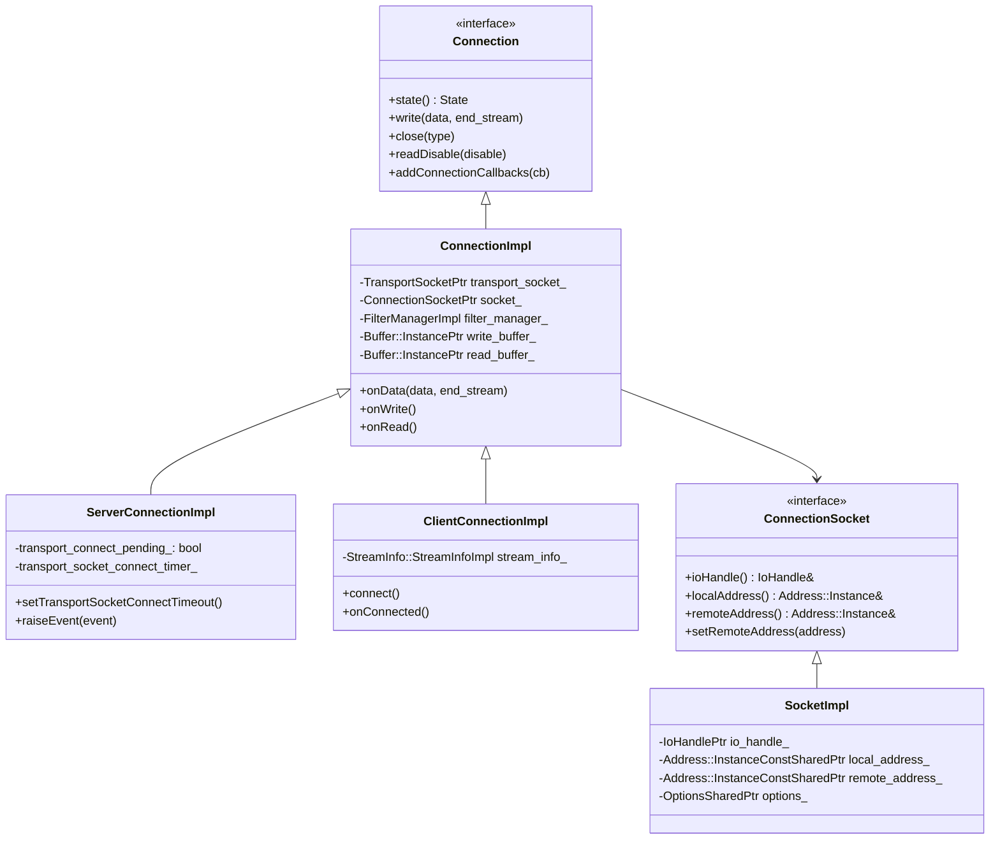
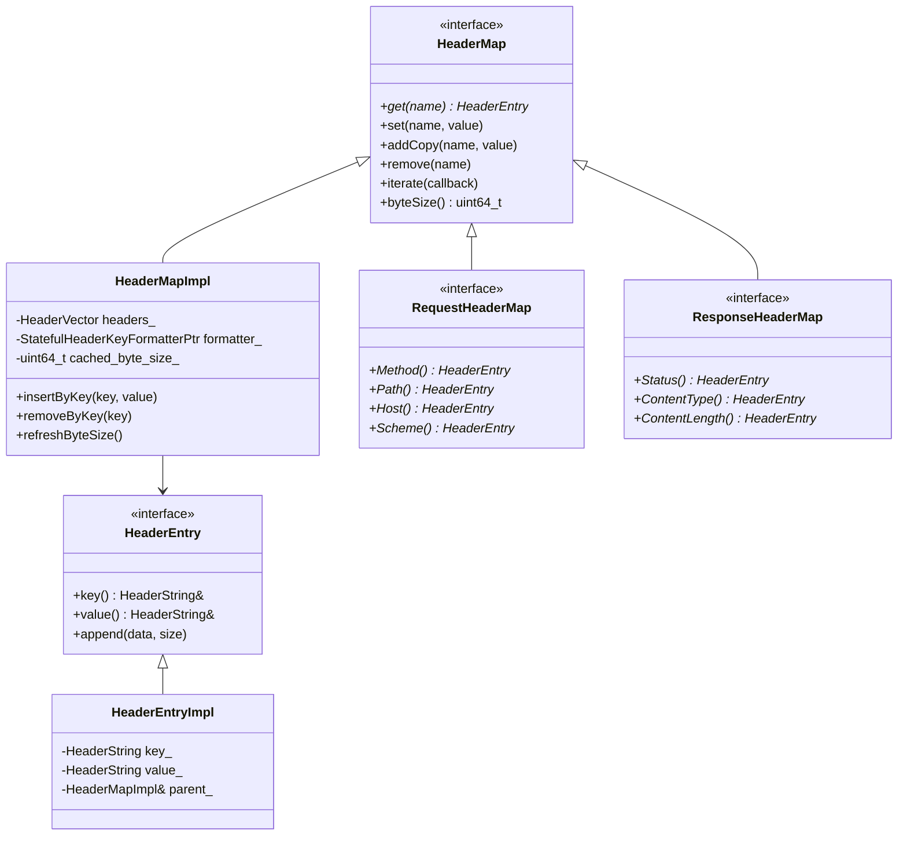
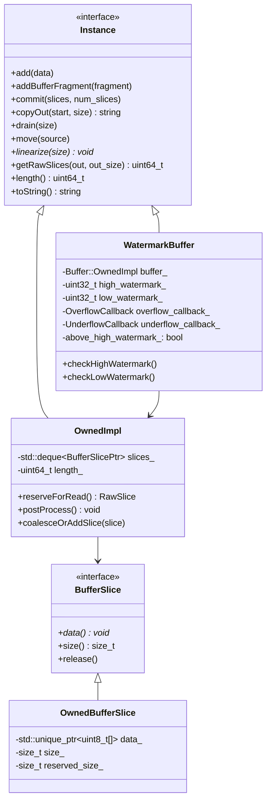
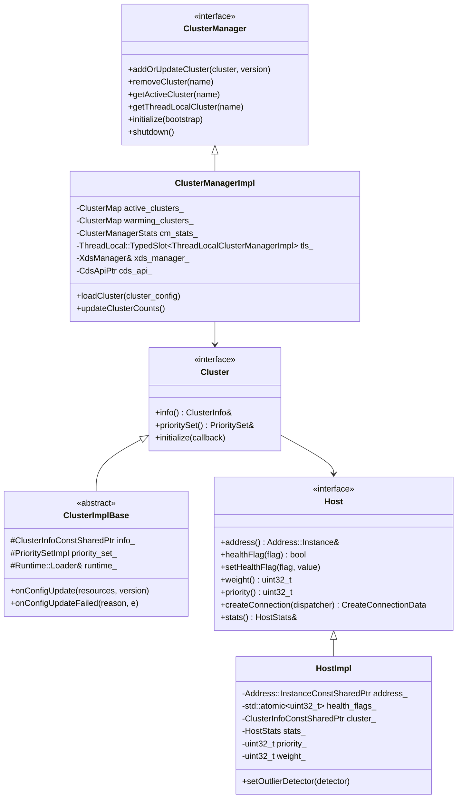
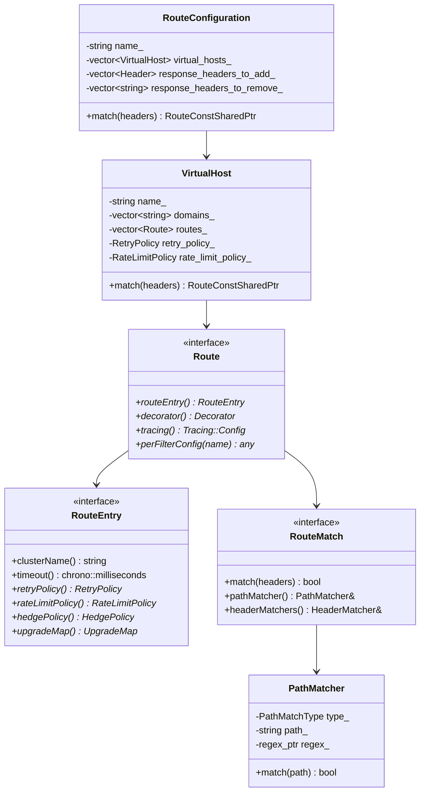
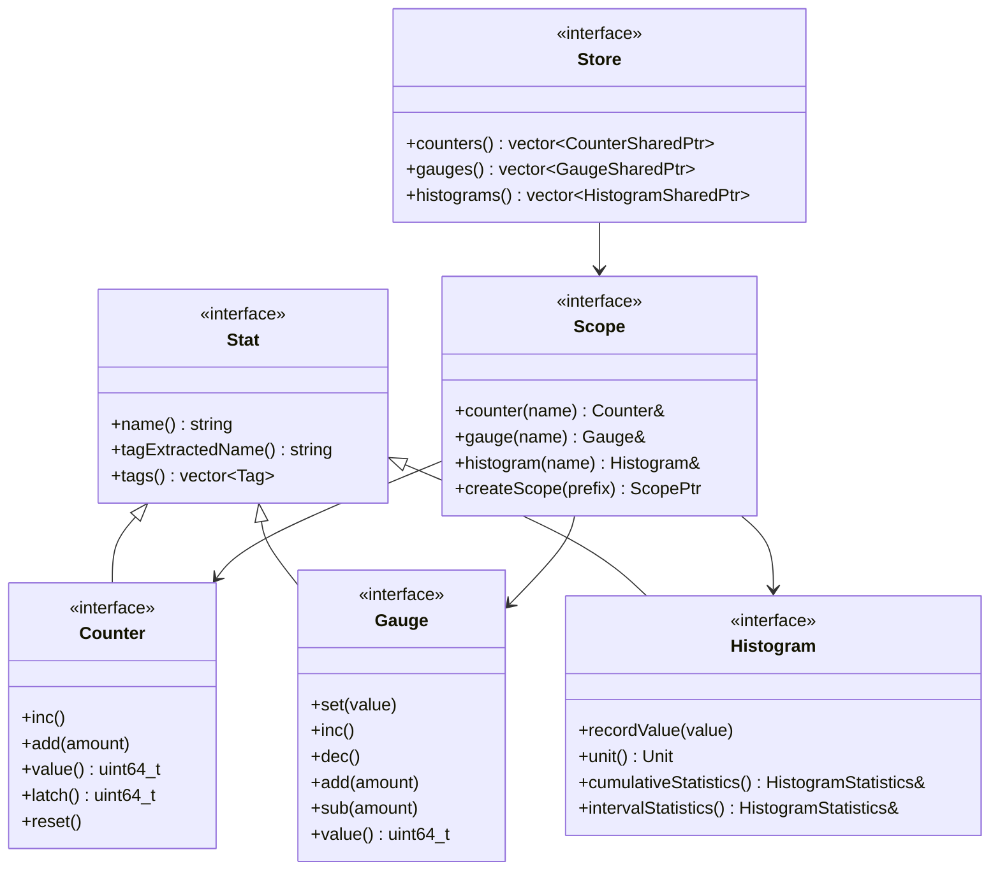

## 数据结构概览

Envoy中有许多关键的数据结构，它们构成了代理服务器的核心骨架。本文档深入分析这些数据结构的设计、关系和用途。

## 网络层数据结构

### 连接相关数据结构



### 地址和套接字结构

```cpp
/**
 * Address::Instance 地址抽象接口的实现分析
 */
class AddressStructure {
public:
  /**
   * IPv4地址实现
   */
  class Ipv4Instance : public IpInstance {
  public:
    Ipv4Instance(const sockaddr_in& address);
    Ipv4Instance(const std::string& address, uint32_t port = 0);
    
    // IpInstance 接口实现
    const std::string& addressAsString() const override { return friendly_address_; }
    bool isAnyAddress() const override;
    bool isUnicastAddress() const override;
    uint32_t port() const override { return ntohs(address_.sin_port); }
    IpVersion version() const override { return IpVersion::v4; }
    
    // Ipv4Instance 特有方法
    uint32_t address() const { return ntohl(address_.sin_addr.s_addr); }
    const sockaddr_in& sockAddr() const { return address_; }

  private:
    sockaddr_in address_;          // 原始套接字地址
    std::string friendly_address_; // 人类可读地址字符串
  };

  /**
   * IPv6地址实现
   */
  class Ipv6Instance : public IpInstance {
  public:
    Ipv6Instance(const sockaddr_in6& address);
    Ipv6Instance(const std::string& address, uint32_t port = 0);
    
    // IpInstance 接口实现
    const std::string& addressAsString() const override { return friendly_address_; }
    bool isAnyAddress() const override;
    bool isUnicastAddress() const override;
    uint32_t port() const override { return ntohs(address_.sin6_port); }
    IpVersion version() const override { return IpVersion::v6; }
    
    // Ipv6Instance 特有方法
    absl::uint128 address() const;
    const sockaddr_in6& sockAddr() const { return address_; }

  private:
    sockaddr_in6 address_;         // 原始套接字地址
    std::string friendly_address_; // 人类可读地址字符串
  };

  /**
   * Unix域套接字实现
   */
  class PipeInstance : public Instance {
  public:
    explicit PipeInstance(const sockaddr_un& address);
    explicit PipeInstance(const std::string& pipe_path);
    
    // Instance 接口实现
    bool operator==(const Instance& rhs) const override;
    const std::string& asString() const override { return friendly_name_; }
    Type type() const override { return Type::Pipe; }
    
    // PipeInstance 特有方法
    mode_t mode() const { return mode_; }
    const sockaddr_un& sockAddr() const { return address_; }

  private:
    sockaddr_un address_;     // Unix域套接字地址
    std::string friendly_name_; // 友好名称
    mode_t mode_{0};         // 文件权限模式
  };
};
```

## HTTP层数据结构

### HTTP头部映射结构



### HTTP头部实现分析

```cpp
/**
 * HeaderMapImpl HTTP头部映射的核心实现
 * 使用优化的数据结构存储和访问HTTP头部
 */
class HeaderMapImpl : public HeaderMap {
public:
  /**
   * 构造函数
   * @param max_headers_kb 最大头部KB数
   * @param max_headers_count 最大头部数量
   */
  HeaderMapImpl(uint32_t max_headers_kb = DEFAULT_MAX_HEADERS_KB,
                uint32_t max_headers_count = DEFAULT_MAX_HEADERS_COUNT);

  // HeaderMap 接口实现
  void addCopy(const LowerCaseString& key, absl::string_view value) override;
  void addReference(const LowerCaseString& key, absl::string_view value) override;
  void addReferenceKey(const LowerCaseString& key, uint64_t hash, 
                      absl::string_view value) override;
  void appendCopy(const LowerCaseString& key, absl::string_view value) override;
  void setReference(const LowerCaseString& key, absl::string_view value) override;
  void setReferenceKey(const LowerCaseString& key, absl::string_view value) override;

  HeaderMap::GetResult get(const LowerCaseString& key) const override;
  void iterate(ConstIterateCb cb) const override;
  void iterateReverse(ConstIterateCb cb) const override;
  Lookup lookup(const LowerCaseString& key, const HeaderEntry** entry) const override;

  void remove(const LowerCaseString& key) override;
  size_t removePrefix(const LowerCaseString& key) override;
  size_t size() const override { return headers_.size(); }
  bool empty() const override { return headers_.empty(); }
  uint64_t byteSize() const override;

private:
  /**
   * 头部条目实现
   */
  struct HeaderEntryImpl : public HeaderEntry, LinkedObject<HeaderEntryImpl> {
    HeaderEntryImpl(const LowerCaseString& key, HeaderMapImpl& parent);
    HeaderEntryImpl(const LowerCaseString& key, HeaderString&& value, 
                   HeaderMapImpl& parent);

    // HeaderEntry 接口实现
    const HeaderString& key() const override { return key_; }
    void value(absl::string_view value) override;
    void value(uint64_t value) override;
    void value(const HeaderString& value) override;
    const HeaderString& value() const override { return value_; }
    HeaderString& value() override { return value_; }
    void append(absl::string_view data, absl::string_view delimiter) override;

    HeaderString key_;        // 头部键
    HeaderString value_;      // 头部值  
    HeaderMapImpl& parent_;   // 父头部映射
  };

  using HeaderVector = std::vector<std::unique_ptr<HeaderEntryImpl>>;
  using StaticLookupTable = std::array<HeaderEntryImpl*, StaticHeaderIndex::size()>;

  /**
   * 内联头部优化
   * 对常用HTTP头部进行内联存储以提升性能
   */
  struct InlineHeaders {
    HeaderEntryImpl* method_{};           // HTTP方法
    HeaderEntryImpl* path_{};            // 请求路径
    HeaderEntryImpl* host_{};            // 主机头
    HeaderEntryImpl* scheme_{};          // 协议方案
    HeaderEntryImpl* status_{};          // 响应状态码
    HeaderEntryImpl* content_type_{};    // 内容类型
    HeaderEntryImpl* content_length_{};  // 内容长度
    HeaderEntryImpl* connection_{};      // 连接头
    HeaderEntryImpl* date_{};           // 日期头
    HeaderEntryImpl* server_{};         // 服务器头
  };

  /**
   * 查找头部条目
   * @param key 头部键
   * @return 头部条目指针，未找到返回nullptr
   */
  HeaderEntryImpl* getExisting(const LowerCaseString& key) const;

  /**
   * 插入新的头部条目
   * @param key 头部键
   * @param value 头部值
   * @return 插入的头部条目引用
   */
  HeaderEntryImpl& insertByKey(const LowerCaseString& key, HeaderString&& value);

  /**
   * 移除头部条目
   * @param entry 要移除的头部条目
   */
  void removeInlineEntry(HeaderEntryImpl* entry);

  /**
   * 更新字节大小缓存
   */
  void updateByteSize(uint64_t delta) const;

  HeaderVector headers_;                    // 头部条目向量
  InlineHeaders inline_headers_;           // 内联头部
  StaticLookupTable static_lookup_table_; // 静态查找表
  mutable uint64_t cached_byte_size_{};   // 缓存的字节大小
  const uint32_t max_headers_kb_;         // 最大头部KB数
  const uint32_t max_headers_count_;      // 最大头部数量
  StatefulHeaderKeyFormatterPtr formatter_; // 头部键格式化器
};
```

## 缓冲区数据结构

### Buffer系统架构



### 缓冲区实现分析

```cpp
/**
 * OwnedImpl 缓冲区的核心实现
 * 使用分片存储机制实现高效的内存管理
 */
class OwnedImpl : public Instance {
public:
  OwnedImpl() = default;
  explicit OwnedImpl(absl::string_view data);
  OwnedImpl(const Instance& data);
  OwnedImpl(const void* data, uint64_t size);

  // Instance 接口实现
  void add(const void* data, uint64_t size) override;
  void addBufferFragment(BufferFragment& fragment) override;
  void add(absl::string_view data) override;
  void add(const Instance& data) override;
  void prepend(absl::string_view data) override;
  void prepend(Instance& data) override;
  void commit(RawSlice* iovecs, uint64_t num_iovecs) override;
  void copyOut(size_t start, uint64_t size, void* data) const override;
  void drain(uint64_t size) override;
  uint64_t getRawSlices(RawSlice* out, uint64_t out_size) const override;
  uint64_t length() const override { return length_; }
  void* linearize(uint32_t size) override;
  void move(Instance& rhs) override;
  void move(Instance& rhs, uint64_t length) override;
  uint64_t reserve(uint64_t length, RawSlice* iovecs, uint64_t num_iovecs) override;
  ssize_t search(const void* data, uint64_t size, size_t start, size_t length) const override;
  bool startsWith(absl::string_view data) const override;
  std::string toString() const override;

private:
  /**
   * 缓冲区分片实现
   */
  struct Slice : public RawSlice {
    explicit Slice(uint64_t size);
    Slice(const void* data, uint64_t size);
    ~Slice();

    /**
     * 预留空间用于写入
     * @param size 要预留的大小
     * @return 实际预留的大小
     */
    uint64_t reservableSize() const;

    /**
     * 提交写入的数据
     * @param size 实际写入的大小  
     */
    void commit(uint64_t size);

    /**
     * 从分片前端排空数据
     * @param size 要排空的大小
     * @return 实际排空的大小
     */
    uint64_t drain(uint64_t size);

    uint8_t* base_;           // 分片基址
    uint64_t capacity_;       // 分片容量
    uint64_t reservable_size_; // 可预留大小
    bool can_coalesce_ = true; // 是否可以合并
  };

  using SlicePtr = std::unique_ptr<Slice>;

  /**
   * 添加分片到缓冲区末尾
   * @param slice 要添加的分片
   */
  void addSlice(SlicePtr&& slice);

  /**
   * 为读取预留空间
   * @param size 需要的空间大小
   * @return 原始分片数组
   */
  Reservation reserveForRead(uint64_t size);

  /**
   * 合并相邻的小分片
   */
  void coalesceIfNeeded();

  /**
   * 释放空的分片
   */
  void releaseEmptySlices();

  std::deque<SlicePtr> slices_;  // 分片双端队列
  uint64_t length_{};           // 总长度
  
  static constexpr uint64_t DefaultSliceSize = 16384; // 默认分片大小16KB
  static constexpr uint64_t MaxSlices = 1024;         // 最大分片数
};

/**
 * WatermarkBuffer 水位线缓冲区实现
 * 支持流量控制的缓冲区包装器
 */
class WatermarkBuffer : public Instance {
public:
  using OverflowCallback = std::function<void()>;
  using UnderflowCallback = std::function<void()>;

  WatermarkBuffer(uint32_t high_watermark, uint32_t low_watermark,
                  OverflowCallback overflow_callback,
                  UnderflowCallback underflow_callback)
      : buffer_(), high_watermark_(high_watermark), low_watermark_(low_watermark),
        overflow_callback_(std::move(overflow_callback)),
        underflow_callback_(std::move(underflow_callback)) {}

  // Instance 接口实现（委托给内部buffer_）
  void add(const void* data, uint64_t size) override {
    buffer_.add(data, size);
    checkHighWatermark();
  }

  void drain(uint64_t size) override {
    buffer_.drain(size);
    checkLowWatermark();
  }

  uint64_t length() const override { return buffer_.length(); }

private:
  /**
   * 检查高水位线
   */
  void checkHighWatermark() {
    if (!above_high_watermark_ && buffer_.length() >= high_watermark_) {
      above_high_watermark_ = true;
      if (overflow_callback_) {
        overflow_callback_();
      }
    }
  }

  /**
   * 检查低水位线  
   */
  void checkLowWatermark() {
    if (above_high_watermark_ && buffer_.length() <= low_watermark_) {
      above_high_watermark_ = false;
      if (underflow_callback_) {
        underflow_callback_();
      }
    }
  }

  OwnedImpl buffer_;                   // 底层缓冲区
  const uint32_t high_watermark_;     // 高水位线
  const uint32_t low_watermark_;      // 低水位线
  OverflowCallback overflow_callback_; // 溢出回调
  UnderflowCallback underflow_callback_; // 下溢回调
  bool above_high_watermark_{false};  // 是否超过高水位线
};
```

## 上游服务数据结构

### 集群和主机结构



### 负载均衡器结构

```cpp
/**
 * LoadBalancer 负载均衡器的数据结构分析
 */
class LoadBalancerStructures {
public:
  /**
   * 主机选择结果
   */
  struct HostSelectionResponse {
    HostConstSharedPtr host_;           // 选中的主机
    std::function<void()> host_selected_cb_; // 主机选择回调
  };

  /**
   * 轮询负载均衡器实现
   */
  class RoundRobinLoadBalancer : public LoadBalancerBase {
  public:
    RoundRobinLoadBalancer(const PrioritySet& priority_set,
                          const PrioritySet* local_priority_set,
                          ClusterStats& stats,
                          Runtime::Loader& runtime,
                          Random::RandomGenerator& random)
        : LoadBalancerBase(priority_set, local_priority_set, stats, runtime, random) {
      // 为每个优先级初始化轮询索引
      for (size_t i = 0; i < priority_set_.hostSetsPerPriority().size(); ++i) {
        rr_indexes_.emplace_back(0);
      }
    }

    // LoadBalancer 接口实现
    HostSelectionResponse chooseHost(LoadBalancerContext* context) override {
      const auto& host_set = chooseHostSet(context);
      if (host_set == nullptr) {
        return {nullptr, nullptr};
      }

      const auto& hosts = host_set->healthyHosts();
      if (hosts.empty()) {
        return {nullptr, nullptr};
      }

      // 原子地递增轮询索引
      const uint32_t index = rr_indexes_[host_set->priority()].fetch_add(1) % hosts.size();
      return {hosts[index], nullptr};
    }

  private:
    // 每个优先级一个原子轮询索引
    std::vector<std::atomic<uint32_t>> rr_indexes_;
  };

  /**
   * 一致性哈希负载均衡器
   */
  class ConsistentHashLoadBalancer : public LoadBalancerBase {
  public:
    ConsistentHashLoadBalancer(const PrioritySet& priority_set,
                             const PrioritySet* local_priority_set, 
                             ClusterStats& stats,
                             Runtime::Loader& runtime,
                             Random::RandomGenerator& random)
        : LoadBalancerBase(priority_set, local_priority_set, stats, runtime, random) {
      refreshHashRings();
    }

    HostSelectionResponse chooseHost(LoadBalancerContext* context) override {
      if (context == nullptr) {
        return {nullptr, nullptr};
      }

      const auto hash = context->computeHashKey();
      if (!hash.has_value()) {
        return {nullptr, nullptr};
      }

      const auto& host_set = chooseHostSet(context);
      if (host_set == nullptr || host_set->priority() >= hash_rings_.size()) {
        return {nullptr, nullptr};
      }

      return {hash_rings_[host_set->priority()]->chooseHost(hash.value()), nullptr};
    }

  private:
    /**
     * 哈希环实现
     */
    class HashRing {
    public:
      struct RingEntry {
        uint64_t hash_;           // 哈希值
        HostConstSharedPtr host_; // 对应主机
        
        bool operator<(const RingEntry& rhs) const {
          return hash_ < rhs.hash_;
        }
      };

      HashRing(const HostVector& hosts, uint32_t min_ring_size = 1024) {
        // 为每个主机创建多个虚拟节点
        const uint32_t num_hashes_per_host = std::max(1u, min_ring_size / hosts.size());
        
        ring_.reserve(hosts.size() * num_hashes_per_host);
        
        for (const auto& host : hosts) {
          for (uint32_t i = 0; i < num_hashes_per_host; ++i) {
            const std::string hash_key = fmt::format("{}:{}", host->address()->asString(), i);
            const uint64_t hash = HashUtil::xxHash64(hash_key);
            ring_.push_back({hash, host});
          }
        }
        
        // 排序哈希环
        std::sort(ring_.begin(), ring_.end());
      }

      HostConstSharedPtr chooseHost(uint64_t hash) const {
        if (ring_.empty()) {
          return nullptr;
        }

        // 使用二分查找找到第一个不小于hash的条目
        auto it = std::lower_bound(ring_.begin(), ring_.end(), RingEntry{hash, nullptr});
        
        // 如果找不到，则回绕到第一个条目
        if (it == ring_.end()) {
          it = ring_.begin();
        }
        
        return it->host_;
      }

    private:
      std::vector<RingEntry> ring_;  // 哈希环
    };

    /**
     * 刷新所有优先级的哈希环
     */
    void refreshHashRings() {
      hash_rings_.clear();
      
      for (const auto& host_set : priority_set_.hostSetsPerPriority()) {
        const auto& hosts = host_set->healthyHosts();
        if (!hosts.empty()) {
          hash_rings_.push_back(std::make_shared<HashRing>(hosts));
        } else {
          hash_rings_.push_back(nullptr);
        }
      }
    }

    std::vector<std::shared_ptr<HashRing>> hash_rings_; // 每个优先级的哈希环
  };
};
```

## 路由数据结构

### 路由配置结构



### 路由匹配实现

```cpp
/**
 * RouteEntryImpl 路由条目的实现分析
 * 包含路由匹配逻辑和配置信息
 */
class RouteEntryImpl : public RouteEntry,
                       public Route,
                       public Decorator,
                       Logger::Loggable<Logger::Id::router> {
public:
  /**
   * 路径匹配器实现
   */
  class PathMatcherImpl {
  public:
    PathMatcherImpl(const envoy::config::route::v3::RouteMatch& match)
        : type_(getPathMatchType(match)) {
      
      switch (type_) {
      case PathMatchType::Exact:
        path_ = match.path();
        break;
      case PathMatchType::Prefix:
        path_ = match.prefix(); 
        break;
      case PathMatchType::Regex:
        regex_ = Regex::Utility::parseStdRegex(match.safe_regex());
        break;
      }
    }

    /**
     * 匹配路径
     * @param path 请求路径
     * @return 是否匹配
     */
    bool match(absl::string_view path) const {
      switch (type_) {
      case PathMatchType::Exact:
        return path == path_;
      case PathMatchType::Prefix:
        return absl::StartsWith(path, path_);
      case PathMatchType::Regex:
        return std::regex_match(path.begin(), path.end(), *regex_);
      }
      return false;
    }

  private:
    enum class PathMatchType { Exact, Prefix, Regex };
    
    PathMatchType getPathMatchType(const envoy::config::route::v3::RouteMatch& match) {
      if (!match.path().empty()) return PathMatchType::Exact;
      if (!match.prefix().empty()) return PathMatchType::Prefix;
      if (match.has_safe_regex()) return PathMatchType::Regex;
      throw EnvoyException("Invalid route match configuration");
    }

    PathMatchType type_;        // 匹配类型
    std::string path_;         // 路径字符串（exact/prefix模式使用）
    std::shared_ptr<std::regex> regex_; // 正则表达式（regex模式使用）
  };

  /**
   * 头部匹配器实现
   */
  class HeaderMatcherImpl {
  public:
    HeaderMatcherImpl(const std::vector<envoy::config::route::v3::HeaderMatcher>& headers) {
      for (const auto& header_match : headers) {
        matchers_.emplace_back(header_match);
      }
    }

    /**
     * 匹配头部
     * @param headers 请求头部
     * @return 是否匹配
     */
    bool match(const Http::RequestHeaderMap& headers) const {
      for (const auto& matcher : matchers_) {
        if (!matcher.match(headers)) {
          return false;
        }
      }
      return true;
    }

  private:
    /**
     * 单个头部匹配器
     */
    struct SingleHeaderMatcher {
      explicit SingleHeaderMatcher(const envoy::config::route::v3::HeaderMatcher& config)
          : name_(config.name()), invert_(config.invert_match()) {
        
        switch (config.header_match_specifier_case()) {
        case envoy::config::route::v3::HeaderMatcher::kExactMatch:
          type_ = MatchType::Exact;
          value_ = config.exact_match();
          break;
        case envoy::config::route::v3::HeaderMatcher::kPrefixMatch:
          type_ = MatchType::Prefix;
          value_ = config.prefix_match();
          break;
        case envoy::config::route::v3::HeaderMatcher::kSuffixMatch:
          type_ = MatchType::Suffix;
          value_ = config.suffix_match();
          break;
        case envoy::config::route::v3::HeaderMatcher::kSafeRegexMatch:
          type_ = MatchType::Regex;
          regex_ = Regex::Utility::parseStdRegex(config.safe_regex_match());
          break;
        case envoy::config::route::v3::HeaderMatcher::kPresentMatch:
          type_ = MatchType::Present;
          break;
        default:
          throw EnvoyException("Invalid header matcher configuration");
        }
      }

      bool match(const Http::RequestHeaderMap& headers) const {
        const auto header = headers.get(Http::LowerCaseString(name_));
        bool matched = false;

        if (type_ == MatchType::Present) {
          matched = !header.empty();
        } else if (!header.empty()) {
          const absl::string_view header_value = header[0]->value().getStringView();
          
          switch (type_) {
          case MatchType::Exact:
            matched = header_value == value_;
            break;
          case MatchType::Prefix:
            matched = absl::StartsWith(header_value, value_);
            break;
          case MatchType::Suffix:
            matched = absl::EndsWith(header_value, value_);
            break;
          case MatchType::Regex:
            matched = std::regex_match(header_value.begin(), header_value.end(), *regex_);
            break;
          case MatchType::Present:
            // Already handled above
            break;
          }
        }

        return invert_ ? !matched : matched;
      }

      enum class MatchType { Exact, Prefix, Suffix, Regex, Present };
      
      std::string name_;                    // 头部名称
      MatchType type_;                     // 匹配类型
      std::string value_;                  // 匹配值
      std::shared_ptr<std::regex> regex_;  // 正则表达式
      bool invert_;                       // 是否反转匹配结果
    };

    std::vector<SingleHeaderMatcher> matchers_; // 头部匹配器列表
  };

  RouteEntryImpl(const envoy::config::route::v3::Route& route,
                 const VirtualHostImpl& vhost,
                 Runtime::Loader& loader)
      : vhost_(vhost), loader_(loader),
        path_matcher_(route.match()),
        header_matcher_(std::vector<envoy::config::route::v3::HeaderMatcher>(
            route.match().headers().begin(), route.match().headers().end())) {
    
    // 初始化路由动作
    if (route.has_route()) {
      cluster_name_ = route.route().cluster();
      timeout_ = std::chrono::milliseconds(
          PROTOBUF_GET_MS_OR_DEFAULT(route.route(), timeout, 15000));
    }
  }

  // Route 接口实现
  RouteEntry* routeEntry() override { return this; }
  Decorator* decorator() override { return this; }

  // RouteEntry 接口实现
  const std::string& clusterName() const override { return cluster_name_; }
  std::chrono::milliseconds timeout() const override { return timeout_; }

  // 匹配逻辑
  bool matches(const Http::RequestHeaderMap& headers) const {
    const auto path = headers.getPathValue();
    return path_matcher_.match(path) && header_matcher_.match(headers);
  }

private:
  const VirtualHostImpl& vhost_;         // 所属虚拟主机
  Runtime::Loader& loader_;             // 运行时加载器
  PathMatcherImpl path_matcher_;        // 路径匹配器
  HeaderMatcherImpl header_matcher_;    // 头部匹配器
  std::string cluster_name_;           // 目标集群名称
  std::chrono::milliseconds timeout_; // 超时时间
};
```

## 统计数据结构

### 统计系统架构



### 统计实现分析

```cpp
/**
 * ThreadLocalStoreImpl 线程本地统计存储实现
 * 提供高性能的统计数据收集和管理
 */
class ThreadLocalStoreImpl : public StoreRoot {
public:
  /**
   * 统计标签实现
   */
  struct TagImpl : public Tag {
    TagImpl(absl::string_view name, absl::string_view value)
        : name_(name), value_(value) {}

    // Tag 接口实现
    const std::string& name() const override { return name_; }
    const std::string& value() const override { return value_; }

    std::string name_;   // 标签名
    std::string value_;  // 标签值
  };

  /**
   * 计数器实现
   */
  class CounterImpl : public Counter {
  public:
    CounterImpl(StatName name, SymbolTable& symbol_table)
        : name_(name), symbol_table_(symbol_table) {}

    // Counter 接口实现
    void add(uint64_t amount) override {
      value_.fetch_add(amount, std::memory_order_relaxed);
      pending_increment_.fetch_add(amount, std::memory_order_relaxed);
    }

    void inc() override { add(1); }

    uint64_t latch() override {
      return pending_increment_.exchange(0, std::memory_order_relaxed);
    }

    void reset() override {
      value_.store(0, std::memory_order_relaxed);
      pending_increment_.store(0, std::memory_order_relaxed);
    }

    uint64_t value() const override {
      return value_.load(std::memory_order_relaxed);
    }

    // Stat 接口实现
    const std::string& name() const override {
      return symbol_table_.toString(name_);
    }

    StatName statName() const override { return name_; }

  private:
    StatName name_;                        // 统计名称
    SymbolTable& symbol_table_;           // 符号表引用
    std::atomic<uint64_t> value_{0};      // 当前值
    std::atomic<uint64_t> pending_increment_{0}; // 待刷新增量
  };

  /**
   * 测量值实现
   */
  class GaugeImpl : public Gauge {
  public:
    GaugeImpl(StatName name, SymbolTable& symbol_table, ImportMode import_mode)
        : name_(name), symbol_table_(symbol_table), import_mode_(import_mode) {}

    // Gauge 接口实现
    void set(uint64_t value) override {
      value_.store(value, std::memory_order_relaxed);
    }

    void add(uint64_t amount) override {
      value_.fetch_add(amount, std::memory_order_relaxed);
    }

    void sub(uint64_t amount) override {
      value_.fetch_sub(amount, std::memory_order_relaxed);
    }

    void inc() override { add(1); }
    void dec() override { sub(1); }

    uint64_t value() const override {
      return value_.load(std::memory_order_relaxed);
    }

    ImportMode importMode() const override { return import_mode_; }

  private:
    StatName name_;                    // 统计名称
    SymbolTable& symbol_table_;       // 符号表引用
    std::atomic<uint64_t> value_{0};  // 当前值
    ImportMode import_mode_;          // 导入模式
  };

  /**
   * 直方图实现  
   */
  class HistogramImpl : public Histogram {
  public:
    HistogramImpl(StatName name, SymbolTable& symbol_table, Unit unit)
        : name_(name), symbol_table_(symbol_table), unit_(unit) {}

    // Histogram 接口实现
    void recordValue(uint64_t value) override {
      std::lock_guard<std::mutex> lock(mutex_);
      
      // 更新累积统计
      cumulative_statistics_.sample_count_++;
      cumulative_statistics_.sample_sum_ += value;
      
      if (value < cumulative_statistics_.min_value_) {
        cumulative_statistics_.min_value_ = value;
      }
      if (value > cumulative_statistics_.max_value_) {
        cumulative_statistics_.max_value_ = value;
      }
      
      // 添加到直方图桶
      for (size_t i = 0; i < bucket_boundaries_.size(); ++i) {
        if (value <= bucket_boundaries_[i]) {
          cumulative_statistics_.bucket_counts_[i]++;
          break;
        }
      }
    }

    Unit unit() const override { return unit_; }

    const HistogramStatistics& cumulativeStatistics() const override {
      std::lock_guard<std::mutex> lock(mutex_);
      return cumulative_statistics_;
    }

  private:
    StatName name_;                           // 统计名称
    SymbolTable& symbol_table_;              // 符号表引用
    Unit unit_;                              // 测量单位
    mutable std::mutex mutex_;               // 保护统计数据的互斥锁
    HistogramStatistics cumulative_statistics_; // 累积统计
    std::vector<uint64_t> bucket_boundaries_; // 桶边界
  };

public:
  ThreadLocalStoreImpl(Stats::Allocator& alloc)
      : main_thread_allocator_(alloc), heap_allocator_(symbol_table_) {}

  // StoreRoot 接口实现
  Counter& counter(StatName name) override;
  Gauge& gauge(StatName name, ImportMode import_mode) override;  
  Histogram& histogram(StatName name, Unit unit) override;
  ScopePtr createScope(const std::string& name) override;
  
  std::vector<CounterSharedPtr> counters() const override;
  std::vector<GaugeSharedPtr> gauges() const override;
  std::vector<HistogramSharedPtr> histograms() const override;

private:
  Stats::Allocator& main_thread_allocator_;  // 主线程分配器
  HeapStatDataAllocator heap_allocator_;     // 堆分配器
  SymbolTableImpl symbol_table_;            // 符号表
  
  mutable Thread::MutexBasicLockable lock_; // 保护容器的互斥锁
  std::unordered_map<StatName, CounterSharedPtr> counters_; // 计数器映射
  std::unordered_map<StatName, GaugeSharedPtr> gauges_;     // 测量值映射
  std::unordered_map<StatName, HistogramSharedPtr> histograms_; // 直方图映射
};
```

## 总结

Envoy的数据结构设计体现了以下特点：

1. **性能导向**: 使用原子操作、缓存友好的数据布局、零拷贝设计
2. **内存效率**: 智能指针管理、对象池、分片存储机制
3. **线程安全**: 原子操作、线程本地存储、无锁数据结构
4. **可扩展性**: 插件化接口、工厂模式、配置驱动
5. **可观测性**: 丰富的统计指标、调试接口、性能监控

理解这些数据结构的设计和实现，是深入掌握Envoy源码和进行性能优化的基础。
