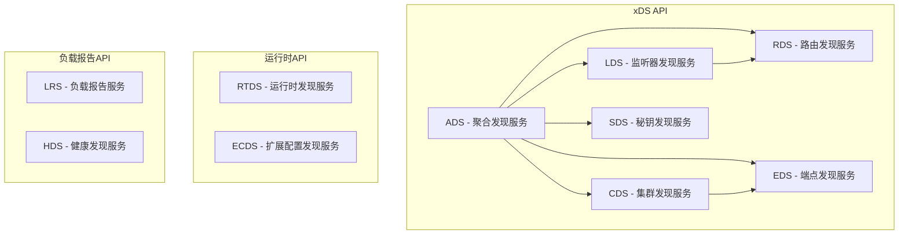
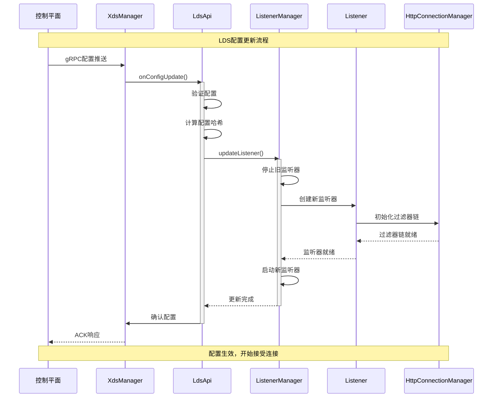
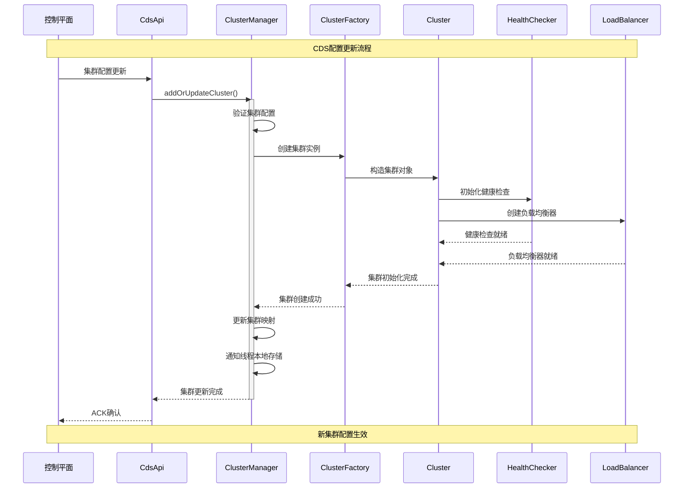
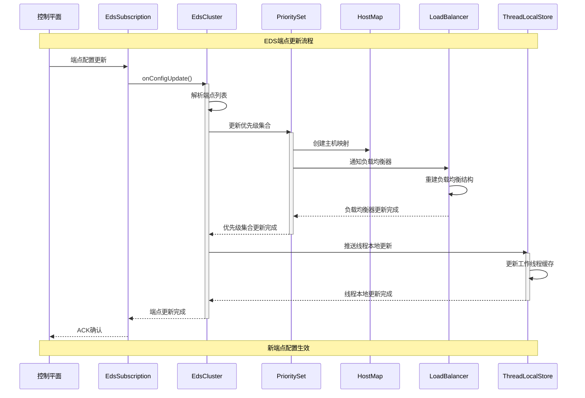
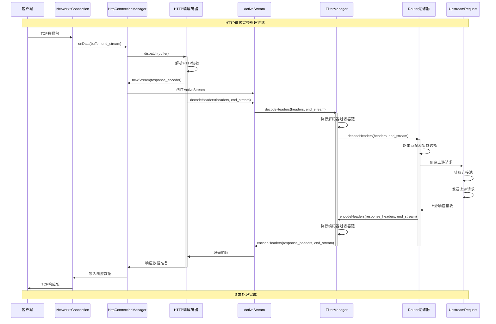

## API概览

Envoy提供了丰富的API接口，包括配置API、管理API、数据平面API等。本文档深入分析这些API的设计、实现和调用链路。

## 主要API类型

### 1. 数据平面API (Data Plane API)



### 2. 管理API (Admin API)

Envoy的管理API通过HTTP接口提供运行时信息和控制功能：

```cpp
/**
 * AdminImpl 管理接口实现
 * 提供Envoy运行时的管理和监控功能
 */
class AdminImpl : public Admin,
                  public Network::FilterChainManager,
                  Logger::Loggable<Logger::Id::admin> {
public:
  AdminImpl(const std::string& profile_path,
           Server::Instance& server,
           bool ignore_global_conn_limit);

  // Admin 接口实现
  bool addHandler(const std::string& prefix, const std::string& help_text,
                 HandlerCb callback, bool removable, bool mutates_server_state) override;
  bool removeHandler(const std::string& prefix) override;
  const Network::Socket& socket() override { return *socket_; }
  Network::Socket& mutableSocket() override { return *socket_; }

private:
  /**
   * 核心管理端点实现
   */
  
  /**
   * /stats 端点 - 获取统计信息
   * @param path_and_query 请求路径和查询参数
   * @param response_headers 响应头
   * @return HTTP响应内容
   */
  Http::Code handlerStats(absl::string_view path_and_query,
                         Http::ResponseHeaderMap& response_headers,
                         Buffer::Instance& response, AdminStream&) {
    const Http::Utility::QueryParams query_params =
        Http::Utility::parseAndDecodeQueryString(path_and_query);
    
    const bool used_only = query_params.find("usedonly") != query_params.end();
    const auto filter_it = query_params.find("filter");
    const bool as_json = query_params.find("format") != query_params.end() &&
                        query_params.at("format") == "json";

    std::string filter_string = "";
    if (filter_it != query_params.end()) {
      filter_string = filter_it->second;
    }

    if (as_json) {
      response_headers.setReferenceContentType(Http::Headers::get().ContentTypeValues.Json);
      return handlerStatsAsJson(filter_string, used_only, response);
    } else {
      response_headers.setReferenceContentType(Http::Headers::get().ContentTypeValues.Text);
      return handlerStatsAsText(filter_string, used_only, response);
    }
  }

  /**
   * /clusters 端点 - 获取集群信息
   */
  Http::Code handlerClusters(absl::string_view path_and_query,
                           Http::ResponseHeaderMap& response_headers,
                           Buffer::Instance& response, AdminStream&) {
    const Http::Utility::QueryParams query_params =
        Http::Utility::parseAndDecodeQueryString(path_and_query);

    const auto format_it = query_params.find("format");
    if (format_it != query_params.end() && format_it->second == "json") {
      response_headers.setReferenceContentType(Http::Headers::get().ContentTypeValues.Json);
      return handlerClustersAsJson(response);
    } else {
      response_headers.setReferenceContentType(Http::Headers::get().ContentTypeValues.Html);
      return handlerClustersAsHtml(response);
    }
  }

  /**
   * /server_info 端点 - 获取服务器信息
   */
  Http::Code handlerServerInfo(absl::string_view,
                              Http::ResponseHeaderMap& response_headers,
                              Buffer::Instance& response, AdminStream&) {
    time_t current_time = server_.timeSource().systemTime().time_since_epoch().count();
    
    envoy::admin::v3::ServerInfo server_info;
    server_info.set_version(VersionInfo::version());
    server_info.set_state(server_.lifecycleNotifier().currentState());
    server_info.mutable_uptime_current_epoch()->set_seconds(
        current_time - server_.startTimeCurrentEpoch());
    server_info.mutable_uptime_all_epochs()->set_seconds(
        current_time - server_.startTimeFirstEpoch());
    server_info.set_hot_restart_epoch(server_.hotRestart().epoch());
    
    // 获取命令行参数
    const auto& options = server_.options();
    for (const auto& arg : options.toCommandLineOptions()) {
      envoy::admin::v3::CommandLineOptions::ImmutableArg* command_line_option =
          server_info.mutable_command_line_options()->add_immutable_args();
      command_line_option->set_args(arg);
    }

    response_headers.setReferenceContentType(Http::Headers::get().ContentTypeValues.Json);
    const auto message_json = MessageUtil::getJsonStringFromMessageOrError(
        server_info, true, true);
    response.add(message_json);
    return Http::Code::OK;
  }

  /**
   * /config_dump 端点 - 获取配置转储
   */
  Http::Code handlerConfigDump(absl::string_view path_and_query,
                              Http::ResponseHeaderMap& response_headers,
                              Buffer::Instance& response, AdminStream&) {
    const Http::Utility::QueryParams query_params =
        Http::Utility::parseAndDecodeQueryString(path_and_query);

    const auto resource_it = query_params.find("resource");
    const auto mask_it = query_params.find("mask");
    const auto name_regex_it = query_params.find("name_regex");

    Matchers::StringMatcherImpl<envoy::type::matcher::v3::StringMatcher> name_matcher;
    if (name_regex_it != query_params.end()) {
      envoy::type::matcher::v3::StringMatcher matcher;
      matcher.set_safe_regex(Regex::Utility::parseStdRegex(name_regex_it->second));
      name_matcher = Matchers::StringMatcherImpl<envoy::type::matcher::v3::StringMatcher>(matcher);
    }

    envoy::admin::v3::ConfigDump config_dump;
    
    // 获取启动配置
    auto* bootstrap_config_dump = config_dump.mutable_bootstrap();
    bootstrap_config_dump->mutable_bootstrap()->CopyFrom(server_.bootstrap());
    bootstrap_config_dump->mutable_last_updated()->CopyFrom(
        Protobuf::util::TimeUtil::SecondsToTimestamp(server_.startTimeCurrentEpoch()));

    // 获取监听器配置
    if (shouldIncludeResource(resource_it, "dynamic_listeners")) {
      addListenerConfigDump(config_dump, name_matcher);
    }

    // 获取集群配置
    if (shouldIncludeResource(resource_it, "dynamic_clusters")) {
      addClusterConfigDump(config_dump, name_matcher);
    }

    response_headers.setReferenceContentType(Http::Headers::get().ContentTypeValues.Json);
    const auto message_json = MessageUtil::getJsonStringFromMessageOrError(
        config_dump, true, true);
    response.add(message_json);
    return Http::Code::OK;
  }

  /**
   * /ready 端点 - 健康检查
   */
  Http::Code handlerReady(absl::string_view, Http::ResponseHeaderMap&,
                         Buffer::Instance& response, AdminStream&) {
    if (server_.initManager().state() == Init::Manager::State::Initialized) {
      response.add("LIVE\n");
      return Http::Code::OK;
    } else {
      response.add("PRE_INITIALIZING\n");
      return Http::Code::ServiceUnavailable;
    }
  }

  Server::Instance& server_;               // 服务器实例引用
  Network::SocketPtr socket_;              // 管理套接字
  std::list<HandlerPtr> handlers_;         // 处理器列表
  mutable Thread::MutexBasicLockable handlers_mutex_; // 处理器互斥锁
};
```

## 核心API调用链路分析

### 1. xDS配置更新链路

#### LDS (监听器发现服务) 调用链



#### 关键代码实现

```cpp
/**
 * LdsApiImpl LDS API实现
 * 处理监听器配置的动态更新
 */
class LdsApiImpl : public LdsApi,
                   Config::SubscriptionCallbacks,
                   Logger::Loggable<Logger::Id::upstream> {
public:
  /**
   * 构造函数
   * @param lds_config LDS配置
   * @param cluster_manager 集群管理器
   * @param init_manager 初始化管理器
   * @param scope 统计范围
   * @param listener_manager 监听器管理器
   * @param validation_visitor 验证访问器
   */
  LdsApiImpl(const envoy::config::core::v3::ConfigSource& lds_config,
            Upstream::ClusterManager& cluster_manager,
            Init::Manager& init_manager,
            Stats::Scope& scope,
            ListenerManager& listener_manager,
            ProtobufMessage::ValidationVisitor& validation_visitor);

  // LdsApi 接口实现
  std::string versionInfo() const override { return helper_.versionInfo(); }

  // Config::SubscriptionCallbacks 接口实现
  
  /**
   * 处理配置更新
   * @param resources 更新的资源列表
   * @param version_info 版本信息
   * @return 更新状态
   */
  absl::Status onConfigUpdate(const std::vector<Config::DecodedResourceRef>& resources,
                             const std::string& version_info) override {
    ENVOY_LOG(debug, "LDS配置更新，版本: {}", version_info);
    
    std::vector<std::string> listener_names;
    std::vector<ListenerManager::FailureStates> failure_states;
    
    // 处理每个监听器资源
    for (const auto& resource : resources) {
      const envoy::config::listener::v3::Listener& listener =
          dynamic_cast<const envoy::config::listener::v3::Listener&>(resource.get().resource());
      
      listener_names.push_back(listener.name());
      
      // 验证监听器配置
      try {
        MessageUtil::validate(listener, validation_visitor_);
        
        // 更新监听器
        if (!listener_manager_.addOrUpdateListener(listener, version_info, true)) {
          failure_states.push_back(ListenerManager::FailureStates::UnknownFailure);
        } else {
          failure_states.push_back(ListenerManager::FailureStates::Ok);
        }
      } catch (const EnvoyException& e) {
        ENVOY_LOG(warn, "LDS配置更新失败: {}", e.what());
        failure_states.push_back(ListenerManager::FailureStates::InvalidConfiguration);
      }
    }
    
    // 移除不再存在的监听器
    listener_manager_.removeListeners(listener_names);
    
    helper_.onConfigUpdate(resources, version_info);
    return absl::OkStatus();
  }

  /**
   * 处理配置更新失败
   * @param reason 失败原因
   * @param e 异常信息
   */
  void onConfigUpdateFailed(Envoy::Config::ConfigUpdateFailureReason reason,
                           const EnvoyException* e) override {
    ENVOY_LOG(warn, "LDS配置更新失败，原因: {}", static_cast<int>(reason));
    if (e) {
      ENVOY_LOG(warn, "错误详情: {}", e->what());
    }
    helper_.onConfigUpdateFailed(reason, e);
  }

private:
  Config::OpaqueResourceDecoderSharedPtr resource_decoder_;
  Upstream::ClusterManager& cluster_manager_;
  Config::SubscriptionPtr subscription_;
  ListenerManager& listener_manager_;
  ProtobufMessage::ValidationVisitor& validation_visitor_;
  Config::SubscriptionCallbacksWrapper helper_;
};
```

### 2. CDS (集群发现服务) 调用链



#### CDS实现代码

```cpp
/**
 * CdsApiImpl CDS API实现
 * 处理集群配置的动态发现和更新
 */
class CdsApiImpl : public CdsApi,
                   Config::SubscriptionCallbacks,
                   Logger::Loggable<Logger::Id::upstream> {
public:
  CdsApiImpl(const envoy::config::core::v3::ConfigSource& cds_config,
            const xds::core::v3::ResourceLocator* cds_resources_locator,
            ClusterManager& cm,
            Stats::Scope& scope,
            ProtobufMessage::ValidationVisitor& validation_visitor);

  // CdsApi 接口实现
  std::string versionInfo() const override { return helper_.versionInfo(); }

  // Config::SubscriptionCallbacks 接口实现
  absl::Status onConfigUpdate(const std::vector<Config::DecodedResourceRef>& resources,
                             const std::string& version_info) override {
    ENVOY_LOG(debug, "CDS配置更新，版本: {}, 集群数量: {}", 
              version_info, resources.size());

    std::vector<std::string> cluster_names;
    
    for (const auto& resource : resources) {
      const envoy::config::cluster::v3::Cluster& cluster =
          dynamic_cast<const envoy::config::cluster::v3::Cluster&>(resource.get().resource());
      
      cluster_names.push_back(cluster.name());
      
      try {
        // 验证集群配置
        MessageUtil::validate(cluster, validation_visitor_);
        
        // 添加或更新集群
        const auto add_result = cm_.addOrUpdateCluster(cluster, version_info);
        if (!add_result.ok()) {
          ENVOY_LOG(warn, "添加集群失败 {}: {}", cluster.name(), add_result.status().message());
          return add_result.status();
        }
        
        if (add_result.value()) {
          ENVOY_LOG(info, "集群 {} 已更新", cluster.name());
        } else {
          ENVOY_LOG(debug, "集群 {} 配置未变化", cluster.name());
        }
        
      } catch (const EnvoyException& e) {
        ENVOY_LOG(warn, "集群 {} 配置验证失败: {}", cluster.name(), e.what());
        return absl::InvalidArgumentError(
            fmt::format("集群配置无效: {}", e.what()));
      }
    }
    
    // 移除不再配置的集群
    const auto removed_clusters = cm_.removeOutOfScopeCluster(cluster_names);
    for (const auto& removed : removed_clusters) {
      ENVOY_LOG(info, "集群 {} 已移除", removed);
    }
    
    helper_.onConfigUpdate(resources, version_info);
    return absl::OkStatus();
  }

  void onConfigUpdateFailed(Envoy::Config::ConfigUpdateFailureReason reason,
                           const EnvoyException* e) override {
    ENVOY_LOG(warn, "CDS配置更新失败，原因: {}", static_cast<int>(reason));
    if (e) {
      ENVOY_LOG(warn, "错误详情: {}", e->what());
    }
    helper_.onConfigUpdateFailed(reason, e);
  }

private:
  ClusterManager& cm_;                      // 集群管理器引用
  Config::SubscriptionPtr subscription_;    // 配置订阅
  ProtobufMessage::ValidationVisitor& validation_visitor_; // 验证访问器
  Config::SubscriptionCallbacksWrapper helper_; // 回调包装器
};
```

### 3. EDS (端点发现服务) 调用链



#### EDS实现分析

```cpp
/**
 * EdsClusterImpl::LocalityEndpointsManager
 * 管理EDS集群的端点本地性分布
 */
class LocalityEndpointsManager {
public:
  /**
   * 更新端点配置
   * @param locality_lb_endpoints 本地性负载均衡端点列表
   * @param local_cluster_name 本地集群名称
   * @return 更新状态
   */
  absl::Status updateEndpoints(
      const ::google::protobuf::RepeatedPtrField<
          envoy::config::endpoint::v3::LocalityLbEndpoints>& locality_lb_endpoints,
      const std::string& local_cluster_name) {
    
    // 按优先级分组端点
    PriorityStateManager priority_state_manager;
    
    for (const auto& locality_lb_endpoint : locality_lb_endpoints) {
      const uint32_t priority = locality_lb_endpoint.priority();
      
      // 验证优先级范围
      if (priority >= Upstream::MaxHostPriority) {
        return absl::InvalidArgumentError(
            fmt::format("无效的优先级: {}", priority));
      }
      
      // 解析端点列表
      std::vector<HostSharedPtr> hosts;
      for (const auto& lb_endpoint : locality_lb_endpoint.lb_endpoints()) {
        const auto& endpoint = lb_endpoint.endpoint();
        
        // 创建地址实例
        Network::Address::InstanceConstSharedPtr address;
        try {
          address = Network::Utility::resolveUrl(
              fmt::format("tcp://{}:{}", 
                         endpoint.address().socket_address().address(),
                         endpoint.address().socket_address().port_value()));
        } catch (const EnvoyException& e) {
          ENVOY_LOG(warn, "解析端点地址失败: {}", e.what());
          continue;
        }
        
        // 创建主机实例
        auto host = std::make_shared<HostImpl>(
            cluster_info_, "", address, nullptr, 
            lb_endpoint.load_balancing_weight().value(),
            locality_lb_endpoint.locality(),
            lb_endpoint.health_status(),
            priority);
            
        hosts.push_back(std::move(host));
      }
      
      // 添加到优先级状态管理器
      priority_state_manager.initializePriorityFor(locality_lb_endpoint);
      priority_state_manager.registerHostForPriority(
          "", hosts, locality_lb_endpoint.locality(), priority);
    }
    
    // 更新优先级集合
    priority_set_.updateHosts(
        priority_state_manager.priorityState(),
        priority_state_manager.localityWeights(),
        priority_state_manager.hostsAdded(),
        priority_state_manager.hostsRemoved(),
        absl::nullopt);
    
    return absl::OkStatus();
  }

private:
  /**
   * 优先级状态管理器
   * 管理不同优先级的主机分布
   */
  class PriorityStateManager {
  public:
    struct PriorityState {
      std::vector<HostSharedPtr> hosts_;               // 主机列表
      LocalityWeightsConstSharedPtr locality_weights_; // 本地性权重
    };

    void initializePriorityFor(const envoy::config::endpoint::v3::LocalityLbEndpoints& locality_lb_endpoint) {
      const uint32_t priority = locality_lb_endpoint.priority();
      if (priority_state_.find(priority) == priority_state_.end()) {
        priority_state_[priority] = PriorityState();
      }
    }

    void registerHostForPriority(const std::string& hostname,
                                const std::vector<HostSharedPtr>& hosts,
                                const envoy::config::core::v3::Locality& locality,
                                uint32_t priority) {
      auto& state = priority_state_[priority];
      state.hosts_.insert(state.hosts_.end(), hosts.begin(), hosts.end());
      
      // 更新本地性权重
      // ... 权重计算逻辑 ...
    }

    const std::map<uint32_t, PriorityState>& priorityState() const {
      return priority_state_;
    }

  private:
    std::map<uint32_t, PriorityState> priority_state_; // 优先级状态映射
  };

  ClusterInfoConstSharedPtr cluster_info_;  // 集群信息
  PrioritySetImpl priority_set_;           // 优先级集合
  LocalityEndpointsManager locality_endpoints_manager_; // 本地性端点管理器
};
```

## HTTP请求处理API链路

### HTTP编解码API调用链



### HTTP过滤器API实现

```cpp
/**
 * RouterFilter::decodeHeaders 路由过滤器头部处理实现
 * 这是HTTP请求处理的关键入口点
 */
FilterHeadersStatus Filter::decodeHeaders(RequestHeaderMap& headers, bool end_stream) {
  ENVOY_STREAM_LOG(debug, "路由过滤器处理请求头，end_stream: {}", *callbacks_, end_stream);
  
  // 1. 记录请求开始时间
  request_start_time_ = callbacks_->dispatcher().timeSource().monotonicTime();
  
  // 2. 获取路由配置
  route_ = callbacks_->route();
  if (!route_) {
    ENVOY_STREAM_LOG(debug, "未找到路由配置", *callbacks_);
    callbacks_->sendLocalReply(Http::Code::NotFound, "404 Not Found\r\n", nullptr, 
                              absl::nullopt, "route_not_found");
    return FilterHeadersStatus::StopIteration;
  }

  // 3. 获取路由条目
  route_entry_ = route_->routeEntry();
  if (!route_entry_) {
    ENVOY_STREAM_LOG(debug, "路由条目为空", *callbacks_);
    callbacks_->sendLocalReply(Http::Code::NotFound, "404 Not Found\r\n", nullptr,
                              absl::nullopt, "route_entry_not_found");
    return FilterHeadersStatus::StopIteration;
  }

  // 4. 获取目标集群
  const std::string& cluster_name = route_entry_->clusterName();
  cluster_ = callbacks_->clusterInfo();
  if (!cluster_) {
    ENVOY_STREAM_LOG(debug, "集群 {} 不存在", *callbacks_, cluster_name);
    callbacks_->sendLocalReply(Http::Code::ServiceUnavailable, 
                              "503 Service Unavailable\r\n", nullptr,
                              absl::nullopt, "cluster_not_found");
    return FilterHeadersStatus::StopIteration;
  }

  // 5. 检查集群健康状态
  if (cluster_->maintenanceMode()) {
    ENVOY_STREAM_LOG(debug, "集群 {} 处于维护模式", *callbacks_, cluster_name);
    callbacks_->sendLocalReply(Http::Code::ServiceUnavailable,
                              "503 Service Unavailable\r\n", nullptr,
                              absl::nullopt, "cluster_in_maintenance");
    return FilterHeadersStatus::StopIteration;
  }

  // 6. 处理请求头部转换
  transformRequestHeaders(headers);

  // 7. 检查是否为影子请求
  if (route_entry_->shadowPolicies().empty()) {
    do_shadowing_ = false;
  } else {
    do_shadowing_ = shouldShadow(headers);
  }

  // 8. 启动上游请求
  if (end_stream) {
    onRequestComplete();
  }
  
  startUpstreamRequest();
  
  return FilterHeadersStatus::StopIteration;
}

/**
 * 启动上游请求的实现
 */
void Filter::startUpstreamRequest() {
  ENVOY_STREAM_LOG(debug, "启动上游请求到集群: {}", *callbacks_, 
                   route_entry_->clusterName());

  // 1. 获取连接池
  auto pool = callbacks_->clusterInfo()->connPoolForDownstreamProtocol(
      callbacks_->streamInfo().downstreamProtocol());
  
  if (!pool) {
    ENVOY_STREAM_LOG(debug, "无法获取连接池", *callbacks_);
    callbacks_->sendLocalReply(Http::Code::ServiceUnavailable,
                              "503 Service Unavailable\r\n", nullptr,
                              absl::nullopt, "no_connection_pool");
    return;
  }

  // 2. 创建上游请求对象
  upstream_request_ = std::make_unique<UpstreamRequest>(*this, *pool);
  
  // 3. 设置超时
  if (route_entry_->timeout() != std::chrono::milliseconds(0)) {
    timeout_timer_ = callbacks_->dispatcher().createTimer([this]() -> void {
      onUpstreamTimeout();
    });
    timeout_timer_->enableTimer(route_entry_->timeout());
  }

  // 4. 获取连接并发送请求
  upstream_request_->startStream();
}

/**
 * UpstreamRequest::startStream 上游请求流启动实现
 */
void UpstreamRequest::startStream() {
  ENVOY_STREAM_LOG(debug, "启动上游流", parent_.callbacks_);

  // 1. 从连接池获取连接
  conn_pool_handle_ = conn_pool_.newStream(*this, *this);
  
  if (!conn_pool_handle_) {
    ENVOY_STREAM_LOG(debug, "无法创建上游流", parent_.callbacks_);
    parent_.onUpstreamFailure(ConnectionPool::PoolFailureReason::Overflow,
                             "", nullptr);
    return;
  }

  // 2. 记录统计信息
  parent_.cluster_->stats().upstream_rq_total_.inc();
  parent_.cluster_->stats().upstream_rq_active_.inc();
  
  // 3. 设置流状态
  upstream_canary_ = upstream_host_->canary();
  
  ENVOY_STREAM_LOG(debug, "上游请求已启动，主机: {}", 
                   parent_.callbacks_, upstream_host_->address()->asString());
}

// ConnectionPool::Callbacks 接口实现

/**
 * 连接池准备就绪回调
 */
void UpstreamRequest::onPoolReady(RequestEncoder& request_encoder,
                                 HostDescriptionConstSharedPtr host,
                                 StreamInfo::StreamInfo& info,
                                 absl::optional<Http::Protocol> protocol) {
  ENVOY_STREAM_LOG(debug, "连接池就绪，主机: {}", parent_.callbacks_, 
                   host->address()->asString());

  // 1. 保存上游编码器和主机信息
  request_encoder_ = &request_encoder;
  upstream_host_ = host;
  
  // 2. 设置流回调
  request_encoder_->getStream().addCallbacks(*this);
  
  // 3. 发送请求头
  if (parent_.downstream_headers_) {
    const bool end_stream = parent_.downstream_end_stream_ && 
                           !parent_.buffered_request_body_;
                           
    request_encoder_->encodeHeaders(*parent_.downstream_headers_, end_stream);
    
    // 4. 发送请求体（如果有）
    if (parent_.buffered_request_body_) {
      request_encoder_->encodeData(*parent_.buffered_request_body_, 
                                  parent_.downstream_end_stream_);
    }
    
    // 5. 发送请求尾部（如果有）
    if (parent_.downstream_trailers_) {
      request_encoder_->encodeTrailers(*parent_.downstream_trailers_);
    }
  }
  
  // 6. 更新流信息
  parent_.callbacks_->streamInfo().setUpstreamProtocol(protocol);
  parent_.callbacks_->streamInfo().onUpstreamHostSelected(host);
  
  ENVOY_STREAM_LOG(debug, "上游请求发送完成", parent_.callbacks_);
}

/**
 * 连接池失败回调
 */
void UpstreamRequest::onPoolFailure(ConnectionPool::PoolFailureReason reason,
                                   absl::string_view transport_failure_reason,
                                   HostDescriptionConstSharedPtr host) {
  ENVOY_STREAM_LOG(debug, "连接池失败，原因: {}, 主机: {}", 
                   parent_.callbacks_, static_cast<int>(reason),
                   host ? host->address()->asString() : "unknown");

  // 记录失败统计
  parent_.cluster_->stats().upstream_rq_pending_failure_eject_.inc();
  
  // 根据失败原因设置响应标志
  StreamInfo::CoreResponseFlag response_flag;
  Http::Code response_code;
  
  switch (reason) {
  case ConnectionPool::PoolFailureReason::Overflow:
    response_flag = StreamInfo::CoreResponseFlag::UpstreamOverflow;
    response_code = Http::Code::ServiceUnavailable;
    break;
  case ConnectionPool::PoolFailureReason::LocalConnectionFailure:
    response_flag = StreamInfo::CoreResponseFlag::UpstreamConnectionFailure;
    response_code = Http::Code::ServiceUnavailable;
    break;
  case ConnectionPool::PoolFailureReason::RemoteConnectionFailure:
    response_flag = StreamInfo::CoreResponseFlag::UpstreamConnectionFailure;
    response_code = Http::Code::ServiceUnavailable;
    break;
  case ConnectionPool::PoolFailureReason::Timeout:
    response_flag = StreamInfo::CoreResponseFlag::UpstreamConnectionTimeout;
    response_code = Http::Code::ServiceUnavailable;
    break;
  }
  
  // 设置响应标志并发送错误响应
  parent_.callbacks_->streamInfo().setResponseFlag(response_flag);
  parent_.callbacks_->sendLocalReply(response_code, "Service Unavailable\r\n", 
                                    nullptr, absl::nullopt, 
                                    "upstream_connection_failure");
}
```

## 管理API详细分析

### Admin接口端点映射

| 端点路径 | HTTP方法 | 功能描述 | 返回格式 | 实现函数 |
|---------|----------|----------|----------|----------|
| `/` | GET | 管理界面首页 | HTML | `handlerAdminHome()` |
| `/help` | GET | 帮助信息 | HTML | `handlerHelp()` |
| `/stats` | GET | 统计指标 | Text/JSON | `handlerStats()` |
| `/stats/prometheus` | GET | Prometheus格式统计 | Text | `handlerPrometheusStats()` |
| `/server_info` | GET | 服务器信息 | JSON | `handlerServerInfo()` |
| `/ready` | GET | 就绪状态检查 | Text | `handlerReady()` |
| `/config_dump` | GET | 配置转储 | JSON | `handlerConfigDump()` |
| `/clusters` | GET | 集群信息 | HTML/JSON | `handlerClusters()` |
| `/listeners` | GET | 监听器信息 | HTML/JSON | `handlerListeners()` |
| `/runtime` | GET | 运行时配置 | JSON | `handlerRuntime()` |
| `/runtime_modify` | POST | 修改运行时配置 | Text | `handlerRuntimeModify()` |
| `/logging` | POST | 修改日志级别 | Text | `handlerLogging()` |
| `/memory` | GET | 内存使用信息 | JSON | `handlerMemory()` |
| `/cpuprofiler` | POST | CPU性能分析 | Binary | `handlerCpuProfiler()` |
| `/heapprofiler` | POST | 堆内存分析 | Binary | `handlerHeapProfiler()` |
| `/hot_restart_version` | GET | 热重启版本 | Text | `handlerHotRestartVersion()` |
| `/reset_counters` | POST | 重置计数器 | Text | `handlerResetCounters()` |
| `/drain_listeners` | POST | 排空监听器 | Text | `handlerDrainListeners()` |

### 统计API实现

```cpp
/**
 * AdminImpl::handlerStats 统计接口实现
 * 提供详细的运行时统计信息
 */
Http::Code AdminImpl::handlerStats(absl::string_view path_and_query,
                                  Http::ResponseHeaderMap& response_headers,
                                  Buffer::Instance& response,
                                  AdminStream&) {
  // 解析查询参数
  const Http::Utility::QueryParams query_params =
      Http::Utility::parseAndDecodeQueryString(path_and_query);

  // 检查是否只显示使用过的统计
  const bool used_only = query_params.find("usedonly") != query_params.end();
  
  // 获取过滤器参数
  std::string filter_string = "";
  const auto filter_it = query_params.find("filter");
  if (filter_it != query_params.end()) {
    filter_string = filter_it->second;
  }

  // 检查输出格式
  const auto format_it = query_params.find("format");
  const bool as_json = format_it != query_params.end() && format_it->second == "json";

  if (as_json) {
    response_headers.setReferenceContentType(Http::Headers::get().ContentTypeValues.Json);
    return outputStatsAsJson(filter_string, used_only, response);
  } else {
    response_headers.setReferenceContentType(Http::Headers::get().ContentTypeValues.Text);
    return outputStatsAsText(filter_string, used_only, response);
  }
}

/**
 * 输出文本格式统计
 */
Http::Code AdminImpl::outputStatsAsText(const std::string& filter_string,
                                       bool used_only,
                                       Buffer::Instance& response) {
  Stats::Store& stats_store = server_.stats();
  
  // 编译过滤器正则表达式
  std::regex filter_regex;
  if (!filter_string.empty()) {
    try {
      filter_regex = std::regex(filter_string);
    } catch (const std::regex_error& e) {
      response.add(fmt::format("Invalid filter regex: {}\n", e.what()));
      return Http::Code::BadRequest;
    }
  }

  // 获取并排序统计项
  std::vector<Stats::CounterSharedPtr> counters = stats_store.counters();
  std::sort(counters.begin(), counters.end(),
           [](const Stats::CounterSharedPtr& a, const Stats::CounterSharedPtr& b) -> bool {
             return a->name() < b->name();
           });

  // 输出计数器
  for (const auto& counter : counters) {
    if (used_only && counter->latch() == 0) {
      continue;
    }
    
    if (!filter_string.empty() && 
        !std::regex_search(counter->name(), filter_regex)) {
      continue;
    }
    
    response.add(fmt::format("{}: {}\n", counter->name(), counter->value()));
  }

  // 输出测量值
  std::vector<Stats::GaugeSharedPtr> gauges = stats_store.gauges();
  std::sort(gauges.begin(), gauges.end(),
           [](const Stats::GaugeSharedPtr& a, const Stats::GaugeSharedPtr& b) -> bool {
             return a->name() < b->name();
           });

  for (const auto& gauge : gauges) {
    if (used_only && !gauge->used()) {
      continue;
    }
    
    if (!filter_string.empty() && 
        !std::regex_search(gauge->name(), filter_regex)) {
      continue;
    }
    
    response.add(fmt::format("{}: {}\n", gauge->name(), gauge->value()));
  }

  // 输出直方图
  std::vector<Stats::ParentHistogramSharedPtr> histograms = stats_store.histograms();
  std::sort(histograms.begin(), histograms.end(),
           [](const Stats::ParentHistogramSharedPtr& a, 
              const Stats::ParentHistogramSharedPtr& b) -> bool {
             return a->name() < b->name();
           });

  for (const auto& histogram : histograms) {
    if (used_only && !histogram->used()) {
      continue;
    }
    
    if (!filter_string.empty() && 
        !std::regex_search(histogram->name(), filter_regex)) {
      continue;
    }
    
    const Stats::HistogramStatistics& stats = histogram->cumulativeStatistics();
    response.add(fmt::format("{}: P0({}),P25({}),P50({}),P75({}),P90({}),P95({}),P99({}),P99.5({}),P99.9({}),P100({})\n",
                            histogram->name(),
                            stats.quantileValue(0.0),
                            stats.quantileValue(0.25), 
                            stats.quantileValue(0.5),
                            stats.quantileValue(0.75),
                            stats.quantileValue(0.9),
                            stats.quantileValue(0.95),
                            stats.quantileValue(0.99),
                            stats.quantileValue(0.995),
                            stats.quantileValue(0.999),
                            stats.quantileValue(1.0)));
  }

  return Http::Code::OK;
}
```

## API安全和认证

### Admin接口安全

```cpp
/**
 * AdminFilter 管理接口安全过滤器
 * 为管理接口提供认证和授权保护
 */
class AdminFilter : public Network::ReadFilter {
public:
  AdminFilter(const AdminFilterConfig& config) : config_(config) {}

  // Network::ReadFilter 接口实现
  Network::FilterStatus onData(Buffer::Instance& data, bool end_stream) override {
    // 1. 解析HTTP请求
    if (!parseHttpRequest(data)) {
      return Network::FilterStatus::StopIteration;
    }

    // 2. 检查IP白名单
    if (!isIpAllowed()) {
      sendForbiddenResponse();
      return Network::FilterStatus::StopIteration;
    }

    // 3. 检查认证令牌
    if (!isTokenValid()) {
      sendUnauthorizedResponse();
      return Network::FilterStatus::StopIteration;
    }

    // 4. 检查操作权限
    if (!hasPermission()) {
      sendForbiddenResponse();
      return Network::FilterStatus::StopIteration;
    }

    return Network::FilterStatus::Continue;
  }

  Network::FilterStatus onNewConnection() override {
    return Network::FilterStatus::Continue;
  }

private:
  bool parseHttpRequest(Buffer::Instance& data) {
    // 解析HTTP请求行和头部
    // ... 实现细节 ...
  }

  bool isIpAllowed() {
    const auto& remote_address = read_callbacks_->connection().remoteAddress();
    return config_.allowed_ips_.count(remote_address->ip()->addressAsString()) > 0;
  }

  bool isTokenValid() {
    const auto token_header = request_headers_.get(Http::LowerCaseString("authorization"));
    if (token_header.empty()) {
      return false;
    }
    
    const absl::string_view token = token_header[0]->value().getStringView();
    return config_.valid_tokens_.count(std::string(token)) > 0;
  }

  bool hasPermission() {
    const std::string& path = request_path_;
    const std::string& method = request_method_;
    
    // 只读操作不需要特殊权限
    if (method == "GET" && !isMutatingEndpoint(path)) {
      return true;
    }
    
    // 变更操作需要管理员权限
    return hasAdminPermission();
  }

  const AdminFilterConfig& config_;
  Network::ReadFilterCallbacks* read_callbacks_{};
  Http::RequestHeaderMapPtr request_headers_;
  std::string request_path_;
  std::string request_method_;
};
```

## 总结

Envoy的API设计体现了以下特点：

1. **RESTful设计**: 管理API遵循REST原则，易于使用和集成
2. **gRPC流式API**: xDS API使用gRPC流式传输，支持实时配置更新
3. **版本化API**: 通过版本控制确保向后兼容性
4. **类型安全**: 使用Protocol Buffers确保类型安全和跨语言支持
5. **丰富的监控**: 提供详细的统计和调试接口
6. **安全设计**: 支持认证、授权和访问控制

理解这些API的设计和实现，对于开发Envoy控制平面和进行系统集成具有重要意义。
