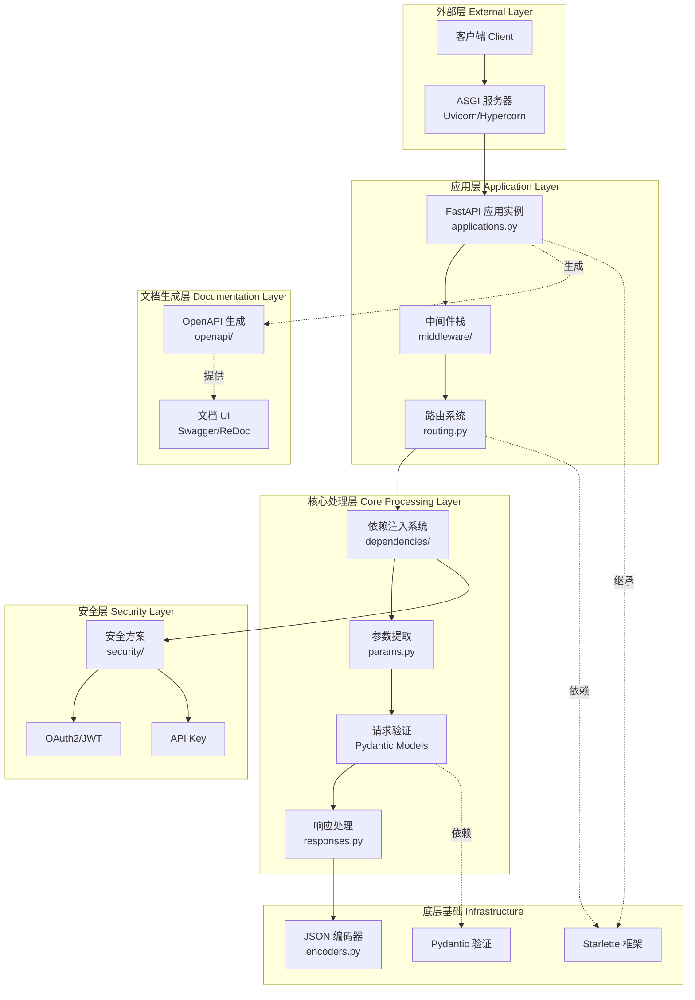
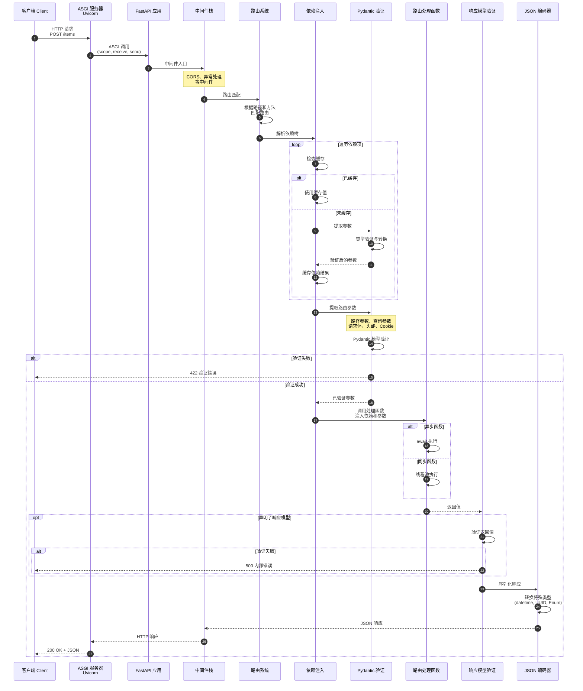
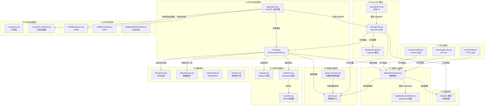

# FastAPI 源码剖析 - 总览

## 0. 摘要

### 项目目标
FastAPI 是一个现代化的 Python Web 框架，专注于提供高性能、易学习、快速开发且生产就绪的 API 构建能力。其核心目标包括：

- **高性能**：与 NodeJS 和 Go 相当的性能水平，基于 Starlette 和 Pydantic
- **快速开发**：通过类型提示和自动化减少约 200%-300% 的开发时间
- **减少错误**：减少约 40% 的人为错误
- **智能提示**：完整的编辑器支持，包括自动补全
- **标准化**：完全兼容 OpenAPI（原 Swagger）和 JSON Schema

### FastAPI 核心特性
FastAPI 在 Starlette 基础上，增加了以下核心特性：

- **直观设计**：优秀的编辑器支持，代码补全无处不在，调试时间更短
- **简单易用**：设计易于使用和学习，减少阅读文档的时间
- **简短代码**：减少代码重复，每个参数声明的多个功能，更少错误
- **健壮性**：获得生产就绪的代码，具有自动交互式文档

### 问题域与核心能力边界

**问题域**：
- HTTP API 路由与请求处理
- 数据验证与序列化
- 依赖注入系统
- OpenAPI 文档自动生成
- 安全认证与授权
- 异步请求处理

**核心能力边界**：
- Web API 框架层面功能（不包括 ORM、模板引擎的完整实现）
- 基于 Starlette 的 ASGI 应用封装
- 基于 Pydantic 的数据验证

**非目标**：
- 不提供完整的 ORM 解决方案（推荐集成 SQLAlchemy 等）
- 不提供完整的前端模板引擎（可集成 Jinja2）
- 不处理数据库连接池管理（依赖外部库）

### 运行环境

- **语言**：Python 3.8+
- **核心依赖**：
  - Starlette：ASGI 框架基础
  - Pydantic：数据验证与序列化
  - typing-extensions：类型系统扩展
- **部署形态**：
  - ASGI 应用（可部署到 Uvicorn、Hypercorn 等 ASGI 服务器）
  - 支持单体应用和微服务架构
  - 支持子应用挂载（模块化部署）

## 1. 整体架构图



### 架构说明

#### 组件职责

**外部层**：
- **客户端（Client）**：发起 HTTP/WebSocket 请求的任意客户端
- **ASGI 服务器**：负责接收网络请求并转换为 ASGI 协议格式（Scope、Receive、Send）

**应用层**：
- **FastAPI 应用实例**：框架入口，继承自 Starlette，负责应用配置、路由注册、中间件管理
- **路由系统**：管理 URL 路径到处理函数的映射，支持路径参数、查询参数等
- **中间件栈**：按顺序处理请求和响应，支持 CORS、GZIP、认证等横切关注点

**核心处理层**：
- **依赖注入系统**：FastAPI 的核心创新，通过函数签名自动解析和注入依赖
- **参数提取**：从请求的不同部分（路径、查询、请求体、头部、Cookie）提取参数
- **请求验证**：基于 Pydantic 模型对提取的参数进行类型验证和转换
- **响应处理**：将函数返回值转换为 HTTP 响应，支持多种响应类型

**文档生成层**：
- **OpenAPI 生成**：自动分析路由、参数、模型生成符合 OpenAPI 3.1 规范的 JSON Schema
- **文档 UI**：提供 Swagger UI 和 ReDoc 交互式 API 文档界面

**安全层**：
- **安全方案**：提供 OAuth2、API Key、HTTP Basic/Bearer 等多种认证方式
- **集成依赖注入**：安全方案作为特殊依赖项集成到路由处理流程中

**底层基础**：
- **Starlette**：提供 ASGI 应用基础、路由、中间件、WebSocket 等底层能力
- **Pydantic**：提供数据验证、序列化、JSON Schema 生成能力
- **JSON 编码器**：处理复杂 Python 对象（datetime、UUID、Enum 等）的 JSON 序列化

#### 耦合关系

**同步调用**：
- 客户端请求 → ASGI 服务器 → FastAPI 应用 → 中间件 → 路由 → 依赖注入 → 参数提取 → 验证 → 业务逻辑 → 响应处理 → 返回

**异步调用**：
- 支持 async/await 语法，异步路由函数在事件循环中执行
- 同步函数自动在线程池中执行（通过 `run_in_threadpool`）

**事件驱动**：
- 生命周期事件（startup、shutdown）通过 lifespan 上下文管理器处理
- 后台任务通过 BackgroundTasks 异步执行

#### 数据流与控制流

**请求数据流**：
```
HTTP 请求 → ASGI Scope → Starlette Request → 参数提取 → Pydantic 验证 → 业务函数参数
```

**响应数据流**：
```
业务函数返回值 → Response Model 验证 → JSON 编码 → Starlette Response → ASGI Send → HTTP 响应
```

**控制流**：
1. 请求到达 ASGI 服务器
2. FastAPI 应用的 `__call__` 方法接收 ASGI 三元组（scope, receive, send）
3. 中间件栈按顺序处理（CORS、异常处理等）
4. 路由匹配：根据 HTTP 方法和路径匹配路由
5. 依赖解析：递归解析路由函数的所有依赖项
6. 参数提取：从 Request 对象提取路径参数、查询参数、请求体等
7. 数据验证：使用 Pydantic 模型验证和转换数据
8. 执行路由函数：注入依赖和参数，执行业务逻辑
9. 响应模型验证：验证返回值是否符合声明的响应模型
10. 响应序列化：将返回值序列化为 JSON
11. 返回响应：通过 ASGI send 接口发送响应

#### 跨进程/跨线程/跨协程路径

**跨协程**（主要路径）：
- 异步路由函数在同一事件循环中以协程方式执行
- 异步依赖项（async def）作为协程被 await

**跨线程**：
- 同步路由函数通过 `run_in_threadpool` 在线程池中执行
- 避免阻塞事件循环

**跨进程**：
- FastAPI 本身不处理跨进程通信
- 多进程部署通过 ASGI 服务器（如 Uvicorn with --workers）实现
- 进程间通过共享数据库、消息队列等外部系统协作

#### 高可用与扩展性

**高可用**：
- **无状态设计**：FastAPI 应用本身无状态，可水平扩展
- **异常处理**：全局异常处理器捕获未处理异常，返回友好错误响应
- **健康检查**：通过路由端点实现健康检查接口

**扩展性**：
- **路由模块化**：APIRouter 支持路由分组和子应用挂载
- **依赖注入**：通过依赖项实现横切关注点（日志、认证、数据库连接等）
- **中间件扩展**：支持自定义中间件处理请求和响应
- **事件钩子**：startup 和 shutdown 事件支持资源初始化和清理

**状态管理**：
- **应用状态**：通过 `app.state` 存储应用级共享状态
- **请求状态**：通过 `request.state` 存储请求级临时状态
- **依赖缓存**：依赖项在同一请求中默认缓存，避免重复执行

## 2. 全局时序图



### 时序图说明

#### 关键步骤解析

**步骤 1-3：请求入口**
- 客户端发起 HTTP 请求
- ASGI 服务器（如 Uvicorn）接收 TCP 连接，解析 HTTP 协议
- 转换为 ASGI 格式的 scope（请求元数据）、receive（接收请求体）、send（发送响应）三元组
- 调用 FastAPI 应用的 `__call__` 方法

**步骤 4-5：中间件处理**
- 请求通过中间件栈（洋葱模型）
- 常见中间件：CORS（跨域）、异常处理、GZIP 压缩、认证等
- 中间件可以修改请求、短路返回、或传递给下一层

**步骤 6-7：路由匹配**
- 路由系统根据 HTTP 方法（GET、POST 等）和 URL 路径匹配路由
- 使用编译后的正则表达式匹配路径参数
- 找到对应的 `APIRoute` 对象

**步骤 8-14：依赖注入解析**
- 这是 FastAPI 的核心机制
- 递归遍历路由函数和所有依赖项的函数签名
- 提取每个参数的类型提示、默认值、参数来源（Path、Query、Body 等）
- 构建依赖树（Dependant 对象）
- 按依赖顺序执行：
  - 先执行被依赖项
  - 检查请求级缓存，避免重复执行
  - 从请求中提取对应参数（路径参数、查询参数、请求体等）
  - 使用 Pydantic 验证参数
  - 缓存依赖结果

**步骤 15-17：参数验证**
- 提取路由函数的参数：
  - **路径参数**：从 URL 路径提取（如 `/items/{item_id}`）
  - **查询参数**：从 URL 查询字符串提取（如 `?skip=0&limit=10`）
  - **请求体**：解析 JSON/表单数据为 Pydantic 模型
  - **头部参数**：从 HTTP 头部提取
  - **Cookie 参数**：从 Cookie 提取
- 使用 Pydantic 模型进行验证：
  - 类型转换（字符串转数字、日期等）
  - 数据验证（范围、正则、自定义验证器）
  - 设置默认值
- 验证失败返回 422 Unprocessable Entity 错误，包含详细错误信息

**步骤 20-24：路由处理函数执行**
- 将验证后的参数和依赖项注入到路由处理函数
- 根据函数类型选择执行方式：
  - **异步函数（async def）**：在当前事件循环中通过 `await` 执行
  - **同步函数（def）**：通过 `run_in_threadpool` 在线程池中执行，避免阻塞事件循环
- 执行业务逻辑，返回结果

**步骤 25-30：响应模型验证**
- 如果路由声明了 `response_model`，则验证返回值：
  - 确保返回数据符合声明的模型结构
  - 过滤字段（`response_model_exclude`、`response_model_include`）
  - 排除未设置的字段（`response_model_exclude_unset`）
- 验证失败抛出 500 错误（开发时错误，生产环境应避免）

**步骤 31-34：响应序列化与返回**
- 使用 `jsonable_encoder` 将返回值序列化为 JSON 兼容格式：
  - 转换特殊类型：datetime → ISO 8601 字符串、UUID → 字符串、Enum → 值
  - 递归处理嵌套对象、列表、字典
  - 调用 Pydantic 模型的 `.model_dump()` 方法
- 创建 JSONResponse 对象
- 通过中间件栈返回（响应阶段）
- 通过 ASGI send 接口发送给 ASGI 服务器
- 最终返回给客户端

#### 入口与鉴权

**入口**：
- ASGI 服务器是网络层入口
- FastAPI 应用的 `__call__` 方法是框架入口
- 路由处理函数是业务逻辑入口

**鉴权**：
- 通过依赖注入实现鉴权
- 安全方案（Security、OAuth2、APIKey）作为特殊依赖项
- 在路由处理函数执行前，依赖注入阶段完成鉴权
- 鉴权失败抛出 HTTPException(401/403)

#### 幂等性

FastAPI 本身不强制幂等性，由开发者实现：

**GET/HEAD/OPTIONS**：
- HTTP 规范定义为幂等和安全
- FastAPI 不对这些方法做特殊处理

**POST/PUT/DELETE**：
- 开发者需要根据业务需求实现幂等性
- 常见实现方式：
  - 使用唯一幂等键（Idempotency-Key 头部）
  - 数据库唯一约束
  - 分布式锁

**幂等示例**：
```python
@app.post("/items/")
async def create_item(
    item: Item,
    idempotency_key: str = Header(...),
    db: Session = Depends(get_db)
):
    # 检查幂等键是否已存在
    existing = db.query(IdempotencyRecord).filter_by(key=idempotency_key).first()
    if existing:
        return existing.response  # 返回缓存的响应
    
    # 执行业务逻辑
    result = create_item_in_db(item, db)
    
    # 存储幂等记录
    db.add(IdempotencyRecord(key=idempotency_key, response=result))
    db.commit()
    
    return result
```

#### 回退策略

**验证失败**：
- 返回 422 错误，包含详细验证错误信息
- 客户端可根据错误信息修正请求

**依赖项失败**：
- 抛出 HTTPException 或其他异常
- 异常处理器捕获并返回相应错误响应

**业务逻辑失败**：
- 开发者可抛出 HTTPException 或自定义异常
- 全局异常处理器统一处理

**响应模型验证失败**：
- 开发时抛出 500 错误，提示开发者修复
- 生产环境应确保不会发生（通过测试保证）

#### 重试点

FastAPI 本身不实现重试机制，重试由客户端或外部组件处理：

**客户端重试**：
- 对于幂等操作（GET、PUT、DELETE），客户端可安全重试
- POST 操作需要实现幂等性后才能重试

**依赖项重试**：
- 数据库连接失败：可在依赖项内部实现重试逻辑
- 外部 API 调用失败：使用 tenacity 等库实现重试

**后台任务重试**：
- BackgroundTasks 不支持自动重试
- 需要使用 Celery、RQ 等任务队列实现可靠重试

#### 超时设定

**ASGI 服务器级别**：
- Uvicorn：`--timeout-keep-alive`（Keep-Alive 超时）
- Hypercorn：`--keep-alive-timeout`

**应用级别**：
FastAPI 不提供内置超时机制，需要在不同层次实现：

**请求处理超时**：
```python
import asyncio

async def timeout_middleware(request: Request, call_next):
    try:
        return await asyncio.wait_for(call_next(request), timeout=30.0)
    except asyncio.TimeoutError:
        return JSONResponse({"detail": "Request timeout"}, status_code=504)

app.middleware("http")(timeout_middleware)
```

**依赖项超时**：
```python
async def get_external_data():
    async with httpx.AsyncClient(timeout=5.0) as client:
        response = await client.get("https://api.example.com/data")
        return response.json()
```

**数据库查询超时**：
- SQLAlchemy：设置连接池超时和查询超时
- 异步驱动（asyncpg、motor）：支持超时参数

#### 资源上界

**请求体大小**：
- 由 ASGI 服务器控制（Uvicorn 默认无限制）
- 建议在中间件或反向代理（Nginx）中限制

**并发请求数**：
- 异步模式：受事件循环和系统资源限制
- 同步路由：受线程池大小限制（默认 40）

**依赖项递归深度**：
- 理论上无限制，但过深的依赖树会影响性能
- 建议控制在 5 层以内

**响应大小**：
- 无内置限制，由内存和网络带宽决定
- 大量数据建议使用流式响应或分页

## 3. 模块边界与交互图



### 模块交互矩阵

| 调用方 | 被调方 | 接口/功能 | 同步/异步 | 错误语义 | 一致性要求 |
|--------|--------|-----------|-----------|----------|------------|
| **applications.py** | routing.py | 路由注册 | 同步 | 配置错误抛异常 | 启动时一次性配置 |
| **applications.py** | openapi/utils.py | OpenAPI 生成 | 同步 | 返回 None 或字典 | 惰性生成，启动后不变 |
| **applications.py** | middleware/* | 中间件注册 | 同步 | 配置错误抛异常 | 启动时一次性配置 |
| **routing.py** | dependencies/utils.py | 依赖解析 | 同步（启动时）<br/>异步（请求时） | 解析失败抛异常<br/>验证失败返回 422 | 启动时解析依赖树<br/>请求时执行依赖 |
| **routing.py** | requests.py | 获取请求对象 | 异步 | 无 | 请求级，线程/协程安全 |
| **routing.py** | responses.py | 创建响应 | 同步 | 序列化失败抛异常 | 无状态，每次创建新对象 |
| **dependencies/utils.py** | params.py | 参数定义 | 同步 | 无 | 不可变配置 |
| **dependencies/utils.py** | Pydantic | 数据验证 | 同步 | ValidationError | 无状态验证 |
| **responses.py** | encoders.py | JSON 序列化 | 同步 | 类型错误抛异常 | 无状态 |
| **openapi/utils.py** | routing.py | 遍历路由 | 同步 | 无 | 读取路由配置 |
| **openapi/utils.py** | Pydantic | 生成 JSON Schema | 同步 | 无 | 读取模型定义 |
| **security/*** | dependencies/utils.py | 作为依赖注入 | 异步 | 认证失败抛 401/403 | 请求级 |
| **background.py** | routing.py | 后台任务注册 | 异步 | 异常记录但不传播 | 最终一致性 |
| **testclient.py** | applications.py | 测试请求 | 同步 | 抛出测试异常 | 测试环境 |

### 交互说明

#### 同步调用

**配置时（应用启动）**：
- FastAPI 应用初始化
- 路由注册（`@app.get`、`app.include_router`）
- 中间件注册（`app.add_middleware`）
- 依赖树解析（构建 Dependant 对象）
- OpenAPI 规范生成（惰性生成，首次访问时）

**请求时（运行时）**：
- 路由匹配
- 依赖执行
- 参数提取与验证
- 路由处理函数调用
- 响应序列化与返回

#### 异步消息

FastAPI 本身不提供消息队列，异步消息通过外部系统实现：

**后台任务**：
- `BackgroundTasks` 提供简单的后台任务机制
- 在响应返回后异步执行
- 不保证可靠性（进程崩溃会丢失）
- 适合轻量任务（发邮件、日志记录等）

**WebSocket**：
- 支持全双工通信
- 通过 `websockets.py` 模块实现
- 基于 Starlette 的 WebSocket 支持

**外部消息队列**：
- 集成 Celery、RQ、Kafka 等
- 通过依赖注入获取队列客户端
- 在路由处理函数中发送消息

#### 共享存储

FastAPI 不提供内置存储，通过依赖注入集成：

**应用状态**：
```python
app.state.db_pool = create_pool()  # 数据库连接池
app.state.redis = redis.Redis()    # Redis 客户端
```

**请求状态**：
```python
@app.middleware("http")
async def add_request_id(request: Request, call_next):
    request.state.request_id = generate_id()
    response = await call_next(request)
    return response
```

**依赖注入共享**：
```python
async def get_db():
    async with SessionLocal() as session:
        yield session  # 请求结束时自动关闭

@app.get("/items/")
async def read_items(db: Session = Depends(get_db)):
    return db.query(Item).all()
```

#### 订阅/发布

不是 FastAPI 核心功能，通过集成实现：

**WebSocket 广播**：
```python
class ConnectionManager:
    def __init__(self):
        self.active_connections: List[WebSocket] = []
    
    async def broadcast(self, message: str):
        for connection in self.active_connections:
            await connection.send_text(message)

manager = ConnectionManager()

@app.websocket("/ws")
async def websocket_endpoint(websocket: WebSocket):
    await manager.connect(websocket)
    # 订阅消息
```

**外部发布订阅**：
- Redis Pub/Sub
- Kafka
- RabbitMQ
- 通过依赖注入集成

## 4. 关键设计与权衡

### 数据一致性

FastAPI 本身不处理数据一致性，由开发者选择：

**强一致性**：
- 使用事务性数据库（PostgreSQL、MySQL）
- 在依赖项中管理事务：
```python
async def get_db():
    async with SessionLocal() as session:
        async with session.begin():  # 事务边界
            yield session
```

**最终一致性**：
- 使用消息队列实现最终一致性
- 后台任务处理非关键操作
- 事件溯源模式

### 事务边界

事务边界由开发者在依赖项或业务逻辑中定义：

**依赖项级事务**（推荐）：
```python
async def get_db_with_transaction():
    async with SessionLocal() as session:
        async with session.begin():
            yield session
            # 自动提交或回滚
```

**业务逻辑级事务**：
```python
@app.post("/items/")
async def create_item(item: Item, db: Session = Depends(get_db)):
    async with db.begin():
        db.add(item)
        # 手动管理事务
```

**跨服务事务**：
- Saga 模式（补偿事务）
- 两阶段提交（2PC）
- 使用外部事务协调器

### 锁与并发策略

**乐观并发控制**（推荐）：
```python
class Item(Base):
    id: int
    version: int  # 版本号
    
@app.put("/items/{item_id}")
async def update_item(
    item_id: int,
    item: ItemUpdate,
    db: Session = Depends(get_db)
):
    db_item = db.query(Item).filter(Item.id == item_id).first()
    if db_item.version != item.version:
        raise HTTPException(409, "Conflict: item was modified")
    db_item.version += 1
    # 更新其他字段
```

**悲观并发控制**：
```python
# PostgreSQL 行锁
db_item = db.query(Item).filter(Item.id == item_id).with_for_update().first()
```

**分布式锁**：
```python
async def get_lock():
    redis = redis.Redis()
    lock = redis.lock("resource:123", timeout=10)
    acquired = lock.acquire(blocking=False)
    if not acquired:
        raise HTTPException(423, "Resource locked")
    try:
        yield lock
    finally:
        lock.release()
```

**协程并发**：
- FastAPI 的异步支持天然提供高并发能力
- 使用 `asyncio.gather` 并发执行多个异步操作：
```python
@app.get("/dashboard")
async def dashboard():
    users, items, orders = await asyncio.gather(
        get_users(),
        get_items(),
        get_orders()
    )
    return {"users": users, "items": items, "orders": orders}
```

### 性能关键路径

**热路径识别**：
1. **路由匹配**：使用编译后的正则表达式，O(路由数量)
2. **依赖解析**：启动时预解析，请求时从缓存获取
3. **参数提取**：最小化字符串解析
4. **Pydantic 验证**：C 扩展加速（pydantic-core）
5. **JSON 序列化**：使用 `orjson` 替代标准库（更快）

**性能优化点**：

**使用异步 I/O**：
```python
# 避免阻塞
async def get_user(user_id: int):
    async with httpx.AsyncClient() as client:
        response = await client.get(f"https://api.example.com/users/{user_id}")
        return response.json()
```

**依赖缓存**：
```python
# 依赖项默认在请求中缓存
async def get_db():
    yield SessionLocal()  # 同一请求中只创建一次
```

**响应模型优化**：
```python
# 排除未设置字段，减少序列化开销
@app.get("/items/", response_model=List[Item], response_model_exclude_unset=True)
async def read_items():
    return items
```

**使用流式响应**：
```python
@app.get("/large-file")
async def stream_large_file():
    async def generate():
        for chunk in read_large_file_in_chunks():
            yield chunk
    return StreamingResponse(generate())
```

### 可观测性指标

FastAPI 不提供内置监控，通过集成实现：

**Prometheus 集成**：
```python
from prometheus_client import Counter, Histogram, generate_latest

request_count = Counter("http_requests_total", "Total requests", ["method", "endpoint"])
request_duration = Histogram("http_request_duration_seconds", "Request duration")

@app.middleware("http")
async def metrics_middleware(request: Request, call_next):
    with request_duration.time():
        response = await call_next(request)
    request_count.labels(method=request.method, endpoint=request.url.path).inc()
    return response

@app.get("/metrics")
async def metrics():
    return Response(generate_latest(), media_type="text/plain")
```

**关键指标**：
- **QPS（每秒请求数）**：衡量吞吐量
- **P50/P95/P99 延迟**：衡量响应时间分布
- **错误率**：4xx/5xx 错误比例
- **依赖项执行时间**：数据库查询、外部 API 调用耗时
- **并发连接数**：活跃的 HTTP/WebSocket 连接

**OpenTelemetry 集成**：
```python
from opentelemetry.instrumentation.fastapi import FastAPIInstrumentor

FastAPIInstrumentor.instrument_app(app)
```

### 配置项

**应用级配置**：
```python
app = FastAPI(
    title="My API",                    # API 标题
    version="1.0.0",                   # API 版本
    openapi_url="/api/v1/openapi.json", # OpenAPI JSON 路径
    docs_url="/docs",                  # Swagger UI 路径
    redoc_url="/redoc",                # ReDoc 路径
    debug=False,                       # 调试模式
)
```

**路由级配置**：
```python
@app.get(
    "/items/",
    response_model=List[Item],         # 响应模型
    status_code=200,                   # 默认状态码
    tags=["items"],                    # OpenAPI 标签
    summary="Get all items",           # 摘要
    description="Retrieve all items",  # 详细描述
    deprecated=False,                  # 是否废弃
    include_in_schema=True,            # 是否包含在 OpenAPI
)
async def read_items():
    pass
```

**依赖项配置**：
```python
async def pagination(skip: int = Query(0, ge=0), limit: int = Query(10, le=100)):
    return {"skip": skip, "limit": limit}
```

**中间件配置**：
```python
app.add_middleware(
    CORSMiddleware,
    allow_origins=["*"],
    allow_methods=["*"],
    allow_headers=["*"],
)
```

**环境变量配置**（推荐使用 Pydantic Settings）：
```python
from pydantic_settings import BaseSettings

class Settings(BaseSettings):
    database_url: str
    redis_url: str
    secret_key: str
    
    class Config:
        env_file = ".env"

settings = Settings()
```

## 5. 典型使用示例与最佳实践

### 示例 1：最小可运行应用

```python
from fastapi import FastAPI

app = FastAPI()

@app.get("/")
async def root():
    return {"message": "Hello World"}

@app.get("/items/{item_id}")
async def read_item(item_id: int, q: str = None):
    return {"item_id": item_id, "q": q}
```

**运行**：
```bash
uvicorn main:app --reload
```

**测试**：
```bash
curl http://localhost:8000/
curl http://localhost:8000/items/42?q=test
```

**访问文档**：
- Swagger UI: http://localhost:8000/docs
- ReDoc: http://localhost:8000/redoc
- OpenAPI JSON: http://localhost:8000/openapi.json

### 示例 2：完整的 CRUD 应用

```python
from typing import List, Optional
from fastapi import FastAPI, HTTPException, Depends
from pydantic import BaseModel

app = FastAPI()

# 数据模型
class ItemBase(BaseModel):
    title: str
    description: Optional[str] = None

class ItemCreate(ItemBase):
    pass

class Item(ItemBase):
    id: int
    
    class Config:
        from_attributes = True

# 模拟数据库
fake_db = {}
next_id = 1

# 依赖项
def get_item_or_404(item_id: int) -> Item:
    if item_id not in fake_db:
        raise HTTPException(status_code=404, detail="Item not found")
    return fake_db[item_id]

# CRUD 操作
@app.post("/items/", response_model=Item, status_code=201)
async def create_item(item: ItemCreate):
    global next_id
    db_item = Item(id=next_id, **item.model_dump())
    fake_db[next_id] = db_item
    next_id += 1
    return db_item

@app.get("/items/", response_model=List[Item])
async def list_items(skip: int = 0, limit: int = 10):
    return list(fake_db.values())[skip:skip+limit]

@app.get("/items/{item_id}", response_model=Item)
async def read_item(item: Item = Depends(get_item_or_404)):
    return item

@app.put("/items/{item_id}", response_model=Item)
async def update_item(
    item_id: int,
    item_update: ItemCreate,
    existing_item: Item = Depends(get_item_or_404)
):
    updated_item = Item(id=item_id, **item_update.model_dump())
    fake_db[item_id] = updated_item
    return updated_item

@app.delete("/items/{item_id}", status_code=204)
async def delete_item(item_id: int, item: Item = Depends(get_item_or_404)):
    del fake_db[item_id]
```

**最佳实践**：
- 使用 Pydantic 模型定义请求和响应
- 通过依赖注入实现可重用逻辑（如 `get_item_or_404`）
- 使用 `response_model` 自动过滤和验证响应
- 设置合适的 HTTP 状态码（201 for create, 204 for delete）

### 示例 3：数据库集成（SQLAlchemy）

```python
from sqlalchemy import create_engine, Column, Integer, String
from sqlalchemy.ext.declarative import declarative_base
from sqlalchemy.orm import sessionmaker, Session
from fastapi import FastAPI, Depends

DATABASE_URL = "sqlite:///./test.db"

engine = create_engine(DATABASE_URL, connect_args={"check_same_thread": False})
SessionLocal = sessionmaker(autocommit=False, autoflush=False, bind=engine)
Base = declarative_base()

# 模型
class User(Base):
    __tablename__ = "users"
    id = Column(Integer, primary_key=True, index=True)
    email = Column(String, unique=True, index=True)
    name = Column(String)

Base.metadata.create_all(bind=engine)

# Pydantic 模型
from pydantic import BaseModel, EmailStr

class UserCreate(BaseModel):
    email: EmailStr
    name: str

class UserOut(BaseModel):
    id: int
    email: str
    name: str
    
    class Config:
        from_attributes = True

app = FastAPI()

# 依赖项：获取数据库会话
def get_db():
    db = SessionLocal()
    try:
        yield db
    finally:
        db.close()

# 路由
@app.post("/users/", response_model=UserOut)
async def create_user(user: UserCreate, db: Session = Depends(get_db)):
    db_user = User(**user.model_dump())
    db.add(db_user)
    db.commit()
    db.refresh(db_user)
    return db_user

@app.get("/users/{user_id}", response_model=UserOut)
async def read_user(user_id: int, db: Session = Depends(get_db)):
    db_user = db.query(User).filter(User.id == user_id).first()
    if not db_user:
        raise HTTPException(status_code=404, detail="User not found")
    return db_user
```

**最佳实践**：
- 使用依赖注入管理数据库会话生命周期
- `get_db` 依赖确保会话在请求结束时关闭
- SQLAlchemy 模型与 Pydantic 模型分离（关注点分离）
- 使用 `from_attributes=True` 支持 ORM 模型转换

### 示例 4：身份验证与授权

```python
from datetime import datetime, timedelta
from typing import Optional
from fastapi import FastAPI, Depends, HTTPException, status
from fastapi.security import OAuth2PasswordBearer, OAuth2PasswordRequestForm
from jose import JWTError, jwt
from passlib.context import CryptContext
from pydantic import BaseModel

SECRET_KEY = "your-secret-key"
ALGORITHM = "HS256"
ACCESS_TOKEN_EXPIRE_MINUTES = 30

pwd_context = CryptContext(schemes=["bcrypt"], deprecated="auto")
oauth2_scheme = OAuth2PasswordBearer(tokenUrl="token")

app = FastAPI()

# 模型
class Token(BaseModel):
    access_token: str
    token_type: str

class User(BaseModel):
    username: str
    email: Optional[str] = None
    disabled: Optional[bool] = False

fake_users_db = {
    "testuser": {
        "username": "testuser",
        "email": "test@example.com",
        "hashed_password": pwd_context.hash("secret"),
        "disabled": False,
    }
}

def verify_password(plain_password, hashed_password):
    return pwd_context.verify(plain_password, hashed_password)

def create_access_token(data: dict, expires_delta: Optional[timedelta] = None):
    to_encode = data.copy()
    expire = datetime.utcnow() + (expires_delta or timedelta(minutes=15))
    to_encode.update({"exp": expire})
    return jwt.encode(to_encode, SECRET_KEY, algorithm=ALGORITHM)

async def get_current_user(token: str = Depends(oauth2_scheme)):
    credentials_exception = HTTPException(
        status_code=status.HTTP_401_UNAUTHORIZED,
        detail="Could not validate credentials",
        headers={"WWW-Authenticate": "Bearer"},
    )
    try:
        payload = jwt.decode(token, SECRET_KEY, algorithms=[ALGORITHM])
        username: str = payload.get("sub")
        if username is None:
            raise credentials_exception
    except JWTError:
        raise credentials_exception
    
    user = fake_users_db.get(username)
    if user is None:
        raise credentials_exception
    return User(**user)

# 登录端点
@app.post("/token", response_model=Token)
async def login(form_data: OAuth2PasswordRequestForm = Depends()):
    user = fake_users_db.get(form_data.username)
    if not user or not verify_password(form_data.password, user["hashed_password"]):
        raise HTTPException(
            status_code=status.HTTP_401_UNAUTHORIZED,
            detail="Incorrect username or password",
            headers={"WWW-Authenticate": "Bearer"},
        )
    
    access_token = create_access_token(
        data={"sub": user["username"]},
        expires_delta=timedelta(minutes=ACCESS_TOKEN_EXPIRE_MINUTES)
    )
    return {"access_token": access_token, "token_type": "bearer"}

# 受保护端点
@app.get("/users/me", response_model=User)
async def read_users_me(current_user: User = Depends(get_current_user)):
    return current_user

@app.get("/items/")
async def read_items(current_user: User = Depends(get_current_user)):
    return [{"item": "Item 1", "owner": current_user.username}]
```

**使用示例**：
```bash
# 1. 获取 token
curl -X POST "http://localhost:8000/token" \
  -H "Content-Type: application/x-www-form-urlencoded" \
  -d "username=testuser&password=secret"

# 返回: {"access_token": "eyJ...", "token_type": "bearer"}

# 2. 使用 token 访问受保护资源
curl -X GET "http://localhost:8000/users/me" \
  -H "Authorization: Bearer eyJ..."
```

**最佳实践**：
- 使用 `OAuth2PasswordBearer` 处理 token 提取
- 通过依赖注入实现认证（`get_current_user`）
- 密码使用 bcrypt 哈希存储
- JWT token 设置过期时间
- 返回标准的 401 错误和 WWW-Authenticate 头部

### 示例 5：后台任务

```python
from fastapi import FastAPI, BackgroundTasks
from pydantic import BaseModel, EmailStr

app = FastAPI()

class EmailSchema(BaseModel):
    email: EmailStr
    message: str

def send_email(email: str, message: str):
    # 模拟耗时的邮件发送
    import time
    time.sleep(3)
    print(f"Email sent to {email}: {message}")

@app.post("/send-notification/")
async def send_notification(
    email: EmailSchema,
    background_tasks: BackgroundTasks
):
    # 添加后台任务
    background_tasks.add_task(send_email, email.email, email.message)
    
    # 立即返回响应（不等待邮件发送完成）
    return {"message": "Notification sent in the background"}

@app.post("/send-multiple-notifications/")
async def send_multiple_notifications(
    emails: list[EmailSchema],
    background_tasks: BackgroundTasks
):
    for email in emails:
        background_tasks.add_task(send_email, email.email, email.message)
    
    return {"message": f"{len(emails)} notifications scheduled"}
```

**最佳实践**：
- 后台任务用于非关键操作（日志、通知、清理等）
- 不要在后台任务中执行关键业务逻辑（不可靠）
- 对于可靠性要求高的任务，使用 Celery、RQ 等任务队列
- 后台任务在响应返回后执行，不影响响应时间

### 示例 6：中间件与请求处理

```python
import time
from fastapi import FastAPI, Request

app = FastAPI()

@app.middleware("http")
async def add_process_time_header(request: Request, call_next):
    start_time = time.time()
    response = await call_next(request)
    process_time = time.time() - start_time
    response.headers["X-Process-Time"] = str(process_time)
    return response

@app.middleware("http")
async def log_requests(request: Request, call_next):
    print(f"Request: {request.method} {request.url}")
    response = await call_next(request)
    print(f"Response: {response.status_code}")
    return response

@app.get("/")
async def root():
    return {"message": "Hello World"}
```

**中间件执行顺序**：
```
请求 → log_requests (before) → add_process_time_header (before) 
     → 路由处理 
     → add_process_time_header (after) → log_requests (after) → 响应
```

**最佳实践**：
- 中间件用于横切关注点（日志、监控、认证等）
- 注意中间件顺序（后注册的先执行 before 部分）
- 使用 `await call_next(request)` 传递请求到下一层
- 可以修改请求和响应

### 示例 7：WebSocket 实时通信

```python
from fastapi import FastAPI, WebSocket, WebSocketDisconnect
from typing import List

app = FastAPI()

class ConnectionManager:
    def __init__(self):
        self.active_connections: List[WebSocket] = []
    
    async def connect(self, websocket: WebSocket):
        await websocket.accept()
        self.active_connections.append(websocket)
    
    def disconnect(self, websocket: WebSocket):
        self.active_connections.remove(websocket)
    
    async def broadcast(self, message: str):
        for connection in self.active_connections:
            await connection.send_text(message)

manager = ConnectionManager()

@app.websocket("/ws/{client_id}")
async def websocket_endpoint(websocket: WebSocket, client_id: int):
    await manager.connect(websocket)
    try:
        while True:
            data = await websocket.receive_text()
            await manager.broadcast(f"Client #{client_id}: {data}")
    except WebSocketDisconnect:
        manager.disconnect(websocket)
        await manager.broadcast(f"Client #{client_id} left")
```

**客户端示例（JavaScript）**：
```javascript
const ws = new WebSocket("ws://localhost:8000/ws/123");

ws.onmessage = (event) => {
    console.log("Received:", event.data);
};

ws.send("Hello Server!");
```

**最佳实践**：
- 使用连接管理器跟踪活跃连接
- 处理 `WebSocketDisconnect` 异常进行清理
- 考虑使用 Redis Pub/Sub 实现跨服务器广播
- 添加心跳机制检测断开连接

### 示例 8：文件上传与下载

```python
from fastapi import FastAPI, File, UploadFile
from fastapi.responses import FileResponse
import shutil
from pathlib import Path

app = FastAPI()

UPLOAD_DIR = Path("uploads")
UPLOAD_DIR.mkdir(exist_ok=True)

@app.post("/upload/")
async def upload_file(file: UploadFile = File(...)):
    file_path = UPLOAD_DIR / file.filename
    with file_path.open("wb") as buffer:
        shutil.copyfileobj(file.file, buffer)
    
    return {
        "filename": file.filename,
        "content_type": file.content_type,
        "size": file_path.stat().st_size
    }

@app.post("/upload-multiple/")
async def upload_multiple_files(files: list[UploadFile] = File(...)):
    uploaded_files = []
    for file in files:
        file_path = UPLOAD_DIR / file.filename
        with file_path.open("wb") as buffer:
            shutil.copyfileobj(file.file, buffer)
        uploaded_files.append(file.filename)
    
    return {"uploaded_files": uploaded_files}

@app.get("/download/{filename}")
async def download_file(filename: str):
    file_path = UPLOAD_DIR / filename
    if not file_path.exists():
        raise HTTPException(status_code=404, detail="File not found")
    
    return FileResponse(
        path=file_path,
        filename=filename,
        media_type="application/octet-stream"
    )
```

**最佳实践**：
- 使用 `UploadFile` 而不是 `bytes`（支持大文件流式上传）
- 验证文件类型和大小
- 生成唯一文件名避免冲突
- 使用 `FileResponse` 流式下载大文件
- 考虑使用对象存储（S3、MinIO）而不是本地文件系统

---

## 6. 核心概念与设计哲学

### 类型提示驱动开发

FastAPI 的核心设计理念是充分利用 Python 3.6+ 的类型提示：

**自动化能力**：
- **参数提取**：从类型提示推断参数来源（路径、查询、请求体）
- **数据验证**：自动使用 Pydantic 验证和转换数据
- **文档生成**：自动生成 OpenAPI 规范和交互式文档
- **编辑器支持**：完整的类型检查和自动补全

**示例**：
```python
from typing import Optional
from pydantic import BaseModel

class Item(BaseModel):
    name: str
    price: float
    is_offer: Optional[bool] = None

@app.post("/items/{item_id}")
async def create_item(
    item_id: int,              # 路径参数（从 URL 提取）
    item: Item,                # 请求体（从 JSON 解析）
    q: Optional[str] = None,   # 查询参数（从 query string 提取）
):
    # FastAPI 自动：
    # 1. 从 URL 提取 item_id 并转换为 int
    # 2. 解析 JSON 请求体为 Item 模型
    # 3. 验证 Item 字段（name 必须是 str，price 必须是 float）
    # 4. 从 query string 提取可选参数 q
    # 5. 生成 OpenAPI 文档
    return {"item_id": item_id, "item": item, "q": q}
```

### 依赖注入系统

FastAPI 的依赖注入系统是其最强大的特性之一：

**核心概念**：
- **依赖项（Dependency）**：一个可调用对象（函数、类），返回值会被注入
- **依赖树**：依赖项可以有自己的依赖，形成树状结构
- **自动解析**：FastAPI 自动解析依赖树并按顺序执行
- **请求级缓存**：同一请求中依赖项只执行一次

**使用场景**：
- 数据库会话管理
- 认证与授权
- 配置注入
- 共享业务逻辑
- 请求验证

**高级特性**：
```python
# 带清理的依赖项（使用 yield）
async def get_db():
    db = Database()
    try:
        yield db
    finally:
        await db.close()

# 类作为依赖项
class Pagination:
    def __init__(self, skip: int = 0, limit: int = 10):
        self.skip = skip
        self.limit = limit

# 子依赖
async def get_current_user(token: str = Depends(oauth2_scheme)):
    return decode_token(token)

async def get_admin_user(user: User = Depends(get_current_user)):
    if not user.is_admin:
        raise HTTPException(403)
    return user
```

### 异步优先设计

FastAPI 基于 ASGI 和 Starlette，原生支持异步：

**异步优势**：
- **高并发**：单线程处理数千并发连接
- **高效 I/O**：非阻塞数据库、HTTP 请求、文件操作
- **低延迟**：避免线程切换开销

**混合支持**：
```python
# 异步路由（推荐用于 I/O 密集）
@app.get("/async")
async def async_endpoint():
    data = await fetch_from_database()
    return data

# 同步路由（自动在线程池执行）
@app.get("/sync")
def sync_endpoint():
    data = blocking_operation()  # CPU 密集或遗留同步代码
    return data
```

**最佳实践**：
- I/O 密集操作使用 async/await
- CPU 密集操作使用同步函数（自动在线程池）
- 不要在异步函数中使用阻塞操作（会阻塞整个事件循环）

### 声明式 API 定义

FastAPI 使用装饰器和类型提示声明式定义 API：

**优势**：
- **简洁明了**：API 定义即文档
- **自动验证**：声明即验证
- **类型安全**：编译时类型检查

**示例**：
```python
from typing import List
from pydantic import Field

class Item(BaseModel):
    name: str = Field(..., min_length=1, max_length=100)
    price: float = Field(..., gt=0)
    tags: List[str] = Field(default=[], max_items=10)

@app.post(
    "/items/",
    response_model=Item,                      # 响应模型
    status_code=201,                          # 默认状态码
    tags=["items"],                           # OpenAPI 标签
    summary="Create an item",                 # 摘要
    response_description="The created item",  # 响应描述
)
async def create_item(item: Item):
    """
    Create an item with all the information:
    
    - **name**: item name (1-100 characters)
    - **price**: item price (must be positive)
    - **tags**: optional tags (max 10)
    """
    return item
```

### 性能与生产力平衡

FastAPI 在性能和开发效率之间取得平衡：

**性能优化**：
- 基于 Starlette（最快的 Python ASGI 框架之一）
- Pydantic 使用 Rust 编写的 pydantic-core（快速验证）
- 最小化运行时开销（启动时预解析依赖树）
- 支持高效的异步 I/O

**开发效率**：
- 自动化数据验证、序列化、文档生成
- 减少样板代码
- 完整的类型检查和 IDE 支持
- 优秀的错误提示

**基准测试结果**：
- 与 Node.js (Express) 和 Go (Gin) 性能相当
- 比传统 Python 框架（Flask、Django）快 2-3 倍

---

## 总结

FastAPI 是一个现代化的 Python Web 框架，通过以下核心设计实现高性能和高生产力：

1. **分层架构**：外部层（ASGI）→ 应用层（FastAPI/Router）→ 核心处理层（依赖注入/验证）→ 底层基础（Starlette/Pydantic）
2. **依赖注入**：强大的依赖注入系统实现关注点分离和代码复用
3. **类型驱动**：充分利用 Python 类型提示实现自动化
4. **异步优先**：原生支持异步 I/O，高并发能力
5. **标准兼容**：完全兼容 OpenAPI 和 JSON Schema 标准
6. **可扩展性**：模块化设计，支持路由分组、中间件、子应用

FastAPI 适用于构建高性能的 RESTful API、微服务、实时应用等场景，是现代 Python Web 开发的首选框架之一。

## FastAPI 基本使用示例

### 最简单的 FastAPI 应用

```python
from fastapi import FastAPI

# 创建 FastAPI 应用实例
app = FastAPI()

@app.get("/")
async def read_root():
    """根路径处理器，返回欢迎消息
    
    Returns:
        dict: 包含欢迎消息的字典
    """
    return {"Hello": "World"}

@app.get("/items/{item_id}")
async def read_item(item_id: int, q: str = None):
    """获取单个项目的详细信息
    
    Args:
        item_id (int): 项目的唯一标识符
        q (str, optional): 查询字符串参数
        
    Returns:
        dict: 包含项目ID和查询参数的字典
    """
    return {"item_id": item_id, "q": q}
```

### 使用 Pydantic 模型的示例

```python
from fastapi import FastAPI, HTTPException
from pydantic import BaseModel
from typing import Optional, List
import datetime

app = FastAPI(
    title="用户管理API",
    description="一个完整的用户管理系统API示例",
    version="1.0.0"
)

# Pydantic 数据模型定义
class User(BaseModel):
    """用户数据模型"""
    id: Optional[int] = None
    username: str
    email: str
    full_name: Optional[str] = None
    disabled: bool = False
    created_at: Optional[datetime.datetime] = None

class UserCreate(BaseModel):
    """创建用户请求模型"""
    username: str
    email: str
    full_name: Optional[str] = None
    password: str

# 模拟数据库
fake_users_db = []

@app.post("/users/", response_model=User)
async def create_user(user: UserCreate):
    """创建新用户
    
    Args:
        user (UserCreate): 包含用户信息的请求体
        
    Returns:
        User: 创建成功的用户信息（不含密码）
        
    Raises:
        HTTPException: 当用户名已存在时抛出409错误
    """
    # 检查用户名是否已存在
    for existing_user in fake_users_db:
        if existing_user["username"] == user.username:
            raise HTTPException(status_code=409, detail="用户名已存在")
    
    # 创建新用户
    new_user = {
        "id": len(fake_users_db) + 1,
        "username": user.username,
        "email": user.email,
        "full_name": user.full_name,
        "disabled": False,
        "created_at": datetime.datetime.now()
    }
    fake_users_db.append(new_user)
    
    return User(**new_user)
```

### 依赖注入示例

```python
from fastapi import FastAPI, Depends, HTTPException, status
from fastapi.security import HTTPBearer, HTTPAuthorizationCredentials

app = FastAPI()
security = HTTPBearer()

# 模拟token验证
fake_tokens = {
    "super_secret_token": {"username": "admin", "permissions": ["read", "write"]},
    "user_token": {"username": "user", "permissions": ["read"]}
}

def verify_token(credentials: HTTPAuthorizationCredentials = Depends(security)):
    """验证访问令牌"""
    token = credentials.credentials
    if token not in fake_tokens:
        raise HTTPException(
            status_code=status.HTTP_401_UNAUTHORIZED,
            detail="无效的访问令牌",
            headers={"WWW-Authenticate": "Bearer"},
        )
    return fake_tokens[token]

@app.get("/protected")
async def protected_route(current_user: dict = Depends(verify_token)):
    """受保护的路由，需要身份验证"""
    return {"message": f"Hello, {current_user['username']}!", "data": "受保护的数据"}
```

---

## 补充：FastAPI 生产实践与优化要点

### 项目结构最佳实践

- **分层架构**：
  - `app/core/`：核心配置（config.py、security.py、database.py）
  - `app/api/`：API 路由，按版本组织（v1/、v2/）
  - `app/models/`：ORM 数据模型（SQLAlchemy）
  - `app/schemas/`：Pydantic 请求/响应模式
  - `app/crud/`：CRUD 操作封装
  - `app/services/`：业务逻辑层
  - `app/middleware/`：自定义中间件
  - `tests/`：测试文件（单元测试、集成测试）

- **配置管理**：
  - 使用 `pydantic.BaseSettings` 管理配置，自动从环境变量读取。
  - 使用 `@lru_cache` 缓存配置实例，避免重复读取。
  - 敏感配置（数据库密码、API Key）存储在 `.env` 文件，不提交到版本控制。

- **模块化路由**：
  - 使用 `APIRouter` 分组路由，按功能模块划分（users、items、auth）。
  - 路由版本管理：`/api/v1/users`、`/api/v2/users`，支持平滑迁移。
  - 路由前缀和标签：`router = APIRouter(prefix="/users", tags=["users"])`。

### 依赖注入高级用法

- **数据库会话管理**：
  - 使用 `yield` 依赖确保会话正确关闭：`def get_db() -> Generator: yield session; session.close()`。
  - 依赖注入层级：全局依赖（应用级）、路由器依赖（模块级）、路径操作依赖（端点级）。

- **身份验证依赖**：
  - 提取 JWT Token：`async def get_current_user(token: str = Depends(oauth2_scheme))`。
  - 权限校验：`async def require_admin(current_user: User = Depends(get_current_user))`。
  - 可选依赖：`optional_user: Optional[User] = Depends(get_current_user_optional)`。

- **依赖缓存**：
  - FastAPI 会缓存同一请求内的依赖结果，避免重复计算。
  - 使用 `use_cache=False` 禁用缓存：`Depends(get_data, use_cache=False)`。

- **子依赖**：
  - 依赖可以声明自己的依赖，形成依赖链：`get_user -> get_token -> verify_token`。

### 路由系统优化

- **路径参数与查询参数**：
  - 路径参数：`@app.get("/items/{item_id}")`，类型自动验证和转换。
  - 查询参数：`q: Optional[str] = Query(None, max_length=50, regex="^[a-zA-Z0-9]+$")`。
  - 请求体：使用 Pydantic 模型自动验证，支持嵌套模型和复杂验证。

- **响应模型**：
  - 指定 `response_model` 自动过滤字段：`@app.post("/users/", response_model=UserOut)`。
  - 排除未设置字段：`response_model_exclude_unset=True`。
  - 响应状态码：`status_code=status.HTTP_201_CREATED`。

- **路由优先级**：
  - 特定路由优先于通配路由：先定义 `/users/me`，再定义 `/users/{user_id}`。

- **WebSocket 支持**：
  - `@app.websocket("/ws")`，支持双向实时通信。
  - 连接管理：维护活跃连接列表，广播消息到所有客户端。

### 数据验证与序列化

- **Pydantic 高级特性**：
  - 自定义验证器：`@validator('email')` 验证邮箱格式。
  - 字段别名：`Field(..., alias="userName")` 映射不同字段名。
  - 配置类：`Config.orm_mode = True` 支持 ORM 对象序列化。
  - 默认值工厂：`Field(default_factory=datetime.now)` 动态生成默认值。

- **请求验证**：
  - `Body(..., embed=True)` 嵌入单个请求体字段。
  - `Query/Path/Header/Cookie` 参数验证，支持正则、长度、范围约束。
  - 文件上传：`file: UploadFile = File(...)`，支持流式上传大文件。

- **响应模型继承**：
  - 基础模型 + 特定场景模型：`UserBase -> UserCreate -> User -> UserInDB`。

### 安全认证最佳实践

- **OAuth2 密码流程**：
  - 使用 `OAuth2PasswordBearer` 提取 Token。
  - JWT Token 生成：`jwt.encode(payload, SECRET_KEY, algorithm="HS256")`。
  - Token 刷新：短期 Access Token + 长期 Refresh Token。

- **密码哈希**：
  - 使用 `passlib` + `bcrypt`：`pwd_context.hash(password)` 和 `pwd_context.verify()`。
  - 避免明文存储密码，响应模型排除密码字段。

- **API Key 认证**：
  - Header 方式：`api_key: str = Header(..., alias="X-API-Key")`。
  - Query 方式：`api_key: str = Query(...)`。

- **CORS 配置**：
  - `app.add_middleware(CORSMiddleware, allow_origins=["*"], allow_methods=["*"])`。
  - 生产环境精确配置 `allow_origins`，避免安全风险。

### 中间件开发

- **自定义中间件**：
  - 请求日志：记录请求方法、路径、耗时、状态码。
  - 性能监控：集成 Prometheus，导出请求计数、延迟分布。
  - 错误捕获：全局异常处理，统一错误响应格式。

- **中间件执行顺序**：
  - 请求阶段：按添加顺序执行（先添加的先执行）。
  - 响应阶段：逆序执行（后添加的先执行）。

- **内置中间件**：
  - `TrustedHostMiddleware`：限制允许的 Host 头。
  - `GZipMiddleware`：自动压缩响应（最小大小 1000 字节）。
  - `HTTPSRedirectMiddleware`：HTTP 强制重定向到 HTTPS。

### 异步编程实践

- **异步数据库操作**：
  - 使用 `databases` 或 `asyncpg` 实现异步数据库查询。
  - 异步 ORM：SQLAlchemy 1.4+ 支持异步会话（`AsyncSession`）。

- **异步 HTTP 请求**：
  - 使用 `httpx.AsyncClient` 替代 `requests`。
  - 并发请求：`asyncio.gather(*tasks)` 批量执行。

- **后台任务**：
  - 使用 `BackgroundTasks` 执行非阻塞任务：`background_tasks.add_task(send_email, email)`。
  - 长时间任务：集成 Celery/RQ 队列系统。

- **流式响应**：
  - 使用 `StreamingResponse` 返回大文件或实时生成内容。
  - `yield` 生成器逐块返回数据，减少内存占用。

### 性能优化

- **数据库优化**：
  - 连接池配置：`pool_size=20`，`max_overflow=10`。
  - 预加载关联对象：`joinedload/selectinload` 避免 N+1 查询。
  - 索引优化：为常用查询字段创建索引。

- **缓存策略**：
  - 响应缓存：使用 Redis 缓存 GET 请求结果。
  - 函数级缓存：`@lru_cache` 缓存纯函数结果。
  - 分布式缓存：Redis/Memcached 缓存会话、用户信息。

- **并发控制**：
  - 限流：基于 IP/用户的请求速率限制（`slowapi`）。
  - 超时控制：设置合理的请求超时（`timeout`）。
  - 连接数限制：控制数据库连接池、HTTP 客户端连接数。

- **代码优化**：
  - 避免阻塞操作：IO 操作使用异步，CPU 密集型任务放到后台。
  - 减少序列化开销：使用 `orjson` 替代标准 JSON 库。
  - 懒加载：仅在需要时加载数据。

### 测试策略

- **单元测试**：
  - 使用 `TestClient` 测试 API 端点：`client = TestClient(app)`。
  - Mock 依赖：`app.dependency_overrides[get_db] = override_get_db`。
  - 测试覆盖率：使用 `pytest-cov` 确保覆盖率 > 80%。

- **集成测试**：
  - 使用测试数据库，每个测试后回滚事务。
  - 测试认证流程：注册 → 登录 → 访问受保护端点。
  - 测试异常场景：无效输入、权限不足、资源不存在。

- **性能测试**：
  - 使用 `locust` 或 `wrk` 进行压力测试。
  - 监控指标：QPS、P95 延迟、错误率。

### 部署与监控

- **ASGI 服务器**：
  - 生产推荐：Uvicorn + Gunicorn 多进程模式。
  - 启动命令：`gunicorn -k uvicorn.workers.UvicornWorker -w 4 app.main:app`。
  - Worker 数量：`2 * CPU 核数 + 1`。

- **Docker 部署**：
  - 多阶段构建减小镜像体积。
  - 非 root 用户运行，设置健康检查。
  - 资源限制：CPU、内存、文件描述符。

- **监控告警**：
  - 日志：结构化日志（JSON 格式），集成 ELK/Loki。
  - 指标：Prometheus + Grafana，监控请求数、延迟、错误率。
  - 追踪：OpenTelemetry 全链路追踪。
  - 告警：关键指标异常时触发告警（PagerDuty、Slack）。

### 常见问题排查

- **请求慢**：检查数据库查询（N+1）、外部 API 调用、未使用异步。
- **内存泄漏**：检查未关闭的数据库连接、文件句柄、缓存无限增长。
- **并发冲突**：数据库事务隔离级别、乐观锁版本控制。
- **Pydantic 验证错误**：响应模型字段类型不匹配，使用 `response_model_exclude_unset`。

