# FastAPI-01-应用层

## 模块概览

## 模块职责

应用层（`applications.py`）是 FastAPI 框架的核心入口模块，提供 `FastAPI` 主应用类。该模块的核心职责包括：

### 主要职责

1. **应用初始化与配置**
   - 管理应用级配置（标题、版本、描述等）
   - 初始化路由系统
   - 配置 OpenAPI 文档参数
   - 设置生命周期事件处理

2. **路由管理**
   - 提供路由注册装饰器（`@app.get`、`@app.post` 等）
   - 管理路由分组（通过 `APIRouter`）
   - 支持路径参数、查询参数、请求体等多种参数类型
   - 路由级别的依赖注入配置

3. **中间件管理**
   - 注册和管理中间件栈
   - 内置核心中间件（异常处理、异步上下文管理）
   - 支持自定义中间件

4. **OpenAPI 文档生成**
   - 自动生成 OpenAPI 3.1 规范
   - 提供 Swagger UI 和 ReDoc 交互式文档
   - 支持自定义 OpenAPI schema

5. **异常处理**
   - 注册全局异常处理器
   - 内置请求验证异常处理
   - 支持自定义异常处理器

6. **ASGI 应用接口**
   - 实现 ASGI 规范的 `__call__` 方法
   - 处理 HTTP 和 WebSocket 连接
   - 构建中间件栈

## 输入与输出

### 输入
- **应用配置参数**：初始化时的配置参数（title、version、debug 等）
- **路由定义**：通过装饰器或方法注册的路由处理函数
- **中间件**：通过 `add_middleware` 或 `@app.middleware` 注册的中间件
- **ASGI 请求**：来自 ASGI 服务器的 `(scope, receive, send)` 三元组

### 输出
- **ASGI 应用**：符合 ASGI 规范的可调用对象
- **OpenAPI Schema**：JSON 格式的 API 文档规范
- **HTML 文档页面**：Swagger UI 和 ReDoc 文档页面
- **HTTP 响应**：通过 ASGI send 接口发送的响应数据

## 上下游依赖

### 上游依赖（被调用方）
- **Starlette**：FastAPI 继承自 `Starlette` 类，复用其 ASGI 应用基础能力
- **routing.APIRouter**：委托路由管理给 APIRouter 实例
- **openapi.utils.get_openapi**：调用 OpenAPI 生成工具
- **middleware/**：使用各种中间件组件
- **exception_handlers**：使用内置异常处理器

### 下游依赖（调用方）
- **ASGI 服务器**（Uvicorn、Hypercorn 等）：调用 FastAPI 应用的 `__call__` 方法
- **用户代码**：通过装饰器和方法注册路由、中间件、异常处理器

## 生命周期

### 初始化阶段
1. 创建 FastAPI 实例
2. 设置应用配置参数
3. 创建内部 APIRouter 实例
4. 注册默认异常处理器
5. 初始化空的 OpenAPI schema（延迟生成）

### 配置阶段
1. 注册路由（通过装饰器或方法）
2. 注册中间件
3. 配置依赖注入
4. 设置生命周期事件处理器
5. 配置异常处理器

### 运行阶段
1. ASGI 服务器调用 `app(scope, receive, send)`
2. 构建中间件栈（首次调用时）
3. 请求通过中间件栈
4. 路由匹配与处理
5. 返回响应

### 关闭阶段
1. 触发 shutdown 生命周期事件
2. 清理资源（数据库连接、缓存等）

## 模块架构图

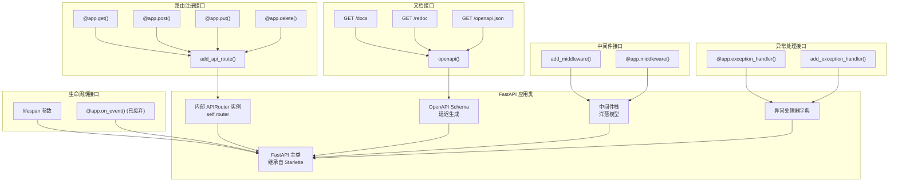
```mermaid
flowchart TB
    subgraph "FastAPI 应用类"
        FastAPIClass[FastAPI 主类<br/>继承自 Starlette]
        Router[内部 APIRouter 实例<br/>self.router]
        OpenAPISchema[OpenAPI Schema<br/>延迟生成]
        MiddlewareStack[中间件栈<br/>洋葱模型]
        ExceptionHandlers[异常处理器字典]
    end
    
    subgraph "路由注册接口"
        GetDecorator["@app.get()"]
        PostDecorator["@app.post()"]
        PutDecorator["@app.put()"]
        DeleteDecorator["@app.delete()"]
        APIRoute["add_api_route()"]
    end
    
    subgraph "中间件接口"
        AddMiddleware["add_middleware()"]
        MiddlewareDecorator["@app.middleware()"]
    end
    
    subgraph "文档接口"
        OpenAPIMethod["openapi()"]
        DocsURL["GET /docs"]
        RedocURL["GET /redoc"]
        OpenAPIURL["GET /openapi.json"]
    end
    
    subgraph "异常处理接口"
        ExceptionHandler["@app.exception_handler()"]
        AddExceptionHandler["add_exception_handler()"]
    end
    
    subgraph "生命周期接口"
        Lifespan["lifespan 参数"]
        OnEvent["@app.on_event() (已废弃)"]
    end
    
    GetDecorator --> APIRoute
    PostDecorator --> APIRoute
    PutDecorator --> APIRoute
    DeleteDecorator --> APIRoute
    APIRoute --> Router
    
    AddMiddleware --> MiddlewareStack
    MiddlewareDecorator --> MiddlewareStack
    
    OpenAPIMethod --> OpenAPISchema
    DocsURL --> OpenAPIMethod
    RedocURL --> OpenAPIMethod
    OpenAPIURL --> OpenAPIMethod
    
    ExceptionHandler --> ExceptionHandlers
    AddExceptionHandler --> ExceptionHandlers
    
    Lifespan --> FastAPIClass
    OnEvent --> FastAPIClass
    
    Router --> FastAPIClass
    OpenAPISchema --> FastAPIClass
    MiddlewareStack --> FastAPIClass
    ExceptionHandlers --> FastAPIClass
```

### 架构说明

#### FastAPI 类设计

**继承关系**：

- `FastAPI` 继承自 `Starlette`，复用 ASGI 应用基础能力
- 扩展了 Starlette 的功能，增加了自动文档生成、请求验证、依赖注入等特性

**核心属性**：

```python
class FastAPI(Starlette):
    # OpenAPI 相关
    title: str = "FastAPI"
    version: str = "0.1.0"
    openapi_version: str = "3.1.0"
    openapi_schema: Optional[Dict[str, Any]] = None
    
    # 路由相关
    router: APIRouter  # 内部路由器
    
    # 文档 URL
    docs_url: Optional[str] = "/docs"
    redoc_url: Optional[str] = "/redoc"
    openapi_url: Optional[str] = "/openapi.json"
    
    # 配置
    debug: bool = False
    separate_input_output_schemas: bool = True
```

**委托模式**：

- FastAPI 内部持有一个 `APIRouter` 实例（`self.router`）
- 大部分路由相关的操作委托给 `self.router` 处理
- FastAPI 本身专注于应用级配置和文档生成

#### 路由注册机制

**装饰器方式**（推荐）：

```python
@app.get("/items/{item_id}")
async def read_item(item_id: int):
    return {"item_id": item_id}
```

**方法调用方式**：

```python
app.add_api_route("/items/{item_id}", read_item, methods=["GET"])
```

**内部流程**：

1. 装饰器调用 `app.api_route()` 方法
2. `api_route()` 返回装饰器函数
3. 装饰器函数调用 `self.router.add_api_route()`
4. APIRouter 创建 `APIRoute` 对象并添加到路由列表

#### 中间件栈构建

**中间件顺序**（从外到内）：

1. **ServerErrorMiddleware**：捕获 500 错误
2. **用户自定义中间件**：通过 `app.add_middleware()` 添加
3. **ExceptionMiddleware**：捕获 HTTPException
4. **AsyncExitStackMiddleware**：管理异步上下文（依赖项清理）
5. **Router**：路由处理

**洋葱模型**：

```
请求 → 中间件1(前) → 中间件2(前) → ... → 路由处理 → ... → 中间件2(后) → 中间件1(后) → 响应
```

#### OpenAPI 文档生成

**延迟生成策略**：

- OpenAPI schema 不在应用初始化时生成
- 首次访问 `/docs`、`/redoc` 或 `/openapi.json` 时触发生成
- 生成后缓存在 `app.openapi_schema` 中

**生成流程**：

1. 调用 `app.openapi()` 方法
2. 检查 `self.openapi_schema` 是否已缓存
3. 如未缓存，调用 `get_openapi()` 函数
4. 遍历所有路由，提取参数、模型、响应信息
5. 生成符合 OpenAPI 3.1 规范的 JSON Schema
6. 缓存并返回

#### 异常处理机制

**内置异常处理器**：

- `HTTPException` → `http_exception_handler`
- `RequestValidationError` → `request_validation_exception_handler`
- `WebSocketRequestValidationError` → `websocket_request_validation_exception_handler`

**自定义异常处理器**：

```python
@app.exception_handler(CustomException)
async def custom_exception_handler(request, exc):
    return JSONResponse(
        status_code=500,
        content={"message": str(exc)}
    )
```

## 边界条件

### 并发处理
- **异步路由**：在事件循环中并发执行，单个路由内部可以 await 多个异步操作
- **同步路由**：在线程池中执行，默认线程池大小为 40
- **全局状态**：`app.state` 在并发请求间共享，需注意线程/协程安全

### 资源限制
- **路由数量**：无硬性限制，但过多路由会影响匹配性能（O(n) 复杂度）
- **中间件层数**：建议不超过 10 层，过多层级影响性能
- **OpenAPI Schema 大小**：大型 API（数百个端点）的 schema 可能达到几 MB

### 内存占用
- **应用实例**：每个 FastAPI 实例占用约 1-2 MB 基础内存
- **路由缓存**：每个路由的依赖树在启动时预解析并缓存
- **OpenAPI Schema**：生成后缓存在内存中

## 扩展点

### 自定义 OpenAPI 生成

```python
def custom_openapi():
    if app.openapi_schema:
        return app.openapi_schema
    
    openapi_schema = get_openapi(...)
    # 自定义修改 schema
    openapi_schema["info"]["x-logo"] = {"url": "..."}
    app.openapi_schema = openapi_schema
    return app.openapi_schema

app.openapi = custom_openapi
```

### 自定义文档 UI

```python
@app.get("/docs", include_in_schema=False)
async def custom_swagger_ui_html():
    return get_swagger_ui_html(
        openapi_url=app.openapi_url,
        title=app.title + " - Swagger UI",
        swagger_js_url="自定义 CDN URL",
        swagger_css_url="自定义 CSS URL",
    )
```

### 子应用挂载

```python
# 子应用
sub_app = FastAPI()

@sub_app.get("/hello")
async def sub_hello():
    return {"message": "Hello from sub app"}

# 挂载到主应用
app.mount("/sub", sub_app)

# 访问：GET /sub/hello
```

### 生命周期管理

```python
from contextlib import asynccontextmanager

@asynccontextmanager
async def lifespan(app: FastAPI):
    # 启动时执行
    db_pool = await create_db_pool()
    app.state.db_pool = db_pool
    
    yield
    
    # 关闭时执行
    await db_pool.close()

app = FastAPI(lifespan=lifespan)
```

## 性能要点

### 启动性能
- **依赖树预解析**：所有路由的依赖树在应用启动时预解析，减少运行时开销
- **OpenAPI 延迟生成**：文档在首次访问时生成，避免影响启动速度
- **中间件栈缓存**：中间件栈在首次请求时构建并缓存

### 运行时性能
- **路由匹配**：使用编译后的正则表达式，O(路由数量)
- **依赖缓存**：依赖项结果在同一请求中缓存，避免重复执行
- **响应序列化**：默认使用 `json.dumps`，可替换为 `orjson` 提升性能

### 内存优化
- **响应模型**：使用 `response_model_exclude_unset=True` 减少序列化数据量
- **流式响应**：对于大文件，使用 `StreamingResponse` 避免加载全部到内存
- **连接池**：数据库和 HTTP 客户端使用连接池，避免频繁创建连接

## 最佳实践

### 应用结构

```python
# 推荐的项目结构
# main.py
from fastapi import FastAPI
from .routers import users, items

app = FastAPI(
    title="My API",
    version="1.0.0",
    description="API description",
)

# 注册路由模块
app.include_router(users.router, prefix="/users", tags=["users"])
app.include_router(items.router, prefix="/items", tags=["items"])

# 全局中间件
@app.middleware("http")
async def add_request_id(request, call_next):
    request.state.request_id = generate_id()
    response = await call_next(request)
    response.headers["X-Request-ID"] = request.state.request_id
    return response

# 全局异常处理
@app.exception_handler(Exception)
async def global_exception_handler(request, exc):
    return JSONResponse(
        status_code=500,
        content={"detail": "Internal server error"}
    )
```

### 配置管理

```python
from pydantic_settings import BaseSettings

class Settings(BaseSettings):
    app_name: str = "My API"
    admin_email: str
    database_url: str
    
    class Config:
        env_file = ".env"

settings = Settings()

app = FastAPI(
    title=settings.app_name,
    contact={"email": settings.admin_email}
)
```

### 依赖注入

```python
# 将配置作为依赖注入
def get_settings():
    return settings

@app.get("/info")
async def info(settings: Settings = Depends(get_settings)):
    return {"app_name": settings.app_name}
```

### 文档优化

```python
# 为 OpenAPI 添加标签元数据
tags_metadata = [
    {
        "name": "users",
        "description": "Operations with users.",
    },
    {
        "name": "items",
        "description": "Manage items.",
    },
]

app = FastAPI(openapi_tags=tags_metadata)
```

## 与其他模块的关系

### 与 routing 模块
- FastAPI 内部持有 APIRouter 实例
- 所有路由注册操作委托给 APIRouter
- FastAPI 负责应用级配置，APIRouter 负责路由管理

### 与 openapi 模块
- FastAPI 调用 `openapi.utils.get_openapi()` 生成文档
- FastAPI 提供文档 UI 路由（`/docs`、`/redoc`）
- 文档 URL 可自定义或禁用

### 与 middleware 模块
- FastAPI 注册中间件到 Starlette 的中间件栈
- 添加了 `AsyncExitStackMiddleware` 用于依赖清理
- 中间件按注册顺序反向执行（洋葱模型）

### 与 dependencies 模块
- FastAPI 不直接处理依赖注入
- 依赖注入由 APIRoute 在请求处理时执行
- FastAPI 通过 `dependencies` 参数支持应用级依赖

### 与 exceptions 模块
- FastAPI 注册默认异常处理器
- 支持自定义异常处理器
- 异常处理在 ExceptionMiddleware 中进行

## 常见问题

### Q: FastAPI 和 Starlette 的关系？
A: FastAPI 继承自 Starlette，在其基础上增加了：

- 自动请求验证（基于 Pydantic）
- 自动 OpenAPI 文档生成
- 依赖注入系统
- 更简洁的路由装饰器

### Q: 为什么需要 AsyncExitStackMiddleware？
A: 用于管理依赖项的异步上下文（yield）。当依赖项使用 `yield` 时，需要在请求结束后执行清理逻辑（如关闭数据库连接），这个中间件负责管理这些上下文。

### Q: OpenAPI schema 什么时候生成？
A: 延迟生成。首次访问 `/docs`、`/redoc` 或 `/openapi.json` 时生成，之后缓存在 `app.openapi_schema` 中。可以通过修改 `app.openapi()` 方法自定义生成逻辑。

### Q: 如何禁用自动文档？
A:

```python
app = FastAPI(
    docs_url=None,    # 禁用 Swagger UI
    redoc_url=None,   # 禁用 ReDoc
    openapi_url=None, # 禁用 OpenAPI JSON
)
```

### Q: 多个 FastAPI 实例如何共享状态？
A: 不推荐多个实例共享状态。如需共享，使用外部存储（Redis、数据库）或全局变量（注意线程安全）。

### Q: 如何实现 API 版本控制？
A:

```python
# 方式 1：路由前缀
app.include_router(v1_router, prefix="/api/v1")
app.include_router(v2_router, prefix="/api/v2")

# 方式 2：子应用
v1_app = FastAPI()
v2_app = FastAPI()
app.mount("/api/v1", v1_app)
app.mount("/api/v2", v2_app)
```

---

## API接口

## 模块对外 API 总览

`applications.py` 模块对外提供的核心 API 是 `FastAPI` 类及其方法。主要包括：

### 应用创建与配置
- `FastAPI.__init__()` - 创建 FastAPI 应用实例
- `FastAPI.setup()` - 设置文档路由

### 路由注册（HTTP 方法）
- `FastAPI.get()` - 注册 GET 路由
- `FastAPI.post()` - 注册 POST 路由
- `FastAPI.put()` - 注册 PUT 路由
- `FastAPI.delete()` - 注册 DELETE 路由
- `FastAPI.patch()` - 注册 PATCH 路由
- `FastAPI.options()` - 注册 OPTIONS 路由
- `FastAPI.head()` - 注册 HEAD 路由
- `FastAPI.trace()` - 注册 TRACE 路由

### 路由注册（通用）
- `FastAPI.api_route()` - 通用路由注册装饰器
- `FastAPI.add_api_route()` - 添加API路由（方法调用方式）
- `FastAPI.add_api_websocket_route()` - 添加 WebSocket 路由
- `FastAPI.websocket()` - 注册 WebSocket 路由装饰器
- `FastAPI.include_router()` - 包含 APIRouter

### 中间件管理
- `FastAPI.add_middleware()` - 添加中间件
- `FastAPI.middleware()` - 中间件装饰器
- `FastAPI.build_middleware_stack()` - 构建中间件栈

### 异常处理
- `FastAPI.exception_handler()` - 异常处理装饰器
- `FastAPI.add_exception_handler()` - 添加异常处理器

### OpenAPI 文档
- `FastAPI.openapi()` - 生成 OpenAPI schema
- `FastAPI.setup()` - 设置文档路由

### 生命周期管理
- `FastAPI.on_event()` - 生命周期事件装饰器（已废弃）
- `lifespan` 参数 - 生命周期上下文管理器（推荐）

---

## API 详细规格

## 1. FastAPI.__init__() - 应用初始化

### 基本信息
- **名称**：`FastAPI.__init__()`
- **类型**：构造方法
- **用途**：创建 FastAPI 应用实例并进行初始化配置

### 请求结构体（初始化参数）

```python
def __init__(
    self,
    *,
    debug: bool = False,
    routes: Optional[List[BaseRoute]] = None,
    title: str = "FastAPI",
    summary: Optional[str] = None,
    description: str = "",
    version: str = "0.1.0",
    openapi_url: Optional[str] = "/openapi.json",
    openapi_tags: Optional[List[Dict[str, Any]]] = None,
    servers: Optional[List[Dict[str, Union[str, Any]]]] = None,
    dependencies: Optional[Sequence[Depends]] = None,
    default_response_class: Type[Response] = Default(JSONResponse),
    docs_url: Optional[str] = "/docs",
    redoc_url: Optional[str] = "/redoc",
    swagger_ui_oauth2_redirect_url: Optional[str] = "/docs/oauth2-redirect",
    swagger_ui_init_oauth: Optional[Dict[str, Any]] = None,
    middleware: Optional[Sequence[Middleware]] = None,
    exception_handlers: Optional[Dict[Union[int, Type[Exception]], Callable]] = None,
    on_startup: Optional[Sequence[Callable[[], Any]]] = None,
    on_shutdown: Optional[Sequence[Callable[[], Any]]] = None,
    lifespan: Optional[Lifespan[AppType]] = None,
    terms_of_service: Optional[str] = None,
    contact: Optional[Dict[str, Union[str, Any]]] = None,
    license_info: Optional[Dict[str, Union[str, Any]]] = None,
    openapi_prefix: str = "",
    root_path: str = "",
    root_path_in_servers: bool = True,
    responses: Optional[Dict[Union[int, str], Dict[str, Any]]] = None,
    callbacks: Optional[List[BaseRoute]] = None,
    webhooks: Optional[routing.APIRouter] = None,
    deprecated: Optional[bool] = None,
    include_in_schema: bool = True,
    swagger_ui_parameters: Optional[Dict[str, Any]] = None,
    generate_unique_id_function: Callable[[routing.APIRoute], str] = Default(generate_unique_id),
    separate_input_output_schemas: bool = True,
) -> None:
```

### 参数详细说明

| 参数 | 类型 | 必填 | 默认值 | 说明 |
|------|------|------|--------|------|
| debug | bool | 否 | False | 是否启用调试模式，启用后会返回详细的错误堆栈 |
| routes | List[BaseRoute] | 否 | None | 预定义的路由列表（不推荐使用，应使用装饰器） |
| title | str | 否 | "FastAPI" | API 标题，显示在 OpenAPI 文档中 |
| summary | str | 否 | None | API 简短摘要 |
| description | str | 否 | "" | API 详细描述，支持 Markdown |
| version | str | 否 | "0.1.0" | API 版本号 |
| openapi_url | str | 否 | "/openapi.json" | OpenAPI JSON 文档的 URL，设为 None 可禁用 |
| openapi_tags | List[Dict] | 否 | None | OpenAPI 标签元数据 |
| servers | List[Dict] | 否 | None | API 服务器列表 |
| dependencies | Sequence[Depends] | 否 | None | 全局依赖项，应用于所有路由 |
| default_response_class | Type[Response] | 否 | JSONResponse | 默认响应类 |
| docs_url | str | 否 | "/docs" | Swagger UI 文档 URL，设为 None 可禁用 |
| redoc_url | str | 否 | "/redoc" | ReDoc 文档 URL，设为 None 可禁用 |
| swagger_ui_oauth2_redirect_url | str | 否 | "/docs/oauth2-redirect" | OAuth2 重定向 URL |
| swagger_ui_init_oauth | Dict | 否 | None | Swagger UI OAuth2 初始化参数 |
| middleware | Sequence[Middleware] | 否 | None | 预定义的中间件列表 |
| exception_handlers | Dict | 否 | None | 异常处理器字典 |
| on_startup | Sequence[Callable] | 否 | None | 启动事件处理器列表（已废弃） |
| on_shutdown | Sequence[Callable] | 否 | None | 关闭事件处理器列表（已废弃） |
| lifespan | Lifespan | 否 | None | 生命周期上下文管理器（推荐） |
| terms_of_service | str | 否 | None | 服务条款 URL |
| contact | Dict | 否 | None | 联系信息（name, url, email） |
| license_info | Dict | 否 | None | 许可证信息（name, url） |
| root_path | str | 否 | "" | 应用的根路径前缀 |
| root_path_in_servers | bool | 否 | True | 是否在 servers 列表中包含 root_path |
| responses | Dict | 否 | None | 全局响应定义 |
| callbacks | List[BaseRoute] | 否 | None | API 回调定义 |
| webhooks | APIRouter | 否 | None | Webhook 路由 |
| deprecated | bool | 否 | None | 是否标记整个 API 为废弃 |
| include_in_schema | bool | 否 | True | 是否包含在 OpenAPI schema 中 |
| swagger_ui_parameters | Dict | 否 | None | 自定义 Swagger UI 参数 |
| generate_unique_id_function | Callable | 否 | generate_unique_id | 生成唯一 operation ID 的函数 |
| separate_input_output_schemas | bool | 否 | True | 是否分离输入输出 schema（OpenAPI 3.1+） |

### 核心代码与逻辑

```python
def __init__(self, ...):
    # 初始化父类 Starlette
    super().__init__(
        debug=debug,
        routes=routes or [],
        middleware=middleware,
        exception_handlers=exception_handlers,
        on_startup=on_startup,
        on_shutdown=on_shutdown,
        lifespan=lifespan,
    )
    
    # 存储 OpenAPI 相关配置
    self.title = title
    self.summary = summary
    self.description = description
    self.version = version
    self.openapi_version = "3.1.0"
    self.terms_of_service = terms_of_service
    self.contact = contact
    self.license_info = license_info
    
    # 文档 URL 配置
    self.openapi_url = openapi_url
    self.docs_url = docs_url
    self.redoc_url = redoc_url
    self.swagger_ui_oauth2_redirect_url = swagger_ui_oauth2_redirect_url
    self.swagger_ui_init_oauth = swagger_ui_init_oauth
    self.swagger_ui_parameters = swagger_ui_parameters
    
    # 创建内部 APIRouter
    self.router: routing.APIRouter = routing.APIRouter(
        routes=routes or [],
        redirect_slashes=redirect_slashes,
        dependency_overrides_provider=self,
        on_startup=on_startup or [],
        on_shutdown=on_shutdown or [],
        lifespan=lifespan,
        default_response_class=default_response_class,
        dependencies=dependencies,
        callbacks=callbacks,
        deprecated=deprecated,
        include_in_schema=include_in_schema,
        responses=responses,
        generate_unique_id_function=generate_unique_id_function,
    )
    
    # Webhooks 路由
    self.webhooks = webhooks or routing.APIRouter()
    
    # 初始化 OpenAPI schema（延迟生成）
    self.openapi_schema: Optional[Dict[str, Any]] = None
    
    # 注册默认异常处理器
    self.add_exception_handler(HTTPException, http_exception_handler)
    self.add_exception_handler(
        RequestValidationError, request_validation_exception_handler
    )
    self.add_exception_handler(
        WebSocketRequestValidationError,
        websocket_request_validation_exception_handler,
    )
    
    # 设置文档路由
    self.setup()
```

**逻辑说明**：

1. **继承初始化**：调用父类 `Starlette.__init__()`，传递基础配置（debug、routes、middleware 等）

2. **存储 OpenAPI 配置**：保存所有与 OpenAPI 文档相关的配置参数，这些参数在生成文档时使用

3. **创建内部路由器**：创建 `APIRouter` 实例作为 `self.router`，所有路由注册操作委托给这个路由器

4. **初始化 Webhooks**：创建独立的 Webhooks 路由器，用于定义 API 回调

5. **延迟 OpenAPI 生成**：`self.openapi_schema` 初始化为 `None`，在首次访问文档时才生成

6. **注册默认异常处理器**：
   - `HTTPException` → 返回 JSON 格式的错误响应
   - `RequestValidationError` → 返回 422 验证错误，包含详细错误信息
   - `WebSocketRequestValidationError` → WebSocket 验证错误处理

7. **设置文档路由**：调用 `self.setup()` 注册文档相关的路由（`/docs`、`/redoc`、`/openapi.json`）

### 使用示例

```python
from fastapi import FastAPI

# 基础使用
app = FastAPI()

# 完整配置
app = FastAPI(
    title="我的 API",
    description="这是一个示例 API",
    version="1.0.0",
    openapi_url="/api/v1/openapi.json",
    docs_url="/api/v1/docs",
    redoc_url="/api/v1/redoc",
    contact={
        "name": "API Support",
        "url": "https://example.com/support",
        "email": "support@example.com",
    },
    license_info={
        "name": "Apache 2.0",
        "url": "https://www.apache.org/licenses/LICENSE-2.0.html",
    },
)

# 禁用文档
app_no_docs = FastAPI(
    docs_url=None,
    redoc_url=None,
    openapi_url=None,
)

# 使用生命周期管理器
from contextlib import asynccontextmanager

@asynccontextmanager
async def lifespan(app: FastAPI):
    # 启动时执行
    print("Application startup")
    yield
    # 关闭时执行
    print("Application shutdown")

app_with_lifespan = FastAPI(lifespan=lifespan)
```

---

## 2. FastAPI.get() / post() / put() / delete() 等 - HTTP 路由装饰器

### 基本信息
- **名称**：`FastAPI.get()` / `post()` / `put()` / `delete()` / `patch()` / `options()` / `head()` / `trace()`
- **类型**：装饰器方法
- **用途**：注册特定 HTTP 方法的路由处理函数

### 请求结构体（参数）

```python
def get(
    self,
    path: str,
    *,
    response_model: Any = Default(None),
    status_code: Optional[int] = None,
    tags: Optional[List[Union[str, Enum]]] = None,
    dependencies: Optional[Sequence[Depends]] = None,
    summary: Optional[str] = None,
    description: Optional[str] = None,
    response_description: str = "Successful Response",
    responses: Optional[Dict[Union[int, str], Dict[str, Any]]] = None,
    deprecated: Optional[bool] = None,
    operation_id: Optional[str] = None,
    response_model_include: Optional[IncEx] = None,
    response_model_exclude: Optional[IncEx] = None,
    response_model_by_alias: bool = True,
    response_model_exclude_unset: bool = False,
    response_model_exclude_defaults: bool = False,
    response_model_exclude_none: bool = False,
    include_in_schema: bool = True,
    response_class: Type[Response] = Default(JSONResponse),
    name: Optional[str] = None,
    openapi_extra: Optional[Dict[str, Any]] = None,
    generate_unique_id_function: Callable[[routing.APIRoute], str] = Default(generate_unique_id),
) -> Callable[[DecoratedCallable], DecoratedCallable]:
```

### 参数详细说明

| 参数 | 类型 | 必填 | 默认值 | 说明 |
|------|------|------|--------|------|
| path | str | 是 | - | URL 路径，支持路径参数（如 `/items/{item_id}`） |
| response_model | Any | 否 | None | 响应数据模型，用于序列化和文档生成 |
| status_code | int | 否 | None | 默认响应状态码（GET: 200, POST: 201） |
| tags | List[str/Enum] | 否 | None | OpenAPI 标签，用于文档分组 |
| dependencies | Sequence[Depends] | 否 | None | 路由级依赖项 |
| summary | str | 否 | None | 路由摘要，显示在文档中 |
| description | str | 否 | None | 路由详细描述，支持 Markdown |
| response_description | str | 否 | "Successful Response" | 成功响应的描述 |
| responses | Dict | 否 | None | 额外的响应定义（不同状态码） |
| deprecated | bool | 否 | None | 是否标记为废弃 |
| operation_id | str | 否 | None | OpenAPI operation ID，默认自动生成 |
| response_model_include | IncEx | 否 | None | 响应模型包含的字段 |
| response_model_exclude | IncEx | 否 | None | 响应模型排除的字段 |
| response_model_by_alias | bool | 否 | True | 是否使用字段别名 |
| response_model_exclude_unset | bool | 否 | False | 是否排除未设置的字段 |
| response_model_exclude_defaults | bool | 否 | False | 是否排除默认值字段 |
| response_model_exclude_none | bool | 否 | False | 是否排除 None 值字段 |
| include_in_schema | bool | 否 | True | 是否包含在 OpenAPI schema 中 |
| response_class | Type[Response] | 否 | JSONResponse | 响应类（JSONResponse、HTMLResponse 等） |
| name | str | 否 | None | 路由名称，用于 URL 反向解析 |
| openapi_extra | Dict | 否 | None | 额外的 OpenAPI 属性 |
| generate_unique_id_function | Callable | 否 | generate_unique_id | 生成唯一 ID 的函数 |

### 核心代码与逻辑

```python
def get(self, path: str, **kwargs) -> Callable:
    # 调用通用的 api_route 方法，指定 methods=["GET"]
    return self.api_route(path, methods=["GET"], **kwargs)

def post(self, path: str, **kwargs) -> Callable:
    # 调用通用的 api_route 方法，指定 methods=["POST"]
    return self.api_route(path, methods=["POST"], **kwargs)

def api_route(self, path: str, *, methods: Optional[List[str]] = None, **kwargs) -> Callable:
    def decorator(func: DecoratedCallable) -> DecoratedCallable:
        # 委托给内部路由器处理
        self.router.add_api_route(
            path,
            func,
            methods=methods,
            **kwargs
        )
        # 返回原函数，保持装饰器透明性
        return func
    
    return decorator
```

**逻辑说明**：

1. **HTTP 方法路由**：`get()`、`post()` 等方法都是 `api_route()` 的便捷封装，预设了 `methods` 参数

2. **装饰器模式**：返回一个装饰器函数，该装饰器：
   - 接收被装饰的函数
   - 调用 `self.router.add_api_route()` 注册路由
   - 返回原函数（保持函数不变，仅注册路由）

3. **委托给路由器**：实际的路由注册逻辑在 `APIRouter.add_api_route()` 中实现

4. **参数传递**：所有路由配置参数（response_model、dependencies 等）通过 `**kwargs` 传递给路由器

### 使用示例

```python
from fastapi import FastAPI, Path, Query
from pydantic import BaseModel
from typing import List

app = FastAPI()

# 基础 GET 路由
@app.get("/")
async def root():
    return {"message": "Hello World"}

# 带路径参数的 GET 路由
@app.get("/items/{item_id}")
async def read_item(item_id: int):
    return {"item_id": item_id}

# 带查询参数的 GET 路由
@app.get("/items/")
async def list_items(skip: int = 0, limit: int = 10):
    return {"skip": skip, "limit": limit}

# POST 路由带请求体
class Item(BaseModel):
    name: str
    price: float

@app.post("/items/", response_model=Item, status_code=201)
async def create_item(item: Item):
    return item

# 带响应模型和文档的 GET 路由
@app.get(
    "/items/{item_id}",
    response_model=Item,
    tags=["items"],
    summary="Get an item",
    description="Retrieve an item by its ID",
    response_description="The requested item",
)
async def read_item_detailed(
    item_id: int = Path(..., description="The ID of the item to get")
):
    return {"name": "Item", "price": 10.5}

# PUT 路由
@app.put("/items/{item_id}")
async def update_item(item_id: int, item: Item):
    return {"item_id": item_id, **item.dict()}

# DELETE 路由
@app.delete("/items/{item_id}", status_code=204)
async def delete_item(item_id: int):
    # 返回 204 No Content
    return None

# 排除未设置字段的响应
@app.get("/items/", response_model=List[Item], response_model_exclude_unset=True)
async def list_items_optimized():
    return [{"name": "Item 1"}, {"name": "Item 2", "price": 20.0}]
```

### 时序图

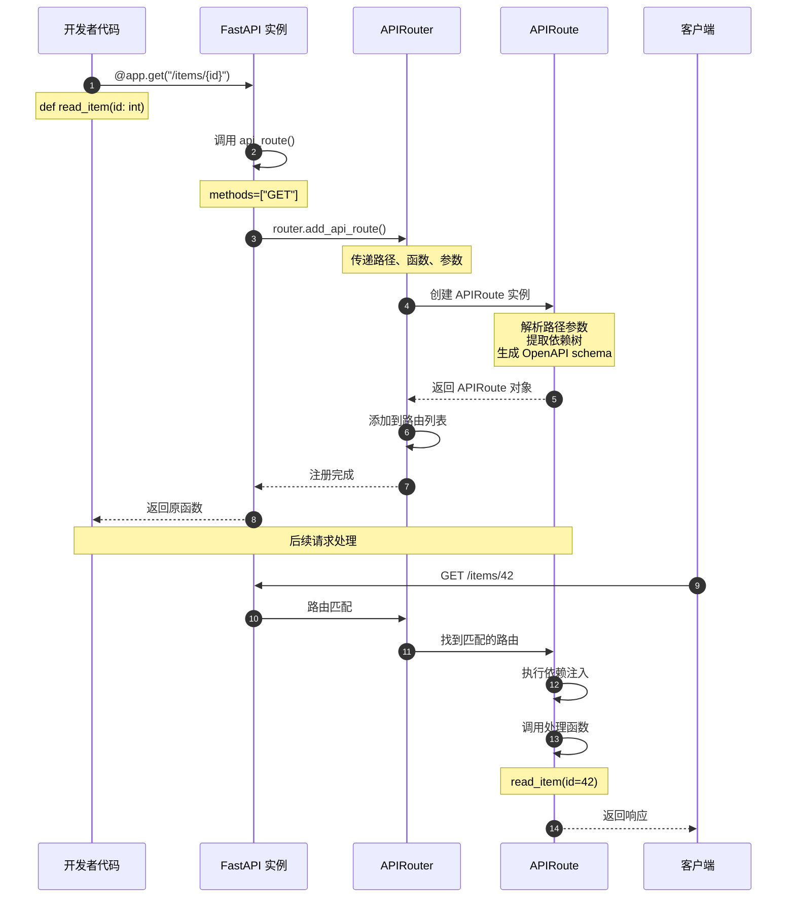
```mermaid
sequenceDiagram
    autonumber
    participant Dev as 开发者代码
    participant App as FastAPI 实例
    participant Router as APIRouter
    participant Route as APIRoute
    
    Dev->>App: @app.get("/items/{id}")
    Note over Dev: def read_item(id: int)
    
    App->>App: 调用 api_route()
    Note over App: methods=["GET"]
    
    App->>Router: router.add_api_route()
    Note over Router: 传递路径、函数、参数
    
    Router->>Route: 创建 APIRoute 实例
    Note over Route: 解析路径参数<br/>提取依赖树<br/>生成 OpenAPI schema
    
    Route-->>Router: 返回 APIRoute 对象
    Router->>Router: 添加到路由列表
    Router-->>App: 注册完成
    App-->>Dev: 返回原函数
    
    Note over Dev,Route: 后续请求处理
    
    participant Client as 客户端
    Client->>App: GET /items/42
    App->>Router: 路由匹配
    Router->>Route: 找到匹配的路由
    Route->>Route: 执行依赖注入
    Route->>Route: 调用处理函数
    Note over Route: read_item(id=42)
    Route-->>Client: 返回响应
```

### 时序图说明

**注册阶段（步骤 1-9）**：

1. 开发者使用 `@app.get()` 装饰器
2. FastAPI 调用 `api_route()` 方法，设置 `methods=["GET"]`
3. `api_route()` 返回装饰器函数
4. 装饰器函数调用 `router.add_api_route()`
5. APIRouter 创建 `APIRoute` 实例：
   - 编译路径正则表达式
   - 解析依赖树
   - 生成 OpenAPI schema
6. APIRoute 对象添加到路由列表
7. 返回原函数给开发者

**请求处理阶段（步骤 10-15）**：

1. 客户端发送 GET 请求
2. FastAPI 接收请求并委托给 Router
3. Router 遍历路由列表，使用正则匹配路径
4. 找到匹配的 APIRoute 对象
5. APIRoute 执行依赖注入、参数提取、数据验证
6. 调用处理函数并返回响应

---

## 3. FastAPI.include_router() - 包含路由模块

### 基本信息
- **名称**：`FastAPI.include_router()`
- **类型**：方法
- **用途**：将 `APIRouter` 实例包含到 FastAPI 应用中，用于模块化路由管理

### 请求结构体（参数）

```python
def include_router(
    self,
    router: routing.APIRouter,
    *,
    prefix: str = "",
    tags: Optional[List[Union[str, Enum]]] = None,
    dependencies: Optional[Sequence[Depends]] = None,
    responses: Optional[Dict[Union[int, str], Dict[str, Any]]] = None,
    deprecated: Optional[bool] = None,
    include_in_schema: bool = True,
    default_response_class: Type[Response] = Default(JSONResponse),
    callbacks: Optional[List[BaseRoute]] = None,
    generate_unique_id_function: Callable[[routing.APIRoute], str] = Default(generate_unique_id),
) -> None:
```

### 参数详细说明

| 参数 | 类型 | 必填 | 默认值 | 说明 |
|------|------|------|--------|------|
| router | APIRouter | 是 | - | 要包含的 APIRouter 实例 |
| prefix | str | 否 | "" | URL 路径前缀（如 `/api/v1`） |
| tags | List[str/Enum] | 否 | None | 为该路由器的所有路由添加标签 |
| dependencies | Sequence[Depends] | 否 | None | 为该路由器的所有路由添加依赖项 |
| responses | Dict | 否 | None | 为该路由器的所有路由添加响应定义 |
| deprecated | bool | 否 | None | 标记该路由器的所有路由为废弃 |
| include_in_schema | bool | 否 | True | 是否包含在 OpenAPI schema 中 |
| default_response_class | Type[Response] | 否 | JSONResponse | 默认响应类 |
| callbacks | List[BaseRoute] | 否 | None | API 回调定义 |
| generate_unique_id_function | Callable | 否 | generate_unique_id | 生成唯一 ID 的函数 |

### 核心代码与逻辑

```python
def include_router(
    self,
    router: routing.APIRouter,
    *,
    prefix: str = "",
    tags: Optional[List[Union[str, Enum]]] = None,
    dependencies: Optional[Sequence[Depends]] = None,
    **kwargs
) -> None:
    # 直接委托给内部路由器
    self.router.include_router(
        router,
        prefix=prefix,
        tags=tags,
        dependencies=dependencies,
        **kwargs
    )
```

**逻辑说明**：

1. **委托模式**：FastAPI 的 `include_router()` 直接委托给 `self.router.include_router()`

2. **路径前缀**：`prefix` 参数会添加到路由器中所有路由的路径前面

3. **标签继承**：`tags` 参数会添加到路由器中所有路由的标签列表

4. **依赖项继承**：`dependencies` 参数会添加到路由器中所有路由的依赖项列表

5. **级联配置**：子路由器的配置会与主应用的配置合并

### 使用示例

```python
from fastapi import FastAPI, APIRouter, Depends

app = FastAPI()

# 用户模块路由
users_router = APIRouter()

@users_router.get("/")
async def list_users():
    return [{"id": 1, "name": "User 1"}]

@users_router.get("/{user_id}")
async def get_user(user_id: int):
    return {"id": user_id, "name": f"User {user_id}"}

@users_router.post("/")
async def create_user(user: dict):
    return user

# 商品模块路由
items_router = APIRouter()

@items_router.get("/")
async def list_items():
    return [{"id": 1, "name": "Item 1"}]

@items_router.get("/{item_id}")
async def get_item(item_id: int):
    return {"id": item_id, "name": f"Item {item_id}"}

# 包含路由模块
app.include_router(
    users_router,
    prefix="/users",
    tags=["users"],
)

app.include_router(
    items_router,
    prefix="/items",
    tags=["items"],
)

# 现在可以访问:
# GET /users/       -> list_users()
# GET /users/1      -> get_user(1)
# POST /users/      -> create_user()
# GET /items/       -> list_items()
# GET /items/1      -> get_item(1)

# 带依赖项的路由包含
async def verify_token(token: str = Header(...)):
    if token != "secret":
        raise HTTPException(401, "Invalid token")
    return token

admin_router = APIRouter()

@admin_router.get("/dashboard")
async def admin_dashboard():
    return {"message": "Admin dashboard"}

app.include_router(
    admin_router,
    prefix="/admin",
    tags=["admin"],
    dependencies=[Depends(verify_token)],  # 所有 admin 路由都需要 token
)
```

### 时序图

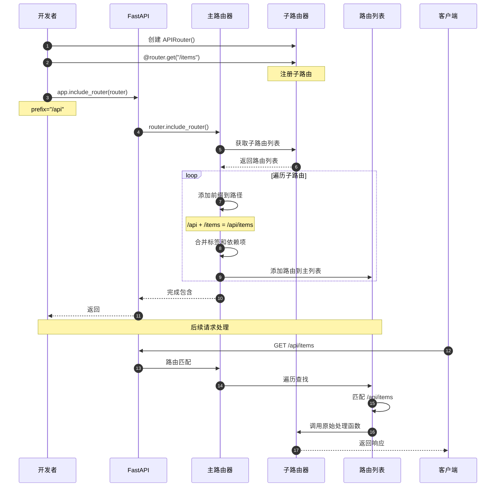
```mermaid
sequenceDiagram
    autonumber
    participant Dev as 开发者
    participant App as FastAPI
    participant MainRouter as 主路由器
    participant SubRouter as 子路由器
    participant Routes as 路由列表
    
    Dev->>SubRouter: 创建 APIRouter()
    Dev->>SubRouter: @router.get("/items")
    Note over SubRouter: 注册子路由
    
    Dev->>App: app.include_router(router)
    Note over Dev: prefix="/api"
    
    App->>MainRouter: router.include_router()
    MainRouter->>SubRouter: 获取子路由列表
    SubRouter-->>MainRouter: 返回路由列表
    
    loop 遍历子路由
        MainRouter->>MainRouter: 添加前缀到路径
        Note over MainRouter: /api + /items = /api/items
        MainRouter->>MainRouter: 合并标签和依赖项
        MainRouter->>Routes: 添加路由到主列表
    end
    
    MainRouter-->>App: 完成包含
    App-->>Dev: 返回
    
    Note over Dev,Routes: 后续请求处理
    
    participant Client as 客户端
    Client->>App: GET /api/items
    App->>MainRouter: 路由匹配
    MainRouter->>Routes: 遍历查找
    Routes->>Routes: 匹配 /api/items
    Routes->>SubRouter: 调用原始处理函数
    SubRouter-->>Client: 返回响应
```

---

## 4. FastAPI.middleware() - 中间件装饰器

### 基本信息
- **名称**：`FastAPI.middleware()`
- **类型**：装饰器方法
- **用途**：注册 HTTP 中间件，用于处理所有请求和响应

### 请求结构体（参数）

```python
def middleware(
    self,
    middleware_type: str,
) -> Callable[[DecoratedCallable], DecoratedCallable]:
```

### 参数详细说明

| 参数 | 类型 | 必填 | 默认值 | 说明 |
|------|------|------|--------|------|
| middleware_type | str | 是 | - | 中间件类型，目前仅支持 "http" |

### 核心代码与逻辑

```python
def middleware(self, middleware_type: str) -> Callable:
    def decorator(func: DecoratedCallable) -> DecoratedCallable:
        # 使用 BaseHTTPMiddleware 包装函数
        self.add_middleware(BaseHTTPMiddleware, dispatch=func)
        return func
    
    return decorator
```

**逻辑说明**：

1. **装饰器模式**：返回装饰器函数，接收中间件处理函数

2. **BaseHTTPMiddleware 包装**：将函数包装为 `BaseHTTPMiddleware` 实例

3. **dispatch 参数**：中间件函数作为 `dispatch` 参数传递给 `BaseHTTPMiddleware`

4. **中间件签名**：中间件函数必须接收 `(request, call_next)` 参数

5. **洋葱模型**：中间件按注册顺序反向执行（后注册的先执行 before 部分）

### 使用示例

```python
import time
from fastapi import FastAPI, Request

app = FastAPI()

# 添加处理时间中间件
@app.middleware("http")
async def add_process_time_header(request: Request, call_next):
    start_time = time.time()
    response = await call_next(request)
    process_time = time.time() - start_time
    response.headers["X-Process-Time"] = str(process_time)
    return response

# 添加请求日志中间件
@app.middleware("http")
async def log_requests(request: Request, call_next):
    print(f"收到请求: {request.method} {request.url}")
    response = await call_next(request)
    print(f"返回响应: {response.status_code}")
    return response

# 添加认证中间件
@app.middleware("http")
async def auth_middleware(request: Request, call_next):
    if request.url.path.startswith("/admin"):
        token = request.headers.get("Authorization")
        if not token or token != "Bearer secret":
            return JSONResponse(
                status_code=401,
                content={"detail": "Unauthorized"}
            )
    response = await call_next(request)
    return response

@app.get("/")
async def root():
    return {"message": "Hello World"}

@app.get("/admin/dashboard")
async def admin_dashboard():
    return {"message": "Admin Dashboard"}
```

### 时序图

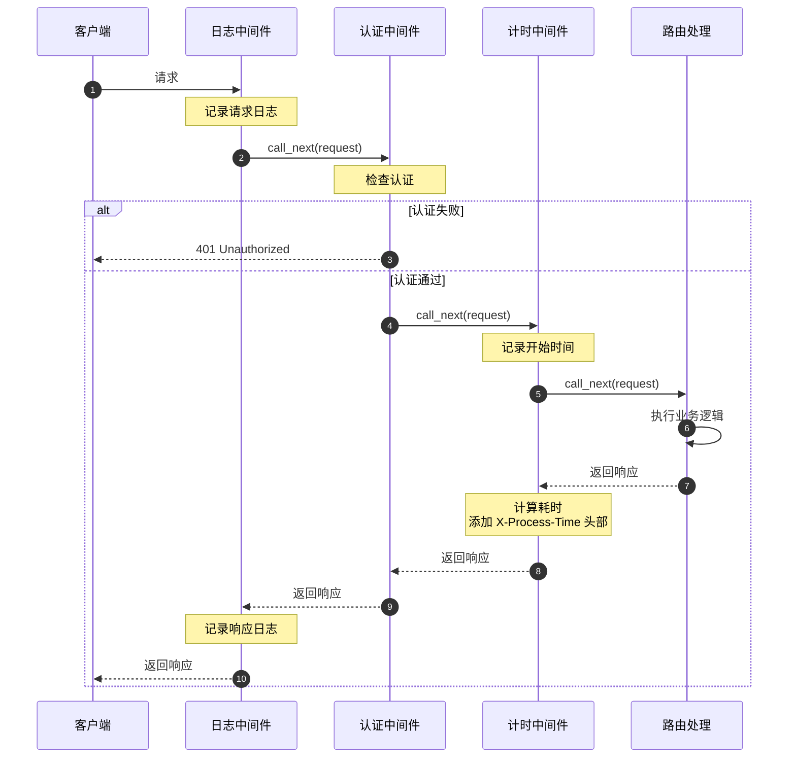
```mermaid
sequenceDiagram
    autonumber
    participant Client as 客户端
    participant MW1 as 日志中间件
    participant MW2 as 认证中间件
    participant MW3 as 计时中间件
    participant Route as 路由处理
    
    Client->>MW1: 请求
    Note over MW1: 记录请求日志
    MW1->>MW2: call_next(request)
    
    Note over MW2: 检查认证
    alt 认证失败
        MW2-->>Client: 401 Unauthorized
    else 认证通过
        MW2->>MW3: call_next(request)
        Note over MW3: 记录开始时间
        MW3->>Route: call_next(request)
        
        Route->>Route: 执行业务逻辑
        Route-->>MW3: 返回响应
        
        Note over MW3: 计算耗时<br/>添加 X-Process-Time 头部
        MW3-->>MW2: 返回响应
        MW2-->>MW1: 返回响应
        
        Note over MW1: 记录响应日志
        MW1-->>Client: 返回响应
    end
```

### 中间件执行顺序说明

**注册顺序**：

```python
@app.middleware("http")  # 第1个注册
async def middleware_1(request, call_next):
    ...

@app.middleware("http")  # 第2个注册
async def middleware_2(request, call_next):
    ...

@app.middleware("http")  # 第3个注册
async def middleware_3(request, call_next):
    ...
```

**执行顺序（洋葱模型）**：

```
请求 → middleware_3 (before) → middleware_2 (before) → middleware_1 (before)
     → 路由处理
     → middleware_1 (after) → middleware_2 (after) → middleware_3 (after) → 响应
```

---

## 5. FastAPI.exception_handler() - 异常处理装饰器

### 基本信息
- **名称**：`FastAPI.exception_handler()`
- **类型**：装饰器方法
- **用途**：注册全局异常处理器，捕获特定异常并返回自定义响应

### 请求结构体（参数）

```python
def exception_handler(
    self,
    exc_class_or_status_code: Union[int, Type[Exception]],
) -> Callable[[DecoratedCallable], DecoratedCallable]:
```

### 参数详细说明

| 参数 | 类型 | 必填 | 默认值 | 说明 |
|------|------|------|--------|------|
| exc_class_or_status_code | Union[int, Type[Exception]] | 是 | - | 异常类或 HTTP 状态码 |

### 核心代码与逻辑

```python
def exception_handler(
    self,
    exc_class_or_status_code: Union[int, Type[Exception]],
) -> Callable:
    def decorator(func: DecoratedCallable) -> DecoratedCallable:
        # 注册异常处理器
        self.add_exception_handler(exc_class_or_status_code, func)
        return func
    
    return decorator
```

**逻辑说明**：

1. **装饰器模式**：返回装饰器函数，接收异常处理函数

2. **异常匹配**：
   - **异常类**：匹配该类及其子类的异常
   - **状态码**：匹配该状态码的 HTTPException

3. **处理器签名**：异常处理函数必须接收 `(request, exc)` 参数

4. **优先级**：精确匹配的处理器优先于基类处理器

### 使用示例

```python
from fastapi import FastAPI, Request, HTTPException
from fastapi.responses import JSONResponse

app = FastAPI()

# 自定义异常
class CustomException(Exception):
    def __init__(self, message: str):
        self.message = message

# 注册自定义异常处理器
@app.exception_handler(CustomException)
async def custom_exception_handler(request: Request, exc: CustomException):
    return JSONResponse(
        status_code=500,
        content={"detail": exc.message}
    )

# 注册特定状态码处理器
@app.exception_handler(404)
async def not_found_handler(request: Request, exc: HTTPException):
    return JSONResponse(
        status_code=404,
        content={"detail": f"Resource not found: {request.url.path}"}
    )

# 全局异常处理器（捕获所有未处理异常）
@app.exception_handler(Exception)
async def global_exception_handler(request: Request, exc: Exception):
    return JSONResponse(
        status_code=500,
        content={"detail": "Internal server error"}
    )

# 使用异常
@app.get("/custom-error")
async def trigger_custom_error():
    raise CustomException("This is a custom error")

@app.get("/not-found")
async def trigger_not_found():
    raise HTTPException(status_code=404, detail="Item not found")

@app.get("/server-error")
async def trigger_server_error():
    raise ValueError("Unexpected error")  # 被全局处理器捕获
```

### 时序图

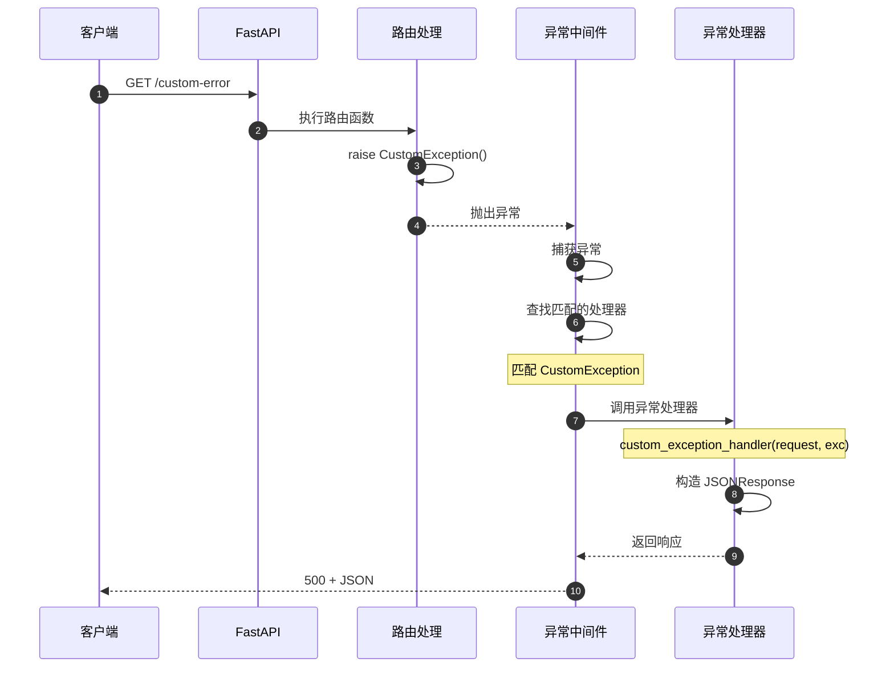
```mermaid
sequenceDiagram
    autonumber
    participant Client as 客户端
    participant App as FastAPI
    participant Route as 路由处理
    participant ExcMiddleware as 异常中间件
    participant Handler as 异常处理器
    
    Client->>App: GET /custom-error
    App->>Route: 执行路由函数
    Route->>Route: raise CustomException()
    Route-->>ExcMiddleware: 抛出异常
    
    ExcMiddleware->>ExcMiddleware: 捕获异常
    ExcMiddleware->>ExcMiddleware: 查找匹配的处理器
    Note over ExcMiddleware: 匹配 CustomException
    
    ExcMiddleware->>Handler: 调用异常处理器
    Note over Handler: custom_exception_handler(request, exc)
    
    Handler->>Handler: 构造 JSONResponse
    Handler-->>ExcMiddleware: 返回响应
    ExcMiddleware-->>Client: 500 + JSON
```

---

## 6. FastAPI.openapi() - 生成 OpenAPI Schema

### 基本信息
- **名称**：`FastAPI.openapi()`
- **类型**：方法
- **用途**：生成 OpenAPI 3.1 规范的 JSON Schema

### 响应结构体

```python
def openapi(self) -> Dict[str, Any]:
```

**返回值**：OpenAPI 3.1 规范的字典

### 核心代码与逻辑

```python
def openapi(self) -> Dict[str, Any]:
    # 检查是否已缓存
    if not self.openapi_schema:
        # 调用 get_openapi 函数生成 schema
        self.openapi_schema = get_openapi(
            title=self.title,
            version=self.version,
            openapi_version=self.openapi_version,
            summary=self.summary,
            description=self.description,
            terms_of_service=self.terms_of_service,
            contact=self.contact,
            license_info=self.license_info,
            routes=self.routes,  # 所有路由
            webhooks=self.webhooks.routes,  # Webhooks 路由
            tags=self.openapi_tags,
            servers=self.servers,
            separate_input_output_schemas=self.separate_input_output_schemas,
        )
    return self.openapi_schema
```

**逻辑说明**：

1. **延迟生成**：首次调用时生成，之后返回缓存

2. **缓存策略**：生成后存储在 `self.openapi_schema` 中

3. **生成流程**：
   - 遍历所有路由
   - 提取路径参数、查询参数、请求体、响应模型
   - 生成 JSON Schema
   - 构造符合 OpenAPI 3.1 规范的字典

4. **可定制**：可以重写此方法自定义 OpenAPI 生成逻辑

### 使用示例

```python
from fastapi import FastAPI

app = FastAPI(
    title="我的 API",
    version="1.0.0",
    description="这是一个示例 API",
)

@app.get("/items/{item_id}")
async def read_item(item_id: int, q: str = None):
    return {"item_id": item_id, "q": q}

# 获取 OpenAPI schema
openapi_schema = app.openapi()

# 打印 schema
import json
print(json.dumps(openapi_schema, indent=2))

# 输出示例:
# {
#   "openapi": "3.1.0",
#   "info": {
#     "title": "我的 API",
#     "version": "1.0.0",
#     "description": "这是一个示例 API"
#   },
#   "paths": {
#     "/items/{item_id}": {
#       "get": {
#         "summary": "Read Item",
#         "operationId": "read_item_items__item_id__get",
#         "parameters": [
#           {
#             "name": "item_id",
#             "in": "path",
#             "required": true,
#             "schema": {"type": "integer"}
#           },
#           {
#             "name": "q",
#             "in": "query",
#             "required": false,
#             "schema": {"type": "string"}
#           }
#         ],
#         "responses": { ... }
#       }
#     }
#   }
# }

# 自定义 OpenAPI 生成
def custom_openapi():
    if app.openapi_schema:
        return app.openapi_schema
    
    openapi_schema = get_openapi(
        title="自定义 API",
        version="2.0.0",
        routes=app.routes,
    )
    
    # 自定义修改
    openapi_schema["info"]["x-logo"] = {
        "url": "https://example.com/logo.png"
    }
    
    app.openapi_schema = openapi_schema
    return app.openapi_schema

app.openapi = custom_openapi
```

---

## 7. FastAPI.setup() - 设置文档路由

### 基本信息
- **名称**：`FastAPI.setup()`
- **类型**：方法
- **用途**：注册 OpenAPI 文档相关的路由（`/docs`、`/redoc`、`/openapi.json`）

### 核心代码与逻辑

```python
def setup(self) -> None:
    # 注册 OpenAPI JSON 路由
    if self.openapi_url:
        @self.get(self.openapi_url, include_in_schema=False)
        async def openapi() -> Dict[str, Any]:
            return self.openapi()
    
    # 注册 Swagger UI 路由
    if self.docs_url:
        @self.get(self.docs_url, include_in_schema=False)
        async def swagger_ui_html():
            return get_swagger_ui_html(
                openapi_url=self.openapi_url,
                title=self.title + " - Swagger UI",
                oauth2_redirect_url=self.swagger_ui_oauth2_redirect_url,
                init_oauth=self.swagger_ui_init_oauth,
                swagger_ui_parameters=self.swagger_ui_parameters,
            )
    
    # 注册 OAuth2 重定向路由
    if self.swagger_ui_oauth2_redirect_url:
        @self.get(self.swagger_ui_oauth2_redirect_url, include_in_schema=False)
        async def swagger_ui_redirect():
            return get_swagger_ui_oauth2_redirect_html()
    
    # 注册 ReDoc 路由
    if self.redoc_url:
        @self.get(self.redoc_url, include_in_schema=False)
        async def redoc_html():
            return get_redoc_html(
                openapi_url=self.openapi_url,
                title=self.title + " - ReDoc",
            )
```

**逻辑说明**：

1. **条件注册**：只有当相应 URL 不为 `None` 时才注册路由

2. **exclude_from_schema**：文档路由不包含在 OpenAPI schema 中（避免递归）

3. **OpenAPI JSON**：返回 `self.openapi()` 生成的 schema

4. **Swagger UI**：返回 HTML 页面，嵌入 Swagger UI JavaScript

5. **ReDoc**：返回 HTML 页面，嵌入 ReDoc JavaScript

### 使用示例

```python
from fastapi import FastAPI

# 默认配置
app = FastAPI()
# 自动注册:
# GET /docs          -> Swagger UI
# GET /redoc         -> ReDoc
# GET /openapi.json  -> OpenAPI JSON

# 自定义文档 URL
app_custom = FastAPI(
    docs_url="/api/docs",
    redoc_url="/api/redoc",
    openapi_url="/api/openapi.json",
)
# 注册:
# GET /api/docs          -> Swagger UI
# GET /api/redoc         -> ReDoc
# GET /api/openapi.json  -> OpenAPI JSON

# 禁用文档
app_no_docs = FastAPI(
    docs_url=None,
    redoc_url=None,
    openapi_url=None,
)
# 不注册任何文档路由

# 自定义 Swagger UI
app_custom_swagger = FastAPI(
    swagger_ui_parameters={
        "defaultModelsExpandDepth": -1,  # 隐藏模型
        "docExpansion": "none",          # 默认折叠所有操作
        "filter": True,                   # 显示过滤框
    }
)
```

---

## 总结

FastAPI 应用层（`applications.py`）提供的 API 主要分为以下几类：

1. **应用初始化**：`FastAPI.__init__()` - 配置应用参数
2. **路由注册**：`get()` / `post()` / `put()` / `delete()` 等 - 注册 HTTP 路由
3. **路由模块化**：`include_router()` - 包含子路由器
4. **中间件管理**：`middleware()` / `add_middleware()` - 注册中间件
5. **异常处理**：`exception_handler()` - 注册异常处理器
6. **文档生成**：`openapi()` / `setup()` - 生成和提供 API 文档

这些 API 构成了 FastAPI 框架的核心接口，支持灵活、模块化、声明式的 Web API 开发。

---

## 数据结构

## 核心数据结构

应用层的核心数据结构主要围绕 `FastAPI` 类及其相关的配置和状态管理。

## 1. FastAPI 类结构

### 类定义

```python
class FastAPI(Starlette):
    """
    FastAPI 应用类，继承自 Starlette
    
    主要扩展：

    - OpenAPI 文档生成
    - 自动请求验证
    - 依赖注入系统
    - 类型提示驱动的路由定义
    """

```

### UML 类图

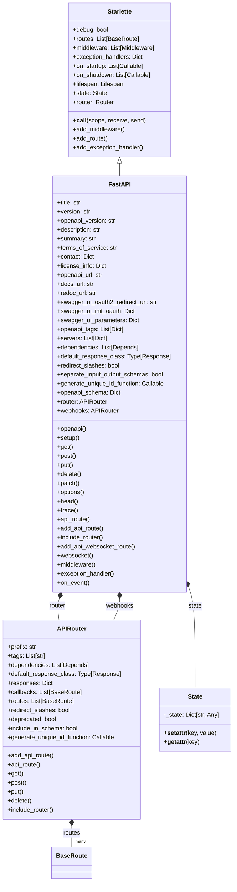
```mermaid
classDiagram
    class Starlette {
        +debug: bool
        +routes: List[BaseRoute]
        +middleware: List[Middleware]
        +exception_handlers: Dict
        +on_startup: List[Callable]
        +on_shutdown: List[Callable]
        +lifespan: Lifespan
        +state: State
        +router: Router
        +__call__(scope, receive, send)
        +add_middleware()
        +add_route()
        +add_exception_handler()
    }
    
    class FastAPI {
        +title: str
        +version: str
        +openapi_version: str
        +description: str
        +summary: str
        +terms_of_service: str
        +contact: Dict
        +license_info: Dict
        +openapi_url: str
        +docs_url: str
        +redoc_url: str
        +swagger_ui_oauth2_redirect_url: str
        +swagger_ui_init_oauth: Dict
        +swagger_ui_parameters: Dict
        +openapi_tags: List[Dict]
        +servers: List[Dict]
        +dependencies: List[Depends]
        +default_response_class: Type[Response]
        +redirect_slashes: bool
        +separate_input_output_schemas: bool
        +generate_unique_id_function: Callable
        +openapi_schema: Dict
        +router: APIRouter
        +webhooks: APIRouter
        +openapi()
        +setup()
        +get()
        +post()
        +put()
        +delete()
        +patch()
        +options()
        +head()
        +trace()
        +api_route()
        +add_api_route()
        +include_router()
        +add_api_websocket_route()
        +websocket()
        +middleware()
        +exception_handler()
        +on_event()
    }
    
    class APIRouter {
        +prefix: str
        +tags: List[str]
        +dependencies: List[Depends]
        +default_response_class: Type[Response]
        +responses: Dict
        +callbacks: List[BaseRoute]
        +routes: List[BaseRoute]
        +redirect_slashes: bool
        +deprecated: bool
        +include_in_schema: bool
        +generate_unique_id_function: Callable
        +add_api_route()
        +api_route()
        +get()
        +post()
        +put()
        +delete()
        +include_router()
    }
    
    class State {
        -_state: Dict[str, Any]
        +__setattr__(key, value)
        +__getattr__(key)
    }
    
    Starlette <|-- FastAPI
    FastAPI *-- APIRouter: router
    FastAPI *-- APIRouter: webhooks
    FastAPI *-- State: state
    APIRouter *-- "many" BaseRoute: routes
```

### 字段说明

#### OpenAPI 相关字段

| 字段 | 类型 | 默认值 | 说明 |
|------|------|--------|------|
| title | str | "FastAPI" | API 标题，显示在文档中 |
| version | str | "0.1.0" | API 版本号 |
| openapi_version | str | "3.1.0" | 使用的 OpenAPI 规范版本 |
| description | str | "" | API 详细描述，支持 Markdown |
| summary | str | None | API 简短摘要 |
| terms_of_service | str | None | 服务条款 URL |
| contact | Dict | None | 联系信息 {"name": "", "url": "", "email": ""} |
| license_info | Dict | None | 许可证信息 {"name": "", "url": ""} |
| openapi_tags | List[Dict] | None | OpenAPI 标签元数据 |
| servers | List[Dict] | None | API 服务器列表 |
| openapi_schema | Dict | None | 生成的 OpenAPI schema（缓存） |

#### 文档 URL 配置

| 字段 | 类型 | 默认值 | 说明 |
|------|------|--------|------|
| openapi_url | str | "/openapi.json" | OpenAPI JSON 文档路径，None 禁用 |
| docs_url | str | "/docs" | Swagger UI 文档路径，None 禁用 |
| redoc_url | str | "/redoc" | ReDoc 文档路径，None 禁用 |
| swagger_ui_oauth2_redirect_url | str | "/docs/oauth2-redirect" | OAuth2 重定向 URL |
| swagger_ui_init_oauth | Dict | None | Swagger UI OAuth2 初始化参数 |
| swagger_ui_parameters | Dict | None | 自定义 Swagger UI 参数 |

#### 应用配置

| 字段 | 类型 | 默认值 | 说明 |
|------|------|--------|------|
| debug | bool | False | 调试模式，返回详细错误堆栈 |
| dependencies | List[Depends] | None | 全局依赖项，应用于所有路由 |
| default_response_class | Type[Response] | JSONResponse | 默认响应类 |
| redirect_slashes | bool | True | 是否自动重定向尾部斜杠 |
| separate_input_output_schemas | bool | True | 是否分离输入输出 schema（OpenAPI 3.1+） |
| generate_unique_id_function | Callable | generate_unique_id | 生成唯一 operation ID 的函数 |

#### 路由管理

| 字段 | 类型 | 说明 |
|------|------|------|
| router | APIRouter | 内部路由器，管理所有路由 |
| webhooks | APIRouter | Webhooks 路由器 |
| routes | List[BaseRoute] | 所有注册的路由（从 router 获取） |

#### 状态管理

| 字段 | 类型 | 说明 |
|------|------|------|
| state | State | 应用级共享状态，可存储任意数据 |

## 2. State 数据结构

### 定义

```python
@dataclass
class State:
    """
    应用或请求级别的状态容器
    
    用法：
    app.state.db_pool = create_pool()
    request.state.user = current_user
    """
    _state: Dict[str, Any] = field(default_factory=dict)
    
    def __setattr__(self, name: str, value: Any) -> None:
        self._state[name] = value
    
    def __getattr__(self, name: str) -> Any:
        try:
            return self._state[name]
        except KeyError:
            raise AttributeError(f"'{self.__class__.__name__}' has no attribute '{name}'")
```

### 使用场景

**应用级状态**：

```python
from fastapi import FastAPI

app = FastAPI()

# 存储数据库连接池
app.state.db_pool = create_database_pool()

# 存储 Redis 客户端
app.state.redis = redis.Redis()

# 存储配置
app.state.config = load_config()

# 在路由中访问
@app.get("/")
async def root(request: Request):
    db_pool = request.app.state.db_pool
    return {"status": "ok"}
```

**请求级状态**：

```python
from fastapi import Request

@app.middleware("http")
async def add_request_id(request: Request, call_next):
    # 为每个请求生成唯一 ID
    request.state.request_id = generate_unique_id()
    response = await call_next(request)
    response.headers["X-Request-ID"] = request.state.request_id
    return response

@app.get("/items/")
async def read_items(request: Request):
    # 访问请求 ID
    request_id = request.state.request_id
    return {"request_id": request_id}
```

## 3. 配置数据结构

### OpenAPI 联系信息

```python
contact = {
    "name": "API Support",
    "url": "https://example.com/support",
    "email": "support@example.com"
}
```

| 字段 | 类型 | 必填 | 说明 |
|------|------|------|------|
| name | str | 否 | 联系人或组织名称 |
| url | str | 否 | 联系页面 URL |
| email | str | 否 | 联系邮箱 |

### OpenAPI 许可证信息

```python
license_info = {
    "name": "Apache 2.0",
    "url": "https://www.apache.org/licenses/LICENSE-2.0.html"
}
```

| 字段 | 类型 | 必填 | 说明 |
|------|------|------|------|
| name | str | 是 | 许可证名称 |
| url | str | 否 | 许可证 URL |

### OpenAPI 标签元数据

```python
tags_metadata = [
    {
        "name": "users",
        "description": "Operations with users.",
        "externalDocs": {
            "description": "Users external docs",
            "url": "https://example.com/docs/users"
        }
    },
    {
        "name": "items",
        "description": "Manage items."
    }
]
```

| 字段 | 类型 | 必填 | 说明 |
|------|------|------|------|
| name | str | 是 | 标签名称，与路由的 tags 匹配 |
| description | str | 否 | 标签描述 |
| externalDocs | Dict | 否 | 外部文档链接 |

### OpenAPI 服务器列表

```python
servers = [
    {
        "url": "https://api.example.com",
        "description": "Production server"
    },
    {
        "url": "https://staging.example.com",
        "description": "Staging server"
    }
]
```

| 字段 | 类型 | 必填 | 说明 |
|------|------|------|------|
| url | str | 是 | 服务器 URL |
| description | str | 否 | 服务器描述 |
| variables | Dict | 否 | URL 模板变量 |

## 4. 中间件数据结构

### Middleware 配置

```python
from starlette.middleware import Middleware

middleware = [
    Middleware(
        CORSMiddleware,
        allow_origins=["*"],
        allow_methods=["*"]
    ),
    Middleware(
        GZIPMiddleware,
        minimum_size=1000
    )
]

app = FastAPI(middleware=middleware)
```

**Middleware 结构**：

```python
@dataclass
class Middleware:
    cls: Type[BaseMiddleware]  # 中间件类
    args: Tuple = ()           # 位置参数
    kwargs: Dict = {}          # 关键字参数
```

## 5. 异常处理器数据结构

### 异常处理器映射

```python
exception_handlers: Dict[Union[int, Type[Exception]], ExceptionHandler]
```

**ExceptionHandler 类型**：

```python
ExceptionHandler = Callable[[Request, Exception], Union[Response, Awaitable[Response]]]
```

**示例**：

```python
from fastapi import Request, HTTPException
from fastapi.responses import JSONResponse

async def custom_http_exception_handler(request: Request, exc: HTTPException):
    return JSONResponse(
        status_code=exc.status_code,
        content={
            "message": exc.detail,
            "path": str(request.url),
            "method": request.method
        }
    )

app = FastAPI()
app.add_exception_handler(HTTPException, custom_http_exception_handler)

# 或使用装饰器
@app.exception_handler(HTTPException)
async def http_exception_handler(request: Request, exc: HTTPException):
    return JSONResponse(...)
```

## 6. 生命周期数据结构

### Lifespan 上下文管理器

```python
from contextlib import asynccontextmanager
from typing import AsyncIterator

@asynccontextmanager
async def lifespan(app: FastAPI) -> AsyncIterator[None]:
    # 启动时执行
    print("Application starting...")
    db_pool = await create_database_pool()
    app.state.db_pool = db_pool
    
    yield  # 应用运行中
    
    # 关闭时执行
    print("Application shutting down...")
    await db_pool.close()

app = FastAPI(lifespan=lifespan)
```

**Lifespan 类型定义**：

```python
Lifespan = Callable[[AppType], AsyncContextManager[None]]
```

### 已废弃的事件处理器（on_event）

```python
# 已废弃，不推荐使用
on_startup: List[Callable[[], Any]] = []
on_shutdown: List[Callable[[], Any]] = []

@app.on_event("startup")
async def startup_event():
    print("Starting up...")

@app.on_event("shutdown")
async def shutdown_event():
    print("Shutting down...")
```

## 7. 响应类配置

### 默认响应类

```python
from fastapi.responses import (
    JSONResponse,      # 默认
    HTMLResponse,
    PlainTextResponse,
    RedirectResponse,
    StreamingResponse,
    FileResponse,
    ORJSONResponse,    # 需要安装 orjson
    UJSONResponse      # 需要安装 ujson
)

# 全局配置
app = FastAPI(default_response_class=ORJSONResponse)

# 路由级配置
@app.get("/html", response_class=HTMLResponse)
async def html_response():
    return "<html><body>Hello</body></html>"
```

## 8. 完整配置示例

```python
from fastapi import FastAPI, Depends
from fastapi.middleware.cors import CORSMiddleware
from fastapi.responses import ORJSONResponse
from contextlib import asynccontextmanager

@asynccontextmanager
async def lifespan(app: FastAPI):
    # 启动
    app.state.db = await create_db_pool()
    yield
    # 关闭
    await app.state.db.close()

app = FastAPI(
    # OpenAPI 配置
    title="My Advanced API",
    version="2.0.0",
    description="Advanced API with all features",
    summary="Production-ready API",
    terms_of_service="https://example.com/terms",
    contact={
        "name": "API Team",
        "url": "https://example.com/contact",
        "email": "api@example.com"
    },
    license_info={
        "name": "MIT",
        "url": "https://opensource.org/licenses/MIT"
    },
    
    # 文档配置
    openapi_url="/api/v2/openapi.json",
    docs_url="/api/v2/docs",
    redoc_url="/api/v2/redoc",
    swagger_ui_parameters={
        "defaultModelsExpandDepth": -1,
        "syntaxHighlight.theme": "monokai"
    },
    
    # 应用配置
    debug=False,
    default_response_class=ORJSONResponse,
    separate_input_output_schemas=True,
    
    # 生命周期
    lifespan=lifespan,
    
    # OpenAPI 标签
    openapi_tags=[
        {
            "name": "users",
            "description": "User management"
        },
        {
            "name": "items",
            "description": "Item operations"
        }
    ],
    
    # 服务器列表
    servers=[
        {"url": "https://api.example.com", "description": "Production"},
        {"url": "https://staging.example.com", "description": "Staging"}
    ]
)

# 添加中间件
app.add_middleware(
    CORSMiddleware,
    allow_origins=["https://example.com"],
    allow_credentials=True,
    allow_methods=["*"],
    allow_headers=["*"]
)
```

## 9. 类型定义总结

### 主要类型

```python
from typing import (
    Any, Callable, Dict, List, Optional, Sequence, Type, Union
)
from starlette.types import ASGIApp, Lifespan, Receive, Scope, Send
from starlette.responses import Response
from starlette.routing import BaseRoute
from starlette.middleware import Middleware

# FastAPI 特有类型
DecoratedCallable = TypeVar("DecoratedCallable", bound=Callable[..., Any])
IncEx = Union[Set[int], Set[str], Dict[int, Any], Dict[str, Any]]
```

### 路由装饰器返回类型

```python
RouteDecorator = Callable[[DecoratedCallable], DecoratedCallable]

# 使用示例
def get(path: str, **kwargs) -> RouteDecorator:
    def decorator(func: DecoratedCallable) -> DecoratedCallable:
        # 注册路由
        return func
    return decorator
```

## 10. 数据流转示意图

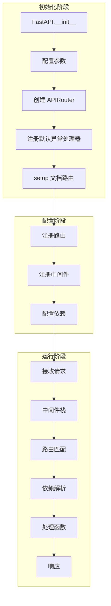
```mermaid
flowchart TB
    subgraph "初始化阶段"
        Init[FastAPI.__init__]
        Config[配置参数]
        CreateRouter[创建 APIRouter]
        RegisterHandlers[注册默认异常处理器]
        SetupDocs[setup 文档路由]
    end
    
    subgraph "配置阶段"
        RegisterRoutes[注册路由]
        RegisterMiddleware[注册中间件]
        RegisterDeps[配置依赖]
    end
    
    subgraph "运行阶段"
        Request[接收请求]
        MiddlewareStack[中间件栈]
        RouterMatch[路由匹配]
        DepSolve[依赖解析]
        Handler[处理函数]
        Response[响应]
    end
    
    Init --> Config
    Config --> CreateRouter
    CreateRouter --> RegisterHandlers
    RegisterHandlers --> SetupDocs
    
    SetupDocs --> RegisterRoutes
    RegisterRoutes --> RegisterMiddleware
    RegisterMiddleware --> RegisterDeps
    
    RegisterDeps --> Request
    Request --> MiddlewareStack
    MiddlewareStack --> RouterMatch
    RouterMatch --> DepSolve
    DepSolve --> Handler
    Handler --> Response
```

## 11. 状态生命周期

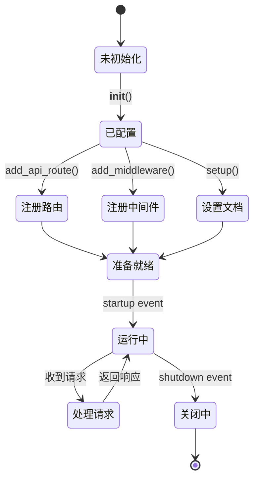
```mermaid
stateDiagram-v2
    [*] --> 未初始化
    未初始化 --> 已配置: __init__()
    已配置 --> 注册路由: add_api_route()
    已配置 --> 注册中间件: add_middleware()
    已配置 --> 设置文档: setup()
    注册路由 --> 准备就绪
    注册中间件 --> 准备就绪
    设置文档 --> 准备就绪
    准备就绪 --> 运行中: startup event
    运行中 --> 处理请求: 收到请求
    处理请求 --> 运行中: 返回响应
    运行中 --> 关闭中: shutdown event
    关闭中 --> [*]
```

## 总结

FastAPI 应用层的数据结构围绕以下核心概念：

1. **FastAPI 类**：主应用类，继承 Starlette 并扩展功能
2. **State**：应用和请求级状态容器
3. **配置结构**：OpenAPI、文档、服务器等配置
4. **中间件配置**：Middleware 元组
5. **异常处理器**：映射异常类型到处理函数
6. **生命周期管理**：Lifespan 上下文管理器
7. **响应类配置**：自定义默认响应类型

这些数据结构共同构成了 FastAPI 应用的配置和状态管理系统。

---

## 时序图

## 概述

本文档详细展示 FastAPI 应用层各个关键流程的时序图，包括应用初始化、路由注册、请求处理等核心流程。

---

## 1. 应用初始化时序

### 完整初始化流程

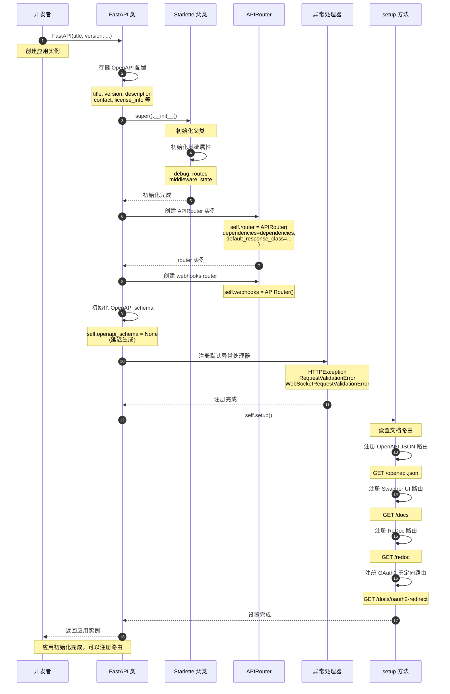
```mermaid
sequenceDiagram
    autonumber
    participant Dev as 开发者
    participant FastAPI as FastAPI 类
    participant Starlette as Starlette 父类
    participant Router as APIRouter
    participant ExcHandlers as 异常处理器
    participant Setup as setup 方法
    
    Dev->>FastAPI: FastAPI(title, version, ...)
    Note over Dev: 创建应用实例
    
    FastAPI->>FastAPI: 存储 OpenAPI 配置
    Note over FastAPI: title, version, description<br/>contact, license_info 等
    
    FastAPI->>Starlette: super().__init__()
    Note over Starlette: 初始化父类
    
    Starlette->>Starlette: 初始化基础属性
    Note over Starlette: debug, routes<br/>middleware, state
    
    Starlette-->>FastAPI: 初始化完成
    
    FastAPI->>Router: 创建 APIRouter 实例
    Note over Router: self.router = APIRouter(<br/>  dependencies=dependencies,<br/>  default_response_class=...<br/>)
    
    Router-->>FastAPI: router 实例
    
    FastAPI->>Router: 创建 webhooks router
    Note over Router: self.webhooks = APIRouter()
    
    FastAPI->>FastAPI: 初始化 OpenAPI schema
    Note over FastAPI: self.openapi_schema = None<br/>(延迟生成)
    
    FastAPI->>ExcHandlers: 注册默认异常处理器
    Note over ExcHandlers: HTTPException<br/>RequestValidationError<br/>WebSocketRequestValidationError
    
    ExcHandlers-->>FastAPI: 注册完成
    
    FastAPI->>Setup: self.setup()
    Note over Setup: 设置文档路由
    
    Setup->>Setup: 注册 OpenAPI JSON 路由
    Note over Setup: GET /openapi.json
    
    Setup->>Setup: 注册 Swagger UI 路由
    Note over Setup: GET /docs
    
    Setup->>Setup: 注册 ReDoc 路由
    Note over Setup: GET /redoc
    
    Setup->>Setup: 注册 OAuth2 重定向路由
    Note over Setup: GET /docs/oauth2-redirect
    
    Setup-->>FastAPI: 设置完成
    
    FastAPI-->>Dev: 返回应用实例
    
    Note over Dev,FastAPI: 应用初始化完成，可以注册路由
```

### 初始化步骤说明

**步骤 1-2：创建实例**

- 开发者调用 `FastAPI()` 构造函数
- 传递 OpenAPI 配置参数（title、version 等）

**步骤 3-7：父类初始化**

- 调用 Starlette 的 `__init__` 方法
- 初始化 ASGI 应用基础属性
- 设置 debug 模式、routes、middleware、state 等

**步骤 8-11：创建路由器**

- 创建内部 `APIRouter` 实例（`self.router`）
- 创建 webhooks 路由器（`self.webhooks`）
- 路由器继承应用级配置（dependencies、default_response_class 等）

**步骤 12-13：OpenAPI 初始化**

- 将 `openapi_schema` 设置为 `None`
- 采用延迟生成策略（首次访问时生成）

**步骤 14-16：注册默认异常处理器**

- `HTTPException` → `http_exception_handler`
- `RequestValidationError` → `request_validation_exception_handler`
- `WebSocketRequestValidationError` → `websocket_request_validation_exception_handler`

**步骤 17-25：设置文档路由**

- 调用 `setup()` 方法
- 根据配置注册文档相关路由：
  - `/openapi.json`：返回 OpenAPI JSON schema
  - `/docs`：Swagger UI 文档界面
  - `/redoc`：ReDoc 文档界面
  - `/docs/oauth2-redirect`：OAuth2 重定向页面

---

## 2. 路由注册时序

### 使用装饰器注册路由

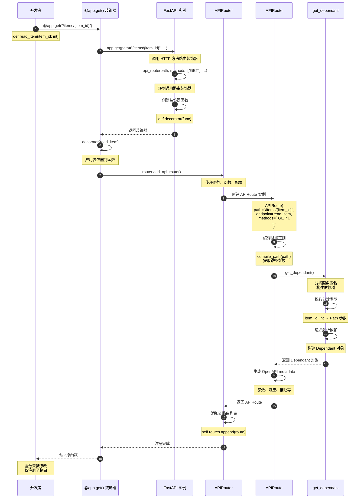
```mermaid
sequenceDiagram
    autonumber
    participant Dev as 开发者
    participant Decorator as @app.get() 装饰器
    participant App as FastAPI 实例
    participant Router as APIRouter
    participant Route as APIRoute
    participant Dependant as get_dependant
    
    Dev->>Decorator: @app.get("/items/{item_id}")
    Note over Dev: def read_item(item_id: int)
    
    Decorator->>App: app.get(path="/items/{item_id}", ...)
    Note over App: 调用 HTTP 方法路由装饰器
    
    App->>App: api_route(path, methods=["GET"], ...)
    Note over App: 转到通用路由装饰器
    
    App->>App: 创建装饰器函数
    Note over App: def decorator(func)
    
    App-->>Decorator: 返回装饰器
    
    Decorator->>Decorator: decorator(read_item)
    Note over Decorator: 应用装饰器到函数
    
    Decorator->>Router: router.add_api_route()
    Note over Router: 传递路径、函数、配置
    
    Router->>Route: 创建 APIRoute 实例
    Note over Route: APIRoute(<br/>  path="/items/{item_id}",<br/>  endpoint=read_item,<br/>  methods=["GET"],<br/>  ...<br/>)
    
    Route->>Route: 编译路径正则
    Note over Route: compile_path(path)<br/>提取路径参数
    
    Route->>Dependant: get_dependant()
    Note over Dependant: 分析函数签名<br/>构建依赖树
    
    Dependant->>Dependant: 提取参数类型
    Note over Dependant: item_id: int → Path 参数
    
    Dependant->>Dependant: 递归解析依赖
    Note over Dependant: 构建 Dependant 对象
    
    Dependant-->>Route: 返回 Dependant 对象
    
    Route->>Route: 生成 OpenAPI metadata
    Note over Route: 参数、响应、描述等
    
    Route-->>Router: 返回 APIRoute
    
    Router->>Router: 添加到路由列表
    Note over Router: self.routes.append(route)
    
    Router-->>Decorator: 注册完成
    
    Decorator-->>Dev: 返回原函数
    Note over Dev: 函数未被修改<br/>仅注册了路由
```

### 直接调用方法注册

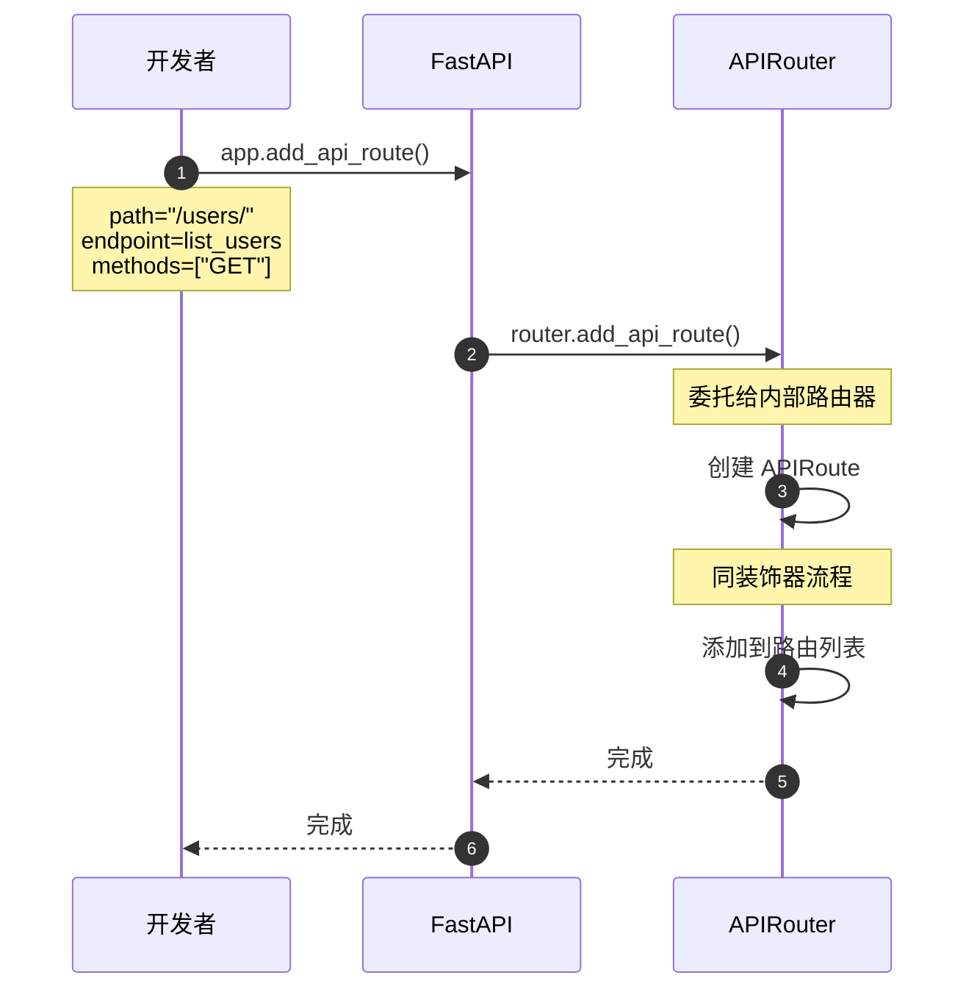
```mermaid
sequenceDiagram
    autonumber
    participant Dev as 开发者
    participant App as FastAPI
    participant Router as APIRouter
    
    Dev->>App: app.add_api_route()
    Note over Dev: path="/users/"<br/>endpoint=list_users<br/>methods=["GET"]
    
    App->>Router: router.add_api_route()
    Note over Router: 委托给内部路由器
    
    Router->>Router: 创建 APIRoute
    Note over Router: 同装饰器流程
    
    Router->>Router: 添加到路由列表
    
    Router-->>App: 完成
    App-->>Dev: 完成
```

---

## 3. 路由包含时序（include_router）

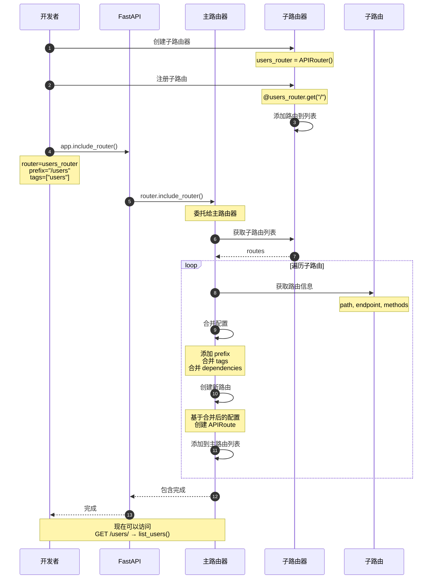
```mermaid
sequenceDiagram
    autonumber
    participant Dev as 开发者
    participant App as FastAPI
    participant MainRouter as 主路由器
    participant SubRouter as 子路由器
    participant Route as 子路由
    
    Dev->>SubRouter: 创建子路由器
    Note over SubRouter: users_router = APIRouter()
    
    Dev->>SubRouter: 注册子路由
    Note over SubRouter: @users_router.get("/")
    
    SubRouter->>SubRouter: 添加路由到列表
    
    Dev->>App: app.include_router()
    Note over Dev: router=users_router<br/>prefix="/users"<br/>tags=["users"]
    
    App->>MainRouter: router.include_router()
    Note over MainRouter: 委托给主路由器
    
    MainRouter->>SubRouter: 获取子路由列表
    SubRouter-->>MainRouter: routes
    
    loop 遍历子路由
        MainRouter->>Route: 获取路由信息
        Note over Route: path, endpoint, methods
        
        MainRouter->>MainRouter: 合并配置
        Note over MainRouter: 添加 prefix<br/>合并 tags<br/>合并 dependencies
        
        MainRouter->>MainRouter: 创建新路由
        Note over MainRouter: 基于合并后的配置<br/>创建 APIRoute
        
        MainRouter->>MainRouter: 添加到主路由列表
    end
    
    MainRouter-->>App: 包含完成
    App-->>Dev: 完成
    
    Note over Dev,MainRouter: 现在可以访问<br/>GET /users/ → list_users()
```

---

## 4. 中间件注册时序

### 使用 add_middleware

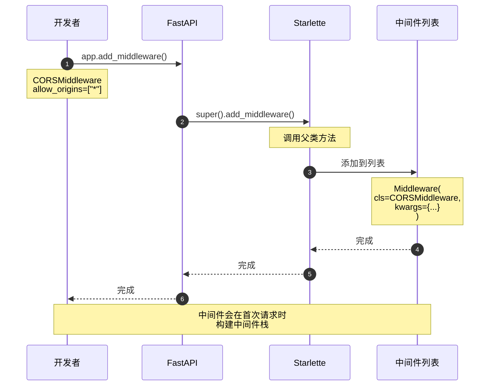
```mermaid
sequenceDiagram
    autonumber
    participant Dev as 开发者
    participant App as FastAPI
    participant Starlette as Starlette
    participant MiddlewareStack as 中间件列表
    
    Dev->>App: app.add_middleware()
    Note over Dev: CORSMiddleware<br/>allow_origins=["*"]
    
    App->>Starlette: super().add_middleware()
    Note over Starlette: 调用父类方法
    
    Starlette->>MiddlewareStack: 添加到列表
    Note over MiddlewareStack: Middleware(<br/>  cls=CORSMiddleware,<br/>  kwargs={...}<br/>)
    
    MiddlewareStack-->>Starlette: 完成
    Starlette-->>App: 完成
    App-->>Dev: 完成
    
    Note over Dev,MiddlewareStack: 中间件会在首次请求时<br/>构建中间件栈
```

### 使用 @app.middleware 装饰器

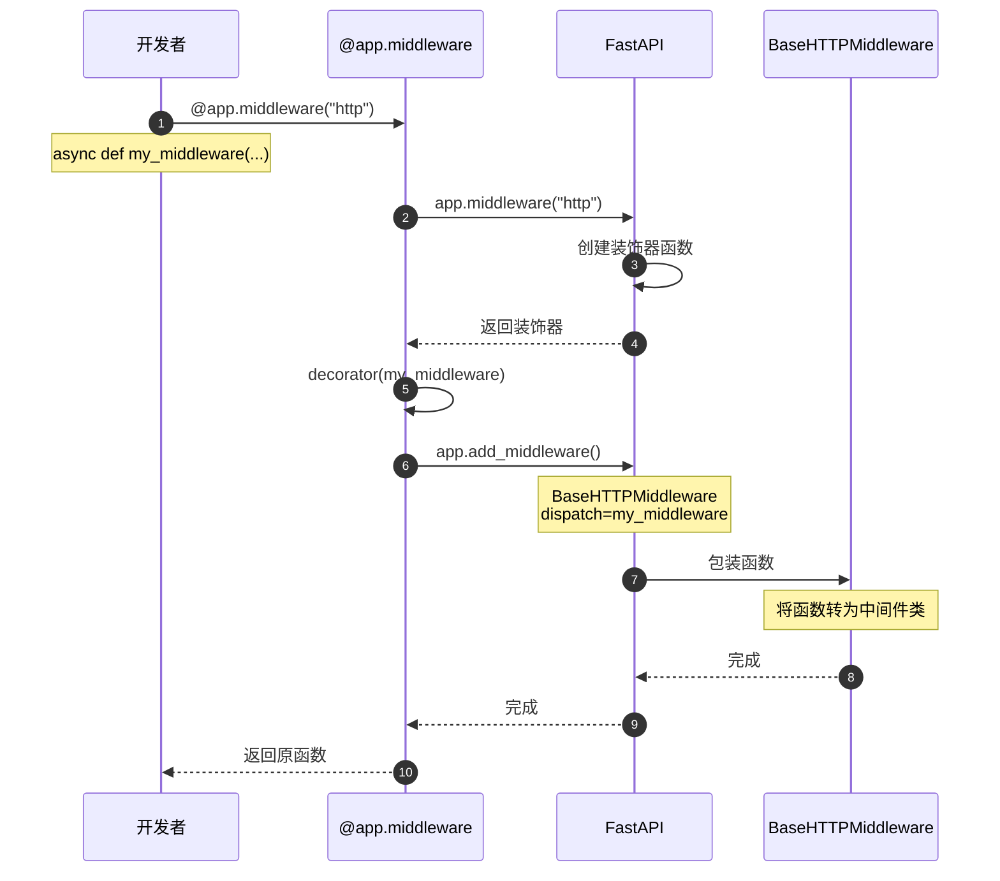
```mermaid
sequenceDiagram
    autonumber
    participant Dev as 开发者
    participant Decorator as @app.middleware
    participant App as FastAPI
    participant BaseHTTPMiddleware as BaseHTTPMiddleware
    
    Dev->>Decorator: @app.middleware("http")
    Note over Dev: async def my_middleware(...)
    
    Decorator->>App: app.middleware("http")
    
    App->>App: 创建装饰器函数
    
    App-->>Decorator: 返回装饰器
    
    Decorator->>Decorator: decorator(my_middleware)
    
    Decorator->>App: app.add_middleware()
    Note over App: BaseHTTPMiddleware<br/>dispatch=my_middleware
    
    App->>BaseHTTPMiddleware: 包装函数
    Note over BaseHTTPMiddleware: 将函数转为中间件类
    
    BaseHTTPMiddleware-->>App: 完成
    App-->>Decorator: 完成
    Decorator-->>Dev: 返回原函数
```

---

## 5. 异常处理器注册时序

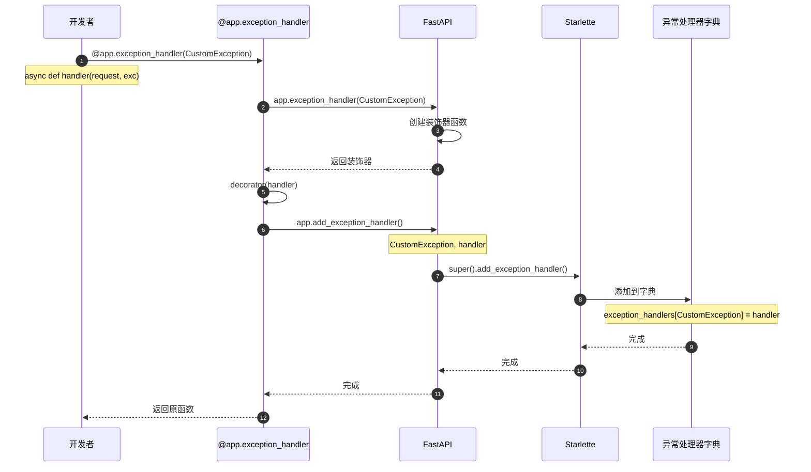
```mermaid
sequenceDiagram
    autonumber
    participant Dev as 开发者
    participant Decorator as @app.exception_handler
    participant App as FastAPI
    participant Starlette as Starlette
    participant Handlers as 异常处理器字典
    
    Dev->>Decorator: @app.exception_handler(CustomException)
    Note over Dev: async def handler(request, exc)
    
    Decorator->>App: app.exception_handler(CustomException)
    
    App->>App: 创建装饰器函数
    
    App-->>Decorator: 返回装饰器
    
    Decorator->>Decorator: decorator(handler)
    
    Decorator->>App: app.add_exception_handler()
    Note over App: CustomException, handler
    
    App->>Starlette: super().add_exception_handler()
    
    Starlette->>Handlers: 添加到字典
    Note over Handlers: exception_handlers[CustomException] = handler
    
    Handlers-->>Starlette: 完成
    Starlette-->>App: 完成
    App-->>Decorator: 完成
    Decorator-->>Dev: 返回原函数
```

---

## 6. OpenAPI Schema 生成时序

### 首次访问文档时生成

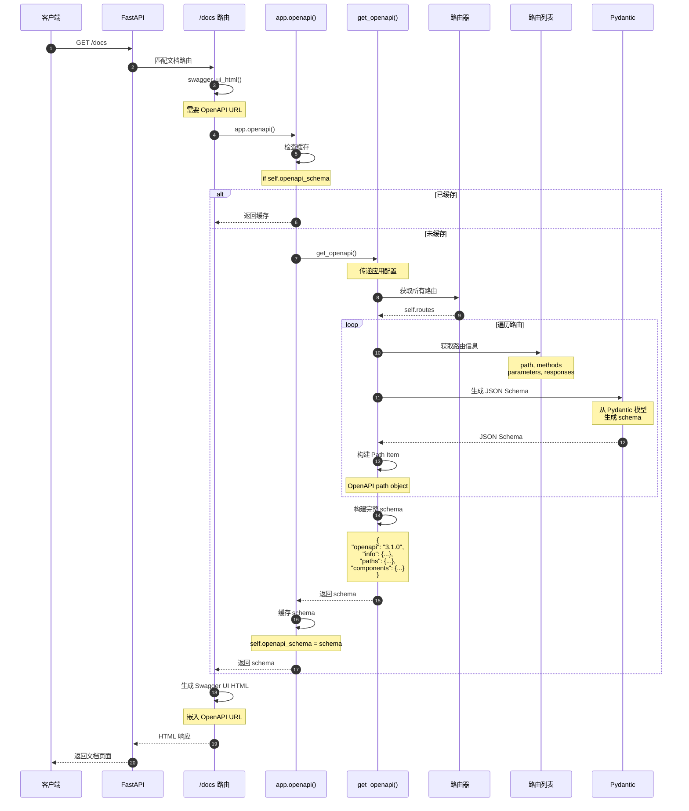
```mermaid
sequenceDiagram
    autonumber
    participant Client as 客户端
    participant App as FastAPI
    participant DocsRoute as /docs 路由
    participant OpenAPIMethod as app.openapi()
    participant GetOpenAPI as get_openapi()
    participant Router as 路由器
    participant Routes as 路由列表
    participant Pydantic as Pydantic
    
    Client->>App: GET /docs
    
    App->>DocsRoute: 匹配文档路由
    
    DocsRoute->>DocsRoute: swagger_ui_html()
    Note over DocsRoute: 需要 OpenAPI URL
    
    DocsRoute->>OpenAPIMethod: app.openapi()
    
    OpenAPIMethod->>OpenAPIMethod: 检查缓存
    Note over OpenAPIMethod: if self.openapi_schema
    
    alt 已缓存
        OpenAPIMethod-->>DocsRoute: 返回缓存
    else 未缓存
        OpenAPIMethod->>GetOpenAPI: get_openapi()
        Note over GetOpenAPI: 传递应用配置
        
        GetOpenAPI->>Router: 获取所有路由
        Router-->>GetOpenAPI: self.routes
        
        loop 遍历路由
            GetOpenAPI->>Routes: 获取路由信息
            Note over Routes: path, methods<br/>parameters, responses
            
            GetOpenAPI->>Pydantic: 生成 JSON Schema
            Note over Pydantic: 从 Pydantic 模型<br/>生成 schema
            
            Pydantic-->>GetOpenAPI: JSON Schema
            
            GetOpenAPI->>GetOpenAPI: 构建 Path Item
            Note over GetOpenAPI: OpenAPI path object
        end
        
        GetOpenAPI->>GetOpenAPI: 构建完整 schema
        Note over GetOpenAPI: {<br/>  "openapi": "3.1.0",<br/>  "info": {...},<br/>  "paths": {...},<br/>  "components": {...}<br/>}
        
        GetOpenAPI-->>OpenAPIMethod: 返回 schema
        
        OpenAPIMethod->>OpenAPIMethod: 缓存 schema
        Note over OpenAPIMethod: self.openapi_schema = schema
        
        OpenAPIMethod-->>DocsRoute: 返回 schema
    end
    
    DocsRoute->>DocsRoute: 生成 Swagger UI HTML
    Note over DocsRoute: 嵌入 OpenAPI URL
    
    DocsRoute-->>App: HTML 响应
    App-->>Client: 返回文档页面
```

---

## 7. 完整请求处理时序

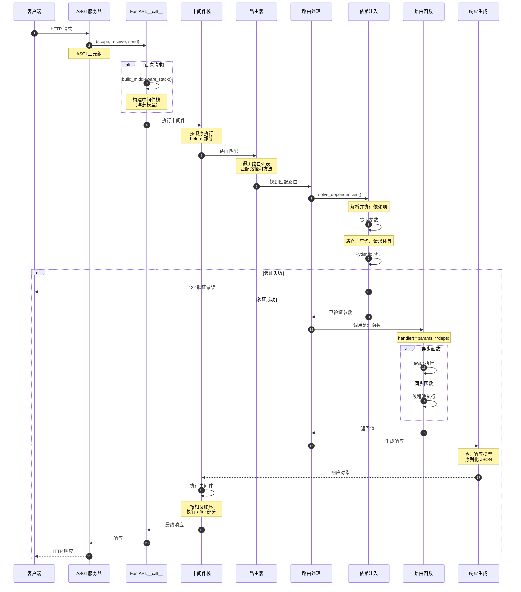
```mermaid
sequenceDiagram
    autonumber
    participant Client as 客户端
    participant ASGI as ASGI 服务器
    participant App as FastAPI.__call__
    participant MiddlewareStack as 中间件栈
    participant Router as 路由器
    participant Route as 路由处理
    participant Deps as 依赖注入
    participant Handler as 路由函数
    participant Response as 响应生成
    
    Client->>ASGI: HTTP 请求
    
    ASGI->>App: (scope, receive, send)
    Note over ASGI: ASGI 三元组
    
    alt 首次请求
        App->>App: build_middleware_stack()
        Note over App: 构建中间件栈<br/>（洋葱模型）
    end
    
    App->>MiddlewareStack: 执行中间件
    Note over MiddlewareStack: 按顺序执行<br/>before 部分
    
    MiddlewareStack->>Router: 路由匹配
    Note over Router: 遍历路由列表<br/>匹配路径和方法
    
    Router->>Route: 找到匹配路由
    
    Route->>Deps: solve_dependencies()
    Note over Deps: 解析并执行依赖项
    
    Deps->>Deps: 提取参数
    Note over Deps: 路径、查询、请求体等
    
    Deps->>Deps: Pydantic 验证
    
    alt 验证失败
        Deps-->>Client: 422 验证错误
    else 验证成功
        Deps-->>Route: 已验证参数
        
        Route->>Handler: 调用处理函数
        Note over Handler: handler(**params, **deps)
        
        alt 异步函数
            Handler->>Handler: await 执行
        else 同步函数
            Handler->>Handler: 线程池执行
        end
        
        Handler-->>Route: 返回值
        
        Route->>Response: 生成响应
        Note over Response: 验证响应模型<br/>序列化 JSON
        
        Response-->>MiddlewareStack: 响应对象
        
        MiddlewareStack->>MiddlewareStack: 执行中间件
        Note over MiddlewareStack: 按相反顺序<br/>执行 after 部分
        
        MiddlewareStack-->>App: 最终响应
        
        App-->>ASGI: 响应
        ASGI-->>Client: HTTP 响应
    end
```

---

## 8. 应用生命周期时序

### 使用 Lifespan 上下文管理器

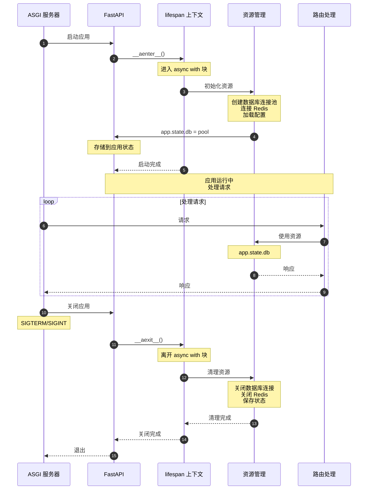
```mermaid
sequenceDiagram
    autonumber
    participant Server as ASGI 服务器
    participant App as FastAPI
    participant Lifespan as lifespan 上下文
    participant Resources as 资源管理
    participant Router as 路由处理
    
    Server->>App: 启动应用
    
    App->>Lifespan: __aenter__()
    Note over Lifespan: 进入 async with 块
    
    Lifespan->>Resources: 初始化资源
    Note over Resources: 创建数据库连接池<br/>连接 Redis<br/>加载配置
    
    Resources->>App: app.state.db = pool
    Note over App: 存储到应用状态
    
    Lifespan-->>App: 启动完成
    
    Note over App,Router: 应用运行中<br/>处理请求
    
    loop 处理请求
        Server->>Router: 请求
        Router->>Resources: 使用资源
        Note over Resources: app.state.db
        Resources-->>Router: 响应
        Router-->>Server: 响应
    end
    
    Server->>App: 关闭应用
    Note over Server: SIGTERM/SIGINT
    
    App->>Lifespan: __aexit__()
    Note over Lifespan: 离开 async with 块
    
    Lifespan->>Resources: 清理资源
    Note over Resources: 关闭数据库连接<br/>关闭 Redis<br/>保存状态
    
    Resources-->>Lifespan: 清理完成
    
    Lifespan-->>App: 关闭完成
    
    App-->>Server: 退出
```

### 已废弃的 on_event 方式

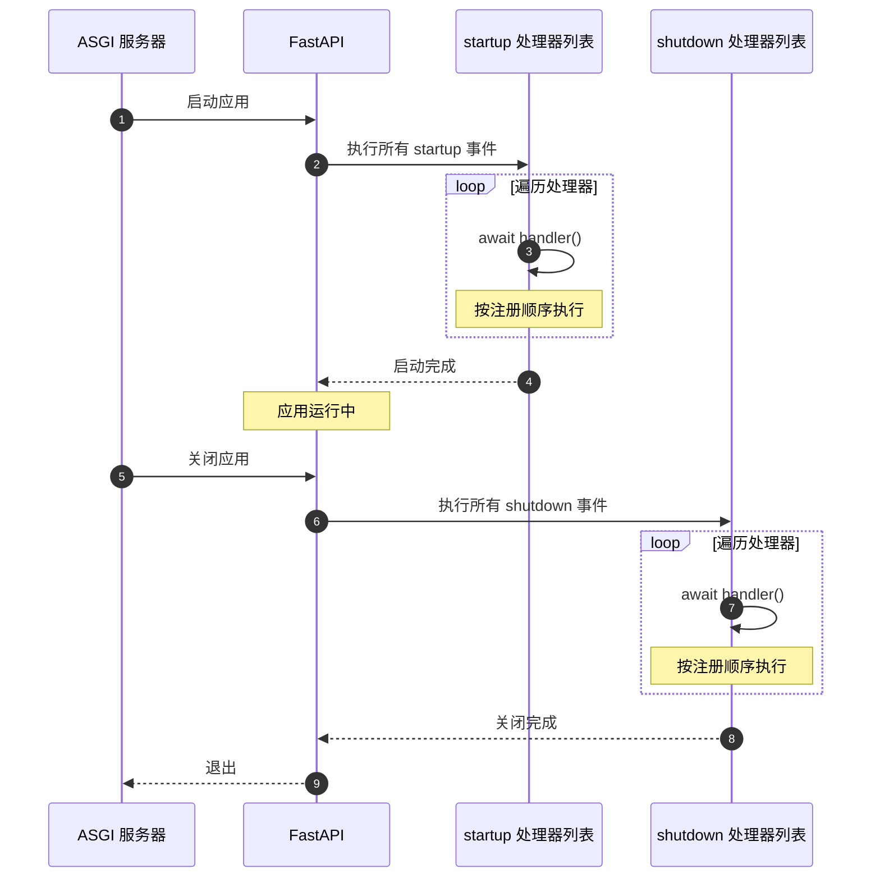
```mermaid
sequenceDiagram
    autonumber
    participant Server as ASGI 服务器
    participant App as FastAPI
    participant StartupHandlers as startup 处理器列表
    participant ShutdownHandlers as shutdown 处理器列表
    
    Server->>App: 启动应用
    
    App->>StartupHandlers: 执行所有 startup 事件
    
    loop 遍历处理器
        StartupHandlers->>StartupHandlers: await handler()
        Note over StartupHandlers: 按注册顺序执行
    end
    
    StartupHandlers-->>App: 启动完成
    
    Note over App: 应用运行中
    
    Server->>App: 关闭应用
    
    App->>ShutdownHandlers: 执行所有 shutdown 事件
    
    loop 遍历处理器
        ShutdownHandlers->>ShutdownHandlers: await handler()
        Note over ShutdownHandlers: 按注册顺序执行
    end
    
    ShutdownHandlers-->>App: 关闭完成
    
    App-->>Server: 退出
```

---

## 9. 中间件栈构建时序

### 首次请求时构建

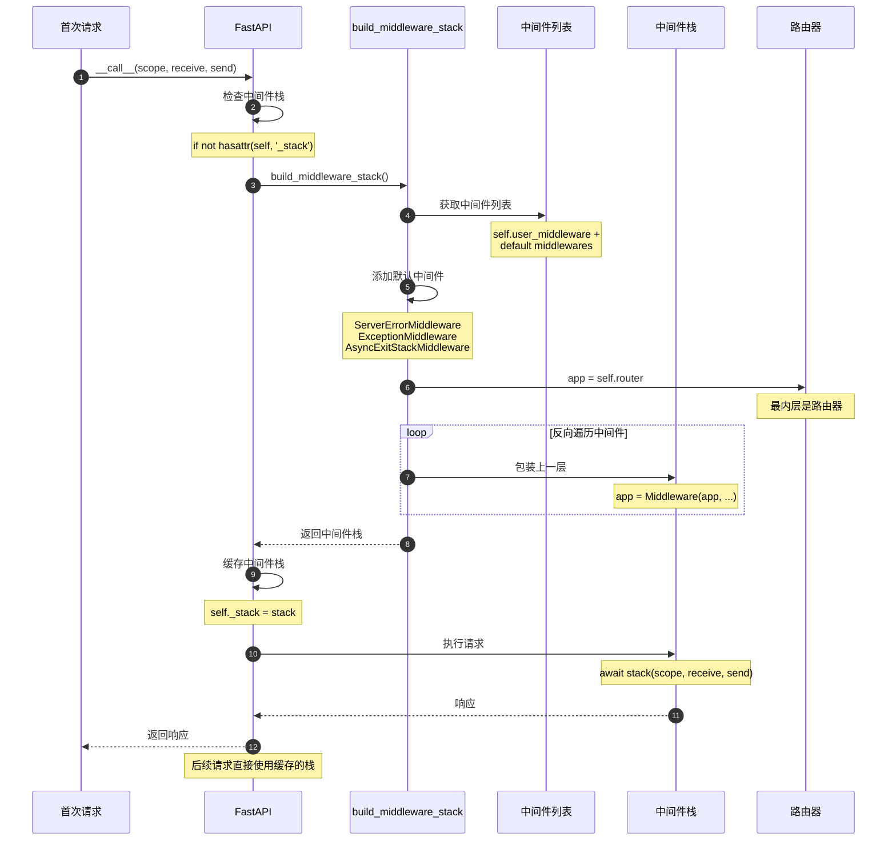
```mermaid
sequenceDiagram
    autonumber
    participant Request as 首次请求
    participant App as FastAPI
    participant Build as build_middleware_stack
    participant MiddlewareList as 中间件列表
    participant Stack as 中间件栈
    participant Router as 路由器
    
    Request->>App: __call__(scope, receive, send)
    
    App->>App: 检查中间件栈
    Note over App: if not hasattr(self, '_stack')
    
    App->>Build: build_middleware_stack()
    
    Build->>MiddlewareList: 获取中间件列表
    Note over MiddlewareList: self.user_middleware +<br/>default middlewares
    
    Build->>Build: 添加默认中间件
    Note over Build: ServerErrorMiddleware<br/>ExceptionMiddleware<br/>AsyncExitStackMiddleware
    
    Build->>Router: app = self.router
    Note over Router: 最内层是路由器
    
    loop 反向遍历中间件
        Build->>Stack: 包装上一层
        Note over Stack: app = Middleware(app, ...)
    end
    
    Build-->>App: 返回中间件栈
    
    App->>App: 缓存中间件栈
    Note over App: self._stack = stack
    
    App->>Stack: 执行请求
    Note over Stack: await stack(scope, receive, send)
    
    Stack-->>App: 响应
    App-->>Request: 返回响应
    
    Note over App: 后续请求直接使用缓存的栈
```

---

## 总结

FastAPI 应用层的时序流程包括：

1. **初始化**：创建 FastAPI 实例，设置配置，注册默认处理器
2. **路由注册**：通过装饰器或方法注册路由，构建依赖树
3. **路由包含**：合并子路由器到主应用
4. **中间件注册**：添加中间件到列表
5. **异常处理器**：注册自定义异常处理器
6. **OpenAPI 生成**：延迟生成并缓存 schema
7. **请求处理**：完整的请求-响应生命周期
8. **应用生命周期**：启动和关闭资源管理
9. **中间件栈**：首次请求时构建洋葱模型

这些时序图展示了 FastAPI 应用层的核心工作流程和组件交互。

---
