# FastAPI-02-路由系统

## 模块概览

## 模块职责

路由系统（`routing.py`）是 FastAPI 请求处理的核心模块，负责将 HTTP 请求路由到相应的处理函数。主要职责包括：

### 主要职责

1. **路由匹配**
   - URL 路径匹配（支持路径参数）
   - HTTP 方法匹配（GET、POST、PUT、DELETE 等）
   - 正则表达式编译与优化

2. **依赖注入执行**
   - 解析依赖树
   - 执行依赖项函数
   - 缓存依赖结果（请求级）
   - 管理异步上下文（yield 依赖）

3. **参数提取与验证**
   - 路径参数提取
   - 查询参数解析
   - 请求体解析（JSON、表单、文件）
   - 头部和 Cookie 提取
   - Pydantic 模型验证

4. **响应处理**
   - 响应模型验证
   - JSON 序列化
   - 状态码设置
   - 头部和 Cookie 设置

5. **路由组织**
   - APIRouter 实现路由分组
   - 路由前缀管理
   - 路由嵌套与包含

## 核心类与组件

### APIRouter
- **职责**：路由分组管理器，支持路由模块化
- **特性**：
  - 路由注册（get、post、put、delete 等）
  - 路由前缀
  - 标签和依赖项继承
  - 路由嵌套（include_router）

### APIRoute
- **职责**：单个路由的处理逻辑
- **特性**：
  - 路径编译与匹配
  - 依赖注入执行
  - 请求处理流程
  - 响应生成

### APIWebSocketRoute
- **职责**：WebSocket 路由处理
- **特性**：
  - WebSocket 连接管理
  - 消息收发
  - 依赖注入支持

## 模块架构图

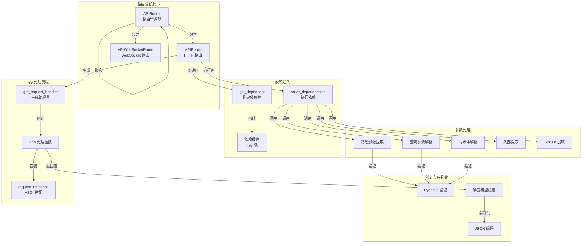

## 请求处理流程

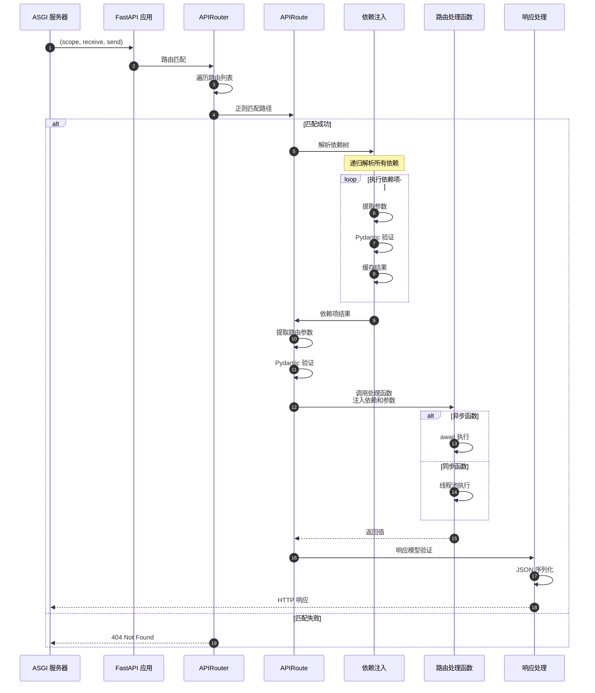

## 依赖注入机制

### 依赖树构建（启动时）

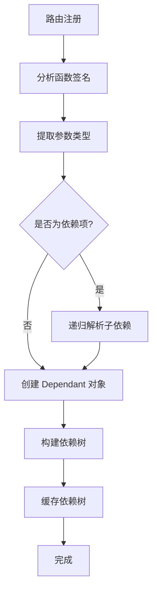

### 依赖执行（请求时）

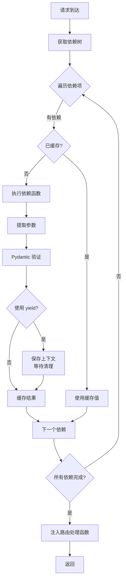

## 参数提取策略

FastAPI 根据参数类型和位置自动确定参数来源：

| 参数声明 | 来源 | 说明 |
|---------|------|------|
| `item_id: int` (路径中) | Path | 路径参数，必填 |
| `q: str = None` | Query | 查询参数，可选 |
| `item: Item` (Pydantic 模型) | Body | 请求体，JSON 解析 |
| `Path(...)` | Path | 显式路径参数 |
| `Query(...)` | Query | 显式查询参数 |
| `Body(...)` | Body | 显式请求体 |
| `Header(...)` | Header | HTTP 头部 |
| `Cookie(...)` | Cookie | Cookie |
| `Form(...)` | Form | 表单数据 |
| `File(...)` | File | 文件上传 |

## 路由匹配算法

### 路径编译

```python
# 原始路径
path = "/items/{item_id}/details"

# 编译为正则表达式
regex = re.compile("^/items/(?P<item_id>[^/]+)/details$")

# 匹配示例
match = regex.match("/items/42/details")
if match:
    path_params = match.groupdict()  # {"item_id": "42"}
```

### 匹配流程

1. **遍历路由列表**：按注册顺序遍历
2. **HTTP 方法过滤**：过滤不匹配的 HTTP 方法
3. **路径正则匹配**：使用预编译的正则表达式
4. **提取路径参数**：从匹配结果提取命名组
5. **返回第一个匹配**：采用首次匹配策略

## 性能优化

### 启动时优化

1. **依赖树预解析**：所有路由的依赖树在启动时构建并缓存
2. **路径正则编译**：路径模式编译为正则表达式
3. **函数签名缓存**：使用 inspect 模块分析函数签名并缓存

### 运行时优化

1. **依赖结果缓存**：同一请求中依赖项只执行一次
2. **参数提取优化**：最小化字符串解析和类型转换
3. **Pydantic 快速路径**：使用 pydantic-core（Rust 实现）

### 内存优化

1. **共享依赖树**：相同依赖项共享 Dependant 对象
2. **响应流式处理**：大响应使用 StreamingResponse
3. **请求体流式解析**：大文件使用 UploadFile（流式）

## 关键设计决策

### 首次匹配 vs 最佳匹配

FastAPI 采用**首次匹配**策略：

**优点**：

- O(n) 时间复杂度（最坏情况）
- 实现简单，性能可预测
- 开发者可控制优先级（通过注册顺序）

**缺点**：

- 需要注意路由注册顺序
- 通用路径应放在后面

**示例**：

```python
@app.get("/items/special")  # 应该先注册
async def read_special():
    ...

@app.get("/items/{item_id}")  # 后注册，避免覆盖 special
async def read_item(item_id: str):
    ...
```

### 同步 vs 异步处理

**异步路由**：

```python
@app.get("/async")
async def async_route():
    data = await async_db_call()
    return data
```

- 在事件循环中执行
- 适合 I/O 密集操作

**同步路由**：

```python
@app.get("/sync")
def sync_route():
    data = blocking_db_call()
    return data
```

- 在线程池中执行（默认 40 线程）
- 适合 CPU 密集或遗留同步代码

### 依赖缓存策略

**默认行为**：依赖项在同一请求中缓存

**使用场景**：

```python
def get_db():
    db = Database()
    try:
        yield db  # 请求结束时自动关闭
    finally:
        db.close()

@app.get("/users/")
async def list_users(db = Depends(get_db)):  # 依赖1
    return db.query_users()

@app.get("/items/")
async def list_items(db = Depends(get_db)):  # 依赖2 (不同请求)
    return db.query_items()
```

**禁用缓存**：

```python
def get_current_time(use_cache: bool = Depends(lambda: True)):
    return datetime.now()

# 如需禁用缓存，设置 use_cache=False
```

## 边界条件与限制

### 并发限制
- **异步路由**：受事件循环和系统资源限制
- **同步路由**：受线程池大小限制（默认 40）
- **依赖递归深度**：建议不超过 10 层

### 路径参数约束
- **路径参数**：默认匹配非 `/` 字符
- **自定义匹配**：使用 `path` 参数类型匹配包含 `/` 的路径
- **类型转换**：路径参数自动转换为声明的类型

### 请求体大小
- **默认无限制**：FastAPI 本身不限制
- **ASGI 服务器限制**：由 Uvicorn 等服务器配置
- **推荐**：在反向代理（Nginx）或中间件中限制

## 最佳实践

### 路由组织

```python
# users.py
from fastapi import APIRouter

router = APIRouter(
    prefix="/users",
    tags=["users"],
    responses={404: {"description": "Not found"}},
)

@router.get("/")
async def list_users():
    ...

@router.get("/{user_id}")
async def get_user(user_id: int):
    ...

# main.py
from fastapi import FastAPI
from .routers import users, items

app = FastAPI()

app.include_router(users.router)
app.include_router(items.router)
```

### 依赖注入

```python
# 数据库会话
async def get_db():
    async with SessionLocal() as session:
        yield session

# 当前用户
async def get_current_user(
    token: str = Depends(oauth2_scheme),
    db: Session = Depends(get_db)
):
    user = await decode_token(token, db)
    if not user:
        raise HTTPException(401)
    return user

# 使用
@app.get("/profile")
async def read_profile(user: User = Depends(get_current_user)):
    return user
```

### 响应模型

```python
class UserOut(BaseModel):
    id: int
    username: str
    # 不包含 password

@app.get("/users/{user_id}", response_model=UserOut)
async def get_user(user_id: int):
    # 从数据库获取用户（包含 password）
    user = db.get_user(user_id)
    # FastAPI 自动过滤掉 password 字段
    return user
```

## 常见问题

### Q: 如何自定义路径参数匹配？
A:

```python
# 匹配包含 / 的路径
@app.get("/files/{file_path:path}")
async def read_file(file_path: str):
    return {"file_path": file_path}

# 访问: GET /files/dir/subdir/file.txt
# file_path = "dir/subdir/file.txt"
```

### Q: 如何处理多个请求体参数？
A:

```python
@app.post("/items/")
async def create_item(
    item: Item,
    user: User,
    importance: int = Body(...)
):
    # FastAPI 自动将三个参数放入请求体
    # JSON: {"item": {...}, "user": {...}, "importance": 5}
    ...
```

### Q: 如何实现条件依赖？
A:

```python
def get_query_or_body(
    q: str = Query(None),
    body: str = Body(None)
):
    return q or body

@app.post("/search")
async def search(data: str = Depends(get_query_or_body)):
    # 优先使用查询参数，否则使用请求体
    ...
```

### Q: 依赖项的执行顺序？
A: 依赖项按照依赖关系执行，被依赖的项先执行。同级依赖按照参数声明顺序执行。

```python
async def dep_a():
    print("A")

async def dep_b(a = Depends(dep_a)):
    print("B")

@app.get("/")
async def route(b = Depends(dep_b), a = Depends(dep_a)):
    # 执行顺序: A -> B (a 被 b 依赖，只执行一次)
    pass
```

---

## API接口

> **文档版本**: v1.0  
> **FastAPI 版本**: 0.118.0  
> **创建日期**: 2025年10月4日

---

## 📋 目录

1. [模块说明](#模块说明)
2. [核心API概览](#核心API概览)
3. [APIRouter类详解](#apirouter类详解)
4. [路由注册API](#路由注册api)
5. [路由装饰器API](#路由装饰器api)
6. [路由包含API](#路由包含api)
7. [路由匹配API](#路由匹配api)
8. [最佳实践](#最佳实践)

---

## 模块说明

### 模块位置

```
fastapi/routing.py
```

### 职责范围
路由系统是FastAPI的核心模块之一，负责：

- 路由注册与管理
- URL路径匹配与解析
- 路径参数提取
- 路由分组与嵌套
- 路由元数据管理

### 对外API分类

| 分类 | API数量 | 说明 |
|------|---------|------|
| 路由器类 | 1 | `APIRouter` 主类 |
| 路由注册 | 2 | `add_api_route()`, `api_route()` |
| HTTP方法装饰器 | 9 | `get()`, `post()`, `put()`, `delete()` 等 |
| 路由包含 | 1 | `include_router()` |
| 路由匹配 | 内部 | 继承自 Starlette |

---

## 核心API概览

### API清单

| # | API名称 | 类型 | 用途 | 常用度 |
|---|---------|------|------|--------|
| 1 | `APIRouter.__init__()` | 构造器 | 创建路由器实例 | ⭐⭐⭐⭐⭐ |
| 2 | `add_api_route()` | 方法 | 直接注册路由 | ⭐⭐⭐⭐ |
| 3 | `api_route()` | 装饰器 | 通用路由装饰器 | ⭐⭐⭐ |
| 4 | `get()` | 装饰器 | GET请求装饰器 | ⭐⭐⭐⭐⭐ |
| 5 | `post()` | 装饰器 | POST请求装饰器 | ⭐⭐⭐⭐⭐ |
| 6 | `put()` | 装饰器 | PUT请求装饰器 | ⭐⭐⭐⭐ |
| 7 | `delete()` | 装饰器 | DELETE请求装饰器 | ⭐⭐⭐⭐ |
| 8 | `patch()` | 装饰器 | PATCH请求装饰器 | ⭐⭐⭐ |
| 9 | `options()` | 装饰器 | OPTIONS请求装饰器 | ⭐⭐ |
| 10 | `head()` | 装饰器 | HEAD请求装饰器 | ⭐⭐ |
| 11 | `trace()` | 装饰器 | TRACE请求装饰器 | ⭐ |
| 12 | `include_router()` | 方法 | 包含子路由器 | ⭐⭐⭐⭐⭐ |
| 13 | `add_websocket_route()` | 方法 | 注册WebSocket路由 | ⭐⭐⭐ |
| 14 | `websocket()` | 装饰器 | WebSocket装饰器 | ⭐⭐⭐ |

---

## APIRouter类详解

### 1. APIRouter.__init__()

#### 基本信息
- **功能**: 创建路由器实例，支持路由分组、前缀、标签等配置
- **继承**: `starlette.routing.Router`
- **用途**: 构建模块化的路由结构

#### 完整参数列表

```python
def __init__(
    self,
    *,
    prefix: str = "",
    tags: Optional[List[Union[str, Enum]]] = None,
    dependencies: Optional[Sequence[params.Depends]] = None,
    default_response_class: Type[Response] = Default(JSONResponse),
    responses: Optional[Dict[Union[int, str], Dict[str, Any]]] = None,
    callbacks: Optional[List[BaseRoute]] = None,
    routes: Optional[List[BaseRoute]] = None,
    redirect_slashes: bool = True,
    default: Optional[ASGIApp] = None,
    dependency_overrides_provider: Optional[Any] = None,
    route_class: Type[APIRoute] = APIRoute,
    on_startup: Optional[Sequence[Callable[[], Any]]] = None,
    on_shutdown: Optional[Sequence[Callable[[], Any]]] = None,
    lifespan: Optional[Lifespan[Any]] = None,
    deprecated: Optional[bool] = None,
    include_in_schema: bool = True,
    generate_unique_id_function: Callable[[APIRoute], str] = Default(generate_unique_id),
) -> None
```

#### 参数详解

| 参数 | 类型 | 必填 | 默认值 | 说明 |
|------|------|------|--------|------|
| **prefix** | str | 否 | `""` | 路由前缀，必须以`/`开头，不能以`/`结尾 |
| **tags** | List[str\|Enum] | 否 | None | 标签列表，应用于所有路由，用于OpenAPI分组 |
| **dependencies** | Sequence[Depends] | 否 | None | 依赖列表，应用于所有路由 |
| **default_response_class** | Type[Response] | 否 | JSONResponse | 默认响应类 |
| **responses** | Dict | 否 | None | 额外的OpenAPI响应定义 |
| **callbacks** | List[BaseRoute] | 否 | None | OpenAPI回调定义 |
| **routes** | List[BaseRoute] | 否 | None | 初始路由列表（不推荐直接使用） |
| **redirect_slashes** | bool | 否 | True | 是否自动重定向末尾斜杠 |
| **default** | ASGIApp | 否 | None | 404处理器 |
| **dependency_overrides_provider** | Any | 否 | None | 依赖覆盖提供者（内部使用） |
| **route_class** | Type[APIRoute] | 否 | APIRoute | 自定义路由类 |
| **on_startup** | Sequence[Callable] | 否 | None | 启动事件处理器（已废弃，用lifespan） |
| **on_shutdown** | Sequence[Callable] | 否 | None | 关闭事件处理器（已废弃，用lifespan） |
| **lifespan** | Lifespan | 否 | None | 生命周期上下文管理器 |
| **deprecated** | bool | 否 | None | 标记所有路由为废弃 |
| **include_in_schema** | bool | 否 | True | 是否包含在OpenAPI schema中 |
| **generate_unique_id_function** | Callable | 否 | generate_unique_id | 生成路由唯一ID的函数 |

#### 核心代码

```python
class APIRouter(routing.Router):
    def __init__(
        self,
        *,
        prefix: str = "",
        tags: Optional[List[Union[str, Enum]]] = None,
        dependencies: Optional[Sequence[params.Depends]] = None,
        default_response_class: Type[Response] = Default(JSONResponse),
        # ... 其他参数
    ) -> None:
        # 调用父类构造器
        super().__init__(
            routes=routes,
            redirect_slashes=redirect_slashes,
            default=default,
            on_startup=on_startup,
            on_shutdown=on_shutdown,
            lifespan=lifespan,
        )
        
        # 验证prefix格式
        if prefix:
            assert prefix.startswith("/"), "A path prefix must start with '/'"
            assert not prefix.endswith("/"), (
                "A path prefix must not end with '/', as the routes will start with '/'"
            )
        
        # 初始化路由器属性
        self.prefix = prefix
        self.tags: List[Union[str, Enum]] = tags or []
        self.dependencies = list(dependencies or [])
        self.deprecated = deprecated
        self.include_in_schema = include_in_schema
        self.responses = responses or {}
        self.callbacks = callbacks or []
        self.dependency_overrides_provider = dependency_overrides_provider
        self.route_class = route_class
        self.default_response_class = default_response_class
        self.generate_unique_id_function = generate_unique_id_function
```

#### 执行流程

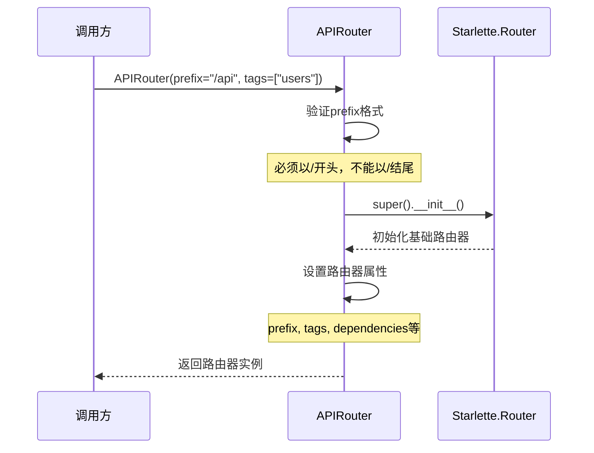

**时序图说明**：

1. **图意概述**: 展示APIRouter实例化的完整流程，包括参数验证和属性初始化
2. **关键字段**: prefix需要格式验证，tags和dependencies应用于所有子路由
3. **边界条件**: prefix格式错误会触发断言失败；空prefix表示无前缀
4. **异常路径**: 格式验证失败抛出AssertionError
5. **性能要点**: 构造器轻量级，仅做属性赋值，无IO操作

#### 使用示例

**示例1：基础路由器**

```python
from fastapi import APIRouter

router = APIRouter()

@router.get("/items")
async def read_items():
    return {"items": []}
```

**示例2：带前缀和标签的路由器**

```python
router = APIRouter(
    prefix="/api/v1",
    tags=["users"],
    responses={404: {"description": "Not found"}},
)

@router.get("/users")
async def get_users():
    return []
```

**示例3：带依赖的路由器**

```python
from fastapi import Depends

async def verify_token(token: str):
    # 验证逻辑
    pass

router = APIRouter(
    prefix="/admin",
    dependencies=[Depends(verify_token)],
)

@router.get("/users")
async def admin_users():
    # 所有路由都会自动应用verify_token依赖
    return []
```

#### 边界与异常

| 场景 | 行为 | 返回/异常 |
|------|------|----------|
| prefix不以`/`开头 | 断言失败 | AssertionError |
| prefix以`/`结尾 | 断言失败 | AssertionError |
| prefix为空字符串 | 正常 | 无前缀 |
| tags为None | 正常 | 转换为空列表 |
| dependencies为None | 正常 | 转换为空列表 |

#### 性能要点
- ✅ 轻量级构造器，O(1)时间复杂度
- ✅ 属性初始化无IO操作
- ✅ 参数验证仅在开发阶段有用（生产环境已验证）

---

## 路由注册API

### 2. add_api_route()

#### 基本信息
- **功能**: 直接注册API路由，不使用装饰器
- **协议**: HTTP
- **幂等性**: 否（重复调用会注册多个路由）

#### 完整参数列表

```python
def add_api_route(
    self,
    path: str,
    endpoint: Callable[..., Any],
    *,
    response_model: Any = Default(None),
    status_code: Optional[int] = None,
    tags: Optional[List[Union[str, Enum]]] = None,
    dependencies: Optional[Sequence[params.Depends]] = None,
    summary: Optional[str] = None,
    description: Optional[str] = None,
    response_description: str = "Successful Response",
    responses: Optional[Dict[Union[int, str], Dict[str, Any]]] = None,
    deprecated: Optional[bool] = None,
    methods: Optional[Union[Set[str], List[str]]] = None,
    operation_id: Optional[str] = None,
    response_model_include: Optional[IncEx] = None,
    response_model_exclude: Optional[IncEx] = None,
    response_model_by_alias: bool = True,
    response_model_exclude_unset: bool = False,
    response_model_exclude_defaults: bool = False,
    response_model_exclude_none: bool = False,
    include_in_schema: bool = True,
    response_class: Union[Type[Response], DefaultPlaceholder] = Default(JSONResponse),
    name: Optional[str] = None,
    route_class_override: Optional[Type[APIRoute]] = None,
    callbacks: Optional[List[BaseRoute]] = None,
    openapi_extra: Optional[Dict[str, Any]] = None,
    generate_unique_id_function: Union[
        Callable[[APIRoute], str], DefaultPlaceholder
    ] = Default(generate_unique_id),
) -> None
```

#### 核心参数详解

| 参数 | 类型 | 必填 | 默认值 | 说明 |
|------|------|------|--------|------|
| **path** | str | 是 | - | 路由路径，可包含路径参数 `{param}` |
| **endpoint** | Callable | 是 | - | 路由处理函数 |
| **response_model** | Any | 否 | None | 响应数据模型（Pydantic） |
| **status_code** | int | 否 | 200 | 默认HTTP状态码 |
| **tags** | List[str] | 否 | None | OpenAPI标签 |
| **dependencies** | Sequence[Depends] | 否 | None | 路由级依赖 |
| **summary** | str | 否 | None | API摘要（OpenAPI） |
| **description** | str | 否 | None | API详细描述（OpenAPI） |
| **methods** | Set[str] | 否 | ["GET"] | HTTP方法列表 |
| **deprecated** | bool | 否 | None | 标记为废弃 |
| **include_in_schema** | bool | 否 | True | 是否包含在OpenAPI中 |
| **response_class** | Type[Response] | 否 | JSONResponse | 响应类 |

#### 核心代码

```python
def add_api_route(
    self,
    path: str,
    endpoint: Callable[..., Any],
    *,
    response_model: Any = Default(None),
    status_code: Optional[int] = None,
    tags: Optional[List[Union[str, Enum]]] = None,
    dependencies: Optional[Sequence[params.Depends]] = None,
    # ... 其他参数
) -> None:
    # 使用当前路由器的配置作为默认值
    current_response_class = get_value_or_default(
        response_class, self.default_response_class
    )
    current_tags = tags if tags is not None else self.tags.copy()
    current_dependencies = dependencies if dependencies is not None else self.dependencies.copy()
    current_callbacks = callbacks if callbacks is not None else self.callbacks.copy()
    current_generate_unique_id = get_value_or_default(
        generate_unique_id_function, self.generate_unique_id_function
    )
    
    # 合并responses配置
    current_responses = self.responses.copy()
    current_responses.update(responses or {})
    
    # 确定路由类
    actual_route_class = route_class_override or self.route_class
    
    # 创建路由对象
    route = actual_route_class(
        self.prefix + path,
        endpoint=endpoint,
        response_model=response_model,
        status_code=status_code,
        tags=current_tags,
        dependencies=current_dependencies,
        # ... 其他参数
    )
    
    # 添加到路由列表
    self.routes.append(route)
```

#### 调用链路

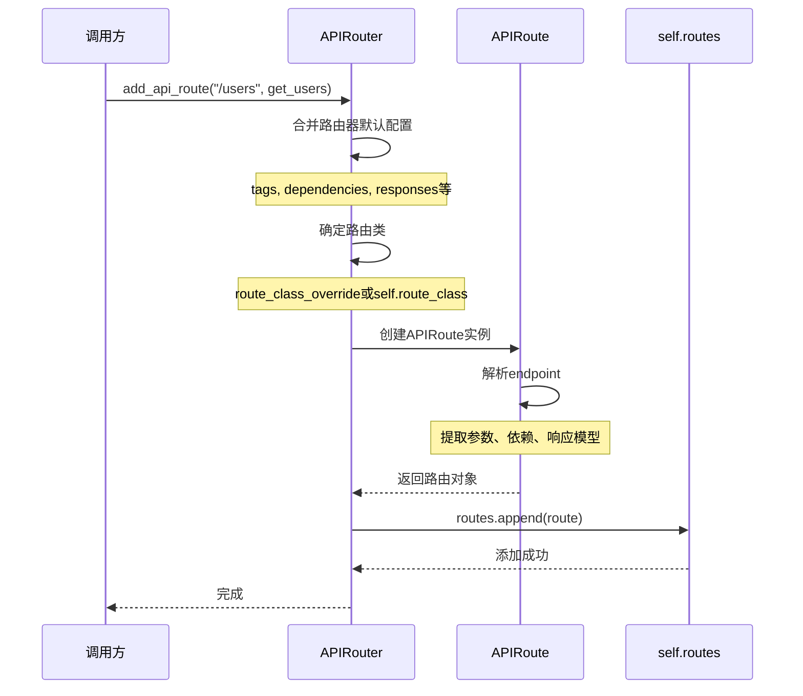

**时序图说明**：

1. **图意概述**: 展示路由注册的完整流程，从参数合并到路由对象创建
2. **关键字段**: path会与router.prefix合并；tags/dependencies会与路由器默认值合并
3. **边界条件**: path可以为空字符串；endpoint必须是可调用对象
4. **异常路径**: endpoint不可调用会在后续请求时报错
5. **性能要点**: 路由注册在启动时完成，对运行时性能无影响

#### 使用示例

**示例1：基本路由注册**

```python
router = APIRouter()

async def get_items():
    return {"items": []}

router.add_api_route("/items", get_items, methods=["GET"])
```

**示例2：带响应模型的注册**

```python
from pydantic import BaseModel

class Item(BaseModel):
    id: int
    name: str

async def create_item(item: Item) -> Item:
    return item

router.add_api_route(
    "/items",
    create_item,
    methods=["POST"],
    response_model=Item,
    status_code=201,
    tags=["items"],
)
```

**示例3：批量注册不同HTTP方法**

```python
async def handle_item(item_id: int):
    return {"id": item_id}

router.add_api_route("/items/{item_id}", handle_item, methods=["GET", "PUT", "DELETE"])
```

---

### 3. api_route()

#### 基本信息
- **功能**: 通用路由装饰器，可指定多个HTTP方法
- **类型**: 装饰器
- **用途**: 灵活的路由注册方式

#### 函数签名

```python
def api_route(
    self,
    path: str,
    *,
    response_model: Any = Default(None),
    status_code: Optional[int] = None,
    tags: Optional[List[Union[str, Enum]]] = None,
    dependencies: Optional[Sequence[params.Depends]] = None,
    summary: Optional[str] = None,
    description: Optional[str] = None,
    # ... 与add_api_route相同的参数
    methods: Optional[List[str]] = None,
) -> Callable[[DecoratedCallable], DecoratedCallable]
```

#### 核心代码

```python
def api_route(
    self,
    path: str,
    *,
    # ... 所有参数
) -> Callable[[DecoratedCallable], DecoratedCallable]:
    def decorator(func: DecoratedCallable) -> DecoratedCallable:
        self.add_api_route(
            path,
            func,
            response_model=response_model,
            status_code=status_code,
            tags=tags,
            dependencies=dependencies,
            # ... 所有参数
        )
        return func
    
    return decorator
```

**实现说明**：

- `api_route()` 是 `add_api_route()` 的装饰器封装
- 接受相同的参数
- 返回原始函数（不修改函数）

#### 使用示例

```python
@router.api_route("/items/{item_id}", methods=["GET", "PUT"])
async def item_operations(item_id: int):
    return {"id": item_id}
```

---

## 路由装饰器API

### 4. HTTP方法装饰器系列

FastAPI为每个HTTP方法提供了专用装饰器，它们都是`api_route()`的特化版本。

#### 4.1 get()

```python
def get(
    self,
    path: str,
    *,
    response_model: Any = Default(None),
    status_code: Optional[int] = None,
    # ... 其他参数（同api_route，但无methods参数）
) -> Callable[[DecoratedCallable], DecoratedCallable]:
    return self.api_route(
        path=path,
        response_model=response_model,
        status_code=status_code,
        # ... 其他参数
        methods=["GET"],
    )
```

**核心实现**：

```python
def get(self, path: str, **kwargs) -> Callable:
    return self.api_route(path, methods=["GET"], **kwargs)
```

**使用示例**：

```python
@router.get("/items")
async def read_items():
    return []

@router.get("/items/{item_id}", response_model=Item)
async def read_item(item_id: int):
    return {"id": item_id, "name": "Item"}
```

#### 4.2 post()

```python
def post(self, path: str, **kwargs) -> Callable:
    return self.api_route(path, methods=["POST"], **kwargs)
```

**常用配置**：

- `status_code=201`（创建资源）
- `response_model`（返回创建的资源）

**使用示例**：

```python
@router.post("/items", status_code=201, response_model=Item)
async def create_item(item: Item):
    return item
```

#### 4.3 put()

```python
def put(self, path: str, **kwargs) -> Callable:
    return self.api_route(path, methods=["PUT"], **kwargs)
```

**使用示例**：

```python
@router.put("/items/{item_id}", response_model=Item)
async def update_item(item_id: int, item: Item):
    item.id = item_id
    return item
```

#### 4.4 delete()

```python
def delete(self, path: str, **kwargs) -> Callable:
    return self.api_route(path, methods=["DELETE"], **kwargs)
```

**常用配置**：

- `status_code=204`（无内容）
- `response_model=None`（无响应体）

**使用示例**：

```python
@router.delete("/items/{item_id}", status_code=204)
async def delete_item(item_id: int):
    return None
```

#### 4.5 其他HTTP方法

| 方法 | 装饰器 | 常见用途 |
|------|--------|----------|
| **PATCH** | `@router.patch()` | 部分更新资源 |
| **OPTIONS** | `@router.options()` | CORS预检请求 |
| **HEAD** | `@router.head()` | 获取响应头 |
| **TRACE** | `@router.trace()` | 调试与诊断 |

#### HTTP方法装饰器对比

```mermaid
graph TB
    A[api_route] --> B[get]
    A --> C[post]
    A --> D[put]
    A --> E[delete]
    A --> F[patch]
    A --> G[options]
    A --> H[head]
    A --> I[trace]
    
    B -->|methods=['GET']| J[add_api_route]
    C -->|methods=['POST']| J
    D -->|methods=['PUT']| J
    E -->|methods=['DELETE']| J
```

**图说明**：

1. **图意**: 所有HTTP方法装饰器都通过`api_route()`最终调用`add_api_route()`
2. **关键点**: 唯一区别是`methods`参数的值
3. **边界条件**: 可以在`api_route()`中指定多个methods
4. **性能**: 所有装饰器性能相同，仅是语法糖

---

## 路由包含API

### 6. include_router()

#### 基本信息
- **功能**: 包含另一个路由器，实现路由嵌套
- **用途**: 模块化路由结构
- **特性**: 支持前缀、标签、依赖继承

#### 完整参数列表

```python
def include_router(
    self,
    router: APIRouter,
    *,
    prefix: str = "",
    tags: Optional[List[Union[str, Enum]]] = None,
    dependencies: Optional[Sequence[params.Depends]] = None,
    responses: Optional[Dict[Union[int, str], Dict[str, Any]]] = None,
    deprecated: Optional[bool] = None,
    include_in_schema: bool = True,
    default_response_class: Type[Response] = Default(JSONResponse),
    callbacks: Optional[List[BaseRoute]] = None,
    generate_unique_id_function: Callable[[APIRoute], str] = Default(generate_unique_id),
) -> None
```

#### 核心参数

| 参数 | 类型 | 说明 |
|------|------|------|
| **router** | APIRouter | 要包含的子路由器 |
| **prefix** | str | 额外的路径前缀（会叠加） |
| **tags** | List[str] | 额外的标签（会叠加） |
| **dependencies** | Sequence[Depends] | 额外的依赖（会叠加） |
| **responses** | Dict | 额外的响应定义（会合并） |

#### 核心代码

```python
def include_router(
    self,
    router: APIRouter,
    *,
    prefix: str = "",
    tags: Optional[List[Union[str, Enum]]] = None,
    dependencies: Optional[Sequence[params.Depends]] = None,
    # ... 其他参数
) -> None:
    # 验证prefix格式
    if prefix:
        assert prefix.startswith("/"), "A path prefix must start with '/'"
        assert not prefix.endswith("/"), "A path prefix must not end with '/'"
    
    # 遍历子路由器的所有路由
    for route in router.routes:
        if isinstance(route, APIRoute):
            # 合并配置
            combined_tags = (tags or []) + (route.tags or [])
            combined_dependencies = list(dependencies or []) + list(route.dependencies or [])
            combined_responses = {**(responses or {}), **(route.responses or {})}
            
            # 重新注册路由到当前路由器
            self.add_api_route(
                prefix + route.path,
                route.endpoint,
                response_model=route.response_model,
                status_code=route.status_code,
                tags=combined_tags,
                dependencies=combined_dependencies,
                responses=combined_responses,
                # ... 其他属性
            )
        elif isinstance(route, routing.Route):
            # 普通路由（非API路由）
            self.add_route(
                prefix + route.path,
                route.endpoint,
                methods=route.methods,
                name=route.name,
                include_in_schema=route.include_in_schema,
            )
        elif isinstance(route, APIWebSocketRoute):
            # WebSocket路由
            self.add_api_websocket_route(
                prefix + route.path,
                route.endpoint,
                name=route.name,
            )
```

#### 执行流程

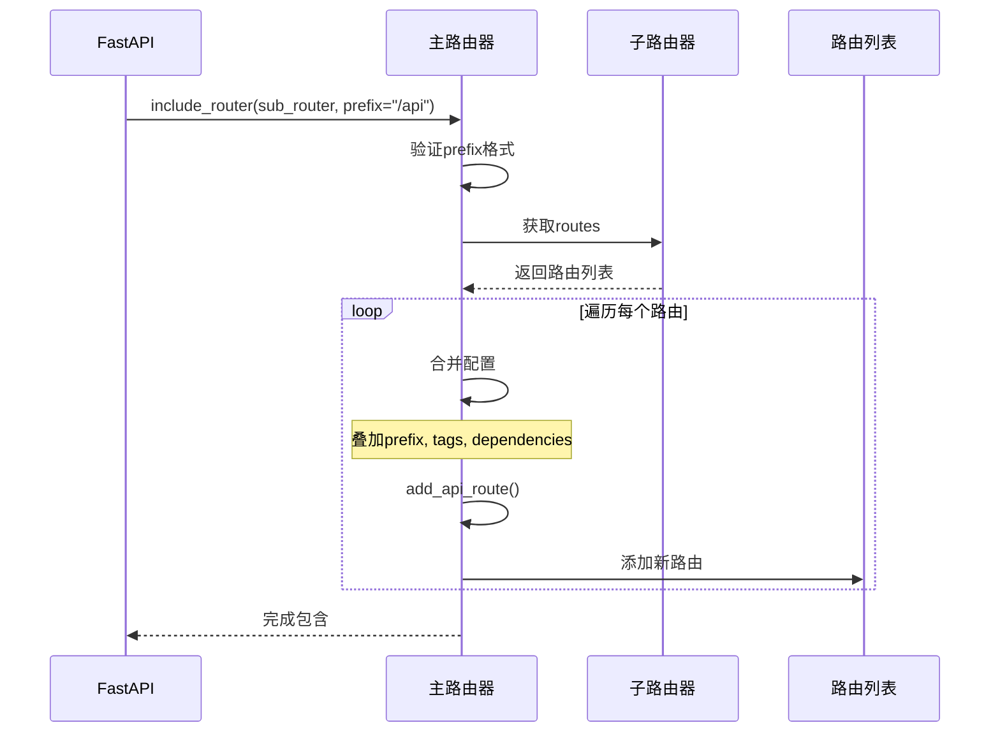

**时序图说明**：

1. **图意概述**: 展示路由包含的配置合并和路由复制过程
2. **关键字段**: prefix会叠加；tags、dependencies会合并
3. **边界条件**: 空prefix有效；路由可以嵌套多层
4. **异常路径**: prefix格式错误抛出AssertionError
5. **性能要点**: 路由复制在启动时完成，不影响运行时性能

#### 使用示例

**示例1：基本包含**

```python
from fastapi import FastAPI, APIRouter

app = FastAPI()
router = APIRouter()

@router.get("/users")
async def get_users():
    return []

app.include_router(router, prefix="/api/v1")
# 实际路径: /api/v1/users
```

**示例2：多级嵌套**

```python
# users_router.py
users_router = APIRouter()

@users_router.get("/")
async def list_users():
    return []

@users_router.get("/{user_id}")
async def get_user(user_id: int):
    return {"id": user_id}

# api_router.py
api_router = APIRouter(prefix="/api/v1")
api_router.include_router(users_router, prefix="/users", tags=["users"])

# main.py
app = FastAPI()
app.include_router(api_router)
# 实际路径: /api/v1/users/, /api/v1/users/{user_id}
```

**示例3：带共享依赖**

```python
async def verify_token(token: str):
    # 验证逻辑
    pass

users_router = APIRouter()

@users_router.get("/me")
async def get_current_user():
    return {"user": "current"}

app.include_router(
    users_router,
    prefix="/api",
    dependencies=[Depends(verify_token)],
)
# 所有路由都会自动应用token验证
```

#### 配置叠加规则

| 配置项 | 叠加方式 | 示例 |
|--------|----------|------|
| **prefix** | 字符串拼接 | `/api` + `/users` = `/api/users` |
| **tags** | 列表合并 | `["api"]` + `["users"]` = `["api", "users"]` |
| **dependencies** | 列表合并 | `[auth]` + `[rate_limit]` = `[auth, rate_limit]` |
| **responses** | 字典合并 | `{404: ...}` + `{500: ...}` = `{404: ..., 500: ...}` |

---

## 路由匹配API

### 路由匹配机制

FastAPI的路由匹配基于Starlette，使用以下机制：

#### 匹配算法

```python
# 内部实现（简化版）
def match(self, scope: Scope) -> Tuple[Match, Scope]:
    for route in self.routes:
        match, child_scope = route.matches(scope)
        if match == Match.FULL:
            return Match.FULL, child_scope
        elif match == Match.PARTIAL:
            # 部分匹配，继续尝试
            pass
    return Match.NONE, {}
```

#### 匹配优先级

1. **完全匹配** > 参数匹配
2. **注册顺序**：先注册的优先
3. **路径深度**：更具体的路径优先

**示例**：

```python
@router.get("/users/me")  # 优先级1：完全匹配
async def get_current_user():
    pass

@router.get("/users/{user_id}")  # 优先级2：参数匹配
async def get_user(user_id: int):
    pass
```

#### 路径参数解析

```python
# 路径模式
"/users/{user_id}"        # 基本参数
"/users/{user_id:int}"    # 类型约束（Starlette）
"/files/{file_path:path}" # 路径参数（包含/）
```

**解析流程**：

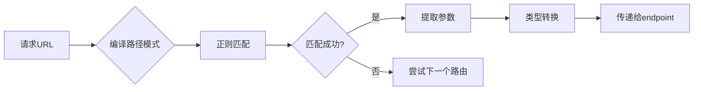

---

## 最佳实践

### 1. 路由组织结构

**推荐结构**：

```
app/
├── main.py
├── routers/
│   ├── __init__.py
│   ├── users.py
│   ├── items.py
│   └── auth.py
```

**main.py**：

```python
from fastapi import FastAPI
from app.routers import users, items, auth

app = FastAPI()

app.include_router(auth.router, prefix="/auth", tags=["authentication"])
app.include_router(users.router, prefix="/users", tags=["users"])
app.include_router(items.router, prefix="/items", tags=["items"])
```

**routers/users.py**：

```python
from fastapi import APIRouter

router = APIRouter()

@router.get("/")
async def list_users():
    return []

@router.get("/{user_id}")
async def get_user(user_id: int):
    return {"id": user_id}
```

### 2. 版本管理

**方案1：前缀版本**

```python
app.include_router(router_v1, prefix="/api/v1")
app.include_router(router_v2, prefix="/api/v2")
```

**方案2：域名版本**

```python
# v1.example.com
# v2.example.com
```

### 3. 共享依赖

```python
# dependencies.py
async def get_db():
    db = Database()
    try:
        yield db
    finally:
        await db.close()

# router.py
router = APIRouter(dependencies=[Depends(get_db)])

@router.get("/items")
async def get_items(db=Depends(get_db)):
    # db自动注入
    return await db.query("SELECT * FROM items")
```

### 4. 路由命名约定

| 操作 | HTTP方法 | 路径 | 函数名 |
|------|----------|------|--------|
| 列表 | GET | `/items` | `list_items()` |
| 详情 | GET | `/items/{id}` | `get_item()` |
| 创建 | POST | `/items` | `create_item()` |
| 更新 | PUT | `/items/{id}` | `update_item()` |
| 删除 | DELETE | `/items/{id}` | `delete_item()` |

### 5. 性能优化

**优化点**：

1. ✅ 静态路由放在参数路由之前
2. ✅ 合理使用依赖缓存
3. ✅ 避免过深的路由嵌套（影响匹配性能）

**示例**：

```python
# ✅ 正确：静态路由在前
@router.get("/users/me")
async def current_user(): pass

@router.get("/users/{user_id}")
async def get_user(user_id: int): pass

# ❌ 错误：参数路由在前（会降低匹配效率）
@router.get("/users/{user_id}")
async def get_user(user_id: int): pass

@router.get("/users/me")  # 永远不会匹配到！
async def current_user(): pass
```

### 6. 错误处理

```python
from fastapi import HTTPException

@router.get("/items/{item_id}")
async def get_item(item_id: int):
    if item_id not in items:
        raise HTTPException(status_code=404, detail="Item not found")
    return items[item_id]
```

### 7. OpenAPI配置

```python
router = APIRouter(
    prefix="/api/v1",
    tags=["v1"],
    responses={
        404: {"description": "Not found"},
        500: {"description": "Internal server error"},
    },
)

@router.get(
    "/items/{item_id}",
    summary="Get an item",
    description="Retrieve a single item by ID",
    response_description="The requested item",
)
async def get_item(item_id: int):
    return {"id": item_id}
```

---

## 📚 相关文档

- [FastAPI-02-路由系统-概览](./FastAPI-02-路由系统-概览.md) - 路由系统整体架构
- [FastAPI-02-路由系统-数据结构](./FastAPI-02-路由系统-数据结构.md) - APIRoute等数据结构
- [FastAPI-02-路由系统-时序图](./FastAPI-02-路由系统-时序图.md) - 路由注册与匹配流程
- [FastAPI-03-依赖注入-概览](./FastAPI-03-依赖注入-概览.md) - 依赖注入机制

---

## 📊 API汇总表

| API | 类型 | 用途 | 复杂度 |
|-----|------|------|--------|
| `APIRouter()` | 构造器 | 创建路由器 | ⭐ |
| `add_api_route()` | 方法 | 注册路由 | ⭐⭐ |
| `api_route()` | 装饰器 | 通用路由装饰器 | ⭐ |
| `get/post/put/delete()` | 装饰器 | HTTP方法装饰器 | ⭐ |
| `include_router()` | 方法 | 包含子路由器 | ⭐⭐ |

---

*本文档生成于 2025年10月4日，基于 FastAPI 0.118.0*

---

## 数据结构

> **文档版本**: v1.0  
> **FastAPI 版本**: 0.118.0  
> **创建日期**: 2025年10月4日

---

## 📋 目录

1. [数据结构概览](#数据结构概览)
2. [APIRoute类详解](#apiroute类详解)
3. [APIRouter类详解](#apirouter类详解)
4. [APIWebSocketRoute类详解](#apiwebsocketroute类详解)
5. [路径编译结构](#路径编译结构)
6. [路由匹配结构](#路由匹配结构)
7. [UML类图](#uml类图)

---

## 数据结构概览

### 核心数据结构清单

| 类名 | 继承自 | 文件位置 | 职责 |
|------|--------|----------|------|
| **APIRoute** | `starlette.routing.Route` | `routing.py:504` | HTTP路由 |
| **APIRouter** | `starlette.routing.Router` | `routing.py:671` | 路由器/路由分组 |
| **APIWebSocketRoute** | `starlette.routing.WebSocketRoute` | `routing.py:464` | WebSocket路由 |
| **Mount** | `starlette.routing.Mount` | 继承 | 子应用挂载 |
| **Dependant** | - | `dependencies/models.py` | 依赖树节点 |

### 继承关系

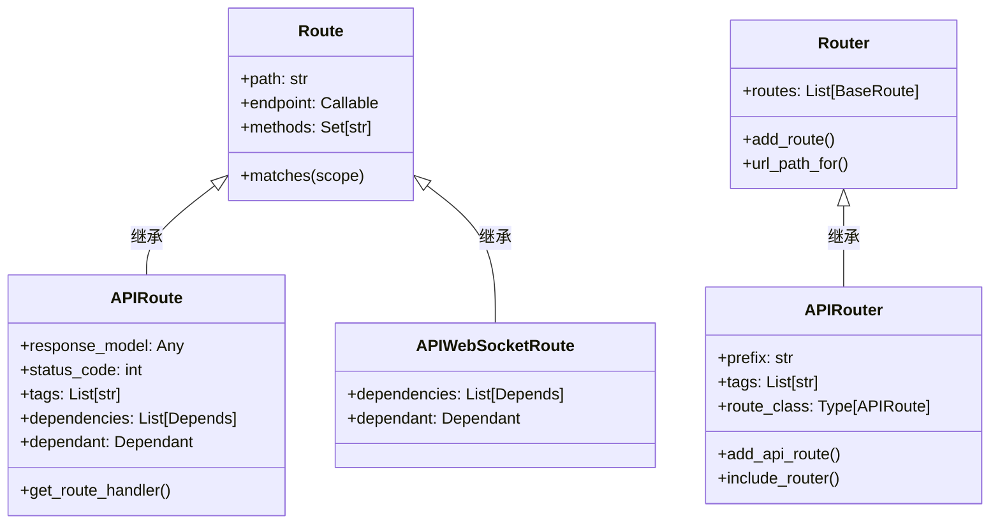

**类图说明**：

1. **图意概述**: FastAPI路由体系在Starlette基础上扩展，增加了响应模型、依赖注入等功能
2. **关键字段**: `dependant`字段存储依赖树；`response_model`存储响应类型
3. **边界条件**: APIRoute和APIWebSocketRoute都支持依赖注入
4. **设计演进**: FastAPI保持与Starlette的兼容性，通过继承扩展功能

---

## APIRoute类详解

### 类定义

```python
class APIRoute(routing.Route):
    """
    HTTP API路由，支持依赖注入、响应模型验证、OpenAPI文档生成
    """
```

### 完整属性列表

#### 路径与端点

| 属性 | 类型 | 说明 |
|------|------|------|
| **path** | str | 路由路径（如 `/users/{user_id}`） |
| **endpoint** | Callable | 路由处理函数 |
| **methods** | Set[str] | HTTP方法集合（如 `{"GET", "POST"}`） |
| **name** | Optional[str] | 路由名称，用于`url_path_for()` |

#### 响应配置

| 属性 | 类型 | 说明 |
|------|------|------|
| **response_model** | Any | Pydantic响应模型 |
| **status_code** | Optional[int] | 默认HTTP状态码 |
| **response_class** | Type[Response] | 响应类（默认JSONResponse） |
| **response_description** | str | 响应描述（OpenAPI） |
| **response_model_include** | Optional[IncEx] | 响应字段白名单 |
| **response_model_exclude** | Optional[IncEx] | 响应字段黑名单 |
| **response_model_by_alias** | bool | 使用字段别名 |
| **response_model_exclude_unset** | bool | 排除未设置字段 |
| **response_model_exclude_defaults** | bool | 排除默认值字段 |
| **response_model_exclude_none** | bool | 排除None值字段 |

#### OpenAPI配置

| 属性 | 类型 | 说明 |
|------|------|------|
| **tags** | Optional[List[Union[str, Enum]]] | 标签列表 |
| **summary** | Optional[str] | API摘要 |
| **description** | Optional[str] | API详细描述 |
| **operation_id** | Optional[str] | OpenAPI operation ID |
| **deprecated** | Optional[bool] | 是否标记为废弃 |
| **include_in_schema** | bool | 是否包含在OpenAPI中 |
| **responses** | Optional[Dict] | 额外的响应定义 |
| **callbacks** | Optional[List[BaseRoute]] | OpenAPI callbacks |
| **openapi_extra** | Optional[Dict[str, Any]] | 额外的OpenAPI字段 |

#### 依赖注入

| 属性 | 类型 | 说明 |
|------|------|------|
| **dependencies** | List[params.Depends] | 依赖列表 |
| **dependant** | Dependant | 依赖树根节点 |
| **body_field** | Optional[ModelField] | 请求体字段 |
| **dependency_overrides_provider** | Optional[Any] | 依赖覆盖提供者 |

#### 路径解析

| 属性 | 类型 | 说明 |
|------|------|------|
| **path_regex** | Pattern | 路径正则表达式 |
| **path_format** | str | 格式化后的路径 |
| **param_convertors** | Dict[str, Convertor] | 路径参数转换器 |

### UML类图

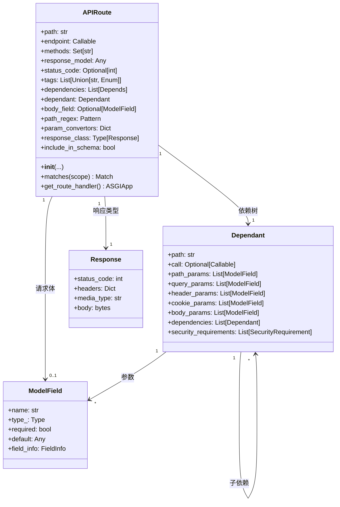

**类图说明**：

1. **图意概述**: APIRoute是路由的核心，包含路径、处理函数、依赖树、响应配置等完整信息
2. **关键字段**: `dependant`是依赖树的根节点，包含所有参数和子依赖；`response_model`用于响应验证
3. **边界条件**: response_model为None时不进行响应验证；methods为空时默认为GET
4. **版本演进**: FastAPI 0.100+支持`openapi_extra`扩展OpenAPI字段

### 初始化流程

```python
class APIRoute(routing.Route):
    def __init__(
        self,
        path: str,
        endpoint: Callable[..., Any],
        *,
        response_model: Any = Default(None),
        status_code: Optional[int] = None,
        tags: Optional[List[Union[str, Enum]]] = None,
        dependencies: Optional[Sequence[params.Depends]] = None,
        # ... 其他参数
    ) -> None:
        # 1. 保存基本信息
        self.path = path
        self.endpoint = endpoint
        
        # 2. 推断响应模型（如果未指定）
        if isinstance(response_model, DefaultPlaceholder):
            return_annotation = get_typed_return_annotation(endpoint)
            if lenient_issubclass(return_annotation, Response):
                response_model = None
            else:
                response_model = return_annotation
        self.response_model = response_model
        
        # 3. 保存OpenAPI配置
        self.summary = summary
        self.response_description = response_description
        self.deprecated = deprecated
        self.operation_id = operation_id
        
        # 4. 保存响应模型配置
        self.response_model_include = response_model_include
        self.response_model_exclude = response_model_exclude
        self.response_model_by_alias = response_model_by_alias
        self.response_model_exclude_unset = response_model_exclude_unset
        self.response_model_exclude_defaults = response_model_exclude_defaults
        self.response_model_exclude_none = response_model_exclude_none
        
        # 5. 构建依赖树
        self.dependant = get_dependant(path=path, call=endpoint)
        for depends in (dependencies or [])[::-1]:
            self.dependant.dependencies.insert(
                0,
                get_parameterless_sub_dependant(depends=depends, path=path),
            )
        
        # 6. 提取请求体字段
        self.body_field = get_body_field(
            dependant=self.dependant,
            name=operation_id or self.unique_id,
        )
        
        # 7. 编译路径模式
        self.path_regex, self.path_format, self.param_convertors = compile_path(path)
        
        # 8. 调用父类构造器
        super().__init__(
            path,
            endpoint=self.get_route_handler(),
            methods=methods,
            name=name,
            include_in_schema=include_in_schema,
        )
```

**初始化步骤说明**：

1. **保存基本信息**：路径和端点函数
2. **推断响应模型**：从函数返回类型注解推断
3. **保存OpenAPI配置**：标签、摘要、描述等
4. **构建依赖树**：解析函数参数和依赖
5. **提取请求体**：识别Body参数
6. **编译路径**：生成正则表达式和参数转换器
7. **调用父类**：传递ASGI应用

### get_route_handler()方法

```python
def get_route_handler(self) -> Callable:
    """
    生成实际的ASGI应用，处理请求
    """
    async def app(request: Request) -> Response:
        # 1. 解析依赖
        solved_result = await solve_dependencies(
            request=request,
            dependant=self.dependant,
            body=body,
            dependency_overrides_provider=self.dependency_overrides_provider,
        )
        values, errors, background_tasks, sub_response, _ = solved_result
        
        # 2. 验证错误
        if errors:
            raise RequestValidationError(errors, body=body)
        
        # 3. 调用endpoint
        raw_response = await run_endpoint_function(
            dependant=self.dependant,
            values=values,
            is_coroutine=is_coroutine,
        )
        
        # 4. 处理响应
        if isinstance(raw_response, Response):
            return raw_response
        
        # 5. 验证响应模型
        if self.response_model:
            response_data = _prepare_response_content(
                raw_response,
                exclude_unset=self.response_model_exclude_unset,
                exclude_defaults=self.response_model_exclude_defaults,
                exclude_none=self.response_model_exclude_none,
            )
            validation_error = None
            try:
                response_data = self.response_field.validate(response_data)
            except ValidationError as e:
                validation_error = e
            if validation_error:
                raise ResponseValidationError(validation_error)
        
        # 6. 返回响应
        return self.response_class(
            content=response_data,
            status_code=self.status_code,
            background=background_tasks,
        )
    
    return request_response(app)
```

**核心逻辑说明**：

1. **解析依赖**：递归解析所有依赖，注入到endpoint
2. **验证错误**：如果有验证错误，抛出`RequestValidationError`
3. **调用endpoint**：执行实际的业务逻辑
4. **处理响应**：如果返回Response对象，直接返回
5. **验证响应模型**：使用Pydantic验证响应数据
6. **返回响应**：封装为Response对象

---

## APIRouter类详解

### 类定义

```python
class APIRouter(routing.Router):
    """
    路由器/路由分组，用于组织和模块化路由
    """
```

### 完整属性列表

| 属性 | 类型 | 说明 |
|------|------|------|
| **prefix** | str | 路由前缀 |
| **tags** | List[Union[str, Enum]] | 标签列表 |
| **dependencies** | List[params.Depends] | 依赖列表 |
| **default_response_class** | Type[Response] | 默认响应类 |
| **responses** | Dict | 额外响应定义 |
| **callbacks** | List[BaseRoute] | OpenAPI callbacks |
| **route_class** | Type[APIRoute] | 路由类 |
| **routes** | List[BaseRoute] | 路由列表（继承自Router） |
| **deprecated** | Optional[bool] | 是否废弃 |
| **include_in_schema** | bool | 是否包含在schema中 |
| **generate_unique_id_function** | Callable | 生成唯一ID的函数 |
| **dependency_overrides_provider** | Optional[Any] | 依赖覆盖提供者 |
| **redirect_slashes** | bool | 重定向末尾斜杠 |
| **default** | Optional[ASGIApp] | 404处理器 |

### UML类图

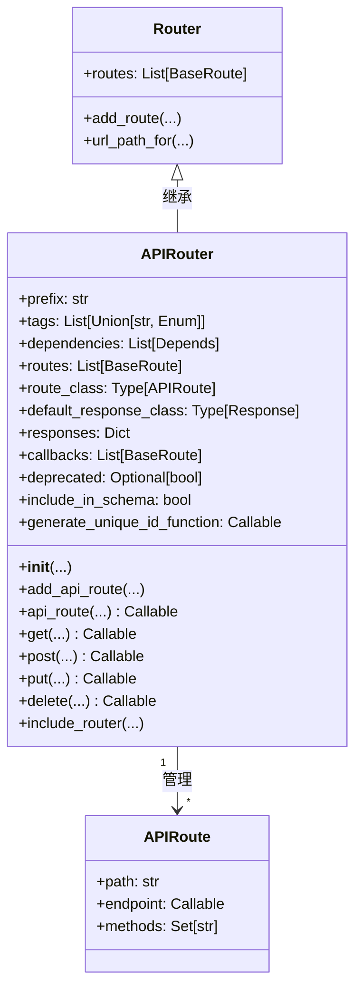

**类图说明**：

1. **图意概述**: APIRouter继承自Starlette Router，管理多个APIRoute
2. **关键字段**: `prefix`和`tags`会应用到所有子路由；`route_class`允许自定义路由类
3. **边界条件**: prefix必须以`/`开头，不能以`/`结尾
4. **性能要点**: routes列表在启动时构建，运行时只读

### 路由注册流程

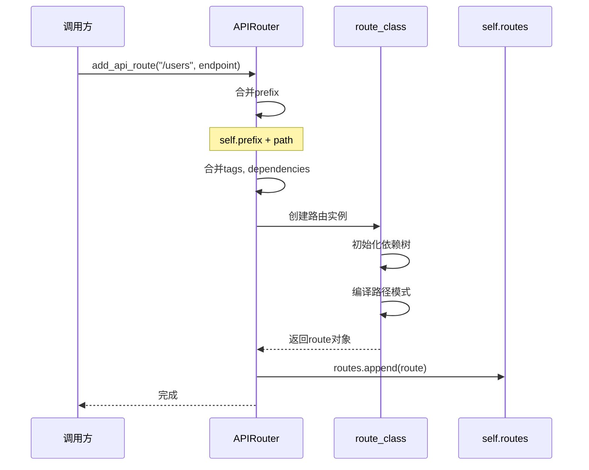

**时序图说明**：

1. **图意概述**: 路由注册时，prefix、tags、dependencies会叠加到路由上
2. **关键字段**: path与prefix拼接；tags和dependencies合并
3. **边界条件**: 空prefix有效；tags/dependencies为None时使用空列表
4. **性能要点**: 路由注册在启动时完成，O(1)时间复杂度

---

## APIWebSocketRoute类详解

### 类定义

```python
class APIWebSocketRoute(routing.WebSocketRoute):
    """
    WebSocket路由，支持依赖注入
    """
```

### 完整属性列表

| 属性 | 类型 | 说明 |
|------|------|------|
| **path** | str | 路由路径 |
| **endpoint** | Callable | WebSocket处理函数 |
| **name** | Optional[str] | 路由名称 |
| **dependencies** | List[params.Depends] | 依赖列表 |
| **dependant** | Dependant | 依赖树 |
| **path_regex** | Pattern | 路径正则 |
| **path_format** | str | 格式化路径 |
| **param_convertors** | Dict | 参数转换器 |
| **dependency_overrides_provider** | Optional[Any] | 依赖覆盖提供者 |

### 初始化流程

```python
class APIWebSocketRoute(routing.WebSocketRoute):
    def __init__(
        self,
        path: str,
        endpoint: Callable[..., Any],
        *,
        name: Optional[str] = None,
        dependencies: Optional[Sequence[params.Depends]] = None,
        dependency_overrides_provider: Optional[Any] = None,
    ) -> None:
        # 1. 保存基本信息
        self.path = path
        self.endpoint = endpoint
        self.name = get_name(endpoint) if name is None else name
        self.dependencies = list(dependencies or [])
        
        # 2. 编译路径
        self.path_regex, self.path_format, self.param_convertors = compile_path(path)
        
        # 3. 构建依赖树
        self.dependant = get_dependant(path=self.path_format, call=self.endpoint)
        for depends in self.dependencies[::-1]:
            self.dependant.dependencies.insert(
                0,
                get_parameterless_sub_dependant(depends=depends, path=self.path_format),
            )
        
        # 4. 获取扁平化依赖
        self._flat_dependant = get_flat_dependant(self.dependant)
        self._embed_body_fields = _should_embed_body_fields(
            self._flat_dependant.body_params
        )
        
        # 5. 创建ASGI应用
        self.app = websocket_session(
            get_websocket_app(
                dependant=self.dependant,
                dependency_overrides_provider=dependency_overrides_provider,
                embed_body_fields=self._embed_body_fields,
            )
        )
```

---

## 路径编译结构

### compile_path()函数

```python
def compile_path(path: str) -> Tuple[Pattern, str, Dict[str, Convertor]]:
    """
    编译路径模式为正则表达式
    
    参数:
        path: 路径模式，如 "/users/{user_id:int}"
    
    返回:
        (path_regex, path_format, param_convertors)
    """
```

### 路径参数格式

| 格式 | 说明 | 示例 |
|------|------|------|
| `{name}` | 基本参数（匹配非`/`字符） | `/users/{user_id}` |
| `{name:int}` | 整数参数 | `/users/{user_id:int}` |
| `{name:float}` | 浮点数参数 | `/price/{value:float}` |
| `{name:path}` | 路径参数（可包含`/`） | `/files/{file_path:path}` |
| `{name:uuid}` | UUID参数 | `/items/{item_id:uuid}` |

### 参数转换器

```python
class Convertor:
    """参数转换器基类"""
    regex: str  # 正则表达式
    
    def convert(self, value: str) -> Any:
        """将字符串转换为目标类型"""
        raise NotImplementedError
    
    def to_string(self, value: Any) -> str:
        """将值转换为字符串"""
        raise NotImplementedError
```

**内置转换器**：

```mermaid
classDiagram
    class Convertor {
        <<abstract>>
        +regex: str
        +convert(value) Any
        +to_string(value) str
    }
    
    class StringConvertor {
        +regex: "[^/]+"
        +convert(value) str
        +to_string(value) str
    }
    
    class IntConvertor {
        +regex: "[0-9]+"
        +convert(value) int
        +to_string(value) str
    }
    
    class FloatConvertor {
        +regex: "[0-9]+(\\.[0-9]+)?"
        +convert(value) float
        +to_string(value) str
    }
    
    class PathConvertor {
        +regex: ".*"
        +convert(value) str
        +to_string(value) str
    }
    
    class UUIDConvertor {
        +regex: "[0-9a-f]{8}-..."
        +convert(value) UUID
        +to_string(value) str
    }
    
    Convertor <|-- StringConvertor
    Convertor <|-- IntConvertor
    Convertor <|-- FloatConvertor
    Convertor <|-- PathConvertor
    Convertor <|-- UUIDConvertor
```

---

## 路由匹配结构

### Match枚举

```python
class Match(IntEnum):
    NONE = 0    # 不匹配
    PARTIAL = 1 # 部分匹配（用于Mount）
    FULL = 2    # 完全匹配
```

### 匹配流程

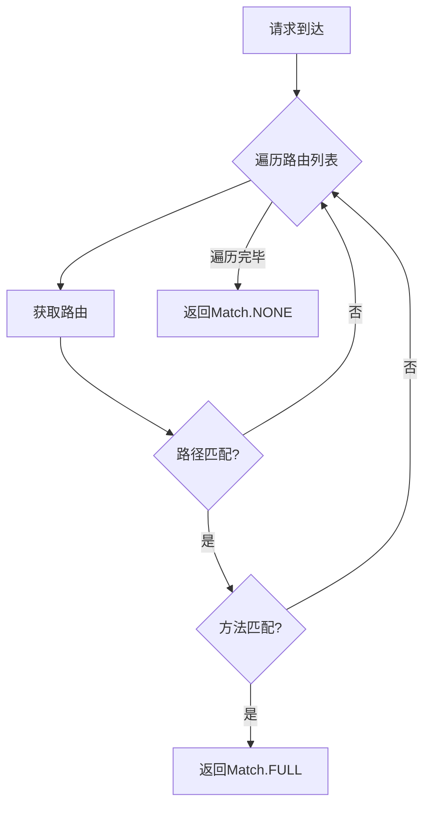

**匹配逻辑说明**：

1. **路径匹配**：使用正则表达式匹配路径
2. **方法匹配**：检查HTTP方法是否在允许列表中
3. **参数提取**：使用参数转换器提取并转换路径参数
4. **优先级**：按注册顺序匹配，先注册的优先

### 路由匹配数据结构

```python
@dataclass
class MatchResult:
    """路由匹配结果"""
    match: Match  # 匹配状态
    scope: Scope  # 更新后的ASGI scope
    
    # scope中包含：
    # - "path_params": Dict[str, Any]  # 路径参数
    # - "route": BaseRoute             # 匹配的路由
    # - "endpoint": Callable           # 端点函数
```

---

## UML类图

### 完整类图

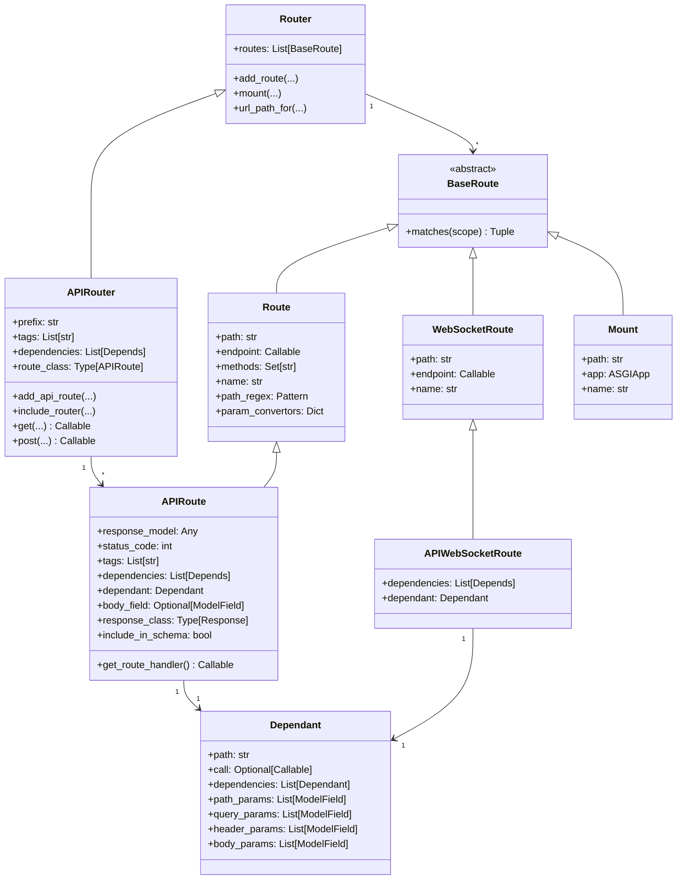

**完整类图说明**：

1. **图意概述**: FastAPI路由体系的完整继承关系和组合关系
2. **关键字段**: 所有路由都有path和endpoint；API路由额外有dependant和response_model
3. **边界条件**: Router可以包含任何BaseRoute子类；APIRouter专门管理APIRoute
4. **设计模式**: 使用继承扩展Starlette功能；使用组合管理依赖树
5. **版本兼容**: 保持与Starlette的兼容性，可以混用不同类型的路由

---

## 数据结构关系总结

### 核心关系

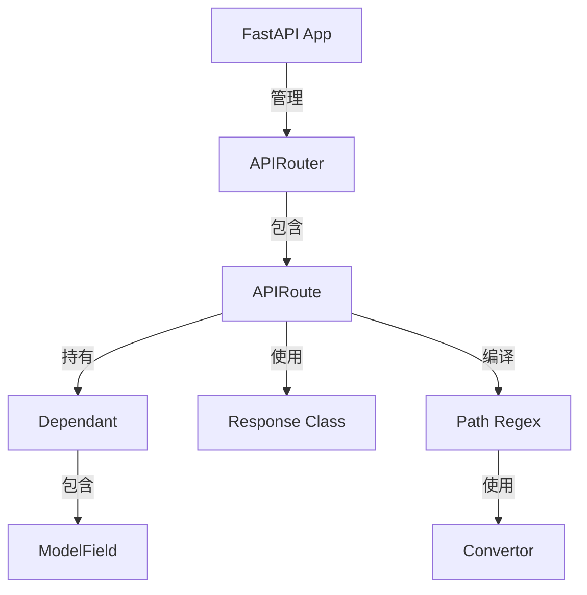

### 数据流转


### 配置继承

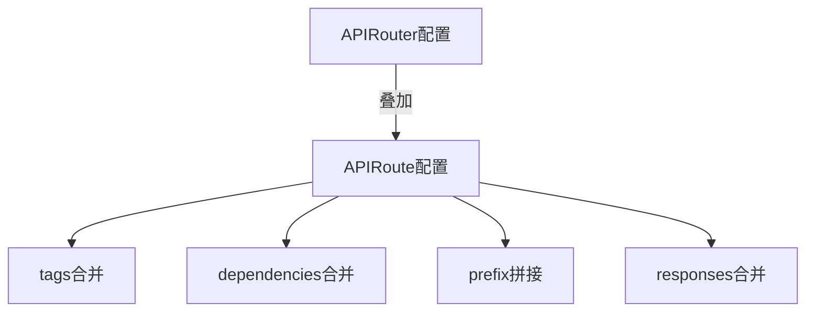

---

## 📚 相关文档

- [FastAPI-02-路由系统-概览](./FastAPI-02-路由系统-概览.md) - 路由系统架构
- [FastAPI-02-路由系统-API](./FastAPI-02-路由系统-API.md) - 路由API详解
- [FastAPI-02-路由系统-时序图](./FastAPI-02-路由系统-时序图.md) - 路由流程时序图
- [FastAPI-03-依赖注入-数据结构](./FastAPI-03-依赖注入-数据结构.md) - Dependant详解

---

## 📊 数据结构统计

| 类型 | 数量 | 说明 |
|------|------|------|
| 核心类 | 3 | APIRoute, APIRouter, APIWebSocketRoute |
| 属性总数 | 50+ | 包含所有配置属性 |
| 继承层级 | 2-3层 | 基于Starlette扩展 |
| 依赖关系 | 10+ | 与Dependant、ModelField等关联 |

---

*本文档生成于 2025年10月4日，基于 FastAPI 0.118.0*

---

## 时序图

> **文档版本**: v1.0  
> **FastAPI 版本**: 0.118.0  
> **创建日期**: 2025年10月4日

---

## 📋 目录

1. [时序图概览](#时序图概览)
2. [路由注册流程](#路由注册流程)
3. [路由匹配流程](#路由匹配流程)
4. [子路由包含流程](#子路由包含流程)
5. [路径参数解析流程](#路径参数解析流程)
6. [请求处理完整流程](#请求处理完整流程)
7. [WebSocket路由处理流程](#websocket路由处理流程)

---

## 时序图概览

### 核心流程清单

| # | 流程名称 | 参与组件 | 复杂度 | 频率 |
|---|---------|----------|--------|------|
| 1 | 路由注册流程 | APIRouter, APIRoute, Dependant | ⭐⭐ | 启动时 |
| 2 | 路由匹配流程 | Router, Route, Path Regex | ⭐⭐⭐ | 每个请求 |
| 3 | 子路由包含流程 | APIRouter, APIRoute | ⭐⭐ | 启动时 |
| 4 | 路径参数解析 | Convertor, Path Regex | ⭐⭐ | 每个请求 |
| 5 | 请求处理完整流程 | 所有组件 | ⭐⭐⭐⭐ | 每个请求 |
| 6 | WebSocket处理流程 | APIWebSocketRoute, Dependant | ⭐⭐⭐ | WS连接 |

---

## 路由注册流程

### 1.1 使用装饰器注册路由

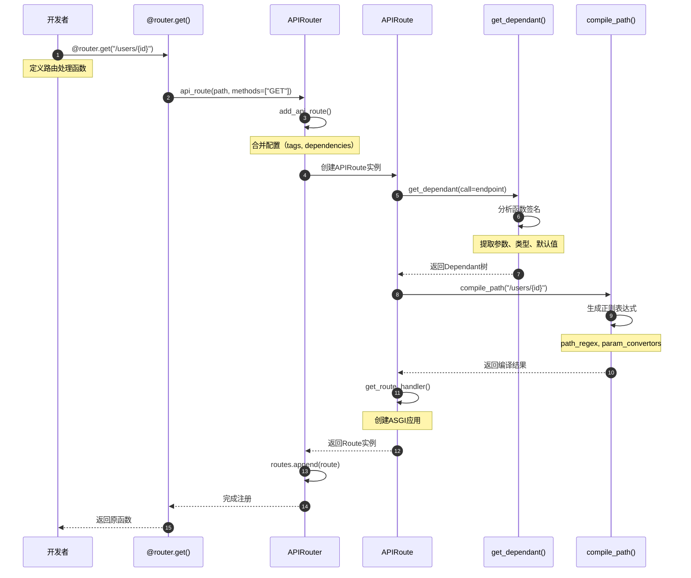

**时序图说明**：

1. **图意概述**: 展示使用装饰器注册路由的完整流程，包括依赖解析和路径编译
2. **关键字段**: `dependant`存储所有参数信息；`path_regex`用于路径匹配
3. **边界条件**: 函数签名错误会在get_dependant()阶段报错；路径格式错误在compile_path()阶段报错
4. **异常路径**: 路径格式错误抛出ValueError；参数类型不支持抛出FastAPIError
5. **性能假设**: 路由注册在启动时完成一次，O(n)复杂度，n为参数数量
6. **版本兼容**: FastAPI 0.100+支持所有类型注解

### 1.2 直接调用add_api_route()注册

```mermaid
sequenceDiagram
    autonumber
    participant User as 调用方
    participant Router as APIRouter
    participant Route as APIRoute
    
    User->>Router: add_api_route("/items", endpoint)
    Router->>Router: 获取默认配置
    Note over Router: self.tags, self.dependencies等
    Router->>Router: 合并用户配置
    Note over Router: tags = user_tags or self.tags
    
    Router->>Route: APIRoute(prefix + path, ...)
    Note over Route: 完整路径 = prefix + path
    Route->>Route: __init__()
    Note over Route: 构建依赖树、编译路径
    Route-->>Router: 返回route实例
    
    Router->>Router: self.routes.append(route)
    Router-->>User: 完成
```

**时序图说明**：

1. **图意概述**: 直接调用add_api_route()的简化流程
2. **关键点**: prefix会自动与path拼接；tags和dependencies会合并
3. **边界条件**: prefix为空时直接使用path；tags为None时使用空列表
4. **性能**: O(1)时间复杂度，仅做列表append操作

---

## 路由匹配流程

### 2.1 完整路由匹配流程

```mermaid
sequenceDiagram
    autonumber
    participant Request as 请求
    participant App as FastAPI App
    participant Router as Router
    participant Route as APIRoute
    participant Regex as path_regex
    participant Conv as Convertor
    
    Request->>App: HTTP GET /users/123
    App->>Router: route(scope)
    Note over Router: scope = {"path": "/users/123", ...}
    
    loop 遍历routes
        Router->>Route: matches(scope)
        Route->>Regex: regex.match(path)
        Regex-->>Route: match对象 or None
        
        alt 路径匹配成功
            Route->>Route: 检查HTTP方法
            alt 方法匹配成功
                Route->>Conv: 提取并转换参数
                Note over Conv: "123" -> 123 (int)
                Conv-->>Route: {"user_id": 123}
                Route-->>Router: (Match.FULL, scope)
                Note over Router: 更新scope["path_params"]
            else 方法不匹配
                Route-->>Router: (Match.NONE, {})
            end
        else 路径不匹配
            Route-->>Router: (Match.NONE, {})
        end
    end
    
    Router-->>App: 匹配结果
    
    alt 匹配成功
        App->>Route: 调用endpoint
    else 未匹配
        App->>App: 404 Not Found
    end
```

**时序图说明**：

1. **图意概述**: 展示请求到达后，路由匹配的完整流程，包括路径匹配和参数提取
2. **关键字段**: scope["path"]用于匹配；scope["path_params"]存储提取的参数
3. **边界条件**: 按注册顺序匹配，先匹配到的优先；无匹配返回404
4. **异常路径**: 路径匹配成功但参数转换失败，继续尝试下一个路由
5. **性能假设**: 路由数量n，平均匹配时间O(n)；静态路由O(1)
6. **优化点**: 静态路由应放在参数路由之前，可减少匹配次数

### 2.2 路径参数类型转换

```mermaid
sequenceDiagram
    autonumber
    participant Route as APIRoute
    participant Conv as Convertor
    participant Type as 类型系统
    
    Route->>Conv: convert("123")
    Conv->>Conv: 识别转换器类型
    Note over Conv: IntConvertor, FloatConvertor等
    
    alt IntConvertor
        Conv->>Type: int("123")
        Type-->>Conv: 123
    else FloatConvertor
        Conv->>Type: float("3.14")
        Type-->>Conv: 3.14
    else UUIDConvertor
        Conv->>Type: UUID("...")
        Type-->>Conv: UUID对象
    else PathConvertor
        Conv-->>Conv: 直接返回字符串
    end
    
    Conv-->>Route: 转换后的值
```

**时序图说明**：

1. **图意概述**: 路径参数的类型转换过程
2. **关键点**: 每种参数类型有对应的Convertor
3. **异常路径**: 转换失败抛出ValueError
4. **性能**: O(1)时间复杂度

---

## 子路由包含流程

### 3.1 include_router()完整流程

```mermaid
sequenceDiagram
    autonumber
    participant App as FastAPI
    participant MainRouter as 主路由器
    participant SubRouter as 子路由器
    participant Routes as routes列表
    participant Route as APIRoute
    
    App->>MainRouter: include_router(sub, prefix="/api")
    MainRouter->>MainRouter: 验证prefix格式
    Note over MainRouter: 必须以/开头，不以/结尾
    
    MainRouter->>SubRouter: 获取routes
    SubRouter-->>MainRouter: 返回路由列表
    
    loop 遍历子路由器的每个路由
        MainRouter->>Route: 获取路由信息
        MainRouter->>MainRouter: 叠加配置
        Note over MainRouter: 合并prefix, tags, dependencies
        
        MainRouter->>MainRouter: add_api_route()
        Note over MainRouter: prefix="/api" + route.path="/users"<br/>= "/api/users"
        
        MainRouter->>Routes: 创建新路由并添加
        Note over Routes: 新路由包含合并后的配置
    end
    
    MainRouter-->>App: 完成包含
```

**时序图说明**：

1. **图意概述**: 展示子路由包含的配置合并和路由复制过程
2. **关键字段**: prefix叠加拼接；tags和dependencies列表合并；responses字典合并
3. **边界条件**: 可以多层嵌套包含；空prefix有效
4. **异常路径**: prefix格式错误抛出AssertionError
5. **性能假设**: 子路由数量m，时间复杂度O(m)
6. **设计理由**: 通过复制路由实现配置继承，而不是运行时动态计算

### 3.2 多层嵌套包含

```mermaid
sequenceDiagram
    autonumber
    participant App as FastAPI
    participant ApiRouter as api_router
    participant UsersRouter as users_router
    participant Route as 实际路由
    
    UsersRouter->>UsersRouter: add_api_route("/", endpoint)
    Note over UsersRouter: 路径: "/"
    
    ApiRouter->>UsersRouter: include_router(prefix="/users")
    ApiRouter->>ApiRouter: 创建新路由
    Note over ApiRouter: 路径: "/users" + "/" = "/users"
    
    App->>ApiRouter: include_router(prefix="/api/v1")
    App->>App: 创建新路由
    Note over App: 路径: "/api/v1" + "/users" = "/api/v1/users"
    
    Note over Route: 最终路径: /api/v1/users
```

**时序图说明**：

1. **图意概述**: 多层路由嵌套时的prefix叠加过程
2. **关键点**: 每层include_router都会重新注册路由，叠加prefix
3. **边界条件**: 理论上支持无限层嵌套
4. **性能**: 嵌套层数k，路由数n，总复杂度O(k*n)

---

## 路径参数解析流程

### 4.1 compile_path()路径编译

```mermaid
sequenceDiagram
    autonumber
    participant Router as APIRouter
    participant Compile as compile_path()
    participant Regex as re模块
    participant Conv as Convertor工厂
    
    Router->>Compile: compile_path("/users/{user_id:int}/posts/{post_id}")
    Compile->>Compile: 解析路径模式
    Note over Compile: 识别参数：user_id, post_id
    
    Compile->>Conv: 创建IntConvertor (user_id)
    Conv-->>Compile: IntConvertor实例
    
    Compile->>Conv: 创建StringConvertor (post_id)
    Conv-->>Compile: StringConvertor实例
    
    Compile->>Compile: 构建正则表达式
    Note over Compile: ^/users/(?P<user_id>[0-9]+)/posts/(?P<post_id>[^/]+)$
    
    Compile->>Regex: re.compile(pattern)
    Regex-->>Compile: Pattern对象
    
    Compile-->>Router: (regex, format, convertors)
    Note over Router: format="/users/{user_id}/posts/{post_id}"<br/>convertors={"user_id": IntConvertor, ...}
```

**时序图说明**：

1. **图意概述**: 路径编译过程，将路径模式转换为正则表达式和参数转换器
2. **关键字段**: regex用于匹配；convertors用于类型转换
3. **边界条件**: 支持嵌套参数；支持自定义转换器
4. **性能**: 编译在启动时完成，O(m)复杂度，m为参数数量

### 4.2 请求时参数提取

```mermaid
sequenceDiagram
    autonumber
    participant Request as 请求
    participant Route as APIRoute
    participant Regex as path_regex
    participant Conv as Convertor
    participant Scope as scope字典
    
    Request->>Route: /users/123/posts/456
    Route->>Regex: regex.match("/users/123/posts/456")
    Regex->>Regex: 匹配各个捕获组
    Regex-->>Route: match.groupdict()
    Note over Route: {"user_id": "123", "post_id": "456"}
    
    loop 遍历每个参数
        Route->>Conv: convert("123")
        Conv->>Conv: int("123")
        Conv-->>Route: 123
    end
    
    Route->>Scope: 更新path_params
    Scope->>Scope: {"user_id": 123, "post_id": "456"}
    Scope-->>Route: 完成
```

---

## 请求处理完整流程

### 5.1 从请求到响应的完整链路

```mermaid
sequenceDiagram
    autonumber
    participant Client as 客户端
    participant Server as ASGI Server
    participant App as FastAPI
    participant Router as Router
    participant Route as APIRoute
    participant Handler as get_route_handler()
    participant Deps as solve_dependencies()
    participant Endpoint as 端点函数
    participant Valid as 响应验证
    participant Response as Response
    
    Client->>Server: HTTP Request
    Server->>App: ASGI(scope, receive, send)
    App->>Router: route(scope)
    
    Router->>Route: matches(scope)
    Route->>Route: 路径匹配 + 参数提取
    Route-->>Router: Match.FULL + scope
    Router-->>App: 返回matched route
    
    App->>Handler: 调用ASGI app
    Handler->>Deps: solve_dependencies(request, dependant)
    Deps->>Deps: 递归解析依赖树
    Note over Deps: 提取参数、调用依赖函数
    Deps-->>Handler: values字典
    
    Handler->>Endpoint: endpoint(**values)
    Endpoint->>Endpoint: 执行业务逻辑
    Endpoint-->>Handler: 返回结果
    
    alt 返回Response对象
        Handler-->>App: 直接返回
    else 返回其他对象
        Handler->>Valid: 验证响应模型
        Valid->>Valid: Pydantic验证
        Valid-->>Handler: 验证后的数据
        Handler->>Response: 创建Response
        Response-->>Handler: Response对象
    end
    
    Handler-->>App: Response
    App-->>Server: Response
    Server-->>Client: HTTP Response
```

**时序图说明**：

1. **图意概述**: 展示从客户端请求到服务端响应的完整处理链路
2. **关键字段**: scope传递请求信息；values存储解析后的参数
3. **边界条件**: 依赖解析失败返回422；业务逻辑异常返回500
4. **异常路径**: 验证失败→RequestValidationError→422响应
5. **性能假设**: 依赖数量d，参数数量p，复杂度O(d+p)
6. **优化点**: 依赖缓存可减少重复计算；响应模型验证可选

### 5.2 依赖注入详细流程

```mermaid
sequenceDiagram
    autonumber
    participant Handler as Route Handler
    participant Solve as solve_dependencies()
    participant Dep1 as 依赖1
    participant Dep2 as 依赖2 (嵌套)
    participant Cache as 依赖缓存
    
    Handler->>Solve: solve_dependencies(dependant)
    Solve->>Solve: 遍历依赖树
    
    loop 处理每个依赖
        Solve->>Cache: 检查缓存
        alt 缓存命中
            Cache-->>Solve: 返回缓存值
        else 缓存未命中
            Solve->>Dep1: 调用依赖函数
            
            alt 依赖有子依赖
                Dep1->>Solve: 递归解析子依赖
                Solve->>Dep2: 调用子依赖
                Dep2-->>Solve: 子依赖结果
                Solve-->>Dep1: 传入子依赖结果
            end
            
            Dep1-->>Solve: 依赖结果
            Solve->>Cache: 缓存结果
        end
    end
    
    Solve-->>Handler: 所有依赖的值
```

---

## WebSocket路由处理流程

### 6.1 WebSocket连接建立与处理

```mermaid
sequenceDiagram
    autonumber
    participant Client as WebSocket客户端
    participant App as FastAPI
    participant Route as APIWebSocketRoute
    participant Deps as solve_dependencies()
    participant Endpoint as WebSocket端点
    participant WS as WebSocket连接
    
    Client->>App: WebSocket连接请求
    App->>Route: matches(scope)
    Route->>Route: 路径匹配
    Route-->>App: Match.FULL
    
    App->>Route: 调用websocket_app
    Route->>Deps: solve_dependencies(websocket)
    Deps->>Deps: 解析依赖
    Deps-->>Route: values
    
    Route->>Endpoint: endpoint(websocket, **values)
    Endpoint->>WS: await websocket.accept()
    WS-->>Client: 连接建立
    
    loop WebSocket通信
        Client->>WS: 发送消息
        WS->>Endpoint: await websocket.receive_text()
        Endpoint->>Endpoint: 处理消息
        Endpoint->>WS: await websocket.send_text()
        WS-->>Client: 响应消息
    end
    
    alt 正常关闭
        Client->>WS: 关闭连接
        WS->>Endpoint: 触发disconnect
        Endpoint->>Endpoint: 清理资源
    else 异常关闭
        Endpoint->>Endpoint: 捕获异常
        Endpoint->>WS: 关闭连接
    end
    
    Endpoint-->>Route: 完成
    Route-->>App: 完成
```

**时序图说明**：

1. **图意概述**: WebSocket从连接建立到关闭的完整生命周期
2. **关键字段**: websocket对象贯穿整个生命周期；依赖在连接建立时解析一次
3. **边界条件**: 依赖解析失败拒绝连接；消息处理异常关闭连接
4. **异常路径**: 连接被拒绝→WebSocketDisconnect；消息格式错误→关闭连接
5. **性能假设**: 连接保持期间，依赖不会重新解析
6. **资源管理**: yield依赖在连接关闭时自动清理

---

## 📊 时序图总结

### 核心流程对比

| 流程 | 执行时机 | 频率 | 复杂度 | 性能影响 |
|------|----------|------|--------|----------|
| 路由注册 | 应用启动 | 一次 | O(n) | 无 |
| 路由匹配 | 每个请求 | 高频 | O(r) | 中 |
| 参数提取 | 匹配成功后 | 高频 | O(p) | 低 |
| 依赖解析 | 每个请求 | 高频 | O(d) | 高 |
| 响应验证 | 返回响应时 | 高频 | O(f) | 中 |

*r=路由数量, p=参数数量, d=依赖数量, f=响应字段数量*

### 性能优化建议

1. **路由匹配优化**
   - ✅ 静态路由放在参数路由之前
   - ✅ 减少路由总数
   - ✅ 使用精确匹配而非模糊匹配

2. **依赖解析优化**
   - ✅ 启用依赖缓存
   - ✅ 减少依赖层级
   - ✅ 避免在依赖中执行IO操作

3. **响应验证优化**
   - ✅ 仅在开发环境启用response_model
   - ✅ 使用exclude_unset减少验证字段
   - ✅ 对大响应使用StreamingResponse

---

## 📚 相关文档

- [FastAPI-02-路由系统-概览](./FastAPI-02-路由系统-概览.md) - 路由系统架构
- [FastAPI-02-路由系统-API](./FastAPI-02-路由系统-API.md) - 路由API详解
- [FastAPI-02-路由系统-数据结构](./FastAPI-02-路由系统-数据结构.md) - 路由数据结构
- [FastAPI-03-依赖注入-时序图](./FastAPI-03-依赖注入-时序图.md) - 依赖解析详细流程

---

*本文档生成于 2025年10月4日，基于 FastAPI 0.118.0*

---
