# FastAPI-03-依赖注入

## 模块概览

## 模块职责

依赖注入系统（`dependencies/` 模块）是 FastAPI 最具创新性和核心的特性之一。它负责：

### 主要职责

1. **依赖树构建**
   - 分析函数签名，提取参数类型和注解
   - 递归解析依赖项，构建依赖树
   - 识别参数来源（Path、Query、Body、Header、Cookie 等）
   - 区分普通参数和依赖项

2. **依赖执行**
   - 按依赖关系顺序执行依赖项
   - 处理同步和异步依赖
   - 管理依赖结果缓存（请求级）
   - 处理 yield 依赖的上下文管理

3. **参数解析与验证**
   - 从 Request 对象提取参数
   - 使用 Pydantic 验证参数类型和约束
   - 处理默认值和可选参数
   - 合并多个参数源

4. **安全集成**
   - 支持安全方案作为依赖项
   - 管理安全作用域（Security Scopes）
   - 集成 OAuth2、API Key 等认证机制

## 核心概念

### Dependant（依赖项）

`Dependant` 是依赖注入系统的核心数据结构，表示一个可调用对象（函数、类）及其所有参数信息。

```python
@dataclass
class Dependant:
    # 各类参数
    path_params: List[ModelField]      # 路径参数
    query_params: List[ModelField]     # 查询参数
    header_params: List[ModelField]    # 头部参数
    cookie_params: List[ModelField]    # Cookie 参数
    body_params: List[ModelField]      # 请求体参数
    
    # 子依赖
    dependencies: List[Dependant]      # 子依赖列表
    
    # 安全相关
    security_requirements: List[SecurityRequirement]  # 安全需求
    security_scopes: Optional[List[str]]             # 安全作用域
    
    # 可调用对象
    call: Optional[Callable]           # 依赖函数
    
    # 特殊参数
    request_param_name: Optional[str]            # Request 参数名
    websocket_param_name: Optional[str]          # WebSocket 参数名
    response_param_name: Optional[str]           # Response 参数名
    background_tasks_param_name: Optional[str]   # BackgroundTasks 参数名
    
    # 缓存配置
    use_cache: bool = True             # 是否缓存结果
    cache_key: Tuple                   # 缓存键
```

### 依赖树

依赖树是 `Dependant` 对象的层级结构，表示依赖关系：

```
路由处理函数 (Dependant)
├── 依赖项 A (Dependant)
│   ├── 子依赖 A1 (Dependant)
│   └── 子依赖 A2 (Dependant)
├── 依赖项 B (Dependant)
│   └── 子依赖 B1 (Dependant)
│       └── 子子依赖 B1a (Dependant)
└── 依赖项 C (Dependant)
```

### 依赖缓存

依赖项在同一请求中默认只执行一次，结果被缓存：

- **缓存键**：`(callable, security_scopes)` 元组
- **缓存范围**：单个请求
- **缓存存储**：`solved_dependencies` 字典
- **缓存控制**：通过 `use_cache` 参数控制

### yield 依赖

支持使用 `yield` 的依赖项，实现资源的获取和释放：

```python
async def get_db():
    db = Database()
    try:
        yield db  # 返回资源给路由函数
    finally:
        await db.close()  # 请求结束后自动清理
```

## 模块架构图

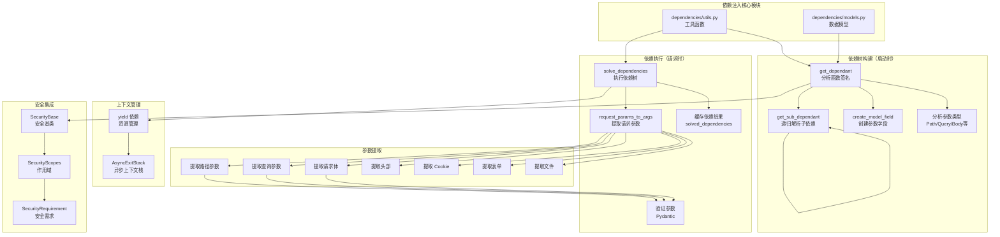
```mermaid
flowchart TB
    subgraph "依赖注入核心模块"
        UtilsModule[dependencies/utils.py<br/>工具函数]
        ModelsModule[dependencies/models.py<br/>数据模型]
    end
    
    subgraph "依赖树构建（启动时）"
        GetDependant[get_dependant<br/>分析函数签名]
        GetSubDependant[get_sub_dependant<br/>递归解析子依赖]
        CreateModelField[create_model_field<br/>创建参数字段]
        AnalyzeParam[分析参数类型<br/>Path/Query/Body等]
    end
    
    subgraph "依赖执行（请求时）"
        SolveDependencies[solve_dependencies<br/>执行依赖树]
        RequestParamExtractor[request_params_to_args<br/>提取请求参数]
        ValidateParams[验证参数<br/>Pydantic]
        CacheDeps[缓存依赖结果<br/>solved_dependencies]
    end
    
    subgraph "参数提取"
        ExtractPath[提取路径参数]
        ExtractQuery[提取查询参数]
        ExtractBody[提取请求体]
        ExtractHeader[提取头部]
        ExtractCookie[提取 Cookie]
        ExtractForm[提取表单]
        ExtractFile[提取文件]
    end
    
    subgraph "上下文管理"
        AsyncExitStack[AsyncExitStack<br/>异步上下文栈]
        YieldDeps[yield 依赖<br/>资源管理]
    end
    
    subgraph "安全集成"
        SecurityBase[SecurityBase<br/>安全基类]
        SecurityScopes[SecurityScopes<br/>作用域]
        SecurityRequirement[SecurityRequirement<br/>安全需求]
    end
    
    UtilsModule --> GetDependant
    UtilsModule --> SolveDependencies
    ModelsModule --> GetDependant
    
    GetDependant --> GetSubDependant
    GetDependant --> CreateModelField
    GetDependant --> AnalyzeParam
    GetSubDependant --> GetSubDependant
    
    SolveDependencies --> RequestParamExtractor
    SolveDependencies --> CacheDeps
    RequestParamExtractor --> ExtractPath
    RequestParamExtractor --> ExtractQuery
    RequestParamExtractor --> ExtractBody
    RequestParamExtractor --> ExtractHeader
    RequestParamExtractor --> ExtractCookie
    RequestParamExtractor --> ExtractForm
    RequestParamExtractor --> ExtractFile
    
    ExtractPath --> ValidateParams
    ExtractQuery --> ValidateParams
    ExtractBody --> ValidateParams
    
    SolveDependencies --> YieldDeps
    YieldDeps --> AsyncExitStack
    
    GetDependant --> SecurityBase
    SecurityBase --> SecurityScopes
    SecurityScopes --> SecurityRequirement
```

## 依赖注入工作流程

### 阶段1：依赖树构建（启动时）

```mermaid
flowchart TB
    Start[路由注册]
    AnalyzeFunc[分析路由函数签名]
    
    LoopParams{遍历参数}
    CheckType{参数类型?}
    
    IsDepends[Depends(...)]
    IsPath[路径参数]
    IsQuery[查询参数]
    IsBody[Body 模型]
    IsHeader[Header(...)]
    IsCookie[Cookie(...)]
    IsSpecial[特殊类型<br/>Request/Response等]
    
    RecursiveParse[递归解析<br/>get_sub_dependant]
    CreateField[创建 ModelField]
    
    AddToDependencies[添加到 dependencies]
    AddToPathParams[添加到 path_params]
    AddToQueryParams[添加到 query_params]
    AddToBodyParams[添加到 body_params]
    AddToHeaderParams[添加到 header_params]
    AddToCookieParams[添加到 cookie_params]
    SaveSpecialParam[保存特殊参数名]
    
    NextParam[下一个参数]
    AllDone{所有参数完成?}
    CreateDependant[创建 Dependant 对象]
    Cache[缓存到路由]
    End[完成]
    
    Start --> AnalyzeFunc
    AnalyzeFunc --> LoopParams
    
    LoopParams -->|有参数| CheckType
    
    CheckType --> IsDepends
    CheckType --> IsPath
    CheckType --> IsQuery
    CheckType --> IsBody
    CheckType --> IsHeader
    CheckType --> IsCookie
    CheckType --> IsSpecial
    
    IsDepends --> RecursiveParse
    RecursiveParse --> AddToDependencies
    
    IsPath --> CreateField
    CreateField --> AddToPathParams
    
    IsQuery --> AddToQueryParams
    IsBody --> AddToBodyParams
    IsHeader --> AddToHeaderParams
    IsCookie --> AddToCookieParams
    IsSpecial --> SaveSpecialParam
    
    AddToDependencies --> NextParam
    AddToPathParams --> NextParam
    AddToQueryParams --> NextParam
    AddToBodyParams --> NextParam
    AddToHeaderParams --> NextParam
    AddToCookieParams --> NextParam
    SaveSpecialParam --> NextParam
    
    NextParam --> AllDone
    AllDone -->|否| LoopParams
    AllDone -->|是| CreateDependant
    
    CreateDependant --> Cache
    Cache --> End
```

### 阶段2：依赖执行（请求时）

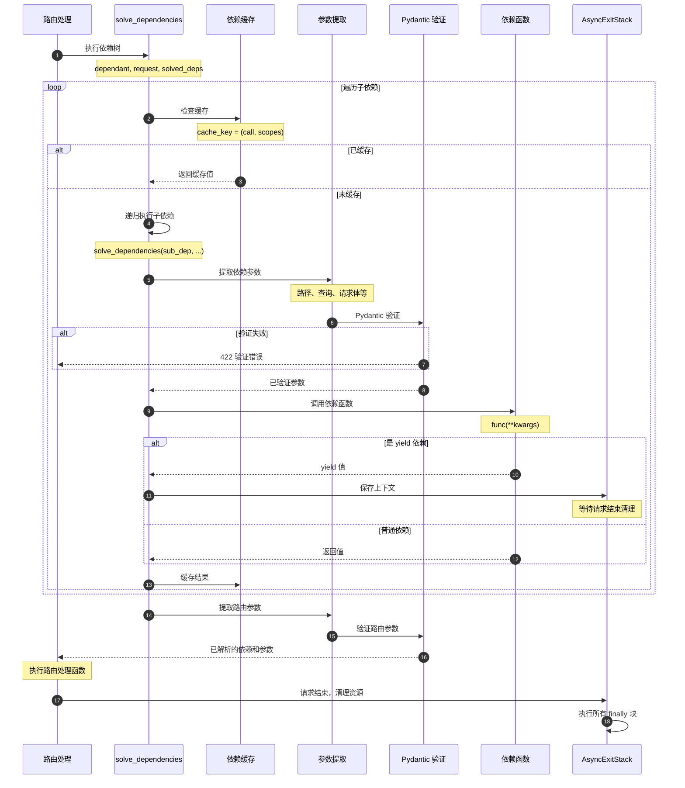
```mermaid
sequenceDiagram
    autonumber
    participant Route as 路由处理
    participant Solver as solve_dependencies
    participant Cache as 依赖缓存
    participant Extractor as 参数提取
    participant Validator as Pydantic 验证
    participant DepFunc as 依赖函数
    participant ExitStack as AsyncExitStack
    
    Route->>Solver: 执行依赖树
    Note over Solver: dependant, request, solved_deps
    
    loop 遍历子依赖
        Solver->>Cache: 检查缓存
        Note over Cache: cache_key = (call, scopes)
        
        alt 已缓存
            Cache-->>Solver: 返回缓存值
        else 未缓存
            Solver->>Solver: 递归执行子依赖
            Note over Solver: solve_dependencies(sub_dep, ...)
            
            Solver->>Extractor: 提取依赖参数
            Note over Extractor: 路径、查询、请求体等
            
            Extractor->>Validator: Pydantic 验证
            alt 验证失败
                Validator-->>Route: 422 验证错误
            end
            
            Validator-->>Solver: 已验证参数
            
            Solver->>DepFunc: 调用依赖函数
            Note over DepFunc: func(**kwargs)
            
            alt 是 yield 依赖
                DepFunc-->>Solver: yield 值
                Solver->>ExitStack: 保存上下文
                Note over ExitStack: 等待请求结束清理
            else 普通依赖
                DepFunc-->>Solver: 返回值
            end
            
            Solver->>Cache: 缓存结果
        end
    end
    
    Solver->>Extractor: 提取路由参数
    Extractor->>Validator: 验证路由参数
    Validator-->>Route: 已解析的依赖和参数
    
    Note over Route: 执行路由处理函数
    
    Route->>ExitStack: 请求结束，清理资源
    ExitStack->>ExitStack: 执行所有 finally 块
```

## 参数识别规则

FastAPI 自动识别参数来源，规则如下：

### 自动识别

```python
@app.get("/items/{item_id}")
async def read_item(
    item_id: int,              # 路径参数（在路径中声明）
    q: str = None,             # 查询参数（标量类型，有默认值）
    item: Item = Body(...),    # 请求体（显式声明）
    user_agent: str = Header(None),  # 头部（显式声明）
):
    pass
```

### 识别流程

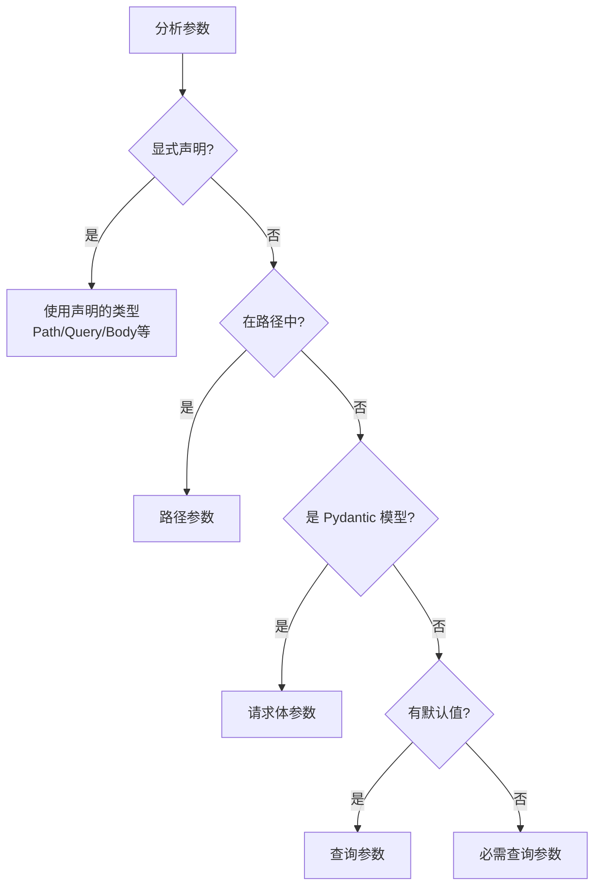
```mermaid
flowchart TB
    Start[分析参数]
    
    CheckExplicit{显式声明?}
    UseDeclared[使用声明的类型<br/>Path/Query/Body等]
    
    CheckPath{在路径中?}
    IsPath[路径参数]
    
    CheckPydantic{是 Pydantic 模型?}
    IsBody[请求体参数]
    
    CheckDefault{有默认值?}
    IsQuery[查询参数]
    IsRequired[必需查询参数]
    
    Start --> CheckExplicit
    CheckExplicit -->|是| UseDeclared
    CheckExplicit -->|否| CheckPath
    
    CheckPath -->|是| IsPath
    CheckPath -->|否| CheckPydantic
    
    CheckPydantic -->|是| IsBody
    CheckPydantic -->|否| CheckDefault
    
    CheckDefault -->|是| IsQuery
    CheckDefault -->|否| IsRequired
```

### 规则总结

| 条件 | 参数类型 | 示例 |
|------|----------|------|
| 在路径中声明 | Path | `/items/{item_id}` → `item_id: int` |
| 显式 `Path(...)` | Path | `item_id: int = Path(...)` |
| 显式 `Query(...)` | Query | `q: str = Query(None)` |
| 显式 `Body(...)` | Body | `item: dict = Body(...)` |
| 显式 `Header(...)` | Header | `user_agent: str = Header(...)` |
| 显式 `Cookie(...)` | Cookie | `session: str = Cookie(...)` |
| 显式 `Form(...)` | Form | `username: str = Form(...)` |
| 显式 `File(...)` | File | `file: UploadFile = File(...)` |
| Pydantic 模型 | Body | `item: Item` |
| 标量类型 + 默认值 | Query | `q: str = None` |
| 标量类型 + 无默认值 | Query (必需) | `q: str` |
| `Depends(...)` | 依赖项 | `user = Depends(get_user)` |
| `Request` | 特殊 | `request: Request` |
| `Response` | 特殊 | `response: Response` |
| `BackgroundTasks` | 特殊 | `tasks: BackgroundTasks` |

## 依赖缓存机制

### 缓存策略

```python
# 依赖函数
async def get_db():
    print("Creating database connection")
    return Database()

# 路由1
@app.get("/users/")
async def list_users(db = Depends(get_db)):  # 执行 get_db()
    return db.query("SELECT * FROM users")

# 路由2（不同请求）
@app.get("/items/")
async def list_items(db = Depends(get_db)):  # 重新执行 get_db()
    return db.query("SELECT * FROM items")

# 同一路由中多次依赖
@app.get("/dashboard/")
async def dashboard(
    db1 = Depends(get_db),  # 执行 get_db()
    db2 = Depends(get_db),  # 使用缓存，不重新执行
):
    # db1 和 db2 是同一个对象
    return {"users": db1.count(), "items": db2.count()}
```

### 缓存键生成

```python
@dataclass
class Dependant:
    call: Optional[Callable]
    security_scopes: Optional[List[str]]
    
    def __post_init__(self):
        # 缓存键 = (函数, 排序后的安全作用域)
        self.cache_key = (
            self.call,
            tuple(sorted(set(self.security_scopes or [])))
        )
```

### 禁用缓存

```python
# 使用 use_cache=False
def get_timestamp(use_cache: bool = Depends(lambda: False)):
    return datetime.now()

@app.get("/time")
async def get_time(
    time1 = Depends(get_timestamp),
    time2 = Depends(get_timestamp),
):
    # 如果不禁用缓存，time1 和 time2 会相同
    # 禁用后，每次都重新执行
    return {"time1": time1, "time2": time2}
```

## yield 依赖与资源管理

### 基本用法

```python
async def get_db():
    db = Database()
    try:
        yield db  # 提供资源
    finally:
        await db.close()  # 清理资源

@app.get("/users/")
async def list_users(db = Depends(get_db)):
    # 自动注入 db
    return db.query("SELECT * FROM users")
    # 路由执行完毕后，自动执行 finally 块
```

### 执行流程

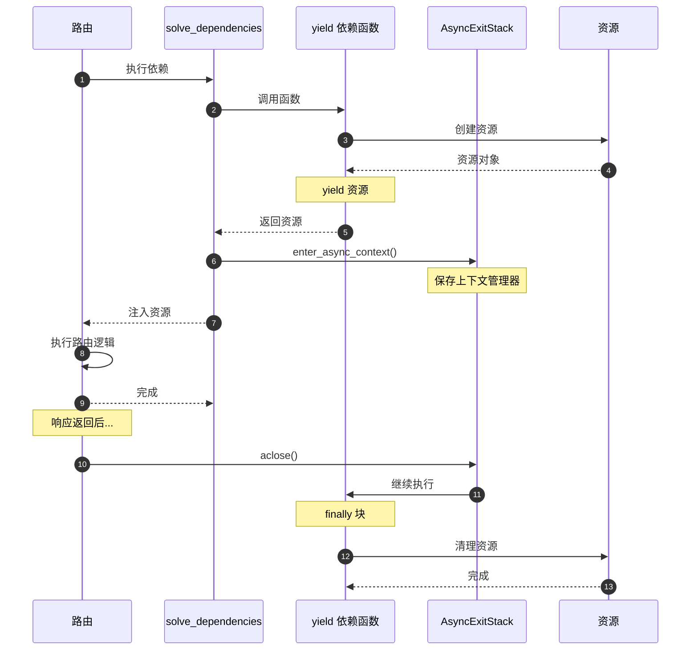
```mermaid
sequenceDiagram
    autonumber
    participant Route as 路由
    participant Solver as solve_dependencies
    participant DepFunc as yield 依赖函数
    participant ExitStack as AsyncExitStack
    participant Resource as 资源
    
    Route->>Solver: 执行依赖
    Solver->>DepFunc: 调用函数
    DepFunc->>Resource: 创建资源
    Resource-->>DepFunc: 资源对象
    
    Note over DepFunc: yield 资源
    
    DepFunc-->>Solver: 返回资源
    Solver->>ExitStack: enter_async_context()
    Note over ExitStack: 保存上下文管理器
    
    Solver-->>Route: 注入资源
    Route->>Route: 执行路由逻辑
    Route-->>Solver: 完成
    
    Note over Route: 响应返回后...
    
    Route->>ExitStack: aclose()
    ExitStack->>DepFunc: 继续执行
    Note over DepFunc: finally 块
    DepFunc->>Resource: 清理资源
    Resource-->>DepFunc: 完成
```

### 多个 yield 依赖

```python
async def get_db():
    db = Database()
    try:
        yield db
    finally:
        await db.close()

async def get_cache():
    cache = Redis()
    try:
        yield cache
    finally:
        await cache.close()

@app.get("/data")
async def get_data(
    db = Depends(get_db),
    cache = Depends(get_cache),
):
    # 使用 db 和 cache
    return data

# 清理顺序：后进先出（LIFO）
# 1. cache.close()
# 2. db.close()
```

## 安全集成

### SecurityBase 作为依赖

```python
from fastapi.security import OAuth2PasswordBearer

oauth2_scheme = OAuth2PasswordBearer(tokenUrl="token")

@app.get("/users/me")
async def read_users_me(token: str = Depends(oauth2_scheme)):
    # oauth2_scheme 是 SecurityBase 的实例
    # FastAPI 自动：
    # 1. 从 Authorization header 提取 token
    # 2. 生成 OpenAPI 安全定义
    # 3. 在 Swagger UI 中显示认证按钮
    return decode_token(token)
```

### SecurityScopes

```python
from fastapi.security import OAuth2PasswordBearer, SecurityScopes

oauth2_scheme = OAuth2PasswordBearer(
    tokenUrl="token",
    scopes={
        "items:read": "Read items",
        "items:write": "Write items",
    }
)

async def get_current_user(
    security_scopes: SecurityScopes,
    token: str = Depends(oauth2_scheme)
):
    # security_scopes.scopes 包含所需的权限
    user = decode_token(token)
    for scope in security_scopes.scopes:
        if scope not in user.scopes:
            raise HTTPException(403, "Not enough permissions")
    return user

@app.get("/items/", dependencies=[Security(get_current_user, scopes=["items:read"])])
async def read_items():
    return items
```

## 性能优化

### 启动时优化

1. **依赖树预构建**：所有路由的依赖树在启动时构建，避免运行时开销
2. **函数签名缓存**：使用 `inspect` 模块分析后缓存结果
3. **参数字段缓存**：`ModelField` 对象在构建时创建并缓存

### 运行时优化

1. **依赖结果缓存**：同一请求中依赖只执行一次
2. **最小化参数提取**：只提取声明的参数，不遍历所有可能的参数源
3. **Pydantic 快速路径**：使用 pydantic-core（Rust 实现）加速验证

### 内存优化

1. **共享依赖树**：相同依赖项共享 `Dependant` 对象
2. **弱引用缓存**：使用弱引用避免循环引用
3. **及时清理上下文**：AsyncExitStack 在响应后立即清理

## 最佳实践

### 数据库会话管理

```python
from sqlalchemy.ext.asyncio import AsyncSession, create_async_engine
from sqlalchemy.orm import sessionmaker

engine = create_async_engine("postgresql+asyncpg://...")
SessionLocal = sessionmaker(engine, class_=AsyncSession, expire_on_commit=False)

async def get_db():
    async with SessionLocal() as session:
        yield session
        # 自动提交或回滚
```

### 分层依赖

```python
# 底层：获取 token
async def get_token(authorization: str = Header(...)):
    if not authorization.startswith("Bearer "):
        raise HTTPException(401)
    return authorization[7:]

# 中层：验证 token，获取用户
async def get_current_user(token: str = Depends(get_token)):
    user = decode_token(token)
    if not user:
        raise HTTPException(401, "Invalid token")
    return user

# 顶层：检查用户权限
async def get_admin_user(user: User = Depends(get_current_user)):
    if not user.is_admin:
        raise HTTPException(403, "Not enough permissions")
    return user

# 使用
@app.get("/admin/dashboard")
async def admin_dashboard(admin: User = Depends(get_admin_user)):
    return {"message": f"Welcome, admin {admin.username}"}
```

### 可配置依赖

```python
from functools import partial

def get_items(skip: int = 0, limit: int = 10):
    return items[skip:skip+limit]

# 创建预配置的依赖
get_first_10_items = partial(get_items, skip=0, limit=10)
get_next_10_items = partial(get_items, skip=10, limit=10)

@app.get("/recent-items")
async def recent_items(items = Depends(get_first_10_items)):
    return items
```

## 常见问题

### Q: 依赖项何时执行？
A: 在路由处理函数执行之前，按依赖树的深度优先顺序执行。

### Q: 可以在依赖项中抛出异常吗？
A: 可以。抛出的 `HTTPException` 会被正确捕获并返回相应的错误响应。

### Q: yield 依赖的清理一定会执行吗？
A: 是的。即使路由函数抛出异常，`finally` 块也会执行。

### Q: 如何在测试中覆盖依赖？
A:

```python
app.dependency_overrides[get_db] = lambda: TestDatabase()
```

### Q: 依赖项可以是类吗？
A: 可以。类的 `__init__` 方法会被作为依赖函数：

```python
class Pagination:
    def __init__(self, skip: int = 0, limit: int = 10):
        self.skip = skip
        self.limit = limit

@app.get("/items")
async def list_items(pagination: Pagination = Depends()):
    return items[pagination.skip:pagination.skip+pagination.limit]
```

### Q: 如何传递额外参数给依赖项？
A: 使用函数工厂或 partial：

```python
def get_items_factory(category: str):
    def get_items():
        return filter_by_category(items, category)
    return get_items

@app.get("/electronics")
async def electronics(items = Depends(get_items_factory("electronics"))):
    return items
```

## 边界条件

### 递归深度
- **建议**：依赖树深度不超过 10 层
- **原因**：过深的依赖树影响性能和可维护性

### 循环依赖
- **检测**：FastAPI 会在启动时检测循环依赖
- **处理**：抛出错误，提示开发者修复

### 并发安全
- **依赖缓存**：线程安全（每个请求独立）
- **yield 依赖**：通过 AsyncExitStack 保证清理顺序
- **全局状态**：避免在依赖项中修改全局状态

### 内存泄漏
- **AsyncExitStack**：确保所有上下文管理器被正确清理
- **缓存清理**：请求结束后清理 `solved_dependencies`
- **弱引用**：避免依赖树中的循环引用

---

## API接口

## 模块API总览

依赖注入模块（`dependencies/`）提供的核心 API 包括：

### 用户API（param_functions.py）
- `Depends()` - 声明依赖项
- `Security()` - 声明安全依赖项（带作用域）

### 内部API（dependencies/utils.py）
- `get_dependant()` - 构建依赖树
- `get_sub_dependant()` - 构建子依赖
- `solve_dependencies()` - 执行依赖树
- `request_params_to_args()` - 提取请求参数

---

## 1. Depends() - 声明依赖项

### 基本信息
- **名称**：`Depends()`
- **模块**：`fastapi.param_functions`
- **用途**：声明路由函数或其他依赖项的依赖

### 函数签名

```python
def Depends(
    dependency: Optional[Callable[..., Any]] = None,
    *,
    use_cache: bool = True
) -> Any
```

### 参数说明

| 参数 | 类型 | 必填 | 默认值 | 说明 |
|------|------|------|--------|------|
| dependency | Callable | 否 | None | 依赖函数或可调用对象，None 时使用参数类型 |
| use_cache | bool | 否 | True | 是否缓存依赖结果（同一请求中） |

### 核心代码

```python
from fastapi import params

def Depends(
    dependency: Optional[Callable[..., Any]] = None,
    *,
    use_cache: bool = True
) -> Any:
    """
    声明依赖项
    
    参数：
        dependency: 依赖函数，返回值会被注入
        use_cache: 是否缓存结果
    
    返回：
        params.Depends 实例
    """
    return params.Depends(dependency=dependency, use_cache=use_cache)
```

### 使用示例

#### 基础用法

```python
from fastapi import FastAPI, Depends

app = FastAPI()

# 依赖函数
def get_db():
    db = Database()
    try:
        yield db
    finally:
        db.close()

# 使用依赖
@app.get("/items/")
async def read_items(db = Depends(get_db)):
    return db.query("SELECT * FROM items")
```

#### 类作为依赖

```python
class Pagination:
    def __init__(self, skip: int = 0, limit: int = 10):
        self.skip = skip
        self.limit = limit

@app.get("/items/")
async def read_items(pagination: Pagination = Depends()):
    # Depends() 无参数时，使用参数类型作为依赖
    return items[pagination.skip:pagination.skip+pagination.limit]
```

#### 子依赖

```python
# 依赖链
def get_token(authorization: str = Header(...)):
    return authorization.replace("Bearer ", "")

def get_current_user(token: str = Depends(get_token)):
    user = decode_token(token)
    return user

def get_admin_user(user = Depends(get_current_user)):
    if not user.is_admin:
        raise HTTPException(403)
    return user

@app.get("/admin/dashboard")
async def dashboard(admin = Depends(get_admin_user)):
    return {"message": f"Welcome {admin.username}"}
```

#### 禁用缓存

```python
from datetime import datetime

def get_current_time(use_cache: bool = Depends(lambda: False)):
    return datetime.now()

@app.get("/time")
async def get_time(
    time1 = Depends(get_current_time),  # 不缓存，每次都是新值
    time2 = Depends(get_current_time),
):
    return {"time1": time1, "time2": time2}
```

### 依赖执行流程

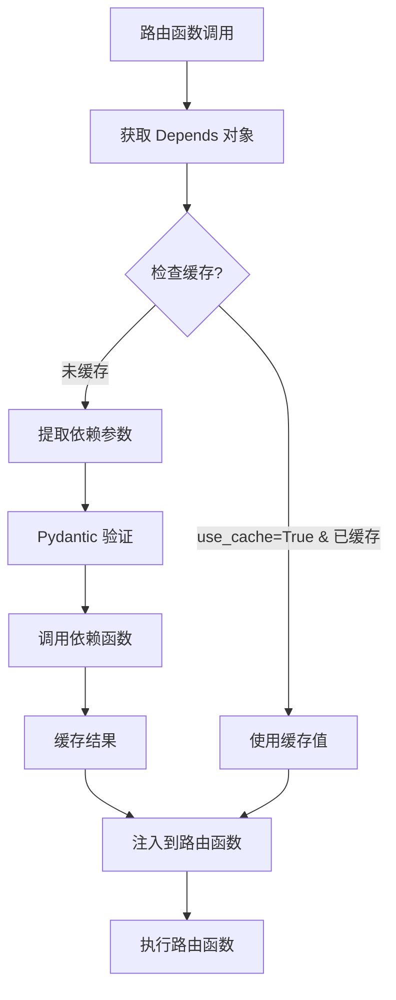
```mermaid
flowchart TB
    Start[路由函数调用]
    GetDep[获取 Depends 对象]
    CheckCache{检查缓存?}
    UseCached[使用缓存值]
    ExtractParams[提取依赖参数]
    Validate[Pydantic 验证]
    CallDep[调用依赖函数]
    CacheResult[缓存结果]
    Inject[注入到路由函数]
    End[执行路由函数]
    
    Start --> GetDep
    GetDep --> CheckCache
    CheckCache -->|use_cache=True & 已缓存| UseCached
    CheckCache -->|未缓存| ExtractParams
    ExtractParams --> Validate
    Validate --> CallDep
    CallDep --> CacheResult
    CacheResult --> Inject
    UseCached --> Inject
    Inject --> End
```

---

## 2. Security() - 安全依赖项

### 基本信息
- **名称**：`Security()`
- **模块**：`fastapi.param_functions`
- **用途**：声明带安全作用域的依赖项

### 函数签名

```python
def Security(
    dependency: Optional[Callable[..., Any]] = None,
    *,
    scopes: Optional[Sequence[str]] = None,
    use_cache: bool = True
) -> Any
```

### 参数说明

| 参数 | 类型 | 必填 | 默认值 | 说明 |
|------|------|------|--------|------|
| dependency | Callable | 否 | None | 安全方案（如 OAuth2PasswordBearer） |
| scopes | Sequence[str] | 否 | None | 所需的安全作用域列表 |
| use_cache | bool | 否 | True | 是否缓存依赖结果 |

### 核心代码

```python
from fastapi.security.base import SecurityBase

def Security(
    dependency: Optional[Callable[..., Any]] = None,
    *,
    scopes: Optional[Sequence[str]] = None,
    use_cache: bool = True
) -> Any:
    """
    声明安全依赖项
    
    参数：
        dependency: 安全方案实例（SecurityBase）
        scopes: 所需权限作用域
        use_cache: 是否缓存结果
    
    返回：
        params.Security 实例
    """
    return params.Security(
        dependency=dependency,
        scopes=scopes,
        use_cache=use_cache
    )
```

### 使用示例

#### OAuth2 with Scopes

```python
from fastapi.security import OAuth2PasswordBearer, SecurityScopes

oauth2_scheme = OAuth2PasswordBearer(
    tokenUrl="token",
    scopes={
        "items:read": "Read items",
        "items:write": "Write items",
        "users:read": "Read users"
    }
)

async def get_current_user(
    security_scopes: SecurityScopes,
    token: str = Depends(oauth2_scheme)
):
    # 验证 token
    user = decode_token(token)
    
    # 检查权限作用域
    for scope in security_scopes.scopes:
        if scope not in user.scopes:
            raise HTTPException(
                status_code=403,
                detail=f"Not enough permissions. Required: {scope}"
            )
    
    return user

# 需要读权限
@app.get("/items/")
async def read_items(
    user = Security(get_current_user, scopes=["items:read"])
):
    return items

# 需要写权限
@app.post("/items/")
async def create_item(
    item: Item,
    user = Security(get_current_user, scopes=["items:write"])
):
    return create_item_in_db(item)

# 需要多个权限
@app.post("/items/{item_id}/assign")
async def assign_item(
    item_id: int,
    user_id: int,
    user = Security(get_current_user, scopes=["items:write", "users:read"])
):
    return assign_item_to_user(item_id, user_id)
```

#### 自定义安全方案

```python
from fastapi.security.base import SecurityBase
from fastapi.security.utils import get_authorization_scheme_param

class APIKeyHeader(SecurityBase):
    def __init__(self, name: str):
        self.model = APIKeyIn(name=name, **{"in": "header"})
        self.scheme_name = self.__class__.__name__
    
    async def __call__(self, request: Request) -> Optional[str]:
        api_key = request.headers.get(self.model.name)
        if not api_key:
            raise HTTPException(401, "API Key required")
        return api_key

api_key_header = APIKeyHeader(name="X-API-Key")

@app.get("/secure-data")
async def secure_data(api_key: str = Security(api_key_header)):
    # 验证 api_key
    if not validate_api_key(api_key):
        raise HTTPException(403, "Invalid API Key")
    return {"data": "secure"}
```

---

## 3. get_dependant() - 构建依赖树

### 基本信息
- **名称**：`get_dependant()`
- **模块**：`fastapi.dependencies.utils`
- **用途**：分析函数签名，构建依赖树（启动时执行）

### 函数签名

```python
def get_dependant(
    *,
    path: str,
    call: Optional[Callable[..., Any]],
    name: Optional[str] = None,
    security_scopes: Optional[List[str]] = None,
    use_cache: bool = True
) -> Dependant
```

### 参数说明

| 参数 | 类型 | 必填 | 说明 |
|------|------|------|------|
| path | str | 是 | 路由路径（用于路径参数提取） |
| call | Callable | 是 | 要分析的函数 |
| name | str | 否 | 依赖项名称 |
| security_scopes | List[str] | 否 | 安全作用域 |
| use_cache | bool | 否 | 是否缓存依赖结果 |

### 核心代码逻辑

```python
def get_dependant(
    *,
    path: str,
    call: Optional[Callable[..., Any]],
    name: Optional[str] = None,
    security_scopes: Optional[List[str]] = None,
    use_cache: bool = True
) -> Dependant:
    """
    分析函数签名，构建 Dependant 对象
    
    流程：

    1. 获取函数签名
    2. 提取路径参数名
    3. 遍历参数，分类为：
       - 路径参数（在路径中声明）
       - 查询参数（标量类型 + 默认值）
       - 请求体（Pydantic 模型）
       - 头部参数（Header）
       - Cookie 参数（Cookie）
       - 依赖项（Depends）
       - 特殊参数（Request、Response 等）
    4. 递归构建子依赖
    5. 返回 Dependant 对象
    """
    # 获取函数签名
    signature = inspect.signature(call)
    
    # 提取路径参数名
    path_param_names = get_path_param_names(path)
    
    # 初始化 Dependant
    dependant = Dependant(
        path=path,
        call=call,
        name=name,
        security_scopes=security_scopes,
        use_cache=use_cache
    )
    
    # 遍历参数
    for param_name, param in signature.parameters.items():
        # 检查是否为依赖项
        if isinstance(param.default, params.Depends):
            # 递归构建子依赖
            sub_dependant = get_sub_dependant(...)
            dependant.dependencies.append(sub_dependant)
        
        # 检查是否为路径参数
        elif param_name in path_param_names:
            field = create_model_field(param)
            dependant.path_params.append(field)
        
        # 检查是否为查询参数
        elif is_scalar_field(param):
            field = create_model_field(param)
            dependant.query_params.append(field)
        
        # 检查是否为请求体
        elif is_pydantic_model(param.annotation):
            field = create_model_field(param)
            dependant.body_params.append(field)
        
        # 检查是否为特殊参数
        elif param.annotation is Request:
            dependant.request_param_name = param_name
        
        # ... 其他参数类型
    
    return dependant

```

### 返回的 Dependant 结构

```python
@dataclass
class Dependant:
    path_params: List[ModelField]      # 路径参数
    query_params: List[ModelField]     # 查询参数
    header_params: List[ModelField]    # 头部参数
    cookie_params: List[ModelField]    # Cookie 参数
    body_params: List[ModelField]      # 请求体参数
    dependencies: List[Dependant]      # 子依赖列表
    security_requirements: List[SecurityRequirement]  # 安全需求
    name: Optional[str]                # 依赖名称
    call: Optional[Callable]           # 依赖函数
    use_cache: bool                    # 是否缓存
    # ... 其他字段
```

---

## 4. solve_dependencies() - 执行依赖树

### 基本信息
- **名称**：`solve_dependencies()`
- **模块**：`fastapi.dependencies.utils`
- **用途**：执行依赖树，提取和验证参数（请求时执行）

### 函数签名

```python
async def solve_dependencies(
    *,
    request: Union[Request, WebSocket],
    dependant: Dependant,
    body: Optional[Union[Dict[str, Any], FormData]] = None,
    background_tasks: Optional[BackgroundTasks] = None,
    response: Optional[Response] = None,
    dependency_overrides_provider: Optional[Any] = None,
    dependency_cache: Optional[Dict[Tuple[Callable[..., Any], Tuple[str, ...]], Any]] = None,
) -> Tuple[Dict[str, Any], List[ErrorWrapper], Optional[BackgroundTasks], Response, Dict[Tuple[Callable[..., Any], Tuple[str, ...]], Any]]
```

### 核心逻辑

```python
async def solve_dependencies(
    *,
    request: Union[Request, WebSocket],
    dependant: Dependant,
    ...
):
    """
    执行依赖树
    
    流程：

    1. 初始化结果字典和依赖缓存
    2. 遍历子依赖，递归执行
    3. 检查缓存，避免重复执行
    4. 提取依赖参数
    5. 调用依赖函数
    6. 处理 yield 依赖（保存上下文）
    7. 缓存结果
    8. 返回所有依赖的结果
    """
    values: Dict[str, Any] = {}
    errors: List[ErrorWrapper] = []
    
    # 初始化依赖缓存
    if dependency_cache is None:
        dependency_cache = {}
    
    # 遍历子依赖
    for sub_dependant in dependant.dependencies:
        # 检查缓存
        cache_key = sub_dependant.cache_key
        if sub_dependant.use_cache and cache_key in dependency_cache:
            solved = dependency_cache[cache_key]
        else:
            # 递归执行子依赖
            (
                sub_values,
                sub_errors,
                ...
            ) = await solve_dependencies(
                request=request,
                dependant=sub_dependant,
                ...
            )
            
            if sub_errors:
                errors.extend(sub_errors)
                continue
            
            # 提取子依赖参数
            sub_kwargs = {}
            for field in sub_dependant.path_params:
                value = extract_path_param(request, field)
                sub_kwargs[field.name] = value
            
            # ... 提取其他参数
            
            # 调用子依赖函数
            if iscoroutinefunction(sub_dependant.call):
                solved = await sub_dependant.call(**sub_kwargs)
            else:
                solved = await run_in_threadpool(sub_dependant.call, **sub_kwargs)
            
            # 处理 yield 依赖
            if inspect.isgenerator(solved) or inspect.isasyncgen(solved):
                # 保存上下文管理器
                solved = await async_exit_stack.enter_async_context(solved)
            
            # 缓存结果
            if sub_dependant.use_cache:
                dependency_cache[cache_key] = solved
        
        # 存储结果
        if sub_dependant.name:
            values[sub_dependant.name] = solved
    
    # 提取当前 dependant 的参数
    path_values = {}
    for field in dependant.path_params:
        value = extract_path_param(request, field)
        path_values[field.name] = value
    
    # ... 提取查询、请求体等参数
    
    # 合并所有值
    values.update(path_values)
    
    return values, errors, background_tasks, response, dependency_cache

```

### 使用流程

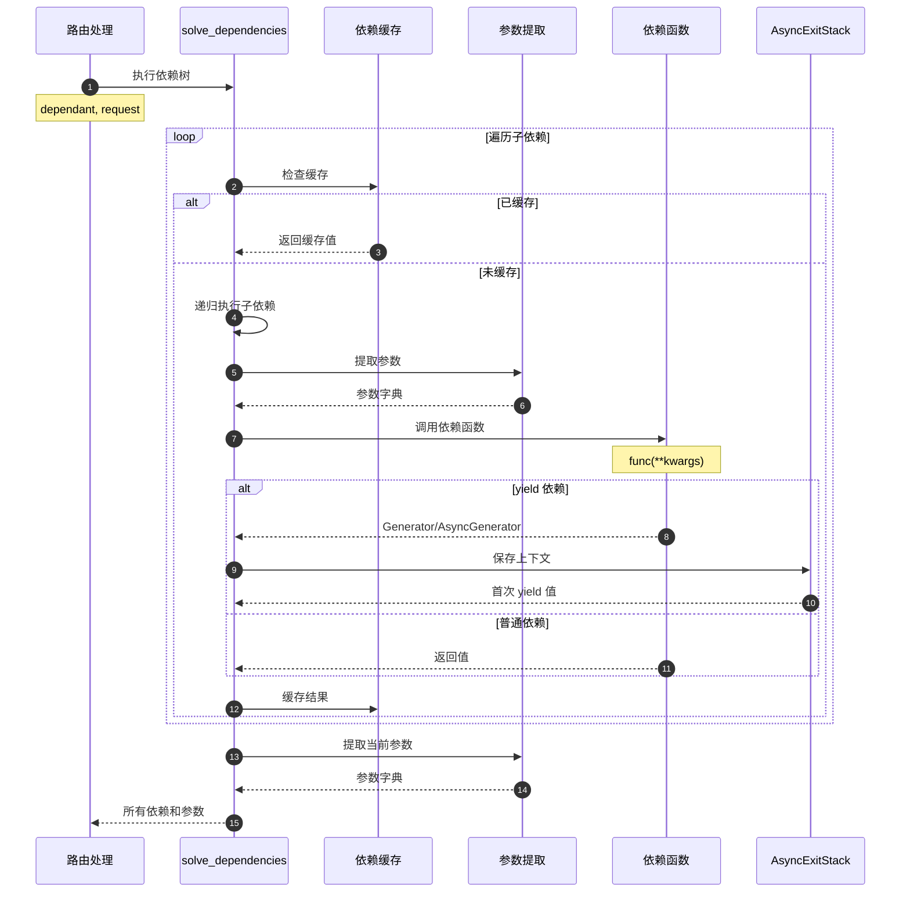
```mermaid
sequenceDiagram
    autonumber
    participant Route as 路由处理
    participant Solve as solve_dependencies
    participant Cache as 依赖缓存
    participant Extract as 参数提取
    participant Call as 依赖函数
    participant Stack as AsyncExitStack
    
    Route->>Solve: 执行依赖树
    Note over Route: dependant, request
    
    loop 遍历子依赖
        Solve->>Cache: 检查缓存
        
        alt 已缓存
            Cache-->>Solve: 返回缓存值
        else 未缓存
            Solve->>Solve: 递归执行子依赖
            
            Solve->>Extract: 提取参数
            Extract-->>Solve: 参数字典
            
            Solve->>Call: 调用依赖函数
            Note over Call: func(**kwargs)
            
            alt yield 依赖
                Call-->>Solve: Generator/AsyncGenerator
                Solve->>Stack: 保存上下文
                Stack-->>Solve: 首次 yield 值
            else 普通依赖
                Call-->>Solve: 返回值
            end
            
            Solve->>Cache: 缓存结果
        end
    end
    
    Solve->>Extract: 提取当前参数
    Extract-->>Solve: 参数字典
    
    Solve-->>Route: 所有依赖和参数
```

---

## 5. request_params_to_args() - 参数提取

### 基本信息
- **名称**：`request_params_to_args()`
- **模块**：`fastapi.dependencies.utils`
- **用途**：从 Request 对象提取参数并验证

### 核心逻辑

```python
async def request_params_to_args(
    required_params: Sequence[ModelField],
    received_params: Union[Mapping[str, Any], QueryParams, Headers],
) -> Tuple[Dict[str, Any], List[ErrorWrapper]]:
    """
    从请求中提取参数并验证
    
    参数：
        required_params: 需要的参数字段列表
        received_params: 实际接收的参数
    
    返回：
        (验证后的参数字典, 错误列表)
    """
    values = {}
    errors = []
    
    for field in required_params:
        # 获取参数值
        value = received_params.get(field.alias or field.name)
        
        # 使用 Pydantic 验证
        if value is not None:
            validated, error = field.validate(value, values, loc=("query",))
            if error:
                errors.append(error)
            else:
                values[field.name] = validated
        elif field.required:
            errors.append(get_missing_field_error(field))
        else:
            values[field.name] = field.default
    
    return values, errors
```

---

## API 使用最佳实践

### 1. 依赖分层

```python
# 底层：获取原始数据
async def get_token(authorization: str = Header(...)):
    return authorization.replace("Bearer ", "")

# 中层：业务逻辑
async def get_current_user(token: str = Depends(get_token)):
    return decode_token(token)

# 顶层：权限检查
async def get_admin_user(user = Depends(get_current_user)):
    if not user.is_admin:
        raise HTTPException(403)
    return user
```

### 2. 可配置依赖

```python
def create_pagination(default_limit: int = 10):
    def pagination(skip: int = 0, limit: int = default_limit):
        return {"skip": skip, "limit": limit}
    return pagination

# 使用不同默认值
pagination_10 = create_pagination(10)
pagination_50 = create_pagination(50)

@app.get("/items/")
async def read_items(pagination = Depends(pagination_10)):
    return items[pagination["skip"]:pagination["skip"]+pagination["limit"]]
```

### 3. 共享资源

```python
async def get_db():
    async with SessionLocal() as session:
        yield session

@app.get("/users/")
async def list_users(db = Depends(get_db)):
    return db.query(User).all()

@app.get("/items/")
async def list_items(db = Depends(get_db)):
    # 如果在同一请求中多次使用，会使用缓存
    return db.query(Item).all()
```

## 总结

依赖注入 API 的核心功能：

1. **Depends()**：用户声明依赖项
2. **Security()**：声明带权限的依赖
3. **get_dependant()**：启动时构建依赖树
4. **solve_dependencies()**：请求时执行依赖
5. **request_params_to_args()**：提取和验证参数

这些 API 共同实现了 FastAPI 强大的依赖注入系统。

---

## 数据结构

> **文档版本**: v1.0  
> **FastAPI 版本**: 0.118.0  
> **创建日期**: 2025年10月4日

---

## 📋 目录

1. [数据结构概览](#数据结构概览)
2. [Dependant类详解](#dependant类详解)
3. [SecurityRequirement类详解](#securityrequirement类详解)
4. [ModelField结构](#modelfield结构)
5. [依赖缓存机制](#依赖缓存机制)
6. [UML类图](#uml类图)

---

## 数据结构概览

### 核心数据结构清单

| 类名 | 类型 | 文件位置 | 职责 |
|------|------|----------|------|
| **Dependant** | dataclass | `dependencies/models.py:15` | 依赖树节点 |
| **SecurityRequirement** | dataclass | `dependencies/models.py:9` | 安全需求 |
| **ModelField** | class | Pydantic兼容层 | 参数字段定义 |

---

## Dependant类详解

### 类定义

```python
@dataclass
class Dependant:
    """
    依赖树的节点，存储一个依赖（函数）的完整信息
    包括参数、子依赖、安全需求等
    """
```

### 完整属性列表

#### 参数字段

| 属性 | 类型 | 默认值 | 说明 |
|------|------|--------|------|
| **path_params** | List[ModelField] | [] | 路径参数列表 |
| **query_params** | List[ModelField] | [] | 查询参数列表 |
| **header_params** | List[ModelField] | [] | 请求头参数列表 |
| **cookie_params** | List[ModelField] | [] | Cookie参数列表 |
| **body_params** | List[ModelField] | [] | 请求体参数列表 |

#### 依赖关系

| 属性 | 类型 | 默认值 | 说明 |
|------|------|--------|------|
| **dependencies** | List[Dependant] | [] | 子依赖列表（递归结构） |
| **security_requirements** | List[SecurityRequirement] | [] | 安全需求列表 |

#### 元信息

| 属性 | 类型 | 默认值 | 说明 |
|------|------|--------|------|
| **name** | Optional[str] | None | 依赖名称 |
| **call** | Optional[Callable] | None | 依赖函数 |
| **path** | Optional[str] | None | 路由路径 |

#### 特殊参数名

| 属性 | 类型 | 默认值 | 说明 |
|------|------|--------|------|
| **request_param_name** | Optional[str] | None | Request参数的变量名 |
| **websocket_param_name** | Optional[str] | None | WebSocket参数的变量名 |
| **http_connection_param_name** | Optional[str] | None | HTTPConnection参数的变量名 |
| **response_param_name** | Optional[str] | None | Response参数的变量名 |
| **background_tasks_param_name** | Optional[str] | None | BackgroundTasks参数的变量名 |
| **security_scopes_param_name** | Optional[str] | None | SecurityScopes参数的变量名 |

#### 缓存控制

| 属性 | 类型 | 默认值 | 说明 |
|------|------|--------|------|
| **use_cache** | bool | True | 是否启用依赖缓存 |
| **cache_key** | Tuple | 自动生成 | 缓存键（call + security_scopes） |
| **security_scopes** | Optional[List[str]] | None | 安全范围列表 |

### 完整源码

```python
@dataclass
class Dependant:
    # 参数字段（按来源分类）
    path_params: List[ModelField] = field(default_factory=list)
    query_params: List[ModelField] = field(default_factory=list)
    header_params: List[ModelField] = field(default_factory=list)
    cookie_params: List[ModelField] = field(default_factory=list)
    body_params: List[ModelField] = field(default_factory=list)
    
    # 依赖关系
    dependencies: List["Dependant"] = field(default_factory=list)
    security_requirements: List[SecurityRequirement] = field(default_factory=list)
    
    # 元信息
    name: Optional[str] = None
    call: Optional[Callable[..., Any]] = None
    path: Optional[str] = None
    
    # 特殊参数名（FastAPI注入的特殊对象）
    request_param_name: Optional[str] = None
    websocket_param_name: Optional[str] = None
    http_connection_param_name: Optional[str] = None
    response_param_name: Optional[str] = None
    background_tasks_param_name: Optional[str] = None
    security_scopes_param_name: Optional[str] = None
    
    # 缓存控制
    security_scopes: Optional[List[str]] = None
    use_cache: bool = True
    cache_key: Tuple[Optional[Callable[..., Any]], Tuple[str, ...]] = field(init=False)
    
    def __post_init__(self) -> None:
        """生成缓存键"""
        self.cache_key = (self.call, tuple(sorted(set(self.security_scopes or []))))
```

### UML类图

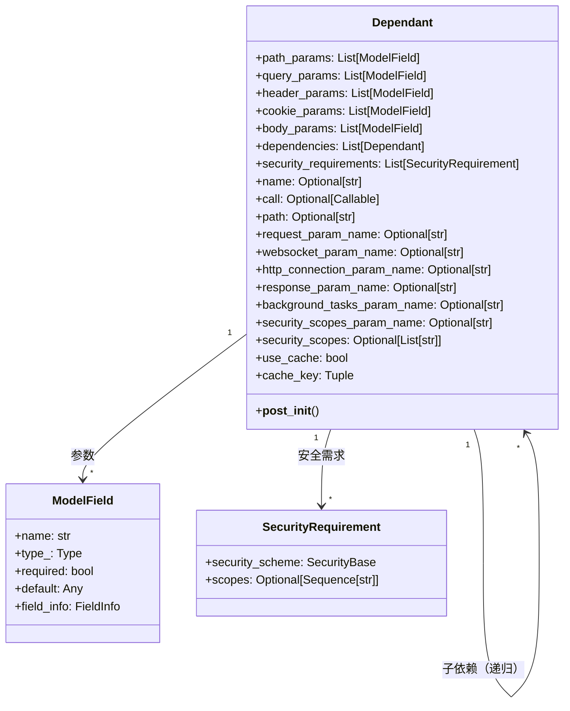
```mermaid
classDiagram
    class Dependant {
        +path_params: List[ModelField]
        +query_params: List[ModelField]
        +header_params: List[ModelField]
        +cookie_params: List[ModelField]
        +body_params: List[ModelField]
        +dependencies: List[Dependant]
        +security_requirements: List[SecurityRequirement]
        +name: Optional[str]
        +call: Optional[Callable]
        +path: Optional[str]
        +request_param_name: Optional[str]
        +websocket_param_name: Optional[str]
        +http_connection_param_name: Optional[str]
        +response_param_name: Optional[str]
        +background_tasks_param_name: Optional[str]
        +security_scopes_param_name: Optional[str]
        +security_scopes: Optional[List[str]]
        +use_cache: bool
        +cache_key: Tuple
        +__post_init__()
    }
    
    class ModelField {
        +name: str
        +type_: Type
        +required: bool
        +default: Any
        +field_info: FieldInfo
    }
    
    class SecurityRequirement {
        +security_scheme: SecurityBase
        +scopes: Optional[Sequence[str]]
    }
    
    Dependant "1" --> "*" ModelField : 参数
    Dependant "1" --> "*" Dependant : 子依赖（递归）
    Dependant "1" --> "*" SecurityRequirement : 安全需求
```

**类图说明**：

1. **图意概述**: Dependant是依赖树的节点，采用递归结构，一个Dependant可包含多个子Dependant
2. **关键字段**: dependencies列表实现依赖树；各类params列表分类存储不同来源的参数
3. **边界条件**: dependencies可以为空；call为None表示这是一个纯参数收集节点
4. **设计理由**: 使用dataclass简化代码；分类存储参数便于后续按来源提取
5. **性能考虑**: cache_key在__post_init__中生成一次，避免重复计算

### 参数分类示意图

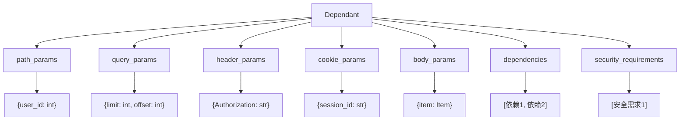
```mermaid
graph TB
    A[Dependant] --> B[path_params]
    A --> C[query_params]
    A --> D[header_params]
    A --> E[cookie_params]
    A --> F[body_params]
    A --> G[dependencies]
    A --> H[security_requirements]
    
    B --> B1["{user_id: int}"]
    C --> C1["{limit: int, offset: int}"]
    D --> D1["{Authorization: str}"]
    E --> E1["{session_id: str}"]
    F --> F1["{item: Item}"]
    G --> G1["[依赖1, 依赖2]"]
    H --> H1["[安全需求1]"]
```

**示意图说明**：

1. **图意**: 展示Dependant中参数的分类存储结构
2. **关键点**: 每类参数独立存储，便于按来源提取和验证
3. **边界条件**: 所有列表都可以为空
4. **性能**: 分类存储避免运行时按类型筛选

### 依赖树结构示例

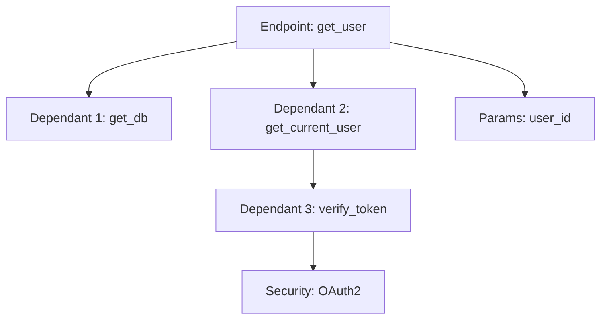
```mermaid
graph TD
    Root[Endpoint: get_user]
    Root --> A[Dependant 1: get_db]
    Root --> B[Dependant 2: get_current_user]
    B --> C[Dependant 3: verify_token]
    C --> D[Security: OAuth2]
    Root --> E[Params: user_id]
```

**依赖树说明**：

1. **根节点**: Endpoint函数对应的Dependant
2. **子节点**: 每个依赖对应一个Dependant
3. **递归结构**: 依赖可以有自己的依赖
4. **叶子节点**: 参数字段或安全需求

---

## SecurityRequirement类详解

### 类定义

```python
@dataclass
class SecurityRequirement:
    """
    安全需求，表示一个API需要的安全验证
    """
    security_scheme: SecurityBase
    scopes: Optional[Sequence[str]] = None
```

### 属性详解

| 属性 | 类型 | 必填 | 说明 |
|------|------|------|------|
| **security_scheme** | SecurityBase | 是 | 安全方案（OAuth2/API Key/HTTP Auth） |
| **scopes** | Sequence[str] | 否 | OAuth2作用域列表 |

### UML类图

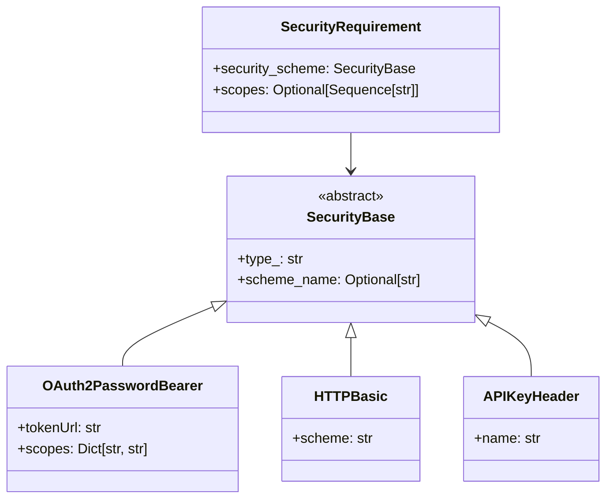
```mermaid
classDiagram
    class SecurityRequirement {
        +security_scheme: SecurityBase
        +scopes: Optional[Sequence[str]]
    }
    
    class SecurityBase {
        <<abstract>>
        +type_: str
        +scheme_name: Optional[str]
    }
    
    class OAuth2PasswordBearer {
        +tokenUrl: str
        +scopes: Dict[str, str]
    }
    
    class HTTPBasic {
        +scheme: str
    }
    
    class APIKeyHeader {
        +name: str
    }
    
    SecurityRequirement --> SecurityBase
    SecurityBase <|-- OAuth2PasswordBearer
    SecurityBase <|-- HTTPBasic
    SecurityBase <|-- APIKeyHeader
```

### 使用示例

```python
from fastapi.security import OAuth2PasswordBearer

# 定义安全方案
oauth2_scheme = OAuth2PasswordBearer(
    tokenUrl="token",
    scopes={"read": "Read access", "write": "Write access"}
)

# 在Dependant中存储为SecurityRequirement
security_req = SecurityRequirement(
    security_scheme=oauth2_scheme,
    scopes=["read", "write"]
)
```

---

## ModelField结构

### 概述

`ModelField`是Pydantic v1/v2的兼容层，用于统一处理不同版本的字段定义。

### 核心属性

| 属性 | 类型 | 说明 |
|------|------|------|
| **name** | str | 字段名称 |
| **type_** | Type | 字段类型 |
| **required** | bool | 是否必填 |
| **default** | Any | 默认值 |
| **alias** | Optional[str] | 字段别名 |
| **field_info** | FieldInfo | 字段元信息（来自Pydantic） |

### 字段来源标记

FastAPI使用`field_info`中的特殊标记来识别参数来源：

```python
from fastapi import Query, Path, Body, Header, Cookie

# Path参数
user_id: int = Path(...)  # field_info.in_ = "path"

# Query参数
limit: int = Query(10)    # field_info.in_ = "query"

# Header参数
token: str = Header(...)  # field_info.in_ = "header"

# Cookie参数
session: str = Cookie(...) # field_info.in_ = "cookie"

# Body参数
item: Item = Body(...)    # field_info.in_ = "body"
```

---

## 依赖缓存机制

### cache_key生成

```python
def __post_init__(self) -> None:
    """
    生成缓存键：(call, sorted_security_scopes)
    
    - call: 依赖函数（唯一标识依赖）
    - security_scopes: 安全范围（影响缓存隔离）
    """
    self.cache_key = (
        self.call,
        tuple(sorted(set(self.security_scopes or [])))
    )

```

### 缓存键组成

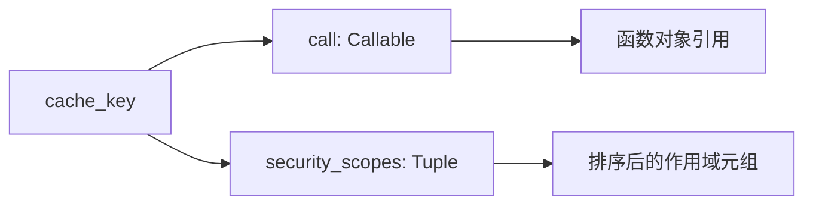
```mermaid
graph LR
    A[cache_key] --> B[call: Callable]
    A --> C[security_scopes: Tuple]
    
    B --> D["函数对象引用"]
    C --> E["排序后的作用域元组"]
```

**缓存键说明**：

1. **call**: 函数对象，确保不同依赖函数不会共享缓存
2. **security_scopes**: 排序后的作用域，确保不同权限要求不会共享缓存
3. **排序**: 保证`["read", "write"]`和`["write", "read"]`生成相同的键
4. **元组**: 不可变类型，可作为字典键

### 缓存使用场景

```python
# 场景1：同一请求中多次使用相同依赖
async def get_db():
    return Database()

@app.get("/users")
async def list_users(db=Depends(get_db)):
    pass

@app.get("/items")
async def list_items(db=Depends(get_db)):
    # get_db() 在同一请求中只会被调用一次
    pass
```

### 缓存控制

```python
# 禁用缓存
async def get_timestamp():
    return time.time()

@app.get("/time")
async def get_time(
    ts=Depends(get_timestamp, use_cache=False)
):
    # 每次都会重新调用 get_timestamp()
    pass
```

---

## UML类图

### 完整依赖注入数据结构关系

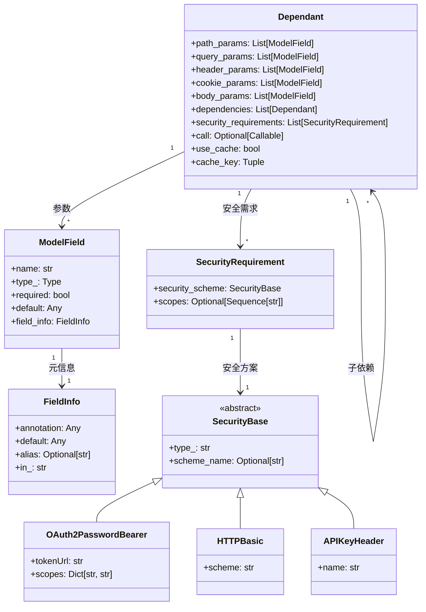
```mermaid
classDiagram
    class Dependant {
        +path_params: List[ModelField]
        +query_params: List[ModelField]
        +header_params: List[ModelField]
        +cookie_params: List[ModelField]
        +body_params: List[ModelField]
        +dependencies: List[Dependant]
        +security_requirements: List[SecurityRequirement]
        +call: Optional[Callable]
        +use_cache: bool
        +cache_key: Tuple
    }
    
    class ModelField {
        +name: str
        +type_: Type
        +required: bool
        +default: Any
        +field_info: FieldInfo
    }
    
    class FieldInfo {
        +annotation: Any
        +default: Any
        +alias: Optional[str]
        +in_: str
    }
    
    class SecurityRequirement {
        +security_scheme: SecurityBase
        +scopes: Optional[Sequence[str]]
    }
    
    class SecurityBase {
        <<abstract>>
        +type_: str
        +scheme_name: Optional[str]
    }
    
    class OAuth2PasswordBearer {
        +tokenUrl: str
        +scopes: Dict[str, str]
    }
    
    class HTTPBasic {
        +scheme: str
    }
    
    class APIKeyHeader {
        +name: str
    }
    
    Dependant "1" --> "*" ModelField : 参数
    Dependant "1" --> "*" Dependant : 子依赖
    Dependant "1" --> "*" SecurityRequirement : 安全需求
    ModelField "1" --> "1" FieldInfo : 元信息
    SecurityRequirement "1" --> "1" SecurityBase : 安全方案
    SecurityBase <|-- OAuth2PasswordBearer
    SecurityBase <|-- HTTPBasic
    SecurityBase <|-- APIKeyHeader
```

**完整类图说明**：

1. **图意概述**: 展示依赖注入系统的所有核心数据结构及其关系
2. **关键字段**: Dependant作为中心节点，连接参数、子依赖和安全需求
3. **边界条件**: 所有关联都可以为空（0个或多个）
4. **设计模式**: 组合模式（Dependant包含Dependant）；策略模式（不同的SecurityBase实现）
5. **扩展性**: 可以添加新的SecurityBase子类支持新的认证方式

### 依赖解析数据流

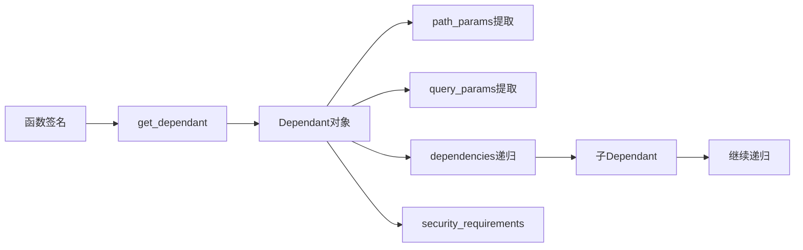
```mermaid
graph LR
    A[函数签名] --> B[get_dependant]
    B --> C[Dependant对象]
    C --> D[path_params提取]
    C --> E[query_params提取]
    C --> F[dependencies递归]
    C --> G[security_requirements]
    F --> H[子Dependant]
    H --> I[继续递归]
```

---

## 📊 数据结构统计

| 项目 | 数量/说明 |
|------|----------|
| 核心类 | 3个（Dependant, SecurityRequirement, ModelField） |
| Dependant属性 | 20+个 |
| 参数分类 | 5种（path/query/header/cookie/body） |
| 特殊参数名 | 6种（request/websocket/response等） |
| 缓存键组成 | 2部分（call + security_scopes） |
| 递归层级 | 无限制（理论上） |

---

## 📚 相关文档

- [FastAPI-03-依赖注入-概览](./FastAPI-03-依赖注入-概览.md) - 依赖注入机制概述
- [FastAPI-03-依赖注入-API](./FastAPI-03-依赖注入-API.md) - Depends()等API详解
- [FastAPI-03-依赖注入-时序图](./FastAPI-03-依赖注入-时序图.md) - 依赖解析流程
- [FastAPI-07-安全-数据结构](./FastAPI-07-安全-数据结构.md) - SecurityBase详解

---

*本文档生成于 2025年10月4日，基于 FastAPI 0.118.0*

---

## 时序图

> **文档版本**: v1.0  
> **FastAPI 版本**: 0.118.0  
> **创建日期**: 2025年10月4日

---

## 📋 目录

1. [时序图概览](#时序图概览)
2. [依赖树构建流程](#依赖树构建流程)
3. [依赖解析执行流程](#依赖解析执行流程)
4. [依赖缓存流程](#依赖缓存流程)
5. [yield依赖生命周期](#yield依赖生命周期)
6. [安全依赖验证流程](#安全依赖验证流程)
7. [完整请求处理流程](#完整请求处理流程)

---

## 时序图概览

### 核心流程清单

| # | 流程名称 | 执行时机 | 复杂度 | 频率 |
|---|---------|----------|--------|------|
| 1 | 依赖树构建 | 路由注册时 | ⭐⭐⭐ | 一次 |
| 2 | 依赖解析执行 | 每个请求 | ⭐⭐⭐⭐ | 高频 |
| 3 | 依赖缓存 | 每个请求 | ⭐⭐ | 高频 |
| 4 | yield依赖管理 | 每个请求 | ⭐⭐⭐ | 中频 |
| 5 | 安全依赖验证 | 有安全需求时 | ⭐⭐⭐ | 中频 |

---

## 依赖树构建流程

### 1.1 get_dependant()构建依赖树

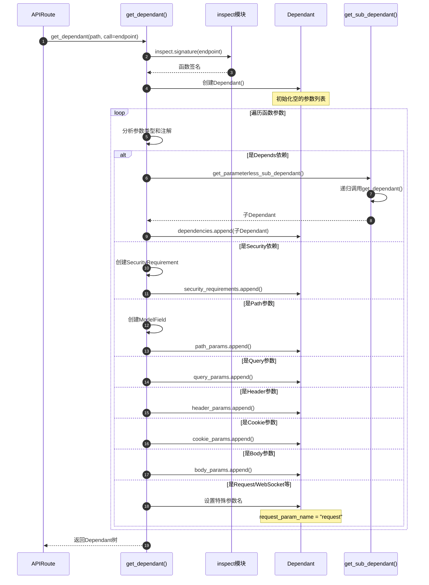
```mermaid
sequenceDiagram
    autonumber
    participant Route as APIRoute
    participant GetDep as get_dependant()
    participant Inspect as inspect模块
    participant Dep as Dependant
    participant SubDep as get_sub_dependant()
    
    Route->>GetDep: get_dependant(path, call=endpoint)
    GetDep->>Inspect: inspect.signature(endpoint)
    Inspect-->>GetDep: 函数签名
    
    GetDep->>Dep: 创建Dependant()
    Note over Dep: 初始化空的参数列表
    
    loop 遍历函数参数
        GetDep->>GetDep: 分析参数类型和注解
        
        alt 是Depends依赖
            GetDep->>SubDep: get_parameterless_sub_dependant()
            SubDep->>SubDep: 递归调用get_dependant()
            SubDep-->>GetDep: 子Dependant
            GetDep->>Dep: dependencies.append(子Dependant)
        else 是Security依赖
            GetDep->>GetDep: 创建SecurityRequirement
            GetDep->>Dep: security_requirements.append()
        else 是Path参数
            GetDep->>GetDep: 创建ModelField
            GetDep->>Dep: path_params.append()
        else 是Query参数
            GetDep->>Dep: query_params.append()
        else 是Header参数
            GetDep->>Dep: header_params.append()
        else 是Cookie参数
            GetDep->>Dep: cookie_params.append()
        else 是Body参数
            GetDep->>Dep: body_params.append()
        else 是Request/WebSocket等
            GetDep->>Dep: 设置特殊参数名
            Note over Dep: request_param_name = "request"
        end
    end
    
    GetDep-->>Route: 返回Dependant树
```

**时序图说明**：

1. **图意概述**: 展示依赖树构建的完整过程，从函数签名分析到Dependant对象创建
2. **关键字段**: signature包含所有参数信息；Dependant各类params列表分类存储参数
3. **边界条件**: 参数可以没有类型注解（使用默认类型）；可以没有依赖
4. **异常路径**: 不支持的参数类型抛出FastAPIError
5. **性能假设**: 参数数量n，子依赖数量d，复杂度O(n+d)
6. **设计理由**: 在启动时构建依赖树，避免运行时重复解析

### 1.2 递归构建子依赖树

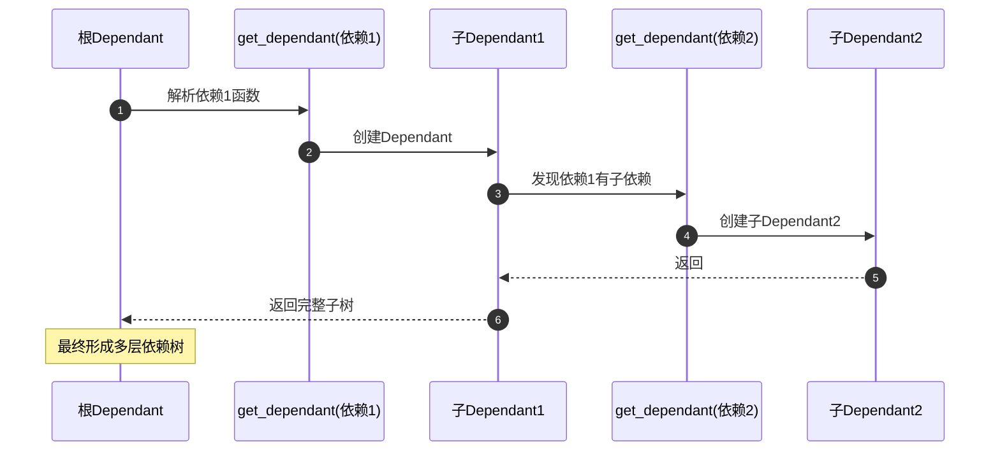
```mermaid
sequenceDiagram
    autonumber
    participant Root as 根Dependant
    participant Get1 as get_dependant(依赖1)
    participant Dep1 as 子Dependant1
    participant Get2 as get_dependant(依赖2)
    participant Dep2 as 子Dependant2
    
    Root->>Get1: 解析依赖1函数
    Get1->>Dep1: 创建Dependant
    Dep1->>Get2: 发现依赖1有子依赖
    Get2->>Dep2: 创建子Dependant2
    Dep2-->>Dep1: 返回
    Dep1-->>Root: 返回完整子树
    
    Note over Root: 最终形成多层依赖树
```

**递归示例**：

```python
# 依赖3（叶子节点）
async def get_config():
    return {"key": "value"}

# 依赖2（中间节点）
async def get_db(config=Depends(get_config)):
    return Database(config)

# 依赖1（根节点的子节点）
async def get_current_user(db=Depends(get_db)):
    return await db.get_user()

# 根节点
@app.get("/users/me")
async def read_user(user=Depends(get_current_user)):
    return user
```

**依赖树结构**：

```
read_user (根Dependant)
└── get_current_user (子Dependant)
    └── get_db (孙Dependant)
        └── get_config (曾孙Dependant)
```

---

## 依赖解析执行流程

### 2.1 solve_dependencies()完整流程

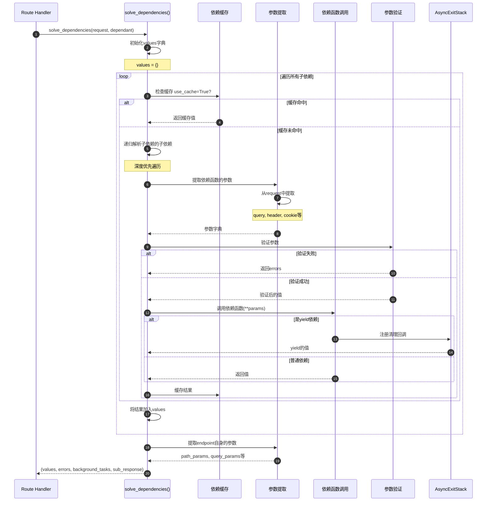
```mermaid
sequenceDiagram
    autonumber
    participant Handler as Route Handler
    participant Solve as solve_dependencies()
    participant Cache as 依赖缓存
    participant Extract as 参数提取
    participant Call as 依赖函数调用
    participant Validate as 参数验证
    participant Stack as AsyncExitStack
    
    Handler->>Solve: solve_dependencies(request, dependant)
    Solve->>Solve: 初始化values字典
    Note over Solve: values = {}
    
    loop 遍历所有子依赖
        Solve->>Cache: 检查缓存 use_cache=True?
        
        alt 缓存命中
            Cache-->>Solve: 返回缓存值
        else 缓存未命中
            Solve->>Solve: 递归解析子依赖的子依赖
            Note over Solve: 深度优先遍历
            
            Solve->>Extract: 提取依赖函数的参数
            Extract->>Extract: 从request中提取
            Note over Extract: query, header, cookie等
            Extract-->>Solve: 参数字典
            
            Solve->>Validate: 验证参数
            alt 验证失败
                Validate-->>Solve: 返回errors
            else 验证成功
                Validate-->>Solve: 验证后的值
                
                Solve->>Call: 调用依赖函数(**params)
                
                alt 是yield依赖
                    Call->>Stack: 注册清理回调
                    Stack-->>Solve: yield的值
                else 普通依赖
                    Call-->>Solve: 返回值
                end
                
                Solve->>Cache: 缓存结果
            end
        end
        
        Solve->>Solve: 将结果加入values
    end
    
    Solve->>Extract: 提取endpoint自身的参数
    Extract-->>Solve: path_params, query_params等
    
    Solve-->>Handler: (values, errors, background_tasks, sub_response)
```

**时序图说明**：

1. **图意概述**: 展示依赖解析的完整执行流程，包括缓存、参数提取、验证、调用
2. **关键字段**: values字典存储所有依赖的结果；errors列表收集验证错误
3. **边界条件**: 依赖可以嵌套任意层；参数验证可能失败
4. **异常路径**: 验证失败收集到errors，不中断后续依赖；依赖函数异常直接抛出
5. **性能假设**: 依赖数量d，参数数量p，复杂度O(d*p)，有缓存时O(d+p)
6. **设计理由**: 深度优先遍历确保子依赖先于父依赖执行

### 2.2 参数提取与验证

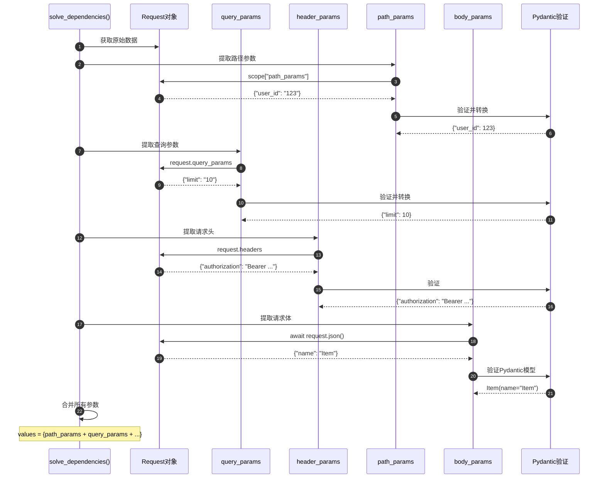
```mermaid
sequenceDiagram
    autonumber
    participant Solve as solve_dependencies()
    participant Request as Request对象
    participant Query as query_params
    participant Header as header_params
    participant Path as path_params
    participant Body as body_params
    participant Pydantic as Pydantic验证
    
    Solve->>Request: 获取原始数据
    
    Solve->>Path: 提取路径参数
    Path->>Request: scope["path_params"]
    Request-->>Path: {"user_id": "123"}
    Path->>Pydantic: 验证并转换
    Pydantic-->>Path: {"user_id": 123}
    
    Solve->>Query: 提取查询参数
    Query->>Request: request.query_params
    Request-->>Query: {"limit": "10"}
    Query->>Pydantic: 验证并转换
    Pydantic-->>Query: {"limit": 10}
    
    Solve->>Header: 提取请求头
    Header->>Request: request.headers
    Request-->>Header: {"authorization": "Bearer ..."}
    Header->>Pydantic: 验证
    Pydantic-->>Header: {"authorization": "Bearer ..."}
    
    Solve->>Body: 提取请求体
    Body->>Request: await request.json()
    Request-->>Body: {"name": "Item"}
    Body->>Pydantic: 验证Pydantic模型
    Pydantic-->>Body: Item(name="Item")
    
    Solve->>Solve: 合并所有参数
    Note over Solve: values = {path_params + query_params + ...}
```

---

## 依赖缓存流程

### 3.1 缓存检查与存储

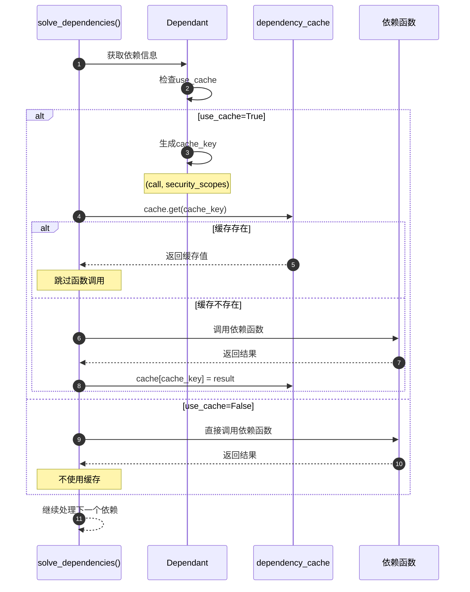
```mermaid
sequenceDiagram
    autonumber
    participant Solve as solve_dependencies()
    participant Dep as Dependant
    participant Cache as dependency_cache
    participant Call as 依赖函数
    
    Solve->>Dep: 获取依赖信息
    Dep->>Dep: 检查use_cache
    
    alt use_cache=True
        Dep->>Dep: 生成cache_key
        Note over Dep: (call, security_scopes)
        
        Solve->>Cache: cache.get(cache_key)
        
        alt 缓存存在
            Cache-->>Solve: 返回缓存值
            Note over Solve: 跳过函数调用
        else 缓存不存在
            Solve->>Call: 调用依赖函数
            Call-->>Solve: 返回结果
            Solve->>Cache: cache[cache_key] = result
        end
    else use_cache=False
        Solve->>Call: 直接调用依赖函数
        Call-->>Solve: 返回结果
        Note over Solve: 不使用缓存
    end
    
    Solve-->>Solve: 继续处理下一个依赖
```

**时序图说明**：

1. **图意概述**: 展示依赖缓存的检查和存储机制
2. **关键字段**: cache_key由(call, security_scopes)组成，确保唯一性
3. **边界条件**: use_cache=False时跳过缓存；每个请求有独立的缓存字典
4. **性能假设**: 缓存查找O(1)；可以显著减少重复计算
5. **设计理由**: 缓存范围限定在单个请求内，避免跨请求污染

### 3.2 缓存键生成

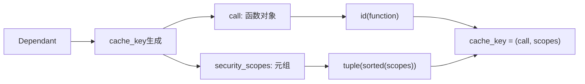
```mermaid
graph LR
    A[Dependant] --> B[cache_key生成]
    B --> C[call: 函数对象]
    B --> D[security_scopes: 元组]
    C --> E["id(function)"]
    D --> F["tuple(sorted(scopes))"]
    E --> G["cache_key = (call, scopes)"]
    F --> G
```

---

## yield依赖生命周期

### 4.1 yield依赖的完整生命周期

```mermaid
sequenceDiagram
    autonumber
    participant Request as 请求到达
    participant Solve as solve_dependencies()
    participant Stack as AsyncExitStack
    participant Dep as yield依赖
    participant Endpoint as 端点函数
    participant Response as 响应返回
    participant Cleanup as 清理阶段
    
    Request->>Solve: 开始解析依赖
    Solve->>Stack: 创建AsyncExitStack
    
    Solve->>Dep: 调用yield依赖
    Dep->>Dep: 执行yield之前的代码
    Note over Dep: 初始化资源（如数据库连接）
    Dep-->>Solve: yield的值
    Solve->>Stack: enter_async_context(依赖)
    Note over Stack: 注册清理回调
    
    Solve->>Endpoint: 调用端点函数(yield的值)
    Endpoint->>Endpoint: 执行业务逻辑
    Endpoint-->>Solve: 返回响应数据
    
    Solve-->>Response: 构建Response对象
    Response->>Response: 发送响应给客户端
    
    Response->>Cleanup: 触发清理
    Cleanup->>Stack: __aexit__()
    Stack->>Dep: 执行yield之后的代码
    Note over Dep: 清理资源（如关闭数据库连接）
    Dep-->>Stack: 完成清理
    Stack-->>Cleanup: 完成
```

**时序图说明**：

1. **图意概述**: 展示yield依赖的完整生命周期，从资源初始化到清理
2. **关键字段**: AsyncExitStack管理所有yield依赖的清理；yield的值传递给endpoint
3. **边界条件**: yield之后的代码保证在响应发送后执行；异常也会触发清理
4. **异常路径**: endpoint异常→仍然执行清理代码；yield后代码异常→记录日志但不影响响应
5. **性能假设**: 清理代码应该快速执行，避免阻塞其他请求
6. **设计理由**: 使用AsyncExitStack确保资源正确释放，即使发生异常

### 4.2 多个yield依赖的执行顺序

```mermaid
sequenceDiagram
    autonumber
    participant Solve as solve_dependencies()
    participant Dep1 as yield依赖1
    participant Dep2 as yield依赖2
    participant Dep3 as yield依赖3
    participant Endpoint as 端点
    participant Stack as AsyncExitStack
    
    Note over Solve: 依赖注入阶段
    Solve->>Dep1: 调用依赖1
    Dep1->>Dep1: yield值1
    Solve->>Dep2: 调用依赖2
    Dep2->>Dep2: yield值2
    Solve->>Dep3: 调用依赖3
    Dep3->>Dep3: yield值3
    
    Solve->>Endpoint: 执行endpoint
    Endpoint-->>Solve: 返回响应
    
    Note over Solve: 清理阶段（逆序）
    Stack->>Dep3: 清理依赖3
    Stack->>Dep2: 清理依赖2
    Stack->>Dep1: 清理依赖1
```

**执行顺序说明**：

- **注入顺序**: 按依赖树深度优先顺序（先注入子依赖，后注入父依赖）
- **清理顺序**: 与注入顺序相反（后进先出，LIFO）
- **设计理由**: 确保依赖关系正确（如先创建连接池，后创建连接；先关闭连接，后关闭连接池）

### 4.3 yield依赖示例

```python
from fastapi import Depends
from typing import AsyncIterator

# yield依赖
async def get_db() -> AsyncIterator[Database]:
    # yield之前：初始化资源
    db = Database()
    await db.connect()
    
    try:
        # yield：提供资源
        yield db
    finally:
        # yield之后：清理资源
        await db.close()

# 使用yield依赖
@app.get("/users")
async def list_users(db: Database = Depends(get_db)):
    return await db.query("SELECT * FROM users")
    # 函数返回后，get_db的finally块会自动执行
```

---

## 安全依赖验证流程

### 5.1 Security()依赖验证

```mermaid
sequenceDiagram
    autonumber
    participant Solve as solve_dependencies()
    participant SecReq as SecurityRequirement
    participant Scheme as OAuth2PasswordBearer
    participant Request as Request
    participant Token as Token验证
    participant Scopes as Scopes检查
    
    Solve->>SecReq: 获取安全需求
    SecReq->>Scheme: 获取security_scheme
    
    Scheme->>Request: 提取凭证
    Note over Scheme: Authorization: Bearer <token>
    Request-->>Scheme: token字符串
    
    Scheme->>Token: 验证token格式
    alt token无效
        Token-->>Scheme: 抛出HTTPException(401)
    else token有效
        Token-->>Scheme: token字符串
    end
    
    Scheme->>Scopes: 检查作用域
    alt 需要特定scopes
        Scopes->>Scopes: 比较required vs actual
        alt scopes不足
            Scopes-->>Scheme: 抛出HTTPException(403)
        else scopes满足
            Scopes-->>Scheme: 通过
        end
    else 不需要scopes
        Scopes-->>Scheme: 通过
    end
    
    Scheme-->>Solve: 返回token（或用户信息）
    Solve->>Solve: 将token加入values
```

**时序图说明**：

1. **图意概述**: 展示安全依赖的验证流程，包括凭证提取和权限检查
2. **关键字段**: token从Authorization header提取；scopes用于权限检查
3. **边界条件**: token缺失返回401；scopes不足返回403
4. **异常路径**: 验证失败抛出HTTPException，中断请求处理
5. **性能假设**: token验证可能涉及数据库查询或外部API调用
6. **设计理由**: 安全验证优先执行，失败则快速返回错误

### 5.2 OAuth2 scopes检查

```mermaid
graph TD
    A[请求到达] --> B{提取token}
    B -->|失败| C[401 Unauthorized]
    B -->|成功| D{解析token scopes}
    D --> E{检查required scopes}
    E -->|scopes不足| F[403 Forbidden]
    E -->|scopes满足| G[继续处理请求]
    G --> H[调用endpoint]
```

---

## 完整请求处理流程

### 6.1 从请求到响应的依赖注入全流程

```mermaid
sequenceDiagram
    autonumber
    participant Client as 客户端
    participant App as FastAPI
    participant Route as APIRoute
    participant Solve as solve_dependencies()
    participant Cache as 依赖缓存
    participant Dep as 依赖函数
    participant Stack as AsyncExitStack
    participant Endpoint as 端点函数
    participant Valid as 响应验证
    participant Response as Response
    
    Client->>App: HTTP Request
    App->>Route: 匹配路由
    Route->>Route: 创建AsyncExitStack
    Route->>Solve: solve_dependencies(dependant)
    
    loop 遍历依赖树（深度优先）
        Solve->>Cache: 检查缓存
        alt 缓存未命中
            Solve->>Dep: 递归解析子依赖
            Dep->>Dep: 提取参数并验证
            
            alt 是yield依赖
                Dep->>Stack: 注册清理回调
                Dep-->>Solve: yield的值
            else 普通依赖
                Dep-->>Solve: 返回值
            end
            
            Solve->>Cache: 缓存结果
        end
    end
    
    Solve->>Endpoint: 调用endpoint(**values)
    Endpoint->>Endpoint: 执行业务逻辑
    Endpoint-->>Solve: 返回结果
    
    Solve->>Valid: 验证响应模型
    Valid-->>Solve: 验证后的数据
    
    Solve->>Response: 创建Response
    Response-->>Client: 发送HTTP Response
    
    Response->>Stack: 触发清理
    loop 逆序清理yield依赖
        Stack->>Dep: 执行finally块
        Dep->>Dep: 释放资源
    end
```

**完整流程说明**：

1. **图意概述**: 展示包含依赖注入的完整请求处理流程
2. **关键阶段**: 路由匹配→依赖解析→endpoint执行→响应验证→资源清理
3. **边界条件**: 任何阶段失败都会跳过后续步骤，直接返回错误响应
4. **异常路径**: 验证失败→422；安全验证失败→401/403；业务逻辑异常→500
5. **性能假设**: 依赖缓存可以显著提升性能；yield依赖清理应该快速
6. **设计理由**: 分阶段处理，清晰的职责划分；使用AsyncExitStack确保资源正确释放

---

## 📊 时序图总结

### 核心流程对比

| 流程 | 执行时机 | 复杂度 | 频率 | 性能影响 |
|------|----------|--------|------|----------|
| 依赖树构建 | 启动时 | O(n+d) | 一次 | 无 |
| 依赖解析 | 每个请求 | O(d*p) | 高频 | 高 |
| 缓存检查 | 每个依赖 | O(1) | 高频 | 低 |
| yield清理 | 请求结束 | O(y) | 中频 | 低 |
| 安全验证 | 有安全需求时 | O(1) | 中频 | 中 |

*n=参数数量, d=依赖数量, p=参数数量, y=yield依赖数量*

### 性能优化建议

1. **依赖缓存**
   - ✅ 默认启用依赖缓存（use_cache=True）
   - ✅ 仅对无副作用的依赖启用缓存
   - ⚠️ 有状态依赖禁用缓存（use_cache=False）

2. **依赖层级**
   - ✅ 减少依赖嵌套层级
   - ✅ 将公共依赖提取到路由器级别
   - ⚠️ 避免循环依赖

3. **参数验证**
   - ✅ 使用Pydantic的验证缓存
   - ✅ 对简单类型使用原生Python类型
   - ⚠️ 复杂模型考虑使用orm_mode

4. **yield依赖**
   - ✅ 清理代码应该快速执行
   - ✅ 避免在清理代码中执行IO操作
   - ⚠️ 清理异常应该被捕获和记录

---

## 📚 相关文档

- [FastAPI-03-依赖注入-概览](./FastAPI-03-依赖注入-概览.md) - 依赖注入机制概述
- [FastAPI-03-依赖注入-API](./FastAPI-03-依赖注入-API.md) - Depends()等API详解
- [FastAPI-03-依赖注入-数据结构](./FastAPI-03-依赖注入-数据结构.md) - Dependant详解
- [FastAPI-02-路由系统-时序图](./FastAPI-02-路由系统-时序图.md) - 路由处理流程

---

*本文档生成于 2025年10月4日，基于 FastAPI 0.118.0*

---
