# FastAPI-04-中间件系统

## 模块概览

## 模块职责

中间件系统（`middleware/` 模块）负责在请求到达路由处理函数之前和响应返回客户端之前对它们进行处理。主要职责包括：

### 主要职责

1. **请求预处理**
   - 请求日志记录
   - 请求头部检查和修改
   - 身份认证和授权
   - 请求限流和防护

2. **响应后处理**
   - 响应头部添加（CORS、安全头部等）
   - 响应压缩（GZIP）
   - 响应日志记录
   - 性能监控（处理时间等）

3. **横切关注点**
   - 跨域资源共享（CORS）
   - HTTPS 重定向
   - 可信主机验证
   - 异常处理和错误响应

4. **资源管理**
   - 异步上下文管理（AsyncExitStack）
   - 文件和连接清理
   - 依赖项清理

## 中间件类型

FastAPI 支持两种类型的中间件：

### 1. ASGI 中间件
标准的 ASGI 中间件，直接操作 ASGI 接口：

```python
class CustomMiddleware:
    def __init__(self, app: ASGIApp):
        self.app = app
    
    async def __call__(self, scope: Scope, receive: Receive, send: Send):
        # 请求前处理
        await self.app(scope, receive, send)
        # 响应后处理
```

### 2. HTTP 中间件
FastAPI 提供的简化接口，操作 Request 和 Response 对象：

```python
@app.middleware("http")
async def custom_middleware(request: Request, call_next):
    # 请求前处理
    response = await call_next(request)
    # 响应后处理
    return response
```

## 中间件架构图

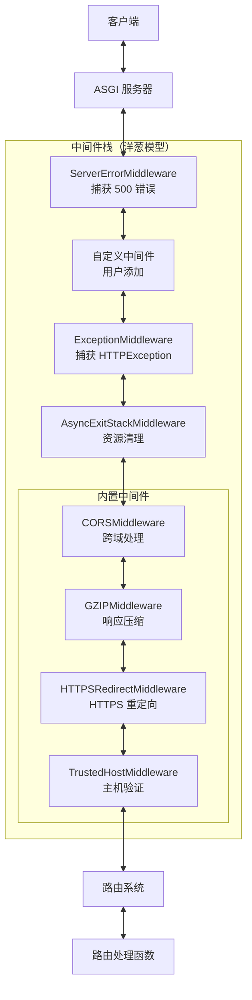

## 洋葱模型

中间件采用洋葱模型，后注册的中间件在外层：

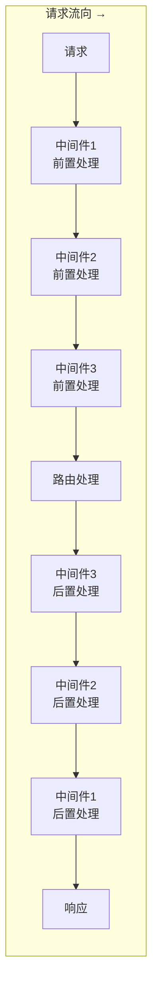

### 执行顺序示例

```python
@app.middleware("http")
async def middleware_1(request, call_next):
    print("M1: Before")
    response = await call_next(request)
    print("M1: After")
    return response

@app.middleware("http")
async def middleware_2(request, call_next):
    print("M2: Before")
    response = await call_next(request)
    print("M2: After")
    return response

@app.middleware("http")
async def middleware_3(request, call_next):
    print("M3: Before")
    response = await call_next(request)
    print("M3: After")
    return response

@app.get("/")
async def root():
    print("Route Handler")
    return {"message": "Hello"}

# 输出顺序：
# M3: Before
# M2: Before
# M1: Before
# Route Handler
# M1: After
# M2: After
# M3: After
```

## FastAPI 特有中间件

### AsyncExitStackMiddleware

这是 FastAPI 的核心中间件，负责管理异步上下文（用于 yield 依赖的清理）：

```python
class AsyncExitStackMiddleware:
    def __init__(self, app: ASGIApp, context_name: str = "fastapi_middleware_astack"):
        self.app = app
        self.context_name = context_name
    
    async def __call__(self, scope: Scope, receive: Receive, send: Send):
        # 创建异步上下文栈
        async with AsyncExitStack() as stack:
            # 将栈存储在 scope 中，供依赖注入使用
            scope[self.context_name] = stack
            # 执行下一层
            await self.app(scope, receive, send)
        # 离开上下文时自动清理所有资源
```

**作用**：

- 管理 yield 依赖的生命周期
- 确保资源在请求结束后正确清理
- 支持多个嵌套的上下文管理器

**位置**：

- 在 `ExceptionMiddleware` 之后
- 在路由处理之前
- 确保即使发生异常也能清理资源

## 内置中间件详解

### 1. CORSMiddleware - 跨域资源共享

```python
from fastapi.middleware.cors import CORSMiddleware

app.add_middleware(
    CORSMiddleware,
    allow_origins=["https://example.com"],  # 允许的源
    allow_credentials=True,                 # 允许携带凭证
    allow_methods=["*"],                    # 允许的 HTTP 方法
    allow_headers=["*"],                    # 允许的请求头
    expose_headers=["X-Custom-Header"],     # 暴露的响应头
    max_age=600,                            # 预检请求缓存时间（秒）
)
```

**工作原理**：

1. 检查请求的 `Origin` 头部
2. 如果是预检请求（OPTIONS），返回 CORS 头部
3. 如果是正常请求，添加 CORS 响应头部
4. 支持通配符和动态源验证

**时序图**：

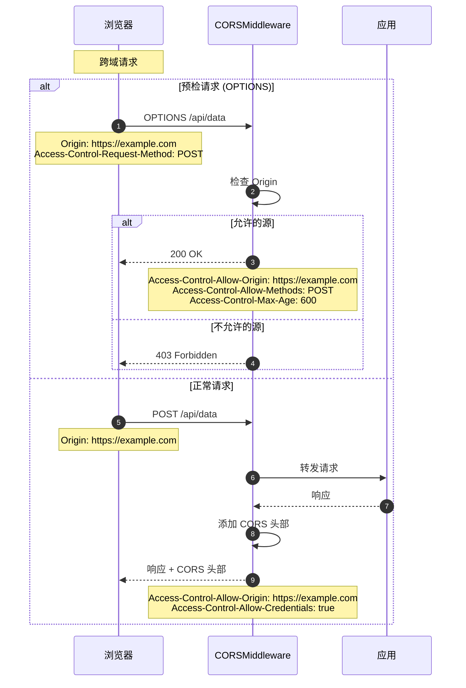

### 2. GZIPMiddleware - 响应压缩

```python
from fastapi.middleware.gzip import GZIPMiddleware

app.add_middleware(
    GZIPMiddleware,
    minimum_size=1000,  # 最小压缩大小（字节）
    compresslevel=5,    # 压缩级别（1-9）
)
```

**工作原理**：

1. 检查响应大小是否超过 `minimum_size`
2. 检查客户端是否支持 gzip（`Accept-Encoding` 头部）
3. 使用 gzip 压缩响应体
4. 添加 `Content-Encoding: gzip` 头部

**压缩效果**：

- JSON 数据：通常压缩 60-80%
- HTML：通常压缩 70-85%
- 已压缩数据（图片、视频）：几乎无效果

**性能考虑**：

- 增加 CPU 开销
- 减少网络传输
- 适合慢速网络场景

### 3. HTTPSRedirectMiddleware - HTTPS 重定向

```python
from fastapi.middleware.httpsredirect import HTTPSRedirectMiddleware

app.add_middleware(HTTPSRedirectMiddleware)
```

**工作原理**：

1. 检查请求协议（`scope["scheme"]`）
2. 如果是 HTTP，返回 307 临时重定向到 HTTPS
3. 如果是 HTTPS，正常处理

**使用场景**：

- 强制使用 HTTPS
- 生产环境安全性
- 通常配合反向代理使用

### 4. TrustedHostMiddleware - 可信主机验证

```python
from fastapi.middleware.trustedhost import TrustedHostMiddleware

app.add_middleware(
    TrustedHostMiddleware,
    allowed_hosts=["example.com", "*.example.com"]  # 允许的主机
)
```

**工作原理**：

1. 检查请求的 `Host` 头部
2. 与 `allowed_hosts` 列表匹配（支持通配符）
3. 如果不匹配，返回 400 Bad Request
4. 如果匹配，正常处理

**防护场景**：

- Host 头部注入攻击
- DNS 重绑定攻击
- 缓存投毒攻击

## 中间件执行流程

### 完整时序图


## 自定义中间件

### 基于函数的中间件

```python
import time
from fastapi import FastAPI, Request

app = FastAPI()

@app.middleware("http")
async def add_process_time_header(request: Request, call_next):
    # 请求前处理
    start_time = time.time()
    
    # 调用下一层（可能是另一个中间件或路由）
    response = await call_next(request)
    
    # 响应后处理
    process_time = time.time() - start_time
    response.headers["X-Process-Time"] = str(process_time)
    
    return response
```

### 基于类的中间件

```python
from starlette.middleware.base import BaseHTTPMiddleware
from starlette.requests import Request

class LoggingMiddleware(BaseHTTPMiddleware):
    async def dispatch(self, request: Request, call_next):
        # 请求前
        print(f"收到请求: {request.method} {request.url}")
        
        # 执行
        response = await call_next(request)
        
        # 响应后
        print(f"返回响应: {response.status_code}")
        
        return response

app.add_middleware(LoggingMiddleware)
```

### ASGI 中间件

```python
class CustomASGIMiddleware:
    def __init__(self, app: ASGIApp):
        self.app = app
    
    async def __call__(self, scope: Scope, receive: Receive, send: Send):
        if scope["type"] != "http":
            await self.app(scope, receive, send)
            return
        
        # 修改 scope
        scope["custom_header"] = "value"
        
        # 包装 send 以修改响应
        async def send_wrapper(message):
            if message["type"] == "http.response.start":
                headers = message.get("headers", [])
                headers.append((b"x-custom", b"value"))
                message["headers"] = headers
            await send(message)
        
        await self.app(scope, receive, send_wrapper)

app.add_middleware(CustomASGIMiddleware)
```

## 实际应用示例

### 示例1：请求限流中间件

```python
from fastapi import HTTPException
import time
from collections import defaultdict

class RateLimitMiddleware(BaseHTTPMiddleware):
    def __init__(self, app, requests_per_minute: int = 60):
        super().__init__(app)
        self.requests_per_minute = requests_per_minute
        self.requests = defaultdict(list)
    
    async def dispatch(self, request: Request, call_next):
        # 获取客户端 IP
        client_ip = request.client.host
        current_time = time.time()
        
        # 清理过期记录
        self.requests[client_ip] = [
            req_time for req_time in self.requests[client_ip]
            if current_time - req_time < 60
        ]
        
        # 检查限流
        if len(self.requests[client_ip]) >= self.requests_per_minute:
            raise HTTPException(
                status_code=429,
                detail="Too many requests"
            )
        
        # 记录请求
        self.requests[client_ip].append(current_time)
        
        # 继续处理
        response = await call_next(request)
        return response

app.add_middleware(RateLimitMiddleware, requests_per_minute=100)
```

### 示例2：请求ID追踪

```python
import uuid

@app.middleware("http")
async def add_request_id(request: Request, call_next):
    # 生成或获取请求ID
    request_id = request.headers.get("X-Request-ID", str(uuid.uuid4()))
    
    # 存储到 request.state
    request.state.request_id = request_id
    
    # 处理请求
    response = await call_next(request)
    
    # 添加到响应头
    response.headers["X-Request-ID"] = request_id
    
    return response

# 在路由中使用
@app.get("/items/")
async def read_items(request: Request):
    request_id = request.state.request_id
    print(f"处理请求 {request_id}")
    return {"items": []}
```

### 示例3：数据库事务中间件

```python
@app.middleware("http")
async def db_session_middleware(request: Request, call_next):
    # 创建数据库会话
    async with SessionLocal() as session:
        # 存储到 request.state
        request.state.db = session
        
        try:
            # 处理请求
            response = await call_next(request)
            
            # 提交事务
            await session.commit()
            
            return response
        except Exception:
            # 回滚事务
            await session.rollback()
            raise
```

### 示例4：性能监控

```python
import time
from prometheus_client import Histogram, Counter

REQUEST_DURATION = Histogram(
    "http_request_duration_seconds",
    "HTTP request duration",
    ["method", "endpoint", "status"]
)

REQUEST_COUNT = Counter(
    "http_requests_total",
    "Total HTTP requests",
    ["method", "endpoint", "status"]
)

@app.middleware("http")
async def metrics_middleware(request: Request, call_next):
    start_time = time.time()
    
    # 处理请求
    response = await call_next(request)
    
    # 记录指标
    duration = time.time() - start_time
    endpoint = request.url.path
    method = request.method
    status = response.status_code
    
    REQUEST_DURATION.labels(
        method=method,
        endpoint=endpoint,
        status=status
    ).observe(duration)
    
    REQUEST_COUNT.labels(
        method=method,
        endpoint=endpoint,
        status=status
    ).inc()
    
    return response
```

## 性能优化

### 中间件性能考虑

1. **顺序优化**：
   - 快速失败的中间件放在外层（如认证、限流）
   - 资源密集的中间件放在内层（如压缩）

2. **异步操作**：
   - 使用异步 I/O 避免阻塞
   - 不要在中间件中使用阻塞操作

3. **避免重复工作**：
   - 使用 `request.state` 共享数据
   - 避免多次解析相同数据

4. **条件执行**：
   - 只在需要时执行中间件逻辑
   - 使用路径前缀过滤

### 中间件数量

- **建议**：不超过 5-7 个中间件
- **原因**：每个中间件都增加延迟
- **优化**：合并相似功能的中间件

## 最佳实践

### 1. 使用 request.state 共享数据

```python
@app.middleware("http")
async def add_user_context(request: Request, call_next):
    # 解析 token 并获取用户
    token = request.headers.get("Authorization")
    user = await get_user_from_token(token)
    
    # 存储到 request.state
    request.state.user = user
    
    response = await call_next(request)
    return response

# 在路由中使用
@app.get("/profile")
async def profile(request: Request):
    user = request.state.user  # 不需要重新解析 token
    return {"username": user.username}
```

### 2. 异常处理

```python
@app.middleware("http")
async def error_handling_middleware(request: Request, call_next):
    try:
        response = await call_next(request)
        return response
    except ValueError as e:
        return JSONResponse(
            status_code=400,
            content={"detail": str(e)}
        )
    except Exception as e:
        # 记录日志
        logger.error(f"Unexpected error: {e}")
        return JSONResponse(
            status_code=500,
            content={"detail": "Internal server error"}
        )
```

### 3. 条件中间件

```python
@app.middleware("http")
async def conditional_middleware(request: Request, call_next):
    # 只对 API 路径启用
    if request.url.path.startswith("/api/"):
        # 中间件逻辑
        start_time = time.time()
        response = await call_next(request)
        duration = time.time() - start_time
        response.headers["X-API-Time"] = str(duration)
        return response
    else:
        # 跳过中间件逻辑
        return await call_next(request)
```

## 常见问题

### Q: 中间件和依赖注入的区别？
A:

- **中间件**：全局，影响所有路由，用于横切关注点
- **依赖注入**：路由级，可选择性应用，用于业务逻辑

### Q: 如何在中间件中访问路由信息？
A:

```python
@app.middleware("http")
async def route_info_middleware(request: Request, call_next):
    # 路由匹配在中间件之后进行
    # 可以通过 request.url.path 获取路径
    # 但无法获取路由处理函数信息
    response = await call_next(request)
    return response
```

### Q: 中间件可以修改请求体吗？
A: 不建议。请求体是流式读取的，修改请求体很复杂。建议在依赖项中处理。

### Q: 如何跳过某些路由的中间件？
A: 在中间件内部检查路径：

```python
@app.middleware("http")
async def skipable_middleware(request: Request, call_next):
    if request.url.path in ["/health", "/metrics"]:
        return await call_next(request)
    
    # 中间件逻辑
    ...
```

### Q: 中间件执行顺序如何控制？
A: 通过注册顺序控制。后注册的在外层（先执行）。

## 边界条件

### WebSocket 支持
- HTTP 中间件不处理 WebSocket
- 需要检查 `scope["type"]` 并跳过 WebSocket 请求

### 流式响应
- 中间件可以处理 `StreamingResponse`
- 不要在中间件中读取响应体（会破坏流式传输）

### 大请求体
- 避免在中间件中读取整个请求体
- 使用流式处理或在路由中处理

### 异步清理
- 使用 `try/finally` 确保清理逻辑执行
- AsyncExitStack 自动管理 yield 依赖的清理

---

## API接口

> **文档版本**: v1.0  
> **FastAPI 版本**: 0.118.0  
> **创建日期**: 2025年10月4日

---

## 📋 目录

1. [API概览](#api概览)
2. [add_middleware()详解](#addmiddleware详解)
3. [middleware()装饰器](#middleware装饰器)
4. [CORSMiddleware配置](#corsmiddleware配置)
5. [GZIPMiddleware配置](#gzipmiddleware配置)
6. [TrustedHostMiddleware配置](#trustedhostmiddleware配置)
7. [HTTPSRedirectMiddleware配置](#httpsredirectmiddleware配置)
8. [最佳实践](#最佳实践)

---

## API概览

### 核心API清单

| # | API名称 | 类型 | 用途 | 常用度 |
|---|---------|------|------|--------|
| 1 | `add_middleware()` | 方法 | 添加中间件 | ⭐⭐⭐⭐⭐ |
| 2 | `middleware()` | 装饰器 | HTTP中间件装饰器 | ⭐⭐⭐⭐ |
| 3 | `CORSMiddleware` | 类 | CORS跨域支持 | ⭐⭐⭐⭐⭐ |
| 4 | `GZIPMiddleware` | 类 | GZIP压缩 | ⭐⭐⭐⭐ |
| 5 | `TrustedHostMiddleware` | 类 | 主机验证 | ⭐⭐⭐ |
| 6 | `HTTPSRedirectMiddleware` | 类 | HTTPS重定向 | ⭐⭐⭐ |

---

## add_middleware()详解

### 基本信息
- **功能**: 添加ASGI中间件到应用
- **位置**: `FastAPI.add_middleware()`, `APIRouter.add_middleware()`  
- **执行顺序**: 后添加的先执行（栈结构）

### 函数签名

```python
def add_middleware(
    self,
    middleware_class: Type[ASGIMiddleware],
    **options: Any
) -> None:
    """
    添加ASGI中间件
    
    参数:
        middleware_class: 中间件类（必须是ASGI中间件）
        **options: 传递给中间件构造函数的参数
    """
```

### 参数详解

| 参数 | 类型 | 必填 | 说明 |
|------|------|------|------|
| **middleware_class** | Type[ASGIMiddleware] | 是 | 中间件类（不是实例） |
| ****options** | Any | 否 | 中间件配置参数 |

### 核心代码

```python
def add_middleware(
    self,
    middleware_class: Type[ASGIMiddleware],
    **options: Any
) -> None:
    # 将中间件配置添加到列表
    self.user_middleware.insert(0, Middleware(middleware_class, **options))
```

**实现说明**：

- 使用`insert(0, ...)`而不是`append()`，确保后添加的中间件先执行
- 中间件在`build_middleware_stack()`时被实例化
- 配置存储在`Middleware`对象中

### 使用示例

**示例1：添加CORS中间件**

```python
from fastapi import FastAPI
from fastapi.middleware.cors import CORSMiddleware

app = FastAPI()

app.add_middleware(
    CORSMiddleware,
    allow_origins=["https://example.com"],
    allow_credentials=True,
    allow_methods=["*"],
    allow_headers=["*"],
)
```

**示例2：添加GZIP压缩**

```python
from fastapi.middleware.gzip import GZIPMiddleware

app.add_middleware(GZIPMiddleware, minimum_size=1000)
```

**示例3：添加自定义中间件**

```python
class CustomMiddleware:
    def __init__(self, app, custom_param):
        self.app = app
        self.custom_param = custom_param
    
    async def __call__(self, scope, receive, send):
        # 中间件逻辑
        await self.app(scope, receive, send)

app.add_middleware(CustomMiddleware, custom_param="value")
```

### 执行时序图

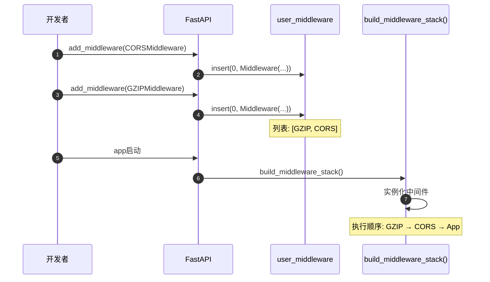

---

## middleware()装饰器

### 基本信息
- **功能**: HTTP中间件装饰器，简化自定义中间件编写
- **类型**: 装饰器
- **用途**: 快速添加简单的HTTP中间件逻辑

### 函数签名

```python
def middleware(self, middleware_type: str) -> Callable:
    """
    HTTP中间件装饰器
    
    参数:
        middleware_type: 中间件类型，当前仅支持 "http"
    
    返回:
        装饰器函数
    """
```

### 核心代码

```python
def middleware(self, middleware_type: str) -> Callable:
    assert middleware_type == "http", "Only 'http' middleware supported"
    
    def decorator(func: Callable) -> Callable:
        self.add_middleware(BaseHTTPMiddleware, dispatch=func)
        return func
    
    return decorator
```

### 使用示例

**示例1：添加请求计时中间件**

```python
import time
from fastapi import FastAPI, Request

app = FastAPI()

@app.middleware("http")
async def add_process_time_header(request: Request, call_next):
    start_time = time.time()
    response = await call_next(request)
    process_time = time.time() - start_time
    response.headers["X-Process-Time"] = str(process_time)
    return response
```

**示例2：添加请求日志中间件**

```python
@app.middleware("http")
async def log_requests(request: Request, call_next):
    print(f"Request: {request.method} {request.url}")
    response = await call_next(request)
    print(f"Response: {response.status_code}")
    return response
```

**示例3：添加自定义请求头**

```python
@app.middleware("http")
async def add_custom_header(request: Request, call_next):
    response = await call_next(request)
    response.headers["X-Custom-Header"] = "Custom Value"
    return response
```

### call_next参数说明

```python
async def my_middleware(request: Request, call_next):
    # request: 当前请求对象
    # call_next: 调用下一个中间件或应用的函数
    
    # 请求前处理
    print("Before request")
    
    # 调用下一层
    response = await call_next(request)
    
    # 响应后处理
    print("After request")
    
    return response
```

---

## CORSMiddleware配置

### 基本信息
- **功能**: 处理CORS（跨域资源共享）
- **来源**: `fastapi.middleware.cors.CORSMiddleware`
- **用途**: 允许前端跨域访问API

### 完整参数列表

```python
from fastapi.middleware.cors import CORSMiddleware

app.add_middleware(
    CORSMiddleware,
    allow_origins=["*"],                    # 允许的源列表
    allow_credentials=False,                # 是否允许携带凭证
    allow_methods=["*"],                    # 允许的HTTP方法
    allow_headers=["*"],                    # 允许的请求头
    expose_headers=[],                      # 暴露的响应头
    max_age=600,                            # 预检请求缓存时间（秒）
)
```

### 参数详解

| 参数 | 类型 | 默认值 | 说明 |
|------|------|--------|------|
| **allow_origins** | List[str] | [] | 允许的源列表，`["*"]`表示所有 |
| **allow_origin_regex** | Optional[str] | None | 允许的源正则表达式 |
| **allow_credentials** | bool | False | 是否允许携带Cookie |
| **allow_methods** | List[str] | ["GET"] | 允许的HTTP方法，`["*"]`表示所有 |
| **allow_headers** | List[str] | [] | 允许的请求头，`["*"]`表示所有 |
| **expose_headers** | List[str] | [] | 暴露给客户端的响应头 |
| **max_age** | int | 600 | 预检请求(OPTIONS)缓存时间 |

### 使用示例

**示例1：允许特定域名**

```python
app.add_middleware(
    CORSMiddleware,
    allow_origins=[
        "https://example.com",
        "https://www.example.com",
    ],
    allow_credentials=True,
    allow_methods=["*"],
    allow_headers=["*"],
)
```

**示例2：开发环境配置（允许所有）**

```python
app.add_middleware(
    CORSMiddleware,
    allow_origins=["*"],
    allow_credentials=False,  # allow_origins=["*"]时必须为False
    allow_methods=["*"],
    allow_headers=["*"],
)
```

**示例3：使用正则表达式匹配源**

```python
app.add_middleware(
    CORSMiddleware,
    allow_origin_regex=r"https://.*\.example\.com",
    allow_credentials=True,
    allow_methods=["GET", "POST"],
    allow_headers=["Content-Type", "Authorization"],
)
```

**示例4：生产环境配置**

```python
app.add_middleware(
    CORSMiddleware,
    allow_origins=[
        "https://frontend.example.com",
    ],
    allow_credentials=True,
    allow_methods=["GET", "POST", "PUT", "DELETE"],
    allow_headers=["Content-Type", "Authorization"],
    expose_headers=["X-Total-Count"],
    max_age=3600,
)
```

### CORS处理流程

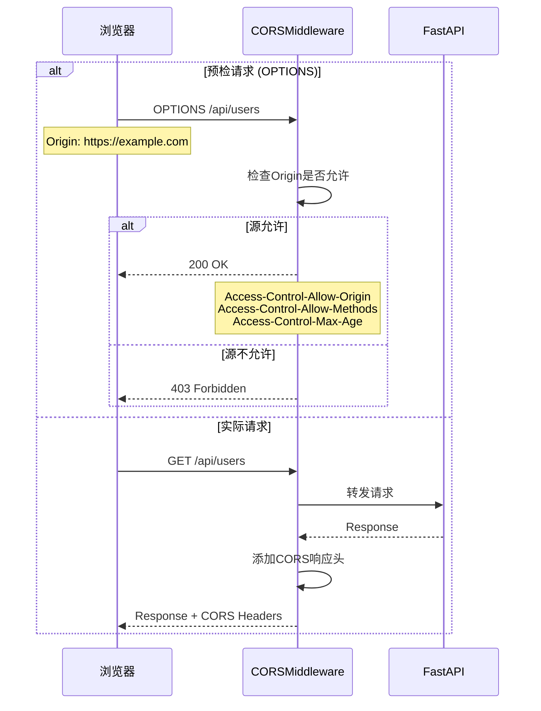

### 安全注意事项

| 配置 | 风险 | 建议 |
|------|------|------|
| `allow_origins=["*"]` | 高风险 | 仅用于开发环境 |
| `allow_credentials=True` + `allow_origins=["*"]` | 禁止 | 浏览器会拒绝 |
| `allow_methods=["*"]` | 中风险 | 生产环境明确指定 |
| `allow_headers=["*"]` | 低风险 | 可用于生产环境 |

---

## GZIPMiddleware配置

### 基本信息
- **功能**: GZIP压缩响应体
- **来源**: `fastapi.middleware.gzip.GZIPMiddleware`
- **用途**: 减少传输数据量，提升性能

### 完整参数列表

```python
from fastapi.middleware.gzip import GZIPMiddleware

app.add_middleware(
    GZIPMiddleware,
    minimum_size=1000,          # 最小压缩大小（字节）
    compresslevel=5,            # 压缩级别 (1-9)
)
```

### 参数详解

| 参数 | 类型 | 默认值 | 说明 |
|------|------|--------|------|
| **minimum_size** | int | 500 | 响应体小于此值时不压缩（字节） |
| **compresslevel** | int | 5 | 压缩级别，1最快但压缩率低，9最慢但压缩率高 |

### 使用示例

**示例1：默认配置**

```python
app.add_middleware(GZIPMiddleware)
# minimum_size=500, compresslevel=5
```

**示例2：自定义压缩阈值**

```python
app.add_middleware(
    GZIPMiddleware,
    minimum_size=2000,  # 只压缩大于2KB的响应
)
```

**示例3：高压缩率配置**

```python
app.add_middleware(
    GZIPMiddleware,
    minimum_size=1000,
    compresslevel=9,  # 最高压缩率（更慢）
)
```

### 压缩级别对比

| 级别 | 压缩率 | 速度 | 适用场景 |
|------|--------|------|----------|
| 1 | 低 | 最快 | 实时性要求高 |
| 5 | 中 | 适中 | **推荐默认值** |
| 9 | 高 | 慢 | 静态文件 |

### 工作流程

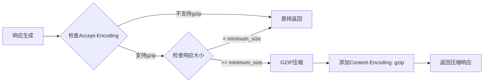

---

## TrustedHostMiddleware配置

### 基本信息
- **功能**: 验证请求的Host头，防止Host头攻击
- **来源**: `fastapi.middleware.trustedhost.TrustedHostMiddleware`
- **用途**: 安全防护

### 完整参数列表

```python
from fastapi.middleware.trustedhost import TrustedHostMiddleware

app.add_middleware(
    TrustedHostMiddleware,
    allowed_hosts=["example.com", "*.example.com"],
)
```

### 参数详解

| 参数 | 类型 | 必填 | 说明 |
|------|------|------|------|
| **allowed_hosts** | List[str] | 是 | 允许的主机名列表，支持通配符`*` |

### 使用示例

**示例1：单个域名**

```python
app.add_middleware(
    TrustedHostMiddleware,
    allowed_hosts=["example.com"],
)
```

**示例2：多个域名**

```python
app.add_middleware(
    TrustedHostMiddleware,
    allowed_hosts=[
        "example.com",
        "www.example.com",
        "api.example.com",
    ],
)
```

**示例3：通配符子域名**

```python
app.add_middleware(
    TrustedHostMiddleware,
    allowed_hosts=["*.example.com"],
)
# 允许: api.example.com, www.example.com等
# 不允许: example.com (需要明确添加)
```

**示例4：开发环境配置**

```python
app.add_middleware(
    TrustedHostMiddleware,
    allowed_hosts=["localhost", "127.0.0.1", "*.example.com"],
)
```

### 验证流程

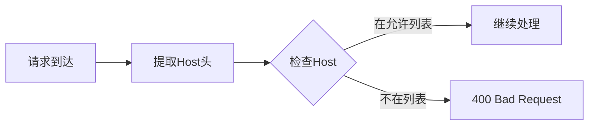

---

## HTTPSRedirectMiddleware配置

### 基本信息
- **功能**: 自动将HTTP请求重定向到HTTPS
- **来源**: `fastapi.middleware.httpsredirect.HTTPSRedirectMiddleware`
- **用途**: 强制HTTPS访问

### 使用方式

```python
from fastapi.middleware.httpsredirect import HTTPSRedirectMiddleware

app.add_middleware(HTTPSRedirectMiddleware)
```

**无参数配置**：此中间件不需要参数。

### 使用示例

**示例：强制HTTPS**

```python
app = FastAPI()

# 仅在生产环境添加
if settings.ENVIRONMENT == "production":
    app.add_middleware(HTTPSRedirectMiddleware)
```

### 工作流程

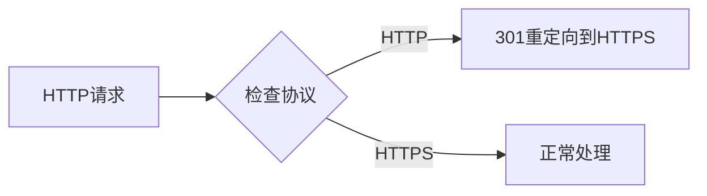

---

## 最佳实践

### 1. 中间件添加顺序

**推荐顺序**（从外到内）：

```python
app = FastAPI()

# 1. 安全相关（最外层）
app.add_middleware(TrustedHostMiddleware, allowed_hosts=["*.example.com"])
app.add_middleware(HTTPSRedirectMiddleware)

# 2. CORS（需要在压缩之前）
app.add_middleware(
    CORSMiddleware,
    allow_origins=["https://example.com"],
    allow_credentials=True,
)

# 3. 压缩（应该在最后，压缩所有响应）
app.add_middleware(GZIPMiddleware, minimum_size=1000)

# 4. 自定义中间件
@app.middleware("http")
async def custom_middleware(request, call_next):
    response = await call_next(request)
    return response
```

**顺序说明**：

- **安全中间件**：最先执行，快速拒绝非法请求
- **CORS**：在压缩之前处理，避免CORS头被压缩影响
- **GZIP**：最后执行，压缩所有响应

### 2. 性能优化

**GZIP配置**：

```python
# ✅ 推荐：合理的压缩阈值
app.add_middleware(GZIPMiddleware, minimum_size=1000)

# ❌ 不推荐：压缩过小的响应
app.add_middleware(GZIPMiddleware, minimum_size=100)
```

**CORS缓存**：

```python
# ✅ 推荐：增加max_age减少预检请求
app.add_middleware(
    CORSMiddleware,
    allow_origins=["https://example.com"],
    max_age=3600,  # 1小时
)
```

### 3. 安全配置

**生产环境CORS**：

```python
# ✅ 推荐：明确指定允许的源
app.add_middleware(
    CORSMiddleware,
    allow_origins=["https://frontend.example.com"],
    allow_credentials=True,
    allow_methods=["GET", "POST", "PUT", "DELETE"],
    allow_headers=["Content-Type", "Authorization"],
)

# ❌ 不推荐：允许所有源
app.add_middleware(
    CORSMiddleware,
    allow_origins=["*"],
)
```

### 4. 环境配置

```python
from pydantic import BaseSettings

class Settings(BaseSettings):
    environment: str = "development"
    allowed_hosts: List[str] = ["localhost"]
    cors_origins: List[str] = ["http://localhost:3000"]

settings = Settings()

app = FastAPI()

# 根据环境配置中间件
if settings.environment == "production":
    app.add_middleware(HTTPSRedirectMiddleware)
    app.add_middleware(
        TrustedHostMiddleware,
        allowed_hosts=settings.allowed_hosts
    )

app.add_middleware(
    CORSMiddleware,
    allow_origins=settings.cors_origins,
    allow_credentials=True,
)
```

---

## 📚 相关文档

- [FastAPI-04-中间件系统-概览](./FastAPI-04-中间件系统-概览.md) - 中间件系统架构
- [FastAPI-04-中间件系统-数据结构](./FastAPI-04-中间件系统-数据结构.md) - 中间件数据结构
- [FastAPI-04-中间件系统-时序图](./FastAPI-04-中间件系统-时序图.md) - 中间件执行流程

---

## 📊 API汇总表

| API | 参数数量 | 复杂度 | 使用频率 |
|-----|----------|--------|----------|
| `add_middleware()` | 1+ | ⭐ | ⭐⭐⭐⭐⭐ |
| `middleware()` | 1 | ⭐ | ⭐⭐⭐⭐ |
| `CORSMiddleware` | 7 | ⭐⭐ | ⭐⭐⭐⭐⭐ |
| `GZIPMiddleware` | 2 | ⭐ | ⭐⭐⭐⭐ |
| `TrustedHostMiddleware` | 1 | ⭐ | ⭐⭐⭐ |
| `HTTPSRedirectMiddleware` | 0 | ⭐ | ⭐⭐⭐ |

---

*本文档生成于 2025年10月4日，基于 FastAPI 0.118.0*

---

## 数据结构

> **文档版本**: v1.0  
> **FastAPI 版本**: 0.118.0  
> **创建日期**: 2025年10月4日

---

## 📋 目录

1. [数据结构概览](#数据结构概览)
2. [Middleware配置结构](#middleware配置结构)
3. [AsyncExitStackMiddleware](#asyncexitstackmiddleware)
4. [中间件栈结构](#中间件栈结构)
5. [ASGI应用接口](#asgi应用接口)
6. [UML类图](#uml类图)

---

## 数据结构概览

### 核心数据结构清单

| 结构名称 | 类型 | 文件位置 | 职责 |
|----------|------|----------|------|
| **Middleware** | dataclass/NamedTuple | Starlette | 中间件配置 |
| **AsyncExitStackMiddleware** | class | `middleware/asyncexitstack.py` | 管理AsyncExitStack |
| **BaseHTTPMiddleware** | class | Starlette | HTTP中间件基类 |
| **ASGIApp** | Protocol | typing | ASGI应用接口 |

---

## Middleware配置结构

### 定义

```python
from dataclasses import dataclass
from typing import Any, Type

@dataclass
class Middleware:
    """
    中间件配置，存储中间件类和初始化参数
    """
    cls: Type[ASGIMiddleware]    # 中间件类
    options: Dict[str, Any]       # 初始化参数
```

**Starlette实现**（NamedTuple版本）：

```python
from typing import Any, Awaitable, Callable, Dict, NamedTuple, Type

class Middleware(NamedTuple):
    cls: Type[ASGIMiddleware]
    options: Dict[str, Any]
```

### 属性详解

| 属性 | 类型 | 说明 |
|------|------|------|
| **cls** | Type[ASGIMiddleware] | 中间件类（未实例化） |
| **options** | Dict[str, Any] | 传递给中间件`__init__()`的参数 |

### 使用示例

```python
from fastapi.middleware.cors import CORSMiddleware

# 创建中间件配置
middleware_config = Middleware(
    cls=CORSMiddleware,
    options={
        "allow_origins": ["https://example.com"],
        "allow_credentials": True,
    }
)

# 在build_middleware_stack()时实例化
middleware_instance = middleware_config.cls(
    app=next_app,
    **middleware_config.options
)
```

### 中间件配置列表

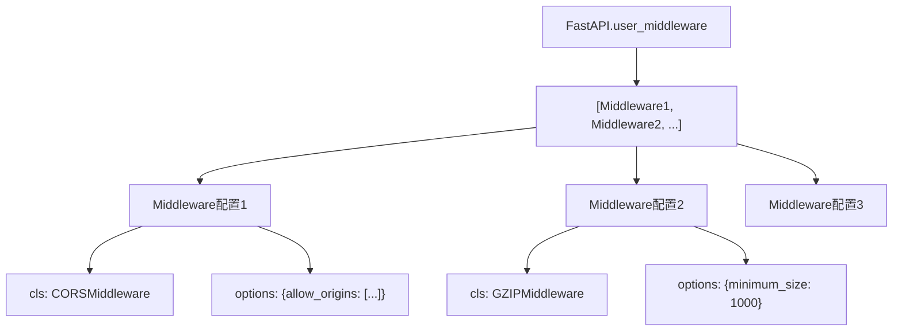

---

## AsyncExitStackMiddleware

### 类定义

```python
from contextlib import AsyncExitStack
from typing import TYPE_CHECKING

if TYPE_CHECKING:
    from starlette.types import ASGIApp, Receive, Scope, Send

class AsyncExitStackMiddleware:
    """
    为每个请求创建AsyncExitStack，用于管理yield依赖的生命周期
    """
    def __init__(self, app: "ASGIApp", context_name: str = "fastapi_astack") -> None:
        self.app = app
        self.context_name = context_name
    
    async def __call__(self, scope: "Scope", receive: "Receive", send: "Send") -> None:
        async with AsyncExitStack() as stack:
            scope[self.context_name] = stack
            await self.app(scope, receive, send)
```

### 属性详解

| 属性 | 类型 | 说明 |
|------|------|------|
| **app** | ASGIApp | 下一层ASGI应用 |
| **context_name** | str | 在scope中存储stack的键名 |

### 核心功能

1. **创建AsyncExitStack**: 每个请求创建一个新的stack
2. **注入scope**: 将stack存储在`scope["fastapi_astack"]`中
3. **自动清理**: 请求结束时自动调用stack的`__aexit__()`

### UML类图

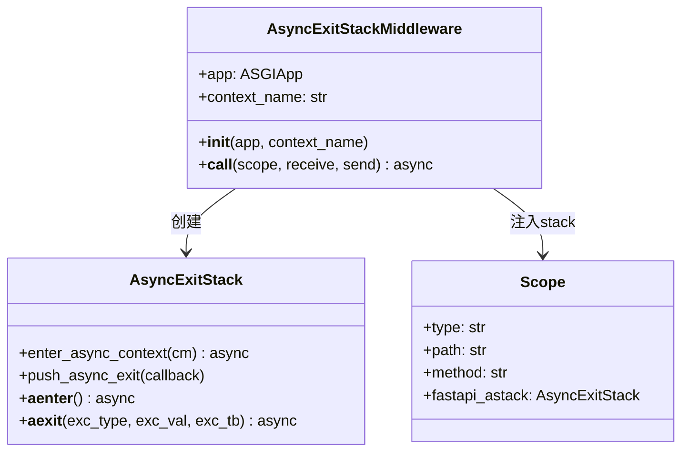

### 使用流程

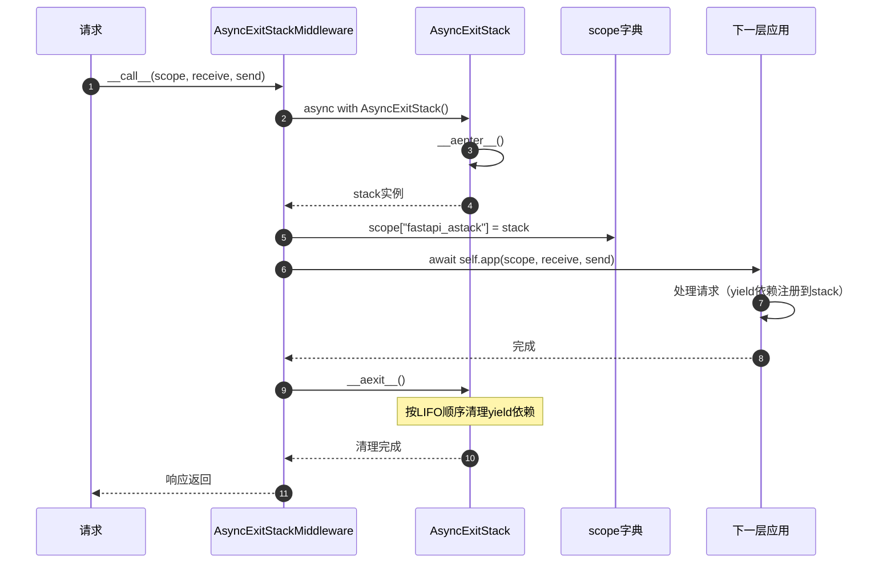

### yield依赖注册

```python
# 在solve_dependencies()中注册yield依赖
async with AsyncExitStack() as stack:
    scope["fastapi_astack"] = stack
    
    # yield依赖
    async def get_db():
        db = Database()
        try:
            yield db
        finally:
            await db.close()
    
    # 注册到stack
    db = await stack.enter_async_context(get_db())
    
    # 请求处理...
    
    # stack.__aexit__()自动调用get_db()的finally块
```

---

## 中间件栈结构

### 栈的构建

```python
def build_middleware_stack(self) -> ASGIApp:
    """
    构建中间件栈（洋葱模型）
    """
    # 从内到外构建
    app = self.router
    
    # 添加AsyncExitStackMiddleware（最内层）
    app = AsyncExitStackMiddleware(app, context_name="fastapi_inner_astack")
    
    # 按user_middleware逆序添加（后添加的中间件在外层）
    for middleware in reversed(self.user_middleware):
        app = middleware.cls(app, **middleware.options)
    
    # 添加ServerErrorMiddleware和ExceptionMiddleware（最外层）
    app = ExceptionMiddleware(app, handlers=self.exception_handlers)
    app = ServerErrorMiddleware(app)
    
    return app
```

### 洋葱模型

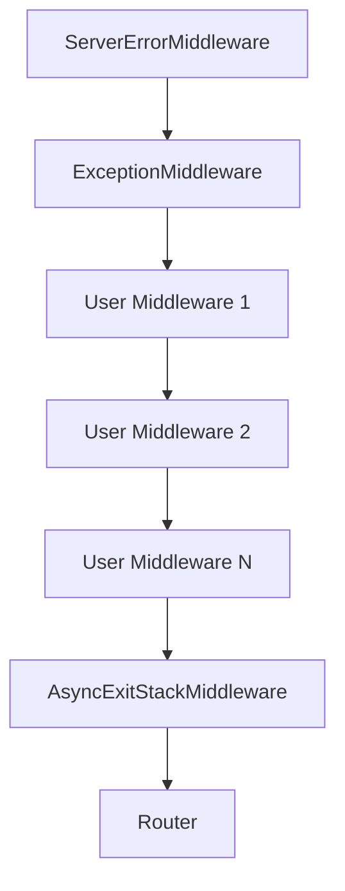

**执行顺序**（请求）：

1. ServerErrorMiddleware
2. ExceptionMiddleware
3. User Middleware 1
4. User Middleware 2
5. ...
6. AsyncExitStackMiddleware
7. Router → Routes → Endpoint

**执行顺序**（响应）：逆序返回

### 中间件栈数据结构

```python
from typing import List

@dataclass
class MiddlewareStack:
    """中间件栈（概念模型）"""
    layers: List[ASGIApp]  # 从外到内的中间件列表
    
    def __call__(self, scope, receive, send):
        """从最外层开始调用"""
        return self.layers[0](scope, receive, send)
```

**实际实现**：

```python
# 通过嵌套调用实现栈结构
outer_middleware = Middleware1(
    Middleware2(
        Middleware3(
            Router()
        )
    )
)
```

---

## ASGI应用接口

### ASGIApp Protocol

```python
from typing import Awaitable, Callable, Protocol

class Receive(Protocol):
    """接收消息的可调用对象"""
    def __call__(self) -> Awaitable[Dict[str, Any]]:
        ...

class Send(Protocol):
    """发送消息的可调用对象"""
    def __call__(self, message: Dict[str, Any]) -> Awaitable[None]:
        ...

class Scope(TypedDict):
    """ASGI scope字典"""
    type: str  # "http", "websocket", "lifespan"
    asgi: Dict[str, str]
    http_version: str
    method: str
    path: str
    query_string: bytes
    headers: List[Tuple[bytes, bytes]]
    # ... 更多字段

# ASGI应用类型
ASGIApp = Callable[[Scope, Receive, Send], Awaitable[None]]
```

### 中间件接口

```python
from typing import Any

class ASGIMiddleware:
    """
    ASGI中间件标准接口
    """
    def __init__(self, app: ASGIApp, **options: Any) -> None:
        """
        初始化中间件
        
        Args:
            app: 下一层ASGI应用
            **options: 中间件配置参数
        """
        self.app = app
    
    async def __call__(
        self,
        scope: Scope,
        receive: Receive,
        send: Send
    ) -> None:
        """
        处理ASGI请求
        
        Args:
            scope: ASGI scope字典
            receive: 接收消息的回调
            send: 发送消息的回调
        """
        # 请求前处理
        # ...
        
        # 调用下一层
        await self.app(scope, receive, send)
        
        # 响应后处理
        # ...
```

### Scope字典结构

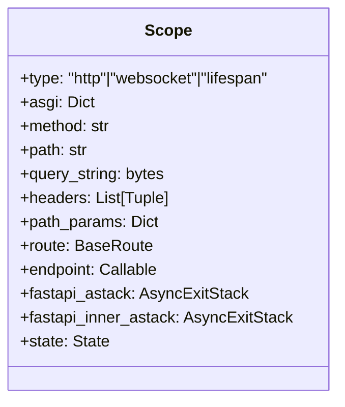

**Scope字段说明**：

| 字段 | 类型 | 说明 |
|------|------|------|
| **type** | str | 请求类型："http", "websocket", "lifespan" |
| **method** | str | HTTP方法："GET", "POST"等 |
| **path** | str | 请求路径："/api/users" |
| **query_string** | bytes | 查询字符串："limit=10&offset=0" |
| **headers** | List[Tuple] | 请求头：`[(b"host", b"example.com"), ...]` |
| **path_params** | Dict | 路径参数：`{"user_id": 123}` |
| **route** | BaseRoute | 匹配的路由对象 |
| **endpoint** | Callable | 端点函数 |
| **fastapi_astack** | AsyncExitStack | 外层AsyncExitStack |
| **fastapi_inner_astack** | AsyncExitStack | 内层AsyncExitStack |
| **state** | State | 应用状态对象 |

---

## UML类图

### 完整中间件系统类图

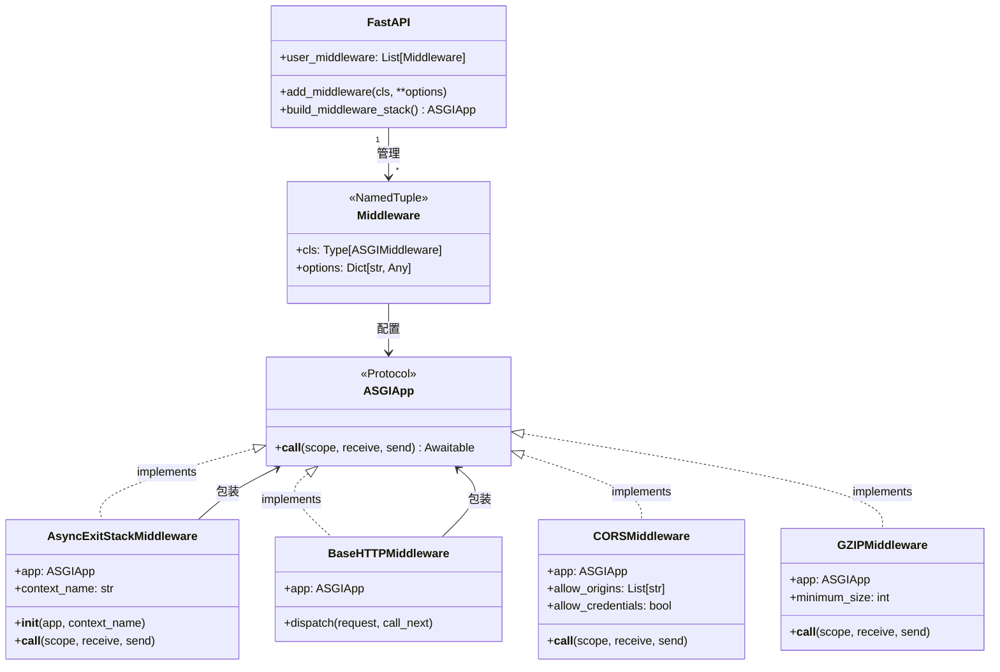

### 中间件栈结构图

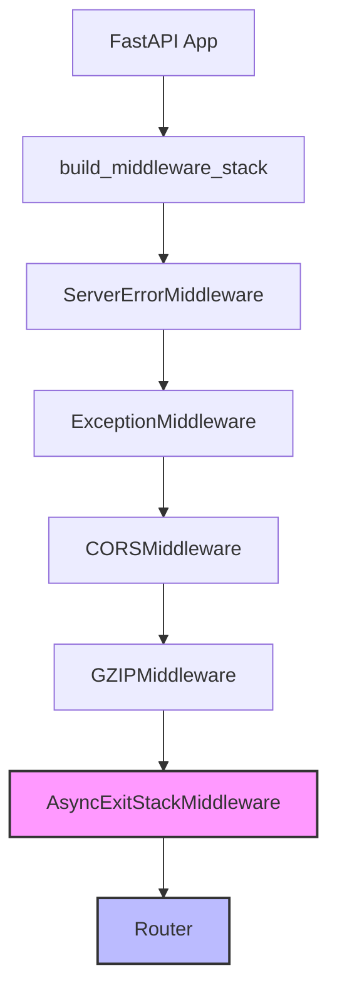

### 数据流转图


---

## 📊 数据结构统计

| 项目 | 数量/说明 |
|------|----------|
| 核心结构 | 4个（Middleware, AsyncExitStackMiddleware, ASGIApp, Scope） |
| Middleware配置 | 2个字段（cls, options） |
| AsyncExitStackMiddleware | 2个属性（app, context_name） |
| Scope关键字段 | 10+个 |
| 中间件层级 | 无限制（理论上） |

---

## 📚 相关文档

- [FastAPI-04-中间件系统-概览](./FastAPI-04-中间件系统-概览.md) - 中间件系统架构
- [FastAPI-04-中间件系统-API](./FastAPI-04-中间件系统-API.md) - 中间件API详解
- [FastAPI-04-中间件系统-时序图](./FastAPI-04-中间件系统-时序图.md) - 中间件执行流程
- [FastAPI-03-依赖注入-概览](./FastAPI-03-依赖注入-概览.md) - AsyncExitStack与yield依赖

---

*本文档生成于 2025年10月4日，基于 FastAPI 0.118.0*

---

## 时序图

> **文档版本**: v1.0  
> **FastAPI 版本**: 0.118.0  
> **创建日期**: 2025年10月4日

---

## 📋 目录

1. [时序图概览](#时序图概览)
2. [中间件栈构建流程](#中间件栈构建流程)
3. [中间件注册流程](#中间件注册流程)
4. [请求通过中间件链流程](#请求通过中间件链流程)
5. [AsyncExitStack生命周期](#asyncexitstack生命周期)
6. [CORS预检请求流程](#cors预检请求流程)
7. [GZIP压缩流程](#gzip压缩流程)

---

## 时序图概览

### 核心流程清单

| # | 流程名称 | 执行时机 | 复杂度 | 频率 |
|---|---------|----------|--------|------|
| 1 | 中间件栈构建 | 应用启动 | ⭐⭐ | 一次 |
| 2 | 中间件注册 | 启动前配置 | ⭐ | 多次 |
| 3 | 请求处理链 | 每个请求 | ⭐⭐⭐⭐ | 高频 |
| 4 | AsyncExitStack管理 | 每个请求 | ⭐⭐⭐ | 高频 |
| 5 | CORS预检 | OPTIONS请求 | ⭐⭐ | 中频 |
| 6 | GZIP压缩 | 符合条件的响应 | ⭐⭐ | 高频 |

---

## 中间件栈构建流程

### 1.1 build_middleware_stack()完整流程

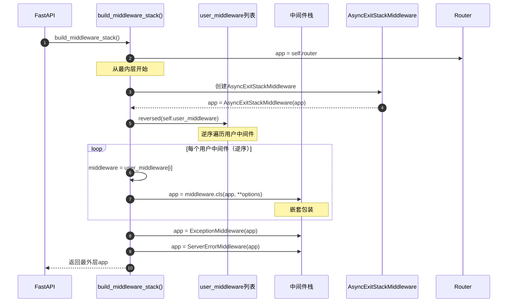

**时序图说明**：

1. **图意概述**: 展示中间件栈的构建过程，从内到外逐层包装
2. **关键字段**: app变量不断被新的中间件包装；user_middleware逆序遍历
3. **边界条件**: user_middleware可以为空；Router是最内层
4. **执行顺序**: Router → AsyncExitStack → 用户中间件(逆序) → 异常处理
5. **性能假设**: 构建在启动时完成一次，O(n)复杂度，n为中间件数量
6. **设计理由**: 通过嵌套调用实现洋葱模型；逆序确保后添加的先执行

### 1.2 中间件嵌套结构

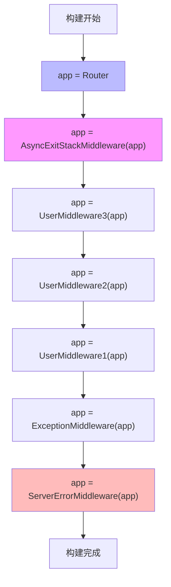

---

## 中间件注册流程

### 2.1 add_middleware()注册流程

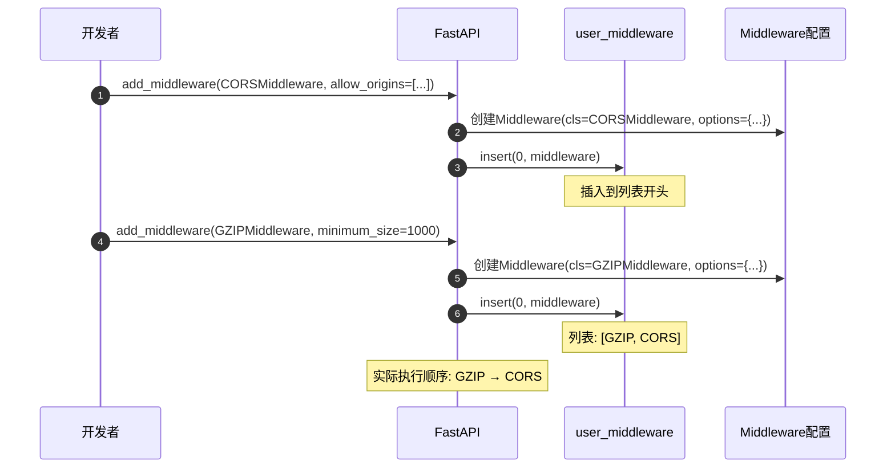

**时序图说明**：

1. **图意概述**: 展示中间件注册时的配置存储过程
2. **关键点**: 使用`insert(0)`而不是`append()`，确保后添加的先执行
3. **边界条件**: 可以多次添加同一个中间件类（不同配置）
4. **性能**: O(1)时间复杂度（列表insert操作）

---

## 请求通过中间件链流程

### 3.1 完整中间件链执行

```mermaid
sequenceDiagram
    autonumber
    participant Client as 客户端
    participant Server as ServerErrorMiddleware
    participant Exception as ExceptionMiddleware
    participant GZIP as GZIPMiddleware
    participant CORS as CORSMiddleware
    participant AsyncStack as AsyncExitStackMiddleware
    participant Router as Router
    participant Endpoint as 端点函数
    
    Client->>Server: HTTP Request
    Note over Client,Server: 请求阶段（从外到内）
    
    Server->>Exception: __call__(scope, receive, send)
    Exception->>GZIP: __call__(scope, receive, send)
    GZIP->>CORS: __call__(scope, receive, send)
    CORS->>AsyncStack: __call__(scope, receive, send)
    AsyncStack->>AsyncStack: 创建AsyncExitStack
    AsyncStack->>Router: __call__(scope, receive, send)
    Router->>Endpoint: 路由匹配并调用
    
    Note over Endpoint: 执行业务逻辑
    
    Endpoint-->>Router: 返回响应数据
    Note over Endpoint,Client: 响应阶段（从内到外）
    
    Router-->>AsyncStack: Response
    AsyncStack->>AsyncStack: 清理AsyncExitStack
    AsyncStack-->>CORS: Response
    CORS->>CORS: 添加CORS头
    CORS-->>GZIP: Response
    GZIP->>GZIP: 压缩响应体
    GZIP-->>Exception: Response
    Exception-->>Server: Response
    Server-->>Client: HTTP Response
```

**时序图说明**：

1. **图意概述**: 展示请求从外到内穿过中间件链，响应从内到外返回的完整流程
2. **关键阶段**: 请求阶段（外→内）；业务逻辑；响应阶段（内→外）
3. **边界条件**: 任何中间件可以短路返回；异常会被ExceptionMiddleware捕获
4. **异常路径**: 异常 → ExceptionMiddleware → 转换为HTTP响应 → 返回客户端
5. **性能假设**: 中间件数量n，时间复杂度O(n)
6. **设计理由**: 洋葱模型确保每个中间件都能处理请求和响应

### 3.2 中间件短路返回

```mermaid
sequenceDiagram
    autonumber
    participant Client as 客户端
    participant MW1 as Middleware 1
    participant MW2 as Middleware 2
    participant MW3 as Middleware 3
    participant App as Application
    
    Client->>MW1: Request
    MW1->>MW2: 转发
    MW2->>MW2: 检查条件
    
    alt 条件不满足（如认证失败）
        MW2-->>MW1: 401 Unauthorized
        Note over MW2: 短路返回，不调用下一层
        MW1-->>Client: 401 Unauthorized
    else 条件满足
        MW2->>MW3: 转发
        MW3->>App: 转发
        App-->>MW3: Response
        MW3-->>MW2: Response
        MW2-->>MW1: Response
        MW1-->>Client: Response
    end
```

---

## AsyncExitStack生命周期

### 4.1 AsyncExitStackMiddleware完整流程

```mermaid
sequenceDiagram
    autonumber
    participant Request as 请求
    participant AESM as AsyncExitStackMiddleware
    participant Stack as AsyncExitStack
    participant Scope as scope字典
    participant Next as 下一层中间件
    participant Deps as yield依赖
    
    Request->>AESM: __call__(scope, receive, send)
    AESM->>Stack: async with AsyncExitStack()
    Stack->>Stack: __aenter__()
    Note over Stack: 创建stack实例
    
    AESM->>Scope: scope["fastapi_astack"] = stack
    AESM->>Next: await self.app(scope, receive, send)
    
    Next->>Deps: 解析yield依赖
    Deps->>Stack: stack.enter_async_context(dependency)
    Note over Stack: 注册清理回调
    Deps-->>Next: yield的值
    
    Next->>Next: 执行业务逻辑
    Next-->>AESM: 响应完成
    
    AESM->>Stack: __aexit__()
    Note over Stack: 触发清理
    
    loop 逆序清理依赖
        Stack->>Deps: 调用finally块
        Deps->>Deps: 释放资源
        Deps-->>Stack: 完成
    end
    
    Stack-->>AESM: 清理完成
    AESM-->>Request: 响应返回
```

**时序图说明**：

1. **图意概述**: 展示AsyncExitStack的完整生命周期，从创建到清理
2. **关键字段**: scope["fastapi_astack"]存储stack；依赖注册到stack
3. **边界条件**: 即使发生异常，__aexit__()也会执行；清理逆序进行
4. **异常路径**: 异常 → __aexit__()仍然执行 → 清理完成后异常继续传播
5. **性能假设**: 清理操作应该快速完成
6. **设计理由**: 确保资源正确释放，防止内存泄漏

### 4.2 多个yield依赖的清理顺序

```mermaid
sequenceDiagram
    autonumber
    participant Stack as AsyncExitStack
    participant Dep1 as yield依赖1
    participant Dep2 as yield依赖2
    participant Dep3 as yield依赖3
    
    Note over Stack: 注入阶段（FIFO）
    Stack->>Dep1: enter_async_context(dep1)
    Dep1-->>Stack: 注册清理1
    Stack->>Dep2: enter_async_context(dep2)
    Dep2-->>Stack: 注册清理2
    Stack->>Dep3: enter_async_context(dep3)
    Dep3-->>Stack: 注册清理3
    
    Note over Stack: 清理阶段（LIFO）
    Stack->>Dep3: 清理依赖3
    Stack->>Dep2: 清理依赖2
    Stack->>Dep1: 清理依赖1
```

---

## CORS预检请求流程

### 5.1 OPTIONS预检请求处理

```mermaid
sequenceDiagram
    autonumber
    participant Browser as 浏览器
    participant CORS as CORSMiddleware
    participant Config as CORS配置
    participant App as 下一层应用
    
    Browser->>CORS: OPTIONS /api/users
    Note over Browser: Origin: https://example.com<br/>Access-Control-Request-Method: POST<br/>Access-Control-Request-Headers: Content-Type
    
    CORS->>CORS: 识别为预检请求
    Note over CORS: method == "OPTIONS" &&<br/>Access-Control-Request-Method存在
    
    CORS->>Config: 检查allow_origins
    
    alt Origin不在允许列表
        CORS-->>Browser: 403 Forbidden
        Note over CORS: 不添加CORS头
    else Origin允许
        CORS->>Config: 检查allow_methods
        
        alt Method不允许
            CORS-->>Browser: 403 Forbidden
        else Method允许
            CORS->>Config: 检查allow_headers
            
            alt Headers不允许
                CORS-->>Browser: 403 Forbidden
            else Headers允许
                CORS->>CORS: 构建预检响应
                Note over CORS: Access-Control-Allow-Origin<br/>Access-Control-Allow-Methods<br/>Access-Control-Allow-Headers<br/>Access-Control-Max-Age
                CORS-->>Browser: 200 OK + CORS Headers
            end
        end
    end
```

**时序图说明**：

1. **图意概述**: 展示CORS预检请求的完整验证和响应流程
2. **关键字段**: Origin、Access-Control-Request-Method、Access-Control-Request-Headers
3. **边界条件**: 预检请求直接返回，不会到达应用层
4. **异常路径**: 任何验证失败都返回403
5. **性能假设**: 预检请求通常占总请求的10-20%（取决于max_age配置）
6. **设计理由**: 浏览器缓存预检结果，减少不必要的请求

### 5.2 实际请求的CORS处理

```mermaid
sequenceDiagram
    autonumber
    participant Browser as 浏览器
    participant CORS as CORSMiddleware
    participant App as 应用
    
    Browser->>CORS: GET /api/users
    Note over Browser: Origin: https://example.com
    
    CORS->>App: 转发请求
    App->>App: 处理请求
    App-->>CORS: Response
    
    CORS->>CORS: 检查Origin
    alt Origin允许
        CORS->>CORS: 添加CORS响应头
        Note over CORS: Access-Control-Allow-Origin<br/>Access-Control-Allow-Credentials<br/>Access-Control-Expose-Headers
        CORS-->>Browser: Response + CORS Headers
    else Origin不允许
        CORS-->>Browser: Response (无CORS头)
        Note over Browser: 浏览器会阻止访问响应
    end
```

---

## GZIP压缩流程

### 6.1 GZIP中间件处理流程

```mermaid
sequenceDiagram
    autonumber
    participant App as 应用
    participant GZIP as GZIPMiddleware
    participant Config as 配置
    participant Compress as gzip.compress()
    participant Client as 客户端
    
    App->>GZIP: Response + body
    GZIP->>GZIP: 检查Accept-Encoding
    Note over GZIP: request.headers["Accept-Encoding"]
    
    alt 不支持gzip
        GZIP-->>Client: 原样返回
    else 支持gzip
        GZIP->>GZIP: 检查Content-Type
        
        alt 不可压缩类型（如image/jpeg）
            GZIP-->>Client: 原样返回
        else 可压缩类型
            GZIP->>GZIP: 检查响应体大小
            Note over GZIP: len(body)
            
            alt < minimum_size
                GZIP-->>Client: 原样返回
                Note over GZIP: 太小，不值得压缩
            else >= minimum_size
                GZIP->>Compress: gzip.compress(body, compresslevel)
                Compress-->>GZIP: 压缩后的body
                
                GZIP->>GZIP: 修改响应头
                Note over GZIP: Content-Encoding: gzip<br/>移除Content-Length<br/>添加Vary: Accept-Encoding
                
                GZIP-->>Client: 压缩后的Response
            end
        end
    end
```

**时序图说明**：

1. **图意概述**: 展示GZIP压缩的完整决策和执行流程
2. **关键字段**: Accept-Encoding决定是否压缩；minimum_size控制压缩阈值
3. **边界条件**: 小响应不压缩；不可压缩类型跳过；客户端不支持时跳过
4. **异常路径**: 压缩失败返回原始响应
5. **性能假设**: 压缩级别越高，CPU消耗越大；通常能减少60-80%传输量
6. **设计理由**: 平衡CPU消耗和带宽节省

### 6.2 压缩率对比

```mermaid
graph LR
    A[原始响应 100KB] --> B{GZIP压缩}
    B -->|compresslevel=1| C[~50KB 压缩率50%]
    B -->|compresslevel=5| D[~30KB 压缩率70%]
    B -->|compresslevel=9| E[~25KB 压缩率75%]
```

---

## 📊 时序图总结

### 核心流程对比

| 流程 | 执行时机 | 复杂度 | 频率 | 性能影响 |
|------|----------|--------|------|----------|
| 中间件栈构建 | 应用启动 | O(n) | 一次 | 无 |
| 中间件注册 | 配置阶段 | O(1) | 多次 | 无 |
| 请求处理链 | 每个请求 | O(n) | 高频 | 高 |
| AsyncExitStack | 每个请求 | O(d) | 高频 | 中 |
| CORS预检 | OPTIONS请求 | O(1) | 中频 | 低 |
| GZIP压缩 | 大响应 | O(m) | 高频 | 中 |

*n=中间件数量, d=yield依赖数量, m=响应体大小*

### 性能优化建议

1. **减少中间件数量**
   - ✅ 合并功能相似的中间件
   - ✅ 移除不必要的中间件
   - ⚠️ 中间件数量直接影响每个请求的处理时间

2. **CORS配置优化**
   - ✅ 增加max_age减少预检请求频率
   - ✅ 生产环境明确指定allow_origins
   - ⚠️ 避免使用正则表达式匹配（性能较差）

3. **GZIP配置优化**
   - ✅ 设置合理的minimum_size（推荐1000-2000字节）
   - ✅ 使用中等压缩级别（5-6）
   - ⚠️ 对已压缩内容（图片、视频）禁用压缩

4. **AsyncExitStack优化**
   - ✅ 清理代码应该快速执行
   - ✅ 避免在清理代码中执行IO操作
   - ⚠️ yield依赖清理异常应该被捕获

### 中间件顺序最佳实践

```python
# 推荐的中间件添加顺序
app = FastAPI()

# 1. 安全相关（最外层）
app.add_middleware(TrustedHostMiddleware, ...)
app.add_middleware(HTTPSRedirectMiddleware)

# 2. CORS（在压缩之前）
app.add_middleware(CORSMiddleware, ...)

# 3. 压缩（最后，压缩所有响应）
app.add_middleware(GZIPMiddleware, ...)

# 4. 自定义中间件
@app.middleware("http")
async def custom_middleware(request, call_next):
    response = await call_next(request)
    return response
```

---

## 📚 相关文档

- [FastAPI-04-中间件系统-概览](./FastAPI-04-中间件系统-概览.md) - 中间件系统架构
- [FastAPI-04-中间件系统-API](./FastAPI-04-中间件系统-API.md) - 中间件API详解
- [FastAPI-04-中间件系统-数据结构](./FastAPI-04-中间件系统-数据结构.md) - 中间件数据结构
- [FastAPI-03-依赖注入-时序图](./FastAPI-03-依赖注入-时序图.md) - yield依赖详细流程

---

*本文档生成于 2025年10月4日，基于 FastAPI 0.118.0*

---
