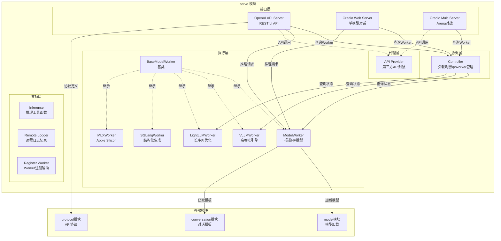
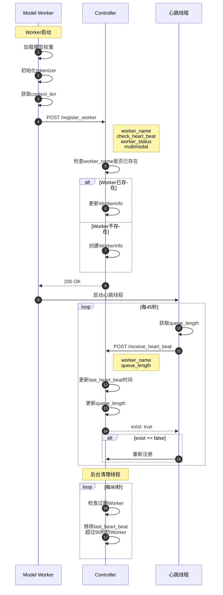
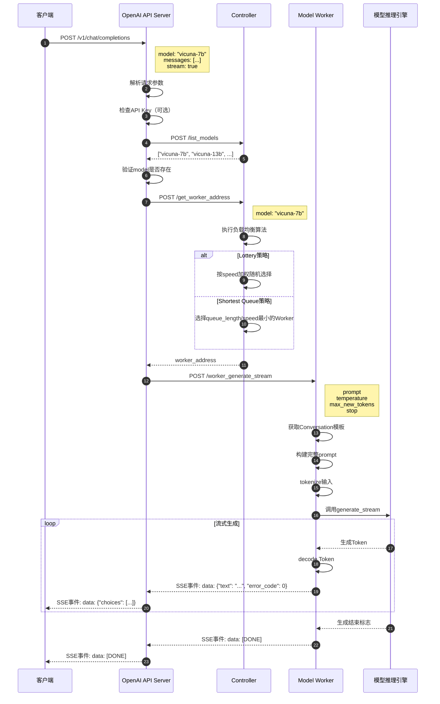
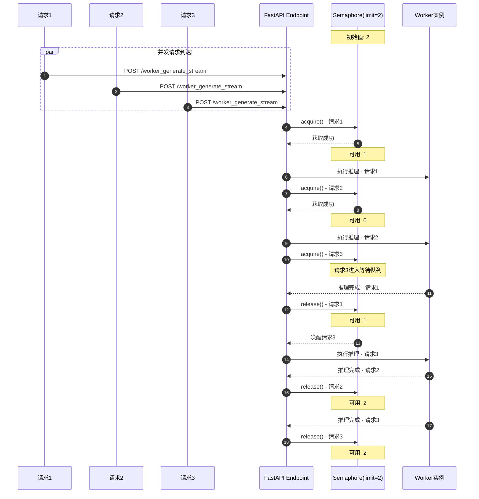

# FastChat-01-serve模块-概览

## 1. 模块职责

serve 模块是 FastChat 的服务层核心，负责分布式模型服务的完整生命周期管理，包括：

**核心职责**：
- **模型服务协调**：Controller 管理多个 Model Worker 的注册、心跳、负载均衡
- **模型推理执行**：Model Worker 加载模型并处理推理请求（流式/非流式）
- **API 接口暴露**：OpenAI API Server 提供兼容 OpenAI 的 RESTful API
- **Web UI 交互**：Gradio Web Server 提供用户友好的 Web 界面
- **第三方 API 集成**：API Provider 统一封装 OpenAI/Anthropic/Gemini 等第三方 API

**输入**：
- Controller：Worker 注册请求、心跳请求、模型查询请求
- Worker：推理请求（prompt、生成参数）、状态查询请求
- OpenAI API Server：HTTP RESTful 请求（chat/completions、embeddings 等）
- Gradio Web Server：用户交互事件（输入框、按钮点击等）

**输出**：
- Controller：可用 Worker 地址、模型列表
- Worker：流式生成的 Token、完整响应、嵌入向量
- OpenAI API Server：JSON 响应或 SSE 流式响应
- Gradio Web Server：HTML 页面渲染与实时更新

**上下游依赖**：
- **上游**：用户客户端（Web UI、CLI、API 调用方）
- **下游**：model 模块（模型加载与适配）、conversation 模块（对话模板）、HuggingFace Transformers（模型推理）
- **横向**：protocol 模块（API 协议定义）、constants 模块（常量配置）

**生命周期**：
- **启动阶段**：Controller 启动 → Worker 加载模型并注册 → API Server/Web Server 启动
- **运行阶段**：持续接收请求、处理推理、维护心跳
- **停止阶段**：Worker 停止心跳 → Controller 自动移除 → 优雅关闭

---

## 2. 模块级架构图



### 图解与要点

**边界**：
- **模块入口**：Controller、Worker、OpenAI API Server、Gradio Web Server 均可独立启动
- **模块出口**：Worker 返回推理结果，API Server 返回 HTTP 响应，Gradio 渲染 HTML
- **外部依赖**：model 模块（必须）、conversation 模块（必须）、第三方 API（可选）

**扩展点**：
1. **Worker 类型扩展**：继承 `BaseModelWorker` 实现新的推理引擎（如 TensorRT、MNN）
2. **API 接口扩展**：在 OpenAI API Server 中添加新的 endpoint（如 `/v1/fine_tuning`）
3. **UI 组件扩展**：在 Gradio 中添加新的交互组件（如语音输入、图像编辑）
4. **第三方 API 扩展**：在 API Provider 中添加新的 API 类型（如 Cohere、AI21）

**状态持有位置**：
- **Controller**：内存中维护 `worker_info` 字典（WorkerInfo 对象）
- **Worker**：内存中持有模型实例、tokenizer、Conversation 对象
- **Gradio**：前端浏览器维护对话历史（LocalStorage 或 Session State）
- **OpenAI API Server**：无状态（对话历史由客户端传入）

**资源占用要点**：
- **Controller**：极低（几十 MB 内存，CPU 使用率 < 1%）
- **Worker**：高（模型显存 14GB-80GB，推理时 CPU/GPU 使用率 > 80%）
- **API Server**：低（几百 MB 内存，CPU 使用率取决于请求量）
- **Gradio Server**：中等（几百 MB 内存，CPU 使用率取决于并发用户数）

---

## 3. 关键交互流程

### 3.1 Worker 注册与心跳流程



**要点**：
- Worker 启动时主动注册，Controller 被动接收
- 心跳线程独立运行，与主线程解耦
- Controller 定期清理过期 Worker，无需 Worker 主动注销
- 重启后 Worker 自动重新注册，Controller 无需重启

### 3.2 推理请求路由与执行流程



**要点**：
- API Server 直接向 Worker 发起请求，Controller 仅负责路由
- 流式生成逐 Token 返回，降低首 Token 延迟
- Worker 内部维护 Conversation 对象，自动拼接对话历史
- 错误通过 `error_code` 字段返回，客户端可判断错误类型

### 3.3 并发控制与队列管理流程



**要点**：
- 使用 `asyncio.Semaphore` 实现异步并发控制
- `limit_worker_concurrency` 参数控制并发上限（默认 5）
- 超出限制的请求进入等待队列，按 FIFO 顺序处理
- 队列长度通过 `get_queue_length()` 实时计算并上报给 Controller

---

## 4. 核心数据结构

### 4.1 WorkerInfo（Controller）

```python
@dataclasses.dataclass
class WorkerInfo:
    model_names: List[str]      # Worker支持的模型名称列表
    speed: int                   # Worker相对速度权重（用于负载均衡）
    queue_length: int            # 当前队列长度（等待处理的请求数）
    check_heart_beat: bool       # 是否启用心跳检测
    last_heart_beat: float       # 最后一次心跳时间戳（time.time()）
    multimodal: bool             # 是否支持多模态（图像输入）
```

**字段说明**：
- `model_names`：单个 Worker 可服务多个模型（通过 `--model-names` 参数指定）
- `speed`：默认为 1，用户可手动设置（如 GPU 性能差异）
- `queue_length`：实时计算，公式为 `limit - semaphore._value + len(waiters)`
- `check_heart_beat`：CLI 模式可设为 False，跳过心跳检测
- `last_heart_beat`：用于过期判定（90 秒无心跳则移除）
- `multimodal`：影响 `/list_multimodal_models` 接口返回结果

### 4.2 DispatchMethod（Controller）

```python
class DispatchMethod(Enum):
    LOTTERY = auto()           # 抽奖模式：按speed加权随机选择
    SHORTEST_QUEUE = auto()    # 最短队列模式：选择queue_length/speed最小的Worker
```

**算法详解**：

**Lottery（抽奖）**：
```python
# 1. 收集所有支持目标模型的Worker及其speed
worker_speeds = [w_info.speed for w_name, w_info in self.worker_info.items() 
                 if model_name in w_info.model_names]

# 2. 归一化speed为概率分布
worker_speeds = np.array(worker_speeds, dtype=np.float32)
norm = np.sum(worker_speeds)
worker_speeds = worker_speeds / norm

# 3. 按概率随机选择
pt = np.random.choice(np.arange(len(worker_names)), p=worker_speeds)
worker_name = worker_names[pt]
```

**Shortest Queue（最短队列）**：
```python
# 1. 计算每个Worker的归一化队列长度
worker_qlen = [w_info.queue_length / w_info.speed for w_name, w_info in self.worker_info.items()
               if model_name in w_info.model_names]

# 2. 选择归一化队列长度最小的Worker
min_index = np.argmin(worker_qlen)
w_name = worker_names[min_index]

# 3. 乐观锁：预先增加该Worker的queue_length
self.worker_info[w_name].queue_length += 1
```

**权衡**：
- **Lottery**：适合异构环境，考虑 Worker 性能差异，但可能负载不均
- **Shortest Queue**：追求负载均衡，但需准确的队列长度信息，心跳延迟会影响精度

### 4.3 Conversation（Worker）

Conversation 对象封装对话历史与提示词模板，详见 `FastChat-08-conversation模块.md`。

Worker 中的使用方式：
```python
# 获取Conversation模板
conv = self.conv.copy()  # 深拷贝避免状态污染

# 追加用户消息
conv.append_message(conv.roles[0], user_message)
# 追加助手占位符
conv.append_message(conv.roles[1], None)

# 生成完整prompt
prompt = conv.get_prompt()

# tokenize并推理
input_ids = self.tokenizer(prompt).input_ids
...
```

---

## 5. API 接口清单

### 5.1 Controller API

| 接口 | 方法 | 功能 | 请求体 | 响应体 |
|---|---|---|---|---|
| `/register_worker` | POST | 注册Worker | `{worker_name, check_heart_beat, worker_status, multimodal}` | `200 OK` |
| `/refresh_all_workers` | POST | 刷新所有Worker状态 | 无 | `200 OK` |
| `/list_models` | POST | 列出所有可用模型 | 无 | `{models: [...]}` |
| `/list_language_models` | POST | 列出文本模型 | 无 | `{models: [...]}` |
| `/list_multimodal_models` | POST | 列出多模态模型 | 无 | `{models: [...]}` |
| `/get_worker_address` | POST | 获取Worker地址 | `{model: "..."}` | `{address: "..."}` |
| `/receive_heart_beat` | POST | 接收Worker心跳 | `{worker_name, queue_length}` | `{exist: true/false}` |
| `/test_connection` | GET | 健康检查 | 无 | `200 OK` |
| `/worker_api_generate_stream` | POST | 代理推理请求（分层架构） | 推理参数 | 流式响应 |

### 5.2 Worker API

| 接口 | 方法 | 功能 | 请求体 | 响应体 |
|---|---|---|---|---|
| `/worker_generate_stream` | POST | 流式推理 | `{prompt, temperature, max_new_tokens, ...}` | SSE流式响应 |
| `/worker_generate` | POST | 非流式推理 | 同上 | `{text: "...", error_code: 0}` |
| `/worker_get_embeddings` | POST | 获取嵌入向量 | `{input: ["..."]}` | `{embedding: [[...]]}` |
| `/worker_get_status` | POST | 获取Worker状态 | 无 | `{model_names, speed, queue_length}` |
| `/count_token` | POST | 计算Token数 | `{prompt: "..."}` | `{count: 123}` |
| `/worker_get_conv_template` | POST | 获取对话模板 | 无 | `{conv: {...}}` |
| `/model_details` | POST | 获取模型详情 | 无 | `{context_length: 4096}` |

### 5.3 OpenAI API Server

| 接口 | 方法 | 功能 | OpenAI兼容度 |
|---|---|---|---|
| `/v1/chat/completions` | POST | 聊天补全 | ✅ 完全兼容 |
| `/v1/completions` | POST | 文本补全 | ✅ 完全兼容 |
| `/v1/embeddings` | POST | 获取嵌入 | ✅ 完全兼容 |
| `/v1/models` | GET | 列出模型 | ✅ 完全兼容 |

---

## 6. 配置参数清单

### 6.1 Controller 参数

| 参数 | 默认值 | 说明 |
|---|---|---|
| `--host` | 0.0.0.0 | 监听地址 |
| `--port` | 21001 | 监听端口 |
| `--dispatch-method` | lottery | 调度策略（lottery/shortest_queue） |
| `--ssl` | False | 启用HTTPS |

### 6.2 Worker 参数

| 参数 | 默认值 | 说明 |
|---|---|---|
| `--host` | localhost | Worker监听地址 |
| `--port` | 31000 | Worker监听端口 |
| `--worker-address` | http://localhost:31000 | Worker对外地址（用于注册） |
| `--controller-address` | http://localhost:21001 | Controller地址 |
| `--model-path` | 必填 | 模型路径或HF模型ID |
| `--model-names` | 自动推断 | 模型名称列表（逗号分隔） |
| `--limit-worker-concurrency` | 5 | 最大并发请求数 |
| `--device` | cuda | 设备类型（cuda/cpu/mps/xpu/npu） |
| `--num-gpus` | 1 | GPU数量（模型并行） |
| `--max-gpu-memory` | None | 每张GPU最大显存（如"20GiB"） |
| `--load-8bit` | False | 启用8bit量化 |
| `--cpu-offloading` | False | CPU卸载（需8bit） |
| `--gptq` | None | GPTQ配置 |
| `--awq` | None | AWQ配置 |
| `--stream-interval` | 2 | 流式返回间隔Token数 |
| `--no-register` | False | 不注册到Controller（CLI模式） |

### 6.3 OpenAI API Server 参数

| 参数 | 默认值 | 说明 |
|---|---|---|
| `--host` | 0.0.0.0 | 监听地址 |
| `--port` | 8000 | 监听端口 |
| `--controller-address` | http://localhost:21001 | Controller地址 |
| `--api-keys` | None | API Key列表（启用鉴权） |
| `--ssl` | False | 启用HTTPS |

---

## 7. 性能优化要点

### 7.1 吞吐量优化

**使用高性能推理引擎**：
- **vLLM**：通过 PagedAttention 和连续批处理，吞吐量提升 10-24 倍
- **LightLLM**：针对长序列优化，支持 32K+ 上下文
- **SGLang**：结构化生成优化，JSON/代码生成场景性能提升 5 倍

**批处理策略**：
- vLLM 自动批处理：动态调整 batch size，最大化 GPU 利用率
- 连续批处理：新请求可插入正在进行的 batch，降低排队时间

**多 Worker 并行**：
- 单模型多 Worker：水平扩展，线性提升吞吐量
- 模型并行：大模型（如 70B）跨多张 GPU 分布式推理

### 7.2 延迟优化

**首 Token 延迟**：
- 减少 prompt 长度：通过 prompt 压缩技术（如 LLMLingua）
- KV Cache 预填充：预先计算系统提示词的 KV Cache
- Flash Attention：降低注意力计算延迟（需模型支持）

**端到端延迟**：
- 流式生成：逐 Token 返回，用户感知延迟降低
- 减少网络跳转：API Server 直接连接 Worker，避免通过 Controller 代理

### 7.3 显存优化

**量化加速**：
- 8bit 量化：显存减半，精度损失 < 1%（`--load-8bit`）
- 4bit GPTQ：显存降至 1/4，精度损失 2-3%（需预量化模型）
- 4bit AWQ：显存降至 1/4，精度优于 GPTQ（需预量化模型）

**CPU 卸载**：
- `--cpu-offloading`：将部分权重卸载到 CPU 内存，牺牲速度换取显存

**模型并行**：
- `--num-gpus`：大模型跨多张 GPU，单张显存需求降低

---

## 8. 监控与可观测性

### 8.1 关键指标

**Controller 指标**：
- 注册 Worker 数量：`len(self.worker_info)`
- 每个模型的可用 Worker 数
- Worker 心跳延迟分布
- 负载均衡策略执行耗时

**Worker 指标**：
- 当前队列长度：`get_queue_length()`
- 推理耗时（P50/P95/P99）
- Token 吞吐量：tokens/秒
- GPU 显存使用率
- GPU 利用率

**API Server 指标**：
- 请求 QPS
- 端到端延迟（P50/P95/P99）
- 错误率（按 error_code 分类）
- 流式响应 TTFT（Time To First Token）

### 8.2 日志分析

**Controller 日志**（`controller.log`）：
```
Register a new worker: http://localhost:31000
Register done: http://localhost:31000, {'model_names': ['vicuna-7b'], 'speed': 1, 'queue_length': 0}
Receive heart beat. http://localhost:31000
Remove stale worker: http://localhost:31001  # Worker失联
```

**Worker 日志**（`model_worker_{worker_id}.log`）：
```
Loading the model vicuna-7b on worker abc12345 ...
Register to controller
Send heart beat. Models: ['vicuna-7b']. Semaphore: 5. call_ct: 123
```

**异常检测**：
- Controller 日志中频繁出现 "Remove stale worker" → Worker 不稳定或网络问题
- Worker 日志中 "heart beat error" → Controller 不可达
- API Server 日志中 "CONTROLLER_NO_WORKER" → 无可用 Worker

---

## 9. 故障排查指南

### 9.1 Worker 无法注册

**症状**：Worker 启动后 Controller 日志无 "Register done"

**排查步骤**：
1. 检查 Controller 是否启动：`curl http://localhost:21001/test_connection`
2. 检查 Worker 的 `--controller-address` 参数是否正确
3. 检查网络连通性：`curl -X POST http://localhost:21001/test_connection`
4. 检查 Worker 日志中的错误信息

**常见原因**：
- Controller 未启动或端口被占用
- Worker 的 `--worker-address` 配置错误（无法被 Controller 访问）
- 防火墙阻止连接

### 9.2 推理请求超时

**症状**：API 返回 `CONTROLLER_WORKER_TIMEOUT`

**排查步骤**：
1. 检查 Worker 心跳是否正常：Controller 日志中查找 "Receive heart beat"
2. 检查 Worker 队列长度：是否持续 > `limit_worker_concurrency`
3. 检查 Worker GPU 利用率：是否 100%（过载）
4. 增加 `FASTCHAT_WORKER_API_TIMEOUT` 环境变量（默认 100 秒）

**常见原因**：
- Worker 过载：并发请求过多
- 长序列生成：生成时间超过 100 秒
- Worker 崩溃：进程存在但无响应

### 9.3 模型输出乱码

**症状**：生成的文本包含特殊字符或重复内容

**排查步骤**：
1. 检查 Conversation 模板是否正确：`/worker_get_conv_template`
2. 检查模型是否正确加载：Worker 日志中查找加载信息
3. 尝试不同的温度参数（temperature）
4. 检查是否使用了错误的 tokenizer

**常见原因**：
- Conversation 模板与模型不匹配（如 Llama 模型用了 ChatGLM 模板）
- 模型权重损坏或不完整
- 生成参数不合理（如 temperature=0 导致重复）

---

## 10. 安全加固建议

1. **API Key 鉴权**：OpenAI API Server 启用 `--api-keys` 参数
2. **网络隔离**：Controller 和 Worker 部署在内网，仅 API Server 暴露公网
3. **HTTPS 加密**：生产环境启用 SSL（`--ssl` 参数 + 证书配置）
4. **日志脱敏**：避免记录用户敏感信息（如个人身份、财务数据）
5. **请求频率限制**：通过 Nginx/Cloudflare 限制单 IP 请求频率
6. **模型访问控制**：通过 API Key 区分不同用户，限制访问特定模型

---

## 11. 扩展阅读

- **FastChat-02-serve模块-Controller详细分析.md**：Controller 核心代码剖析
- **FastChat-03-serve模块-ModelWorker详细分析.md**：Worker 推理流程详解
- **FastChat-04-serve模块-OpenAI_API详细分析.md**：OpenAI API 协议适配
- **FastChat-05-serve模块-Gradio界面详细分析.md**：Web UI 交互流程
- **FastChat-06-model模块-概览.md**：模型加载与适配器机制
- **FastChat-08-conversation模块.md**：对话模板详解

