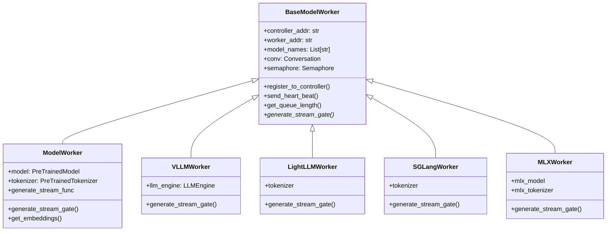
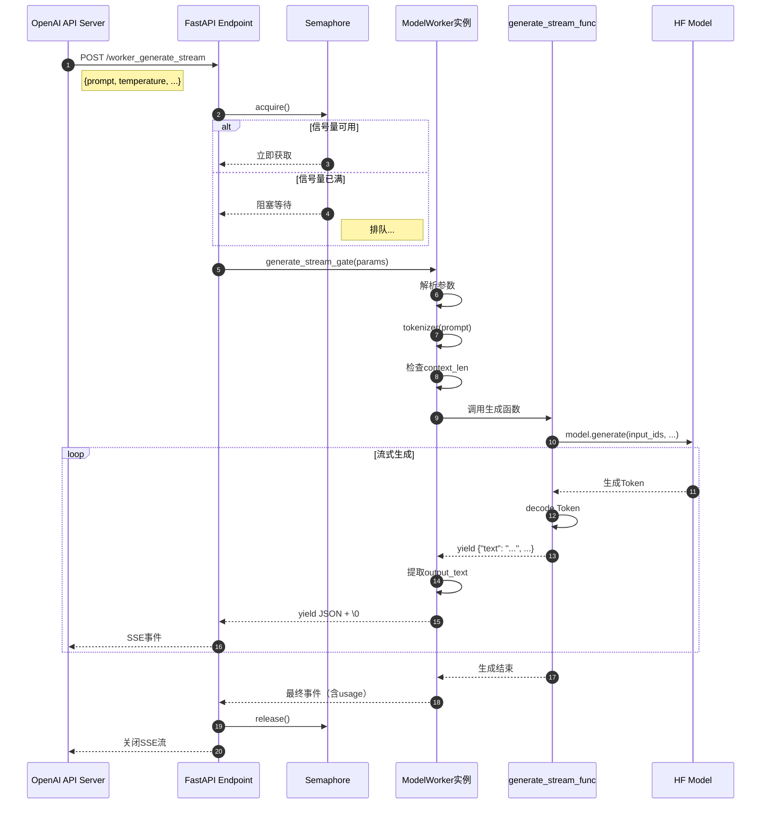

# FastChat-03-serve模块-ModelWorker详细分析

## 1. ModelWorker 职责与功能概述

ModelWorker 是 FastChat 分布式架构中的执行单元，负责：

- **模型加载与管理**：加载 HuggingFace 模型、tokenizer，初始化推理引擎
- **推理请求处理**：接收推理参数，生成流式/非流式响应
- **并发控制**：通过 Semaphore 限制并发请求数，避免 OOM
- **心跳维护**：定期向 Controller 上报状态（队列长度、模型列表）
- **对话模板管理**：根据模型类型选择 Conversation 模板，构建 prompt

---

## 2. 核心数据结构与继承体系

### 2.1 继承关系



### 2.2 BaseModelWorker 核心字段

```python
class BaseModelWorker:
    def __init__(
        self,
        controller_addr: str,          # Controller地址，如"http://localhost:21001"
        worker_addr: str,               # Worker对外地址，如"http://192.168.1.100:31000"
        worker_id: str,                 # Worker唯一ID，用于日志文件名
        model_path: str,                # 模型路径或HF模型ID
        model_names: List[str],         # 模型名称列表，用于多模型服务
        limit_worker_concurrency: int,  # 最大并发请求数，默认5
        conv_template: str = None,      # 对话模板名称（可选）
        multimodal: bool = False,       # 是否支持多模态
    ):
        self.controller_addr = controller_addr
        self.worker_addr = worker_addr
        self.worker_id = worker_id
        self.model_names = model_names or [model_path.split("/")[-1]]
        self.limit_worker_concurrency = limit_worker_concurrency
        self.conv = self.make_conv_template(conv_template, model_path)
        self.multimodal = multimodal
        self.tokenizer = None           # 子类初始化
        self.context_len = None         # 子类初始化
        self.call_ct = 0                # 请求计数器
        self.semaphore = None           # 并发信号量（延迟初始化）
        self.heart_beat_thread = None  # 心跳线程
```

| 字段 | 类型 | 说明 |
|---|---|---|
| controller_addr | str | Controller HTTP 地址，用于注册和心跳 |
| worker_addr | str | Worker 对外地址，必须能被 Controller 和 API Server 访问 |
| worker_id | str | 8 位随机 UUID，用于区分多个 Worker 实例 |
| model_path | str | 本地路径或 HF 模型 ID（如 `lmsys/vicuna-7b-v1.5`） |
| model_names | List[str] | 默认从 model_path 提取，可手动指定多个模型名 |
| limit_worker_concurrency | int | 并发上限，超出后请求排队，默认 5 |
| conv | Conversation | 对话模板对象，用于构建 prompt |
| multimodal | bool | 标记是否支持图像/视频输入 |
| call_ct | int | 累计处理请求数，用于监控 |
| semaphore | Semaphore | 异步信号量，控制并发（首次请求时初始化） |

---

## 3. 核心 API 详解

### 3.1 `/worker_generate_stream` - 流式推理

#### 基本信息
- **方法**：POST
- **路径**：`/worker_generate_stream`
- **幂等性**：否（每次推理结果可能不同）
- **响应格式**：SSE（Server-Sent Events）流式

#### 请求结构体

```python
{
    "model": str,               # 模型名称（Worker会验证是否支持）
    "prompt": str,              # 完整prompt（API Server已构建好）
    "temperature": float,       # 温度参数，0-2，默认0.7
    "top_p": float,             # 核采样参数，0-1，默认1.0
    "max_new_tokens": int,      # 最大生成token数，默认256
    "stop": List[str],          # 停止词列表（可选）
    "echo": bool,               # 是否返回输入prompt，默认False
}
```

**字段表**：

| 字段 | 类型 | 必填 | 默认 | 约束 | 说明 |
|---|---|---:|---|---|---|
| model | string | 否 | - | - | 模型名称，Worker 不强制校验 |
| prompt | string | 是 | - | 长度 <= context_len | 完整 prompt 字符串 |
| temperature | float | 否 | 0.7 | 0-2 | 控制随机性，0 表示贪心 |
| top_p | float | 否 | 1.0 | 0-1 | 核采样阈值 |
| max_new_tokens | int | 否 | 256 | > 0 | 最大生成长度 |
| stop | List[string] | 否 | [] | - | 遇到停止词则终止生成 |
| echo | boolean | 否 | False | - | True 时返回包含输入的完整文本 |

#### 响应结构体（SSE 流式）

```python
# 每个SSE事件（以\0分隔）
{
    "text": str,           # 生成的文本（累积或增量）
    "error_code": int,     # 错误码，0表示正常
    "usage": {             # 使用统计（可选）
        "prompt_tokens": int,
        "completion_tokens": int,
        "total_tokens": int
    }
}
```

**字段表**：

| 字段 | 类型 | 说明 |
|---|---|---|
| text | string | 生成的文本，每次返回新增部分（不包含历史） |
| error_code | int | 0=正常，40303=上下文溢出，50002=显存不足 |
| usage | object | Token 使用统计，流式时仅最后一个事件包含 |

#### 入口函数与核心代码

**FastAPI 路由**：

```python
@app.post("/worker_generate_stream")
async def api_generate_stream(request: Request):
    params = await request.json()
    
    # 1. 获取并发信号量（阻塞直到获取成功）
    await acquire_worker_semaphore()
    
    # 2. 调用Worker的生成方法（生成器函数）
    generator = worker.generate_stream_gate(params)
    
    # 3. 创建后台任务，在响应完成后释放信号量
    background_tasks = create_background_tasks()
    
    # 4. 返回流式响应
    return StreamingResponse(generator, background=background_tasks)
```

**ModelWorker.generate_stream_gate() 实现**：

```python
def generate_stream_gate(self, params):
    try:
        # 1. 解析参数
        prompt = params["prompt"]
        temperature = float(params.get("temperature", 1.0))
        top_p = float(params.get("top_p", 1.0))
        max_new_tokens = int(params.get("max_new_tokens", 256))
        echo = params.get("echo", False)
        
        # 2. Tokenize输入
        input_ids = self.tokenizer(prompt).input_ids
        input_echo_len = len(input_ids)
        
        # 3. 检查上下文长度
        if input_echo_len + max_new_tokens > self.context_len:
            yield json.dumps({
                "text": f"Exceeds context length: {input_echo_len}+{max_new_tokens}>{self.context_len}",
                "error_code": ErrorCode.CONTEXT_OVERFLOW,
            }).encode() + b"\0"
            return
        
        # 4. 调用模型生成（流式）
        for output in self.generate_stream_func(
            self.model,
            self.tokenizer,
            params,
            self.device,
            self.context_len,
            self.stream_interval,
        ):
            # 解析输出
            rfind_start = len(prompt) if echo else 0
            output_text = output["text"][rfind_start:]
            
            # 5. 构建响应
            ret = {
                "text": output_text,
                "error_code": 0,
            }
            
            # 最后一个事件包含usage信息
            if "usage" in output:
                ret["usage"] = output["usage"]
            
            # 6. 返回SSE事件（JSON + \0分隔符）
            yield json.dumps(ret).encode() + b"\0"
    
    except torch.cuda.OutOfMemoryError as e:
        # 显存不足错误
        ret = {
            "text": f"Out of memory: {e}",
            "error_code": ErrorCode.CUDA_OUT_OF_MEMORY,
        }
        yield json.dumps(ret).encode() + b"\0"
    
    except Exception as e:
        # 其他错误
        ret = {
            "text": f"Internal error: {e}",
            "error_code": ErrorCode.INTERNAL_ERROR,
        }
        yield json.dumps(ret).encode() + b"\0"
```

**逐步解释**：

1. **参数解析与校验**：提取生成参数，设置默认值
2. **Tokenization**：将 prompt 转换为 token ID 序列
3. **上下文长度检查**：防止输入+输出超过模型最大长度（如 Vicuna-7B 为 4096）
4. **流式生成**：调用 `generate_stream_func`（根据模型类型动态选择生成函数）
5. **文本提取**：
   - `echo=False`：仅返回生成部分（默认）
   - `echo=True`：返回输入+生成的完整文本
6. **SSE 格式封装**：JSON 序列化 + `\0` 分隔符
7. **异常处理**：捕获 OOM、其他异常，返回错误码

#### 调用链与时序图



#### 边界与异常

**正常流程**：
- 输入长度合法 → 流式生成 → 逐 Token 返回 → 生成结束

**异常情况**：

| 异常 | 触发条件 | 错误码 | Worker行为 |
|---|---|---|---|
| 上下文溢出 | input_len + max_new_tokens > context_len | 40303 | 返回错误消息，不调用模型 |
| 显存不足 | GPU OOM | 50002 | 返回错误消息，释放信号量 |
| 模型生成异常 | 模型内部错误 | 50001 | 返回错误消息，释放信号量 |
| 停止词截断 | 生成文本包含停止词 | 0 | 正常截断并返回 |

**错误恢复**：
- 所有异常都会释放信号量（通过 `background_tasks`）
- Worker 不会因单次错误而崩溃
- API Server 可根据 error_code 决定是否重试

#### 实践与最佳实践

**性能优化**：

1. **调整 stream_interval**：
   ```python
   # 默认每2个token返回一次，可调整为更大值降低网络开销
   --stream-interval 5  # 每5个token返回一次
   ```

2. **启用 Flash Attention**（降低显存占用和延迟）：
   ```bash
   pip install flash-attn
   # 模型自动检测并使用Flash Attention
   ```

3. **使用 vLLM 加速**：
   ```bash
   python3 -m fastchat.serve.vllm_worker \
       --model-path lmsys/vicuna-7b-v1.5 \
       --controller http://localhost:21001
   # 吞吐量提升10-24倍
   ```

**并发控制**：

```bash
# 根据显存大小调整并发数
# 7B模型（FP16）：14GB显存/请求，A100-40GB可设为2-3
# 13B模型（FP16）：28GB显存/请求，A100-80GB可设为2
--limit-worker-concurrency 3
```

**监控指标**：
- 队列长度：`/worker_get_status` 返回的 `queue_length`
- 推理延迟：从请求到首 Token 的时间（TTFT）
- 吞吐量：tokens/秒
- 错误率：按 error_code 分类

---

### 3.2 `/worker_get_embeddings` - 获取嵌入向量

#### 基本信息
- **方法**：POST
- **路径**：`/worker_get_embeddings`
- **幂等性**：是（相同输入返回相同嵌入）

#### 请求结构体

```python
{
    "input": List[str],  # 输入文本列表，如["Hello", "World"]
}
```

| 字段 | 类型 | 必填 | 约束 | 说明 |
|---|---|---:|---|---|
| input | List[string] | 是 | 长度 <= 批处理上限 | 支持批量输入 |

#### 响应结构体

```python
{
    "embedding": List[List[float]],  # 嵌入向量矩阵，形状[N, D]
    "token_num": int                 # 总Token数
}
```

| 字段 | 类型 | 说明 |
|---|---|---|
| embedding | List[List[float]] | 嵌入向量列表，每个向量维度为模型hidden_size |
| token_num | int | 所有输入的Token数总和 |

#### 核心代码

```python
def get_embeddings(self, params):
    # 1. 提取输入
    inputs = params["input"]
    if isinstance(inputs, str):
        inputs = [inputs]  # 单个输入转为列表
    
    # 2. Tokenize输入（批量）
    encoding = self.tokenizer.batch_encode_plus(
        inputs,
        padding=True,
        return_tensors="pt",
    )
    input_ids = encoding["input_ids"].to(self.device)
    attention_mask = encoding["attention_mask"].to(self.device)
    
    # 3. 模型前向传播（不计算梯度）
    with torch.no_grad():
        model_output = self.model(
            input_ids=input_ids,
            attention_mask=attention_mask,
            output_hidden_states=True,
        )
    
    # 4. 提取嵌入向量（最后一层hidden state的平均池化）
    hidden_states = model_output.hidden_states[-1]  # [batch, seq_len, hidden_size]
    
    if self.embed_in_truncate:
        # 截断模式：仅取前N个token
        hidden_states = hidden_states[:, : self.context_len]
    
    # 平均池化（考虑attention_mask）
    embeddings = torch.sum(
        hidden_states * attention_mask.unsqueeze(-1), dim=1
    ) / torch.sum(attention_mask, dim=1, keepdim=True)
    
    # 5. 转换为列表并返回
    embeddings = embeddings.cpu().tolist()
    token_num = torch.sum(attention_mask).item()
    
    return {"embedding": embeddings, "token_num": token_num}
```

**要点**：
- 支持批量处理（提高吞吐量）
- 使用平均池化聚合序列表示
- 考虑 padding mask，避免 padding token 影响结果

---

### 3.3 `/worker_get_status` - 获取Worker状态

#### 响应结构体

```python
{
    "model_names": List[str],  # 支持的模型列表
    "speed": int,               # 速度权重
    "queue_length": int         # 当前队列长度
}
```

#### 核心代码

```python
def get_status(self):
    return {
        "model_names": self.model_names,
        "speed": 1,  # 固定为1，可扩展为动态计算
        "queue_length": self.get_queue_length(),
    }

def get_queue_length(self):
    if self.semaphore is None:
        return 0  # 尚未初始化
    
    # 计算队列长度 = 并发上限 - 可用信号量 + 等待者数量
    semaphore_value = (
        self.semaphore._value
        if self.semaphore._value is not None
        else self.limit_worker_concurrency
    )
    waiter_count = (
        0 if self.semaphore._waiters is None else len(self.semaphore._waiters)
    )
    return self.limit_worker_concurrency - semaphore_value + waiter_count
```

**队列长度计算公式**：
```
queue_length = limit - available + waiters

- limit: 并发上限（如5）
- available: 当前可用信号量（如2）
- waiters: 等待队列中的请求数（如1）
- 结果: 5 - 2 + 1 = 4（当前正在处理3个，等待1个）
```

---

## 4. 模型加载流程

### 4.1 ModelWorker 初始化

```python
class ModelWorker(BaseModelWorker):
    def __init__(
        self,
        controller_addr: str,
        worker_addr: str,
        worker_id: str,
        model_path: str,
        model_names: List[str],
        limit_worker_concurrency: int,
        no_register: bool,
        device: str,                      # cuda/cpu/mps/xpu/npu
        num_gpus: int,                    # GPU数量（模型并行）
        max_gpu_memory: str,              # 每张GPU最大显存（如"20GiB"）
        revision: str = None,             # HF模型版本（分支/标签）
        dtype: Optional[torch.dtype] = None,  # 数据类型（如torch.float16）
        load_8bit: bool = False,          # 8bit量化
        cpu_offloading: bool = False,     # CPU卸载
        gptq_config: Optional[GptqConfig] = None,  # GPTQ配置
        awq_config: Optional[AWQConfig] = None,    # AWQ配置
        stream_interval: int = 2,         # 流式返回间隔token数
        conv_template: Optional[str] = None,  # 对话模板
        embed_in_truncate: bool = False,  # 嵌入时是否截断
        seed: Optional[int] = None,       # 随机种子
    ):
        # 1. 调用基类初始化
        super().__init__(
            controller_addr,
            worker_addr,
            worker_id,
            model_path,
            model_names,
            limit_worker_concurrency,
            conv_template=conv_template,
        )

        # 2. 加载模型和tokenizer
        logger.info(f"Loading the model {self.model_names} on worker {worker_id} ...")
        self.model, self.tokenizer = load_model(
            model_path,
            revision=revision,
            device=device,
            num_gpus=num_gpus,
            max_gpu_memory=max_gpu_memory,
            dtype=dtype,
            load_8bit=load_8bit,
            cpu_offloading=cpu_offloading,
            gptq_config=gptq_config,
            awq_config=awq_config,
        )
        
        # 3. 设置pad_token（防止警告）
        if self.tokenizer.pad_token == None:
            self.tokenizer.pad_token = self.tokenizer.eos_token
        
        # 4. 获取上下文长度
        self.context_len = get_context_length(self.model.config)
        
        # 5. 获取生成函数（根据模型类型自动选择）
        self.generate_stream_func = get_generate_stream_function(self.model, model_path)
        
        # 6. 保存其他参数
        self.device = device
        self.stream_interval = stream_interval
        self.embed_in_truncate = embed_in_truncate
        self.seed = seed

        # 7. 注册到Controller（除非no_register=True）
        if not no_register:
            self.init_heart_beat()
```

### 4.2 load_model() 函数详解

`load_model()` 位于 `fastchat/model/model_adapter.py`，根据模型类型选择不同的加载策略：

```python
def load_model(
    model_path,
    device="cuda",
    num_gpus=1,
    max_gpu_memory=None,
    dtype=None,
    load_8bit=False,
    cpu_offloading=False,
    gptq_config=None,
    awq_config=None,
    revision="main",
):
    # 1. 匹配模型适配器（根据model_path选择）
    adapter = get_model_adapter(model_path)
    
    # 2. 准备from_pretrained参数
    kwargs = {
        "revision": revision,
        "device_map": "auto" if num_gpus > 1 else None,
        "max_memory": parse_max_gpu_memory(max_gpu_memory, num_gpus),
        "torch_dtype": dtype,
    }
    
    # 3. 特殊加载逻辑
    if load_8bit:
        kwargs["load_in_8bit"] = True
    elif gptq_config:
        return load_gptq_quantized(model_path, gptq_config)
    elif awq_config:
        return load_awq_quantized(model_path, awq_config)
    
    # 4. 调用适配器的加载方法
    model, tokenizer = adapter.load_model(model_path, kwargs)
    
    # 5. 后处理
    if device == "cpu":
        model = model.to("cpu")
    elif device == "cuda" and num_gpus == 1:
        model = model.to("cuda")
    
    return model, tokenizer
```

---

## 5. 并发控制机制

### 5.1 Semaphore 信号量

```python
def acquire_worker_semaphore():
    # 延迟初始化：首次请求时创建Semaphore
    if worker.semaphore is None:
        worker.semaphore = asyncio.Semaphore(worker.limit_worker_concurrency)
    return worker.semaphore.acquire()

def release_worker_semaphore():
    worker.semaphore.release()
```

### 5.2 后台任务自动释放

```python
def create_background_tasks():
    background_tasks = BackgroundTasks()
    background_tasks.add_task(release_worker_semaphore)
    return background_tasks

# 在StreamingResponse中自动释放
return StreamingResponse(generator, background=background_tasks)
```

**保证**：
- 即使流式生成过程中客户端断开连接，信号量也会被释放
- 异常情况下（如 OOM）也会释放信号量

---

## 6. 性能优化实践

### 6.1 显存优化

**量化加速**：
```bash
# 8bit量化（显存减半）
--load-8bit

# 4bit GPTQ（显存降至1/4）
--gptq wbits=4 groupsize=128 --gptq-model /path/to/gptq-model

# 4bit AWQ（精度优于GPTQ）
--awq wbits=4 --awq-model /path/to/awq-model
```

**CPU卸载**：
```bash
# 将部分权重卸载到CPU（需8bit量化）
--load-8bit --cpu-offloading
```

**模型并行**：
```bash
# 13B模型跨2张GPU
--num-gpus 2

# 指定每张GPU最大显存
--num-gpus 2 --max-gpu-memory 20GiB
```

### 6.2 吞吐量优化

**vLLM 高吞吐引擎**：
```bash
python3 -m fastchat.serve.vllm_worker \
    --model-path lmsys/vicuna-7b-v1.5 \
    --controller http://localhost:21001 \
    --trust-remote-code
# PagedAttention + 连续批处理，吞吐量提升10-24倍
```

**增加并发数**（需更多显存）：
```bash
--limit-worker-concurrency 10
```

### 6.3 延迟优化

**流式间隔**：
```bash
# 减少stream_interval降低首Token延迟
--stream-interval 1  # 每个token立即返回
```

**Flash Attention**：
```bash
pip install flash-attn
# 模型自动启用Flash Attention（需Ampere+架构GPU）
```

---

## 7. 故障排查

### 7.1 模型加载失败

**症状**：Worker 启动时卡住或报错

**排查**：
1. 检查模型路径是否正确（本地路径或 HF ID）
2. 检查显存是否足够：`nvidia-smi`
3. 检查依赖是否安装：`pip list | grep transformers`
4. 查看 Worker 日志：`model_worker_{worker_id}.log`

**常见错误**：
- `OutOfMemoryError`：显存不足，启用量化或减少 batch size
- `OSError: [Errno 28] No space left on device`：磁盘空间不足（HF 缓存占用）
- `RuntimeError: CUDA out of memory`：同上

### 7.2 推理请求超时

**症状**：API 返回 `CONTROLLER_WORKER_TIMEOUT`

**排查**：
1. 检查队列长度：`/worker_get_status`
2. 检查 GPU 利用率：`nvidia-smi`
3. 检查生成参数：`max_new_tokens` 是否过大

**解决方案**：
- 增加并发数：`--limit-worker-concurrency`
- 增加超时时间：`export FASTCHAT_WORKER_API_TIMEOUT=300`
- 使用 vLLM 加速

### 7.3 输出质量问题

**症状**：生成内容重复、乱码、不相关

**排查**：
1. 检查 Conversation 模板是否正确
2. 检查生成参数：temperature、top_p
3. 尝试不同的模型

**常见原因**：
- Conversation 模板与模型不匹配
- temperature=0 导致重复
- prompt 格式错误（如缺少系统提示词）

---

## 8. 扩展阅读

- **FastChat-06-model模块-概览.md**：模型加载与适配器详解
- **FastChat-08-conversation模块.md**：对话模板机制
- **FastChat-02-serve模块-Controller详细分析.md**：Worker 注册与心跳

