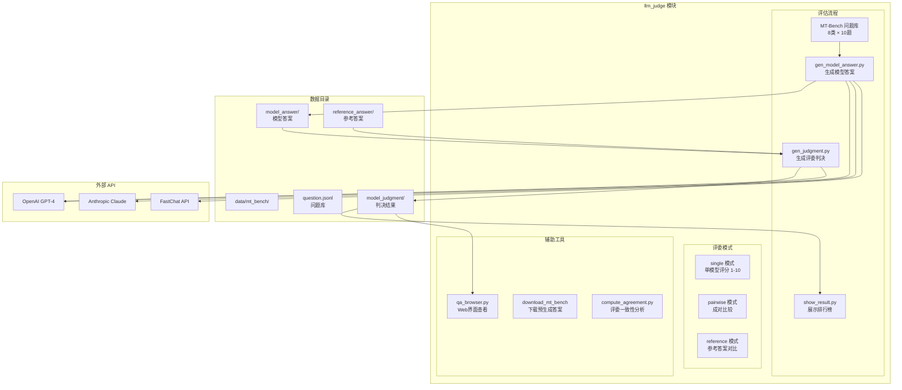
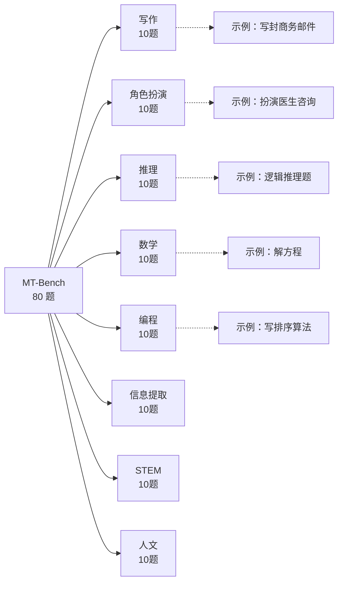
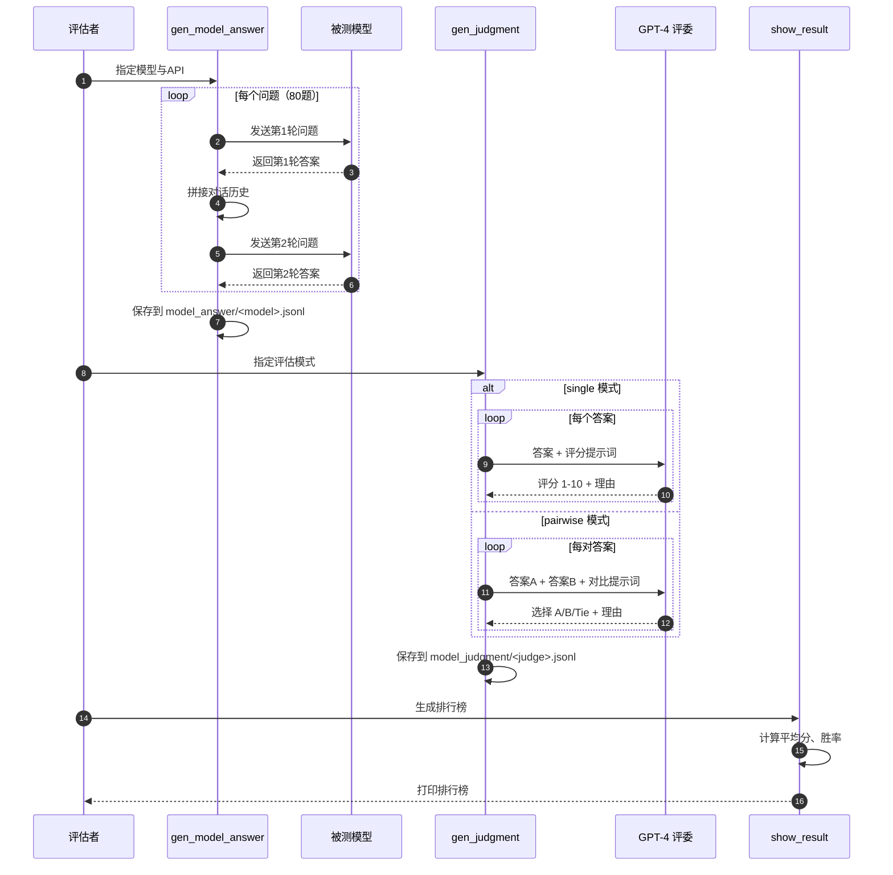
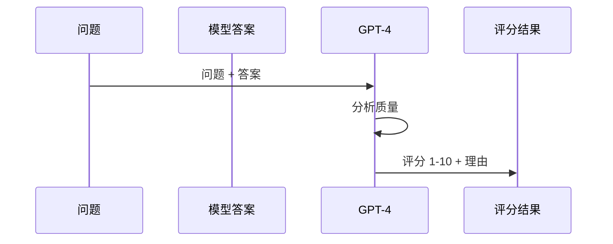
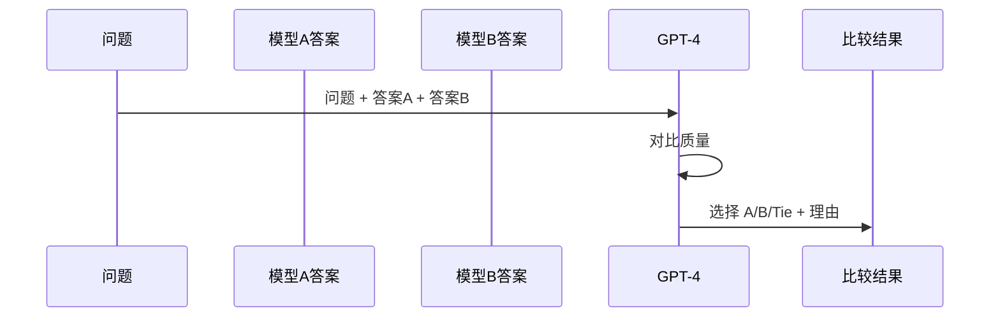
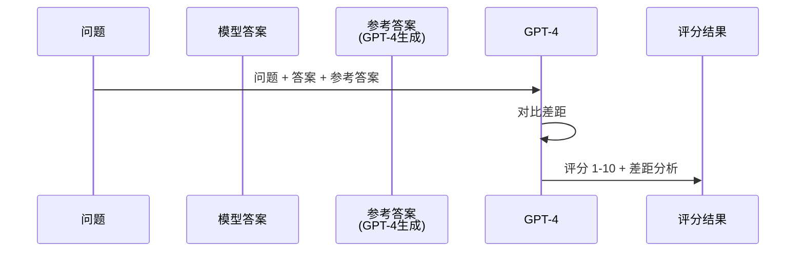

# FastChat-08-llm_judge模块-概览

## 1. llm_judge 模块职责

llm_judge 模块是 FastChat 的模型评估框架，核心功能包括：

- **MT-Bench 评估**：80 个多轮对话问题，覆盖 8 个领域
- **以 LLM 为评委**：使用 GPT-4/Claude/PaLM 2 作为评委
- **多种评估模式**：单模型评分、成对比较、参考答案对比
- **自动化生成答案**：批量调用模型 API 生成答案
- **结果可视化**：生成排行榜、雷达图、对比报告

---

## 2. 模块架构图



---

## 3. 核心评估流程

### 3.1 MT-Bench 问题结构

**8 个评估类别**：



**问题格式**：
```json
{
  "question_id": 81,
  "category": "writing",
  "turns": [
    "Compose an engaging travel blog post...",
    "Rewrite your previous response. Start every sentence with the letter A."
  ]
}
```

### 3.2 完整评估流程



---

## 4. 核心评估代码

### 4.1 生成模型答案

```python
def gen_model_answer(
    model_id,     # 模型标识（如 "vicuna-7b-v1.5"）
    question_file,  # 问题文件
    answer_file,    # 答案输出文件
    api_dict,       # API 配置
):
    """
    调用模型 API 生成 MT-Bench 答案
    
    关键步骤：
    1. 加载问题库
    2. 逐题调用模型 API（支持多轮对话）
    3. 保存答案（含时间戳、token数）
    """
    # 1. 加载问题
    questions = load_questions(question_file)
    
    for question in questions:
        # 2. 构建对话上下文
        conv = get_conversation_template(model_id)
        
        # 第一轮对话
        conv.append_message(conv.roles[0], question["turns"][0])
        conv.append_message(conv.roles[1], None)
        prompt = conv.get_prompt()
        
        # 调用 API
        answer_1 = call_api(
            model=model_id,
            prompt=prompt,
            api_dict=api_dict,
        )
        conv.update_last_message(answer_1)
        
        # 第二轮对话
        conv.append_message(conv.roles[0], question["turns"][1])
        conv.append_message(conv.roles[1], None)
        prompt = conv.get_prompt()
        
        answer_2 = call_api(
            model=model_id,
            prompt=prompt,
            api_dict=api_dict,
        )
        
        # 3. 保存答案
        save_answer({
            "question_id": question["question_id"],
            "model_id": model_id,
            "choices": [
                {"turns": [answer_1, answer_2]}
            ],
            "tstamp": time.time(),
        }, answer_file)
```

### 4.2 GPT-4 评委打分

```python
def gen_judgment_single(
    question,    # 问题
    answer,      # 模型答案
    reference,   # 参考答案（可选）
    judge_model, # 评委模型（GPT-4）
):
    """
    使用 GPT-4 对单个答案打分
    
    返回：
    {
        "score": 8,
        "feedback": "The answer is comprehensive and well-structured..."
    }
    """
    # 1. 构建评分提示词
    system_prompt = """
    Please act as an impartial judge and evaluate the quality of the response 
    provided by an AI assistant to the user question displayed below. 
    Your evaluation should consider factors such as helpfulness, relevance, 
    accuracy, depth, creativity, and level of detail.
    
    Begin your evaluation by providing a short explanation. 
    Be as objective as possible. 
    After providing your explanation, you must rate the response on a scale of 1 to 10 
    by strictly following this format: "[[rating]]", for example: "Rating: [[5]]".
    """
    
    user_prompt = f"""
    [Question]
    {question}
    
    [The Start of Assistant's Answer]
    {answer}
    [The End of Assistant's Answer]
    """
    
    # 2. 调用 GPT-4
    response = openai.ChatCompletion.create(
        model=judge_model,
        messages=[
            {"role": "system", "content": system_prompt},
            {"role": "user", "content": user_prompt},
        ],
        temperature=0,  # 降低随机性
    )
    
    # 3. 解析评分
    judgment = response["choices"][0]["message"]["content"]
    score = extract_rating(judgment)  # 从 "[[8]]" 提取 8
    
    return {
        "score": score,
        "feedback": judgment,
    }
```

### 4.3 成对比较模式

```python
def gen_judgment_pairwise(
    question,
    answer_a,
    answer_b,
    judge_model,
):
    """
    使用 GPT-4 进行成对比较
    
    返回：
    {
        "winner": "A",  # "A" / "B" / "tie"
        "reasoning": "Answer A is more detailed..."
    }
    """
    system_prompt = """
    Please act as an impartial judge and evaluate the quality of the responses 
    provided by two AI assistants to the user question displayed below. 
    You should choose the assistant that follows the user's instructions better.
    
    Your evaluation should consider factors such as helpfulness, relevance, 
    accuracy, depth, creativity, and level of detail.
    
    Avoid any position biases and ensure that the order in which the responses 
    were presented does not influence your decision. Do not allow the length 
    of the responses to influence your evaluation. Be as objective as possible.
    
    After providing your explanation, output your final verdict by strictly 
    following this format: "[[A]]" if assistant A is better, "[[B]]" if 
    assistant B is better, and "[[C]]" for a tie.
    """
    
    user_prompt = f"""
    [Question]
    {question}
    
    [The Start of Assistant A's Answer]
    {answer_a}
    [The End of Assistant A's Answer]
    
    [The Start of Assistant B's Answer]
    {answer_b}
    [The End of Assistant B's Answer]
    """
    
    # 调用 GPT-4
    response = openai.ChatCompletion.create(
        model=judge_model,
        messages=[
            {"role": "system", "content": system_prompt},
            {"role": "user", "content": user_prompt},
        ],
        temperature=0,
    )
    
    judgment = response["choices"][0]["message"]["content"]
    winner = extract_winner(judgment)  # 从 "[[A]]" 提取 "A"
    
    return {
        "winner": winner,
        "reasoning": judgment,
    }
```

---

## 5. 评估模式详解

### 5.1 Single 模式（绝对评分）

**用途**：评估单个模型的绝对能力

**流程**：


**评分标准**：
- 1-2：极差（不相关、错误）
- 3-4：较差（部分相关）
- 5-6：一般（基本回答问题）
- 7-8：良好（详细、准确）
- 9-10：优秀（全面、深入、有洞察力）

**命令**：
```bash
python gen_judgment.py \
  --mode single \
  --model-list vicuna-7b-v1.5 \
  --judge-model gpt-4 \
  --parallel 4
```

### 5.2 Pairwise 模式（成对比较）

**用途**：比较两个模型的相对优劣

**流程**：


**优势**：
- 减少评委偏差（相对比较更稳定）
- 适合模型对比（如 Vicuna vs GPT-3.5）
- 可计算胜率（Win Rate）

**命令**：
```bash
python gen_judgment.py \
  --mode pairwise-all \
  --model-list vicuna-7b-v1.5 gpt-3.5-turbo \
  --judge-model gpt-4 \
  --baseline-model gpt-3.5-turbo
```

### 5.3 Reference 模式（参考答案对比）

**用途**：与高质量参考答案对比

**流程**：


**优势**：
- 有明确的标准（参考答案）
- 评分更一致
- 可检测模型偏离度

---

## 6. 排行榜生成

### 6.1 计算平均分

```python
def show_single_result(judgment_file):
    """
    展示 single 模式评估结果
    
    计算每个模型的平均分：
    1. 第一轮平均分
    2. 第二轮平均分
    3. 总体平均分
    """
    judgments = load_judgments(judgment_file)
    
    model_scores = {}
    for judgment in judgments:
        model_id = judgment["model_id"]
        scores = judgment["score"]  # [turn1_score, turn2_score]
        
        if model_id not in model_scores:
            model_scores[model_id] = []
        
        model_scores[model_id].append(scores)
    
    # 计算平均分
    results = []
    for model_id, scores in model_scores.items():
        turn1_avg = np.mean([s[0] for s in scores])
        turn2_avg = np.mean([s[1] for s in scores])
        overall_avg = np.mean([s for scores_list in scores for s in scores_list])
        
        results.append({
            "model": model_id,
            "turn1": turn1_avg,
            "turn2": turn2_avg,
            "overall": overall_avg,
        })
    
    # 按总分排序
    results.sort(key=lambda x: x["overall"], reverse=True)
    
    # 打印排行榜
    print(f"{'Rank':<6} {'Model':<30} {'Turn 1':<8} {'Turn 2':<8} {'Overall':<8}")
    print("-" * 70)
    for rank, result in enumerate(results, 1):
        print(f"{rank:<6} {result['model']:<30} {result['turn1']:<8.2f} "
              f"{result['turn2']:<8.2f} {result['overall']:<8.2f}")
```

### 6.2 典型排行榜

**MT-Bench Leaderboard (GPT-4 评委)**：

| Rank | Model | Turn 1 | Turn 2 | Overall |
|---|---|---|---|---|
| 1 | GPT-4 | 8.96 | 9.03 | 8.99 |
| 2 | Claude-v1 | 8.15 | 8.06 | 8.10 |
| 3 | GPT-3.5-turbo | 8.08 | 7.81 | 7.94 |
| 4 | Vicuna-33B-v1.3 | 7.12 | 6.40 | 6.76 |
| 5 | WizardLM-30B | 7.01 | 6.21 | 6.61 |
| 6 | Vicuna-13B-v1.3 | 6.39 | 5.60 | 5.99 |
| 7 | Vicuna-7B-v1.3 | 5.99 | 5.30 | 5.65 |

**观察**：
- GPT-4 稳居第一（8.99 分）
- Vicuna-33B 接近 GPT-3.5（80% 能力）
- 第二轮对话普遍得分更低（需要更强的上下文理解）

---

## 7. 实战案例

### 7.1 评估自己训练的模型

```bash
#!/bin/bash
# 完整评估流程

# 1. 生成答案（假设已部署 FastChat API）
python gen_model_answer.py \
  --model-path output_vicuna_7b \
  --model-id my-vicuna-7b \
  --bench-name mt_bench \
  --openai-api-base http://localhost:8000/v1 \
  --openai-api-key EMPTY

# 2. 生成评委判决（需 OpenAI API key）
export OPENAI_API_KEY=sk-xxx
python gen_judgment.py \
  --mode single \
  --model-list my-vicuna-7b \
  --judge-model gpt-4 \
  --parallel 2

# 3. 展示结果
python show_result.py \
  --mode single \
  --judge-model gpt-4
```

### 7.2 与 GPT-3.5 对比

```bash
# 1. 生成两个模型的答案
python gen_model_answer.py \
  --model-id my-vicuna-7b \
  --openai-api-base http://localhost:8000/v1

python gen_model_answer.py \
  --model-id gpt-3.5-turbo \
  --openai-api-base https://api.openai.com/v1

# 2. 成对比较
python gen_judgment.py \
  --mode pairwise-baseline \
  --model-list my-vicuna-7b \
  --baseline-model gpt-3.5-turbo \
  --judge-model gpt-4

# 3. 查看胜率
python show_result.py \
  --mode pairwise-baseline \
  --judge-model gpt-4
# 输出：my-vicuna-7b vs gpt-3.5-turbo: Win 12.5% | Tie 25.0% | Lose 62.5%
```

### 7.3 使用预生成答案（快速测试）

```bash
# 下载 GPT-4、Claude、GPT-3.5 的预生成答案
python download_mt_bench_pregenerated.py

# 直接生成判决（无需调用模型 API）
python gen_judgment.py \
  --mode pairwise-all \
  --model-list vicuna-13b-v1.3 gpt-3.5-turbo \
  --judge-model gpt-4

# 查看结果
python show_result.py --mode pairwise-all
```

---

## 8. 高级功能

### 8.1 自定义评估类别

```bash
# 仅评估编程类问题（question_id 101-110）
python gen_model_answer.py \
  --model-id my-code-model \
  --question-begin 101 \
  --question-end 110
```

### 8.2 评委一致性分析

```bash
# 使用多个评委（GPT-4、Claude）
python gen_judgment.py \
  --mode single \
  --judge-model gpt-4 \
  --model-list vicuna-7b-v1.5

python gen_judgment.py \
  --mode single \
  --judge-model claude-v1 \
  --model-list vicuna-7b-v1.5

# 计算一致性（Cohen's Kappa）
python compute_agreement.py \
  --judge-file-1 model_judgment/gpt-4_single.jsonl \
  --judge-file-2 model_judgment/claude-v1_single.jsonl
# 输出：Cohen's Kappa: 0.68 (Substantial Agreement)
```

### 8.3 Web 界面查看

```bash
# 启动交互式浏览器
python qa_browser.py \
  --share  # 生成公开链接

# 浏览器打开 http://localhost:7860
# 功能：
# - 查看所有问题与答案
# - 对比不同模型答案
# - 查看评委判决详情
```

---

## 9. 最佳实践

### 9.1 提升评估可靠性

1. **多次评估取平均**：GPT-4 存在随机性
   ```bash
   for i in {1..3}; do
     python gen_judgment.py --mode single --judge-model gpt-4
   done
   python aggregate_judgments.py  # 取平均分
   ```

2. **使用 temperature=0**：降低评委随机性（已默认）

3. **多评委交叉验证**：GPT-4 + Claude + PaLM 2

### 9.2 降低评估成本

1. **使用预生成答案**：避免重复调用 GPT-4 API
2. **批量并行**：`--parallel 8`（需注意 API rate limit）
3. **仅评估部分类别**：如先评估编程和推理类

### 9.3 解读评估结果

- **Overall 分数**：整体能力（6+ 即可用，7+ 优秀）
- **Turn 2 分数**：上下文理解能力（与 Turn 1 差距 < 0.5 为佳）
- **各类别分数**：定位模型强项与弱项

---

## 10. 与其他模块交互

- **serve 模块**：部署 FastChat API 供评估调用
- **model 模块**：加载模型并生成答案
- **conversation 模块**：构建多轮对话上下文

---

## 11. 扩展阅读

- **官方论文**：[Judging LLM-as-a-Judge with MT-Bench](https://arxiv.org/abs/2306.05685)
- **FastChat-00-总览.md**：MT-Bench 在 FastChat 生态中的定位
- **FastChat-04-使用示例与最佳实践.md**：评估环境准备

---

## 附录：评估脚本清单

| 脚本 | 用途 |
|---|---|
| `gen_model_answer.py` | 调用模型 API 生成 MT-Bench 答案 |
| `gen_api_answer.py` | 专用于 OpenAI/Anthropic API |
| `gen_judgment.py` | 使用 GPT-4 生成评委判决 |
| `show_result.py` | 展示排行榜与统计结果 |
| `qa_browser.py` | Web 界面浏览答案与判决 |
| `compute_agreement.py` | 计算多评委一致性 |
| `download_mt_bench_pregenerated.py` | 下载预生成答案 |

完整源码见：`fastchat/llm_judge/`

