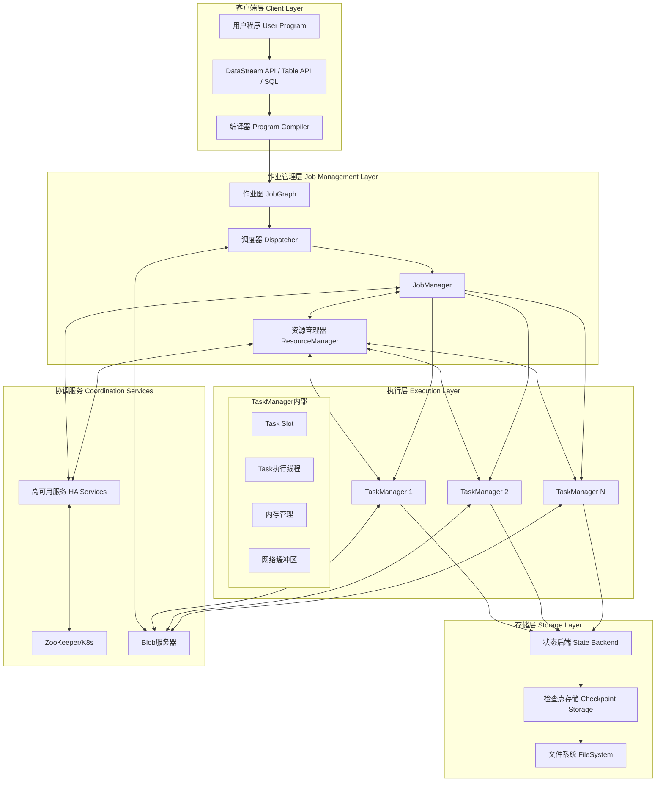
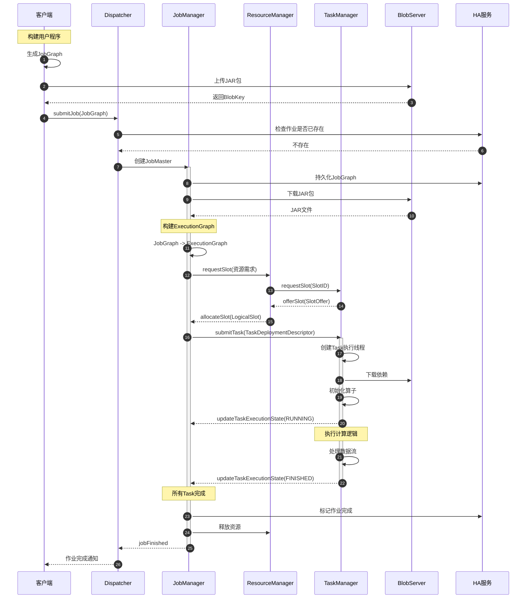
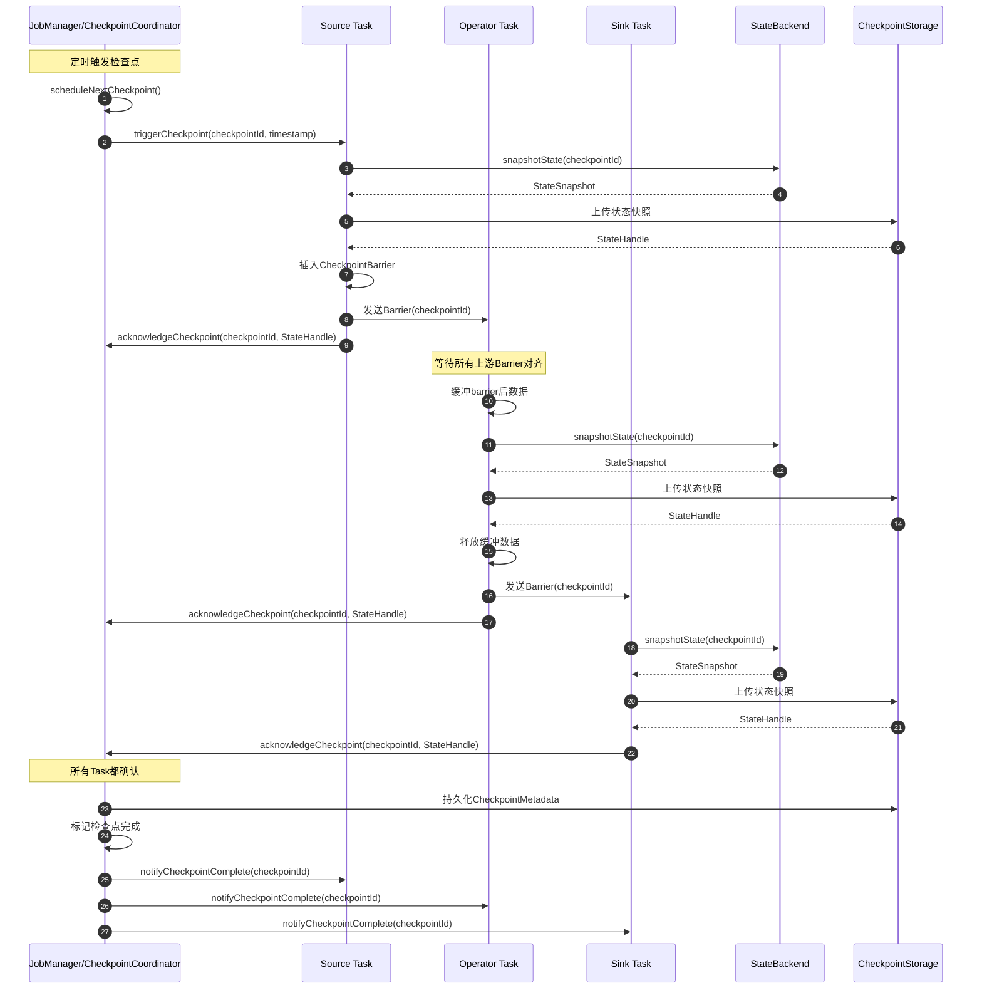
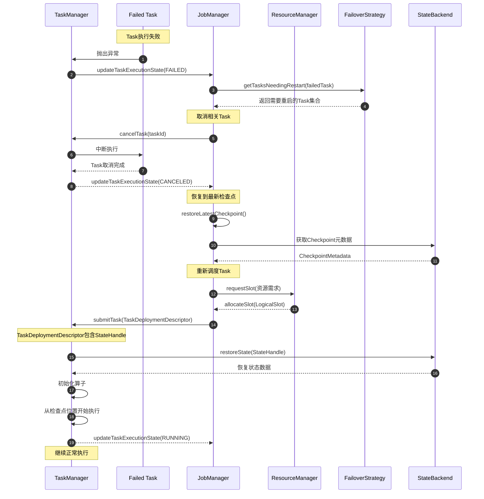

# Flink-00-总览

## 一、项目摘要

### 1.1 项目目标

Apache Flink 是一个开源的分布式流处理框架，旨在对有界和无界数据流进行有状态计算。核心设计目标包括：

- **统一批流处理**：提供统一的编程模型处理批处理和流处理
- **高吞吐低延迟**：实现亚秒级延迟和百万级/秒吞吐
- **精确一次语义**：通过检查点机制保证状态一致性
- **高可用容错**：支持故障恢复和状态快照
- **灵活扩展**：支持动态伸缩和多种部署模式

### 1.2 运行环境与部署形态

**运行环境要求**：
- JDK 8/11/17
- 支持Linux、macOS、Windows
- 可选：Hadoop、Kubernetes、YARN等资源管理器

**部署形态**：
- **Standalone模式**：独立集群部署
- **YARN模式**：与Hadoop YARN集成
- **Kubernetes模式**：容器化部署
- **Session模式**：预启动集群，提交多个作业
- **Per-Job模式**：每个作业独立集群
- **Application模式**：作业作为应用主程序运行

### 1.3 边界与非目标

**核心边界**：
- 专注于流式数据处理和有状态计算
- 提供DataStream API、Table API、SQL等多层次API
- 管理作业生命周期、资源调度、容错恢复

**非目标**：
- 不是通用计算框架（如MapReduce）
- 不提供数据存储能力（依赖外部存储）
- 不是机器学习框架（虽然支持ML库）

## 二、整体架构

### 2.1 系统架构图



### 2.2 架构说明

#### 2.2.1 图意概述

Flink采用Master-Worker架构，分为客户端层、作业管理层、执行层、存储层和协调服务五大层次。客户端负责构建作业图并提交，JobManager负责作业调度和协调，TaskManager负责任务执行，状态后端负责状态管理和持久化，协调服务提供高可用性支持。

#### 2.2.2 关键组件与接口

**JobManager核心职责**：
- 作业调度与协调
- 检查点协调
- 故障恢复决策
- 元数据管理

**TaskManager核心职责**：
- 执行具体任务
- 管理内存和网络缓冲区
- 状态存储与快照
- 数据交换

**ResourceManager核心职责**：
- Slot资源分配
- TaskManager生命周期管理
- 与外部资源管理器交互

**Dispatcher核心职责**：
- 接收作业提交
- 为每个作业启动JobManager
- 提供REST API

#### 2.2.3 边界条件

**并发控制**：
- JobManager和TaskManager通过RPC异步通信
- 每个Task在独立线程中执行
- 状态访问通过KeyGroup分区避免竞争

**超时机制**：
- RPC调用默认超时（可配置）
- 心跳超时检测组件存活
- 检查点超时自动取消

**幂等性保证**：
- 作业提交通过JobID去重
- 检查点ID单调递增
- Task部署请求包含ExecutionAttemptID

**执行顺序**：
- 上游Task完成才启动下游（批处理）
- 流处理采用流水线执行
- 检查点按barrier对齐保证顺序

#### 2.2.4 异常与回退

**故障类型**：
- Task执行失败：重启失败Task或整个Region
- TaskManager失败：重新申请资源并重启Task
- JobManager失败：从HA存储恢复

**回退策略**：
- Region Failover：仅重启失败的Region
- Full Restart：重启所有Task
- 状态从最新检查点恢复

#### 2.2.5 性能与容量

**性能关键路径**：
- 数据序列化/反序列化
- 网络传输（背压机制）
- 状态访问（本地状态优先）
- 检查点执行（异步快照）

**容量假设**：
- 单TaskManager支持数十个Slot
- 单Task状态可达GB级
- 检查点大小受存储限制
- 并行度可达数千

#### 2.2.6 版本兼容与演进

**兼容性策略**：
- State Schema Evolution支持状态升级
- Savepoint版本化保证前向兼容
- RPC协议支持版本协商
- JobGraph序列化版本控制

**演进路径**：
- 从Lambda架构到统一流批
- 从Exactly-Once到Generic Log-Based
- 从TaskManager独占Slot到Fine-Grained Resource Management

## 三、全局时序图

### 3.1 作业提交与执行流程



**时序图说明**：

1. **作业提交阶段（步骤1-6）**：客户端生成JobGraph并上传JAR包到BlobServer，然后通过Dispatcher提交作业。Dispatcher检查作业是否已存在，若不存在则创建JobMaster实例。

2. **作业准备阶段（步骤7-10）**：JobMaster从HA服务持久化JobGraph保证高可用，下载JAR包，将JobGraph转换为ExecutionGraph（包含并行度展开和资源需求计算）。

3. **资源申请阶段（步骤11-14）**：JobMaster向ResourceManager申请Slot资源，ResourceManager从TaskManager请求Slot，TaskManager返回SlotOffer，ResourceManager分配LogicalSlot给JobMaster。

4. **任务部署阶段（步骤15-18）**：JobMaster向TaskManager提交TaskDeploymentDescriptor（包含任务代码、配置、上下游连接信息），TaskManager创建Task线程、下载依赖、初始化算子，完成后报告RUNNING状态。

5. **任务执行阶段（步骤19-20）**：Task线程执行用户定义的计算逻辑，处理输入数据流并产生输出。

6. **作业完成阶段（步骤21-24）**：所有Task完成后，JobMaster标记作业完成，释放资源，通知Dispatcher和客户端。

### 3.2 检查点执行流程



**检查点时序说明**：

1. **触发阶段（步骤1-3）**：CheckpointCoordinator定时调度检查点，向所有Source Task发送triggerCheckpoint请求，携带检查点ID和时间戳。

2. **Source快照阶段（步骤4-9）**：Source Task调用StateBackend进行状态快照，上传到CheckpointStorage获取StateHandle，然后在数据流中插入CheckpointBarrier并发送给下游，最后向协调器确认。

3. **Operator对齐与快照阶段（步骤10-17）**：Operator等待所有上游的Barrier到达（Barrier对齐），期间缓冲已到达Barrier后的数据。对齐完成后进行状态快照、上传、释放缓冲数据、向下游发送Barrier并确认。

4. **Sink快照阶段（步骤18-21）**：Sink Task执行状态快照、上传并确认。

5. **完成阶段（步骤22-26）**：协调器收到所有Task的确认后，持久化CheckpointMetadata（包含所有Task的StateHandle），标记检查点完成，并通知所有Task可以清理旧状态。

### 3.3 故障恢复流程



**故障恢复说明**：

1. **故障检测（步骤1-3）**：Task执行过程中抛出异常，TaskManager捕获异常并向JobManager报告Task失败状态。

2. **故障范围确定（步骤4-5）**：JobManager查询FailoverStrategy确定需要重启的Task集合。Region策略仅重启失败Region，Full Restart策略重启所有Task。

3. **任务取消（步骤6-9）**：JobManager向相关TaskManager发送cancelTask请求，TaskManager中断Task执行，等待任务完成取消并报告CANCELED状态。

4. **状态恢复（步骤10-13）**：JobManager从StateBackend获取最新完成的检查点元数据，包含所有Task的状态句柄。

5. **资源重新申请（步骤14-15）**：向ResourceManager申请Slot资源用于重新部署Task。

6. **任务重新部署（步骤16-21）**：JobManager提交包含状态句柄的TaskDeploymentDescriptor，TaskManager从StateBackend恢复状态，初始化算子，从检查点位置继续执行，报告RUNNING状态。

## 四、模块交互矩阵

| 调用方 | 被调方 | 通信方式 | 调用场景 | 错误语义 | 一致性要求 |
|--------|--------|----------|----------|----------|------------|
| Client | Dispatcher | REST API | 提交作业、查询状态 | 异步返回Future，超时重试 | 最终一致 |
| Dispatcher | JobManager | 直接调用 | 创建JobMaster实例 | 同步异常抛出 | 强一致 |
| JobManager | ResourceManager | RPC | 申请/释放Slot | 异步Future，失败重新申请 | 最终一致 |
| JobManager | TaskManager | RPC | 部署/取消Task | 异步Future，失败触发故障恢复 | 最终一致 |
| TaskManager | JobManager | RPC | 报告Task状态、心跳 | 异步单向，丢失触发超时 | 最终一致 |
| TaskManager | TaskManager | 直接网络 | 数据交换（Shuffle） | 背压机制，失败触发重连 | 无保证 |
| JobManager | BlobServer | RPC | 下载JAR和依赖 | 同步阻塞，失败重试 | 强一致 |
| TaskManager | BlobServer | RPC | 下载JAR和依赖 | 同步阻塞，失败重试 | 强一致 |
| JobManager | HA服务 | 直接调用 | 持久化元数据、选主 | 同步阻塞，失败抛异常 | 强一致 |
| TaskManager | StateBackend | 直接调用 | 状态读写、快照 | 同步阻塞，失败触发故障恢复 | 强一致 |
| CheckpointCoordinator | TaskManager | RPC | 触发检查点 | 异步Future，超时取消检查点 | 弱一致 |
| TaskManager | CheckpointStorage | 直接调用 | 上传状态快照 | 同步阻塞，失败取消检查点 | 强一致 |

## 五、关键设计与权衡

### 5.1 一致性与事务

#### 5.1.1 检查点机制

**设计原理**：采用Chandy-Lamport分布式快照算法，通过Checkpoint Barrier在数据流中标记快照点。Barrier像水位线一样在数据流中流动，当算子收到所有输入通道的Barrier时，触发本地状态快照。

**实现策略**：

**1. Barrier对齐（Exactly-Once）**：
- 算子等待所有上游Barrier到达
- 期间缓冲已收到Barrier的通道数据
- 对齐完成后触发快照，然后处理缓冲数据
- 保证每条记录恰好处理一次

**2. Barrier不对齐（At-Least-Once）**：
- 收到第一个Barrier立即触发快照
- 不等待其他通道，不缓冲数据
- 延迟但会重复处理
- 适用于低延迟场景

**3. Unaligned Checkpoint**：
- Barrier不对齐但记录In-Flight数据
- 将通道中的数据也作为状态快照
- 兼顾低延迟和精确一次
- 恢复时需要重放In-Flight数据

**权衡分析**：
- **Exactly-Once vs 延迟**：对齐会增加延迟，特别是数据倾斜时，慢通道阻塞快通道
- **状态大小 vs 检查点间隔**：更频繁的检查点减少恢复时间但增加I/O开销和对处理的干扰
- **全量 vs 增量检查点**：增量减少网络和存储消耗，但恢复需要合并多个增量，且管理复杂

#### 5.1.2 状态管理

**Keyed State**：
- 按Key分区，每个Key的状态独立
- 支持ValueState、ListState、MapState等
- Scale-out时按KeyGroup重新分配
- 适用于per-key聚合场景

**Operator State**：
- 按算子实例分区，与Key无关
- 支持ListState、UnionListState、BroadcastState
- Scale-out时通过ListStateDescriptor定义重分配策略（均分或广播）
- 适用于Kafka offset、缓冲区等

**权衡分析**：
- **内存 vs 磁盘**：
  - MemoryStateBackend：快但容量小（<100MB），适合测试和小状态
  - FsStateBackend：内存存储+文件系统快照，适合中等状态
  - RocksDBStateBackend：磁盘存储，容量大但慢，适合大状态（GB-TB级）
- **同步 vs 异步快照**：
  - 同步：阻塞处理，简单但影响吞吐
  - 异步：不阻塞，但实现复杂（RocksDB需要创建快照后台上传）

### 5.2 并发与锁

#### 5.2.1 单线程模型

**设计**：Task内算子处理采用单线程模型，同一时刻只有一个线程访问算子状态。

**优点**：
- **简化状态访问**：无需加锁，避免死锁和竞争
- **确定性处理**：相同输入产生相同输出，易于调试和重放
- **高效内存访问**：CPU缓存友好，无cache line bouncing

**缺点**：
- **单核限制**：单个算子无法利用多核，受限于单线程吞吐
- **需要更多并行度**：通过增加并行度而非单算子多线程提升吞吐

**适用场景**：状态密集型计算、需要精确一次语义的场景

#### 5.2.2 Mailbox执行模型

**设计原理**：Task执行线程运行Mailbox事件循环，处理数据记录和控制消息。Mailbox是一个优先级队列，支持普通消息和优先消息。

**实现细节**：
```java
while (isRunning) {
    // 1. 处理高优先级消息（检查点、取消等）
    processMail(priorityMailbox);
    
    // 2. 处理数据记录
    if (inputAvailable) {
        StreamRecord record = input.pollNext();
        operator.processElement(record);
    }
    
    // 3. 处理普通邮件（定时器等）
    processMail(normalMailbox);
}
```

**消息类型**：
- **优先消息**：检查点触发、任务取消、Watermark对齐
- **正常消息**：定时器触发、异步操作完成回调
- **数据记录**：通过Input Gate读取，不进Mailbox

**阻塞操作异步化**：
- 外部调用通过Mailbox提交异步任务
- 避免阻塞主线程影响数据处理
- 回调结果通过Mailbox返回

### 5.3 性能关键路径

#### 5.3.1 数据序列化

**类型系统（TypeInformation）**：
- **编译期类型推导**：通过Java反射和字节码分析自动推导类型
- **避免运行时反射**：序列化器在作业启动时生成，运行时直接调用
- **内置类型优化**：基本类型、String、数组等使用专用序列化器

**自定义序列化器**：
- **TypeSerializer接口**：用户可实现自定义序列化逻辑
- **高效二进制格式**：避免JSON/XML等文本格式开销
- **序列化器快照**：支持Schema Evolution，版本升级兼容

**零拷贝技术**：
- **NetworkBuffer复用**：序列化直接写入网络缓冲区
- **避免中间拷贝**：数据在发送端序列化后直接通过网络传输
- **接收端反序列化**：直接从网络缓冲区读取

**优化效果**：相比Kryo、Java序列化可提升2-5倍性能

#### 5.3.2 网络栈

**Credit-based背压机制**：
- **Credit分配**：接收端根据可用缓冲区分配Credit给发送端
- **Credit消耗**：发送端每发送一个Buffer消耗一个Credit
- **Credit补充**：接收端消费Buffer后补充Credit给发送端
- **背压传播**：发送端Credit耗尽时停止发送，背压传播到上游

**优势**：
- **避免全局同步**：链路级别背压，不影响其他数据流
- **减少延迟**：相比基于TCP的背压，延迟更低
- **资源隔离**：不同作业、不同链路的背压互不影响

**缓冲管理**：
- **NetworkBufferPool**：全局共享内存池，启动时预分配
- **LocalBufferPool**：每个InputGate/ResultPartition独立缓冲区
- **动态调整**：根据吞吐和延迟需求自动调整缓冲区数量

**网络配置示例**：
```
taskmanager.network.memory.fraction: 0.1  # 网络内存占比
taskmanager.network.memory.min: 64mb
taskmanager.network.memory.max: 1gb
taskmanager.network.buffers-per-channel: 2  # 每通道缓冲区数
taskmanager.network.extra-buffers-per-gate: 8  # 每Gate额外缓冲区
```

#### 5.3.3 状态访问优化

**RocksDB优化**：

**1. Column Family隔离**：
- 不同状态类型使用不同Column Family
- 独立的Write Buffer和Block Cache
- 减少冲突，提升并发性能

**2. Write Buffer优化**：
- 批量写入减少磁盘I/O
- 可配置Write Buffer大小和数量
- 异步刷盘不阻塞写入

**3. Block Cache**：
- LRU缓存热数据块
- 减少磁盘读取次数
- 可配置缓存大小

**4. Bloom Filter**：
- 快速判断Key是否存在
- 减少无效磁盘查找
- 每个SST文件独立Bloom Filter

**5. Compaction策略**：
- Level Compaction：适合读多写少
- Universal Compaction：适合写多读少
- 可配置触发条件和并发度

**RocksDB配置示例**：
```java
state.backend.rocksdb.block.cache-size: 256mb
state.backend.rocksdb.writebuffer.size: 64mb
state.backend.rocksdb.writebuffer.count: 3
state.backend.rocksdb.compaction.level.target-file-size-base: 64mb
```

**内存管理**：
- **Off-Heap内存**：避免GC停顿影响
- **预分配**：启动时分配内存池，减少运行时分配
- **分层存储**：热数据内存，温数据SSD，冷数据HDD

### 5.4 可观测性

#### 5.4.1 指标体系

**Job级指标**：
- `numRecordsIn/Out`：输入输出记录数
- `numBytesIn/Out`：输入输出字节数
- `currentInputWatermark`：当前Watermark
- `backPressureLevel`：背压级别（0-1）

**Operator级指标**：
- `numRecordsIn/Out`：算子输入输出记录数
- `numLateRecordsDropped`：丢弃的延迟记录数
- `currentOutputWatermark`：输出Watermark
- `stateSize`：状态大小

**Task级指标**：
- `cpuUsage`：CPU使用率
- `memoryUsage`：内存使用量
- `networkInputBytes/OutputBytes`：网络I/O
- `garbageCollectionTime`：GC时间

**Checkpoint级指标**：
- `checkpointDuration`：检查点耗时
- `checkpointSize`：检查点大小
- `checkpointAlignmentTime`：Barrier对齐时间
- `numberOfCompletedCheckpoints`：完成的检查点数
- `numberOfFailedCheckpoints`：失败的检查点数

**上报机制**：
- **Reporter插件**：JMX、Prometheus、InfluxDB、Datadog等
- **REST API**：`/jobs/:jobid/metrics` 实时查询
- **Web UI**：图表可视化监控

#### 5.4.2 日志与追踪

**结构化日志**：
- **MDC上下文**：JobID、TaskID、SubtaskIndex自动注入
- **分级别输出**：ERROR/WARN/INFO/DEBUG
- **完整堆栈**：异常堆栈完整记录，便于排查

**日志配置示例**：
```xml
<pattern>%d{yyyy-MM-dd HH:mm:ss,SSS} %-5p %-60c %x - %m%n</pattern>
<!-- %x 输出 MDC 上下文，包含 JobID 等 -->
```

**分布式追踪**：
- **Span传播**：RPC调用自动创建Span并传播TraceID
- **Checkpoint追踪**：从触发到完成的全链路Span
- **集成OpenTelemetry**：支持Jaeger、Zipkin等

### 5.5 配置项详解

#### 5.5.1 资源配置

```yaml
# TaskManager总内存（包括JVM Heap、Off-Heap、网络缓冲区等）
taskmanager.memory.process.size: 4gb

# Slot数量（并行度受限于Slot总数）
taskmanager.numberOfTaskSlots: 4

# 默认并行度
parallelism.default: 4

# JobManager内存
jobmanager.memory.process.size: 2gb

# Flink管理的内存（不包括JVM开销）
taskmanager.memory.flink.size: 3.5gb

# JVM Heap内存
taskmanager.memory.task.heap.size: 1gb
taskmanager.memory.framework.heap.size: 128mb

# Off-Heap内存（用于状态后端、网络缓冲区等）
taskmanager.memory.task.off-heap.size: 1gb
taskmanager.memory.managed.size: 1gb
```

#### 5.5.2 检查点配置

```yaml
# 检查点间隔（毫秒），设置后自动启用检查点
execution.checkpointing.interval: 60000

# 检查点模式
execution.checkpointing.mode: EXACTLY_ONCE  # 或 AT_LEAST_ONCE

# 检查点超时时间
execution.checkpointing.timeout: 600000

# 最小间隔时间（两次检查点之间至少间隔）
execution.checkpointing.min-pause: 10000

# 并发检查点数
execution.checkpointing.max-concurrent-checkpoints: 1

# 外部化检查点（作业取消后保留）
execution.checkpointing.externalized-checkpoint-retention: RETAIN_ON_CANCELLATION

# Unaligned Checkpoint
execution.checkpointing.unaligned: false

# 状态后端
state.backend: rocksdb  # 或 hashmap、filesystem

# 检查点存储路径
state.checkpoints.dir: hdfs:///flink-checkpoints

# Savepoint路径
state.savepoints.dir: hdfs:///flink-savepoints

# 增量检查点（仅RocksDB）
state.backend.incremental: true
```

#### 5.5.3 调度与容错配置

```yaml
# 调度器类型
jobmanager.scheduler: default  # 或 adaptive

# 故障恢复策略
jobmanager.execution.failover-strategy: region  # 或 full

# 重启策略
restart-strategy: fixed-delay
restart-strategy.fixed-delay.attempts: 3
restart-strategy.fixed-delay.delay: 10s

# 或使用失败率策略
# restart-strategy: failure-rate
# restart-strategy.failure-rate.max-failures-per-interval: 3
# restart-strategy.failure-rate.failure-rate-interval: 5min
# restart-strategy.failure-rate.delay: 10s

# Slot共享组
# 默认所有算子共享Slot，可通过slotSharingGroup隔离
```

#### 5.5.4 网络配置

```yaml
# 网络缓冲区内存比例
taskmanager.network.memory.fraction: 0.1

# 网络缓冲区上限
taskmanager.network.memory.max: 1gb
taskmanager.network.memory.min: 64mb

# 每通道缓冲区数（影响吞吐和延迟）
taskmanager.network.buffers-per-channel: 2

# 每Gate额外缓冲区（用于Barrier对齐等）
taskmanager.network.extra-buffers-per-gate: 8

# 网络Buffer大小
taskmanager.network.memory.buffer-size: 32kb

# Netty配置
taskmanager.network.netty.num-arenas: 1
taskmanager.network.netty.server.numThreads: 1
taskmanager.network.netty.client.numThreads: 1
```

## 六、模块清单

根据源码目录结构，Flink项目划分为以下核心模块：

| 序号 | 模块名称 | 目录路径 | 主要职责 | 核心类/接口 |
|-----|---------|----------|---------|------------|
| 01 | 核心API | flink-core-api | 基础类型、函数接口、序列化框架 | TypeInformation, ExecutionConfig, Function |
| 02 | 核心运行时 | flink-core | 文件系统、配置、基础工具类 | Configuration, FileSystem, Memory Manager |
| 03 | 运行时系统 | flink-runtime | 作业调度、Task执行、资源管理、RPC通信 | JobMaster, TaskExecutor, Scheduler, Dispatcher |
| 04 | DataStream API | flink-datastream-api, flink-datastream | 流处理API和执行引擎 | StreamExecutionEnvironment, DataStream, Transformation |
| 05 | 客户端 | flink-clients | 作业提交、命令行工具 | CliFrontend, PipelineExecutor |
| 06 | RPC系统 | flink-rpc | RPC框架和实现 | RpcEndpoint, RpcService, RpcGateway |
| 07 | 状态后端 | flink-state-backends | 状态存储和管理 | StateBackend, CheckpointStorage, RocksDBStateBackend |
| 08 | Table/SQL | flink-table | SQL解析、优化、执行 | TableEnvironment, Planner, Catalog |
| 09 | CEP | flink-libraries/flink-cep | 复杂事件处理 | Pattern, CEP, NFACompiler |
| 10 | 指标系统 | flink-metrics | 指标收集和上报 | MetricGroup, Reporter |
| 11 | 流处理引擎 | flink-streaming-java | 流处理核心执行引擎 | StreamTask, StreamOperator |

## 七、文档导航

后续文档将深入剖析每个核心模块：

- **Flink-01-核心API与数据类型**：类型系统、序列化、函数接口、执行配置
- **Flink-02-核心运行时基础**：配置管理、文件系统、内存管理、工具类
- **Flink-03-运行时系统**：JobManager、TaskManager、Scheduler、ResourceManager、故障恢复
- **Flink-04-DataStream处理引擎**：DataStream API、Transformation、StreamGraph、Operator Chain
- **Flink-05-客户端与作业提交**：CliFrontend、JobSubmission、PipelineExecutor、部署模式
- **Flink-06-RPC通信框架**：RpcEndpoint、RpcService、RpcGateway、Akka实现
- **Flink-07-状态管理与检查点**：StateBackend、CheckpointCoordinator、Savepoint、状态恢复
- **Flink-08-Table与SQL**：Catalog、Planner、Optimizer、Codegen、执行
- **Flink-09-复杂事件处理CEP**：Pattern、NFA、CEPOperator、匹配策略
- **Flink-10-实战示例与最佳实践**：常见场景、性能优化、故障排查、生产经验

---

本文档提供Flink项目的整体架构视图和核心设计理念。每个时序图都详细说明了步骤和交互逻辑，每个设计决策都阐述了权衡和适用场景。后续模块文档将深入每个组件的API、数据结构、调用链路和实现细节。

