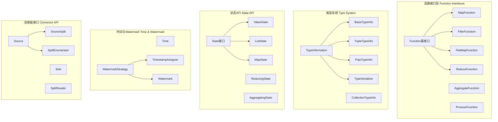
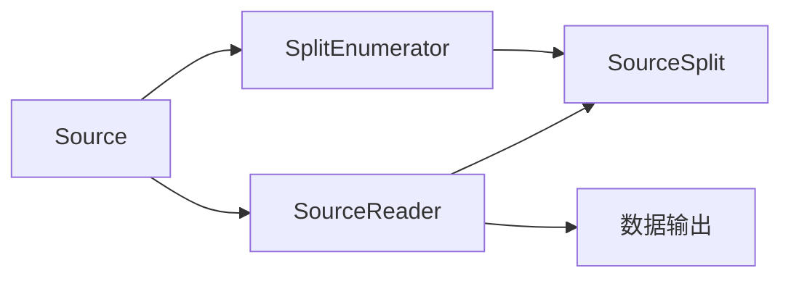

# Flink-01-核心API与类型系统（flink-core-api）

## 一、模块概览

### 1.1 模块职责

核心API模块是Flink的基础层，定义了所有上层API共享的核心接口和类型系统。

**核心职责**：
- 定义用户函数接口（MapFunction、FilterFunction等）
- 提供类型信息和序列化框架
- 定义状态API接口
- 提供时间和Watermark抽象
- 定义连接器接口（Source、Sink）

### 1.2 模块架构



## 二、核心组件详解

### 2.1 Function - 用户函数接口

#### 2.1.1 基础Function接口

```java
// 所有用户函数的基接口
public interface Function extends java.io.Serializable {
    // 空接口，支持Lambda表达式
}
```

#### 2.1.2 MapFunction - 映射函数

```java
@FunctionalInterface
public interface MapFunction<T, O> extends Function {
    /**
     * 将输入转换为输出
     * @param value 输入元素
     * @return 输出元素
     */
    O map(T value) throws Exception;
}
```

**使用示例**：

```java
// Lambda方式
DataStream<String> names = events.map(event -> event.getName());

// 实现类方式
DataStream<Integer> lengths = names.map(new MapFunction<String, Integer>() {
    @Override
    public Integer map(String value) throws Exception {
        return value.length();
    }
});
```

#### 2.1.3 FilterFunction - 过滤函数

```java
@FunctionalInterface
public interface FilterFunction<T> extends Function {
    /**
     * 过滤逻辑
     * @param value 输入元素
     * @return true保留，false过滤
     */
    boolean filter(T value) throws Exception;
}
```

#### 2.1.4 FlatMapFunction - 扁平映射函数

```java
@FunctionalInterface
public interface FlatMapFunction<T, O> extends Function {
    /**
     * 将一个输入转换为0个、1个或多个输出
     * @param value 输入元素
     * @param out 输出收集器
     */
    void flatMap(T value, Collector<O> out) throws Exception;
}
```

**使用示例**：

```java
DataStream<String> words = sentences.flatMap((String sentence, Collector<String> out) -> {
    for (String word : sentence.split(" ")) {
        out.collect(word);
    }
});
```

#### 2.1.5 ReduceFunction - 归约函数

```java
@FunctionalInterface
public interface ReduceFunction<T> extends Function {
    /**
     * 将两个元素归约为一个
     * @param value1 第一个值
     * @param value2 第二个值
     * @return 归约结果
     */
    T reduce(T value1, T value2) throws Exception;
}
```

#### 2.1.6 AggregateFunction - 聚合函数

```java
public interface AggregateFunction<IN, ACC, OUT> extends Function {
    
    /** 创建初始累加器 */
    ACC createAccumulator();
    
    /** 将输入元素加入累加器 */
    ACC add(IN value, ACC accumulator);
    
    /** 从累加器获取最终结果 */
    OUT getResult(ACC accumulator);
    
    /** 合并两个累加器 */
    ACC merge(ACC a, ACC b);
}
```

**使用示例**：

```java
public class AverageAggregate implements AggregateFunction<Event, Tuple2<Long, Long>, Double> {
    
    @Override
    public Tuple2<Long, Long> createAccumulator() {
        return Tuple2.of(0L, 0L); // (sum, count)
    }
    
    @Override
    public Tuple2<Long, Long> add(Event value, Tuple2<Long, Long> accumulator) {
        return Tuple2.of(
            accumulator.f0 + value.value,
            accumulator.f1 + 1L
        );
    }
    
    @Override
    public Double getResult(Tuple2<Long, Long> accumulator) {
        return ((double) accumulator.f0) / accumulator.f1;
    }
    
    @Override
    public Tuple2<Long, Long> merge(Tuple2<Long, Long> a, Tuple2<Long, Long> b) {
        return Tuple2.of(a.f0 + b.f0, a.f1 + b.f1);
    }
}
```

### 2.2 TypeInformation - 类型系统

#### 2.2.1 功能说明

TypeInformation是Flink类型系统的核心，用于：
- 类型推断和验证
- 序列化器创建
- 字段访问和投影
- Key提取

#### 2.2.2 核心接口

```java
public abstract class TypeInformation<T> implements Serializable {
    
    /**
     * 检查类型是否为基础类型
     */
    public abstract boolean isBasicType();
    
    /**
     * 检查类型是否为Tuple类型
     */
    public abstract boolean isTupleType();
    
    /**
     * 获取类型的泛型参数数量
     */
    public abstract int getArity();
    
    /**
     * 获取类型的总字段数
     */
    public abstract int getTotalFields();
    
    /**
     * 获取类型的Class
     */
    public abstract Class<T> getTypeClass();
    
    /**
     * 创建序列化器
     */
    public abstract TypeSerializer<T> createSerializer(ExecutionConfig config);
    
    /**
     * 检查此类型是否可以与另一个类型平等比较
     */
    public abstract boolean canEqual(Object obj);
}
```

#### 2.2.3 基础类型

```java
// 基本类型
public class BasicTypeInfo<T> extends TypeInformation<T> {
    
    public static final BasicTypeInfo<String> STRING_TYPE_INFO = 
        new BasicTypeInfo<>(String.class, ...);
    
    public static final BasicTypeInfo<Boolean> BOOLEAN_TYPE_INFO = 
        new BasicTypeInfo<>(Boolean.class, ...);
    
    public static final BasicTypeInfo<Byte> BYTE_TYPE_INFO = 
        new BasicTypeInfo<>(Byte.class, ...);
    
    public static final BasicTypeInfo<Short> SHORT_TYPE_INFO = 
        new BasicTypeInfo<>(Short.class, ...);
    
    public static final BasicTypeInfo<Integer> INT_TYPE_INFO = 
        new BasicTypeInfo<>(Integer.class, ...);
    
    public static final BasicTypeInfo<Long> LONG_TYPE_INFO = 
        new BasicTypeInfo<>(Long.class, ...);
    
    public static final BasicTypeInfo<Float> FLOAT_TYPE_INFO = 
        new BasicTypeInfo<>(Float.class, ...);
    
    public static final BasicTypeInfo<Double> DOUBLE_TYPE_INFO = 
        new BasicTypeInfo<>(Double.class, ...);
}
```

#### 2.2.4 复合类型

**Tuple类型**：

```java
public class TupleTypeInfo<T extends Tuple> extends TypeInformation<T> {
    
    private final TypeInformation<?>[] types;
    
    public TypeInformation<?> getTypeAt(int pos) {
        return types[pos];
    }
    
    @Override
    public int getArity() {
        return types.length;
    }
}
```

**POJO类型**：

```java
public class PojoTypeInfo<T> extends TypeInformation<T> {
    
    private final PojoField[] fields;
    
    public int getFieldIndex(String fieldName) {
        for (int i = 0; i < fields.length; i++) {
            if (fields[i].getField().getName().equals(fieldName)) {
                return i;
            }
        }
        return -1;
    }
}
```

#### 2.2.5 类型提示（Type Hints）

```java
// 显式指定类型
DataStream<Tuple2<String, Integer>> result = stream
    .map(value -> Tuple2.of(value.name, value.count))
    .returns(Types.TUPLE(Types.STRING, Types.INT));

// 使用TypeHint
DataStream<MyGenericType<String>> result = stream
    .map(...)
    .returns(new TypeHint<MyGenericType<String>>(){});
```

### 2.3 TypeSerializer - 序列化器

#### 2.3.1 功能说明

TypeSerializer负责：
- 序列化对象到字节流
- 从字节流反序列化对象
- 对象复制
- 提供序列化配置快照（用于状态演进）

#### 2.3.2 核心接口

```java
public abstract class TypeSerializer<T> implements Serializable {
    
    /**
     * 创建实例的深拷贝
     */
    public abstract T copy(T from);
    
    /**
     * 创建实例的深拷贝（复用目标对象）
     */
    public abstract T copy(T from, T reuse);
    
    /**
     * 创建类型的新实例
     */
    public abstract T createInstance();
    
    /**
     * 序列化到DataOutputView
     */
    public abstract void serialize(T record, DataOutputView target) throws IOException;
    
    /**
     * 从DataInputView反序列化
     */
    public abstract T deserialize(DataInputView source) throws IOException;
    
    /**
     * 从DataInputView反序列化（复用对象）
     */
    public abstract T deserialize(T reuse, DataInputView source) throws IOException;
    
    /**
     * 复制序列化的数据
     */
    public abstract void copy(DataInputView source, DataOutputView target) throws IOException;
    
    /**
     * 获取序列化后的长度（-1表示可变长度）
     */
    public abstract int getLength();
    
    /**
     * 创建序列化器快照（用于状态演进）
     */
    public abstract TypeSerializerSnapshot<T> snapshotConfiguration();
}
```

### 2.4 State API - 状态接口

#### 2.4.1 State基接口

```java
public interface State {
    /** 清除当前Key的状态 */
    void clear();
}
```

#### 2.4.2 ValueState

```java
public interface ValueState<T> extends State {
    /** 获取当前Key的值 */
    T value() throws IOException;
    
    /** 更新当前Key的值 */
    void update(T value) throws IOException;
}
```

#### 2.4.3 AppendingState

```java
public interface AppendingState<IN, OUT> extends State {
    /** 获取当前Key的值 */
    OUT get() throws Exception;
    
    /** 添加值 */
    void add(IN value) throws Exception;
}
```

#### 2.4.4 ListState

```java
public interface ListState<T> extends AppendingState<T, Iterable<T>> {
    /** 更新状态为给定的值列表 */
    void update(List<T> values) throws Exception;
    
    /** 添加多个值 */
    void addAll(List<T> values) throws Exception;
}
```

#### 2.4.5 MapState

```java
public interface MapState<UK, UV> extends State {
    /** 获取指定Key的值 */
    UV get(UK key) throws Exception;
    
    /** 添加或更新Key-Value */
    void put(UK key, UV value) throws Exception;
    
    /** 批量添加 */
    void putAll(Map<UK, UV> map) throws Exception;
    
    /** 删除指定Key */
    void remove(UK key) throws Exception;
    
    /** 检查是否包含Key */
    boolean contains(UK key) throws Exception;
    
    /** 获取所有Entry */
    Iterable<Map.Entry<UK, UV>> entries() throws Exception;
    
    /** 获取所有Key */
    Iterable<UK> keys() throws Exception;
    
    /** 获取所有Value */
    Iterable<UV> values() throws Exception;
    
    /** 获取迭代器 */
    Iterator<Map.Entry<UK, UV>> iterator() throws Exception;
    
    /** 检查是否为空 */
    boolean isEmpty() throws Exception;
}
```

### 2.5 Watermark与时间

#### 2.5.1 Watermark

```java
public final class Watermark implements Serializable {
    
    private final long timestamp;
    
    /** 特殊Watermark：还未设置时间戳 */
    public static final Watermark UNINITIALIZED = new Watermark(Long.MIN_VALUE);
    
    public Watermark(long timestamp) {
        this.timestamp = timestamp;
    }
    
    public long getTimestamp() {
        return timestamp;
    }
}
```

#### 2.5.2 WatermarkStrategy

```java
public interface WatermarkStrategy<T> extends 
        TimestampAssignerSupplier<T>, 
        WatermarkGeneratorSupplier<T> {
    
    /** 创建时间戳分配器 */
    @Override
    TimestampAssigner<T> createTimestampAssigner(
        TimestampAssignerSupplier.Context context);
    
    /** 创建Watermark生成器 */
    @Override
    WatermarkGenerator<T> createWatermarkGenerator(
        WatermarkGeneratorSupplier.Context context);
    
    /** 固定延迟策略 */
    static <T> WatermarkStrategy<T> forBoundedOutOfOrderness(Duration maxOutOfOrderness) {
        return (ctx) -> new BoundedOutOfOrdernessWatermarks<>(maxOutOfOrderness);
    }
    
    /** 单调递增策略 */
    static <T> WatermarkStrategy<T> forMonotonousTimestamps() {
        return (ctx) -> new AscendingTimestampsWatermarks<>();
    }
}
```

**使用示例**：

```java
DataStream<Event> withWatermarks = stream
    .assignTimestampsAndWatermarks(
        WatermarkStrategy
            .<Event>forBoundedOutOfOrderness(Duration.ofSeconds(5))
            .withTimestampAssigner((event, timestamp) -> event.getTimestamp())
    );
```

### 2.6 Connector API - 连接器接口

#### 2.6.1 Source接口（v2）

```java
public interface Source<T, SplitT extends SourceSplit, EnumChkT> extends Serializable {
    
    /**
     * 获取Source的边界性
     */
    Boundedness getBoundedness();
    
    /**
     * 创建Split枚举器
     */
    SplitEnumerator<SplitT, EnumChkT> createEnumerator(
        SplitEnumeratorContext<SplitT> enumContext) throws Exception;
    
    /**
     * 恢复Split枚举器
     */
    SplitEnumerator<SplitT, EnumChkT> restoreEnumerator(
        SplitEnumeratorContext<SplitT> enumContext,
        EnumChkT checkpoint) throws Exception;
    
    /**
     * 创建Reader
     */
    SourceReader<T, SplitT> createReader(
        SourceReaderContext readerContext) throws Exception;
    
    /**
     * 获取Split序列化器
     */
    SimpleVersionedSerializer<SplitT> getSplitSerializer();
    
    /**
     * 获取枚举器检查点序列化器
     */
    SimpleVersionedSerializer<EnumChkT> getEnumeratorCheckpointSerializer();
}
```

**核心组件**：



#### 2.6.2 Sink接口（v2）

```java
public interface Sink<InputT> extends Serializable {
    
    /**
     * 创建Writer
     */
    SinkWriter<InputT> createWriter(InitContext context) throws IOException;
    
    /**
     * 获取提交器（两阶段提交）
     */
    Optional<Committer<CommT>> createCommitter() throws IOException;
    
    /**
     * 获取全局提交器（两阶段提交）
     */
    Optional<GlobalCommitter<CommT, GlobalCommT>> createGlobalCommitter() throws IOException;
    
    /**
     * 获取提交数据序列化器
     */
    Optional<SimpleVersionedSerializer<CommT>> getCommittableSerializer();
}
```

## 三、关键数据结构

### 3.1 Tuple类型

```java
// Tuple基类
public abstract class Tuple implements Serializable {
    public abstract int getArity();
    public abstract <T> T getField(int pos);
    public abstract <T> void setField(T value, int pos);
}

// Tuple2
public class Tuple2<T0, T1> extends Tuple {
    public T0 f0;
    public T1 f1;
    
    public static <T0, T1> Tuple2<T0, T1> of(T0 f0, T1 f1) {
        return new Tuple2<>(f0, f1);
    }
}

// 使用示例
Tuple2<String, Integer> tuple = Tuple2.of("hello", 42);
String first = tuple.f0;
Integer second = tuple.f1;
```

### 3.2 Row类型

```java
public final class Row implements Serializable {
    
    private final RowKind kind; // INSERT, UPDATE_BEFORE, UPDATE_AFTER, DELETE
    private final Object[] fields;
    
    public Object getField(int pos) {
        return fields[pos];
    }
    
    public void setField(int pos, Object value) {
        fields[pos] = value;
    }
    
    public int getArity() {
        return fields.length;
    }
}
```

## 四、最佳实践

### 4.1 选择合适的函数接口

```java
// 简单转换：使用MapFunction或Lambda
DataStream<Integer> lengths = names.map(String::length);

// 需要输出多个结果：使用FlatMapFunction
DataStream<String> words = sentences.flatMap(
    (String sentence, Collector<String> out) -> {
        Arrays.stream(sentence.split(" ")).forEach(out::collect);
    }
);

// 复杂聚合：使用AggregateFunction
DataStream<Stats> stats = events
    .keyBy(Event::getKey)
    .aggregate(new StatsAggregateFunction());

// 需要访问状态和定时器：使用ProcessFunction
DataStream<Result> results = events
    .keyBy(Event::getKey)
    .process(new MyProcessFunction());
```

### 4.2 类型信息最佳实践

```java
// 1. 避免类型擦除
// Bad: 泛型信息丢失
DataStream<List<String>> bad = ...;

// Good: 使用TypeHint保留泛型信息
DataStream<List<String>> good = ...
    .returns(new TypeHint<List<String>>(){});

// 2. POJO类型要求
public class MyPojo {
    // 1) 必须是public类
    // 2) 必须有public无参构造器
    public MyPojo() {}
    
    // 3) 所有字段必须是public或有public getter/setter
    public String name;
    private int value;
    
    public int getValue() { return value; }
    public void setValue(int value) { this.value = value; }
}

// 3. 复杂类型使用Kryo
env.getConfig().registerTypeWithKryoSerializer(
    MyComplexType.class, MyKryoSerializer.class);
```

### 4.3 状态使用最佳实践

```java
public class StatefulFunction extends KeyedProcessFunction<String, Event, Result> {
    
    // 1. 使用transient避免序列化
    private transient ValueState<Long> countState;
    
    @Override
    public void open(Configuration parameters) {
        // 2. 在open()中初始化状态
        ValueStateDescriptor<Long> descriptor = 
            new ValueStateDescriptor<>("count", Long.class, 0L);
        
        // 3. 配置TTL
        StateTtlConfig ttlConfig = StateTtlConfig
            .newBuilder(Time.hours(24))
            .setUpdateType(StateTtlConfig.UpdateType.OnCreateAndWrite)
            .setStateVisibility(StateTtlConfig.StateVisibility.NeverReturnExpired)
            .build();
        descriptor.enableTimeToLive(ttlConfig);
        
        countState = getRuntimeContext().getState(descriptor);
    }
    
    @Override
    public void processElement(Event event, Context ctx, Collector<Result> out) 
            throws Exception {
        // 4. 访问状态
        Long count = countState.value();
        count++;
        countState.update(count);
        
        out.collect(new Result(ctx.getCurrentKey(), count));
    }
}
```

### 4.4 自定义序列化器

```java
public class MyTypeSerializer extends TypeSerializer<MyType> {
    
    @Override
    public void serialize(MyType record, DataOutputView target) throws IOException {
        // 写入字段
        target.writeUTF(record.name);
        target.writeInt(record.value);
    }
    
    @Override
    public MyType deserialize(DataInputView source) throws IOException {
        // 读取字段
        String name = source.readUTF();
        int value = source.readInt();
        return new MyType(name, value);
    }
    
    @Override
    public MyType copy(MyType from) {
        // 深拷贝
        return new MyType(from.name, from.value);
    }
    
    @Override
    public TypeSerializerSnapshot<MyType> snapshotConfiguration() {
        // 返回序列化器配置快照（用于状态演进）
        return new MyTypeSerializerSnapshot();
    }
    
    // ... 其他方法实现
}
```

## 五、总结

核心API模块提供了Flink的基础抽象：

**函数接口**：
- 简单转换：MapFunction、FilterFunction
- 复杂处理：ProcessFunction
- 聚合操作：AggregateFunction、ReduceFunction

**类型系统**：
- 自动类型推断
- 多种类型支持（基本类型、Tuple、POJO）
- 高效序列化框架

**状态API**：
- 多种状态类型（ValueState、ListState、MapState）
- 状态TTL支持
- 统一的状态访问接口

**连接器框架**：
- 统一的Source/Sink接口
- 支持并行读写
- 灵活的检查点机制

理解核心API是掌握Flink的基础。

