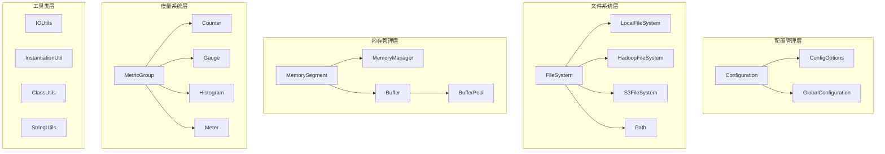

# Flink-02-核心基础与工具类（flink-core）

## 一、模块概览

### 1.1 模块职责

flink-core模块提供Flink的基础设施和工具类，是整个框架的基石。

**核心职责**：
- 配置管理（Configuration）
- 文件系统抽象（FileSystem）
- 内存管理（MemorySegment）
- 序列化框架基础
- 度量指标系统（Metrics）
- 工具类和辅助功能

### 1.2 模块架构



## 二、配置管理

### 2.1 Configuration - 配置类

#### 2.1.1 功能说明

Configuration是Flink的核心配置类，基于键值对存储配置信息。

**核心特性**：
- 类型安全的配置访问
- 支持配置继承和覆盖
- 序列化和反序列化
- 默认值支持

#### 2.1.2 核心API

```java
public class Configuration implements Serializable, Cloneable {
    
    // 内部存储
    protected final HashMap<String, Object> confData;
    
    /**
     * 设置字符串配置
     */
    public void setString(String key, String value);
    
    /**
     * 获取字符串配置
     */
    public String getString(String key, String defaultValue);
    
    /**
     * 设置整数配置
     */
    public void setInteger(String key, int value);
    
    /**
     * 获取整数配置
     */
    public int getInteger(String key, int defaultValue);
    
    /**
     * 设置布尔配置
     */
    public void setBoolean(String key, boolean value);
    
    /**
     * 获取布尔配置
     */
    public boolean getBoolean(String key, boolean defaultValue);
    
    /**
     * 设置类型安全配置
     */
    public <T> Configuration set(ConfigOption<T> option, T value);
    
    /**
     * 获取类型安全配置
     */
    public <T> T get(ConfigOption<T> option);
    
    /**
     * 添加所有配置
     */
    public void addAll(Configuration other);
    
    /**
     * 转换为Properties
     */
    public Properties toProperties();
}
```

**使用示例**：

```java
// 创建配置
Configuration config = new Configuration();

// 设置基本类型
config.setString("jobmanager.rpc.address", "localhost");
config.setInteger("jobmanager.rpc.port", 6123);
config.setBoolean("jobmanager.high-availability.enabled", true);

// 类型安全配置（推荐）
config.set(JobManagerOptions.ADDRESS, "localhost");
config.set(JobManagerOptions.PORT, 6123);
config.set(HighAvailabilityOptions.HA_MODE, "zookeeper");

// 获取配置
String address = config.getString("jobmanager.rpc.address", "localhost");
int port = config.getInteger("jobmanager.rpc.port", 6123);

// 类型安全获取
String haMode = config.get(HighAvailabilityOptions.HA_MODE);
Duration timeout = config.get(JobManagerOptions.SLOT_REQUEST_TIMEOUT);

// 配置合并
Configuration base = new Configuration();
Configuration override = new Configuration();
base.addAll(override);  // override覆盖base
```

### 2.2 ConfigOption - 配置选项

#### 2.2.1 定义配置选项

```java
/**
 * 配置选项定义
 */
public class ConfigOption<T> {
    
    private final String key;
    private final Class<T> clazz;
    private final T defaultValue;
    private final String description;
    
    /**
     * 创建配置选项
     */
    public static <T> ConfigOptionBuilder key(String key) {
        return new ConfigOptionBuilder(key);
    }
}

/**
 * 定义自定义配置
 */
public class MyOptions {
    
    // 字符串配置
    public static final ConfigOption<String> MY_STRING = 
        ConfigOptions.key("my.string")
            .stringType()
            .defaultValue("default")
            .withDescription("My string configuration");
    
    // 整数配置
    public static final ConfigOption<Integer> MY_INT = 
        ConfigOptions.key("my.int")
            .intType()
            .defaultValue(100)
            .withDescription("My integer configuration");
    
    // 持续时间配置
    public static final ConfigOption<Duration> MY_DURATION = 
        ConfigOptions.key("my.duration")
            .durationType()
            .defaultValue(Duration.ofSeconds(30))
            .withDescription("My duration configuration");
    
    // 内存大小配置
    public static final ConfigOption<MemorySize> MY_MEMORY = 
        ConfigOptions.key("my.memory")
            .memoryType()
            .defaultValue(MemorySize.parse("1gb"))
            .withDescription("My memory configuration");
    
    // 枚举配置
    public static final ConfigOption<MyEnum> MY_ENUM = 
        ConfigOptions.key("my.enum")
            .enumType(MyEnum.class)
            .defaultValue(MyEnum.VALUE1)
            .withDescription("My enum configuration");
}
```

**使用示例**：

```java
// 设置配置
Configuration config = new Configuration();
config.set(MyOptions.MY_STRING, "custom value");
config.set(MyOptions.MY_INT, 200);
config.set(MyOptions.MY_DURATION, Duration.ofMinutes(5));
config.set(MyOptions.MY_MEMORY, MemorySize.parse("2gb"));

// 获取配置
String str = config.get(MyOptions.MY_STRING);
int num = config.get(MyOptions.MY_INT);
Duration duration = config.get(MyOptions.MY_DURATION);
MemorySize memory = config.get(MyOptions.MY_MEMORY);
```

### 2.3 GlobalConfiguration - 全局配置

```java
public final class GlobalConfiguration {
    
    /**
     * 加载配置文件（flink-conf.yaml）
     */
    public static Configuration loadConfiguration(String configDir);
    
    /**
     * 加载配置并合并
     */
    public static Configuration loadConfiguration(
        String configDir, 
        Configuration dynamicProperties);
}
```

**使用示例**：

```java
// 加载flink-conf.yaml
Configuration config = GlobalConfiguration.loadConfiguration("/path/to/conf");

// 加载并合并动态配置
Configuration dynamicConfig = new Configuration();
dynamicConfig.setInteger("parallelism.default", 4);

Configuration merged = GlobalConfiguration.loadConfiguration(
    "/path/to/conf", 
    dynamicConfig
);
```

## 三、文件系统抽象

### 3.1 FileSystem - 文件系统接口

#### 3.1.1 功能说明

FileSystem提供统一的文件系统抽象，支持本地、HDFS、S3等多种存储。

#### 3.1.2 核心API

```java
public abstract class FileSystem {
    
    /**
     * 获取文件系统实例
     */
    public static FileSystem get(URI uri) throws IOException;
    
    /**
     * 获取默认文件系统
     */
    public static FileSystem getDefaultFileSystem() throws IOException;
    
    /**
     * 列出目录内容
     */
    public abstract FileStatus[] listStatus(Path path) throws IOException;
    
    /**
     * 创建文件输出流
     */
    public abstract FSDataOutputStream create(Path path, WriteMode overwrite) 
        throws IOException;
    
    /**
     * 打开文件输入流
     */
    public abstract FSDataInputStream open(Path path) throws IOException;
    
    /**
     * 删除文件或目录
     */
    public abstract boolean delete(Path path, boolean recursive) throws IOException;
    
    /**
     * 创建目录
     */
    public abstract boolean mkdirs(Path path) throws IOException;
    
    /**
     * 重命名
     */
    public abstract boolean rename(Path src, Path dst) throws IOException;
    
    /**
     * 获取文件状态
     */
    public abstract FileStatus getFileStatus(Path path) throws IOException;
}
```

**使用示例**：

```java
// 1. 本地文件系统
Path localPath = new Path("file:///tmp/data.txt");
FileSystem localFS = localPath.getFileSystem();

FSDataOutputStream out = localFS.create(localPath, WriteMode.OVERWRITE);
out.writeUTF("Hello Flink");
out.close();

FSDataInputStream in = localFS.open(localPath);
String content = in.readUTF();
in.close();

// 2. HDFS文件系统
Path hdfsPath = new Path("hdfs://namenode:9000/user/flink/data.txt");
FileSystem hdfs = hdfsPath.getFileSystem();

// 列出目录
FileStatus[] files = hdfs.listStatus(new Path("hdfs://namenode:9000/user/flink/"));
for (FileStatus file : files) {
    System.out.println(file.getPath() + ", size=" + file.getLen());
}

// 3. S3文件系统
Path s3Path = new Path("s3://my-bucket/data/file.txt");
FileSystem s3 = s3Path.getFileSystem();

// 写入S3
FSDataOutputStream s3Out = s3.create(s3Path, WriteMode.OVERWRITE);
s3Out.write("data".getBytes());
s3Out.close();

// 4. 删除文件
hdfs.delete(hdfsPath, false);

// 5. 创建目录
hdfs.mkdirs(new Path("hdfs://namenode:9000/user/flink/new-dir"));

// 6. 重命名
hdfs.rename(
    new Path("hdfs://namenode:9000/user/flink/old.txt"),
    new Path("hdfs://namenode:9000/user/flink/new.txt")
);
```

### 3.2 Path - 路径类

```java
public class Path implements Serializable {
    
    /**
     * 构造函数
     */
    public Path(String pathString);
    public Path(String parent, String child);
    public Path(Path parent, String child);
    
    /**
     * 获取父路径
     */
    public Path getParent();
    
    /**
     * 获取文件名
     */
    public String getName();
    
    /**
     * 转换为URI
     */
    public URI toUri();
    
    /**
     * 是否为绝对路径
     */
    public boolean isAbsolute();
}
```

**使用示例**：

```java
// 创建路径
Path path1 = new Path("/user/flink/data.txt");
Path path2 = new Path("hdfs://namenode:9000/user/flink/data.txt");
Path path3 = new Path("/user/flink", "data.txt");

// 路径操作
String name = path1.getName();  // "data.txt"
Path parent = path1.getParent();  // "/user/flink"
URI uri = path2.toUri();
boolean absolute = path1.isAbsolute();  // true
```

## 四、内存管理

### 4.1 MemorySegment - 内存段

#### 4.1.1 功能说明

MemorySegment是Flink内存管理的核心，提供统一的内存访问接口。

**核心特性**：
- 堆内和堆外内存统一抽象
- 高效的内存读写
- 边界检查
- 支持批量操作

#### 4.1.2 核心API

```java
public abstract class MemorySegment {
    
    /**
     * 分配堆内内存段
     */
    public static MemorySegment allocateHeapMemory(int size);
    
    /**
     * 分配堆外内存段
     */
    public static MemorySegment allocateOffHeapMemory(int size);
    
    /**
     * 包装字节数组
     */
    public static MemorySegment wrap(byte[] buffer);
    
    /**
     * 读取基本类型
     */
    public abstract byte get(int index);
    public abstract void put(int index, byte b);
    public abstract int getInt(int index);
    public abstract void putInt(int index, int value);
    public abstract long getLong(int index);
    public abstract void putLong(int index, long value);
    
    /**
     * 批量操作
     */
    public abstract void get(int index, byte[] dst, int offset, int length);
    public abstract void put(int index, byte[] src, int offset, int length);
    
    /**
     * 内存拷贝
     */
    public void copyTo(int offset, MemorySegment target, int targetOffset, int numBytes);
    
    /**
     * 获取大小
     */
    public int size();
    
    /**
     * 释放内存
     */
    public abstract void free();
}
```

**使用示例**：

```java
// 1. 分配内存
MemorySegment heapSegment = MemorySegment.allocateHeapMemory(1024);
MemorySegment offHeapSegment = MemorySegment.allocateOffHeapMemory(1024);

// 2. 写入数据
heapSegment.putInt(0, 42);
heapSegment.putLong(4, 123456789L);
heapSegment.put(12, (byte) 'A');

// 3. 读取数据
int intValue = heapSegment.getInt(0);  // 42
long longValue = heapSegment.getLong(4);  // 123456789
byte byteValue = heapSegment.get(12);  // 'A'

// 4. 批量操作
byte[] data = "Hello Flink".getBytes();
heapSegment.put(0, data, 0, data.length);

byte[] readData = new byte[data.length];
heapSegment.get(0, readData, 0, data.length);

// 5. 内存拷贝
MemorySegment source = MemorySegment.allocateHeapMemory(100);
MemorySegment target = MemorySegment.allocateHeapMemory(100);
source.copyTo(0, target, 0, 100);

// 6. 释放内存
offHeapSegment.free();
```

### 4.2 Buffer - 网络缓冲区

```java
/**
 * 网络传输缓冲区
 */
public interface Buffer {
    
    /** 获取内存段 */
    MemorySegment getMemorySegment();
    
    /** 获取缓冲区大小 */
    int getSize();
    
    /** 设置数据大小 */
    void setSize(int writerIndex);
    
    /** 是否为Buffer */
    boolean isBuffer();
    
    /** 回收缓冲区 */
    void recycleBuffer();
}
```

## 五、度量系统

### 5.1 MetricGroup - 度量组

#### 5.1.1 功能说明

MetricGroup提供层次化的度量指标管理。

#### 5.1.2 核心API

```java
public interface MetricGroup {
    
    /**
     * 注册Counter
     */
    Counter counter(String name);
    
    /**
     * 注册Gauge
     */
    <T> void gauge(String name, Gauge<T> gauge);
    
    /**
     * 注册Histogram
     */
    void histogram(String name, Histogram histogram);
    
    /**
     * 注册Meter
     */
    Meter meter(String name, Meter meter);
    
    /**
     * 创建子组
     */
    MetricGroup addGroup(String name);
}
```

**使用示例**：

```java
// 在RichFunction中使用
public class MyMapFunction extends RichMapFunction<String, String> {
    
    private transient Counter counter;
    private transient Meter meter;
    private transient Histogram histogram;
    
    @Override
    public void open(Configuration parameters) {
        // 获取MetricGroup
        MetricGroup metricGroup = getRuntimeContext().getMetricGroup();
        
        // 注册Counter
        counter = metricGroup.counter("myCounter");
        
        // 注册Gauge
        metricGroup.gauge("myGauge", new Gauge<Long>() {
            @Override
            public Long getValue() {
                return System.currentTimeMillis();
            }
        });
        
        // 注册Meter（需要手动创建）
        meter = metricGroup.meter("myMeter", new MeterView(60));
        
        // 注册Histogram（需要手动创建）
        histogram = metricGroup.histogram("myHistogram", 
            new DescriptiveStatisticsHistogram(1000));
        
        // 创建子组
        MetricGroup subGroup = metricGroup.addGroup("subMetrics");
        subGroup.counter("subCounter");
    }
    
    @Override
    public String map(String value) {
        counter.inc();  // 计数器+1
        meter.markEvent();  // 标记事件
        histogram.update(value.length());  // 更新直方图
        return value.toUpperCase();
    }
}
```

### 5.2 度量类型

#### 5.2.1 Counter - 计数器

```java
public interface Counter extends Metric {
    void inc();
    void inc(long n);
    void dec();
    void dec(long n);
    long getCount();
}
```

#### 5.2.2 Gauge - 瞬时值

```java
public interface Gauge<T> extends Metric {
    T getValue();
}
```

#### 5.2.3 Histogram - 直方图

```java
public interface Histogram extends Metric {
    void update(long value);
    long getCount();
    HistogramStatistics getStatistics();
}
```

#### 5.2.4 Meter - 速率

```java
public interface Meter extends Metric {
    void markEvent();
    void markEvent(long n);
    double getRate();
    long getCount();
}
```

## 六、工具类

### 6.1 InstantiationUtil - 实例化工具

```java
public final class InstantiationUtil {
    
    /**
     * 序列化对象
     */
    public static byte[] serializeObject(Object o) throws IOException;
    
    /**
     * 反序列化对象
     */
    public static <T> T deserializeObject(byte[] bytes, ClassLoader cl) 
        throws IOException, ClassNotFoundException;
    
    /**
     * 克隆对象
     */
    public static <T> T clone(T obj, ClassLoader classLoader) 
        throws IOException, ClassNotFoundException;
    
    /**
     * 实例化类
     */
    public static <T> T instantiate(Class<T> clazz);
}
```

**使用示例**：

```java
// 序列化
MyObject obj = new MyObject("data");
byte[] bytes = InstantiationUtil.serializeObject(obj);

// 反序列化
MyObject restored = InstantiationUtil.deserializeObject(
    bytes, 
    Thread.currentThread().getContextClassLoader()
);

// 克隆
MyObject cloned = InstantiationUtil.clone(
    obj, 
    Thread.currentThread().getContextClassLoader()
);

// 实例化
MyClass instance = InstantiationUtil.instantiate(MyClass.class);
```

### 6.2 IOUtils - IO工具

```java
public final class IOUtils {
    
    /**
     * 关闭资源（忽略异常）
     */
    public static void closeQuietly(Closeable closeable);
    
    /**
     * 关闭多个资源
     */
    public static void closeAll(Closeable... closeables) throws IOException;
    
    /**
     * 拷贝流
     */
    public static long copyBytes(InputStream in, OutputStream out) 
        throws IOException;
    
    /**
     * 读取完整字节
     */
    public static void readFully(InputStream in, byte[] b) throws IOException;
}
```

### 6.3 StringUtils - 字符串工具

```java
public final class StringUtils {
    
    /**
     * 字符串转十六进制
     */
    public static String byteToHexString(byte[] bytes);
    
    /**
     * 十六进制转字符串
     */
    public static byte[] hexStringToByte(String hex);
    
    /**
     * 数组转字符串
     */
    public static String arrayToString(Object[] array);
    
    /**
     * 控制字符串长度
     */
    public static String abbreviate(String str, int maxWidth);
}
```

### 6.4 MathUtils - 数学工具

```java
public final class MathUtils {
    
    /**
     * 计算2的幂次
     */
    public static boolean isPowerOf2(long value);
    
    /**
     * 向上取整到2的幂次
     */
    public static int roundUpToPowerOfTwo(int value);
    
    /**
     * 计算log2
     */
    public static int log2(int value);
}
```

## 七、最佳实践

### 7.1 配置管理最佳实践

```java
// 1. 使用类型安全的ConfigOption
public class MyConfig {
    public static final ConfigOption<String> HOST = 
        ConfigOptions.key("my.host")
            .stringType()
            .defaultValue("localhost")
            .withDescription("Host address");
}

// 2. 配置验证
Configuration config = new Configuration();
String host = config.get(MyConfig.HOST);
if (host == null || host.isEmpty()) {
    throw new IllegalArgumentException("Host must be configured");
}

// 3. 配置继承
Configuration base = new Configuration();
base.set(MyConfig.HOST, "base-host");

Configuration override = new Configuration();
override.set(MyConfig.HOST, "override-host");

base.addAll(override);  // override优先级更高
```

### 7.2 文件系统使用最佳实践

```java
// 1. 使用try-with-resources
Path path = new Path("hdfs://namenode/data.txt");
try (FSDataOutputStream out = path.getFileSystem().create(path, WriteMode.OVERWRITE)) {
    out.writeUTF("data");
} catch (IOException e) {
    // 处理异常
}

// 2. 批量操作优化
FileSystem fs = FileSystem.get(new URI("hdfs://namenode:9000"));
FileStatus[] files = fs.listStatus(new Path("/data"));

for (FileStatus file : files) {
    if (file.isFile() && file.getLen() > 0) {
        // 处理文件
    }
}

// 3. 路径规范化
Path input = new Path(inputPath);
Path absolutePath = input.makeQualified(fs.getUri(), fs.getWorkingDirectory());
```

### 7.3 度量使用最佳实践

```java
public class MetricExample extends RichMapFunction<String, String> {
    
    private transient Counter successCounter;
    private transient Counter failureCounter;
    private transient Histogram latencyHistogram;
    
    @Override
    public void open(Configuration parameters) {
        MetricGroup metricGroup = getRuntimeContext()
            .getMetricGroup()
            .addGroup("myapp");
        
        // 分组管理度量
        successCounter = metricGroup.counter("success");
        failureCounter = metricGroup.counter("failure");
        latencyHistogram = metricGroup.histogram("latency",
            new DescriptiveStatisticsHistogram(10000));
    }
    
    @Override
    public String map(String value) {
        long startTime = System.nanoTime();
        
        try {
            String result = processValue(value);
            successCounter.inc();
            return result;
        } catch (Exception e) {
            failureCounter.inc();
            throw e;
        } finally {
            long latency = System.nanoTime() - startTime;
            latencyHistogram.update(latency / 1_000_000);  // 转换为毫秒
        }
    }
}
```

## 八、总结

flink-core模块提供了Flink的基础设施：

**配置管理**：
- Configuration：核心配置类
- ConfigOption：类型安全的配置选项
- GlobalConfiguration：全局配置加载

**文件系统**：
- FileSystem：统一的文件系统抽象
- 支持本地、HDFS、S3等多种存储
- Path：路径操作

**内存管理**：
- MemorySegment：统一内存访问
- 堆内和堆外内存支持
- Buffer：网络缓冲区

**度量系统**：
- MetricGroup：层次化度量管理
- Counter、Gauge、Histogram、Meter
- 集成到运行时上下文

**工具类**：
- InstantiationUtil：序列化工具
- IOUtils：IO操作
- StringUtils：字符串处理
- MathUtils：数学计算

这些基础组件支撑着整个Flink框架的运行。

