# Flink-03-运行时系统（flink-runtime）

## 一、模块概览

### 1.1 模块职责

`flink-runtime`是Flink的核心运行时模块，负责作业的调度、执行、资源管理和容错。主要职责包括：

**作业管理**：
- 接收和解析JobGraph
- 构建ExecutionGraph
- 管理作业生命周期
- 协调作业状态转换

**资源管理**：
- Slot资源分配和回收
- TaskManager生命周期管理
- 与外部资源管理器（YARN、K8s）交互
- 资源需求计算和优化

**任务调度**：
- 任务调度策略（Default、Adaptive、Batch）
- 任务部署和取消
- 故障恢复和重启
- 依赖关系管理

**检查点协调**：
- 周期性触发检查点
- 收集Task确认
- 管理检查点生命周期
- Savepoint创建和恢复

**任务执行**：
- Task线程管理
- 算子链执行
- 数据交换和网络通信
- 状态访问和快照

### 1.2 模块架构

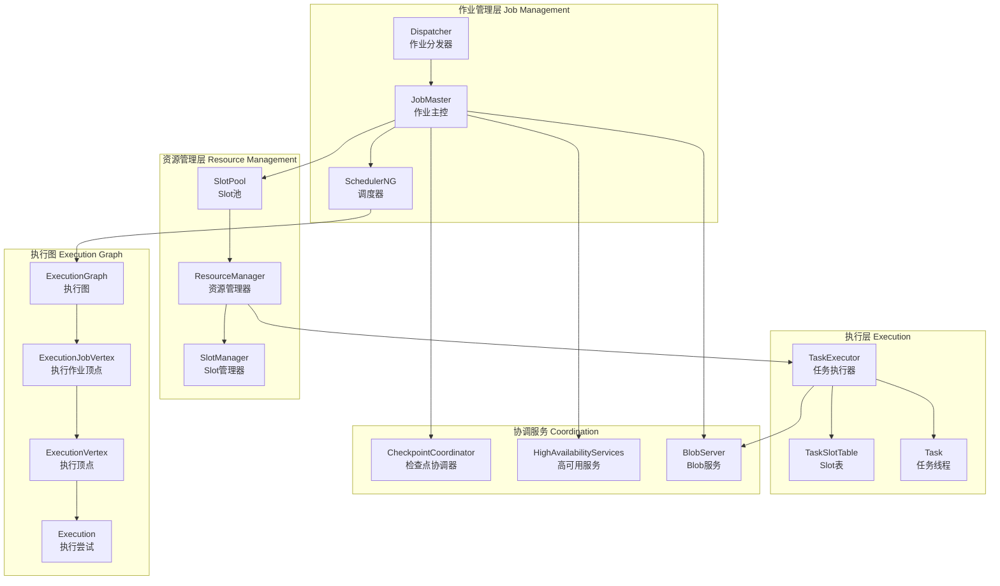

### 1.3 核心数据结构

**ExecutionGraph层次结构**：
```
ExecutionGraph (作业级别)
    ├─ ExecutionJobVertex (算子级别)
    │   ├─ ExecutionVertex (并行实例)
    │   │   ├─ Execution (执行尝试)
    │   │   │   ├─ ExecutionAttemptID
    │   │   │   ├─ ExecutionState
    │   │   │   └─ LogicalSlot
    │   │   └─ IntermediateResultPartition
    │   └─ IntermediateResult
    └─ CheckpointCoordinator
```

**资源管理结构**：
```
ResourceManager
    ├─ SlotManager
    │   ├─ TaskManagerSlot
    │   └─ PendingSlotRequest
    └─ TaskExecutor
        ├─ TaskSlotTable
        │   └─ TaskSlot
        └─ Task
```

### 1.4 模块依赖

**上游依赖**：
- `flink-core`：基础配置、文件系统、内存管理
- `flink-core-api`：类型系统、函数接口
- `flink-rpc`：RPC通信框架

**下游使用**：
- `flink-clients`：作业提交客户端
- `flink-datastream`：流处理执行引擎
- `flink-table`：Table/SQL执行

### 1.5 生命周期

**启动流程**：
1. 创建ClusterEntrypoint（Standalone/YARN/K8s）
2. 启动RPC服务和HA服务
3. 启动Dispatcher和ResourceManager
4. TaskExecutor注册到ResourceManager
5. 接受作业提交，创建JobMaster
6. JobMaster请求Slot并部署Task

**作业执行流程**：
1. JobGraph转换为ExecutionGraph
2. Scheduler计算资源需求
3. 申请Slot并分配给Execution
4. 部署TaskDeploymentDescriptor到TaskExecutor
5. Task线程执行算子逻辑
6. 报告Task状态和完成

**停止流程**：
1. 取消作业或作业完成
2. 释放Slot资源
3. 清理临时文件和状态
4. 关闭RPC服务

## 二、核心组件详解

### 2.1 Dispatcher - 作业分发器

#### 2.1.1 功能说明

Dispatcher是集群的入口组件，负责接收作业提交、创建JobMaster、提供REST API等。

**主要职责**：
- 接收REST/RPC作业提交请求
- 为每个作业创建JobMaster实例
- 管理JobMaster生命周期
- 提供作业查询和控制API
- 维护作业历史信息

#### 2.1.2 核心数据结构

```java
public abstract class Dispatcher extends FencedRpcEndpoint<DispatcherId> 
        implements DispatcherGateway {
    
    // JobGraph存储（持久化）
    private final JobGraphStore jobGraphStore;
    
    // 正在运行的JobManagerRunner
    private final Map<JobID, JobManagerRunner> jobManagerRunners;
    
    // 已提交等待终止的作业
    private final Set<JobID> submittedAndWaitingTerminationJobIDs;
    
    // 作业结果存储
    private final JobResultStore jobResultStore;
    
    // BlobServer用于存储JAR包
    private final BlobServer blobServer;
    
    // JobManagerRunner工厂
    private final JobManagerRunnerFactory jobManagerRunnerFactory;
    
    // 心跳服务
    private final HeartbeatServices heartbeatServices;
    
    // HA服务
    private final HighAvailabilityServices highAvailabilityServices;
}
```

#### 2.1.3 核心API

**API: submitJob - 提交作业**

```java
@Override
public CompletableFuture<Acknowledge> submitJob(
        JobGraph jobGraph, 
        Duration timeout) {
    
    final JobID jobId = jobGraph.getJobID();
    
    // 1. 检查作业是否已存在或已完成
    if (jobManagerRunners.containsKey(jobId)) {
        return FutureUtils.completedExceptionally(
            new JobSubmissionException(jobId, "Job already exists"));
    }
    
    // 2. 持久化JobGraph到HA存储
    try {
        jobGraphStore.putJobGraph(jobGraph);
    } catch (Exception e) {
        return FutureUtils.completedExceptionally(e);
    }
    
    // 3. 创建JobManagerRunner（内部会创建JobMaster）
    final JobManagerRunner jobManagerRunner = createJobManagerRunner(jobGraph);
    jobManagerRunners.put(jobId, jobManagerRunner);
    
    // 4. 启动JobManagerRunner
    return jobManagerRunner.start()
        .thenApply(ignored -> Acknowledge.get());
}
```

**请求结构体**：

| 字段 | 类型 | 必填 | 说明 |
|------|------|------|------|
| jobGraph | JobGraph | 是 | 作业图定义 |
| timeout | Duration | 是 | 提交超时时间 |

**响应结构体**：

| 字段 | 类型 | 说明 |
|------|------|------|
| - | Acknowledge | 提交成功确认 |

**调用链路**：

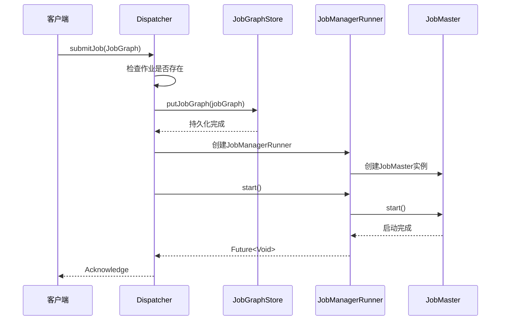

**API: requestJob - 查询作业**

```java
@Override
public CompletableFuture<ExecutionGraphInfo> requestJob(
        JobID jobId, 
        Duration timeout) {
    
    final JobManagerRunner jobManagerRunner = jobManagerRunners.get(jobId);
    
    if (jobManagerRunner == null) {
        return FutureUtils.completedExceptionally(
            new FlinkJobNotFoundException(jobId));
    }
    
    // 从JobMaster获取ExecutionGraphInfo
    final JobMasterGateway jobMasterGateway = jobManagerRunner.getJobMasterGateway();
    
    return jobMasterGateway.requestJob(timeout);
}
```

**API: cancelJob - 取消作业**

```java
@Override
public CompletableFuture<Acknowledge> cancelJob(
        JobID jobId, 
        Duration timeout) {
    
    final JobManagerRunner jobManagerRunner = jobManagerRunners.get(jobId);
    
    if (jobManagerRunner == null) {
        return FutureUtils.completedExceptionally(
            new FlinkJobNotFoundException(jobId));
    }
    
    return jobManagerRunner.cancel(timeout);
}
```

### 2.2 JobMaster - 作业主控

#### 2.2.1 功能说明

JobMaster是单个作业的主控组件，负责作业的执行、资源协调、检查点触发等。

**核心职责**：
- 管理ExecutionGraph生命周期
- 协调资源申请和释放
- 触发和协调检查点
- 接收Task状态更新
- 处理故障恢复

#### 2.2.2 核心数据结构

```java
public class JobMaster extends FencedRpcEndpoint<JobMasterId>
        implements JobMasterGateway, JobMasterService {
    
    // 执行计划（JobGraph或StreamGraph）
    private final ExecutionPlan executionPlan;
    
    // 调度器（管理ExecutionGraph）
    private final SchedulerNG schedulerNG;
    
    // Slot池服务
    private final SlotPoolService slotPoolService;
    
    // 已注册的TaskManager
    private final Map<ResourceID, TaskManagerRegistration> registeredTaskManagers;
    
    // 心跳管理器
    private HeartbeatManager<TaskExecutorToJobManagerHeartbeatPayload, AllocatedSlotReport>
            taskManagerHeartbeatManager;
            
    // Shuffle主控（管理数据交换）
    private final ShuffleMaster<?> shuffleMaster;
    
    // 分区追踪器
    private final JobMasterPartitionTracker partitionTracker;
}
```

#### 2.2.3 核心API

**API: updateTaskExecutionState - 更新Task执行状态**

```java
@Override
public CompletableFuture<Acknowledge> updateTaskExecutionState(
        TaskExecutionState taskExecutionState) {
    
    // 通过调度器更新ExecutionGraph中的Task状态
    final boolean success = schedulerNG.updateTaskExecutionState(
        new TaskExecutionStateTransition(taskExecutionState));
    
    if (success) {
        return CompletableFuture.completedFuture(Acknowledge.get());
    } else {
        return FutureUtils.completedExceptionally(
            new ExecutionGraphException("Failed to update task state"));
    }
}
```

**请求结构体 - TaskExecutionState**：

| 字段 | 类型 | 必填 | 说明 |
|------|------|------|------|
| jobID | JobID | 是 | 作业ID |
| executionAttemptID | ExecutionAttemptID | 是 | 执行尝试ID |
| executionState | ExecutionState | 是 | 执行状态（RUNNING/FINISHED/FAILED等） |
| error | Throwable | 否 | 失败时的异常信息 |
| accumulators | IOMetrics | 否 | 累加器数据 |
| taskStateSnapshot | TaskStateSnapshot | 否 | Task状态快照 |

**ExecutionState枚举值**：
- CREATED：已创建
- SCHEDULED：已调度
- DEPLOYING：部署中
- INITIALIZING：初始化中
- RUNNING：运行中
- FINISHED：已完成
- CANCELING：取消中
- CANCELED：已取消
- FAILED：已失败

**调用链路**：

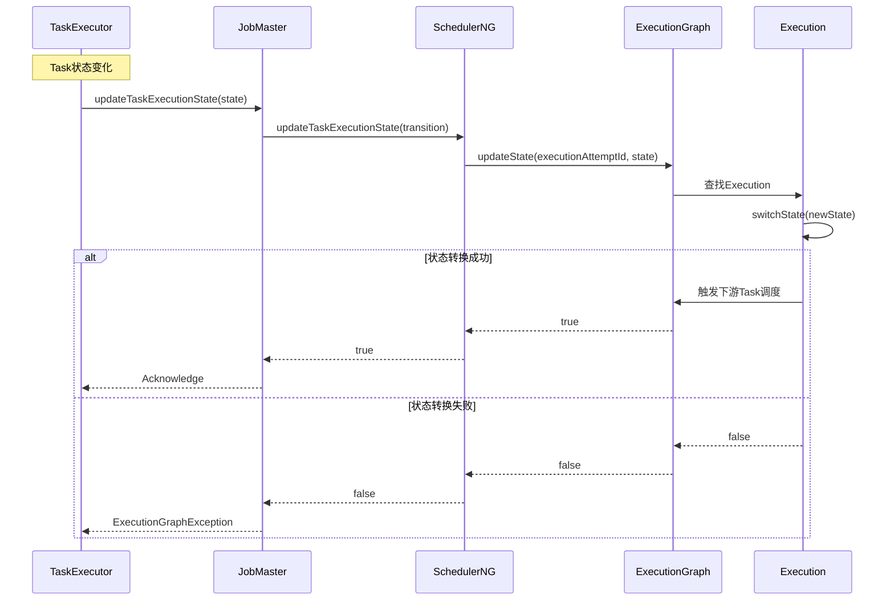

**API: offerSlots - TaskManager提供Slot**

```java
@Override
public CompletableFuture<Collection<SlotOffer>> offerSlots(
        ResourceID taskManagerId,
        Collection<SlotOffer> slots,
        Duration timeout) {
    
    // 1. 验证TaskManager已注册
    if (!registeredTaskManagers.containsKey(taskManagerId)) {
        return FutureUtils.completedExceptionally(
            new TaskManagerException("TaskManager not registered"));
    }
    
    // 2. 将Slot提供给SlotPool
    return slotPoolService.offerSlots(
        taskManagerId, 
        slots, 
        new Tuple2<>(jobInfo.getJobID(), taskManagerId));
}
```

**请求结构体 - SlotOffer**：

| 字段 | 类型 | 必填 | 说明 |
|------|------|------|------|
| allocationId | AllocationID | 是 | Slot分配ID |
| slotIndex | int | 是 | Slot索引 |
| resourceProfile | ResourceProfile | 是 | 资源配置 |

**响应结构体**：

返回被接受的SlotOffer集合。

### 2.3 SchedulerNG - 调度器

#### 2.3.1 功能说明

SchedulerNG是作业调度的核心接口，负责ExecutionGraph管理和Task调度。

**实现类型**：
- **DefaultScheduler**：默认调度器，支持Region故障恢复
- **AdaptiveScheduler**：自适应调度器，根据可用资源动态调整并行度
- **AdaptiveBatchScheduler**：批处理自适应调度器

#### 2.3.2 核心数据结构

```java
public abstract class SchedulerBase implements SchedulerNG {
    
    // JobGraph定义
    private final JobGraph jobGraph;
    
    // ExecutionGraph执行图
    private final ExecutionGraph executionGraph;
    
    // 调度拓扑
    private final SchedulingTopology schedulingTopology;
    
    // 检查点协调器
    private final CheckpointCoordinator checkpointCoordinator;
    
    // 算子协调器处理器
    protected final OperatorCoordinatorHandler operatorCoordinatorHandler;
    
    // 执行部署器
    private final ExecutionDeployer executionDeployer;
    
    // 执行图工厂
    private final ExecutionGraphFactory executionGraphFactory;
}
```

#### 2.3.3 核心API

**API: startScheduling - 开始调度**

```java
@Override
public void startScheduling() {
    // 1. 启动检查点调度器
    startCheckpointScheduler();
    
    // 2. 启动算子协调器
    operatorCoordinatorHandler.startAllOperatorCoordinators();
    
    // 3. 初始化调度策略并开始调度
    schedulingStrategy.startScheduling();
}
```

**DefaultScheduler实现**：

```java
protected void startSchedulingInternal() {
    // 注册作业状态监听器
    registerJobMetrics();
    
    // 获取需要调度的ExecutionVertex
    final Set<ExecutionVertexID> verticesToDeploy = 
        schedulingStrategy.getVerticesToDeploy();
    
    // 分配Slot并部署
    executionDeployer.allocateSlotsAndDeploy(
        verticesToDeploy.stream()
            .map(id -> executionGraph.getExecutionVertex(id).getCurrentExecutionAttempt())
            .collect(Collectors.toList()),
        Collections.emptyMap());
}
```

**调用链路**：

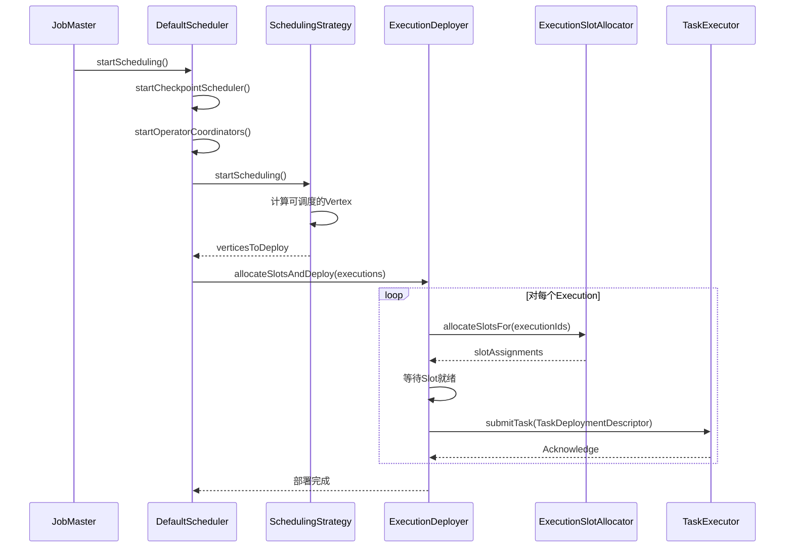

**API: updateTaskExecutionState - 更新Task状态**

```java
@Override
public boolean updateTaskExecutionState(
        TaskExecutionStateTransition taskExecutionState) {
    
    final ExecutionAttemptID attemptId = 
        taskExecutionState.getExecutionAttemptID();
    
    // 1. 更新ExecutionGraph中的状态
    final boolean updated = executionGraph.updateState(taskExecutionState);
    
    if (!updated) {
        return false;
    }
    
    final ExecutionState newState = taskExecutionState.getExecutionState();
    
    // 2. 根据新状态触发相应动作
    switch (newState) {
        case FINISHED:
            // Task完成，可能触发下游调度
            onTaskFinished(attemptId);
            break;
        case FAILED:
            // Task失败，触发故障恢复
            onTaskFailed(attemptId, taskExecutionState.getError());
            break;
        case CANCELED:
            onTaskCanceled(attemptId);
            break;
        default:
            // 其他状态仅更新，不触发动作
    }
    
    return true;
}

private void onTaskFailed(ExecutionAttemptID attemptId, Throwable error) {
    // 通过FailoverStrategy确定需要重启的Task集合
    final Set<ExecutionVertexID> verticesToRestart = 
        failoverStrategy.getTasksNeedingRestart(
            executionGraph.getExecutionVertex(attemptId).getID(), 
            error);
    
    // 重启失败的Region
    restartTasksWithDelay(verticesToRestart);
}
```

### 2.4 CheckpointCoordinator - 检查点协调器

#### 2.4.1 功能说明

CheckpointCoordinator负责协调分布式快照，触发检查点、收集确认、管理检查点生命周期。

**核心职责**：
- 周期性触发检查点
- 向Source Task发送触发消息
- 收集Task的确认消息
- 完成检查点并通知所有Task
- 管理检查点历史和清理
- 触发Savepoint

#### 2.4.2 核心数据结构

```java
public class CheckpointCoordinator {
    
    // JobID
    private final JobID job;
    
    // 默认检查点属性
    private final CheckpointProperties checkpointProperties;
    
    // Pending的检查点
    @GuardedBy("lock")
    private final Map<Long, PendingCheckpoint> pendingCheckpoints;
    
    // 已完成的检查点存储
    private final CompletedCheckpointStore completedCheckpointStore;
    
    // 检查点ID计数器
    private final CheckpointIDCounter checkpointIdCounter;
    
    // 检查点间隔
    private final long baseInterval;
    
    // 检查点超时
    private final long checkpointTimeout;
    
    // 最小暂停时间
    private final long minPauseBetweenCheckpoints;
    
    // 最大并发检查点数
    private final int maxConcurrentCheckpointAttempts;
    
    // 算子协调器
    private final Collection<OperatorCoordinatorCheckpointContext> coordinatorsToCheckpoint;
    
    // 检查点存储视图
    private final CheckpointStorageCoordinatorView checkpointStorageView;
}
```

#### 2.4.3 核心API

**API: triggerCheckpoint - 触发检查点**

```java
public CompletableFuture<CompletedCheckpoint> triggerCheckpoint(boolean isPeriodic) {
    
    CheckpointTriggerRequest request = new CheckpointTriggerRequest(
        checkpointProperties, null, isPeriodic);
    
    // 选择要执行的请求（去重并发请求）
    chooseRequestToExecute(request).ifPresent(this::startTriggeringCheckpoint);
    
    return request.onCompletionPromise;
}

private void startTriggeringCheckpoint(CheckpointTriggerRequest request) {
    synchronized (lock) {
        // 1. 前置检查（是否允许触发）
        preCheckGlobalState(request.isPeriodic);
        
        // 2. 计算检查点计划（哪些Task需要参与）
        CompletableFuture<CheckpointPlan> checkpointPlanFuture =
            checkpointPlanCalculator.calculateCheckpointPlan();
        
        // 3. 初始化检查点位置
        final long timestamp = System.currentTimeMillis();
        final long checkpointID = checkpointIdCounter.getAndIncrement();
        
        CompletableFuture<CheckpointStorageLocation> locationFuture =
            initializeCheckpointLocation(checkpointID, request.props, request.externalSavepointLocation);
        
        // 4. 触发MasterHooks
        CompletableFuture<Void> masterHooksFuture = 
            triggerMasterHooks(checkpointID, timestamp);
        
        // 5. 触发OperatorCoordinators
        CompletableFuture<Void> coordinatorCheckpointFuture =
            triggerOperatorCoordinators(checkpointID, timestamp);
        
        // 6. 创建PendingCheckpoint
        checkpointPlanFuture
            .thenCombine(locationFuture, (plan, location) -> {
                PendingCheckpoint checkpoint = new PendingCheckpoint(
                    job, checkpointID, timestamp, plan, location, 
                    request.props, onCompletionPromise);
                pendingCheckpoints.put(checkpointID, checkpoint);
                return checkpoint;
            })
            // 7. 等待Coordinators完成
            .thenCombine(coordinatorCheckpointFuture, (checkpoint, ignored) -> checkpoint)
            .thenCombine(masterHooksFuture, (checkpoint, ignored) -> checkpoint)
            // 8. 向Task发送触发消息
            .thenCompose(checkpoint -> 
                triggerTasks(request, timestamp, checkpoint)
                    .thenApply(ignored -> checkpoint))
            // 9. 设置超时
            .whenComplete((checkpoint, error) -> {
                if (error == null) {
                    scheduleCheckpointTimeout(checkpoint);
                } else {
                    abortPendingCheckpoint(checkpointID, error);
                }
            });
    }
}

private CompletableFuture<Void> triggerTasks(
        CheckpointTriggerRequest request,
        long timestamp,
        PendingCheckpoint checkpoint) {
    
    final long checkpointId = checkpoint.getCheckpointID();
    final CheckpointOptions checkpointOptions = 
        CheckpointOptions.forConfig(
            request.props.getCheckpointType(),
            checkpoint.getCheckpointStorageLocation().getLocationReference(),
            isExactlyOnceMode,
            unalignedCheckpointsEnabled,
            alignedCheckpointTimeout);
    
    // 向所有需要触发的Task发送消息
    List<CompletableFuture<Acknowledge>> acks = new ArrayList<>();
    for (Execution execution : checkpoint.getCheckpointPlan().getTasksToTrigger()) {
        acks.add(execution.triggerCheckpoint(checkpointId, timestamp, checkpointOptions));
    }
    
    return FutureUtils.waitForAll(acks);
}
```

**请求结构体**：

无显式请求参数，通过配置控制。

**响应结构体**：

返回`CompletableFuture<CompletedCheckpoint>`，包含完成的检查点信息。

**调用链路**：

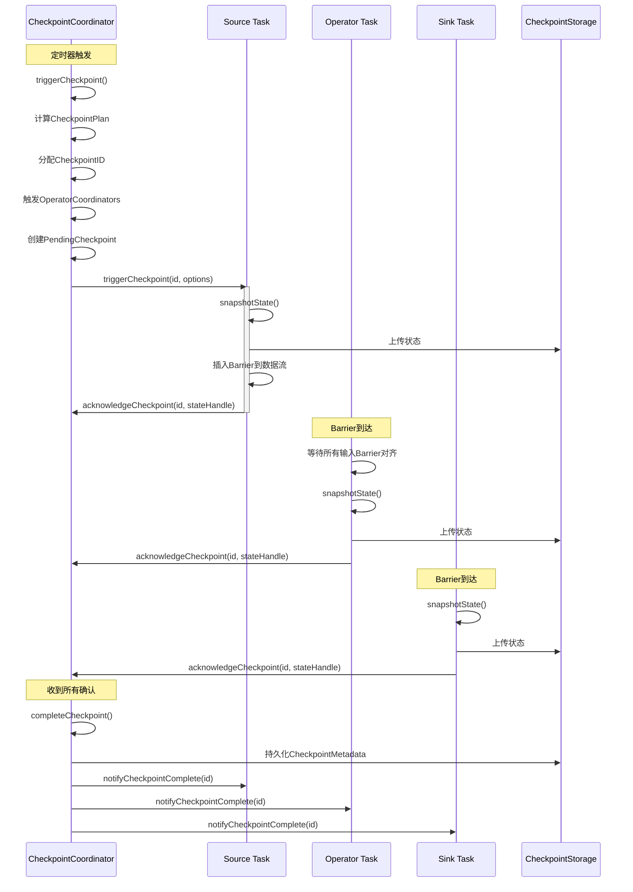

**API: acknowledgeCheckpoint - 确认检查点**

```java
public boolean acknowledgeCheckpoint(
        JobID jobID,
        ExecutionAttemptID executionAttemptID,
        long checkpointId,
        CheckpointMetrics metrics,
        TaskStateSnapshot subtaskState) {
    
    synchronized (lock) {
        // 1. 查找PendingCheckpoint
        PendingCheckpoint checkpoint = pendingCheckpoints.get(checkpointId);
        if (checkpoint == null) {
            // 检查点已超时或已完成
            return false;
        }
        
        // 2. 确认Task的检查点
        AcknowledgeCheckpoint ackMessage = new AcknowledgeCheckpoint(
            jobID, executionAttemptID, checkpointId, metrics, subtaskState);
        
        boolean acknowledged = checkpoint.acknowledgeTask(
            executionAttemptID, subtaskState, metrics);
        
        if (!acknowledged) {
            return false;
        }
        
        // 3. 检查是否所有Task都已确认
        if (checkpoint.areTasksFullyAcknowledged()) {
            completePendingCheckpoint(checkpoint);
        }
        
        return true;
    }
}

private void completePendingCheckpoint(PendingCheckpoint pendingCheckpoint) {
    final long checkpointId = pendingCheckpoint.getCheckpointID();
    
    // 1. 完成算子协调器的检查点
    List<OperatorState> operatorStates = new ArrayList<>();
    for (OperatorCoordinatorCheckpointContext coordinator : coordinatorsToCheckpoint) {
        operatorStates.add(coordinator.getOperatorState(checkpointId));
    }
    
    // 2. 完成MasterHooks
    finalizeMasterHooks(checkpointId);
    
    // 3. 创建CompletedCheckpoint
    CompletedCheckpoint completedCheckpoint = pendingCheckpoint.finalizeCheckpoint(
        checkpointsCleaner, operatorStates, checkpointStorageView);
    
    // 4. 持久化到CompletedCheckpointStore
    completedCheckpointStore.addCheckpointAndSubsumeOldestOne(
        completedCheckpoint, checkpointsCleaner, this::scheduleTriggerRequest);
    
    // 5. 从pendingCheckpoints移除
    pendingCheckpoints.remove(checkpointId);
    
    // 6. 通知所有Task检查点完成
    sendAcknowledgeMessages(
        pendingCheckpoint.getCheckpointPlan().getTasksToCommit(),
        checkpointId,
        completedCheckpoint.getTimestamp(),
        previousCheckpointId);
}
```

### 2.5 TaskExecutor - 任务执行器

#### 2.5.1 功能说明

TaskExecutor是TaskManager的核心组件，负责Task的实际执行。

**核心职责**：
- Slot管理（分配、释放）
- Task线程管理和执行
- 与JobMaster通信（心跳、状态报告）
- 与ResourceManager通信（注册、心跳）
- 网络数据交换
- 状态管理和快照

#### 2.5.2 核心数据结构

```java
public class TaskExecutor extends RpcEndpoint implements TaskExecutorGateway {
    
    // TaskManager服务
    private final TaskManagerServices taskExecutorServices;
    
    // Slot表
    private final TaskSlotTable<Task> taskSlotTable;
    
    // Job表
    private final JobTable jobTable;
    
    // Job Leader服务（追踪JobMaster）
    private final JobLeaderService jobLeaderService;
    
    // 资源管理器连接
    @Nullable private ResourceManagerAddress resourceManagerAddress;
    @Nullable private EstablishedResourceManagerConnection establishedResourceManagerConnection;
    
    // 硬件描述
    private final HardwareDescription hardwareDescription;
    
    // 内存配置
    private final TaskExecutorMemoryConfiguration memoryConfiguration;
    
    // 网络环境（数据交换）
    private final ShuffleEnvironment<?, ?> shuffleEnvironment;
    
    // 状态管理器
    private final TaskExecutorLocalStateStoresManager localStateStoresManager;
    
    // Blob服务
    private final TaskExecutorBlobService taskExecutorBlobService;
}
```

#### 2.5.3 核心API

**API: submitTask - 提交任务**

```java
@Override
public CompletableFuture<Acknowledge> submitTask(
        TaskDeploymentDescriptor tdd,
        JobMasterId jobMasterId,
        Duration timeout) {
    
    try {
        final JobID jobId = tdd.getJobId();
        final ExecutionAttemptID executionAttemptId = tdd.getExecutionAttemptId();
        
        // 1. 检查Job是否已连接
        final JobTable.Connection jobManagerConnection = jobTable.getConnection(jobId);
        if (jobManagerConnection == null) {
            return FutureUtils.completedExceptionally(
                new TaskSubmissionException("Job not connected"));
        }
        
        // 2. 获取Slot
        final TaskSlot<Task> taskSlot = taskSlotTable.getTaskSlot(tdd.getAllocationId());
        if (taskSlot == null) {
            return FutureUtils.completedExceptionally(
                new TaskSubmissionException("Slot not found"));
        }
        
        // 3. 检查Slot是否Active
        if (!taskSlot.isActive(jobId)) {
            return FutureUtils.completedExceptionally(
                new TaskSubmissionException("Slot not active"));
        }
        
        // 4. 创建Task对象
        Task task = new Task(
            jobInfo,
            taskInfo,
            executionAttemptId,
            tdd.getAllocationId(),
            tdd.getProducedPartitions(),
            tdd.getInputGates(),
            taskStateManager,
            taskManagerActions,
            /* 其他参数 */);
        
        // 5. 添加Task到Slot
        if (taskSlot.add(task)) {
            // 6. 启动Task执行
            task.startTaskThread();
            
            return CompletableFuture.completedFuture(Acknowledge.get());
        } else {
            return FutureUtils.completedExceptionally(
                new TaskSubmissionException("Failed to add task to slot"));
        }
        
    } catch (Exception e) {
        return FutureUtils.completedExceptionally(e);
    }
}
```

**请求结构体 - TaskDeploymentDescriptor**：

| 字段 | 类型 | 必填 | 说明 |
|------|------|------|------|
| jobId | JobID | 是 | 作业ID |
| executionAttemptId | ExecutionAttemptID | 是 | 执行尝试ID |
| allocationId | AllocationID | 是 | Slot分配ID |
| jobInformation | SerializedValue<JobInformation> | 是 | 作业信息 |
| taskInformation | SerializedValue<TaskInformation> | 是 | Task信息 |
| producedPartitions | Collection<ResultPartitionDeploymentDescriptor> | 是 | 输出分区 |
| inputGates | Collection<InputGateDeploymentDescriptor> | 是 | 输入门 |
| taskStateHandles | JobManagerTaskRestore | 否 | 恢复的状态 |

**调用链路**：

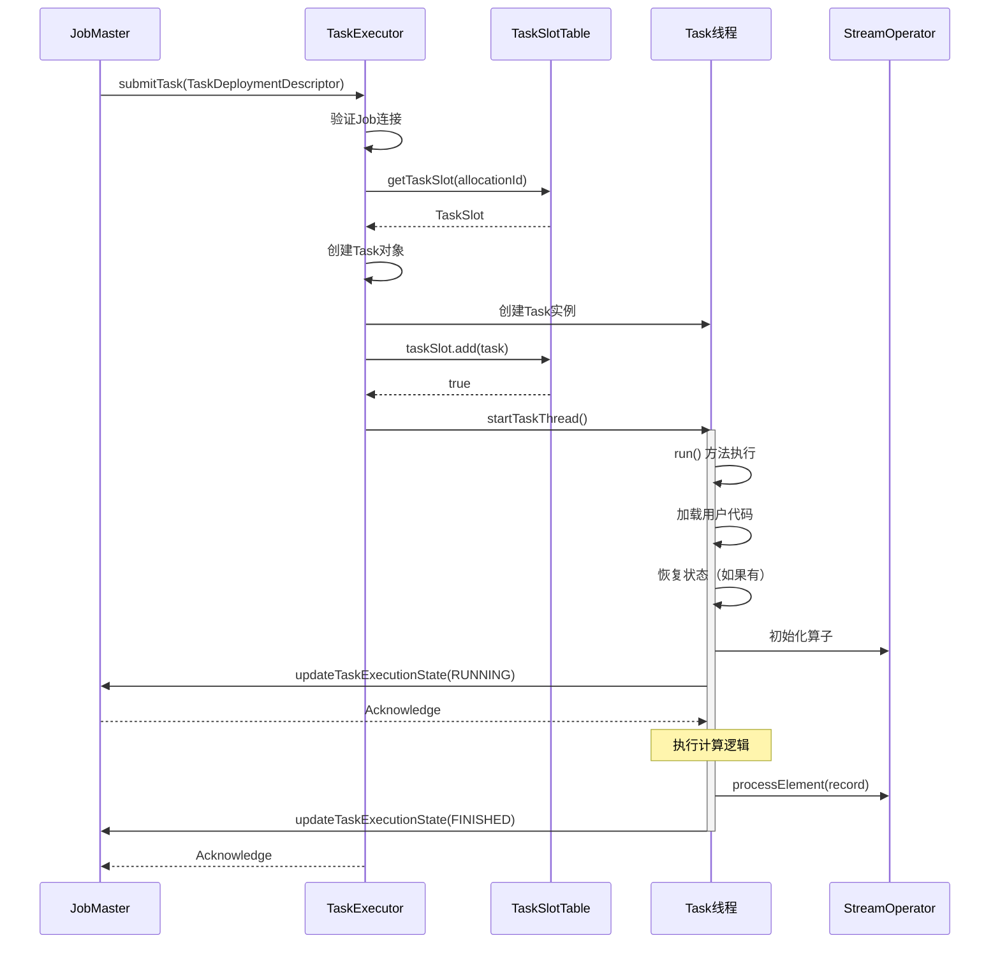

**API: triggerCheckpoint - 触发检查点**

```java
@Override
public CompletableFuture<Acknowledge> triggerCheckpoint(
        ExecutionAttemptID executionAttemptID,
        long checkpointId,
        long checkpointTimestamp,
        CheckpointOptions checkpointOptions) {
    
    // 查找Task
    final Task task = taskSlotTable.getTask(executionAttemptID);
    
    if (task == null) {
        return FutureUtils.completedExceptionally(
            new TaskNotFoundException(executionAttemptID));
    }
    
    // 委托给Task处理
    task.triggerCheckpointBarrier(checkpointId, checkpointTimestamp, checkpointOptions);
    
    return CompletableFuture.completedFuture(Acknowledge.get());
}
```

### 2.6 ResourceManager - 资源管理器

#### 2.6.1 功能说明

ResourceManager负责集群资源的管理和分配。

**核心职责**：
- TaskManager注册和注销
- Slot资源分配
- 与外部资源管理器（YARN/K8s）交互
- TaskManager心跳监控

#### 2.6.2 核心API

**API: requestSlot - 请求Slot**

```java
@Override
public CompletableFuture<Void> requestSlot(
        JobMasterId jobMasterId,
        SlotRequest slotRequest,
        Duration timeout) {
    
    final JobID jobId = slotRequest.getJobId();
    final AllocationID allocationId = slotRequest.getAllocationId();
    
    // 将请求交给SlotManager处理
    slotManager.registerSlotRequest(slotRequest);
    
    return CompletableFuture.completedFuture(null);
}
```

## 三、数据结构详解

### 3.1 ExecutionGraph类图

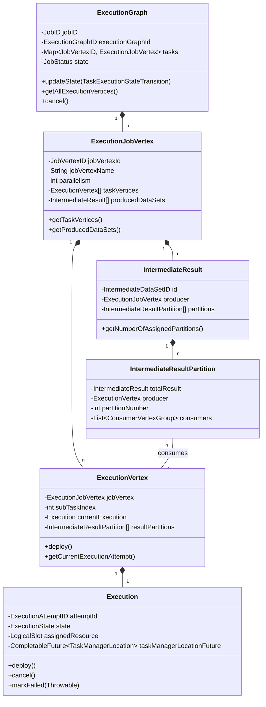

### 3.2 检查点数据结构

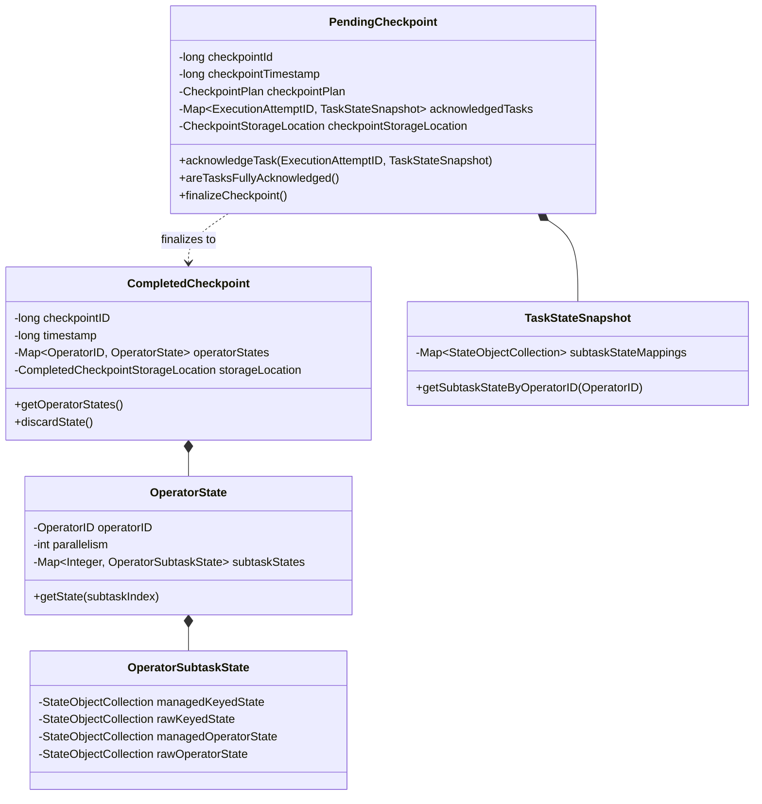

### 3.3 Slot管理数据结构

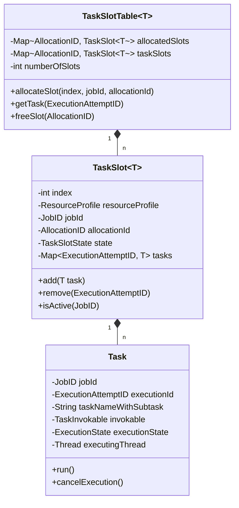

## 四、关键流程时序图

### 4.1 作业提交与部署

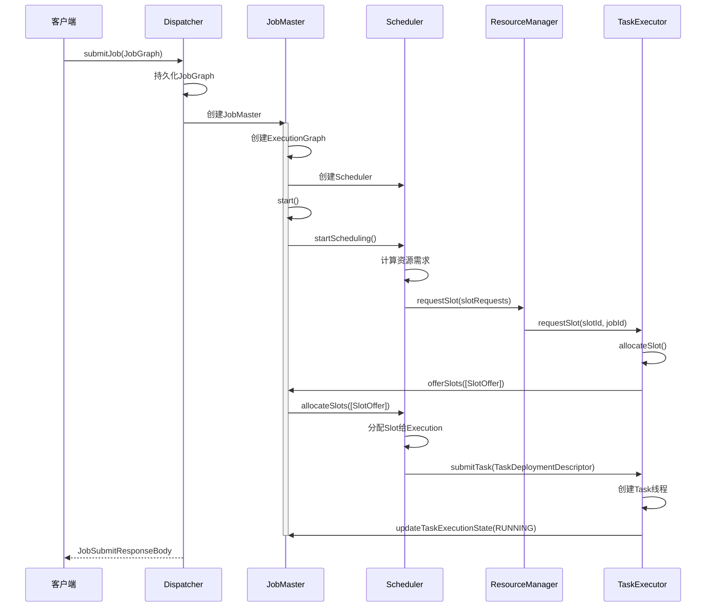

### 4.2 Task执行流程

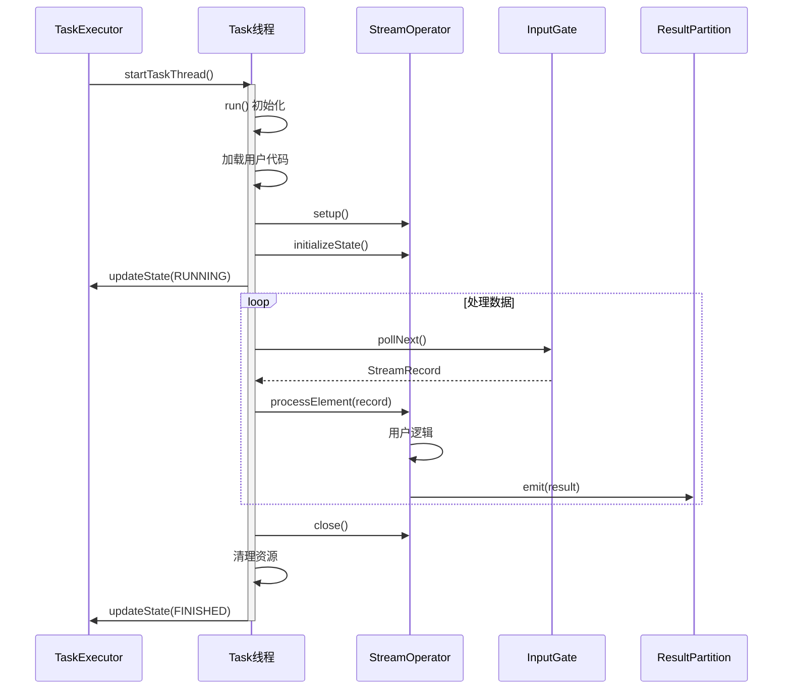

### 4.3 故障恢复流程

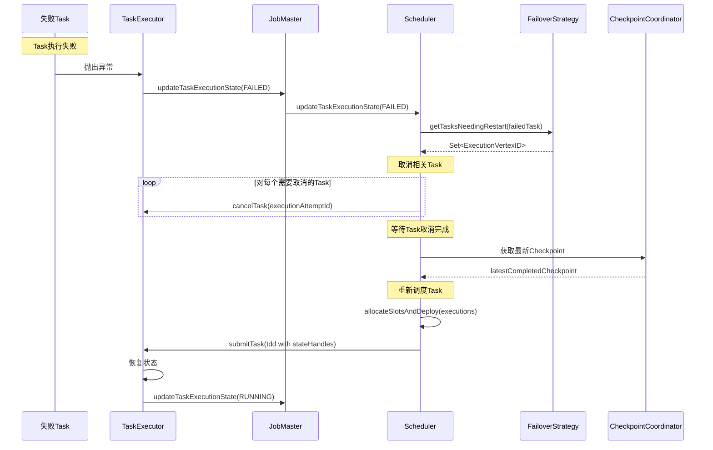

## 五、实战示例与最佳实践

### 5.1 配置检查点

```java
// 启用检查点，间隔60秒
StreamExecutionEnvironment env = StreamExecutionEnvironment.getExecutionEnvironment();
env.enableCheckpointing(60000);

// 配置检查点模式
CheckpointConfig config = env.getCheckpointConfig();
config.setCheckpointingMode(CheckpointingMode.EXACTLY_ONCE);

// 配置检查点超时
config.setCheckpointTimeout(10 * 60 * 1000); // 10分钟

// 配置最小间隔
config.setMinPauseBetweenCheckpoints(10000); // 10秒

// 配置最大并发检查点数
config.setMaxConcurrentCheckpoints(1);

// 外部化检查点（作业取消后保留）
config.setExternalizedCheckpointCleanup(
    ExternalizedCheckpointCleanup.RETAIN_ON_CANCELLATION);

// 允许未对齐检查点
config.enableUnalignedCheckpoints(true);
config.setAlignedCheckpointTimeout(Duration.ofSeconds(30));

// 配置状态后端
env.setStateBackend(new HashMapStateBackend());
config.setCheckpointStorage("hdfs:///flink/checkpoints");
```

### 5.2 配置故障恢复

```java
// 配置重启策略 - 固定延迟
Configuration conf = new Configuration();
conf.set(RestartStrategyOptions.RESTART_STRATEGY, "fixed-delay");
conf.set(RestartStrategyOptions.RESTART_STRATEGY_FIXED_DELAY_ATTEMPTS, 3);
conf.set(RestartStrategyOptions.RESTART_STRATEGY_FIXED_DELAY_DELAY, Duration.ofSeconds(10));

// 或使用失败率策略
conf.set(RestartStrategyOptions.RESTART_STRATEGY, "failure-rate");
conf.set(RestartStrategyOptions.RESTART_STRATEGY_FAILURE_RATE_MAX_FAILURES_PER_INTERVAL, 3);
conf.set(RestartStrategyOptions.RESTART_STRATEGY_FAILURE_RATE_FAILURE_RATE_INTERVAL, Duration.ofMinutes(5));
conf.set(RestartStrategyOptions.RESTART_STRATEGY_FAILURE_RATE_DELAY, Duration.ofSeconds(10));

// 配置故障恢复策略
conf.set(JobManagerOptions.EXECUTION_FAILOVER_STRATEGY, "region"); // 或"full"
```

### 5.3 配置资源管理

```java
Configuration conf = new Configuration();

// TaskManager配置
conf.set(TaskManagerOptions.TOTAL_PROCESS_MEMORY, MemorySize.parse("4g"));
conf.set(TaskManagerOptions.NUM_TASK_SLOTS, 4);

// 网络配置
conf.set(TaskManagerOptions.NETWORK_MEMORY_FRACTION, 0.1f);
conf.set(TaskManagerOptions.NETWORK_MEMORY_MIN, MemorySize.parse("64mb"));
conf.set(TaskManagerOptions.NETWORK_MEMORY_MAX, MemorySize.parse("1gb"));

// 配置Slot共享
// 默认所有算子共享Slot，也可以通过slotSharingGroup隔离
DataStream<String> stream = env.addSource(new MySource())
    .slotSharingGroup("source-group")
    .map(new MyMapper())
    .slotSharingGroup("default")
    .addSink(new MySink())
    .slotSharingGroup("sink-group");
```

### 5.4 监控与调优

**关键指标监控**：

1. **检查点指标**：
   - `checkpointDuration`：检查点耗时
   - `checkpointSize`：检查点大小
   - `checkpointAlignmentTime`：Barrier对齐时间
   - `numberOfFailedCheckpoints`：失败的检查点数

2. **Task指标**：
   - `numRecordsIn/Out`：输入输出记录数
   - `busyTime`：繁忙时间
   - `backPressuredTime`：背压时间
   - `idleTime`：空闲时间

3. **资源指标**：
   - `cpuUsage`：CPU使用率
   - `heapMemoryUsed`：堆内存使用
   - `managedMemoryUsed`：托管内存使用
   - `networkInputBytes/OutputBytes`：网络I/O

**调优建议**：

1. **检查点优化**：
   - 增大检查点间隔减少开销
   - 使用增量检查点（RocksDB）
   - 启用异步快照
   - 调整并发检查点数

2. **资源优化**：
   - 合理配置并行度（CPU核心数的1-2倍）
   - 启用Slot共享减少资源消耗
   - 配置适当的内存大小
   - 调整网络缓冲区大小

3. **性能优化**：
   - 启用Operator Chain减少序列化
   - 使用对象复用（enableObjectReuse）
   - 避免使用Kryo序列化器
   - 优化状态访问模式

## 六、总结

`flink-runtime`模块是Flink的核心，实现了作业调度、资源管理、任务执行和容错机制。关键设计包括：

**架构设计**：
- 分层架构：作业管理层、资源管理层、执行层
- Master-Worker模式：JobMaster协调，TaskExecutor执行
- 插件化：支持多种调度器、资源管理器

**核心机制**：
- ExecutionGraph：作业的执行表示，管理Task状态和依赖
- Slot管理：细粒度资源分配和隔离
- 检查点：基于Barrier的分布式快照
- 故障恢复：Region级别的局部重启

**性能优化**：
- 异步RPC通信
- 零拷贝网络传输
- Credit-based背压机制
- Off-Heap内存管理

理解`flink-runtime`模块对于掌握Flink的运行机制、性能调优和故障排查至关重要。

