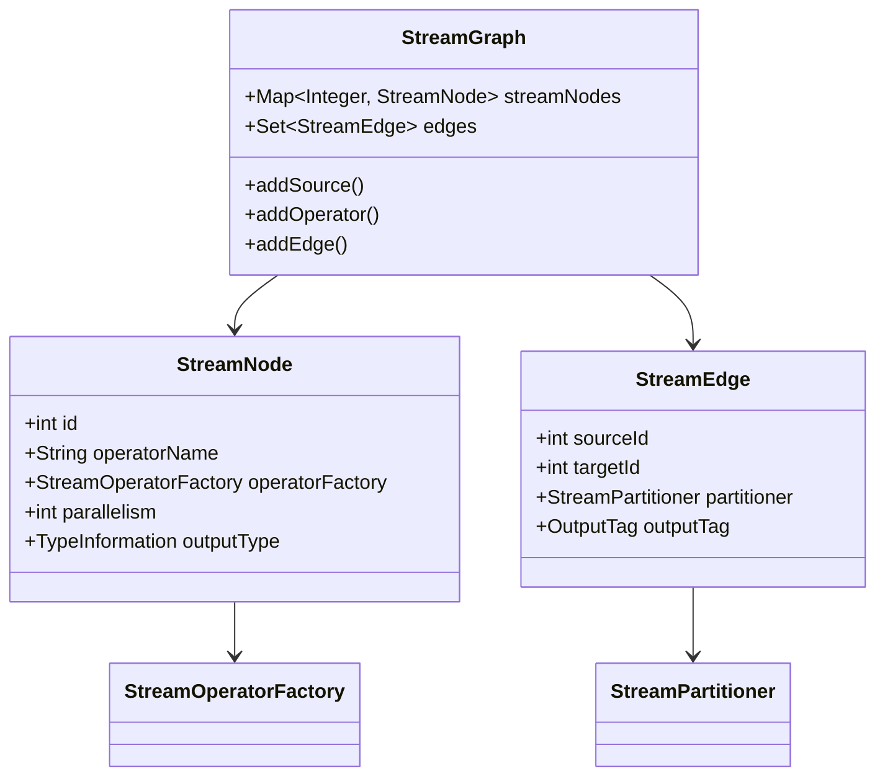

# Flink-04-DataStream API编程指南（flink-streaming-java）

## 一、模块概览

### 1.1 模块职责

DataStream API是Flink流处理的核心用户API，提供高级抽象来构建流式数据处理应用。

**核心职责**：
- 提供流式数据处理抽象（DataStream、KeyedStream）
- 支持丰富的转换操作（map、filter、window等）
- 管理执行环境和作业配置
- 生成StreamGraph（作业拓扑）
- 支持事件时间和处理时间语义

### 1.2 DataStream API架构

```mermaid
flowchart TB
    subgraph "执行环境层"
        Env[StreamExecutionEnvironment]
        LocalEnv[LocalStreamEnvironment]
        RemoteEnv[RemoteStreamEnvironment]
    end
    
    subgraph "数据流抽象层"
        DataStream[DataStream]
        SingleOutput[SingleOutputStreamOperator]
        KeyedStream[KeyedStream]
        WindowedStream[WindowedStream]
        ConnectedStream[ConnectedStreams]
        BroadcastStream[BroadcastStream]
    end
    
    subgraph "转换操作层"
        Transformation[Transformation]
        SourceTransformation[SourceTransformation]
        OneInputTransformation[OneInputTransformation]
        TwoInputTransformation[TwoInputTransformation]
        PartitionTransformation[PartitionTransformation]
    end
    
    subgraph "图生成层"
        StreamGraphGenerator[StreamGraphGenerator]
        StreamGraph[StreamGraph]
        StreamNode[StreamNode]
        StreamEdge[StreamEdge]
    end
    
    Env --> LocalEnv
    Env --> RemoteEnv
    
    Env --> DataStream
    DataStream --> SingleOutput
    DataStream --> KeyedStream
    KeyedStream --> WindowedStream
    DataStream --> ConnectedStream
    DataStream --> BroadcastStream
    
    DataStream -->|内部持有| Transformation
    Transformation --> SourceTransformation
    Transformation --> OneInputTransformation
    Transformation --> TwoInputTransformation
    Transformation --> PartitionTransformation
    
    Env -->|execute()| StreamGraphGenerator
    StreamGraphGenerator --> StreamGraph
    StreamGraph --> StreamNode
    StreamGraph --> StreamEdge
```

## 二、StreamExecutionEnvironment - 执行环境

### 2.1 功能说明

StreamExecutionEnvironment是流处理程序的入口，负责：
- 创建数据源（Source）
- 配置执行参数（并行度、检查点等）
- 管理Transformation链
- 触发作业执行

### 2.2 核心API

#### 2.2.1 创建执行环境

```java
public class StreamExecutionEnvironment {
    
    /**
     * 创建执行环境（自动检测运行环境）
     */
    public static StreamExecutionEnvironment getExecutionEnvironment() {
        return getExecutionEnvironment(new Configuration());
    }
    
    /**
     * 创建本地执行环境
     * @param parallelism 并行度
     */
    public static LocalStreamEnvironment createLocalEnvironment(int parallelism) {
        Configuration configuration = new Configuration();
        return createLocalEnvironment(parallelism, configuration);
    }
    
    /**
     * 创建远程执行环境
     * @param host JobManager主机
     * @param port JobManager端口
     * @param jarFiles 用户JAR文件
     */
    public static StreamExecutionEnvironment createRemoteEnvironment(
            String host, int port, String... jarFiles) {
        return new RemoteStreamEnvironment(host, port, null, jarFiles);
    }
}
```

**使用示例**：

```java
// 1. 自动检测环境（推荐）
StreamExecutionEnvironment env = StreamExecutionEnvironment.getExecutionEnvironment();

// 2. 本地环境（开发测试）
StreamExecutionEnvironment env = 
    StreamExecutionEnvironment.createLocalEnvironment(4);

// 3. 远程环境（显式指定集群）
StreamExecutionEnvironment env = 
    StreamExecutionEnvironment.createRemoteEnvironment(
        "localhost", 8081, "/path/to/my.jar");
```

#### 2.2.2 配置执行参数

```java
public class StreamExecutionEnvironment {
    
    // 设置全局并行度
    public StreamExecutionEnvironment setParallelism(int parallelism);
    
    // 设置最大并行度（状态KeyGroup数量）
    public StreamExecutionEnvironment setMaxParallelism(int maxParallelism);
    
    // 设置缓冲超时时间（毫秒）
    public StreamExecutionEnvironment setBufferTimeout(long timeoutMillis);
    
    // 启用检查点
    public StreamExecutionEnvironment enableCheckpointing(long interval);
    
    // 设置重启策略
    public void setRestartStrategy(RestartStrategies.RestartStrategyConfiguration strategy);
    
    // 设置状态后端
    public void setStateBackend(StateBackend backend);
}
```

**配置示例**：

```java
StreamExecutionEnvironment env = StreamExecutionEnvironment.getExecutionEnvironment();

// 并行度配置
env.setParallelism(4);
env.setMaxParallelism(128);

// 检查点配置
env.enableCheckpointing(60000); // 60秒
CheckpointConfig config = env.getCheckpointConfig();
config.setCheckpointingMode(CheckpointingMode.EXACTLY_ONCE);
config.setMinPauseBetweenCheckpoints(30000);
config.setCheckpointTimeout(600000);

// 重启策略
env.setRestartStrategy(
    RestartStrategies.fixedDelayRestart(
        3,  // 重启次数
        Time.seconds(10)  // 重启间隔
    )
);

// 状态后端
env.setStateBackend(new EmbeddedRocksDBStateBackend());
env.getCheckpointConfig().setCheckpointStorage("hdfs:///checkpoints");
```

#### 2.2.3 创建数据源

```java
public class StreamExecutionEnvironment {
    
    /**
     * 从集合创建数据流
     */
    public <OUT> DataStreamSource<OUT> fromCollection(Collection<OUT> data);
    
    /**
     * 从元素创建数据流
     */
    public <OUT> DataStreamSource<OUT> fromElements(OUT... data);
    
    /**
     * 从Source创建数据流（新API）
     */
    public <OUT> DataStreamSource<OUT> fromSource(
        Source<OUT, ?, ?> source,
        WatermarkStrategy<OUT> timestampsAndWatermarks,
        String sourceName);
    
    /**
     * 从SourceFunction创建数据流（旧API）
     */
    public <OUT> DataStreamSource<OUT> addSource(SourceFunction<OUT> function);
    
    /**
     * 从文件创建数据流
     */
    public DataStreamSource<String> readTextFile(String filePath);
    
    /**
     * 从Socket创建数据流
     */
    public DataStreamSource<String> socketTextStream(String hostname, int port);
}
```

**数据源示例**：

```java
// 1. 从集合
List<Integer> numbers = Arrays.asList(1, 2, 3, 4, 5);
DataStream<Integer> stream = env.fromCollection(numbers);

// 2. 从元素
DataStream<String> stream = env.fromElements("hello", "world");

// 3. 从Source（推荐）
DataStream<String> kafkaStream = env.fromSource(
    KafkaSource.<String>builder()
        .setBootstrapServers("localhost:9092")
        .setTopics("my-topic")
        .setGroupId("my-group")
        .setValueOnlyDeserializer(new SimpleStringSchema())
        .build(),
    WatermarkStrategy.noWatermarks(),
    "Kafka Source"
);

// 4. 从文件
DataStream<String> fileStream = env.readTextFile("input.txt");

// 5. 从Socket（测试用）
DataStream<String> socketStream = env.socketTextStream("localhost", 9999);

// 6. 自定义SourceFunction
DataStream<Long> customStream = env.addSource(new SourceFunction<Long>() {
    private volatile boolean isRunning = true;
    private long count = 0;
    
    @Override
    public void run(SourceContext<Long> ctx) throws Exception {
        while (isRunning) {
            ctx.collect(count++);
            Thread.sleep(1000);
        }
    }
    
    @Override
    public void cancel() {
        isRunning = false;
    }
});
```

#### 2.2.4 执行作业

```java
public class StreamExecutionEnvironment {
    
    /**
     * 同步执行（阻塞直到作业完成）
     */
    public JobExecutionResult execute(String jobName) throws Exception;
    
    /**
     * 异步执行（立即返回JobClient）
     */
    public JobClient executeAsync(String jobName) throws Exception;
    
    /**
     * 执行StreamGraph
     */
    public JobClient executeAsync(StreamGraph streamGraph) throws Exception;
}
```

**执行示例**：

```java
// 1. 同步执行（适合批处理）
JobExecutionResult result = env.execute("My Job");
System.out.println("Job took " + result.getNetRuntime() + " ms");

// 2. 异步执行（适合流处理）
JobClient jobClient = env.executeAsync("My Streaming Job");
System.out.println("Job submitted with ID: " + jobClient.getJobID());

// 监控作业状态
jobClient.getJobStatus().thenAccept(status -> {
    System.out.println("Job status: " + status);
});
```

## 三、DataStream - 数据流抽象

### 3.1 DataStream基类

```java
public class DataStream<T> {
    
    protected final StreamExecutionEnvironment environment;
    protected final Transformation<T> transformation;
    
    /**
     * 获取类型信息
     */
    public TypeInformation<T> getType();
    
    /**
     * 获取执行环境
     */
    public StreamExecutionEnvironment getExecutionEnvironment();
    
    /**
     * 设置并行度
     */
    public DataStream<T> setParallelism(int parallelism);
    
    /**
     * 设置最大并行度
     */
    public DataStream<T> setMaxParallelism(int maxParallelism);
}
```

### 3.2 基础转换操作

#### 3.2.1 map - 一对一转换

```java
public class DataStream<T> {
    
    /**
     * Map转换
     */
    public <R> SingleOutputStreamOperator<R> map(MapFunction<T, R> mapper);
}
```

**使用示例**：

```java
// Lambda方式
DataStream<String> input = env.fromElements("1", "2", "3");
DataStream<Integer> output = input.map(Integer::parseInt);

// 实现类方式
DataStream<User> users = events.map(new MapFunction<Event, User>() {
    @Override
    public User map(Event event) {
        return new User(event.getUserId(), event.getUserName());
    }
});

// RichMapFunction（需要访问运行时上下文）
DataStream<String> enriched = events.map(new RichMapFunction<Event, String>() {
    
    private transient ValueState<Long> countState;
    
    @Override
    public void open(Configuration parameters) {
        ValueStateDescriptor<Long> descriptor = 
            new ValueStateDescriptor<>("count", Long.class, 0L);
        countState = getRuntimeContext().getState(descriptor);
    }
    
    @Override
    public String map(Event event) throws Exception {
        Long count = countState.value();
        count++;
        countState.update(count);
        return event.toString() + ", count=" + count;
    }
});
```

#### 3.2.2 flatMap - 一对多转换

```java
public class DataStream<T> {
    
    /**
     * FlatMap转换
     */
    public <R> SingleOutputStreamOperator<R> flatMap(FlatMapFunction<T, R> flatMapper);
}
```

**使用示例**：

```java
// 分词
DataStream<String> sentences = env.fromElements(
    "hello world", 
    "flink streaming"
);

DataStream<String> words = sentences.flatMap(
    (String sentence, Collector<String> out) -> {
        for (String word : sentence.split(" ")) {
            out.collect(word);
        }
    }
).returns(Types.STRING);

// 过滤并转换
DataStream<Event> events = ...;
DataStream<Alert> alerts = events.flatMap(
    new FlatMapFunction<Event, Alert>() {
        @Override
        public void flatMap(Event event, Collector<Alert> out) {
            if (event.isAnomaly()) {
                out.collect(new Alert(event, "Anomaly detected"));
            }
        }
    }
);
```

#### 3.2.3 filter - 过滤

```java
public class DataStream<T> {
    
    /**
     * Filter转换
     */
    public SingleOutputStreamOperator<T> filter(FilterFunction<T> filter);
}
```

**使用示例**：

```java
// 简单过滤
DataStream<Integer> numbers = env.fromElements(1, 2, 3, 4, 5);
DataStream<Integer> evenNumbers = numbers.filter(n -> n % 2 == 0);

// 复杂过滤
DataStream<Event> events = ...;
DataStream<Event> importantEvents = events.filter(
    new FilterFunction<Event>() {
        @Override
        public boolean filter(Event event) {
            return event.getPriority() >= 5 && 
                   event.getType().equals("CRITICAL");
        }
    }
);
```

#### 3.2.4 keyBy - 分区

```java
public class DataStream<T> {
    
    /**
     * KeyBy转换（返回KeyedStream）
     */
    public <K> KeyedStream<T, K> keyBy(KeySelector<T, K> key);
    
    /**
     * KeyBy字段名（仅支持POJO和Tuple）
     */
    public KeyedStream<T, Tuple> keyBy(String... fields);
}
```

**使用示例**：

```java
// 按字段keyBy
DataStream<Event> events = ...;
KeyedStream<Event, String> keyedByUser = events.keyBy(Event::getUserId);

// 按多个字段
KeyedStream<Event, Tuple> keyedByUserAndType = events.keyBy(
    event -> Tuple2.of(event.getUserId(), event.getType())
);

// POJO字段名
DataStream<Tuple2<String, Integer>> tuples = ...;
KeyedStream<Tuple2<String, Integer>, Tuple> keyed = tuples.keyBy("f0");
```

### 3.3 聚合操作

```java
public class KeyedStream<T, KEY> extends DataStream<T> {
    
    /** 归约 */
    public SingleOutputStreamOperator<T> reduce(ReduceFunction<T> reducer);
    
    /** 聚合 */
    public <ACC, R> SingleOutputStreamOperator<R> aggregate(
        AggregateFunction<T, ACC, R> aggregateFunction);
    
    /** 求和（仅Tuple和POJO） */
    public SingleOutputStreamOperator<T> sum(int positionToSum);
    public SingleOutputStreamOperator<T> sum(String field);
    
    /** 最小值 */
    public SingleOutputStreamOperator<T> min(int positionToMin);
    public SingleOutputStreamOperator<T> min(String field);
    
    /** 最大值 */
    public SingleOutputStreamOperator<T> max(int positionToMax);
    public SingleOutputStreamOperator<T> max(String field);
}
```

**聚合示例**：

```java
// Reduce
DataStream<Event> events = ...;
DataStream<Event> maxValues = events
    .keyBy(Event::getUserId)
    .reduce((e1, e2) -> e1.getValue() > e2.getValue() ? e1 : e2);

// Aggregate
DataStream<Double> averages = events
    .keyBy(Event::getUserId)
    .aggregate(new AverageAggregate());

// Sum（Tuple）
DataStream<Tuple2<String, Integer>> wordCounts = ...;
DataStream<Tuple2<String, Integer>> totals = wordCounts
    .keyBy(0)  // keyBy第一个字段
    .sum(1);   // sum第二个字段
```

### 3.4 窗口操作

#### 3.4.1 窗口类型

```java
public class KeyedStream<T, KEY> extends DataStream<T> {
    
    /** 滚动时间窗口 */
    public WindowedStream<T, KEY, TimeWindow> timeWindow(Time size);
    
    /** 滑动时间窗口 */
    public WindowedStream<T, KEY, TimeWindow> timeWindow(Time size, Time slide);
    
    /** 滚动计数窗口 */
    public WindowedStream<T, KEY, GlobalWindow> countWindow(long size);
    
    /** 滑动计数窗口 */
    public WindowedStream<T, KEY, GlobalWindow> countWindow(long size, long slide);
    
    /** 会话窗口 */
    public WindowedStream<T, KEY, TimeWindow> window(
        SessionWindowAssigner.withGap(Time sessionGap));
    
    /** 自定义窗口 */
    public <W extends Window> WindowedStream<T, KEY, W> window(
        WindowAssigner<? super T, W> assigner);
}
```

**窗口示例**：

```java
// 1. 滚动时间窗口（5分钟）
DataStream<Event> events = ...;
DataStream<Long> counts = events
    .keyBy(Event::getUserId)
    .timeWindow(Time.minutes(5))
    .reduce((e1, e2) -> new Event(e1.count + e2.count));

// 2. 滑动时间窗口（10分钟窗口，5分钟滑动）
DataStream<Double> averages = events
    .keyBy(Event::getUserId)
    .timeWindow(Time.minutes(10), Time.minutes(5))
    .aggregate(new AverageAggregate());

// 3. 计数窗口
DataStream<Long> countWindows = events
    .keyBy(Event::getUserId)
    .countWindow(100)  // 每100个元素一个窗口
    .reduce((e1, e2) -> new Event(e1.count + e2.count));

// 4. 会话窗口（15分钟gap）
DataStream<SessionStats> sessions = events
    .keyBy(Event::getUserId)
    .window(SessionWindows.withGap(Time.minutes(15)))
    .process(new SessionProcessFunction());
```

#### 3.4.2 窗口函数

```java
public class WindowedStream<T, K, W extends Window> {
    
    /** Reduce函数 */
    public SingleOutputStreamOperator<T> reduce(ReduceFunction<T> function);
    
    /** Aggregate函数 */
    public <ACC, R> SingleOutputStreamOperator<R> aggregate(
        AggregateFunction<T, ACC, R> aggregateFunction);
    
    /** Process函数（最灵活） */
    public <R> SingleOutputStreamOperator<R> process(
        ProcessWindowFunction<T, R, K, W> processFunction);
    
    /** Apply函数（已废弃，用process替代） */
    public <R> SingleOutputStreamOperator<R> apply(
        WindowFunction<T, R, K, W> function);
}
```

**窗口函数示例**：

```java
// ProcessWindowFunction（全量窗口数据）
DataStream<String> result = events
    .keyBy(Event::getUserId)
    .timeWindow(Time.minutes(5))
    .process(new ProcessWindowFunction<Event, String, String, TimeWindow>() {
        
        @Override
        public void process(
                String key,
                Context context,
                Iterable<Event> elements,
                Collector<String> out) {
            
            long count = 0;
            for (Event event : elements) {
                count++;
            }
            
            out.collect(String.format(
                "Window [%d - %d] for user %s: %d events",
                context.window().getStart(),
                context.window().getEnd(),
                key,
                count
            ));
        }
    });

// Aggregate + Process（增量聚合 + 窗口元数据）
DataStream<Result> optimized = events
    .keyBy(Event::getUserId)
    .timeWindow(Time.minutes(5))
    .aggregate(
        new AverageAggregate(),  // 增量聚合
        new ProcessWindowFunction<Double, Result, String, TimeWindow>() {
            @Override
            public void process(
                    String key,
                    Context ctx,
                    Iterable<Double> elements,
                    Collector<Result> out) {
                Double avg = elements.iterator().next();
                out.collect(new Result(key, avg, ctx.window()));
            }
        }
    );
```

### 3.5 多流操作

#### 3.5.1 union - 合并流

```java
public class DataStream<T> {
    
    /**
     * Union多个流（类型必须相同）
     */
    public DataStream<T> union(DataStream<T>... streams);
}
```

**Union示例**：

```java
DataStream<Event> stream1 = ...;
DataStream<Event> stream2 = ...;
DataStream<Event> stream3 = ...;

DataStream<Event> combined = stream1.union(stream2, stream3);
```

#### 3.5.2 connect - 连接流

```java
public class DataStream<T> {
    
    /**
     * Connect两个流（类型可以不同）
     */
    public <R> ConnectedStreams<T, R> connect(DataStream<R> dataStream);
}

public class ConnectedStreams<IN1, IN2> {
    
    /**
     * 使用CoMapFunction处理
     */
    public <R> SingleOutputStreamOperator<R> map(CoMapFunction<IN1, IN2, R> coMapper);
    
    /**
     * 使用CoFlatMapFunction处理
     */
    public <R> SingleOutputStreamOperator<R> flatMap(
        CoFlatMapFunction<IN1, IN2, R> coFlatMapper);
    
    /**
     * 使用CoProcessFunction处理（最灵活）
     */
    public <R> SingleOutputStreamOperator<R> process(
        CoProcessFunction<IN1, IN2, R> coProcessFunction);
}
```

**Connect示例**：

```java
// 连接两个不同类型的流
DataStream<Event> events = ...;
DataStream<Rule> rules = ...;

DataStream<Alert> alerts = events
    .connect(rules)
    .keyBy(Event::getUserId, Rule::getUserId)
    .process(new CoProcessFunction<Event, Rule, Alert>() {
        
        private ValueState<Rule> ruleState;
        
        @Override
        public void open(Configuration parameters) {
            ruleState = getRuntimeContext().getState(
                new ValueStateDescriptor<>("rule", Rule.class));
        }
        
        @Override
        public void processElement1(Event event, Context ctx, Collector<Alert> out) 
                throws Exception {
            // 处理Event流
            Rule rule = ruleState.value();
            if (rule != null && event.violates(rule)) {
                out.collect(new Alert(event, rule));
            }
        }
        
        @Override
        public void processElement2(Rule rule, Context ctx, Collector<Alert> out) 
                throws Exception {
            // 处理Rule流
            ruleState.update(rule);
        }
    });
```

#### 3.5.3 split/side output - 分流

```java
// 旧API（已废弃）：split
DataStream<Event> events = ...;
SplitStream<Event> split = events.split(new OutputSelector<Event>() {
    @Override
    public Iterable<String> select(Event event) {
        return event.isImportant() 
            ? Collections.singletonList("important")
            : Collections.singletonList("normal");
    }
});

// 新API（推荐）：side output
final OutputTag<Event> importantTag = new OutputTag<Event>("important"){};
final OutputTag<Event> normalTag = new OutputTag<Event>("normal"){};

SingleOutputStreamOperator<Event> mainStream = events.process(
    new ProcessFunction<Event, Event>() {
        @Override
        public void processElement(Event event, Context ctx, Collector<Event> out) {
            if (event.isImportant()) {
                ctx.output(importantTag, event);
            } else {
                ctx.output(normalTag, event);
            }
        }
    }
);

DataStream<Event> importantEvents = mainStream.getSideOutput(importantTag);
DataStream<Event> normalEvents = mainStream.getSideOutput(normalTag);
```

### 3.6 高级操作

#### 3.6.1 process - 处理函数

```java
public class DataStream<T> {
    
    /**
     * Process函数（最底层API）
     */
    public <R> SingleOutputStreamOperator<R> process(
        ProcessFunction<T, R> processFunction);
}

public class KeyedStream<T, KEY> extends DataStream<T> {
    
    /**
     * KeyedProcessFunction
     */
    public <R> SingleOutputStreamOperator<R> process(
        KeyedProcessFunction<KEY, T, R> keyedProcessFunction);
}
```

**Process函数示例**：

```java
// 带定时器的ProcessFunction
DataStream<Alert> alerts = events
    .keyBy(Event::getUserId)
    .process(new KeyedProcessFunction<String, Event, Alert>() {
        
        private ValueState<Long> countState;
        private ValueState<Long> timerState;
        
        @Override
        public void open(Configuration parameters) {
            countState = getRuntimeContext().getState(
                new ValueStateDescriptor<>("count", Long.class, 0L));
            timerState = getRuntimeContext().getState(
                new ValueStateDescriptor<>("timer", Long.class));
        }
        
        @Override
        public void processElement(Event event, Context ctx, Collector<Alert> out) 
                throws Exception {
            // 更新计数
            Long count = countState.value();
            count++;
            countState.update(count);
            
            // 注册定时器（5秒后触发）
            Long timer = timerState.value();
            if (timer == null) {
                long fireTime = ctx.timerService().currentProcessingTime() + 5000;
                ctx.timerService().registerProcessingTimeTimer(fireTime);
                timerState.update(fireTime);
            }
            
            // 达到阈值立即输出
            if (count >= 10) {
                out.collect(new Alert(ctx.getCurrentKey(), count));
                countState.clear();
                if (timer != null) {
                    ctx.timerService().deleteProcessingTimeTimer(timer);
                    timerState.clear();
                }
            }
        }
        
        @Override
        public void onTimer(long timestamp, OnTimerContext ctx, Collector<Alert> out) 
                throws Exception {
            // 定时器触发
            Long count = countState.value();
            if (count > 0) {
                out.collect(new Alert(ctx.getCurrentKey(), count));
            }
            countState.clear();
            timerState.clear();
        }
    });
```

#### 3.6.2 async I/O - 异步IO

```java
// AsyncDataStream工具类
DataStream<String> enriched = AsyncDataStream.unorderedWait(
    events,
    new AsyncFunction<Event, String>() {
        
        private transient DatabaseClient client;
        
        @Override
        public void open(Configuration parameters) {
            client = new DatabaseClient();
        }
        
        @Override
        public void asyncInvoke(Event event, ResultFuture<String> resultFuture) {
            // 异步查询数据库
            CompletableFuture<String> future = client.asyncQuery(event.getUserId());
            
            future.whenComplete((result, throwable) -> {
                if (throwable != null) {
                    resultFuture.completeExceptionally(throwable);
                } else {
                    resultFuture.complete(Collections.singletonList(result));
                }
            });
        }
        
        @Override
        public void close() {
            client.close();
        }
    },
    60000,  // 超时时间（毫秒）
    TimeUnit.MILLISECONDS
);
```

## 四、StreamGraph生成

### 4.1 StreamGraph结构



### 4.2 生成过程

```java
// 用户代码
StreamExecutionEnvironment env = StreamExecutionEnvironment.getExecutionEnvironment();
DataStream<String> stream = env
    .fromElements("a", "b", "c")
    .map(String::toUpperCase)
    .filter(s -> s.length() > 0)
    .keyBy(s -> s)
    .sum(0);

// execute()触发StreamGraph生成
env.execute("My Job");

// 内部实现
public JobExecutionResult execute(String jobName) throws Exception {
    // 1. 生成StreamGraph
    StreamGraph streamGraph = getStreamGraph();
    streamGraph.setJobName(jobName);
    
    // 2. 获取Pipeline执行器
    PipelineExecutor executor = getPipelineExecutor();
    
    // 3. 执行（会进一步转换为JobGraph）
    CompletableFuture<JobClient> jobClientFuture =
        executor.execute(streamGraph, configuration, userClassloader);
    
    return jobClientFuture.get().getJobExecutionResult().get();
}
```

## 五、最佳实践

### 5.1 并行度设置

```java
// 1. 全局并行度（作用于所有算子）
env.setParallelism(4);

// 2. 算子级并行度（优先级最高）
DataStream<String> result = stream
    .map(String::toUpperCase).setParallelism(8)
    .filter(s -> s.length() > 0).setParallelism(4);

// 3. Source和Sink的并行度
DataStream<String> source = env
    .fromElements("a", "b", "c")
    .setParallelism(1);  // Source通常设置为1

result.print().setParallelism(1);  // Sink设置为1避免输出混乱
```

### 5.2 状态管理

```java
// 使用RichFunction访问状态
DataStream<String> result = stream
    .keyBy(Event::getUserId)
    .map(new RichMapFunction<Event, String>() {
        
        // 使用transient避免序列化
        private transient ValueState<Long> state;
        
        @Override
        public void open(Configuration parameters) {
            // 在open()中初始化状态
            ValueStateDescriptor<Long> descriptor =
                new ValueStateDescriptor<>("myState", Long.class, 0L);
            state = getRuntimeContext().getState(descriptor);
        }
        
        @Override
        public String map(Event event) throws Exception {
            Long value = state.value();
            value++;
            state.update(value);
            return event.toString() + ", count=" + value;
        }
    });
```

### 5.3 性能优化

```java
// 1. 禁用Operator Chain（调试用）
env.disableOperatorChaining();

// 2. 为特定算子禁用Chain
stream.map(...).disableChaining();

// 3. 开始新Chain
stream.map(...).startNewChain();

// 4. 设置Slot Sharing Group
stream.map(...).slotSharingGroup("group1");

// 5. 设置缓冲超时（降低延迟，但会影响吞吐量）
env.setBufferTimeout(100);  // 100ms
```

### 5.4 Watermark策略

```java
// 1. 固定延迟Watermark
WatermarkStrategy<Event> strategy1 = WatermarkStrategy
    .<Event>forBoundedOutOfOrderness(Duration.ofSeconds(5))
    .withTimestampAssigner((event, timestamp) -> event.getTimestamp());

DataStream<Event> stream1 = env
    .fromSource(source, strategy1, "Source");

// 2. 单调递增Watermark
WatermarkStrategy<Event> strategy2 = WatermarkStrategy
    .<Event>forMonotonousTimestamps()
    .withTimestampAssigner((event, timestamp) -> event.getTimestamp());

// 3. 自定义Watermark生成器
WatermarkStrategy<Event> strategy3 = WatermarkStrategy
    .forGenerator(ctx -> new CustomWatermarkGenerator())
    .withTimestampAssigner((event, timestamp) -> event.getTimestamp());
```

## 六、总结

DataStream API是Flink流处理的核心：

**核心组件**：
- StreamExecutionEnvironment：执行环境和配置
- DataStream：数据流抽象
- KeyedStream：分区后的数据流
- WindowedStream：窗口化的数据流

**转换操作**：
- 基础：map、flatMap、filter
- 聚合：reduce、aggregate、sum/min/max
- 分区：keyBy、rebalance、shuffle
- 窗口：timeWindow、countWindow、session
- 多流：union、connect、join

**高级特性**：
- ProcessFunction：底层API，完全控制
- 异步I/O：高效外部交互
- 状态管理：Keyed State和Operator State
- 定时器：事件时间和处理时间

**最佳实践**：
- 合理设置并行度
- 正确使用状态
- 选择合适的Watermark策略
- 优化Operator Chain

理解DataStream API对于开发Flink流处理应用至关重要。

