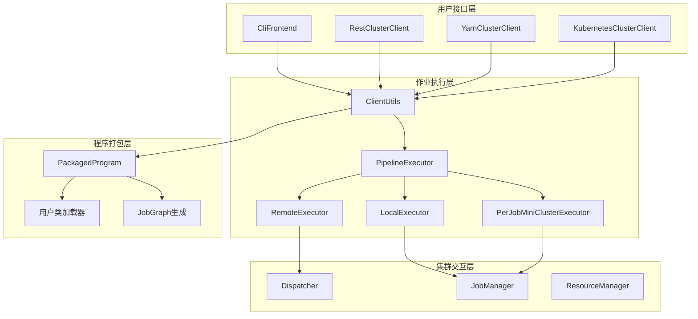
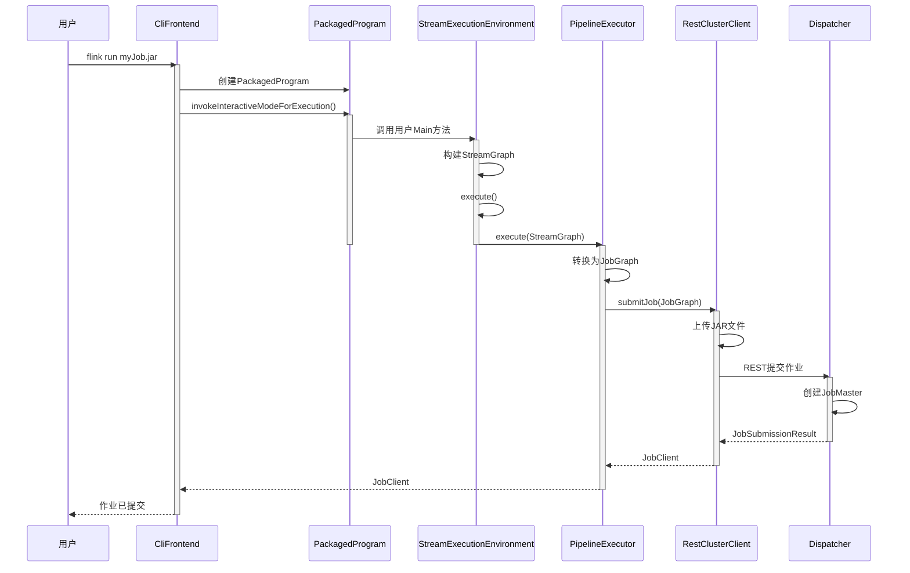

# Flink-05-客户端与作业提交（flink-clients）

## 一、模块概览

### 1.1 模块职责

客户端模块负责用户程序的打包、提交和监控，是用户与Flink集群交互的入口。

**核心职责**：
- 作业打包与提交
- CLI命令行工具
- 作业生命周期管理（提交、取消、Savepoint）
- 集群客户端抽象（支持多种部署模式）

### 1.2 客户端架构



## 二、核心组件详解

### 2.1 CliFrontend - 命令行工具

#### 2.1.1 功能说明

CliFrontend是Flink的命令行入口，支持以下命令：
- `run`: 提交作业
- `list`: 列出运行中的作业
- `cancel`: 取消作业
- `stop`: 优雅停止作业
- `savepoint`: 触发Savepoint
- `info`: 显示作业信息

#### 2.1.2 核心实现

```java
public class CliFrontend {
    
    private final Configuration configuration;
    private final List<CustomCommandLine> customCommandLines;
    
    public static void main(String[] args) {
        CliFrontend cli = new CliFrontend(...);
        int retCode = cli.parseAndRun(args);
        System.exit(retCode);
    }
    
    public int parseAndRun(String[] args) {
        // 1. 解析命令
        String action = args[0].toLowerCase();
        
        switch (action) {
            case "run":
                return run(params);
            case "cancel":
                return cancel(params);
            case "stop":
                return stop(params);
            case "savepoint":
                return savepoint(params);
            case "list":
                return list(params);
            default:
                printUsage();
                return 1;
        }
    }
    
    protected int run(String[] args) throws Exception {
        // 1. 解析命令行参数
        CommandLine commandLine = parseCommandLine(args);
        
        // 2. 加载配置
        Configuration configuration = getConfiguration(commandLine);
        
        // 3. 创建PackagedProgram
        PackagedProgram program = buildProgram(commandLine);
        
        try {
            // 4. 执行程序
            executeProgram(configuration, program);
            return 0;
        } finally {
            program.close();
        }
    }
    
    private void executeProgram(Configuration configuration, PackagedProgram program) 
            throws Exception {
        
        // 创建Pipeline执行器加载器
        PipelineExecutorServiceLoader executorServiceLoader = 
            new DefaultExecutorServiceLoader();
        
        // 执行程序
        ClientUtils.executeProgram(
            executorServiceLoader,
            configuration,
            program,
            false, // enforceSingleJobExecution
            false  // suppressSysout
        );
    }
}
```

#### 2.1.3 命令示例

```bash
# 提交作业
flink run \
  -t yarn-per-job \
  -c com.example.MyJob \
  -p 4 \
  myJob.jar \
  --input /data/input \
  --output /data/output

# 列出作业
flink list -t yarn-session

# 取消作业
flink cancel -t yarn-session <jobId>

# 触发Savepoint
flink savepoint <jobId> hdfs:///savepoints

# 从Savepoint恢复
flink run -s hdfs:///savepoints/savepoint-123456 myJob.jar

# 优雅停止（触发Savepoint并停止）
flink stop --savepointPath hdfs:///savepoints <jobId>
```

### 2.2 PackagedProgram - 程序打包

#### 2.2.1 功能说明

PackagedProgram封装用户JAR包，提供：
- 用户类加载
- Main类查找和调用
- 依赖管理

#### 2.2.2 核心实现

```java
public class PackagedProgram implements AutoCloseable {
    
    private final URL jarFile;
    private final String[] args;
    private final String mainClassName;
    private final List<URL> classpaths;
    private final ClassLoader userCodeClassLoader;
    
    public static PackagedProgram newBuilder()
            .setJarFile(jarFile)
            .setUserClassPaths(classpaths)
            .setEntryPointClassName(mainClass)
            .setArguments(args)
            .build();
    
    /**
     * 执行Main方法
     */
    public void invokeInteractiveModeForExecution() throws Exception {
        // 1. 加载Main类
        Class<?> mainClass = loadMainClass();
        
        // 2. 查找Main方法
        Method mainMethod = mainClass.getMethod("main", String[].class);
        
        // 3. 设置上下文类加载器
        ClassLoader contextClassLoader = Thread.currentThread().getContextClassLoader();
        try {
            Thread.currentThread().setContextClassLoader(userCodeClassLoader);
            
            // 4. 调用Main方法
            mainMethod.invoke(null, (Object) args);
            
        } finally {
            Thread.currentThread().setContextClassLoader(contextClassLoader);
        }
    }
    
    private Class<?> loadMainClass() throws ClassNotFoundException {
        return Class.forName(mainClassName, false, userCodeClassLoader);
    }
    
    @Override
    public void close() throws Exception {
        if (userCodeClassLoader instanceof Closeable) {
            ((Closeable) userCodeClassLoader).close();
        }
    }
}
```

### 2.3 ClientUtils - 工具类

#### 2.3.1 核心方法

```java
public class ClientUtils {
    
    /**
     * 执行用户程序
     */
    public static void executeProgram(
            PipelineExecutorServiceLoader executorServiceLoader,
            Configuration configuration,
            PackagedProgram program,
            boolean enforceSingleJobExecution,
            boolean suppressSysout) throws ProgramInvocationException {
        
        // 1. 获取用户代码ClassLoader
        ClassLoader userCodeClassLoader = program.getUserCodeClassLoader();
        
        // 2. 设置执行环境上下文
        ContextEnvironment.setAsContext(
            executorServiceLoader,
            configuration,
            userCodeClassLoader,
            enforceSingleJobExecution,
            suppressSysout);
        
        StreamContextEnvironment.setAsContext(
            executorServiceLoader,
            configuration,
            userCodeClassLoader,
            enforceSingleJobExecution,
            suppressSysout);
        
        try {
            // 3. 调用用户程序Main方法
            program.invokeInteractiveModeForExecution();
            
        } finally {
            // 4. 清理上下文
            ContextEnvironment.unsetAsContext();
            StreamContextEnvironment.unsetAsContext();
        }
    }
    
    /**
     * 等待作业初始化完成
     */
    public static void waitUntilJobInitializationFinished(
            Supplier<CompletableFuture<JobStatus>> jobStatusSupplier,
            Runnable failureChecker,
            ClassLoader userCodeClassloader,
            long checkIntervalMillis)
            throws ProgramInvocationException {
        
        while (true) {
            // 检查是否失败
            failureChecker.run();
            
            try {
                CompletableFuture<JobStatus> statusFuture = jobStatusSupplier.get();
                JobStatus status = statusFuture.get(checkIntervalMillis, TimeUnit.MILLISECONDS);
                
                // 检查状态
                if (status == JobStatus.RUNNING || status == JobStatus.FINISHED) {
                    return;
                } else if (status.isGloballyTerminalState()) {
                    throw new ProgramInvocationException("Job failed");
                }
                
            } catch (TimeoutException e) {
                // 继续等待
            } catch (Exception e) {
                throw new ProgramInvocationException("Failed to get job status", e);
            }
        }
    }
}
```

### 2.4 PipelineExecutor - 作业执行器

#### 2.4.1 执行器接口

```java
/**
 * Pipeline执行器接口
 */
public interface PipelineExecutor {
    
    /**
     * 执行Pipeline（作业）
     * @return JobClient用于监控作业
     */
    CompletableFuture<JobClient> execute(
        Pipeline pipeline,
        Configuration configuration,
        ClassLoader userCodeClassloader) throws Exception;
}
```

#### 2.4.2 LocalExecutor - 本地执行

```java
public class LocalExecutor implements PipelineExecutor {
    
    @Override
    public CompletableFuture<JobClient> execute(
            Pipeline pipeline,
            Configuration configuration,
            ClassLoader userCodeClassloader) throws Exception {
        
        // 1. 转换为JobGraph
        ExecutionPlan executionPlan = 
            (ExecutionPlan) pipeline;
        
        // 2. 创建MiniCluster
        MiniClusterConfiguration miniClusterConfig = 
            new MiniClusterConfiguration.Builder()
                .setConfiguration(configuration)
                .build();
        
        MiniCluster miniCluster = new MiniCluster(miniClusterConfig);
        miniCluster.start();
        
        // 3. 提交作业
        CompletableFuture<JobSubmissionResult> submissionFuture = 
            miniCluster.submitJob(executionPlan);
        
        // 4. 返回JobClient
        return submissionFuture.thenApply(result -> 
            new MiniClusterJobClient(
                result.getJobID(),
                miniCluster,
                userCodeClassloader,
                MiniClusterJobClient.JobFinalizationBehavior.SHUTDOWN_CLUSTER));
    }
}
```

#### 2.4.3 RemoteExecutor - 远程执行

```java
public class RemoteExecutor implements PipelineExecutor {
    
    @Override
    public CompletableFuture<JobClient> execute(
            Pipeline pipeline,
            Configuration configuration,
            ClassLoader userCodeClassloader) throws Exception {
        
        // 1. 创建RestClusterClient
        RestClusterClient<String> restClient = 
            new RestClusterClient<>(configuration, "RemoteExecutor");
        
        try {
            // 2. 转换为JobGraph
            ExecutionPlan executionPlan = (ExecutionPlan) pipeline;
            
            // 3. 提交作业
            CompletableFuture<JobSubmissionResult> submissionFuture =
                restClient.submitJob(executionPlan);
            
            // 4. 返回JobClient
            return submissionFuture.thenApply(result -> 
                new RestJobClient(
                    restClient,
                    result.getJobID(),
                    userCodeClassloader));
                    
        } catch (Exception e) {
            restClient.close();
            throw e;
        }
    }
}
```

### 2.5 ClusterClient - 集群客户端

#### 2.5.1 抽象接口

```java
public interface ClusterClient<T> extends AutoCloseable {
    
    /**
     * 提交作业
     */
    CompletableFuture<JobSubmissionResult> submitJob(ExecutionPlan executionPlan);
    
    /**
     * 获取作业状态
     */
    CompletableFuture<JobStatus> getJobStatus(JobID jobId);
    
    /**
     * 取消作业
     */
    CompletableFuture<Acknowledge> cancel(JobID jobId);
    
    /**
     * 停止作业（带Savepoint）
     */
    CompletableFuture<String> stopWithSavepoint(
        JobID jobId,
        boolean advanceToEndOfEventTime,
        String savepointDirectory);
    
    /**
     * 触发Savepoint
     */
    CompletableFuture<String> triggerSavepoint(
        JobID jobId,
        String savepointDirectory);
    
    /**
     * 请求作业结果
     */
    CompletableFuture<JobResult> requestJobResult(JobID jobId);
}
```

#### 2.5.2 RestClusterClient

```java
public class RestClusterClient<T> implements ClusterClient<T> {
    
    private final RestClient restClient;
    private final Configuration configuration;
    
    @Override
    public CompletableFuture<JobSubmissionResult> submitJob(ExecutionPlan executionPlan) {
        
        // 1. 上传JAR文件
        List<String> jarFiles = uploadJobGraphFiles(executionPlan);
        
        // 2. 构造提交请求
        JobSubmitRequestBody request = new JobSubmitRequestBody(
            executionPlan,
            jarFiles);
        
        // 3. 发送REST请求
        return restClient.sendRequest(
            JobSubmitHeaders.getInstance(),
            EmptyMessageParameters.getInstance(),
            request
        ).thenApply(response -> 
            new JobSubmissionResult(executionPlan.getJobID()));
    }
    
    @Override
    public CompletableFuture<String> triggerSavepoint(
            JobID jobId,
            String savepointDirectory) {
        
        SavepointTriggerRequestBody requestBody = 
            new SavepointTriggerRequestBody(savepointDirectory, false);
        
        SavepointTriggerMessageParameters params = 
            new SavepointTriggerMessageParameters();
        params.jobID.resolve(jobId);
        
        return restClient.sendRequest(
            SavepointTriggerHeaders.getInstance(),
            params,
            requestBody
        ).thenCompose(response -> {
            // 轮询Savepoint状态
            return pollSavepointStatus(jobId, response.getTriggerId());
        });
    }
    
    private CompletableFuture<String> pollSavepointStatus(
            JobID jobId,
            TriggerId triggerId) {
        
        return FutureUtils.retryWithDelay(
            () -> checkSavepointStatus(jobId, triggerId),
            1000, // 轮询间隔
            60,   // 最大重试次数
            TimeUnit.MILLISECONDS
        );
    }
}
```

## 三、作业提交流程

### 3.1 提交时序图



### 3.2 代码示例

```java
/**
 * 用户作业Main方法
 */
public class MyJob {
    
    public static void main(String[] args) throws Exception {
        
        // 1. 创建执行环境
        StreamExecutionEnvironment env = 
            StreamExecutionEnvironment.getExecutionEnvironment();
        
        // 2. 构建数据流程序
        DataStream<String> stream = env
            .fromElements("hello", "world")
            .map(String::toUpperCase);
        
        stream.print();
        
        // 3. 执行（触发作业提交）
        env.execute("My Job");
        
        // 注意：execute()会阻塞直到作业完成（批作业）或提交成功（流作业）
    }
}
```

**作业提交内部流程**：

```java
// StreamExecutionEnvironment.execute()
public JobExecutionResult execute(String jobName) throws Exception {
    // 1. 生成StreamGraph
    StreamGraph streamGraph = getStreamGraph();
    streamGraph.setJobName(jobName);
    
    // 2. 获取PipelineExecutor
    PipelineExecutor executor = getPipelineExecutor();
    
    // 3. 执行
    CompletableFuture<JobClient> jobClientFuture = 
        executor.execute(streamGraph, configuration, userClassloader);
    
    // 4. 等待作业完成（批作业）或返回（流作业）
    JobClient jobClient = jobClientFuture.get();
    
    if (configuration.get(DeploymentOptions.ATTACHED)) {
        // Attached模式：等待作业完成
        return jobClient.getJobExecutionResult().get();
    } else {
        // Detached模式：直接返回
        return new DetachedJobExecutionResult(jobClient.getJobID());
    }
}
```

## 四、JobClient - 作业监控

```java
public interface JobClient {
    
    /** 获取作业ID */
    JobID getJobID();
    
    /** 获取作业状态 */
    CompletableFuture<JobStatus> getJobStatus();
    
    /** 取消作业 */
    CompletableFuture<Void> cancel();
    
    /** 停止作业（带Savepoint） */
    CompletableFuture<String> stopWithSavepoint(
        boolean advanceToEndOfTime,
        String savepointDirectory);
    
    /** 触发Savepoint */
    CompletableFuture<String> triggerSavepoint(String savepointDirectory);
    
    /** 获取作业执行结果（阻塞） */
    CompletableFuture<JobExecutionResult> getJobExecutionResult();
    
    /** 获取累加器 */
    CompletableFuture<Map<String, Object>> getAccumulators();
}
```

**使用示例**：

```java
// 提交作业
JobClient jobClient = env.executeAsync("My Job");

// 监控作业状态
jobClient.getJobStatus().thenAccept(status -> {
    System.out.println("Job status: " + status);
});

// 等待作业完成
JobExecutionResult result = jobClient.getJobExecutionResult().get();
System.out.println("Job duration: " + result.getNetRuntime(TimeUnit.SECONDS) + "s");

// 获取累加器
Map<String, Object> accumulators = jobClient.getAccumulators().get();
Long count = (Long) accumulators.get("my-counter");
```

## 五、最佳实践

### 5.1 CI/CD集成

```java
/**
 * 编程方式提交作业（用于CI/CD）
 */
public class JobSubmitter {
    
    public static void submitJob(
            String jarFile,
            String mainClass,
            String[] args,
            Configuration flinkConfig) throws Exception {
        
        // 1. 创建PackagedProgram
        PackagedProgram program = PackagedProgram.newBuilder()
            .setJarFile(new File(jarFile))
            .setEntryPointClassName(mainClass)
            .setArguments(args)
            .build();
        
        try {
            // 2. 创建执行器
            PipelineExecutorServiceLoader executorServiceLoader = 
                new DefaultExecutorServiceLoader();
            
            // 3. 执行
            ClientUtils.executeProgram(
                executorServiceLoader,
                flinkConfig,
                program,
                false,
                true // 抑制stdout
            );
            
            System.out.println("Job submitted successfully");
            
        } finally {
            program.close();
        }
    }
}
```

### 5.2 作业参数传递

```java
public class MyJob {
    
    public static void main(String[] args) throws Exception {
        // 使用ParameterTool解析参数
        ParameterTool params = ParameterTool.fromArgs(args);
        
        String input = params.getRequired("input");
        String output = params.getRequired("output");
        int parallelism = params.getInt("parallelism", 1);
        
        StreamExecutionEnvironment env = 
            StreamExecutionEnvironment.getExecutionEnvironment();
        
        env.setParallelism(parallelism);
        
        // 将参数设置为全局配置（所有Task可访问）
        env.getConfig().setGlobalJobParameters(params);
        
        // 构建作业...
        env.execute();
    }
}

// 在Function中访问参数
public class MyMapFunction extends RichMapFunction<String, String> {
    
    private String configValue;
    
    @Override
    public void open(Configuration parameters) {
        ExecutionConfig.GlobalJobParameters globalParams = 
            getRuntimeContext().getExecutionConfig().getGlobalJobParameters();
        
        ParameterTool params = (ParameterTool) globalParams;
        configValue = params.get("my-config");
    }
}
```

### 5.3 错误处理

```java
public class RobustJobSubmitter {
    
    public static void submitWithRetry(
            PackagedProgram program,
            Configuration config,
            int maxRetries) {
        
        int attempt = 0;
        while (attempt < maxRetries) {
            try {
                ClientUtils.executeProgram(
                    new DefaultExecutorServiceLoader(),
                    config,
                    program,
                    false,
                    false);
                
                System.out.println("Job submitted successfully");
                return;
                
            } catch (ProgramInvocationException e) {
                attempt++;
                if (attempt >= maxRetries) {
                    System.err.println("Failed to submit job after " + maxRetries + " attempts");
                    throw e;
                }
                
                System.err.println("Submission failed, retrying... (attempt " + attempt + ")");
                try {
                    Thread.sleep(5000); // 等待5秒后重试
                } catch (InterruptedException ie) {
                    Thread.currentThread().interrupt();
                    throw new RuntimeException(ie);
                }
            }
        }
    }
}
```

## 六、总结

客户端模块是用户与Flink交互的桥梁：

**核心功能**：
- CLI工具：flink run/cancel/list/savepoint/stop
- 程序打包：PackagedProgram
- 作业执行：PipelineExecutor（Local/Remote/PerJob）
- 集群交互：ClusterClient（REST/YARN/K8s）

**作业提交流程**：
1. 解析命令行参数
2. 加载用户JAR和Main类
3. 执行Main方法构建StreamGraph
4. 转换为JobGraph
5. 通过ClusterClient提交到集群
6. 返回JobClient用于监控

**最佳实践**：
- 使用ParameterTool管理参数
- 编程方式提交用于CI/CD
- 实现重试机制提高可靠性
- 使用Detached模式异步提交

理解客户端模块有助于自动化作业部署和管理。

