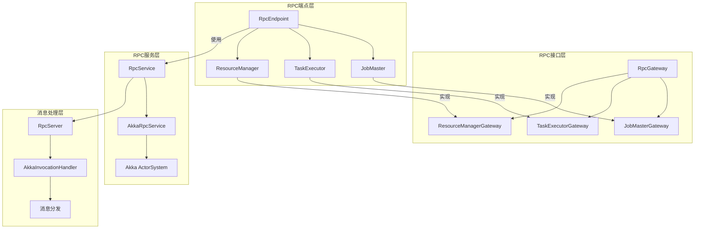

# Flink-06-RPC通信框架（flink-rpc）

## 一、模块概览

### 1.1 模块职责

RPC模块是Flink分布式通信的基础，负责组件间的远程方法调用。

**核心职责**：
- 提供异步RPC框架
- 管理RPC端点生命周期
- 处理消息路由和调度
- 支持多种RPC实现（Akka、Netty）

### 1.2 RPC架构



## 二、核心组件

### 2.1 RpcGateway - RPC接口

```java
/**
 * RPC网关基接口，所有RPC接口必须继承此接口
 */
public interface RpcGateway {
    /**
     * 获取网关地址
     */
    String getAddress();
    
    /**
     * 获取网关主机名
     */
    String getHostname();
}
```

**实现示例**：

```java
public interface JobMasterGateway extends RpcGateway {
    
    /**
     * 提交任务到JobMaster
     */
    CompletableFuture<Acknowledge> submitTask(
        TaskDeploymentDescriptor tdd,
        JobMasterId jobMasterId,
        Time timeout);
    
    /**
     * 更新任务执行状态
     */
    CompletableFuture<Acknowledge> updateTaskExecutionState(
        TaskExecutionState taskExecutionState);
    
    /**
     * 请求下一个输入分片
     */
    CompletableFuture<SerializedInputSplit> requestNextInputSplit(
        JobVertexID vertexID,
        ExecutionAttemptID executionAttempt);
}
```

### 2.2 RpcEndpoint - RPC端点

```java
/**
 * RPC端点基类，所有分布式组件的基类
 */
public abstract class RpcEndpoint implements RpcGateway, AutoCloseableAsync {
    
    // RPC服务
    private final RpcService rpcService;
    
    // 端点ID
    private final String endpointId;
    
    // 主线程执行器
    private final RpcServer rpcServer;
    
    protected RpcEndpoint(RpcService rpcService, String endpointId) {
        this.rpcService = rpcService;
        this.endpointId = endpointId;
        this.rpcServer = rpcService.startServer(this);
    }
    
    /**
     * 启动端点
     */
    public final void start() {
        rpcServer.start();
    }
    
    /**
     * 在主线程中执行Runnable
     */
    protected void runAsync(Runnable runnable) {
        rpcServer.execute(runnable);
    }
    
    /**
     * 在主线程中执行Callable
     */
    protected <V> CompletableFuture<V> callAsync(Callable<V> callable, Time timeout) {
        return rpcServer.callAsync(callable, timeout);
    }
    
    /**
     * 创建到其他RpcGateway的连接
     */
    protected <C extends RpcGateway> CompletableFuture<C> connect(
            String address,
            Class<C> clazz) {
        return rpcService.connect(address, clazz);
    }
    
    /**
     * 关闭端点
     */
    @Override
    public CompletableFuture<Void> closeAsync() {
        return rpcServer.terminateAsync();
    }
}
```

**使用示例**：

```java
public class JobMaster extends RpcEndpoint implements JobMasterGateway {
    
    public JobMaster(
            RpcService rpcService,
            JobMasterId jobMasterId,
            Configuration configuration) throws Exception {
        
        super(rpcService, "JobMaster_" + jobMasterId);
    }
    
    @Override
    public CompletableFuture<Acknowledge> submitTask(
            TaskDeploymentDescriptor tdd,
            JobMasterId jobMasterId,
            Time timeout) {
        
        // 在主线程中执行
        return callAsync(
            () -> {
                // 执行提交逻辑
                deployTask(tdd);
                return Acknowledge.get();
            },
            timeout
        );
    }
    
    @Override
    protected void onStart() throws Exception {
        // 端点启动时的初始化逻辑
        connectToResourceManager();
    }
    
    private void connectToResourceManager() {
        // 连接到ResourceManager
        CompletableFuture<ResourceManagerGateway> rmGatewayFuture =
            connect(resourceManagerAddress, ResourceManagerGateway.class);
        
        rmGatewayFuture.thenAccept(rmGateway -> {
            // 使用ResourceManager网关
            runAsync(() -> {
                resourceManagerGateway = rmGateway;
                registerAtResourceManager();
            });
        });
    }
}
```

### 2.3 RpcService - RPC服务

```java
public interface RpcService {
    
    /**
     * 获取RPC服务地址
     */
    String getAddress();
    
    /**
     * 启动RPC Server
     */
    <C extends RpcEndpoint & RpcGateway> RpcServer startServer(C rpcEndpoint);
    
    /**
     * 连接到远程RpcGateway
     */
    <C extends RpcGateway> CompletableFuture<C> connect(
        String address,
        Class<C> clazz);
    
    /**
     * 连接到远程RpcGateway（带超时）
     */
    <C extends RpcGateway> CompletableFuture<C> connect(
        String address,
        Class<C> clazz,
        Time timeout);
    
    /**
     * 创建固定延迟调度
     */
    ScheduledFuture<?> scheduleRunnable(
        Runnable runnable,
        long initialDelay,
        long period,
        TimeUnit unit);
    
    /**
     * 停止RPC服务
     */
    CompletableFuture<Void> stopService();
}
```

### 2.4 AkkaRpcService - Akka实现

```java
public class AkkaRpcService implements RpcService {
    
    private final ActorSystem actorSystem;
    private final AkkaRpcServiceConfiguration configuration;
    private final Executor executor;
    
    @Override
    public <C extends RpcEndpoint & RpcGateway> RpcServer startServer(C rpcEndpoint) {
        
        // 1. 创建Actor Props
        Props akkaRpcActorProps = Props.create(
            AkkaRpcActor.class,
            rpcEndpoint,
            configuration.getMaximumFramesize());
        
        // 2. 创建Actor
        ActorRef actorRef = actorSystem.actorOf(
            akkaRpcActorProps,
            rpcEndpoint.getEndpointId());
        
        // 3. 创建RpcServer（InvocationHandler）
        return new AkkaInvocationHandler(
            actorRef,
            rpcEndpoint.getClass(),
            configuration.getTimeout(),
            configuration.getMaximumFramesize(),
            actorSystem.scheduler());
    }
    
    @Override
    public <C extends RpcGateway> CompletableFuture<C> connect(
            String address,
            Class<C> clazz) {
        
        return callAsync(
            () -> {
                // 1. 解析Actor路径
                ActorSelection actorSel = actorSystem.actorSelection(address);
                
                // 2. 发送Identify消息
                CompletableFuture<ActorIdentity> identifyFuture =
                    Patterns.ask(actorSel, new Identify(42), timeout)
                        .toCompletableFuture()
                        .thenApply(response -> (ActorIdentity) response);
                
                // 3. 创建代理
                return identifyFuture.thenApply(identity -> {
                    ActorRef actorRef = identity.getActorRef().get();
                    return (C) Proxy.newProxyInstance(
                        clazz.getClassLoader(),
                        new Class[]{clazz},
                        new AkkaInvocationHandler(actorRef, ...));
                });
            },
            timeout
        ).thenCompose(Function.identity());
    }
}
```

## 三、消息处理机制

### 3.1 消息类型

```java
// RPC调用消息
public class RpcInvocation implements Serializable {
    private final String methodName;
    private final Class<?>[] parameterTypes;
    private final Object[] args;
}

// 本地消息（直接在主线程执行）
public interface LocalRpcInvocation {
    void invoke();
}

// 运行消息
public class RunAsync implements LocalRpcInvocation {
    private final Runnable runnable;
    
    @Override
    public void invoke() {
        runnable.run();
    }
}

// 调用消息
public class CallAsync implements LocalRpcInvocation {
    private final Callable<?> callable;
    private final CompletableFuture<?> resultFuture;
    
    @Override
    public void invoke() {
        try {
            Object result = callable.call();
            resultFuture.complete(result);
        } catch (Exception e) {
            resultFuture.completeExceptionally(e);
        }
    }
}
```

### 3.2 消息分发

```mermaid
sequenceDiagram
    participant Client as 客户端
    participant Proxy as RPC代理
    participant Actor as Akka Actor
    participant Endpoint as RpcEndpoint
    participant MainThread as 主线程
    
    Client->>Proxy: 调用方法
    Proxy->>Proxy: 创建RpcInvocation
    Proxy->>Actor: 发送消息
    
    activate Actor
    Actor->>Actor: 接收消息
    Actor->>MainThread: 投递到主线程
    deactivate Actor
    
    activate MainThread
    MainThread->>Endpoint: 执行方法
    Endpoint-->>MainThread: 返回结果
    MainThread-->>Actor: 完成Future
    deactivate MainThread
    
    Actor-->>Proxy: 返回CompletableFuture
    Proxy-->>Client: 返回结果
```

### 3.3 AkkaRpcActor

```java
public class AkkaRpcActor<T extends RpcEndpoint & RpcGateway> extends AbstractActor {
    
    private final T rpcEndpoint;
    
    @Override
    public Receive createReceive() {
        return receiveBuilder()
            .match(RpcInvocation.class, this::handleRpcInvocation)
            .match(LocalRpcInvocation.class, this::handleLocalRpcInvocation)
            .match(ControlMessages.class, this::handleControlMessage)
            .matchAny(this::handleUnknownMessage)
            .build();
    }
    
    private void handleRpcInvocation(RpcInvocation rpcInvocation) {
        try {
            // 1. 获取方法
            Method method = lookupMethod(
                rpcInvocation.getMethodName(),
                rpcInvocation.getParameterTypes());
            
            // 2. 执行方法
            Object result = method.invoke(rpcEndpoint, rpcInvocation.getArgs());
            
            // 3. 返回结果
            if (result instanceof CompletableFuture) {
                CompletableFuture<?> future = (CompletableFuture<?>) result;
                Patterns.pipe(future, getContext().dispatcher())
                    .to(getSender());
            } else {
                getSender().tell(result, getSelf());
            }
            
        } catch (Exception e) {
            getSender().tell(new Status.Failure(e), getSelf());
        }
    }
    
    private void handleLocalRpcInvocation(LocalRpcInvocation invocation) {
        // 在Actor线程中直接执行
        invocation.invoke();
    }
}
```

## 四、使用示例

### 4.1 定义RPC接口

```java
/**
 * 自定义RPC Gateway
 */
public interface MyServiceGateway extends RpcGateway {
    
    /**
     * 同步方法（返回CompletableFuture）
     */
    CompletableFuture<String> getData(String key);
    
    /**
     * 异步方法
     */
    CompletableFuture<Void> putData(String key, String value);
    
    /**
     * Fire-and-forget方法（@RpcMethod注解）
     */
    void notifyEvent(Event event);
}
```

### 4.2 实现RPC端点

```java
public class MyService extends RpcEndpoint implements MyServiceGateway {
    
    private final Map<String, String> dataStore = new ConcurrentHashMap<>();
    
    public MyService(RpcService rpcService) {
        super(rpcService, "MyService");
    }
    
    @Override
    public CompletableFuture<String> getData(String key) {
        // 方法自动在主线程执行
        return CompletableFuture.completedFuture(dataStore.get(key));
    }
    
    @Override
    public CompletableFuture<Void> putData(String key, String value) {
        // 异步操作
        return CompletableFuture.runAsync(
            () -> {
                dataStore.put(key, value);
                // 持久化到外部存储
                persistToStorage(key, value);
            },
            getMainThreadExecutor()
        );
    }
    
    @Override
    public void notifyEvent(Event event) {
        // 在主线程异步执行
        runAsync(() -> {
            handleEvent(event);
        });
    }
    
    @Override
    protected void onStart() throws Exception {
        log.info("MyService started at {}", getAddress());
    }
    
    @Override
    protected CompletableFuture<Void> onStop() {
        log.info("MyService stopping");
        return CompletableFuture.completedFuture(null);
    }
}
```

### 4.3 使用RPC服务

```java
public class RpcExample {
    
    public static void main(String[] args) throws Exception {
        
        // 1. 创建RpcService
        AkkaRpcService rpcService = AkkaRpcServiceUtils.createRemoteRpcService(
            configuration,
            "localhost",
            "0", // 自动分配端口
            null,
            null);
        
        try {
            // 2. 启动服务端
            MyService myService = new MyService(rpcService);
            myService.start();
            
            String serviceAddress = myService.getAddress();
            log.info("Service started at: {}", serviceAddress);
            
            // 3. 客户端连接
            CompletableFuture<MyServiceGateway> gatewayFuture = 
                rpcService.connect(serviceAddress, MyServiceGateway.class);
            
            MyServiceGateway gateway = gatewayFuture.get();
            
            // 4. 调用RPC方法
            CompletableFuture<Void> putFuture = gateway.putData("key1", "value1");
            putFuture.get();
            
            CompletableFuture<String> getFuture = gateway.getData("key1");
            String value = getFuture.get();
            log.info("Retrieved value: {}", value);
            
            // 5. Fire-and-forget调用
            gateway.notifyEvent(new Event("test"));
            
            // 6. 关闭
            myService.closeAsync().get();
            
        } finally {
            rpcService.stopService().get();
        }
    }
}
```

## 五、高级特性

### 5.1 Fencing Token

```java
/**
 * 带Fencing的RPC Gateway（防止脑裂）
 */
public interface FencedRpcGateway<F extends Serializable> extends RpcGateway {
    F getFencingToken();
}

/**
 * 使用Fencing Token
 */
public interface JobMasterGateway extends FencedRpcGateway<JobMasterId> {
    
    CompletableFuture<Acknowledge> submitTask(
        TaskDeploymentDescriptor tdd,
        JobMasterId jobMasterId, // Fencing Token
        Time timeout);
}

// 实现
public class JobMaster extends FencedRpcEndpoint<JobMasterId>
        implements JobMasterGateway {
    
    @Override
    public CompletableFuture<Acknowledge> submitTask(
            TaskDeploymentDescriptor tdd,
            JobMasterId jobMasterId,
            Time timeout) {
        
        // 验证Fencing Token
        validateRunsInMainThread();
        return callAsync(() -> {
            // 验证JobMasterId匹配
            if (!getFencingToken().equals(jobMasterId)) {
                throw new FlinkException("Invalid JobMasterId");
            }
            
            // 执行任务提交
            return internalSubmitTask(tdd);
        }, timeout);
    }
}
```

### 5.2 消息批处理

```java
/**
 * 批量RPC调用
 */
public class BatchRpcCaller {
    
    private final List<CompletableFuture<Void>> pendingCalls = new ArrayList<>();
    private final MyServiceGateway gateway;
    
    public void addCall(String key, String value) {
        CompletableFuture<Void> future = gateway.putData(key, value);
        pendingCalls.add(future);
    }
    
    public CompletableFuture<Void> flushAll() {
        return CompletableFuture.allOf(
            pendingCalls.toArray(new CompletableFuture[0])
        );
    }
}
```

### 5.3 超时与重试

```java
/**
 * 带超时和重试的RPC调用
 */
public class RpcWithRetry {
    
    public static <T> CompletableFuture<T> callWithRetry(
            Supplier<CompletableFuture<T>> rpcCall,
            int maxRetries,
            Duration timeout) {
        
        return callWithRetryInternal(rpcCall, maxRetries, timeout, 0);
    }
    
    private static <T> CompletableFuture<T> callWithRetryInternal(
            Supplier<CompletableFuture<T>> rpcCall,
            int maxRetries,
            Duration timeout,
            int currentAttempt) {
        
        CompletableFuture<T> resultFuture = rpcCall.get();
        
        return resultFuture
            .orTimeout(timeout.toMillis(), TimeUnit.MILLISECONDS)
            .exceptionally(throwable -> {
                if (currentAttempt < maxRetries) {
                    // 重试
                    log.warn("RPC call failed, retrying (attempt {}/{})", 
                        currentAttempt + 1, maxRetries, throwable);
                    return callWithRetryInternal(
                        rpcCall, maxRetries, timeout, currentAttempt + 1);
                } else {
                    // 失败
                    throw new CompletionException(throwable);
                }
            })
            .thenCompose(Function.identity());
    }
}
```

## 六、性能优化

### 6.1 Akka配置调优

```hocon
akka {
  actor {
    default-dispatcher {
      # 线程池类型
      type = "Dispatcher"
      executor = "fork-join-executor"
      
      fork-join-executor {
        # 并行度（通常为CPU核心数）
        parallelism-min = 8
        parallelism-factor = 3.0
        parallelism-max = 64
      }
      
      # 吞吐量（每次处理消息数）
      throughput = 5
    }
  }
  
  remote {
    # 最大帧大小
    maximum-frame-size = 10485760b # 10MB
    
    # 传输配置
    netty.tcp {
      # 发送缓冲区
      send-buffer-size = 10485760b
      # 接收缓冲区
      receive-buffer-size = 10485760b
      # 最大帧大小
      maximum-frame-size = 10485760b
    }
  }
}
```

### 6.2 批量消息处理

```java
/**
 * 使用批量消息减少RPC调用次数
 */
public interface BatchGateway extends RpcGateway {
    CompletableFuture<List<Result>> batchProcess(List<Request> requests);
}

public class BatchProcessor extends RpcEndpoint implements BatchGateway {
    
    @Override
    public CompletableFuture<List<Result>> batchProcess(List<Request> requests) {
        return callAsync(() -> {
            List<Result> results = new ArrayList<>(requests.size());
            for (Request request : requests) {
                results.add(processRequest(request));
            }
            return results;
        }, timeout);
    }
}
```

## 七、故障排查

### 7.1 常见问题

**问题1：RPC超时**

```java
// 增加超时时间
AkkaRpcServiceConfiguration configuration = 
    AkkaRpcServiceConfiguration.fromConfiguration(config)
        .withTimeout(Time.minutes(5)); // 增加到5分钟
```

**问题2：消息过大**

```java
// 增加最大帧大小
config.setString("akka.remote.netty.tcp.maximum-frame-size", "20971520b"); // 20MB
```

**问题3：Actor死锁**

```java
// 避免在主线程中阻塞等待
// Bad:
Object result = someRpcCall().get(); // 阻塞主线程

// Good:
someRpcCall().thenAccept(result -> {
    runAsync(() -> {
        // 在主线程中处理结果
        handleResult(result);
    });
});
```

## 八、总结

Flink RPC框架提供了：

**核心特性**：
- 基于Akka的异步RPC
- 主线程执行模型（保证线程安全）
- Fencing机制（防止脑裂）
- 灵活的超时和重试

**最佳实践**：
- 使用CompletableFuture进行异步编程
- 避免在主线程中阻塞等待
- 合理配置超时和帧大小
- 使用批量消息减少RPC次数

**性能优化**：
- 调优Akka线程池
- 增大缓冲区大小
- 批量处理消息
- 合理设置超时时间

理解RPC框架对于理解Flink分布式协调机制至关重要。

