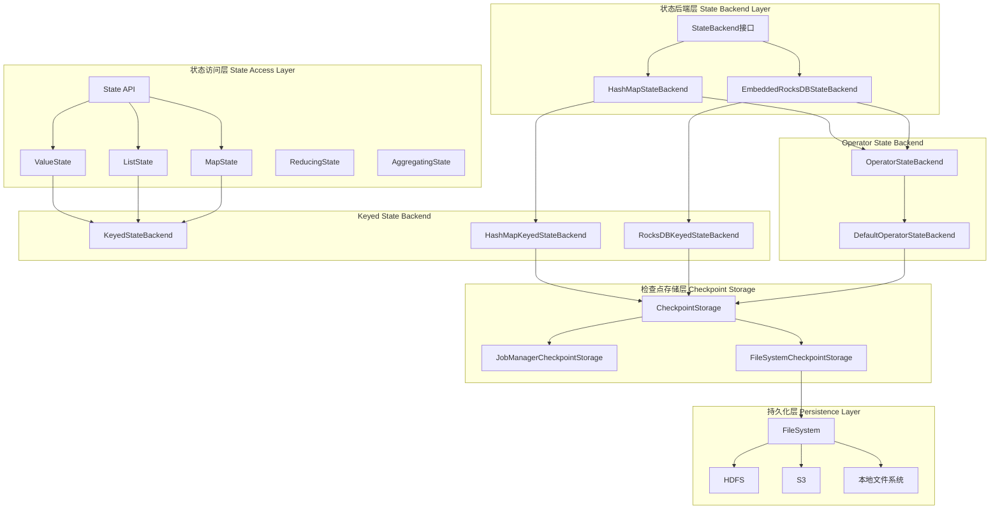
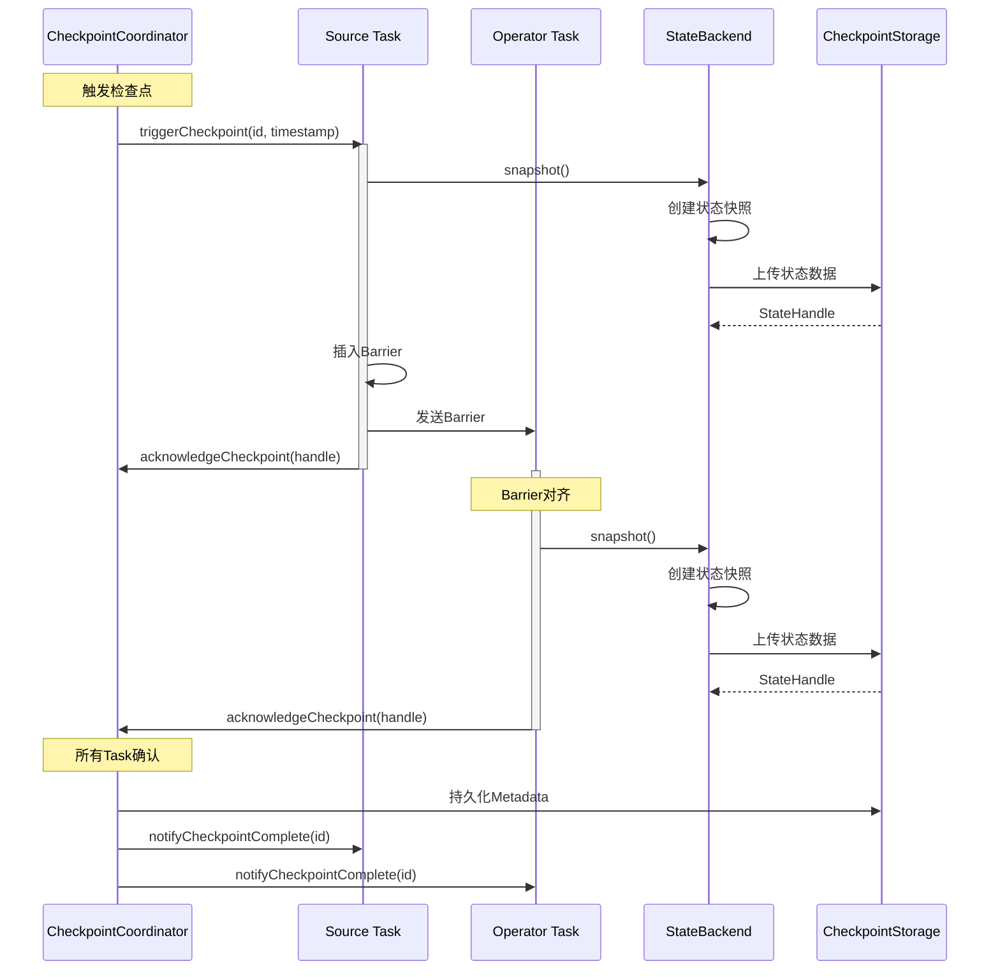

# Flink-07-状态管理与检查点（flink-state-backends）

## 一、模块概览

### 1.1 模块职责

状态管理模块是Flink容错机制的核心，负责状态的存储、访问、快照和恢复。主要职责包括：

**状态存储**：
- 提供多种状态后端实现（HashMap、RocksDB）
- 支持Keyed State和Operator State
- 管理状态的生命周期和内存/磁盘使用

**检查点机制**：
- 周期性状态快照
- 增量检查点支持
- Savepoint创建和恢复
- 状态版本控制和演进

**状态访问**：
- ValueState、ListState、MapState等多种类型
- 高效的读写接口
- 状态TTL支持
- 异步状态访问（实验性）

**故障恢复**：
- 从检查点恢复状态
- 支持并行度变更时的状态重分配
- 状态迁移和升级

### 1.2 模块架构



### 1.3 状态类型

**Keyed State（键控状态）**：
- 与Key绑定，每个Key独立维护状态
- 支持Scale-out时按KeyGroup重新分配
- 类型：ValueState、ListState、MapState、ReducingState、AggregatingState

**Operator State（算子状态）**：
- 与算子实例绑定，与Key无关
- Scale-out时支持多种重分配策略（均分、广播）
- 类型：ListState、UnionListState、BroadcastState

**Raw State（原始状态）**：
- 用户自定义序列化格式
- 不推荐使用，仅用于特殊场景

### 1.4 状态后端对比

| 特性 | HashMapStateBackend | EmbeddedRocksDBStateBackend |
|------|---------------------|----------------------------|
| **存储位置** | JVM堆内存 | 磁盘（RocksDB） |
| **状态大小** | 受限于内存（<1GB） | 几乎无限（受限于磁盘） |
| **访问性能** | 非常快（内存访问） | 较慢（磁盘I/O） |
| **检查点方式** | 异步快照到文件系统 | 增量快照 |
| **GC影响** | 有（大状态影响明显） | 几乎无（Off-Heap） |
| **适用场景** | 小状态、低延迟 | 大状态、TB级数据 |
| **配置复杂度** | 简单 | 需调优 |

## 二、核心组件详解

### 2.1 StateBackend - 状态后端接口

#### 2.1.1 功能说明

StateBackend定义了状态的存储方式，是状态管理的顶层抽象。

**核心职责**：
- 创建KeyedStateBackend和OperatorStateBackend
- 定义状态存储策略
- 配置检查点存储位置

#### 2.1.2 核心API

**接口定义**：

```java
public interface StateBackend extends java.io.Serializable {
    
    // 获取状态后端名称
    default String getName() {
        return this.getClass().getSimpleName();
    }
    
    // 创建Keyed State Backend
    <K> CheckpointableKeyedStateBackend<K> createKeyedStateBackend(
            KeyedStateBackendParameters<K> parameters) throws Exception;
    
    // 创建Operator State Backend
    OperatorStateBackend createOperatorStateBackend(
            OperatorStateBackendParameters parameters) throws Exception;
}
```

**KeyedStateBackendParameters结构体**：

| 字段 | 类型 | 说明 |
|------|------|------|
| env | Environment | 执行环境 |
| jobID | JobID | 作业ID |
| operatorIdentifier | String | 算子标识 |
| keySerializer | TypeSerializer<K> | Key序列化器 |
| numberOfKeyGroups | int | KeyGroup总数 |
| keyGroupRange | KeyGroupRange | 当前实例负责的KeyGroup范围 |
| kvStateRegistry | TaskKvStateRegistry | KvState注册表 |
| ttlTimeProvider | TtlTimeProvider | TTL时间提供者 |
| managedMemoryFraction | double | 托管内存占比 |

### 2.2 HashMapStateBackend - 内存状态后端

#### 2.2.1 功能说明

HashMapStateBackend将状态存储在JVM堆内存中，基于HashMap实现。

**优点**：
- 访问速度快（内存访问）
- 实现简单，无额外依赖
- 适合开发测试

**缺点**：
- 状态大小受限于内存
- 大状态导致GC压力
- 不适合生产环境大规模场景

#### 2.2.2 核心数据结构

```java
public class HashMapStateBackend implements StateBackend {
    
    /** 是否使用异步快照 */
    private final boolean asynchronousSnapshots;
    
    @Override
    public <K> CheckpointableKeyedStateBackend<K> createKeyedStateBackend(
            KeyedStateBackendParameters<K> parameters) throws Exception {
        
        return new HeapKeyedStateBackendBuilder<>(
            parameters.getKvStateRegistry(),
            parameters.getKeySerializer(),
            parameters.getEnv().getUserCodeClassLoader().asClassLoader(),
            parameters.getNumberOfKeyGroups(),
            parameters.getKeyGroupRange(),
            parameters.getEnv().getExecutionConfig(),
            parameters.getTtlTimeProvider(),
            parameters.getMetricGroup(),
            parameters.getStateHandles(),
            AbstractStateBackend.getCompressionDecorator(
                parameters.getEnv().getExecutionConfig()),
            parameters.getCancelStreamRegistry()).build();
    }
}
```

**HeapKeyedStateBackend实现**：

```java
public class HeapKeyedStateBackend<K> 
        extends AbstractKeyedStateBackend<K> {
    
    // 存储所有状态的注册表
    private final Map<String, StateTable<K, ?, ?>> registeredKVStates;
    
    // 存储所有KeyGroup的状态
    private final StateTable<K, ?, ?>[] stateTablesForKeyGroups;
    
    // 当前Key
    private K currentKey;
    
    // KeyGroup分配器
    private final KeyGroupRange keyGroupRange;
    
    @Override
    protected <N, V> InternalValueState<K, N, V> createValueState(
            TypeSerializer<N> namespaceSerializer,
            ValueStateDescriptor<V> stateDesc) throws Exception {
        
        // 创建StateTable（基于嵌套HashMap）
        StateTable<K, N, V> stateTable = tryRegisterStateTable(
            namespaceSerializer, stateDesc, getStateSnapshotTransformFactory(stateDesc));
        
        // 返回HeapValueState实例
        return new HeapValueState<>(this, stateDesc, stateTable, namespaceSerializer);
    }
}
```

**HeapValueState实现**：

```java
class HeapValueState<K, N, V> 
        extends AbstractHeapState<K, N, V>
        implements InternalValueState<K, N, V> {
    
    @Override
    public V value() {
        // 从StateTable中获取值
        return getStateTable().get(currentNamespace);
    }
    
    @Override
    public void update(V value) {
        // 更新StateTable
        if (value == null) {
            clear();
        } else {
            getStateTable().put(currentNamespace, value);
        }
    }
}
```

#### 2.2.3 检查点机制

```java
// HeapKeyedStateBackend的快照实现
@Override
public RunnableFuture<SnapshotResult<KeyedStateHandle>> snapshot(
        long checkpointId,
        long timestamp,
        CheckpointStreamFactory streamFactory,
        CheckpointOptions checkpointOptions) throws Exception {
    
    if (!asynchronousSnapshots) {
        // 同步快照
        return new DoneFuture<>(snapshotSynchronously(
            checkpointId, timestamp, streamFactory, checkpointOptions));
    } else {
        // 异步快照
        return snapshotAsynchronously(
            checkpointId, timestamp, streamFactory, checkpointOptions);
    }
}

private RunnableFuture<SnapshotResult<KeyedStateHandle>> snapshotAsynchronously(
        long checkpointId,
        long timestamp,
        CheckpointStreamFactory streamFactory,
        CheckpointOptions checkpointOptions) throws Exception {
    
    // 1. 复制状态表（使用Copy-on-Write）
    Map<String, StateSnapshot> cowStateStableSnapshots = new HashMap<>();
    for (Map.Entry<String, StateTable<K, ?, ?>> entry : registeredKVStates.entrySet()) {
        cowStateStableSnapshots.put(
            entry.getKey(), 
            entry.getValue().createSnapshot());
    }
    
    // 2. 创建异步快照任务
    AsyncSnapshotCallable<SnapshotResult<KeyedStateHandle>> asyncSnapshotCallable =
        new AsyncSnapshotCallable<SnapshotResult<KeyedStateHandle>>() {
            
            @Override
            protected SnapshotResult<KeyedStateHandle> callInternal() throws Exception {
                // 在异步线程中序列化并写入
                CheckpointStreamFactory.CheckpointStateOutputStream stream =
                    streamFactory.createCheckpointStateOutputStream(
                        CheckpointedStateScope.EXCLUSIVE);
                
                try {
                    // 写入元数据
                    DataOutputViewStreamWrapper outView = 
                        new DataOutputViewStreamWrapper(stream);
                    outView.writeInt(cowStateStableSnapshots.size());
                    
                    // 写入每个状态表
                    for (Map.Entry<String, StateSnapshot> entry : 
                            cowStateStableSnapshots.entrySet()) {
                        outView.writeUTF(entry.getKey());
                        entry.getValue().writeSnapshot(outView);
                    }
                    
                    // 关闭并获取句柄
                    StreamStateHandle streamStateHandle = stream.closeAndGetHandle();
                    
                    return SnapshotResult.of(
                        new KeyedStateHandle(streamStateHandle));
                        
                } finally {
                    stream.close();
                }
            }
        };
    
    return asyncSnapshotCallable.toAsyncSnapshotFutureTask(
        cancelStreamRegistry, checkpointOptions);
}
```

### 2.3 EmbeddedRocksDBStateBackend - RocksDB状态后端

#### 2.3.1 功能说明

EmbeddedRocksDBStateBackend将状态存储在嵌入式RocksDB数据库中，支持TB级状态。

**核心特性**：
- Off-Heap存储，不占用JVM堆内存
- 支持增量检查点
- 可配置的RocksDB选项
- 自动内存管理

**适用场景**：
- 大状态应用（GB-TB级）
- 需要长时间保留的状态
- 对内存敏感的场景
- 生产环境推荐

#### 2.3.2 核心数据结构

```java
public class EmbeddedRocksDBStateBackend implements StateBackend {
    
    // RocksDB存储路径
    private File[] localRocksDbDirectories;
    
    // 是否启用增量检查点
    private boolean enableIncrementalCheckpointing = false;
    
    // RocksDB选项工厂
    private RocksDBOptionsFactory rocksDBOptionsFactory;
    
    // 预定义选项
    private PredefinedOptions predefinedOptions = PredefinedOptions.DEFAULT;
    
    // 内存配置
    private RocksDBMemoryConfiguration memoryConfiguration;
    
    @Override
    public <K> CheckpointableKeyedStateBackend<K> createKeyedStateBackend(
            KeyedStateBackendParameters<K> parameters) throws IOException {
        
        // 1. 加载RocksDB JNI库
        String tempDir = parameters.getEnv()
            .getTaskManagerInfo()
            .getTmpWorkingDirectory()
            .getAbsolutePath();
        ensureRocksDBIsLoaded(tempDir);
        
        // 2. 创建RocksDB实例目录
        File instanceBasePath = new File(
            getNextStoragePath(),
            "job_" + parameters.getEnv().getJobID() + 
            "_op_" + operatorIdentifier + 
            "_uuid_" + UUID.randomUUID());
        
        // 3. 分配共享资源（Block Cache、Write Buffer等）
        OpaqueMemoryResource<RocksDBSharedResources> sharedResources =
            RocksDBOperationUtils.allocateSharedCachesIfConfigured(
                memoryConfiguration,
                parameters.getEnv(),
                parameters.getManagedMemoryFraction(),
                LOG);
        
        // 4. 创建RocksDB配置
        RocksDBResourceContainer resourceContainer = 
            createRocksDBResourceContainer(
                parameters.getEnv().getExecutionConfig(),
                sharedResources);
        
        // 5. 创建RocksDBKeyedStateBackend
        return new RocksDBKeyedStateBackendBuilder<>(
            parameters.getOperatorIdentifier(),
            parameters.getEnv().getUserCodeClassLoader().asClassLoader(),
            instanceBasePath,
            resourceContainer,
            stateName -> resourceContainer.getColumnOptions(),
            parameters.getKvStateRegistry(),
            parameters.getKeySerializer(),
            parameters.getNumberOfKeyGroups(),
            parameters.getKeyGroupRange(),
            parameters.getEnv().getExecutionConfig(),
            localRecoveryConfig,
            parameters.getTtlTimeProvider(),
            parameters.getMetricGroup(),
            parameters.getStateHandles(),
            AbstractStateBackend.getCompressionDecorator(
                parameters.getEnv().getExecutionConfig()),
            parameters.getCancelStreamRegistry(),
            this.enableIncrementalCheckpointing,
            numberOfTransferingThreads,
            writeBatchSize
        ).build();
    }
}
```

#### 2.3.3 RocksDBKeyedStateBackend实现

```java
public class RocksDBKeyedStateBackend<K> 
        extends AbstractKeyedStateBackend<K> {
    
    // RocksDB数据库实例
    protected RocksDB db;
    
    // Column Family句柄
    private final LinkedHashMap<String, ColumnFamilyHandle> columnFamilyHandles;
    
    // 默认Column Family
    private final ColumnFamilyHandle defaultColumnFamily;
    
    // RocksDB写选项
    private final WriteOptions writeOptions;
    
    // 本地恢复目录
    private final File instanceBasePath;
    
    // 增量检查点相关
    private final boolean enableIncrementalCheckpointing;
    private long lastCompletedCheckpointId = -1;
    
    @Override
    protected <N, V> InternalValueState<K, N, V> createValueState(
            TypeSerializer<N> namespaceSerializer,
            ValueStateDescriptor<V> stateDesc) throws Exception {
        
        // 1. 创建或获取Column Family
        ColumnFamilyHandle columnFamily = getOrCreateColumnFamily(
            stateDesc.getName(), stateDesc);
        
        // 2. 返回RocksDBValueState
        return new RocksDBValueState<>(
            columnFamily,
            namespaceSerializer,
            stateDesc.getSerializer(),
            stateDesc.getDefaultValue(),
            this);
    }
    
    private ColumnFamilyHandle getOrCreateColumnFamily(
            String stateName, 
            StateDescriptor<?, ?> stateDesc) throws Exception {
        
        ColumnFamilyHandle columnFamily = columnFamilyHandles.get(stateName);
        
        if (columnFamily == null) {
            // 创建新的Column Family
            ColumnFamilyDescriptor columnDescriptor = 
                new ColumnFamilyDescriptor(
                    stateName.getBytes(ConfigConstants.DEFAULT_CHARSET),
                    resourceContainer.getColumnOptions());
            
            columnFamily = db.createColumnFamily(columnDescriptor);
            columnFamilyHandles.put(stateName, columnFamily);
        }
        
        return columnFamily;
    }
}
```

#### 2.3.4 RocksDBValueState实现

```java
class RocksDBValueState<K, N, V> 
        extends AbstractRocksDBState<K, N, V>
        implements InternalValueState<K, N, V> {
    
    @Override
    public V value() throws IOException {
        try {
            // 1. 序列化当前Key + Namespace
            byte[] keyBytes = serializeCurrentKeyWithGroupAndNamespace();
            
            // 2. 从RocksDB读取
            byte[] valueBytes = backend.db.get(columnFamily, keyBytes);
            
            if (valueBytes == null) {
                return getDefaultValue();
            }
            
            // 3. 反序列化值
            dataInputView.setBuffer(valueBytes);
            return valueSerializer.deserialize(dataInputView);
            
        } catch (RocksDBException e) {
            throw new IOException("Error while retrieving data from RocksDB.", e);
        }
    }
    
    @Override
    public void update(V value) throws IOException {
        if (value == null) {
            clear();
            return;
        }
        
        try {
            // 1. 序列化Key
            byte[] keyBytes = serializeCurrentKeyWithGroupAndNamespace();
            
            // 2. 序列化Value
            dataOutputView.clear();
            valueSerializer.serialize(value, dataOutputView);
            byte[] valueBytes = dataOutputView.getCopyOfBuffer();
            
            // 3. 写入RocksDB
            backend.db.put(columnFamily, writeOptions, keyBytes, valueBytes);
            
        } catch (Exception e) {
            throw new IOException("Error while updating data in RocksDB.", e);
        }
    }
    
    @Override
    public void clear() {
        try {
            byte[] keyBytes = serializeCurrentKeyWithGroupAndNamespace();
            backend.db.delete(columnFamily, writeOptions, keyBytes);
        } catch (Exception e) {
            throw new FlinkRuntimeException("Error while removing data from RocksDB.", e);
        }
    }
}
```

#### 2.3.5 增量检查点实现

```java
// RocksDBKeyedStateBackend中的增量检查点实现
@Override
public RunnableFuture<SnapshotResult<KeyedStateHandle>> snapshot(
        long checkpointId,
        long timestamp,
        CheckpointStreamFactory streamFactory,
        CheckpointOptions checkpointOptions) throws Exception {
    
    if (enableIncrementalCheckpointing) {
        // 增量检查点
        return snapshotIncremental(checkpointId, timestamp, streamFactory, checkpointOptions);
    } else {
        // 全量检查点
        return snapshotFull(checkpointId, timestamp, streamFactory, checkpointOptions);
    }
}

private RunnableFuture<SnapshotResult<KeyedStateHandle>> snapshotIncremental(
        long checkpointId,
        long timestamp,
        CheckpointStreamFactory checkpointStreamFactory,
        CheckpointOptions checkpointOptions) throws Exception {
    
    // 1. 创建RocksDB快照
    final RocksDBIncrementalSnapshotOperation<K> snapshotOperation =
        new RocksDBIncrementalSnapshotOperation<>(
            this,
            checkpointStreamFactory,
            checkpointId,
            lastCompletedCheckpointId);
    
    // 2. 执行快照（异步）
    RunnableFuture<SnapshotResult<KeyedStateHandle>> snapshotFuture =
        snapshotOperation.toAsyncSnapshotFutureTask(cancelStreamRegistry);
    
    // 3. 记录最后完成的检查点ID
    lastCompletedCheckpointId = checkpointId;
    
    return snapshotFuture;
}
```

**增量检查点核心逻辑**：

```java
public class RocksDBIncrementalSnapshotOperation<K> {
    
    @Override
    protected SnapshotResult<KeyedStateHandle> callInternal() throws Exception {
        
        // 1. 获取当前SST文件列表
        List<LiveFileMetaData> liveFiles = db.getLiveFilesMetaData();
        
        // 2. 确定需要上传的文件（新增和修改的）
        Map<String, StreamStateHandle> uploadedFiles = new HashMap<>();
        Map<String, StreamStateHandle> sharedFiles = new HashMap<>();
        
        for (LiveFileMetaData file : liveFiles) {
            String fileName = file.fileName();
            
            // 检查文件是否已经上传过
            StreamStateHandle existingHandle = previousUploads.get(fileName);
            
            if (existingHandle == null) {
                // 新文件，需要上传
                StreamStateHandle handle = uploadSstFile(file, checkpointStreamFactory);
                uploadedFiles.put(fileName, handle);
            } else {
                // 已存在的文件，可以共享
                sharedFiles.put(fileName, existingHandle);
            }
        }
        
        // 3. 上传元数据
        StreamStateHandle metaStateHandle = uploadMetaData(checkpointStreamFactory);
        
        // 4. 创建IncrementalRemoteKeyedStateHandle
        IncrementalRemoteKeyedStateHandle stateHandle = 
            new IncrementalRemoteKeyedStateHandle(
                backendUID,
                keyGroupRange,
                checkpointId,
                sharedFiles,
                uploadedFiles,
                metaStateHandle);
        
        return SnapshotResult.of(stateHandle);
    }
    
    private StreamStateHandle uploadSstFile(
            LiveFileMetaData fileMetaData,
            CheckpointStreamFactory streamFactory) throws IOException {
        
        CheckpointStreamFactory.CheckpointStateOutputStream outputStream =
            streamFactory.createCheckpointStateOutputStream(
                CheckpointedStateScope.SHARED);
        
        try {
            // 读取SST文件并写入流
            FileInputStream inputStream = new FileInputStream(
                new File(instanceBasePath, fileMetaData.fileName()));
            
            byte[] buffer = new byte[8192];
            int bytesRead;
            while ((bytesRead = inputStream.read(buffer)) != -1) {
                outputStream.write(buffer, 0, bytesRead);
            }
            
            return outputStream.closeAndGetHandle();
            
        } catch (Exception e) {
            outputStream.close();
            throw e;
        }
    }
}
```

### 2.4 状态访问API

#### 2.4.1 ValueState

**使用示例**：

```java
public class CountWindowFunction extends KeyedProcessFunction<String, Event, Result> {
    
    private transient ValueState<Long> countState;
    
    @Override
    public void open(Configuration parameters) {
        ValueStateDescriptor<Long> descriptor = 
            new ValueStateDescriptor<>("count", Long.class, 0L);
        countState = getRuntimeContext().getState(descriptor);
    }
    
    @Override
    public void processElement(Event event, Context ctx, Collector<Result> out) 
            throws Exception {
        // 获取当前计数
        Long count = countState.value();
        
        // 更新计数
        count++;
        countState.update(count);
        
        // 达到阈值时输出
        if (count >= 10) {
            out.collect(new Result(ctx.getCurrentKey(), count));
            countState.clear();
        }
    }
}
```

#### 2.4.2 ListState

**使用示例**：

```java
public class BufferFunction extends KeyedProcessFunction<String, Event, List<Event>> {
    
    private transient ListState<Event> bufferState;
    
    @Override
    public void open(Configuration parameters) {
        ListStateDescriptor<Event> descriptor = 
            new ListStateDescriptor<>("buffer", Event.class);
        bufferState = getRuntimeContext().getListState(descriptor);
    }
    
    @Override
    public void processElement(Event event, Context ctx, Collector<List<Event>> out) 
            throws Exception {
        // 添加到缓冲区
        bufferState.add(event);
        
        // 获取所有缓冲的事件
        List<Event> bufferedEvents = new ArrayList<>();
        for (Event e : bufferState.get()) {
            bufferedEvents.add(e);
        }
        
        // 达到阈值时输出并清空
        if (bufferedEvents.size() >= 100) {
            out.collect(bufferedEvents);
            bufferState.clear();
        }
    }
}
```

#### 2.4.3 MapState

**使用示例**：

```java
public class FeatureAggregator extends KeyedProcessFunction<String, Event, Features> {
    
    private transient MapState<String, Double> featureState;
    
    @Override
    public void open(Configuration parameters) {
        MapStateDescriptor<String, Double> descriptor = 
            new MapStateDescriptor<>("features", String.class, Double.class);
        featureState = getRuntimeContext().getMapState(descriptor);
    }
    
    @Override
    public void processElement(Event event, Context ctx, Collector<Features> out) 
            throws Exception {
        // 更新特征
        for (Map.Entry<String, Double> entry : event.features.entrySet()) {
            Double existingValue = featureState.get(entry.getKey());
            Double newValue = (existingValue != null) 
                ? existingValue + entry.getValue() 
                : entry.getValue();
            featureState.put(entry.getKey(), newValue);
        }
        
        // 输出当前所有特征
        Map<String, Double> allFeatures = new HashMap<>();
        for (Map.Entry<String, Double> entry : featureState.entries()) {
            allFeatures.put(entry.getKey(), entry.getValue());
        }
        out.collect(new Features(ctx.getCurrentKey(), allFeatures));
    }
}
```

### 2.5 状态TTL

#### 2.5.1 功能说明

State TTL（Time-To-Live）自动清理过期状态，防止状态无限增长。

**配置选项**：
- 更新类型：创建时更新、读写时更新、从不更新
- 可见性：返回过期数据、从不返回过期数据
- 清理策略：全量快照清理、增量清理、后台清理

#### 2.5.2 使用示例

```java
public class TTLExample extends KeyedProcessFunction<String, Event, Result> {
    
    private transient ValueState<UserInfo> userInfoState;
    
    @Override
    public void open(Configuration parameters) {
        // 配置TTL
        StateTtlConfig ttlConfig = StateTtlConfig
            .newBuilder(Time.hours(24)) // 24小时TTL
            .setUpdateType(StateTtlConfig.UpdateType.OnCreateAndWrite) // 创建和写入时更新
            .setStateVisibility(StateTtlConfig.StateVisibility.NeverReturnExpired) // 不返回过期数据
            .cleanupFullSnapshot() // 全量快照时清理
            .cleanupIncrementally(1000, true) // 增量清理，每次1000条
            .cleanupInBackground() // 后台清理（仅RocksDB）
            .build();
        
        ValueStateDescriptor<UserInfo> descriptor = 
            new ValueStateDescriptor<>("user-info", UserInfo.class);
        descriptor.enableTimeToLive(ttlConfig);
        
        userInfoState = getRuntimeContext().getState(descriptor);
    }
    
    @Override
    public void processElement(Event event, Context ctx, Collector<Result> out) 
            throws Exception {
        // 访问状态，过期的会自动返回null
        UserInfo info = userInfoState.value();
        
        if (info == null) {
            info = new UserInfo(event.userId);
        }
        
        info.update(event);
        userInfoState.update(info); // 更新TTL
        
        out.collect(new Result(info));
    }
}
```

## 三、检查点机制详解

### 3.1 检查点流程



### 3.2 Savepoint

**创建Savepoint**：

```bash
# 触发Savepoint
flink savepoint <jobId> [targetDirectory]

# 带取消作业
flink stop --savepointPath <path> <jobId>
```

**从Savepoint恢复**：

```bash
# 启动作业并从Savepoint恢复
flink run -s <savepointPath> <jarFile>
```

**Savepoint vs Checkpoint**：

| 特性 | Checkpoint | Savepoint |
|------|-----------|-----------|
| 触发方式 | 自动周期性 | 手动触发 |
| 用途 | 故障恢复 | 版本升级、A/B测试 |
| 生命周期 | 临时，可自动删除 | 永久，需手动删除 |
| 格式 | 可变 | 标准化，向后兼容 |

## 四、性能调优

### 4.1 RocksDB配置优化

```java
EmbeddedRocksDBStateBackend backend = new EmbeddedRocksDBStateBackend();

// 启用增量检查点
backend.enableIncrementalCheckpointing(true);

// 自定义RocksDB选项
backend.setRocksDBOptions(new RocksDBOptionsFactory() {
    
    @Override
    public DBOptions createDBOptions(
            DBOptions currentOptions, 
            Collection<AutoCloseable> handlesToClose) {
        // 并发后台任务数
        return currentOptions
            .setMaxBackgroundJobs(4)
            .setMaxOpenFiles(-1);
    }
    
    @Override
    public ColumnFamilyOptions createColumnOptions(
            ColumnFamilyOptions currentOptions,
            Collection<AutoCloseable> handlesToClose) {
        // Write Buffer配置
        return currentOptions
            .setWriteBufferSize(64 * 1024 * 1024) // 64MB
            .setMaxWriteBufferNumber(3)
            .setMinWriteBufferNumberToMerge(1)
            // Compaction配置
            .setLevel0FileNumCompactionTrigger(4)
            .setLevel0SlowdownWritesTrigger(20)
            .setLevel0StopWritesTrigger(36)
            // Block Cache (共享)
            .setTableFormatConfig(
                new BlockBasedTableConfig()
                    .setBlockSize(16 * 1024) // 16KB
                    .setBlockCacheSize(256 * 1024 * 1024) // 256MB
                    .setFilterPolicy(new BloomFilter(10, false))
                    .setCacheIndexAndFilterBlocks(true)
                    .setPinL0FilterAndIndexBlocksInCache(true));
    }
});

// 预定义选项（简化配置）
backend.setPredefinedOptions(PredefinedOptions.SPINNING_DISK_OPTIMIZED);
// 或 PredefinedOptions.FLASH_SSD_OPTIMIZED
```

### 4.2 内存配置

```yaml
# TaskManager托管内存（用于RocksDB）
taskmanager.memory.managed.size: 2gb
taskmanager.memory.managed.fraction: 0.4

# RocksDB内存控制
state.backend.rocksdb.memory.managed: true
state.backend.rocksdb.memory.write-buffer-ratio: 0.5
state.backend.rocksdb.memory.high-prio-pool-ratio: 0.1
```

### 4.3 检查点优化

```java
// 检查点配置
env.enableCheckpointing(60000);
CheckpointConfig config = env.getCheckpointConfig();

// 增大超时时间（大状态）
config.setCheckpointTimeout(600000); // 10分钟

// 增大最小暂停时间（减少频率）
config.setMinPauseBetweenCheckpoints(60000); // 60秒

// 允许并发检查点（小心使用）
config.setMaxConcurrentCheckpoints(1); // 建议保持1

// 容忍失败
config.setTolerableCheckpointFailureNumber(3);

// Unaligned Checkpoint（减少对齐时间）
config.enableUnalignedCheckpoints(true);
config.setAlignedCheckpointTimeout(Duration.ofSeconds(30));
```

## 五、最佳实践

### 5.1 状态大小控制

```java
// 1. 使用TTL自动清理
StateTtlConfig ttlConfig = StateTtlConfig
    .newBuilder(Time.days(7))
    .cleanupIncrementally(1000, true)
    .build();

// 2. 手动清理过期数据
public class ManualCleanup extends KeyedProcessFunction<K, V, R> {
    
    @Override
    public void processElement(V value, Context ctx, Collector<R> out) {
        // 注册清理定时器
        long cleanupTime = value.timestamp + TimeUnit.DAYS.toMillis(7);
        ctx.timerService().registerEventTimeTimer(cleanupTime);
    }
    
    @Override
    public void onTimer(long timestamp, OnTimerContext ctx, Collector<R> out) {
        // 清理过期状态
        state.clear();
    }
}

// 3. 避免在状态中存储大对象
// Bad: 存储完整对象
ValueState<CompleteObject> badState;

// Good: 仅存储必要字段
ValueState<EssentialFields> goodState;
```

### 5.2 选择合适的状态后端

```java
// 开发/测试环境：HashMapStateBackend
if (isDevEnvironment) {
    env.setStateBackend(new HashMapStateBackend());
}

// 生产环境（小状态）：HashMapStateBackend + FileSystem
if (isSmallState && isProduction) {
    env.setStateBackend(new HashMapStateBackend());
    env.getCheckpointConfig().setCheckpointStorage("hdfs:///checkpoints");
}

// 生产环境（大状态）：RocksDBStateBackend
if (isLargeState && isProduction) {
    EmbeddedRocksDBStateBackend backend = new EmbeddedRocksDBStateBackend();
    backend.enableIncrementalCheckpointing(true);
    env.setStateBackend(backend);
    env.getCheckpointConfig().setCheckpointStorage("hdfs:///checkpoints");
}
```

### 5.3 监控状态大小

```java
// 监控状态指标
// flink_taskmanager_job_task_operator_currentStateSize
// flink_taskmanager_job_task_operator_rocksdb_estimated-num-keys
// flink_taskmanager_job_task_operator_rocksdb_mem-table-flush-pending

// 设置告警
if (stateSize > threshold) {
    // 告警：状态过大，可能影响检查点性能
}
```

## 六、故障排查

### 6.1 常见问题

**问题1：检查点超时**

原因：
- 状态过大
- 网络带宽不足
- 磁盘I/O慢

解决方案：
```java
// 增大超时时间
config.setCheckpointTimeout(900000); // 15分钟

// 启用增量检查点
backend.enableIncrementalCheckpointing(true);

// 优化RocksDB配置
backend.setRocksDBOptions(...);
```

**问题2：RocksDB OOM**

原因：
- Write Buffer过大
- Block Cache配置不当

解决方案：
```yaml
# 启用托管内存
state.backend.rocksdb.memory.managed: true

# 调整内存比例
state.backend.rocksdb.memory.write-buffer-ratio: 0.5
state.backend.rocksdb.memory.high-prio-pool-ratio: 0.1
```

**问题3：状态恢复失败**

原因：
- 序列化器不兼容
- 并行度变更

解决方案：
```java
// 使用兼容的序列化器
env.getConfig().registerTypeWithKryoSerializer(
    MyClass.class, MyCompatibleSerializer.class);

// 允许并行度变更
// 确保使用Keyed State而非Operator State
```

## 七、总结

状态管理是Flink容错机制的核心，关键点包括：

**状态后端选择**：
- 小状态（<1GB）：HashMapStateBackend
- 大状态（>1GB）：EmbeddedRocksDBStateBackend
- 生产环境推荐RocksDB + 增量检查点

**性能优化**：
- 启用增量检查点
- 优化RocksDB配置
- 使用状态TTL控制大小
- 监控状态指标

**容错保证**：
- 周期性检查点
- Savepoint用于版本升级
- 状态迁移和Schema演进
- 合理的检查点间隔和超时配置

理解状态管理对于开发高性能、高可靠的Flink应用至关重要。

