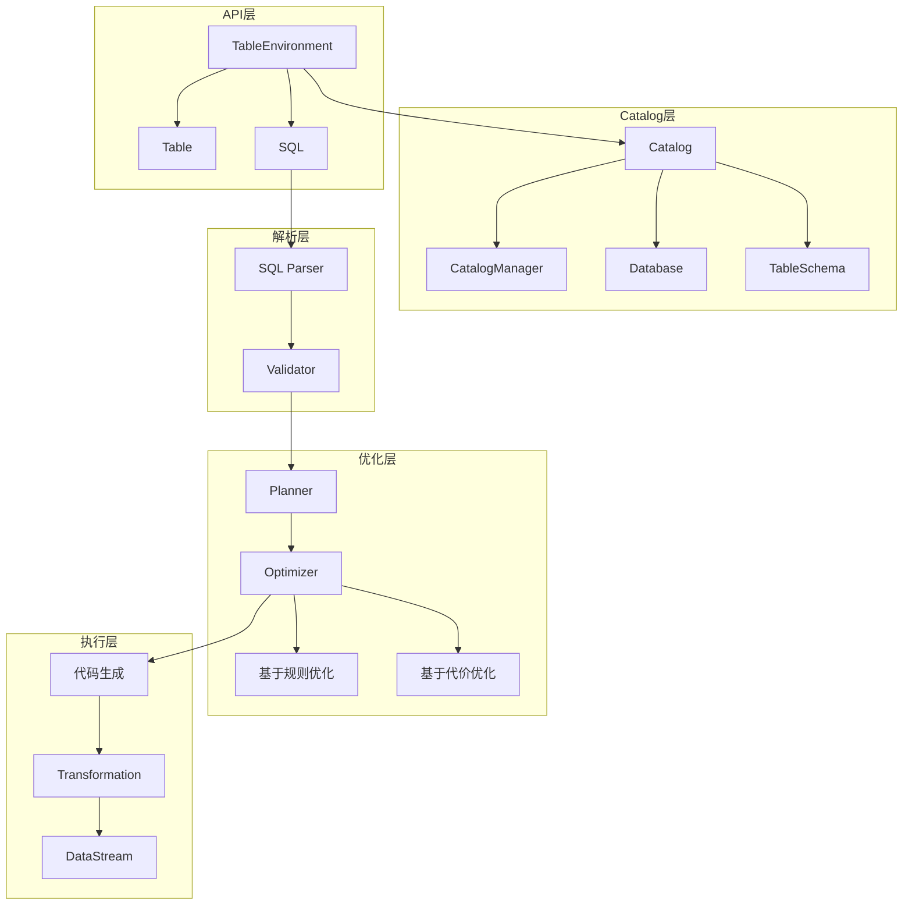
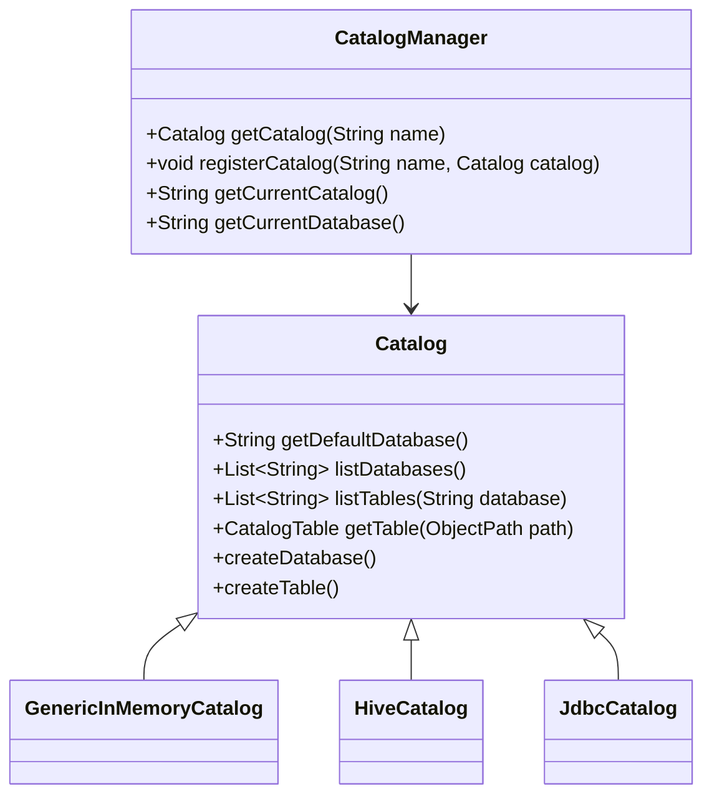

# Flink-08-Table与SQL（flink-table）

## 一、模块概览

### 1.1 模块职责

Table API & SQL是Flink的高级批流统一API，提供声明式的数据处理能力。

**核心职责**：
- 提供Table API和SQL两种编程接口
- 统一批处理和流处理语义
- Catalog元数据管理
- SQL解析和优化
- 代码生成和执行

### 1.2 Table API架构



## 二、TableEnvironment - 执行环境

### 2.1 创建执行环境

#### 2.1.1 核心API

```java
public interface TableEnvironment {
    
    /**
     * 创建流式Table环境
     */
    static StreamTableEnvironment create(StreamExecutionEnvironment env);
    
    /**
     * 创建流式Table环境（带配置）
     */
    static StreamTableEnvironment create(
        StreamExecutionEnvironment env,
        EnvironmentSettings settings);
    
    /**
     * 创建Table环境（批流统一）
     */
    static TableEnvironment create(EnvironmentSettings settings);
}
```

**使用示例**：

```java
// 1. 流式环境（推荐）
StreamExecutionEnvironment env = StreamExecutionEnvironment.getExecutionEnvironment();
StreamTableEnvironment tableEnv = StreamTableEnvironment.create(env);

// 2. 批流统一环境
EnvironmentSettings settings = EnvironmentSettings
    .newInstance()
    .inStreamingMode()  // 或 .inBatchMode()
    .build();

TableEnvironment tableEnv = TableEnvironment.create(settings);

// 3. 自定义配置
EnvironmentSettings settings = EnvironmentSettings
    .newInstance()
    .inStreamingMode()
    .withConfiguration(config)
    .build();

TableEnvironment tableEnv = TableEnvironment.create(settings);
```

### 2.2 表注册与查询

#### 2.2.1 注册表

```java
public interface TableEnvironment {
    
    /**
     * 从DataStream创建临时视图
     */
    void createTemporaryView(String path, DataStream<?> dataStream);
    
    /**
     * 从DataStream创建临时视图（带Schema）
     */
    void createTemporaryView(String path, DataStream<?> dataStream, Schema schema);
    
    /**
     * 注册表
     */
    void createTemporaryTable(String path, TableDescriptor descriptor);
    
    /**
     * 执行SQL DDL
     */
    TableResult executeSql(String statement);
}
```

**注册表示例**：

```java
StreamExecutionEnvironment env = StreamExecutionEnvironment.getExecutionEnvironment();
StreamTableEnvironment tableEnv = StreamTableEnvironment.create(env);

// 1. 从DataStream创建视图
DataStream<Tuple2<String, Integer>> stream = env.fromElements(
    Tuple2.of("Alice", 25),
    Tuple2.of("Bob", 30)
);

tableEnv.createTemporaryView("users", stream, 
    Schema.newBuilder()
        .column("name", DataTypes.STRING())
        .column("age", DataTypes.INT())
        .build()
);

// 2. 使用SQL DDL创建表
tableEnv.executeSql(
    "CREATE TEMPORARY TABLE orders (" +
    "  order_id STRING," +
    "  user_id STRING," +
    "  amount DOUBLE," +
    "  order_time TIMESTAMP(3)," +
    "  WATERMARK FOR order_time AS order_time - INTERVAL '5' SECOND" +
    ") WITH (" +
    "  'connector' = 'kafka'," +
    "  'topic' = 'orders'," +
    "  'properties.bootstrap.servers' = 'localhost:9092'," +
    "  'format' = 'json'" +
    ")"
);

// 3. 使用Table API创建表
tableEnv.createTemporaryTable("products",
    TableDescriptor.forConnector("filesystem")
        .schema(Schema.newBuilder()
            .column("product_id", DataTypes.STRING())
            .column("name", DataTypes.STRING())
            .column("price", DataTypes.DOUBLE())
            .build())
        .option("path", "/path/to/products.csv")
        .format("csv")
        .build()
);
```

#### 2.2.2 查询表

```java
public interface TableEnvironment {
    
    /**
     * 获取表
     */
    Table from(String path);
    
    /**
     * 执行SQL查询
     */
    Table sqlQuery(String query);
    
    /**
     * 执行SQL语句
     */
    TableResult executeSql(String statement);
}
```

**查询示例**：

```java
// 1. Table API查询
Table users = tableEnv.from("users");
Table result = users
    .select($("name"), $("age"))
    .where($("age").isGreater(25));

// 2. SQL查询
Table sqlResult = tableEnv.sqlQuery(
    "SELECT name, age FROM users WHERE age > 25"
);

// 3. 混合使用
Table orders = tableEnv.from("orders");
tableEnv.createTemporaryView("recent_orders", orders
    .where($("order_time").isGreater(currentTimestamp().minus(lit(1).hours())))
);

Table summary = tableEnv.sqlQuery(
    "SELECT user_id, COUNT(*) as order_count, SUM(amount) as total_amount " +
    "FROM recent_orders " +
    "GROUP BY user_id"
);
```

## 三、Table API操作

### 3.1 基础操作

#### 3.1.1 select - 投影

```java
// 选择列
Table result = table.select($("name"), $("age"));

// 重命名列
Table result = table.select($("name").as("user_name"), $("age"));

// 计算列
Table result = table.select(
    $("name"),
    $("age"),
    $("age").plus(1).as("next_age")
);
```

#### 3.1.2 where/filter - 过滤

```java
// 简单过滤
Table result = table.where($("age").isGreater(25));

// 复杂条件
Table result = table.where(
    $("age").isGreater(25)
        .and($("name").isNotNull())
        .and($("city").in("Beijing", "Shanghai"))
);

// filter（等同于where）
Table result = table.filter($("age").isGreaterOrEqual(18));
```

#### 3.1.3 groupBy - 分组

```java
// 分组聚合
Table result = table
    .groupBy($("city"))
    .select(
        $("city"),
        $("age").avg().as("avg_age"),
        $("*").count().as("user_count")
    );

// 多列分组
Table result = table
    .groupBy($("city"), $("gender"))
    .select(
        $("city"),
        $("gender"),
        $("salary").sum().as("total_salary")
    );
```

### 3.2 窗口操作

#### 3.2.1 滚动窗口

```java
// 时间滚动窗口
Table result = table
    .window(Tumble.over(lit(10).minutes()).on($("order_time")).as("w"))
    .groupBy($("user_id"), $("w"))
    .select(
        $("user_id"),
        $("w").start().as("window_start"),
        $("w").end().as("window_end"),
        $("amount").sum().as("total_amount")
    );

// 行数滚动窗口
Table result = table
    .window(Tumble.over(rowInterval(100L)).on($("proctime")).as("w"))
    .groupBy($("user_id"), $("w"))
    .select($("user_id"), $("*").count().as("order_count"));
```

#### 3.2.2 滑动窗口

```java
// 时间滑动窗口
Table result = table
    .window(Slide.over(lit(10).minutes())
                 .every(lit(5).minutes())
                 .on($("order_time"))
                 .as("w"))
    .groupBy($("user_id"), $("w"))
    .select(
        $("user_id"),
        $("w").start(),
        $("w").end(),
        $("amount").sum().as("total_amount")
    );
```

#### 3.2.3 会话窗口

```java
// 会话窗口
Table result = table
    .window(Session.withGap(lit(15).minutes()).on($("order_time")).as("w"))
    .groupBy($("user_id"), $("w"))
    .select(
        $("user_id"),
        $("w").start(),
        $("w").end(),
        $("*").count().as("event_count")
    );
```

### 3.3 Join操作

#### 3.3.1 内连接

```java
// Inner Join
Table orders = tableEnv.from("orders");
Table products = tableEnv.from("products");

Table result = orders
    .join(products)
    .where($("orders.product_id").isEqual($("products.product_id")))
    .select(
        $("orders.order_id"),
        $("products.name"),
        $("orders.amount")
    );
```

#### 3.3.2 左连接

```java
// Left Join
Table result = orders
    .leftOuterJoin(products, $("orders.product_id").isEqual($("products.product_id")))
    .select(
        $("orders.order_id"),
        $("products.name"),
        $("orders.amount")
    );
```

#### 3.3.3 时间窗口Join

```java
// Interval Join（流处理）
Table result = orders
    .join(shipments)
    .where(
        $("orders.order_id").isEqual($("shipments.order_id"))
        .and($("shipments.ship_time").isGreaterOrEqual($("orders.order_time")))
        .and($("shipments.ship_time").isLess($("orders.order_time").plus(lit(2).days())))
    )
    .select($("orders.order_id"), $("orders.amount"), $("shipments.ship_time"));
```

### 3.4 聚合函数

```java
// 内置聚合函数
Table result = table
    .groupBy($("user_id"))
    .select(
        $("user_id"),
        $("amount").sum().as("total"),
        $("amount").avg().as("avg"),
        $("amount").min().as("min"),
        $("amount").max().as("max"),
        $("*").count().as("count"),
        $("amount").stddevPop().as("stddev")
    );

// DISTINCT聚合
Table result = table
    .groupBy($("user_id"))
    .select(
        $("user_id"),
        $("order_id").count().distinct().as("unique_orders")
    );
```

## 四、SQL查询

### 4.1 基础查询

```java
// SELECT
Table result = tableEnv.sqlQuery(
    "SELECT name, age FROM users WHERE age > 25"
);

// JOIN
Table result = tableEnv.sqlQuery(
    "SELECT o.order_id, p.name, o.amount " +
    "FROM orders o " +
    "JOIN products p ON o.product_id = p.product_id"
);

// GROUP BY
Table result = tableEnv.sqlQuery(
    "SELECT user_id, COUNT(*) as order_count, SUM(amount) as total " +
    "FROM orders " +
    "GROUP BY user_id"
);

// HAVING
Table result = tableEnv.sqlQuery(
    "SELECT user_id, SUM(amount) as total " +
    "FROM orders " +
    "GROUP BY user_id " +
    "HAVING SUM(amount) > 1000"
);
```

### 4.2 窗口SQL

```java
// 滚动窗口
Table result = tableEnv.sqlQuery(
    "SELECT " +
    "  user_id, " +
    "  TUMBLE_START(order_time, INTERVAL '10' MINUTE) as window_start, " +
    "  TUMBLE_END(order_time, INTERVAL '10' MINUTE) as window_end, " +
    "  SUM(amount) as total_amount " +
    "FROM orders " +
    "GROUP BY user_id, TUMBLE(order_time, INTERVAL '10' MINUTE)"
);

// 滑动窗口
Table result = tableEnv.sqlQuery(
    "SELECT " +
    "  user_id, " +
    "  HOP_START(order_time, INTERVAL '5' MINUTE, INTERVAL '10' MINUTE) as window_start, " +
    "  HOP_END(order_time, INTERVAL '5' MINUTE, INTERVAL '10' MINUTE) as window_end, " +
    "  SUM(amount) as total_amount " +
    "FROM orders " +
    "GROUP BY user_id, HOP(order_time, INTERVAL '5' MINUTE, INTERVAL '10' MINUTE)"
);

// 会话窗口
Table result = tableEnv.sqlQuery(
    "SELECT " +
    "  user_id, " +
    "  SESSION_START(order_time, INTERVAL '15' MINUTE) as window_start, " +
    "  SESSION_END(order_time, INTERVAL '15' MINUTE) as window_end, " +
    "  COUNT(*) as event_count " +
    "FROM orders " +
    "GROUP BY user_id, SESSION(order_time, INTERVAL '15' MINUTE)"
);
```

### 4.3 时间属性

```java
// 事件时间
tableEnv.executeSql(
    "CREATE TABLE orders (" +
    "  order_id STRING," +
    "  amount DOUBLE," +
    "  order_time TIMESTAMP(3)," +
    "  WATERMARK FOR order_time AS order_time - INTERVAL '5' SECOND" +
    ") WITH (...)"
);

// 处理时间
tableEnv.executeSql(
    "CREATE TABLE clicks (" +
    "  user_id STRING," +
    "  url STRING," +
    "  click_time AS PROCTIME()" +  // 处理时间
    ") WITH (...)"
);
```

## 五、Catalog管理

### 5.1 Catalog概念



### 5.2 使用Catalog

```java
// 1. 注册Catalog
tableEnv.executeSql(
    "CREATE CATALOG my_catalog WITH (" +
    "  'type' = 'hive'," +
    "  'hive-conf-dir' = '/path/to/hive/conf'" +
    ")"
);

// 2. 使用Catalog
tableEnv.executeSql("USE CATALOG my_catalog");
tableEnv.executeSql("USE my_database");

// 3. 列出Catalog
String[] catalogs = tableEnv.listCatalogs();

// 4. 列出数据库
String[] databases = tableEnv.listDatabases();

// 5. 列出表
String[] tables = tableEnv.listTables();

// 6. 完全限定名查询
Table result = tableEnv.sqlQuery(
    "SELECT * FROM my_catalog.my_database.my_table"
);
```

### 5.3 Hive集成

```java
// 配置Hive Catalog
tableEnv.executeSql(
    "CREATE CATALOG hive_catalog WITH (" +
    "  'type' = 'hive'," +
    "  'hive-conf-dir' = '/path/to/hive/conf'," +
    "  'hadoop-conf-dir' = '/path/to/hadoop/conf'" +
    ")"
);

tableEnv.executeSql("USE CATALOG hive_catalog");

// 读取Hive表
Table hiveTable = tableEnv.from("hive_catalog.default.my_hive_table");

// 写入Hive表
Table result = tableEnv.sqlQuery("SELECT * FROM orders WHERE amount > 100");
result.executeInsert("hive_catalog.default.high_value_orders");
```

## 六、Connector - 连接器

### 6.1 Kafka Connector

```java
// 读取Kafka
tableEnv.executeSql(
    "CREATE TABLE kafka_source (" +
    "  user_id STRING," +
    "  event_type STRING," +
    "  event_time TIMESTAMP(3) METADATA FROM 'timestamp'," +
    "  WATERMARK FOR event_time AS event_time - INTERVAL '5' SECOND" +
    ") WITH (" +
    "  'connector' = 'kafka'," +
    "  'topic' = 'user-events'," +
    "  'properties.bootstrap.servers' = 'localhost:9092'," +
    "  'properties.group.id' = 'my-group'," +
    "  'scan.startup.mode' = 'latest-offset'," +
    "  'format' = 'json'" +
    ")"
);

// 写入Kafka
tableEnv.executeSql(
    "CREATE TABLE kafka_sink (" +
    "  user_id STRING," +
    "  result STRING" +
    ") WITH (" +
    "  'connector' = 'kafka'," +
    "  'topic' = 'results'," +
    "  'properties.bootstrap.servers' = 'localhost:9092'," +
    "  'format' = 'json'" +
    ")"
);

tableEnv.executeSql("INSERT INTO kafka_sink SELECT user_id, result FROM ...");
```

### 6.2 JDBC Connector

```java
// JDBC Source
tableEnv.executeSql(
    "CREATE TABLE jdbc_source (" +
    "  id INT," +
    "  name STRING," +
    "  age INT" +
    ") WITH (" +
    "  'connector' = 'jdbc'," +
    "  'url' = 'jdbc:mysql://localhost:3306/mydb'," +
    "  'table-name' = 'users'," +
    "  'username' = 'root'," +
    "  'password' = 'password'" +
    ")"
);

// JDBC Sink（Upsert模式）
tableEnv.executeSql(
    "CREATE TABLE jdbc_sink (" +
    "  user_id STRING PRIMARY KEY NOT ENFORCED," +
    "  total_amount DOUBLE" +
    ") WITH (" +
    "  'connector' = 'jdbc'," +
    "  'url' = 'jdbc:mysql://localhost:3306/mydb'," +
    "  'table-name' = 'user_summary'," +
    "  'username' = 'root'," +
    "  'password' = 'password'" +
    ")"
);
```

### 6.3 Filesystem Connector

```java
// CSV文件
tableEnv.executeSql(
    "CREATE TABLE csv_table (" +
    "  user_id STRING," +
    "  name STRING," +
    "  age INT" +
    ") WITH (" +
    "  'connector' = 'filesystem'," +
    "  'path' = '/path/to/data.csv'," +
    "  'format' = 'csv'" +
    ")"
);

// Parquet文件
tableEnv.executeSql(
    "CREATE TABLE parquet_table (" +
    "  user_id STRING," +
    "  events ARRAY<ROW<event_type STRING, event_time TIMESTAMP(3)>>" +
    ") WITH (" +
    "  'connector' = 'filesystem'," +
    "  'path' = '/path/to/data'," +
    "  'format' = 'parquet'" +
    ")"
);
```

## 七、UDF - 用户自定义函数

### 7.1 Scalar Function

```java
// 定义标量函数
public class AddFunction extends ScalarFunction {
    public Integer eval(Integer a, Integer b) {
        return a + b;
    }
}

// 注册
tableEnv.createTemporarySystemFunction("add", AddFunction.class);

// 使用
Table result = tableEnv.sqlQuery(
    "SELECT user_id, add(score1, score2) as total_score FROM scores"
);
```

### 7.2 Table Function

```java
// 定义表函数（一行变多行）
@FunctionHint(output = @DataTypeHint("ROW<word STRING>"))
public class SplitFunction extends TableFunction<Row> {
    
    public void eval(String str) {
        for (String word : str.split(" ")) {
            collect(Row.of(word));
        }
    }
}

// 注册
tableEnv.createTemporarySystemFunction("split", SplitFunction.class);

// 使用（LATERAL TABLE）
Table result = tableEnv.sqlQuery(
    "SELECT user_id, word " +
    "FROM users, LATERAL TABLE(split(content)) AS T(word)"
);
```

### 7.3 Aggregate Function

```java
// 定义聚合函数
public class WeightedAvg extends AggregateFunction<Double, WeightedAvgAccumulator> {
    
    @Override
    public Double getValue(WeightedAvgAccumulator acc) {
        if (acc.count == 0) {
            return null;
        }
        return acc.sum / acc.count;
    }
    
    @Override
    public WeightedAvgAccumulator createAccumulator() {
        return new WeightedAvgAccumulator();
    }
    
    public void accumulate(WeightedAvgAccumulator acc, Double value, Integer weight) {
        acc.sum += value * weight;
        acc.count += weight;
    }
}

public class WeightedAvgAccumulator {
    public double sum = 0;
    public int count = 0;
}

// 注册和使用
tableEnv.createTemporarySystemFunction("weighted_avg", WeightedAvg.class);

Table result = tableEnv.sqlQuery(
    "SELECT category, weighted_avg(price, quantity) as avg_price " +
    "FROM products " +
    "GROUP BY category"
);
```

## 八、输出结果

### 8.1 executeInsert - 写入表

```java
// 插入到已注册的表
Table result = tableEnv.sqlQuery("SELECT * FROM orders WHERE amount > 100");
result.executeInsert("high_value_orders");

// SQL INSERT
tableEnv.executeSql(
    "INSERT INTO high_value_orders " +
    "SELECT * FROM orders WHERE amount > 100"
);
```

### 8.2 转换为DataStream

```java
// Table转DataStream
Table table = tableEnv.from("orders");
DataStream<Row> stream = tableEnv.toDataStream(table);

// 指定类型
DataStream<Order> typedStream = tableEnv.toDataStream(table, Order.class);

// Changelog Stream（流处理）
Table aggResult = tableEnv.sqlQuery(
    "SELECT user_id, SUM(amount) as total FROM orders GROUP BY user_id"
);

DataStream<Row> changelogStream = tableEnv.toChangelogStream(aggResult);
```

### 8.3 collect - 收集结果

```java
// 收集结果到客户端（小数据量）
Table result = tableEnv.sqlQuery("SELECT * FROM users LIMIT 10");

try (CloseableIterator<Row> it = result.execute().collect()) {
    while (it.hasNext()) {
        Row row = it.next();
        System.out.println(row);
    }
}
```

## 九、最佳实践

### 9.1 性能优化

```java
// 1. 使用Mini-Batch聚合
tableEnv.getConfig().set(
    ExecutionConfigOptions.TABLE_EXEC_MINIBATCH_ENABLED, true);
tableEnv.getConfig().set(
    ExecutionConfigOptions.TABLE_EXEC_MINIBATCH_ALLOW_LATENCY, Duration.ofSeconds(5));
tableEnv.getConfig().set(
    ExecutionConfigOptions.TABLE_EXEC_MINIBATCH_SIZE, 5000L);

// 2. 启用Local-Global聚合
tableEnv.getConfig().set(
    OptimizerConfigOptions.TABLE_OPTIMIZER_AGG_PHASE_STRATEGY, "TWO_PHASE");

// 3. 设置并行度
tableEnv.getConfig().set(
    ExecutionConfigOptions.TABLE_EXEC_RESOURCE_DEFAULT_PARALLELISM, 4);

// 4. 启用对象重用
tableEnv.getConfig().set(
    ExecutionConfigOptions.TABLE_EXEC_RESOURCE_EXTERNAL_BUFFER_MEMORY, MemorySize.parse("256mb"));
```

### 9.2 状态清理

```java
// 设置状态TTL
tableEnv.getConfig().set(
    ExecutionConfigOptions.IDLE_STATE_RETENTION, Duration.ofHours(24));

// 或使用SQL Hint
Table result = tableEnv.sqlQuery(
    "SELECT /*+ STATE_TTL('orders' = '24h') */ " +
    "  user_id, COUNT(*) as cnt " +
    "FROM orders " +
    "GROUP BY user_id"
);
```

### 9.3 调试和监控

```java
// 打印执行计划
Table result = tableEnv.sqlQuery("SELECT * FROM orders");
System.out.println(result.explain());

// 打印优化后的执行计划
System.out.println(result.explain(ExplainDetail.JSON_EXECUTION_PLAN));
```

## 十、总结

Table API & SQL提供了强大的声明式数据处理能力：

**核心组件**：
- TableEnvironment：执行环境和配置
- Table：表抽象和操作
- Catalog：元数据管理
- Connector：数据源和目标

**主要特性**：
- 批流统一语义
- 丰富的SQL支持
- 窗口操作
- Join和聚合
- UDF扩展

**优化能力**：
- 规则优化（投影下推、谓词下推等）
- 代价优化（Join顺序优化等）
- 代码生成（运行时性能）
- Mini-Batch和Local-Global优化

**最佳实践**：
- 合理设置并行度
- 启用Mini-Batch优化
- 配置状态TTL
- 使用Changelog Stream处理更新

Table API & SQL是Flink高级开发的首选方式。

