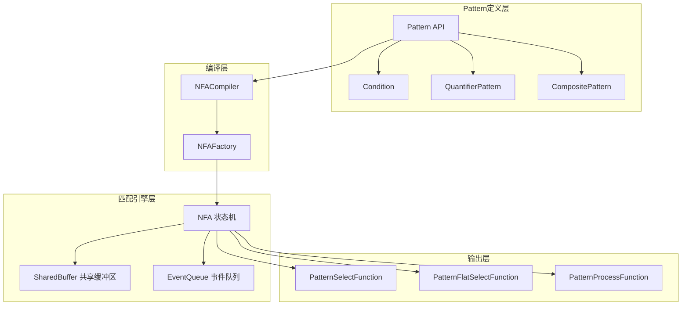

# Flink-09-CEP复杂事件处理（flink-cep）

## 一、模块概览

### 1.1 模块职责

CEP（Complex Event Processing）模块提供在事件流中检测复杂模式的能力。

**核心功能**：
- 模式定义（Pattern API）
- 模式匹配（NFA算法）
- 超时处理
- 迭代模式
- 组合模式

### 1.2 CEP架构



## 二、Pattern API

### 2.1 基础模式

```java
// 简单模式：检测单个事件
Pattern<Event, ?> pattern = Pattern.<Event>begin("start")
    .where(new SimpleCondition<Event>() {
        @Override
        public boolean filter(Event event) {
            return event.getName().equals("start");
        }
    });

// Lambda方式
Pattern<Event, ?> pattern = Pattern.<Event>begin("start")
    .where(event -> event.getName().equals("start"));
```

### 2.2 组合模式

#### 2.2.1 连续模式（next）

```java
// 严格连续：start后紧接着middle
Pattern<Event, ?> strictPattern = Pattern.<Event>begin("start")
    .where(event -> event.getName().equals("start"))
    .next("middle")
    .where(event -> event.getName().equals("middle"));

// 示例输入输出：
// 输入：start, middle -> 匹配
// 输入：start, other, middle -> 不匹配
```

#### 2.2.2 宽松连续（followedBy）

```java
// 宽松连续：start后最终跟着middle（中间可以有其他事件）
Pattern<Event, ?> relaxedPattern = Pattern.<Event>begin("start")
    .where(event -> event.getName().equals("start"))
    .followedBy("middle")
    .where(event -> event.getName().equals("middle"));

// 示例输入输出：
// 输入：start, middle -> 匹配
// 输入：start, other, middle -> 匹配
// 输入：start, other1, other2, middle -> 匹配
```

#### 2.2.3 非确定宽松连续（followedByAny）

```java
// 非确定宽松连续：匹配所有可能的middle
Pattern<Event, ?> nonDeterministicPattern = Pattern.<Event>begin("start")
    .where(event -> event.getName().equals("start"))
    .followedByAny("middle")
    .where(event -> event.getName().equals("middle"));

// 示例输入输出：
// 输入：start, middle1, middle2 
// 匹配：
//   - start, middle1
//   - start, middle2
```

### 2.3 量词模式

#### 2.3.1 times - 精确次数

```java
// 精确出现2次
Pattern<Event, ?> pattern = Pattern.<Event>begin("start")
    .where(event -> event.getType().equals("A"))
    .times(2);

// 输入：A1, A2 -> 匹配
// 输入：A1, A2, A3 -> 不匹配（超过2次）
```

#### 2.3.2 times(from, to) - 范围次数

```java
// 出现2-4次
Pattern<Event, ?> pattern = Pattern.<Event>begin("start")
    .where(event -> event.getType().equals("A"))
    .times(2, 4);

// 输入：A1, A2 -> 匹配
// 输入：A1, A2, A3 -> 匹配
// 输入：A1, A2, A3, A4 -> 匹配
// 输入：A1 -> 不匹配（少于2次）
// 输入：A1, A2, A3, A4, A5 -> 不匹配（超过4次）
```

#### 2.3.3 oneOrMore - 一次或多次

```java
// 一次或多次
Pattern<Event, ?> pattern = Pattern.<Event>begin("start")
    .where(event -> event.getType().equals("A"))
    .oneOrMore();

// 输入：A1 -> 匹配
// 输入：A1, A2 -> 匹配
// 输入：A1, A2, A3, ... -> 匹配
```

#### 2.3.4 optional - 可选

```java
// 可选（0或1次）
Pattern<Event, ?> pattern = Pattern.<Event>begin("start")
    .where(event -> event.getType().equals("A"))
    .optional();

// 输入：（无A） -> 匹配
// 输入：A1 -> 匹配
```

### 2.4 条件

#### 2.4.1 SimpleCondition

```java
// 简单条件
pattern.where(new SimpleCondition<Event>() {
    @Override
    public boolean filter(Event event) {
        return event.getValue() > 10;
    }
});
```

#### 2.4.2 IterativeCondition - 迭代条件

```java
// 迭代条件：可以访问之前匹配的事件
Pattern<Event, ?> pattern = Pattern.<Event>begin("start")
    .where(event -> event.getName().equals("start"))
    .followedBy("middle")
    .where(new IterativeCondition<Event>() {
        @Override
        public boolean filter(Event current, Context<Event> ctx) throws Exception {
            // 获取之前匹配的start事件
            Iterable<Event> startEvents = ctx.getEventsForPattern("start");
            Event startEvent = startEvents.iterator().next();
            
            // 当前事件的值必须大于start事件
            return current.getValue() > startEvent.getValue();
        }
    });
```

#### 2.4.3 SubtypeCondition - 子类型条件

```java
// 子类型条件
Pattern<Event, ?> pattern = Pattern.<Event>begin("start")
    .subtype(StartEvent.class)
    .followedBy("middle")
    .subtype(MiddleEvent.class);
```

### 2.5 时间约束

#### 2.5.1 within - 模式超时

```java
// 整个模式必须在10秒内完成
Pattern<Event, ?> pattern = Pattern.<Event>begin("start")
    .where(event -> event.getName().equals("start"))
    .followedBy("end")
    .where(event -> event.getName().equals("end"))
    .within(Time.seconds(10));

// 输入：start(t=0), end(t=5) -> 匹配
// 输入：start(t=0), end(t=15) -> 不匹配（超时）
```

#### 2.5.2 until - 终止条件

```java
// 持续匹配直到满足终止条件
Pattern<Event, ?> pattern = Pattern.<Event>begin("start")
    .where(event -> event.getType().equals("A"))
    .oneOrMore()
    .until(event -> event.getType().equals("END"));

// 输入：A1, A2, A3, END -> 匹配(A1, A2, A3)
```

## 三、核心实现

### 3.1 NFA - 非确定有限自动机

#### 3.1.1 NFA状态

```java
/**
 * NFA状态
 */
public class State<T> {
    
    private final String name;
    private StateType stateType; // Start, Normal, Final
    private final List<StateTransition<T>> stateTransitions;
    
    public enum StateType {
        Start,   // 起始状态
        Normal,  // 中间状态
        Final    // 最终状态
    }
}

/**
 * 状态转换
 */
public class StateTransition<T> {
    
    private final State<T> targetState;
    private final IterativeCondition<T> condition;
    private final TransitionType transitionType;
    
    public enum TransitionType {
        TAKE,        // 消费事件并转换
        PROCEED,     // 不消费事件直接转换
        IGNORE       // 忽略事件保持当前状态
    }
}
```

#### 3.1.2 NFA编译

```java
public class NFACompiler {
    
    /**
     * 将Pattern编译为NFA
     */
    public static <T> NFA<T> compile(
            Pattern<T, ?> pattern,
            boolean timeoutHandling) {
        
        // 1. 创建状态
        Map<String, State<T>> states = new HashMap<>();
        State<T> startState = createStartState();
        states.put(startState.getName(), startState);
        
        // 2. 遍历Pattern，创建状态和转换
        State<T> currentState = startState;
        for (Pattern<T, ?> currentPattern : pattern.getPreceeding()) {
            State<T> nextState = createState(currentPattern);
            states.put(nextState.getName(), nextState);
            
            // 创建状态转换
            addTransitions(currentState, nextState, currentPattern);
            
            currentState = nextState;
        }
        
        // 3. 创建最终状态
        State<T> finalState = createFinalState();
        states.put(finalState.getName(), finalState);
        addTransitions(currentState, finalState, pattern);
        
        // 4. 返回NFA
        return new NFA<>(
            states.values(),
            startState,
            pattern.getWindowTime());
    }
    
    private static <T> void addTransitions(
            State<T> from,
            State<T> to,
            Pattern<T, ?> pattern) {
        
        // 根据Pattern类型添加不同的转换
        IterativeCondition<T> condition = pattern.getCondition();
        
        // TAKE转换：消费事件
        from.addTake(to, condition);
        
        // 根据连续性策略添加PROCEED或IGNORE转换
        if (pattern.getQuantifier().hasProperty(Quantifier.QuantifierProperty.SINGLE)) {
            // 单次匹配，添加PROCEED
            from.addProceed(to, condition);
        }
        
        if (pattern.getConsumingStrategy() == Quantifier.ConsumingStrategy.SKIP_TILL_ANY) {
            // 跳过不匹配的事件
            from.addIgnore(condition);
        }
    }
}
```

### 3.2 SharedBuffer - 共享缓冲区

```java
/**
 * 共享缓冲区：存储部分匹配结果
 */
public class SharedBuffer<T> {
    
    // 事件缓存
    private final Map<EventId, Lockable<T>> events;
    
    // 部分匹配结果
    private final Map<ComputationState, SharedBufferNode> partialMatches;
    
    /**
     * 添加事件到缓冲区
     */
    public SharedBufferNode put(
            ComputationState computationState,
            T event,
            long timestamp) {
        
        // 1. 生成事件ID
        EventId eventId = new EventId(event, timestamp);
        
        // 2. 存储事件
        Lockable<T> lockableEvent = new Lockable<>(event, 1);
        events.put(eventId, lockableEvent);
        
        // 3. 创建SharedBufferNode
        SharedBufferNode node = new SharedBufferNode(
            computationState,
            eventId,
            computationState.getPreviousState());
        
        // 4. 存储部分匹配
        partialMatches.put(computationState, node);
        
        return node;
    }
    
    /**
     * 提取完整匹配结果
     */
    public Map<String, List<T>> extractMatches(
            SharedBufferNode finalNode) {
        
        Map<String, List<T>> result = new HashMap<>();
        
        // 回溯提取事件
        SharedBufferNode currentNode = finalNode;
        while (currentNode != null) {
            String patternName = currentNode.getState().getName();
            EventId eventId = currentNode.getEventId();
            T event = events.get(eventId).getElement();
            
            result.computeIfAbsent(patternName, k -> new ArrayList<>())
                  .add(0, event); // 逆序插入
            
            currentNode = currentNode.getPreviousNode();
        }
        
        return result;
    }
    
    /**
     * 清理超时的部分匹配
     */
    public void advanceTime(long currentTime) {
        Iterator<Map.Entry<ComputationState, SharedBufferNode>> iterator =
            partialMatches.entrySet().iterator();
        
        while (iterator.hasNext()) {
            Map.Entry<ComputationState, SharedBufferNode> entry = iterator.next();
            if (entry.getKey().getStartTimestamp() + windowTime < currentTime) {
                // 超时，删除
                iterator.remove();
                releaseNode(entry.getValue());
            }
        }
    }
}
```

### 3.3 CEPOperator - 算子实现

```java
public class CEPOperator<IN, OUT> extends AbstractUdfStreamOperator<OUT, PatternProcessFunction<IN, OUT>>
        implements OneInputStreamOperator<IN, OUT> {
    
    private transient NFA<IN> nfa;
    private transient SharedBuffer<IN> sharedBuffer;
    
    @Override
    public void open() throws Exception {
        super.open();
        
        // 1. 编译NFA
        nfa = NFACompiler.compile(pattern, timeoutHandling);
        
        // 2. 初始化SharedBuffer
        sharedBuffer = new SharedBuffer<>();
    }
    
    @Override
    public void processElement(StreamRecord<IN> element) throws Exception {
        // 1. 获取事件
        IN event = element.getValue();
        long timestamp = element.getTimestamp();
        
        // 2. 处理事件
        Collection<Map<String, List<IN>>> matches = 
            nfa.process(sharedBuffer, event, timestamp);
        
        // 3. 输出匹配结果
        for (Map<String, List<IN>> match : matches) {
            OUT result = userFunction.processMatch(match, context);
            output.collect(new StreamRecord<>(result, timestamp));
        }
        
        // 4. 处理超时
        Collection<Tuple2<Map<String, List<IN>>, Long>> timeouts = 
            nfa.advanceTime(sharedBuffer, timestamp);
        
        for (Tuple2<Map<String, List<IN>>, Long> timeout : timeouts) {
            userFunction.processTimedOutMatch(timeout.f0, context);
        }
    }
}
```

## 四、使用示例

### 4.1 登录失败检测

```java
/**
 * 检测连续3次登录失败
 */
public class LoginFailureDetection {
    
    public static void main(String[] args) throws Exception {
        StreamExecutionEnvironment env = 
            StreamExecutionEnvironment.getExecutionEnvironment();
        
        // 1. 数据源
        DataStream<LoginEvent> loginStream = env.addSource(...);
        
        // 2. 定义Pattern
        Pattern<LoginEvent, ?> pattern = Pattern.<LoginEvent>begin("start")
            .where(event -> event.getStatus().equals("fail"))
            .times(3).consecutive() // 连续3次
            .within(Time.minutes(5)); // 5分钟内
        
        // 3. 应用Pattern
        PatternStream<LoginEvent> patternStream = CEP.pattern(
            loginStream.keyBy(LoginEvent::getUserId),
            pattern);
        
        // 4. 提取匹配结果
        DataStream<Alert> alerts = patternStream.select(
            (PatternSelectFunction<LoginEvent, Alert>) match -> {
                List<LoginEvent> failures = match.get("start");
                return new Alert(
                    failures.get(0).getUserId(),
                    "连续3次登录失败",
                    failures);
            });
        
        alerts.print();
        env.execute("Login Failure Detection");
    }
}
```

### 4.2 温度异常检测

```java
/**
 * 检测温度持续升高
 */
public class TemperatureMonitoring {
    
    public static void main(String[] args) throws Exception {
        StreamExecutionEnvironment env = 
            StreamExecutionEnvironment.getExecutionEnvironment();
        
        DataStream<TemperatureEvent> tempStream = env.addSource(...);
        
        // Pattern：温度持续升高3次
        Pattern<TemperatureEvent, ?> pattern = Pattern
            .<TemperatureEvent>begin("first")
            .where(event -> event.getTemp() > 30)
            .followedBy("second")
            .where(new IterativeCondition<TemperatureEvent>() {
                @Override
                public boolean filter(TemperatureEvent current, Context<TemperatureEvent> ctx) 
                        throws Exception {
                    TemperatureEvent first = ctx.getEventsForPattern("first")
                        .iterator().next();
                    return current.getTemp() > first.getTemp();
                }
            })
            .followedBy("third")
            .where(new IterativeCondition<TemperatureEvent>() {
                @Override
                public boolean filter(TemperatureEvent current, Context<TemperatureEvent> ctx) 
                        throws Exception {
                    TemperatureEvent second = ctx.getEventsForPattern("second")
                        .iterator().next();
                    return current.getTemp() > second.getTemp();
                }
            })
            .within(Time.minutes(10));
        
        PatternStream<TemperatureEvent> patternStream = CEP.pattern(
            tempStream.keyBy(TemperatureEvent::getSensorId),
            pattern);
        
        DataStream<Alert> alerts = patternStream.select(
            (PatternSelectFunction<TemperatureEvent, Alert>) match -> {
                TemperatureEvent first = match.get("first").get(0);
                TemperatureEvent second = match.get("second").get(0);
                TemperatureEvent third = match.get("third").get(0);
                
                return new Alert(
                    first.getSensorId(),
                    String.format("温度持续升高: %.1f -> %.1f -> %.1f",
                        first.getTemp(), second.getTemp(), third.getTemp()));
            });
        
        alerts.print();
        env.execute("Temperature Monitoring");
    }
}
```

### 4.3 超时处理

```java
/**
 * 订单超时检测
 */
public class OrderTimeoutDetection {
    
    public static void main(String[] args) throws Exception {
        StreamExecutionEnvironment env = 
            StreamExecutionEnvironment.getExecutionEnvironment();
        
        DataStream<OrderEvent> orderStream = env.addSource(...);
        
        // Pattern：订单创建后15分钟内未支付
        Pattern<OrderEvent, ?> pattern = Pattern.<OrderEvent>begin("create")
            .where(event -> event.getType().equals("create"))
            .followedBy("pay")
            .where(event -> event.getType().equals("pay"))
            .within(Time.minutes(15));
        
        PatternStream<OrderEvent> patternStream = CEP.pattern(
            orderStream.keyBy(OrderEvent::getOrderId),
            pattern);
        
        // 使用侧输出处理超时
        OutputTag<OrderEvent> timeoutTag = 
            new OutputTag<OrderEvent>("timeout"){};
        
        SingleOutputStreamOperator<OrderEvent> result = patternStream.flatSelect(
            timeoutTag,
            // 超时处理
            (PatternFlatTimeoutFunction<OrderEvent, OrderEvent>) (match, timestamp, out) -> {
                OrderEvent createEvent = match.get("create").get(0);
                out.collect(createEvent); // 输出超时订单
            },
            // 正常匹配处理
            (PatternFlatSelectFunction<OrderEvent, OrderEvent>) (match, out) -> {
                // 正常支付，不输出
            }
        );
        
        // 获取超时订单
        DataStream<OrderEvent> timeoutOrders = result.getSideOutput(timeoutTag);
        
        timeoutOrders.print();
        env.execute("Order Timeout Detection");
    }
}
```

## 五、最佳实践

### 5.1 性能优化

```java
// 1. 使用consecutive()减少状态
Pattern.<Event>begin("start")
    .where(event -> event.getType().equals("A"))
    .times(3).consecutive() // 必须连续，状态更少
    .within(Time.seconds(10));

// 2. 合理设置窗口时间
pattern.within(Time.minutes(5)); // 不要设置过长

// 3. 使用greedy()贪婪匹配
pattern.oneOrMore().greedy(); // 尽可能多地匹配
```

### 5.2 复杂模式分解

```java
// 将复杂模式分解为多个简单模式
// Bad: 一个复杂模式
Pattern<Event, ?> complexPattern = ...;

// Good: 多个简单模式串联
DataStream<PartialResult> partial = CEP.pattern(input, simplePattern1)
    .select(...);

DataStream<FinalResult> final = CEP.pattern(partial, simplePattern2)
    .select(...);
```

### 5.3 状态管理

```java
// 使用CEP前先keyBy，确保状态正确分区
DataStream<Event> input = ...;

// Bad: 不keyBy直接应用CEP
PatternStream<Event> bad = CEP.pattern(input, pattern);

// Good: 先keyBy
PatternStream<Event> good = CEP.pattern(
    input.keyBy(Event::getUserId),
    pattern);
```

## 六、总结

CEP模块提供强大的模式匹配能力：

**Pattern API**：
- 基础模式：begin/where
- 组合模式：next/followedBy/followedByAny
- 量词：times/oneOrMore/optional
- 时间约束：within/until

**核心实现**：
- NFA：非确定有限自动机
- SharedBuffer：共享缓冲区存储部分匹配
- CEPOperator：流式处理算子

**适用场景**：
- 异常检测（登录失败、温度异常）
- 业务规则（订单超时、流程违规）
- 实时监控（系统故障、用户行为分析）

**最佳实践**：
- 合理设置窗口时间
- 使用consecutive减少状态
- 复杂模式分解
- 先keyBy再应用CEP

理解CEP对于实现复杂事件驱动应用至关重要。

