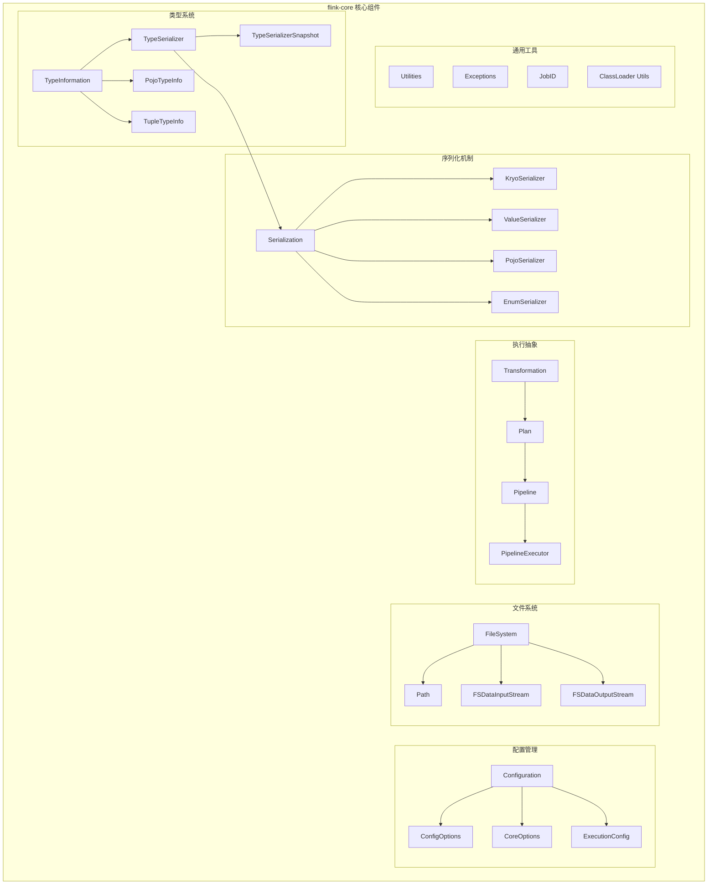
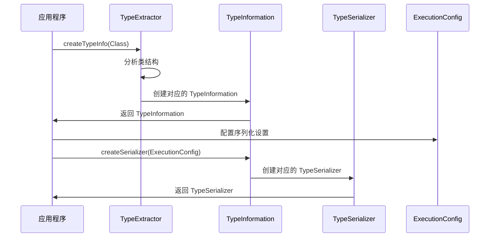
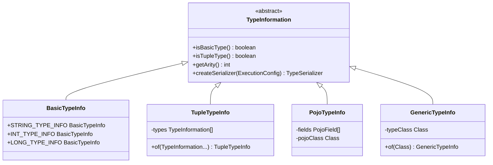
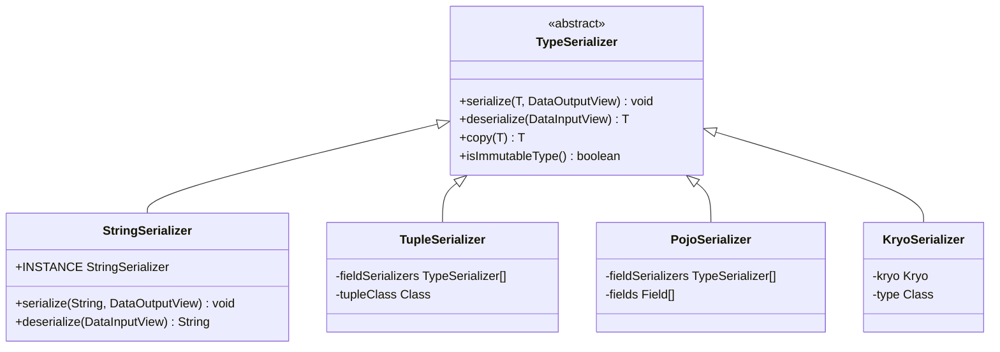

## 1. 模块概述

flink-core 是 Flink 的核心基础模块，提供了所有其他模块依赖的基础设施和通用组件。该模块包含了类型系统、序列化机制、配置管理、文件系统抽象、执行图抽象等核心功能。

### 1.1 模块架构图



### 1.2 主要包结构

```
flink-core/
├── api/
│   ├── common/              # 通用 API 组件
│   │   ├── typeinfo/        # 类型信息
│   │   ├── typeutils/       # 类型工具
│   │   ├── serialization/   # 序列化接口
│   │   ├── operators/       # 算子抽象
│   │   ├── functions/       # 函数接口
│   │   └── io/              # 输入输出接口
│   ├── dag/                 # 有向无环图抽象
│   └── java/                # Java API 工具
├── configuration/           # 配置管理
├── core/                    # 核心组件
│   ├── execution/           # 执行抽象
│   ├── fs/                  # 文件系统
│   └── memory/              # 内存管理
├── types/                   # 基础数据类型
├── util/                    # 通用工具类
└── plugin/                  # 插件机制
```

## 2. 类型系统 - TypeInformation

### 2.1 TypeInformation 抽象基类

```java
/**
 * TypeInformation 是 Flink 类型系统的核心类
 * 用于生成序列化器和比较器，执行语义检查
 */
@Public
public abstract class TypeInformation<T> implements Serializable {

    private static final long serialVersionUID = -7742311969684489493L;

    /**
     * 检查此类型是否为基本类型
     * 基本类型是不可分割的原子类型（如 int, long, String）
     */
    public abstract boolean isBasicType();

    /**
     * 检查此类型是否为元组类型
     */
    public abstract boolean isTupleType();

    /**
     * 获取此类型的元数（字段数量）
     * 对于原子类型返回 1，对于元组类型返回字段数量
     */
    public abstract int getArity();

    /**
     * 获取此类型及其嵌套类型的总字段数
     */
    public abstract int getTotalFields();

    /**
     * 获取此类型信息表示的 Java 类
     */
    public abstract Class<T> getTypeClass();

    /**
     * 检查给定对象是否为此类型的实例
     */
    public boolean isAssignableFrom(TypeInformation<?> typeInformation) {
        return typeInformation != null && typeInformation.getTypeClass() != null &&
               getTypeClass().isAssignableFrom(typeInformation.getTypeClass());
    }

    /**
     * 检查此类型是否可以作为键使用
     * 只有实现了 Comparable 接口或有有效键选择器的类型才能作为键
     */
    public abstract boolean isKeyType();

    /**
     * 检查此类型是否可以排序
     */
    public boolean isSortKeyType() {
        return isKeyType();
    }

    /**
     * 为此类型创建序列化器
     * 
     * @param config 执行配置，包含序列化相关设置
     * @return 此类型的序列化器
     */
    public abstract TypeSerializer<T> createSerializer(ExecutionConfig config);

    /**
     * 为此类型创建比较器
     * 
     * @param sortOrderAscending 是否升序排序
     * @param config 执行配置
     * @return 此类型的比较器
     */
    public abstract TypeComparator<T> createComparator(boolean sortOrderAscending, ExecutionConfig config);

    // ------------------------------------------------------------------------
    // 静态工厂方法
    // ------------------------------------------------------------------------

    /**
     * 为给定类创建类型信息
     */
    public static <X> TypeInformation<X> of(Class<X> typeClass) {
        return TypeExtractor.createTypeInfo(typeClass);
    }

    /**
     * 为给定类型提示创建类型信息
     */
    public static <X> TypeInformation<X> of(TypeHint<X> typeHint) {
        return typeHint.getTypeInfo();
    }

    // ------------------------------------------------------------------------
    // 类型检查方法
    // ------------------------------------------------------------------------

    /**
     * 检查两个类型信息是否相等
     */
    @Override
    public abstract boolean equals(Object obj);

    /**
     * 计算哈希码
     */
    @Override
    public abstract int hashCode();

    /**
     * 检查此类型是否可以从给定类型信息表示的类型赋值
     */
    public boolean canEqual(Object obj) {
        return obj != null && obj.getClass() == getClass();
    }

    /**
     * 返回此类型信息的字符串表示
     */
    @Override
    public abstract String toString();
}
```

### 2.2 BasicTypeInfo 基本类型信息

```java
/**
 * 基本类型的类型信息实现
 * 包括 String, Boolean, Byte, Short, Integer, Long, Float, Double, Character
 */
@Public
public class BasicTypeInfo<T> extends TypeInformation<T> implements AtomicType<T> {

    private static final long serialVersionUID = 1L;

    // 预定义的基本类型信息常量
    public static final BasicTypeInfo<String> STRING_TYPE_INFO = new BasicTypeInfo<>(String.class, new Class<?>[]{}, StringSerializer.INSTANCE, StringComparator.class);
    public static final BasicTypeInfo<Boolean> BOOLEAN_TYPE_INFO = new BasicTypeInfo<>(Boolean.class, new Class<?>[]{}, BooleanSerializer.INSTANCE, BooleanComparator.class);
    public static final BasicTypeInfo<Byte> BYTE_TYPE_INFO = new BasicTypeInfo<>(Byte.class, new Class<?>[]{}, ByteSerializer.INSTANCE, ByteComparator.class);
    public static final BasicTypeInfo<Short> SHORT_TYPE_INFO = new BasicTypeInfo<>(Short.class, new Class<?>[]{}, ShortSerializer.INSTANCE, ShortComparator.class);
    public static final BasicTypeInfo<Integer> INT_TYPE_INFO = new BasicTypeInfo<>(Integer.class, new Class<?>[]{}, IntSerializer.INSTANCE, IntComparator.class);
    public static final BasicTypeInfo<Long> LONG_TYPE_INFO = new BasicTypeInfo<>(Long.class, new Class<?>[]{}, LongSerializer.INSTANCE, LongComparator.class);
    public static final BasicTypeInfo<Float> FLOAT_TYPE_INFO = new BasicTypeInfo<>(Float.class, new Class<?>[]{}, FloatSerializer.INSTANCE, FloatComparator.class);
    public static final BasicTypeInfo<Double> DOUBLE_TYPE_INFO = new BasicTypeInfo<>(Double.class, new Class<?>[]{}, DoubleSerializer.INSTANCE, DoubleComparator.class);
    public static final BasicTypeInfo<Character> CHAR_TYPE_INFO = new BasicTypeInfo<>(Character.class, new Class<?>[]{}, CharSerializer.INSTANCE, CharComparator.class);

    // 基本类型信息映射
    private static final Map<Class<?>, BasicTypeInfo<?>> TYPES = new HashMap<>();

    static {
        TYPES.put(String.class, STRING_TYPE_INFO);
        TYPES.put(Boolean.class, BOOLEAN_TYPE_INFO);
        TYPES.put(boolean.class, BOOLEAN_TYPE_INFO);
        TYPES.put(Byte.class, BYTE_TYPE_INFO);
        TYPES.put(byte.class, BYTE_TYPE_INFO);
        TYPES.put(Short.class, SHORT_TYPE_INFO);
        TYPES.put(short.class, SHORT_TYPE_INFO);
        TYPES.put(Integer.class, INT_TYPE_INFO);
        TYPES.put(int.class, INT_TYPE_INFO);
        TYPES.put(Long.class, LONG_TYPE_INFO);
        TYPES.put(long.class, LONG_TYPE_INFO);
        TYPES.put(Float.class, FLOAT_TYPE_INFO);
        TYPES.put(float.class, FLOAT_TYPE_INFO);
        TYPES.put(Double.class, DOUBLE_TYPE_INFO);
        TYPES.put(double.class, DOUBLE_TYPE_INFO);
        TYPES.put(Character.class, CHAR_TYPE_INFO);
        TYPES.put(char.class, CHAR_TYPE_INFO);
    }

    private final Class<T> clazz;
    private final TypeSerializer<T> serializer;
    private final Class<? extends TypeComparator<T>> comparatorClass;

    /**
     * 构造函数
     */
    protected BasicTypeInfo(Class<T> clazz, Class<?>[] possibleCastTargets, TypeSerializer<T> serializer, Class<? extends TypeComparator<T>> comparatorClass) {
        this.clazz = checkNotNull(clazz);
        this.serializer = checkNotNull(serializer);
        this.comparatorClass = checkNotNull(comparatorClass);
    }

    /**
     * 获取基本类型信息
     */
    @SuppressWarnings("unchecked")
    public static <X> BasicTypeInfo<X> getInfoFor(Class<X> type) {
        BasicTypeInfo<?> info = TYPES.get(type);
        return (BasicTypeInfo<X>) info;
    }

    @Override
    public boolean isBasicType() {
        return true;
    }

    @Override
    public boolean isTupleType() {
        return false;
    }

    @Override
    public int getArity() {
        return 1;
    }

    @Override
    public int getTotalFields() {
        return 1;
    }

    @Override
    public Class<T> getTypeClass() {
        return clazz;
    }

    @Override
    public boolean isKeyType() {
        return true;
    }

    @Override
    public TypeSerializer<T> createSerializer(ExecutionConfig config) {
        return serializer;
    }

    @Override
    @SuppressWarnings("unchecked")
    public TypeComparator<T> createComparator(boolean sortOrderAscending, ExecutionConfig config) {
        try {
            return InstantiationUtil.instantiate(comparatorClass, sortOrderAscending);
        } catch (Exception e) {
            throw new RuntimeException("Could not initialize basic type comparator " + comparatorClass.getName(), e);
        }
    }

    @Override
    public boolean equals(Object obj) {
        if (obj instanceof BasicTypeInfo) {
            BasicTypeInfo<?> other = (BasicTypeInfo<?>) obj;
            return other.canEqual(this) && clazz == other.clazz;
        } else {
            return false;
        }
    }

    @Override
    public boolean canEqual(Object obj) {
        return obj instanceof BasicTypeInfo;
    }

    @Override
    public int hashCode() {
        return clazz.hashCode();
    }

    @Override
    public String toString() {
        return clazz.getSimpleName();
    }
}
```

### 2.3 TupleTypeInfo 元组类型信息

```java
/**
 * 元组类型的类型信息实现
 * 支持 Flink 的 Tuple1 到 Tuple25
 */
@Public
public class TupleTypeInfo<T extends Tuple> extends TupleTypeInfoBase<T> {

    private static final long serialVersionUID = 1L;

    @SuppressWarnings("unchecked")
    public TupleTypeInfo(TypeInformation<?>... types) {
        this((Class<T>) Tuple.getTupleClass(types.length), types);
    }

    public TupleTypeInfo(Class<T> tupleType, TypeInformation<?>... types) {
        super(tupleType, types);

        checkArgument(
            Tuple.class.isAssignableFrom(tupleType),
            "Tuple type expected.");

        checkArgument(
            tupleType.equals(Tuple.getTupleClass(types.length)),
            "Tuple arity (%d) does not match provided types (%d)", getArity(), types.length);
    }

    @Override
    @SuppressWarnings("unchecked")
    public TupleSerializer<T> createSerializer(ExecutionConfig config) {
        TypeSerializer<?>[] fieldSerializers = new TypeSerializer<?>[getArity()];
        for (int i = 0; i < types.length; i++) {
            fieldSerializers[i] = types[i].createSerializer(config);
        }

        Class<T> tupleClass = getTypeClass();
        return new TupleSerializer<T>(tupleClass, fieldSerializers);
    }

    @Override
    protected TypeComparatorBuilder<T> createTypeComparatorBuilder() {
        return new TupleTypeComparatorBuilder();
    }

    /**
     * 元组类型比较器构建器
     */
    private class TupleTypeComparatorBuilder implements TypeComparatorBuilder<T> {
        
        private TypeComparator<?>[] fieldComparators;
        private int[] logicalKeyFields;

        @Override
        public void initializeTypeComparatorBuilder(int size) {
            fieldComparators = new TypeComparator<?>[size];
            logicalKeyFields = new int[size];
        }

        @Override
        public void addComparatorField(int fieldId, TypeComparator<?> comparator) {
            fieldComparators[fieldId] = comparator;
            logicalKeyFields[fieldId] = fieldId;
        }

        @Override
        public TypeComparator<T> createTypeComparator(ExecutionConfig config) {
            checkState(fieldComparators != null, "TypeComparatorBuilder was not initialized.");

            return new TupleComparator<T>(
                logicalKeyFields,
                fieldComparators,
                (TypeSerializer<T>) createSerializer(config));
        }
    }

    // ------------------------------------------------------------------------
    // 静态工厂方法
    // ------------------------------------------------------------------------

    public static <T0> TupleTypeInfo<Tuple1<T0>> of(TypeInformation<T0> t0) {
        return new TupleTypeInfo<>(t0);
    }

    public static <T0, T1> TupleTypeInfo<Tuple2<T0, T1>> of(TypeInformation<T0> t0, TypeInformation<T1> t1) {
        return new TupleTypeInfo<>(t0, t1);
    }

    public static <T0, T1, T2> TupleTypeInfo<Tuple3<T0, T1, T2>> of(TypeInformation<T0> t0, TypeInformation<T1> t1, TypeInformation<T2> t2) {
        return new TupleTypeInfo<>(t0, t1, t2);
    }

    // ... 更多重载方法

    @Override
    public String toString() {
        return "Tuple" + getArity() + "<" + 
               Arrays.stream(types)
                     .map(TypeInformation::toString)
                     .collect(Collectors.joining(", ")) + ">";
    }
}
```

## 3. 序列化机制 - TypeSerializer

### 3.1 TypeSerializer 抽象基类

```java
/**
 * TypeSerializer 描述了数据类型被 Flink 运行时处理所需的方法
 * 包含序列化和复制方法
 */
@PublicEvolving
public abstract class TypeSerializer<T> implements Serializable {

    private static final long serialVersionUID = 1L;

    // ------------------------------------------------------------------------
    // 类型和序列化器的一般信息
    // ------------------------------------------------------------------------

    /**
     * 获取类型是否为不可变类型
     */
    public abstract boolean isImmutableType();

    /**
     * 如果必要，创建此序列化器的深拷贝（如果它是有状态的）
     * 如果序列化器是无状态的，可以返回自身
     */
    public abstract TypeSerializer<T> duplicate();

    // ------------------------------------------------------------------------
    // 实例化和克隆
    // ------------------------------------------------------------------------

    /**
     * 创建数据类型的新实例
     */
    public abstract T createInstance();

    /**
     * 创建给定元素的深拷贝
     */
    public abstract T copy(T from);

    /**
     * 创建给定元素的拷贝，尝试重用给定的元素（如果类型是可变的）
     */
    public abstract T copy(T from, T reuse);

    // ------------------------------------------------------------------------
    // 序列化
    // ------------------------------------------------------------------------

    /**
     * 获取数据类型的长度（如果是固定长度数据类型）
     * 
     * @return 数据类型的长度，或 -1 表示可变长度数据类型
     */
    public abstract int getLength();

    /**
     * 将给定记录序列化到目标输出视图
     */
    public abstract void serialize(T record, DataOutputView target) throws IOException;

    /**
     * 从源输入视图反序列化记录
     */
    public abstract T deserialize(DataInputView source) throws IOException;

    /**
     * 从源输入视图反序列化记录到给定的重用记录实例（如果可变）
     */
    public abstract T deserialize(T reuse, DataInputView source) throws IOException;

    /**
     * 从源输入视图复制一条记录到目标输出视图
     */
    public abstract void copy(DataInputView source, DataOutputView target) throws IOException;

    // ------------------------------------------------------------------------
    // 兼容性和快照
    // ------------------------------------------------------------------------

    /**
     * 创建此序列化器的快照
     * 快照用于检查序列化器的兼容性
     */
    public abstract TypeSerializerSnapshot<T> snapshotConfiguration();

    // ------------------------------------------------------------------------
    // 实用方法
    // ------------------------------------------------------------------------

    /**
     * 检查两个序列化器是否相等
     */
    @Override
    public abstract boolean equals(Object obj);

    /**
     * 计算序列化器的哈希码
     */
    @Override
    public abstract int hashCode();
}
```

### 3.2 基本类型序列化器实现

```java
/**
 * String 类型的序列化器
 */
public final class StringSerializer extends TypeSerializerSingleton<String> {

    private static final long serialVersionUID = 1L;

    /** 单例实例 */
    public static final StringSerializer INSTANCE = new StringSerializer();

    private static final String EMPTY = "";

    @Override
    public boolean isImmutableType() {
        return true;
    }

    @Override
    public String createInstance() {
        return EMPTY;
    }

    @Override
    public String copy(String from) {
        return from; // String 是不可变的，直接返回
    }

    @Override
    public String copy(String from, String reuse) {
        return from; // String 是不可变的，忽略 reuse
    }

    @Override
    public int getLength() {
        return -1; // 可变长度
    }

    @Override
    public void serialize(String record, DataOutputView target) throws IOException {
        StringValue.writeString(record, target);
    }

    @Override
    public String deserialize(DataInputView source) throws IOException {
        return StringValue.readString(source);
    }

    @Override
    public String deserialize(String reuse, DataInputView source) throws IOException {
        return StringValue.readString(source);
    }

    @Override
    public void copy(DataInputView source, DataOutputView target) throws IOException {
        StringValue.copyString(source, target);
    }

    @Override
    public TypeSerializerSnapshot<String> snapshotConfiguration() {
        return new StringSerializerSnapshot();
    }

    /**
     * String 序列化器快照
     */
    public static final class StringSerializerSnapshot extends SimpleTypeSerializerSnapshot<String> {

        public StringSerializerSnapshot() {
            super(() -> INSTANCE);
        }
    }
}
```

```java
/**
 * 整数类型的序列化器
 */
public final class IntSerializer extends TypeSerializerSingleton<Integer> {

    private static final long serialVersionUID = 1L;

    /** 单例实例 */
    public static final IntSerializer INSTANCE = new IntSerializer();

    private static final Integer ZERO = 0;

    @Override
    public boolean isImmutableType() {
        return true;
    }

    @Override
    public Integer createInstance() {
        return ZERO;
    }

    @Override
    public Integer copy(Integer from) {
        return from; // Integer 是不可变的
    }

    @Override
    public Integer copy(Integer from, Integer reuse) {
        return from; // Integer 是不可变的
    }

    @Override
    public int getLength() {
        return 4; // int 固定 4 字节
    }

    @Override
    public void serialize(Integer record, DataOutputView target) throws IOException {
        target.writeInt(record);
    }

    @Override
    public Integer deserialize(DataInputView source) throws IOException {
        return source.readInt();
    }

    @Override
    public Integer deserialize(Integer reuse, DataInputView source) throws IOException {
        return source.readInt();
    }

    @Override
    public void copy(DataInputView source, DataOutputView target) throws IOException {
        target.writeInt(source.readInt());
    }

    @Override
    public TypeSerializerSnapshot<Integer> snapshotConfiguration() {
        return new IntSerializerSnapshot();
    }

    /**
     * 整数序列化器快照
     */
    public static final class IntSerializerSnapshot extends SimpleTypeSerializerSnapshot<Integer> {

        public IntSerializerSnapshot() {
            super(() -> INSTANCE);
        }
    }
}
```

### 3.3 复合类型序列化器

```java
/**
 * 元组序列化器
 * 处理 Flink 元组类型的序列化
 */
public final class TupleSerializer<T extends Tuple> extends TypeSerializer<T> {

    private static final long serialVersionUID = 1L;

    private final Class<T> tupleClass;
    private final TypeSerializer<Object>[] fieldSerializers;
    private final int arity;

    /**
     * 构造函数
     */
    @SuppressWarnings("unchecked")
    public TupleSerializer(Class<T> tupleClass, TypeSerializer<?>[] fieldSerializers) {
        this.tupleClass = checkNotNull(tupleClass);
        this.fieldSerializers = (TypeSerializer<Object>[]) checkNotNull(fieldSerializers);
        this.arity = fieldSerializers.length;

        for (int i = 0; i < fieldSerializers.length; i++) {
            if (fieldSerializers[i] == null) {
                throw new NullPointerException("Field serializer " + i + " is null");
            }
        }
    }

    @Override
    public boolean isImmutableType() {
        for (TypeSerializer<Object> fieldSerializer : fieldSerializers) {
            if (!fieldSerializer.isImmutableType()) {
                return false;
            }
        }
        return true;
    }

    @Override
    public TypeSerializer<T> duplicate() {
        boolean stateful = false;
        TypeSerializer<?>[] duplicatedFieldSerializers = new TypeSerializer[fieldSerializers.length];

        for (int i = 0; i < fieldSerializers.length; i++) {
            duplicatedFieldSerializers[i] = fieldSerializers[i].duplicate();
            if (duplicatedFieldSerializers[i] != fieldSerializers[i]) {
                stateful = true;
            }
        }

        if (stateful) {
            return new TupleSerializer<T>(tupleClass, duplicatedFieldSerializers);
        } else {
            return this;
        }
    }

    @Override
    @SuppressWarnings("unchecked")
    public T createInstance() {
        try {
            T tuple = tupleClass.newInstance();
            for (int i = 0; i < arity; i++) {
                tuple.setField(fieldSerializers[i].createInstance(), i);
            }
            return tuple;
        } catch (Exception e) {
            throw new RuntimeException("Cannot instantiate tuple.", e);
        }
    }

    @Override
    @SuppressWarnings("unchecked")
    public T copy(T from) {
        try {
            T tuple = tupleClass.newInstance();
            for (int i = 0; i < arity; i++) {
                Object fieldValue = from.getField(i);
                Object fieldCopy = fieldSerializers[i].copy(fieldValue);
                tuple.setField(fieldCopy, i);
            }
            return tuple;
        } catch (Exception e) {
            throw new RuntimeException("Cannot copy tuple.", e);
        }
    }

    @Override
    @SuppressWarnings("unchecked")
    public T copy(T from, T reuse) {
        for (int i = 0; i < arity; i++) {
            Object fieldValue = from.getField(i);
            Object reuseFieldValue = reuse.getField(i);
            Object fieldCopy = fieldSerializers[i].copy(fieldValue, reuseFieldValue);
            reuse.setField(fieldCopy, i);
        }
        return reuse;
    }

    @Override
    public int getLength() {
        int length = 0;
        for (TypeSerializer<Object> fieldSerializer : fieldSerializers) {
            int fieldLength = fieldSerializer.getLength();
            if (fieldLength < 0) {
                return -1; // 可变长度
            }
            length += fieldLength;
        }
        return length;
    }

    @Override
    public void serialize(T record, DataOutputView target) throws IOException {
        for (int i = 0; i < arity; i++) {
            Object fieldValue = record.getField(i);
            fieldSerializers[i].serialize(fieldValue, target);
        }
    }

    @Override
    public T deserialize(DataInputView source) throws IOException {
        try {
            T tuple = tupleClass.newInstance();
            for (int i = 0; i < arity; i++) {
                Object fieldValue = fieldSerializers[i].deserialize(source);
                tuple.setField(fieldValue, i);
            }
            return tuple;
        } catch (Exception e) {
            throw new RuntimeException("Cannot deserialize tuple.", e);
        }
    }

    @Override
    public T deserialize(T reuse, DataInputView source) throws IOException {
        for (int i = 0; i < arity; i++) {
            Object reuseFieldValue = reuse.getField(i);
            Object fieldValue = fieldSerializers[i].deserialize(reuseFieldValue, source);
            reuse.setField(fieldValue, i);
        }
        return reuse;
    }

    @Override
    public void copy(DataInputView source, DataOutputView target) throws IOException {
        for (int i = 0; i < arity; i++) {
            fieldSerializers[i].copy(source, target);
        }
    }

    @Override
    public TypeSerializerSnapshot<T> snapshotConfiguration() {
        return new TupleSerializerSnapshot<>(this);
    }

    @Override
    public boolean equals(Object obj) {
        if (obj instanceof TupleSerializer) {
            TupleSerializer<?> other = (TupleSerializer<?>) obj;
            return other.canEqual(this) &&
                   tupleClass == other.tupleClass &&
                   Arrays.equals(fieldSerializers, other.fieldSerializers);
        }
        return false;
    }

    @Override
    public int hashCode() {
        return Objects.hash(tupleClass, Arrays.hashCode(fieldSerializers));
    }

    public boolean canEqual(Object obj) {
        return obj instanceof TupleSerializer;
    }
}
```

## 4. 配置管理 - Configuration

### 4.1 Configuration 类

```java
/**
 * Configuration 类是 Flink 的配置管理核心
 * 提供类型安全的配置访问和序列化支持
 */
@Public
public class Configuration implements IOReadableWritable, Serializable, Cloneable {

    private static final long serialVersionUID = 1L;

    /** 配置数据存储 */
    protected final HashMap<String, Object> confData;

    /**
     * 默认构造函数
     */
    public Configuration() {
        this.confData = new HashMap<>();
    }

    /**
     * 拷贝构造函数
     */
    public Configuration(Configuration other) {
        this.confData = new HashMap<>(other.confData);
    }

    // ------------------------------------------------------------------------
    // 基本访问方法
    // ------------------------------------------------------------------------

    /**
     * 获取字符串值
     */
    public String getString(String key, String defaultValue) {
        return getRawValue(key)
            .map(ConfigurationUtils::convertToString)
            .orElse(defaultValue);
    }

    /**
     * 设置字符串值
     */
    public void setString(String key, String value) {
        setValueInternal(key, value);
    }

    /**
     * 获取整数值
     */
    public int getInteger(String key, int defaultValue) {
        return getRawValue(key)
            .map(ConfigurationUtils::convertToInt)
            .orElse(defaultValue);
    }

    /**
     * 设置整数值
     */
    public void setInteger(String key, int value) {
        setValueInternal(key, value);
    }

    /**
     * 获取长整数值
     */
    public long getLong(String key, long defaultValue) {
        return getRawValue(key)
            .map(ConfigurationUtils::convertToLong)
            .orElse(defaultValue);
    }

    /**
     * 设置长整数值
     */
    public void setLong(String key, long value) {
        setValueInternal(key, value);
    }

    /**
     * 获取布尔值
     */
    public boolean getBoolean(String key, boolean defaultValue) {
        return getRawValue(key)
            .map(ConfigurationUtils::convertToBoolean)
            .orElse(defaultValue);
    }

    /**
     * 设置布尔值
     */
    public void setBoolean(String key, boolean value) {
        setValueInternal(key, value);
    }

    /**
     * 获取浮点数值
     */
    public float getFloat(String key, float defaultValue) {
        return getRawValue(key)
            .map(ConfigurationUtils::convertToFloat)
            .orElse(defaultValue);
    }

    /**
     * 设置浮点数值
     */
    public void setFloat(String key, float value) {
        setValueInternal(key, value);
    }

    /**
     * 获取双精度浮点数值
     */
    public double getDouble(String key, double defaultValue) {
        return getRawValue(key)
            .map(ConfigurationUtils::convertToDouble)
            .orElse(defaultValue);
    }

    /**
     * 设置双精度浮点数值
     */
    public void setDouble(String key, double value) {
        setValueInternal(key, value);
    }

    /**
     * 获取字节数组值
     */
    public byte[] getBytes(String key, byte[] defaultValue) {
        return getRawValue(key)
            .map(o -> (byte[]) o)
            .orElse(defaultValue);
    }

    /**
     * 设置字节数组值
     */
    public void setBytes(String key, byte[] bytes) {
        setValueInternal(key, bytes);
    }

    // ------------------------------------------------------------------------
    // 类型安全的配置选项访问
    // ------------------------------------------------------------------------

    /**
     * 获取配置选项的值
     */
    public <T> T get(ConfigOption<T> option) {
        return getOptional(option).orElseGet(option::defaultValue);
    }

    /**
     * 获取配置选项的可选值
     */
    public <T> Optional<T> getOptional(ConfigOption<T> option) {
        Optional<Object> rawValue = getRawValueFromOption(option);
        Class<?> clazz = option.getClazz();

        try {
            if (rawValue.isPresent()) {
                return Optional.of(ConfigurationUtils.convertValue(rawValue.get(), clazz));
            } else {
                return Optional.empty();
            }
        } catch (Exception e) {
            throw new IllegalArgumentException(String.format(
                "Could not parse value '%s' for key '%s'.",
                rawValue.map(Object::toString).orElse(""), option.key()), e);
        }
    }

    /**
     * 设置配置选项的值
     */
    public <T> Configuration set(ConfigOption<T> option, T value) {
        setValueInternal(option.key(), value);
        return this;
    }

    // ------------------------------------------------------------------------
    // 内部方法
    // ------------------------------------------------------------------------

    /**
     * 获取原始值
     */
    private Optional<Object> getRawValue(String key) {
        if (key == null) {
            throw new NullPointerException("Key must not be null.");
        }
        synchronized (this.confData) {
            return Optional.ofNullable(this.confData.get(key));
        }
    }

    /**
     * 从配置选项获取原始值
     */
    private Optional<Object> getRawValueFromOption(ConfigOption<?> configOption) {
        // 首先尝试使用完整键
        Optional<Object> o = getRawValue(configOption.key());
        if (o.isPresent()) {
            return o;
        }

        // 然后尝试使用已弃用的键
        if (configOption.hasFallbackKeys()) {
            for (FallbackKey fallbackKey : configOption.fallbackKeys()) {
                String fallbackKeyStr = fallbackKey.getKey();
                Optional<Object> fallbackValue = getRawValue(fallbackKeyStr);
                if (fallbackValue.isPresent()) {
                    LOG.warn("Config uses deprecated configuration key '{}' instead of proper key '{}'",
                        fallbackKeyStr, configOption.key());
                    return fallbackValue;
                }
            }
        }

        return Optional.empty();
    }

    /**
     * 内部设置值方法
     */
    private void setValueInternal(String key, Object value) {
        if (key == null) {
            throw new NullPointerException("Key must not be null.");
        }
        if (value == null) {
            throw new NullPointerException("Value must not be null.");
        }

        synchronized (this.confData) {
            this.confData.put(key, value);
        }
    }

    // ------------------------------------------------------------------------
    // 序列化
    // ------------------------------------------------------------------------

    @Override
    public void read(DataInputView in) throws IOException {
        synchronized (this.confData) {
            final int numberOfProperties = in.readInt();

            for (int i = 0; i < numberOfProperties; i++) {
                String key = StringValue.readString(in);
                Object value;

                byte type = in.readByte();
                switch (type) {
                    case TYPE_STRING:
                        value = StringValue.readString(in);
                        break;
                    case TYPE_INT:
                        value = in.readInt();
                        break;
                    case TYPE_LONG:
                        value = in.readLong();
                        break;
                    case TYPE_FLOAT:
                        value = in.readFloat();
                        break;
                    case TYPE_DOUBLE:
                        value = in.readDouble();
                        break;
                    case TYPE_BOOLEAN:
                        value = in.readBoolean();
                        break;
                    case TYPE_BYTES:
                        byte[] bytes = new byte[in.readInt()];
                        in.readFully(bytes);
                        value = bytes;
                        break;
                    default:
                        throw new IOException(String.format("Unrecognized type: %s", type));
                }

                this.confData.put(key, value);
            }
        }
    }

    @Override
    public void write(DataOutputView out) throws IOException {
        synchronized (this.confData) {
            out.writeInt(this.confData.size());

            for (Map.Entry<String, Object> entry : this.confData.entrySet()) {
                String key = entry.getKey();
                Object val = entry.getValue();

                StringValue.writeString(key, out);
                Class<?> clazz = val.getClass();

                if (clazz == String.class) {
                    out.writeByte(TYPE_STRING);
                    StringValue.writeString((String) val, out);
                } else if (clazz == Integer.class) {
                    out.writeByte(TYPE_INT);
                    out.writeInt((Integer) val);
                } else if (clazz == Long.class) {
                    out.writeByte(TYPE_LONG);
                    out.writeLong((Long) val);
                } else if (clazz == Float.class) {
                    out.writeByte(TYPE_FLOAT);
                    out.writeFloat((Float) val);
                } else if (clazz == Double.class) {
                    out.writeByte(TYPE_DOUBLE);
                    out.writeDouble((Double) val);
                } else if (clazz == Boolean.class) {
                    out.writeByte(TYPE_BOOLEAN);
                    out.writeBoolean((Boolean) val);
                } else if (clazz == byte[].class) {
                    out.writeByte(TYPE_BYTES);
                    byte[] bytes = (byte[]) val;
                    out.writeInt(bytes.length);
                    out.write(bytes);
                } else {
                    throw new IllegalArgumentException("Unrecognized type");
                }
            }
        }
    }

    // ------------------------------------------------------------------------
    // 工具方法
    // ------------------------------------------------------------------------

    /**
     * 检查是否包含指定键
     */
    public boolean containsKey(String key) {
        synchronized (this.confData) {
            return this.confData.containsKey(key);
        }
    }

    /**
     * 获取所有键的集合
     */
    public Set<String> keySet() {
        synchronized (this.confData) {
            return new HashSet<>(this.confData.keySet());
        }
    }

    /**
     * 添加所有配置项
     */
    public void addAll(Configuration other) {
        synchronized (this.confData) {
            synchronized (other.confData) {
                this.confData.putAll(other.confData);
            }
        }
    }

    /**
     * 克隆配置
     */
    @Override
    public Configuration clone() {
        return new Configuration(this);
    }

    @Override
    public String toString() {
        return this.confData.toString();
    }
}
```

### 4.2 ConfigOption 配置选项

```java
/**
 * ConfigOption 表示一个配置选项
 * 提供类型安全的配置访问
 */
@PublicEvolving
public class ConfigOption<T> {

    private static final FallbackKey[] EMPTY = new FallbackKey[0];

    /** 配置键 */
    private final String key;

    /** 值的类型 */
    private final Class<T> clazz;

    /** 默认值 */
    private final T defaultValue;

    /** 描述信息 */
    private final Description description;

    /** 回退键 */
    private final FallbackKey[] fallbackKeys;

    /**
     * 构造函数
     */
    ConfigOption(
            String key,
            Class<T> clazz,
            Description description,
            T defaultValue,
            FallbackKey... fallbackKeys) {
        this.key = checkNotNull(key);
        this.clazz = checkNotNull(clazz);
        this.description = description;
        this.defaultValue = defaultValue;
        this.fallbackKeys = fallbackKeys == null ? EMPTY : fallbackKeys;
    }

    // ------------------------------------------------------------------------
    // 访问方法
    // ------------------------------------------------------------------------

    /**
     * 获取配置键
     */
    public String key() {
        return key;
    }

    /**
     * 获取值类型
     */
    public Class<T> getClazz() {
        return clazz;
    }

    /**
     * 检查是否有默认值
     */
    public boolean hasDefaultValue() {
        return defaultValue != null;
    }

    /**
     * 获取默认值
     */
    public T defaultValue() {
        return defaultValue;
    }

    /**
     * 检查是否有回退键
     */
    public boolean hasFallbackKeys() {
        return fallbackKeys.length > 0;
    }

    /**
     * 获取回退键
     */
    public Iterable<FallbackKey> fallbackKeys() {
        return Arrays.asList(fallbackKeys);
    }

    /**
     * 获取描述信息
     */
    public Description getDescription() {
        return description;
    }

    // ------------------------------------------------------------------------
    // 工厂方法
    // ------------------------------------------------------------------------

    /**
     * 创建字符串配置选项
     */
    public static ConfigOption<String> key(String key) {
        return new ConfigOptionBuilder(key, String.class);
    }

    /**
     * 创建整数配置选项
     */
    public static ConfigOptionBuilder intType(String key) {
        return new ConfigOptionBuilder(key, Integer.class);
    }

    /**
     * 创建长整数配置选项
     */
    public static ConfigOptionBuilder longType(String key) {
        return new ConfigOptionBuilder(key, Long.class);
    }

    /**
     * 创建布尔配置选项
     */
    public static ConfigOptionBuilder booleanType(String key) {
        return new ConfigOptionBuilder(key, Boolean.class);
    }

    /**
     * 创建浮点数配置选项
     */
    public static ConfigOptionBuilder floatType(String key) {
        return new ConfigOptionBuilder(key, Float.class);
    }

    /**
     * 创建双精度浮点数配置选项
     */
    public static ConfigOptionBuilder doubleType(String key) {
        return new ConfigOptionBuilder(key, Double.class);
    }

    // ------------------------------------------------------------------------
    // 标准方法
    // ------------------------------------------------------------------------

    @Override
    public boolean equals(Object o) {
        if (this == o) {
            return true;
        } else if (o != null && o.getClass() == ConfigOption.class) {
            ConfigOption<?> that = (ConfigOption<?>) o;
            return this.key.equals(that.key) &&
                   this.clazz == that.clazz &&
                   Arrays.equals(this.fallbackKeys, that.fallbackKeys) &&
                   Objects.equals(this.defaultValue, that.defaultValue);
        } else {
            return false;
        }
    }

    @Override
    public int hashCode() {
        return 31 * key.hashCode() + clazz.hashCode() +
               17 * Arrays.hashCode(fallbackKeys) + Objects.hashCode(defaultValue);
    }

    @Override
    public String toString() {
        return String.format("Key: '%s' , default: %s (%s)", key, defaultValue, clazz.getSimpleName());
    }
}
```

## 5. 文件系统抽象 - FileSystem

### 5.1 FileSystem 抽象基类

```java
/**
 * FileSystem 是 Flink 使用的所有文件系统的抽象基类
 * 可以扩展以实现分布式文件系统或本地文件系统
 */
@Public
public abstract class FileSystem {

    private static final Logger LOG = LoggerFactory.getLogger(FileSystem.class);

    /** 默认文件系统方案 */
    public static final String DEFAULT_SCHEME = "file";

    /** Hadoop 文件系统包装器的类名 */
    private static final String HADOOP_WRAPPER_FILESYSTEM_CLASS = "org.apache.flink.runtime.fs.hdfs.HadoopFileSystem";

    /** 文件系统工厂映射 */
    private static final HashMap<String, FileSystemFactory> FILE_SYSTEM_FACTORIES = new HashMap<>();

    /** 文件系统缓存 */
    private static final HashMap<FSKey, FileSystem> CACHE = new HashMap<>();

    /** 默认文件系统 */
    private static FileSystem defaultFileSystem;

    // ------------------------------------------------------------------------
    // 抽象方法
    // ------------------------------------------------------------------------

    /**
     * 获取文件系统的 URI 方案
     */
    public abstract String getScheme();

    /**
     * 获取指定路径的文件状态
     */
    public abstract FileStatus getFileStatus(Path f) throws IOException;

    /**
     * 获取指定路径下的文件状态数组
     */
    public abstract FileStatus[] listStatus(Path f) throws IOException;

    /**
     * 检查指定路径是否存在
     */
    public boolean exists(final Path f) throws IOException {
        try {
            return (getFileStatus(f) != null);
        } catch (FileNotFoundException e) {
            return false;
        }
    }

    /**
     * 删除指定路径的文件或目录
     */
    public abstract boolean delete(Path f, boolean recursive) throws IOException;

    /**
     * 创建目录
     */
    public abstract boolean mkdirs(Path f) throws IOException;

    /**
     * 打开文件进行读取
     */
    public abstract FSDataInputStream open(Path f, int bufferSize) throws IOException;

    /**
     * 打开文件进行读取（使用默认缓冲区大小）
     */
    public FSDataInputStream open(Path f) throws IOException {
        return open(f, -1);
    }

    /**
     * 创建文件进行写入
     */
    public abstract FSDataOutputStream create(Path f, WriteMode overwriteMode) throws IOException;

    /**
     * 重命名文件或目录
     */
    public abstract boolean rename(Path src, Path dst) throws IOException;

    /**
     * 检查文件系统是否为分布式文件系统
     */
    public abstract boolean isDistributedFS();

    // ------------------------------------------------------------------------
    // 静态访问方法
    // ------------------------------------------------------------------------

    /**
     * 获取指定 URI 的文件系统
     */
    public static FileSystem get(URI uri) throws IOException {
        return FileSystemSafetyNet.wrapWithSafetyNetWhenActivated(getUnguardedFileSystem(uri));
    }

    /**
     * 获取指定 URI 的文件系统（不使用安全网）
     */
    public static FileSystem getUnguardedFileSystem(final URI uri) throws IOException {
        checkNotNull(uri, "uri");

        final String scheme = uri.getScheme();
        final String authority = uri.getAuthority();

        // 检查缓存
        final FSKey key = new FSKey(scheme, authority);
        final FileSystem cached;

        synchronized (CACHE) {
            cached = CACHE.get(key);
        }

        if (cached != null) {
            return cached;
        }

        // 创建新的文件系统实例
        final FileSystem fs;
        final FileSystemFactory factory = getFileSystemFactory(scheme);

        if (factory != null) {
            ClassLoader classLoader = Thread.currentThread().getContextClassLoader();
            try {
                Thread.currentThread().setContextClassLoader(factory.getClassLoader());
                fs = factory.create(uri);
            } finally {
                Thread.currentThread().setContextClassLoader(classLoader);
            }
        } else if (scheme == null) {
            // 使用默认文件系统
            fs = getDefaultFileSystem();
        } else {
            // 尝试 Hadoop 文件系统
            fs = getHadoopFileSystem(uri);
        }

        // 缓存文件系统
        synchronized (CACHE) {
            FileSystem cached2 = CACHE.get(key);
            if (cached2 != null) {
                return cached2;
            } else {
                CACHE.put(key, fs);
                return fs;
            }
        }
    }

    /**
     * 获取本地文件系统
     */
    public static LocalFileSystem getLocalFileSystem() {
        return LocalFileSystem.getSharedInstance();
    }

    /**
     * 获取默认文件系统
     */
    private static FileSystem getDefaultFileSystem() {
        if (defaultFileSystem == null) {
            defaultFileSystem = getLocalFileSystem();
        }
        return defaultFileSystem;
    }

    /**
     * 获取文件系统工厂
     */
    private static FileSystemFactory getFileSystemFactory(String scheme) {
        synchronized (FILE_SYSTEM_FACTORIES) {
            return FILE_SYSTEM_FACTORIES.get(scheme);
        }
    }

    /**
     * 获取 Hadoop 文件系统
     */
    private static FileSystem getHadoopFileSystem(URI uri) throws IOException {
        Class<?> wrapperClass;
        try {
            wrapperClass = Class.forName(HADOOP_WRAPPER_FILESYSTEM_CLASS);
        } catch (ClassNotFoundException e) {
            throw new UnsupportedFileSystemSchemeException(
                "Cannot support file system for '" + uri.getScheme() + "' via Hadoop, " +
                "because Hadoop is not in the classpath, or some classes are missing from the classpath.");
        }

        try {
            return (FileSystem) wrapperClass
                .getMethod("get", URI.class)
                .invoke(null, uri);
        } catch (Exception e) {
            throw new IOException("Cannot instantiate Hadoop file system for URI: " + uri, e);
        }
    }

    // ------------------------------------------------------------------------
    // 初始化
    // ------------------------------------------------------------------------

    /**
     * 初始化文件系统
     */
    public static void initialize(Configuration config) throws IOException {
        initialize(config, null);
    }

    /**
     * 初始化文件系统（带插件管理器）
     */
    public static void initialize(Configuration config, PluginManager pluginManager) throws IOException {
        synchronized (FILE_SYSTEM_FACTORIES) {
            // 清除现有工厂
            FILE_SYSTEM_FACTORIES.clear();

            // 加载文件系统工厂
            loadFileSystemFactories(pluginManager);

            // 初始化文件系统
            for (FileSystemFactory factory : FILE_SYSTEM_FACTORIES.values()) {
                factory.configure(config);
            }
        }

        // 清除缓存
        synchronized (CACHE) {
            CACHE.clear();
        }
    }

    /**
     * 加载文件系统工厂
     */
    private static void loadFileSystemFactories(PluginManager pluginManager) {
        final ServiceLoader<FileSystemFactory> serviceLoader;

        if (pluginManager == null) {
            serviceLoader = ServiceLoader.load(FileSystemFactory.class);
        } else {
            serviceLoader = ServiceLoader.load(FileSystemFactory.class, pluginManager.createSharedClassLoader());
        }

        for (FileSystemFactory factory : serviceLoader) {
            String scheme = factory.getScheme();
            FileSystemFactory previous = FILE_SYSTEM_FACTORIES.put(scheme, factory);

            if (previous != null) {
                LOG.warn("Multiple FileSystemFactory for scheme '{}'. Using {} and ignoring {}",
                    scheme, factory.getClass().getName(), previous.getClass().getName());
            } else {
                LOG.debug("Added FileSystemFactory for scheme '{}': {}", scheme, factory.getClass().getName());
            }
        }
    }

    // ------------------------------------------------------------------------
    // 内部类
    // ------------------------------------------------------------------------

    /**
     * 文件系统缓存键
     */
    private static final class FSKey {
        
        private final String scheme;
        private final String authority;
        private final int hashCode;

        FSKey(String scheme, String authority) {
            this.scheme = scheme;
            this.authority = authority;
            this.hashCode = Objects.hash(scheme, authority);
        }

        @Override
        public boolean equals(Object obj) {
            if (this == obj) {
                return true;
            }
            if (obj == null || getClass() != obj.getClass()) {
                return false;
            }

            FSKey that = (FSKey) obj;
            return Objects.equals(this.scheme, that.scheme) &&
                   Objects.equals(this.authority, that.authority);
        }

        @Override
        public int hashCode() {
            return hashCode;
        }
    }
}
```

## 6. 执行抽象 - Transformation

### 6.1 Transformation 抽象基类

```java
/**
 * Transformation 表示创建 DataStream 的操作
 * 每个 DataStream 都有一个底层的 Transformation，它是该 DataStream 的来源
 */
@Internal
public abstract class Transformation<T> {

    /** 转换 ID，用于唯一标识 */
    protected int id;

    /** 转换名称 */
    protected String name;

    /** 输出类型 */
    protected TypeInformation<T> outputType;

    /** 并行度 */
    protected int parallelism;

    /** 最大并行度 */
    protected int maxParallelism = -1;

    /** 资源规格 */
    protected ResourceSpec minResources = ResourceSpec.DEFAULT;
    protected ResourceSpec preferredResources = ResourceSpec.DEFAULT;

    /** UID 哈希 */
    protected String uidHash;

    /** 槽共享组 */
    protected String slotSharingGroup;

    /** 协同定位组 */
    protected String coLocationGroup;

    /** 缓冲超时 */
    protected long bufferTimeout = -1;

    /**
     * 构造函数
     */
    public Transformation(String name, TypeInformation<T> outputType, int parallelism) {
        this.id = getNewTransformationId();
        this.name = checkNotNull(name);
        this.outputType = checkNotNull(outputType);
        this.parallelism = parallelism;
    }

    /**
     * 获取转换 ID
     */
    public int getId() {
        return id;
    }

    /**
     * 设置 UID
     */
    public Transformation<T> uid(String uid) {
        this.uidHash = Hashing.sha1().hashString(uid, Charset.forName("UTF-8")).toString();
        return this;
    }

    /**
     * 获取 UID 哈希
     */
    public String getUidHash() {
        return uidHash;
    }

    /**
     * 设置名称
     */
    public Transformation<T> name(String name) {
        this.name = name;
        return this;
    }

    /**
     * 获取名称
     */
    public String getName() {
        return name;
    }

    /**
     * 获取输出类型
     */
    public TypeInformation<T> getOutputType() {
        return outputType;
    }

    /**
     * 设置并行度
     */
    public Transformation<T> setParallelism(int parallelism) {
        checkArgument(parallelism > 0 || parallelism == ExecutionConfig.PARALLELISM_DEFAULT,
            "The parallelism must be at least 1, or ExecutionConfig.PARALLELISM_DEFAULT (use system default).");
        this.parallelism = parallelism;
        return this;
    }

    /**
     * 获取并行度
     */
    public int getParallelism() {
        return parallelism;
    }

    /**
     * 设置最大并行度
     */
    public Transformation<T> setMaxParallelism(int maxParallelism) {
        checkArgument(maxParallelism > 0, "The maximum parallelism must be greater than 0.");
        this.maxParallelism = maxParallelism;
        return this;
    }

    /**
     * 获取最大并行度
     */
    public int getMaxParallelism() {
        return maxParallelism;
    }

    /**
     * 设置资源规格
     */
    public Transformation<T> setResources(ResourceSpec minResources, ResourceSpec preferredResources) {
        this.minResources = checkNotNull(minResources);
        this.preferredResources = checkNotNull(preferredResources);
        return this;
    }

    /**
     * 获取最小资源规格
     */
    public ResourceSpec getMinResources() {
        return minResources;
    }

    /**
     * 获取首选资源规格
     */
    public ResourceSpec getPreferredResources() {
        return preferredResources;
    }

    /**
     * 设置槽共享组
     */
    public Transformation<T> slotSharingGroup(String slotSharingGroup) {
        this.slotSharingGroup = slotSharingGroup;
        return this;
    }

    /**
     * 获取槽共享组
     */
    public String getSlotSharingGroup() {
        return slotSharingGroup;
    }

    /**
     * 设置协同定位组
     */
    public Transformation<T> coLocationGroup(String coLocationGroup) {
        this.coLocationGroup = coLocationGroup;
        return this;
    }

    /**
     * 获取协同定位组
     */
    public String getCoLocationGroup() {
        return coLocationGroup;
    }

    /**
     * 设置缓冲超时
     */
    public Transformation<T> setBufferTimeout(long bufferTimeout) {
        checkArgument(bufferTimeout >= -1);
        this.bufferTimeout = bufferTimeout;
        return this;
    }

    /**
     * 获取缓冲超时
     */
    public long getBufferTimeout() {
        return bufferTimeout;
    }

    /**
     * 获取输入转换列表
     */
    public abstract List<Transformation<?>> getInputs();

    /**
     * 获取转换 ID 计数器
     */
    private static final AtomicInteger transformationIdCounter = new AtomicInteger();

    /**
     * 生成新的转换 ID
     */
    private static int getNewTransformationId() {
        return transformationIdCounter.getAndIncrement();
    }

    @Override
    public String toString() {
        return getClass().getSimpleName() + "{" +
               "id=" + id +
               ", name='" + name + '\'' +
               ", outputType=" + outputType +
               ", parallelism=" + parallelism +
               '}';
    }
}
```

## 7. 时序图分析

### 7.1 类型系统初始化时序



### 7.2 配置管理时序

```mermaid
sequenceDiagram
    participant App as 应用程序
    participant Config as Configuration
    participant Option as ConfigOption
    participant Utils as ConfigurationUtils
    
    App->>Option: key("config.key")
    Option->>Option: 创建 ConfigOption
    Option->>App: 返回 ConfigOption
    
    App->>Config: set(ConfigOption, value)
    Config->>Config: 存储配置值
    
    App->>Config: get(ConfigOption)
    Config->>Utils: convertValue(rawValue, targetType)
    Utils->>Config: 转换后的值
    Config->>App: 返回配置值
```

## 8. 核心类层次结构

### 8.1 TypeInformation 层次结构



### 8.2 TypeSerializer 层次结构



flink-core 模块是 Flink 的基础设施核心，为整个 Flink 生态系统提供了类型安全、高性能的序列化机制、灵活的配置管理、统一的文件系统抽象和强大的执行图抽象。这些组件共同构成了 Flink 强大而灵活的基础架构。
