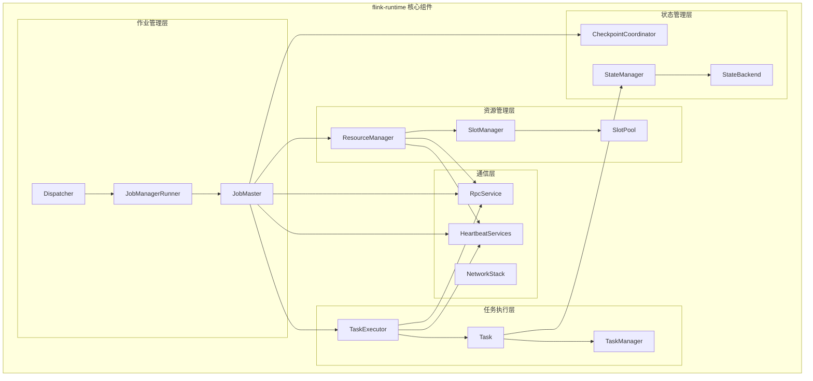
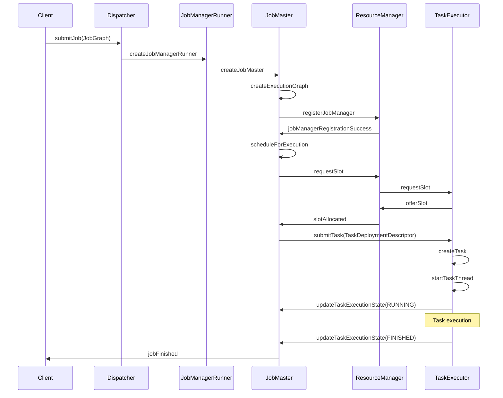
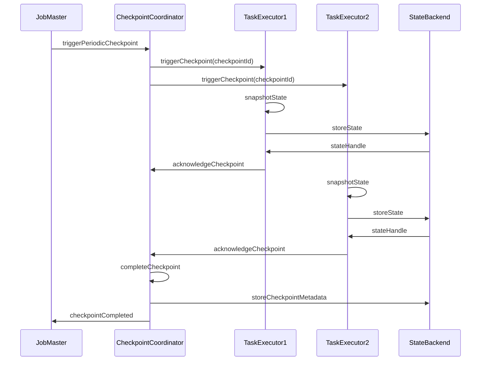

# Apache Flink 源码剖析 - flink-runtime 模块分析

## 1. 模块概述

flink-runtime 是 Flink 的核心运行时模块，负责作业的调度、执行、容错等核心功能。它是整个 Flink 系统的心脏，包含了 JobManager、TaskManager、资源管理、网络通信等关键组件。

### 1.1 模块架构图



### 1.2 主要包结构

```
flink-runtime/
├── checkpoint/           # 检查点相关
├── clusterframework/     # 集群框架
├── dispatcher/           # 作业分发器
├── executiongraph/       # 执行图
├── jobgraph/            # 作业图
├── jobmaster/           # 作业管理器
├── jobmanager/          # 作业管理器（旧版）
├── resourcemanager/     # 资源管理器
├── taskexecutor/        # 任务执行器
├── taskmanager/         # 任务管理器
├── rpc/                 # RPC 通信
├── io/                  # 网络 I/O
├── memory/              # 内存管理
├── state/               # 状态管理
├── metrics/             # 指标系统
└── util/                # 工具类
```

## 2. JobMaster - 作业管理器

### 2.1 JobMaster 类结构

```java
/**
 * JobMaster 负责单个 JobGraph 的执行
 * 提供 RPC 接口与 JobMaster 远程交互
 */
public class JobMaster extends FencedRpcEndpoint<JobMasterId> 
    implements JobMasterGateway, JobMasterService {
    
    /** 默认的 JobManager 名称 */
    public static final String JOB_MANAGER_NAME = "jobmanager";
    
    // 核心组件
    private final JobMasterConfiguration jobMasterConfiguration;
    private final ResourceID resourceId;
    private final JobGraph jobGraph;
    private final Time rpcTimeout;
    private final HighAvailabilityServices highAvailabilityServices;
    private final BlobWriter blobWriter;
    private final HeartbeatServices heartbeatServices;
    private final ScheduledExecutorService scheduledExecutorService;
    
    // 调度相关
    private final SlotPool slotPool;
    private final Scheduler scheduler;
    private final SchedulerNGFactory schedulerNGFactory;
    
    // 资源管理
    private final LeaderRetrievalService resourceManagerLeaderRetriever;
    private final Map<ResourceID, Tuple2<TaskManagerLocation, TaskExecutorGateway>> registeredTaskManagers;
    
    // 背压监控
    private final BackPressureStatsTracker backPressureStatsTracker;
    
    // 混洗服务
    private final ShuffleMaster<?> shuffleMaster;
}
```

### 2.2 JobMaster 构造函数

```java
/**
 * JobMaster 构造函数
 * 初始化所有必要的服务和组件
 */
public JobMaster(
        RpcService rpcService,
        JobMasterConfiguration jobMasterConfiguration,
        ResourceID resourceId,
        JobGraph jobGraph,
        HighAvailabilityServices highAvailabilityService,
        SlotPoolFactory slotPoolFactory,
        SchedulerFactory schedulerFactory,
        JobManagerSharedServices jobManagerSharedServices,
        HeartbeatServices heartbeatServices,
        JobManagerJobMetricGroupFactory jobMetricGroupFactory,
        OnCompletionActions jobCompletionActions,
        FatalErrorHandler fatalErrorHandler,
        ClassLoader userCodeLoader,
        SchedulerNGFactory schedulerNGFactory,
        ShuffleMaster<?> shuffleMaster,
        PartitionTrackerFactory partitionTrackerFactory) throws Exception {

    super(rpcService, AkkaRpcServiceUtils.createRandomName(JOB_MANAGER_NAME), null);

    this.jobMasterConfiguration = checkNotNull(jobMasterConfiguration);
    this.resourceId = checkNotNull(resourceId);
    this.jobGraph = checkNotNull(jobGraph);
    this.rpcTimeout = jobMasterConfiguration.getRpcTimeout();
    this.highAvailabilityServices = checkNotNull(highAvailabilityService);
    this.blobWriter = jobManagerSharedServices.getBlobWriter();
    this.scheduledExecutorService = jobManagerSharedServices.getScheduledExecutorService();
    this.jobCompletionActions = checkNotNull(jobCompletionActions);
    this.fatalErrorHandler = checkNotNull(fatalErrorHandler);
    this.userCodeLoader = checkNotNull(userCodeLoader);
    this.schedulerNGFactory = checkNotNull(schedulerNGFactory);
    this.heartbeatServices = checkNotNull(heartbeatServices);
    this.jobMetricGroupFactory = checkNotNull(jobMetricGroupFactory);

    final String jobName = jobGraph.getName();
    final JobID jid = jobGraph.getJobID();

    log.info("Initializing job {} ({}).", jobName, jid);

    // 初始化资源管理器领导者检索服务
    resourceManagerLeaderRetriever = highAvailabilityServices.getResourceManagerLeaderRetriever();

    // 创建 SlotPool
    this.slotPool = checkNotNull(slotPoolFactory).createSlotPool(jobGraph.getJobID());

    // 创建调度器
    this.scheduler = checkNotNull(schedulerFactory).createScheduler(slotPool);

    this.registeredTaskManagers = new HashMap<>(4);
    this.partitionTracker = checkNotNull(partitionTrackerFactory)
        .create(resourceID -> {
            Tuple2<TaskManagerLocation, TaskExecutorGateway> taskManagerInfo = registeredTaskManagers.get(resourceID);
            if (taskManagerInfo == null) {
                return Optional.empty();
            }
            return Optional.of(taskManagerInfo.f1);
        });

    this.backPressureStatsTracker = checkNotNull(jobManagerSharedServices.getBackPressureStatsTracker());
    this.shuffleMaster = checkNotNull(shuffleMaster);

    this.jobManagerJobMetricGroup = jobMetricGroupFactory.create(jobGraph);
    this.executionGraph = createAndRestoreExecutionGraph(jobManagerJobMetricGroup);
    this.jobStatusListener = null;

    this.resourceManagerConnection = null;
    this.establishedResourceManagerConnection = null;
}
```

### 2.3 JobMaster 核心方法

#### 2.3.1 作业启动

```java
/**
 * 启动 JobMaster
 */
@Override
protected void onStart() throws Exception {
    try {
        startJobExecution(jobMasterId);
    } catch (Exception e) {
        final JobExecutionException jobExecutionException = new JobExecutionException(
            jobGraph.getJobID(), "Could not start the JobMaster.", e);

        onFatalError(jobExecutionException);
        throw jobExecutionException;
    }
}

/**
 * 开始作业执行
 */
private void startJobExecution(JobMasterId newJobMasterId) throws Exception {

    validateRunsInMainThread();

    checkNotNull(newJobMasterId, "The new JobMasterId must not be null.");

    if (Objects.equals(getFencingToken(), newJobMasterId)) {
        log.info("Already started the job execution with JobMasterId {}.", newJobMasterId);
        return;
    }

    setNewFencingToken(newJobMasterId);

    startJobMasterServices();

    log.info("Starting execution of job {} ({}) under job master id {}.", 
             jobGraph.getName(), jobGraph.getJobID(), newJobMasterId);

    resetAndStartScheduler();
}

/**
 * 启动 JobMaster 服务
 */
private void startJobMasterServices() throws Exception {
    startHeartbeatServices();

    // start the slot pool make sure the slot pool now accepts messages for this leader
    slotPool.start(getFencingToken(), getAddress(), getMainThreadExecutor());

    // job is ready to go, try to establish connection with resource manager
    //   - activate leader retrieval for the resource manager
    //   - on notification of the leader, the connection will be established and
    //     the slot pool will start requesting slots
    resourceManagerLeaderRetriever.start(new ResourceManagerLeaderListener());
}
```

#### 2.3.2 任务状态更新

```java
/**
 * 更新任务执行状态
 */
@Override
public CompletableFuture<Acknowledge> updateTaskExecutionState(
        final TaskExecutionState taskExecutionState) {

    checkNotNull(taskExecutionState, "taskExecutionState");

    if (schedulerNG.updateTaskExecutionState(taskExecutionState)) {
        return CompletableFuture.completedFuture(Acknowledge.get());
    } else {
        return FutureUtils.completedExceptionally(
            new ExecutionGraphException("The execution attempt " +
                taskExecutionState.getID() + " was not found."));
    }
}
```

#### 2.3.3 检查点触发

```java
/**
 * 触发检查点
 */
@Override
public CompletableFuture<String> triggerCheckpoint(
        CheckpointType checkpointType,
        Time timeout) {

    final CheckpointCoordinator checkpointCoordinator = executionGraph.getCheckpointCoordinator();

    if (checkpointCoordinator == null) {
        return FutureUtils.completedExceptionally(new IllegalStateException(
            String.format("Job %s is not a streaming job.", jobGraph.getJobID())));
    } else if (checkpointCoordinator.isPeriodicCheckpointingConfigured() && 
               checkpointType.equals(CheckpointType.CHECKPOINT)) {
        return FutureUtils.completedExceptionally(new IllegalStateException(
            String.format("Job %s has periodic checkpointing enabled.", jobGraph.getJobID())));
    } else {
        final CompletableFuture<CompletedCheckpoint> checkpointFuture = 
            checkpointCoordinator.triggerCheckpoint(checkpointType, System.currentTimeMillis(), false);

        return checkpointFuture.thenApply(CompletedCheckpoint::getExternalPointer);
    }
}
```

## 3. TaskExecutor - 任务执行器

### 3.1 TaskExecutor 类结构

```java
/**
 * TaskExecutor 是 TaskManager 的实现
 * 负责执行任务和管理资源
 */
public class TaskExecutor extends RpcEndpoint implements TaskExecutorGateway {
    
    public static final String TASK_MANAGER_NAME = "taskmanager";
    
    // 配置和资源
    private final TaskManagerConfiguration taskManagerConfiguration;
    private final TaskExecutorResourceSpec taskExecutorResourceSpec;
    private final HardwareDescription hardwareDescription;
    private final ResourceID resourceId;
    
    // 服务组件
    private final HeartbeatServices heartbeatServices;
    private final TaskManagerServices taskManagerServices;
    private final HighAvailabilityServices haServices;
    private final BlobCacheService blobCacheService;
    
    // 任务管理
    private final TaskSlotTable<Task> taskSlotTable;
    private final JobTable jobTable;
    private final JobManagerTable jobManagerTable;
    
    // 网络和内存
    private final ShuffleEnvironment<?, ?> shuffleEnvironment;
    private final KvStateService kvStateService;
    private final BroadcastVariableManager broadcastVariableManager;
    
    // 状态管理
    private final TaskLocalStateStoresManager localStateStoresManager;
    
    // 指标
    private final TaskManagerMetricGroup taskManagerMetricGroup;
}
```

### 3.2 任务提交处理

```java
/**
 * 提交任务到 TaskExecutor
 */
@Override
public CompletableFuture<Acknowledge> submitTask(
        TaskDeploymentDescriptor tdd,
        JobMasterId jobMasterId,
        Time timeout) {

    try {
        final JobID jobId = tdd.getJobId();
        final ExecutionAttemptID executionAttemptID = tdd.getExecutionAttemptId();
        final JobManagerConnection jobManagerConnection = jobManagerTable.get(jobId);

        // 验证 JobManager 连接
        if (jobManagerConnection == null) {
            final String message = "Could not submit task because there is no JobManager " +
                "associated for the job " + jobId + '.';
            log.debug(message);
            throw new TaskSubmissionException(message);
        }

        // 验证 JobMaster ID
        if (!Objects.equals(jobManagerConnection.getJobMasterId(), jobMasterId)) {
            final String message = "Rejecting the task submission because the job manager leader id " +
                jobMasterId + " does not match the expected job manager leader id " +
                jobManagerConnection.getJobMasterId() + '.';
            log.debug(message);
            throw new TaskSubmissionException(message);
        }

        // 标记 slot 为活跃状态
        if (!taskSlotTable.tryMarkSlotActive(jobId, tdd.getAllocationId())) {
            final String message = "No task slot allocated for job ID " + jobId +
                " and allocation ID " + tdd.getAllocationId() + '.';
            log.debug(message);
            throw new TaskSubmissionException(message);
        }

        // 重新集成卸载的数据
        try {
            tdd.loadBigData(blobCacheService.getPermanentBlobService());
        } catch (IOException | ClassNotFoundException e) {
            throw new TaskSubmissionException("Could not re-integrate offloaded TaskDeploymentDescriptor data.", e);
        }

        // 反序列化预序列化的信息
        final JobInformation jobInformation;
        final TaskInformation taskInformation;
        try {
            jobInformation = tdd.getSerializedJobInformation()
                .deserializeValue(getClass().getClassLoader());
            taskInformation = tdd.getSerializedTaskInformation()
                .deserializeValue(getClass().getClassLoader());
        } catch (IOException | ClassNotFoundException e) {
            throw new TaskSubmissionException("Could not deserialize the job or task information.", e);
        }

        // 创建任务
        Task task = createTask(
            jobInformation,
            taskInformation,
            tdd,
            jobManagerConnection);

        log.info("Received task {}.", task.getTaskInfo().getTaskNameWithSubtasks());

        // 添加任务到 slot table
        boolean taskAdded;
        try {
            taskAdded = taskSlotTable.addTask(task);
        } catch (SlotNotFoundException | SlotNotActiveException e) {
            throw new TaskSubmissionException("Could not submit task.", e);
        }

        if (taskAdded) {
            // 启动任务线程
            task.startTaskThread();

            setupResultPartitionBookkeeping(
                tdd.getJobId(),
                tdd.getProducedPartitions(),
                task.getTerminationFuture());

            return CompletableFuture.completedFuture(Acknowledge.get());
        } else {
            final String message = "TaskManager already contains a task for id " +
                task.getExecutionId() + '.';

            log.debug(message);
            throw new TaskSubmissionException(message);
        }
    } catch (TaskSubmissionException e) {
        return FutureUtils.completedExceptionally(e);
    }
}
```

### 3.3 任务创建

```java
/**
 * 创建 Task 实例
 */
private Task createTask(
        JobInformation jobInformation,
        TaskInformation taskInformation,
        TaskDeploymentDescriptor tdd,
        JobManagerConnection jobManagerConnection) throws TaskSubmissionException {

    TaskManagerActions taskManagerActions = jobManagerConnection.getTaskManagerActions();
    InputSplitProvider inputSplitProvider = jobManagerConnection.getInputSplitProvider();
    CheckpointResponder checkpointResponder = jobManagerConnection.getCheckpointResponder();
    TaskOperatorEventGateway taskOperatorEventGateway = jobManagerConnection.getTaskOperatorEventGateway();

    GlobalAggregateManager aggregateManager = jobManagerConnection.getGlobalAggregateManager();
    LibraryCacheManager libraryCache = jobManagerConnection.getLibraryCacheManager();
    ResultPartitionConsumableNotifier resultPartitionConsumableNotifier = 
        jobManagerConnection.getResultPartitionConsumableNotifier();
    PartitionProducerStateChecker partitionStateChecker = 
        jobManagerConnection.getPartitionStateChecker();

    // 创建本地状态存储
    final TaskLocalStateStore localStateStore = localStateStoresManager.localStateStoreForSubtask(
        tdd.getJobId(),
        tdd.getAllocationId(),
        taskInformation.getJobVertexId(),
        tdd.getSubtaskIndex());

    final JobManagerTaskRestore taskRestore = tdd.getTaskRestore();

    // 创建任务状态管理器
    final TaskStateManager taskStateManager = new TaskStateManagerImpl(
        tdd.getJobId(),
        tdd.getExecutionAttemptId(),
        localStateStore,
        taskRestore,
        checkpointResponder);

    // 获取内存管理器
    MemoryManager memoryManager;
    try {
        memoryManager = taskSlotTable.getTaskMemoryManager(tdd.getAllocationId());
    } catch (SlotNotFoundException e) {
        throw new TaskSubmissionException("Could not submit task.", e);
    }

    // 创建 Task
    Task task = new Task(
        jobInformation,
        taskInformation,
        tdd.getExecutionAttemptId(),
        tdd.getAllocationId(),
        tdd.getSubtaskIndex(),
        tdd.getAttemptNumber(),
        tdd.getProducedPartitions(),
        tdd.getInputGates(),
        tdd.getTargetSlotNumber(),
        memoryManager,
        taskExecutorServices.getIOManager(),
        taskExecutorServices.getShuffleEnvironment(),
        taskExecutorServices.getKvStateService(),
        taskExecutorServices.getBroadcastVariableManager(),
        taskExecutorServices.getTaskEventDispatcher(),
        taskStateManager,
        taskManagerActions,
        inputSplitProvider,
        checkpointResponder,
        taskOperatorEventGateway,
        aggregateManager,
        blobCacheService,
        libraryCache,
        fileCache,
        taskManagerConfiguration,
        taskMetricGroup,
        resultPartitionConsumableNotifier,
        partitionStateChecker,
        getRpcService().getExecutor());

    return task;
}
```

## 4. Task - 任务执行

### 4.1 Task 类结构

```java
/**
 * Task 表示在 TaskManager 上执行的并行子任务
 * Task 包装 Flink 算子并运行它，提供所有必要的服务
 */
public class Task implements Runnable, TaskSlotPayload, TaskActions,
        PartitionProducerStateProvider, CheckpointListener {

    /** 任务执行的可能状态 */
    public enum TaskState {
        CREATED,
        DEPLOYING,
        RUNNING,
        FINISHED,
        CANCELED,
        FAILED
    }

    // 任务信息
    private final TaskInfo taskInfo;
    private final JobID jobId;
    private final ExecutionAttemptID executionId;
    private final AllocationID allocationId;
    
    // 执行环境
    private final ClassLoader userCodeClassLoader;
    private final MemoryManager memoryManager;
    private final IOManager ioManager;
    private final BroadcastVariableManager broadcastVariableManager;
    private final TaskEventDispatcher taskEventDispatcher;
    
    // 状态管理
    private final TaskStateManager taskStateManager;
    private final AbstractInvokable invokable;
    
    // 网络
    private final ResultPartition[] producedPartitions;
    private final InputGate[] inputGates;
    
    // 监控和指标
    private final TaskManagerActions taskManagerActions;
    private final TaskMetricGroup metrics;
    
    // 执行状态
    private volatile ExecutionState executionState = ExecutionState.CREATED;
    private volatile Throwable failureCause;
    
    // 线程管理
    private Thread executingThread;
    private volatile boolean interruptFlag;
}
```

### 4.2 任务执行流程

```java
/**
 * Task 的主要执行方法
 */
@Override
public void run() {
    // 更改为 RUNNING 状态，除非取消或失败
    while (true) {
        ExecutionState current = this.executionState;
        if (current == ExecutionState.CREATED) {
            if (transitionState(ExecutionState.CREATED, ExecutionState.DEPLOYING)) {
                // 成功转换到 DEPLOYING 状态
                break;
            }
        }
        else if (current == ExecutionState.FAILED) {
            // 任务已经失败
            return;
        }
        else if (current == ExecutionState.CANCELING) {
            if (transitionState(ExecutionState.CANCELING, ExecutionState.CANCELED)) {
                // 成功取消
                return;
            }
        }
        else {
            if (LOG.isDebugEnabled()) {
                LOG.debug("Task {} switched from {} to {} while being started.", 
                         taskNameWithSubtask, current, this.executionState);
            }
        }
    }

    // 所有资源初始化完成，现在可以运行用户代码
    runWithSystemExitMonitoring();
}

/**
 * 运行用户代码，监控系统退出
 */
private void runWithSystemExitMonitoring() {
    boolean exitMonitoringEnabled = taskManagerConfiguration.isExitJvmOnOutOfMemoryError();
    
    if (exitMonitoringEnabled) {
        // 启用系统退出监控
        JvmShutdownSafeguard.installAsShutdownHook(LOG);
    }

    try {
        doRun();
    } finally {
        if (exitMonitoringEnabled) {
            JvmShutdownSafeguard.uninstallAsShutdownHook();
        }
    }
}

/**
 * 核心执行逻辑
 */
private void doRun() {
    // 获取执行线程
    executingThread = Thread.currentThread();

    // 检查是否被中断
    if (isCanceledOrFailed()) {
        return;
    }

    // 转换到 RUNNING 状态
    if (!transitionState(ExecutionState.DEPLOYING, ExecutionState.RUNNING)) {
        return;
    }

    // 通知 TaskManager 任务开始运行
    taskManagerActions.updateTaskExecutionState(
        new TaskExecutionState(jobId, executionId, ExecutionState.RUNNING));

    // 确保任何错误都会导致资源清理
    try {
        // 运行用户代码
        invokable.invoke();

        // 确保所有生产的数据都被刷新
        for (ResultPartition partition : producedPartitions) {
            if (partition != null) {
                partition.finish();
            }
        }

        // 转换到 FINISHED 状态
        if (transitionState(ExecutionState.RUNNING, ExecutionState.FINISHED)) {
            taskManagerActions.updateTaskExecutionState(
                new TaskExecutionState(jobId, executionId, ExecutionState.FINISHED));
        }
    }
    catch (Throwable t) {
        // 处理异常
        handleExecutionException(t);
    }
    finally {
        // 清理资源
        cleanUpInvokable();
    }
}
```

### 4.3 状态转换

```java
/**
 * 原子地转换任务状态
 */
private boolean transitionState(ExecutionState currentState, ExecutionState newState) {
    return transitionState(currentState, newState, null);
}

/**
 * 原子地转换任务状态，可选择提供失败原因
 */
private boolean transitionState(ExecutionState currentState, ExecutionState newState, Throwable cause) {
    if (STATE_UPDATER.compareAndSet(this, currentState, newState)) {
        if (cause == null) {
            LOG.info("{} ({}) switched from {} to {}.", 
                    taskNameWithSubtask, executionId, currentState, newState);
        } else {
            LOG.info("{} ({}) switched from {} to {} with failure cause: {}", 
                    taskNameWithSubtask, executionId, currentState, newState, cause.getMessage());
        }
        return true;
    } else {
        return false;
    }
}
```

## 5. ExecutionGraph - 执行图

### 5.1 ExecutionGraph 概述

```java
/**
 * ExecutionGraph 是协调数据流分布式执行的中心数据结构
 * 它保存每个并行任务、每个中间流以及它们之间通信的表示
 */
public class ExecutionGraph implements AccessExecutionGraph {
    
    // 执行图的构成要素：
    // - ExecutionJobVertex: 表示 JobGraph 中的一个顶点（通常是一个操作如 "map" 或 "join"）
    // - ExecutionVertex: 表示一个并行子任务
    // - Execution: 执行 ExecutionVertex 的一次尝试
    
    private final JobInformation jobInformation;
    private final CompletableFuture<JobStatus> terminationFuture;
    private final AtomicReferenceFieldUpdater<ExecutionGraph, JobStatus> STATE_UPDATER;
    
    // 执行相关
    private final Map<JobVertexID, ExecutionJobVertex> tasks;
    private final List<ExecutionJobVertex> verticesInCreationOrder;
    private final Map<ExecutionAttemptID, Execution> currentExecutions;
    
    // 调度和故障转移
    private final FailoverStrategy failoverStrategy;
    private final RestartStrategy restartStrategy;
    private final ScheduleMode scheduleMode;
    
    // 检查点
    private CheckpointCoordinator checkpointCoordinator;
    private CheckpointIDCounter checkpointIdCounter;
    private CompletedCheckpointStore completedCheckpointStore;
    
    // 指标和监控
    private final JobManagerJobMetricGroup jobManagerJobMetricGroup;
    private final ScheduledExecutorService futureExecutor;
    private final Executor ioExecutor;
    
    // 状态
    private volatile JobStatus state = JobStatus.CREATED;
    private volatile Throwable failureCause;
    private volatile long stateTimestamps[] = new long[JobStatus.values().length];
}
```

### 5.2 执行图调度

```java
/**
 * 调度执行图中的所有任务
 */
public void scheduleForExecution() throws JobException {
    
    assertRunningInJobMasterMainThread();

    final long currentGlobalModVersion = globalModVersion;

    if (transitionState(JobStatus.CREATED, JobStatus.RUNNING)) {
        
        final CompletableFuture<Void> newSchedulingFuture;

        switch (scheduleMode) {
            case LAZY_FROM_SOURCES_WITH_BATCH_SLOT_REQUEST:
                newSchedulingFuture = scheduleLazy(slotProvider);
                break;

            case LAZY_FROM_SOURCES:
                newSchedulingFuture = scheduleLazy(slotProvider);
                break;

            case EAGER:
                newSchedulingFuture = scheduleEager(slotProvider, allocationTimeout);
                break;

            default:
                throw new JobException("Schedule mode is invalid.");
        }

        if (state == JobStatus.RUNNING && currentGlobalModVersion == globalModVersion) {
            schedulingFuture = newSchedulingFuture;
            newSchedulingFuture.whenComplete(
                (Void ignored, Throwable throwable) -> {
                    if (throwable != null && !(throwable instanceof CancellationException)) {
                        // 调度失败
                        failGlobal(new JobException("Could not set up execution graph.", throwable));
                    }
                });
        } else {
            newSchedulingFuture.cancel(false);
        }
    }
    else {
        throw new IllegalStateException("Job may only be scheduled from state " + JobStatus.CREATED);
    }
}

/**
 * 急切调度 - 一次性调度所有任务
 */
private CompletableFuture<Void> scheduleEager(
        SlotProvider slotProvider, 
        final Time allocationTimeout) {

    checkState(state == JobStatus.RUNNING, "job is not running currently");

    // Important: reserve all the space we need up front.
    // that way we do not have any operation that can fail between allocating the slots
    // and adding them to the list. If we had a failure in between there, that would
    // cause the slots to get lost
    final ArrayList<CompletableFuture<Execution>> allAllocationFutures = new ArrayList<>(getNumberOfExecutionJobVertices());

    final Set<AllocationID> allPreviousAllocationIds = 
        Collections.unmodifiableSet(computePriorAllocationIdsIfRequiredByScheduling());

    for (ExecutionJobVertex ejv : getVerticesTopologically()) {
        for (ExecutionVertex ev : ejv.getTaskVertices()) {
            final Execution exec = ev.getCurrentExecutionAttempt();
            final CompletableFuture<Execution> allocationFuture = exec.allocateAndAssignSlotForExecution(
                slotProvider,
                false,
                allPreviousAllocationIds,
                allocationTimeout);

            allAllocationFutures.add(allocationFuture);
        }
    }

    // 等待所有 slot 分配完成，然后部署任务
    return FutureUtils.waitForAll(allAllocationFutures)
        .thenApply(FunctionUtils.nullFn())
        .thenCompose(ignored -> {
            for (ExecutionJobVertex ejv : getVerticesTopologically()) {
                ejv.deploy();
            }
            return CompletableFuture.completedFuture(null);
        });
}
```

## 6. 时序图分析

### 6.1 作业提交和执行时序



### 6.2 检查点执行时序



## 7. 关键接口和抽象类

### 7.1 RpcEndpoint - RPC 端点基类

```java
/**
 * RPC 端点的基类
 * 提供远程过程调用的分布式组件必须继承此基类
 */
public abstract class RpcEndpoint implements RpcGateway, AutoCloseableAsync {
    
    // RPC 端点的生命周期阶段：
    // 1. 创建 - 非运行状态，不处理 RPC 请求
    // 2. 启动 - 调用 start() 方法，调度 onStart() 到主线程
    // 3. 运行 - 开始处理和完成 RPC 请求
    // 4. 关闭 - 调用 closeAsync() 方法，调度 onStop() 到主线程
    // 5. 终止 - 完全终止，不再处理 RPC 请求
    
    private final RpcService rpcService;
    private final String endpointId;
    private final CompletableFuture<Void> terminationFuture;
    
    protected RpcEndpoint(RpcService rpcService, String endpointId) {
        this.rpcService = checkNotNull(rpcService, "rpcService");
        this.endpointId = checkNotNull(endpointId, "endpointId");
        this.terminationFuture = new CompletableFuture<>();
    }
    
    /**
     * 启动 RPC 端点
     */
    public final void start() {
        rpcService.startServer(this);
    }
    
    /**
     * 在主线程中运行异步操作
     */
    protected void runAsync(Runnable runnable) {
        rpcService.execute(runnable);
    }
    
    /**
     * 在主线程中调用 Callable
     */
    protected <V> CompletableFuture<V> callAsync(Callable<V> callable, Time timeout) {
        return rpcService.execute(callable, timeout);
    }
    
    /**
     * 获取主线程执行器
     */
    protected Executor getMainThreadExecutor() {
        return rpcService.getExecutor();
    }
    
    /**
     * 启动时调用的钩子方法
     */
    protected void onStart() throws Exception {
        // 默认实现为空
    }
    
    /**
     * 停止时调用的钩子方法
     */
    protected CompletableFuture<Void> onStop() {
        return CompletableFuture.completedFuture(null);
    }
}
```

### 7.2 AbstractInvokable - 任务执行基类

```java
/**
 * 所有可在 TaskManager 上执行的任务的基类
 */
public abstract class AbstractInvokable {
    
    /** 运行时环境 */
    private Environment environment;
    
    /**
     * 必须由子类实现的核心方法
     * 包含任务的主要逻辑
     */
    public abstract void invoke() throws Exception;
    
    /**
     * 取消任务时调用的方法
     * 子类可以重写以实现优雅关闭
     */
    public void cancel() throws Exception {
        // 默认实现为空
    }
    
    /**
     * 获取运行时环境
     */
    public final Environment getEnvironment() {
        return this.environment;
    }
    
    /**
     * 设置运行时环境（由框架调用）
     */
    public final void setEnvironment(Environment environment) {
        this.environment = environment;
    }
    
    /**
     * 获取用户代码类加载器
     */
    public final ClassLoader getUserCodeClassLoader() {
        return getEnvironment().getUserClassLoader();
    }
}
```

这个 flink-runtime 模块分析文档详细解释了 Flink 运行时的核心组件、关键类的实现和执行流程，为深入理解 Flink 的运行机制提供了全面的指导。
