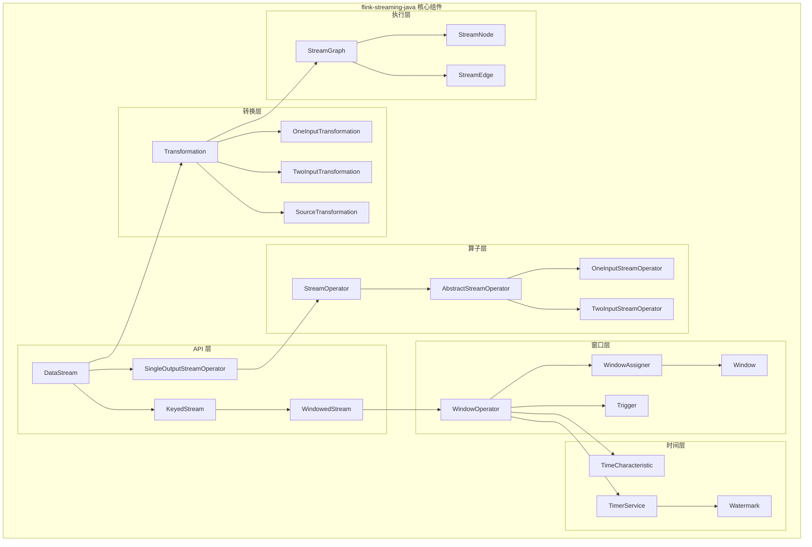
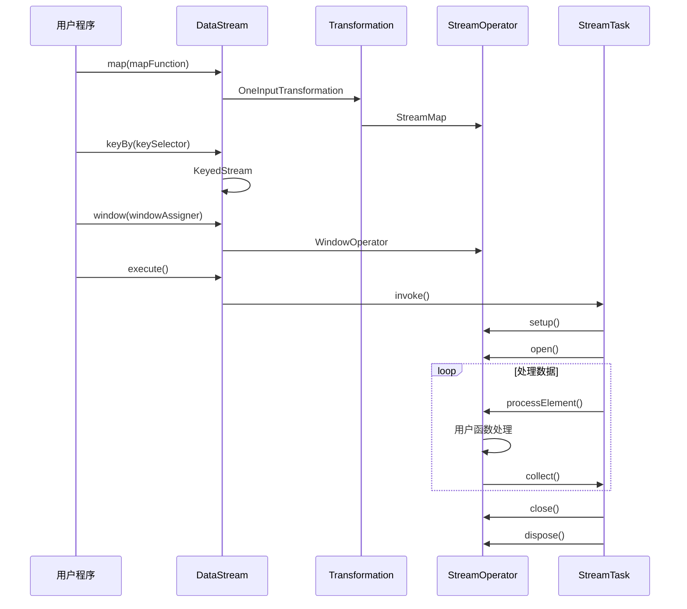
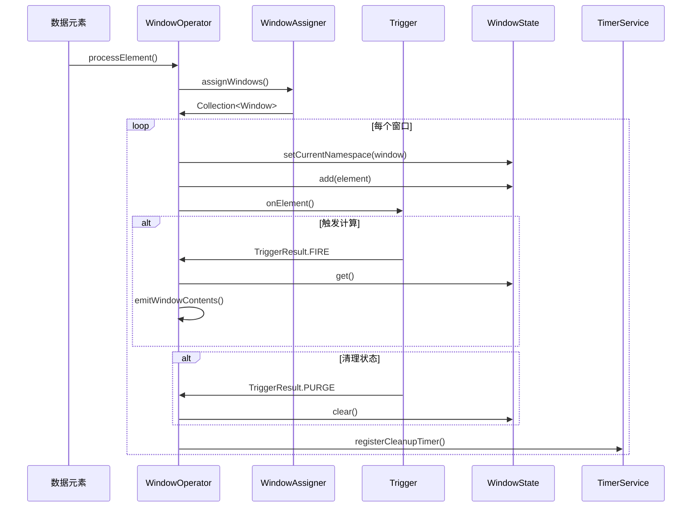
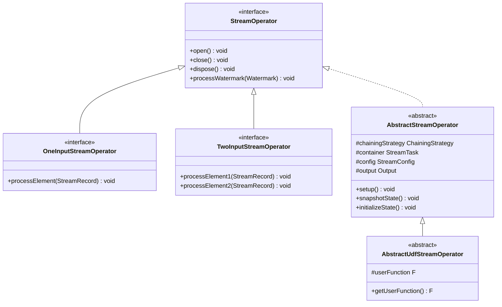
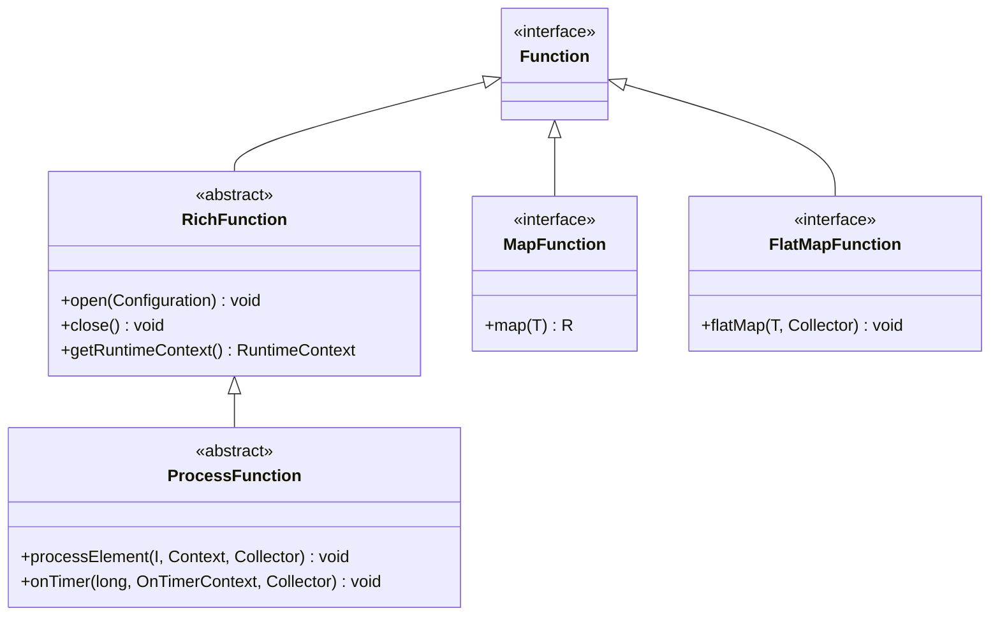

## 1. 模块概述

flink-streaming-java 是 Flink 流处理的核心模块，提供了 Java API 用于构建流处理应用程序。该模块包含了流处理的核心抽象、算子实现、窗口机制、时间处理等关键组件。

### 1.1 模块架构图



### 1.2 主要包结构

```
flink-streaming-java/
├── api/
│   ├── datastream/          # DataStream API
│   ├── environment/         # 执行环境
│   ├── functions/           # 用户函数接口
│   ├── operators/           # 算子接口
│   ├── transformations/     # 转换抽象
│   ├── windowing/           # 窗口机制
│   └── checkpoint/          # 检查点接口
├── runtime/
│   ├── operators/           # 算子实现
│   ├── tasks/               # 任务执行
│   └── io/                  # 输入输出
└── util/                    # 工具类
```

## 2. StreamOperator - 流算子核心

### 2.1 StreamOperator 接口定义

```java
/**
 * StreamOperator 是流算子的基础接口
 * 定义了算子的生命周期和基本操作
 */
@PublicEvolving
public interface StreamOperator<OUT> extends CheckpointListener, KeyContext, Disposable, Serializable {
    
    // ------------------------------------------------------------------------
    //  生命周期方法
    // ------------------------------------------------------------------------
    
    /**
     * 算子初始化方法
     * 在处理任何元素之前调用，包含算子的初始化逻辑
     */
    void open() throws Exception;
    
    /**
     * 算子关闭方法
     * 在所有记录处理完成后调用，用于刷新缓冲的数据
     */
    void close() throws Exception;
    
    /**
     * 算子销毁方法
     * 在算子生命周期的最后调用，释放所有资源
     */
    @Override
    void dispose() throws Exception;
    
    // ------------------------------------------------------------------------
    //  状态快照方法
    // ------------------------------------------------------------------------
    
    /**
     * 初始化算子状态
     * 从检查点或保存点恢复状态时调用
     */
    void initializeState(StateInitializationContext context) throws Exception;
    
    /**
     * 创建状态快照
     * 在检查点过程中调用
     */
    void snapshotState(StateSnapshotContext context) throws Exception;
    
    // ------------------------------------------------------------------------
    //  运行时属性
    // ------------------------------------------------------------------------
    
    /**
     * 设置算子的键上下文
     */
    void setKeyContextElement1(StreamRecord<?> record) throws Exception;
    
    void setKeyContextElement2(StreamRecord<?> record) throws Exception;
    
    /**
     * 获取算子的指标组
     */
    OperatorMetricGroup getMetricGroup();
    
    /**
     * 获取算子 ID
     */
    OperatorID getOperatorID();
}
```

### 2.2 AbstractStreamOperator 基础实现

```java
/**
 * 所有流算子的抽象基类
 * 提供了生命周期管理、状态处理、指标收集等通用功能
 */
@PublicEvolving
public abstract class AbstractStreamOperator<OUT>
        implements StreamOperator<OUT>, SetupableStreamOperator<OUT>, CheckpointedStreamOperator, Serializable {

    private static final long serialVersionUID = 1L;
    
    /** 算子使用的日志记录器 */
    protected static final Logger LOG = LoggerFactory.getLogger(AbstractStreamOperator.class);
    
    // ----------- 配置属性 -------------
    
    /** 算子链接策略，默认为 HEAD */
    protected ChainingStrategy chainingStrategy = ChainingStrategy.HEAD;
    
    // ---------------- 运行时字段 ------------------
    
    /** 包含此算子的任务 */
    private transient StreamTask<?, ?> container;
    
    /** 流配置 */
    protected transient StreamConfig config;
    
    /** 输出对象 */
    protected transient Output<StreamRecord<OUT>> output;
    
    /** UDF 的运行时上下文 */
    private transient StreamingRuntimeContext runtimeContext;
    
    // ---------------- 键/值状态 ------------------
    
    /** 用于从第一个输入提取键的 KeySelector */
    private transient KeySelector<?, ?> stateKeySelector1;
    
    /** 用于从第二个输入提取键的 KeySelector */
    private transient KeySelector<?, ?> stateKeySelector2;
    
    /** 状态处理器 */
    private transient StreamOperatorStateHandler stateHandler;
    
    /** 时间服务管理器 */
    private transient InternalTimeServiceManager<?> timeServiceManager;
    
    // --------------- 指标 ---------------------------
    
    /** 算子的指标组 */
    protected transient OperatorMetricGroup metrics;
    
    /** 延迟统计 */
    protected transient LatencyStats latencyStats;
    
    // ---------------- 时间处理器 ------------------
    
    /** 处理时间服务 */
    protected transient ProcessingTimeService processingTimeService;
    
    /**
     * 设置算子
     */
    @Override
    public void setup(StreamTask<?, ?> containingTask, StreamConfig config, Output<StreamRecord<OUT>> output) {
        this.container = containingTask;
        this.config = config;
        this.output = output;
        
        // 创建指标组
        this.metrics = container.getEnvironment().getMetricGroup().getOrAddOperator(config.getOperatorName());
        
        // 设置延迟跟踪
        this.latencyStats = new LatencyStats(metrics.getIOMetricGroup(), config.getLatencyTrackingInterval());
        
        // 设置处理时间服务
        this.processingTimeService = container.getProcessingTimeService();
    }
    
    /**
     * 初始化状态
     */
    @Override
    public void initializeState(StateInitializationContext context) throws Exception {
        if (getKeyedStateStore() != null) {
            // 初始化键控状态
            KeyedStateStore keyedStateStore = getKeyedStateStore();
            // 设置键序列化器
            keyedStateStore.setCurrentKey(null);
        }
    }
    
    /**
     * 打开算子
     */
    @Override
    public void open() throws Exception {
        // 初始化状态处理器
        stateHandler = new StreamOperatorStateHandler(this, container.getCancelables());
        stateHandler.initializeOperatorState(container.getCheckpointStorage());
        
        // 初始化时间服务管理器
        timeServiceManager = container.getTimerService();
        
        // 设置运行时上下文
        runtimeContext = new StreamingRuntimeContext(this, container.getEnvironment(), container.getAccumulatorMap());
    }
    
    /**
     * 关闭算子
     */
    @Override
    public void close() throws Exception {
        // 关闭状态处理器
        if (stateHandler != null) {
            stateHandler.dispose();
        }
        
        // 关闭时间服务
        if (timeServiceManager != null) {
            timeServiceManager.close();
        }
    }
    
    /**
     * 销毁算子
     */
    @Override
    public void dispose() throws Exception {
        close();
    }
    
    /**
     * 创建状态快照
     */
    @Override
    public void snapshotState(StateSnapshotContext context) throws Exception {
        if (stateHandler != null) {
            stateHandler.snapshotState(
                context,
                getOperatorName(),
                getContainingTask().isCanceled());
        }
    }
    
    /**
     * 处理水印
     */
    public void processWatermark(Watermark mark) throws Exception {
        if (timeServiceManager != null) {
            timeServiceManager.advanceWatermark(mark);
        }
        output.emitWatermark(mark);
    }
    
    /**
     * 处理延迟标记
     */
    public void processLatencyMarker(LatencyMarker latencyMarker) throws Exception {
        reportOrForwardLatencyMarker(latencyMarker);
    }
    
    /**
     * 报告或转发延迟标记
     */
    protected void reportOrForwardLatencyMarker(LatencyMarker marker) {
        // 更新延迟统计
        latencyStats.reportLatency(marker);
        
        // 转发延迟标记
        output.emitLatencyMarker(marker);
    }
    
    /**
     * 获取键控状态存储
     */
    public KeyedStateStore getKeyedStateStore() {
        return stateHandler != null ? stateHandler.getKeyedStateStore() : null;
    }
    
    /**
     * 获取算子状态存储
     */
    public OperatorStateStore getOperatorStateStore() {
        return stateHandler != null ? stateHandler.getOperatorStateStore() : null;
    }
    
    /**
     * 获取运行时上下文
     */
    public StreamingRuntimeContext getRuntimeContext() {
        return runtimeContext;
    }
}
```

### 2.3 OneInputStreamOperator 单输入算子

```java
/**
 * 单输入流算子接口
 * 处理单个输入流的算子需要实现此接口
 */
@PublicEvolving
public interface OneInputStreamOperator<IN, OUT> extends StreamOperator<OUT> {
    
    /**
     * 处理到达此算子的一个元素
     * 此方法保证不会与算子的其他方法并发调用
     */
    void processElement(StreamRecord<IN> element) throws Exception;
    
    /**
     * 处理水印
     * 此方法保证不会与算子的其他方法并发调用
     */
    void processWatermark(Watermark mark) throws Exception;
    
    /**
     * 处理延迟标记
     */
    void processLatencyMarker(LatencyMarker latencyMarker) throws Exception;
}
```

### 2.4 AbstractUdfStreamOperator 用户函数算子

```java
/**
 * 包含用户定义函数的算子基类
 * 处理用户函数的打开和关闭，作为算子生命周期的一部分
 */
@PublicEvolving
public abstract class AbstractUdfStreamOperator<OUT, F extends Function>
        extends AbstractStreamOperator<OUT>
        implements OutputTypeConfigurable<OUT> {

    private static final long serialVersionUID = 1L;

    /** 用户函数 */
    protected final F userFunction;

    /** 防止在 close() 和 dispose() 中重复调用 function.close() 的标志 */
    private transient boolean functionsClosed = false;

    /**
     * 构造函数
     */
    public AbstractUdfStreamOperator(F userFunction) {
        this.userFunction = requireNonNull(userFunction);
        checkUdfCheckpointingPreconditions();
    }

    /**
     * 获取在此算子中执行的用户函数
     */
    public F getUserFunction() {
        return userFunction;
    }

    // ------------------------------------------------------------------------
    //  算子生命周期
    // ------------------------------------------------------------------------

    /**
     * 设置算子
     */
    @Override
    public void setup(StreamTask<?, ?> containingTask, StreamConfig config, Output<StreamRecord<OUT>> output) {
        super.setup(containingTask, config, output);
        // 为用户函数设置运行时上下文
        FunctionUtils.setFunctionRuntimeContext(userFunction, getRuntimeContext());
    }

    /**
     * 创建状态快照
     */
    @Override
    public void snapshotState(StateSnapshotContext context) throws Exception {
        super.snapshotState(context);
        // 为用户函数创建状态快照
        StreamingFunctionUtils.snapshotFunctionState(context, getOperatorStateBackend(), userFunction);
    }

    /**
     * 初始化状态
     */
    @Override
    public void initializeState(StateInitializationContext context) throws Exception {
        super.initializeState(context);
        // 恢复用户函数状态
        StreamingFunctionUtils.restoreFunctionState(context, userFunction);
    }

    /**
     * 打开算子
     */
    @Override
    public void open() throws Exception {
        super.open();
        
        // 打开用户函数
        FunctionUtils.openFunction(userFunction, new Configuration());
    }

    /**
     * 关闭算子
     */
    @Override
    public void close() throws Exception {
        super.close();
        functionsClosed = true;
        // 关闭用户函数
        FunctionUtils.closeFunction(userFunction);
    }

    /**
     * 销毁算子
     */
    @Override
    public void dispose() throws Exception {
        super.dispose();
        if (!functionsClosed) {
            functionsClosed = true;
            FunctionUtils.closeFunction(userFunction);
        }
    }

    /**
     * 检查 UDF 检查点前提条件
     */
    private void checkUdfCheckpointingPreconditions() {
        if (userFunction instanceof CheckpointedFunction && userFunction instanceof ListCheckpointed) {
            throw new IllegalStateException("User functions are not allowed to implement both " +
                "CheckpointedFunction and ListCheckpointed.");
        }
    }

    /**
     * 设置输出类型
     */
    @Override
    public void setOutputType(TypeInformation<OUT> outTypeInfo, ExecutionConfig executionConfig) {
        // 如果用户函数实现了 OutputTypeConfigurable，则设置输出类型
        if (userFunction instanceof OutputTypeConfigurable) {
            @SuppressWarnings("unchecked")
            OutputTypeConfigurable<OUT> typeConfigurable = (OutputTypeConfigurable<OUT>) userFunction;
            typeConfigurable.setOutputType(outTypeInfo, executionConfig);
        }
    }
}
```

## 3. ProcessFunction - 底层处理函数

### 3.1 ProcessFunction 抽象类

```java
/**
 * ProcessFunction 是处理流元素的函数
 * 为每个输入流中的元素调用 processElement 方法
 * 可以产生零个或多个输出元素，还可以通过 Context 查询时间和设置定时器
 */
@PublicEvolving
public abstract class ProcessFunction<I, O> extends AbstractRichFunction {

    private static final long serialVersionUID = 1L;

    /**
     * 处理输入流中的一个元素
     * 
     * @param value 输入值
     * @param ctx 允许查询元素时间戳和获取 TimerService 的上下文
     * @param out 用于返回结果值的收集器
     * @throws Exception 此方法可能抛出异常，异常会导致操作失败并可能触发恢复
     */
    public abstract void processElement(I value, Context ctx, Collector<O> out) throws Exception;

    /**
     * 当使用 TimerService 设置的定时器触发时调用
     * 
     * @param timestamp 触发定时器的时间戳
     * @param ctx 允许查询触发定时器的时间戳、TimeDomain 和获取 TimerService 的上下文
     * @param out 用于返回结果值的收集器
     * @throws Exception 此方法可能抛出异常，异常会导致操作失败并可能触发恢复
     */
    public void onTimer(long timestamp, OnTimerContext ctx, Collector<O> out) throws Exception {}

    /**
     * processElement 或 onTimer 调用中可用的信息
     */
    public abstract class Context {

        /**
         * 当前正在处理的元素的时间戳或触发定时器的时间戳
         */
        public abstract Long timestamp();

        /**
         * 用于注册定时器和查询时间的 TimerService
         */
        public abstract TimerService timerService();

        /**
         * 将记录发送到由给定 OutputTag 标识的侧输出
         */
        public abstract <X> void output(OutputTag<X> outputTag, X value);
    }

    /**
     * onTimer 调用中可用的信息
     */
    public abstract class OnTimerContext extends Context {

        /**
         * 返回触发定时器的时间域
         */
        public abstract TimeDomain timeDomain();
        
        /**
         * 返回当前正在处理的键
         */
        public abstract Object getCurrentKey();
    }
}
```

### 3.2 ProcessOperator 实现

```java
/**
 * ProcessOperator 是 ProcessFunction 的算子实现
 */
@Internal
public class ProcessOperator<IN, OUT>
        extends AbstractUdfStreamOperator<OUT, ProcessFunction<IN, OUT>>
        implements OneInputStreamOperator<IN, OUT>, Triggerable<Object, VoidNamespace> {

    private static final long serialVersionUID = 1L;

    /** 上下文实现 */
    private transient ContextImpl context;

    /** 定时器上下文实现 */
    private transient OnTimerContextImpl onTimerContext;

    /**
     * 构造函数
     */
    public ProcessOperator(ProcessFunction<IN, OUT> function) {
        super(function);
    }

    /**
     * 打开算子
     */
    @Override
    public void open() throws Exception {
        super.open();
        
        // 创建上下文对象
        this.context = new ContextImpl(userFunction, getProcessingTimeService());
        this.onTimerContext = new OnTimerContextImpl(userFunction, getProcessingTimeService());
    }

    /**
     * 处理元素
     */
    @Override
    public void processElement(StreamRecord<IN> element) throws Exception {
        // 设置当前元素
        context.element = element;
        
        // 调用用户函数处理元素
        userFunction.processElement(element.getValue(), context, new TimestampedCollector<>(output));
        
        // 清理上下文
        context.element = null;
    }

    /**
     * 处理事件时间定时器
     */
    @Override
    public void onEventTime(InternalTimer<Object, VoidNamespace> timer) throws Exception {
        // 设置定时器信息
        onTimerContext.timeDomain = TimeDomain.EVENT_TIME;
        onTimerContext.timer = timer;
        
        // 调用用户函数处理定时器
        userFunction.onTimer(timer.getTimestamp(), onTimerContext, new TimestampedCollector<>(output));
        
        // 清理上下文
        onTimerContext.timeDomain = null;
        onTimerContext.timer = null;
    }

    /**
     * 处理处理时间定时器
     */
    @Override
    public void onProcessingTime(InternalTimer<Object, VoidNamespace> timer) throws Exception {
        // 设置定时器信息
        onTimerContext.timeDomain = TimeDomain.PROCESSING_TIME;
        onTimerContext.timer = timer;
        
        // 调用用户函数处理定时器
        userFunction.onTimer(timer.getTimestamp(), onTimerContext, new TimestampedCollector<>(output));
        
        // 清理上下文
        onTimerContext.timeDomain = null;
        onTimerContext.timer = null;
    }

    /**
     * Context 实现类
     */
    private class ContextImpl extends ProcessFunction<IN, OUT>.Context {
        
        private StreamRecord<IN> element;
        private final ProcessingTimeService processingTimeService;

        ContextImpl(ProcessFunction<IN, OUT> function, ProcessingTimeService processingTimeService) {
            function.super();
            this.processingTimeService = processingTimeService;
        }

        @Override
        public Long timestamp() {
            checkState(element != null);
            return element.hasTimestamp() ? element.getTimestamp() : null;
        }

        @Override
        public TimerService timerService() {
            return ProcessOperator.this.getInternalTimerService(
                "user-timers",
                VoidNamespaceSerializer.INSTANCE,
                this);
        }

        @Override
        public <X> void output(OutputTag<X> outputTag, X value) {
            if (outputTag == null) {
                throw new IllegalArgumentException("OutputTag must not be null.");
            }
            output.collect(outputTag, new StreamRecord<>(value, element.getTimestamp()));
        }
    }

    /**
     * OnTimerContext 实现类
     */
    private class OnTimerContextImpl extends ProcessFunction<IN, OUT>.OnTimerContext {
        
        private TimeDomain timeDomain;
        private InternalTimer<Object, VoidNamespace> timer;
        private final ProcessingTimeService processingTimeService;

        OnTimerContextImpl(ProcessFunction<IN, OUT> function, ProcessingTimeService processingTimeService) {
            function.super();
            this.processingTimeService = processingTimeService;
        }

        @Override
        public Long timestamp() {
            return timer.getTimestamp();
        }

        @Override
        public TimeDomain timeDomain() {
            return timeDomain;
        }

        @Override
        public Object getCurrentKey() {
            return timer.getKey();
        }

        @Override
        public TimerService timerService() {
            return ProcessOperator.this.getInternalTimerService(
                "user-timers",
                VoidNamespaceSerializer.INSTANCE,
                ProcessOperator.this);
        }

        @Override
        public <X> void output(OutputTag<X> outputTag, X value) {
            if (outputTag == null) {
                throw new IllegalArgumentException("OutputTag must not be null.");
            }
            output.collect(outputTag, new StreamRecord<>(value, timer.getTimestamp()));
        }
    }
}
```

## 4. 窗口机制实现

### 4.1 WindowOperator 窗口算子

```java
/**
 * WindowOperator 是窗口操作的核心算子
 * 负责将元素分配到窗口、触发窗口计算和管理窗口状态
 */
@Internal
public class WindowOperator<K, IN, ACC, OUT, W extends Window>
        extends AbstractUdfStreamOperator<OUT, InternalWindowFunction<ACC, OUT, K, W>>
        implements OneInputStreamOperator<IN, OUT>, Triggerable<K, W> {

    private static final long serialVersionUID = 1L;

    // ------------------------------------------------------------------------
    // 配置字段
    // ------------------------------------------------------------------------

    /** 窗口分配器 */
    protected final WindowAssigner<? super IN, W> windowAssigner;

    /** 键选择器 */
    private final KeySelector<IN, K> keySelector;

    /** 触发器 */
    private final Trigger<? super IN, ? super W> trigger;

    /** 窗口状态描述符 */
    private final StateDescriptor<? extends AppendingState<IN, ACC>, ?> windowStateDescriptor;

    /** 允许的延迟时间 */
    private final long allowedLateness;

    /** 延迟数据输出标签 */
    private final OutputTag<IN> lateDataOutputTag;

    // ------------------------------------------------------------------------
    // 运行时字段
    // ------------------------------------------------------------------------

    /** 窗口状态 */
    private transient InternalAppendingState<K, W, IN, ACC, ACC> windowState;

    /** 合并窗口状态 */
    private transient InternalMergingState<K, W, IN, ACC, ACC> windowMergingState;

    /** 触发器上下文 */
    private transient TriggerContext triggerContext = new TriggerContext();

    /** 处理上下文 */
    private transient ProcessContext processContext = new ProcessContext();

    /** 内部定时器服务 */
    private transient InternalTimerService<W> internalTimerService;

    /** 延迟记录丢弃计数器 */
    private transient Counter numLateRecordsDropped;

    /**
     * 构造函数
     */
    public WindowOperator(
            WindowAssigner<? super IN, W> windowAssigner,
            TypeSerializer<W> windowSerializer,
            KeySelector<IN, K> keySelector,
            TypeSerializer<K> keySerializer,
            StateDescriptor<? extends AppendingState<IN, ACC>, ?> windowStateDescriptor,
            InternalWindowFunction<ACC, OUT, K, W> windowFunction,
            Trigger<? super IN, ? super W> trigger,
            long allowedLateness,
            OutputTag<IN> lateDataOutputTag) {

        super(windowFunction);

        checkArgument(!(windowAssigner instanceof BaseAlignedWindowAssigner),
            "The " + windowAssigner.getClass().getSimpleName() + " cannot be used with a WindowOperator. " +
                "This assigner is only used with the AccumulatingProcessingTimeWindowOperator and " +
                "the AggregatingProcessingTimeWindowOperator.");

        checkArgument(allowedLateness >= 0);

        this.windowAssigner = checkNotNull(windowAssigner);
        this.keySelector = checkNotNull(keySelector);
        this.trigger = checkNotNull(trigger);
        this.windowStateDescriptor = windowStateDescriptor;
        this.allowedLateness = allowedLateness;
        this.lateDataOutputTag = lateDataOutputTag;

        setChainingStrategy(ChainingStrategy.ALWAYS);
    }

    /**
     * 打开算子
     */
    @Override
    public void open() throws Exception {
        super.open();

        // 创建定时器服务
        this.internalTimerService = getInternalTimerService("window-timers", windowAssigner.getWindowSerializer(getExecutionConfig()), this);

        // 创建窗口状态
        if (windowAssigner instanceof MergingWindowAssigner) {
            // 合并窗口状态
            windowMergingState = (InternalMergingState<K, W, IN, ACC, ACC>) 
                getOrCreateKeyedState(windowAssigner.getWindowSerializer(getExecutionConfig()), windowStateDescriptor);
        } else {
            // 普通窗口状态
            windowState = (InternalAppendingState<K, W, IN, ACC, ACC>) 
                getOrCreateKeyedState(windowAssigner.getWindowSerializer(getExecutionConfig()), windowStateDescriptor);
        }

        // 创建指标
        this.numLateRecordsDropped = metrics.counter("numLateRecordsDropped");
    }

    /**
     * 处理元素
     */
    @Override
    public void processElement(StreamRecord<IN> element) throws Exception {
        final Collection<W> elementWindows = windowAssigner.assignWindows(
            element.getValue(), element.getTimestamp(), windowAssignerContext);

        // 如果是会话窗口，可能需要合并窗口
        if (windowAssigner instanceof MergingWindowAssigner) {
            MergingWindowSet<W> mergingWindows = getMergingWindowSet();

            for (W window : elementWindows) {
                // 添加窗口到合并集合
                W actualWindow = mergingWindows.addWindow(window, 
                    new MergingWindowSet.MergeFunction<W>() {
                        @Override
                        public void merge(W mergeResult, Collection<W> mergedWindows, W stateWindowResult, Collection<W> mergedStateWindows) throws Exception {
                            // 合并触发器状态
                            triggerContext.key = key;
                            triggerContext.window = mergeResult;

                            triggerContext.onMerge(mergedWindows);

                            // 合并窗口状态
                            for (W m : mergedWindows) {
                                triggerContext.window = m;
                                triggerContext.clear();
                                deleteCleanupTimer(m);
                            }

                            // 注册新的清理定时器
                            registerCleanupTimer(mergeResult);
                        }
                    });

                // 检查元素是否延迟
                if (isElementLate(element)) {
                    continue;
                }

                // 设置窗口状态命名空间
                windowMergingState.setCurrentNamespace(actualWindow);
                windowMergingState.add(element.getValue());

                // 触发窗口
                triggerContext.key = key;
                triggerContext.window = actualWindow;
                TriggerResult triggerResult = triggerContext.onElement(element);

                if (triggerResult.isFire()) {
                    ACC contents = windowMergingState.get();
                    if (contents != null) {
                        emitWindowContents(actualWindow, contents);
                    }
                }

                if (triggerResult.isPurge()) {
                    windowMergingState.clear();
                }

                registerCleanupTimer(actualWindow);
            }

            // 需要确保在状态中更新合并状态
            mergingWindows.persist();
        } else {
            // 非合并窗口的处理
            for (W window : elementWindows) {

                // 检查元素是否延迟
                if (isElementLate(element)) {
                    continue;
                }

                // 设置窗口状态命名空间
                windowState.setCurrentNamespace(window);
                windowState.add(element.getValue());

                // 触发窗口
                triggerContext.key = key;
                triggerContext.window = window;
                TriggerResult triggerResult = triggerContext.onElement(element);

                if (triggerResult.isFire()) {
                    ACC contents = windowState.get();
                    if (contents != null) {
                        emitWindowContents(window, contents);
                    }
                }

                if (triggerResult.isPurge()) {
                    windowState.clear();
                }

                registerCleanupTimer(window);
            }
        }
    }

    /**
     * 处理事件时间定时器
     */
    @Override
    public void onEventTime(InternalTimer<K, W> timer) throws Exception {
        triggerContext.key = timer.getKey();
        triggerContext.window = timer.getNamespace();

        MergingWindowSet<W> mergingWindows;

        if (windowAssigner instanceof MergingWindowAssigner) {
            mergingWindows = getMergingWindowSet();
            W stateWindow = mergingWindows.getStateWindow(triggerContext.window);
            if (stateWindow == null) {
                // 不存在的窗口定时器触发，可能是触发器没有清理定时器
                return;
            } else {
                windowMergingState.setCurrentNamespace(stateWindow);
            }
        } else {
            windowState.setCurrentNamespace(triggerContext.window);
            mergingWindows = null;
        }

        TriggerResult triggerResult = triggerContext.onEventTime(timer.getTimestamp());

        if (triggerResult.isFire()) {
            ACC contents;
            if (mergingWindows != null) {
                contents = windowMergingState.get();
            } else {
                contents = windowState.get();
            }
            if (contents != null) {
                emitWindowContents(triggerContext.window, contents);
            }
        }

        if (triggerResult.isPurge()) {
            if (mergingWindows != null) {
                windowMergingState.clear();
            } else {
                windowState.clear();
            }
        }

        if (windowAssigner.isEventTime() && isCleanupTime(triggerContext.window, timer.getTimestamp())) {
            clearAllState(triggerContext.window, windowState, mergingWindows);
        }

        if (mergingWindows != null) {
            // 需要确保在状态中更新合并状态
            mergingWindows.persist();
        }
    }

    /**
     * 处理处理时间定时器
     */
    @Override
    public void onProcessingTime(InternalTimer<K, W> timer) throws Exception {
        triggerContext.key = timer.getKey();
        triggerContext.window = timer.getNamespace();

        MergingWindowSet<W> mergingWindows;

        if (windowAssigner instanceof MergingWindowAssigner) {
            mergingWindows = getMergingWindowSet();
            W stateWindow = mergingWindows.getStateWindow(triggerContext.window);
            if (stateWindow == null) {
                // 不存在的窗口定时器触发
                return;
            } else {
                windowMergingState.setCurrentNamespace(stateWindow);
            }
        } else {
            windowState.setCurrentNamespace(triggerContext.window);
            mergingWindows = null;
        }

        TriggerResult triggerResult = triggerContext.onProcessingTime(timer.getTimestamp());

        if (triggerResult.isFire()) {
            ACC contents;
            if (mergingWindows != null) {
                contents = windowMergingState.get();
            } else {
                contents = windowState.get();
            }
            if (contents != null) {
                emitWindowContents(triggerContext.window, contents);
            }
        }

        if (triggerResult.isPurge()) {
            if (mergingWindows != null) {
                windowMergingState.clear();
            } else {
                windowState.clear();
            }
        }

        if (!windowAssigner.isEventTime() && isCleanupTime(triggerContext.window, timer.getTimestamp())) {
            clearAllState(triggerContext.window, windowState, mergingWindows);
        }

        if (mergingWindows != null) {
            mergingWindows.persist();
        }
    }

    /**
     * 发射窗口内容
     */
    private void emitWindowContents(W window, ACC contents) throws Exception {
        processContext.window = window;
        userFunction.process(triggerContext.key, window, processContext, contents, timestampedCollector);
    }

    /**
     * 检查元素是否延迟
     */
    protected boolean isElementLate(StreamRecord<IN> element) {
        return (windowAssigner.isEventTime()) &&
            (element.getTimestamp() + allowedLateness <= internalTimerService.currentWatermark());
    }

    /**
     * 注册清理定时器
     */
    protected void registerCleanupTimer(W window) {
        long cleanupTime = cleanupTime(window);
        if (cleanupTime == Long.MAX_VALUE) {
            // 不为 "时间结束" 设置 GC 定时器
            return;
        }

        if (windowAssigner.isEventTime()) {
            triggerContext.registerEventTimeTimer(cleanupTime);
        } else {
            triggerContext.registerProcessingTimeTimer(cleanupTime);
        }
    }

    /**
     * 删除清理定时器
     */
    protected void deleteCleanupTimer(W window) {
        long cleanupTime = cleanupTime(window);
        if (cleanupTime == Long.MAX_VALUE) {
            // 不需要清理，因为我们没有设置
            return;
        }
        if (windowAssigner.isEventTime()) {
            triggerContext.deleteEventTimeTimer(cleanupTime);
        } else {
            triggerContext.deleteProcessingTimeTimer(cleanupTime);
        }
    }

    /**
     * 计算窗口的清理时间
     */
    private long cleanupTime(W window) {
        if (windowAssigner.isEventTime()) {
            long cleanupTime = window.maxTimestamp() + allowedLateness;
            return cleanupTime >= window.maxTimestamp() ? cleanupTime : Long.MAX_VALUE;
        } else {
            return window.maxTimestamp();
        }
    }

    /**
     * 触发器上下文实现
     */
    private class TriggerContext implements Trigger.TriggerContext {
        
        protected K key;
        protected W window;

        @Override
        public long getCurrentProcessingTime() {
            return internalTimerService.currentProcessingTime();
        }

        @Override
        public long getCurrentWatermark() {
            return internalTimerService.currentWatermark();
        }

        @Override
        public void registerProcessingTimeTimer(long time) {
            internalTimerService.registerProcessingTimeTimer(window, time);
        }

        @Override
        public void registerEventTimeTimer(long time) {
            internalTimerService.registerEventTimeTimer(window, time);
        }

        @Override
        public void deleteProcessingTimeTimer(long time) {
            internalTimerService.deleteProcessingTimeTimer(window, time);
        }

        @Override
        public void deleteEventTimeTimer(long time) {
            internalTimerService.deleteEventTimeTimer(window, time);
        }

        public TriggerResult onElement(StreamRecord<IN> element) throws Exception {
            return trigger.onElement(element.getValue(), element.getTimestamp(), window, this);
        }

        public TriggerResult onProcessingTime(long time) throws Exception {
            return trigger.onProcessingTime(time, window, this);
        }

        public TriggerResult onEventTime(long time) throws Exception {
            return trigger.onEventTime(time, window, this);
        }

        public void onMerge(Collection<W> mergedWindows) throws Exception {
            trigger.onMerge(window, this);
        }

        public void clear() throws Exception {
            trigger.clear(window, this);
        }

        @Override
        public String toString() {
            return "TriggerContext{" +
                "key=" + key +
                ", window=" + window +
                '}';
        }
    }

    /**
     * 处理上下文实现
     */
    private class ProcessContext extends InternalWindowFunction.InternalWindowContext {
        
        W window;

        @Override
        public String toString() {
            return "ProcessContext{" +
                "window=" + window +
                '}';
        }
    }
}
```

### 4.2 时间特性和窗口分配器

```java
/**
 * 时间特性枚举
 * 定义系统如何确定时间依赖操作的时间
 */
@PublicEvolving
public enum TimeCharacteristic {

    /**
     * 处理时间
     * 算子使用机器的系统时钟来确定数据流的当前时间
     * 处理时间窗口基于墙钟时间触发
     */
    ProcessingTime,

    /**
     * 摄入时间
     * 流中每个元素的时间在元素进入 Flink 流数据流时确定
     * 基于该时间进行窗口等操作
     */
    IngestionTime,

    /**
     * 事件时间
     * 流中每个元素的时间由元素的自定义时间戳确定
     * 允许元素乱序到达，需要使用水印来处理
     */
    EventTime
}
```

```java
/**
 * WindowAssigner 将零个或多个窗口分配给元素
 */
@PublicEvolving
public abstract class WindowAssigner<T, W extends Window> implements Serializable {
    
    private static final long serialVersionUID = 1L;

    /**
     * 返回应该分配给元素的窗口集合
     */
    public abstract Collection<W> assignWindows(T element, long timestamp, WindowAssignerContext context);

    /**
     * 返回与此 WindowAssigner 关联的默认触发器
     */
    public abstract Trigger<T, W> getDefaultTrigger(StreamExecutionEnvironment env);

    /**
     * 返回用于序列化此 WindowAssigner 分配的窗口的 TypeSerializer
     */
    public abstract TypeSerializer<W> getWindowSerializer(ExecutionConfig executionConfig);

    /**
     * 如果元素基于事件时间分配到窗口，返回 true，否则返回 false
     */
    public abstract boolean isEventTime();

    /**
     * WindowAssigner 的上下文
     * 允许查询当前处理时间
     */
    public abstract static class WindowAssignerContext {
        
        /**
         * 返回当前处理时间
         */
        public abstract long getCurrentProcessingTime();
    }
}
```

### 4.3 具体窗口分配器实现

```java
/**
 * 滚动事件时间窗口分配器
 */
@PublicEvolving
public class TumblingEventTimeWindows extends WindowAssigner<Object, TimeWindow> {
    
    private static final long serialVersionUID = 1L;

    private final long size;
    private final long globalOffset;
    private Long staggerOffset = null;
    private final WindowStagger windowStagger;

    protected TumblingEventTimeWindows(long size, long offset, WindowStagger windowStagger) {
        if (Math.abs(offset) >= size) {
            throw new IllegalArgumentException("TumblingEventTimeWindows parameters must satisfy abs(offset) < size");
        }

        this.size = size;
        this.globalOffset = offset;
        this.windowStagger = windowStagger;
    }

    /**
     * 创建滚动事件时间窗口
     */
    public static TumblingEventTimeWindows of(Time size) {
        return new TumblingEventTimeWindows(size.toMilliseconds(), 0, WindowStagger.ALIGNED);
    }

    /**
     * 创建带偏移的滚动事件时间窗口
     */
    public static TumblingEventTimeWindows of(Time size, Time offset) {
        return new TumblingEventTimeWindows(size.toMilliseconds(), offset.toMilliseconds(), WindowStagger.ALIGNED);
    }

    /**
     * 分配窗口
     */
    @Override
    public Collection<TimeWindow> assignWindows(Object element, long timestamp, WindowAssignerContext context) {
        if (timestamp > Long.MIN_VALUE) {
            if (staggerOffset == null) {
                staggerOffset = windowStagger.getStaggerOffset(context.getCurrentProcessingTime(), size);
            }
            
            // 计算窗口开始时间
            long start = TimeWindow.getWindowStartWithOffset(timestamp, (globalOffset + staggerOffset) % size, size);
            
            return Collections.singletonList(new TimeWindow(start, start + size));
        } else {
            // 没有时间戳的元素不能分配到事件时间窗口
            throw new RuntimeException("Record has Long.MIN_VALUE timestamp (= no timestamp marker). " +
                "Is the time characteristic set to 'ProcessingTime', or did you forget to call " +
                "'DataStream.assignTimestampsAndWatermarks(...)'?");
        }
    }

    /**
     * 获取默认触发器
     */
    @Override
    public Trigger<Object, TimeWindow> getDefaultTrigger(StreamExecutionEnvironment env) {
        return EventTimeTrigger.create();
    }

    /**
     * 获取窗口序列化器
     */
    @Override
    public TypeSerializer<TimeWindow> getWindowSerializer(ExecutionConfig executionConfig) {
        return new TimeWindow.Serializer();
    }

    /**
     * 是否基于事件时间
     */
    @Override
    public boolean isEventTime() {
        return true;
    }

    @Override
    public String toString() {
        return "TumblingEventTimeWindows(" + size + ")";
    }
}
```

```java
/**
 * 滑动事件时间窗口分配器
 */
@PublicEvolving
public class SlidingEventTimeWindows extends WindowAssigner<Object, TimeWindow> {
    
    private static final long serialVersionUID = 1L;

    private final long size;
    private final long slide;
    private final long globalOffset;
    private Long staggerOffset = null;
    private final WindowStagger windowStagger;

    protected SlidingEventTimeWindows(long size, long slide, long offset, WindowStagger windowStagger) {
        if (Math.abs(offset) >= slide || size <= 0) {
            throw new IllegalArgumentException(
                "SlidingEventTimeWindows parameters must satisfy abs(offset) < slide and size > 0");
        }

        this.size = size;
        this.slide = slide;
        this.globalOffset = offset;
        this.windowStagger = windowStagger;
    }

    /**
     * 创建滑动事件时间窗口
     */
    public static SlidingEventTimeWindows of(Time size, Time slide) {
        return new SlidingEventTimeWindows(size.toMilliseconds(), slide.toMilliseconds(), 0, WindowStagger.ALIGNED);
    }

    /**
     * 创建带偏移的滑动事件时间窗口
     */
    public static SlidingEventTimeWindows of(Time size, Time slide, Time offset) {
        return new SlidingEventTimeWindows(size.toMilliseconds(), slide.toMilliseconds(), offset.toMilliseconds(), WindowStagger.ALIGNED);
    }

    /**
     * 分配窗口
     */
    @Override
    public Collection<TimeWindow> assignWindows(Object element, long timestamp, WindowAssignerContext context) {
        if (timestamp > Long.MIN_VALUE) {
            if (staggerOffset == null) {
                staggerOffset = windowStagger.getStaggerOffset(context.getCurrentProcessingTime(), slide);
            }

            List<TimeWindow> windows = new ArrayList<>((int) (size / slide));
            long lastStart = TimeWindow.getWindowStartWithOffset(timestamp, (globalOffset + staggerOffset) % slide, slide);
            
            for (long start = lastStart; start > timestamp - size; start -= slide) {
                windows.add(new TimeWindow(start, start + size));
            }
            
            return windows;
        } else {
            throw new RuntimeException("Record has Long.MIN_VALUE timestamp (= no timestamp marker). " +
                "Is the time characteristic set to 'ProcessingTime', or did you forget to call " +
                "'DataStream.assignTimestampsAndWatermarks(...)'?");
        }
    }

    /**
     * 获取默认触发器
     */
    @Override
    public Trigger<Object, TimeWindow> getDefaultTrigger(StreamExecutionEnvironment env) {
        return EventTimeTrigger.create();
    }

    /**
     * 获取窗口序列化器
     */
    @Override
    public TypeSerializer<TimeWindow> getWindowSerializer(ExecutionConfig executionConfig) {
        return new TimeWindow.Serializer();
    }

    /**
     * 是否基于事件时间
     */
    @Override
    public boolean isEventTime() {
        return true;
    }

    @Override
    public String toString() {
        return "SlidingEventTimeWindows(" + size + ", " + slide + ")";
    }
}
```

## 5. 时序图分析

### 5.1 流处理执行时序



### 5.2 窗口处理时序



## 6. 关键接口和抽象类总结

### 6.1 核心接口层次



### 6.2 函数接口层次



## 7. 总结

flink-streaming-java 模块是 Flink 流处理的核心，提供了完整的流处理 API 和算子实现。主要特点包括：

### 7.1 核心组件
- **StreamExecutionEnvironment**: 流处理执行环境
- **DataStream**: 数据流抽象  
- **StreamOperator**: 流算子接口和实现
- **ProcessFunction**: 底层处理函数
- **WindowOperator**: 窗口处理机制

### 7.2 关键特性
- **类型安全**: 完整的类型信息系统
- **状态管理**: 键控状态和算子状态支持
- **时间处理**: 事件时间、处理时间和摄入时间
- **窗口机制**: 滚动、滑动、会话窗口
- **容错保证**: 基于检查点的精确一次处理

### 7.3 设计原则
- **函数式编程**: 用户函数与算子分离
- **链式调用**: 流畅的 API 设计
- **延迟执行**: 构建执行图后统一执行
- **算子链接**: 优化执行性能

通过深入理解 flink-streaming-java 模块的设计原理和实现细节，可以更好地开发和优化 Flink 流处理应用程序。
