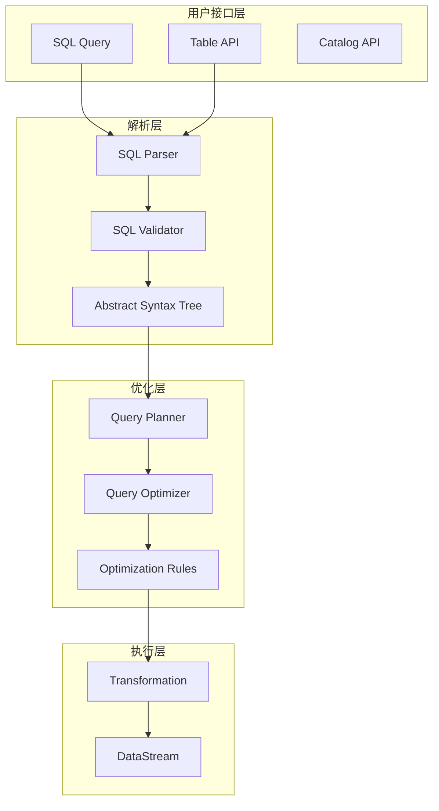
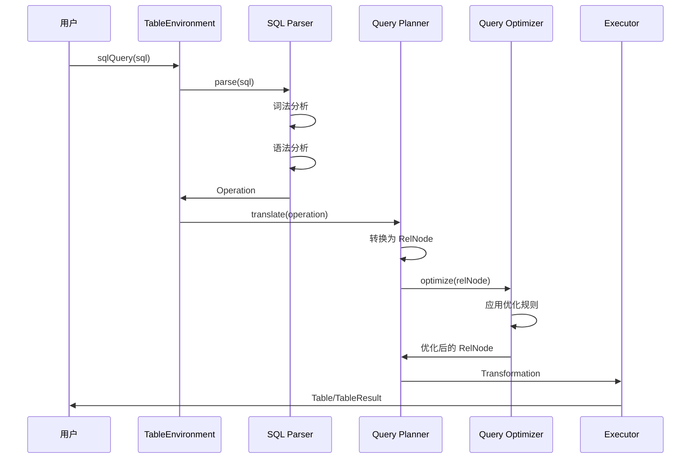

## 1. 模块概述

flink-table 模块是 Flink 的关系型处理层，提供了 Table API 和 SQL 支持。该模块将关系型查询转换为 DataStream 或 DataSet 程序，支持批处理和流处理的统一 SQL 接口。

### 1.1 模块架构图



## 2. TableEnvironment 核心实现

### 2.1 TableEnvironment 抽象类

```java
/**
 * TableEnvironment 是 Table API 和 SQL 的统一入口点
 */
@PublicEvolving
public abstract class TableEnvironment {
    
    public static final String DEFAULT_DATABASE = "default_database";
    public static final String DEFAULT_CATALOG = "default_catalog";
    
    /**
     * 创建流表环境
     */
    public static StreamTableEnvironment create(StreamExecutionEnvironment executionEnvironment) {
        return create(executionEnvironment, EnvironmentSettings.newInstance().build());
    }
    
    /**
     * 从表路径创建表
     */
    public abstract Table from(String path);
    
    /**
     * 执行 SQL 查询
     */
    public abstract Table sqlQuery(String query);
    
    /**
     * 执行 SQL 更新语句
     */
    public abstract TableResult executeSql(String statement);
    
    /**
     * 注册表
     */
    public abstract void registerTable(String name, Table table);
    
    /**
     * 注册函数
     */
    public abstract void registerFunction(String name, ScalarFunction function);
}
```

### 2.2 StreamTableEnvironment 实现

```java
/**
 * StreamTableEnvironment 是流处理的表环境实现
 */
@PublicEvolving
public abstract class StreamTableEnvironment extends TableEnvironment {
    
    /**
     * 从 DataStream 创建表
     */
    public abstract <T> Table fromDataStream(DataStream<T> dataStream);
    
    /**
     * 从 DataStream 创建表并指定字段
     */
    public abstract <T> Table fromDataStream(DataStream<T> dataStream, String fields);
    
    /**
     * 将表转换为 DataStream
     */
    public abstract <T> DataStream<T> toDataStream(Table table);
    
    /**
     * 将表转换为 DataStream 并指定类型
     */
    public abstract <T> DataStream<T> toDataStream(Table table, Class<T> targetClass);
    
    /**
     * 注册 DataStream 为表
     */
    public abstract <T> void registerDataStream(String name, DataStream<T> dataStream);
    
    /**
     * 获取执行环境
     */
    public abstract StreamExecutionEnvironment getExecutionEnvironment();
}
```

## 3. Table API 核心实现

### 3.1 Table 接口定义

```java
/**
 * Table 是 Table API 的核心抽象
 */
@PublicEvolving
public interface Table {
    
    /**
     * 获取表的 Schema
     */
    TableSchema getSchema();
    
    /**
     * 选择字段
     */
    Table select(String fields);
    
    /**
     * 选择字段（表达式）
     */
    Table select(Expression... fields);
    
    /**
     * 过滤
     */
    Table where(String predicate);
    
    /**
     * 过滤（表达式）
     */
    Table where(Expression predicate);
    
    /**
     * 分组
     */
    GroupedTable groupBy(String fields);
    
    /**
     * 分组（表达式）
     */
    GroupedTable groupBy(Expression... fields);
    
    /**
     * 连接
     */
    Table join(Table right);
    
    /**
     * 连接并指定条件
     */
    Table join(Table right, String joinPredicate);
    
    /**
     * 排序
     */
    Table orderBy(String fields);
    
    /**
     * 限制
     */
    Table limit(int fetch);
    
    /**
     * 联合
     */
    Table union(Table right);
    
    /**
     * 执行并收集结果
     */
    CloseableIterator<Row> execute();
    
    /**
     * 解释执行计划
     */
    String explain();
}
```

## 4. 用户自定义函数

### 4.1 ScalarFunction 标量函数

```java
/**
 * 标量函数基类
 */
@PublicEvolving
public abstract class ScalarFunction extends UserDefinedFunction {
    
    /**
     * 执行函数的方法
     * 子类必须实现一个或多个名为 eval 的方法
     */
    // public Object eval(Object... args);
    
    /**
     * 获取结果类型
     */
    @Override
    public TypeInformation<?> getResultType(Class<?>[] signature) {
        return null; // 由类型推断确定
    }
}
```

### 4.2 自定义标量函数示例

```java
/**
 * 自定义标量函数示例 - 字符串长度函数
 */
public class StringLengthFunction extends ScalarFunction {
    
    /**
     * 计算字符串长度
     */
    public Integer eval(String str) {
        return str == null ? null : str.length();
    }
    
    /**
     * 支持重载 - 处理字节数组
     */
    public Integer eval(byte[] bytes) {
        return bytes == null ? null : bytes.length;
    }
}

/**
 * 复杂标量函数示例 - JSON 解析函数
 */
public class JsonExtractFunction extends ScalarFunction {
    
    private transient ObjectMapper objectMapper;
    
    @Override
    public void open(FunctionContext context) throws Exception {
        super.open(context);
        this.objectMapper = new ObjectMapper();
    }
    
    /**
     * 从 JSON 字符串中提取字段值
     */
    public String eval(String jsonStr, String path) {
        if (jsonStr == null || path == null) {
            return null;
        }
        
        try {
            JsonNode jsonNode = objectMapper.readTree(jsonStr);
            JsonNode valueNode = jsonNode.at(path);
            
            if (valueNode.isMissingNode()) {
                return null;
            }
            
            return valueNode.isTextual() ? valueNode.textValue() : valueNode.toString();
        } catch (Exception e) {
            return null;
        }
    }
}
```

## 5. 时序图分析

### 5.1 SQL 查询执行时序



## 6. 总结

flink-table 模块提供了强大的关系型处理能力，通过 Table API 和 SQL 支持，使得用户可以使用熟悉的关系型语法来处理流数据和批数据，大大降低了 Flink 的使用门槛。

### 6.1 核心特性
- **统一 API**: 批流统一的 Table API 和 SQL
- **类型安全**: 强类型的表达式系统
- **查询优化**: 基于 Calcite 的查询优化器
- **用户函数**: 丰富的用户自定义函数支持
- **连接器**: 多样化的数据源和数据汇连接器

### 6.2 设计原则
- **声明式编程**: 用户描述"做什么"而不是"怎么做"
- **延迟执行**: 构建查询计划后统一优化执行
- **类型推断**: 自动推断表达式和函数的类型
- **规则优化**: 基于规则的查询优化和重写
