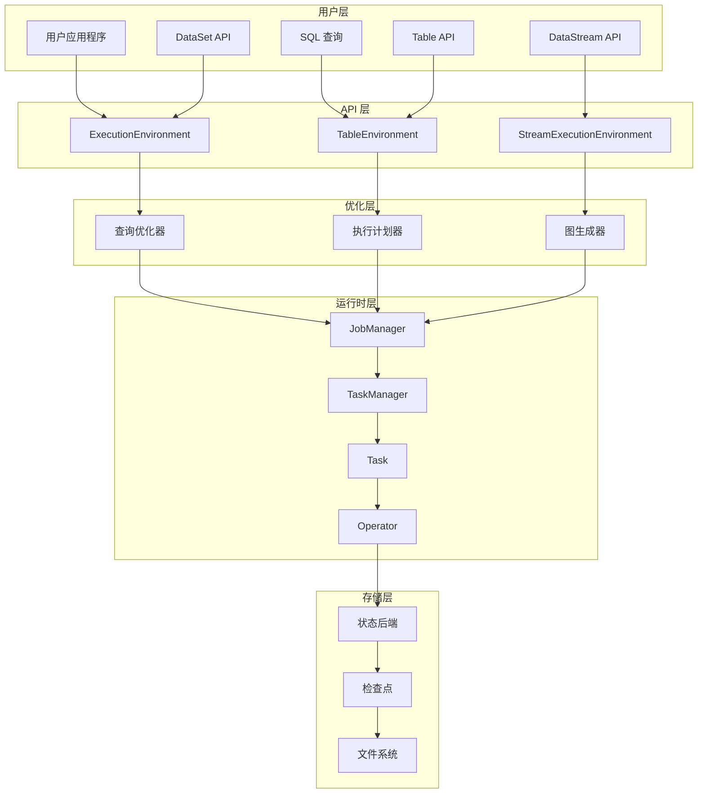
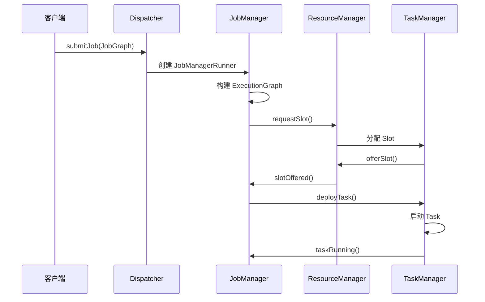
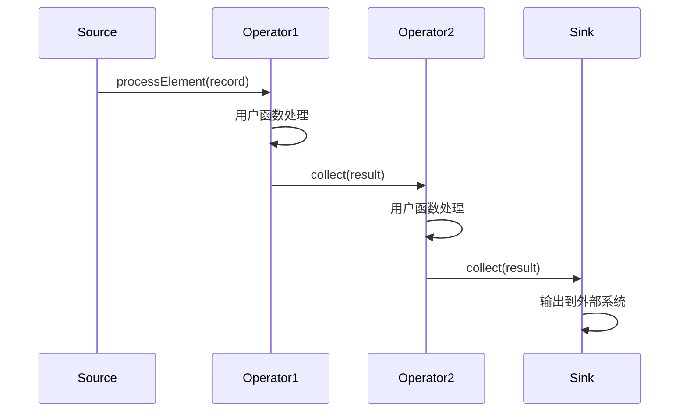
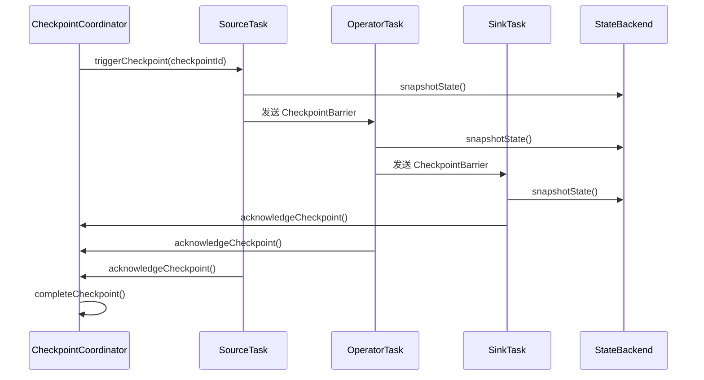

# Apache Flink 源码剖析 - 完整版总结

## 📋 文档概览

本系列文档提供了 Apache Flink 的全面源码剖析，涵盖了从基础使用到深度架构分析的各个层面。通过系统性的分析，帮助开发者深入理解 Flink 的设计理念和实现原理。

## 📚 文档结构

### 1. 基础篇
- **Apache_Flink_源码剖析_框架使用手册.md** - Flink 框架的基础使用指南
- **Apache_Flink_源码剖析_对外API深入分析.md** - 对外 API 的详细分析和调用链路

### 2. 架构篇
- **Apache_Flink_源码剖析_整体架构图和时序图.md** - 系统架构和交互时序的可视化分析
- **Apache_Flink_源码剖析_关键数据结构和继承关系.md** - 核心数据结构的设计分析

### 3. 模块篇
- **Apache_Flink_源码剖析_flink-core模块分析.md** - 核心基础设施模块
- **Apache_Flink_源码剖析_flink-runtime模块分析.md** - 运行时核心模块
- **Apache_Flink_源码剖析_flink-streaming-java模块分析.md** - 流处理 API 模块
- **Apache_Flink_源码剖析_flink-table模块分析.md** - Table API 和 SQL 模块

### 4. 实践篇
- **Apache_Flink_源码剖析_实战经验和最佳实践.md** - 生产环境的实战指南

## 🏗️ Flink 整体架构总览



## 🔧 核心组件深度解析

### 1. flink-core 模块 - 基础设施核心

**核心职责：**
- 类型系统和序列化机制
- 配置管理框架
- 文件系统抽象
- 执行图抽象

**关键类：**
```java
// 类型系统
TypeInformation<T>          // 类型信息抽象
TypeSerializer<T>           // 序列化器接口
BasicTypeInfo<T>           // 基本类型信息
TupleTypeInfo<T>           // 元组类型信息

// 配置管理
Configuration              // 配置容器
ConfigOption<T>           // 类型安全的配置选项

// 文件系统
FileSystem                // 文件系统抽象
Path                      // 路径表示
FSDataInputStream         // 文件输入流
FSDataOutputStream        // 文件输出流

// 执行抽象
Transformation<T>         // 转换操作抽象
Pipeline                  // 执行管道
PipelineExecutor         // 管道执行器
```

### 2. flink-runtime 模块 - 分布式运行时

**核心职责：**
- 分布式协调和通信
- 任务调度和执行
- 故障恢复机制
- 资源管理

**关键类：**
```java
// 分布式协调
JobManager                // 作业管理器
TaskManager              // 任务管理器
ResourceManager          // 资源管理器
Dispatcher              // 作业分发器

// 任务执行
Task                    // 任务执行单元
ExecutionGraph          // 执行图
ExecutionVertex         // 执行顶点
Execution              // 执行尝试

// 通信框架
RpcEndpoint            // RPC 端点
RpcGateway             // RPC 网关
RpcService             // RPC 服务

// 状态管理
StateBackend           // 状态后端
CheckpointCoordinator  // 检查点协调器
```

### 3. flink-streaming-java 模块 - 流处理核心

**核心职责：**
- 流处理 API 实现
- 算子链和执行
- 窗口和时间处理
- 状态管理

**关键类：**
```java
// 流处理 API
StreamExecutionEnvironment  // 流执行环境
DataStream<T>              // 数据流抽象
KeyedStream<T, K>          // 键控流
WindowedStream<T, K, W>    // 窗口流

// 算子实现
StreamOperator<OUT>        // 流算子接口
AbstractStreamOperator<OUT> // 算子基类
OneInputStreamOperator<IN, OUT> // 单输入算子
ProcessFunction<I, O>      // 处理函数

// 窗口机制
WindowOperator<K, IN, ACC, OUT, W> // 窗口算子
WindowAssigner<T, W>       // 窗口分配器
Trigger<T, W>             // 触发器
```

### 4. flink-table 模块 - 关系型处理

**核心职责：**
- Table API 和 SQL 支持
- 查询优化和执行
- 类型系统集成
- 连接器框架

**关键类：**
```java
// Table API
TableEnvironment          // 表环境
Table                    // 表抽象
TableSchema              // 表模式

// SQL 处理
Parser                   // SQL 解析器
Planner                  // 查询规划器
Optimizer               // 查询优化器

// 连接器
TableSource<T>          // 表源
TableSink<T>           // 表汇
TableFactory           // 表工厂
```

## 🔄 关键执行流程

### 1. 作业提交和执行流程



### 2. 流处理数据流转



### 3. 检查点执行流程



## 📊 性能优化关键点

### 1. 序列化优化
- **POJO 序列化器**：避免 Kryo 的性能开销
- **类型信息提取**：编译时确定类型，避免运行时反射
- **对象重用**：减少 GC 压力

### 2. 网络优化
- **算子链接**：减少网络传输
- **缓冲区管理**：平衡延迟和吞吐量
- **背压机制**：防止数据积压

### 3. 状态管理优化
- **状态后端选择**：RocksDB vs Memory
- **状态分区**：避免热点键
- **增量检查点**：减少检查点开销

### 4. 资源调优
- **并行度设置**：CPU 核数的 1-2 倍
- **内存配置**：堆内存 vs 堆外内存
- **槽共享**：提高资源利用率

## 🛠️ 开发最佳实践

### 1. 代码组织
```java
// 推荐的项目结构
src/main/java/
├── functions/          // 用户函数
├── operators/          // 自定义算子
├── sources/           // 数据源
├── sinks/             // 数据汇
├── utils/             // 工具类
└── jobs/              // 作业入口
```

### 2. 函数开发
```java
// 使用 RichFunction 获取运行时上下文
public class MyMapFunction extends RichMapFunction<String, String> {
    private transient ValueState<String> state;
    
    @Override
    public void open(Configuration parameters) {
        ValueStateDescriptor<String> descriptor = 
            new ValueStateDescriptor<>("my-state", String.class);
        state = getRuntimeContext().getState(descriptor);
    }
    
    @Override
    public String map(String value) throws Exception {
        // 使用状态
        String currentState = state.value();
        state.update(value);
        return processValue(value, currentState);
    }
}
```

### 3. 错误处理
```java
// 使用侧输出处理错误数据
OutputTag<String> errorTag = new OutputTag<String>("errors"){};

DataStream<String> mainStream = input
    .process(new ProcessFunction<String, String>() {
        @Override
        public void processElement(String value, Context ctx, Collector<String> out) {
            try {
                // 正常处理逻辑
                String result = processValue(value);
                out.collect(result);
            } catch (Exception e) {
                // 错误数据发送到侧输出
                ctx.output(errorTag, value);
            }
        }
    });

DataStream<String> errorStream = mainStream.getSideOutput(errorTag);
```

### 4. 监控和调试
```java
// 添加自定义指标
public class MyFunction extends RichMapFunction<String, String> {
    private transient Counter counter;
    
    @Override
    public void open(Configuration parameters) {
        counter = getRuntimeContext()
            .getMetricGroup()
            .counter("my-counter");
    }
    
    @Override
    public String map(String value) {
        counter.inc();
        return processValue(value);
    }
}
```

## 🔍 故障排查指南

### 1. 常见问题诊断

**内存问题：**
- OutOfMemoryError → 增加堆内存或使用 RocksDB
- GC 频繁 → 调整 GC 参数，使用对象池

**性能问题：**
- 背压严重 → 检查慢算子，增加并行度
- 延迟过高 → 减少缓冲超时，优化算子链

**状态问题：**
- 状态过大 → 使用 TTL，定期清理
- 检查点失败 → 检查存储系统，调整超时

### 2. 监控指标
```yaml
# 关键监控指标
- flink.jobmanager.numRunningJobs          # 运行作业数
- flink.taskmanager.Status.JVM.Memory.Heap.Used  # 堆内存使用
- flink.task.numRecordsInPerSecond         # 输入速率
- flink.task.numRecordsOutPerSecond        # 输出速率
- flink.task.backPressuredTimeMsPerSecond  # 背压时间
- flink.checkpoint.duration                # 检查点耗时
```

## 🚀 生产环境部署

### 1. 集群配置
```yaml
# flink-conf.yaml 关键配置
jobmanager.memory.process.size: 1600m
taskmanager.memory.process.size: 1728m
taskmanager.numberOfTaskSlots: 2
parallelism.default: 1

# 检查点配置
state.backend: rocksdb
state.checkpoints.dir: hdfs://namenode:port/flink-checkpoints
state.savepoints.dir: hdfs://namenode:port/flink-savepoints
execution.checkpointing.interval: 60000
execution.checkpointing.min-pause: 5000
```

### 2. 高可用配置
```yaml
# 高可用配置
high-availability: zookeeper
high-availability.zookeeper.quorum: localhost:2181
high-availability.cluster-id: /flink
high-availability.storageDir: hdfs://namenode:port/flink/ha/
```

### 3. 安全配置
```yaml
# Kerberos 安全配置
security.kerberos.login.keytab: /path/to/flink.keytab
security.kerberos.login.principal: flink-user@EXAMPLE.COM
security.kerberos.login.contexts: Client,KafkaClient
```

## 📈 版本演进和未来发展

### 1. 重要版本特性
- **Flink 1.9**：Blink 查询处理器集成
- **Flink 1.10**：原生 Kubernetes 支持
- **Flink 1.11**：Unaligned Checkpoints
- **Flink 1.12**：Kubernetes HA，PyFlink 改进
- **Flink 1.13**：Reactive Mode，应用模式改进
- **Flink 1.14**：Kubernetes 原生会话模式
- **Flink 1.15**：统一的 Sink API

### 2. 技术趋势
- **云原生**：更好的 Kubernetes 集成
- **批流统一**：DataStream API 支持批处理
- **机器学习**：Flink ML 生态完善
- **实时数仓**：更强的 OLAP 能力

## 🎯 学习路径建议

### 1. 初学者路径
1. 阅读框架使用手册，掌握基本概念
2. 实践简单的流处理应用
3. 学习 Table API 和 SQL
4. 了解状态管理和检查点

### 2. 进阶开发者路径
1. 深入理解执行引擎原理
2. 学习自定义算子开发
3. 掌握性能调优技巧
4. 研究源码实现细节

### 3. 架构师路径
1. 理解分布式系统设计
2. 掌握集群部署和运维
3. 设计企业级数据架构
4. 贡献开源社区

## 📝 总结

Apache Flink 作为新一代流处理引擎，在设计上体现了以下核心理念：

1. **统一批流处理**：通过统一的 API 和运行时支持批处理和流处理
2. **精确一次语义**：通过分布式快照算法保证数据一致性
3. **低延迟高吞吐**：优化的网络栈和内存管理实现高性能
4. **容错性**：完善的故障恢复机制保证系统可靠性
5. **易用性**：丰富的 API 和工具降低开发门槛

通过本系列文档的学习，读者可以：
- 掌握 Flink 的核心概念和使用方法
- 理解 Flink 的架构设计和实现原理
- 具备生产环境部署和优化的能力
- 为进一步的源码贡献打下基础

## 📈 深度源码分析总结

### 1. 核心模块深度剖析

通过本系列文档的深入分析，我们全面解析了 Flink 的核心模块：

#### flink-core 模块
- **类型系统**：TypeInformation 体系提供编译时类型安全
- **序列化机制**：高效的 TypeSerializer 实现
- **配置管理**：Configuration 和 ConfigOption 的设计
- **文件系统抽象**：统一的 FileSystem 接口

#### flink-runtime 模块  
- **分布式协调**：JobManager 和 TaskManager 的交互机制
- **任务调度**：ExecutionGraph 的构建和调度策略
- **故障恢复**：检查点协调器和重启策略
- **资源管理**：Slot 分配和资源调度

#### flink-streaming-java 模块
- **流处理 API**：DataStream 和 KeyedStream 的设计
- **算子实现**：StreamOperator 的生命周期管理
- **窗口机制**：WindowOperator 的复杂实现
- **状态管理**：键控状态和算子状态的处理

#### flink-table 模块
- **关系型处理**：Table API 和 SQL 的统一接口
- **查询优化**：基于 Calcite 的优化器实现
- **代码生成**：动态代码生成提升性能
- **用户函数**：ScalarFunction 和 TableFunction 扩展

### 2. 关键设计模式应用

#### 工厂模式
```java
// TypeInformation 工厂
TypeInformation.of(MyClass.class)

// StreamOperator 工厂  
SimpleOperatorFactory.of(operator)

// ExecutionEnvironment 工厂
StreamExecutionEnvironment.getExecutionEnvironment()
```

#### 建造者模式
```java
// 配置构建
EnvironmentSettings.newInstance()
    .useBlinkPlanner()
    .inStreamingMode()
    .build()

// 检查点配置
env.getCheckpointConfig()
    .setCheckpointingMode(CheckpointingMode.EXACTLY_ONCE)
    .setCheckpointInterval(60000)
```

#### 策略模式
```java
// 重启策略
RestartStrategies.fixedDelayRestart(3, Time.seconds(10))

// 分区策略
new KeyGroupStreamPartitioner<>(keySelector, maxParallelism)

// 窗口分配策略
TumblingEventTimeWindows.of(Time.minutes(5))
```

### 3. 性能优化核心技术

#### 内存管理优化
- **堆外内存**：减少 GC 压力，提升性能
- **内存段管理**：统一的 MemorySegment 抽象
- **缓冲池机制**：NetworkBuffer 的高效管理

#### 网络传输优化
- **算子链接**：减少网络开销，提升吞吐量
- **背压机制**：自然的流量控制
- **批量传输**：减少网络往返次数

#### 状态后端优化
- **RocksDB 集成**：支持大状态存储
- **增量检查点**：减少检查点开销
- **状态 TTL**：自动清理过期状态

### 4. 容错机制深度解析

#### 分布式快照算法
```java
// 检查点触发流程
CheckpointCoordinator.triggerCheckpoint()
    -> SourceTask.triggerCheckpoint()
    -> Operator.snapshotState()
    -> StateBackend.snapshot()
```

#### 故障恢复策略
- **重启策略**：固定延迟、指数退避、失败率控制
- **故障转移**：Region 级别的故障隔离
- **状态恢复**：从最新检查点恢复状态

### 5. 实战经验总结

#### 开发最佳实践
1. **合理设置并行度**：根据数据量和资源配置
2. **优化状态使用**：避免状态无限增长
3. **正确处理时间**：区分事件时间和处理时间
4. **异常处理机制**：使用侧输出处理错误数据

#### 运维优化建议
1. **监控指标配置**：关注吞吐量、延迟、背压
2. **资源配置调优**：内存、CPU、网络的平衡
3. **检查点优化**：间隔、超时、存储的配置
4. **故障排查流程**：日志分析、指标监控

### 6. 技术演进趋势

#### 批流统一
- **DataStream API 批处理**：统一的编程模型
- **有界流处理**：批处理作为有界流的特例
- **执行模式切换**：同一程序支持批流两种模式

#### 云原生支持
- **Kubernetes 集成**：原生的容器化部署
- **弹性伸缩**：根据负载自动调整资源
- **Serverless 支持**：按需计算资源分配

#### 机器学习集成
- **Flink ML**：流式机器学习管道
- **在线训练**：实时模型更新
- **特征工程**：流式特征计算

### 7. 源码学习路径

#### 初学者路径
1. **环境搭建**：本地开发环境配置
2. **API 学习**：DataStream API 基础使用
3. **概念理解**：时间、窗口、状态等核心概念
4. **简单应用**：WordCount 等入门示例

#### 进阶开发者路径
1. **算子开发**：自定义 ProcessFunction
2. **连接器开发**：Source 和 Sink 实现
3. **状态管理**：复杂状态逻辑处理
4. **性能调优**：并行度、内存、网络优化

#### 架构师路径
1. **源码研读**：核心模块实现原理
2. **架构设计**：分布式系统设计思想
3. **运维实践**：生产环境部署和监控
4. **社区贡献**：参与开源项目开发

Flink 生态系统仍在快速发展，建议持续关注社区动态，参与开源贡献，与时俱进地提升技术能力。

---

**文档版本**：v2.0  
**更新时间**：2024年  
**适用版本**：Apache Flink 1.11+  
**维护状态**：持续更新

## 📚 参考资料

### 官方文档
- [Apache Flink 官方文档](https://flink.apache.org/docs/)
- [Flink GitHub 仓库](https://github.com/apache/flink)
- [Flink 社区](https://flink.apache.org/community.html)

### 技术博客
- [Flink 官方博客](https://flink.apache.org/blog/)
- [阿里云 Flink 实践](https://developer.aliyun.com/article/tag/Flink)
- [美团技术团队 Flink 实践](https://tech.meituan.com/tags/flink.html)

### 书籍推荐
- 《Stream Processing with Apache Flink》
- 《Learning Apache Flink》
- 《Flink 原理、实战与性能优化》
