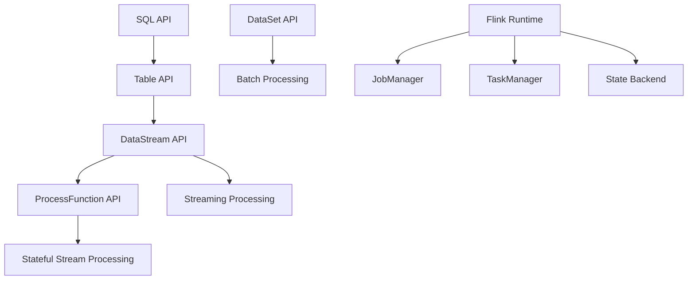
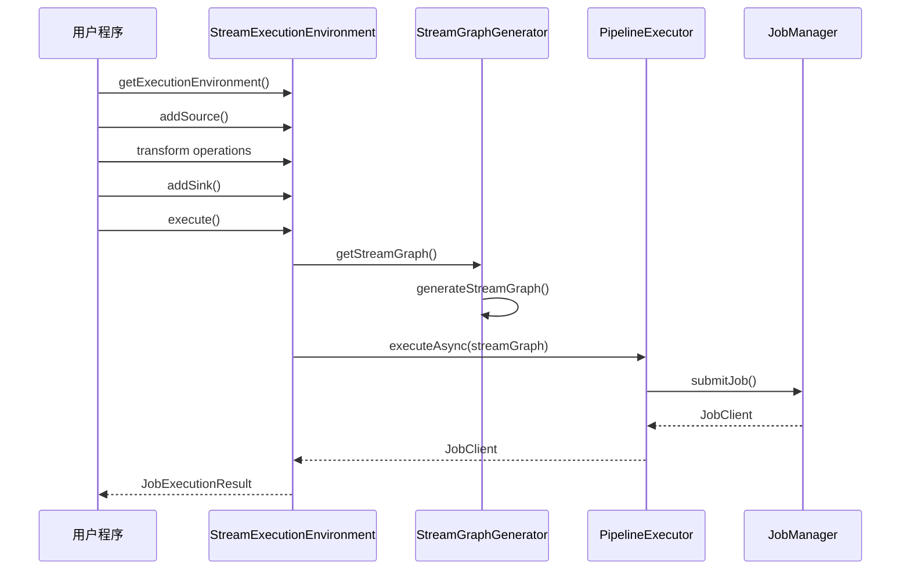
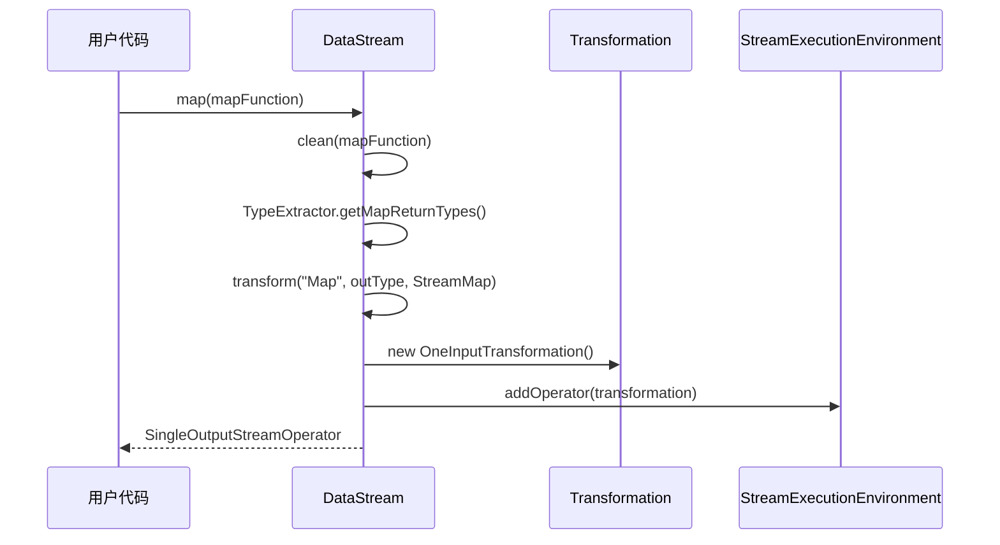

## 1. API 架构概览

Apache Flink 提供了多层次的 API 架构，从底层的 ProcessFunction 到高层的 SQL API，满足不同复杂度和抽象级别的需求。



## 2. StreamExecutionEnvironment - 流处理入口

### 2.1 类定义和核心功能

```java
/**
 * StreamExecutionEnvironment 是流程序执行的上下文环境
 * 提供了控制作业执行和与外部世界交互的方法
 */
@Public
public class StreamExecutionEnvironment {
    
    /** 默认作业名称 */
    public static final String DEFAULT_JOB_NAME = "Flink Streaming Job";
    
    /** 默认时间特性 */
    private static final TimeCharacteristic DEFAULT_TIME_CHARACTERISTIC = TimeCharacteristic.ProcessingTime;
    
    /** 默认网络缓冲超时时间 */
    private static final long DEFAULT_NETWORK_BUFFER_TIMEOUT = 100L;
    
    // 核心组件
    private final ExecutionConfig config = new ExecutionConfig();
    private final CheckpointConfig checkpointCfg = new CheckpointConfig();
    protected final List<Transformation<?>> transformations = new ArrayList<>();
    private StateBackend defaultStateBackend;
    private TimeCharacteristic timeCharacteristic = DEFAULT_TIME_CHARACTERISTIC;
}
```

### 2.2 关键方法分析

#### 2.2.1 获取执行环境

```java
/**
 * 获取执行环境的工厂方法
 * 根据运行上下文自动选择本地或远程环境
 */
public static StreamExecutionEnvironment getExecutionEnvironment() {
    return Utils.resolveFactory(threadLocalContextEnvironmentFactory, contextEnvironmentFactory)
        .map(StreamExecutionEnvironmentFactory::createExecutionEnvironment)
        .orElseGet(StreamExecutionEnvironment::createLocalEnvironment);
}

/**
 * 创建本地执行环境
 * 在当前 JVM 中多线程执行程序
 */
public static LocalStreamEnvironment createLocalEnvironment() {
    return createLocalEnvironment(defaultLocalParallelism);
}

/**
 * 创建远程执行环境
 * 将程序提交到远程集群执行
 */
public static StreamExecutionEnvironment createRemoteEnvironment(
        String host, int port, String... jarFiles) {
    return new RemoteStreamEnvironment(host, port, jarFiles);
}
```

#### 2.2.2 程序执行方法

```java
/**
 * 同步执行程序
 * 触发所有 sink 操作的执行
 */
public JobExecutionResult execute(String jobName) throws Exception {
    Preconditions.checkNotNull(jobName, "Streaming Job name should not be null.");
    return execute(getStreamGraph(jobName));
}

/**
 * 核心执行方法
 * 将 StreamGraph 提交给执行器
 */
@Internal
public JobExecutionResult execute(StreamGraph streamGraph) throws Exception {
    final JobClient jobClient = executeAsync(streamGraph);
    
    try {
        final JobExecutionResult jobExecutionResult;
        
        if (configuration.getBoolean(DeploymentOptions.ATTACHED)) {
            // 附加模式：等待作业完成
            jobExecutionResult = jobClient.getJobExecutionResult(userClassloader).get();
        } else {
            // 分离模式：立即返回
            jobExecutionResult = new DetachedJobExecutionResult(jobClient.getJobID());
        }
        
        // 通知作业监听器
        jobListeners.forEach(jobListener -> jobListener.onJobExecuted(jobExecutionResult, null));
        
        return jobExecutionResult;
    } catch (Throwable t) {
        jobListeners.forEach(jobListener -> {
            jobListener.onJobExecuted(null, ExceptionUtils.stripExecutionException(t));
        });
        ExceptionUtils.rethrowException(t);
        return null;
    }
}

/**
 * 异步执行程序
 * 返回 JobClient 用于与提交的作业通信
 */
@Internal
public JobClient executeAsync(StreamGraph streamGraph) throws Exception {
    checkNotNull(streamGraph, "StreamGraph cannot be null.");
    checkNotNull(configuration.get(DeploymentOptions.TARGET), 
                "No execution.target specified in your configuration file.");
    
    // 获取执行器工厂
    final PipelineExecutorFactory executorFactory =
        executorServiceLoader.getExecutorFactory(configuration);
    
    // 创建并配置执行器
    final PipelineExecutor executor = executorFactory.getExecutor(configuration);
    
    // 提交作业
    CompletableFuture<JobClient> jobClientFuture = executor.execute(streamGraph, configuration, userClassloader);
    
    try {
        JobClient jobClient = jobClientFuture.get();
        jobListeners.forEach(jobListener -> jobListener.onJobSubmitted(jobClient, null));
        return jobClient;
    } catch (Throwable t) {
        jobListeners.forEach(jobListener -> jobListener.onJobSubmitted(null, ExceptionUtils.stripExecutionException(t)));
        ExceptionUtils.rethrowException(t);
        return null;
    }
}
```

#### 2.2.3 数据源创建方法

```java
/**
 * 从集合创建数据流
 */
public <OUT> DataStreamSource<OUT> fromCollection(Collection<OUT> data) {
    Preconditions.checkNotNull(data, "Collection must not be null");
    
    if (data.isEmpty()) {
        throw new IllegalArgumentException("Collection must not be empty");
    }
    
    TypeInformation<OUT> typeInfo = TypeExtractor.getForObject(data.iterator().next());
    SourceFunction<OUT> function = new FromElementsFunction<>(typeInfo.createSerializer(getConfig()), data);
    return addSource(function, "Collection Source", typeInfo).setParallelism(1);
}

/**
 * 从 Socket 创建文本流
 */
public DataStreamSource<String> socketTextStream(String hostname, int port, String delimiter, long maxRetry) {
    return addSource(new SocketTextStreamFunction(hostname, port, delimiter, maxRetry),
                    "Socket Stream");
}

/**
 * 添加自定义数据源
 */
public <OUT> DataStreamSource<OUT> addSource(SourceFunction<OUT> function, String sourceName, TypeInformation<OUT> typeInfo) {
    
    if (typeInfo == null) {
        if (function instanceof ResultTypeQueryable) {
            typeInfo = ((ResultTypeQueryable<OUT>) function).getProducedType();
        } else {
            try {
                typeInfo = TypeExtractor.createTypeInfo(
                        SourceFunction.class,
                        function.getClass(), 0, null, null);
            } catch (final InvalidTypesException e) {
                typeInfo = (TypeInformation<OUT>) new MissingTypeInfo(sourceName, e);
            }
        }
    }
    
    boolean isParallel = function instanceof ParallelSourceFunction;
    
    clean(function);
    final StreamSource<OUT, ?> sourceOperator = new StreamSource<>(function);
    return new DataStreamSource<>(this, typeInfo, sourceOperator, isParallel, sourceName);
}
```

### 2.3 配置管理

```java
/**
 * 设置并行度
 */
public StreamExecutionEnvironment setParallelism(int parallelism) {
    config.setParallelism(parallelism);
    return this;
}

/**
 * 设置最大并行度
 */
public StreamExecutionEnvironment setMaxParallelism(int maxParallelism) {
    config.setMaxParallelism(maxParallelism);
    return this;
}

/**
 * 启用检查点
 */
public StreamExecutionEnvironment enableCheckpointing(long interval) {
    checkpointCfg.setCheckpointInterval(interval);
    return this;
}

/**
 * 设置状态后端
 */
public StreamExecutionEnvironment setStateBackend(StateBackend backend) {
    this.defaultStateBackend = Preconditions.checkNotNull(backend);
    return this;
}

/**
 * 设置时间特性
 */
@Deprecated
public StreamExecutionEnvironment setStreamTimeCharacteristic(TimeCharacteristic characteristic) {
    this.timeCharacteristic = Preconditions.checkNotNull(characteristic);
    if (characteristic == TimeCharacteristic.ProcessingTime) {
        getConfig().setAutoWatermarkInterval(0);
    } else {
        getConfig().setAutoWatermarkInterval(200);
    }
    return this;
}
```

## 3. DataStream API - 核心数据抽象

### 3.1 DataStream 类结构

```java
/**
 * DataStream 表示相同类型元素的流
 * 可以通过转换操作创建新的 DataStream
 */
@Public
public class DataStream<T> {
    
    protected final StreamExecutionEnvironment environment;
    protected final Transformation<T> transformation;
    
    /**
     * 构造函数
     */
    public DataStream(StreamExecutionEnvironment environment, Transformation<T> transformation) {
        this.environment = Preconditions.checkNotNull(environment, "Execution Environment must not be null.");
        this.transformation = Preconditions.checkNotNull(transformation, "Stream Transformation must not be null.");
    }
}
```

### 3.2 核心转换操作

#### 3.2.1 Map 转换

```java
/**
 * Map 转换：一对一映射
 * 对每个元素应用 MapFunction
 */
public <R> SingleOutputStreamOperator<R> map(MapFunction<T, R> mapper) {
    
    // 提取输出类型信息
    TypeInformation<R> outType = TypeExtractor.getMapReturnTypes(clean(mapper), getType(),
            Utils.getCallLocationName(), true);
    
    return map(mapper, outType);
}

/**
 * 带类型信息的 Map 转换
 */
public <R> SingleOutputStreamOperator<R> map(MapFunction<T, R> mapper, TypeInformation<R> outputType) {
    return transform("Map", outputType, new StreamMap<>(clean(mapper)));
}
```

#### 3.2.2 FlatMap 转换

```java
/**
 * FlatMap 转换：一对多映射
 * 每个 FlatMapFunction 调用可以返回任意数量的元素
 */
public <R> SingleOutputStreamOperator<R> flatMap(FlatMapFunction<T, R> flatMapper) {
    
    TypeInformation<R> outType = TypeExtractor.getFlatMapReturnTypes(clean(flatMapper),
            getType(), Utils.getCallLocationName(), true);
    
    return flatMap(flatMapper, outType);
}

public <R> SingleOutputStreamOperator<R> flatMap(FlatMapFunction<T, R> flatMapper, TypeInformation<R> outputType) {
    return transform("Flat Map", outputType, new StreamFlatMap<>(clean(flatMapper)));
}
```

#### 3.2.3 Filter 转换

```java
/**
 * Filter 转换：过滤操作
 * 保留 FilterFunction 返回 true 的元素
 */
public SingleOutputStreamOperator<T> filter(FilterFunction<T> filter) {
    return transform("Filter", getType(), new StreamFilter<>(clean(filter)));
}
```

#### 3.2.4 Process 转换

```java
/**
 * Process 转换：最底层的转换操作
 * 提供对时间和状态的完全控制
 */
@PublicEvolving
public <R> SingleOutputStreamOperator<R> process(ProcessFunction<T, R> processFunction) {
    
    TypeInformation<R> outType = TypeExtractor.getUnaryOperatorReturnType(
        processFunction,
        ProcessFunction.class,
        0,
        1,
        TypeExtractor.NO_INDEX,
        getType(),
        Utils.getCallLocationName(),
        true);
    
    return process(processFunction, outType);
}

@Internal
public <R> SingleOutputStreamOperator<R> process(
        ProcessFunction<T, R> processFunction,
        TypeInformation<R> outputType) {
    
    ProcessOperator<T, R> operator = new ProcessOperator<>(clean(processFunction));
    
    return transform("Process", outputType, operator);
}
```

### 3.3 核心转换方法

```java
/**
 * 通用转换方法
 * 所有转换操作最终都会调用此方法
 */
@PublicEvolving
public <R> SingleOutputStreamOperator<R> transform(
        String operatorName,
        TypeInformation<R> outTypeInfo,
        OneInputStreamOperator<T, R> operator) {
    
    return doTransform(operatorName, outTypeInfo, SimpleOperatorFactory.of(operator));
}

/**
 * 执行转换的核心方法
 */
protected <R> SingleOutputStreamOperator<R> doTransform(
        String operatorName,
        TypeInformation<R> outTypeInfo,
        StreamOperatorFactory<R> operatorFactory) {
    
    // 读取输入转换的输出类型以检查类型信息错误
    transformation.getOutputType();
    
    // 创建转换对象
    OneInputTransformation<T, R> resultTransform = new OneInputTransformation<>(
            this.transformation,
            operatorName,
            operatorFactory,
            outTypeInfo,
            environment.getParallelism());
    
    // 创建返回流
    @SuppressWarnings({"unchecked", "rawtypes"})
    SingleOutputStreamOperator<R> returnStream = new SingleOutputStreamOperator(environment, resultTransform);
    
    // 将转换添加到执行环境
    getExecutionEnvironment().addOperator(resultTransform);
    
    return returnStream;
}
```

## 4. KeyedStream - 分区流处理

### 4.1 KeyedStream 创建

```java
/**
 * 按键分组创建 KeyedStream
 */
public <K> KeyedStream<T, K> keyBy(KeySelector<T, K> key) {
    Preconditions.checkNotNull(key);
    return new KeyedStream<>(this, clean(key));
}

/**
 * 按字段名分组（仅适用于 POJO 和 Tuple）
 */
public KeyedStream<T, Tuple> keyBy(String... fields) {
    return keyBy(new Keys.ExpressionKeys<>(fields, getType()));
}

/**
 * 按字段位置分组（仅适用于 Tuple）
 */
public KeyedStream<T, Tuple> keyBy(int... fields) {
    return keyBy(new Keys.ExpressionKeys<>(fields, getType()));
}
```

### 4.2 KeyedStream 状态操作

```java
/**
 * Reduce 聚合操作
 */
public SingleOutputStreamOperator<T> reduce(ReduceFunction<T> reducer) {
    return transform("Keyed Reduce", getType(), new StreamGroupedReduce<>(
            clean(reducer), getType().createSerializer(getExecutionConfig())));
}

/**
 * 滚动聚合操作
 */
public SingleOutputStreamOperator<T> sum(int positionToSum) {
    return aggregate(new SumAggregator<>(positionToSum, getType(), getExecutionConfig()));
}

/**
 * 最小值聚合
 */
public SingleOutputStreamOperator<T> min(int positionToMin) {
    return aggregate(new ComparableAggregator<>(positionToMin, getType(), AggregationFunction.AggregationType.MIN,
            getExecutionConfig()));
}
```

## 5. 窗口操作 API

### 5.1 时间窗口

```java
/**
 * 滚动时间窗口
 */
public AllWindowedStream<T, TimeWindow> timeWindow(Time size) {
    if (environment.getStreamTimeCharacteristic() == TimeCharacteristic.ProcessingTime) {
        return window(TumblingProcessingTimeWindows.of(size));
    } else {
        return window(TumblingEventTimeWindows.of(size));
    }
}

/**
 * 滑动时间窗口
 */
public AllWindowedStream<T, TimeWindow> timeWindow(Time size, Time slide) {
    if (environment.getStreamTimeCharacteristic() == TimeCharacteristic.ProcessingTime) {
        return window(SlidingProcessingTimeWindows.of(size, slide));
    } else {
        return window(SlidingEventTimeWindows.of(size, slide));
    }
}
```

### 5.2 计数窗口

```java
/**
 * 滚动计数窗口
 */
public AllWindowedStream<T, GlobalWindow> countWindow(long size) {
    return window(GlobalWindows.create()).trigger(PurgingTrigger.of(CountTrigger.of(size)));
}

/**
 * 滑动计数窗口
 */
public AllWindowedStream<T, GlobalWindow> countWindow(long size, long slide) {
    return window(GlobalWindows.create())
            .evictor(CountEvictor.of(size))
            .trigger(CountTrigger.of(slide));
}
```

## 6. Sink 操作 API

### 6.1 基础 Sink 操作

```java
/**
 * 添加自定义 Sink
 */
public DataStreamSink<T> addSink(SinkFunction<T> sinkFunction) {
    
    // 转换为 SinkTransformation
    SinkTransformation<T> sinkTransformation = new SinkTransformation<>(
            this.getTransformation(),
            "Unnamed",
            SimpleOperatorFactory.of(new StreamSink<>(clean(sinkFunction))),
            environment.getParallelism());
    
    // 添加到执行环境
    environment.addOperator(sinkTransformation);
    
    return new DataStreamSink<>(sinkTransformation);
}

/**
 * 打印输出
 */
public DataStreamSink<T> print() {
    PrintSinkFunction<T> printFunction = new PrintSinkFunction<>();
    return addSink(printFunction).name("Print to Std. Out");
}

/**
 * 写入文件
 */
public DataStreamSink<T> writeAsText(String path) {
    return writeUsingOutputFormat(new TextOutputFormat<T>(new Path(path)));
}
```

## 7. API 调用链路分析

### 7.1 程序执行流程



### 7.2 转换操作链路



## 8. 关键接口和抽象类

### 8.1 核心函数接口

```java
/**
 * Map 函数接口
 */
@Public
@FunctionalInterface
public interface MapFunction<T, O> extends Function, Serializable {
    O map(T value) throws Exception;
}

/**
 * FlatMap 函数接口
 */
@Public
@FunctionalInterface
public interface FlatMapFunction<T, O> extends Function, Serializable {
    void flatMap(T value, Collector<O> out) throws Exception;
}

/**
 * Filter 函数接口
 */
@Public
@FunctionalInterface
public interface FilterFunction<T> extends Function, Serializable {
    boolean filter(T value) throws Exception;
}

/**
 * Process 函数接口
 */
@Public
public abstract class ProcessFunction<I, O> extends AbstractRichFunction {
    
    public abstract void processElement(I value, Context ctx, Collector<O> out) throws Exception;
    
    public void onTimer(long timestamp, OnTimerContext ctx, Collector<O> out) throws Exception {}
    
    public abstract class Context {
        public abstract Long timestamp();
        public abstract TimerService timerService();
        public abstract <X> void output(OutputTag<X> outputTag, X value);
    }
}
```

### 8.2 数据源接口

```java
/**
 * 数据源函数接口
 */
@Public
public interface SourceFunction<T> extends Function, Serializable {
    
    void run(SourceContext<T> ctx) throws Exception;
    
    void cancel();
    
    @Public
    interface SourceContext<T> {
        void collect(T element);
        void collectWithTimestamp(T element, long timestamp);
        void emitWatermark(Watermark mark);
        void markAsTemporarilyIdle();
        Object getCheckpointLock();
        void close();
    }
}

/**
 * 并行数据源接口
 */
@Public
public interface ParallelSourceFunction<OUT> extends SourceFunction<OUT> {
}
```

### 8.3 Sink 接口

```java
/**
 * Sink 函数接口
 */
@Public
public interface SinkFunction<IN> extends Function, Serializable {
    
    default void invoke(IN value) throws Exception {}
    
    default void invoke(IN value, Context context) throws Exception {
        invoke(value);
    }
    
    @Public
    interface Context {
        long currentProcessingTime();
        long currentWatermark();
        Long timestamp();
    }
}
```

## 9. 类型系统和序列化

### 9.1 类型信息系统

```java
/**
 * 类型信息抽象基类
 */
@Public
public abstract class TypeInformation<T> implements Serializable {
    
    public abstract boolean isBasicType();
    public abstract boolean isTupleType();
    public abstract int getArity();
    public abstract int getTotalFields();
    public abstract Class<T> getTypeClass();
    public abstract boolean isKeyType();
    public abstract TypeSerializer<T> createSerializer(ExecutionConfig config);
    
    // 类型提取方法
    public static <X> TypeInformation<X> of(Class<X> typeClass) {
        return TypeExtractor.createTypeInfo(typeClass);
    }
}
```

### 9.2 序列化器

```java
/**
 * 类型序列化器抽象基类
 */
@Public
public abstract class TypeSerializer<T> implements Serializable {
    
    public abstract boolean isImmutableType();
    public abstract TypeSerializer<T> duplicate();
    public abstract T createInstance();
    public abstract T copy(T from);
    public abstract T copy(T from, T reuse);
    public abstract int getLength();
    public abstract void serialize(T record, DataOutputView target) throws IOException;
    public abstract T deserialize(DataInputView source) throws IOException;
    public abstract T deserialize(T reuse, DataInputView source) throws IOException;
}
```

## 10. StreamGraph 生成核心实现

### 10.1 StreamGraphGenerator 详细分析

```java
/**
 * StreamGraphGenerator 负责将用户程序转换为 StreamGraph
 * 这是 Flink 作业执行的第一步转换
 */
public class StreamGraphGenerator {
    
    private final List<Transformation<?>> transformations;
    private final ExecutionConfig executionConfig;
    
    /**
     * 生成 StreamGraph 的主入口方法
     * 将所有 Transformation 转换为 StreamGraph 中的节点和边
     */
    public StreamGraph generate() {
        streamGraph = new StreamGraph(executionConfig, checkpointConfig, savepointRestoreSettings);
        alreadyTransformed = new HashMap<>();
        
        // 转换所有 transformation
        for (Transformation<?> transformation : transformations) {
            transform(transformation);
        }
        
        return streamGraph;
    }
    
    /**
     * 递归转换 Transformation 的核心方法
     * 根据不同类型的 Transformation 调用相应的处理方法
     */
    private Collection<Integer> transform(Transformation<?> transform) {
        if (alreadyTransformed.containsKey(transform)) {
            return alreadyTransformed.get(transform);
        }
        
        Collection<Integer> transformedIds;
        
        if (transform instanceof OneInputTransformation<?, ?>) {
            transformedIds = transformOneInputTransform((OneInputTransformation<?, ?>) transform);
        } else if (transform instanceof SourceTransformation<?>) {
            transformedIds = transformSource((SourceTransformation<?>) transform);
        } else if (transform instanceof SinkTransformation<?>) {
            transformedIds = transformSink((SinkTransformation<?>) transform);
        }
        // ... 其他类型处理
        
        alreadyTransformed.put(transform, transformedIds);
        return transformedIds;
    }
}
```

这个 API 深入分析文档详细解释了 Flink 对外 API 的设计原理、关键方法实现和调用链路，为理解 Flink 源码提供了全面的指导。
