# Apache Flink 源码剖析 - 整体架构图和时序图

## 1. Flink 整体架构图

### 1.1 系统层次架构

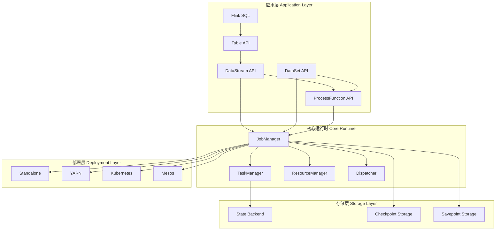
```mermaid
graph TB
    subgraph "应用层 Application Layer"
        A1[Flink SQL]
        A2[Table API]
        A3[DataStream API]
        A4[DataSet API]
        A5[ProcessFunction API]
    end
    
    subgraph "核心运行时 Core Runtime"
        B1[JobManager]
        B2[TaskManager]
        B3[ResourceManager]
        B4[Dispatcher]
    end
    
    subgraph "存储层 Storage Layer"
        C1[State Backend]
        C2[Checkpoint Storage]
        C3[Savepoint Storage]
    end
    
    subgraph "部署层 Deployment Layer"
        D1[Standalone]
        D2[YARN]
        D3[Kubernetes]
        D4[Mesos]
    end
    
    A1 --> A2
    A2 --> A3
    A3 --> A5
    A4 --> A5
    
    A3 --> B1
    A4 --> B1
    A5 --> B1
    
    B1 --> B2
    B1 --> B3
    B1 --> B4
    
    B2 --> C1
    B1 --> C2
    B1 --> C3
    
    B1 --> D1
    B1 --> D2
    B1 --> D3
    B1 --> D4
```

### 1.2 运行时组件架构

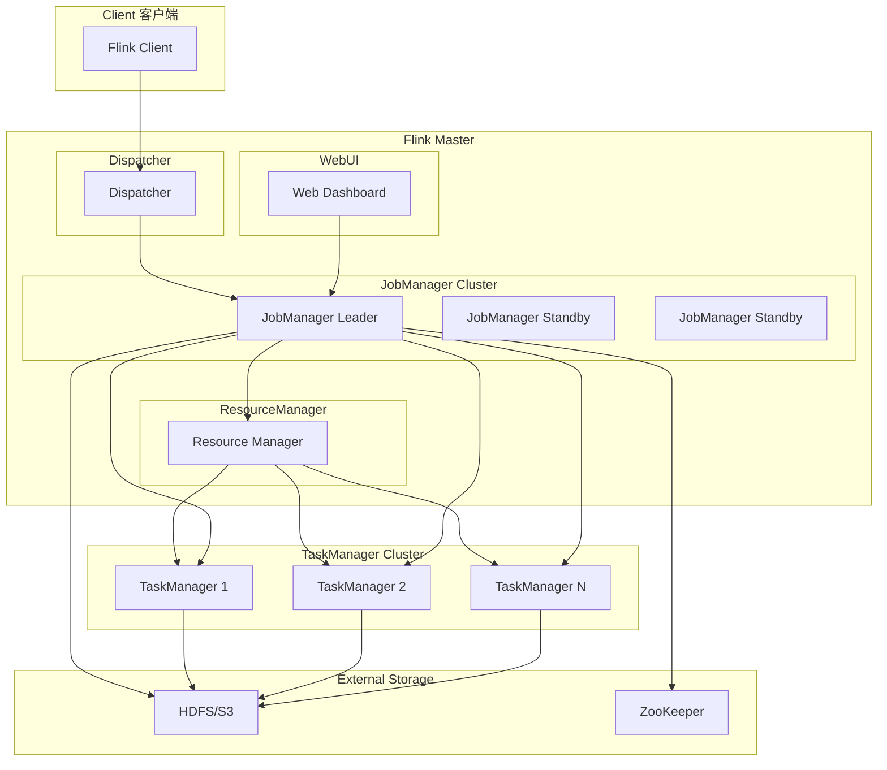
```mermaid
graph TB
    subgraph "Client 客户端"
        Client[Flink Client]
    end
    
    subgraph "Flink Master"
        subgraph "JobManager Cluster"
            JM1[JobManager Leader]
            JM2[JobManager Standby]
            JM3[JobManager Standby]
        end
        
        subgraph "ResourceManager"
            RM[Resource Manager]
        end
        
        subgraph "Dispatcher"
            DISP[Dispatcher]
        end
        
        subgraph "WebUI"
            WEB[Web Dashboard]
        end
    end
    
    subgraph "TaskManager Cluster"
        TM1[TaskManager 1]
        TM2[TaskManager 2]
        TM3[TaskManager N]
    end
    
    subgraph "External Storage"
        HDFS[HDFS/S3]
        ZK[ZooKeeper]
    end
    
    Client --> DISP
    DISP --> JM1
    JM1 --> RM
    RM --> TM1
    RM --> TM2
    RM --> TM3
    
    JM1 --> TM1
    JM1 --> TM2
    JM1 --> TM3
    
    JM1 --> HDFS
    JM1 --> ZK
    TM1 --> HDFS
    TM2 --> HDFS
    TM3 --> HDFS
    
    WEB --> JM1
```

### 1.3 数据流处理架构

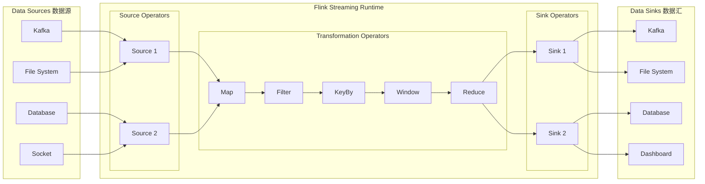
```mermaid
graph LR
    subgraph "Data Sources 数据源"
        S1[Kafka]
        S2[File System]
        S3[Database]
        S4[Socket]
    end
    
    subgraph "Flink Streaming Runtime"
        subgraph "Source Operators"
            SO1[Source 1]
            SO2[Source 2]
        end
        
        subgraph "Transformation Operators"
            TO1[Map]
            TO2[Filter]
            TO3[KeyBy]
            TO4[Window]
            TO5[Reduce]
        end
        
        subgraph "Sink Operators"
            SK1[Sink 1]
            SK2[Sink 2]
        end
    end
    
    subgraph "Data Sinks 数据汇"
        D1[Kafka]
        D2[File System]
        D3[Database]
        D4[Dashboard]
    end
    
    S1 --> SO1
    S2 --> SO1
    S3 --> SO2
    S4 --> SO2
    
    SO1 --> TO1
    SO2 --> TO1
    TO1 --> TO2
    TO2 --> TO3
    TO3 --> TO4
    TO4 --> TO5
    
    TO5 --> SK1
    TO5 --> SK2
    
    SK1 --> D1
    SK1 --> D2
    SK2 --> D3
    SK2 --> D4
```

## 2. 作业提交和执行时序图

### 2.1 作业提交流程

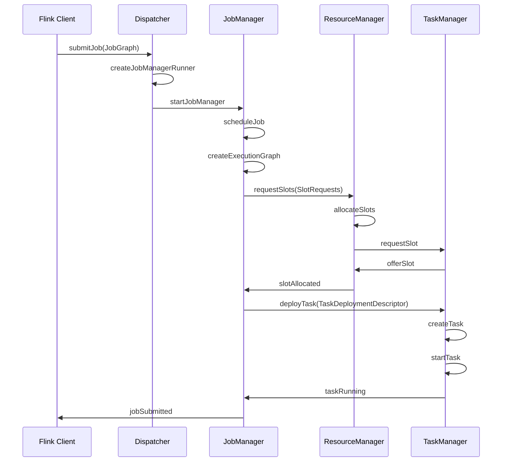
```mermaid
sequenceDiagram
    participant Client as Flink Client
    participant Dispatcher as Dispatcher
    participant JM as JobManager
    participant RM as ResourceManager
    participant TM as TaskManager
    
    Client->>Dispatcher: submitJob(JobGraph)
    Dispatcher->>Dispatcher: createJobManagerRunner
    Dispatcher->>JM: startJobManager
    
    JM->>JM: scheduleJob
    JM->>JM: createExecutionGraph
    JM->>RM: requestSlots(SlotRequests)
    
    RM->>RM: allocateSlots
    RM->>TM: requestSlot
    TM->>RM: offerSlot
    RM->>JM: slotAllocated
    
    JM->>TM: deployTask(TaskDeploymentDescriptor)
    TM->>TM: createTask
    TM->>TM: startTask
    TM->>JM: taskRunning
    
    JM->>Client: jobSubmitted
```

### 2.2 检查点执行流程

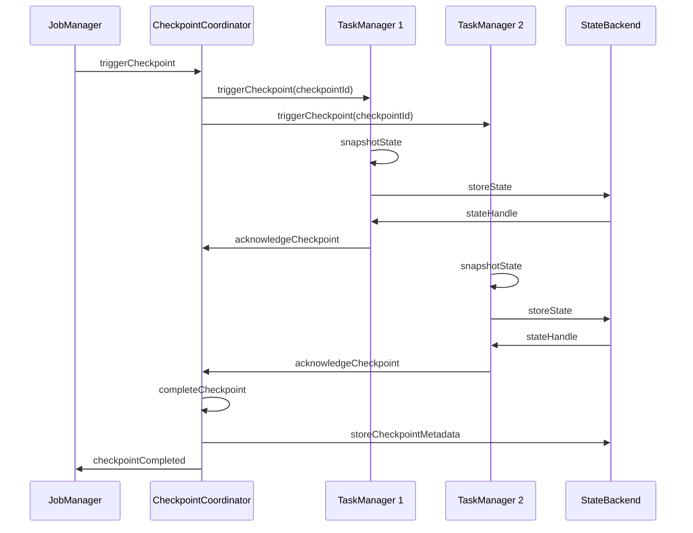
```mermaid
sequenceDiagram
    participant JM as JobManager
    participant Coordinator as CheckpointCoordinator
    participant TM1 as TaskManager 1
    participant TM2 as TaskManager 2
    participant Storage as StateBackend
    
    JM->>Coordinator: triggerCheckpoint
    Coordinator->>TM1: triggerCheckpoint(checkpointId)
    Coordinator->>TM2: triggerCheckpoint(checkpointId)
    
    TM1->>TM1: snapshotState
    TM1->>Storage: storeState
    Storage->>TM1: stateHandle
    TM1->>Coordinator: acknowledgeCheckpoint
    
    TM2->>TM2: snapshotState
    TM2->>Storage: storeState
    Storage->>TM2: stateHandle
    TM2->>Coordinator: acknowledgeCheckpoint
    
    Coordinator->>Coordinator: completeCheckpoint
    Coordinator->>Storage: storeCheckpointMetadata
    Coordinator->>JM: checkpointCompleted
```

### 2.3 故障恢复流程

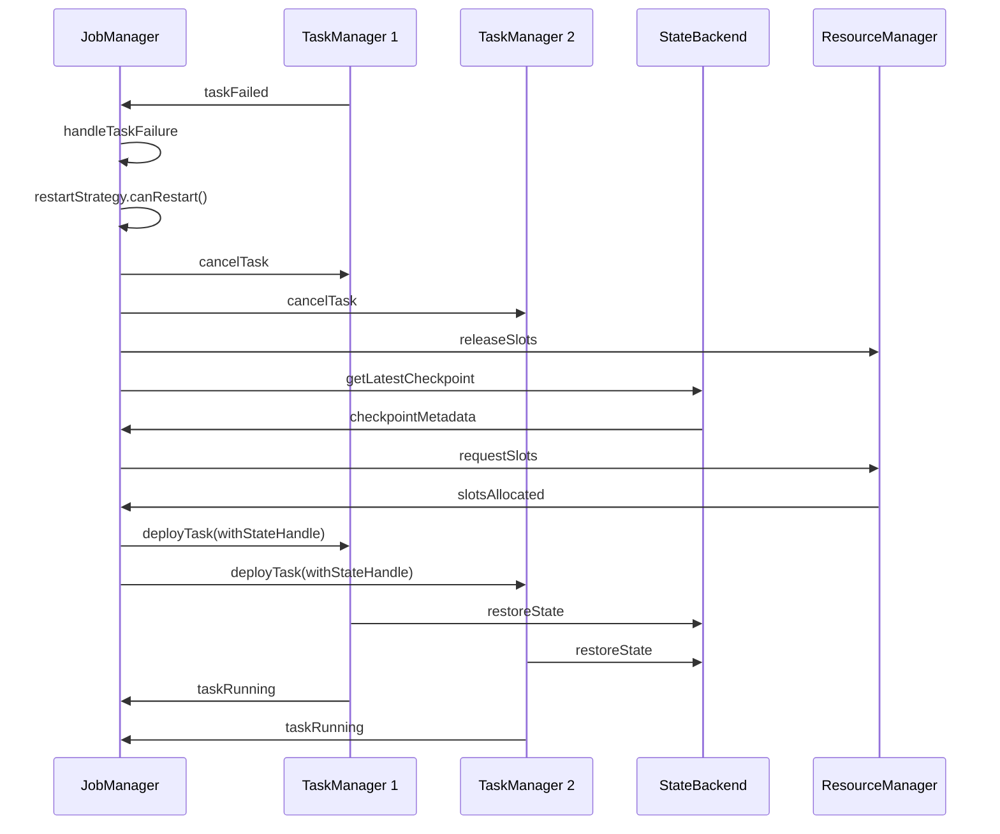
```mermaid
sequenceDiagram
    participant JM as JobManager
    participant TM1 as TaskManager 1
    participant TM2 as TaskManager 2
    participant Storage as StateBackend
    participant RM as ResourceManager
    
    TM1->>JM: taskFailed
    JM->>JM: handleTaskFailure
    JM->>JM: restartStrategy.canRestart()
    
    JM->>TM1: cancelTask
    JM->>TM2: cancelTask
    
    JM->>RM: releaseSlots
    JM->>Storage: getLatestCheckpoint
    Storage->>JM: checkpointMetadata
    
    JM->>RM: requestSlots
    RM->>JM: slotsAllocated
    
    JM->>TM1: deployTask(withStateHandle)
    JM->>TM2: deployTask(withStateHandle)
    
    TM1->>Storage: restoreState
    TM2->>Storage: restoreState
    
    TM1->>JM: taskRunning
    TM2->>JM: taskRunning
```

## 3. 数据流执行时序图

### 3.1 流处理执行流程

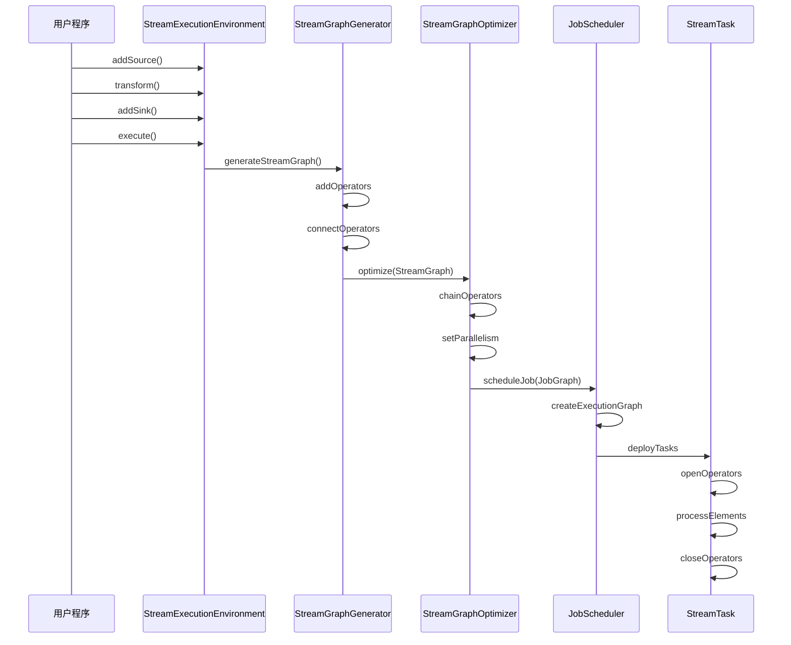
```mermaid
sequenceDiagram
    participant User as 用户程序
    participant Env as StreamExecutionEnvironment
    participant Graph as StreamGraphGenerator
    participant Optimizer as StreamGraphOptimizer
    participant Scheduler as JobScheduler
    participant Task as StreamTask
    
    User->>Env: addSource()
    User->>Env: transform()
    User->>Env: addSink()
    User->>Env: execute()
    
    Env->>Graph: generateStreamGraph()
    Graph->>Graph: addOperators
    Graph->>Graph: connectOperators
    
    Graph->>Optimizer: optimize(StreamGraph)
    Optimizer->>Optimizer: chainOperators
    Optimizer->>Optimizer: setParallelism
    
    Optimizer->>Scheduler: scheduleJob(JobGraph)
    Scheduler->>Scheduler: createExecutionGraph
    Scheduler->>Task: deployTasks
    
    Task->>Task: openOperators
    Task->>Task: processElements
    Task->>Task: closeOperators
```

### 3.2 窗口处理时序图

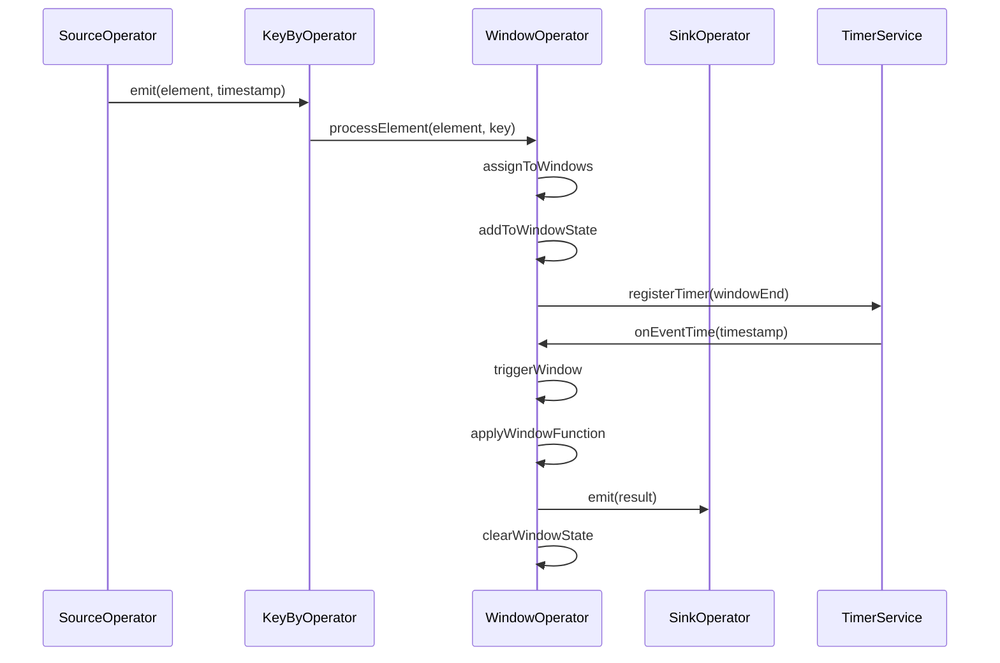
```mermaid
sequenceDiagram
    participant Source as SourceOperator
    participant KeyBy as KeyByOperator
    participant Window as WindowOperator
    participant Sink as SinkOperator
    participant Timer as TimerService
    
    Source->>KeyBy: emit(element, timestamp)
    KeyBy->>Window: processElement(element, key)
    
    Window->>Window: assignToWindows
    Window->>Window: addToWindowState
    Window->>Timer: registerTimer(windowEnd)
    
    Timer->>Window: onEventTime(timestamp)
    Window->>Window: triggerWindow
    Window->>Window: applyWindowFunction
    Window->>Sink: emit(result)
    
    Window->>Window: clearWindowState
```

### 3.3 状态管理时序图

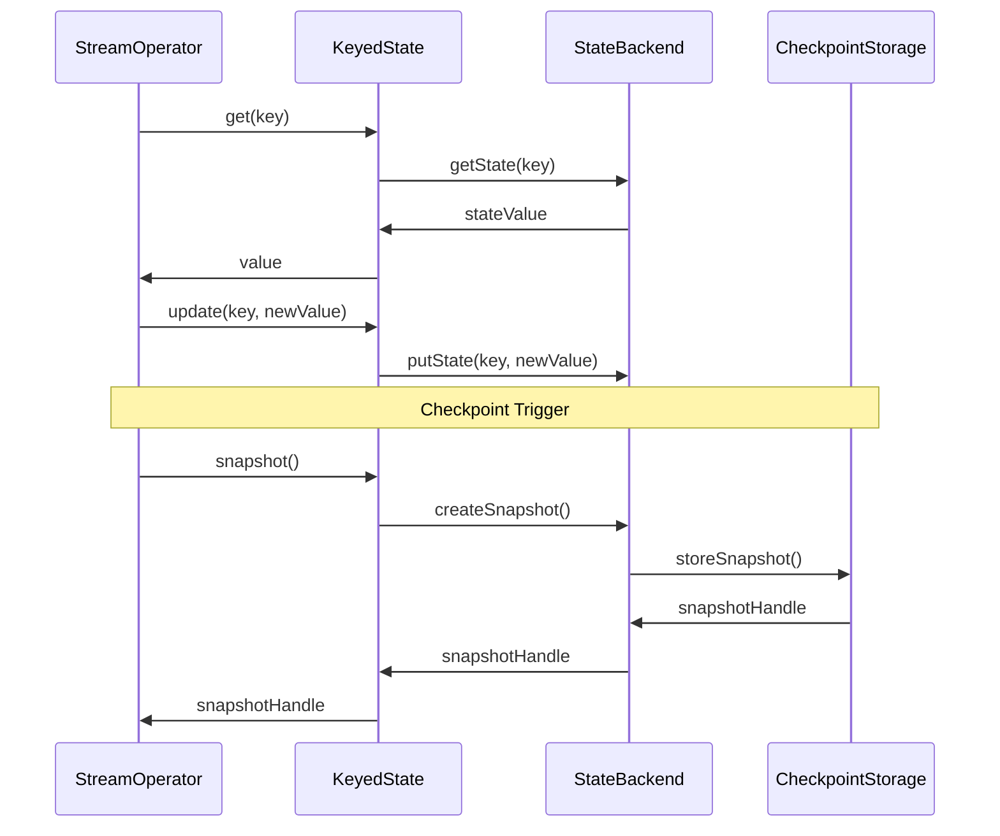
```mermaid
sequenceDiagram
    participant Operator as StreamOperator
    participant State as KeyedState
    participant Backend as StateBackend
    participant Checkpoint as CheckpointStorage
    
    Operator->>State: get(key)
    State->>Backend: getState(key)
    Backend->>State: stateValue
    State->>Operator: value
    
    Operator->>State: update(key, newValue)
    State->>Backend: putState(key, newValue)
    
    Note over Operator,Checkpoint: Checkpoint Trigger
    
    Operator->>State: snapshot()
    State->>Backend: createSnapshot()
    Backend->>Checkpoint: storeSnapshot()
    Checkpoint->>Backend: snapshotHandle
    Backend->>State: snapshotHandle
    State->>Operator: snapshotHandle
```

## 4. 模块交互架构图

### 4.1 核心模块依赖关系

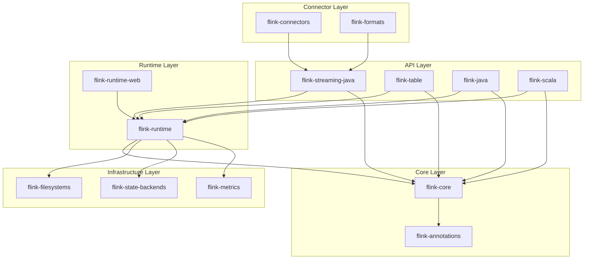
```mermaid
graph TB
    subgraph "API Layer"
        API1[flink-streaming-java]
        API2[flink-table]
        API3[flink-java]
        API4[flink-scala]
    end
    
    subgraph "Runtime Layer"
        RT1[flink-runtime]
        RT2[flink-runtime-web]
    end
    
    subgraph "Core Layer"
        CORE1[flink-core]
        CORE2[flink-annotations]
    end
    
    subgraph "Connector Layer"
        CONN1[flink-connectors]
        CONN2[flink-formats]
    end
    
    subgraph "Infrastructure Layer"
        INFRA1[flink-filesystems]
        INFRA2[flink-state-backends]
        INFRA3[flink-metrics]
    end
    
    API1 --> RT1
    API2 --> RT1
    API3 --> RT1
    API4 --> RT1
    
    RT1 --> CORE1
    RT2 --> RT1
    
    API1 --> CORE1
    API2 --> CORE1
    API3 --> CORE1
    API4 --> CORE1
    
    CONN1 --> API1
    CONN2 --> API1
    
    RT1 --> INFRA1
    RT1 --> INFRA2
    RT1 --> INFRA3
    
    CORE1 --> CORE2
```

### 4.2 运行时组件交互图

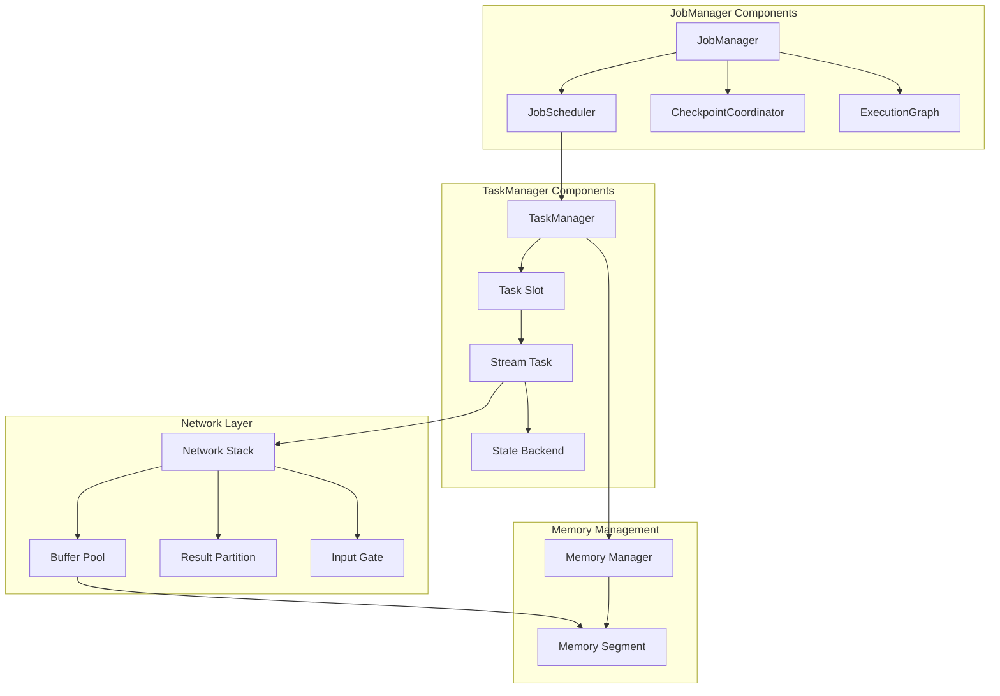
```mermaid
graph TB
    subgraph "JobManager Components"
        JM[JobManager]
        Scheduler[JobScheduler]
        Coordinator[CheckpointCoordinator]
        Graph[ExecutionGraph]
    end
    
    subgraph "TaskManager Components"
        TM[TaskManager]
        TaskSlot[Task Slot]
        StreamTask[Stream Task]
        StateBackend[State Backend]
    end
    
    subgraph "Network Layer"
        Network[Network Stack]
        Buffer[Buffer Pool]
        Partition[Result Partition]
        Gate[Input Gate]
    end
    
    subgraph "Memory Management"
        Memory[Memory Manager]
        Segment[Memory Segment]
    end
    
    JM --> Scheduler
    JM --> Coordinator
    JM --> Graph
    
    Scheduler --> TM
    TM --> TaskSlot
    TaskSlot --> StreamTask
    StreamTask --> StateBackend
    
    StreamTask --> Network
    Network --> Buffer
    Network --> Partition
    Network --> Gate
    
    TM --> Memory
    Memory --> Segment
    Buffer --> Segment
```

## 5. 数据流图转换过程

### 5.1 图转换流程

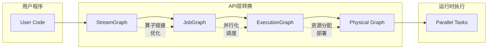
```mermaid
graph LR
    subgraph "用户程序"
        UserCode[User Code]
    end
    
    subgraph "API层转换"
        StreamGraph[StreamGraph]
        JobGraph[JobGraph]
        ExecutionGraph[ExecutionGraph]
        PhysicalGraph[Physical Graph]
    end
    
    subgraph "运行时执行"
        Tasks[Parallel Tasks]
    end
    
    UserCode --> StreamGraph
    StreamGraph --> JobGraph
    JobGraph --> ExecutionGraph
    ExecutionGraph --> PhysicalGraph
    PhysicalGraph --> Tasks
    
    StreamGraph -.-> |"算子链接<br/>优化"| JobGraph
    JobGraph -.-> |"并行化<br/>调度"| ExecutionGraph
    ExecutionGraph -.-> |"资源分配<br/>部署"| PhysicalGraph
```

### 5.2 算子链接优化

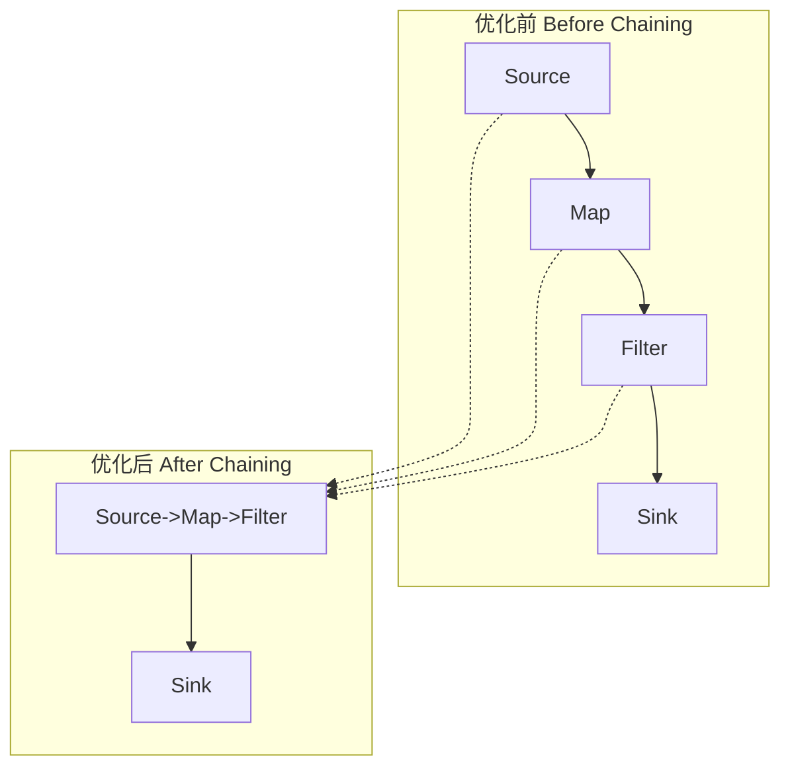
```mermaid
graph TB
    subgraph "优化前 Before Chaining"
        A1[Source] --> B1[Map]
        B1 --> C1[Filter]
        C1 --> D1[Sink]
    end
    
    subgraph "优化后 After Chaining"
        Chain[Source->Map->Filter] --> D2[Sink]
    end
    
    A1 -.-> Chain
    B1 -.-> Chain
    C1 -.-> Chain
```

## 6. 内存管理架构

### 6.1 TaskManager 内存分布

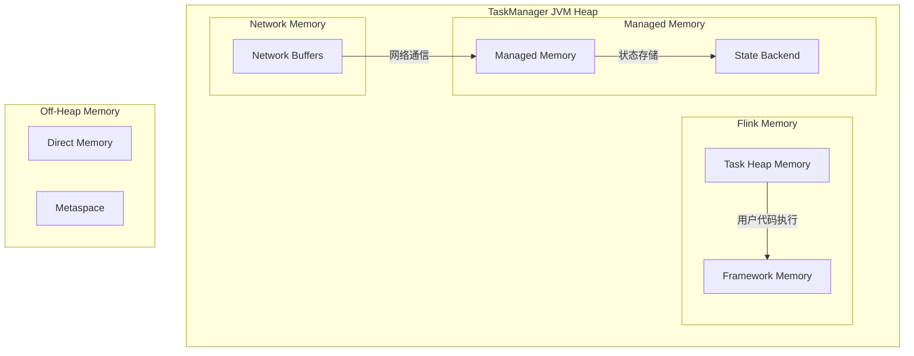
```mermaid
graph TB
    subgraph "TaskManager JVM Heap"
        subgraph "Flink Memory"
            TaskHeap[Task Heap Memory]
            Framework[Framework Memory]
        end
        
        subgraph "Network Memory"
            NetworkBuffers[Network Buffers]
        end
        
        subgraph "Managed Memory"
            ManagedMem[Managed Memory]
            StateBackend[State Backend]
        end
    end
    
    subgraph "Off-Heap Memory"
        DirectMem[Direct Memory]
        MetaSpace[Metaspace]
    end
    
    TaskHeap --> |"用户代码执行"| Framework
    NetworkBuffers --> |"网络通信"| ManagedMem
    ManagedMem --> |"状态存储"| StateBackend
```

### 6.2 网络栈架构

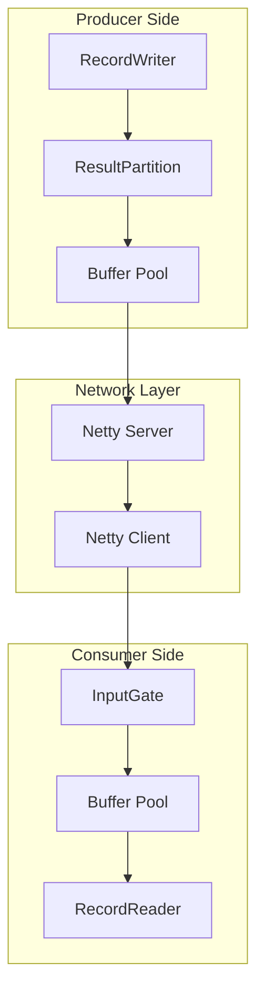
```mermaid
graph TB
    subgraph "Producer Side"
        RecordWriter[RecordWriter]
        ResultPartition[ResultPartition]
        BufferPool1[Buffer Pool]
    end
    
    subgraph "Network Layer"
        NettyServer[Netty Server]
        NettyClient[Netty Client]
    end
    
    subgraph "Consumer Side"
        InputGate[InputGate]
        BufferPool2[Buffer Pool]
        RecordReader[RecordReader]
    end
    
    RecordWriter --> ResultPartition
    ResultPartition --> BufferPool1
    BufferPool1 --> NettyServer
    
    NettyServer --> NettyClient
    
    NettyClient --> InputGate
    InputGate --> BufferPool2
    BufferPool2 --> RecordReader
```

## 7. 容错机制架构

### 7.1 检查点机制

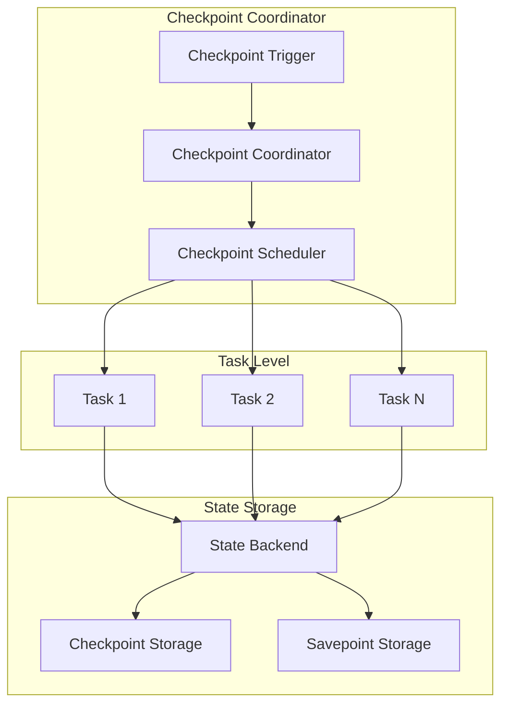
```mermaid
graph TB
    subgraph "Checkpoint Coordinator"
        Trigger[Checkpoint Trigger]
        Coordinator[Checkpoint Coordinator]
        Scheduler[Checkpoint Scheduler]
    end
    
    subgraph "Task Level"
        Task1[Task 1]
        Task2[Task 2]
        TaskN[Task N]
    end
    
    subgraph "State Storage"
        StateBackend1[State Backend]
        CheckpointStorage[Checkpoint Storage]
        SavepointStorage[Savepoint Storage]
    end
    
    Trigger --> Coordinator
    Coordinator --> Scheduler
    
    Scheduler --> Task1
    Scheduler --> Task2
    Scheduler --> TaskN
    
    Task1 --> StateBackend1
    Task2 --> StateBackend1
    TaskN --> StateBackend1
    
    StateBackend1 --> CheckpointStorage
    StateBackend1 --> SavepointStorage
```

### 7.2 故障检测和恢复

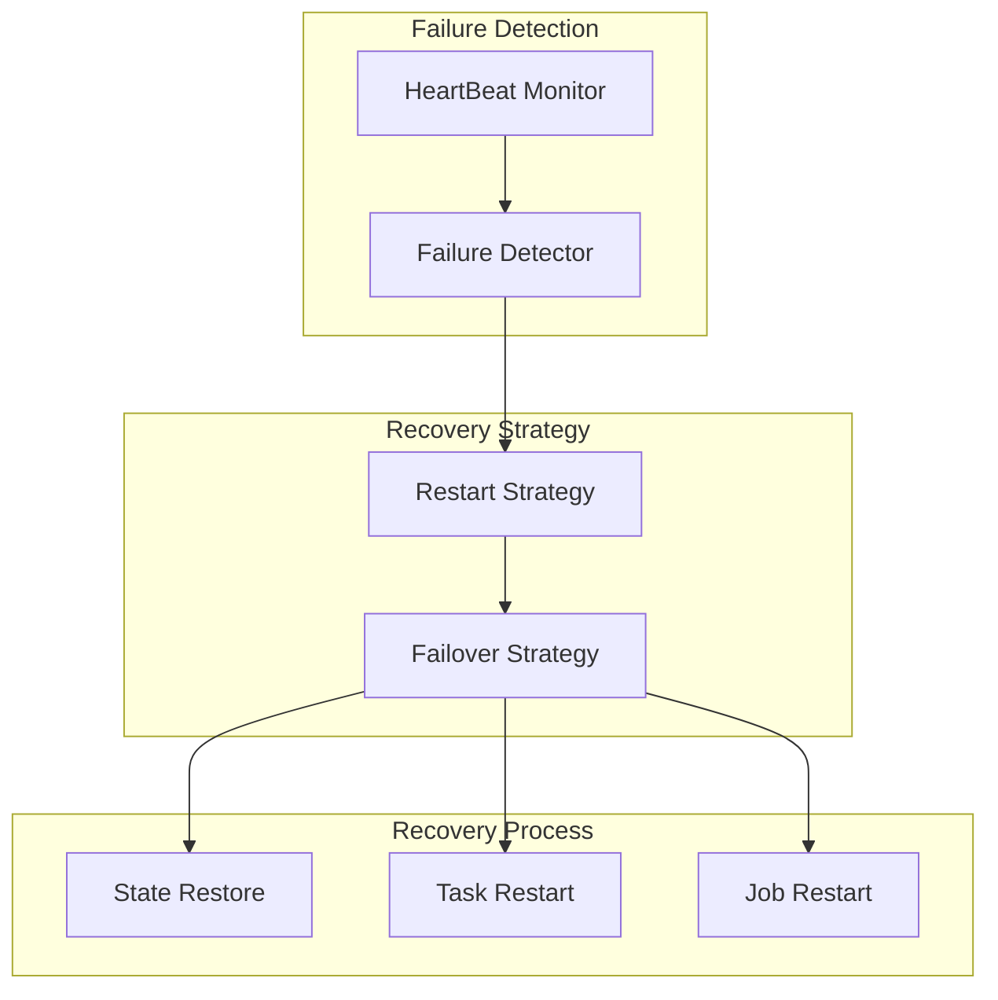
```mermaid
graph TB
    subgraph "Failure Detection"
        HeartBeat[HeartBeat Monitor]
        FailureDetector[Failure Detector]
    end
    
    subgraph "Recovery Strategy"
        RestartStrategy[Restart Strategy]
        FailoverStrategy[Failover Strategy]
    end
    
    subgraph "Recovery Process"
        StateRestore[State Restore]
        TaskRestart[Task Restart]
        JobRestart[Job Restart]
    end
    
    HeartBeat --> FailureDetector
    FailureDetector --> RestartStrategy
    RestartStrategy --> FailoverStrategy
    
    FailoverStrategy --> StateRestore
    FailoverStrategy --> TaskRestart
    FailoverStrategy --> JobRestart
```

这个架构图和时序图文档提供了 Flink 系统的全面视图，从整体架构到具体的执行流程，帮助深入理解 Flink 的设计原理和运行机制。
