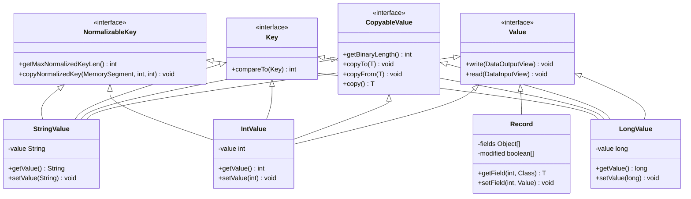

## 1. 类型系统架构

### 1.1 TypeInformation 继承体系


### 1.2 TypeInformation 核心实现

```java
/**
 * TypeInformation 是 Flink 类型系统的核心类
 * 为所有用作用户函数输入或返回类型的类型提供类型信息
 */
@Public
public abstract class TypeInformation<T> implements Serializable {
    
    private static final long serialVersionUID = -7742311969684489493L;
    
    /**
     * 检查此类型信息是否表示基本类型
     * 基本类型包括原始类型、包装类型、String、Date、Void 等
     */
    @PublicEvolving
    public abstract boolean isBasicType();
    
    /**
     * 检查此类型信息是否表示 Tuple 类型
     */
    @PublicEvolving
    public abstract boolean isTupleType();
    
    /**
     * 获取此类型的元数 - 不包含嵌套的字段数量
     */
    @PublicEvolving
    public abstract int getArity();
    
    /**
     * 获取此类型中逻辑字段的数量
     * 包括嵌套和传递嵌套字段（对于复合类型）
     */
    @PublicEvolving
    public abstract int getTotalFields();
    
    /**
     * 获取此类型信息表示的类型的 Class
     */
    @PublicEvolving
    public abstract Class<T> getTypeClass();
    
    /**
     * 检查此类型是否可以用作键
     */
    public boolean isKeyType() {
        return this instanceof AtomicType;
    }
    
    /**
     * 创建此类型的序列化器
     */
    @PublicEvolving
    public abstract TypeSerializer<T> createSerializer(ExecutionConfig config);
    
    /**
     * 可选方法，为 Flink 的类型提取系统提供泛型类型参数映射信息
     */
    public Map<String, TypeInformation<?>> getGenericParameters() {
        return Collections.emptyMap();
    }
    
    /**
     * 检查此类型信息是否可以等同于另一个对象
     */
    public boolean canEqual(Object obj) {
        return obj instanceof TypeInformation;
    }
    
    /**
     * 静态工厂方法，根据 Class 创建 TypeInformation
     */
    public static <X> TypeInformation<X> of(Class<X> typeClass) {
        return TypeExtractor.createTypeInfo(typeClass);
    }
    
    /**
     * 静态工厂方法，根据 TypeHint 创建 TypeInformation
     */
    public static <X> TypeInformation<X> of(TypeHint<X> typeHint) {
        return typeHint.getTypeInfo();
    }
}
```

### 1.3 BasicTypeInfo 实现

```java
/**
 * 基本类型的 TypeInformation
 * 包含所有 Java 原始类型和常用类型的预定义实例
 */
@Public
public class BasicTypeInfo<T> extends TypeInformation<T> implements AtomicType<T> {
    
    private static final long serialVersionUID = 1L;
    
    // 预定义的基本类型实例
    public static final BasicTypeInfo<String> STRING_TYPE_INFO = new BasicTypeInfo<>(String.class, new Class<?>[]{}, StringSerializer.INSTANCE, String.class);
    public static final BasicTypeInfo<Boolean> BOOLEAN_TYPE_INFO = new BasicTypeInfo<>(Boolean.class, new Class<?>[]{}, BooleanSerializer.INSTANCE, boolean.class);
    public static final BasicTypeInfo<Byte> BYTE_TYPE_INFO = new BasicTypeInfo<>(Byte.class, new Class<?>[]{}, ByteSerializer.INSTANCE, byte.class);
    public static final BasicTypeInfo<Short> SHORT_TYPE_INFO = new BasicTypeInfo<>(Short.class, new Class<?>[]{}, ShortSerializer.INSTANCE, short.class);
    public static final BasicTypeInfo<Integer> INT_TYPE_INFO = new BasicTypeInfo<>(Integer.class, new Class<?>[]{}, IntSerializer.INSTANCE, int.class);
    public static final BasicTypeInfo<Long> LONG_TYPE_INFO = new BasicTypeInfo<>(Long.class, new Class<?>[]{}, LongSerializer.INSTANCE, long.class);
    public static final BasicTypeInfo<Float> FLOAT_TYPE_INFO = new BasicTypeInfo<>(Float.class, new Class<?>[]{}, FloatSerializer.INSTANCE, float.class);
    public static final BasicTypeInfo<Double> DOUBLE_TYPE_INFO = new BasicTypeInfo<>(Double.class, new Class<?>[]{}, DoubleSerializer.INSTANCE, double.class);
    public static final BasicTypeInfo<Character> CHAR_TYPE_INFO = new BasicTypeInfo<>(Character.class, new Class<?>[]{}, CharSerializer.INSTANCE, char.class);
    public static final BasicTypeInfo<Date> DATE_TYPE_INFO = new BasicTypeInfo<>(Date.class, new Class<?>[]{}, DateSerializer.INSTANCE);
    public static final BasicTypeInfo<Void> VOID_TYPE_INFO = new BasicTypeInfo<>(Void.class, new Class<?>[]{}, VoidSerializer.INSTANCE, void.class);
    public static final BasicTypeInfo<BigInteger> BIG_INT_TYPE_INFO = new BasicTypeInfo<>(BigInteger.class, new Class<?>[]{}, BigIntSerializer.INSTANCE);
    public static final BasicTypeInfo<BigDecimal> BIG_DEC_TYPE_INFO = new BasicTypeInfo<>(BigDecimal.class, new Class<?>[]{}, BigDecSerializer.INSTANCE);
    
    private final Class<T> clazz;
    private final Class<?>[] possibleCastTargetTypes;
    private final TypeSerializer<T> serializer;
    private final Class<T> primitiveType;
    
    protected BasicTypeInfo(Class<T> clazz, Class<?>[] possibleCastTargetTypes, TypeSerializer<T> serializer, Class<T> primitiveType) {
        this.clazz = checkNotNull(clazz);
        this.possibleCastTargetTypes = checkNotNull(possibleCastTargetTypes);
        this.serializer = checkNotNull(serializer);
        this.primitiveType = primitiveType;
    }
    
    @Override
    public boolean isBasicType() {
        return true;
    }
    
    @Override
    public boolean isTupleType() {
        return false;
    }
    
    @Override
    public int getArity() {
        return 1;
    }
    
    @Override
    public int getTotalFields() {
        return 1;
    }
    
    @Override
    public Class<T> getTypeClass() {
        return this.clazz;
    }
    
    @Override
    public TypeSerializer<T> createSerializer(ExecutionConfig executionConfig) {
        return this.serializer;
    }
    
    @Override
    public TypeComparator<T> createComparator(boolean sortOrderAscending, ExecutionConfig executionConfig) {
        return BasicTypeComparator.createComparator(clazz, sortOrderAscending, executionConfig);
    }
}
```

### 1.4 CompositeType 抽象类

```java
/**
 * 复合类型的基类
 * 复合类型是包含多个字段的类型，如 Tuple、POJO、Row 等
 */
@Public
public abstract class CompositeType<T> extends TypeInformation<T> {
    
    private static final long serialVersionUID = 1L;
    
    /**
     * 获取所有字段的名称
     */
    public abstract String[] getFieldNames();
    
    /**
     * 根据字段名获取字段索引
     */
    public abstract int getFieldIndex(String fieldName);
    
    /**
     * 根据索引获取字段的 TypeInformation
     */
    public abstract <X> TypeInformation<X> getTypeAt(int pos);
    
    /**
     * 根据字段名获取字段的 TypeInformation
     */
    public <X> TypeInformation<X> getTypeAt(String fieldName) {
        return getTypeAt(getFieldIndex(fieldName));
    }
    
    /**
     * 将字段展平为平面模式
     */
    public abstract void getFlatFields(String fieldExpression, int offset, List<FlatFieldDescriptor> result);
    
    /**
     * 检查给定的字段表达式是否有效
     */
    public boolean hasField(String fieldName) {
        return getFieldIndex(fieldName) != -1;
    }
    
    /**
     * 获取嵌套字段的 TypeInformation
     */
    public TypeInformation<?> getTypeAt(String fieldExpression) {
        List<FlatFieldDescriptor> ffd = new ArrayList<>();
        getFlatFields(fieldExpression, 0, ffd);
        
        if (ffd.size() == 1) {
            return ffd.get(0).getType();
        } else {
            throw new InvalidFieldReferenceException("Field expression \"" + fieldExpression + 
                "\" does not reference a single field.");
        }
    }
}
```

## 2. 数据类型体系

### 2.1 Value 接口体系



### 2.2 Row 数据结构

```java
/**
 * Row 可以包含任意数量的字段，包含一组字段，这些字段可能都是不同的类型
 * Row 中的字段可以为 null
 */
@PublicEvolving
public class Row implements Serializable {
    
    private static final long serialVersionUID = 1L;
    
    /** 字段数组 */
    private final Object[] fields;
    
    /** 字段类型 */
    private RowKind kind;
    
    /**
     * 创建具有给定元数（字段数量）的新 Row
     */
    public Row(int arity) {
        this.fields = new Object[arity];
        this.kind = RowKind.INSERT; // 默认为 INSERT
    }
    
    /**
     * 创建具有给定字段的新 Row
     */
    public Row(RowKind kind, Object[] fields) {
        this.kind = kind;
        this.fields = fields;
    }
    
    /**
     * 获取字段数量
     */
    public int getArity() {
        return fields.length;
    }
    
    /**
     * 获取指定位置的字段值
     */
    public Object getField(int pos) {
        return fields[pos];
    }
    
    /**
     * 设置指定位置的字段值
     */
    public void setField(int pos, Object value) {
        fields[pos] = value;
    }
    
    /**
     * 获取 Row 的种类（INSERT、UPDATE_BEFORE、UPDATE_AFTER、DELETE）
     */
    public RowKind getKind() {
        return kind;
    }
    
    /**
     * 设置 Row 的种类
     */
    public void setKind(RowKind kind) {
        this.kind = kind;
    }
    
    /**
     * 创建指定元数的新 Row
     */
    public static Row of(Object... values) {
        Row row = new Row(values.length);
        for (int i = 0; i < values.length; i++) {
            row.setField(i, values[i]);
        }
        return row;
    }
    
    /**
     * 创建具有指定种类和字段的新 Row
     */
    public static Row ofKind(RowKind kind, Object... values) {
        return new Row(kind, values);
    }
    
    @Override
    public String toString() {
        StringBuilder sb = new StringBuilder();
        sb.append(kind.shortString()).append("(");
        for (int i = 0; i < fields.length; i++) {
            if (i > 0) {
                sb.append(",");
            }
            sb.append(StringUtils.arrayAwareToString(fields[i]));
        }
        sb.append(")");
        return sb.toString();
    }
    
    @Override
    public boolean equals(Object o) {
        if (this == o) {
            return true;
        }
        if (o == null || getClass() != o.getClass()) {
            return false;
        }
        Row row = (Row) o;
        return kind == row.kind && Arrays.deepEquals(fields, row.fields);
    }
    
    @Override
    public int hashCode() {
        int result = Objects.hash(kind);
        result = 31 * result + Arrays.deepHashCode(fields);
        return result;
    }
}
```

### 2.3 Tuple 类型体系


## 3. Transformation 转换体系

### 3.1 Transformation 继承关系


### 3.2 Transformation 基类实现

```java
/**
 * Transformation 表示创建 DataStream 的操作
 * 每个 Transformation 都有一个唯一的 ID，用于在优化过程中识别节点
 */
@Internal
public abstract class Transformation<T> {
    
    // 用于生成唯一 ID 的计数器
    protected static Integer idCounter = 0;
    
    // 转换的唯一标识符
    private final int id;
    
    // 转换的名称
    private String name;
    
    // 输出类型信息
    private final TypeInformation<T> outputType;
    
    // 并行度
    private int parallelism;
    
    // 最大并行度
    private int maxParallelism = -1;
    
    // 资源规格
    private ResourceSpec minResources = ResourceSpec.DEFAULT;
    private ResourceSpec preferredResources = ResourceSpec.DEFAULT;
    
    // Slot 共享组
    private String slotSharingGroup;
    
    // 协同位置组
    private String coLocationGroupKey;
    
    // 用户界面哈希
    private String uiHash;
    
    /**
     * 创建新的 Transformation
     */
    public Transformation(String name, TypeInformation<T> outputType, int parallelism) {
        this.id = getNewId();
        this.name = Preconditions.checkNotNull(name);
        this.outputType = Preconditions.checkNotNull(outputType);
        this.parallelism = parallelism;
    }
    
    /**
     * 获取新的唯一 ID
     */
    private static Integer getNewId() {
        synchronized (idCounter) {
            return idCounter++;
        }
    }
    
    /**
     * 获取此转换的 ID
     */
    public int getId() {
        return id;
    }
    
    /**
     * 获取此转换的名称
     */
    public String getName() {
        return name;
    }
    
    /**
     * 设置此转换的名称
     */
    public void setName(String name) {
        this.name = name;
    }
    
    /**
     * 获取输出类型
     */
    public TypeInformation<T> getOutputType() {
        return outputType;
    }
    
    /**
     * 获取并行度
     */
    public int getParallelism() {
        return parallelism;
    }
    
    /**
     * 设置并行度
     */
    public void setParallelism(int parallelism) {
        Preconditions.checkArgument(parallelism > 0 || parallelism == -1, 
            "The parallelism must be at least one, or -1 (use default).");
        this.parallelism = parallelism;
    }
    
    /**
     * 获取最大并行度
     */
    public int getMaxParallelism() {
        return maxParallelism;
    }
    
    /**
     * 设置最大并行度
     */
    public void setMaxParallelism(int maxParallelism) {
        Preconditions.checkArgument(maxParallelism > 0, 
            "The maximum parallelism must be at least one.");
        this.maxParallelism = maxParallelism;
    }
    
    /**
     * 获取此转换的所有传递前驱
     */
    public abstract Collection<Transformation<?>> getTransitivePredecessors();
    
    /**
     * 设置 Slot 共享组
     */
    public void setSlotSharingGroup(String slotSharingGroup) {
        this.slotSharingGroup = slotSharingGroup;
    }
    
    /**
     * 获取 Slot 共享组
     */
    public String getSlotSharingGroup() {
        return slotSharingGroup;
    }
    
    /**
     * 设置协同位置组键
     */
    public void setCoLocationGroupKey(String coLocationGroupKey) {
        this.coLocationGroupKey = coLocationGroupKey;
    }
    
    /**
     * 获取协同位置组键
     */
    public String getCoLocationGroupKey() {
        return coLocationGroupKey;
    }
}
```

### 3.3 OneInputTransformation 实现

```java
/**
 * 此 Transformation 表示将 OneInputStreamOperator 应用于一个输入 Transformation
 */
@Internal
public class OneInputTransformation<IN, OUT> extends PhysicalTransformation<OUT> {
    
    private final Transformation<IN> input;
    private final StreamOperatorFactory<OUT> operatorFactory;
    
    // 状态键选择器
    private KeySelector<IN, ?> stateKeySelector;
    private TypeInformation<?> stateKeyType;
    
    /**
     * 从给定的输入和操作符创建新的 OneInputTransformation
     */
    public OneInputTransformation(
            Transformation<IN> input,
            String name,
            OneInputStreamOperator<IN, OUT> operator,
            TypeInformation<OUT> outputType,
            int parallelism) {
        this(input, name, SimpleOperatorFactory.of(operator), outputType, parallelism);
    }
    
    public OneInputTransformation(
            Transformation<IN> input,
            String name,
            StreamOperatorFactory<OUT> operatorFactory,
            TypeInformation<OUT> outputType,
            int parallelism) {
        super(name, outputType, parallelism);
        this.input = input;
        this.operatorFactory = operatorFactory;
    }
    
    /**
     * 返回此 OneInputTransformation 的输入 Transformation
     */
    public Transformation<IN> getInput() {
        return input;
    }
    
    /**
     * 返回输入元素的 TypeInformation
     */
    public TypeInformation<IN> getInputType() {
        return input.getOutputType();
    }
    
    /**
     * 返回此 Transformation 的 StreamOperatorFactory
     */
    public StreamOperatorFactory<OUT> getOperatorFactory() {
        return operatorFactory;
    }
    
    /**
     * 设置必须用于此操作的键控状态分区的 KeySelector
     */
    public void setStateKeySelector(KeySelector<IN, ?> stateKeySelector) {
        this.stateKeySelector = stateKeySelector;
    }
    
    /**
     * 返回用于此操作的键控状态分区的 KeySelector
     */
    public KeySelector<IN, ?> getStateKeySelector() {
        return stateKeySelector;
    }
    
    /**
     * 设置状态键的 TypeInformation
     */
    public void setStateKeyType(TypeInformation<?> stateKeyType) {
        this.stateKeyType = stateKeyType;
    }
    
    /**
     * 返回状态键的 TypeInformation
     */
    public TypeInformation<?> getStateKeyType() {
        return stateKeyType;
    }
    
    @Override
    public Collection<Transformation<?>> getTransitivePredecessors() {
        List<Transformation<?>> result = Lists.newArrayList();
        result.add(this);
        result.addAll(input.getTransitivePredecessors());
        return result;
    }
    
    @Override
    public final void setChainingStrategy(ChainingStrategy strategy) {
        operatorFactory.setChainingStrategy(strategy);
    }
}
```

## 4. 序列化器体系

### 4.1 TypeSerializer 继承关系


### 4.2 TypeSerializer 基类

```java
/**
 * 类型序列化器的基类
 * 负责创建实例、序列化和反序列化对象
 */
@Public
public abstract class TypeSerializer<T> implements Serializable {
    
    private static final long serialVersionUID = 1L;
    
    /**
     * 获取序列化类型是否为不可变类型
     */
    public abstract boolean isImmutableType();
    
    /**
     * 创建此序列化器的副本
     */
    public abstract TypeSerializer<T> duplicate();
    
    /**
     * 创建类型的新实例
     */
    public abstract T createInstance();
    
    /**
     * 创建给定元素的深拷贝
     */
    public abstract T copy(T from);
    
    /**
     * 将 from 的内容复制到 reuse 实例中并返回 reuse 实例
     */
    public abstract T copy(T from, T reuse);
    
    /**
     * 获取序列化数据的长度
     * 如果长度不固定，返回 -1
     */
    public abstract int getLength();
    
    /**
     * 将给定记录序列化到给定目标输出视图
     */
    public abstract void serialize(T record, DataOutputView target) throws IOException;
    
    /**
     * 从给定源输入视图反序列化记录
     */
    public abstract T deserialize(DataInputView source) throws IOException;
    
    /**
     * 从给定源输入视图反序列化记录到给定的 reuse 实例中
     */
    public abstract T deserialize(T reuse, DataInputView source) throws IOException;
    
    /**
     * 将序列化记录从源复制到目标
     */
    public void copy(DataInputView source, DataOutputView target) throws IOException {
        serialize(deserialize(source), target);
    }
    
    /**
     * 检查此序列化器是否等于给定对象
     */
    @Override
    public abstract boolean equals(Object obj);
    
    /**
     * 返回此序列化器的哈希码
     */
    @Override
    public abstract int hashCode();
    
    /**
     * 快照此序列化器的配置
     */
    public abstract TypeSerializerSnapshot<T> snapshotConfiguration();
}
```

## 5. 状态描述符体系

### 5.1 StateDescriptor 继承关系


### 5.2 StateDescriptor 基类实现

```java
/**
 * 状态描述符的基类
 * 状态描述符定义了状态的名称、类型和默认值
 */
@Public
public abstract class StateDescriptor<S extends State, T> implements Serializable {
    
    private static final long serialVersionUID = 1L;
    
    /** 状态的名称 */
    private final String name;
    
    /** 状态值的类型信息 */
    private final TypeInformation<T> typeInfo;
    
    /** 状态的默认值 */
    private transient T defaultValue;
    
    /** 状态值的序列化器 */
    private TypeSerializer<T> serializer;
    
    /**
     * 创建新的状态描述符
     */
    protected StateDescriptor(String name, TypeInformation<T> typeInfo, T defaultValue) {
        this.name = Preconditions.checkNotNull(name, "name must not be null");
        this.typeInfo = Preconditions.checkNotNull(typeInfo, "type information must not be null");
        this.defaultValue = defaultValue;
    }
    
    /**
     * 创建新的状态描述符
     */
    protected StateDescriptor(String name, Class<T> type, T defaultValue) {
        this.name = Preconditions.checkNotNull(name, "name must not be null");
        
        try {
            this.typeInfo = TypeInformation.of(type);
        } catch (InvalidTypesException e) {
            throw new IllegalArgumentException("Cannot create TypeInformation for type " + type.getName() + 
                ". The most common reason is failure to infer the generic type information, " +
                "in which case you can pass explicit type information as an argument " +
                "to the constructor or specify it when creating the data stream / data set.", e);
        }
        
        this.defaultValue = defaultValue;
    }
    
    /**
     * 获取状态的名称
     */
    public String getName() {
        return name;
    }
    
    /**
     * 获取状态值的类型信息
     */
    public TypeInformation<T> getTypeInformation() {
        return typeInfo;
    }
    
    /**
     * 获取状态的默认值
     */
    public T getDefaultValue() {
        if (defaultValue != null) {
            TypeSerializer<T> serializer = getSerializer();
            return serializer.copy(defaultValue);
        } else {
            return null;
        }
    }
    
    /**
     * 设置状态的默认值
     */
    public void setDefaultValue(T defaultValue) {
        this.defaultValue = defaultValue;
    }
    
    /**
     * 获取状态值的序列化器
     */
    public TypeSerializer<T> getSerializer() {
        if (serializer != null) {
            return serializer.duplicate();
        } else {
            throw new IllegalStateException("Serializer not yet initialized.");
        }
    }
    
    /**
     * 初始化序列化器
     */
    public void initializeSerializerUnlessSet(ExecutionConfig executionConfig) {
        if (serializer == null) {
            serializer = typeInfo.createSerializer(executionConfig);
        }
    }
    
    /**
     * 获取状态的类型
     */
    public abstract Type getType();
    
    @Override
    public int hashCode() {
        return name.hashCode() + 31 * typeInfo.hashCode();
    }
    
    @Override
    public boolean equals(Object o) {
        if (this == o) {
            return true;
        }
        
        if (o == null || getClass() != o.getClass()) {
            return false;
        }
        
        StateDescriptor<?, ?> that = (StateDescriptor<?, ?>) o;
        
        return name.equals(that.name) && typeInfo.equals(that.typeInfo);
    }
    
    @Override
    public String toString() {
        return getClass().getSimpleName() + 
            "{name=" + name + 
            ", typeInfo=" + typeInfo + 
            ", defaultValue=" + defaultValue + 
            ", serializer=" + serializer + "}";
    }
}
```

## 6. 关键设计模式

### 6.1 工厂模式

Flink 大量使用工厂模式来创建各种组件：

- `TypeInformation.of()` - 创建类型信息
- `StreamOperatorFactory` - 创建流操作符
- `StateDescriptor` - 创建状态描述符

### 6.2 访问者模式

在类型系统中使用访问者模式处理不同类型：

- `TypeInformationVisitor` - 访问类型信息
- `TypeSerializerVisitor` - 访问序列化器

### 6.3 建造者模式

用于构建复杂对象：

- `ExecutionConfig.Builder` - 构建执行配置
- `CheckpointConfig.Builder` - 构建检查点配置

### 6.4 策略模式

用于不同的算法实现：

- `ChainingStrategy` - 算子链接策略
- `RestartStrategy` - 重启策略
- `PartitionStrategy` - 分区策略

## 7. 类型安全和性能优化

### 7.1 编译时类型检查

Flink 通过 `TypeInformation` 系统在编译时进行类型检查：

```java
// 编译时类型安全
DataStream<String> stream = env.fromElements("hello", "world");
DataStream<Integer> lengths = stream.map(String::length); // 类型安全的转换
```

### 7.2 序列化优化

- **专用序列化器**：为基本类型提供高效的专用序列化器
- **对象重用**：通过对象重用减少 GC 压力
- **零拷贝**：在可能的情况下避免数据复制

### 7.3 内存管理

- **类型感知内存管理**：根据类型信息优化内存布局
- **预分配缓冲区**：为已知大小的类型预分配内存
- **压缩存储**：对某些类型使用压缩存储格式

## 8. 执行图数据结构

### 8.1 ExecutionGraph 继承关系


## 9. 网络栈数据结构

### 9.1 网络缓冲区继承关系


这个关键数据结构和继承关系分析文档详细解释了 Flink 的类型系统、数据结构、执行图、网络栈等核心组件的设计原理，为深入理解 Flink 的核心架构提供了全面的指导。
