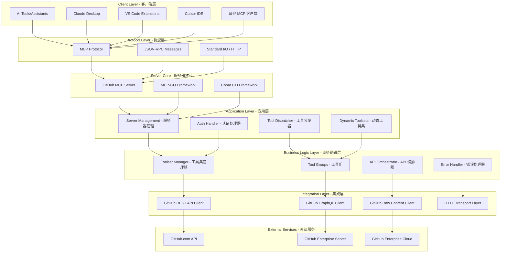
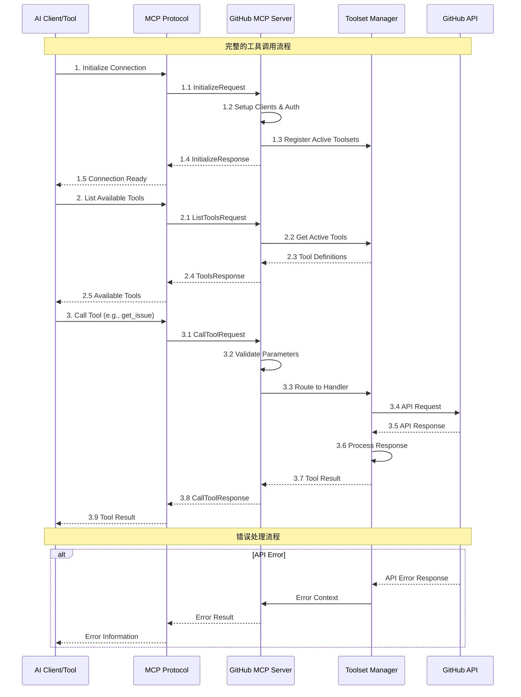

# GitHub MCP Server - 项目整体架构分析

## 项目概述

GitHub MCP Server 是一个基于 Go 语言实现的 Model Context Protocol (MCP) 服务器，它连接 AI 工具到 GitHub 平台，使 AI 助手、代理和聊天机器人能够通过自然语言交互来操作 GitHub 的各种功能。

### 核心特性

- **仓库管理**：浏览和查询代码、搜索文件、分析提交、理解项目结构
- **Issue 和 PR 自动化**：创建、更新和管理 issues 和 pull requests，帮助分类错误、审查代码变更
- **CI/CD 和工作流智能**：监控 GitHub Actions 工作流运行、分析构建失败、管理发布
- **代码分析**：检查安全发现、审查 Dependabot 警报、理解代码模式
- **团队协作**：访问讨论、管理通知、分析团队活动

## 整体架构设计

### 1. 系统架构层次



### 2. 核心组件关系图

```mermaid
classDiagram
    class MCPServer {
        +name: string
        +version: string
        +tools: []Tool
        +resources: []Resource
        +prompts: []Prompt
        +AddTool(tool, handler)
        +AddResource(resource, handler)
        +AddPrompt(prompt, handler)
    }

    class ToolsetGroup {
        +toolsets: map[string]*Toolset
        +readOnly: bool
        +everythingOn: bool
        +AddToolset(toolset)
        +EnableToolset(name)
        +RegisterAll(server)
    }

    class Toolset {
        +name: string
        +description: string
        +enabled: bool
        +readTools: []ServerTool
        +writeTools: []ServerTool
        +resourceTemplates: []ServerResourceTemplate
        +prompts: []ServerPrompt
        +AddReadTools(tools)
        +AddWriteTools(tools)
        +RegisterTools(server)
    }

    class GitHubClients {
        +restClient: *github.Client
        +gqlClient: *githubv4.Client
        +rawClient: *raw.Client
        +GetClient() *github.Client
        +GetGQLClient() *githubv4.Client
        +GetRawClient() *raw.Client
    }

    class APIHost {
        +baseRESTURL: *url.URL
        +graphqlURL: *url.URL
        +uploadURL: *url.URL
        +rawURL: *url.URL
    }

    MCPServer ||--o{ ToolsetGroup : contains
    ToolsetGroup ||--o{ Toolset : manages
    Toolset ||--o{ GitHubClients : uses
    GitHubClients ||--|| APIHost : connects_to

    %% Toolset 的具体实现
    class RepositoriesToolset {
        +searchRepositories()
        +getFileContents()
        +createOrUpdateFile()
        +createRepository()
        +forkRepository()
    }

    class IssuesToolset {
        +listIssues()
        +getIssue()
        +createIssue()
        +updateIssue()
        +addIssueComment()
        +assignCopilotToIssue()
    }

    class ActionsToolset {
        +listWorkflows()
        +runWorkflow()
        +getWorkflowRun()
        +getJobLogs()
        +cancelWorkflowRun()
    }

    class PullRequestsToolset {
        +listPullRequests()
        +getPullRequest()
        +createPullRequest()
        +mergePullRequest()
        +getPullRequestDiff()
    }

    Toolset <|-- RepositoriesToolset
    Toolset <|-- IssuesToolset
    Toolset <|-- ActionsToolset
    Toolset <|-- PullRequestsToolset
```

### 3. 主要模块功能分类

#### 核心服务模块

| 模块 | 路径 | 功能描述 | 关键特性 |
|------|------|----------|----------|
| **主入口模块** | `cmd/github-mcp-server/` | 应用程序启动入口 | CLI 框架、配置管理、版本信息 |
| **服务器核心** | `internal/ghmcp/` | MCP 服务器核心逻辑 | 协议处理、客户端管理、认证 |
| **工具集管理** | `pkg/toolsets/` | 工具集的组织和管理 | 动态启用、读写分离、依赖管理 |

#### 业务功能模块

| 工具集 | 描述 | 核心工具 | API类型 |
|--------|------|----------|---------|
| **context** | 用户和上下文信息 | get_me, get_teams, get_team_members | REST |
| **repos** | 仓库相关操作 | search_repositories, get_file_contents, create_repository | REST + Raw |
| **issues** | Issues 管理 | list_issues, create_issue, update_issue, add_issue_comment | REST + GraphQL |
| **pull_requests** | PR 管理 | list_pull_requests, create_pull_request, merge_pull_request | REST |
| **actions** | GitHub Actions | list_workflows, run_workflow, get_job_logs | REST |
| **code_security** | 代码安全 | list_code_scanning_alerts, get_code_scanning_alert | REST |
| **secret_protection** | 密钥保护 | list_secret_scanning_alerts, get_secret_scanning_alert | REST |
| **dependabot** | 依赖管理 | list_dependabot_alerts, get_dependabot_alert | REST |
| **notifications** | 通知管理 | list_notifications, dismiss_notification | REST |
| **discussions** | 讨论管理 | list_discussions, get_discussion | GraphQL |
| **gists** | Gist 管理 | list_gists, create_gist, update_gist | REST |
| **projects** | 项目管理 | list_projects, get_project, list_project_fields | REST |
| **security_advisories** | 安全建议 | list_global_security_advisories | REST |
| **users** | 用户管理 | search_users | REST |
| **orgs** | 组织管理 | search_orgs | REST |

#### 支持服务模块

| 模块 | 路径 | 功能描述 |
|------|------|----------|
| **错误处理** | `pkg/errors/` | GitHub API 错误处理和上下文信息 |
| **日志处理** | `pkg/log/` | I/O 日志记录和调试信息 |
| **缓冲处理** | `pkg/buffer/` | 响应内容缓冲和处理 |
| **原始内容** | `pkg/raw/` | GitHub 原始内容下载 |
| **翻译支持** | `pkg/translations/` | 多语言支持和描述覆盖 |

### 4. 数据流架构



### 5. 配置和扩展机制

#### 工具集配置系统

```go
// 工具集配置结构
type ToolsetConfig struct {
    // 启用的工具集列表
    EnabledToolsets []string `json:"enabled_toolsets"`
    
    // 是否启用动态工具集
    DynamicToolsets bool `json:"dynamic_toolsets"`
    
    // 是否为只读模式
    ReadOnly bool `json:"read_only"`
    
    // 内容窗口大小
    ContentWindowSize int `json:"content_window_size"`
}

// 工具集管理器的核心方法
func (tsg *ToolsetGroup) EnableToolsets(names []string) error {
    // 支持 "all" 特殊值启用所有工具集
    for _, name := range names {
        if name == "all" {
            tsg.everythingOn = true
            break
        }
        err := tsg.EnableToolset(name)
        if err != nil {
            return err
        }
    }
    return nil
}
```

#### 动态工具发现机制

```go
// 动态工具集支持运行时启用其他工具集
func InitDynamicToolset(s *server.MCPServer, tsg *toolsets.ToolsetGroup, t translations.TranslationHelperFunc) *toolsets.Toolset {
    dynamicToolSelection := toolsets.NewToolset("dynamic", "发现和启用GitHub MCP工具集")
        .AddReadTools(
            toolsets.NewServerTool(ListAvailableToolsets(tsg, t)),
            toolsets.NewServerTool(GetToolsetsTools(tsg, t)),
            toolsets.NewServerTool(EnableToolset(s, tsg, t)),
        )
    
    dynamicToolSelection.Enabled = true
    return dynamicToolSelection
}
```

### 6. 认证和安全架构

#### 多环境支持

```go
// 支持的GitHub环境类型
type APIHost struct {
    baseRESTURL *url.URL    // REST API 基础URL
    graphqlURL  *url.URL    // GraphQL API URL  
    uploadURL   *url.URL    // 上传API URL
    rawURL      *url.URL    // 原始内容URL
}

// 根据主机类型解析API端点
func parseAPIHost(s string) (apiHost, error) {
    switch {
    case s == "":
        return newDotcomHost()           // GitHub.com
    case strings.HasSuffix(u.Hostname(), "ghe.com"):
        return newGHECHost(s)            // GitHub Enterprise Cloud  
    default:
        return newGHESHost(s)            // GitHub Enterprise Server
    }
}
```

#### 认证机制

- **Personal Access Token (PAT)**: 支持 GitHub 个人访问令牌
- **OAuth**: 远程服务器支持 OAuth 认证
- **GitHub App**: 支持 GitHub App 认证（自动签名提交）

### 7. 性能优化特性

#### 内容窗口管理
- 可配置的内容窗口大小，避免过大响应
- 智能缓冲机制处理大文件下载
- 支持内容截断和尾部行数限制

#### 并发和错误处理
- 上下文传播的错误处理机制  
- 优雅的API限流处理
- 详细的错误诊断信息

#### API调用优化
- REST 和 GraphQL 的混合使用策略
- 批量操作支持（如批量获取失败作业日志）
- 智能API端点选择

## 架构特点总结

### 优势
1. **模块化设计**：工具集可独立启用/禁用，支持细粒度控制
2. **多协议支持**：同时支持 REST API 和 GraphQL API
3. **灵活部署**：支持本地和远程部署模式
4. **动态扩展**：支持运行时启用新工具集
5. **企业就绪**：支持GitHub企业版和企业云
6. **国际化支持**：内置翻译和描述覆盖机制

### 扩展性
- **插件化工具集**：新功能可作为独立工具集添加
- **自定义客户端**：支持多种GitHub API客户端配置
- **配置驱动**：通过配置文件和环境变量灵活配置
- **协议抽象**：基于标准MCP协议，易于集成不同AI工具

### 可维护性
- **清晰的分层架构**：职责分离，依赖关系清晰
- **统一的错误处理**：集中化错误处理和日志记录
- **完整的测试覆盖**：包含单元测试和端到端测试
- **详细的文档**：全面的API文档和使用指南

这个架构设计使得GitHub MCP Server能够作为一个稳定、可扩展的中间件，连接各种AI工具与GitHub平台，为开发者提供强大的自动化和智能化开发体验。
