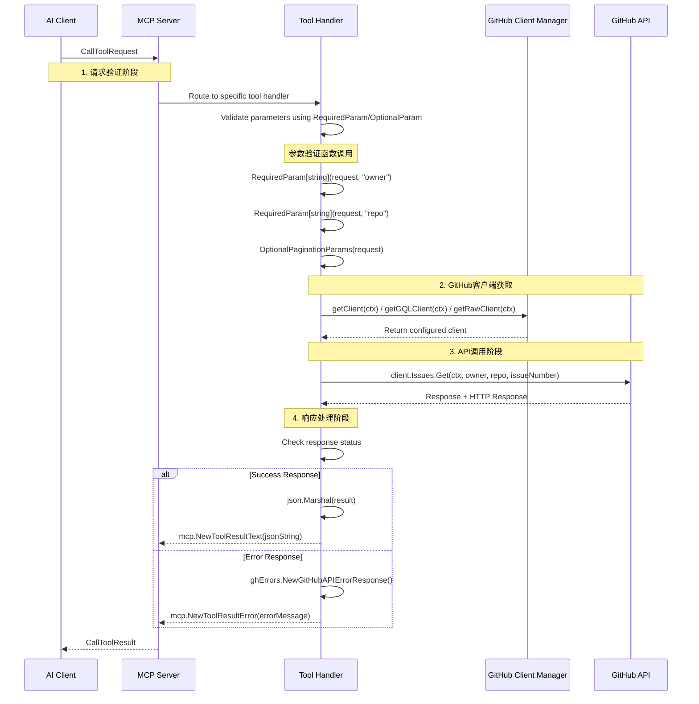
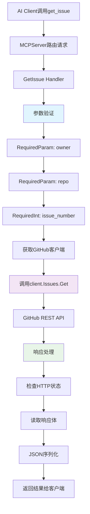

# GitHub MCP Server - API详细说明与调用链路分析

## 1. API 总览

GitHub MCP Server 提供了100+个工具，涵盖GitHub平台的主要功能。这些工具通过 Model Context Protocol (MCP) 暴露给AI客户端。

### 1.1 API 分类概览

| 类别 | 工具数量 | 主要功能 | API类型 |
|------|----------|----------|---------|
| **仓库管理 (repos)** | 18个 | 仓库操作、文件管理、分支管理 | REST + Raw |
| **Issues管理 (issues)** | 12个 | Issue创建、更新、评论、子问题 | REST + GraphQL |
| **Pull Requests (pull_requests)** | 15个 | PR管理、审查、合并 | REST + GraphQL |
| **GitHub Actions (actions)** | 14个 | 工作流管理、日志查看 | REST |
| **代码安全 (code_security)** | 2个 | 代码扫描警报 | REST |
| **密钥保护 (secret_protection)** | 2个 | 密钥扫描警报 | REST |
| **依赖管理 (dependabot)** | 2个 | 依赖警报管理 | REST |
| **通知管理 (notifications)** | 6个 | 通知查看和管理 | REST |
| **讨论管理 (discussions)** | 4个 | 讨论和评论 | GraphQL |
| **Gist管理 (gists)** | 3个 | Gist创建和管理 | REST |

## 2. 核心API调用链路分析

### 2.1 API调用的完整流程



### 2.2 关键函数调用链路详解

#### 参数验证关键函数

```go
// RequiredParam - 必需参数验证
// 位置: pkg/github/server.go:68-87
func RequiredParam[T comparable](r mcp.CallToolRequest, p string) (T, error) {
    var zero T
    
    // 检查参数是否存在
    if _, ok := r.GetArguments()[p]; !ok {
        return zero, fmt.Errorf("missing required parameter: %s", p)
    }
    
    // 检查参数类型是否正确  
    val, ok := r.GetArguments()[p].(T)
    if !ok {
        return zero, fmt.Errorf("parameter %s is not of type %T", p, zero)
    }
    
    // 检查参数是否为空值
    if val == zero {
        return zero, fmt.Errorf("missing required parameter: %s", p)
    }
    
    return val, nil
}

// OptionalParam - 可选参数获取
// 位置: pkg/github/server.go:106-120  
func OptionalParam[T any](r mcp.CallToolRequest, p string) (T, error) {
    var zero T
    
    // 如果参数不存在，返回零值
    if _, ok := r.GetArguments()[p]; !ok {
        return zero, nil
    }
    
    // 检查参数类型
    if _, ok := r.GetArguments()[p].(T); !ok {
        return zero, fmt.Errorf("parameter %s is not of type %T, is %T", p, zero, r.GetArguments()[p])
    }
    
    return r.GetArguments()[p].(T), nil
}

// OptionalPaginationParams - 分页参数处理
// 位置: pkg/github/server.go:256-274
func OptionalPaginationParams(r mcp.CallToolRequest) (PaginationParams, error) {
    // 获取页码，默认为1
    page, err := OptionalIntParamWithDefault(r, "page", 1)
    if err != nil {
        return PaginationParams{}, err
    }
    
    // 获取每页数量，默认为30
    perPage, err := OptionalIntParamWithDefault(r, "perPage", 30)  
    if err != nil {
        return PaginationParams{}, err
    }
    
    // 获取游标（GraphQL分页）
    after, err := OptionalParam[string](r, "after")
    if err != nil {
        return PaginationParams{}, err
    }
    
    return PaginationParams{
        Page:    page,
        PerPage: perPage, 
        After:   after,
    }, nil
}
```

## 3. 重点API深度分析

### 3.1 Issues管理 API

#### GetIssue - 获取Issue详情

**入口函数**：`pkg/github/issues.go:229-288`

```go
// GetIssue 创建获取特定issue详情的工具
func GetIssue(getClient GetClientFn, t translations.TranslationHelperFunc) (tool mcp.Tool, handler server.ToolHandlerFunc) {
    return mcp.NewTool("get_issue",
        // 工具定义
        mcp.WithDescription(t("TOOL_GET_ISSUE_DESCRIPTION", "Get details of a specific issue in a GitHub repository.")),
        mcp.WithToolAnnotation(mcp.ToolAnnotation{
            Title:        t("TOOL_GET_ISSUE_USER_TITLE", "Get issue details"),
            ReadOnlyHint: ToBoolPtr(true), // 标记为只读操作
        }),
        // 参数定义
        mcp.WithString("owner", mcp.Required(), mcp.Description("The owner of the repository")),
        mcp.WithString("repo", mcp.Required(), mcp.Description("The name of the repository")),  
        mcp.WithNumber("issue_number", mcp.Required(), mcp.Description("The number of the issue")),
    ),
    // 处理函数 - 核心业务逻辑
    func(ctx context.Context, request mcp.CallToolRequest) (*mcp.CallToolResult, error) {
        // 1. 参数验证阶段
        owner, err := RequiredParam[string](request, "owner")
        if err != nil {
            return mcp.NewToolResultError(err.Error()), nil
        }
        
        repo, err := RequiredParam[string](request, "repo") 
        if err != nil {
            return mcp.NewToolResultError(err.Error()), nil
        }
        
        issueNumber, err := RequiredInt(request, "issue_number")
        if err != nil {
            return mcp.NewToolResultError(err.Error()), nil  
        }
        
        // 2. 获取GitHub客户端
        client, err := getClient(ctx)
        if err != nil {
            return nil, fmt.Errorf("failed to get GitHub client: %w", err)
        }
        
        // 3. 调用GitHub REST API
        issue, resp, err := client.Issues.Get(ctx, owner, repo, issueNumber)
        if err != nil {
            return nil, fmt.Errorf("failed to get issue: %w", err)
        }
        defer func() { _ = resp.Body.Close() }()
        
        // 4. 响应状态检查
        if resp.StatusCode != http.StatusOK {
            body, err := io.ReadAll(resp.Body)
            if err != nil {
                return nil, fmt.Errorf("failed to read response body: %w", err)
            }
            return mcp.NewToolResultError(fmt.Sprintf("failed to get issue: %s", string(body))), nil
        }
        
        // 5. 结果序列化和返回
        r, err := json.Marshal(issue)
        if err != nil {
            return nil, fmt.Errorf("failed to marshal issue: %w", err)
        }
        
        return mcp.NewToolResultText(string(r)), nil
    }
}
```

**调用链路图**：



#### ListIssues - 列出Issues（GraphQL实现）

**入口函数**：`pkg/github/issues.go:972-1181`

```go  
// ListIssues 使用GraphQL查询创建列出仓库issues的工具
func ListIssues(getGQLClient GetGQLClientFn, t translations.TranslationHelperFunc) (tool mcp.Tool, handler server.ToolHandlerFunc) {
    return mcp.NewTool("list_issues",
        mcp.WithDescription(t("TOOL_LIST_ISSUES_DESCRIPTION", "List issues in a GitHub repository. For pagination, use the 'endCursor' from the previous response's 'pageInfo' in the 'after' parameter.")),
        // 支持游标分页
        WithCursorPagination(),
    ),
    func(ctx context.Context, request mcp.CallToolRequest) (*mcp.CallToolResult, error) {
        // 参数获取和验证
        owner, _ := RequiredParam[string](request, "owner")
        repo, _ := RequiredParam[string](request, "repo")
        state, _ := OptionalParam[string](request, "state")
        labels, _ := OptionalStringArrayParam(request, "labels")
        
        // 状态转换为GraphQL枚举
        var states []githubv4.IssueState
        if state != "" {
            states = append(states, githubv4.IssueState(state))
        } else {
            states = []githubv4.IssueState{githubv4.IssueStateOpen, githubv4.IssueStateClosed}
        }
        
        // 分页参数处理
        pagination, _ := OptionalCursorPaginationParams(request)
        paginationParams, _ := pagination.ToGraphQLParams()
        
        // 获取GraphQL客户端
        client, err := getGQLClient(ctx)
        if err != nil {
            return mcp.NewToolResultError(fmt.Sprintf("failed to get GitHub GQL client: %v", err)), nil
        }
        
        // 构建GraphQL查询变量
        vars := map[string]interface{}{
            "owner":     githubv4.String(owner),
            "repo":      githubv4.String(repo), 
            "states":    states,
            "orderBy":   githubv4.IssueOrderField("CREATED_AT"),
            "direction": githubv4.OrderDirection("DESC"),
            "first":     githubv4.Int(*paginationParams.First),
        }
        
        // 条件添加labels过滤
        if len(labels) > 0 {
            labelStrings := make([]githubv4.String, len(labels))
            for i, label := range labels {
                labelStrings[i] = githubv4.String(label)
            }
            vars["labels"] = labelStrings
        }
        
        // 根据是否有labels选择不同的查询结构
        issueQuery := getIssueQueryType(len(labels) > 0, false)
        
        // 执行GraphQL查询
        if err := client.Query(ctx, issueQuery, vars); err != nil {
            return mcp.NewToolResultError(err.Error()), nil
        }
        
        // 转换GraphQL结果为REST API格式
        var issues []*github.Issue
        if queryResult, ok := issueQuery.(IssueQueryResult); ok {
            fragment := queryResult.GetIssueFragment()
            for _, issue := range fragment.Nodes {
                issues = append(issues, fragmentToIssue(issue))
            }
        }
        
        // 构造响应
        response := map[string]interface{}{
            "issues":     issues,
            "pageInfo":   fragment.PageInfo,
            "totalCount": fragment.TotalCount,
        }
        
        return MarshalledTextResult(response), nil
    }
}
```

**关键辅助函数**：

```go
// fragmentToIssue - GraphQL片段转换为REST API格式
// 位置: pkg/github/issues.go:201-226
func fragmentToIssue(fragment IssueFragment) *github.Issue {
    // 转换GraphQL标签为REST API格式
    var foundLabels []*github.Label
    for _, labelNode := range fragment.Labels.Nodes {
        foundLabels = append(foundLabels, &github.Label{
            Name:        github.Ptr(string(labelNode.Name)),
            NodeID:      github.Ptr(string(labelNode.ID)),
            Description: github.Ptr(string(labelNode.Description)),
        })
    }
    
    // 构建REST API兼容的Issue结构
    return &github.Issue{
        Number:    github.Ptr(int(fragment.Number)),
        Title:     github.Ptr(string(fragment.Title)),
        CreatedAt: &github.Timestamp{Time: fragment.CreatedAt.Time},
        UpdatedAt: &github.Timestamp{Time: fragment.UpdatedAt.Time},
        User: &github.User{
            Login: github.Ptr(string(fragment.Author.Login)),
        },
        State:    github.Ptr(string(fragment.State)),
        ID:       github.Ptr(fragment.DatabaseID),
        Body:     github.Ptr(string(fragment.Body)),
        Labels:   foundLabels,
        Comments: github.Ptr(int(fragment.Comments.TotalCount)),
    }
}

// getIssueQueryType - 根据过滤条件选择查询类型
// 位置: pkg/github/issues.go:188-199
func getIssueQueryType(hasLabels bool, hasSince bool) any {
    switch {
    case hasLabels && hasSince:
        return &ListIssuesQueryTypeWithLabelsWithSince{}
    case hasLabels:
        return &ListIssuesQueryTypeWithLabels{}
    case hasSince:
        return &ListIssuesQueryWithSince{}
    default:
        return &ListIssuesQuery{}
    }
}
```

### 3.2 仓库管理 API

#### GetFileContents - 获取文件内容

**入口函数**：`pkg/github/repositories.go:485-678`

```go
// GetFileContents 创建获取文件或目录内容的工具
func GetFileContents(getClient GetClientFn, getRawClient raw.GetRawClientFn, t translations.TranslationHelperFunc) (tool mcp.Tool, handler server.ToolHandlerFunc) {
    return mcp.NewTool("get_file_contents",
        mcp.WithDescription(t("TOOL_GET_FILE_CONTENTS_DESCRIPTION", "Get the contents of a file or directory from a GitHub repository")),
        // 参数定义
        mcp.WithString("owner", mcp.Required(), mcp.Description("Repository owner (username or organization)")),
        mcp.WithString("repo", mcp.Required(), mcp.Description("Repository name")),
        mcp.WithString("path", mcp.Description("Path to file/directory (directories must end with a slash '/')"), mcp.DefaultString("/")),
        mcp.WithString("ref", mcp.Description("Accepts optional git refs such as `refs/tags/{tag}`, `refs/heads/{branch}` or `refs/pull/{pr_number}/head`")),
        mcp.WithString("sha", mcp.Description("Accepts optional commit SHA. If specified, it will be used instead of ref")),
    ),
    func(ctx context.Context, request mcp.CallToolRequest) (*mcp.CallToolResult, error) {
        // 1. 参数提取和验证
        owner, _ := RequiredParam[string](request, "owner")
        repo, _ := RequiredParam[string](request, "repo")
        path, _ := RequiredParam[string](request, "path")  
        ref, _ := OptionalParam[string](request, "ref")
        sha, _ := OptionalParam[string](request, "sha")
        
        // 2. 获取GitHub客户端
        client, err := getClient(ctx)
        if err != nil {
            return mcp.NewToolResultError("failed to get GitHub client"), nil
        }
        
        // 3. 解析Git引用（关键函数调用）
        rawOpts, err := resolveGitReference(ctx, client, owner, repo, ref, sha)
        if err != nil {
            return mcp.NewToolResultError(fmt.Sprintf("failed to resolve git reference: %s", err)), nil
        }
        
        // 4. 优化策略：对于文件，优先使用Raw API
        if path != "" && !strings.HasSuffix(path, "/") {
            // 4.1 获取文件SHA  
            opts := &github.RepositoryContentGetOptions{Ref: ref}
            fileContent, _, respContents, err := client.Repositories.GetContents(ctx, owner, repo, path, opts)
            if err != nil {
                return ghErrors.NewGitHubAPIErrorResponse(ctx, "failed to get file SHA", respContents, err), nil
            }
            
            fileSHA := *fileContent.SHA
            
            // 4.2 使用Raw Client下载内容
            rawClient, err := getRawClient(ctx)
            if err != nil {
                return mcp.NewToolResultError("failed to get GitHub raw content client"), nil
            }
            
            resp, err := rawClient.GetRawContent(ctx, owner, repo, path, rawOpts)
            if err != nil {
                return mcp.NewToolResultError("failed to get raw repository content"), nil
            }
            defer resp.Body.Close()
            
            // 4.3 处理成功响应
            if resp.StatusCode == http.StatusOK {
                body, err := io.ReadAll(resp.Body)
                if err != nil {
                    return mcp.NewToolResultError("failed to read response body"), nil
                }
                
                contentType := resp.Header.Get("Content-Type")
                
                // 构建资源URI
                var resourceURI string
                switch {
                case sha != "":
                    resourceURI, _ = url.JoinPath("repo://", owner, repo, "sha", sha, "contents", path)
                case ref != "":
                    resourceURI, _ = url.JoinPath("repo://", owner, repo, ref, "contents", path)
                default:
                    resourceURI, _ = url.JoinPath("repo://", owner, repo, "contents", path)
                }
                
                // 根据内容类型返回不同格式
                if strings.HasPrefix(contentType, "application") || strings.HasPrefix(contentType, "text") {
                    result := mcp.TextResourceContents{
                        URI:      resourceURI,
                        Text:     string(body),
                        MIMEType: contentType,
                    }
                    return mcp.NewToolResultResource(fmt.Sprintf("successfully downloaded text file (SHA: %s)", fileSHA), result), nil
                }
                
                result := mcp.BlobResourceContents{
                    URI:      resourceURI, 
                    Blob:     base64.StdEncoding.EncodeToString(body),
                    MIMEType: contentType,
                }
                return mcp.NewToolResultResource(fmt.Sprintf("successfully downloaded binary file (SHA: %s)", fileSHA), result), nil
            }
        }
        
        // 5. 目录内容处理
        if strings.HasSuffix(path, "/") {
            opts := &github.RepositoryContentGetOptions{Ref: ref}
            _, dirContent, resp, err := client.Repositories.GetContents(ctx, owner, repo, path, opts)
            if err == nil && resp.StatusCode == http.StatusOK {
                defer resp.Body.Close()
                return MarshalledTextResult(dirContent), nil
            }
        }
        
        // 6. 路径模糊匹配（通过Git Tree API）
        tree, resp, err := client.Git.GetTree(ctx, owner, repo, ref, true)
        if err != nil {
            return ghErrors.NewGitHubAPIErrorResponse(ctx, "failed to get git tree", resp, err), nil
        }
        defer resp.Body.Close()
        
        // 查找匹配的路径
        const maxMatchingFiles = 3
        matchingFiles := filterPaths(tree.Entries, path, maxMatchingFiles)
        if len(matchingFiles) > 0 {
            return MarshalledTextResult(map[string]interface{}{
                "resolved_refs": rawOpts,
                "matching_files": matchingFiles,
                "message": "Path did not point to a file or directory, but found possible matches",
            }), nil
        }
        
        return mcp.NewToolResultError("Failed to get file contents. The path does not point to a file or directory, or the file does not exist in the repository."), nil
    }
}
```

**关键辅助函数 - Git引用解析**：

```go
// resolveGitReference - 解析Git引用为确定的SHA
// 位置: pkg/github/repositories.go:1615-1685
func resolveGitReference(ctx context.Context, githubClient *github.Client, owner, repo, ref, sha string) (*raw.ContentOpts, error) {
    // 1. SHA优先级最高
    if sha != "" {
        return &raw.ContentOpts{Ref: "", SHA: sha}, nil
    }
    
    originalRef := ref
    var reference *github.Reference
    var resp *github.Response
    var err error
    
    switch {
    case originalRef == "":
        // 2a. 空引用 - 使用默认分支
        repoInfo, resp, err := githubClient.Repositories.Get(ctx, owner, repo)
        if err != nil {
            return nil, fmt.Errorf("failed to get repository info: %w", err)
        }
        ref = fmt.Sprintf("refs/heads/%s", repoInfo.GetDefaultBranch())
        
    case strings.HasPrefix(originalRef, "refs/"):
        // 2b. 完全限定引用
        // 将在最后统一获取
        
    case strings.HasPrefix(originalRef, "heads/") || strings.HasPrefix(originalRef, "tags/"):
        // 2c. 部分限定引用
        ref = "refs/" + originalRef
        
    default:
        // 2d. 短名称 - 尝试分支，再尝试标签
        branchRef := "refs/heads/" + originalRef
        reference, resp, err = githubClient.Git.GetRef(ctx, owner, repo, branchRef)
        
        if err == nil {
            ref = branchRef // 找到分支
        } else {
            // 检查是否为404错误
            if ghErr, isGhErr := err.(*github.ErrorResponse); isGhErr && ghErr.Response.StatusCode == http.StatusNotFound {
                // 尝试标签
                tagRef := "refs/tags/" + originalRef
                reference, resp, err = githubClient.Git.GetRef(ctx, owner, repo, tagRef)
                if err == nil {
                    ref = tagRef // 找到标签
                } else if ghErr2, isGhErr2 := err.(*github.ErrorResponse); isGhErr2 && ghErr2.Response.StatusCode == http.StatusNotFound {
                    return nil, fmt.Errorf("could not resolve ref %q as a branch or a tag", originalRef)
                }
            }
            if err != nil {
                return nil, fmt.Errorf("failed to get reference: %w", err)
            }
        }
    }
    
    // 3. 最终引用获取
    if reference == nil {
        reference, resp, err = githubClient.Git.GetRef(ctx, owner, repo, ref)
        if err != nil {
            return nil, fmt.Errorf("failed to get final reference for %q: %w", ref, err)
        }
    }
    
    sha = reference.GetObject().GetSHA()
    return &raw.ContentOpts{Ref: ref, SHA: sha}, nil
}

// filterPaths - 路径过滤匹配
// 位置: pkg/github/repositories.go:1558-1587  
func filterPaths(entries []*github.TreeEntry, path string, maxResults int) []string {
    dirOnly := false
    if strings.HasSuffix(path, "/") {
        dirOnly = true
        path = strings.TrimSuffix(path, "/")
    }
    
    matchedPaths := []string{}
    for _, entry := range entries {
        if len(matchedPaths) == maxResults {
            break
        }
        
        if dirOnly && entry.GetType() != "tree" {
            continue // 只要目录
        }
        
        entryPath := entry.GetPath()
        if entryPath == "" {
            continue
        }
        
        if strings.HasSuffix(entryPath, path) {
            if entry.GetType() == "tree" {
                entryPath += "/" // 目录添加斜杠
            }
            matchedPaths = append(matchedPaths, entryPath)
        }
    }
    return matchedPaths
}
```

### 3.3 GitHub Actions API

#### GetJobLogs - 获取作业日志

**入口函数**：`pkg/github/actions.go:534-625`

```go
// GetJobLogs 创建下载特定作业日志或高效获取工作流运行中所有失败作业日志的工具
func GetJobLogs(getClient GetClientFn, t translations.TranslationHelperFunc, contentWindowSize int) (tool mcp.Tool, handler server.ToolHandlerFunc) {
    return mcp.NewTool("get_job_logs",
        mcp.WithDescription(t("TOOL_GET_JOB_LOGS_DESCRIPTION", "Download logs for a specific workflow job or efficiently get all failed job logs for a workflow run")),
        // 灵活的参数设计 - 支持单个作业或失败作业批量获取
        mcp.WithNumber("job_id", mcp.Description("The unique identifier of the workflow job (required for single job logs)")),
        mcp.WithNumber("run_id", mcp.Description("Workflow run ID (required when using failed_only)")),
        mcp.WithBoolean("failed_only", mcp.Description("When true, gets logs for all failed jobs in run_id")),
        mcp.WithBoolean("return_content", mcp.Description("Returns actual log content instead of URLs")),
        mcp.WithNumber("tail_lines", mcp.Description("Number of lines to return from the end of the log"), mcp.DefaultNumber(500)),
    ),
    func(ctx context.Context, request mcp.CallToolRequest) (*mcp.CallToolResult, error) {
        // 参数提取
        owner, _ := RequiredParam[string](request, "owner")
        repo, _ := RequiredParam[string](request, "repo")
        jobID, _ := OptionalIntParam(request, "job_id")
        runID, _ := OptionalIntParam(request, "run_id")
        failedOnly, _ := OptionalParam[bool](request, "failed_only")
        returnContent, _ := OptionalParam[bool](request, "return_content")
        tailLines, _ := OptionalIntParam(request, "tail_lines")
        
        if tailLines == 0 {
            tailLines = 500 // 默认值
        }
        
        client, err := getClient(ctx)
        if err != nil {
            return nil, fmt.Errorf("failed to get GitHub client: %w", err)
        }
        
        // 参数验证逻辑
        if failedOnly && runID == 0 {
            return mcp.NewToolResultError("run_id is required when failed_only is true"), nil
        }
        if !failedOnly && jobID == 0 {
            return mcp.NewToolResultError("job_id is required when failed_only is false"), nil
        }
        
        // 分发到具体处理函数
        if failedOnly && runID > 0 {
            return handleFailedJobLogs(ctx, client, owner, repo, int64(runID), returnContent, tailLines, contentWindowSize)
        } else if jobID > 0 {
            return handleSingleJobLogs(ctx, client, owner, repo, int64(jobID), returnContent, tailLines, contentWindowSize)
        }
        
        return mcp.NewToolResultError("Either job_id must be provided for single job logs, or run_id with failed_only=true for failed job logs"), nil
    }
}
```

**关键处理函数**：

```go
// handleFailedJobLogs - 处理失败作业日志批量获取
// 位置: pkg/github/actions.go:628-690
func handleFailedJobLogs(ctx context.Context, client *github.Client, owner, repo string, runID int64, returnContent bool, tailLines int, contentWindowSize int) (*mcp.CallToolResult, error) {
    // 1. 获取工作流运行的所有作业
    jobs, resp, err := client.Actions.ListWorkflowJobs(ctx, owner, repo, runID, &github.ListWorkflowJobsOptions{
        Filter: "latest",
    })
    if err != nil {
        return ghErrors.NewGitHubAPIErrorResponse(ctx, "failed to list workflow jobs", resp, err), nil
    }
    defer resp.Body.Close()
    
    // 2. 过滤失败的作业
    var failedJobs []*github.WorkflowJob
    for _, job := range jobs.Jobs {
        if job.GetConclusion() == "failure" {
            failedJobs = append(failedJobs, job)
        }
    }
    
    if len(failedJobs) == 0 {
        result := map[string]any{
            "message":     "No failed jobs found in this workflow run",
            "run_id":      runID,
            "total_jobs":  len(jobs.Jobs),
            "failed_jobs": 0,
        }
        return MarshalledTextResult(result), nil
    }
    
    // 3. 并发获取所有失败作业的日志
    var logResults []map[string]any
    for _, job := range failedJobs {
        jobResult, resp, err := getJobLogData(ctx, client, owner, repo, job.GetID(), job.GetName(), returnContent, tailLines, contentWindowSize)
        if err != nil {
            // 容错处理 - 即使某个作业日志获取失败，也继续处理其他作业
            jobResult = map[string]any{
                "job_id":   job.GetID(),
                "job_name": job.GetName(),
                "error":    err.Error(),
            }
            // 记录错误但不中断流程
            ghErrors.NewGitHubAPIErrorToCtx(ctx, "failed to get job logs", resp, err)
        }
        logResults = append(logResults, jobResult)
    }
    
    // 4. 构建批量响应
    result := map[string]any{
        "message":       fmt.Sprintf("Retrieved logs for %d failed jobs", len(failedJobs)),
        "run_id":        runID,
        "total_jobs":    len(jobs.Jobs),
        "failed_jobs":   len(failedJobs),
        "logs":          logResults,
        "return_format": map[string]bool{"content": returnContent, "urls": !returnContent},
    }
    
    return MarshalledTextResult(result), nil
}

// getJobLogData - 获取单个作业的日志数据
// 位置: pkg/github/actions.go:708-744
func getJobLogData(ctx context.Context, client *github.Client, owner, repo string, jobID int64, jobName string, returnContent bool, tailLines int, contentWindowSize int) (map[string]any, *github.Response, error) {
    // 1. 获取日志下载URL
    url, resp, err := client.Actions.GetWorkflowJobLogs(ctx, owner, repo, jobID, 1)
    if err != nil {
        return nil, resp, fmt.Errorf("failed to get job logs for job %d: %w", jobID, err)
    }
    defer resp.Body.Close()
    
    result := map[string]any{
        "job_id": jobID,
    }
    if jobName != "" {
        result["job_name"] = jobName
    }
    
    if returnContent {
        // 2. 下载并处理日志内容
        content, originalLength, httpResp, err := downloadLogContent(ctx, url.String(), tailLines, contentWindowSize)
        if err != nil {
            ghRes := &github.Response{Response: httpResp}
            return nil, ghRes, fmt.Errorf("failed to download log content for job %d: %w", jobID, err)
        }
        
        result["logs_content"] = content
        result["message"] = "Job logs content retrieved successfully"
        result["original_length"] = originalLength
    } else {
        // 3. 只返回下载URL
        result["logs_url"] = url.String()
        result["message"] = "Job logs are available for download"
        result["note"] = "The logs_url provides a download link for the individual job logs in plain text format. Use return_content=true to get the actual log content."
    }
    
    return result, resp, nil
}

// downloadLogContent - 下载和处理日志内容（性能优化关键函数）
// 位置: pkg/github/actions.go:746-779
func downloadLogContent(ctx context.Context, logURL string, tailLines int, maxLines int) (string, int, *http.Response, error) {
    // 启用性能分析
    prof := profiler.New(nil, profiler.IsProfilingEnabled())
    finish := prof.Start(ctx, "log_buffer_processing")
    
    // 1. HTTP下载
    httpResp, err := http.Get(logURL)
    if err != nil {
        return "", 0, httpResp, fmt.Errorf("failed to download logs: %w", err)
    }
    defer httpResp.Body.Close()
    
    if httpResp.StatusCode != http.StatusOK {
        return "", 0, httpResp, fmt.Errorf("failed to download logs: HTTP %d", httpResp.StatusCode)
    }
    
    // 2. 缓冲区大小优化
    bufferSize := tailLines
    if bufferSize > maxLines {
        bufferSize = maxLines
    }
    
    // 3. 使用环形缓冲区处理大文件（关键性能优化）
    processedInput, totalLines, httpResp, err := buffer.ProcessResponseAsRingBufferToEnd(httpResp, bufferSize)
    if err != nil {
        return "", 0, httpResp, fmt.Errorf("failed to process log content: %w", err)
    }
    
    // 4. 尾部行数截取
    lines := strings.Split(processedInput, "\n")
    if len(lines) > tailLines {
        lines = lines[len(lines)-tailLines:]
    }
    finalResult := strings.Join(lines, "\n")
    
    // 5. 性能分析结束
    finish(len(lines), int64(len(finalResult)))
    
    return finalResult, totalLines, httpResp, nil
}
```

## 4. 错误处理机制分析

### 4.1 GitHub API错误处理

**核心错误处理函数**：`pkg/errors/error.go`

```go
// NewGitHubAPIErrorResponse - 创建GitHub API错误响应
func NewGitHubAPIErrorResponse(ctx context.Context, message string, resp *github.Response, err error) *mcp.CallToolResult {
    // 1. 记录错误到上下文
    NewGitHubAPIErrorToCtx(ctx, message, resp, err)
    
    // 2. 构建用户友好的错误消息
    if resp != nil {
        switch resp.StatusCode {
        case 401:
            return mcp.NewToolResultError("Authentication failed. Please check your GitHub token.")
        case 403:
            if strings.Contains(resp.Status, "rate limit") {
                return mcp.NewToolResultError("Rate limit exceeded. Please wait before making more requests.")
            }
            return mcp.NewToolResultError("Access forbidden. Check repository permissions.")
        case 404:
            return mcp.NewToolResultError("Resource not found. Please verify the repository/resource exists.")
        case 422:
            return mcp.NewToolResultError("Invalid request. Please check your parameters.")
        default:
            return mcp.NewToolResultError(fmt.Sprintf("%s: HTTP %d", message, resp.StatusCode))
        }
    }
    
    return mcp.NewToolResultError(fmt.Sprintf("%s: %v", message, err))
}

// NewGitHubAPIErrorToCtx - 向上下文添加错误信息
func NewGitHubAPIErrorToCtx(ctx context.Context, message string, resp *github.Response, err error) {
    // 从上下文获取错误收集器
    collector := getGitHubErrorCollector(ctx)
    if collector == nil {
        return
    }
    
    // 构建详细错误信息
    errorInfo := GitHubError{
        Message:    message,
        StatusCode: 0,
        RateLimit:  GitHubRateLimit{},
        Timestamp:  time.Now(),
    }
    
    if resp != nil {
        errorInfo.StatusCode = resp.StatusCode
        errorInfo.RateLimit = GitHubRateLimit{
            Limit:     resp.Rate.Limit,
            Remaining: resp.Rate.Remaining,
            Reset:     resp.Rate.Reset.Time,
        }
    }
    
    if err != nil {
        errorInfo.Error = err.Error()
    }
    
    collector.AddError(errorInfo)
}
```

### 4.2 工具集错误处理

```go  
// ToolsetDoesNotExistError - 工具集不存在错误
// 位置: pkg/toolsets/toolsets.go:10-30
type ToolsetDoesNotExistError struct {
    Name string
}

func (e *ToolsetDoesNotExistError) Error() string {
    return fmt.Sprintf("toolset %s does not exist", e.Name)
}

func (e *ToolsetDoesNotExistError) Is(target error) bool {
    if target == nil {
        return false
    }
    if _, ok := target.(*ToolsetDoesNotExistError); ok {
        return true
    }
    return false
}

// 在工具集启用时的错误处理
func (tsg *ToolsetGroup) EnableToolset(name string) error {
    toolset, exists := tsg.Toolsets[name]
    if !exists {
        return NewToolsetDoesNotExistError(name)
    }
    toolset.Enabled = true
    tsg.Toolsets[name] = toolset
    return nil
}
```

## 5. 性能优化机制

### 5.1 缓冲区处理优化

**环形缓冲区实现**：`pkg/buffer/buffer.go`

```go
// ProcessResponseAsRingBufferToEnd - 环形缓冲区处理大响应
func ProcessResponseAsRingBufferToEnd(response *http.Response, bufferSize int) (string, int, *http.Response, error) {
    // 1. 创建环形缓冲区
    buffer := make([]string, bufferSize)
    scanner := bufio.NewScanner(response.Body)
    
    var totalLines int
    var bufferIndex int
    
    // 2. 逐行读取并使用环形缓冲区存储
    for scanner.Scan() {
        line := scanner.Text()
        buffer[bufferIndex] = line
        bufferIndex = (bufferIndex + 1) % bufferSize
        totalLines++
    }
    
    if err := scanner.Err(); err != nil {
        return "", totalLines, response, fmt.Errorf("error reading response: %w", err)
    }
    
    // 3. 重建最后N行（环形缓冲区的顺序）
    result := make([]string, 0, bufferSize)
    
    // 确定实际存储的行数
    actualLines := totalLines
    if actualLines > bufferSize {
        actualLines = bufferSize
    }
    
    // 从正确的起始位置开始读取
    startIndex := bufferIndex
    if totalLines > bufferSize {
        // 缓冲区已满，从当前写入位置开始
        startIndex = bufferIndex
    } else {
        // 缓冲区未满，从头开始
        startIndex = 0
    }
    
    for i := 0; i < actualLines; i++ {
        index := (startIndex + i) % bufferSize
        if buffer[index] != "" {
            result = append(result, buffer[index])
        }
    }
    
    return strings.Join(result, "\n"), totalLines, response, nil
}
```

### 5.2 客户端管理优化

**多种GitHub API客户端管理**：

```go
// 客户端工厂函数 - internal/ghmcp/server.go:127-143
func createGitHubClients(cfg MCPServerConfig) (GetClientFn, GetGQLClientFn, raw.GetRawClientFn, error) {
    // 解析API主机
    apiHost, err := parseAPIHost(cfg.Host)
    if err != nil {
        return nil, nil, nil, fmt.Errorf("failed to parse API host: %w", err)
    }
    
    // 创建REST客户端
    restClient := gogithub.NewClient(nil).WithAuthToken(cfg.Token)
    restClient.UserAgent = fmt.Sprintf("github-mcp-server/%s", cfg.Version)
    restClient.BaseURL = apiHost.baseRESTURL
    restClient.UploadURL = apiHost.uploadURL
    
    // 创建GraphQL客户端
    gqlHTTPClient := &http.Client{
        Transport: &bearerAuthTransport{
            transport: http.DefaultTransport,
            token:     cfg.Token,
        },
    }
    gqlClient := githubv4.NewEnterpriseClient(apiHost.graphqlURL.String(), gqlHTTPClient)
    
    // 客户端工厂函数
    getClient := func(_ context.Context) (*gogithub.Client, error) {
        return restClient, nil
    }
    
    getGQLClient := func(_ context.Context) (*githubv4.Client, error) {
        return gqlClient, nil
    }
    
    getRawClient := func(ctx context.Context) (*raw.Client, error) {
        client, err := getClient(ctx)
        if err != nil {
            return nil, fmt.Errorf("failed to get GitHub client: %w", err)
        }
        return raw.NewClient(client, apiHost.rawURL), nil
    }
    
    return getClient, getGQLClient, getRawClient, nil
}
```

## 6. 总结

GitHub MCP Server 的API设计具有以下特点：

### 架构优势
1. **统一的参数处理**：所有工具使用相同的参数验证函数，确保一致性
2. **多种API支持**：智能选择REST、GraphQL和Raw API，优化性能
3. **完善的错误处理**：分层错误处理，提供用户友好的错误信息
4. **性能优化**：环形缓冲区、智能分页、内容窗口管理

### 扩展性设计
1. **模块化工具集**：每个工具集独立管理，便于扩展和维护
2. **动态工具发现**：支持运行时启用新工具集
3. **多环境支持**：统一的客户端管理支持各种GitHub部署

### 最佳实践
1. **参数验证**：严格的参数类型和存在性检查
2. **资源管理**：及时关闭HTTP响应，避免资源泄漏  
3. **错误上下文**：详细的错误信息帮助调试和监控
4. **性能监控**：内置性能分析支持

这种设计使得 GitHub MCP Server 不仅功能强大，而且具有良好的可维护性和扩展性。
