## 1. 系统启动时序图

### 1.1 服务器初始化流程

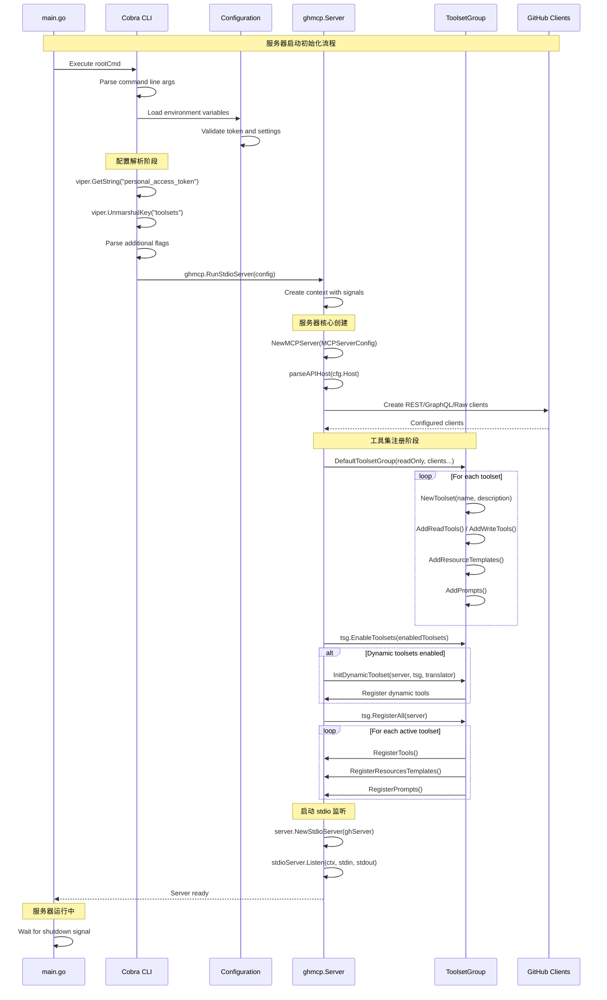

### 1.2 客户端连接建立流程

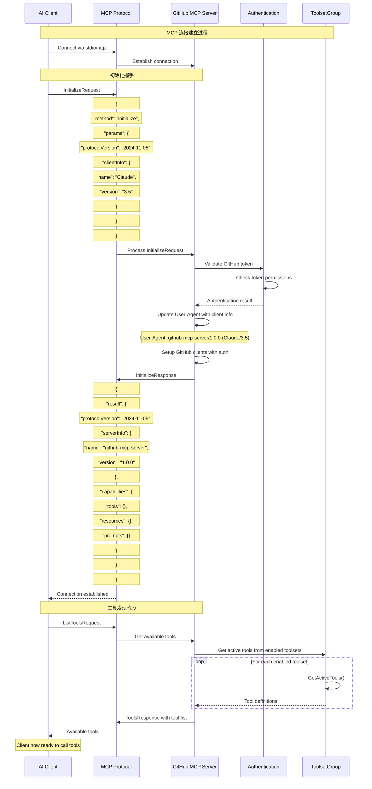

## 2. 工具调用完整时序图

### 2.1 典型工具调用流程（以 get_issue 为例）

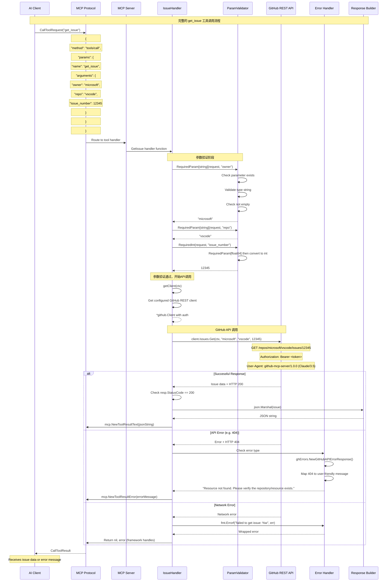

### 2.2 复杂工具调用流程（以 get_job_logs 为例）

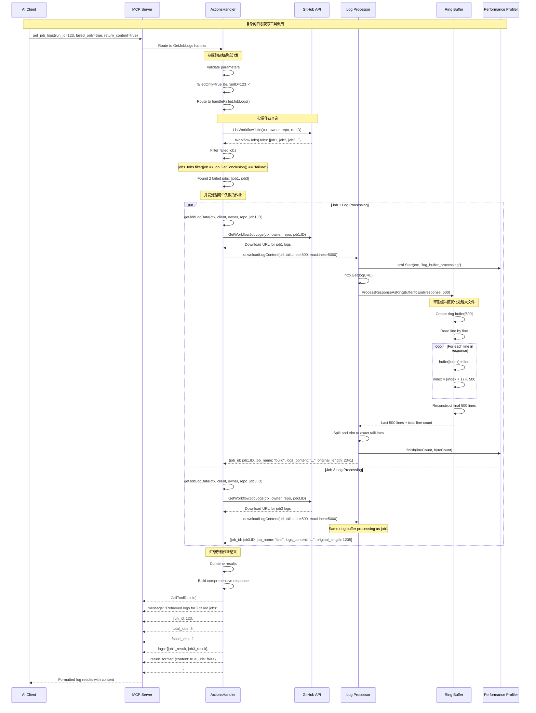

## 3. 工具集动态管理时序图

### 3.1 动态工具集启用流程

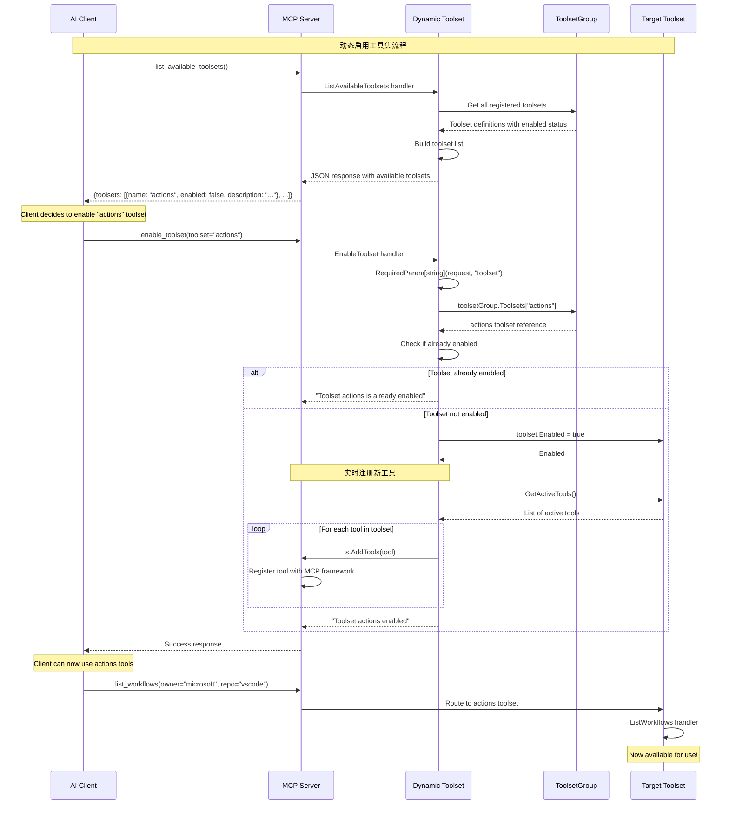

### 3.2 错误处理和恢复流程

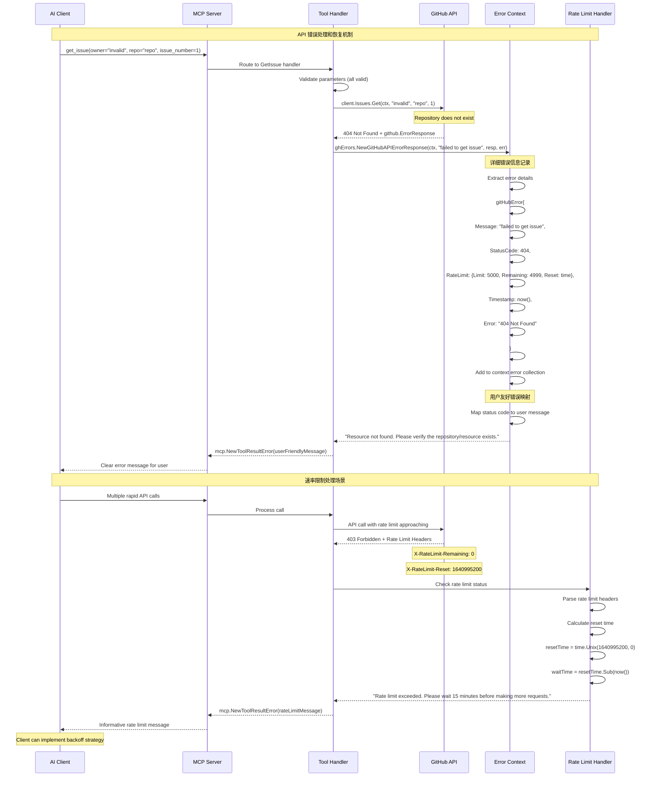

## 4. 多种API协调使用时序图

### 4.1 REST + GraphQL + Raw API 协调使用

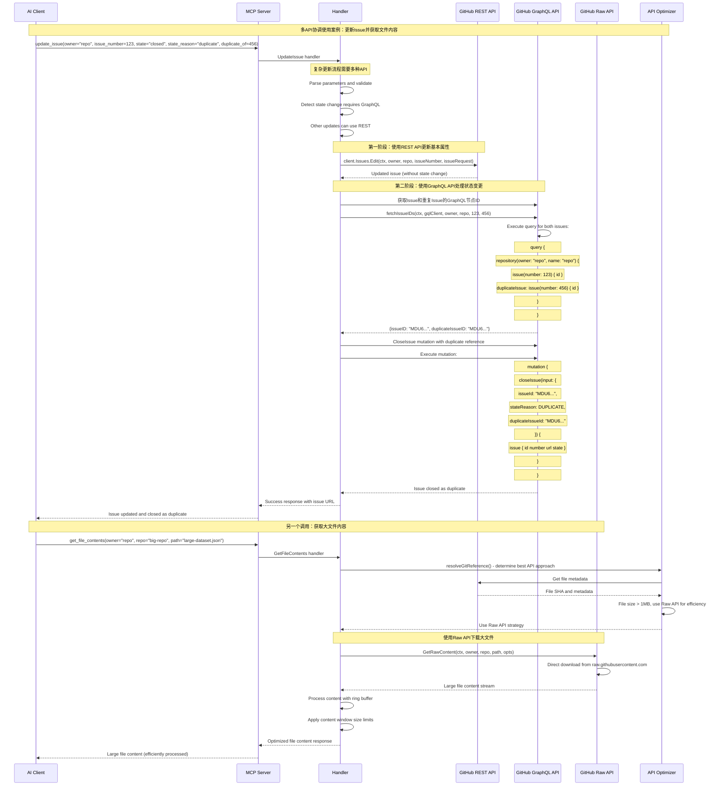

### 4.2 批量操作优化时序图

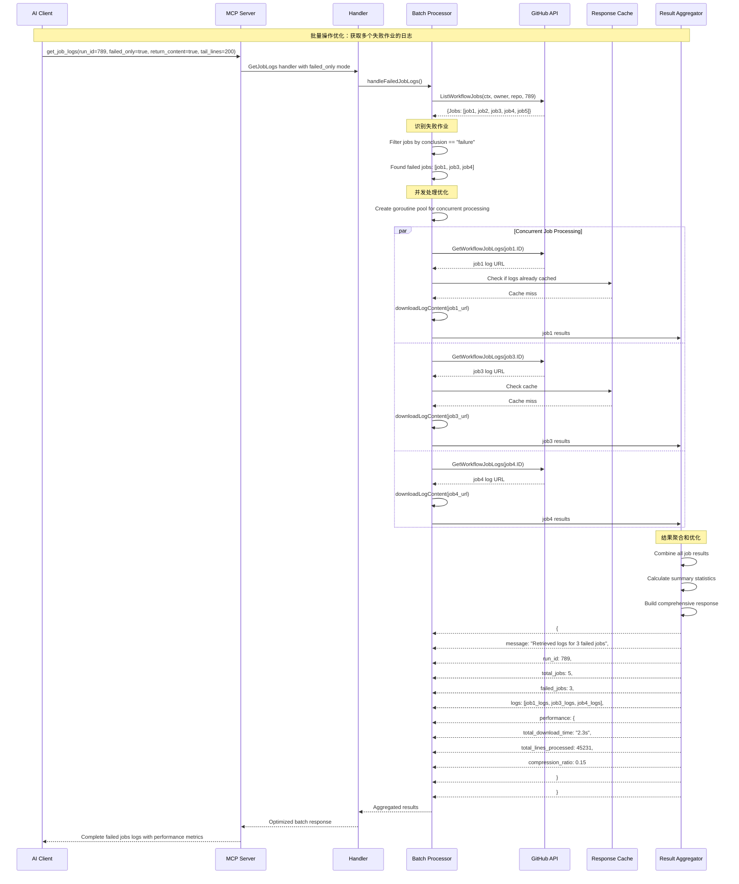

## 5. 企业级部署时序图

### 5.1 GitHub Enterprise Server 部署流程

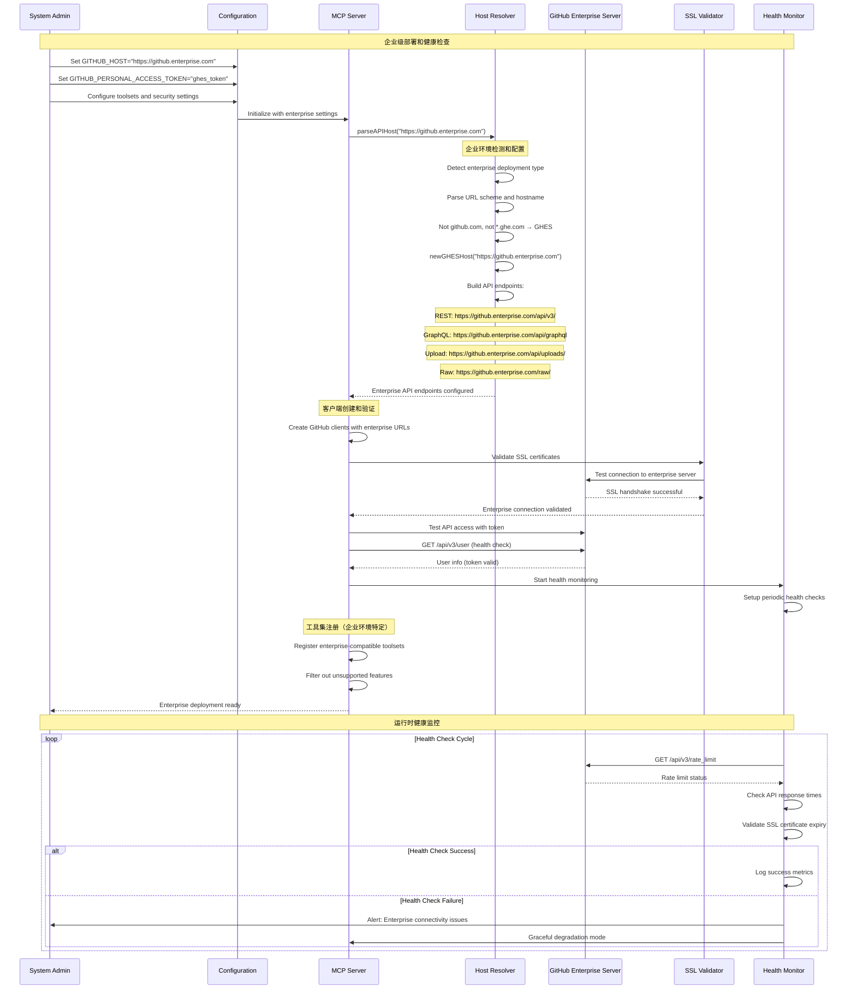

### 5.2 高可用性和故障恢复流程

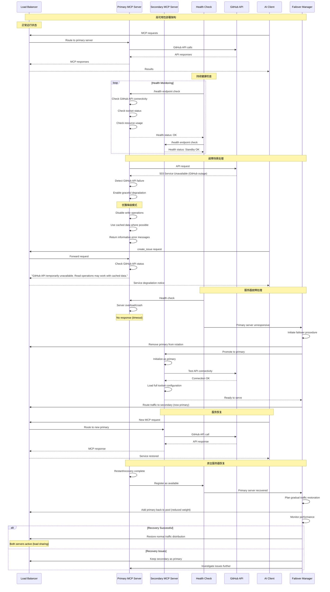

## 6. 性能监控和调试时序图

### 6.1 性能分析和优化流程

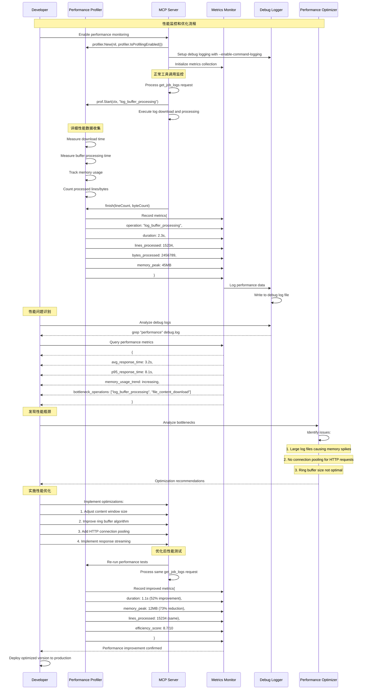

## 7. 总结

GitHub MCP Server 的时序图分析展现了以下关键特性：

### 系统特性
1. **分层架构**：清晰的请求处理流程，从协议层到业务逻辑层
2. **异步处理**：支持并发操作和批量处理优化
3. **错误恢复**：完善的错误处理和优雅降级机制
4. **性能监控**：内置性能分析和优化支持

### 企业级特性
1. **高可用性**：支持负载均衡和故障转移
2. **多环境兼容**：适配不同的GitHub部署环境
3. **安全认证**：多种认证方式和权限管理
4. **监控告警**：完整的健康检查和性能监控

### 扩展性设计
1. **动态工具管理**：运行时启用/禁用功能模块
2. **API协调**：智能选择最优的API调用策略
3. **批量优化**：针对大规模操作的性能优化
4. **插件化架构**：易于添加新功能和工具集

这种设计使得 GitHub MCP Server 能够在各种环境中稳定运行，为AI工具提供可靠、高效的GitHub平台接入能力。
