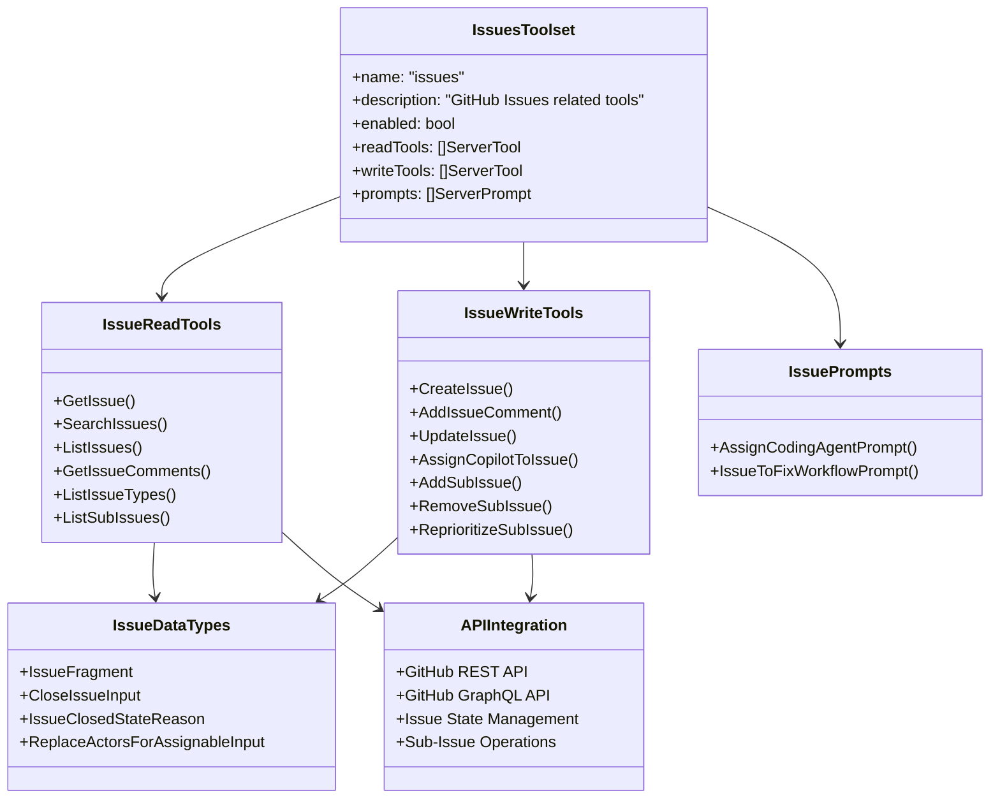
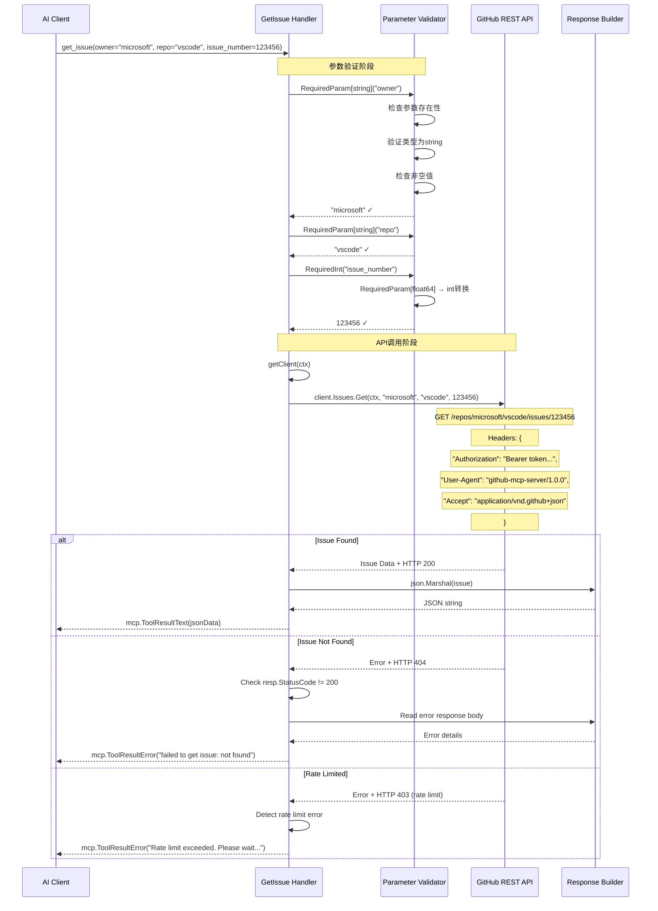
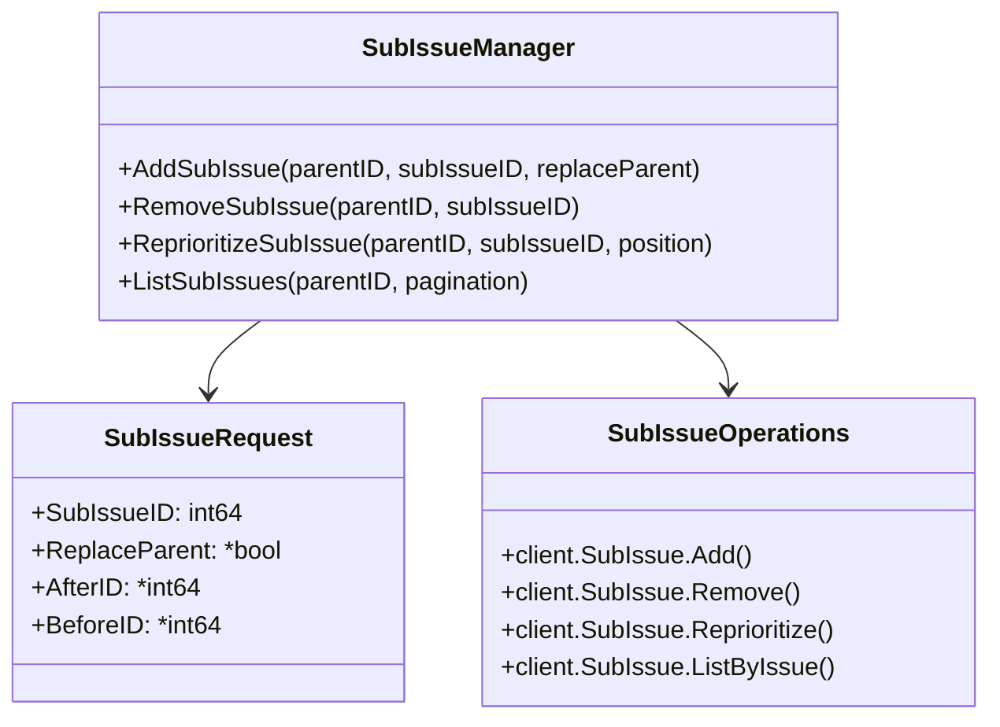
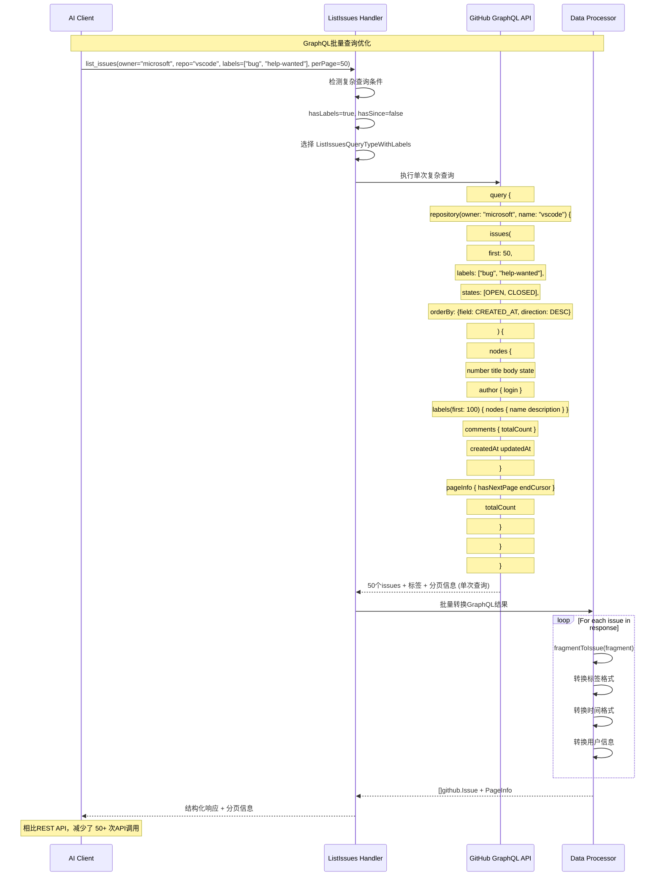
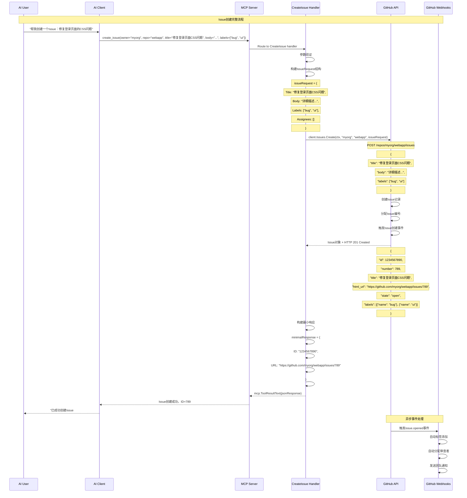
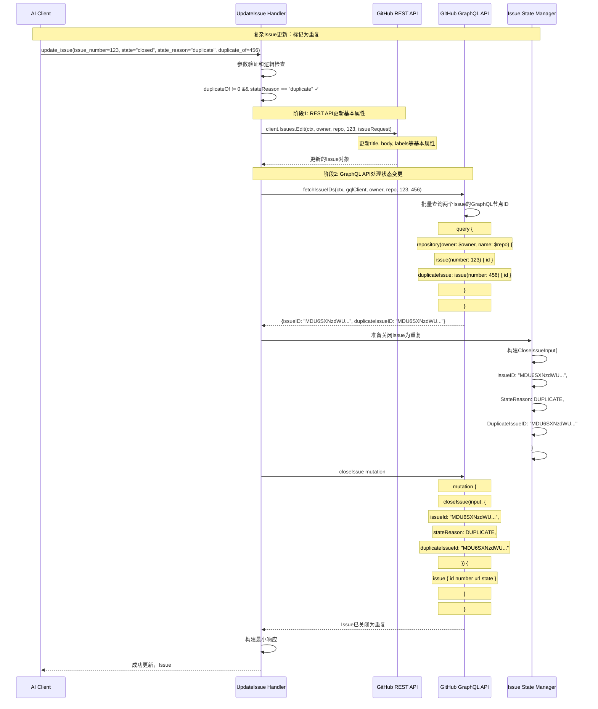

## 1. Issues模块架构概览

### 1.1 模块结构图



### 1.2 API调用策略

Issues模块采用了 **REST + GraphQL 混合策略**：

| 操作类型 | API选择 | 原因 |
|----------|---------|------|
| **简单查询** | REST API | 简单直接，响应速度快 |
| **复杂查询** | GraphQL API | 支持复杂过滤、排序、分页 |
| **状态变更** | GraphQL API | 支持高级状态管理（如重复标记） |
| **批量操作** | GraphQL API | 单次查询获取多个资源 |

## 2. 核心API深度分析

### 2.1 GetIssue - 获取Issue详情

#### 函数实现分析

```go
// 位置: pkg/github/issues.go:229-288
func GetIssue(getClient GetClientFn, t translations.TranslationHelperFunc) (tool mcp.Tool, handler server.ToolHandlerFunc) {
    return mcp.NewTool("get_issue",
        // 工具元数据配置
        mcp.WithDescription(t("TOOL_GET_ISSUE_DESCRIPTION", "Get details of a specific issue in a GitHub repository.")),
        mcp.WithToolAnnotation(mcp.ToolAnnotation{
            Title:        t("TOOL_GET_ISSUE_USER_TITLE", "Get issue details"),
            ReadOnlyHint: ToBoolPtr(true),  // 标记为只读操作
        }),
        
        // 参数定义 - 严格的参数验证
        mcp.WithString("owner", mcp.Required(), mcp.Description("The owner of the repository")),
        mcp.WithString("repo", mcp.Required(), mcp.Description("The name of the repository")),
        mcp.WithNumber("issue_number", mcp.Required(), mcp.Description("The number of the issue")),
    ),
    
    // 处理函数 - 核心业务逻辑
    func(ctx context.Context, request mcp.CallToolRequest) (*mcp.CallToolResult, error) {
        // 阶段1: 参数验证和提取
        owner, err := RequiredParam[string](request, "owner")
        if err != nil {
            return mcp.NewToolResultError(err.Error()), nil
        }
        
        repo, err := RequiredParam[string](request, "repo")
        if err != nil {
            return mcp.NewToolResultError(err.Error()), nil
        }
        
        issueNumber, err := RequiredInt(request, "issue_number")
        if err != nil {
            return mcp.NewToolResultError(err.Error()), nil
        }
        
        // 阶段2: GitHub客户端获取
        client, err := getClient(ctx)
        if err != nil {
            return nil, fmt.Errorf("failed to get GitHub client: %w", err)
        }
        
        // 阶段3: GitHub REST API调用
        issue, resp, err := client.Issues.Get(ctx, owner, repo, issueNumber)
        if err != nil {
            return nil, fmt.Errorf("failed to get issue: %w", err)
        }
        defer func() { _ = resp.Body.Close() }()
        
        // 阶段4: HTTP状态码验证
        if resp.StatusCode != http.StatusOK {
            body, err := io.ReadAll(resp.Body)
            if err != nil {
                return nil, fmt.Errorf("failed to read response body: %w", err)
            }
            return mcp.NewToolResultError(fmt.Sprintf("failed to get issue: %s", string(body))), nil
        }
        
        // 阶段5: 结果序列化
        r, err := json.Marshal(issue)
        if err != nil {
            return nil, fmt.Errorf("failed to marshal issue: %w", err)
        }
        
        return mcp.NewToolResultText(string(r)), nil
    }
}
```

#### 调用时序图



### 2.2 ListIssues - GraphQL复杂查询

#### 高级GraphQL查询实现

```go
// 位置: pkg/github/issues.go:972-1181
func ListIssues(getGQLClient GetGQLClientFn, t translations.TranslationHelperFunc) (tool mcp.Tool, handler server.ToolHandlerFunc) {
    return mcp.NewTool("list_issues",
        mcp.WithDescription("List issues in a GitHub repository with advanced filtering and cursor-based pagination"),
        
        // 高级参数支持
        mcp.WithString("state", mcp.Description("Filter by state"), mcp.Enum("OPEN", "CLOSED")),
        mcp.WithArray("labels", mcp.Description("Filter by labels")),
        mcp.WithString("orderBy", mcp.Description("Order issues by field"), mcp.Enum("CREATED_AT", "UPDATED_AT", "COMMENTS")),
        mcp.WithString("direction", mcp.Description("Order direction"), mcp.Enum("ASC", "DESC")),
        mcp.WithString("since", mcp.Description("Filter by date (ISO 8601 timestamp)")),
        WithCursorPagination(), // 支持GraphQL游标分页
    ),
    
    func(ctx context.Context, request mcp.CallToolRequest) (*mcp.CallToolResult, error) {
        // 复杂参数处理
        owner, _ := RequiredParam[string](request, "owner")
        repo, _ := RequiredParam[string](request, "repo")
        state, _ := OptionalParam[string](request, "state")
        labels, _ := OptionalStringArrayParam(request, "labels")
        orderBy, _ := OptionalParam[string](request, "orderBy")
        direction, _ := OptionalParam[string](request, "direction")
        since, _ := OptionalParam[string](request, "since")
        
        // 状态处理 - 支持多状态查询
        var states []githubv4.IssueState
        if state != "" {
            states = append(states, githubv4.IssueState(state))
        } else {
            states = []githubv4.IssueState{githubv4.IssueStateOpen, githubv4.IssueStateClosed}
        }
        
        // 默认排序参数
        if orderBy == "" {
            orderBy = "CREATED_AT"
        }
        if direction == "" {
            direction = "DESC"
        }
        
        // since时间解析
        var sinceTime time.Time
        var hasSince bool
        if since != "" {
            sinceTime, err = parseISOTimestamp(since)
            if err != nil {
                return mcp.NewToolResultError(fmt.Sprintf("failed to parse timestamp: %s", err.Error())), nil
            }
            hasSince = true
        }
        
        // 分页参数转换为GraphQL格式
        pagination, _ := OptionalCursorPaginationParams(request)
        paginationParams, _ := pagination.ToGraphQLParams()
        
        // GraphQL客户端获取
        client, err := getGQLClient(ctx)
        if err != nil {
            return mcp.NewToolResultError(fmt.Sprintf("failed to get GitHub GQL client: %v", err)), nil
        }
        
        // 构建GraphQL查询变量
        vars := map[string]interface{}{
            "owner":     githubv4.String(owner),
            "repo":      githubv4.String(repo),
            "states":    states,
            "orderBy":   githubv4.IssueOrderField(orderBy),
            "direction": githubv4.OrderDirection(direction),
            "first":     githubv4.Int(*paginationParams.First),
        }
        
        // 条件添加可选参数
        if paginationParams.After != nil {
            vars["after"] = githubv4.String(*paginationParams.After)
        } else {
            vars["after"] = (*githubv4.String)(nil)
        }
        
        if len(labels) > 0 {
            labelStrings := make([]githubv4.String, len(labels))
            for i, label := range labels {
                labelStrings[i] = githubv4.String(label)
            }
            vars["labels"] = labelStrings
        }
        
        if hasSince {
            vars["since"] = githubv4.DateTime{Time: sinceTime}
        }
        
        // 动态查询类型选择
        hasLabels := len(labels) > 0
        issueQuery := getIssueQueryType(hasLabels, hasSince)
        
        // 执行GraphQL查询
        if err := client.Query(ctx, issueQuery, vars); err != nil {
            return mcp.NewToolResultError(err.Error()), nil
        }
        
        // 结果转换和构建
        var issues []*github.Issue
        var pageInfo struct {
            HasNextPage     githubv4.Boolean
            HasPreviousPage githubv4.Boolean
            StartCursor     githubv4.String
            EndCursor       githubv4.String
        }
        var totalCount int
        
        if queryResult, ok := issueQuery.(IssueQueryResult); ok {
            fragment := queryResult.GetIssueFragment()
            for _, issue := range fragment.Nodes {
                issues = append(issues, fragmentToIssue(issue))
            }
            pageInfo = fragment.PageInfo
            totalCount = fragment.TotalCount
        }
        
        // 构造分页响应
        response := map[string]interface{}{
            "issues": issues,
            "pageInfo": map[string]interface{}{
                "hasNextPage":     pageInfo.HasNextPage,
                "hasPreviousPage": pageInfo.HasPreviousPage,
                "startCursor":     string(pageInfo.StartCursor),
                "endCursor":       string(pageInfo.EndCursor),
            },
            "totalCount": totalCount,
        }
        
        return MarshalledTextResult(response), nil
    }
}
```

#### 动态查询类型系统

```go
// GraphQL查询类型接口
type IssueQueryResult interface {
    GetIssueFragment() IssueQueryFragment
}

// 基础查询结构
type ListIssuesQuery struct {
    Repository struct {
        Issues IssueQueryFragment `graphql:"issues(first: $first, after: $after, states: $states, orderBy: {field: $orderBy, direction: $direction})"`
    } `graphql:"repository(owner: $owner, name: $repo)"`
}

// 带标签过滤的查询
type ListIssuesQueryTypeWithLabels struct {
    Repository struct {
        Issues IssueQueryFragment `graphql:"issues(first: $first, after: $after, labels: $labels, states: $states, orderBy: {field: $orderBy, direction: $direction})"`
    } `graphql:"repository(owner: $owner, name: $repo)"`
}

// 带时间过滤的查询
type ListIssuesQueryWithSince struct {
    Repository struct {
        Issues IssueQueryFragment `graphql:"issues(first: $first, after: $after, states: $states, orderBy: {field: $orderBy, direction: $direction}, filterBy: {since: $since})"`
    } `graphql:"repository(owner: $owner, name: $repo)"`
}

// 带标签和时间过滤的查询
type ListIssuesQueryTypeWithLabelsWithSince struct {
    Repository struct {
        Issues IssueQueryFragment `graphql:"issues(first: $first, after: $after, labels: $labels, states: $states, orderBy: {field: $orderBy, direction: $direction}, filterBy: {since: $since})"`
    } `graphql:"repository(owner: $owner, name: $repo)"`
}

// 查询类型选择逻辑
func getIssueQueryType(hasLabels bool, hasSince bool) any {
    switch {
    case hasLabels && hasSince:
        return &ListIssuesQueryTypeWithLabelsWithSince{}
    case hasLabels:
        return &ListIssuesQueryTypeWithLabels{}
    case hasSince:
        return &ListIssuesQueryWithSince{}
    default:
        return &ListIssuesQuery{}
    }
}
```

### 2.3 UpdateIssue - 复杂状态管理

#### REST + GraphQL 协调更新

```go
// 位置: pkg/github/issues.go:1184-1438
func UpdateIssue(getClient GetClientFn, getGQLClient GetGQLClientFn, t translations.TranslationHelperFunc) (tool mcp.Tool, handler server.ToolHandlerFunc) {
    return mcp.NewTool("update_issue",
        // 支持复杂的参数组合
        mcp.WithString("state", mcp.Description("New state"), mcp.Enum("open", "closed")),
        mcp.WithString("state_reason", mcp.Description("Reason for state change"), mcp.Enum("completed", "not_planned", "duplicate")),
        mcp.WithNumber("duplicate_of", mcp.Description("Issue number that this issue is a duplicate of")),
        // ... 其他参数
    ),
    
    func(ctx context.Context, request mcp.CallToolRequest) (*mcp.CallToolResult, error) {
        // 参数提取和验证
        owner, _ := RequiredParam[string](request, "owner")
        repo, _ := RequiredParam[string](request, "repo")
        issueNumber, _ := RequiredInt(request, "issue_number")
        state, _ := OptionalParam[string](request, "state")
        stateReason, _ := OptionalParam[string](request, "state_reason")
        duplicateOf, _ := OptionalIntParam(request, "duplicate_of")
        
        // 参数逻辑验证
        if duplicateOf != 0 && stateReason != "duplicate" {
            return mcp.NewToolResultError("duplicate_of can only be used when state_reason is 'duplicate'"), nil
        }
        
        // 构建REST API更新请求
        issueRequest := &github.IssueRequest{}
        
        // 设置可更新的字段
        if title, _ := OptionalParam[string](request, "title"); title != "" {
            issueRequest.Title = github.Ptr(title)
        }
        if body, _ := OptionalParam[string](request, "body"); body != "" {
            issueRequest.Body = github.Ptr(body)
        }
        // ... 其他字段设置
        
        // 阶段1: 使用REST API更新基本属性
        client, err := getClient(ctx)
        if err != nil {
            return nil, fmt.Errorf("failed to get GitHub client: %w", err)
        }
        
        updatedIssue, resp, err := client.Issues.Edit(ctx, owner, repo, issueNumber, issueRequest)
        if err != nil {
            return ghErrors.NewGitHubAPIErrorResponse(ctx, "failed to update issue", resp, err), nil
        }
        defer resp.Body.Close()
        
        // 阶段2: 使用GraphQL API处理状态变更（如果需要）
        if state != "" {
            gqlClient, err := getGQLClient(ctx)
            if err != nil {
                return nil, fmt.Errorf("failed to get GraphQL client: %w", err)
            }
            
            // 重复标记的特殊处理
            if state == "closed" && stateReason == "duplicate" && duplicateOf == 0 {
                return mcp.NewToolResultError("duplicate_of must be provided when state_reason is 'duplicate'"), nil
            }
            
            // 获取GraphQL节点ID
            issueID, duplicateIssueID, err := fetchIssueIDs(ctx, gqlClient, owner, repo, issueNumber, duplicateOf)
            if err != nil {
                return ghErrors.NewGitHubGraphQLErrorResponse(ctx, "Failed to find issues", err), nil
            }
            
            // 执行状态变更
            switch state {
            case "open":
                // GraphQL重新打开
                var mutation struct {
                    ReopenIssue struct {
                        Issue struct {
                            ID     githubv4.ID
                            Number githubv4.Int
                            URL    githubv4.String
                            State  githubv4.String
                        }
                    } `graphql:"reopenIssue(input: $input)"`
                }
                
                err = gqlClient.Mutate(ctx, &mutation, githubv4.ReopenIssueInput{
                    IssueID: issueID,
                }, nil)
                
            case "closed":
                // GraphQL关闭（支持重复标记）
                var mutation struct {
                    CloseIssue struct {
                        Issue struct {
                            ID     githubv4.ID
                            Number githubv4.Int
                            URL    githubv4.String
                            State  githubv4.String
                        }
                    } `graphql:"closeIssue(input: $input)"`
                }
                
                stateReasonValue := getCloseStateReason(stateReason)
                closeInput := CloseIssueInput{
                    IssueID:     issueID,
                    StateReason: &stateReasonValue,
                }
                
                // 重复标记特殊处理
                if stateReason == "duplicate" {
                    closeInput.DuplicateIssueID = &duplicateIssueID
                }
                
                err = gqlClient.Mutate(ctx, &mutation, closeInput, nil)
            }
            
            if err != nil {
                return ghErrors.NewGitHubGraphQLErrorResponse(ctx, "Failed to update issue state", err), nil
            }
        }
        
        // 返回最小化响应
        minimalResponse := MinimalResponse{
            ID:  fmt.Sprintf("%d", updatedIssue.GetID()),
            URL: updatedIssue.GetHTMLURL(),
        }
        
        return MarshalledTextResult(minimalResponse), nil
    }
}
```

#### 状态管理枚举

```go
// Issue关闭原因枚举
type IssueClosedStateReason string

const (
    IssueClosedStateReasonCompleted  IssueClosedStateReason = "COMPLETED"
    IssueClosedStateReasonDuplicate  IssueClosedStateReason = "DUPLICATE"
    IssueClosedStateReasonNotPlanned IssueClosedStateReason = "NOT_PLANNED"
)

// 状态原因转换
func getCloseStateReason(stateReason string) IssueClosedStateReason {
    switch stateReason {
    case "not_planned":
        return IssueClosedStateReasonNotPlanned
    case "duplicate":
        return IssueClosedStateReasonDuplicate
    default:
        return IssueClosedStateReasonCompleted
    }
}
```

### 2.4 AssignCopilotToIssue - AI集成

#### Copilot分配的GraphQL复杂流程

```go
// 位置: pkg/github/issues.go:1544-1701
func AssignCopilotToIssue(getGQLClient GetGQLClientFn, t translations.TranslationHelperFunc) (mcp.Tool, server.ToolHandlerFunc) {
    return mcp.NewTool("assign_copilot_to_issue",
        mcp.WithDescription("Assign GitHub Copilot coding agent to a specific issue"),
        mcp.WithToolAnnotation(mcp.ToolAnnotation{
            IdempotentHint: ToBoolPtr(true), // 标记为幂等操作
        }),
    ),
    
    func(ctx context.Context, request mcp.CallToolRequest) (*mcp.CallToolResult, error) {
        // 解析参数
        var params struct {
            Owner       string
            Repo        string
            IssueNumber int32
        }
        mapstructure.Decode(request.Params.Arguments, &params)
        
        client, err := getGQLClient(ctx)
        if err != nil {
            return nil, fmt.Errorf("failed to get GitHub client: %w", err)
        }
        
        // 阶段1: 查找Copilot Bot在建议的分配者中
        type suggestedActorsQuery struct {
            Repository struct {
                SuggestedActors struct {
                    Nodes []struct {
                        Bot struct {
                            ID       githubv4.ID
                            Login    string
                            TypeName string `graphql:"__typename"`
                        } `graphql:"... on Bot"`
                    }
                    PageInfo struct {
                        HasNextPage bool
                        EndCursor   string
                    }
                } `graphql:"suggestedActors(first: 100, after: $endCursor, capabilities: CAN_BE_ASSIGNED)"`
            } `graphql:"repository(owner: $owner, name: $name)"`
        }
        
        variables := map[string]any{
            "owner":     githubv4.String(params.Owner),
            "name":      githubv4.String(params.Repo),
            "endCursor": (*githubv4.String)(nil),
        }
        
        // 分页查找Copilot Bot
        var copilotAssignee *struct {
            ID       githubv4.ID
            Login    string
            TypeName string
        }
        
        for {
            var query suggestedActorsQuery
            err := client.Query(ctx, &query, variables)
            if err != nil {
                return nil, err
            }
            
            // 查找 copilot-swe-agent
            for _, node := range query.Repository.SuggestedActors.Nodes {
                if node.Bot.Login == "copilot-swe-agent" {
                    copilotAssignee = &struct {
                        ID       githubv4.ID
                        Login    string
                        TypeName string
                    }{
                        ID:       node.Bot.ID,
                        Login:    node.Bot.Login,
                        TypeName: node.Bot.TypeName,
                    }
                    break
                }
            }
            
            if !query.Repository.SuggestedActors.PageInfo.HasNextPage {
                break
            }
            variables["endCursor"] = githubv4.String(query.Repository.SuggestedActors.PageInfo.EndCursor)
        }
        
        if copilotAssignee == nil {
            return mcp.NewToolResultError("copilot isn't available as an assignee for this issue"), nil
        }
        
        // 阶段2: 获取Issue当前分配者
        var getIssueQuery struct {
            Repository struct {
                Issue struct {
                    ID        githubv4.ID
                    Assignees struct {
                        Nodes []struct {
                            ID githubv4.ID
                        }
                    } `graphql:"assignees(first: 100)"`
                } `graphql:"issue(number: $number)"`
            } `graphql:"repository(owner: $owner, name: $name)"`
        }
        
        variables = map[string]any{
            "owner":  githubv4.String(params.Owner),
            "name":   githubv4.String(params.Repo),
            "number": githubv4.Int(params.IssueNumber),
        }
        
        if err := client.Query(ctx, &getIssueQuery, variables); err != nil {
            return mcp.NewToolResultError(fmt.Sprintf("failed to get issue ID: %v", err)), nil
        }
        
        // 阶段3: 执行分配操作
        var assignCopilotMutation struct {
            ReplaceActorsForAssignable struct {
                Typename string `graphql:"__typename"`
            } `graphql:"replaceActorsForAssignable(input: $input)"`
        }
        
        // 构建新的分配者列表（原有分配者 + Copilot）
        actorIDs := make([]githubv4.ID, len(getIssueQuery.Repository.Issue.Assignees.Nodes)+1)
        for i, node := range getIssueQuery.Repository.Issue.Assignees.Nodes {
            actorIDs[i] = node.ID
        }
        actorIDs[len(getIssueQuery.Repository.Issue.Assignees.Nodes)] = copilotAssignee.ID
        
        if err := client.Mutate(ctx, &assignCopilotMutation, ReplaceActorsForAssignableInput{
            AssignableID: getIssueQuery.Repository.Issue.ID,
            ActorIDs:     actorIDs,
        }, nil); err != nil {
            return nil, fmt.Errorf("failed to replace actors for assignable: %w", err)
        }
        
        return mcp.NewToolResultText("successfully assigned copilot to issue"), nil
    }
}
```

## 3. Sub-Issue 管理功能

### 3.1 Sub-Issue操作架构



### 3.2 Sub-Issue优先级管理

```go
// 位置: pkg/github/issues.go:673-783
func ReprioritizeSubIssue(getClient GetClientFn, t translations.TranslationHelperFunc) (tool mcp.Tool, handler server.ToolHandlerFunc) {
    return mcp.NewTool("reprioritize_sub_issue",
        mcp.WithDescription("Reprioritize a sub-issue to a different position in the parent issue's sub-issue list"),
        
        // 灵活的定位参数
        mcp.WithNumber("after_id", mcp.Description("The ID of the sub-issue to be prioritized after")),
        mcp.WithNumber("before_id", mcp.Description("The ID of the sub-issue to be prioritized before")),
    ),
    
    func(ctx context.Context, request mcp.CallToolRequest) (*mcp.CallToolResult, error) {
        // 获取定位参数
        afterID, _ := OptionalIntParam(request, "after_id")
        beforeID, _ := OptionalIntParam(request, "before_id")
        
        // 参数互斥验证
        if afterID == 0 && beforeID == 0 {
            return mcp.NewToolResultError("either after_id or before_id must be specified"), nil
        }
        if afterID != 0 && beforeID != 0 {
            return mcp.NewToolResultError("only one of after_id or before_id should be specified, not both"), nil
        }
        
        // 构建请求
        subIssueRequest := github.SubIssueRequest{
            SubIssueID: int64(subIssueID),
        }
        
        // 设置定位参数
        if afterID != 0 {
            afterIDInt64 := int64(afterID)
            subIssueRequest.AfterID = &afterIDInt64
        }
        if beforeID != 0 {
            beforeIDInt64 := int64(beforeID)
            subIssueRequest.BeforeID = &beforeIDInt64
        }
        
        // 执行优先级调整
        client, _ := getClient(ctx)
        subIssue, resp, err := client.SubIssue.Reprioritize(ctx, owner, repo, int64(issueNumber), subIssueRequest)
        
        return processSubIssueResponse(subIssue, resp, err)
    }
}
```

## 4. 时间和日期处理

### 4.1 ISO 8601时间戳解析

```go
// 位置: pkg/github/issues.go:1708-1730
func parseISOTimestamp(timestamp string) (time.Time, error) {
    if timestamp == "" {
        return time.Time{}, fmt.Errorf("empty timestamp")
    }
    
    // 尝试RFC3339格式 (标准ISO 8601时间格式)
    t, err := time.Parse(time.RFC3339, timestamp)
    if err == nil {
        return t, nil
    }
    
    // 尝试简单日期格式 (YYYY-MM-DD)
    t, err = time.Parse("2006-01-02", timestamp)
    if err == nil {
        return t, nil
    }
    
    // 返回支持格式的错误信息
    return time.Time{}, fmt.Errorf("invalid ISO 8601 timestamp: %s (supported formats: YYYY-MM-DDThh:mm:ssZ or YYYY-MM-DD)", timestamp)
}
```

## 5. Issues模块性能优化

### 5.1 GraphQL查询优化

#### 批量数据获取策略



### 5.2 缓存和去重策略

#### Issue数据缓存

```go
// Issue数据缓存结构（示例实现）
type IssueCache struct {
    cache    map[string]*github.Issue
    mutex    sync.RWMutex
    ttl      time.Duration
    lastHit  map[string]time.Time
}

func (ic *IssueCache) Get(owner, repo string, issueNumber int) (*github.Issue, bool) {
    ic.mutex.RLock()
    defer ic.mutex.RUnlock()
    
    key := fmt.Sprintf("%s/%s/%d", owner, repo, issueNumber)
    
    issue, exists := ic.cache[key]
    if !exists {
        return nil, false
    }
    
    // 检查TTL
    if time.Since(ic.lastHit[key]) > ic.ttl {
        return nil, false
    }
    
    ic.lastHit[key] = time.Now()
    return issue, true
}

func (ic *IssueCache) Set(owner, repo string, issueNumber int, issue *github.Issue) {
    ic.mutex.Lock()
    defer ic.mutex.Unlock()
    
    key := fmt.Sprintf("%s/%s/%d", owner, repo, issueNumber)
    ic.cache[key] = issue
    ic.lastHit[key] = time.Now()
}
```

## 6. Issues模块最佳实践

### 6.1 参数验证最佳实践

```go
// 参数验证的最佳实践模式
func validateIssueParameters(request mcp.CallToolRequest) error {
    // 1. 基础参数验证
    if owner, err := RequiredParam[string](request, "owner"); err != nil {
        return fmt.Errorf("invalid owner parameter: %w", err)
    } else if strings.TrimSpace(owner) == "" {
        return fmt.Errorf("owner cannot be empty or whitespace")
    }
    
    // 2. 数值范围验证
    if issueNumber, err := RequiredInt(request, "issue_number"); err != nil {
        return fmt.Errorf("invalid issue_number: %w", err)
    } else if issueNumber <= 0 {
        return fmt.Errorf("issue_number must be positive")
    }
    
    // 3. 枚举值验证
    if state, err := OptionalParam[string](request, "state"); err != nil {
        return fmt.Errorf("invalid state parameter: %w", err)
    } else if state != "" && state != "open" && state != "closed" {
        return fmt.Errorf("state must be 'open' or 'closed'")
    }
    
    // 4. 数组参数验证
    if labels, err := OptionalStringArrayParam(request, "labels"); err != nil {
        return fmt.Errorf("invalid labels parameter: %w", err)
    } else {
        for _, label := range labels {
            if strings.TrimSpace(label) == "" {
                return fmt.Errorf("labels cannot contain empty values")
            }
        }
    }
    
    return nil
}
```

### 6.2 错误处理最佳实践

```go
// Issues特定的错误处理策略
func handleIssueAPIError(ctx context.Context, operation string, resp *github.Response, err error) *mcp.CallToolResult {
    // 记录错误上下文
    ghErrors.NewGitHubAPIErrorToCtx(ctx, fmt.Sprintf("failed to %s", operation), resp, err)
    
    if resp != nil {
        switch resp.StatusCode {
        case 404:
            if strings.Contains(operation, "issue") {
                return mcp.NewToolResultError("Issue not found. Please check the issue number and repository.")
            }
            return mcp.NewToolResultError("Repository not found. Please check the owner and repository name.")
            
        case 403:
            if strings.Contains(resp.Header.Get("X-RateLimit-Resource"), "core") {
                resetTime := resp.Header.Get("X-RateLimit-Reset")
                return mcp.NewToolResultError(fmt.Sprintf("API rate limit exceeded. Reset at Unix timestamp: %s", resetTime))
            }
            return mcp.NewToolResultError("Access denied. Check if you have permission to access this repository's issues.")
            
        case 422:
            if strings.Contains(operation, "create") {
                return mcp.NewToolResultError("Invalid issue data. Please check title, labels, and other fields.")
            }
            if strings.Contains(operation, "assign") {
                return mcp.NewToolResultError("Cannot assign to this user. Please check if the user exists and can be assigned.")
            }
            return mcp.NewToolResultError("Invalid request. Please check your parameters.")
            
        case 410:
            return mcp.NewToolResultError("This issue has been permanently deleted or the repository has been disabled.")
        }
    }
    
    return mcp.NewToolResultError(fmt.Sprintf("Failed to %s: %v", operation, err))
}
```

### 6.3 性能优化建议

#### 查询优化策略

```go
// 根据查询模式选择最优API策略
func chooseIssueQueryStrategy(filters map[string]interface{}) QueryStrategy {
    complexity := 0
    
    // 计算查询复杂度
    if _, hasLabels := filters["labels"]; hasLabels {
        complexity += 2
    }
    if _, hasSince := filters["since"]; hasSince {
        complexity += 1
    }
    if _, hasOrderBy := filters["orderBy"]; hasOrderBy {
        complexity += 1
    }
    if _, hasState := filters["state"]; hasState {
        complexity += 1
    }
    
    switch {
    case complexity >= 3:
        return GraphQLQueryStrategy{
            UseAdvancedFiltering: true,
            BatchSize: 50,
            EnableFragments: true,
        }
        
    case complexity >= 1:
        return GraphQLQueryStrategy{
            UseAdvancedFiltering: false,
            BatchSize: 30,
            EnableFragments: false,
        }
        
    default:
        return RESTQueryStrategy{
            UseSimpleEndpoints: true,
            BatchSize: 30,
        }
    }
}
```

## 7. Issues模块时序图

### 7.1 创建Issue流程



### 7.2 复杂Issue更新流程



## 8. 总结

Issues模块的设计特点：

### 功能完整性
1. **全生命周期管理**：从创建到关闭的完整Issue管理
2. **高级功能支持**：Sub-Issues、Copilot集成、状态管理
3. **批量操作优化**：支持批量查询和批量更新

### 技术优势
1. **混合API策略**：REST和GraphQL的最优选择
2. **复杂状态管理**：支持重复标记等高级状态
3. **性能优化**：GraphQL减少API调用次数
4. **错误处理完善**：详细的错误分类和用户友好消息

### 扩展能力
1. **新功能集成**：易于添加新的Issue操作
2. **AI工具集成**：原生支持Copilot等AI工具
3. **企业功能**：支持企业级的Issue类型和工作流

这使得Issues模块成为GitHub MCP Server中功能最完整、技术最先进的模块之一。
