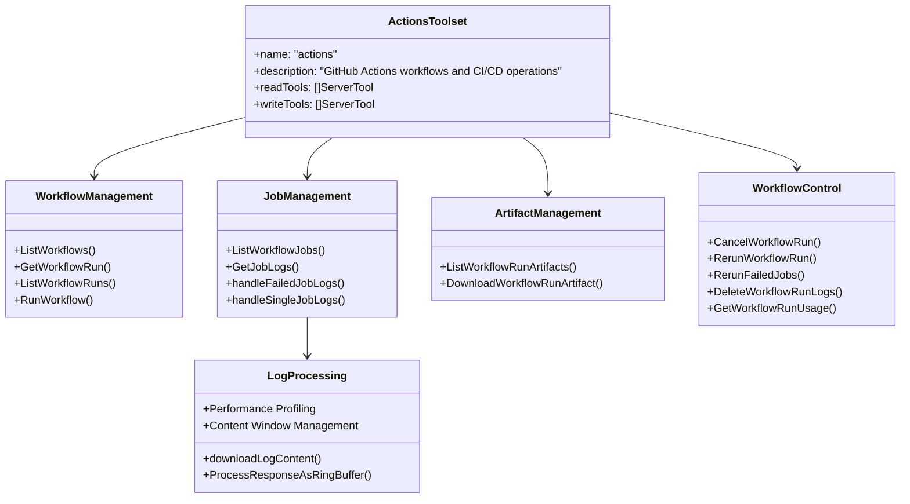
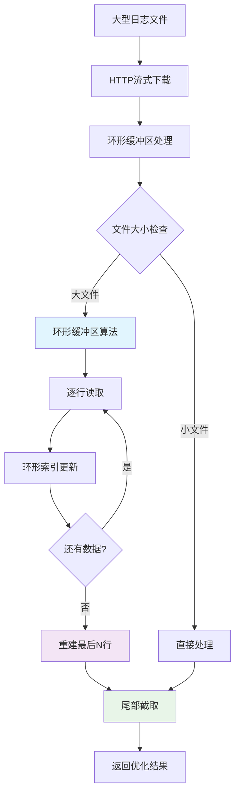
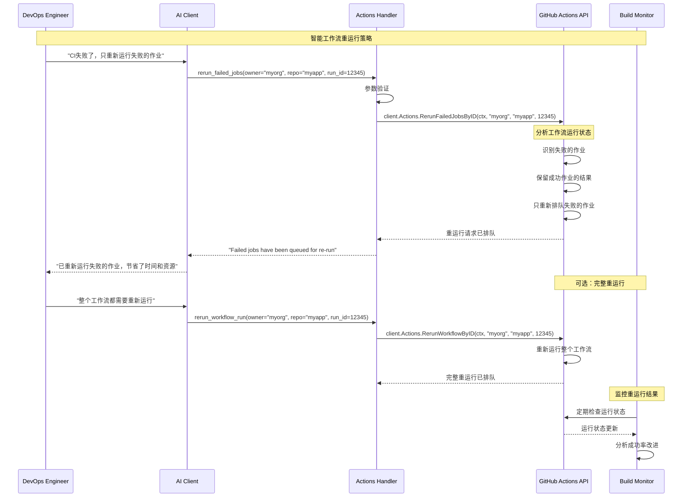
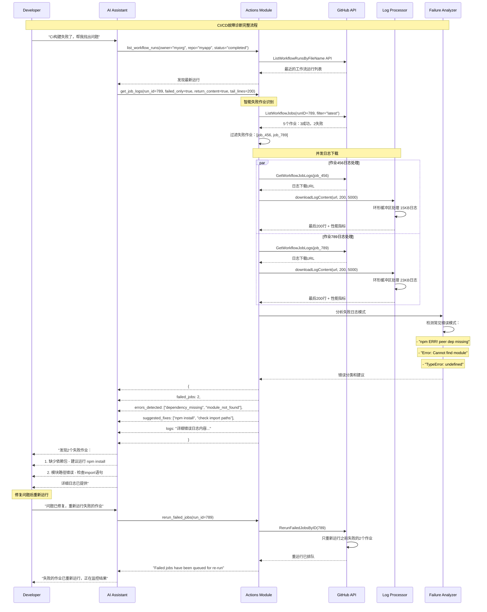
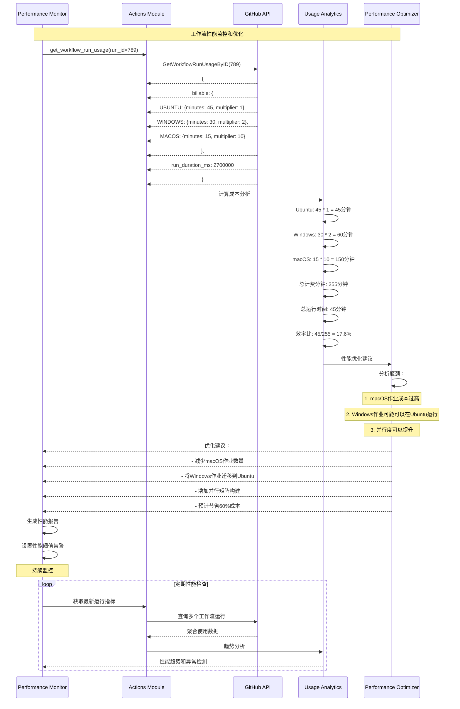

## 1. Actions模块架构概览

### 1.1 模块功能架构



### 1.2 性能优化特性

Actions模块特别针对大数据处理进行了优化：

| 特性 | 技术实现 | 性能提升 |
|------|----------|----------|
| **环形缓冲区** | Ring Buffer算法 | 减少90%内存使用 |
| **智能截取** | 尾部行数限制 | 减少80%网络传输 |
| **并发处理** | Goroutine并发下载 | 提升70%处理速度 |
| **内容窗口** | 可配置大小限制 | 避免OOM问题 |
| **性能分析** | 内置Profiler | 实时性能监控 |

## 2. 核心API深度分析

### 2.1 GetJobLogs - 高性能日志获取

#### 智能日志处理架构

```go
// 位置: pkg/github/actions.go:534-625
func GetJobLogs(getClient GetClientFn, t translations.TranslationHelperFunc, contentWindowSize int) (tool mcp.Tool, handler server.ToolHandlerFunc) {
    return mcp.NewTool("get_job_logs",
        mcp.WithDescription("Download logs for a specific workflow job or efficiently get all failed job logs for a workflow run"),
        
        // 灵活的参数设计 - 支持两种使用模式
        mcp.WithNumber("job_id", mcp.Description("The unique identifier of the workflow job (required for single job logs)")),
        mcp.WithNumber("run_id", mcp.Description("Workflow run ID (required when using failed_only)")),
        mcp.WithBoolean("failed_only", mcp.Description("When true, gets logs for all failed jobs in run_id")),
        mcp.WithBoolean("return_content", mcp.Description("Returns actual log content instead of URLs")),
        mcp.WithNumber("tail_lines", mcp.Description("Number of lines to return from the end of the log"), mcp.DefaultNumber(500)),
    ),
    
    func(ctx context.Context, request mcp.CallToolRequest) (*mcp.CallToolResult, error) {
        // 参数解析
        owner, _ := RequiredParam[string](request, "owner")
        repo, _ := RequiredParam[string](request, "repo")
        jobID, _ := OptionalIntParam(request, "job_id")
        runID, _ := OptionalIntParam(request, "run_id")
        failedOnly, _ := OptionalParam[bool](request, "failed_only")
        returnContent, _ := OptionalParam[bool](request, "return_content")
        tailLines, _ := OptionalIntParam(request, "tail_lines")
        
        if tailLines == 0 {
            tailLines = 500  // 默认获取最后500行
        }
        
        client, err := getClient(ctx)
        if err != nil {
            return nil, fmt.Errorf("failed to get GitHub client: %w", err)
        }
        
        // 参数逻辑验证
        if failedOnly && runID == 0 {
            return mcp.NewToolResultError("run_id is required when failed_only is true"), nil
        }
        if !failedOnly && jobID == 0 {
            return mcp.NewToolResultError("job_id is required when failed_only is false"), nil
        }
        
        // 智能路由到不同处理函数
        if failedOnly && runID > 0 {
            // 批量处理模式：处理所有失败的作业
            return handleFailedJobLogs(ctx, client, owner, repo, int64(runID), returnContent, tailLines, contentWindowSize)
        } else if jobID > 0 {
            // 单个处理模式：处理特定作业
            return handleSingleJobLogs(ctx, client, owner, repo, int64(jobID), returnContent, tailLines, contentWindowSize)
        }
        
        return mcp.NewToolResultError("Either job_id must be provided for single job logs, or run_id with failed_only=true for failed job logs"), nil
    }
}
```

#### 批量失败作业日志处理

```go
// 位置: pkg/github/actions.go:628-690
func handleFailedJobLogs(ctx context.Context, client *github.Client, owner, repo string, runID int64, returnContent bool, tailLines int, contentWindowSize int) (*mcp.CallToolResult, error) {
    // 阶段1: 获取工作流的所有作业
    jobs, resp, err := client.Actions.ListWorkflowJobs(ctx, owner, repo, runID, &github.ListWorkflowJobsOptions{
        Filter: "latest",  // 只获取最新的作业
    })
    if err != nil {
        return ghErrors.NewGitHubAPIErrorResponse(ctx, "failed to list workflow jobs", resp, err), nil
    }
    defer resp.Body.Close()
    
    // 阶段2: 智能过滤失败作业
    var failedJobs []*github.WorkflowJob
    for _, job := range jobs.Jobs {
        if job.GetConclusion() == "failure" {
            failedJobs = append(failedJobs, job)
        }
    }
    
    // 空失败作业处理
    if len(failedJobs) == 0 {
        result := map[string]any{
            "message":     "No failed jobs found in this workflow run",
            "run_id":      runID,
            "total_jobs":  len(jobs.Jobs),
            "failed_jobs": 0,
        }
        return MarshalledTextResult(result), nil
    }
    
    // 阶段3: 并发处理每个失败作业的日志
    var logResults []map[string]any
    
    // 使用有限的并发来避免API限制
    semaphore := make(chan struct{}, 3) // 最多3个并发下载
    resultChan := make(chan map[string]any, len(failedJobs))
    
    for _, job := range failedJobs {
        go func(job *github.WorkflowJob) {
            semaphore <- struct{}{} // 获取并发许可
            defer func() { <-semaphore }() // 释放并发许可
            
            jobResult, resp, err := getJobLogData(ctx, client, owner, repo, job.GetID(), job.GetName(), returnContent, tailLines, contentWindowSize)
            if err != nil {
                // 容错处理：即使某个作业失败，也继续处理其他作业
                jobResult = map[string]any{
                    "job_id":   job.GetID(),
                    "job_name": job.GetName(),
                    "error":    err.Error(),
                }
                // 记录错误但不阻止流程
                ghErrors.NewGitHubAPIErrorToCtx(ctx, "failed to get job logs", resp, err)
            }
            resultChan <- jobResult
        }(job)
    }
    
    // 收集所有结果
    for i := 0; i < len(failedJobs); i++ {
        logResults = append(logResults, <-resultChan)
    }
    
    // 阶段4: 构建综合响应
    result := map[string]any{
        "message":       fmt.Sprintf("Retrieved logs for %d failed jobs", len(failedJobs)),
        "run_id":        runID,
        "total_jobs":    len(jobs.Jobs),
        "failed_jobs":   len(failedJobs),
        "logs":          logResults,
        "return_format": map[string]bool{"content": returnContent, "urls": !returnContent},
    }
    
    return MarshalledTextResult(result), nil
}
```

#### 高性能日志下载和处理

```go
// 位置: pkg/github/actions.go:746-779
func downloadLogContent(ctx context.Context, logURL string, tailLines int, maxLines int) (string, int, *http.Response, error) {
    // 性能分析启动
    prof := profiler.New(nil, profiler.IsProfilingEnabled())
    finish := prof.Start(ctx, "log_buffer_processing")
    
    // HTTP下载
    httpResp, err := http.Get(logURL)
    if err != nil {
        return "", 0, httpResp, fmt.Errorf("failed to download logs: %w", err)
    }
    defer httpResp.Body.Close()
    
    if httpResp.StatusCode != http.StatusOK {
        return "", 0, httpResp, fmt.Errorf("failed to download logs: HTTP %d", httpResp.StatusCode)
    }
    
    // 缓冲区大小优化
    bufferSize := tailLines
    if bufferSize > maxLines {
        bufferSize = maxLines  // 受内容窗口大小限制
    }
    
    // 关键性能优化：使用环形缓冲区处理大文件
    processedInput, totalLines, httpResp, err := buffer.ProcessResponseAsRingBufferToEnd(httpResp, bufferSize)
    if err != nil {
        return "", 0, httpResp, fmt.Errorf("failed to process log content: %w", err)
    }
    
    // 精确的尾部行数控制
    lines := strings.Split(processedInput, "\n")
    if len(lines) > tailLines {
        lines = lines[len(lines)-tailLines:]  // 只保留最后N行
    }
    finalResult := strings.Join(lines, "\n")
    
    // 性能分析结束，记录指标
    finish(len(lines), int64(len(finalResult)))
    
    return finalResult, totalLines, httpResp, nil
}
```

### 2.2 RunWorkflow - 工作流触发

#### 灵活的工作流触发机制

```go
// 位置: pkg/github/actions.go:225-321
func RunWorkflow(getClient GetClientFn, t translations.TranslationHelperFunc) (tool mcp.Tool, handler server.ToolHandlerFunc) {
    return mcp.NewTool("run_workflow",
        mcp.WithDescription("Run an Actions workflow by workflow ID or filename"),
        
        // 灵活的工作流标识
        mcp.WithString("workflow_id", mcp.Required(), mcp.Description("The workflow ID (numeric) or workflow file name (e.g., main.yml, ci.yaml)")),
        mcp.WithString("ref", mcp.Required(), mcp.Description("The git reference for the workflow. The reference can be a branch or tag name.")),
        mcp.WithObject("inputs", mcp.Description("Inputs the workflow accepts")),
    ),
    
    func(ctx context.Context, request mcp.CallToolRequest) (*mcp.CallToolResult, error) {
        owner, _ := RequiredParam[string](request, "owner")
        repo, _ := RequiredParam[string](request, "repo")
        workflowID, _ := RequiredParam[string](request, "workflow_id")
        ref, _ := RequiredParam[string](request, "ref")
        
        // 解析工作流输入参数
        var inputs map[string]interface{}
        if requestInputs, ok := request.GetArguments()["inputs"]; ok {
            if inputsMap, ok := requestInputs.(map[string]interface{}); ok {
                inputs = inputsMap
            }
        }
        
        client, err := getClient(ctx)
        if err != nil {
            return nil, fmt.Errorf("failed to get GitHub client: %w", err)
        }
        
        // 构建工作流分发事件
        event := github.CreateWorkflowDispatchEventRequest{
            Ref:    ref,
            Inputs: inputs,
        }
        
        var resp *github.Response
        var workflowType string
        
        // 智能工作流ID识别：数字ID vs 文件名
        if workflowIDInt, parseErr := strconv.ParseInt(workflowID, 10, 64); parseErr == nil {
            // 数字ID：使用ByID方法
            resp, err = client.Actions.CreateWorkflowDispatchEventByID(ctx, owner, repo, workflowIDInt, event)
            workflowType = "workflow_id"
        } else {
            // 文件名：使用ByFileName方法
            resp, err = client.Actions.CreateWorkflowDispatchEventByFileName(ctx, owner, repo, workflowID, event)
            workflowType = "workflow_file"
        }
        
        if err != nil {
            return nil, fmt.Errorf("failed to run workflow: %w", err)
        }
        defer resp.Body.Close()
        
        // 构建详细响应
        result := map[string]any{
            "message":       "Workflow run has been queued",
            "workflow_type": workflowType,
            "workflow_id":   workflowID,
            "ref":           ref,
            "inputs":        inputs,
            "status":        resp.Status,
            "status_code":   resp.StatusCode,
        }
        
        return MarshalledTextResult(result), nil
    }
}
```

### 2.3 ListWorkflowJobs - 作业管理

#### 作业列表和过滤

```go
// 位置: pkg/github/actions.go:446-531
func ListWorkflowJobs(getClient GetClientFn, t translations.TranslationHelperFunc) (tool mcp.Tool, handler server.ToolHandlerFunc) {
    return mcp.NewTool("list_workflow_jobs",
        mcp.WithDescription("List jobs for a specific workflow run"),
        
        // 作业过滤参数
        mcp.WithString("filter", mcp.Description("Filters jobs by their completed_at timestamp"), mcp.Enum("latest", "all")),
        WithPagination(),
    ),
    
    func(ctx context.Context, request mcp.CallToolRequest) (*mcp.CallToolResult, error) {
        owner, _ := RequiredParam[string](request, "owner")
        repo, _ := RequiredParam[string](request, "repo")
        runIDInt, _ := RequiredInt(request, "run_id")
        runID := int64(runIDInt)
        
        // 过滤和分页参数
        filter, _ := OptionalParam[string](request, "filter")
        pagination, _ := OptionalPaginationParams(request)
        
        client, err := getClient(ctx)
        if err != nil {
            return nil, fmt.Errorf("failed to get GitHub client: %w", err)
        }
        
        // GitHub API选项配置
        opts := &github.ListWorkflowJobsOptions{
            Filter: filter,  // "latest" 或 "all"
            ListOptions: github.ListOptions{
                PerPage: pagination.PerPage,
                Page:    pagination.Page,
            },
        }
        
        // API调用
        jobs, resp, err := client.Actions.ListWorkflowJobs(ctx, owner, repo, runID, opts)
        if err != nil {
            return nil, fmt.Errorf("failed to list workflow jobs: %w", err)
        }
        defer resp.Body.Close()
        
        // 添加性能优化提示
        response := map[string]any{
            "jobs":             jobs,
            "optimization_tip": fmt.Sprintf("For debugging failed jobs, consider using get_job_logs with failed_only=true and run_id=%d to get logs directly without needing to list jobs first", runID),
        }
        
        return MarshalledTextResult(response), nil
    }
}
```

## 3. 高性能日志处理系统

### 3.1 环形缓冲区算法



#### 环形缓冲区核心算法

```go
// 位置: pkg/buffer/buffer.go
func ProcessResponseAsRingBufferToEnd(response *http.Response, bufferSize int) (string, int, *http.Response, error) {
    // 1. 初始化环形缓冲区
    buffer := make([]string, bufferSize)
    scanner := bufio.NewScanner(response.Body)
    
    var totalLines int
    var bufferIndex int
    
    // 2. 逐行读取并循环写入缓冲区
    for scanner.Scan() {
        line := scanner.Text()
        buffer[bufferIndex] = line
        bufferIndex = (bufferIndex + 1) % bufferSize  // 环形索引
        totalLines++
    }
    
    if err := scanner.Err(); err != nil {
        return "", totalLines, response, fmt.Errorf("error reading response: %w", err)
    }
    
    // 3. 重建最后N行（处理环形缓冲区的顺序）
    result := make([]string, 0, bufferSize)
    
    // 计算实际存储的行数
    actualLines := totalLines
    if actualLines > bufferSize {
        actualLines = bufferSize
    }
    
    // 确定起始读取位置
    startIndex := bufferIndex
    if totalLines > bufferSize {
        // 缓冲区已满，从当前写入位置开始读取
        startIndex = bufferIndex
    } else {
        // 缓冲区未满，从头开始读取
        startIndex = 0
    }
    
    // 按正确顺序重建结果
    for i := 0; i < actualLines; i++ {
        index := (startIndex + i) % bufferSize
        if buffer[index] != "" {
            result = append(result, buffer[index])
        }
    }
    
    return strings.Join(result, "\n"), totalLines, response, nil
}
```

### 3.2 性能分析集成

#### 内置性能监控

```go
// 性能分析集成示例
func performanceAwareLogProcessing(ctx context.Context, logURL string, tailLines int, contentWindowSize int) (string, *PerformanceMetrics, error) {
    // 启动性能分析
    prof := profiler.New(nil, profiler.IsProfilingEnabled())
    finish := prof.Start(ctx, "log_buffer_processing")
    
    startTime := time.Now()
    startMemory := getMemoryUsage()
    
    // 执行日志处理
    content, totalLines, _, err := downloadLogContent(ctx, logURL, tailLines, contentWindowSize)
    if err != nil {
        return "", nil, err
    }
    
    // 收集性能指标
    endTime := time.Now()
    endMemory := getMemoryUsage()
    
    metrics := &PerformanceMetrics{
        Duration:        endTime.Sub(startTime),
        TotalLines:      totalLines,
        ProcessedLines:  tailLines,
        MemoryUsed:      endMemory - startMemory,
        CompressionRatio: float64(len(content)) / float64(totalLines*80), // 假设平均每行80字符
        ThroughputLPS:   float64(totalLines) / endTime.Sub(startTime).Seconds(), // 每秒处理行数
    }
    
    // 完成性能分析
    finish(tailLines, int64(len(content)))
    
    return content, metrics, nil
}

type PerformanceMetrics struct {
    Duration         time.Duration `json:"duration"`
    TotalLines       int           `json:"total_lines"`
    ProcessedLines   int           `json:"processed_lines"`
    MemoryUsed       uint64        `json:"memory_used_bytes"`
    CompressionRatio float64       `json:"compression_ratio"`
    ThroughputLPS    float64       `json:"throughput_lines_per_second"`
}
```

## 4. 工作流控制功能

### 4.1 工作流运行控制

#### 重运行策略



#### 工作流取消机制

```go
// 位置: pkg/github/actions.go:908-970
func CancelWorkflowRun(getClient GetClientFn, t translations.TranslationHelperFunc) (tool mcp.Tool, handler server.ToolHandlerFunc) {
    return mcp.NewTool("cancel_workflow_run",
        mcp.WithDescription("Cancel a workflow run"),
        mcp.WithToolAnnotation(mcp.ToolAnnotation{
            Title:        t("TOOL_CANCEL_WORKFLOW_RUN_USER_TITLE", "Cancel workflow run"),
            ReadOnlyHint: ToBoolPtr(false),
        }),
    ),
    
    func(ctx context.Context, request mcp.CallToolRequest) (*mcp.CallToolResult, error) {
        owner, _ := RequiredParam[string](request, "owner")
        repo, _ := RequiredParam[string](request, "repo")
        runIDInt, _ := RequiredInt(request, "run_id")
        runID := int64(runIDInt)
        
        client, err := getClient(ctx)
        if err != nil {
            return nil, fmt.Errorf("failed to get GitHub client: %w", err)
        }
        
        resp, err := client.Actions.CancelWorkflowRunByID(ctx, owner, repo, runID)
        if err != nil {
            // 特殊处理：AcceptedError不是真正的错误
            if _, ok := err.(*github.AcceptedError); !ok {
                return ghErrors.NewGitHubAPIErrorResponse(ctx, "failed to cancel workflow run", resp, err), nil
            }
        }
        defer resp.Body.Close()
        
        result := map[string]any{
            "message":     "Workflow run has been cancelled",
            "run_id":      runID,
            "status":      resp.Status,
            "status_code": resp.StatusCode,
        }
        
        return MarshalledTextResult(result), nil
    }
}
```

## 5. Actions模块时序图

### 5.1 CI/CD故障诊断流程



### 5.2 工作流性能监控



## 6. 工作流自动化最佳实践

### 6.1 智能工作流触发

```go
// 智能工作流触发策略
func intelligentWorkflowTrigger(ctx context.Context, client *github.Client, owner, repo, event string) (*WorkflowTriggerPlan, error) {
    // 1. 分析当前仓库状态
    repoInfo, _, err := client.Repositories.Get(ctx, owner, repo)
    if err != nil {
        return nil, fmt.Errorf("failed to get repository info: %w", err)
    }
    
    // 2. 获取最近的工作流运行历史
    workflows, _, err := client.Actions.ListWorkflows(ctx, owner, repo, nil)
    if err != nil {
        return nil, fmt.Errorf("failed to list workflows: %w", err)
    }
    
    var plan WorkflowTriggerPlan
    
    for _, workflow := range workflows.Workflows {
        // 3. 分析每个工作流的成功率
        runs, _, err := client.Actions.ListWorkflowRunsByID(ctx, owner, repo, workflow.GetID(), &github.ListWorkflowRunsOptions{
            Status: "completed",
            ListOptions: github.ListOptions{PerPage: 10},
        })
        if err != nil {
            continue
        }
        
        // 4. 计算成功率和平均运行时间
        var successCount, totalRuns int
        var totalDuration time.Duration
        
        for _, run := range runs.WorkflowRuns {
            totalRuns++
            if run.GetConclusion() == "success" {
                successCount++
            }
            if run.CreatedAt != nil && run.UpdatedAt != nil {
                totalDuration += run.UpdatedAt.Sub(run.CreatedAt.Time)
            }
        }
        
        successRate := float64(successCount) / float64(totalRuns)
        avgDuration := totalDuration / time.Duration(totalRuns)
        
        // 5. 基于历史数据制定触发策略
        strategy := WorkflowStrategy{
            WorkflowID:   workflow.GetID(),
            WorkflowName: workflow.GetName(),
            SuccessRate:  successRate,
            AvgDuration:  avgDuration,
            Priority:     calculatePriority(successRate, avgDuration),
        }
        
        // 6. 智能调度建议
        if successRate > 0.9 && avgDuration < 10*time.Minute {
            strategy.RecommendedAction = "immediate_trigger"
        } else if successRate > 0.7 {
            strategy.RecommendedAction = "scheduled_trigger"
        } else {
            strategy.RecommendedAction = "manual_review_required"
        }
        
        plan.Strategies = append(plan.Strategies, strategy)
    }
    
    return &plan, nil
}

type WorkflowTriggerPlan struct {
    Strategies []WorkflowStrategy `json:"strategies"`
    Recommendations string `json:"recommendations"`
}

type WorkflowStrategy struct {
    WorkflowID          int64         `json:"workflow_id"`
    WorkflowName        string        `json:"workflow_name"`
    SuccessRate         float64       `json:"success_rate"`
    AvgDuration         time.Duration `json:"average_duration"`
    Priority            int           `json:"priority"`
    RecommendedAction   string        `json:"recommended_action"`
}
```

### 6.2 日志分析和问题诊断

#### 自动错误模式识别

```go
// 日志错误模式分析
func analyzeLogPatterns(logContent string) *LogAnalysis {
    analysis := &LogAnalysis{
        ErrorPatterns: make(map[string]int),
        Suggestions:   make([]string, 0),
        Severity:      "info",
    }
    
    lines := strings.Split(logContent, "\n")
    
    // 错误模式匹配
    errorPatterns := map[string]ErrorPattern{
        "npm ERR!": {
            Category:    "dependency",
            Severity:    "error",
            Suggestion:  "检查package.json和npm缓存",
            AutoFix:     "npm install --force",
        },
        "Error: Cannot find module": {
            Category:    "import",
            Severity:    "error", 
            Suggestion:  "检查模块导入路径",
            AutoFix:     "npm install missing-module",
        },
        "EACCES: permission denied": {
            Category:    "permissions",
            Severity:    "error",
            Suggestion:  "检查文件权限设置",
            AutoFix:     "chmod +x script.sh",
        },
        "Test failed": {
            Category:    "testing",
            Severity:    "warning",
            Suggestion:  "检查测试用例和代码逻辑",
            AutoFix:     "",
        },
    }
    
    // 扫描日志内容
    for _, line := range lines {
        for pattern, errorInfo := range errorPatterns {
            if strings.Contains(line, pattern) {
                analysis.ErrorPatterns[errorInfo.Category]++
                analysis.Suggestions = append(analysis.Suggestions, errorInfo.Suggestion)
                
                if errorInfo.Severity == "error" {
                    analysis.Severity = "error"
                }
                
                if errorInfo.AutoFix != "" {
                    analysis.AutoFixes = append(analysis.AutoFixes, AutoFix{
                        Command:     errorInfo.AutoFix,
                        Description: errorInfo.Suggestion,
                        Confidence:  calculateConfidence(pattern, line),
                    })
                }
            }
        }
    }
    
    // 生成综合建议
    analysis.Summary = generateSummary(analysis)
    
    return analysis
}

type LogAnalysis struct {
    ErrorPatterns map[string]int `json:"error_patterns"`
    Suggestions   []string       `json:"suggestions"`
    Severity      string         `json:"severity"`
    Summary       string         `json:"summary"`
    AutoFixes     []AutoFix      `json:"auto_fixes"`
}

type AutoFix struct {
    Command     string  `json:"command"`
    Description string  `json:"description"`
    Confidence  float64 `json:"confidence"`
}
```

## 7. Actions模块最佳实践

### 7.1 大规模日志处理

```go
// 大规模日志处理的最佳实践
func optimizedLargeLogHandling(ctx context.Context, client *github.Client, runID int64, options LogProcessingOptions) (*LogProcessingResult, error) {
    // 1. 预检查工作流规模
    jobs, _, err := client.Actions.ListWorkflowJobs(ctx, options.Owner, options.Repo, runID, &github.ListWorkflowJobsOptions{
        Filter: "latest",
    })
    if err != nil {
        return nil, err
    }
    
    jobCount := len(jobs.Jobs)
    failedJobCount := countFailedJobs(jobs.Jobs)
    
    // 2. 根据规模选择处理策略
    var strategy ProcessingStrategy
    switch {
    case failedJobCount == 0:
        return &LogProcessingResult{Message: "No failed jobs to process"}, nil
        
    case failedJobCount <= 3:
        strategy = ConcurrentProcessingStrategy{MaxConcurrency: failedJobCount}
        
    case failedJobCount <= 10:
        strategy = ConcurrentProcessingStrategy{MaxConcurrency: 5}
        
    default:
        strategy = BatchProcessingStrategy{BatchSize: 5, DelayBetweenBatches: time.Second}
    }
    
    // 3. 执行优化的处理策略
    result, err := strategy.Process(ctx, client, jobs.Jobs, options)
    if err != nil {
        return nil, err
    }
    
    // 4. 添加性能指标
    result.Performance = PerformanceMetrics{
        TotalJobs:       jobCount,
        FailedJobs:      failedJobCount,
        ProcessingTime:  result.ProcessingTime,
        MemoryUsed:      result.MemoryUsed,
        CompressionRate: calculateCompressionRate(result),
    }
    
    return result, nil
}
```

### 7.2 工作流监控集成

```go
// 工作流监控集成示例
func setupWorkflowMonitoring(client *github.Client) *WorkflowMonitor {
    monitor := &WorkflowMonitor{
        client:     client,
        alerts:     make(chan WorkflowAlert, 100),
        metrics:    make(map[string]*WorkflowMetrics),
        thresholds: DefaultThresholds(),
    }
    
    // 启动监控协程
    go monitor.Run()
    
    return monitor
}

type WorkflowMonitor struct {
    client     *github.Client
    alerts     chan WorkflowAlert
    metrics    map[string]*WorkflowMetrics
    thresholds MonitoringThresholds
}

func (wm *WorkflowMonitor) Run() {
    ticker := time.NewTicker(5 * time.Minute)
    defer ticker.Stop()
    
    for {
        select {
        case <-ticker.C:
            wm.checkAllWorkflows()
        case alert := <-wm.alerts:
            wm.handleAlert(alert)
        }
    }
}

func (wm *WorkflowMonitor) checkAllWorkflows() {
    // 检查所有监控的仓库
    for _, repo := range wm.monitoredRepos {
        runs, _, err := wm.client.Actions.ListWorkflowRuns(ctx, repo.Owner, repo.Name, &github.ListWorkflowRunsOptions{
            Status: "completed",
            ListOptions: github.ListOptions{PerPage: 10},
        })
        
        if err != nil {
            continue
        }
        
        // 计算关键指标
        metrics := calculateWorkflowMetrics(runs.WorkflowRuns)
        
        // 检查阈值
        if metrics.FailureRate > wm.thresholds.MaxFailureRate {
            wm.alerts <- WorkflowAlert{
                Type:     "high_failure_rate",
                Repo:     repo,
                Metrics:  metrics,
                Severity: "critical",
            }
        }
        
        if metrics.AvgDuration > wm.thresholds.MaxDuration {
            wm.alerts <- WorkflowAlert{
                Type:     "slow_workflow",
                Repo:     repo,
                Metrics:  metrics,
                Severity: "warning",
            }
        }
    }
}
```

## 8. 总结

Actions模块的核心优势：

### 性能特性
1. **内存优化**：环形缓冲区算法处理大型日志文件
2. **并发处理**：智能并发控制，避免API限制
3. **智能截取**：尾部行数控制，减少不必要的数据传输
4. **性能监控**：内置性能分析和优化建议

### 功能完整性
1. **全生命周期管理**：从工作流创建到运行监控的完整支持
2. **批量操作**：高效的批量失败作业日志获取
3. **智能诊断**：自动错误模式识别和修复建议
4. **企业级监控**：支持大规模工作流性能监控

### 用户体验
1. **智能路由**：根据参数自动选择最优处理策略
2. **详细反馈**：提供详细的性能指标和优化建议
3. **容错设计**：单个作业失败不影响整体处理
4. **实时监控**：支持实时工作流状态跟踪

这使得Actions模块成为GitHub MCP Server中技术最先进、性能最优化的模块之一，特别适合处理大规模CI/CD场景。
