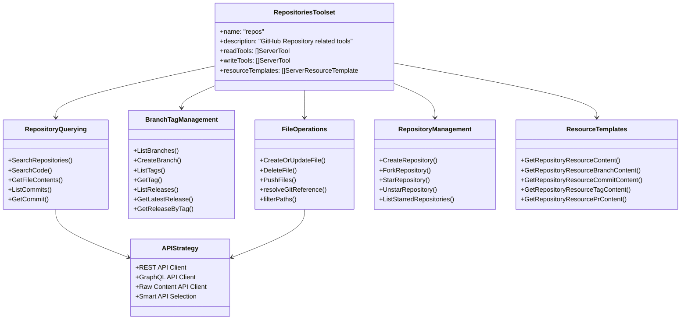
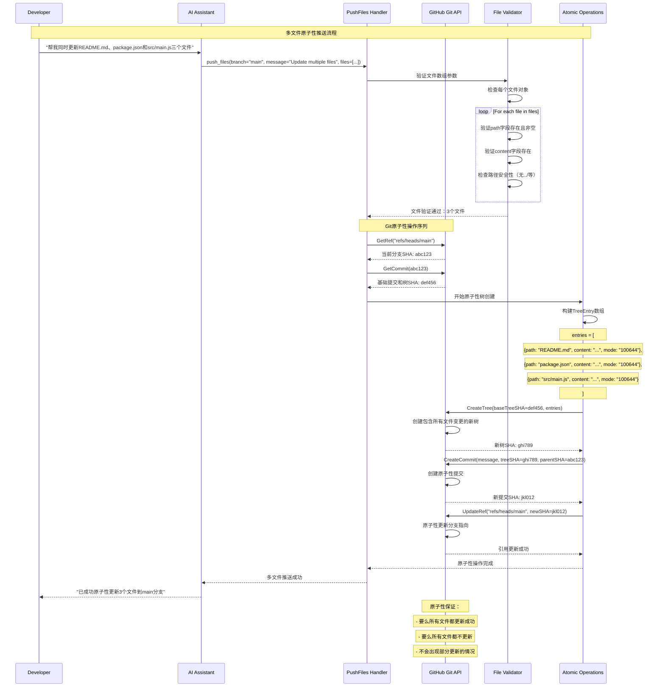
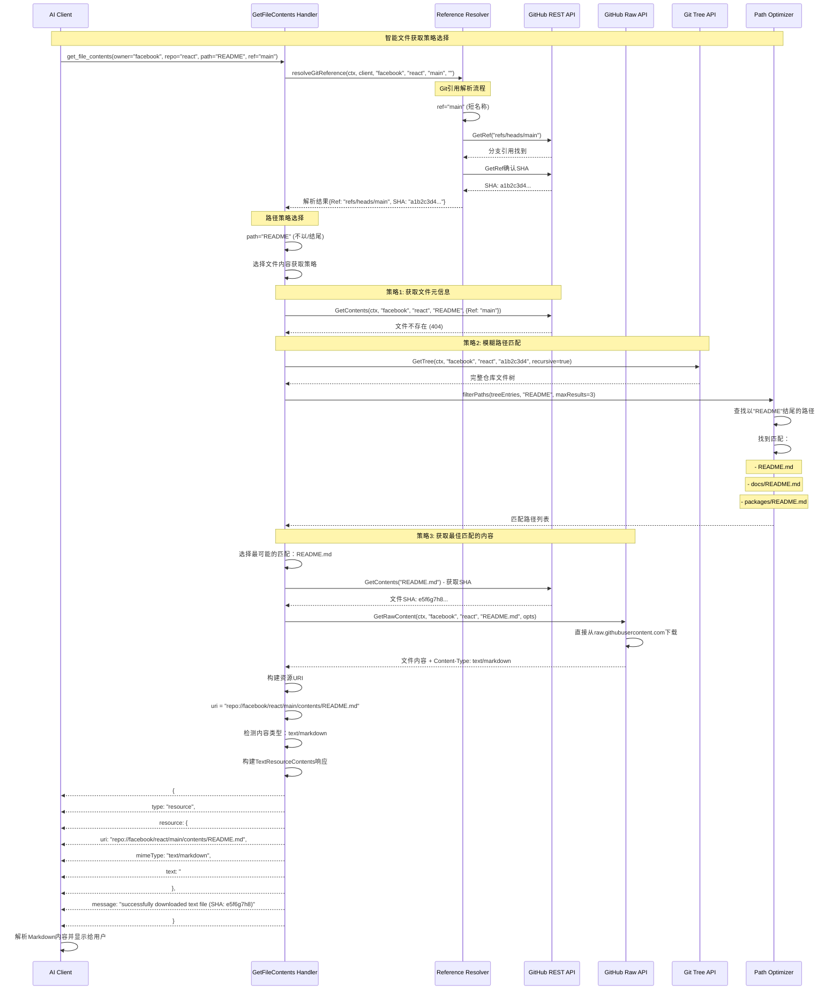
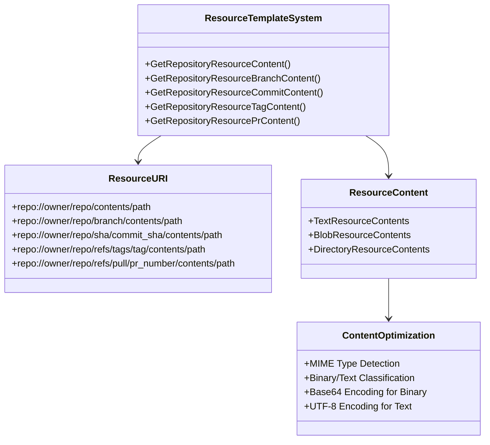
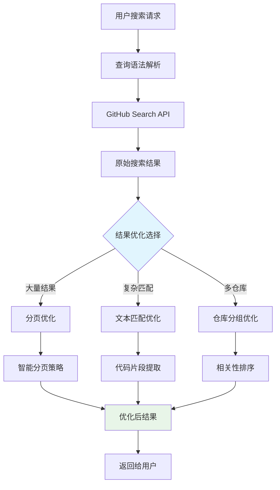
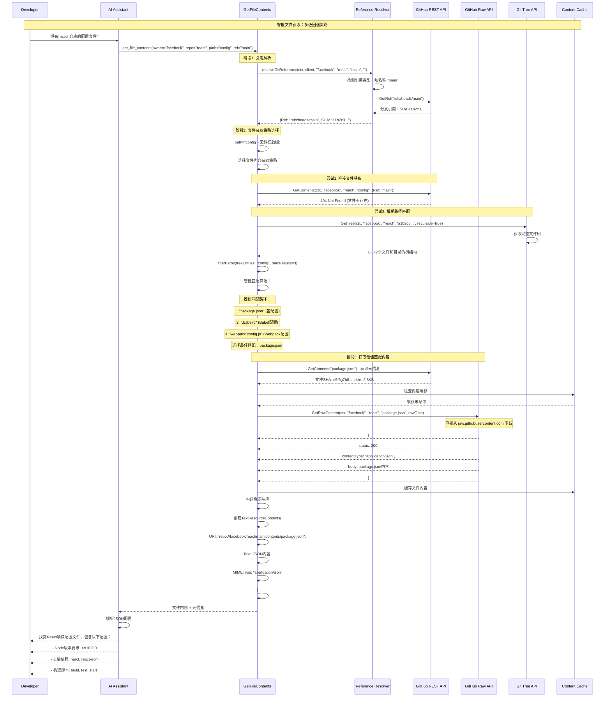
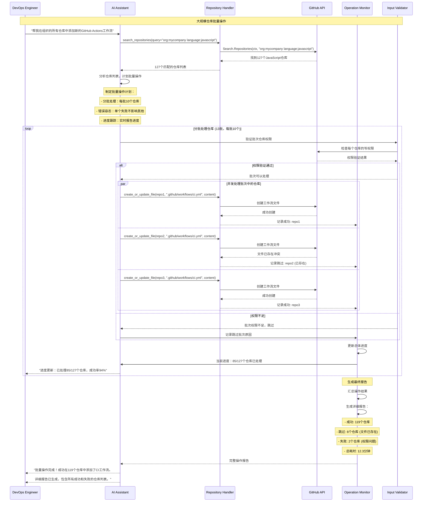

# GitHub MCP Server - 仓库管理模块深度分析

## 1. 仓库管理模块架构

### 1.1 模块功能架构



### 1.2 多API协调策略

仓库管理模块采用了最复杂的多API协调策略：

| 操作类型 | 首选API | 备选API | 选择原因 |
|----------|---------|---------|----------|
| **文件内容获取** | Raw API | REST API | Raw API直接返回文件内容，更高效 |
| **目录浏览** | REST API | Git Tree API | REST API结构化数据更适合目录展示 |
| **代码搜索** | REST Search API | - | 专门的搜索API，功能最强大 |
| **大文件下载** | Raw API | - | 避免Base64编码，直接二进制传输 |
| **仓库搜索** | REST Search API | - | 支持复杂查询语法 |
| **Git操作** | Git API | - | 底层Git操作，支持复杂场景 |

## 2. 核心API深度分析

### 2.1 GetFileContents - 智能文件获取

#### 多层级文件获取策略

```go
// 位置: pkg/github/repositories.go:485-678
func GetFileContents(getClient GetClientFn, getRawClient raw.GetRawClientFn, t translations.TranslationHelperFunc) (tool mcp.Tool, handler server.ToolHandlerFunc) {
    return mcp.NewTool("get_file_contents",
        mcp.WithDescription("Get the contents of a file or directory from a GitHub repository with intelligent API selection"),
        
        // 灵活的引用参数
        mcp.WithString("path", mcp.Description("Path to file/directory (directories must end with a slash '/')"), mcp.DefaultString("/")),
        mcp.WithString("ref", mcp.Description("Accepts optional git refs such as `refs/tags/{tag}`, `refs/heads/{branch}` or `refs/pull/{pr_number}/head`")),
        mcp.WithString("sha", mcp.Description("Accepts optional commit SHA. If specified, it will be used instead of ref")),
    ),
    
    func(ctx context.Context, request mcp.CallToolRequest) (*mcp.CallToolResult, error) {
        // 参数解析
        owner, _ := RequiredParam[string](request, "owner")
        repo, _ := RequiredParam[string](request, "repo")
        path, _ := RequiredParam[string](request, "path")
        ref, _ := OptionalParam[string](request, "ref")
        sha, _ := OptionalParam[string](request, "sha")
        
        // 获取客户端
        client, err := getClient(ctx)
        if err != nil {
            return mcp.NewToolResultError("failed to get GitHub client"), nil
        }
        
        // 关键函数：解析Git引用
        rawOpts, err := resolveGitReference(ctx, client, owner, repo, ref, sha)
        if err != nil {
            return mcp.NewToolResultError(fmt.Sprintf("failed to resolve git reference: %s", err)), nil
        }
        
        // 策略1: 文件内容获取 - 优先使用Raw API
        if path != "" && !strings.HasSuffix(path, "/") {
            return handleFileContent(ctx, client, getRawClient, owner, repo, path, ref, rawOpts)
        }
        
        // 策略2: 目录内容获取 - 使用REST API
        if strings.HasSuffix(path, "/") {
            return handleDirectoryContent(ctx, client, owner, repo, path, ref)
        }
        
        // 策略3: 模糊路径匹配 - 使用Git Tree API
        return handlePathMatching(ctx, client, owner, repo, path, ref, rawOpts)
    }
}
```

#### 文件内容处理的完整流程

```go
// 文件内容处理策略
func handleFileContent(ctx context.Context, client *github.Client, getRawClient raw.GetRawClientFn, owner, repo, path, ref string, rawOpts *raw.ContentOpts) (*mcp.CallToolResult, error) {
    // 阶段1: 获取文件元信息（REST API）
    opts := &github.RepositoryContentGetOptions{Ref: ref}
    fileContent, _, respContents, err := client.Repositories.GetContents(ctx, owner, repo, path, opts)
    if err != nil {
        return ghErrors.NewGitHubAPIErrorResponse(ctx, "failed to get file SHA", respContents, err), nil
    }
    defer respContents.Body.Close()
    
    if fileContent == nil || fileContent.SHA == nil {
        return mcp.NewToolResultError("file content SHA is nil"), nil
    }
    fileSHA := *fileContent.SHA
    
    // 阶段2: 使用Raw API下载文件内容（性能优化）
    rawClient, err := getRawClient(ctx)
    if err != nil {
        return mcp.NewToolResultError("failed to get GitHub raw content client"), nil
    }
    
    resp, err := rawClient.GetRawContent(ctx, owner, repo, path, rawOpts)
    if err != nil {
        return mcp.NewToolResultError("failed to get raw repository content"), nil
    }
    defer resp.Body.Close()
    
    if resp.StatusCode == http.StatusOK {
        // 阶段3: 内容类型检测和处理
        body, err := io.ReadAll(resp.Body)
        if err != nil {
            return mcp.NewToolResultError("failed to read response body"), nil
        }
        
        contentType := resp.Header.Get("Content-Type")
        
        // 构建资源URI
        var resourceURI string
        switch {
        case rawOpts.SHA != "":
            resourceURI, _ = url.JoinPath("repo://", owner, repo, "sha", rawOpts.SHA, "contents", path)
        case rawOpts.Ref != "":
            resourceURI, _ = url.JoinPath("repo://", owner, repo, rawOpts.Ref, "contents", path)
        default:
            resourceURI, _ = url.JoinPath("repo://", owner, repo, "contents", path)
        }
        
        // 阶段4: 根据内容类型返回不同格式
        if strings.HasPrefix(contentType, "application") || strings.HasPrefix(contentType, "text") {
            // 文本内容
            result := mcp.TextResourceContents{
                URI:      resourceURI,
                Text:     string(body),
                MIMEType: contentType,
            }
            return mcp.NewToolResultResource(fmt.Sprintf("successfully downloaded text file (SHA: %s)", fileSHA), result), nil
        }
        
        // 二进制内容
        result := mcp.BlobResourceContents{
            URI:      resourceURI,
            Blob:     base64.StdEncoding.EncodeToString(body),
            MIMEType: contentType,
        }
        return mcp.NewToolResultResource(fmt.Sprintf("successfully downloaded binary file (SHA: %s)", fileSHA), result), nil
    }
    
    return mcp.NewToolResultError("failed to download file content"), nil
}
```

### 2.2 resolveGitReference - 智能引用解析

#### 复杂的Git引用解析逻辑

```go
// 位置: pkg/github/repositories.go:1615-1685
func resolveGitReference(ctx context.Context, githubClient *github.Client, owner, repo, ref, sha string) (*raw.ContentOpts, error) {
    // 优先级1: 如果提供了明确的SHA，直接使用
    if sha != "" {
        return &raw.ContentOpts{Ref: "", SHA: sha}, nil
    }
    
    originalRef := ref
    var reference *github.Reference
    var resp *github.Response
    var err error
    
    // 优先级2: 引用解析策略
    switch {
    case originalRef == "":
        // 2a. 空引用：获取默认分支
        repoInfo, resp, err := githubClient.Repositories.Get(ctx, owner, repo)
        if err != nil {
            return nil, fmt.Errorf("failed to get repository info: %w", err)
        }
        ref = fmt.Sprintf("refs/heads/%s", repoInfo.GetDefaultBranch())
        
    case strings.HasPrefix(originalRef, "refs/"):
        // 2b. 完全限定引用：refs/heads/main, refs/tags/v1.0.0
        // 直接使用，稍后统一获取
        
    case strings.HasPrefix(originalRef, "heads/") || strings.HasPrefix(originalRef, "tags/"):
        // 2c. 部分限定引用：heads/main, tags/v1.0.0
        ref = "refs/" + originalRef
        
    default:
        // 2d. 短名称：main, v1.0.0 - 需要智能识别
        return resolveShortReference(ctx, githubClient, owner, repo, originalRef)
    }
    
    // 优先级3: 最终引用获取
    if reference == nil {
        reference, resp, err = githubClient.Git.GetRef(ctx, owner, repo, ref)
        if err != nil {
            return nil, fmt.Errorf("failed to get final reference for %q: %w", ref, err)
        }
    }
    
    sha = reference.GetObject().GetSHA()
    return &raw.ContentOpts{Ref: ref, SHA: sha}, nil
}

// 短名称引用解析（分支或标签）
func resolveShortReference(ctx context.Context, githubClient *github.Client, owner, repo, shortName string) (*raw.ContentOpts, error) {
    // 策略：先尝试分支，再尝试标签
    branchRef := "refs/heads/" + shortName
    reference, resp, err := githubClient.Git.GetRef(ctx, owner, repo, branchRef)
    
    if err == nil {
        // 找到分支
        sha := reference.GetObject().GetSHA()
        return &raw.ContentOpts{Ref: branchRef, SHA: sha}, nil
    }
    
    // 检查是否为404错误（分支不存在）
    if ghErr, isGhErr := err.(*github.ErrorResponse); isGhErr && ghErr.Response.StatusCode == http.StatusNotFound {
        // 尝试标签
        tagRef := "refs/tags/" + shortName
        reference, resp, err = githubClient.Git.GetRef(ctx, owner, repo, tagRef)
        
        if err == nil {
            // 找到标签
            sha := reference.GetObject().GetSHA()
            return &raw.ContentOpts{Ref: tagRef, SHA: sha}, nil
        }
        
        if ghErr2, isGhErr2 := err.(*github.ErrorResponse); isGhErr2 && ghErr2.Response.StatusCode == http.StatusNotFound {
            return nil, fmt.Errorf("could not resolve ref %q as a branch or a tag", shortName)
        }
    }
    
    return nil, fmt.Errorf("failed to resolve reference %q: %w", shortName, err)
}
```

### 2.3 PushFiles - 原子性多文件推送

#### Git底层操作的原子性实现

```go
// 位置: pkg/github/repositories.go:1040-1208
func PushFiles(getClient GetClientFn, t translations.TranslationHelperFunc) (tool mcp.Tool, handler server.ToolHandlerFunc) {
    return mcp.NewTool("push_files",
        mcp.WithDescription("Push multiple files to a GitHub repository in a single atomic commit"),
        
        // 复杂的文件数组参数
        mcp.WithArray("files", mcp.Required(),
            mcp.Items(map[string]interface{}{
                "type":                 "object",
                "additionalProperties": false,
                "required":             []string{"path", "content"},
                "properties": map[string]interface{}{
                    "path":    map[string]interface{}{"type": "string", "description": "path to the file"},
                    "content": map[string]interface{}{"type": "string", "description": "file content"},
                },
            }),
            mcp.Description("Array of file objects to push, each object with path (string) and content (string)"),
        ),
    ),
    
    func(ctx context.Context, request mcp.CallToolRequest) (*mcp.CallToolResult, error) {
        owner, _ := RequiredParam[string](request, "owner")
        repo, _ := RequiredParam[string](request, "repo")
        branch, _ := RequiredParam[string](request, "branch")
        message, _ := RequiredParam[string](request, "message")
        
        // 复杂的文件数组解析
        filesObj, ok := request.GetArguments()["files"].([]interface{})
        if !ok {
            return mcp.NewToolResultError("files parameter must be an array of objects with path and content"), nil
        }
        
        client, err := getClient(ctx)
        if err != nil {
            return nil, fmt.Errorf("failed to get GitHub client: %w", err)
        }
        
        // 阶段1: 获取分支引用
        ref, resp, err := client.Git.GetRef(ctx, owner, repo, "refs/heads/"+branch)
        if err != nil {
            return ghErrors.NewGitHubAPIErrorResponse(ctx, "failed to get branch reference", resp, err), nil
        }
        defer resp.Body.Close()
        
        // 阶段2: 获取基础提交
        baseCommit, resp, err := client.Git.GetCommit(ctx, owner, repo, *ref.Object.SHA)
        if err != nil {
            return ghErrors.NewGitHubAPIErrorResponse(ctx, "failed to get base commit", resp, err), nil
        }
        defer resp.Body.Close()
        
        // 阶段3: 构建树条目（原子性关键）
        var entries []*github.TreeEntry
        
        for _, file := range filesObj {
            fileMap, ok := file.(map[string]interface{})
            if !ok {
                return mcp.NewToolResultError("each file must be an object with path and content"), nil
            }
            
            path, ok := fileMap["path"].(string)
            if !ok || path == "" {
                return mcp.NewToolResultError("each file must have a path"), nil
            }
            
            content, ok := fileMap["content"].(string)
            if !ok {
                return mcp.NewToolResultError("each file must have content"), nil
            }
            
            // 创建树条目
            entries = append(entries, &github.TreeEntry{
                Path:    github.Ptr(path),
                Mode:    github.Ptr("100644"), // 常规文件模式
                Type:    github.Ptr("blob"),
                Content: github.Ptr(content),
            })
        }
        
        // 阶段4: 创建新的Git树（原子性操作）
        newTree, resp, err := client.Git.CreateTree(ctx, owner, repo, *baseCommit.Tree.SHA, entries)
        if err != nil {
            return ghErrors.NewGitHubAPIErrorResponse(ctx, "failed to create tree", resp, err), nil
        }
        defer resp.Body.Close()
        
        // 阶段5: 创建新提交
        commit := &github.Commit{
            Message: github.Ptr(message),
            Tree:    newTree,
            Parents: []*github.Commit{{SHA: baseCommit.SHA}},
        }
        
        newCommit, resp, err := client.Git.CreateCommit(ctx, owner, repo, commit, nil)
        if err != nil {
            return ghErrors.NewGitHubAPIErrorResponse(ctx, "failed to create commit", resp, err), nil
        }
        defer resp.Body.Close()
        
        // 阶段6: 更新分支引用（原子性完成）
        ref.Object.SHA = newCommit.SHA
        updatedRef, resp, err := client.Git.UpdateRef(ctx, owner, repo, ref, false)
        if err != nil {
            return ghErrors.NewGitHubAPIErrorResponse(ctx, "failed to update reference", resp, err), nil
        }
        defer resp.Body.Close()
        
        return MarshalledTextResult(updatedRef), nil
    }
}
```

### 2.4 SearchCode - 高级代码搜索

#### 代码搜索的优化实现

```go
// 高级代码搜索实现
func SearchCode(getClient GetClientFn, t translations.TranslationHelperFunc) (tool mcp.Tool, handler server.ToolHandlerFunc) {
    return mcp.NewTool("search_code",
        mcp.WithDescription("Search code using GitHub's powerful code search syntax with advanced filtering"),
        
        // GitHub代码搜索的强大查询语法
        mcp.WithString("query", mcp.Required(), 
            mcp.Description("Search query using GitHub's powerful code search syntax. Examples: 'content:Skill language:Java org:github', 'NOT is:archived language:Python OR language:go', 'repo:github/github-mcp-server'. Supports exact matching, language filters, path filters, and more.")),
        
        // 排序选项
        mcp.WithString("sort", mcp.Description("Sort field ('indexed' only)"), mcp.Enum("indexed")),
        mcp.WithString("order", mcp.Description("Sort order for results"), mcp.Enum("asc", "desc")),
        WithPagination(),
    ),
    
    func(ctx context.Context, request mcp.CallToolRequest) (*mcp.CallToolResult, error) {
        query, _ := RequiredParam[string](request, "query")
        sort, _ := OptionalParam[string](request, "sort")
        order, _ := OptionalParam[string](request, "order")
        pagination, _ := OptionalPaginationParams(request)
        
        client, err := getClient(ctx)
        if err != nil {
            return nil, fmt.Errorf("failed to get GitHub client: %w", err)
        }
        
        // 构建搜索选项
        opts := &github.SearchOptions{
            Sort:  sort,
            Order: order,
            ListOptions: github.ListOptions{
                Page:    pagination.Page,
                PerPage: pagination.PerPage,
            },
        }
        
        // 执行代码搜索
        result, resp, err := client.Search.Code(ctx, query, opts)
        if err != nil {
            return ghErrors.NewGitHubAPIErrorResponse(ctx, "failed to search code", resp, err), nil
        }
        defer resp.Body.Close()
        
        // 优化搜索结果的显示
        optimizedResult := optimizeCodeSearchResult(result)
        return MarshalledTextResult(optimizedResult), nil
    }
}

// 代码搜索结果优化
func optimizeCodeSearchResult(result *github.CodeSearchResult) *OptimizedCodeSearchResult {
    optimized := &OptimizedCodeSearchResult{
        TotalCount:        result.GetTotal(),
        IncompleteResults: result.GetIncompleteResults(),
        Items:             make([]OptimizedCodeResult, 0, len(result.CodeResults)),
    }
    
    for _, item := range result.CodeResults {
        optimizedItem := OptimizedCodeResult{
            Name:       item.GetName(),
            Path:       item.GetPath(),
            SHA:        item.GetSHA(),
            HTMLURL:    item.GetHTMLURL(),
            Repository: convertToMinimalRepository(item.GetRepository()),
        }
        
        // 代码片段优化：只保留相关上下文
        if item.TextMatches != nil {
            optimizedItem.TextMatches = optimizeTextMatches(item.TextMatches)
        }
        
        optimized.Items = append(optimized.Items, optimizedItem)
    }
    
    return optimized
}

type OptimizedCodeResult struct {
    Name         string                 `json:"name"`
    Path         string                 `json:"path"`
    SHA          string                 `json:"sha"`
    HTMLURL      string                 `json:"html_url"`
    Repository   MinimalRepository      `json:"repository"`
    TextMatches  []OptimizedTextMatch   `json:"text_matches,omitempty"`
}

type OptimizedTextMatch struct {
    ObjectURL  string               `json:"object_url"`
    ObjectType string               `json:"object_type"`
    Fragment   string               `json:"fragment"`
    Matches    []OptimizedMatch     `json:"matches"`
}

type OptimizedMatch struct {
    Text     string    `json:"text"`
    Indices  []int     `json:"indices"`
}
```

## 3. 文件操作的时序图

### 3.1 多文件原子性推送流程



### 3.2 智能文件内容获取流程



## 4. 高级仓库操作

### 4.1 仓库搜索的智能优化

```go
// 位置: pkg/github/search.go
func SearchRepositories(getClient GetClientFn, t translations.TranslationHelperFunc) (tool mcp.Tool, handler server.ToolHandlerFunc) {
    return mcp.NewTool("search_repositories",
        mcp.WithDescription("Search repositories using GitHub's advanced search syntax with intelligent result optimization"),
        
        mcp.WithString("query", mcp.Required(),
            mcp.Description("Repository search query. Examples: 'machine learning in:name stars:>1000 language:python', 'topic:react', 'user:facebook'. Supports advanced search syntax for precise filtering.")),
        
        // 性能优化选项
        mcp.WithBoolean("minimal_output", mcp.Description("Return minimal repository information (default: true). When false, returns full GitHub API repository objects."), mcp.DefaultBool(true)),
        WithPagination(),
    ),
    
    func(ctx context.Context, request mcp.CallToolRequest) (*mcp.CallToolResult, error) {
        query, _ := RequiredParam[string](request, "query")
        minimalOutput, _ := OptionalBoolParamWithDefault(request, "minimal_output", true)
        pagination, _ := OptionalPaginationParams(request)
        
        client, err := getClient(ctx)
        if err != nil {
            return nil, fmt.Errorf("failed to get GitHub client: %w", err)
        }
        
        // 搜索选项配置
        opts := &github.SearchOptions{
            ListOptions: github.ListOptions{
                Page:    pagination.Page,
                PerPage: pagination.PerPage,
            },
        }
        
        // 执行仓库搜索
        result, resp, err := client.Search.Repositories(ctx, query, opts)
        if err != nil {
            return ghErrors.NewGitHubAPIErrorResponse(ctx, "failed to search repositories", resp, err), nil
        }
        defer resp.Body.Close()
        
        // 智能结果优化
        if minimalOutput {
            // 返回优化的最小结果
            minimalResult := &MinimalSearchRepositoriesResult{
                TotalCount:        result.GetTotal(),
                IncompleteResults: result.GetIncompleteResults(),
                Items:             make([]MinimalRepository, 0, len(result.Repositories)),
            }
            
            for _, repo := range result.Repositories {
                minimalRepo := MinimalRepository{
                    ID:            repo.GetID(),
                    Name:          repo.GetName(),
                    FullName:      repo.GetFullName(),
                    Description:   repo.GetDescription(),
                    HTMLURL:       repo.GetHTMLURL(),
                    Language:      repo.GetLanguage(),
                    Stars:         repo.GetStargazersCount(),
                    Forks:         repo.GetForksCount(),
                    OpenIssues:    repo.GetOpenIssuesCount(),
                    Private:       repo.GetPrivate(),
                    Fork:          repo.GetFork(),
                    Archived:      repo.GetArchived(),
                    DefaultBranch: repo.GetDefaultBranch(),
                }
                
                // 时间字段格式化
                if repo.UpdatedAt != nil {
                    minimalRepo.UpdatedAt = repo.UpdatedAt.Format("2006-01-02T15:04:05Z")
                }
                
                // 主题标签（如果存在）
                if len(repo.Topics) > 0 {
                    minimalRepo.Topics = repo.Topics
                }
                
                minimalResult.Items = append(minimalResult.Items, minimalRepo)
            }
            
            return MarshalledTextResult(minimalResult), nil
        }
        
        // 返回完整结果（用于详细分析）
        return MarshalledTextResult(result), nil
    }
}
```

### 4.2 分支和标签管理

#### 分支创建的智能默认分支处理

```go
// 位置: pkg/github/repositories.go:938-1036
func CreateBranch(getClient GetClientFn, t translations.TranslationHelperFunc) (tool mcp.Tool, handler server.ToolHandlerFunc) {
    return mcp.NewTool("create_branch",
        mcp.WithDescription("Create a new branch in a GitHub repository with intelligent source branch detection"),
        
        mcp.WithString("branch", mcp.Required(), mcp.Description("Name for new branch")),
        mcp.WithString("from_branch", mcp.Description("Source branch (defaults to repo default)")),
    ),
    
    func(ctx context.Context, request mcp.CallToolRequest) (*mcp.CallToolResult, error) {
        owner, _ := RequiredParam[string](request, "owner")
        repo, _ := RequiredParam[string](request, "repo")
        branch, _ := RequiredParam[string](request, "branch")
        fromBranch, _ := OptionalParam[string](request, "from_branch")
        
        client, err := getClient(ctx)
        if err != nil {
            return nil, fmt.Errorf("failed to get GitHub client: %w", err)
        }
        
        // 智能源分支检测
        if fromBranch == "" {
            // 获取仓库默认分支
            repository, resp, err := client.Repositories.Get(ctx, owner, repo)
            if err != nil {
                return ghErrors.NewGitHubAPIErrorResponse(ctx, "failed to get repository", resp, err), nil
            }
            defer resp.Body.Close()
            
            fromBranch = *repository.DefaultBranch
        }
        
        // 获取源分支的SHA
        ref, resp, err := client.Git.GetRef(ctx, owner, repo, "refs/heads/"+fromBranch)
        if err != nil {
            return ghErrors.NewGitHubAPIErrorResponse(ctx, "failed to get reference", resp, err), nil
        }
        defer resp.Body.Close()
        
        // 创建新分支引用
        newRef := &github.Reference{
            Ref:    github.Ptr("refs/heads/" + branch),
            Object: &github.GitObject{SHA: ref.Object.SHA},
        }
        
        createdRef, resp, err := client.Git.CreateRef(ctx, owner, repo, newRef)
        if err != nil {
            return ghErrors.NewGitHubAPIErrorResponse(ctx, "failed to create branch", resp, err), nil
        }
        defer resp.Body.Close()
        
        // 构建详细响应
        response := map[string]interface{}{
            "ref":         createdRef.GetRef(),
            "sha":         createdRef.GetObject().GetSHA(),
            "url":         createdRef.GetURL(),
            "from_branch": fromBranch,
            "message":     fmt.Sprintf("Branch '%s' created from '%s'", branch, fromBranch),
        }
        
        return MarshalledTextResult(response), nil
    }
}
```

## 5. 资源模板系统

### 5.1 MCP资源模板架构



### 5.2 资源URI设计模式

```go
// 资源URI构建策略
func buildResourceURI(owner, repo, resourceType, identifier, path string) (string, error) {
    // 基础URI格式：repo://owner/repo/...
    baseURI := fmt.Sprintf("repo://%s/%s", owner, repo)
    
    switch resourceType {
    case "default":
        // repo://owner/repo/contents/path
        return url.JoinPath(baseURI, "contents", path)
        
    case "branch":
        // repo://owner/repo/branch_name/contents/path
        return url.JoinPath(baseURI, identifier, "contents", path)
        
    case "commit":
        // repo://owner/repo/sha/commit_sha/contents/path
        return url.JoinPath(baseURI, "sha", identifier, "contents", path)
        
    case "tag":
        // repo://owner/repo/refs/tags/tag_name/contents/path
        return url.JoinPath(baseURI, "refs", "tags", identifier, "contents", path)
        
    case "pull_request":
        // repo://owner/repo/refs/pull/pr_number/contents/path
        return url.JoinPath(baseURI, "refs", "pull", identifier, "contents", path)
        
    default:
        return "", fmt.Errorf("unsupported resource type: %s", resourceType)
    }
}

// 资源内容类型智能检测
func detectContentType(content []byte, filename string) string {
    // 1. 基于文件扩展名的快速检测
    ext := strings.ToLower(filepath.Ext(filename))
    if mimeType, exists := extensionMimeTypes[ext]; exists {
        return mimeType
    }
    
    // 2. 基于内容的检测
    mimeType := http.DetectContentType(content)
    
    // 3. 特殊文件类型处理
    switch {
    case strings.Contains(filename, "Dockerfile"):
        return "text/x-dockerfile"
    case strings.Contains(filename, ".yml") || strings.Contains(filename, ".yaml"):
        return "text/yaml"
    case strings.Contains(filename, ".json"):
        return "application/json"
    case strings.Contains(filename, ".md"):
        return "text/markdown"
    default:
        return mimeType
    }
}

var extensionMimeTypes = map[string]string{
    ".js":   "text/javascript",
    ".ts":   "text/typescript", 
    ".py":   "text/x-python",
    ".go":   "text/x-go",
    ".java": "text/x-java",
    ".cpp":  "text/x-c++",
    ".c":    "text/x-c",
    ".sh":   "text/x-shellscript",
    ".sql":  "text/x-sql",
    ".xml":  "text/xml",
    ".html": "text/html",
    ".css":  "text/css",
}
```

## 6. 高级搜索功能

### 6.1 代码搜索优化

#### 搜索结果的智能优化



#### 代码搜索文本匹配优化

```go
// 代码搜索文本匹配优化
func optimizeTextMatches(textMatches []github.TextMatch) []OptimizedTextMatch {
    optimized := make([]OptimizedTextMatch, 0, len(textMatches))
    
    for _, match := range textMatches {
        optimizedMatch := OptimizedTextMatch{
            ObjectURL:  match.GetObjectURL(),
            ObjectType: match.GetObjectType(),
        }
        
        // 智能片段提取
        fragment := match.GetFragment()
        if len(fragment) > 500 {
            // 大片段：提取关键上下文
            optimizedMatch.Fragment = extractRelevantContext(fragment, match.Matches, 500)
        } else {
            optimizedMatch.Fragment = fragment
        }
        
        // 匹配位置优化
        optimizedMatch.Matches = make([]OptimizedMatch, 0, len(match.Matches))
        for _, m := range match.Matches {
            optimizedMatch.Matches = append(optimizedMatch.Matches, OptimizedMatch{
                Text:    m.GetText(),
                Indices: m.GetIndices(),
            })
        }
        
        optimized = append(optimized, optimizedMatch)
    }
    
    return optimized
}

// 提取相关上下文
func extractRelevantContext(fragment string, matches []github.Match, maxLength int) string {
    if len(matches) == 0 {
        // 无匹配时，返回开头部分
        if len(fragment) <= maxLength {
            return fragment
        }
        return fragment[:maxLength] + "..."
    }
    
    // 找到第一个匹配的位置
    firstMatch := matches[0]
    matchStart := firstMatch.GetIndices()[0]
    
    // 计算上下文窗口
    contextBefore := 100
    contextAfter := maxLength - contextBefore - len(firstMatch.GetText())
    
    start := matchStart - contextBefore
    if start < 0 {
        start = 0
    }
    
    end := matchStart + len(firstMatch.GetText()) + contextAfter
    if end > len(fragment) {
        end = len(fragment)
    }
    
    result := fragment[start:end]
    
    if start > 0 {
        result = "..." + result
    }
    if end < len(fragment) {
        result = result + "..."
    }
    
    return result
}
```

## 7. 文件操作的最佳实践

### 7.1 大文件处理优化

```go
// 大文件处理的最佳实践
func handleLargeFileOperations(ctx context.Context, client *github.Client, operation FileOperation) (*FileOperationResult, error) {
    // 1. 文件大小预检查
    if operation.Size > 100*1024*1024 { // 100MB
        return nil, fmt.Errorf("file too large: %d bytes (max: 100MB)", operation.Size)
    }
    
    // 2. 根据文件大小选择处理策略
    var strategy FileProcessingStrategy
    
    switch {
    case operation.Size <= 1024*1024: // 1MB以下
        strategy = &DirectProcessingStrategy{}
        
    case operation.Size <= 10*1024*1024: // 10MB以下
        strategy = &ChunkedProcessingStrategy{ChunkSize: 1024 * 1024}
        
    default: // 10MB以上
        strategy = &StreamProcessingStrategy{BufferSize: 64 * 1024}
    }
    
    // 3. 执行处理策略
    result, err := strategy.Process(ctx, client, operation)
    if err != nil {
        return nil, fmt.Errorf("failed to process file: %w", err)
    }
    
    // 4. 添加处理元信息
    result.Metadata = FileMetadata{
        OriginalSize:    operation.Size,
        ProcessedSize:   result.ProcessedSize,
        CompressionRate: float64(result.ProcessedSize) / float64(operation.Size),
        ProcessingTime:  result.ProcessingTime,
        Strategy:        strategy.Name(),
    }
    
    return result, nil
}

// 流式处理策略（用于大文件）
type StreamProcessingStrategy struct {
    BufferSize int
}

func (s *StreamProcessingStrategy) Process(ctx context.Context, client *github.Client, operation FileOperation) (*FileOperationResult, error) {
    startTime := time.Now()
    
    // 创建流式读取器
    reader := bufio.NewReaderSize(operation.Content, s.BufferSize)
    writer := &bytes.Buffer{}
    
    // 分块处理
    for {
        chunk := make([]byte, s.BufferSize)
        n, err := reader.Read(chunk)
        if err == io.EOF {
            break
        }
        if err != nil {
            return nil, fmt.Errorf("failed to read chunk: %w", err)
        }
        
        // 处理chunk（压缩、编码等）
        processedChunk := processChunk(chunk[:n])
        
        _, err = writer.Write(processedChunk)
        if err != nil {
            return nil, fmt.Errorf("failed to write processed chunk: %w", err)
        }
        
        // 检查上下文取消
        select {
        case <-ctx.Done():
            return nil, ctx.Err()
        default:
        }
    }
    
    return &FileOperationResult{
        ProcessedContent: writer.Bytes(),
        ProcessedSize:    writer.Len(),
        ProcessingTime:   time.Since(startTime),
    }, nil
}
```

### 7.2 原子性操作保证

#### Git操作的ACID特性

```go
// Git操作的原子性保证实现
func atomicGitOperation(ctx context.Context, client *github.Client, operation GitOperation) error {
    // 开始事务
    tx := &GitTransaction{
        client:    client,
        owner:     operation.Owner,
        repo:      operation.Repo,
        branch:    operation.Branch,
        changes:   operation.Changes,
        rollbacks: make([]func() error, 0),
    }
    
    // 执行原子性操作
    err := tx.Execute(ctx)
    if err != nil {
        // 失败时回滚
        rollbackErr := tx.Rollback(ctx)
        if rollbackErr != nil {
            return fmt.Errorf("operation failed and rollback failed: %w (rollback error: %v)", err, rollbackErr)
        }
        return fmt.Errorf("operation failed and rolled back: %w", err)
    }
    
    return nil
}

type GitTransaction struct {
    client       *github.Client
    owner, repo  string
    branch       string
    changes      []FileChange
    rollbacks    []func() error
    originalSHA  string
}

func (tx *GitTransaction) Execute(ctx context.Context) error {
    // 1. 记录原始状态
    ref, _, err := tx.client.Git.GetRef(ctx, tx.owner, tx.repo, "refs/heads/"+tx.branch)
    if err != nil {
        return fmt.Errorf("failed to get branch reference: %w", err)
    }
    tx.originalSHA = *ref.Object.SHA
    
    // 2. 获取基础提交
    baseCommit, _, err := tx.client.Git.GetCommit(ctx, tx.owner, tx.repo, tx.originalSHA)
    if err != nil {
        return fmt.Errorf("failed to get base commit: %w", err)
    }
    
    // 3. 构建所有变更的树条目
    var entries []*github.TreeEntry
    for _, change := range tx.changes {
        entry := &github.TreeEntry{
            Path:    github.Ptr(change.Path),
            Mode:    github.Ptr("100644"),
            Type:    github.Ptr("blob"),
        }
        
        switch change.Operation {
        case "create", "update":
            entry.Content = github.Ptr(change.Content)
        case "delete":
            entry.SHA = nil // 设置为nil表示删除
        }
        
        entries = append(entries, entry)
    }
    
    // 4. 原子性创建新树
    newTree, _, err := tx.client.Git.CreateTree(ctx, tx.owner, tx.repo, *baseCommit.Tree.SHA, entries)
    if err != nil {
        return fmt.Errorf("failed to create tree: %w", err)
    }
    
    // 5. 原子性创建新提交
    commit := &github.Commit{
        Message: github.Ptr(tx.getCommitMessage()),
        Tree:    newTree,
        Parents: []*github.Commit{{SHA: baseCommit.SHA}},
    }
    
    newCommit, _, err := tx.client.Git.CreateCommit(ctx, tx.owner, tx.repo, commit, nil)
    if err != nil {
        return fmt.Errorf("failed to create commit: %w", err)
    }
    
    // 6. 原子性更新分支引用
    ref.Object.SHA = newCommit.SHA
    _, _, err = tx.client.Git.UpdateRef(ctx, tx.owner, tx.repo, ref, false)
    if err != nil {
        // 设置回滚函数
        tx.rollbacks = append(tx.rollbacks, func() error {
            ref.Object.SHA = &tx.originalSHA
            _, _, rollbackErr := tx.client.Git.UpdateRef(ctx, tx.owner, tx.repo, ref, true)
            return rollbackErr
        })
        return fmt.Errorf("failed to update reference: %w", err)
    }
    
    return nil
}

func (tx *GitTransaction) Rollback(ctx context.Context) error {
    // 执行所有回滚操作
    for i := len(tx.rollbacks) - 1; i >= 0; i-- {
        if err := tx.rollbacks[i](); err != nil {
            return fmt.Errorf("rollback step %d failed: %w", i, err)
        }
    }
    return nil
}
```

## 8. 仓库管理模块时序图

### 8.1 智能文件获取完整流程



### 8.2 大规模仓库操作



## 9. 性能优化技术

### 9.1 路径匹配算法优化

```go
// 高效的路径过滤算法
func filterPaths(entries []*github.TreeEntry, targetPath string, maxResults int) []string {
    // 预处理：路径标准化
    dirOnly := false
    if strings.HasSuffix(targetPath, "/") {
        dirOnly = true
        targetPath = strings.TrimSuffix(targetPath, "/")
    }
    
    // 优化：预先分配结果切片
    matchedPaths := make([]string, 0, maxResults)
    
    // 智能匹配策略
    for _, entry := range entries {
        if len(matchedPaths) == maxResults {
            break // 达到最大结果数，提前终止
        }
        
        // 类型过滤优化
        if dirOnly && entry.GetType() != "tree" {
            continue
        }
        
        entryPath := entry.GetPath()
        if entryPath == "" {
            continue
        }
        
        // 高效的后缀匹配
        if strings.HasSuffix(entryPath, targetPath) {
            displayPath := entryPath
            if entry.GetType() == "tree" {
                displayPath += "/" // 目录添加尾部斜杠
            }
            matchedPaths = append(matchedPaths, displayPath)
        }
    }
    
    return matchedPaths
}

// 路径相关性评分（用于智能排序）
func calculatePathRelevance(entryPath, targetPath string) float64 {
    // 1. 精确匹配得分最高
    if entryPath == targetPath {
        return 1.0
    }
    
    // 2. 文件名匹配
    entryFilename := filepath.Base(entryPath)
    targetFilename := filepath.Base(targetPath)
    if entryFilename == targetFilename {
        return 0.9
    }
    
    // 3. 路径深度因子
    entryDepth := strings.Count(entryPath, "/")
    targetDepth := strings.Count(targetPath, "/")
    depthDiff := abs(entryDepth - targetDepth)
    depthScore := 1.0 / (1.0 + float64(depthDiff)*0.1)
    
    // 4. 字符串相似度
    similarity := calculateStringSimilarity(entryPath, targetPath)
    
    // 5. 综合评分
    return (depthScore * 0.4) + (similarity * 0.6)
}
```

### 9.2 内容缓存策略

```go
// 仓库内容缓存系统
type RepositoryContentCache struct {
    cache     map[string]*CachedContent
    mutex     sync.RWMutex
    maxSize   int64
    currentSize int64
    ttl       time.Duration
}

type CachedContent struct {
    Content   []byte
    MIMEType  string
    SHA       string
    Size      int64
    CachedAt  time.Time
    AccessCount int64
    LastAccess  time.Time
}

func (rcc *RepositoryContentCache) Get(owner, repo, path, sha string) (*CachedContent, bool) {
    rcc.mutex.RLock()
    defer rcc.mutex.RUnlock()
    
    key := fmt.Sprintf("%s/%s/%s@%s", owner, repo, path, sha)
    
    content, exists := rcc.cache[key]
    if !exists {
        return nil, false
    }
    
    // TTL检查
    if time.Since(content.CachedAt) > rcc.ttl {
        return nil, false
    }
    
    // 更新访问统计
    content.AccessCount++
    content.LastAccess = time.Now()
    
    return content, true
}

func (rcc *RepositoryContentCache) Set(owner, repo, path, sha string, content []byte, mimeType string) {
    rcc.mutex.Lock()
    defer rcc.mutex.Unlock()
    
    key := fmt.Sprintf("%s/%s/%s@%s", owner, repo, path, sha)
    size := int64(len(content))
    
    // 缓存大小管理
    if rcc.currentSize+size > rcc.maxSize {
        rcc.evictLRU(size)
    }
    
    cached := &CachedContent{
        Content:     content,
        MIMEType:    mimeType,
        SHA:         sha,
        Size:        size,
        CachedAt:    time.Now(),
        AccessCount: 1,
        LastAccess:  time.Now(),
    }
    
    rcc.cache[key] = cached
    rcc.currentSize += size
}

// LRU驱逐策略
func (rcc *RepositoryContentCache) evictLRU(neededSize int64) {
    // 按最后访问时间排序
    type cacheEntry struct {
        key     string
        content *CachedContent
    }
    
    entries := make([]cacheEntry, 0, len(rcc.cache))
    for key, content := range rcc.cache {
        entries = append(entries, cacheEntry{key, content})
    }
    
    // 按最后访问时间排序（最久未访问的优先驱逐）
    sort.Slice(entries, func(i, j int) bool {
        return entries[i].content.LastAccess.Before(entries[j].content.LastAccess)
    })
    
    // 驱逐最久未使用的条目
    freedSize := int64(0)
    for _, entry := range entries {
        if freedSize >= neededSize {
            break
        }
        
        delete(rcc.cache, entry.key)
        rcc.currentSize -= entry.content.Size
        freedSize += entry.content.Size
    }
}
```

## 10. 仓库管理最佳实践

### 10.1 分支策略最佳实践

```go
// 智能分支管理策略
func intelligentBranchStrategy(ctx context.Context, client *github.Client, operation BranchOperation) (*BranchStrategy, error) {
    // 1. 分析仓库分支模式
    branches, _, err := client.Repositories.ListBranches(ctx, operation.Owner, operation.Repo, &github.BranchListOptions{
        ListOptions: github.ListOptions{PerPage: 100},
    })
    if err != nil {
        return nil, fmt.Errorf("failed to analyze branch patterns: %w", err)
    }
    
    // 2. 检测分支命名模式
    patterns := analyzeBranchPatterns(branches)
    
    // 3. 检测Git Flow类型
    gitFlowType := detectGitFlowType(branches)
    
    // 4. 基于分析结果制定策略
    strategy := &BranchStrategy{
        RecommendedNaming: patterns.MostCommon,
        GitFlowType:      gitFlowType,
        DefaultBranch:    findDefaultBranch(branches),
    }
    
    // 5. 特定操作的优化建议
    switch operation.Type {
    case "feature":
        strategy.RecommendedPrefix = patterns.FeaturePrefix
        strategy.RecommendedBaseBranch = strategy.DefaultBranch
        
    case "hotfix":
        strategy.RecommendedPrefix = patterns.HotfixPrefix
        strategy.RecommendedBaseBranch = findProductionBranch(branches, gitFlowType)
        
    case "release":
        strategy.RecommendedPrefix = patterns.ReleasePrefix
        strategy.RecommendedBaseBranch = "develop"
    }
    
    return strategy, nil
}

type BranchStrategy struct {
    RecommendedNaming     string    `json:"recommended_naming"`
    RecommendedPrefix     string    `json:"recommended_prefix"`
    RecommendedBaseBranch string    `json:"recommended_base_branch"`
    GitFlowType          string    `json:"git_flow_type"`
    DefaultBranch        string    `json:"default_branch"`
}

// 分支模式分析
func analyzeBranchPatterns(branches []*github.Branch) BranchPatterns {
    patterns := BranchPatterns{
        Prefixes: make(map[string]int),
    }
    
    for _, branch := range branches {
        name := branch.GetName()
        
        // 分析常见前缀
        if parts := strings.Split(name, "/"); len(parts) > 1 {
            prefix := parts[0]
            patterns.Prefixes[prefix]++
        }
        
        // 检测命名模式
        switch {
        case strings.HasPrefix(name, "feature/"):
            patterns.FeaturePrefix = "feature/"
        case strings.HasPrefix(name, "feat/"):
            patterns.FeaturePrefix = "feat/"
        case strings.HasPrefix(name, "hotfix/"):
            patterns.HotfixPrefix = "hotfix/"
        case strings.HasPrefix(name, "release/"):
            patterns.ReleasePrefix = "release/"
        }
    }
    
    // 找到最常用的前缀
    maxCount := 0
    for prefix, count := range patterns.Prefixes {
        if count > maxCount {
            maxCount = count
            patterns.MostCommon = prefix
        }
    }
    
    return patterns
}
```

### 10.2 文件操作安全实践

```go
// 文件操作安全检查
func validateFileOperation(operation FileOperation) error {
    // 1. 路径安全检查
    if err := validatePath(operation.Path); err != nil {
        return fmt.Errorf("invalid path: %w", err)
    }
    
    // 2. 内容安全检查
    if err := validateContent(operation.Content); err != nil {
        return fmt.Errorf("invalid content: %w", err)
    }
    
    // 3. 文件大小限制
    if len(operation.Content) > 100*1024*1024 { // 100MB
        return fmt.Errorf("file too large: %d bytes (max: 100MB)", len(operation.Content))
    }
    
    return nil
}

func validatePath(path string) error {
    // 防止目录遍历攻击
    if strings.Contains(path, "..") {
        return fmt.Errorf("path contains directory traversal: %s", path)
    }
    
    // 检查危险路径
    dangerousPaths := []string{
        ".git/",
        ".github/workflows/", // 除非明确允许
        "secrets/",
        "private/",
    }
    
    for _, dangerous := range dangerousPaths {
        if strings.HasPrefix(path, dangerous) {
            return fmt.Errorf("path is in restricted directory: %s", path)
        }
    }
    
    return nil
}

func validateContent(content string) error {
    // 检查潜在的敏感信息
    sensitivePatterns := []string{
        `(?i)password\s*=\s*['"]\w+['"]`,
        `(?i)api[_-]?key\s*=\s*['"]\w+['"]`,
        `(?i)secret\s*=\s*['"]\w+['"]`,
        `(?i)token\s*=\s*['"]\w+['"]`,
    }
    
    for _, pattern := range sensitivePatterns {
        if matched, _ := regexp.MatchString(pattern, content); matched {
            return fmt.Errorf("content may contain sensitive information")
        }
    }
    
    return nil
}
```

## 11. 总结

仓库管理模块的核心特色：

### 技术优势
1. **多API协调**：REST、GraphQL、Raw API的智能选择
2. **原子性操作**：Git底层操作保证数据一致性
3. **智能路径解析**：支持多种引用格式的自动识别
4. **性能优化**：缓存、分页、模糊匹配等优化策略

### 功能完整性
1. **全方位文件操作**：创建、更新、删除、批量推送
2. **高级搜索**：代码搜索、仓库搜索、路径匹配
3. **分支管理**：创建、列表、标签、发布管理
4. **企业级支持**：多环境部署、安全验证

### 用户体验
1. **智能回退**：多级API调用策略确保成功率
2. **详细反馈**：提供丰富的操作结果和元信息
3. **错误友好**：详细的错误信息和修复建议
4. **资源格式**：标准化的MCP资源格式支持

这使得仓库管理模块成为GitHub MCP Server中功能最全面、技术最复杂的核心模块。
