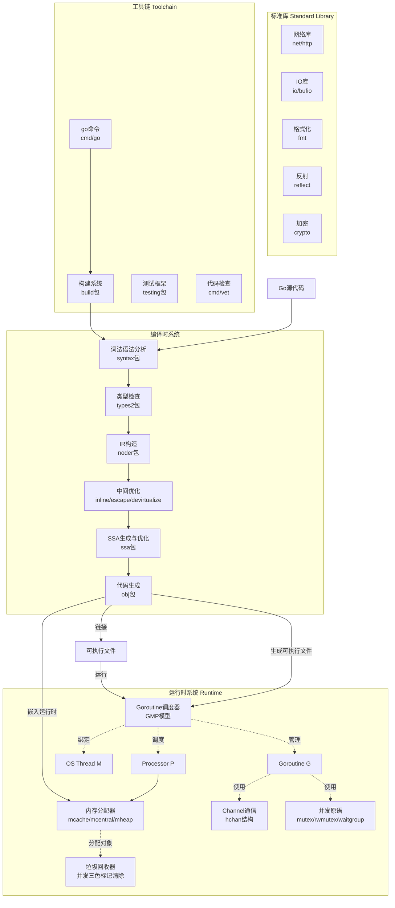
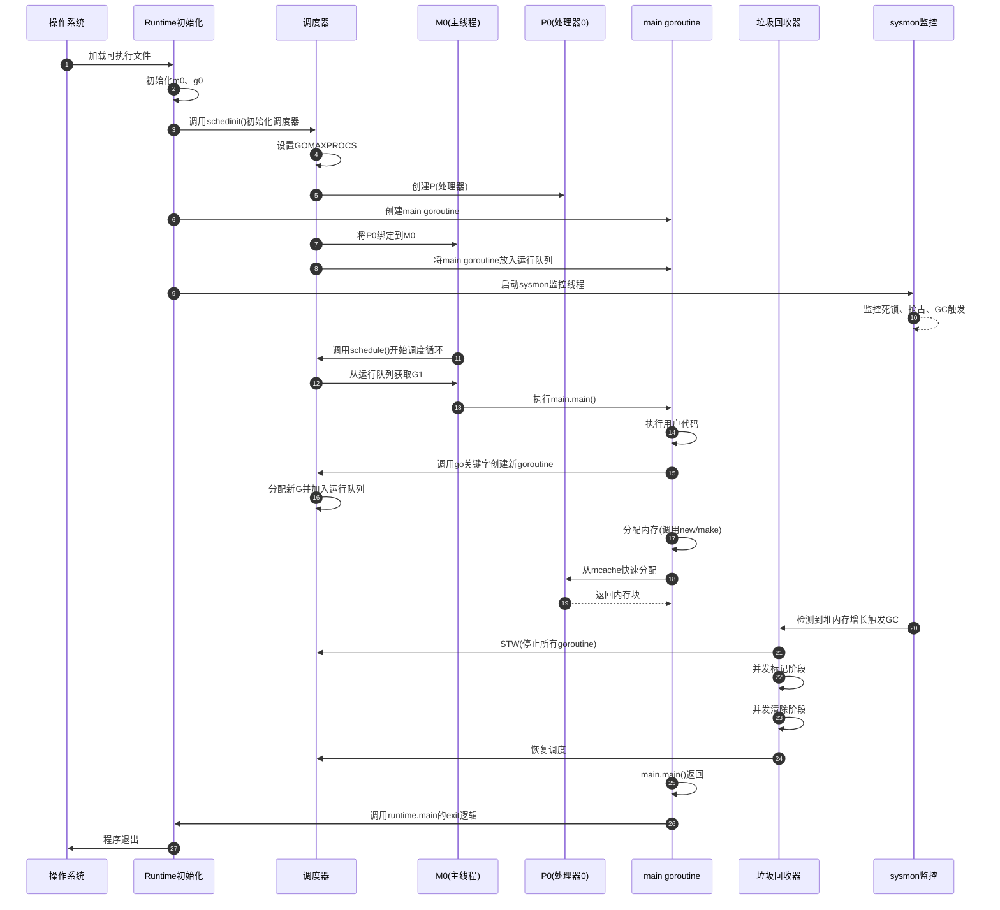

# Go语言源码剖析——总览

## 0. 摘要

### 项目
Go语言（也称Golang）是Google开发的开源编程语言，目标是实现简洁、高效、可靠的软件构建。Go语言的核心设计理念包括：并发编程的原生支持、快速编译、垃圾回收自动化、类型安全以及高性能的运行时系统。

### 问题域与核心能力边界

**核心能力**
- 编译系统：词法分析、语法分析、类型检查、中间表示转换、SSA优化、机器码生成
- 运行时系统：goroutine调度、内存管理、垃圾回收、channel通信、并发原语
- 标准库：网络、IO、加密、数据结构、文本处理等基础能力
- 工具链：构建工具(go build)、包管理(go mod)、测试框架(go test)等


### 运行环境
- **语言**：Go语言自身大部分用Go编写（自举），运行时关键路径使用汇编优化
- **运行时**：包含调度器、内存分配器、垃圾回收器等组件的运行时系统
- **依赖**：最小化外部依赖，核心仅依赖操作系统提供的线程、内存、系统调用等基础能力
- **部署形态**：编译为单一可执行文件，支持静态链接，可部署在服务器、容器、云环境等

## 1. 整体架构图



### 架构图说明

#### 组件职责与耦合关系

**编译时系统（Compile-time System）**
- 职责：将Go源代码转换为机器码
- 耦合：同步管道式处理，每个阶段产生的输出是下一阶段的输入
- 核心流程：源码 → 语法树 → 类型检查 → IR → SSA → 机器码

**运行时系统（Runtime System）**
- 职责：提供程序执行的基础设施
- 耦合：运行时组件相互协作，调度器协调所有运行时组件的工作
- 核心职能：goroutine调度、内存管理、垃圾回收、并发通信

**标准库（Standard Library）**
- 职责：提供常用功能的高质量实现
- 耦合：依赖运行时提供的基础能力，对外提供独立的包接口

**工具链（Toolchain）**
- 职责：辅助开发、构建、测试、分析
- 耦合：调用编译系统完成构建，独立的命令行工具集合

#### 数据流与控制流

**编译时数据流**
```
源码文件(.go) 
  → Token流
  → 语法树(AST) 
  → 类型信息(types2.Object)
  → IR节点(ir.Node)
  → SSA值(ssa.Value)
  → 汇编指令(obj.Prog)
  → 机器码(.o文件)
  → 可执行文件
```

**运行时控制流**
- Goroutine在M（OS线程）上执行，M必须绑定P（处理器）才能运行Go代码
- 调度器通过work-stealing算法在多个P之间分配goroutine
- 内存分配从P的本地cache（mcache）快速分配，缺失时向中心缓存（mcentral）申请
- GC并发运行，与用户goroutine协同工作

#### 高可用与扩展性

**高可用设计**
- Goroutine异常通过panic-recover机制处理，不影响其他goroutine
- 运行时的关键数据结构使用原子操作和锁保护
- Channel提供了可靠的通信机制，确保消息不丢失

**扩展性设计**
- P的数量决定了并行度（GOMAXPROCS），可根据CPU核心数调整
- 内存分配器采用多级缓存，减少锁竞争
- GC采用并发标记，减少STW（Stop-The-World）时间
- 编译器支持多种目标架构（amd64、arm64、wasm等）

#### 状态管理位置

**全局状态**
- `runtime.sched`：全局调度器状态，包括全局运行队列、空闲M列表、空闲P列表
- `runtime.mheap_`：全局堆，管理所有内存span

**P本地状态**
- `p.runq`：P的本地运行队列，存储待执行的goroutine
- `p.mcache`：P的本地内存缓存，用于快速分配小对象

**G本地状态**
- `g.stack`：goroutine的栈空间
- `g.sched`：goroutine的调度信息（PC、SP等寄存器）

**M本地状态**
- `m.g0`：M的系统栈goroutine，用于执行调度代码
- `m.curg`：M当前正在运行的用户goroutine

## 2. 全局时序图

### 典型Go程序启动与执行流程



### 时序图要点说明

#### 1. 启动初始化阶段（步骤1-8）
- **入口点**：操作系统加载可执行文件，从`_rt0_amd64_linux`等平台特定入口开始
- **初始化顺序**：m0(主线程) → g0(系统栈) → schedinit(调度器) → P列表 → main goroutine
- **资源分配**：根据GOMAXPROCS创建P，初始化内存分配器、GC参数
- **边界条件**：m0和g0是特殊的，在程序启动前就已存在，无需动态创建

#### 2. 监控线程启动（步骤9-10）
- **sysmon职责**：不绑定P运行，定期检查死锁、网络轮询、抢占长时间运行的goroutine、触发定时GC
- **运行模式**：独立M运行，不参与正常的goroutine调度
- **检查间隔**：初始20μs，最长10ms，使用指数退避算法

#### 3. 调度循环（步骤11-14）
- **schedule函数**：调度器核心，从运行队列中选择下一个可运行的goroutine
- **选择策略**：
  1. 每61次调度检查一次全局队列（防止饥饿）
  2. 优先从P的本地队列获取
  3. 本地队列为空时尝试从全局队列获取
  4. 全局队列为空时尝试从其他P偷取（work-stealing）
  5. 最后检查网络轮询器
- **执行切换**：通过`execute()`函数将G绑定到M，通过`gogo()`汇编函数恢复G的执行上下文

#### 4. Goroutine创建（步骤15-16）
- **go关键字**：编译器转换为`runtime.newproc`调用
- **G分配**：优先从P的本地缓存或全局缓存获取已分配的g结构，初始化栈和调度信息
- **入队策略**：新G优先放入P的runnext槽（下一个运行），原runnext的G移到本地队列
- **唤醒机制**：如果有空闲P且没有自旋的M，唤醒或创建新M

#### 5. 内存分配（步骤17-19）
- **分配路径**：
  - 微小对象(≤16B且无指针)：从P的tiny分配器分配
  - 小对象(≤32KB)：从P的mcache对应span分配
  - 大对象(>32KB)：直接从mheap分配
- **无锁分配**：mcache属于P，分配时无需加锁
- **refill机制**：mcache中的span用尽时，从mcentral获取新span

#### 6. 垃圾回收触发（步骤20-24）
- **触发条件**：
  - 堆内存增长达到目标（通过GOGC环境变量控制，默认100%）
  - 定时触发（2分钟未触发GC时）
  - 手动调用runtime.GC()
- **STW时机**：
  - 标记准备阶段：短暂STW，启用写屏障
  - 标记终止阶段：短暂STW，完成标记并关闭写屏障
- **并发阶段**：
  - 并发标记：与用户goroutine并发执行，使用写屏障保证正确性
  - 并发清除：回收未标记的内存span
- **辅助GC**：分配速度过快时，分配内存的goroutine需要辅助执行GC工作

#### 7. 程序退出（步骤25-27）
- **退出流程**：main.main返回 → runtime.main处理exit → 调用所有defer和finalizer → 调用exit(0)
- **资源清理**：执行延迟函数、finalizer、关闭trace、输出性能数据
- **退出码**：正常退出返回0，panic退出返回2

#### 关键设计要点

**幂等性**
- Goroutine创建是非幂等的，每次创建新的G
- 内存分配是非幂等的，每次返回新的内存块
- Channel发送/接收有状态变化，非幂等

**重试机制**
- 调度器在findRunnable中会循环尝试多种方式获取可运行G，直到找到或park
- Work-stealing失败后会再次检查其他队列，最多尝试4次
- 网络等待使用netpoll，不占用M

**超时控制**
- sysmon监控超时goroutine（>10ms），设置抢占标志
- Channel操作可结合select和time.After实现超时
- 网络IO操作有截止时间（deadline）机制

**资源上界**
- Goroutine数量：理论无限，实际受内存限制（每个G最少2KB栈）
- M数量：默认最大10000（GOMAXTHREADS），由sched.maxmcount控制
- P数量：等于GOMAXPROCS，默认等于CPU核心数
- 堆内存：受操作系统限制，64位系统理论上界巨大

## 3. 模块边界与交互图

### 核心模块列表

| 序号 | 模块名称 | 目录路径 | 对外API | 说明 |
|-----|---------|---------|---------|------|
| 01 | Goroutine调度器 | src/runtime/proc.go | newproc, goexit, Gosched | 管理goroutine的创建、调度、销毁 |
| 02 | 内存分配器 | src/runtime/malloc.go, mcache.go, mcentral.go, mheap.go | mallocgc, newobject | 提供内存分配和管理 |
| 03 | 垃圾回收器 | src/runtime/mgc.go, mbitmap.go | GC, SetFinalizer | 自动回收不再使用的内存 |
| 04 | Channel通信 | src/runtime/chan.go | makechan, chansend, chanrecv | 实现goroutine间通信 |
| 05 | 并发原语(sync) | src/sync/*.go | Mutex, RWMutex, WaitGroup, Once, Cond | 提供同步原语 |
| 06 | 接口与反射 | src/runtime/iface.go, src/reflect/*.go | 接口转换, reflect包 | 实现动态类型系统 |
| 07 | defer/panic/recover | src/runtime/panic.go | deferproc, panic, recover | 异常处理机制 |
| 08 | 编译器 | src/cmd/compile/*.go | Main(入口) | 将Go源码编译为机器码 |
| 09 | 链接器 | src/cmd/link/*.go | Main(入口) | 将目标文件链接为可执行文件 |
| 10 | go命令工具 | src/cmd/go/*.go | 命令行接口 | 构建、测试、管理包 |
| 11 | 网络库 | src/net/*.go | Listen, Dial, HTTP Server | 提供网络编程能力 |
| 12 | IO库 | src/io/*.go, src/bufio/*.go | Reader, Writer, Buffer | 提供IO抽象和缓冲 |
| 13 | 格式化 | src/fmt/*.go | Printf, Sprintf | 格式化输入输出 |
| 14 | 类型系统 | src/cmd/compile/internal/types/*.go | 类型表示 | 编译时类型检查 |

### 模块交互矩阵

| 调用方 → 被调方 | 调度器 | 内存分配器 | GC | Channel | sync包 | 接口 | panic | 编译器 | 网络库 |
|----------------|-------|----------|-----|---------|-------|------|-------|--------|-------|
| **调度器** | - | 创建G时分配栈 | 配合STW | gopark/goready | gopark/goready | 接口转换 | panic触发调度 | 生成调度代码 | netpoll集成 |
| **内存分配器** | 从P获取mcache | - | 写屏障、标记辅助 | 分配channel | 分配锁结构 | 分配iface | 分配panic对象 | 生成分配代码 | 分配连接对象 |
| **GC** | STW协调 | 扫描堆 | - | 扫描channel | 扫描锁 | 扫描iface指针 | - | 生成写屏障 | 扫描网络buf |
| **Channel** | gopark/goready | 分配hchan | 被扫描 | - | 内部用锁 | - | close时panic | 语法糖展开 | - |
| **sync包** | gopark/goready | 分配对象 | 被扫描 | Cond用chan | - | - | 双重解锁panic | 竞争检测插桩 | - |
| **网络库** | 阻塞时gopark | 分配buffer | 被扫描 | - | 并发控制 | 接口抽象 | 错误处理 | - | - |

### 交互模式说明

#### 同步调用
- 调度器调用内存分配器：`mallocgc`分配G的栈空间
- Channel发送调用调度器：`gopark`使发送goroutine休眠
- 编译器生成调用运行时函数：`newobject`、`makechan`等

#### 异步消息
- netpoll通知调度器：网络就绪时将G加入运行队列
- GC触发通过信号：sysmon检测到堆增长，设置gcTrigger

#### 共享存储
- P通过mcache访问内存：所有从P运行的G共享mcache
- 全局调度器状态：`runtime.sched`被所有M访问（需要锁）

#### 订阅/发布
- runtime.SetFinalizer：对象回收时通知
- sysmon周期性检查：定时触发各种检查和清理

## 4. 关键设计与权衡

### 数据一致性

#### 强一致性保证
- **Mutex/RWMutex**：提供互斥访问，保证临界区内的强一致性
- **Atomic操作**：保证单个变量的原子读写，提供内存顺序保证
- **Channel的happens-before**：发送happens-before接收完成

#### 最终一致性场景
- **Work-stealing**：调度器的work-stealing可能出现短暂的load不均衡，最终会平衡
- **GC标记**：并发标记过程中对象可达性判断基于快照，写屏障保证不漏标

### 事务边界

**无事务机制**
- Go runtime不提供事务语义
- 需要事务的场景在应用层实现（如使用Mutex保护的临界区）

**原子操作边界**
- 单个原子操作（atomic包）是原子性的
- 复合操作需要使用锁或CAS循环保证原子性

### 锁与并发策略

#### 细粒度锁
- **P的本地队列**：无需锁，单P独占
- **mcentral**：每个size class一个锁
- **hchan**：每个channel一个锁

#### 无锁算法
- **P的mcache**：无锁快速分配
- **原子操作**：sched.nmspinning等计数器
- **Work-stealing**：使用原子操作CAS

#### 全局锁
- **sched.lock**：保护全局调度器状态
- **mheap_.lock**：保护全局堆结构

#### 锁的避免策略
- **P本地化**：将共享状态绑定到P，避免锁竞争
- **批量操作**：一次性从全局队列获取多个G
- **分代设计**：mcache → mcentral → mheap逐级缓存

### 性能关键路径

#### 热路径优化
1. **Goroutine切换**
   - 使用汇编实现的`gogo`函数，极致性能
   - P的runnext槽提供快速路径，减少队列操作

2. **小对象分配**
   - Tiny对象合并分配（<16B无指针）
   - mcache无锁快速路径
   - Size class预分类，减少查找

3. **Channel通信**
   - 直接传递（bypass buffer）：发送方直接将数据复制到接收方
   - Fast path：非阻塞检查在加锁前完成

#### P95延迟控制
- GC的STW时间目标：<1ms
- Goroutine调度延迟：μs级别
- Work-stealing保证负载均衡

#### 内存峰值
- 每个P的mcache：约4MB（136个span class，每个约32KB）
- 每个G的栈：最小2KB，最大1GB（64位）
- GC目标：堆内存增长不超过上次GC后的2倍（GOGC=100）

#### I/O热点
- **网络I/O**：使用epoll/kqueue等高效多路复用
- **磁盘I/O**：使用系统调用，M进入系统调用时释放P
- **内存I/O**：写屏障开销，GC时约10-30%性能影响

### 可观测性指标

#### 运行时指标（runtime/metrics）
- `go_goroutines`：当前goroutine数量
- `go_threads`：OS线程数
- `go_gc_duration_seconds`：GC暂停时间
- `go_memstats_heap_alloc_bytes`：堆内存分配量
- `go_memstats_heap_inuse_bytes`：堆内存使用量

#### 调度器指标
- `sched.nmspinning`：自旋M的数量
- `sched.nmidle`：空闲M的数量
- `sched.npidle`：空闲P的数量
- `runq.size`：全局运行队列长度

#### GC指标
- GC次数（NumGC）
- GC暂停时间（PauseNs）
- 堆大小（HeapAlloc、HeapSys）
- GC CPU占用率（GCCPUFraction）

### 配置项

#### 环境变量
- **GOMAXPROCS**：P的数量，默认CPU核心数
- **GOGC**：GC触发阈值，默认100（堆增长100%触发）
- **GOMEMLIMIT**：内存软上限，辅助GC决策
- **GODEBUG**：调试选项，如`gctrace=1`输出GC信息

#### 可调参数
- `runtime.GOMAXPROCS(n)`：动态调整P数量
- `debug.SetGCPercent(n)`：动态调整GC触发阈值
- `debug.SetMaxStack(n)`：设置goroutine最大栈大小
- `debug.SetMaxThreads(n)`：设置最大M数量

#### 性能影响
- GOMAXPROCS过大：调度开销增加、缓存miss增加
- GOMAXPROCS过小：并行度不足
- GOGC过小：GC过于频繁
- GOGC过大：内存占用过多

## 5. 典型使用示例与最佳实践

### 示例1：最小可运行入口

```go
package main

import (
    "fmt"
    "runtime"
)

func main() {
    // 输出Go版本和架构
    fmt.Printf("Go Version: %s\n", runtime.Version())
    fmt.Printf("GOOS: %s, GOARCH: %s\n", runtime.GOOS, runtime.GOARCH)
    fmt.Printf("NumCPU: %d, GOMAXPROCS: %d\n", 
        runtime.NumCPU(), runtime.GOMAXPROCS(0))
    
    // 启动一个goroutine
    done := make(chan bool)
    go func() {
        fmt.Println("Hello from goroutine")
        done <- true
    }()
    <-done
    
    // 输出内存统计
    var m runtime.MemStats
    runtime.ReadMemStats(&m)
    fmt.Printf("Alloc: %v MB, TotalAlloc: %v MB, Sys: %v MB, NumGC: %v\n",
        m.Alloc/1024/1024, m.TotalAlloc/1024/1024, 
        m.Sys/1024/1024, m.NumGC)
}
```

**说明**
- 展示Go程序基本结构：包声明、导入、main函数
- 演示goroutine创建与同步：使用channel进行通信
- 获取运行时信息：通过runtime包查询系统状态

**适用场景**
- 学习Go语言入门
- 验证Go环境配置
- 调试运行时参数

### 示例2：并发Worker池模式

```go
package main

import (
    "fmt"
    "sync"
    "time"
)

// Job 表示工作任务
type Job struct {
    ID   int
    Data string
}

// Result 表示任务结果
type Result struct {
    Job Job
    Sum int
}

// Worker处理任务
func worker(id int, jobs <-chan Job, results chan<- Result, wg *sync.WaitGroup) {
    defer wg.Done()
    for job := range jobs {
        // 模拟任务处理
        sum := 0
        for _, c := range job.Data {
            sum += int(c)
        }
        results <- Result{Job: job, Sum: sum}
    }
}

func main() {
    numWorkers := 3
    numJobs := 10
    
    jobs := make(chan Job, numJobs)
    results := make(chan Result, numJobs)
    
    // 启动worker池
    var wg sync.WaitGroup
    for i := 1; i <= numWorkers; i++ {
        wg.Add(1)
        go worker(i, jobs, results, &wg)
    }
    
    // 发送任务
    go func() {
        for i := 1; i <= numJobs; i++ {
            jobs <- Job{ID: i, Data: fmt.Sprintf("task-%d", i)}
        }
        close(jobs)
    }()
    
    // 等待所有worker完成
    go func() {
        wg.Wait()
        close(results)
    }()
    
    // 收集结果
    for result := range results {
        fmt.Printf("Job %d result: %d\n", result.Job.ID, result.Sum)
    }
}
```

**说明**
- 固定数量的worker goroutine处理任务
- 使用buffered channel作为任务队列
- WaitGroup确保所有worker完成
- 结果通过channel返回

**适用场景**
- 并发处理大量独立任务
- 限制并发数量，避免资源耗尽
- 网络爬虫、批量数据处理

**最佳实践**
- Worker数量根据CPU核心数或IO密集度调整
- 使用buffered channel平滑任务提交
- 妥善关闭channel避免goroutine泄露

### 示例3：Context超时与取消

```go
package main

import (
    "context"
    "fmt"
    "time"
)

func operation(ctx context.Context, duration time.Duration) error {
    select {
    case <-time.After(duration):
        return nil
    case <-ctx.Done():
        return ctx.Err()
    }
}

func main() {
    // 示例1：超时控制
    ctx1, cancel1 := context.WithTimeout(context.Background(), 2*time.Second)
    defer cancel1()
    
    if err := operation(ctx1, 1*time.Second); err != nil {
        fmt.Println("操作失败:", err)
    } else {
        fmt.Println("操作成功完成")
    }
    
    // 示例2：主动取消
    ctx2, cancel2 := context.WithCancel(context.Background())
    
    go func() {
        time.Sleep(500 * time.Millisecond)
        cancel2() // 主动取消
    }()
    
    if err := operation(ctx2, 2*time.Second); err != nil {
        fmt.Println("操作被取消:", err)
    }
}
```

**说明**
- Context提供超时、取消、传值能力
- select配合ctx.Done()实现优雅退出
- defer cancel()确保资源释放

**适用场景**
- HTTP请求超时控制
- 级联取消（父context取消，子context自动取消）
- 跨goroutine传递请求范围的值

**注意事项**
- 总是调用cancel函数，即使context已过期
- 不要将context存储在结构体中
- context.Value应只用于请求范围的数据

---

*完整的模块级文档请参阅后续章节的详细剖析。*

---

## 补充：Go 运行时核心机制与优化实践

### GMP 调度器深度解析

- **核心组件**：
  - **G (Goroutine)**：用户级轻量线程，包含执行栈（2KB 起始，最大 1GB）、程序计数器、调度上下文。
  - **M (Machine)**：OS 线程抽象，执行 G，默认最大数量 10000。
  - **P (Processor)**：逻辑处理器，维护本地运行队列（容量 256），数量等于 `GOMAXPROCS`。

- **调度策略**：
  - **本地队列优先**：P 优先从本地队列获取 G，无锁高效。
  - **工作窃取（Work Stealing）**：本地队列为空时，从其他 P 的队列窃取一半 G。
  - **全局队列平衡**：定期（每 61 次调度）从全局队列获取 G，防止饥饿。
  - **网络轮询器集成**：epoll/kqueue 集成到调度器，就绪后唤醒等待的 G。

- **抢占机制**：
  - **协作式抢占**：函数调用时检查栈扩展标记（`stackguard0`），主动让出。
  - **异步抢占（Go 1.14+）**：使用信号（SIGURG）中断长时间运行的 G，防止饥饿。
  - **系统调用抢占**：G 进入系统调用时，P 与 M 解绑，调度其他 G。

- **优化建议**：
  - 设置合理的 `GOMAXPROCS`（默认等于 CPU 核数）。
  - 避免长时间阻塞系统调用，使用 `runtime.LockOSThread` 绑定线程。
  - 减少 goroutine 数量爆炸，使用 worker pool 限制并发。

### 内存管理多层架构

- **分配层次**：
  - **mcache（P 级缓存）**：每个 P 独占，无锁分配，包含 67 个 size class 的 mspan。
  - **mcentral（全局中心缓存）**：多个 P 共享，按 size class 组织，使用互斥锁保护。
  - **mheap（全局堆）**：管理大块内存，使用页分配器（radix tree）分配页面。

- **对象分类**：
  - **Tiny 对象（< 16B）**：多个对象合并到同一 16B 块，减少碎片。
  - **小对象（16B - 32KB）**：从 mcache 的对应 size class 分配。
  - **大对象（> 32KB）**：直接从 mheap 分配，绕过 mcache。

- **内存结构**：
  - **mspan**：连续页面的集合，包含对象大小、已分配位图、GC 标记位图。
  - **arena**：64MB 内存区域，由多个 8KB 页面组成。
  - **heapArena**：管理单个 arena 的元数据（spans、bitmap）。

- **优化技巧**：
  - 对象复用：使用 `sync.Pool` 缓存临时对象，减少分配。
  - 预分配切片：`make([]T, 0, capacity)` 避免多次扩容。
  - 逃逸分析：保持对象在栈上分配，避免堆分配（`go build -gcflags="-m"`）。

### 垃圾回收（GC）机制

- **三色标记算法**：
  - **白色**：未扫描对象，GC 结束后回收。
  - **灰色**：已扫描但子对象未扫描，待处理队列。
  - **黑色**：已扫描且子对象已扫描，存活对象。

- **GC 阶段**：
  - **标记准备（STW）**：启动 GC，启用写屏障（Write Barrier）。
  - **并发标记**：与应用并发执行，标记可达对象。
  - **标记终止（STW）**：完成标记，禁用写屏障，清理辅助标记。
  - **清扫**：并发回收白色对象，归还内存。

- **写屏障**：
  - **目的**：防止黑色对象引用白色对象（破坏三色不变性）。
  - **混合写屏障（Go 1.8+）**：结合插入写屏障和删除写屏障，减少 STW 时间。

- **GC 触发条件**：
  - **堆增长率**：默认堆大小达到上次 GC 后的 2 倍（`GOGC=100`）。
  - **定时触发**：2 分钟未执行 GC 时强制触发。
  - **手动触发**：`runtime.GC()` 主动触发。

- **GC 调优**：
  - 调整 `GOGC`：`GOGC=200` 减少 GC 频率，增加内存使用。
  - 软内存限制（Go 1.19+）：`GOMEMLIMIT` 限制堆内存上限。
  - 减少指针数量：使用 `[]byte` 代替 `[]string`，减少 GC 扫描。
  - 对象池化：`sync.Pool` 缓存大对象，减轻 GC 压力。

### 并发原语实现

- **Mutex（互斥锁）**：
  - **正常模式**：FIFO 等待队列，新到 goroutine 尝试自旋获取锁。
  - **饥饿模式**：等待超过 1ms 进入饥饿模式，直接传递给队首 goroutine。
  - **自旋优化**：活跃自旋（Active Spinning）最多 4 次，减少上下文切换。

- **RWMutex（读写锁）**：
  - 多个读者并发读，单个写者独占写。
  - **写者优先**：有写者等待时，新读者阻塞，防止写者饥饿。
  - **readerCount**：记录读者数量，写者获取锁时将其设为负数。

- **Channel**：
  - **环形缓冲区**：固定大小队列存储数据。
  - **发送/接收队列**：goroutine 等待队列，阻塞时加入队列。
  - **无锁优化**：单生产者/单消费者场景下无锁快速路径。
  - **关闭语义**：关闭后所有接收操作返回零值，多次关闭 panic。

- **WaitGroup**：
  - **计数器**：记录待完成任务数，原子操作保证线程安全。
  - **等待队列**：`Wait()` 阻塞的 goroutine 队列。
  - **注意**：`Add()` 必须在 `Wait()` 之前调用，避免竞态。

- **sync.Pool**：
  - **本地池（P 级）**：每个 P 独占，无锁访问。
  - **共享池**：多个 P 共享，使用互斥锁。
  - **GC 清理**：每次 GC 清空池中所有对象，避免内存泄漏。

### 网络轮询器（Netpoller）

- **事件驱动**：基于 epoll（Linux）/kqueue（BSD）/IOCP（Windows），非阻塞 IO。
- **集成调度器**：网络 IO 就绪后，唤醒等待的 goroutine 加入运行队列。
- **边缘触发**：避免惊群效应，多个 goroutine 等待同一 fd 时只唤醒一个。
- **超时处理**：定时器集成到 netpoller，支持 IO 超时。

### 编译器优化

- **逃逸分析**：
  - 分析对象是否逃逸到堆，未逃逸对象分配在栈上。
  - 逃逸场景：返回局部变量指针、闭包捕获、接口赋值、切片扩容。

- **内联优化**：
  - 小函数（< 80 Cost）内联到调用点，减少函数调用开销。
  - 禁用内联：`//go:noinline` 注释或 `-gcflags="-l"`。

- **死码消除**：删除不可达代码，减少二进制体积。

- **常量折叠**：编译时计算常量表达式。

- **边界检查消除**：循环中已证明不越界的数组访问，消除边界检查。

### 性能分析与调优

- **pprof 性能分析**：
  - CPU profile：`go tool pprof http://localhost:6060/debug/pprof/profile?seconds=30`。
  - 内存 profile：`go tool pprof http://localhost:6060/debug/pprof/heap`。
  - goroutine profile：`go tool pprof http://localhost:6060/debug/pprof/goroutine`。
  - 火焰图：`go tool pprof -http=:8080 profile`。

- **trace 追踪**：
  - 记录程序执行事件：goroutine 创建/销毁、系统调用、GC、网络 IO。
  - 分析并发瓶颈、GC 停顿、调度延迟。
  - 使用：`go tool trace trace.out`。

- **benchmark 基准测试**：
  - `go test -bench=. -benchmem`：测试性能和内存分配。
  - `-cpuprofile`、`-memprofile` 生成 profile 文件。

- **runtime 指标**：
  - `runtime.NumGoroutine()`：当前 goroutine 数量。
  - `runtime.ReadMemStats()`：内存统计（堆大小、GC 次数、暂停时间）。

### 常见性能问题

- **goroutine 泄漏**：未退出的 goroutine 占用内存，使用 context 取消或超时。
- **频繁内存分配**：大量临时对象触发 GC，使用对象池或预分配。
- **锁竞争**：高并发下锁争用严重，使用分段锁或无锁数据结构。
- **false sharing**：多个 goroutine 写入相邻内存，导致缓存失效，填充结构体对齐到缓存行（64 字节）。
- **大对象拷贝**：值传递大结构体，使用指针传递。

