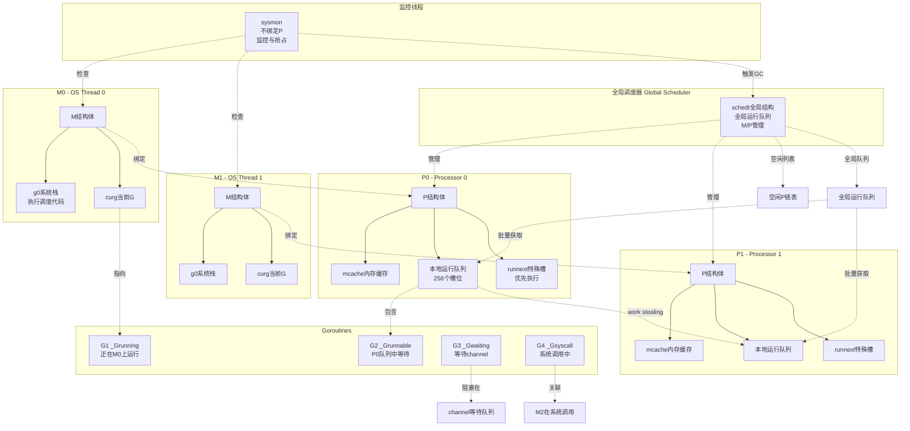

# Go语言源码剖析——Goroutine调度器概览

## 模块概述

### 职责定义
Goroutine调度器是Go运行时系统的核心组件，负责管理成千上万个goroutine的创建、执行、切换和销毁。调度器实现了Go语言最重要的特性之一：轻量级并发。与操作系统线程相比，goroutine的创建成本低、内存占用小、切换开销小，使得Go程序能够轻松处理大规模并发任务。

### 输入与输出

**输入**

- 用户代码中的`go`关键字：触发新goroutine创建
- 阻塞操作（channel、锁、系统调用等）：触发goroutine切换
- 时间片到期：触发抢占式调度
- 系统调用返回：goroutine重新进入运行队列

**输出**

- Goroutine状态转换：在不同状态（运行、就绪、等待）之间切换
- CPU资源分配：决定哪个goroutine在哪个线程上执行
- 负载均衡：通过work-stealing实现任务分布
- 性能指标：调度延迟、goroutine数量、队列长度等

### 上下游依赖

**依赖的下游组件**

- **OS线程（M）**：调度器需要OS线程来执行goroutine
- **内存分配器**：创建goroutine需要分配栈空间
- **定时器**：实现time.Sleep等定时功能
- **网络轮询器（netpoll）**：处理网络I/O事件

**被依赖的上游组件**

- **Channel实现**：阻塞的发送/接收操作调用`gopark`和`goready`
- **Sync包**：锁的等待和唤醒依赖调度器
- **垃圾回收器**：GC的STW需要调度器协调
- **Runtime系统调用**：所有运行时功能都依赖调度器

### 生命周期

#### 初始化阶段
1. **程序启动**：从`_rt0_amd64_linux`等入口开始
2. **创建m0和g0**：m0是主线程，g0是其系统栈
3. **调用schedinit()**：初始化调度器全局状态
4. **创建P列表**：根据GOMAXPROCS创建处理器
5. **创建main goroutine**：运行runtime.main和用户main.main

#### 运行阶段
1. **schedule()循环**：M不断从队列中获取可运行的G
2. **execute()**：将选中的G绑定到M并执行
3. **gogo()**：汇编实现的上下文切换
4. **mcall()**：切换到g0栈执行调度函数
5. **park/ready**：goroutine的阻塞和唤醒

#### 退出阶段
1. **main goroutine返回**：触发程序退出流程
2. **执行延迟函数**：所有defer和finalizer
3. **关闭所有M**：停止调度循环
4. **操作系统退出**：调用exit()

## 模块架构图



### 架构图说明

#### GMP三者关系

**G (Goroutine)**

- 表示一个goroutine，是Go程序的执行单元
- 包含栈、程序计数器（PC）、状态、ID等信息
- 可以在不同的M上执行
- 状态：`_Gidle`（刚分配）、`_Grunnable`（就绪）、`_Grunning`（运行）、`_Gsyscall`（系统调用）、`_Gwaiting`（等待）、`_Gdead`（已完成）

**M (Machine/OS Thread)**

- 代表一个操作系统线程，是执行的实体
- 必须绑定P才能执行Go代码
- 每个M有一个g0，用于执行调度和运行时代码
- M的数量可以动态增减，但有上限（默认10000）

**P (Processor)**

- 代表执行Go代码所需的资源
- 数量固定，等于GOMAXPROCS（默认CPU核心数）
- 拥有本地运行队列、内存缓存等资源
- 是调度的核心，M需要持有P才能运行G

#### 核心数据结构关系

**全局调度器（schedt）**

```go
type schedt struct {
    lock mutex                  // 保护全局状态的锁
    midle        muintptr       // 空闲M链表
    nmidle       int32          // 空闲M数量
    nmspinning   atomic.Int32   // 自旋M数量
    pidle        puintptr       // 空闲P链表
    npidle       atomic.Int32   // 空闲P数量
    runq gQueue                 // 全局运行队列
    // ... 其他字段
}
```

**P结构体（p）**

```go
type p struct {
    id          int32           // P的ID
    status      uint32          // P的状态
    m           muintptr        // 绑定的M
    mcache      *mcache         // 内存分配缓存
    runqhead uint32            // 本地队列头
    runqtail uint32            // 本地队列尾
    runq     [256]guintptr     // 本地运行队列
    runnext  guintptr           // 优先运行的G
    // ... 其他字段
}
```

**M结构体（m）**

```go
type m struct {
    g0      *g        // 系统栈goroutine
    curg    *g        // 当前运行的goroutine
    p       puintptr  // 绑定的P
    nextp   puintptr  // 即将绑定的P
    spinning bool     // 是否处于自旋状态
    // ... 其他字段
}
```

**G结构体（g）**

```go
type g struct {
    stack       stack         // 栈边界
    stackguard0 uintptr      // 栈溢出检查
    sched       gobuf        // 调度信息（SP、PC、BP）
    atomicstatus atomic.Uint32  // G的状态
    goid        uint64       // Goroutine ID
    m           *m           // 当前运行的M
    // ... 其他字段
}
```

#### 调度流程边界

**本地队列与全局队列**

- 本地队列：P私有，无锁访问，容量256
- 全局队列：所有P共享，需要加锁，容量无限
- 平衡策略：每61次调度检查一次全局队列，防止饥饿

**自旋与非自旋**

- 自旋M：正在寻找可运行G的M，占用CPU
- 非自旋M：等待工作的M，不占用CPU
- 自旋限制：最多GOMAXPROCS个M自旋，避免CPU浪费

**抢占与协作**

- 协作式：goroutine主动让出CPU（调用runtime.Gosched）
- 抢占式：运行超过10ms的goroutine被强制抢占
- 信号抢占：Go 1.14后使用信号实现真正的抢占

#### 扩展点设计

**动态M管理**

- M阻塞在系统调用时，自动创建新M补充
- M空闲时间过长会被销毁（节省资源）
- M数量受maxmcount限制，防止线程爆炸

**P的可调整性**

- 运行时可通过`runtime.GOMAXPROCS(n)`调整P数量
- 调整时需要STW，重新分配G和P的绑定关系
- P的数量影响并行度和调度开销

**Work Stealing算法**

- 本地队列为空时，尝试从其他P偷取一半的G
- 偷取顺序：随机选择P，减少竞争
- 最多尝试4次，失败则检查全局队列和netpoll

#### 状态持有位置

**P的本地状态**

- 运行队列：`p.runq`和`p.runnext`
- 内存缓存：`p.mcache`
- defer池：`p.deferpool`
- timer堆：`p.timers`

**M的本地状态**

- 当前G：`m.curg`
- 系统栈：`m.g0`
- 绑定的P：`m.p`
- 自旋标志：`m.spinning`

**G的独立状态**

- 栈空间：`g.stack`
- 调度上下文：`g.sched`（PC、SP、BP）
- 等待原因：`g.waitreason`
- 等待结构：`g.waiting`（sudog链表）

#### 资源占用要点

**内存占用**

- 每个G：最小2KB栈（可增长到最大1GB）
- 每个M：约8KB（包括g0栈）
- 每个P：约4MB（mcache + 其他缓存）
- 理论上可创建数百万goroutine（受总内存限制）

**CPU占用**

- 自旋M占用CPU：100%
- 非自旋M：不占CPU
- 调度开销：上下文切换约200ns
- Work-stealing开销：每次偷取需要原子操作和可能的锁竞争

**调度延迟**

- 理想情况：μs级
- 高负载：本地队列满时，需要访问全局队列（加锁）
- 最坏情况：所有P的队列都满，新G被放入全局队列，等待下一轮调度

## 核心算法

### schedule()调度主循环

**算法目的**
为当前M选择下一个要运行的goroutine。这是调度器的核心函数，永不返回。

**算法流程**

```go
func schedule() {
    mp := getg().m
    
top:
    pp := mp.p.ptr()
    
    // 1. 每61次检查一次全局队列，防止全局队列饥饿
    if gp == nil && pp.schedtick%61 == 0 {
        gp = globrunqget(pp, 1)
    }
    
    // 2. 尝试从P的本地队列获取G
    if gp == nil {
        gp, inheritTime, tryWakeP = findRunnable()
    }
    
    // 3. 执行选中的G
    execute(gp, inheritTime)
}
```

**完整源码分析**（`src/runtime/proc.go:schedule()`）

```go
func schedule() {
    mp := getg().m

    // 前置检查：不应该持有锁
    if mp.locks != 0 {
        throw("schedule: holding locks")
    }

    // 处理锁定到特定M的goroutine
    if mp.lockedg != 0 {
        stoplockedm()
        execute(mp.lockedg.ptr(), false)
    }

top:
    pp := mp.p.ptr()
    pp.preempt = false

    // 安全点检查
    if sched.gcwaiting.Load() {
        gcstopm()
        goto top
    }

    // 运行finalizer
    if fingStatus.Load()&(fingWait|fingWake) == fingWait|fingWake {
        if gp := wakefing(); gp != nil {
            ready(gp, 0, true)
        }
    }

    // 1. 每61次调度检查一次全局队列
    if pp.schedtick%61 == 0 && sched.runqsize > 0 {
        lock(&sched.lock)
        gp = globrunqget(pp, 1)
        unlock(&sched.lock)
        if gp != nil {
            execute(gp, false)
        }
    }

    // 2. 查找可运行的goroutine
    gp, inheritTime, tryWakeP = findRunnable()

    // 3. 执行goroutine
    execute(gp, inheritTime)
}
```

**算法复杂度**

- 时间复杂度：O(1) ~ O(P)
  - 本地队列访问：O(1)
  - Work-stealing：O(P)，需要遍历所有P
- 空间复杂度：O(1)
  - 只使用栈空间，不分配堆内存

**算法上界**

- 最大尝试次数：4轮work-stealing
- 最大自旋M数：min(GOMAXPROCS, 运行中M数)
- 队列长度上界：本地256，全局无限

### findRunnable()查找可运行G

**算法目的**
为M查找一个可运行的G。这个函数会尝试多种方式，直到找到G或者park。

**核心代码**（`src/runtime/proc.go:findRunnable()`）

```go
func findRunnable() (gp *g, inheritTime, tryWakeP bool) {
    mp := getg().m
    pp := mp.p.ptr()

top:
    // 1. 检查GC waiting
    if sched.gcwaiting.Load() {
        gcstopm()
        goto top
    }

    // 2. 检查本地运行队列
    if gp, inheritTime := runqget(pp); gp != nil {
        return gp, inheritTime, false
    }

    // 3. 检查全局运行队列
    if sched.runqsize != 0 {
        lock(&sched.lock)
        gp := globrunqget(pp, 0)
        unlock(&sched.lock)
        if gp != nil {
            return gp, false, false
        }
    }

    // 4. 网络轮询器检查
    if netpollinited() && netpollAnyWaiters() {
        list, delta := netpoll(0)
        if !list.empty() {
            gp := list.pop()
            injectglist(&list)
            return gp, false, true
        }
    }

    // 5. Work-stealing：从其他P偷取
    procs := uint32(gomaxprocs)
    if mp.spinning || 2*sched.nmspinning.Load() < procs-sched.npidle.Load() {
        if !mp.spinning {
            mp.becomeSpinning()
        }
        
        // 随机遍历所有P
        offset := fastrandn(procs)
        for i := uint32(0); i < procs; i++ {
            p2 := allp[(offset+i)%procs]
            if p2 == pp {
                continue
            }
            
            // 偷取p2本地队列的一半
            if gp := runqsteal(pp, p2, false); gp != nil {
                return gp, false, false
            }
        }
    }

    // 6. 再次检查全局队列
    // （此处省略重复逻辑）

    // 7. 没有工作，park当前M
    stopm()
    goto top
}
```

**算法逐步说明**

1. **检查GC waiting**
   - 如果GC需要STW，配合停止
   - 避免在GC期间调度新G

2. **本地队列优先**
   - 从`pp.runnext`获取优先G
   - 或从本地队列头部获取
   - 无锁操作，最快路径

3. **全局队列平衡**
   - 每次从全局队列批量获取多个G
   - 数量：`min(len(sched.runq)/P个数 + 1, len(pp.runq)/2)`
   - 防止全局队列饥饿

4. **网络轮询**
   - 检查是否有网络I/O就绪
   - 将就绪的G加入运行队列
   - 返回其中一个G

5. **Work Stealing核心**
   - 随机选择起始P，减少冲突
   - 遍历所有其他P
   - 尝试偷取其本地队列的一半
   - 最多尝试4轮（每轮遍历所有P）

6. **最终检查**
   - 再次检查全局队列
   - 检查netpoll（阻塞模式）
   - 确保没有遗漏的工作

7. **Park M**
   - 所有尝试都失败后，park当前M
   - M进入idle列表
   - 等待新工作到来时被唤醒

**Work Stealing详细逻辑**

```go
func runqsteal(pp, p2 *p, stealRunNextG bool) *g {
    t := pp.runqtail
    n := runqgrab(p2, &pp.runq, t, stealRunNextG)
    if n == 0 {
        return nil
    }
    n--
    gp := pp.runq[(t+n)%uint32(len(pp.runq))].ptr()
    if n == 0 {
        return gp
    }
    h := atomic.LoadAcq(&pp.runqhead)
    if t-h+n >= uint32(len(pp.runq)) {
        throw("runqsteal: runq overflow")
    }
    atomic.StoreRel(&pp.runqtail, t+n)
    return gp
}

func runqgrab(pp *p, batch *[256]guintptr, batchHead uint32, stealRunNextG bool) uint32 {
    for {
        h := atomic.LoadAcq(&pp.runqhead)
        t := atomic.LoadAcq(&pp.runqtail)
        n := t - h
        n = n - n/2  // 偷取一半
        if n == 0 {
            if stealRunNextG {
                // 尝试偷取runnext
                if next := pp.runnext; next != 0 {
                    if pp.status == _Prunning {
                        // 只有在P不运行时才偷取runnext
                        return 0
                    }
                    if !pp.runnext.cas(next, 0) {
                        continue
                    }
                    batch[batchHead%uint32(len(batch))] = next
                    return 1
                }
            }
            return 0
        }
        
        // 批量复制G
        for i := uint32(0); i < n; i++ {
            g := pp.runq[(h+i)%uint32(len(pp.runq))]
            batch[(batchHead+i)%uint32(len(batch))] = g
        }
        
        if atomic.CasRel(&pp.runqhead, h, h+n) {
            return n
        }
    }
}
```

**优化要点**

- 随机起始位置：减少多个M偷取同一个P的冲突
- 偷取一半：既保证窃取者有足够工作，又不让被偷者饿死
- CAS操作：无锁实现，提高性能
- 批量操作：一次偷取多个G，减少原子操作次数

### execute()执行goroutine

**算法目的**
将选中的G绑定到M并开始执行。

**核心代码**

```go
func execute(gp *g, inheritTime bool) {
    mp := getg().m
    
    // 绑定G和M
    mp.curg = gp
    gp.m = mp
    casgstatus(gp, _Grunnable, _Grunning)
    gp.waitsince = 0
    gp.preempt = false
    gp.stackguard0 = gp.stack.lo + stackGuard
    
    if !inheritTime {
        mp.p.ptr().schedtick++
    }

    // 跳转到G的代码
    gogo(&gp.sched)
}
```

**gogo汇编实现**（`src/runtime/asm_amd64.s`）

```asm
TEXT runtime·gogo(SB), NOSPLIT, $0-8
    MOVQ    buf+0(FP), BX       // 获取gobuf指针
    MOVQ    gobuf_g(BX), DX
    MOVQ    0(DX), CX           // 确保G不为nil
    JMP     gogo<>(SB)

TEXT gogo<>(SB), NOSPLIT, $0
    get_tls(CX)
    MOVQ    DX, g(CX)           // 设置g到TLS
    MOVQ    gobuf_sp(BX), SP    // 恢复SP
    MOVQ    gobuf_ret(BX), AX
    MOVQ    gobuf_ctxt(BX), DX
    MOVQ    gobuf_bp(BX), BP
    MOVQ    $0, gobuf_sp(BX)    // 清除gobuf
    MOVQ    $0, gobuf_bp(BX)
    MOVQ    gobuf_pc(BX), BX    // 获取PC
    JMP     BX                  // 跳转到G的代码
```

### newproc()创建goroutine

**算法目的**
创建新的goroutine，分配栈空间，初始化调度信息。

**核心代码**

```go
func newproc(fn *funcval) {
    gp := getg()
    pc := getcallerpc()
    systemstack(func() {
        newg := newproc1(fn, gp, pc)
        pp := getg().m.p.ptr()
        runqput(pp, newg, true)
        
        if mainStarted {
            wakep()
        }
    })
}

func newproc1(fn *funcval, callergp *g, callerpc uintptr) *g {
    mp := getg().m
    pp := mp.p.ptr()
    
    // 1. 获取G结构
    newg := gfget(pp)  // 优先从P的缓存获取
    if newg == nil {
        newg = malg(stackMin)  // 分配新G，初始栈2KB
        casgstatus(newg, _Gidle, _Gdead)
        allgadd(newg)
    }
    
    // 2. 初始化G的栈和调度信息
    totalSize := uintptr(4*goarch.PtrSize)  // 额外空间
    totalSize = alignUp(totalSize, sys.StackAlign)
    sp := newg.stack.hi - totalSize
    
    // 设置调度上下文
    newg.sched.sp = sp
    newg.sched.pc = abi.FuncPCABI0(goexit) + sys.PCQuantum
    newg.sched.g = guintptr(unsafe.Pointer(newg))
    gostartcallfn(&newg.sched, fn)
    newg.parentGoid = callergp.goid
    newg.gopc = callerpc
    newg.startpc = fn.fn
    casgstatus(newg, _Gdead, _Grunnable)
    newg.goid = pp.goidcache
    pp.goidcache++
    
    return newg
}
```

**算法细节**

1. **G的复用**
   - 优先从P的本地缓存（`pp.gFree`）获取已释放的G
   - 本地缓存为空时，从全局缓存（`sched.gFree`）批量获取
   - 都没有时，分配新的G结构

2. **栈初始化**
   - 初始栈大小：2KB（`stackMin`）
   - 栈向下增长：SP指向高地址
   - 栈保护页：栈底有保护区，溢出时触发增长

3. **调度信息设置**
   - `sched.sp`：栈指针
   - `sched.pc`：程序计数器，指向函数入口
   - `sched.g`：G自身的指针
   - `parentGoid`和`gopc`：用于调试和追踪

4. **入队策略**
   - 调用`runqput(pp, newg, true)`将新G放入队列
   - `true`参数表示放入`runnext`，优先执行
   - 原`runnext`的G移到本地队列尾部

## 最佳实践

### 合理控制Goroutine数量

```go
// 不推荐：无限制创建goroutine
func badExample() {
    for i := 0; i < 1000000; i++ {
        go process(i)  // 可能导致资源耗尽
    }
}

// 推荐：使用worker池模式
func goodExample() {
    const numWorkers = 10
    tasks := make(chan int, 100)
    var wg sync.WaitGroup
    
    // 启动固定数量的worker
    for i := 0; i < numWorkers; i++ {
        wg.Add(1)
        go worker(tasks, &wg)
    }
    
    // 发送任务
    for i := 0; i < 1000000; i++ {
        tasks <- i
    }
    close(tasks)
    wg.Wait()
}
```

### 避免Goroutine泄露

```go
// 容易泄露：goroutine永远阻塞
func leakyExample() {
    ch := make(chan int)
    go func() {
        val := <-ch  // 如果没有发送者，永远阻塞
        fmt.Println(val)
    }()
    // ch没有被使用，goroutine泄露
}

// 正确：使用context控制生命周期
func correctExample(ctx context.Context) {
    ch := make(chan int)
    go func() {
        select {
        case val := <-ch:
            fmt.Println(val)
        case <-ctx.Done():
            return  // context取消时退出
        }
    }()
}
```

### 性能优化建议

1. **批量处理减少goroutine创建**
2. **使用sync.Pool复用对象**
3. **避免在热路径上创建goroutine**
4. **适当设置GOMAXPROCS**

---

*详细的API文档、数据结构和时序图请参阅后续文档。*
