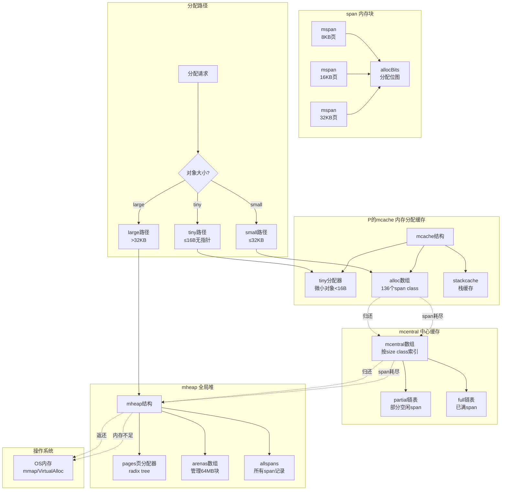

# Go语言源码剖析——内存管理概览

## 模块概述

### 职责定义
Go的内存管理系统负责为程序分配和回收内存，是运行时系统的核心组件之一。内存分配器基于TCMalloc设计，采用多级缓存策略实现高效的内存分配。其核心目标是：快速分配、减少碎片、支持并发、与垃圾回收器协同工作。

### 设计理念

**分级缓存架构**

- **mcache**（P级缓存）：每个P独占，无锁分配
- **mcentral**（中心缓存）：按size class管理，所有P共享
- **mheap**（堆）：全局页分配器，管理所有内存

**尺寸分类（Size Class）**

- 将对象大小分为约70个类别
- 同一类别的对象使用同一个span
- 减少内存碎片，提高分配效率

**内存布局**

- 以页（8KB）为基本单位
- Span：连续的页组成的内存块
- Arena：64MB的大块内存，包含多个span

### 输入与输出

**输入**

- 对象分配请求：`new`、`make`、字面量创建
- 大小分类：tiny(<16B无指针)、小对象(≤32KB)、大对象(>32KB)
- GC标记信息：对象可达性、指针位置
- 操作系统内存：通过mmap/VirtualAlloc申请

**输出**

- 内存地址：返回已分配内存的指针
- 内存统计：堆大小、分配量、GC指标
- 内存释放：将未使用的span归还给OS
- 写屏障支持：配合GC的并发标记

### 上下游依赖

**依赖的下游**

- **操作系统**：通过系统调用申请/释放内存
- **P（Processor）**：每个P拥有独立的mcache
- **垃圾回收器**：扫描堆内对象，标记存活对象
- **调度器**：分配G的栈内存

**被依赖的上游**

- **所有Go代码**：任何对象创建都需要内存分配
- **Channel**：channel结构和缓冲区需要分配
- **Map**：map的bucket需要分配
- **Slice**：底层数组需要分配
- **Interface**：iface结构需要分配

### 生命周期

#### 初始化阶段（mallocinit）
1. 确定地址空间布局
2. 初始化mheap全局堆
3. 为P创建mcache0（引导阶段）
4. 设置size class和span class映射表
5. 从OS申请初始arena

#### 运行阶段
1. **快速路径**：从mcache直接分配（无锁）
2. **慢路径**：mcache缺失，从mcentral补充span
3. **更慢路径**：mcentral缺失，从mheap申请页
4. **最慢路径**：mheap不足，向OS申请新arena
5. **清理回收**：GC后归还未使用的内存给OS

## 模块架构图



### 架构图说明

#### 三级缓存结构

**第一级：mcache（P级缓存）**

- 每个P拥有独立的mcache
- 无锁快速分配
- 包含136个span（68个size class × 2种scan/noscan）
- 包含tiny分配器用于微小对象（<16B且无指针）

**第二级：mcentral（中心缓存）**

- 每个size class对应一个mcentral
- 管理两个链表：partial（部分空闲）和full（已满）
- P的mcache缺少span时，从mcentral补充
- 需要加锁，但粒度细（每个size class一个锁）

**第三级：mheap（全局堆）**

- 全局唯一的堆管理器
- 管理所有的页（page）和span
- mcentral缺少span时，从mheap申请
- 使用radix tree高效管理大量页
- 需要全局锁，访问频率最低

#### 对象分类与分配策略

**Tiny对象（<16B且无指针）**

```
分配策略：

1. 多个tiny对象合并到一个16B块中
2. 减少内存碎片和分配次数
3. 从P的mcache.tiny分配
4. 例子：小整数、bool、小字符串

```

**Small对象（16B~32KB）**

```
分配策略：

1. 根据对象大小映射到67个size class之一
2. 从mcache对应span的分配位图查找空闲slot
3. span满时从mcentral获取新span
4. 例子：大部分Go对象、小slice、小map

```

**Large对象（>32KB）**

```
分配策略：

1. 直接从mheap分配
2. 不经过mcache和mcentral
3. 分配整数个页（8KB的倍数）
4. 例子：大数组、大slice、大map

```

#### Size Class映射表

Go定义了67个size class（实际使用中是68，因为class 0特殊）：

| Class | Object Size | Span Size(pages) | Objects | Waste |
|-------|-------------|------------------|---------|-------|
| 1     | 8B          | 1 (8KB)         | 1024    | 0%    |
| 2     | 16B         | 1               | 512     | 0%    |
| 3     | 24B         | 1               | 341     | 1.56% |
| 4     | 32B         | 1               | 256     | 0%    |
| ...   | ...         | ...             | ...     | ...   |
| 32    | 1024B       | 1               | 8       | 0%    |
| 33    | 1152B       | 1               | 7       | 1.39% |
| ...   | ...         | ...             | ...     | ...   |
| 67    | 32768B      | 4 (32KB)        | 1       | 0%    |

**Span Class = Size Class × 2 + (noscan?1:0)**

- 每个size class分为scan和noscan两种
- scan：包含指针，需要GC扫描
- noscan：不包含指针，GC可跳过
- 共136个span class（68个size × 2）

#### mspan数据结构

```go
type mspan struct {
    next     *mspan         // 链表指针
    prev     *mspan         // 链表指针
    startAddr uintptr       // span起始地址
    npages    uintptr       // span包含的页数
    
    nelems      uintptr     // span中object数量
    elemsize    uintptr     // object大小
    spanclass   spanClass   // size class and noscan
    
    allocCount  uint16      // 已分配object数量
    allocBits   *gcBits     // 分配位图
    gcmarkBits  *gcBits     // GC标记位图
    
    sweepgen    uint32      // sweep generation
    allocCache  uint64      // allocBits的缓存
    
    // 链表管理
    state       mSpanStateBox  // mSpanInUse等
    needzero    uint8          // 是否需要清零
    divMul      uint32         // 用于快速除法
}
```

**关键字段说明**

- `startAddr`：span的起始虚拟地址
- `npages`：span占用的8KB页数
- `nelems`：span可容纳的对象数量
- `elemsize`：每个对象的大小
- `allocCount`：已分配对象数
- `allocBits`：位图标记哪些slot已分配
- `gcmarkBits`：GC标记位图
- `allocCache`：allocBits的64位缓存，加速查找空闲slot

#### 分配算法

**mallocgc()核心流程**

```go
func mallocgc(size uintptr, typ *_type, needzero bool) unsafe.Pointer {
    // 1. 快速路径：tiny对象
    if size <= maxTinySize && typ.Kind_&kindNoPointers != 0 {
        off := c.tinyoffset
        // 对齐
        if size&7 == 0 {
            off = alignUp(off, 8)
        } else if goarch.PtrSize == 4 && size == 12 {
            off = alignUp(off, 8)
        } else if size&3 == 0 {
            off = alignUp(off, 4)
        } else if size&1 == 0 {
            off = alignUp(off, 2)
        }
        if off+size <= maxTinySize && c.tiny != 0 {
            // 有足够空间，直接分配
            x = unsafe.Pointer(c.tiny + off)
            c.tinyoffset = off + size
            return x
        }
        // 分配新的tiny块
        span = c.alloc[tinySpanClass]
        v := nextFreeFast(span)
        if v == 0 {
            v, span = c.nextFree(tinySpanClass)
        }
        x = unsafe.Pointer(v)
        (*[2]uint64)(x)[0] = 0
        (*[2]uint64)(x)[1] = 0
        c.tiny = uintptr(x)
        c.tinyoffset = size
        return x
    }

    // 2. 小对象路径
    if size <= maxSmallSize {
        if typ.Kind_&kindNoPointers != 0 {
            span = c.alloc[tSpanClass]
        }
        // 从span分配
        v := nextFreeFast(span)
        if v == 0 {
            v, span = c.nextFree(spc)
        }
        x = unsafe.Pointer(v)
        if needzero && span.needzero != 0 {
            memclrNoHeapPointers(x, size)
        }
        return x
    }

    // 3. 大对象路径
    span = c.allocLarge(size, typ)
    x = unsafe.Pointer(span.base())
    return x
}
```

**nextFreeFast()快速分配**

```go
func nextFreeFast(s *mspan) gclinkptr {
    theBit := sys.TrailingZeros64(s.allocCache)
    if theBit < 64 {
        result := s.freeindex + uintptr(theBit)
        if result < s.nelems {
            freeidx := result + 1
            if freeidx%64 == 0 && freeidx != s.nelems {
                return 0  // 缓存用完，走慢路径
            }
            s.allocCache >>= uint(theBit + 1)
            s.freeindex = freeidx
            s.allocCount++
            return gclinkptr(result*s.elemsize + s.base())
        }
    }
    return 0
}
```

**算法优化点**

- 使用`allocCache`缓存64个slot的状态，避免每次都读取内存
- 使用`TrailingZeros64`指令快速找到第一个空闲slot
- Tiny分配器减少小对象的内存开销和碎片

#### 内存布局

**虚拟地址空间布局（64位）**

```
+------------------+
| Stack            |  栈向下增长
+------------------+
| ↓                |
|                  |
| ↑                |
+------------------+
| Heap             |  堆向上增长
| - arenas         |  64MB对齐的大块
| - spans          |  管理元数据
+------------------+
| .bss/.data       |  全局变量
+------------------+
| .text            |  代码段
+------------------+
```

**Arena布局（64MB块）**

```
每个arena = 64MB = 8192个page(8KB)
arena metadata存储在heapArena结构中：

- bitmap：标记哪些字包含指针
- spans：指向覆盖该区域的mspan

```

**Span与Object布局**

```
mspan结构 (metadata)
+------------------+
| startAddr        | ------+
| npages           |       |
| elemsize         |       |
| allocBits        |       |
+------------------+       |
                           |
实际内存                    |
+------------------+ <-----+
| object 0         |
+------------------+
| object 1         |
+------------------+
| object 2         |
+------------------+
| ...              |
+------------------+
```

#### 与GC的协同

**写屏障支持**

- 分配器需要支持写屏障的开启/关闭
- `mallocgc`在GC标记阶段会触发标记辅助（mark assist）
- 黑色对象分配：新分配的对象标记为黑色（已扫描）

**标记位图**

- 每个span有两个位图：allocBits和gcmarkBits
- allocBits：哪些object已分配
- gcmarkBits：GC标记哪些object存活
- GC sweep阶段，gcmarkBits变成新的allocBits

**Sweep清扫**

- GC标记完成后，清扫未标记的object
- 惰性清扫：span在下次分配时才清扫
- 清扫时释放未使用的span给mcentral

## 核心算法详解

### 1. 对象大小到Size Class的映射

```go
// size到class的映射表
var class_to_size = [_NumSizeClasses]uint16{
    0,    8,    16,   24,   32,   48,   64,   80,
    96,   112,  128,  144,  160,  176,  192,  208,
    224,  240,  256,  288,  320,  352,  384,  416,
    448,  480,  512,  576,  640,  704,  768,  896,
    1024, 1152, 1280, 1408, 1536, 1792, 2048, 2304,
    2688, 3072, 3200, 3456, 4096, 4864, 5376, 6144,
    6528, 6784, 6912, 8192, 9472, 9728, 10240, 10880,
    12288, 13568, 14336, 16384, 18432, 19072, 20480, 21760,
    24576, 27264, 28672, 32768,
}

// 快速查找size class
func sizeToClass(size uintptr) uint8 {
    if size > maxSmallSize {
        throw("invalid size")
    }
    if size > 1024-8 {
        return uint8(size_to_class128[(size-1024+127)>>7])
    }
    return uint8(size_to_class8[(size-1+smallSizeDiv-1)/smallSizeDiv])
}
```

### 2. mcentral的span管理

```go
type mcentral struct {
    spanclass spanClass    // size class
    partial  [2]spanSet    // 部分空闲的span列表
    full     [2]spanSet    // 已满的span列表
}

// 从mcentral获取span
func (c *mcentral) cacheSpan() *mspan {
    sg := mheap_.sweepgen
retry:
    // 1. 从partial列表获取
    var s *mspan
    if s = c.partial[sg%2].pop(); s != nil {
        goto havespan
    }
    
    // 2. 从full列表获取（已清扫的span）
    for s = c.full[sg%2].pop(); s != nil; s = c.full[sg%2].pop() {
        if s.sweep(false) {
            goto havespan
        }
    }
    
    // 3. 从mheap申请新span
    s = c.grow()
    if s == nil {
        return nil
    }

havespan:
    // 设置span为已缓存状态
    n := int(s.nelems) - int(s.allocCount)
    if n == 0 || s.freeindex == s.nelems {
        throw("span has no free objects")
    }
    return s
}
```

### 3. mheap的页分配

```go
type mheap struct {
    lock mutex
    pages pageAlloc       // 页分配器
    
    allspans []*mspan    // 所有span
    arenas [1 << arenaL1Bits]*[1 << arenaL2Bits]*heapArena
    
    central [numSpanClasses]struct {
        mcentral mcentral
        pad      [cpu.CacheLinePadSize - unsafe.Sizeof(mcentral{})%cpu.CacheLinePadSize]byte
    }
}

// 分配npages页
func (h *mheap) alloc(npages uintptr, spanclass spanClass) *mspan {
    // 1. 从页分配器获取连续页
    base, scav := h.pages.alloc(npages)
    if base == 0 {
        // 向OS申请更多内存
        if !h.grow(npages) {
            return nil
        }
        base, scav = h.pages.alloc(npages)
        if base == 0 {
            throw("grew heap, but no adequate free space found")
        }
    }
    
    // 2. 初始化span
    s := h.allocMSpanLocked()
    s.init(base, npages)
    s.spanclass = spanclass
    
    // 3. 设置arena映射
    h.setSpans(s.base(), npages, s)
    
    return s
}
```

## 性能优化要点

### 1. 无锁快速路径
- mcache属于P，分配时无需加锁
- `nextFreeFast`使用CPU的`TrailingZeros`指令
- 使用`allocCache`缓存避免内存访问

### 2. 批量操作
- mcache从mcentral获取span时，一次获取整个span
- mcentral从mheap获取页时，一次分配多个页
- 减少锁的获取次数

### 3. NUMA感知
- 尝试从本地NUMA节点分配内存
- 减少跨节点内存访问延迟

### 4. 内存复用
- G结构、defer结构、sudog结构都使用缓存池
- span在释放后加入free列表，避免重新分配

### 5. Huge Page支持
- 在支持的平台使用透明大页（Transparent Huge Pages）
- 减少TLB miss

## 最佳实践

### 1. 减少小对象分配

```go
// 不推荐：频繁分配小对象
for i := 0; i < 1000000; i++ {
    s := fmt.Sprintf("%d", i)  // 每次分配新字符串
    process(s)
}

// 推荐：复用buffer
var buf bytes.Buffer
for i := 0; i < 1000000; i++ {
    buf.Reset()
    fmt.Fprintf(&buf, "%d", i)
    process(buf.String())
}
```

### 2. 使用sync.Pool

```go
var bufferPool = sync.Pool{
    New: func() interface{} {
        return new(bytes.Buffer)
    },
}

func process() {
    buf := bufferPool.Get().(*bytes.Buffer)
    defer bufferPool.Put(buf)
    buf.Reset()
    // 使用buf
}
```

### 3. 预分配slice

```go
// 不推荐：append导致多次分配
var data []int
for i := 0; i < 10000; i++ {
    data = append(data, i)
}

// 推荐：预分配容量
data := make([]int, 0, 10000)
for i := 0; i < 10000; i++ {
    data = append(data, i)
}
```

---

*更多详细信息请参阅后续的API文档和数据结构文档。*
