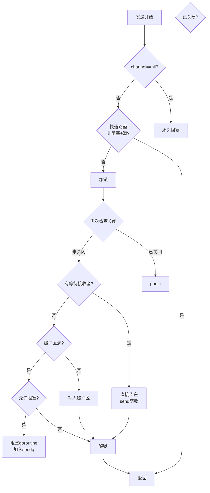

# Go语言源码剖析——Channel通信概览

## 模块概述

### 职责定义
Channel是Go语言实现goroutine间通信的核心机制，遵循CSP（Communicating Sequential Processes）模型。Channel提供了类型安全的、同步的数据传输通道，是Go并发编程的基础设施。其核心职责包括：数据传输、goroutine同步、资源协调、生产者-消费者模式支持。

### 设计哲学
> "Do not communicate by sharing memory; instead, share memory by communicating."
>
> 不要通过共享内存来通信，而应通过通信来共享内存。

这是Go并发模型的核心思想，Channel正是这一思想的具体实现。

### 输入与输出

**输入**

- 发送操作：`ch <- value`
- 接收操作：`<-ch` 或 `value := <-ch`
- 关闭操作：`close(ch)`
- select多路复用：`select { case ... }`
- 创建操作：`make(chan Type, buffer)`

**输出**

- 数据传输：在goroutine间传递数据
- 同步信号：阻塞/唤醒goroutine
- 关闭通知：通知所有接收者channel已关闭
- 状态查询：`ok`标志判断channel是否关闭

### Channel类型

**无缓冲Channel（Unbuffered Channel）**

```go
ch := make(chan int)  // buffer size = 0
```

- 同步通信：发送和接收必须同时准备好
- 发送阻塞：直到有接收者
- 接收阻塞：直到有发送者
- 用于精确同步

**有缓冲Channel（Buffered Channel）**

```go
ch := make(chan int, 10)  // buffer size = 10
```

- 异步通信：缓冲区未满时发送不阻塞
- 发送阻塞：仅在缓冲区满时
- 接收阻塞：仅在缓冲区空时
- 用于生产者-消费者模式

## 模块架构图

```mermaid
flowchart TB
    subgraph "Channel结构 hchan"
        HCHAN[hchan核心结构]
        BUF[buf缓冲区<br/>环形队列]
        SENDQ[sendq发送等待队列<br/>sudog链表]
        RECVQ[recvq接收等待队列<br/>sudog链表]
        LOCK[lock互斥锁<br/>保护并发访问]
        
        HCHAN --> BUF
        HCHAN --> SENDQ
        HCHAN --> RECVQ
        HCHAN --> LOCK
    end
    
    subgraph "发送Goroutine"
        G1[G1要发送数据]
        G2[G2要发送数据]
        G3[G3要发送数据]
    end
    
    subgraph "接收Goroutine"
        G4[G4要接收数据]
        G5[G5要接收数据]
        G6[G6要接收数据]
    end
    
    subgraph "等待队列 sudog"
        SG1[sudog1<br/>G1的等待信息]
        SG2[sudog2<br/>G2的等待信息]
        SG3[sudog3<br/>G4的等待信息]
        
        SG1 --> |elem|DATA1[数据指针]
        SG2 --> |elem|DATA2[数据指针]
        SG3 --> |elem|DATA3[数据指针]
    end
    
    G1 -.发送阻塞.-> SENDQ
    G2 -.发送阻塞.-> SENDQ
    G4 -.接收阻塞.-> RECVQ
    G5 -.接收阻塞.-> RECVQ
    
    SENDQ --> SG1
    SENDQ --> SG2
    RECVQ --> SG3
    
    G3 -->|发送成功| BUF
    G6 <--| 接收成功| BUF
    
    subgraph "Channel状态"
        STATE{Channel状态}
        NORMAL[正常状态<br/>open]
        CLOSED[关闭状态<br/>closed]
        
        STATE --> NORMAL
        STATE --> CLOSED
    end
    
    subgraph "操作流程"
        SEND[发送操作 ch <- v]
        RECV[接收操作 v := <-ch]
        CLOSE[关闭操作 close(ch)]
        SELECT[select多路复用]
        
        SEND -.-> FLOW1[1.加锁<br/>2.检查接收队列<br/>3.直接传递或入缓冲<br/>4.解锁或阻塞]
        RECV -.-> FLOW2[1.加锁<br/>2.检查缓冲/发送队列<br/>3.接收数据<br/>4.解锁或阻塞]
        CLOSE -.-> FLOW3[1.加锁<br/>2.标记关闭<br/>3.唤醒所有等待者<br/>4.解锁]
    end
```

### 架构图说明

#### hchan核心数据结构

```go
type hchan struct {
    qcount   uint           // 当前缓冲区元素数量
    dataqsiz uint           // 缓冲区容量
    buf      unsafe.Pointer // 缓冲区指针（环形队列）
    elemsize uint16         // 元素大小
    closed   uint32         // 是否关闭：0=open, 非0=closed
    timer    *timer         // 关联的timer（用于time.After等）
    elemtype *_type         // 元素类型
    sendx    uint           // 发送索引（环形队列写位置）
    recvx    uint           // 接收索引（环形队列读位置）
    recvq    waitq          // 接收等待队列
    sendq    waitq          // 发送等待队列
    lock     mutex          // 保护所有字段的互斥锁
}

type waitq struct {
    first *sudog  // 队列头
    last  *sudog  // 队列尾
}
```

#### 缓冲区设计（环形队列）

```
环形缓冲区示例（capacity=5）:
     recvx=1          sendx=4
       ↓                ↓
   +---+---+---+---+---+
   | 2 | - | 4 | 5 | - |
   +---+---+---+---+---+
     0   1   2   3   4
     
qcount = 3 (当前元素：2, 4, 5)
dataqsiz = 5

发送操作：

- 将数据写入 buf[sendx]
- sendx = (sendx + 1) % dataqsiz
- qcount++

接收操作：

- 从 buf[recvx] 读取数据
- recvx = (recvx + 1) % dataqsiz
- qcount--

```

#### sudog等待结构

```go
type sudog struct {
    g *g                 // 等待的goroutine
    next *sudog          // 队列中下一个sudog
    prev *sudog          // 队列中上一个sudog
    elem unsafe.Pointer  // 数据指针（发送的数据地址或接收的目标地址）
    
    releasetime int64    // 用于性能分析
    ticket      uint32   // 用于唤醒公平性
    isSelect    bool     // 是否是select操作
    success     bool     // 操作是否成功
    parent      *sudog   // semaRoot
    waitlink    *sudog   // g.waiting list
    waittail    *sudog   // semaRoot
    c           *hchan   // 关联的channel
}
```

**sudog的作用**

- 封装等待中的goroutine
- 存储发送/接收的数据地址
- 维护等待队列的链表结构
- 记录操作上下文（用于select等）

## 核心算法

### 1. makechan - 创建Channel

**函数签名**

```go
func makechan(t *chantype, size int) *hchan
```

**核心代码**

```go
func makechan(t *chantype, size int) *hchan {
    elem := t.Elem
    
    // 1. 安全检查
    if elem.Size_ >= 1<<16 {
        throw("makechan: invalid channel element type")
    }
    if hchanSize%maxAlign != 0 || elem.Align_ > maxAlign {
        throw("makechan: bad alignment")
    }
    
    // 2. 计算所需内存
    mem, overflow := math.MulUintptr(elem.Size_, uintptr(size))
    if overflow || mem > maxAlloc-hchanSize || size < 0 {
        panic(plainError("makechan: size out of range"))
    }
    
    var c *hchan
    switch {
    case mem == 0:
        // 无缓冲channel或元素大小为0
        c = (*hchan)(mallocgc(hchanSize, nil, true))
        c.buf = c.raceaddr()
        
    case !elem.Pointers():
        // 元素不包含指针，hchan和buf一起分配
        c = (*hchan)(mallocgc(hchanSize+mem, nil, true))
        c.buf = add(unsafe.Pointer(c), hchanSize)
        
    default:
        // 元素包含指针，分开分配
        c = new(hchan)
        c.buf = mallocgc(mem, elem, true)
    }
    
    // 3. 初始化字段
    c.elemsize = uint16(elem.Size_)
    c.elemtype = elem
    c.dataqsiz = uint(size)
    lockInit(&c.lock, lockRankHchan)
    
    return c
}
```

**算法说明**

1. **内存布局优化**：根据元素类型选择最优内存分配策略
2. **GC优化**：元素不含指针时，整个channel对GC是黑盒
3. **安全边界**：检查size溢出和对齐要求

**复杂度**

- 时间：O(1)
- 空间：O(capacity)

### 2. chansend - 发送操作

**函数签名**

```go
func chansend(c *hchan, ep unsafe.Pointer, block bool, callerpc uintptr) bool
```

**核心流程**



**完整源码分析**

```go
func chansend(c *hchan, ep unsafe.Pointer, block bool, callerpc uintptr) bool {
    // 1. nil channel检查
    if c == nil {
        if !block {
            return false
        }
        gopark(nil, nil, waitReasonChanSendNilChan, traceBlockForever, 2)
        throw("unreachable")
    }
    
    // 2. 快速路径：非阻塞且肯定失败的情况
    if !block && c.closed == 0 && full(c) {
        return false
    }
    
    // 3. 加锁
    lock(&c.lock)
    
    // 4. 检查channel是否关闭
    if c.closed != 0 {
        unlock(&c.lock)
        panic(plainError("send on closed channel"))
    }
    
    // 5. 情况A：有等待的接收者，直接传递
    if sg := c.recvq.dequeue(); sg != nil {
        send(c, sg, ep, func() { unlock(&c.lock) }, 3)
        return true
    }
    
    // 6. 情况B：缓冲区有空间，写入缓冲区
    if c.qcount < c.dataqsiz {
        qp := chanbuf(c, c.sendx)
        typedmemmove(c.elemtype, qp, ep)
        c.sendx++
        if c.sendx == c.dataqsiz {
            c.sendx = 0
        }
        c.qcount++
        unlock(&c.lock)
        return true
    }
    
    // 7. 情况C：非阻塞发送失败
    if !block {
        unlock(&c.lock)
        return false
    }
    
    // 8. 情况D：阻塞发送
    gp := getg()
    mysg := acquireSudog()
    mysg.releasetime = 0
    mysg.elem = ep
    mysg.waitlink = nil
    mysg.g = gp
    mysg.isSelect = false
    mysg.c = c
    gp.waiting = mysg
    gp.param = nil
    c.sendq.enqueue(mysg)
    
    // 设置parkingOnChan标志，防止栈收缩
    gp.parkingOnChan.Store(true)
    
    // 阻塞当前goroutine
    gopark(chanparkcommit, unsafe.Pointer(&c.lock),
           waitReasonChanSend, traceBlockChanSend, 2)
    
    // 被唤醒后的清理
    KeepAlive(ep)
    
    if mysg != gp.waiting {
        throw("G waiting list is corrupted")
    }
    gp.waiting = nil
    gp.activeStackChans = false
    closed := !mysg.success
    gp.param = nil
    mysg.c = nil
    releaseSudog(mysg)
    
    if closed {
        if c.closed == 0 {
            throw("chansend: spurious wakeup")
        }
        panic(plainError("send on closed channel"))
    }
    return true
}
```

**send函数：直接传递数据**

```go
func send(c *hchan, sg *sudog, ep unsafe.Pointer, unlockf func(), skip int) {
    // 1. 直接将数据从发送者复制到接收者
    if sg.elem != nil {
        sendDirect(c.elemtype, sg, ep)
        sg.elem = nil
    }
    gp := sg.g
    unlockf()  // 提前解锁
    gp.param = unsafe.Pointer(sg)
    sg.success = true
    
    // 2. 唤醒接收goroutine
    goready(gp, skip+1)
}

func sendDirect(t *_type, sg *sudog, src unsafe.Pointer) {
    dst := sg.elem
    // 直接内存复制，绕过缓冲区
    typeBitsBulkBarrier(t, uintptr(dst), uintptr(src), t.Size_)
    memmove(dst, src, t.Size_)
}
```

**关键优化**

1. **直接传递**：有接收者等待时，直接复制数据，不经过缓冲区
2. **提前解锁**：数据复制完成后立即解锁，减少锁持有时间
3. **批量唤醒**：关闭channel时批量唤醒所有等待者

### 3. chanrecv - 接收操作

**函数签名**

```go
func chanrecv(c *hchan, ep unsafe.Pointer, block bool) (selected, received bool)
```

**核心流程**

```go
func chanrecv(c *hchan, ep unsafe.Pointer, block bool) (selected, received bool) {
    // 1. nil channel检查
    if c == nil {
        if !block {
            return
        }
        gopark(nil, nil, waitReasonChanReceiveNilChan, traceBlockForever, 2)
        throw("unreachable")
    }
    
    // 2. 快速路径
    if !block && empty(c) {
        if atomic.Load(&c.closed) == 0 {
            return
        }
        if empty(c) {
            if ep != nil {
                typedmemclr(c.elemtype, ep)
            }
            return true, false
        }
    }
    
    // 3. 加锁
    lock(&c.lock)
    
    // 4. 情况A：channel关闭且缓冲区空
    if c.closed != 0 {
        if c.qcount == 0 {
            unlock(&c.lock)
            if ep != nil {
                typedmemclr(c.elemtype, ep)
            }
            return true, false
        }
        // channel关闭但缓冲区有数据，继续接收
    }
    
    // 5. 情况B：有等待的发送者
    if sg := c.sendq.dequeue(); sg != nil {
        // 无缓冲或缓冲区满
        recv(c, sg, ep, func() { unlock(&c.lock) }, 3)
        return true, true
    }
    
    // 6. 情况C：缓冲区有数据
    if c.qcount > 0 {
        qp := chanbuf(c, c.recvx)
        if ep != nil {
            typedmemmove(c.elemtype, ep, qp)
        }
        typedmemclr(c.elemtype, qp)
        c.recvx++
        if c.recvx == c.dataqsiz {
            c.recvx = 0
        }
        c.qcount--
        unlock(&c.lock)
        return true, true
    }
    
    // 7. 情况D：非阻塞接收失败
    if !block {
        unlock(&c.lock)
        return false, false
    }
    
    // 8. 情况E：阻塞接收
    gp := getg()
    mysg := acquireSudog()
    mysg.releasetime = 0
    mysg.elem = ep
    mysg.waitlink = nil
    gp.waiting = mysg
    mysg.g = gp
    mysg.isSelect = false
    mysg.c = c
    gp.param = nil
    c.recvq.enqueue(mysg)
    
    gp.parkingOnChan.Store(true)
    gopark(chanparkcommit, unsafe.Pointer(&c.lock),
           waitReasonChanReceive, traceBlockChanRecv, 2)
    
    // 被唤醒后的清理
    if mysg != gp.waiting {
        throw("G waiting list is corrupted")
    }
    gp.waiting = nil
    gp.activeStackChans = false
    success := mysg.success
    gp.param = nil
    mysg.c = nil
    releaseSudog(mysg)
    return true, success
}
```

**recv函数：接收并唤醒发送者**

```go
func recv(c *hchan, sg *sudog, ep unsafe.Pointer, unlockf func(), skip int) {
    if c.dataqsiz == 0 {
        // 无缓冲channel：直接接收
        if ep != nil {
            recvDirect(c.elemtype, sg, ep)
        }
    } else {
        // 有缓冲channel：从缓冲区接收，发送者数据入缓冲区
        qp := chanbuf(c, c.recvx)
        if ep != nil {
            typedmemmove(c.elemtype, ep, qp)
        }
        typedmemmove(c.elemtype, qp, sg.elem)
        c.recvx++
        if c.recvx == c.dataqsiz {
            c.recvx = 0
        }
        c.sendx = c.recvx
    }
    sg.elem = nil
    gp := sg.g
    unlockf()
    gp.param = unsafe.Pointer(sg)
    sg.success = true
    goready(gp, skip+1)
}
```

### 4. closechan - 关闭Channel

**核心代码**

```go
func closechan(c *hchan) {
    // 1. nil channel panic
    if c == nil {
        panic(plainError("close of nil channel"))
    }
    
    // 2. 加锁
    lock(&c.lock)
    
    // 3. 重复关闭panic
    if c.closed != 0 {
        unlock(&c.lock)
        panic(plainError("close of closed channel"))
    }
    
    // 4. 设置关闭标志
    c.closed = 1
    
    var glist gList
    
    // 5. 释放所有接收者
    for {
        sg := c.recvq.dequeue()
        if sg == nil {
            break
        }
        if sg.elem != nil {
            typedmemclr(c.elemtype, sg.elem)
            sg.elem = nil
        }
        gp := sg.g
        gp.param = unsafe.Pointer(sg)
        sg.success = false
        glist.push(gp)
    }
    
    // 6. 释放所有发送者（会panic）
    for {
        sg := c.sendq.dequeue()
        if sg == nil {
            break
        }
        sg.elem = nil
        gp := sg.g
        gp.param = unsafe.Pointer(sg)
        sg.success = false
        glist.push(gp)
    }
    unlock(&c.lock)
    
    // 7. 批量唤醒所有goroutine
    for !glist.empty() {
        gp := glist.pop()
        gp.schedlink = 0
        goready(gp, 3)
    }
}
```

**关闭语义**

- 关闭nil channel：panic
- 重复关闭：panic
- 向已关闭channel发送：panic
- 从已关闭channel接收：
  - 缓冲区有数据：正常接收
  - 缓冲区空：返回零值，`ok=false`

## Channel不变式（Invariants）

### 核心不变式

1. **互斥性**

```
   至少一个队列为空：len(sendq) == 0 || len(recvq) == 0
   例外：select同时在同一channel上发送和接收
```

2. **缓冲区状态**

```
   有缓冲channel：
   - qcount > 0 => recvq为空
   - qcount < dataqsiz => sendq为空
```

3. **等待队列有序性**

```
   FIFO顺序：先等待的goroutine先被唤醒
```

4. **原子性**

```
   发送/接收操作是原子的
```

## 典型使用场景

### 1. 信号量（Semaphore）

```go
// 限制并发数为3
sem := make(chan struct{}, 3)

func worker(id int) {
    sem <- struct{}{}  // 获取信号量
    defer func() { <-sem }()  // 释放信号量
    
    // 执行任务
    fmt.Printf("Worker %d working\n", id)
    time.Sleep(time.Second)
}

func main() {
    for i := 0; i < 10; i++ {
        go worker(i)
    }
    time.Sleep(5 * time.Second)
}
```

### 2. 生产者-消费者

```go
func producer(ch chan<- int) {
    for i := 0; i < 10; i++ {
        ch <- i
        time.Sleep(100 * time.Millisecond)
    }
    close(ch)
}

func consumer(ch <-chan int) {
    for v := range ch {  // 自动处理channel关闭
        fmt.Println("Consumed:", v)
    }
}

func main() {
    ch := make(chan int, 5)
    go producer(ch)
    consumer(ch)
}
```

### 3. 超时控制

```go
func doWork() {
    ch := make(chan int)
    
    go func() {
        time.Sleep(2 * time.Second)
        ch <- 42
    }()
    
    select {
    case result := <-ch:
        fmt.Println("Result:", result)
    case <-time.After(1 * time.Second):
        fmt.Println("Timeout!")
    }
}
```

### 4. Pipeline模式

```go
func gen(nums ...int) <-chan int {
    out := make(chan int)
    go func() {
        for _, n := range nums {
            out <- n
        }
        close(out)
    }()
    return out
}

func sq(in <-chan int) <-chan int {
    out := make(chan int)
    go func() {
        for n := range in {
            out <- n * n
        }
        close(out)
    }()
    return out
}

func main() {
    c := gen(2, 3, 4)
    out := sq(c)
    
    for n := range out {
        fmt.Println(n)  // 4, 9, 16
    }
}
```

## 性能特征

### 时间复杂度
- 发送/接收（快速路径）：O(1)
- 发送/接收（阻塞）：O(1)
- 关闭：O(n)，n为等待者数量

### 内存占用
- hchan结构：96字节（64位系统）
- 缓冲区：elemsize × capacity
- sudog：约56字节/个

### 锁竞争
- 每个channel独立锁，减少竞争
- 直接传递优化，减少锁持有时间
- select使用全局锁序，避免死锁

## 最佳实践

### 1. 选择合适的缓冲区大小

```go
// 无缓冲：精确同步
sync := make(chan struct{})

// 小缓冲：避免短暂的发送阻塞
work := make(chan Task, 10)

// 大缓冲：解耦生产者和消费者速率
events := make(chan Event, 1000)
```

### 2. 明确channel的所有权

```go
// 发送者负责关闭channel
func producer(out chan<- int) {
    defer close(out)
    for i := 0; i < 10; i++ {
        out <- i
    }
}

// 接收者不关闭channel
func consumer(in <-chan int) {
    for v := range in {
        process(v)
    }
}
```

### 3. 使用context取消

```go
func worker(ctx context.Context, in <-chan int) {
    for {
        select {
        case <-ctx.Done():
            return  // 优雅退出
        case v := <-in:
            process(v)
        }
    }
}
```

### 4. 避免常见错误

```go
// 错误：关闭nil channel
var ch chan int
close(ch)  // panic

// 错误：重复关闭
ch := make(chan int)
close(ch)
close(ch)  // panic

// 错误：向已关闭channel发送
ch := make(chan int)
close(ch)
ch <- 1  // panic

// 正确：检查channel关闭
select {
case ch <- value:
    // 发送成功
default:
    // channel满或已关闭
}
```

---

*更多详细信息请参阅后续的API文档和时序图文档。*
