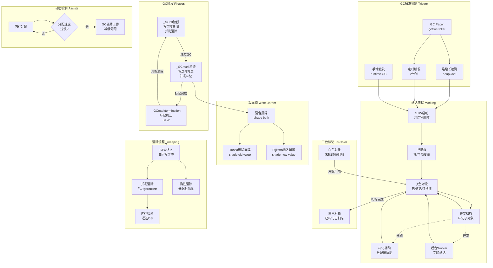

# Go语言源码剖析——垃圾回收GC概览

## 模块概述

### 职责定义
Go的垃圾回收器（Garbage Collector，简称GC）是运行时系统的核心组件，负责自动回收不再使用的内存，解放开发者手动管理内存的负担。Go的GC采用并发三色标记清除算法，在保证低延迟的同时实现高吞吐量。

### 设计目标

**核心目标**

1. **低延迟**：STW（Stop-The-World）暂停时间 < 1ms
2. **高吞吐**：GC占用CPU时间 < 25%
3. **可扩展**：支持TB级别的堆内存
4. **并发性**：与用户程序并发执行

**非目标**

- 不支持手动内存管理
- 不是分代GC（non-generational）
- 不进行内存压缩/整理（non-compacting）

### GC类型特征

**并发标记清除（Concurrent Mark-Sweep）**

- 标记阶段：与用户程序并发执行
- 清除阶段：惰性清除，按需回收
- 写屏障：保证并发标记的正确性

**类型精确（Type-Accurate/Precise）**

- 知道每个对象的类型信息
- 准确识别指针和非指针数据
- 避免误判导致的内存泄漏

**无分代（Non-Generational）**

- 不区分新生代和老年代
- 每次GC扫描整个堆
- 简化实现，减少复杂度

**无压缩（Non-Compacting）**

- 不移动已分配对象
- 避免更新所有指针的开销
- 通过size class减少碎片

### 输入与输出

**输入**

- 堆内存状态：已分配对象及其引用关系
- GC触发条件：堆大小、时间间隔、手动调用
- 根集合：栈、全局变量、寄存器
- 配置参数：GOGC、GOMEMLIMIT

**输出**

- 存活对象标记：哪些对象还在使用
- 内存回收：释放未标记的span
- 性能指标：GC次数、暂停时间、CPU占用
- Finalizer执行：对象销毁前的回调

## 模块架构图



### 架构图说明

#### GC生命周期阶段

**阶段1：GC关闭（_GCoff）**

- 写屏障关闭，正常运行
- 并发清除（concurrent sweep）后台执行
- 新分配对象标记为白色
- 等待下一次GC触发

**阶段2：标记准备（Sweep Termination）**

```

1. Stop the World（STW）
2. 完成未完成的清除工作
3. 准备进入标记阶段
4. 设置gcphase = _GCmark
5. 开启写屏障
6. Start the World

```

**阶段3：并发标记（_GCmark）**

```

1. 扫描根对象（栈、全局变量、寄存器）
2. 标记根对象为灰色
3. 灰色对象扫描：
   - 取出灰色对象
   - 扫描其指针字段
   - 引用对象标记为灰色
   - 当前对象标记为黑色
4. 重复直到灰色队列为空
5. 分配辅助（assist）：分配过快时协助GC
6. 后台Worker：专门的GC goroutine

```

**阶段4：标记终止（_GCmarktermination）**

```

1. Stop the World（STW）
2. 完成剩余标记工作
3. flush mcaches
4. 设置gcphase = _GCoff
5. 关闭写屏障
6. 准备清除
7. Start the World

```

**阶段5：并发清除（Sweep）**

```

1. 后台goroutine清除span
2. 惰性清除：分配时清除
3. 将未标记对象回收到freelist
4. 归还内存给OS（scavenge）

```

#### 三色标记不变式

**三色定义**

- **白色**：未被标记的对象，GC结束后将被回收
- **灰色**：已被标记但其引用的对象还未扫描
- **黑色**：已被标记且其引用的对象也已扫描

**不变式（Invariant）**

```
黑色对象不能直接指向白色对象

如果违反此不变式，白色对象可能被误回收
```

**保证不变式的两种方法**

1. **强三色不变式（Strong Tri-Color Invariant）**

```
   禁止黑色对象指向白色对象
   由Dijkstra插入屏障保证
```

2. **弱三色不变式（Weak Tri-Color Invariant）**

```
   黑色对象可以指向白色对象，
   但必须有灰色对象间接引用该白色对象
   由Yuasa删除屏障保证
```

#### 混合写屏障（Hybrid Write Barrier）

**设计理念**
Go 1.8引入混合写屏障，结合Yuasa和Dijkstra两种屏障的优点。

**伪代码**

```go
writePointer(slot, ptr):
    shade(*slot)              // Yuasa: shade old value
    if current stack is grey:
        shade(ptr)            // Dijkstra: shade new value
    *slot = ptr
```

**Yuasa删除屏障（Deletion Barrier）**

```go
// 当指针被删除/覆盖时，标记被删除的对象
func shade_old(slot *unsafe.Pointer, ptr unsafe.Pointer) {
    old := *slot
    if old != nil && isWhite(old) {
        markGrey(old)
    }
    *slot = ptr
}
```

**作用**：防止mutator将堆中唯一指向某对象的指针移到栈上，导致该对象被误回收。

**Dijkstra插入屏障（Insertion Barrier）**

```go
// 当新指针被写入时，标记新对象
func shade_new(slot *unsafe.Pointer, ptr unsafe.Pointer) {
    if ptr != nil && isWhite(ptr) {
        markGrey(ptr)
    }
    *slot = ptr
}
```

**作用**：防止mutator将栈上指向的白色对象写入黑色对象，导致白色对象被误回收。

**混合屏障优化**

```

1. 栈上指针写入无需屏障（当前帧）
2. 栈扫描后栈变黑，不再需要shade(ptr)
3. 减少屏障开销，降低GC影响

```

#### GC触发机制

**1. 基于堆大小触发（主要方式）**

```go
// heapGoal计算下次GC的堆大小目标
heapGoal = heapLive + heapLive * GOGC / 100

// 示例：GOGC=100，当前堆4MB
// heapGoal = 4MB + 4MB * 100/100 = 8MB
// 当堆增长到8MB时触发GC
```

**gcController.heapGoal的计算**

```go
func (c *gcControllerState) heapGoal() uint64 {
    goal := c.heapMarked + c.heapMarked * uint64(c.gcPercent) / 100
    
    // 考虑GOMEMLIMIT
    if memoryLimit := c.memoryLimit.Load(); memoryLimit != maxInt64 {
        // 软内存上限，在接近上限时更激进触发GC
        goal = min(goal, calculateGoalWithLimit(memoryLimit))
    }
    
    return max(goal, c.heapMinimum)
}
```

**2. 基于时间触发**

```go
// 如果2分钟没有触发GC，强制触发
// src/runtime/proc.go:forcegchelper
const forcegcperiod = 2 * 60 * 1e9 // 2分钟

if lastgc := atomic.Load64(&memstats.last_gc_nanotime); lastgc != 0 &&
   nanotime()-lastgc > forcegcperiod {
    gcStart(gcTrigger{kind: gcTriggerTime})
}
```

**3. 手动触发**

```go
runtime.GC()  // 阻塞直到GC完成
debug.FreeOSMemory()  // 强制GC并归还内存给OS
```

**4. 测试触发**

```go
// 用于测试和调试
runtime.GCTestFlush()
runtime.GCTestIsReachable()
```

#### GC Pacer（调步器）

**目标**

- 控制GC触发时机
- 平衡GC开销与内存占用
- 适应不同的分配模式

**核心结构**

```go
type gcControllerState struct {
    gcPercent     int32       // GOGC参数
    memoryLimit   atomic.Int64 // GOMEMLIMIT
    heapMarked    uint64      // 上次GC后标记的堆大小
    heapLive      atomic.Uint64 // 当前存活堆大小
    heapScan      uint64      // 需要扫描的堆大小
    
    // 辅助GC相关
    assistTime    int64       // 辅助GC总时间
    bgScanCredit  atomic.Int64 // 后台扫描credit
}
```

**动态调整**

```
根据上次GC的性能数据，动态调整：

1. GC触发时机
2. 后台Worker数量
3. 辅助GC的激进程度

```

#### 标记辅助（Mark Assist）

**为什么需要辅助**

```
如果分配速度 > 标记速度，堆会持续增长
辅助机制让快速分配的goroutine协助标记
实现"谁污染谁治理"
```

**辅助算法**

```go
func mallocgc(size uintptr, typ *_type, needzero bool) unsafe.Pointer {
    // GC标记阶段
    if gcphase == _GCmark {
        // 计算需要的辅助工作量
        assistG := deductAssistCredit(size)
        if assistG != nil {
            // 执行标记辅助
            gcAssistAlloc(assistG)
        }
    }
    
    // 分配内存
    return allocate(size)
}
```

**credit机制**

```
每个G有gcAssistBytes credit：

- 正值：有credit，无需辅助
- 负值：欠债，需要辅助标记
- 辅助标记增加credit
- 分配内存减少credit

```

## 核心算法详解

### 1. gcStart() - GC启动

**核心代码**

```go
func gcStart(trigger gcTrigger) {
    // 1. 检查是否可以启动GC
    if gcphase != _GCoff {
        return  // GC已在运行
    }
    
    // 2. 计算目标堆大小
    work.heapGoal = gcController.heapGoal()
    
    // 3. 停止世界
    semacquire(&work.startSema)
    systemstack(func() {
        gcController.startCycle(now, int(gomaxprocs), trigger)
    })
    
    // 4. 停止所有P到达安全点
    systemstack(stopTheWorldWithSema(stwGCSweepTermination))
    systemstack(func() {
        finishsweep_m()  // 完成上次清除
    })
    
    // 5. 重置标记状态
    gcController.resetLive(work.heapGoal)
    work.initialHeapLive = gcController.heapLive.Load()
    work.sweepDrainedMask = sweepDrainedMask
    
    // 6. 设置GC阶段为标记
    setGCPhase(_GCmark)
    
    // 7. 启动后台标记Worker
    gcBgMarkStartWorkers()
    
    // 8. 准备根标记任务
    gcMarkRootPrepare()
    
    // 9. 启动世界
    systemstack(func() {
        startTheWorldWithSema()
        work.cycles.value++
    })
}
```

**算法步骤说明**

1. **前置检查**
   - 确保没有其他GC在运行
   - 验证触发条件合法

2. **STW准备**
   - 停止所有P
   - 完成未完成的清除工作
   - flush所有mcache

3. **初始化标记状态**
   - 重置work buffer
   - 清空灰色队列
   - 初始化统计信息

4. **开启写屏障**
   - 设置writeBarrier.enabled = true
   - 编译器生成的写屏障代码开始生效

5. **启动后台Worker**
   - 每个P创建一个后台标记goroutine
   - Worker从灰色队列取对象扫描

6. **恢复执行**
   - Start the World
   - 用户程序继续执行
   - 并发标记开始

### 2. gcDrain() - 灰色对象扫描

**核心代码**

```go
func gcDrain(gcw *gcWork, flags gcDrainFlags) {
    gp := getg().m.curg
    
    // 检查是否抢占
    preemptible := flags&gcDrainUntilPreempt != 0
    flushBgCredit := flags&gcDrainFlushBgCredit != 0
    idle := flags&gcDrainIdle != 0
    
    // 扫描循环
    for {
        // 1. 检查是否被抢占
        if preemptible && gp.preempt {
            break
        }
        
        // 2. 尝试从根标记任务获取工作
        if work.markrootNext < work.markrootJobs {
            job := atomic.Xadd(&work.markrootNext, +1) - 1
            if job < work.markrootJobs {
                markroot(gcw, job, flushBgCredit)
                continue
            }
        }
        
        // 3. 从work buffer获取灰色对象
        b := gcw.tryGetFast()
        if b == 0 {
            b = gcw.tryGet()
            if b == 0 {
                // work buffer空，尝试从全局获取
                break
            }
        }
        
        // 4. 扫描对象
        scanobject(b, gcw)
        
        // 5. flush buffer
        if gcw.heapScanWork >= gcCreditSlack {
            gcController.heapScanWork.Add(gcw.heapScanWork)
            if flushBgCredit {
                gcFlushBgCredit(gcw.heapScanWork)
            }
            gcw.heapScanWork = 0
        }
    }
}
```

**scanobject() - 扫描单个对象**

```go
func scanobject(b uintptr, gcw *gcWork) {
    s := spanOfUnchecked(b)
    n := s.elemsize
    
    // 获取对象的类型信息
    hbits := heapBitsForAddr(b, n)
    
    // 逐个扫描指针字段
    for {
        // 查找下一个指针
        if !hbits.hasPointers() {
            break
        }
        
        ptr := *(*uintptr)(unsafe.Pointer(b))
        if ptr != 0 {
            // 标记指针指向的对象
            if obj := findObject(ptr); obj != 0 {
                greyobject(obj, gcw)
            }
        }
        
        hbits = hbits.next()
        b += goarch.PtrSize
    }
}
```

**greyobject() - 标记对象为灰色**

```go
func greyobject(obj uintptr, gcw *gcWork) {
    // 获取对象所在的span
    span := spanOfUnchecked(obj)
    
    // 获取对象在span中的索引
    objIndex := span.objIndex(obj)
    
    // 原子设置标记位
    mbits := span.markBitsForIndex(objIndex)
    if mbits.isMarked() {
        return  // 已标记，跳过
    }
    mbits.setMarked()
    
    // 加入灰色队列
    gcw.putFast(obj)
}
```

### 3. gcMarkDone() - 标记完成检测

**分布式终止检测算法**

```go
func gcMarkDone() {
top:
    semacquire(&work.markDoneSema)
    
    // 1. 再次检查是否有新工作
    // flush所有本地work buffer
    forEachP(func(pp *p) {
        wbBufFlush1(pp)
        pp.gcw.dispose()
    })
    
    // 2. 检查全局work队列
    if !gcMarkWorkAvailable(nil) {
        // 没有工作，标记完成
        atomic.Store(&gcMarkDoneFlushed, 1)
        
        // 3. STW进入标记终止阶段
        systemstack(func() {
            stopTheWorldWithSema(stwGCMarkTerm)
        })
        
        // 4. 再次检查（double check）
        if !gcMarkWorkAvailable(nil) {
            // 确认标记完成
            gcMarkTermination(stw)
            return
        }
        
        // 发现新工作，恢复标记
        systemstack(func() {
            startTheWorldWithSema()
        })
        goto top
    }
    
    semrelease(&work.markDoneSema)
}
```

### 4. gcSweep() - 清除阶段

**并发清除**

```go
func gcSweep(mode gcMode) {
    // 唤醒后台清除goroutine
    lock(&sweep.lock)
    if sweep.parked {
        sweep.parked = false
        ready(sweep.g, 0, true)
    }
    unlock(&sweep.lock)
}

// 后台清除循环
func bgsweep(c chan int) {
    sweep.g = getg()
    
    for {
        // 清除一个span
        npages := sweepone()
        if npages == ^uintptr(0) {
            // 没有更多span需要清除
            break
        }
        
        // 定期让出CPU
        if npages > 0 {
            Gosched()
        }
    }
}
```

**惰性清除**

```go
func (c *mcache) refill(spc spanClass) {
    s := c.alloc[spc]
    
    // 如果span需要清除，先清除
    if s.sweepgen != mheap_.sweepgen+3 {
        s.sweep(false)
    }
    
    // 从mcentral获取新span
    s = mheap_.central[spc].mcentral.cacheSpan()
    c.alloc[spc] = s
}
```

## 性能优化

### STW时间优化

**目标**：将STW时间控制在1ms以内

**优化措施**

1. **并发标记**：大部分标记工作与用户程序并发
2. **写屏障**：避免重新扫描已黑化的栈
3. **并发清除**：清除工作完全并发
4. **增量扫描**：大对象分割为多个oblet

**STW时间分布**

```
GC周期STW时间 = Sweep Termination + Mark Termination
              ≈ 50μs - 200μs    + 50μs - 800μs
              ≈ 100μs - 1ms
```

### 吞吐量优化

**目标**：GC CPU占用 < 25%

**优化措施**

1. **后台标记**：利用空闲CPU进行标记
2. **辅助GC**：分配快的goroutine协助标记
3. **批量处理**：减少锁竞争和上下文切换

### 内存占用优化

**目标**：合理的堆内存开销

**GOGC调整**

```go
GOGC=100:  堆翻倍时触发GC（默认）
GOGC=50:   堆增长50%时触发GC（更频繁）
GOGC=200:  堆增长2倍时触发GC（更少GC）
GOGC=off:  关闭GC（不推荐）
```

**GOMEMLIMIT优化（Go 1.19+）**

```go
GOMEMLIMIT=4GiB  // 软内存上限

当接近上限时：

- 更频繁触发GC
- 归还更多内存给OS
- 防止OOM

```

## 最佳实践

### 1. 合理配置GC参数

```go
// 低延迟场景：减少堆大小，更频繁GC
export GOGC=50

// 高吞吐场景：增大堆，减少GC频率
export GOGC=200

// 内存受限场景：设置软上限
export GOMEMLIMIT=4GiB
```

### 2. 减少对象分配

```go
// 不推荐：频繁分配
for i := 0; i < 1000000; i++ {
    s := fmt.Sprintf("%d", i)
    process(s)
}

// 推荐：复用对象
var buf strings.Builder
for i := 0; i < 1000000; i++ {
    buf.Reset()
    fmt.Fprintf(&buf, "%d", i)
    process(buf.String())
}
```

### 3. 使用sync.Pool

```go
var bufferPool = sync.Pool{
    New: func() interface{} {
        return new(bytes.Buffer)
    },
}

func process() {
    buf := bufferPool.Get().(*bytes.Buffer)
    defer bufferPool.Put(buf)
    buf.Reset()
    // 使用buf
}
```

### 4. 避免指针密集结构

```go
// 不推荐：大量指针，GC扫描开销大
type Node struct {
    Value *int
    Next  *Node
    Data  *Data
}

// 推荐：值类型，减少指针
type Node struct {
    Value int
    Next  int  // 索引而非指针
    Data  Data // 值类型而非指针
}
```

### 5. 监控GC指标

```go
import "runtime"

func monitorGC() {
    var m runtime.MemStats
    runtime.ReadMemStats(&m)
    
    fmt.Printf("Alloc: %v MB\n", m.Alloc/1024/1024)
    fmt.Printf("TotalAlloc: %v MB\n", m.TotalAlloc/1024/1024)
    fmt.Printf("Sys: %v MB\n", m.Sys/1024/1024)
    fmt.Printf("NumGC: %v\n", m.NumGC)
    fmt.Printf("PauseTotal: %v ms\n", m.PauseTotalNs/1e6)
    fmt.Printf("PauseAvg: %v ms\n",
        m.PauseTotalNs/uint64(m.NumGC)/1e6)
}
```

### 6. 使用pprof分析

```go
import _ "net/http/pprof"

// http://localhost:6060/debug/pprof/heap
// go tool pprof http://localhost:6060/debug/pprof/heap
```

## 调试工具

### GODEBUG环境变量

```bash
# GC追踪
GODEBUG=gctrace=1 ./myapp
# 输出：gc 1 @0.001s 0%: 0.009+0.23+0.004 ms clock, ...

# 详细GC追踪
GODEBUG=gctrace=2 ./myapp

# 内存分配追踪
GODEBUG=allocfreetrace=1 ./myapp

# GC调试
GODEBUG=gccheckmark=1 ./myapp  # 验证标记正确性
```

### GC Trace格式解析

```
gc 1 @0.001s 0%: 0.009+0.23+0.004 ms clock, 0.036+0/0.22/0.004+0.017 ms cpu, 4->4->3 MB, 5 MB goal, 0 MB stacks, 0 MB globals, 4 P

解析：
gc 1           - GC编号
@0.001s       - 程序启动后时间
0%            - GC CPU占用百分比
0.009         - STW清除终止时间
0.23          - 并发标记时间
0.004         - STW标记终止时间
4->4->3 MB    - GC前堆->GC后堆->存活堆
5 MB goal     - 目标堆大小
4 P           - 使用的P数量
```

---

*详细的API文档、数据结构和时序图请参阅后续文档。*
