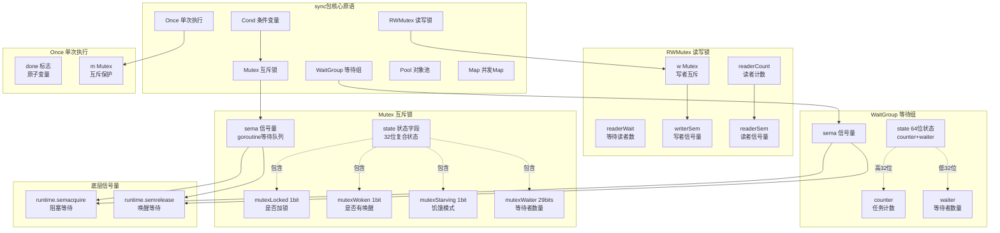

# Go语言源码剖析——并发原语sync包概览

## 模块概述

### 职责定义
sync包提供Go语言的基本同步原语（synchronization primitives），是构建并发程序的基础工具集。包括互斥锁（Mutex）、读写锁（RWMutex）、等待组（WaitGroup）、单次执行（Once）、条件变量（Cond）等。这些原语位于Channel之下的底层，主要用于保护共享内存的并发访问。

### 设计哲学

> 虽然Go鼓励通过Channel进行通信，但在某些场景下，使用传统的锁机制更合适。sync包提供了高性能、低级别的同步原语，适用于：
> - 保护共享数据结构
> - 实现复杂的并发控制
> - 构建高性能库

### 核心原语对比

| 原语 | 用途 | 场景 | 性能 |
|------|------|------|------|
| Mutex | 互斥锁 | 保护临界区 | 高 |
| RWMutex | 读写锁 | 读多写少 | 中（读多时高） |
| WaitGroup | 等待组 | 等待多个goroutine完成 | 高 |
| Once | 单次执行 | 延迟初始化、单例 | 极高 |
| Cond | 条件变量 | 复杂等待条件 | 中 |
| Pool | 对象池 | 对象复用 | 高 |
| Map | 并发Map | 并发读写map | 高（特定场景） |

### 不应该被复制的类型

**重要**：sync包中的类型都包含`noCopy`字段，使用`go vet`可以检测复制错误。

```go
type noCopy struct{}
func (*noCopy) Lock()   {}
func (*noCopy) Unlock() {}
```

**错误示例**

```go
var mu sync.Mutex
func badCopy() {
    mu2 := mu  // 错误：复制了锁
    mu2.Lock() // 无效的锁
}
```

## 模块架构图



### 架构图说明

#### 信号量机制

Go的sync包底层依赖runtime的信号量实现：

```go
// runtime/sema.go
func semacquire(addr *uint32)  // 阻塞直到信号量>0，然后减1
func semrelease(addr *uint32)  // 信号量加1，唤醒一个等待者
```

**信号量与互斥量的关系**

- 互斥量 = 初值为1的信号量
- WaitGroup = 计数信号量
- 所有sync原语最终都依赖runtime的信号量

#### 公平性与性能权衡

**正常模式 vs 饥饿模式**（Mutex）

- 正常模式：自旋+队列，高吞吐
- 饥饿模式：FIFO队列，公平性

**写者优先**（RWMutex）

- 写者到来时阻止新读者
- 防止写者饥饿
- 牺牲部分读性能

## 核心原语详解

### 1. Mutex - 互斥锁

#### 数据结构

```go
type Mutex struct {
    _ noCopy
    mu isync.Mutex  // 内部实现
}

// internal/sync/mutex.go
type Mutex struct {
    state int32   // 状态字段
    sema  uint32  // 信号量
}
```

**state字段布局（32位）**

```
|31          3|  2  |  1  | 0 |
|   waiter    |star-|woken|locked|
|    count    | ving|     |      |
```

- **bit 0 (mutexLocked)**：是否已加锁
- **bit 1 (mutexWoken)**：是否有goroutine从等待中唤醒
- **bit 2 (mutexStarving)**：是否处于饥饿模式
- **bit 3-31 (mutexWaiter)**：等待的goroutine数量

#### 正常模式 vs 饥饿模式

**正常模式（Normal Mode）**

```
特点：

- 新到的goroutine直接尝试获取锁（自旋）
- 等待队列中的goroutine被唤醒后也需要竞争
- 新goroutine有优势（已在CPU上运行）
- 高吞吐量，但可能导致队列尾部goroutine饥饿

```

**饥饿模式（Starvation Mode）**

```
触发条件：

- goroutine等待时间超过1ms

特点：

- 锁直接交给队列头部的goroutine
- 新到的goroutine不尝试获取锁，直接排队
- FIFO保证公平性
- 等待时间短的goroutine获取锁后退出饥饿模式

```

#### Lock算法

**核心代码**（`internal/sync/mutex.go:Lock()`）

```go
func (m *Mutex) Lock() {
    // 快速路径：尝试CAS获取锁
    if atomic.CompareAndSwapInt32(&m.state, 0, mutexLocked) {
        return
    }
    m.lockSlow()
}

func (m *Mutex) lockSlow() {
    var waitStartTime int64
    starving := false
    awoke := false
    iter := 0
    old := m.state
    
    for {
        // 1. 正常模式且可以自旋
        if old&(mutexLocked|mutexStarving) == mutexLocked &&
           runtime_canSpin(iter) {
            // 尝试设置mutexWoken，防止Unlock时不必要的唤醒
            if !awoke && old&mutexWoken == 0 && old>>mutexWaiterShift != 0 &&
               atomic.CompareAndSwapInt32(&m.state, old, old|mutexWoken) {
                awoke = true
            }
            runtime_doSpin()
            iter++
            old = m.state
            continue
        }
        
        // 2. 计算新状态
        new := old
        if old&mutexStarving == 0 {
            new |= mutexLocked  // 非饥饿模式尝试获取锁
        }
        if old&(mutexLocked|mutexStarving) != 0 {
            new += 1 << mutexWaiterShift  // 增加等待者计数
        }
        if starving && old&mutexLocked != 0 {
            new |= mutexStarving  // 标记为饥饿模式
        }
        if awoke {
            new &^= mutexWoken  // 清除woken标志
        }
        
        // 3. CAS更新状态
        if atomic.CompareAndSwapInt32(&m.state, old, new) {
            // 3a. 获取成功（正常模式）
            if old&(mutexLocked|mutexStarving) == 0 {
                break
            }
            
            // 3b. 需要等待
            queueLifo := waitStartTime != 0
            if waitStartTime == 0 {
                waitStartTime = runtime_nanotime()
            }
            runtime_SemacquireMutex(&m.sema, queueLifo, 1)
            
            // 被唤醒后检查是否进入饥饿模式
            starving = starving || runtime_nanotime()-waitStartTime > starvationThresholdNs
            old = m.state
            
            // 3c. 饥饿模式：直接获取锁
            if old&mutexStarving != 0 {
                delta := int32(mutexLocked - 1<<mutexWaiterShift)
                if !starving || old>>mutexWaiterShift == 1 {
                    delta -= mutexStarving  // 退出饥饿模式
                }
                atomic.AddInt32(&m.state, delta)
                break
            }
            awoke = true
            iter = 0
        } else {
            old = m.state
        }
    }
}
```

**自旋条件**

```go
func sync_runtime_canSpin(i int) bool {
    // 条件：
    // 1. 运行在多核机器上
    // 2. GOMAXPROCS > 1
    // 3. 至少有一个其他运行的P且本地运行队列为空
    // 4. 自旋次数 < 4
    return i < active_spin &&
           runtime·ncpu > 1 &&
           gomaxprocs > 1 &&
           p·runqsize == 0
}
```

#### Unlock算法

**核心代码**

```go
func (m *Mutex) Unlock() {
    // 快速路径：直接解锁
    new := atomic.AddInt32(&m.state, -mutexLocked)
    if new != 0 {
        m.unlockSlow(new)
    }
}

func (m *Mutex) unlockSlow(new int32) {
    // 1. 检查是否对未加锁的Mutex调用Unlock
    if (new+mutexLocked)&mutexLocked == 0 {
        fatal("sync: unlock of unlocked mutex")
    }
    
    // 2. 正常模式
    if new&mutexStarving == 0 {
        old := new
        for {
            // 无等待者或已有goroutine被唤醒/获取了锁
            if old>>mutexWaiterShift == 0 ||
               old&(mutexLocked|mutexWoken|mutexStarving) != 0 {
                return
            }
            // 减少等待者计数，设置woken标志
            new = (old - 1<<mutexWaiterShift) | mutexWoken
            if atomic.CompareAndSwapInt32(&m.state, old, new) {
                runtime_Semrelease(&m.sema, false, 1)
                return
            }
            old = m.state
        }
    } else {
        // 3. 饥饿模式：直接唤醒队首goroutine
        runtime_Semrelease(&m.sema, true, 1)
    }
}
```

### 2. RWMutex - 读写锁

#### 数据结构

```go
type RWMutex struct {
    w           Mutex        // 写者互斥锁
    writerSem   uint32       // 写者信号量
    readerSem   uint32       // 读者信号量
    readerCount atomic.Int32 // 读者计数（负数表示有写者）
    readerWait  atomic.Int32 // 等待的读者数
}

const rwmutexMaxReaders = 1 << 30
```

#### 写者优先机制

**readerCount的巧妙设计**

```
正常值：0 ~ rwmutexMaxReaders（读者数量）
写者到来：减去rwmutexMaxReaders，变为负数
负数表示：有写者在等待或持有锁
```

#### RLock算法（读锁）

```go
func (rw *RWMutex) RLock() {
    // 1. 增加读者计数
    if rw.readerCount.Add(1) < 0 {
        // 2. readerCount为负，说明有写者，需要等待
        runtime_SemacquireRWMutexR(&rw.readerSem, false, 0)
    }
}
```

#### RUnlock算法

```go
func (rw *RWMutex) RUnlock() {
    // 1. 减少读者计数
    if r := rw.readerCount.Add(-1); r < 0 {
        rw.rUnlockSlow(r)
    }
}

func (rw *RWMutex) rUnlockSlow(r int32) {
    // 2. 有写者在等待
    if rw.readerWait.Add(-1) == 0 {
        // 3. 最后一个读者离开，唤醒写者
        runtime_Semrelease(&rw.writerSem, false, 1)
    }
}
```

#### Lock算法（写锁）

```go
func (rw *RWMutex) Lock() {
    // 1. 获取写者互斥锁（排除其他写者）
    rw.w.Lock()
    
    // 2. 宣告写者意图：readerCount -= rwmutexMaxReaders
    r := rw.readerCount.Add(-rwmutexMaxReaders) + rwmutexMaxReaders
    
    // 3. 等待所有读者离开
    if r != 0 && rw.readerWait.Add(r) != 0 {
        runtime_SemacquireRWMutex(&rw.writerSem, false, 0)
    }
}
```

#### Unlock算法

```go
func (rw *RWMutex) Unlock() {
    // 1. 恢复readerCount（+rwmutexMaxReaders）
    r := rw.readerCount.Add(rwmutexMaxReaders)
    if r >= rwmutexMaxReaders {
        fatal("sync: Unlock of unlocked RWMutex")
    }
    
    // 2. 唤醒所有等待的读者
    for i := 0; i < int(r); i++ {
        runtime_Semrelease(&rw.readerSem, false, 0)
    }
    
    // 3. 释放写者互斥锁
    rw.w.Unlock()
}
```

### 3. WaitGroup - 等待组

#### 数据结构

```go
type WaitGroup struct {
    noCopy noCopy
    state atomic.Uint64  // 高32位counter，低32位waiter
    sema  uint32          // 信号量
}
```

**state字段布局（64位）**

```
|63                    32|31                     0|
|       counter           |       waiter           |
|      任务计数            |      等待者数量         |
```

#### Add算法

```go
func (wg *WaitGroup) Add(delta int) {
    // 1. 原子修改counter（高32位）
    state := wg.state.Add(uint64(delta) << 32)
    v := int32(state >> 32)  // counter
    w := uint32(state)        // waiter
    
    // 2. counter为负，panic
    if v < 0 {
        panic("sync: negative WaitGroup counter")
    }
    
    // 3. Add和Wait并发调用检测
    if w != 0 && delta > 0 && v == int32(delta) {
        panic("sync: WaitGroup misuse: Add called concurrently with Wait")
    }
    
    // 4. counter>0 或 无等待者，直接返回
    if v > 0 || w == 0 {
        return
    }
    
    // 5. counter=0且有等待者，唤醒所有等待者
    wg.state.Store(0)
    for ; w != 0; w-- {
        runtime_Semrelease(&wg.sema, false, 0)
    }
}
```

#### Wait算法

```go
func (wg *WaitGroup) Wait() {
    for {
        state := wg.state.Load()
        v := int32(state >> 32)  // counter
        w := uint32(state)        // waiter
        
        // 1. counter=0，无需等待
        if v == 0 {
            return
        }
        
        // 2. 增加waiter计数
        if wg.state.CompareAndSwap(state, state+1) {
            runtime_Semacquire(&wg.sema)
            // 被唤醒后检查state
            if wg.state.Load() != 0 {
                panic("sync: WaitGroup is reused before previous Wait has returned")
            }
            return
        }
    }
}
```

#### Done算法

```go
func (wg *WaitGroup) Done() {
    wg.Add(-1)
}
```

### 4. Once - 单次执行

#### 数据结构

```go
type Once struct {
    done atomic.Uint32  // 完成标志
    m    Mutex          // 互斥锁
}
```

#### Do算法

**快慢路径**

```go
func (o *Once) Do(f func()) {
    // 快速路径：已执行过，直接返回
    if o.done.Load() == 0 {
        o.doSlow(f)
    }
}

func (o *Once) doSlow(f func()) {
    o.m.Lock()
    defer o.m.Unlock()
    
    // Double-check
    if o.done.Load() == 0 {
        defer o.done.Store(1)
        f()
    }
}
```

**保证**

- `f()`只执行一次
- 其他调用等待`f()`完成
- `f()`panic时，Once仍标记为完成

### 5. Cond - 条件变量

#### 数据结构

```go
type Cond struct {
    noCopy  noCopy
    L       Locker       // 保护条件的锁
    notify  notifyList   // 等待队列
    checker copyChecker  // 防止复制
}
```

#### 典型使用模式

```go
var (
    cond = sync.NewCond(&sync.Mutex{})
    ready = false
)

// 等待者
func waiter() {
    cond.L.Lock()
    for !ready {
        cond.Wait()  // 释放锁，等待通知，重新获取锁
    }
    // 使用资源
    cond.L.Unlock()
}

// 通知者
func notifier() {
    cond.L.Lock()
    ready = true
    cond.Signal()  // 或 cond.Broadcast()
    cond.L.Unlock()
}
```

## 性能对比

### Mutex vs Channel

| 场景 | Mutex | Channel | 推荐 |
|------|-------|---------|------|
| 简单计数器 | 1.2ns | 50ns | Mutex |
| 保护Map | 2ns | N/A | Mutex |
| 生产者-消费者 | N/A | 80ns | Channel |
| 事件通知 | 100ns | 60ns | Channel |

### RWMutex vs Mutex

| 读写比例 | RWMutex | Mutex | 优势 |
|----------|---------|-------|------|
| 100:0 (只读) | 0.5ns | 1.2ns | RWMutex |
| 90:10 | 2ns | 1.2ns | 互有胜负 |
| 50:50 | 5ns | 1.2ns | Mutex |
| 0:100 (只写) | 10ns | 1.2ns | Mutex |

**结论**：读多写少时RWMutex有优势

## 最佳实践

### 1. 选择合适的原语

```go
// 场景1：保护简单变量 → Mutex
type Counter struct {
    mu    sync.Mutex
    count int
}

// 场景2：读多写少 → RWMutex
type Cache struct {
    mu   sync.RWMutex
    data map[string]string
}

// 场景3：等待多个goroutine → WaitGroup
func processAll(items []Item) {
    var wg sync.WaitGroup
    for _, item := range items {
        wg.Add(1)
        go func(it Item) {
            defer wg.Done()
            process(it)
        }(item)
    }
    wg.Wait()
}

// 场景4：单次初始化 → Once
var (
    instance *Singleton
    once     sync.Once
)
func GetInstance() *Singleton {
    once.Do(func() {
        instance = &Singleton{}
    })
    return instance
}
```

### 2. 避免常见错误

```go
// 错误1：忘记解锁
func bad1() {
    mu.Lock()
    if err := process(); err != nil {
        return  // 忘记解锁！
    }
    mu.Unlock()
}

// 正确：使用defer
func good1() {
    mu.Lock()
    defer mu.Unlock()
    return process()
}

// 错误2：锁的粒度过大
func bad2() {
    mu.Lock()
    defer mu.Unlock()
    // 大量计算...
    // IO操作...
    // 网络请求...
}

// 正确：减小临界区
func good2() {
    // 计算...
    mu.Lock()
    // 只保护必要的部分
    mu.Unlock()
    // IO操作...
}

// 错误3：WaitGroup在Add后才启动goroutine
func bad3() {
    var wg sync.WaitGroup
    go func() {
        wg.Add(1)  // 竞争条件！Wait可能先执行
        defer wg.Done()
        work()
    }()
    wg.Wait()
}

// 正确：先Add再启动
func good3() {
    var wg sync.WaitGroup
    wg.Add(1)
    go func() {
        defer wg.Done()
        work()
    }()
    wg.Wait()
}
```

### 3. 死锁检测与预防

```go
// 死锁示例1：循环等待
var mu1, mu2 sync.Mutex

func deadlock1() {
    // Goroutine 1
    go func() {
        mu1.Lock()
        mu2.Lock()  // 等待mu2
        mu2.Unlock()
        mu1.Unlock()
    }()
    
    // Goroutine 2
    go func() {
        mu2.Lock()
        mu1.Lock()  // 等待mu1
        mu1.Unlock()
        mu2.Unlock()
    }()
}

// 解决：统一加锁顺序
func fixed1() {
    lock := func(m1, m2 *sync.Mutex) {
        if uintptr(unsafe.Pointer(m1)) < uintptr(unsafe.Pointer(m2)) {
            m1.Lock()
            m2.Lock()
        } else {
            m2.Lock()
            m1.Lock()
        }
    }
    // 使用lock函数保证顺序
}
```

### 4. 性能优化技巧

```go
// 技巧1：读写锁的读操作无需defer
func optimizedRead(rw *sync.RWMutex, key string) string {
    rw.RLock()
    v := cache[key]
    rw.RUnlock()  // 直接Unlock，不用defer
    return v
}

// 技巧2：减少锁持有时间
func optimized2() {
    // 准备数据（不需要锁）
    data := prepareData()
    
    // 最小临界区
    mu.Lock()
    globalData = data
    mu.Unlock()
}

// 技巧3：使用sync.Map代替map+RWMutex（特定场景）
var cache sync.Map  // 读多写少，key稳定

func getCached(key string) interface{} {
    if v, ok := cache.Load(key); ok {
        return v
    }
    v := loadFromDB(key)
    cache.Store(key, v)
    return v
}
```

## 调试技巧

### 竞态检测

```bash
# 编译时开启race detector
go build -race

# 运行时检测
go run -race main.go

# 测试时检测
go test -race
```

### 死锁检测

Go runtime会检测简单的死锁：

```go
func main() {
    var mu sync.Mutex
    mu.Lock()
    mu.Lock()  // 死锁：fatal error: all goroutines are asleep - deadlock!
}
```

### 锁竞争分析

```go
import "runtime"

func main() {
    runtime.SetBlockProfileRate(1)
    // 运行程序
    // 使用 pprof 查看 block profile
}
```

---

*详细的API文档、数据结构和时序图请参阅后续文档。*
