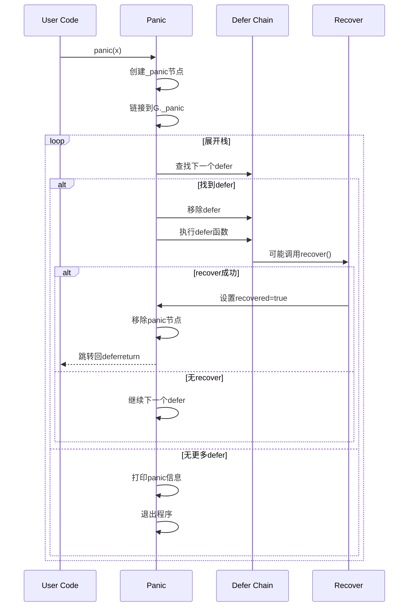

# Go语言源码剖析——Defer/Panic/Recover机制概览

## 模块概述

### 职责定义
Defer/Panic/Recover是Go语言异常处理和资源清理的核心机制：

- **Defer**：延迟函数调用，用于资源清理、解锁等
- **Panic**：触发异常，展开调用栈
- **Recover**：捕获panic，恢复程序执行

这三者配合实现了Go的错误处理模型，替代了传统的try-catch-finally机制。

### 设计哲学

**Defer原则**

- 后进先出（LIFO）：多个defer按相反顺序执行
- 参数立即求值：defer语句执行时就计算参数
- 必定执行：即使panic也会执行

**Panic原则**

- 立即停止当前函数
- 展开调用栈，执行所有defer
- 到达goroutine顶层时终止程序

**Recover原则**

- 只在defer中有效
- 仅捕获当前goroutine的panic
- 返回panic的值

### 两种defer实现

**栈上defer（Stack-allocated defer）**

- 在栈上分配`_defer`结构
- 通过链表连接
- 适用于复杂控制流

**开放编码defer（Open-coded defer）**

- 直接在栈上存储函数和参数
- 使用位图标记哪些defer需要执行
- 适用于简单函数（无循环中的defer）
- 性能优于栈上defer

## 模块架构图

```mermaid
flowchart TB
    subgraph "Defer实现 Defer Implementation"
        OLDDEFER[栈上defer<br/>Stack-allocated]
        OPENDEFER[开放编码defer<br/>Open-coded]
        
        subgraph "栈上defer"
            DEFERCHAIN[defer链表<br/>G._defer]
            DEFERNODE[_defer结构<br/>堆/栈分配]
            DEFERPROC[deferproc<br/>注册defer]
            DEFERRETURN[deferreturn<br/>执行defer]
        end
        
        subgraph "开放编码defer"
            DEFERBITS[deferBits位图<br/>8位标记]
            DEFERSLOTS[栈槽位<br/>函数指针数组]
            INLINEEXEC[内联执行<br/>编译器生成]
        end
        
        OLDDEFER --> DEFERCHAIN
        DEFERCHAIN --> DEFERNODE
        DEFERNODE --> DEFERPROC
        DEFERNODE --> DEFERRETURN
        
        OPENDEFER --> DEFERBITS
        OPENDEFER --> DEFERSLOTS
        OPENDEFER --> INLINEEXEC
    end
    
    subgraph "_defer结构"
        HEAP[heap bool<br/>堆分配标志]
        SP[sp uintptr<br/>栈指针]
        PC[pc uintptr<br/>程序计数器]
        FN[fn func\(\)<br/>延迟函数]
        LINK[link *_defer<br/>链表指针]
        
        DEFERNODE --> HEAP
        DEFERNODE --> SP
        DEFERNODE --> PC
        DEFERNODE --> FN
        DEFERNODE --> LINK
    end
    
    subgraph "Panic实现 Panic Implementation"
        PANICCHAIN[panic链表<br/>G._panic]
        PANICNODE[_panic结构<br/>栈上分配]
        GOPANIC[gopanic<br/>触发panic]
        PANICDEFER[执行defer<br/>展开栈]
        
        PANICCHAIN --> PANICNODE
        GOPANIC --> PANICCHAIN
        GOPANIC --> PANICDEFER
    end
    
    subgraph "_panic结构"
        ARG[arg interface{}<br/>panic值]
        RECOVERED[recovered bool<br/>是否已恢复]
        GOEXIT[goexit bool<br/>Goexit标志]
        PLINK[link *_panic<br/>链表指针]
        STARTPC[startPC uintptr<br/>起始PC]
        STARTSP[startSP uintptr<br/>起始SP]
        
        PANICNODE --> ARG
        PANICNODE --> RECOVERED
        PANICNODE --> GOEXIT
        PANICNODE --> PLINK
    end
    
    subgraph "Recover实现"
        GORECOVER[gorecover<br/>recover函数]
        MARKRECOVERED[标记recovered<br/>设置flag]
        RECOVERY[recovery<br/>恢复执行]
        MCALL[mcall<br/>切换到g0]
        
        GORECOVER --> MARKRECOVERED
        MARKRECOVERED --> RECOVERY
        RECOVERY --> MCALL
    end
    
    subgraph "执行流程"
        NORMALRET[正常返回<br/>Normal Return]
        DEFERCALL[调用defer<br/>Execute Defers]
        PANICPATH[panic路径<br/>Panic Path]
        RECOVERPATH[recover路径<br/>Recover Path]
        
        NORMALRET --> DEFERRETURN
        DEFERRETURN --> DEFERCALL
        
        PANICPATH --> GOPANIC
        GOPANIC --> PANICDEFER
        PANICDEFER -.可能调用.-> GORECOVER
        GORECOVER -.成功.-> RECOVERPATH
        RECOVERPATH --> RECOVERY
    end
    
    DEFERRETURN -.panic时.-> GOPANIC
    PANICDEFER -.逐个执行.-> DEFERCHAIN
    PANICDEFER -.或读取.-> DEFERBITS
```

### 架构图说明

#### _defer结构 - defer节点

```go
type _defer struct {
    heap      bool      // 是否在堆上分配
    rangefunc bool      // 是否用于range-over-func
    sp        uintptr   // defer语句所在的栈指针
    pc        uintptr   // 返回地址
    fn        func()    // 延迟函数（开放编码defer时为nil）
    link      *_defer   // 下一个defer（链表）
    head      *atomic.Pointer[_defer]  // rangefunc的原子链表头
}
```

**字段说明**

- `heap`：true表示在堆上分配，false表示在栈上分配
- `sp`：defer语句执行时的栈指针，用于判断defer归属于哪个函数
- `pc`：defer语句之后的返回地址
- `fn`：要执行的延迟函数（开放编码defer时此字段为nil）
- `link`：指向下一个defer，形成链表

**defer链表**

```
G._defer → defer3 → defer2 → defer1 → nil
（最后注册的defer3最先执行 - LIFO）
```

#### _panic结构 - panic节点

```go
type _panic struct {
    arg       interface{} // panic(x) 的参数x
    link      *_panic     // 链接到更早的panic
    
    pc        uintptr     // 当前unwinding的PC
    sp        unsafe.Pointer // 当前unwinding的SP
    lr        uintptr     // 链接寄存器（用于展开栈）
    fp        unsafe.Pointer // 帧指针
    
    recovered   bool      // panic是否被recover
    goexit      bool      // 是否是runtime.Goexit
    deferreturn bool      // 是否在deferreturn中
    
    // 开放编码defer状态
    retpc        uintptr
    deferBitsPtr *byte
    slotsPtr     unsafe.Pointer
    
    // 跟踪起始位置
    startPC uintptr
    startSP unsafe.Pointer
}
```

**panic链表**

```
G._panic → panic2 → panic1 → nil
（嵌套panic，最新的在前）
```

#### 开放编码defer布局

编译器在栈上分配：

```
|------------------------|
| deferBits (1 byte)     |  位图：每位表示一个defer是否需要执行
|------------------------|
| slot0: func pointer    |  第0个defer的函数指针
| slot1: func pointer    |  第1个defer的函数指针
| ...                    |
| slot7: func pointer    |  第7个defer的函数指针
|------------------------|
```

**deferBits编码**

```
位7 位6 位5 位4 位3 位2 位1 位0
 |   |   |   |   |   |   |   |
 |   |   |   |   |   |   |   └─ defer0是否执行
 |   |   |   |   |   |   └───── defer1是否执行
 |   |   |   |   |   └───────── defer2是否执行
 ...
```

## 核心算法详解

### 1. deferproc() - 注册defer

**编译器生成代码**

```go
// 源代码
func foo() {
    defer bar()
    // ...
}

// 编译器转换（栈上defer）
func foo() {
    // 注册defer
    deferproc(8, bar)  // 8是bar的参数大小
    if deferproc返回非0 {
        return  // 发生panic
    }
    
    // ... 函数体 ...
    
    // 函数返回前
    deferreturn()
    return
}
```

**deferproc核心代码**

```go
func deferproc(fn func()) {
    gp := getg()
    
    // 1. 分配_defer结构（优先从缓存池获取）
    d := newdefer()
    
    // 2. 初始化defer
    d.heap = true  // 堆分配
    d.fn = fn
    d.pc = sys.GetCallerPC()
    d.sp = sys.GetCallerSP()
    
    // 3. 链接到G的defer链表头部
    d.link = gp._defer
    gp._defer = d
    
    return  // 返回0表示成功
}

func newdefer() *_defer {
    var d *_defer
    
    // 尝试从per-P缓存获取
    pp := getg().m.p.ptr()
    if len(pp.deferpool) > 0 {
        d = pp.deferpool[len(pp.deferpool)-1]
        pp.deferpool = pp.deferpool[:len(pp.deferpool)-1]
    }
    
    if d == nil {
        // 从堆分配
        d = new(_defer)
    }
    
    return d
}
```

**算法步骤**

1. 获取当前goroutine
2. 从缓存池或堆分配`_defer`
3. 记录defer函数、PC、SP
4. 插入G的defer链表头部（最后注册的最先执行）

### 2. deferreturn() - 执行defer

**编译器在每个函数出口插入**

```go
func foo() {
    defer bar1()
    defer bar2()
    
    if cond {
        // 出口1
        deferreturn()
        return
    }
    // 出口2
    deferreturn()
    return
}
```

**deferreturn核心代码**

```go
func deferreturn() {
    gp := getg()
    
    // 循环执行当前函数的所有defer
    for {
        d := gp._defer
        if d == nil {
            return  // 没有defer了
        }
        
        // 获取调用者的SP
        sp := sys.GetCallerSP()
        
        // 检查defer是否属于当前函数
        if d.sp != sp {
            return  // 不是当前函数的defer
        }
        
        // 从链表中移除
        fn := d.fn
        gp._defer = d.link
        
        // 回收defer到缓存池
        freedefer(d)
        
        // 执行defer函数
        fn()
        
        // 如果fn()中发生panic，jmpdefer不会返回
    }
}
```

**算法逻辑**

1. 遍历G的defer链表
2. 检查defer的`sp`是否等于当前函数的SP
3. 相等则执行并移除
4. 不相等则停止（属于上层函数）
5. 执行defer可能panic，需要特殊处理

### 3. 开放编码defer

**编译器优化条件**

- 函数中没有defer在循环内
- defer数量≤8
- 函数返回值不含命名返回值（某些情况）

**编译器生成代码**

```go
// 源代码
func foo() {
    defer bar1()
    if cond {
        defer bar2()
    }
    defer bar3()
}

// 编译器转换
func foo() {
    var deferBits byte = 0
    var slot0, slot1, slot2 func()
    
    // defer bar1()
    slot0 = bar1
    deferBits |= 1 << 0
    
    if cond {
        // defer bar2()
        slot1 = bar2
        deferBits |= 1 << 1
    }
    
    // defer bar3()
    slot2 = bar3
    deferBits |= 1 << 2
    
    // 函数返回前，内联执行defer
    if deferBits & (1<<2) != 0 {
        deferBits &^= 1<<2
        slot2()
    }
    if deferBits & (1<<1) != 0 {
        deferBits &^= 1<<1
        slot1()
    }
    if deferBits & (1<<0) != 0 {
        deferBits &^= 1<<0
        slot0()
    }
}
```

**优点**

- 无需分配`_defer`结构
- 无需链表操作
- 性能提升约30%

### 4. gopanic() - 触发panic

**入口函数**

```go
// 用户调用 panic(x)
func gopanic(e interface{}) {
    gp := getg()
    
    // 1. 分配_panic结构（栈上）
    var p _panic
    p.arg = e
    p.link = gp._panic
    gp._panic = &p
    
    // 2. 展开栈，执行defer
    for {
        // 查找下一个defer
        d := gp._defer
        if d == nil {
            break  // 没有更多defer
        }
        
        // 检查defer是否属于当前unwinding范围
        if d.sp < uintptr(unsafe.Pointer(&p)) {
            break
        }
        
        // 从链表移除
        gp._defer = d.link
        fn := d.fn
        
        // 标记正在执行defer
        p.argp = unsafe.Pointer(getargp())
        
        // 执行defer函数
        fn()
        
        // 检查是否被recover
        if p.recovered {
            // recover成功，恢复执行
            gp._panic = p.link
            recoveryJmp(&p)  // 跳转回deferreturn
            // 不返回
        }
        
        // 释放defer
        freedefer(d)
    }
    
    // 3. 没有recover，打印panic信息并退出
    fatalpanic(gp._panic)  // 不返回
}
```

**展开栈的过程**



### 5. gorecover() - 恢复panic

**recover语义**

```go
// recover只在defer中有效
func foo() {
    recover()  // 无效，返回nil
    
    defer func() {
        recover()  // 有效，捕获panic
    }()
    
    panic("oops")
}
```

**gorecover核心代码**

```go
func gorecover(argp uintptr) interface{} {
    gp := getg()
    p := gp._panic
    
    // 1. 检查是否在defer中调用
    if p == nil {
        return nil  // 没有panic
    }
    
    // 2. 检查是否从正确的defer调用
    if p.argp != uintptr(argp) {
        return nil  // 不是当前执行的defer
    }
    
    // 3. 检查panic是否已被recover
    if p.recovered {
        throw("panic recovered twice")
    }
    
    // 4. 标记panic已被recover
    p.recovered = true
    
    // 5. 返回panic值
    return p.arg
}
```

**recover条件**

1. 在defer函数中调用
2. 对应当前正在处理的panic
3. panic未被其他defer recover

**recovery() - 恢复执行**

```go
// 从gopanic跳转到这里
func recovery(gp *g) {
    p := gp._panic
    
    // 1. 找到deferreturn的PC
    sp, pc := uintptr(p.sp), p.pc
    f := findfunc(pc)
    deferreturnPC := f.entry() + uintptr(f.deferreturn)
    
    // 2. 清理panic链表
    for ; p != nil && uintptr(p.startSP) < sp; p = p.link {
        if p.goexit {
            // 遇到Goexit，特殊处理
            sp = uintptr(p.startSP)
            break
        }
    }
    gp._panic = p
    
    // 3. 恢复寄存器并跳转回deferreturn
    gogo(&gp.sched)  // 跳转到deferreturnPC
}
```

### 6. 开放编码defer的panic处理

**编译器生成funcdata**

编译器为每个使用开放编码defer的函数生成额外的元数据：

```go
type openDeferInfo struct {
    deferBitsOffset uintptr  // deferBits在栈帧中的偏移
    slotsOffset     uintptr  // defer槽位的偏移
}
```

**panic时读取开放编码defer**

```go
func (p *_panic) nextDefer() (func(), bool) {
    // 检查开放编码defer
    if p.deferBitsPtr != nil {
        bits := *p.deferBitsPtr
        
        // 查找最高位
        if bits != 0 {
            i := 7 - sys.LeadingZeros8(bits)
            
            // 清除该位
            bits &^= 1 << i
            *p.deferBitsPtr = bits
            
            // 返回对应的函数
            fn := *(*func())(add(p.slotsPtr, i*goarch.PtrSize))
            return fn, true
        }
    }
    
    // 检查栈上defer链表
    d := gp._defer
    if d != nil && d.sp == p.sp {
        // ...
    }
    
    return nil, false
}
```

## 性能优化

### 1. defer性能对比

**性能测试**

```go
// 无defer
func noDeferBench() {
    mu.Lock()
    mu.Unlock()
}

// 栈上defer
func stackDeferBench() {
    mu.Lock()
    defer mu.Unlock()
}

// 开放编码defer
func openDeferBench() {
    mu.Lock()
    defer mu.Unlock()
    // 简单函数，无循环
}
```

**相对性能**（相对于无defer）

```
无defer：            1x
开放编码defer：      ~1.3x
栈上defer：          ~3-4x
```

### 2. defer缓存池

**per-P缓存**

```go
type p struct {
    deferpool []*_defer  // 最多缓存5个
}

func freedefer(d *_defer) {
    // 清空字段
    d.fn = nil
    d.link = nil
    
    // 放回缓存池
    pp := getg().m.p.ptr()
    if len(pp.deferpool) < 5 {
        pp.deferpool = append(pp.deferpool, d)
    }
}
```

**减少分配**

- 每个P缓存5个`_defer`
- 避免频繁堆分配
- 减少GC压力

### 3. 参数求值优化

```go
// 参数立即求值
func foo() {
    x := 10
    defer fmt.Println(x)  // x=10被立即捕获
    x = 20
    // 输出：10（不是20）
}

// 使用闭包延迟求值
func bar() {
    x := 10
    defer func() {
        fmt.Println(x)  // 闭包捕获x的引用
    }()
    x = 20
    // 输出：20
}
```

## 最佳实践

### 1. 资源清理

```go
// 推荐：使用defer清理资源
func readFile(filename string) error {
    f, err := os.Open(filename)
    if err != nil {
        return err
    }
    defer f.Close()  // 确保文件关闭
    
    // 读取文件...
    return nil
}
```

### 2. 锁的释放

```go
// 推荐：defer释放锁
func updateMap(m map[string]int, key string, value int) {
    mu.Lock()
    defer mu.Unlock()
    
    m[key] = value
    // 即使panic，锁也会释放
}
```

### 3. panic与recover

```go
// 推荐：在goroutine中捕获panic
func worker() {
    defer func() {
        if r := recover(); r != nil {
            log.Printf("worker panic: %v\n%s", r, debug.Stack())
            // 上报错误、清理资源等
        }
    }()
    
    // 工作代码...
}
```

### 4. 避免defer的陷阱

**循环中的defer**

```go
// 不推荐：循环中使用defer
func processFiles(files []string) {
    for _, file := range files {
        f, _ := os.Open(file)
        defer f.Close()  // 所有defer在函数结束时才执行！
        // 可能打开过多文件
    }
}

// 推荐：使用匿名函数
func processFiles(files []string) {
    for _, file := range files {
        func() {
            f, _ := os.Open(file)
            defer f.Close()  // 每次循环结束时执行
            // 处理文件
        }()
    }
}
```

**defer与命名返回值**

```go
// 注意：defer可以修改命名返回值
func foo() (result int) {
    defer func() {
        result++  // 修改返回值
    }()
    return 42  // 返回43
}

// 陷阱：指针问题
func bar() (*int, error) {
    var p *int
    defer func() {
        p = new(int)  // defer修改局部变量
        *p = 42
    }()
    return p, nil  // 返回nil！（defer在return之后执行）
}

// 正确写法
func baz() (p *int, err error) {
    defer func() {
        p = new(int)  // 修改命名返回值
        *p = 42
    }()
    return  // 返回&42
}
```

### 5. 性能敏感场景

```go
// 性能敏感：避免defer
func hotPath() {
    mu.Lock()
    // 快速路径
    if fastCheck() {
        mu.Unlock()
        return
    }
    
    // 慢速路径
    defer mu.Unlock()
    slowOperation()
}

// 或者：条件性defer
func conditionalDefer() {
    mu.Lock()
    needUnlock := true
    defer func() {
        if needUnlock {
            mu.Unlock()
        }
    }()
    
    if earlyExit() {
        mu.Unlock()
        needUnlock = false
        return
    }
    
    // 其他代码...
}
```

### 6. panic传播

```go
// 不推荐：吞掉panic
func bad() {
    defer func() {
        recover()  // 忽略panic
    }()
    // ...
}

// 推荐：记录并重新panic
func good() {
    defer func() {
        if r := recover(); r != nil {
            log.Printf("panic: %v", r)
            panic(r)  // 重新抛出
        }
    }()
    // ...
}

// 或：转换为error
func better() (err error) {
    defer func() {
        if r := recover(); r != nil {
            err = fmt.Errorf("panic: %v", r)
        }
    }()
    // ...
    return nil
}
```

## 典型应用场景

### 1. HTTP服务器错误处理

```go
func middleware(next http.Handler) http.Handler {
    return http.HandlerFunc(func(w http.ResponseWriter, r *http.Request) {
        defer func() {
            if r := recover(); r != nil {
                log.Printf("panic: %v\n%s", r, debug.Stack())
                http.Error(w, "Internal Server Error", 500)
            }
        }()
        
        next.ServeHTTP(w, r)
    })
}
```

### 2. 数据库事务

```go
func updateDB(db *sql.DB) error {
    tx, err := db.Begin()
    if err != nil {
        return err
    }
    
    defer func() {
        if p := recover(); p != nil {
            tx.Rollback()
            panic(p)  // 重新抛出
        } else if err != nil {
            tx.Rollback()
        } else {
            err = tx.Commit()
        }
    }()
    
    // 数据库操作...
    return nil
}
```

### 3. 性能监控

```go
func measureTime(name string) func() {
    start := time.Now()
    return func() {
        duration := time.Since(start)
        log.Printf("%s took %v", name, duration)
    }
}

func operation() {
    defer measureTime("operation")()
    // 操作...
}
```

---

*详细的API文档、数据结构和时序图请参阅后续文档。*
